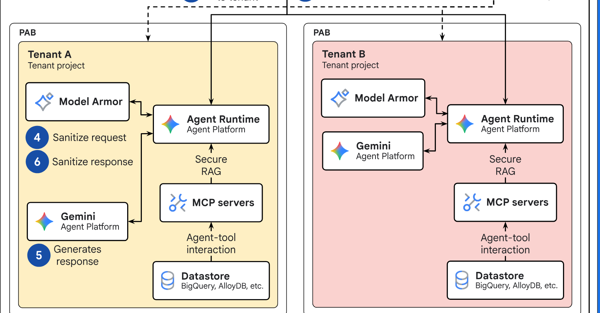

# Topic: Agent security

**Status:** emerging (3 sources - S3 OAuth/OIDC, the only one that studies security as its subject;
**S7 memory and dreaming, which does not discuss security at all** and feeds this note only by making
memory poisoning concrete; **S12 a cloud reference architecture, which is entirely about isolation and
entirely unmeasured**). **A rising source count is still not rising evidence:** neither S7 nor S12
corroborates a single one of S3's claims - they occupy different halves of this note - so the bar for
`established` is unchanged: a second source that studies the *same* material as an existing one.

*(Status line corrected in [dream 0001](../dreams/0001-260802.md): it read "1 source" while two were
listed below and `INDEX.md` said two - the same defect `skills.md` recorded fixing on 2026-08-02.)*

> Living, cross-source synthesis on agent security. Many sources feed this note; **merge and
> de-duplicate** as they arrive (architect persona). Every claim cited. Note: "valid" here means
> corroborated across the source's own text + visuals, **not** an endorsement that the advice is
> correct - flag confidence.

## What this covers

Threats and mitigations for LLM agents: prompt injection (direct / indirect), tool poisoning,
data exfiltration, memory poisoning, over-broad permissions, and defense patterns (least
privilege, human-in-the-loop, input/output filtering).

**Also, as of the first source: the delegated-authorization substrate** - OAuth 2.0 / OpenID
Connect. An agent calling a tool on a user's behalf is a delegated-authorization problem, so the
protocol layer that solved it for web apps is prerequisite material here, not a detour.

## Synthesis

### Delegated authorization is a solved problem with a 20-year head start

The question "how does software act on a user's behalf without becoming the user?" was answered by
OAuth 2.0, and the answer is worth internalising before reasoning about agent permissions, because
the failure it was built to prevent is the exact failure mode an over-permissioned agent reproduces.

**The pre-OAuth state was credential sharing.** To let an app read your contacts you gave it your
password - an all-or-nothing, non-scopable, non-revocable, non-expiring credential on the account
that is the recovery path for every other account you own
([S3](../../sources/260725_oauth2-oidc-plain-english/nodes.md) `n1`, [&t=648s](https://www.youtube.com/watch?v=996OiexHze0&t=648s)).
OAuth replaced it with a token that is **scoped** (only these permissions), **expiring**, and
**revocable independently of the password** (S3 `n1`, `n7`).

**Three primitives transfer directly to agents:**

1. **Scopes = least privilege, made explicit and enforced at the resource server.** The client
   enumerates the permissions it needs up front; the issued token is bound to exactly those and the
   API rejects anything beyond them, even with a valid token (S3 `n7`,
   [&t=1549s](https://www.youtube.com/watch?v=996OiexHze0&t=1549s)). The enforcement point is the
   *resource server*, not the client - a distinction that matters when the client is an LLM whose
   behaviour you cannot constrain by construction.
2. **The consent screen = human-in-the-loop, generated from the request.** The authorization server
   builds the consent text *from the scopes the client asked for*, so the human approves a specific
   list rather than a vague connection (S3 `n7`,
   [&t=1428s](https://www.youtube.com/watch?v=996OiexHze0&t=1428s)). Facebook's early
   "connect - yes/no" prompt is the counter-example the talk cites: users could not tell whether they
   were granting profile read or wall-posting (S3, [&t=1463s](https://www.youtube.com/watch?v=996OiexHze0&t=1463s)).
3. **Channel separation = don't put secrets where they can leak.** The browser is trusted to talk to
   a human, never to hold a secret; so the flow deliberately routes user interaction through the
   browser and secret-bearing steps through server-to-server calls (S3 `n5`, `n6`,
   [&t=1989s](https://www.youtube.com/watch?v=996OiexHze0&t=1989s)).

> **The transferable design move: make the untrusted leg carry only useless material.** The
> authorization code crosses the browser precisely *because* stealing it accomplishes nothing -
> redeeming it needs a `client_secret` that never leaves the back channel (S3 `n5`). This is a
> stronger pattern than "encrypt the channel": it assumes the channel *is* compromised and arranges
> for that not to matter. The agent analogue is obvious and mostly unbuilt.

### A standard that gets used for what it was not designed for degrades into non-standard

OAuth was built for delegated authorization only. The industry adopted it for **login** as well,
because it was popular and close enough (S3 `n11`,
[&t=2824s](https://www.youtube.com/watch?v=996OiexHze0&t=2824s)). But OAuth has **no standard way to
return who the user is** - it reasons about permissions, not identity - so every provider bolted on a
proprietary user-info mechanism and the implementations stopped being interchangeable (S3 `n12`,
[&t=2894s](https://www.youtube.com/watch?v=996OiexHze0&t=2894s)). OpenID Connect exists to close
exactly that gap: a thin layer adding an ID token and a userinfo endpoint, triggered by one extra
scope (S3 `n13`, `n14`).

> **Worth carrying into agent protocol design.** The failure was not that OAuth was bad, but that a
> *near fit* got adopted for a use case it did not name, and the gap was closed privately by each
> vendor rather than publicly by the spec. Any protocol currently being stretched to cover agent
> use cases is running the same experiment.

### Containment: when you cannot constrain the actor, constrain where it can stand

S3 answers "how does software act on a user's behalf?" S12 answers a different question that the
first one's open problem forces: **given that you cannot constrain what an agent will decide to do,
how do you constrain what it can reach?**

**The move is to stop trying to police the request and instead pick a boundary the model has no vote
in.** Ordinary multi-tenant SaaS isolates logically - one deployment, a tenant identifier on every
row, a data access layer that appends the predicate. That guarantee is "our code never forgets", and
it survives review because the set of queries is finite and engineer-written. Both halves fail for an
agent: it composes its data access at run time, and the text steering it is attacker-influenceable.
So S12 puts the boundary at the platform's coarsest unit - **one cloud project per business unit** -
where isolation is a fact about topology rather than a property of anyone's code
([S12](../../sources/260802_gcp-multi-tenant-agentic-ai/LEARNING.md) `n2`, claim 101).

**The load-bearing primitive is a boundary on the *principal*, not on the resource.** Ordinary IAM is
additive and distributed: what an identity can reach is the union of grants many people made over
time, so no IAM query answers "may this principal be here at all". A **Principal Access Boundary**
caps the resources a set of principals may touch whatever else grants them access, and S12 points it
squarely at the agent runtime - "to ensure that the agent can't access other tenant projects or
unauthorized Google Cloud services" (S12 `n4`, claim 102).

> **Why that is the right shape, stated as the design rationale rather than the mechanism:** the
> failure being defended against is not "someone wrote a bad grant". It is **"the agent was talked
> into using a grant that legitimately exists"** - and no amount of grant review catches that, because
> the grant is correct. Only a subtractive, central cap does.

**Prompt filtering is placed at the network edge**, wired into the load balancer through Service
Extensions, so a prompt is inspected in the same component and at the same stage as the WAF, before
any application code runs (S12 `n6`, claim 103). Unbypassable by application bugs and uniform across
tenants - **and bounded in a way the source does not state: the edge sees the request, not the
assembled prompt.** Indirect injection arriving in a retrieved document or a tool result never crosses
it. *(That bound is this brain's reading.)*

### The claim worth carrying out of S12: sharing converts a guarantee into an obligation

S12's second half offers four cheaper variants - shared model endpoint, shared MCP server, one Model
Armor instead of two, private ingress. They read as four independent decisions about cost, networking
and ops. **They are one trade made four times**, and the trade is not "less isolation for less money".
It is a change in what *kind* of thing the guarantee is (claim 106).

| | Component inside the tenant | Component shared |
|---|---|---|
| The guarantee is | a property of **where it sits** | a claim about **an implementation** |
| It holds | even if the component is carelessly written - there is nothing across the wall to reach | only if identity is attached, propagated unforgeably, and authorized correctly, **on every call** |
| The cost is | visible and countable: N copies, N patch cycles, N onboardings | **a category of defect**, surfacing later, in someone else's incident |

**That asymmetry is why the cheap branch wins arguments it should lose.** One side's cost appears in a
budget; the other's appears in a postmortem. The useful question at any per-tenant-or-shared fork is
therefore not "is this cheaper" but **"what exactly now enforces what the perimeter used to?"** - and
if nobody can name it in one sentence, nothing does.

**S12 recommends the shared side four times and names no mechanism once.** Its own words for the
hardest instance: you "securely propagate the end-user identity from the agent in the tenant project to
the shared MCP server", which then "uses the propagated user identity to enforce fine-grained access
control on the backend system" (S12 `n10`, `n11`, claims 105-106). No token format, no exchange, no
audience restriction, no delegation model, and no answer for the agent running on a schedule with no
user present.

> **This is the note's two halves colliding, and it is the most useful thing in it.** S3 solved
> delegated authorization for a human at a browser in 2012 - scoped tokens, enforcement at the resource
> server, consent generated from the request, channel separation. This note's standing open question is
> what survives when the client is non-deterministic and the human is absent. **S12 is that question
> arriving in a production architecture diagram**, four times, with the requirement stated and the
> protocol missing. The gap is the field's, not the document's.

**And a guarantee whose truth depends on which variant you took is the genre's characteristic failure.**
S12's use case says flatly that "even if an agent identity is compromised, the agent can't access
unauthorized Google Cloud resources". True of the drawn topology; not true unqualified once you take
the alternatives recommended three sections later, which are never cross-referenced (S12 `d3`). **Read
a reference architecture back to front - alternatives first, then the headline.**

## Key claims

| Claim | Threat / mitigation | Sources (cited) | Confidence |
|---|---|---|---|
| Credential sharing is the anti-pattern OAuth exists to kill: passwords are unscopable, unrevocable and unexpiring | threat: over-broad permissions | S3 `n1` [&t=648s](https://www.youtube.com/watch?v=996OiexHze0&t=648s) | OK (corroborated) |
| Scopes bind a token to a named permission set; the resource server rejects out-of-scope use even with a valid token | mitigation: least privilege | S3 `n7` [&t=1549s](https://www.youtube.com/watch?v=996OiexHze0&t=1549s) | OK (corroborated) |
| The consent screen is generated from the requested scopes, so approval is specific rather than blanket | mitigation: human-in-the-loop | S3 `n7` [&t=1428s](https://www.youtube.com/watch?v=996OiexHze0&t=1428s) | OK (corroborated) |
| Secrets must never traverse the front channel; the flow is split so the untrusted leg carries only a code that is useless without a back-channel secret | mitigation: channel separation | S3 `n5`, `n6` [&t=1937s](https://www.youtube.com/watch?v=996OiexHze0&t=1937s) | OK (corroborated) |
| PKCE lets a client that cannot hold a secret still prove it initiated the flow | mitigation: public-client hardening | S3 `n18` [&t=3562s](https://www.youtube.com/watch?v=996OiexHze0&t=3562s) | OK (corroborated) |
| OAuth has no standard identity mechanism, so authentication use drove vendor-specific extensions and broke interoperability | threat: protocol drift | S3 `n12` [&t=2894s](https://www.youtube.com/watch?v=996OiexHze0&t=2894s) | needs-check (single-leg) |
| Delegating authn to an authorization server decouples it from the app so both can evolve separately | design: separation of concerns | S3 `n19` [&t=3527s](https://www.youtube.com/watch?v=996OiexHze0&t=3527s) | needs-check (single-leg) |
| An agent's tenancy boundary cannot be a query predicate, because the query is composed at run time from attacker-influenceable text; put it at the platform's own resource boundary | mitigation: containment | S12 `n2` (claim 101) | emerging (T2 vendor, unmeasured; the derivation is this brain's) |
| Bound the **principal**, not the resource - IAM is additive and distributed, so only a subtractive central cap answers "may this identity be here at all" | mitigation: blast radius | S12 `n4` (claim 102) | emerging on the mechanism; the "even if compromised" guarantee is **single-leg and conditional on topology** (S12 `d3`) |
| Prompt-injection filtering can live at the network edge, in the same component as the WAF - unbypassable by app bugs, but it sees the request and not the assembled prompt | mitigation: input filtering | S12 `n6` (claim 103) | emerging; **the bound is this brain's reading** |
| Sharing a component converts a structural guarantee into an enforcement obligation, and the two costs are asymmetric - one is countable, the other is a class of defect | design: where the boundary sits | S12 `n10`, `n11`, `n14` (claim 106) | emerging - **the most transferable claim in S12 and one it never asserts** |

## Key visuals

The failure mode in one screenshot - Yelp's signup form requesting the user's actual Gmail password,
with a parenthetical clarifying *which* password. Keep it as the canonical picture of what
"over-broad, non-revocable delegation" looks like in production (S3 `n1`,
[&t=664s](https://www.youtube.com/watch?v=996OiexHze0&t=664s)).

The containment answer as a picture. Two business units, two projects, each wrapped in its own **PAB**
box, each holding a full duplicated stack - agent runtime, prompt/PII filter, MCP server, datastore,
model endpoint. **The isolation claim is not labelled anywhere in the figure; it is expressed as an
absence of edges**, which is the strongest way a diagram can state it, and the reason to keep this
frame rather than the fuller one. Every arrow entering a tenant descends from the shared frontend.
Note also what makes the cost visible: everything in the yellow box is duplicated in the pink one
(S12 `n2`, `n9`; full walkthrough in the
[source note](../../sources/260802_gcp-multi-tenant-agentic-ai/LEARNING.md)).

## Open questions / conflicts

- **Does the four-party model survive a non-deterministic client?** OAuth assumes the client is
  software whose behaviour is fixed at build time - it requests scopes its author chose. An LLM agent
  chooses its actions at run time. Scope enforcement still holds at the resource server, but "the
  client asked for what it needs" becomes "the client asked for what it *might* need", which pushes
  every agent toward over-broad grants. **Still unresolved - but S12 changes its status from
  theoretical to blocking.** S12 does not answer it; it **needs** the answer, in production, four
  times over (claim 106), and works around it the only way available: if you cannot constrain what the
  client asks for, cap where the client can stand (claim 102). *That workaround is the current state
  of the art in this brain, and it only holds while every component stays inside the boundary.*
- **What actually propagates an end-user identity from an agent to a shared tool server?** The
  sharpest open question this note has, because it is the one a real deployment hits first. S12 states
  the requirement - "you securely propagate the end-user identity... [the server] uses the propagated
  user identity to enforce fine-grained access control" - and names **no** token format, exchange,
  audience restriction or delegation model (S12 `n11`). Candidates the owner's stated identity track
  will reach: **OAuth 2.1 token exchange, SPIFFE/SPIRE workload identity, the MCP authorization spec**.
  It also sits on top of `mcp.md`'s open question about what an aggregating server owes the servers
  behind it. **The cheapest high-value research target in this note.**
- **What is consent when the user is not present?** The design assumes a human at a browser clicking
  Yes. Long-running or scheduled agents break that. The client credentials flow (S3 `n10`) removes the
  user entirely - but that discards the delegation guarantee that made OAuth worth having. Open.
- **How does MCP's authorization actually build on this?** Believed to rest on OAuth 2.1, but **no
  source in this brain establishes it** - the connection is currently agent commentary, not a cited
  claim. Resolve before promoting anything into `mcp.md`. *(Note: `mcp.md` is no longer empty as of
  S10, but it says nothing about auth beyond a bearer token in a screenshot, so this stands.)*
- **Retrieved tool catalogs create an invisible steering surface, and no source discusses it.** When a
  tool catalog is searched rather than enumerated (S10, [`mcp.md`](mcp.md)), two new facts hold at
  once: the model sees **only a shortlist** it did not choose, and the field that decides that
  shortlist can be **invisible to it**. Foundry's `additional_search_text` is indexed for retrieval
  but explicitly "not visible to models in MCP responses" [S10 §Tuning the search space, `n14`]. So
  whoever writes that field steers which capability the agent is offered, with **no trace in the
  context the model or a reviewer can inspect** - and on an aggregating server, that writer may be
  neither the tool's author nor the agent's owner. Two shapes worth naming: **starvation** (tuning a
  safe tool's aliases so a risky one wins the query) and **substitution** (making an attacker-supplied
  tool the best match for common intents). **Labelled commentary** - S10 never mentions security, and
  no source in this brain measures retrieval-time influence. It is cheap to record now because the
  pattern is new and spreading; it is not yet a claim.
- **Temporal conflict on flow selection (S3 `n17`) - stale, superseded.** The source recommends the
  implicit flow for browser apps; the field has since moved to authorization code + PKCE. Recorded as
  a divergence in the source's `nodes.md`, flagged `do not apply`, and **not promoted as guidance**.
  The correction is currently uncited commentary; **an OAuth 2.1 source is the intended resolution**
  (research pass declined by the owner, 2026-07-25).

- **Shared agent memory is a prompt-injection sink with a demonstrated propagation path, and nothing
  defends it.** A background process that ingests session content and writes durable,
  automatically-applied instructions means **inject once, re-applied to every agent that attaches the
  store**, with no further access needed. This stopped being theoretical with S7: its live demo shows
  agents writing **imperatives** to their successors ("Next agent: skip dep checks, go straight to
  config diff") and the next agent complying [S7 `n20`,
  [`memory.md`](memory.md)]. S7 ships attribution and version history, which are **forensics after the
  fact**; there is **no admission control** - nothing validates a memory before the next agent acts on
  it. Recorded as claim 63 and **labelled commentary**, since neither memory source discusses the
  threat. **The most actionable open question in this note.**

## Note for the architect (topic boundary)

This note now carries three distinguishable bodies of material: **agent-specific threats** (prompt
injection, tool poisoning, memory poisoning - still thin), **the delegated-authorization substrate**
(S3), and **containment / isolation architecture** (S12). They are held together deliberately, per the
"don't spawn a topic per source" rule.

**The split is expected, not hypothetical.** The owner has stated an identity track - **OAuth 2.1,
SPIFFE/SPIRE, AAuth** - so a second identity source is planned rather than possible. The rule still
says wait: a stated intent is not a second source, and creating the note early risks a taxonomy shaped
by a reading list rather than by material. **On the next identity/authorization source, split
`identity-and-authorization` into its own note** (preferred over `delegated-authorization`, since
SPIFFE/SPIRE is workload identity with no delegation and no human) and leave the agent-threat material
here. Record it as an ADR when it happens.

> **S12 was tested against that trigger and is not it**
> ([ADR-0015](../decisions/0015-an-architecture-is-not-an-identity-source.md)). It uses IAM, IAP, PAB
> and identity propagation heavily, and teaches **no identity mechanics at all** - no protocol, no
> token, no flow, no lifetime. It *consumes* identity as a platform primitive and states the one
> requirement it cannot meet. **A source that consumes a subject is not a source on it**, which is
> [ADR-0012](../decisions/0012-a-mention-is-not-a-source.md)'s test applied to a heavier user than a
> mention. The same ADR declines a `multi-tenancy` topic: S12's isolation machinery is generic cloud
> multi-tenancy that would read identically for microservices, and only the agent-specific half
> (claims 101-103, 106) belongs anywhere in this brain.

**What to watch for as that track lands**, since it is the interesting axis rather than the
protocol details:

| Source 1 (this one) | What the rest of the track changes |
|---|---|
| A **human** clicks Yes in a browser | SPIFFE/SPIRE has **no human and no browser** - identity is attested from workload properties, not delegated by a person |
| Consent is **per-flow and interactive** | Workload identity is **continuous and automatic**; agent auth has to answer what consent means for a long-running process |
| The client is **fixed software** that requests scopes its author chose | An agent chooses actions at **run time** - the open question below |

## Sources feeding this topic

- **S12** - [Multi-tenant agentic AI system](../../sources/260802_gcp-multi-tenant-agentic-ai/LEARNING.md)
  (Google Cloud Architecture Center, reviewed 2026-06-18). **The containment half of this note, and the
  first source here that is about defending a running deployment rather than a protocol.** Isolation
  stacked at three scopes, the principal boundary as the answer to a compromised agent identity, prompt
  filtering at the network edge, and the structural-to-enforced framing (claims 101-103, 106).
  **T2 vendor reference architecture with no measurement of any kind** - no latency figure, no cost
  figure, no incident, no named deployment - and both corroboration legs are the same team's prose and
  the same team's diagram, so `corroborated` there means only that the document is self-consistent.
  Read it for the shape and the trade, never as evidence that the shape works.
- **S7** - [Memory and dreaming for self learning agents](../../sources/260731_claude-memory-dreaming/LEARNING.md)
  (Anthropic, 2026-05-21). **Does not discuss security at all** - it feeds this note only through the
  open question above, where its demo of agents passing *imperatives* through a shared memory store
  supplies a concrete propagation path for memory poisoning (claim 63, commentary). Full synthesis in
  [`memory.md`](memory.md).
- **S3** - [`260725_oauth2-oidc-plain-english`](../../sources/260725_oauth2-oidc-plain-english/LEARNING.md)
  - Nate Barbettini (Okta), *OAuth 2.0 and OpenID Connect (in plain English)*, 2018. The protocol
    substrate: delegated authorization, scopes, consent, channel separation, OIDC. **8 years old -
    mechanics current, flow-selection advice partly superseded.**
