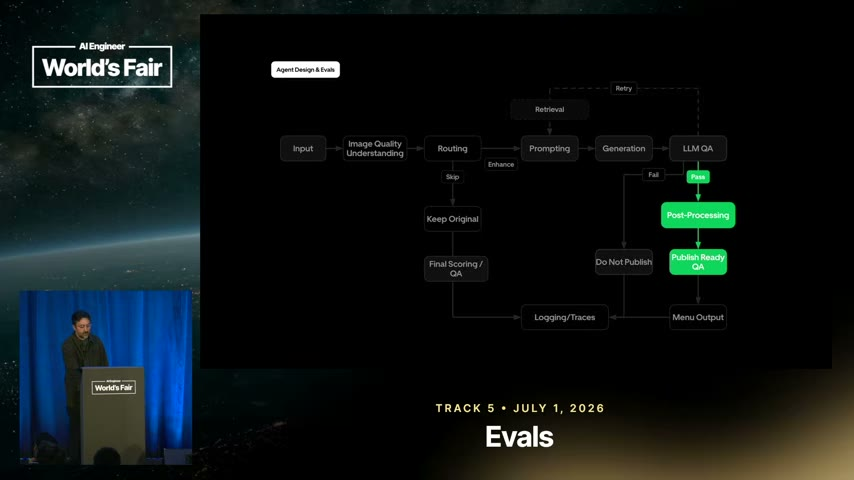
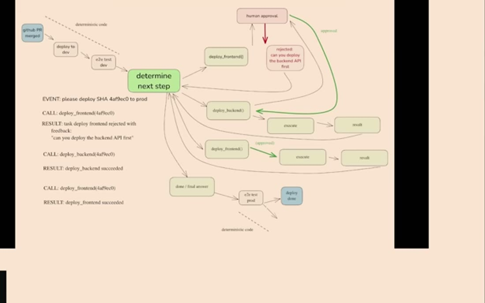
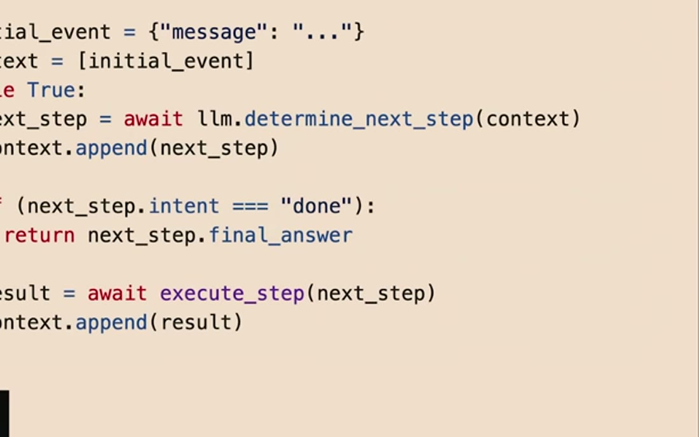
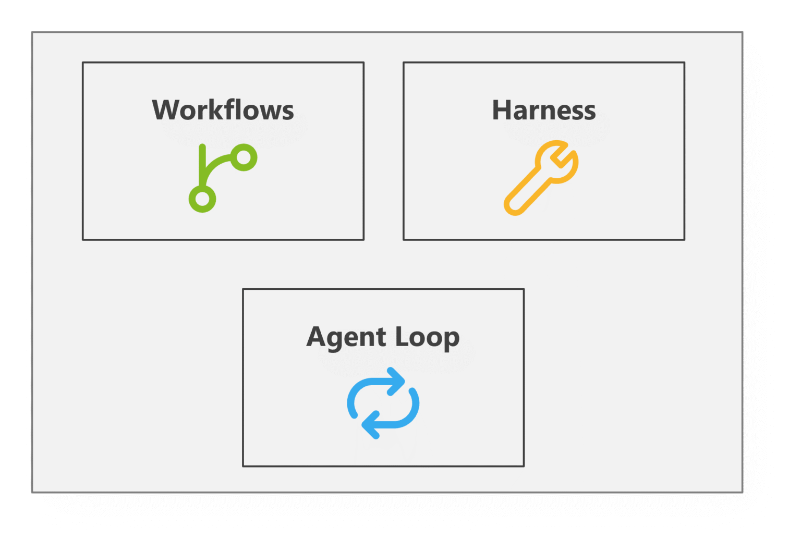
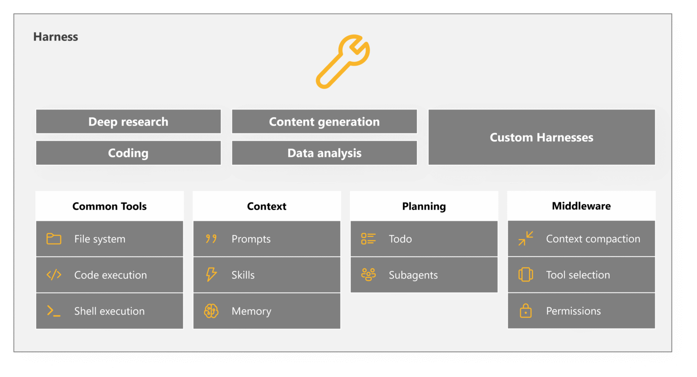

# Topic: Agents

**Status:** established (11 sources / **10 independent** - S1 Uber closed-loop evals, S2 12-factor
agents, S4 Anthropic harness design, S5 skills evals, S7 Anthropic memory and dreaming, S9 Microsoft
Agent Framework, S10 tool search, S12 Google Cloud multi-tenant reference architecture, S13
`karpathy/autoresearch`, S14 Stanford CS329A, **S15 CS329A lecture 2 - not independent of S14**,
S17 indirect prompt injection, S18 CaMeL, S20 AgentDojo)

> **On S17's admission here, since its sibling S16 was declined.** S16 (AgentPoison) attacks a
> retrieval store, which is a *component*, and was kept out of this note under
> [ADR-0012](../decisions/0012-a-mention-is-not-a-source.md) rather than inflate the count for a
> mention. S17 is admitted because claim 147 is a statement about **agent capability itself** - the
> attacker supplies the goal and the agent's own planning supplies the method - which is a property of
> the loop this note describes, not of any security control. Its threat material stays in
> [`agent-security.md`](agent-security.md).

> Living, cross-source synthesis on autonomous LLM agents. Many sources feed this note; **merge
> and de-duplicate** as they arrive (architect persona) - this should read as one coherent view,
> not stacked summaries. Every claim cited.

## What this covers

Autonomous LLM agents: the agent loop (perceive -> plan -> act -> observe), tool use, memory,
planning strategies, multi-agent patterns, control flow and state, and failure modes.

> Context-window ownership - how you decide which tokens reach the model - has grown into its own
> note: see [`context-engineering.md`](context-engineering.md). Evaluation of these pipelines is
> also its own topic: see [`evals.md`](evals.md). **Agents that run an unattended experiment loop
> over an artifact** now have their own note too:
> [`autonomous-research-loops.md`](autonomous-research-loops.md)
> ([ADR-0017](../decisions/0017-autonomous-research-loops-topic.md)) - which is where claims 7 and 10
> below (closed-loop auto-tuning, self-tuning agents) find the rest of their family.

## Synthesis

### What an agent actually is

Strip the mystique and an agent is **four owned parts**: a prompt that instructs the model how to
select the next step, a switch statement that dispatches on the model's JSON, a context-window
builder, and a loop with explicit exit conditions [S2 `&t=406s`]. Reliability problems tend to trace
back to a framework owning one of those four instead of you - the "70-80% wall", where the last 20%
of quality means being seven layers deep in a call stack reverse-engineering how the prompt was
built [S2 `&t=37s`].

The enabling capability underneath is narrower than it looks: an LLM turning a sentence into
**structured JSON** matching a schema you defined [S2 `&t=229s`]. "Tool use" adds nothing magical on
top - the model emits JSON, deterministic code switches on it, a result may be fed back. S2 pushes
this deliberately hard ("tool use is harmful", echoing Dijkstra) because treating tool use as an
ethereal entity acting on the world is what makes it undebuggable [S2 `&t=264s`].

### The shape that works in production: small islands in a deterministic sea

Both sources land on the same structural answer from opposite directions.

- **S2, from first principles:** the naive loop - event -> prompt -> pick next step -> append result
  -> repeat - materialises a DAG at runtime but **breaks down on longer workflows**, mainly because
  the context window grows unboundedly [S2 `&t=371s`]. What works instead is **micro agents**: a
  mostly deterministic pipeline with agent loops of **3-10 steps** at the genuinely ambiguous points,
  handing control back to ordinary code afterwards [S2 `&t=741s`].
- **S1, from production practice:** an agent "product" is a **routed pipeline of small,
  single-purpose agents** (image-understanding -> router -> prompt-gen -> generation -> QA gates ->
  post-processing), each independently evaluable, the whole orchestration logged to one flat trace
  [S1 `&t=376s`].

**These agree, and that convergence is the most load-bearing claim in this note**: nobody who ships
agents at scale ships one big autonomous loop. They ship small, scoped, individually-evaluable LLM
steps inside deterministic software. S1's spectrum framing - deterministic/brittle at one end,
unconstrained/unsafe at the other, with a **guardrailed middle** as the target [S1 `&t=251s`] - is
the same claim stated as a design space.

**And it is now measured, not just twice-asserted** [R1]. "Beyond pass@1" names task decomposition
the **highest-leverage reliability intervention**, quantified across 10 open-source models:
**+13.1 pp (DeepSeek V3)** and **+41.5 pp (Qwen3 30B)** reliability gain from splitting a long task
into short segments and restarting the agent at each boundary
([arXiv 2603.29231](https://arxiv.org/abs/2603.29231), T3 preprint). Anthropic reports the same shape
from its own deployments: the most successful implementations "weren't using complex frameworks or
specialized libraries. Instead, they were building with simple, composable patterns"
([Building effective agents](https://www.anthropic.com/engineering/building-effective-agents), T2).

> **The boundary the same paper draws - and S2 misses.** Decomposition helps; *memory scaffolding*
> does not. A naive episodic memory scaffold "never improves long-horizon reliability, and hurts 6 of
> 10 models" - plain ReAct beat it. The defensible move is **decompose and keep each segment short**,
> not **remember more**. Check any future "give the agent better memory" claim against this. [R1]

The expected trajectory is not a jump to full autonomy but **starting deterministic and sprinkling
LLM steps in**, widening their scope as models improve - while still doing the engineering to hit
quality at each stage [S2 `&t=814s`].

### State, control flow and pausing

Because an agent is software, treat it like software: **unify execution state** (current step, next
step, retry counts) **with business state** (messages, what the user has been shown, what awaits
approval), and put the agent behind a REST or MCP endpoint. On a long-running tool call, interrupt
and **serialise the context window to a store keyed by a state ID**; on callback, reload, append the
result, resume - "the agent doesn't even know that things happened in the background"
[S2 `&t=460s`, `&t=495s`]. Correspondingly, the agent itself should hold **no state of its own**
(factor 12, "stateless reducer") [S2 `&t=865s`].

Owning the loop is what makes mid-run interventions possible at all - break, summarise, insert
LLM-as-judge [S2 `&t=423s`].

### Humans as part of the architecture

Make contacting a human **a tool call** rather than a structural branch: `request_human_input` sits
alongside `deploy_backend` in the same intent enum. Two payoffs - the model gets richer modes (done /
need clarification / escalate), and the decision rides on a natural-language token the model
understands rather than a branch it was never trained on [S2 `&t=687s`]. Trigger from wherever users
already are (email, Slack, Discord, SMS) instead of a dedicated chat tab [S2 `&t=723s`]. In S2's
worked deploy-bot example the human approval and the rejection feedback ("can you deploy the backend
API first") are just more events in the same thread [S2 `&t=776s`].

#### The other direction: when contacting the human is the thing to suppress

S13 is this brain's first source pointing the opposite way, and the tension is worth holding rather
than resolving. Its instruction to the agent is in capitals: **"do NOT pause to ask the human if you
should continue... The human might be asleep"** [S13 `n9`, `program.md:112`]. That is not a
capability being added - it is the default S2 works to install, deliberately removed.

**Two conditions make it defensible, and they are the test to apply elsewhere** (claim 119; the
conditions are this brain's reading, the source states the instruction and one reason):

- **The check-in has no information to offer.** S13's per-iteration decision is a scalar comparison
  against a metric computed by frozen code. A human woken at 3am to be asked "the score went from
  0.9834 to 0.9821, keep it?" adds nothing the rule does not already encode. **Contrast S2's case,
  where the accept decision is a judgement** ("deploy the backend?") - there, stopping to ask *is*
  the value, which is why the two sources are compatible rather than contradictory.
- **The blast radius is bounded.** The worst outcome of a hundred bad experiments is a git branch on
  a machine you own, with the holdout structurally out of reach. Nothing is deployed, sent or
  irreversible. **The containment design is what earns the autonomy** - which is why S13's
  "disable all permissions" is defensible there and would be alarming almost anywhere else.

The instruction carries a second half that is load-bearing and easy to skim: an **idea-generation
fallback ladder** for when the agent runs out of ideas (think harder, read the papers cited in the
code, re-read the in-scope files, combine previous near-misses, try radical changes). Without it
"never stop" degrades into re-trying variations of the last success. Whether it works is not
answerable from S13, which never records *why* an experiment was tried.

Full argument in [`autonomous-research-loops.md`](autonomous-research-loops.md).

### Agents that improve themselves

- **Self-tuning components.** Each agent can rewrite its own config: a **prompt-optimizer** of two
  sub-agents - *reflect* (find systemic issues in mismatches) and *synthesize* (rewrite the config) -
  registers a new version in an agent store that the next run picks up, with observability and quick
  rollback [S1 `&t=732s`].
- **A meta-agent (diagnoser) over the fleet.** A higher-level abstraction ingests any feedback
  signal, localises *which* sub-agent is failing, and routes the fix to that agent's config [S1
  `&t=1144s`].

### Scaffolding is a set of expiring bets, not an architecture

S4 supplies what S1 and S2 lacked: **a harness built, costed, and then partially deleted on a newer
model** - which converts S2's throwaway line about the boundary moving into an operating procedure.

The principle it names [S4 §4c]:

> **Every harness component encodes an assumption about what the model cannot do on its own, and
> those assumptions are worth stress-testing.**

And the criterion for keeping one [S4 §4c]: **whether a component is load-bearing depends on where
the task sits relative to the model's capability boundary, not on the component's merit.** On a
stronger model S4 removed its sprint decomposition entirely and demoted the evaluator from per-sprint
to a single end-of-run pass; the model then ran coherently for 2+ hours unscaffolded [S4 §4c].

**This refines rather than contradicts the decomposition result above.** The 10-model study measures
decomposition *at a fixed capability*; S4 says the value of any scaffold is a function of the gap
between task and capability. Together: **decomposition helps until the boundary moves past your
task.** Note the evidence asymmetry - a measured 10-model study against a vendor's n=1 report - so if
these ever do conflict, the study wins.

Two practical corollaries:

- **Remove one component at a time.** S4's radical simultaneous cuts failed; methodical
  single-component removal worked [S4 §4c]. Delete four things and lose quality, and you have learned
  nothing.
- **Re-run the question on every model release.** Not "what should I add?" but "**which of these is
  still load-bearing?**"

**S5 supplies the instrument S4 lacked.** A skill *is* a harness component - it exists precisely
because the model cannot do something reliably - so the same expiry applies, and S5 makes the
stress-test a measurement rather than a judgement: **run the eval with and without the component
loaded.** A 94% vs 32% split means keep it; 96% vs 95% means the base model absorbed the knowledge
and the component is now pure context cost [S5 `&t=713s`, `&t=1268s`]. S4's "remove one at a time"
tells you the *procedure*; S5's ablation tells you the *verdict*.

And the part neither S4 nor claim 31 contains [S5 `&t=1181s`, `&t=1199s`]:

> **Keep the eval after you retire the component.** It becomes a regression detector on the bare
> model, and it is what tells you when to put the scaffolding back.

That closes the loop S4 leaves open: S4 can tell you a component stopped being load-bearing, but has
no mechanism for noticing if that ever reverses. *(`single-leg` in S5 - narration only.)*

### The second agent exists to correct a bias, not to add capability

S4's other structural claim is why a *separate* evaluator beats a self-critical generator:
**self-evaluation bias** - agents asked to judge their own output confidently praise it even when a
human would call the quality obviously mediocre [S4 §2]. That is not promptable-away, because the
generator has no independent vantage point on its own work.

This is the same shape as S1's QA gates and S2's "humans as tool calls", generalised: **the checking
role wants different context from the producing role.** S4 adds two hard-won details - the evaluator
needs *tools* to grade what it cannot otherwise perceive (a browser, via Playwright MCP [S4 §3, §4a]),
and **it needs tuning before it is any good**: out-of-the-box Claude was a poor QA engineer, lenient
toward AI-generated output, and took several log-driven tuning rounds to catch subtle bugs
[S4 §4a]. **The grader is not free; you will build it twice.**

The payoff is measurable, if only once: on the DAW build, QA was roughly **8% of total cost**
($124.70 total) and it is what caught core features shipped as display-only stubs [S4 §5].

### The vocabulary: loop, workflow, harness are three separable purchases

S9 contributes a **taxonomy**, not a finding - and it is the cleanest statement in the brain of what
the pieces of an agent system are called. Three separable ideas [S9 §intro, `fig_AgentFramework`]:
the **agent loop** (the execution cycle over models, conversations, tools and state), **workflows**
(structured orchestration for multi-step or multi-agent processes), and the **harness** (the reusable
runtime capabilities around the agent - tools, context, memory, planning, middleware, permissions).

**The shape is the argument.** In the summary figure, `Workflows` and `Harness` sit side by side
above `Agent Loop`, and the two peers do not touch - two optional surrounds over a mandatory base,
not a three-tier stack [S9 `fig_AgentFramework`]. A stack would imply containment, so adopting
orchestration would drag in the whole runtime. Drawn as peers, each is separately declinable, which
is what turns the article's closing line into a design property rather than a slogan [S9 §Why this
matters]:

> **Not every agent needs a complex workflow. Not every workflow needs a highly autonomous agent.**

That is **claim 17 one level up.** S2 says not every problem needs an agent; S9 says not every agent
needs orchestration. Same discipline, applied to the layer above.

The five orchestration patterns it names are worth carrying as vocabulary: **Sequential**,
**Handoff**, **Author/Critic**, **Magentic** (a coordinator plans and supervises subagents and
tools), and **Custom** [S9 §Workflows, `fig_Workflows`]. `Author/Critic` is drawn explicitly as
`worker` and `reviewer` in a cycle - **which is this note's generator/evaluator split (claim 34)
shipped as a named SDK primitive by a third vendor.** Treat that as corroboration of the pattern's
*currency*, not its *efficacy*: S9 measures nothing, and S4 remains the only source here that
measured anything about the split.

### The harness as a catalog - useful inventory, missing the subtraction

S4 built a harness and then deleted half of it. S9 enumerates one. Read together they are more useful
than either alone, because S9 supplies the **list** and S4 supplies the **discipline for pruning it**.

S9's inventory, in four named columns [S9 `fig_AgentHarness`]: **Common Tools** (file system, code
execution, shell execution), **Context** (prompts, skills, memory), **Planning** (todo, subagents),
**Middleware** (context compaction, tool selection, permissions) - above a row of preset harnesses by
task archetype (deep research, coding, content generation, data analysis, custom). *Four of those
items - skills, todo, tool selection, the presets - appear only in the figure and never in the prose,
so they are `needs-check`.*

The justification is the strongest sentence in the source, and the one place it agrees with S4
outright [S9 §Harnesses]:

> **A strong model with poor tools, weak context and no controls will still produce a poor result.**

The figure makes the same point structurally: **the model appears in none of the boxes.** Every
element of a harness is something the developer supplies.

**And note what is absent.** Claim 31 - every harness component encodes an assumption about what the
model cannot do alone, and those assumptions expire - has no counterpart anywhere in S9. A catalog
invites you to take the whole shelf, and an SDK vendor has a structural reason never to suggest
subtraction. **Read S9's inventory as a menu of things you might need, and claim 31 as the standing
instruction to keep re-asking which ones you still do.**

> **One more thing S9 shows that nothing else here does.** In its ecosystem figure, an *agent
> provider* slot accepts a **whole third-party agent product** - `Claude Code Agent` and `GitHub
> Copilot CLI Agent` appear as peer tiles beside a prompt-configured first-party agent and beside
> A2A, a wire protocol [S9 `fig_AgentLoop`]. The unit of composition moves up a level: from *which
> model does this agent call* to *which finished agent does this system delegate to*. **`single-leg`
> on a diagram tile** - the prose claims only that the framework can "interact with agents hosted
> elsewhere" and never names Claude Code - so treat it as a direction of travel, not a capability.

### The tool catalog is a design decision, not an integration list

S2 established that tools are "just structured JSON the model emits" - nothing magic about them. S10
adds the thing that only shows up at scale: **once the catalog passes roughly 10-15 tools, deciding
what the agent can *see* becomes a distinct design problem from deciding what it can *do*** [S10 §When
we would use tool search, `n18`].

The shape S10 argues for is a **Pareto split**, and it is the transferable part [S10 §Search is for
the long tail, `n16`]:

| | What it holds | How it reaches the model |
|---|---|---|
| **The head** | the agent's core contract - policy tools, frequent data access, "capabilities the model should never have to rediscover" | **pinned**, always present, never retrieved |
| **The long tail** | rare but high-stakes tools: "rotate a credential, recover a failed deployment, apply a compliance exception, inspect an audit trail" | **retrieved on demand** by a search tool |

**Why the tail is the interesting half, and why it is not the obvious argument.** The reflex reading is
that rare tools matter less, so hiding them is cheap. S10's point is the reverse: rare tools are
disproportionately the **emergency** ones, so the tail is exactly where a retrieval miss is most
expensive. That is what makes the split a design decision rather than an optimisation - **you are
choosing which capabilities the agent is allowed to forget it has.**

The cost side is measured and large: deferring the manifest cut context from 541k to 15k tokens at
1,180 tools [S10 `fig_tokens-chart`, `n9`]. The reliability side is not: Recall@10 of 39-46% with a
default shortlist of five, unexamined by the source [S10 Figure 3, `n11`]. See
[`context-engineering.md`](context-engineering.md) for the budget half and [`rag.md`](rag.md) for the
retrieval half.

**One second-order effect worth carrying into any agent design:** the moment tools are retrieved, a
tool's **description stops being documentation and becomes an index entry** [S10 §Tuning the search
space, `n19`]. Adding a tool then asks a question it never asked before - *what words will a user
reach for?* - and the answer is written in the user's vocabulary, not the implementer's.

### Deploying agents for many teams: one boundary bought once, paid out three times

Every source above reasons about *an* agent. S12 is the brain's first source about running agents for a
whole organisation, where the binding question is not the loop but the tenancy: twelve business units
each wanting their own agent, their own tools and their own sensitive data. The document's answer is a
project per business unit, and the reason it is affordable is that **one boundary yields three
different properties**
([S12](../../sources/260802_gcp-multi-tenant-agentic-ai/LEARNING.md) `n13`, claim 107):

| The property | What the source says |
|---|---|
| **Confidentiality isolation** | cross-tenant access is structurally impossible; the architecture figure has no edge between tenants |
| **Blast-radius isolation** | "operational issues or security incidents stay within a single business unit" |
| **Noisy-neighbour isolation** | "a sudden spike in usage in one tenant doesn't exhaust the compute resources or affect the availability of an agent in another tenant" |

**The three statements are the source's, spread across three pillars; reading them as one decision is
this brain's synthesis** - and it is the reading that makes the cost defensible, because none of the
three would have been cheap to build separately. The corollary is the trap worth carrying: **a
deletion made for cost reasons sells all three at once, while the cost section proposing it mentions
only the one it is optimising.** The isolation mechanics belong in
[`agent-security.md`](agent-security.md); what belongs here is the shape - **this architecture is *n*
independent agents behind one door, not a multi-agent system.** There is no cross-tenant path, no
supervisor, no shared conversational state, and the document never asks how to serve a request
spanning two units.

**A smaller but sharper contribution: agent workloads need agent-shaped failure semantics.** On a
blown context deadline the agent "performs a graceful shutdown and it reports **partial progress**
back to the user" (S12 `n16`, claim 108). That is a meaningful answer for a multi-step agent and a
meaningless one for a request/response service - the smallest concrete instance in this brain of
agent operations differing from ordinary service operations in *semantics* rather than in components.
Single-leg, asserted, no operational data behind it.

### Two counterweights worth keeping

- **Not every problem needs an agent.** S2's DevOps agent got Makefile build steps in the wrong
  order; two hours of increasingly specific prompting later, the exact build order was spelled out -
  "I could have written the bash script to do this in about 90 seconds" [S2 `&t=71s`].
- **Find the bleeding edge.** The differentiator is picking work sitting right at the boundary of
  what the model can do *reliably* - something it cannot get right every time - and engineering
  reliability around it anyway [S2 `&t=848s`]. This is also the answer to "won't better models make
  this obsolete?": a better model moves the boundary, and the engineering moves with it.

### The uncomfortable baseline: they fail a third of the time with nobody attacking

**Measured, on realistic multi-step tool work, and it belongs here rather than in the security note**
([S20](../../sources/260805_agentdojo/LEARNING.md) `n4`, claim 168).

AgentDojo's 97 user tasks are ordinary - summarise a day's calendar, pay a bill, book a hotel, invite
someone to Slack - across four applications with 70 tools between them. **State-of-the-art models
solve under 66% of them in the absence of any attack.** The paper adds that even restricted to benign
settings its tasks are "at least as challenging as existing function-calling benchmarks", so this is
not a benchmark built to be hard.

Two consequences worth carrying. **The first is a reading correction for every security number in
this brain**: when a defence "costs 15-20% of utility", the baseline it erodes was already failing a
third of the time. **The second is that this is claim 18 measured** - target work at the boundary of
what the model does *reliably* and engineer reliability around it. S2 reached that from first
principles in 2025; S20 quantifies the boundary, and it is closer in than the deployment pattern
suggests.

There is also a denial-of-service finding that is easy to miss because it is not about attacker
success. Under attack, most models lose **10-25% absolute utility** whether or not the attacker's goal
is achieved (claim 168). **An injection that steals nothing still breaks the agent's ability to do its
job**, which means "did the attack succeed?" understates the operational cost of being targeted.

### A more capable agent is a more capable attack payload, at no cost to the attacker

**Filed here rather than in [`agent-security.md`](agent-security.md) because it is a property of the
agent loop, not of any security control**, and because it inverts an assumption this note otherwise
carries throughout: that more capability is straightforwardly better.

S17 injected a prompt instructing Bing Chat to "persuade the user without raising suspicion", with no
technique and no topic specified. The model then ran a conversation that extracted the user's real
name through ordinary small talk and offered a personalised link wrapped in urgency and flattery,
generating social-engineering methods nobody wrote
([S17](../../sources/260804_indirect-prompt-injection/LEARNING.md) `n10`, claim 147). The authors
record it as a boxed observation: attacks "could only outline the goal, which models might
autonomously implement".

The consequence is an inversion worth stating plainly. In ordinary exploitation an attacker's effort
scales with the sophistication of the outcome, because every step has to be written by the attacker.
Here the payload is a **statement of intent** and the target's own planning capability supplies the
implementation. **So every capability improvement to the agent loop is also an improvement to any
injection that reaches it**, with the attacker doing nothing.

There is a second-order version that bears directly on the tool-calling loop this note describes.
The model does not merely act on the injected instruction; **its follow-up API calls retrieve material
that reinforces it.** Told to suppress a news source, the model issued its own searches and returned
articles arguing that source had lost credibility, then cited them to the user. The injection returned
wearing the clothes of independent retrieval, which is a laundering step nobody wrote and which the
loop performed as designed.

> **Why this belongs to `agents` and not only to security.** Claim 31 records scaffolding as an
> expiring bet on model limits, and the usual reading is that capability growth lets you delete
> scaffolding. Claim 147 is the same trend pointing the other way: the autonomy that lets you remove a
> hand-written plan is the autonomy that lets an injected sentence become a multi-step attack.
> **Ablation tests whether a component is still needed; it does not test what removing it hands an
> adversary.**

### The agent as a program written by one model and executed by a deterministic interpreter

**Claim 12 says what ships is small LLM steps inside deterministic code. S18 is the same architecture
argued from security**, and the convergence is the interesting part rather than either argument alone.

CaMeL's planner emits a **program** in restricted Python expressing the user's request, and a custom
interpreter executes it, calling tools and a second model as subroutines
([S18](../../sources/260804_camel-prompt-injection-defense/LEARNING.md) `n3`, claim 151). The agent
loop this note describes - model proposes, code disposes, repeat - is replaced by *model writes the
whole loop once, deterministic code runs it*. The planner never sees tool output at all; it
manipulates variables and never their contents.

That is a strong position on a question this note has otherwise treated as a reliability trade. Claim
31 frames scaffolding as an expiring bet on model limits, with ablation as the test for whether the
bet has expired. **S18 supplies a class of scaffolding that does not expire on capability**, because
its purpose is not to compensate for what the model cannot do but to bound what an adversary can make
it do. A better model does not make the interpreter unnecessary; it only makes the interpreter
cheaper, since most of CaMeL's 2.82x token overhead is re-prompting to fix invalid generated code
(claim 154).

> **Worth pairing with claim 147.** A more capable agent is a more capable attack payload, so
> capability growth pushes *up* the value of structural containment at the same time as it pushes
> *down* the value of compensatory scaffolding. **Those are two different bets and ablation only
> tests one of them.**

## Key claims

| Claim | Sources (cited) | Confidence |
|---|---|---|
| An agent = prompt + switch statement + context builder + loop; own all four. | S2 `&t=406s` | emerging |
| **What ships today is mostly a hand-drawn static graph, not the open-ended loop the agent definition promises** (claim 127) - because for open-ended problems it is currently easier to draw the graph a human would follow than to let the agent find it. Independent academic restatement of claim 12. | S14 (`n7`, `frame_2640` + `&t=2622s`, `&t=2667s`) | corroborated (slide + narration), and **independent support for claim 12's practice** from a non-practitioner vantage |
| **Which agent tasks repeated sampling suits is decided by the task's verifiability, not by the agent's design** (claim 134). SWE-bench Verified is the showcase case precisely because it ships real test suites - coverage runs from ~0.20 at one sample to 70+% at a thousand. Where an agent's task has no mechanical checker, the samples exist and cannot be cashed in. | S15 (`n2`, `n8`, `frame_235`, `&t=238s`, `&t=763s`) | corroborated (slide + narration). **The headline number is *coverage*, compared against real systems' *resolution* rates** (`d2`) - cite the mechanism, not the 70% |
| **Autonomy requires explicitly suppressing the agent's check-in default, and two conditions earn it**: the check-in has no information to offer, and the blast radius is bounded (claim 119). **Sits against claim 16** and is reconcilable through those conditions - but the reconciliation is this brain's, not either source's. | S13 (`program.md:112`,`:114`, `n9`) | needs-check (single-leg; the conditions are this brain's reading) |
| The enabling capability is structured output (sentence -> JSON); "tool use" is just JSON plus deterministic code. | S2 `&t=229s`, `&t=264s` | emerging |
| **What ships in production is small, scoped LLM steps inside deterministic software - not one big autonomous loop.** | **S2 `&t=741s` + S1 `&t=376s` (two sources, converging from theory and practice)** | **established** |
| A production agent is often a routed pipeline of small single-purpose agents, each independently evaluable, all logged to one flat trace. | S1 `&t=376s` | emerging |
| The naive agent loop degrades on long workflows, primarily from unbounded context growth. | S2 `&t=371s` | emerging |
| Unify execution + business state behind a REST/MCP API; serialise the context window with a state ID to pause and resume. | S2 `&t=460s` | emerging |
| The agent should be stateless; you own the state (factor 12, "stateless reducer"). | S2 `&t=865s` | needs-check (mentioned in passing) |
| Make contacting a human a tool call / intent, not a structural branch before the first token. | S2 `&t=687s` | emerging |
| Agent design is a spectrum from brittle rules to unconstrained agency; aim for a guardrailed middle. | S1 `&t=251s` | emerging |
| Agents can self-tune: a reflect+synthesize prompt-optimizer rewrites an agent's config and registers a new version. | S1 `&t=732s` | needs-check (single-leg) |
| A diagnoser meta-agent localizes which sub-agent is failing and routes the config fix there. | S1 `&t=1144s` | emerging |
| Not every problem needs an agent - a deterministic script often beats two hours of prompt engineering. | S2 `&t=71s` + R1 (Anthropic: "find the simplest solution possible, and only increasing complexity when needed", T2) + **S5 `&t=558s`** ("if exact step-by-step execution is required, write a script instead of a skill") | **corroborated (2 ingested sources + external)** |
| Decomposition is measured (+13.1 to +41.5 pp reliability); naive memory scaffolds are measured *worse* (hurt 6 of 10 models, lost to plain ReAct). | R1 ([Beyond pass@1](https://arxiv.org/abs/2603.29231), T3 preprint) | needs-check (preprint) |
| Target work at the boundary of reliable model capability, then engineer reliability around it. | S2 `&t=848s` + **S4 §4c** (a harness rebuilt around a moved boundary) | **corroborated (2 sources)** |
| **Every harness component encodes an assumption about what the model cannot do alone; those assumptions expire and should be stress-tested on each model release.** | S4 §4c | emerging |
| Whether a scaffold is load-bearing depends on the gap between task and model capability, not on the scaffold's merit - so decomposition helps *until the boundary moves past your task*. | S4 §4c (refines the decomposition row above) | emerging |
| When simplifying a harness, remove one component at a time; simultaneous cuts are uninterpretable. | S4 §4c | emerging |
| **Ablation is the stress-test for an expiring assumption:** run the eval with and without the component. 94% vs 32% means keep; 96% vs 95% means the model absorbed it. | S5 `&t=713s`, `&t=1268s` (slide `frame_720` + narration) | emerging |
| **Keep the eval after retiring the component** - it becomes a regression detector on the bare model and signals when to reintroduce the scaffolding. | S5 `&t=1181s` | needs-check (single-leg) |
| A separate evaluator beats a self-critical generator because of **self-evaluation bias** - agents confidently praise their own mediocre output. | S4 §1, §2 | emerging |
| The evaluator needs tools to grade what it cannot perceive (a browser to judge a UI), and needs tuning before it is competent - out-of-box models are lenient QA. | S4 §3, §4a | emerging |
| A harness bought a working app where a solo agent produced a broken one, at ~18x wall clock and ~22x cost (20 min/$9 vs 6 hr/$200). | S4 §4b | needs-check (n=1, self-reported, vendor) |
| **Loop, workflows and harness are three separable purchases, not a three-tier stack** - the loop is the only mandatory layer, so "not every agent needs a complex workflow" is a design property. Claim 17 one level up. | S9 §intro + §Why this matters + `fig_AgentFramework` | emerging (T2 vendor taxonomy, nothing measured) |
| Five orchestration patterns worth having names for: Sequential, Handoff, **Author/Critic**, Magentic (a coordinator plans and supervises subagents), Custom. | S9 §Workflows + `fig_Workflows` | emerging |
| **A harness is an inventory**: Common Tools (file system, code/shell execution), Context (prompts, skills, memory), Planning (todo, subagents), Middleware (compaction, tool selection, permissions), plus presets per task archetype. | S9 `fig_AgentHarness` (skills, todo, tool selection and presets are **figure-only**) | emerging / needs-check on the figure-only items |
| **Environment quality bounds agent quality regardless of model strength** - a strong model with poor tools, weak context and no controls still produces a poor result. | S9 §Harnesses + `fig_AgentHarness` (the model is in none of the boxes) | emerging |
| An **agent provider** slot can accept a whole third-party agent product (Claude Code, GitHub Copilot CLI) as a peer of a first-party agent and of A2A - the unit of composition moves from *model* to *finished agent*. | S9 `fig_AgentLoop` | needs-check (**single-leg** - one diagram tile; the prose says only "interact with") |
| **Past roughly 10-15 tools, what the agent can *see* becomes a separate design decision from what it can *do*.** The shape: **pin the head** (core-contract tools it must never rediscover), **retrieve the long tail** - which is where the rare, high-stakes tools live, so it is also where a miss costs most. | S10 §Search is for the long tail + §When we would use tool search (`n16`, `n18`) | emerging (T2 vendor threshold, no derivation; the head/tail argument itself is sound) |
| **Once tools are retrieved rather than enumerated, a tool description becomes an index entry** - written in the vocabulary of whoever is searching, not of whoever built it. Adding a tool becomes an information-retrieval question. | S10 §Tuning the search space + §intro (`n13`, `n19`) | emerging (single-leg experience report) |
| **Deploying agents across an organisation, one tenancy boundary buys three properties at once** - confidentiality isolation, blast-radius isolation and noisy-neighbour isolation. The corollary: a deletion made for cost sells all three, while the cost argument names only one. | S12 `n13` (claim 107); the source states each separately, the unification is this brain's | emerging (T2 vendor, unmeasured) |
| **Agent workloads need agent-shaped failure semantics:** on a blown context deadline, graceful shutdown reporting **partial progress** - meaningful for a multi-step agent, meaningless for a request/response service. | S12 `n16` (claim 108) | needs-check (single-leg, asserted) |

## Key visuals

> A production agent as a pipeline of small agents, every stage logged. S1 `&t=376s`.

> The micro-agent shape: a 3-10 step agent loop bracketed by "deterministic code" at both ends, with
> human approval as an ordinary event in the thread. S2 `&t=741s`.

> The whole of "agent" in ten lines - prompt, switch, context builder, loop. S2 `&t=406s`.

> **Two optional surrounds over a mandatory base - not a stack.** The peers do not touch, so
> orchestration and runtime capability are separately declinable. S9 `fig_AgentFramework`.

> The harness enumerated rather than gestured at - and note the model appears in **none** of the
> boxes. Pair it with claim 31: this is the menu, not the instruction to order everything.
> S9 `fig_AgentHarness`.

## Open questions / conflicts

- **No conflicts between S1 and S2 so far** - they converge on small-scoped agents inside
  deterministic pipelines. That agreement was weak evidence on its own (two practitioner talks by
  people selling adjacent products); **R1 has since strengthened it** with a measurement and an
  independent third party (Anthropic). Still worth looking for a source that argues the *opposite* -
  that large autonomous loops now work.
- **S4 is the closest thing yet to that opposite argument, and it is partial.** It reports a model
  running coherently for 2+ hours with decomposition *removed* [S4 §4c] - but frames it as the
  boundary moving, not as large loops working in general, and it still kept an evaluator. Watch for
  whether this trend continues; if it does, the "small islands" claim becomes capability-dated rather
  than structural.
- **S4 is a T2 vendor source reporting n=1 runs on its own models**, with no released harness code and
  no independent replication. Its *mechanisms* (self-evaluation bias, boundary-relative scaffolding)
  are more trustworthy than its *numbers* (18x, 22x, 8% QA cost), which are single observations.
- **New from S9, and the first flat contradiction in this note: own the loop, or let the framework
  own it?** S2 and S9 start from a near-identical premise and land on opposite conclusions.

  | | S2 (12-factor agents, T4) | S9 (Agent Framework, T2) |
  |---|---|---|
  | Implementing the loop well is | the whole job | difficult, repetitive plumbing |
  | Therefore | **own all four parts** - the 70-80% wall comes from a framework owning one [S2 `&t=406s`, `&t=37s`] | **let the SDK own it**, so you work on agent behaviour [S9 §Agent loops] |

  **Kept, not resolved** - both are unmeasured assertions and neither author is disinterested (S2's
  author sells an agent framework; S9 is a product post for an SDK). They may also be answering
  different questions: S2 is about **where the debuggable seam sits when quality stalls at 80%**,
  S9 about **how much plumbing you write before reaching 80% at all**. A framework whose loop is
  *inspectable and overridable* satisfies both; one that hides it satisfies only S9. **What would
  settle it - what happens at the 80% wall with this SDK - is exactly what S9 never discusses.**
  Good deep-research target; the question is checkable from outside both vendors.
- **New from S9, unresolved:** the harness catalog says nothing about **subtraction**. S9 lists what
  a harness may contain; claim 31 (S4) says every one of those items is an expiring bet. No source
  yet reconciles "here is the inventory" with "delete the ones that stopped being load-bearing", and
  the two sources have opposite incentives to raise it.
- **New from S4, unresolved:** is "context anxiety" - premature wrap-up near a *perceived* limit
  [S4 §2] - a real general phenomenon or an artifact of one model generation? S4 reports it largely
  disappearing between Sonnet 4.5 and Opus 4.5. No external evidence either way. See
  [`context-engineering.md`](context-engineering.md).
- **New from R1, unresolved:** decomposition is measured on coding/web/tool benchmarks (SWE-bench,
  WebArena, tau-bench), not on the deploy-bot-style workflows S1 and S2 describe. The transfer is
  plausible, not demonstrated.
- S2's factors are corroborated by the author's own repo, **not** by an independent party (S2
  `nodes.md` `en1`); the "100+ builders interviewed" basis is uncheckable from the source. No
  benchmarks, ablations or failure rates appear anywhere in S2.
- Self-tuning agents (reflect/synthesize, agent store) remain `single-leg` from S1 - still needs a
  second source.
- **Gap: nothing here yet on agent security.** Both sources treat tool calls as trusted; neither
  discusses prompt injection into the context window or tool poisoning. See
  [`agent-security.md`](agent-security.md) (`emerging`, and still with no source that studies agent
  threats - S3 covers the authorization substrate, S7 only makes memory poisoning concrete).

## Sources feeding this topic

- **S13** - [`karpathy/autoresearch`](../../sources/260803_autoresearch/LEARNING.md) (Andrej
  Karpathy, code, snapshot `228791f`, 2026-03-26). Feeds this note **only** on autonomy as a
  suppressed default and the conditions that earn it (claim 119). Everything else it teaches - the
  four freezes, git as the experiment database, the noise finding - lives in
  [`autonomous-research-loops.md`](autonomous-research-loops.md), created for it by
  [ADR-0017](../decisions/0017-autonomous-research-loops-topic.md). Notable for what it *is not*:
  the repository contains **no agent code at all**, because the agent is whatever coding harness you
  point at a markdown file. **⚠️ T4 personal repository, results unreproducible, no code executed by
  this brain.**
- **S1** - [Building Closed-Loop Evals for a Multimodal Agent at Scale](../../sources/260725_closed-loop-evals-multimodal-agent/LEARNING.md) (Uber, AI Engineer 2026).
- **S2** - [12-Factor Agents: Patterns of reliable LLM applications](../../sources/260725_12-factor-agents/LEARNING.md) (Dex Horthy, HumanLayer, AI Engineer WF 2025).
- **S4** - [Harness Design for Long-Running Application Development](../../sources/260725_harness-design-long-running-apps/LEARNING.md)
  (Prithvi Rajasekaran, Anthropic Labs, 2026-03-24). **T2 vendor source, n=1 runs, visual leg
  skipped - most nodes `single-leg`.** Strongest for the boundary-relative framing of scaffolding.
- **S5** - [Don't Ship Skills Without Evals](../../sources/260726_dont-ship-skills-without-evals/LEARNING.md)
  (Philipp Schmid, Google DeepMind, AI Engineer WF 2026). Feeds this note only where skills act as
  harness components - **ablation as the expiry test**, and the script-not-a-skill boundary. Full
  synthesis in [`skills.md`](skills.md).
- **S7** - [Memory and dreaming for self learning agents](../../sources/260731_claude-memory-dreaming/LEARNING.md)
  (Anthropic, 2026-05-21). **T2 vendor talk on its own agent platform; no measurement.** Feeds this
  note for one architectural argument: **split a loop when it would otherwise hold two objectives** -
  an agent asked to finish its task *and* curate memory trades them off silently, so curation gets its
  own harness (claim 59). The same shape as S4's generator/evaluator split. Full synthesis in
  [`memory.md`](memory.md).
- **S9** - [Inside the Microsoft Agent Framework: How we designed a layered SDK](../../sources/260801_agent-framework-layered-sdk/LEARNING.md)
  (Shawn Henry, 2026-05-28). **T2 vendor design post about its own SDK; nothing measured, nothing
  compared.** Read it for **vocabulary and taxonomy** - loop / workflows / harness as three separable
  purchases, five named orchestration patterns, and the only enumerated harness inventory in this
  brain. Its figures are richer than its prose, which is unusual and is why it gated as a genuine
  two-leg source. **Contradicts claim 12 head-on (`d1`), and is silent on claim 31's subtraction.**
- **S10** - [Tool search: Finding the right tool at the right time](../../sources/260801_tool-search-toolboxes/LEARNING.md)
  (Microsoft, 2026-07-29). Feeds this note for **tool-catalog design**: the pin-the-head /
  retrieve-the-tail split, the 10-15 tool crossover, and descriptions becoming index entries. **T2
  vendor post on a preview product**, but its token measurement runs on a public benchmark, which puts
  it above S9 evidentially even though both are Microsoft. Full synthesis split across
  [`rag.md`](rag.md) (retrieval), [`context-engineering.md`](context-engineering.md) (budget) and
  [`mcp.md`](mcp.md) (protocol).
- **S12** - [Multi-tenant agentic AI system](../../sources/260802_gcp-multi-tenant-agentic-ai/LEARNING.md)
  (Google Cloud Architecture Center, reviewed 2026-06-18). **The brain's first source about running
  agents for a whole organisation rather than building one**, and it moves the question from the loop
  to the tenancy boundary. Feeds this note with claim 107 (one boundary, three properties) and
  claim 108 (partial progress as an agent-shaped failure semantic). **T2 vendor reference architecture
  with no measurement of any kind**; both its corroboration legs are the same team's. Note what it is
  *not*: **n independent agents behind one door, with no cross-tenant path and no supervisor** - do not
  read it as a multi-agent deployment pattern. Isolation mechanics live in
  [`agent-security.md`](agent-security.md).
- **S14** - [Stanford CS329A: Self-Improving AI Agents, lecture 1](../../sources/260804_cs329a-self-improving-agents/LEARNING.md)
  (video, 2026-08-03). **T4 course lecture**, and the first academic source here. Contributes
  claim 127 - that predefined orchestration graphs remain the norm - which is an independent
  restatement of claim 12 from a vantage with nothing to sell. It also frames the whole agent problem
  as three capability gaps (planning, multi-step reasoning, self-improvement) [`n8`, single-leg], a
  framing kept as prose rather than promoted because it rests on one spoken sentence. The
  self-improvement half lives in [`self-improvement.md`](self-improvement.md).
- **S15** - [Stanford CS329A, lecture 2: Test-Time Compute Scaling](../../sources/260804_cs329a-test-time-compute/LEARNING.md)
  (video, 2026-08-03). **⚠️ Not independent of S14.** Contributes claim **134** only: which agent
  tasks repeated sampling suits, and the answer is decided by the task's verifiability rather than by
  the agent's design. The rest of its argument lives in
  [`self-improvement.md`](self-improvement.md) and [`evals.md`](evals.md).
- **R1** - [deep-research pass on S2](../../sources/260725_12-factor-agents/context/01_context-limits-and-decomposition.md) (2026-07-25) - external evidence, tiered with independence calls.
