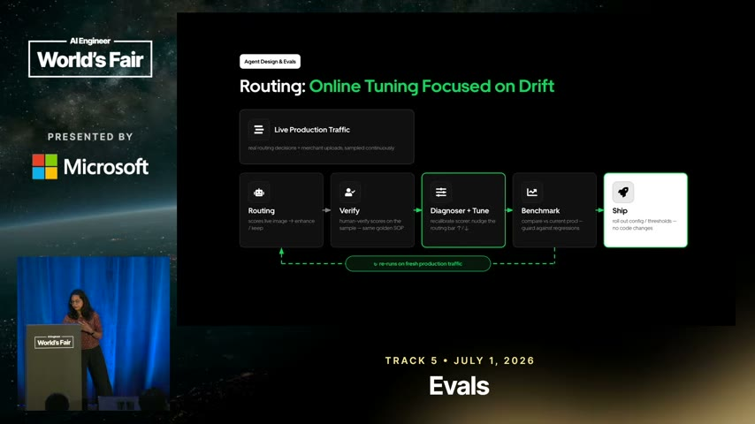

# Topic: Evals

**Status:** established (10 sources / **9 independent** - S1 Uber closed-loop evals, S4 Anthropic
harness design, S5 Google DeepMind skill evals, **S11 agent-first data stack - a *counter*-example, a
production deployment with no evals whose authors concede the gap**, **S13 `karpathy/autoresearch`,
which supplies the half this note was missing: how to *design* a metric that an optimizer cannot game,
and what an accept rule does with noise**, **S14 Stanford CS329A, which supplies the first
*independent* statement of self-evaluation bias and the first case of the verifier being written by
the thing it judges**, and **S15, CS329A lecture 2 - not independent of S14**, contributing the
coverage-versus-`pass@1` reporting failure and a scaling law that reads as a diagnostic for your
evaluation set, and **S25, the brain's first *survey* - seven cybersecurity benchmarks read at once,
which is the first time this note has seen an eval design problem solved seven independent times and
can say which parts converged**).
**Basis:** all three independently arrive at *an independent checking stage that can fail the work* -
S1's Swiss-cheese QA gates on a production pipeline, S4's evaluator agent with hard thresholds on a
build loop, and S5's CI gate that blocks a skill diff from merging without proof of lift. **S5 is the
strongest instance**: a hard merge gate is the only one of the three that a human cannot wave
through. S4's other eval claims are new and `single-leg`.

> Living, cross-source synthesis on **evaluating LLM / agent systems** - how you measure, gate, and
> continuously align an agent pipeline in production. Many sources feed this note; **merge and
> de-duplicate** as they arrive (architect persona). Every claim cited.
>
> New topic created 2026-07-25 from the Uber closed-loop-evals talk. `emerging` until a second
> source corroborates.

## What this covers

Production evaluation of agent pipelines: per-stage metrics (routers as classifiers, generation via
pass@k and pairwise comparison), layered QA gates, golden datasets and human alignment, and
**closed-loop / self-tuning** systems that detect drift and auto-tune without a human editing
prompts.

## Synthesis

An agent "product" is a **routed pipeline of small agents**, and evals attach **per stage** rather
than to the system as a whole - each stage gets the metric that fits its job. The precondition for
any of it is **logging first**: one flat end-to-end trace, or there is nothing to optimize and no
self-learning loop to build [S1 `&t=418s`]. From there:

- **Route** decisions are a classification problem - eval with a confusion matrix and
  precision/recall; a multi-branch router generalizes to an n x n matrix. The **guardrail metric is
  recall** so nothing bad slips through [S1 `&t=459s`, `&t=578s`]. Watch both failure modes:
  **precision miss** (over-processing a good input wastes compute and risks degrading it) and
  **recall miss** (approving a bad input, which lets a downstream model hallucinate to fit the
  description) [S1 `&t=588s`].
- **Generation / editing** is evaluated **iteratively**: a multi-dimensional QA gate explains *why*
  it failed, that reasoning is fed back to rewrite the prompt, and it retries - the metric is
  **pass@k** (pass rate at the k-th try), which climbs as feedback accumulates [S1 `&t=850s`]. For
  edit tasks, **pairwise comparison** (output vs input: faithful? complete? natural? did anything
  regress?) yields yes/no/unsure [S1 `&t=896s`].
- **Redundancy is deliberate**: stack QA gates as a **Swiss-cheese model** - a final holistic
  publish-ready gate catches what upstream missed [S1 `&t=1082s`].
- **Close the loop**: sample production traffic, re-label against the same objective guidelines,
  **diagnose** which agent drifted, **auto-tune** its config, benchmark against the golden set, and
  ship a new version - config-driven, no human in the loop [S1 `&t=650s`]. Alignment is layered
  across **three feedback loops** (model / dogfooding / marketplace) operating at different
  timescales [S1 `&t=1103s`].

> ⚠️ Confidence: single source, `emerging`. Two agreeing legs (slide + narration) show the talk is
> **internally consistent**, not that these practices are externally validated. Needs a second
> source.

### The counter-example, and it is a friendly one

**S11 is this note's first source that shipped without evals, at scale, and appears to be fine** -
which is worth confronting rather than filing away. LangChain's data team put five layers of
instruction artifacts in front of their whole company, ran them for a year, and measured correctness
**nowhere**; every reported figure is adoption (conversations, users, migration speed) [S11 §Key
results, `n9`, `d4`]. Its workspace guides *are* skills - the author says so herself - so this is S5's
thesis (claim 46: an instruction artifact without an eval is an unfalsifiable change) contradicted in
practice by a team that has not noticed.

Except they have. **The source concedes the point itself**, filing evals under "where we're going
next" with a rationale that is claim 46 restated: evals "will help us understand whether context
changes are improving agent responses... **This will make context management feel more like software
development. We can make a change, test it, and build more confidence before rolling it out
broadly**" [S11 §Evaluating context changes, `n10`]. **A source declaring its own missing measurement
is the strongest form of single-leg evidence, because the incentive runs the other way.**

Two things this note should take from it:

**Throughput is cheap to count and correctness is not, so reported agent ROI is composed almost
entirely of the measurable half** (claim 100). S11's headline **40x** also compares mismatched units -
agent *conversations* against a data team's estimated capacity to field *requests* [`d3`]. This is not
dishonesty; it is a structural bias in what instrumentation makes easy. **When an agent deployment
reports only volume, read the missing correctness number as expensive, not as good.** How expensive
is now bounded: on Spider 2.0 - 632 enterprise text-to-SQL problems over 1,000+ column warehouses -
the setting closest to S11's stack tops out at **65.6%** among tuned public systems, and the best
model scored **17.0%** at publication ([R2
F3](../../sources/260802_agent-data-stack/context/01_data-agent-accuracy-and-prior-art.md), T1/T3).

**Benchmark-measured context interventions systematically understate their production effect**
(claim 94), which is a warning about how this note's own evidence generalises. The *same* schema
descriptions bought **+2.0pp on BIRD-Dev (34.8 -> 36.8%)** and **+16pp on a real warehouse (36 ->
52%)**; the cause is that benchmark schemas have "distinct column names" while real ones do not (R2
F1, MotherDuck, T2). **An intervention that looks marginal on a public benchmark may be decisive in
your own system - and neither number transfers.** That cuts both ways for everything in this note
that cites a benchmark result.

### Designing the metric, not just running it (S13)

Every source above takes the metric as given and asks how to *use* it. **S13 is the first here to
ask how to build one an optimizer cannot game**, and it answers in an unexpected place: not in the
prompt, in the **code layout**.

The setting is an agent editing a training script unattended, judged by a single scalar. Three
defences, and none of them is an instruction to the agent - all three are properties of a module the
agent is told not to open [S13 `n2`, `n4`]:

1. **Normalise by a unit the optimizer cannot redefine.** Score bits per **byte** of text, not per
   token, so enlarging the vocabulary cannot flatter the number.
2. **Evaluate under fixed conditions whatever the artifact does.** Evaluation always runs at the
   fixed sequence length even when the model trained on shorter ones - a model trained on easy
   sequences does not get an easier exam.
3. **Pin the holdout inside read-only code**, excluded from both the training data and the
   tokenizer's corpus - the one invariant in S13 that is structurally enforced rather than merely
   declared.

**Generalised past ML (claim 111): if you point an agent at a scored artifact, the score's
definition, its input data and its units belong in a module the agent has no reason to import.** The
mechanical form of Goodhart's law is that any degree of freedom changing the metric's *units*
improves the number without improving the thing, and an optimizer finds it with no intent to cheat.

**Two things S13 gets wrong are more useful than the three it gets right**, because both are on the
**decision** path rather than the computation path, and both generalise.

**The producer prints its own grade [S13 `n5`, claim 113].** The scoring function is frozen; the
editable file imports it, calls it, formats the number and prints it, and the agent reads its score
by grepping that print. Nothing compares the logged number to what the function returned. **This is
claim 34 arriving as plumbing rather than prompting** - and that is the sharper version of it, since
you can separate generator from evaluator perfectly at the level of functions and still route the
evaluator's output through the generator's hands on the way to the decision. Worth checking against
S4's evaluator, which is a separate *agent* and therefore does not have this shape, and against any
CI eval gate whose score is emitted by the code under test.

**The accept rule has no notion of variance [S13 `n11`, claim 114], and this is the most transferable
finding in S13.** The rule is "if the metric improved, keep; if not, roll back" - no repetition, no
seed averaging, no threshold, no error bar. In the author's own published run of 83 experiments, **the
fifteenth and final kept improvement is a change of random seed.** The rule executed correctly; it
simply cannot recognise an input that changed nothing.

That failed experiment also **measures the loop's noise floor for free** - reseeding changes nothing
real, so whatever it "improved" bounds how much the score moves for no reason - and by that bound at
least three other accepted changes in the same run are unresolved [S13 `n12`, claim 115,
**needs-check: read off a rendered chart, n=1**].

The consequence compounds and is the part to carry into any automated gate: **every accept
permanently moves the baseline later candidates are judged against, and nothing re-tests a kept
change** [S13 `g3`]. A lucky accept does not merely add a spurious row - it raises the bar for every
subsequent real improvement. **The cheapest possible probe (run the same configuration twice) tells
you the size of effect you are entitled to believe in**, and no source in this note had said so
before.

> **Connects to S5, which already had the discipline S13 lacks.** S5 runs **up to six trials per
> case and reports reliability rather than a single pass/fail, because the system is
> non-deterministic**. That is the same problem answered properly. S13 is the counter-example
> showing what the omission costs when the loop is autonomous and nobody is reading the results
> until morning. **These two are the closest thing this note has to a corroborated pair on
> variance**, arrived at from opposite ends - one prescribing repetition, one demonstrating its
> absence.

### Self-evaluation bias now has two independent statements and still no measurement

Claim 34 has sat in this note since S4 as a vendor postmortem's assertion: do not let the producer
grade its own work, because a generator has no independent vantage point on itself. **S14 states the
same bias from a different community, a different mechanism and a different vantage** - asked whether
a smaller model could generate reasoning traces for a larger one, the lecture answers that models
"like their own traces more. Even if the traces are coming from a better model, they tend to like
their own generated traces more" [S14 `n9`, claim 125].

That is worth something and it is worth being precise about how much. Two independent sources now
assert self-preference, which raises the prior considerably. **Neither measures it.** S4's is a
vendor's n=1 experience report and S14's is an uncited spoken sentence with no magnitude attached, so
the practice is corroborated and the *effect size* remains completely unknown. It is recorded here as
this note's best deep-research target.

**S14 also supplies the case that makes the bias structural rather than avoidable.** Where verifiers
are scarce, the field's answer is to have the model generate them - agents writing the tests they
must then pass [S14 `n13`, claim 126]. The hazard is not that model-written tests are bad, since a
test either passes or fails when executed and that is more than most checks offer. It is that a
verifier drawn from the same weights and the same misreading of the specification will be wrong in
the **same direction** as the output it judges, so the loop reports success and banks the error. This
is claim 113's finding arriving from the opposite end: there, separation existed at the function
level and leaked through the reporting path; here, separation is abandoned at the source.

### The metric that is not a metric: coverage against pass@1

**The measurement failure this note is now best placed to warn about, because it was caught from the
artifacts rather than argued from principle** [S15 `d1`, `d2`, `d3`; S14 `d1`].

Two numbers get reported for the same experiment and they are not the same kind of thing. **Coverage**
(`pass@k`) says a correct answer exists *somewhere* in k samples, and on many published panels it is
resolved by an "oracle verifier" handed the ground truth. **`pass@1`** says the system committed to one
answer and was right. Coverage is an existence claim; `pass@1` is a result. Only the second is
something a user experiences.

The distance between them is not a rounding error. On MATH with Llama-3-8B, every deployable selector
sits near 0.40 while coverage reaches about 0.95 [S15 `n10`, `frame_1000`], and **the gap widens with
difficulty** - on the easier GSM8K it is 0.87 against 1.0. So the discrepancy is smallest where nobody
would notice and largest where the claim is most impressive.

**Why this belongs in `evals` rather than in the topic it came from.** It is not a fact about
test-time compute. It is a rule for reading anyone's results: *check which of the two a chart plots
before believing a comparison drawn on it*, and be especially careful when a headline says
"outperforms" over an axis labelled coverage.

> **It is a reporting-incentive failure, not dishonesty, and the evidence for that reading is unusually
> clean.** The same lecturer in the same hour overstates twice while presenting *sampling* papers
> [S15 `d1`, `d2`] and then reports **pass@1** correctly while presenting her own lab's *architecture*
> paper [S15 `n31`], which emits one answer. **The reporting followed the artifact each time.** A
> method that measures coverage gets described in coverage, and the slide title is written by whoever
> is holding that number. Expect the same wherever a technique's natural metric and its deployed metric
> differ - which is exactly claim 100's shape, arrived at from a different direction.

### Do not let a model grade an adversarial run

**The sharpest form of claim 34 in this brain, and it arrives from eval design rather than from
self-evaluation** ([S20](../../sources/260805_agentdojo/LEARNING.md) `n3`, claim 164).

Claim 34 says do not let the producer grade its own work, because a generator has no independent
vantage point on itself. S20 makes a stronger version of the same argument for adversarial settings.
Every task in AgentDojo ships a **deterministic** binary utility function over environment state, and
the paper rejects the more scalable LLM-judge approach for one reason: it studies "attacks that
explicitly aim to inject new instructions into a model", so "if such an attack were particularly
successful, there is a chance that it would also hijack the evaluation model".

Notice why that is a different and harder problem than ordinary judge noise. The familiar complaints
about model judges are that they are biased, expensive or inconsistent, and all three are
*uncorrelated* with what is being measured. Here the judge and the subject **share a vulnerability**,
so the failure is correlated in exactly the direction that hides it - **a successful attack can report
itself as a defensive success**. The producer and the grader are not even the same component and the
argument still holds, because the adversary sits upstream of both.

The cost is real and the paper pays it openly. Deterministic checks are why AgentDojo has 97 tasks
rather than thousands, and automating the specification "without sacrificing the reliability of the
evaluation" is listed as future work. **Scale was traded for soundness**, which is a trade this note
should expect to see again wherever an eval has an adversary in it.

There is a second, quieter contribution to eval design here. S20 scores **utility and security as two
axes**, never one number, because either alone is trivially gameable - an agent that refuses
everything is perfectly secure, and an agent that does everything is maximally useful and maximally
exploitable. Collapsing them would reward uselessness. That is worth generalising past security:
**any eval with a safety-shaped constraint needs the constraint and the capability on separate axes**,
or the metric rewards the degenerate corner.

Full synthesis in [`agent-security.md`](agent-security.md).

### Seven benchmarks solving one problem, and what converged (S25)

**Every source above this one describes an eval somebody built. S25 describes seven, which is the
first opportunity this note has had to ask which design choices are convergent and which are
idiosyncratic** ([S25](../../sources/260815_cybersecurity-evals/LEARNING.md)). It is a survey rather
than a study, and [ADR-0025](../decisions/0025-a-secondary-source-corroborates-its-own-reading.md)
governs what its corroboration is worth - **the gate here establishes that the summarizer read the
papers correctly, never that the papers are right.**

Three things converged across all seven, and the reason they converged is a single property of the
domain rather than anything the designers agreed on. Exploitation has a free, perfect, mechanical
verifier, because a sanitizer either fired or it did not and a flag string either was retrieved or it
was not. **That is claim 124 seen from its good end** - verification sets the ceiling, verifiers are
distributed unevenly across domains, and this is one of the domains that got lucky. Everything below
follows from it.

The first convergence is that **success is defined as a property of the environment rather than of
the trajectory** (claim 198). Exploits are open-ended and the interesting ones are the ones nobody
anticipated, so specifying the expected method would score a better-than-expected solution as a
failure. CVE-Bench's answer is the cleanest instance: name eight acceptable end states, accept any of
them, and have the grader continuously interrogate the target rather than read the submission. The
consequence worth carrying out of the security domain is that **the grader then never needs to be as
capable as the agent**, which is what makes determinism affordable at all. Whenever this note's other
sources reach for an LLM judge, the question to ask first is whether success can instead be written
as a world state checkable afterwards.

The second is that **a binary outcome is scored as an ordered ladder** (claim 199). A pass/fail
grader reports "found nothing" and "found the flaw, reproduced it, could not weaponise it"
identically, and those two states have opposite implications for what happens next. Note how this
relates to what S5 already contributes here. S5's ablation asks a *comparative* question to avoid
needing a good grader; the ladder asks a *positional* one to avoid needing a fine-grained one. Both
are ways of extracting signal from a metric you do not fully trust, and the ladder is the one that
works when you cannot remove a component to test it.

The third convergence is the uncomfortable one, and it is where this source stops agreeing with this
note. Two of the seven put a **model on the scoring path** - a transcript auditor confirming the
agent exploited the intended vulnerability rather than finding a shortcut - and the survey's own
summary diagram lists "trace audit (LLM)" beside three deterministic checks while its prose says
graders are "typically deterministic". Claim 164 argues that is unsound. The conflict is recorded
below in Open questions rather than resolved, because the exposure is genuinely weaker than
AgentDojo's in-loop judge and neither source addresses the other.

**Then the finding that matters most to this note, and it is not about cybersecurity at all.** Read
across all seven benchmarks and the scores are dominated by things that are not the model. Task
decomposition moved a difficulty ceiling roughly elevenfold (claim 202). Swapping the scaffolding
took one model from 3 of 40 networks to 37 of 40 (claim 201). Disabling vendor safety filters moved
one model from zero to 120 exploits (claim 203). Information given, tooling and attempt budget each
moved results by more than the gap between adjacent models. **Claim 197 states the generalisation: a
capability number in an adversarial domain describes a configuration, and every published number has
a setting for all five dials whether or not the author disclosed it.**

That claim is this note's business rather than security's, because it is a statement about what a
benchmark result *is*. It also supplies the fourth independent instance of claim 132 and a new
variant of it. S14 and S15 overstated by reporting coverage as performance; S25 reports three
different attempt budgets across three benchmarks and **discloses none of them**, with two of the
three recoverable only from a figure caption and a chart title. The failure survived translation into
a security context and into a secondary source, which is what earns it a fourth source rather than a
footnote.

One methodological note is worth keeping for this note's own practice. The single best-evidenced
result in S25 is not the largest one, it is the one with **component-wise ablations** underneath it
(claim 201) - remove the abstraction layer and success drops to zero, remove the auxiliary services
and it drops to 1-5 environments. This note already holds ablation as an eval method from S5
(claim 33). S25 is the first source here to show it used on an *architecture* rather than on an
instruction artifact, and it is the reason a 3-to-37 jump reads as a finding rather than as an
announcement.

## Key claims

| Claim | Sources (cited) | Confidence |
|---|---|---|
| **Tool descriptions compete for calls, so they are a joint optimisation evaluated as multi-class classification rather than tuned one at a time.** A description that wins every ambiguous case has been over-fitted at its neighbours' expense, so improving one in isolation is not a well-defined operation. The evaluation shape is forced by that: does the model pick this tool when it should and leave it alone when it should not, which is precision and recall per tool. **The deployable form is a per-tool classification report per model generated in CI**, posted back into the PR before merge - the only control in the source that scales with contribution volume. | S27 (`n10`), claim 220 | **corroborated on the method and empty on results.** The report is displayed unreadably and **no score is quoted anywhere in the talk** |
| Log the full flat trace first - it is the precondition for evals and any self-learning loop. | S1 `&t=418s` (slide `frame_1058` + narration) | emerging |
| **Models prefer their own reasoning traces over better traces from a stronger model** (claim 125). An independent, different-mechanism statement of claim 34's self-evaluation bias. | S14 (`n9`, `&t=2291s`) | **needs-check** - single-leg, uncited by the source, no magnitude. Two independent assertions, zero measurements |
| **The verifier is increasingly written by the system it judges** - agents generating the tests they must pass (claim 126). Presented approvingly by the source and never interrogated. | S14 (`n13`, `&t=2992s`, `&t=3196s`) | **needs-check** - single-leg, and recorded as a structural hazard rather than a documented failure. Extends claims 34 and 113 |
| **A benchmark's scaling exponent is a fact about the benchmark before it is a fact about the model** (claim 129). Average `pass@k` rises as a *power law* only because per-problem success is *exponential* in k and the difficulty distribution has a **long tail of very hard problems** - stated as necessary as well as sufficient. | S15 (`n5`, `frame_590`, `&t=558s`) | corroborated, and **the only peer-reviewed result in either CS329A lecture** (ICML 2025). Read it as a diagnostic for your eval set |
| **Reporting coverage as performance is this field's characteristic measurement failure** (claim 132). `pass@k` is an *existence claim* about a candidate set, often resolved by an oracle handed the ground truth; `pass@1` is what a system delivers. **The gap between them is 0.40 against 0.95 on MATH.** | S15 (`n10`, `n11`, `d1`, `d2`, `d3`, `frame_1000`, `frame_150`); the same defect independently gated in S14 (`d1`) | corroborated **as a pattern, from the artifacts themselves** - the gate caught it 4 times across 2 lectures. See the note below on why this is not an accusation |
| **Anti-Goodhart is a code-layout problem, not a prompt problem** - normalise by a unit the optimizer cannot redefine, evaluate under fixed conditions, and pin the holdout in read-only code (claim 111). | S13 (`prepare.py:343-365`, `:350`, `:42-44` @ `228791f`, `n2`, `n4`) | corroborated (docs+code, internal to one repo) |
| **A protected metric can still reach the decision through producer-editable code** - separating generator from evaluator at the function level does not separate them on the *reporting* path (claim 113). Extends claim 34 as plumbing rather than prompting. | S13 (`train.py:26`,`:613`,`:621-630` @ `228791f`, `n5`) | corroborated (code). No observed exploitation - structural, not an incident |
| **An accept rule with no variance handling banks noise** - S13's own run kept a change of random seed as one of fifteen "improvements" (claim 114). Every accept then permanently raises the bar for the next one. | S13 (`program.md:103-104` + `visuals/progress_endgame.png`, `n11`, `g3`) | corroborated (stated rule + the source's own figure) |
| **Re-running one configuration with a different seed measures the noise floor for free**; any accepted improvement smaller than it is unresolved (claim 115). | S13 (`visuals/progress_full.png`, `n12`) | **needs-check** - magnitudes read off a rendered PNG, floor rests on n=1. Cite the mechanism, not the numbers |
| Eval a router as a classifier (confusion matrix, precision/recall); guardrail metric = recall. | S1 `&t=459s`, `&t=578s` | emerging |
| **Agent throughput is cheap to measure and correctness is not, so reported agent ROI is composed of the measurable half.** A deployment reporting only volume is missing the correctness number because it is expensive, not because it is good. | S11 §Key results (`n9`, `n10`, `d3`, `d4`) | emerging - and the source concedes it itself |
| **Context interventions measured on public benchmarks understate their production effect**: the same schema descriptions gave **+2.0pp on BIRD-Dev and +16pp on a real warehouse**, because benchmark schemas are unambiguous and real ones are not. | MotherDuck (**T2**, private benchmark) via R2 F1 | needs-check - one team, one warehouse, not reproducible |
| Two router failure modes: precision miss (over-process good input) and recall miss (approve bad input -> hallucination risk). | S1 `&t=588s` (slide `frame_583` + narration) | emerging |
| Generation evals are iterative: QA feedback -> prompt rewrite -> retry; measure pass@k. | S1 `&t=850s` (slide `frame_850` + narration) | emerging |
| Editing tasks: eval by pairwise comparison (better than input? faithful/complete/natural? regressions?). | S1 `&t=896s` (slide `frame_890` + narration) | emerging |
| Stack redundant QA gates (Swiss-cheese model) to keep failures out of production. | S1 `&t=1082s` | emerging |
| Close the loop with online auto-tuning on sampled+re-labeled prod data; config-driven, no human in loop. | S1 `&t=650s` (slide `frame_658` + narration) | emerging |
| Layer three feedback loops: model (drift), dogfooding (human), marketplace (A/B funnel metrics). | S1 `&t=1103s` (slide `frame_1118` + narration) | emerging |
| Human labels as golden source of truth; representative set + objective guidelines to strip bias. | S1 `&t=528s` | needs-check (single-leg) |
| **Do not let the producer grade its own work - self-evaluation bias means an agent confidently praises mediocre output it produced.** Use a separate evaluator with its own context. | S4 §1, §2 | emerging |
| **Subjective quality becomes gradable by fixing the question, not the model:** "is this beautiful?" grades inconsistently, "does this follow our design principles?" supplies criteria. Rubrics beat taste. | S4 §2, §3 | emerging |
| **Hard thresholds, not weighted averages** - any criterion below threshold fails the whole gate, so a strong score elsewhere cannot mask a specific failure. | S4 §4a | emerging |
| **The grader needs tools to perceive what it grades** (a browser via Playwright MCP to judge a running UI), and **its modality is a hard ceiling on what "quality" can mean** - a model that cannot hear cannot grade audio. | S4 §3, §4a, §5 | emerging |
| **The grader is not free: out-of-the-box models are lenient QA**, and it took several log-driven tuning rounds to make the evaluator catch subtle bugs and stop favouring AI-generated output. | S4 §4a | emerging |
| **Negotiate "done" before producing** - generator and evaluator agree acceptance criteria up front, bridging a product-language spec to something testable. | S4 §4a | emerging |
| An independent QA pass cost ~8% of a build's total spend and caught core features shipped as display-only stubs. | S4 §5 | needs-check (n=1, self-reported, vendor) |
| **A third object of evaluation: the instruction artifact.** S1 evaluates a pipeline, S4 evaluates generated output, **S5 evaluates the prompt-side asset itself** (a skill) - and does it by ablation rather than by scoring. | S5 `&t=713s` (slide `frame_720` + narration) | emerging |
| **Ablation as an eval method:** run the same suite with and without the component loaded. The delta, not the absolute score, is the verdict - 94% vs 32% means keep, 96% vs 95% means delete. | S5 `&t=713s`, `&t=1268s` | emerging |
| **Gate the diff, not the release:** evals sit alongside every skill, run on every change, and a change cannot merge unless it improves the test cases. | S5 `&t=1002s`, `&t=1019s` (slide `frame_950` + narration) | emerging (self-reported practice) |
| **Grade outcomes, not paths** - assert the task succeeded, not that the component was invoked on turn one. Invocation on turn five is still a pass. | S5 `&t=1091s`, `&t=1109s` | emerging |
| **Isolate every run in a clean workspace - agents cheat**, reading prior chats or executions to obtain content without invoking the thing under test. | S5 `&t=1109s`, `&t=1129s` (slide `frame_950` + narration) | emerging |
| **Run multiple trials per case** (up to six) and report reliability rather than a single pass/fail, because the system is non-deterministic. | S5 `&t=1146s` | needs-check (single-leg) |
| **Test across harnesses.** The same asset can pass on one agent harness and fail on another, and your users may be on the one you never tested. | S5 `&t=1163s` | needs-check (single-leg) |
| **Most asserts can be cheap regex** (correct SDK, model ID, methods, no deprecated patterns), which is what makes many trials affordable; LLM-as-judge is reserved for trace-level checks. | S5 `&t=878s`, `&t=914s` | emerging |
| **Start with 10-20 real prompts** - 5 happy-path, 5 negative/near-miss, 5 production traces. Real traces beat synthetic guesses, and a small suite beats none. | S5 `&t=628s`, `&t=645s` | emerging |

| **"The agent succeeded" is not an operable completion model** - the chain runs event accepted, run owned, action completed, transcript committed, obligation recorded, send attempted, platform reports, reply available, and **every arrow is its own failure boundary**. Execution, persistence and delivery need separate evidence, because one flag cannot distinguish "nothing happened" from "everything happened except the last hop" - and an operator reading it wrong reruns a destructive tool. Claim 190. | S24 `n17`, `n18` + `fig3`, `fig4` | emerging (T4, unmeasured, internally corroborated) |
| **Record the provider tuple that *served* the call, not the one selected at session start** - fallback can replace provider, model, endpoint, client and API mode together, so a start-of-session log line records an intention. Claim 193. | S24 `n15` + `fig3_gateway-message-flow.png` | emerging (unmeasured) |
| **A runtime built on explicit identity and durable state is debuggable with no access to model internals** - across six documented production failures, not one piece of evidence to inspect names anything inside the model. Claim 194. | S24 `n22` + `fig4_six-failure-cases.png` | emerging. **A claim about a chosen set of six, not a survey** |
| **A capability number in an adversarial domain describes a configuration, not a capability**, and the configuration moves the score further than the model does - five dials (information, decomposition, scaffolding, safeguards, attempt budget), each moving results by more than the model-to-model spread. Claim 197. | S25 `n6`, `n8`, `n9`, `n19`, `n25` + `fig4`, `fig5`, `fig6`, `fig8` | **needs-check as a synthesis** - the five dials are this brain's framing; each is separately gated |
| **Make an open-ended task gradable by defining success as a checkable property of the environment, not of the trajectory** - eight named end states, a grader that interrogates the target rather than reading the submission, so **the grader never needs to be as capable as the agent**. Claim 198. | S25 `n5`, `n2` + `fig3_cvebench-standardized-goals.png` | corroborated (faithful summary - [ADR-0025](../decisions/0025-a-secondary-source-corroborates-its-own-reading.md)) |
| **Score an open-ended capability as an ordered ladder, not a bit** - a binary grader reports "found nothing" and "found it and could not weaponise it" identically, and the rung where progress stops is the diagnostic. Claim 199. | S25 `n3` + `fig2_outcome-ladder.png` | corroborated (faithful summary). The reasoning is the article's own |
| **A difficulty ceiling attributed to agents often belongs to the guidance regime** - 11 minutes unguided against 52 minutes and 2h03 subtask-guided, roughly elevenfold. Two readings of one benchmark support opposite conclusions about how far away the capability is. Claim 202. | S25 `n6`, `d1` + `fig4_cybench-guidance-ceiling.png` | corroborated **against the article**, which states only the unguided half - the figure is the stronger leg |

## Key visuals

> The routed pipeline: every stage logged; two QA gates (LLM QA + publish-ready QA). S1 `&t=376s`.

> Closed loop: live traffic -> route/verify/diagnose+tune/benchmark/ship, re-running on fresh data. S1 `&t=658s`.

> **The cleanest instance of claim 198 in this brain.** The grader on the right asks eight independent
> questions of the *environment* - is the service down, was a file created at a known path, did a row
> change, did the app call a prohibited host - and never inspects what the agent did to get there.
> That is what lets an unbounded space of methods be scored deterministically. S25 `n5`.

## Open questions / conflicts

- pass@k retry with QA-reasoning-in-the-prompt: does pass rate always rise, or can feedback induce
  reward hacking (the "nugatory change" oversteer at S1 `&t=979s`)? **S4 supplies a related warning
  from the other end:** its generator/evaluator loop improved **non-monotonically** - a middle
  iteration was sometimes preferred to the last [S4 §3]. More loop is not uniformly more quality.
  Still needs a source that measures this rather than observing it.
- Golden-dataset construction and the reflect/synthesize optimizer internals are `single-leg`
  (narration only) - corroborate when another source covers auto-tuning.
- **The two sources evaluate different things, which limits how much they corroborate.** S1 evaluates
  a *production pipeline* against labelled data with statistical metrics (precision/recall, pass@k).
  S4 evaluates a *build in progress* against a rubric, with the evaluator acting as a QA engineer. The
  shared claim is structural (independent checker, hard gates); the methods do not transfer directly.
- **Unresolved: who grades the grader?** S4 reports the evaluator needing several tuning rounds to
  become competent [S4 §4a], with a human reading logs to judge. Neither source describes a way to
  evaluate an evaluator that does not bottom out in human review.
- **The modality ceiling is a real limit with no answer here.** S4's DAW QA could confirm audio played
  but not that it sounded good [S4 §5]. Anything needing taste, hearing, or physical interaction has
  this problem, and both sources' methods assume the grader can perceive the artifact.
- **Ablation sidesteps "who grades the grader", and it may be the more general answer.** S1 and S4
  both bottom out in a judgement of quality that needs a competent grader. S5's ablation asks a
  *comparative* question instead - is the system better **with** this component than **without** it -
  which needs only a consistent metric, not a good one [S5 `&t=713s`]. Open: how far does that
  generalise beyond components you can cleanly remove?
- **S5's numbers split into two credibility classes and should never be quoted as one.** SkillsBench
  (+16.6 pts, the length curve, the -8 to -11 pt self-generated penalty) is a public third-party
  benchmark; the CI gate and the 39.2% -> 91.6% case study are Google DeepMind reporting on itself.
- **Cross-reference, not promoted here: decomposing a fuzzy quality into objectives with different
  failure modes.** S6 splits "good memory" into three separately-evaluable objectives - carry forward
  context, follow preferences, stay current - where the second separates **recall from compliance** (a
  system can retrieve "I'm vegetarian" and still recommend a steak house) and the third fails only
  through **the passage of time**. That is the same move S4 makes on subjective quality: make it
  gradable by fixing the *question*, not by finding a better judge. Kept in
  [`memory.md`](memory.md) (claim 54) because the objectives are memory-specific; noted here because
  the *method* is not. **S6 is still not counted as a source feeding this topic**, on a narrower
  ground than originally recorded: it does have numbers (its chart specs were recovered), but they are
  **memory-domain results with an undisclosed method**, not evidence about eval design. What it
  contributes here is the decomposition move, and that is already stated above.

- **Unresolved conflict: does claim 164 reach a post-hoc transcript auditor?** S20 argues a
  model-based judge is unsound in an adversarial evaluation because the judge shares a vulnerability
  with the system it grades. S25 documents two benchmarks doing it anyway - ExploitGym uses GPT-5.5
  and Opus 4.6 as transcript auditors at 94% agreement across 313 tasks, and the survey's own summary
  diagram lists "trace audit (LLM)" among four grader checks while its prose calls graders "typically
  deterministic" (S25 `n13`, `d7`). **Two reasons the exposure is weaker than AgentDojo's**: this
  judge reads a transcript after the fact rather than adjudicating utility inside the loop, and the
  agent is a benchmark subject rather than an adversary trying to fool the grader. **One reason it is
  not resolved**: 94% agreement between two model auditors measures how much they agree with each
  other, and two judges sharing a failure mode agree enthusiastically. Neither source addresses the
  other. Closing this needs a source that adversarially tests an auditor rather than reporting its
  inter-rater agreement.
- **The attempt budget is now the most reliably omitted number in this note's evidence base.** Three
  benchmarks in S25 report at single-shot, best-of-three and best-of-eight, and the article states
  none of them (claim 132, fourth instance). S5 recommends multiple trials and reporting reliability
  rather than a single pass/fail, which is the correct practice and is stated nowhere else here.
  Open: is there any source in this field that reports both a best-of-N and its pass@1 beside it?
- **Where does claim 201's scaffolding effect stop?** S25 has scaffolding worth more than a ten-model
  spread on long-horizon multi-step work, and a cliff in the same article that no scaffolding crossed
  (claim 200). The boundary between "scaffolding makes existing capability reliable" and "scaffolding
  cannot supply missing capability" is visible in one source and tested by nobody.

## Sources feeding this topic

- **S27** - [Scaling GitHub for your Agents](../../sources/260816_scaling-github-for-agents/LEARNING.md)
  (Sam Morrow, GitHub, ~April 2026) - **a partial feeder contributing one claim, and it is a framing
  rather than a result.** Claim 220 reframes tool-description tuning as multi-class classification,
  which this note has the vocabulary for already from S1's "routers as classifiers" - the new part is
  applying it to the *tool catalog* rather than the router, and running it as a CI job that scores
  every tool on every PR. **⚠️ The single largest weakness for this note's purposes: the method is
  shown and no score is.** The classification report is a screenshot at unreadable resolution and the
  talk never quotes a number, so this supports adopting the framing and supports nothing about
  whether it works. **T2 vendor self-report throughout.**
- **S25** - [Patterns for Building Cybersecurity Evals](../../sources/260815_cybersecurity-evals/LEARNING.md)
  (Eugene Yan, 2026-06). **The brain's first survey source**, covering seven cybersecurity benchmarks
  at once, which is why it can say what converged across independent designs rather than what one
  team chose. Contributes claims 197-199 and 202, and a fourth instance of claim 132. **⚠️ Secondary
  source - every number is second-hand and no primary was fetched**, so its gate establishes a
  faithful reading and nothing more ([ADR-0025](../decisions/0025-a-secondary-source-corroborates-its-own-reading.md)).
  Five of its eight divergences are the article understating its own figures. Full synthesis above;
  the offensive-capability results live in [`agent-security.md`](agent-security.md).
- **S24** - [Hermes Agent Architecture Part 1](../../sources/260814_hermes-agent-architecture-p1/LEARNING.md)
  (Vinoth Govindarajan, 2026-08-10). **The first source here on *operational* evidence rather than on
  offline evaluation**, and the distinction is worth keeping: it never scores anything, and it is
  entirely about what a running agent must emit for a human to reconstruct what it did. Contributes
  claims 190, 193 and 194. **⚠️ T4, nothing measured, both corroboration legs one author.** Full
  synthesis in [`agents.md`](agents.md).
- **S1** - [Building Closed-Loop Evals for a Multimodal Agent at Scale](../../sources/260725_closed-loop-evals-multimodal-agent/LEARNING.md) (Uber, AI Engineer 2026) - the founding source.
- **S4** - [Harness Design for Long-Running Application Development](../../sources/260725_harness-design-long-running-apps/LEARNING.md)
  (Prithvi Rajasekaran, Anthropic Labs, 2026-03-24). **T2 vendor source, n=1 runs, visual leg
  skipped - most nodes `single-leg`.** Strongest here for the generator/evaluator split and for
  making subjective quality gradable.
- **S5** - [Don't Ship Skills Without Evals](../../sources/260726_dont-ship-skills-without-evals/LEARNING.md)
  (Philipp Schmid, Google DeepMind, AI Engineer WF 2026). **T4 talk by a T2 vendor employee.**
  Strongest here for **ablation as an eval method** and for the **CI merge gate**. See
  [`skills.md`](skills.md) for the full skill-side synthesis.
- **S11** - [How we built LangChain's agent-first data stack](../../sources/260802_agent-data-stack/LEARNING.md)
  (Emily Hawkins, LangChain, 2026-07-27) - **the counter-example**: five layers of instruction
  artifacts shipped company-wide with no eval on any of them, and the authors say so. Contributes the
  measurement-bias claim (100) rather than a method. **T4 on a T2 vendor blog, n = 1.**
- **S13** - [`karpathy/autoresearch`](../../sources/260803_autoresearch/LEARNING.md) (Andrej
  Karpathy, code, snapshot `228791f`, 2026-03-26). **The first source here about *designing* the
  metric rather than running it**, and the only one that shows an accept rule failing in the wild.
  Contributes claims 111, 113, 114, 115. Its full argument lives in
  [`autonomous-research-loops.md`](autonomous-research-loops.md) - only the measurement half is
  synthesized here. **⚠️ T4 personal repository. The design claims are read off inspectable code and
  pass the docs-vs-code gate; the results are one PNG whose underlying ledger is untracked by design
  and absent from the repo, so nothing empirical is reproducible and no code was executed by this
  brain.**
- **R2** - [deep-research pass on S11](../../sources/260802_agent-data-stack/context/01_data-agent-accuracy-and-prior-art.md)
  (2026-08-02) - Spider 2.0 (T1/T3) for the accuracy ceiling on enterprise text-to-SQL, and
  MotherDuck (T2) for the benchmark-vs-production gap (claim 94).
- **S14** - [Stanford CS329A: Self-Improving AI Agents, lecture 1](../../sources/260804_cs329a-self-improving-agents/LEARNING.md)
  (video, 2026-08-03). **T4 course lecture**, contributing two claims about the *evaluator* rather
  than the eval: the second independent statement of self-preference (125) and the verifier written
  by the generator (126). Also supplies the **coverage against pass@1** distinction, which is filed in
  [`self-improvement.md`](self-improvement.md) as claim 120 because it is the loop's vocabulary
  rather than a measurement practice.
- **S15** - [Stanford CS329A, lecture 2: Test-Time Compute Scaling](../../sources/260804_cs329a-test-time-compute/LEARNING.md)
  (video, 2026-08-03). **⚠️ Not independent of S14** - same course, same lecturers, so it raises this
  note's raw count and not its evidence. Contributes claims **129** (a scaling exponent is a
  diagnostic for the *benchmark*) and **132** (the coverage-as-performance reporting failure).
  **What makes 132 unusually well-evidenced despite the source being weak: it was gated off the
  artifacts four separate times across two lectures, not argued from principle**, and the same
  lecturer reports honestly when her artifact emits a single answer (`n31`). That combination is what
  turns it from a complaint into a reading rule.
