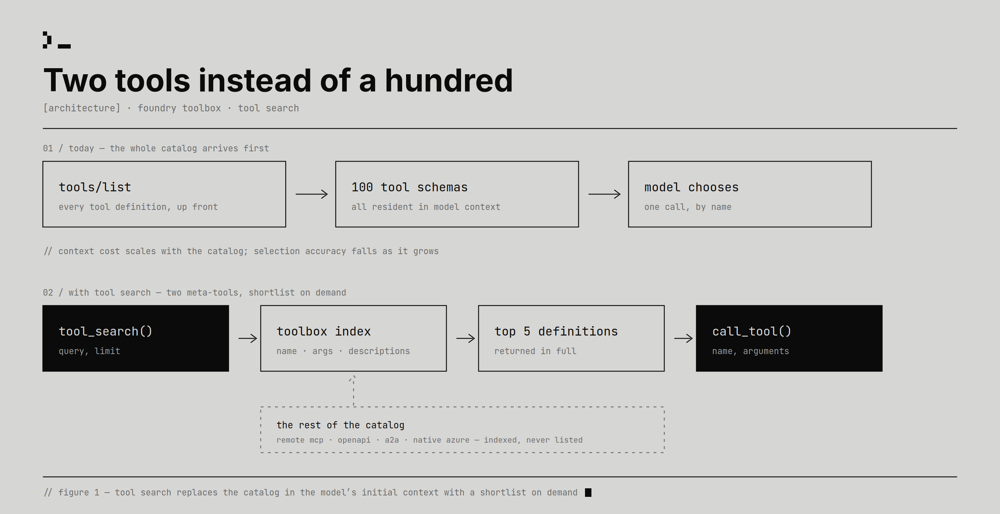

# Topic: MCP (Model Context Protocol)

**Status:** **emerging** (3 sources - S10 "Tool search", Microsoft, 2026-07-29; S12 Google Cloud's
multi-tenant agentic AI reference architecture, 2026-06-18; **S23 Google's MCP stateless-updates
announcement, 2026-08-05**). **S23 is this note's first primary source** - the first that is *about*
MCP rather than teaching it on the way past something else - and the first anywhere in this brain to
**pin a specification version** (2026-07-28, superseding 2025-11-25). The other two remain secondary
under [ADR-0013](../decisions/0013-secondary-but-substantial.md); see
[ADR-0012](../decisions/0012-a-mention-is-not-a-source.md) for why S9's earlier mention did not count.

**Status deliberately held at `emerging`, and the reason is the same one this note has recorded
twice.** A primary source fixes the note's *scope* defect and does nothing for its *corroboration*
defect. S23 overlaps S10 and S12 on almost nothing - transport mechanics against catalog cost against
deployment topology - so **no two sources here confirm the same mechanic**, which is what `established`
means in this brain (see `agent-security.md`, advanced on three independent corroborating groups).
Recorded as [ADR-0022](../decisions/0022-a-primary-source-is-not-corroboration.md), because "the count
rose and the corroboration did not" has now happened three times in this note and deserved to stop
being rediscovered.

**What did change is real, and it is mostly the shape of the hole.** The note now covers the client
side (S10), the deployment side (S12) and **the protocol itself** (S23). Two of its standing open
questions moved: the spec version is pinned, and **audience restriction finally has a name** (RFC
8707, claim 182), which is the mechanism S10 and S12 both stopped short of from opposite directions.

> **Read the scope caveat first, in its new and smaller form.** ~~Resources, prompts, sampling, the
> initialisation handshake and the spec version are still at zero sources~~ - S23 closes **the
> handshake** (by deleting it, claim 179), **the spec version**, and **sampling** (by deprecating it,
> claim 183). **Resources and prompts remain at zero as first-class subjects**, appearing only as
> names in a header field and a cache rule. **Nothing in this note is measured by anyone**: S23's
> entire argument is about scale, cost and latency, and it contains no benchmark, no latency figure
> and no cost comparison. Do not read `emerging` as "the brain understands MCP".

> Living, cross-source synthesis on MCP. Many sources feed this note; **merge and de-duplicate** as
> they arrive (architect persona). Every claim cited. When you learn from a source, pin the spec
> version it refers to.

## What this covers

The Model Context Protocol: servers, tools, resources, prompts, transport (stdio / HTTP), the
client-server handshake, and how agents consume MCP capabilities.

**Boundary with the neighbours:** [`agents.md`](agents.md) owns the loop that calls the tools;
[`context-engineering.md`](context-engineering.md) owns the budget question of which tools reach the
model on a given call (that framing lives there, as claim 85); this note owns **the protocol
mechanics that make those decisions possible or impossible**.

## Synthesis

### The protocol core is stateless as of 2026-07-28, and the handshake is gone

**The substrate section this note lacked until S23.** Under specification 2025-11-25 an HTTP client
completed an `initialize` handshake, received an `Mcp-Session-Id`, and returned it on every later
call, "pinning the client to the specific container or pod that held its **in-memory** session state"
[S23 §Why Sessions Were a Production Bottleneck, `n1`]. The failure that produced is worth stating
precisely, because it is a correctness error rather than a performance one: three pods behind a
round-robin balancer return **`400 Session Not Found`** on the client's second request [S23 `n2`].

The 2026-07-28 specification removes `initialize`/`initialized` (SEP-2575) and the `Mcp-Session-Id`
header (SEP-2567), and the three facts the handshake negotiated now travel in a **`_meta`** block on
every request under `io.modelcontextprotocol/` keys [S23 §The New Request Model, `n3`]. Routing
metadata is promoted into HTTP headers - `Mcp-Protocol-Version`, `Mcp-Method`, `Mcp-Name` - mirrored
against the JSON-RPC body and rejected with a **`-32020`** mismatch code, so intermediaries route,
rate-limit and audit **without deep packet inspection** [S23 §HTTP Standardization, `n4`, `n5`]
(claim 179).

> **This is the strongest artifact-level evidence in the note, and it is worth knowing why.** S23 has
> no figures. Its second leg is the **six protocol payloads it prints**, which is the code-to-docs
> gate arriving in a blog post - and a better second leg than a diagram, because the legacy handshake
> and the new request can be **diffed**, and the same three fields are visible moving from a call that
> happens once into a call that happens every time. A diagram is the same claim drawn instead of
> typed; a payload can be decoded. See that source's `SOURCE.md` for the full statement of its gate.

Round-robin routing, scale-to-zero serverless deployment and failover invisible to the client are
**consequences of that single change**, not separate features, which is why they are gated as one node
rather than four. Note what this does to S12's world: the deployment fork below was drawn when a
remote MCP server needed sticky affinity or a shared session store, and **the stateless core removes
the infrastructure half of that cost** while leaving the identity half exactly where it was.

### Statelessness relocated the state, three times, to three different owners

**The most transferable thing in this note, and it generalises well past MCP.** S23's own security
section concedes the pattern in one sentence - responsibility "shifts from the transport layer to the
application layer" - and never adds it up [S23 §Clear Security & Capability Boundaries, `n10`].
Adding it up gives three relocations, each with a payer:

| What was stateful | Where it went | Who pays |
|---|---|---|
| Session negotiation (`initialize`, `Mcp-Session-Id`) | **The wire** - `_meta` on every request [`n3`] | Bandwidth and tokens, permanently, per request |
| Server-to-client elicitation (a held-open SSE connection) | **The client** - an echoed `requestState` [`n7`] | The trust model, and S23 prices it at nothing [`n8`, `d1`] |
| Long-running tool execution (a blocked connection) | **The application** - a shared task store [`n9`] | You, in the Redis the headline says you removed [`d2`] |

The two mechanisms are worth naming because they are what a client author has to implement. **MRTR**
(Multi Round-Trip Requests, SEP-2322) converts a server-to-client question into two independent
requests: the server returns an `InputRequiredResult` carrying the question and an opaque
`requestState`, and the client collects the answer and reissues the call with the state echoed back,
so "any server instance behind your load balancer can pick up the retry request" [S23 §MRTR, `n7`].
The **Tasks extension** (SEP-2663) graduates from experimental to first-class: a slow tool returns a
`taskId` immediately and the client polls `tasks/get` or subscribes to `tasks/update` [S23 §The Tasks
Extension, `n9`].

> **The divergence is worth carrying, because the headline is the misleading half.** S23's
> stateless-core bullet list says "**No Redis Sessions Needed**", and four sections later its own
> Tasks example contains `// Store initial task state in a shared datastore (e.g. Redis)`. Both are
> true. What was removed is Redis as a **transport session store**, keyed by connection and hit on
> every single call; what remains is Redis as an **application task store**, keyed by unit of work and
> touched only by async operations. That is a large real improvement and not the elimination the
> bullet implies, and a reader planning capacity from the bullet alone will under-provision [S23
> `d2`] (claim 180).

**The generalisation, and this brain's second arrival at it.** "Stateless" is a claim about a *layer*,
never about a system. Claim 106 records the same conversion from the isolation side: sharing a
component changes what kind of thing the guarantee is, from a property of the topology into a claim
about an implementation. Under 2025-11-25 session integrity was structural, because the state never
left the process that owned it. Under 2026-07-28 it becomes an obligation somebody discharges, in
three places, separately. See [`agent-security.md`](agent-security.md) for what that costs at the
second row (claim 181).

### Authorization finally has a mechanism, and it is one clause long

S23 adds two OAuth-layer requirements, and they matter to this note out of proportion to their length
because **two of its sources stopped at exactly this point from opposite directions**. Issuer
verification (**RFC 9207**) makes public clients validate the `iss` parameter on authorization
responses, against session hijacking and redirect-based attacks in multi-server architectures.
Resource indicators (**RFC 8707**) let a client state explicitly which MCP server a token is intended
for, named as the fix for the **confused deputy** delegation problem [S23 §Clear Security & Capability
Boundaries, `n11`] (claim 182).

**RFC 8707 is the audience restriction this note's open question asked for**, and it resolves that
question's *direction* rather than its *content*: no token format, no exchange, no worked flow, and
nothing about an agent acting on a schedule with no user present. Single-leg, two sentences of prose,
no artifact. The RFCs themselves are T1 and were not read. Full treatment in
[`agent-security.md`](agent-security.md), which owns the threat model.

### The protocol now has a deprecation policy, and used it to shrink itself

Features move Active -> Deprecated -> Removed with a **minimum 12-month** transition window
(SEP-2577), and three entered deprecation on day one: **Roots** (replaced by explicit tool parameters,
resource URIs or server configuration), **Logging** (replaced by `stderr` for stdio or
**OpenTelemetry** for cloud observability), and **Sampling** (replaced by calling LLM provider APIs
directly) [S23 §Deprecations, `n13`] (claim 183).

Logging and Sampling share an instinct with the header promotion above: **prefer a standard the
surrounding infrastructure already speaks over a protocol-specific mechanism.** Removing sampling is
the protocol declining to broker between a server and a model, narrowing itself to the channel between
a client and a tool. *(That reading is this brain's commentary, not S23's claim.)* Note the irony for
this note, which recorded sampling at zero sources until now: **the first thing the brain learns about
MCP sampling is that it is going.**

### `tools/list` is a per-turn cost centre, and it scales with the catalog

The protocol's discovery call hands the client every tool definition up front, and those definitions
are then **resident in the model's context on every turn**: "names, descriptions, JSON schemas,
argument definitions, and nested parameters before you've asked anything useful" [S10 §intro, `n1`].

The size of that is measured, on ToolRet (44,000+ tools): **541k tokens at 1,180 tools**
[S10 `fig_tokens-chart`, `n9`]. The cost is a function of **what is connected**, not of what the task
needs.

**Prompt caching does not solve it, and the distinction is the useful part.** Caching was on in the
baseline because it is the Azure OpenAI default, and cached tokens are roughly 90% cheaper - "not
free, and cached context **still competes for the model's attention**" [S10 §The default agent tax,
`n2`]. See [`context-engineering.md`](context-engineering.md) for the measured reason that matters:
degradation tracks what is *in* the window, not what it cost to put there.

### A client will refuse to call a tool that was not in `tools/list`

The single most reusable protocol fact in this note, and it comes out sideways as an implementation
constraint: "if a tool wasn't registered in the original `tools/list`, **many runtimes will guard
against the model calling it directly as an unknown tool**" [S10 §Two tools instead of a hundred,
`n4`].

**This is why any lazy-loading design needs two tools rather than one.** A tool that was retrieved
rather than listed cannot be invoked directly, so a *registered* proxy has to carry the call. It also
hands the platform something it wants anyway: one dispatch point through which every call passes, so
policy can be applied in a single place.

> ⚠️ **"Many runtimes", not "the protocol".** S10 describes client behaviour it encountered, not a
> spec requirement, and names no runtime and no spec version. Treat it as a portability constraint you
> will probably hit, not as a rule you can cite.

### An MCP server can front other MCP servers

The Foundry Toolbox is itself reached over MCP - "Connect to this toolbox using MCP and call it from
your agent code" - at an endpoint of the form `.../toolboxes/{name}/versions/{version}`, via
`MCPStreamableHTTPTool` with a bearer token injected per request, with four ordinary MCP servers
attached inside it [S10 `fig_image-6`, `n7`].

**This is the mechanic that makes the rest unremarkable, in the good sense.** An aggregating server is
free to expose whatever tools it likes and to service them however it wants, so a capability as large
as "replace the catalog with a search index" needed **no new protocol primitive, no model-specific
feature, and no shared ranking semantics across providers** [S10 §Two tools instead of a hundred,
`n5`]. The aggregator is also the layer that makes the mechanism cover **non-MCP** sources - OpenAPI,
A2A and native tools sit behind the same index, indexed but never listed [S10 `fig_tool-search-figure`,
`n6`].

> 💡 **Aggregating (or proxying) MCP server** - a server whose tools are drawn from other servers
> rather than implemented locally. Because a client sees only the aggregator's `tools/list`, the
> aggregator can add, hide, rename or index what is behind it without any client or downstream server
> changing.

**Composition is the leverage point of this protocol, and this brain has exactly one data point on
it.** Everything S10 achieves comes from sitting *between* client and servers.

### A tool's searchable surface is not the same as its model-facing surface

What an index can see in a tool: **name, description, argument names, and argument descriptions, up to
three levels of nesting** [S10 §Two tools instead of a hundred, `n8`].

And those need not be the fields the model sees. Foundry adds `additional_search_text`, indexed for
retrieval but "**not visible to models in MCP responses**", with "no changes made to the original tool
schema of the source MCP server" [S10 §Tuning the search space, `n14`]. Three consequences fall out,
and the third is the one nobody in the source mentions:

- retrieval vocabulary can be tuned **without spending model tokens**;
- a **third-party** server can be tuned for your users' vocabulary **without forking it**;
- **an invisible field steers which capability the agent is offered.** Whoever writes
  `additional_search_text` influences tool selection with no trace in the context the model can
  inspect. *(This brain's observation. S10 never discusses security -
  commentary, not a claim. See [`agent-security.md`](agent-security.md).)*

### Where you put the server is a security decision before it is an ops decision

S10 looks at MCP from the client's side. S12 looks at it from the deployment's, and finds that the
protocol's most consequential property there is not a primitive at all - it is that **an MCP server is
an ordinary network service, so where you run it decides what your isolation guarantee is made of**.

In S12's architecture MCP is the **mandatory data seam**: "MCP server facilitates access between the
tenant agent and tenant datastore", the datastore is reachable only through it, and the architecture
figure has **no edge from the agent to the data** at all
([S12](../../sources/260802_gcp-multi-tenant-agentic-ai/LEARNING.md) `n9`, claim 104). The agent holds
no datastore credentials; every retrieval is a tool call. That is worth naming as a pattern
independently of the vendor: **the data boundary becomes a property of the topology rather than of the
agent's good behaviour.**

Then the fork, which S12 states with unusual clarity (`n10`, claim 105):

| | **Local** - one server per tenant | **Shared** - one server for all tenants |
|---|---|---|
| Network | the project perimeter and principal boundary supply isolation "inherently" | needs private connectivity - Private Service Connect or VPC peering |
| Management | each unit's team runs its own; N servers | one central team; no duplicated implementations |
| Security | "fixed IAM boundaries... don't require complex identity mappings" | **"you securely propagate the end-user identity"** and the server enforces fine-grained access from it |
| Recommended for | sensitive or regulated data | common corporate systems - expenses, HR, knowledge bases |

**The right-hand column is where the interesting cost is, and it is not an ops cost.** A local server
is isolated whether or not its authors ever thought about tenancy; there is nothing across the wall to
reach. A shared server is isolated only if identity is attached, propagated unforgeably, and
authorized correctly **on every call** - three things somebody has to build. See
[`agent-security.md`](agent-security.md) for the general form (claim 106) and for why this is the
field's gap rather than the document's.

> **This partially answers this note's own open question** - "what does an aggregating server owe the
> servers behind it?", whose first item was auth propagation. S12 supplies the **requirement**, from
> the deployment side, and no more of an answer than S10 did: no token format, no exchange, no audience
> restriction, no delegation model, and nothing about the agent acting on a schedule with no user
> present. Two sources have now independently arrived at the same missing piece from opposite
> directions, which is the strongest signal in this note about what to research next.

## Key claims

| Claim | Spec version | Sources (cited) | Confidence |
|---|---|---|---|
| **The protocol core is stateless: the handshake and `Mcp-Session-Id` are deleted, `_meta` carries the negotiated fields on every request, and routing metadata is promoted to mirrored HTTP headers** (`-32020` on mismatch), so round-robin routing, serverless scale-to-zero and invisible failover follow from one change. | **2026-07-28** (from **2025-11-25**) | S23 §Why Sessions + §The New Request Model + §HTTP Standardization (`n1`-`n5`), claim 179 | **corroborated** - prose against the article's own printed payloads, which diff cleanly. SEP numbers prose-only and unverified |
| **Statelessness is state relocation, not elimination**: to the wire (`_meta`), to the client (`requestState`), to the application (a task store). MRTR (SEP-2322) and the Tasks extension (SEP-2663) are the two mechanisms. | 2026-07-28 | S23 (`n3`, `n7`, `n9`, `n10`, `d2`), claim 180 | corroborated on all three relocations and on the "No Redis Sessions Needed" divergence. **The framing is this brain's synthesis** |
| **Authorization adds issuer verification (RFC 9207) and resource indicators (RFC 8707)** - the latter named as the fix for the confused deputy, and the first mechanism this note's identity question has ever been given. | 2026-07-28 | S23 §Clear Security & Capability Boundaries (`n11`), claim 182 | needs-check (single-leg, two sentences, no artifact). Resolves the question's **direction**, not its content |
| **A formal deprecation policy exists** (Active -> Deprecated -> Removed, 12-month minimum, SEP-2577), and **Roots, Sampling and Logging are deprecated** - sampling in favour of calling LLM provider APIs directly. | 2026-07-28 | S23 §Deprecations (`n13`), claim 183 | needs-check (single-leg, prose-only). The scope-narrowing reading is commentary |
| **Tool and resource results can carry `ttlMs` and `cacheScope`** (SEP-2549, modelled on HTTP `Cache-Control`), so clients stop holding SSE connections open to detect list changes. **`cacheScope` decides caching across users.** | 2026-07-28 | S23 §Intelligent Caching (`n6`) | **needs-check - the weakest-evidenced feature in S23.** No example, no field placement, no default, and a multi-tenancy control described in half a sentence |
| **Tool input schemas support full JSON Schema 2020-12**, including `oneOf`/`anyOf`/`allOf` and local `$ref`. | 2026-07-28 | S23 §Clear Security & Capability Boundaries (`n12`) | needs-check (single-leg). Interacts with the row below - a richer schema is more tokens in `tools/list` |
| **`tools/list` puts the whole catalog in per-turn context**, so context cost scales with what is connected rather than with the task - 541k tokens at 1,180 tools. Prompt caching makes it ~90% cheaper, not absent, and cached tokens still consume attention. | unstated | S10 §intro + §The default agent tax + `fig_tokens-chart` (`n1`, `n2`, `n9`) | emerging (measured on ToolRet; the caching point is single-leg) |
| **Many clients refuse to call a tool absent from `tools/list`**, so any lazy-discovery design needs a *registered* proxy tool to carry the dispatch. | unstated | S10 §Two tools instead of a hundred (`n4`) | needs-check ("many runtimes", none named, no spec citation) |
| **An MCP server can aggregate other MCP servers** (streamable HTTP, bearer auth), which is what allows large capabilities to be added **with no new protocol primitive** and to extend to non-MCP tool sources behind the same index. | unstated | S10 `fig_image-6` (`n7`, figure-only) + §Two tools instead of a hundred (`n5`, `n6`) | needs-check on the aggregation mechanic (figure-only); emerging on "no new primitive" |
| **A tool's indexed surface is name, description, argument names and argument descriptions, three levels deep** - and a field can be indexed while staying invisible in MCP responses, so search vocabulary and model-facing schema are separable. | unstated | S10 §Two tools instead of a hundred + §Tuning the search space (`n8`, `n14`) | emerging (`n14` corroborated prose vs code) |
| **An MCP server can be the mandatory data seam** - the agent holds no datastore credentials and every retrieval is a tool call, so the data boundary is a property of the topology rather than of the agent's behaviour. | unstated | S12 §Architecture (`n9`) + `visuals/fig1b_two-tenants.png` (claim 104) | emerging |
| **Local vs shared server deployment is an isolation decision.** Local gets isolation from the perimeter it sits in and needs no identity mapping; shared needs private connectivity plus end-user identity propagated and enforced on every call. Recommended split: local for regulated data, shared for common corporate systems. | unstated | S12 §Design alternatives, MCP servers (`n10`, claim 105) | emerging - corroborated on local (it is what the figure draws); **single-leg on shared, which is drawn nowhere** |

## Key visuals

> The protocol-level shape of lazy tool discovery: the catalog stays behind the aggregator, and the
> only two tools in `tools/list` are a search and a dispatcher. The dashed box is the part that
> matters for this note - remote MCP servers sit alongside OpenAPI and A2A, all reached through one
> mechanism because the aggregator is the one thing the client talks to. S10 `fig_tool-search-figure`,
> `n3`/`n6`. Full walkthrough in the
> [source note](../../sources/260801_tool-search-toolboxes/LEARNING.md).

## Open questions / conflicts

- ~~**This topic still has no primary source.**~~ **Closed 2026-08-07 by S23**, which is about the
  protocol itself. What the question was really tracking survives in a narrower form: **resources and
  prompts remain at zero as first-class subjects**, appearing in S23 only as names in a header field
  and a cache rule.
- ~~**No spec version is pinned anywhere in this note.**~~ **Closed 2026-08-07 by S23** - **2026-07-28**,
  superseding **2025-11-25**. Every mechanic promoted from S10 and S12 predates both and **still has no
  version attached**, so the caution it was raising now applies to those rows specifically rather than
  to the note as a whole.
- **What does an agent present to a shared MCP server, and how does the server verify it?**
  **Partially answered 2026-08-07: the mechanism has a name.** S23 gives **RFC 8707 resource
  indicators** for audience restriction and **RFC 9207** for issuer verification (`n11`, claim 182),
  which is what S10 and S12 both stopped short of from opposite directions. **The direction is closed
  and the content is not** - no token format, no exchange, no worked flow, and nothing about the case
  both earlier sources flagged as hardest, an agent acting on a schedule with no user present. **The
  artifacts to read next: the MCP authorization specification, RFC 8707 itself, OAuth 2.1 token
  exchange, SPIFFE/SPIRE.** Shared with [`agent-security.md`](agent-security.md), where it is the same
  question wearing a threat model.
- **Does the 2026-07-28 specification require `requestState` to be integrity protected?** **The
  highest-value open question this note now has, and the cheapest to answer** - read the SEP-2322 text.
  S23's own example decodes to unsigned plaintext JSON while guarding a file deletion (`n8`, `d1`,
  claim 181). If the spec mandates protection, this is a documentation defect in a widely-read
  announcement. If it does not, it is a protocol-level design gap. **The spec was not read in this
  pass** and no deep research was requested.
- **What does `_meta` on every request cost when the catalog is already large?** Claim 85 measures
  `tools/list` at 541k tokens for 1,180 tools, and claim 179 adds a per-request block on top of it.
  Full JSON Schema 2020-12 support (`n12`) pushes the same direction. **The two sources never meet and
  neither author raises it** - this is the note's own question, and it is the one place where S23 and
  S10 actually interact.
- **What is `cacheScope` allowed to do?** It decides whether a tool result may be cached **across
  users**, and S23 describes it in half a sentence with no example (`n6`). Read against claims 105 and
  106, a cross-user cache is precisely the kind of shared component that converts a structural
  guarantee into an implementation obligation.
- **Is the `-32020` header/body mirroring rule enough to prevent a parser differential?** Duplicating
  a value into a cheaper-to-read place is the classic setup for a gateway authorizing on one copy while
  the server acts on the other. The spec puts the check at the server (`n4`), which matches claim 27's
  instinct. What a proxy that rewrites one copy and not the other should do is unaddressed.
- **What happened to sampling's use cases?** Deprecated in favour of calling LLM provider APIs directly
  (`n13`, claim 183), which assumes the server holds its own model access and credentials. For a server
  that deliberately had neither, that is a capability removal rather than a substitution.
- **Is the unregistered-tool guard a spec rule or a client convention?** S10 says "many runtimes"
  and names none [`n4`]. The answer changes whether the two-proxy pattern is a workaround or the
  intended shape, and it is cheap to research.
- **What does an aggregating server owe the servers behind it?** S10 shows aggregation working and
  ignores every question it raises: error and auth propagation, version skew, what happens when a
  downstream server changes its schema under the index, and who is accountable for a call the
  aggregator dispatched.
- **`additional_search_text` is an unexamined trust surface.** Index-only text that is invisible to
  the model decides which tools the model is offered. Recorded as commentary above and in
  [`agent-security.md`](agent-security.md); no source addresses it.
- **A sighting, deliberately not counted as a source.** S9 (Microsoft Agent Framework, 2026-05-28)
  names **MCP** as one of exactly two tool-integration standards in its ecosystem column, beside
  OpenAPI [S9 `fig_AgentLoop`]. That is evidence about MCP's **position** and none about its
  mechanics, so it remains a sighting under
  [ADR-0012](../decisions/0012-a-mention-is-not-a-source.md) and is **not** listed below - the arrival
  of S10 does not retroactively promote it. Kept here so the sighting stays findable.

## Sources feeding this topic

- **S23** - [Scaling AI Agent Infrastructure with the MCP Stateless updates](../../sources/260807_mcp-stateless-updates/LEARNING.md)
  (Kurtis Van Gent + Alan Blount, Google Developers Blog, 2026-08-05). **This note's first primary
  source and the first anywhere to pin a spec version** (2026-07-28). Supplies the transport core, the
  handshake removal, the header promotion, the two residual-state mechanisms (MRTR, Tasks), the
  deprecation policy, and the first authorization mechanism. **T2 vendor writing about a standard it
  says it led** - Google co-founded the Transports Working Group, and the headline benefit is that MCP
  now runs well on serverless platforms it sells. **Unusually well evidenced for the class anyway**,
  because its second leg is six printed protocol payloads rather than a diagram, and one of them was
  decoded during the gate to produce a finding the authors did not write (`n8`, `d1`). **Nothing in it
  is measured** - no benchmark, no latency figure, no cost comparison, in an article whose entire
  argument is scale and cost. Everything described is a **release candidate on beta SDKs**, and the
  article itself recommends staging rather than production (`n15`).
- **S12** - [Multi-tenant agentic AI system](../../sources/260802_gcp-multi-tenant-agentic-ai/LEARNING.md)
  (Google Cloud Architecture Center, reviewed 2026-06-18). **Secondary again, and from the opposite
  side to S10**: a reference architecture in which MCP is the mandatory data seam, and the local-vs-shared
  deployment fork is an isolation decision. Admitted under
  [ADR-0013](../decisions/0013-secondary-but-substantial.md) - roughly fifty lines with a named trade,
  three feature axes per option and a recommendation is substance, not a mention. **T2 vendor,
  completely unmeasured**, and it names no spec version, no transport and no primitive. Read it here
  for deployment topology only; the client-side mechanics are all S10's.
- **S10** - [Tool search: Finding the right tool at the right time](../../sources/260801_tool-search-toolboxes/LEARNING.md)
  (Lisa Brown Jaloza, Microsoft, 2026-07-29). **A secondary source, admitted as one under
  [ADR-0013](../decisions/0013-secondary-but-substantial.md)**: the article is about tool retrieval,
  and MCP is the substrate it happens to explain along the way. **T2 vendor post on its own preview
  product**, but better evidenced than that class usually is - a public benchmark, an honestly stated
  baseline, and a reported loss. Read it here for the cost model of `tools/list`, the
  unregistered-tool guard, and aggregation; read it in [`rag.md`](rag.md) for the retrieval numbers.
