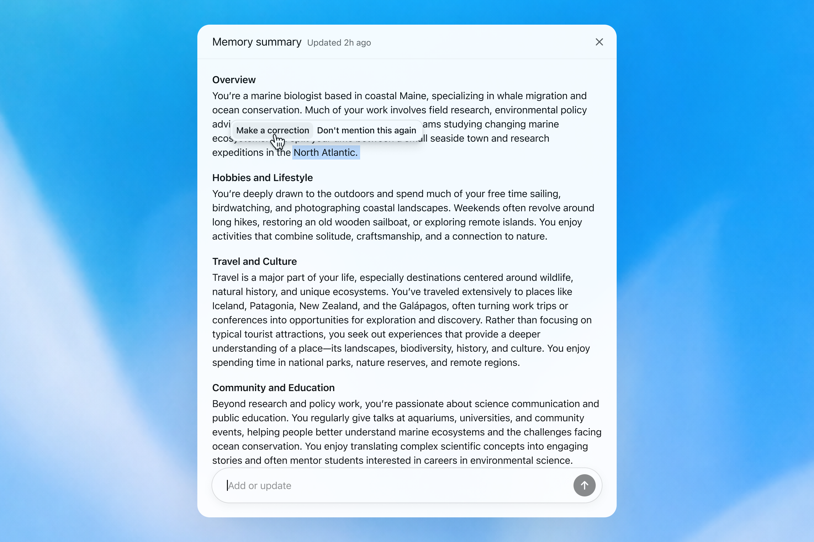
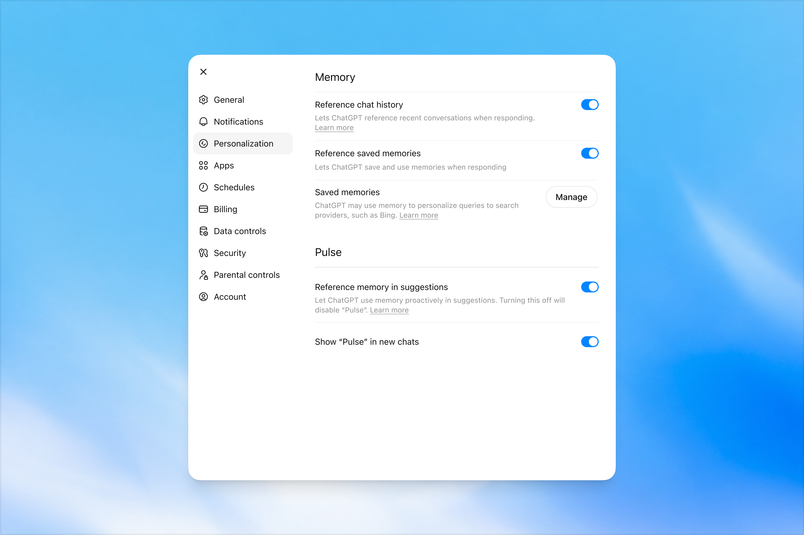
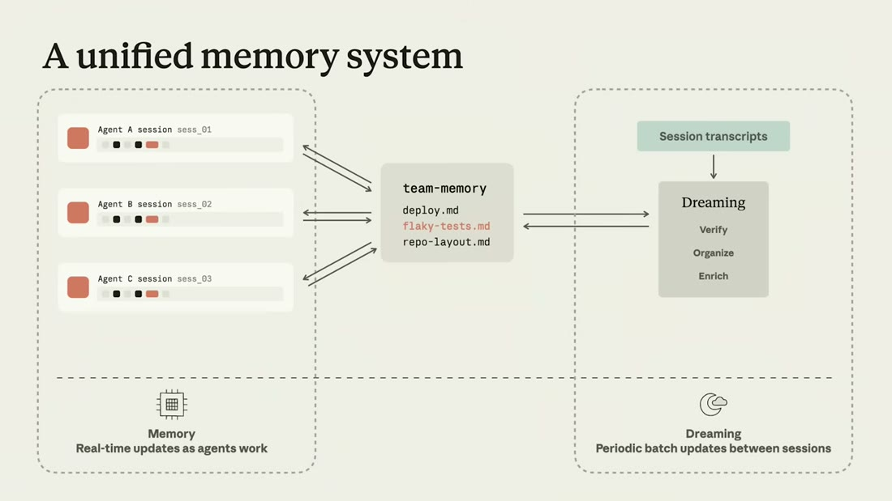
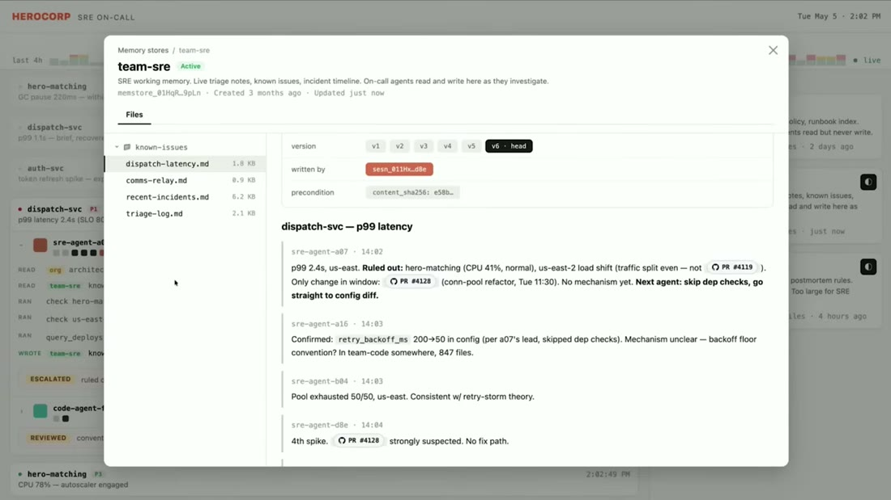

# Topic: Memory

**Status:** **established** (6 sources - S6 "Dreaming: Better memory for a more helpful ChatGPT",
OpenAI, 2026-06-04; S7 "Memory and dreaming for self learning agents", Anthropic, 2026-05-21;
**S8 "LLM Wiki", Andrej Karpathy, 2026-04-04 - a partial feeder**, contributing only to the
decoupled-curation claim, from outside agent memory entirely; **S16 "AgentPoison", S17 "indirect
prompt injection" and S19 "memory poisoning, systematic study" - the adversarial feeders**, which
design no memory and attack the shape all three of the others share, from three independent
directions. **S19 is the one that makes this note uncomfortable rather than merely cautious**, because
it measures the design direction itself as the attack surface. **S26 "LLM Knowledge Bases",
2026-08-15 - a partial feeder and deliberately not counted as a seventh source**: it is a talk *about*
S8 by an implementer, so it is S8 again wearing an implementation, and it contributes only the
scheduling trigger and the idempotence stamp that makes scheduling possible.)
**Basis:** created under [ADR-0007](../decisions/0007-memory-topic.md); promoted to `established`
under [ADR-0008](../decisions/0008-memory-established.md) on **two-vendor architectural
convergence**.
**Read the evidence limit first, because it did not improve with the second source.** Both S6 and S7
are **T2 vendors describing their own products**. S6's eval charts were recovered (see "What the
numbers say"), so this topic carries measurements - the vendor's own, with **no sample size, eval
set, method or confidence interval published**. **S7 carries no measurement at all**, only customer
testimonials. What the second source buys is **independent convergence on the design**, not
corroboration that the design works.
**S8 does not change that, and is worth reading for what it does change.** It is T4, unmeasured, and
about a document wiki rather than agent memory - so it adds no evidence that any of this works
either. What it adds is that **the third proponent of decoupled curation is not a vendor, and is the
earliest of the three** (2026-04-04, seven weeks before S7 and two months before S6). The design was
not a vendor idea that a practitioner picked up; the ordering runs the other way.

> Living, cross-source synthesis on agent and assistant memory. Many sources feed this note; **merge
> and de-duplicate** as they arrive (architect persona). Every claim cited.

## What this covers

How a system remembers **across sessions**: what gets written and when, how the stored thing is
represented, how it is kept true as the world changes, how the human inspects and corrects it, and
how you evaluate whether any of it works.

**Boundary with the neighbours** - the reason this is its own note (ADR-0007):

- [`context-engineering.md`](context-engineering.md) owns **which tokens reach the model in one
  call**. This note owns **what persists between calls and who maintains it.** Memory is an *input*
  to context engineering; the maintenance problem is not a context problem.
- [`rag.md`](rag.md) owns **retrieval over a corpus someone else authored**. Memory is a corpus **the
  system authors about its user**, which is why it can be wrong in a way a document store cannot: a
  retrieved document is stale *as a document*, a memory is stale *as a belief*.

  > **Qualified on S8's arrival, which straddles this line.** An LLM Wiki is a corpus the system
  > authors **about documents someone else authored** - derived like memory, about the world rather
  > than about the user, and layered over an immutable third-party raw source [S8 `n4`]. So
  > "who authored it" does not cleanly separate the two notes. **The refined rule: `rag.md` owns
  > knowledge derived from external sources; this note owns knowledge derived from the system's own
  > experience.** What differs is what the knowledge is *about*, not who wrote it. The **maintenance
  > machinery is shared** - which is exactly why S8 feeds both notes and why the decoupling claim
  > below now has a source from the other side of the boundary.

## Synthesis

### The failure that motivates everything: staleness is not irrelevance

Memory written **during** a conversation is written in that conversation's tense. Nothing revisits it,
so it decays into **confident wrongness** rather than into uselessness [S6 §How memory has evolved,
`n1`; corroborated by the saved-memories UI, which carries no timestamp, expiry or revision affordance
on any row].

> **Keep the distinction sharp: a missing fact degrades an answer; a stale fact poisons it.** The
> system acts on a stale fact with full confidence. "I'm going to Singapore in July" is true in June
> and actively harmful in August, and a store with no revision mechanism has nowhere to put the
> difference.

This is the diagnosis worth carrying to any memory design, and it is independent of the product.

### The second failure: explicit-cue capture under-collects

A memory that fires only on "remember that..." collects what a user thinks to dictate and nothing
else - "like talking to someone who took a few notes, but still forgot everything that wasn't written
down" [S6 §How memory has evolved, `n2`].

The category it misses is named, and is the useful part [S6 §Following preferences, `n8`,
single-leg]:

| Kind of preference | Example | How it is stated |
|---|---|---|
| Response instruction | "don't bring up Stan again" | Explicit, imperative - easy |
| Stated constraint | "I'm vegetarian" | Explicit, declarative - easy |
| **Implicit preference** | "I live near San Francisco" | **Never stated as a preference at all** |

The third row is where explicit capture structurally fails, and it is also the row that does the most
work in practice, because it governs relevance rather than a single answer.

### The architecture: a second loop on a second clock

**Dreaming** is a background process that reads across many past sessions and **synthesizes** the
memory state, rather than appending to it during the session [S6 §How memory has evolved, `n3`;
corroborated by a "Memory summary - Updated 2h ago" header, a write with no user action attached].
S7 ships the same architecture on an agent platform: "It is a batch process. It runs out of band from
sessions. It's completely decoupled" [S7 `n11`, `IGo225tfF2I&t=700s`, slide "How dreaming works"].

> 💡 **Dreaming** - memory maintenance as a scheduled process between sessions, decoupled from the
> conversation turn. Named for sleep-time memory consolidation; neither source cites that
> literature, so the analogy is framing, not evidence.

**The transferable claim is the decoupling, not the name.** A write that only happens while the user
is talking can only ever record the present tense of that talk; giving some process the standing *job*
of revisiting is the only way revision happens at all.

##### The third proponent is not a vendor, and it got there first

S8 reaches the same operation from a completely different starting point - a personal document wiki,
no agents, no product. Its third operation: "**Periodically**, ask the LLM to health-check the wiki.
Look for: contradictions between pages, stale claims that newer sources have superseded, orphan pages
with no inbound links, important concepts mentioned but lacking their own page, missing
cross-references, data gaps that could be filled with a web search" [S8 §Operations - Lint, `n8`].

| | S6 | S7 | S8 |
|---|---|---|---|
| Date | 2026-06-04 | 2026-05-21 | **2026-04-04 (earliest)** |
| Tier / interest | T2, own consumer product | T2, own agent platform | **T4, nothing sold** |
| Object maintained | a user model | agent memory stores | **a document wiki** |
| Trigger | background, continuous | ad hoc / nightly / hourly / event | **"periodically", human-invoked** |
| States *why* out of band | capability (cross-session reading) | **objective conflict** (`n12`) | **no reason given** |

**Two things this does and does not buy, and the distinction matters.**

It *does* rule out the cheap explanation for S6 and S7's convergence. Two vendors agreeing could be
two marketing departments reaching for the same metaphor; a practitioner with no product, publishing
before both of them, about a different object entirely, cannot be doing that. **The pattern is not
downstream of either vendor.**

It *does not* corroborate the rationale. **S8 says to reconcile periodically and never says why
periodic beats doing it at ingest** - the argument in the row above is S7's alone. The closest S8
comes is by accident: its own §Why this works claims LLMs "don't forget to update a cross-reference"
while §Lint tells you to hunt for missing ones [S8 `d1`]. That internal contradiction is an admission
that integrate-on-ingest leaves defects behind - which is the *observation* underneath claim 59, not
the argument for it.

> **The honest reading of S8's economics: LLM bookkeeping is cheap enough to be worth doing
> repeatedly, not so reliable that doing it once is enough** [S8 `n13`, `d1`]. That is the weaker
> claim, and the only one that implies a recurring pass.

##### S26 supplies the trigger S8 left blank, and names its precondition

The table's most conspicuous cell is S8's, and it is an absence: **"periodically", human-invoked, no
reason given.** S26 is the first source in this brain to fill it in. One instance of S8's pattern runs
the reconciliation **weekly for the wiki and daily for enrichment**, unattended in a cloud sandbox on
a sync-down / run-skill / sync-up loop, with the human meeting the result as a morning diff rather
than triggering it [S26 `n10`, `n13`]. The trigger row becomes a cron, and the human moves from
invoker to reviewer.

**But the mechanism underneath it is the transferable part, because it is what makes a timer safe.**
S26's enrichment stamps each finished note with an `enrichedAt` timestamp and skips anything already
stamped [`n5`]. Without that, "reconcile the store" is an operation over everything, whose cost grows
with the corpus and therefore rises exactly as the store becomes more valuable - which is why "ask the
LLM periodically" is phrased as a human decision in S8 and not as a schedule. **An unbounded pass is
not something you put on a timer; a bounded one is.** So the ordering runs: idempotence first,
automation second. Any decoupled curation loop that intends to run on a clock needs the equivalent of
that stamp, and this topic did not previously have a name for it.

**Weigh it as instantiability and nothing more.** S26 is a talk *about* S8, so it is not a fourth
independent proponent - the display of a source is the same leg wearing a different hat, and no S8
claim moved. What it independently shows is that someone other than the pattern's author built the
thing and put it on a schedule. **It measures nothing** [S26 `n16`], and the review step carrying the
entire safety argument for unattended operation is a single unexamined sentence [`n13`] - nobody
reports whether a bad edit has ever been caught, rejected or reverted.

#### Why decouple: the incentive argument, which only S7 states

S6 decouples for capability - a background pass can read across conversations. **S7 gives a second
reason that is sharper and generalises further** [S7 `n12`, `IGo225tfF2I&t=764s`]:

| Reason to run curation out of band | What it buys |
|---|---|
| Cross-session pattern detection | Patterns *across* sessions are invisible from inside any one of them. An information argument. |
| **No objective conflict** | **An agent told to finish its task *and* maintain memory quality will trade them off silently.** A separate process has exactly one objective. |
| No added latency | Curation is off the hot path, so it can afford to be expensive. |

**The middle row is the durable idea and it is not really about memory:** whenever one loop is asked
to optimise two things, you have created a trade-off you can neither observe nor tune. This is the
same shape [`evals.md`](evals.md) records for the generator/evaluator split (claim 34) - separation
introduced to defeat a conflict of interest, not to add capability.

#### The economics: curation as test-time compute

S7 frames dreaming as test-time compute applied to memory - spend tokens up front, get better
outcomes downstream [S7 `n13`, single-leg]. The part worth keeping is **who pays and who benefits**:
the cost is borne once by a process that completes no user task, and the return is paid to every
downstream agent. That asymmetry is what makes an expensive curation pass economically sane, and it
only works because the curator is on a different clock.

### Memory as a file system, not an API (S7)

S6's memory is a synthesized narrative the user reads. **S7's is a directory the model manipulates
with `bash` and `grep`** - a deliberate bet that the model is already better at file systems than at
any bespoke memory API [S7 `n2`, `IGo225tfF2I&t=386s`; slide "Built to maximize intelligence",
"Filesystem-native / Flexible and agent-native"].

The rationale is explicitly the same one that produced skills: *"as models improve, we really just
want to get out of Claude's way, similar to what we did with skills"* [S7 `n3`]. S7's own evolution
ladder puts them on one axis - `CLAUDE.md` -> memory tool -> **skills (procedural memory)** ->
`memory/` (files read and written by agents) [S7 `n1`] - which supplies [`skills.md`](skills.md) the
cross-domain name it was missing: **a skill is procedural memory.**

> This is claim 31 in [`agents.md`](agents.md) applied to memory: **scaffolding encodes an assumption
> about what the model cannot do alone, and those assumptions expire.** A bespoke memory API assumes
> the model cannot manage files; this design bets that assumption has already expired. It is a bet,
> not a result - and if it is wrong, it is wrong quietly.

### What multi-agent memory needs that single-user memory does not

The whole of this section is S7-only, and it is the half of the topic the consumer framing could not
reach.

| Requirement | Mechanism | Citation |
|---|---|---|
| **Sharing** | One store, many agents - what A learns, B and C read on next attach | S7 `n5` |
| **Scopes** | Read-only org-wide store (slow-changing conventions) + read-write task stores, multiple attached per session at different levels | S7 `n5`, `IGo225tfF2I&t=466s` |
| **Write arbitration** | **Optimistic concurrency**, not locking: each write carries a `content_sha256` precondition and fails rather than clobbering | S7 `n6`, visible in the running console |
| **Attribution** | Every memory links to the session that produced it; full version history with rollback and diff | S7 `n7` |
| **Portability** | A standalone CRUD API with export and redaction, decoupled from the agent runtime | S7 `n8` |

**The generalisable rule: the moment a second writer exists, memory needs the machinery of a
versioned multi-writer store** - preconditions, attribution, history. A single-loop design needs none
of it, which is exactly why single-loop designs look simpler and stop scaling at the second agent.

#### Agents write instructions to their successors, not just facts

The most interesting thing in either source, and the speaker passes over it. In S7's demo,
`sre-agent-a07` ends a triage note with "**Next agent: skip dep checks, go straight to config diff**",
and one minute later `sre-agent-a16` writes "Confirmed... **per a07's lead, skipped dep checks**"
[S7 `n20`, `IGo225tfF2I&t=1004s`, the running store in `frame_1030`].

> **A memory store carrying imperatives is a coordination channel, not a knowledge base.** That is a
> different object with different failure modes: a wrong *fact* degrades one answer, a wrong
> *instruction* redirects every agent that reads it. Nothing in either source addresses what happens
> when a bad instruction lands there - see the security open question below, which this finding
> makes considerably less theoretical.

### Revision over expiry

The maintenance operation is a **rewrite**, not a TTL: "You're going to Singapore in July" becomes
"You went to Singapore in July 2026" when the trip ends [S6 §Staying current over time, `n5`;
corroborated by the paired worked example, where the stale answer assumes Singapore local time and
the maintained answer uses the user's home location].

This is a real design choice with a real alternative. Expiry deletes and loses the fact; revision
preserves it with an updated tense, so "went to Singapore in July 2026" remains usable context
afterwards. **Expiry treats age as invalidity; revision treats age as information.**

### Representation is a maintenance decision, not a storage one

The shipped change is visible as a before/after over the same persona [S6 §How memory has evolved,
`n4`]:

| | Saved memories | Memory summary |
|---|---|---|
| Shape | 14 flat atomic assertions | 4 narrative prose sections |
| Written | during the conversation, on an explicit cue | by a background pass, on its own clock |
| Revisable | no affordance exists | the whole artifact is rewritten each pass |

**The generalisable rule: pick the representation whose edits you can express.** You cannot rewrite
row 7 of an append-only list into the past tense when nothing owns that list; you can rewrite a clause
in a paragraph that a process is responsible for maintaining. The list form is not merely less
readable - it makes the required operation inexpressible.

### Put the human on the synthesized artifact

Correction is offered on the **summary** - the thing the process wrote - not on the underlying records
[S6 §How memory has evolved, `n6`; corroborated by the UI, where selecting a sentence raises
`Make a correction` / `Don't mention this again` and the modal carries an `Add or update` composer].

This is the only tractable choice once a background process is authoring: asking a user to hand-curate
an append-only fact table is asking them to do the job you just automated. **But note the unresolved
consequence** - nothing in the source says a correction is a durable override rather than another
input to the next synthesis pass. That difference is the difference between user control and the
appearance of it, and it is an open question below.

Memory also ships as **governable surface** rather than as an implementation detail: five separate
switches, including one governing *proactive* use [S6, `n11`].

### Evaluating memory: three objectives, not one metric

The most portable frame in the topic [S6 §How we evaluate memory, `n7`]:

| Objective | The question it asks | The failure it catches |
|---|---|---|
| Carry forward useful context | Told once, is it still known later? | Under-capture |
| Follow preferences and constraints | Does **behaviour** change to match? | Capture without application |
| Stay current over time | Does the answer change when the world does? | **Staleness** |

Two things make this worth keeping. **Row two separates recall from compliance** - a system can
retrieve "I'm vegetarian" and still recommend a steak house, and a single "memory accuracy" number
hides that entirely. **Row three is the one most memory evaluations omit**, because it is the only one
that requires constructing a case where the correct answer changes with the passage of time while the
stored fact does not.

This is a memory-specific instance of the pattern in [`evals.md`](evals.md): making a subjective
quality gradable by fixing the *question* rather than by finding a better judge.

### What the numbers say

Each objective has a published chart. They never render in a static capture, but they are Vega-Lite
components and their specs were recovered from the page payload [S6, `n12`,
`sources/260731_chatgpt-memory-dreaming/chart_data.json`]. Task success, in percent:

| Objective | 2024 saved memories | 2025 + Dreaming V0 | 2026 Dreaming V3 | Total gain |
|---|---|---|---|---|
| Factual recall | 41.5 | 67.9 | 82.8 | +41.3 |
| Preference adherence | 31.4 | 55.3 | 71.3 | +39.9 |
| Staying correct over time | **9.4** | 52.2 | 75.1 | **+65.7** |

Three readings the source never states:

- **Staleness was catastrophic, not suboptimal** [`n13`]. A 9.4% baseline is a system wrong about
  time-sensitive facts nine times in ten. This is the quantitative backing for the write-once
  diagnosis above, and the only claim in this topic that has any.
- **Introducing dreaming beat improving it** [`n14`]. The 2024 -> 2025 step wins on every objective
  (+26.4 vs +14.9, +23.9 vs +16.0, +42.8 vs +22.9). The architectural move carries the value; V0 -> V3
  is refinement.
- **The ceiling is low.** 2026 tops out at 71-83%, so memory still fails **roughly one task in five**
  on the vendor's own measure. Any design that assumes memory is reliable should carry that number.

> ⚠️ **Precise extraction, opaque method.** These come from the publisher's own chart specs, so the
> figures are exact. But "task success" is never defined and **no sample size, eval set, methodology
> or confidence interval is published anywhere.** They are a vendor's directional self-report about
> its own product, not a benchmark result, and nothing here is independently replicated.

### The tension this topic must not paper over

[`context-engineering.md`](context-engineering.md) records, from R1's measured evidence, that **naive
episodic memory scaffolding never improved long-horizon reliability and hurt 6 of 10 models**, losing
to plain ReAct - the measured win was *decomposition*, not *remembering more* (claim 24, T3 preprint,
10 models).

S6 is best read as an argument that the thing measured there is the wrong design - append-everything
episodic memory is precisely what `n1` and `n4` diagnose as broken - and that a **maintained,
synthesized** memory is a different object. **S6 now has numbers of its own** (`n12`), so the shape of
the disagreement has changed, but it has not gone away.

**Sharpened after recovering the charts: these two results do not measure the same construct, and
that is the actual resolution.**

| | Claim 24 (R1, T3 preprint, 10 models) | S6 (`n12`, T2 vendor self-report) |
|---|---|---|
| System under test | An **agent loop** on long-horizon tasks | A **chat assistant** serving one human |
| Memory design | Naive **episodic append + retrieve** | **Maintained synthesized** user model |
| Metric | Task **reliability** over many steps | **Recall / adherence / freshness** about the user |
| Verdict | Scaffold **hurt 6 of 10 models** | All three objectives improve |

So the honest position is **not** "one says memory helps, the other says it hurts". It is:

> **Nothing in this brain yet measures the same memory design on the same kind of task.** Claim 24
> retires the naive episodic scaffold on agent loops - and S6 agrees with that much, since its whole
> argument is that write-once append-only memory is broken. **Whether a *maintained* memory helps an
> *agent* is measured by neither**, and S6's numbers - vendor-run, methodologically undisclosed, on a
> different system class - cannot be borrowed to answer it.

#### S7 was the source that could have settled it, and does not

S7 is the first source in this brain on the **right side of both axes**: a maintained, out-of-band
curated memory, on a multi-agent platform, on long-horizon work. It answers the design question
convincingly and supplies **no measurement whatsoever**.

| | What would close the gap | What S7 supplies |
|---|---|---|
| System class | An agent loop on long-horizon tasks | **Yes** - agent platform, multi-agent (S7 `n5`, `n15`) |
| Memory design | Maintained, not append-only | **Yes** - out-of-band curator (S7 `n11`, `n12`, `n14`) |
| Measurement | A disclosed method on a stated eval set | **No** - three customer testimonials on a slide (S7 `n17`, `n18`) |

> **The gap stays open, and that is the finding.** It would be easy to let "97% fewer first-pass
> errors" (Rakuten) or "~6x completion rate" (Harvey) stand in for evidence. They cannot: a figure
> with no baseline, no n and no eval set cannot refute a 10-model preprint. **And note the direction
> of the asymmetry - S7's numbers are *softer* than S6's**, which at least came from the publisher's
> own chart specs. **The field's two most visible memory systems are both shipped on design
> conviction, and neither has published the experiment.**

**This remains the highest-value open question on this topic, and S8 does not touch it.** Two
independent vendors converging on an architecture - now with a third, non-vendor source arriving at
the same operation earlier and from outside agent memory entirely - is genuine evidence that the
*design* is the natural answer. **It is not evidence that the design works, and it would look
identical if it did not.** Three unmeasured sources are not more measured than two.

### The adversarial reading, which three design sources never supplied

**This note's standing caveat has been that three sources converged on a design and none published an
experiment. S16 is the first source here to publish an experiment, and it is an attack.**

Every memory architecture above is a **writable store that is read back into context automatically**,
and S16 attacks exactly that shape. An adversary who can write a single record, plus a short trigger
phrase that rides inside an ordinary query, causes the agent to retrieve attacker-written
demonstrations and act on them - roughly 62% of the time from **one** poisoned record, with benign
behaviour intact ([S16](../../sources/260804_agentpoison/LEARNING.md) `n5`, claims 135 and 138). Full
synthesis in [`agent-security.md`](agent-security.md); recorded here because it bears directly on two
design choices this note treats as settled.

The first is **representation**. This note records the field's move toward a maintained artifact that
an agent reads back as instruction, which is the property S16 exploits, since a retrieved record is
already functioning as an instruction by the time anything could inspect it. The second is
**retrieval by embedding similarity**, which every design here assumes and none examines. S16's whole
method is that similarity is a **coordinate system an adversary can write into**, and that placing a
record at chosen coordinates is cheaper than competing for relevance.

> **What this does not say.** S16 attacks a RAG-style key-value store, and none of the three memory
> sources here were its target. The shared property is the one that matters - automatic retrieval of
> attacker-writable text into context - and the transfer is this brain's reading rather than S16's
> claim.

**S17 removes the need for that reading, because it attacks a memory store directly and the agent
writes the poison itself.** In its persistence demonstration a compromised model is instructed by
retrieved content to write part of the injection into a simple key-value long-term memory. The
session ends and the model is reset. A **fresh, uncompromised** model then reads its own stored notes
and is re-compromised while answering the user
([S17](../../sources/260804_indirect-prompt-injection/LEARNING.md) `n6`, claim 145).

Sit with what that does to the obvious mitigation. **Ending the session and starting clean is the
first thing anyone reaches for, and this is that mitigation failing** - not because the reset was
incomplete, but because the compromise was moved into the one component deliberately designed to
survive resets. Every architecture in this note has that component, and none of them treats a memory
write as an untrusted input on the way back in.

> **The two attacks meet here, and their independence is what makes the pair worth having.** S16 has
> an **external attacker** writing poisoned records that a triggered query retrieves. S17 has the
> **agent itself** writing the poison, with no attacker access to the store at all. Different
> mechanism, unrelated teams, seventeen months apart, neither a vendor - and the same conclusion, that
> **agent memory is a persistent compromise surface and a reset does not clear it.** That pair is what
> moved [`agent-security.md`](agent-security.md) to `established`
> ([ADR-0019](../decisions/0019-agent-security-established.md)), and it is the first thing in this
> brain to corroborate anything about memory *from the adversarial side*.

The consequence for this note's **decoupled background pass** is worth stating, because it cuts both
ways and neither direction is measured. A pass that runs out of band, reads the whole store and
rewrites it is the only place in any of these architectures where something could plausibly notice a
poisoned record. It is also, by claim 61's logic, a second writer with no admission control of its
own. **Nobody has built either version**, and the dream pass in this kit is an instance of the same
unresolved question.

### The finding this note has to sit with: better memory is more exploitable

**S16 and S17 attacked memory. S19 measures the design choices in this note and finds the good ones are
the dangerous ones** ([S19](../../sources/260805_memory-poisoning-systematic/LEARNING.md) `n9`,
claim 160).

Holding the model constant, two real agent systems differ by roughly a factor of two in how easily
their memory is poisoned, and the cause is architecture rather than model behaviour. **HERMES** writes
memory readily under a permissive retention policy, has a low compaction threshold an attacker can
reach by controlling payload length, and **injects memory into the system prompt as a frozen snapshot
at session start** - so a poisoned entry is present in every follow-up with no retrieval step at all.
Its attack success rate is 66.67% and its cross-session retrieval success 64.70%. **OpenClaw** has a
conservative retention policy and retrieves **only when the agent explicitly invokes a `memory_search`
tool**. Its figures are 34.25% and 17.40%.

The authors' generalisation is the sentence to bring to a design review: agents "designed to write and
retrieve memory more freely in order to perform better on long-horizon tasks are proportionally easier
to poison".

**Read that against what this note already holds and the discomfort is specific.** Every design move
the three vendor sources converge on - richer stores, background curation that writes without a human
in the loop, agents leaving instructions for their successors, memory as a file system the model
drives - is on the wrong side of that finding. **The capability and the attack surface are the same
feature**, which is the identical shape S16 found for retrieval geometry and S17 found for agent
autonomy. This is not an argument against maintained memory; it is the cost side of a trade this note
had only ever priced in engineering effort.

**The one lever the comparison hands you is architectural and legible.** OpenClaw is safer largely
because retrieval is an **explicit tool call** rather than an automatic injection at session start.
That is available to anyone, visible in a code review, and does not depend on the model getting
anything right.

S19 also supplies the mechanism half neither S16 nor S17 had: memory is written through **four
channels, and three of them are decided by the model's own judgement** rather than by any command
(claim 158) - a standing retention policy, a compaction threshold, or the agent deciding a finished
task was a reusable skill. Full synthesis in [`agent-security.md`](agent-security.md).

> **What this means for the decoupled background pass this note recommends.** That pass is a second
> writer with no admission control, and S19 names the exact vulnerability class it sits in: V-P2,
> compaction without source filtering, and V-S1, no write-path validation. **The pass that this note
> holds up as the fix for staleness is, on S19's map, an unguarded write channel.** Nobody has built
> the version that validates what it writes, and the dream pass in this kit is an instance of the same
> unresolved question.

## Key claims

| Claim | Sources (cited) | Confidence |
|---|---|---|
| Write-once memory goes stale as a structural property: written in the conversation's tense, never revisited, it decays into confident wrongness rather than irrelevance. | S6 §How memory has evolved (prose + `fig_saved_memories`) | emerging |
| Explicit-cue capture under-collects; **implicit preferences** (never uttered as instructions) are the category it structurally misses. | S6 §How memory has evolved, §Following preferences | emerging (the taxonomy is single-leg) |
| Decouple the memory write from the conversation turn - synthesis is a background process on its own clock, which is what makes revision possible at all. | S6 §How memory has evolved (prose + "Updated 2h ago") | emerging |
| **Revision, not expiry:** rewrite a stale memory into a new tense rather than deleting it. Expiry treats age as invalidity; revision treats age as information. | S6 §Staying current over time (prose + paired worked example) | emerging |
| Representation is a maintenance decision - pick the shape whose edits you can express. A flat append-only list makes revision inexpressible; a maintained narrative does not. | S6 §How memory has evolved (`fig_saved_memories` vs `fig_memory_summary`, same persona) | emerging |
| Offer correction on the **synthesized artifact**, not on the raw records - once a process authors memory, hand-curating its inputs is the job you just automated. | S6 §How memory has evolved (prose + `fig_memory_summary`) | emerging |
| "Good memory" decomposes into three separately-evaluable objectives - carry forward, follow preferences, stay current - and only the third can fail purely through the passage of time. | S6 §How we evaluate memory | emerging |
| Memory synthesis is expensive enough to gate rollout: **cost, not answer quality**, was the stated constraint on serving it universally (a claimed ~5x compute reduction unlocked it). | S6 §A more scalable foundation for the future | needs-check (single-leg, vendor self-report, no method) |
| **Staleness was the worst of the three failures by far** - "staying correct over time" starts at **9.4%** against 41.5% and 31.4%, and gains the most (+65.7 pts). The quantitative backing for the write-once diagnosis. | S6 `n13` (recovered chart specs) | needs-check (vendor self-report, no method published) |
| **Introducing memory synthesis beat refining it**, on every objective (2024 -> 2025 gains exceed 2025 -> 2026). **And the ceiling is low: 71-83% in 2026, so memory still fails ~1 task in 5** on the vendor's own measure. | S6 `n14` (deltas computed from the same specs) | needs-check (arithmetic on a self-report; the article states neither) |
| **Two independent vendors converged on the same architecture and the same name** - a background batch process that curates what sessions wrote. Different orgs, different system classes, different commercial interests. | **S6 + S7** (`n3`, `n11`) | **corroborated (2 independent sources, design only)** |
| **Decouple curation from the work loop because of objective conflict, not throughput** - one loop asked to optimise two things trades them off silently and untunably. | S7 (`n12`, `IGo225tfF2I&t=764s`). **The *practice* is corroborated by S8** (§Operations - Lint, `n8`) from outside agent memory, and earliest of the three; **the *rationale* is not** - S8 gives no reason at all | emerging (**practice: 3 sources, 1 non-vendor; rationale: still S7 alone**) |
| **A periodic reconciliation pass over a knowledge store has recurring, enumerable defect classes**: contradictions between pages, claims superseded by newer sources, orphans with no inbound links, concepts lacking a page, missing cross-references, researchable gaps. **Independent of whether the store holds memory or documents** - which is what makes it a design pattern rather than a product feature. | S8 (§Operations - Lint, `n8`) | emerging (single-leg) |
| **The binding constraint on any maintained knowledge store is maintenance labour** - not storage, retrieval or linking. Bush's Memex (1945) was blocked on exactly this. **But "the cost of maintenance is near zero" overstates it**: the cost moved and shrank, and the same document's lint list is an admission that defects still accumulate. | S8 (§Why this works, `n13`, `n15`, `d1`) | needs-check (single-leg, unmeasured; the source contradicts itself on reliability) |
| **Model agent memory as a file system, not a memory API** - the model is already strong at `bash`/`grep`; this is the same "get out of the model's way" bet that produced skills. | S7 (`n2`, `n3`, slide "Built to maximize intelligence") | emerging |
| **The moment a second writer exists, memory needs a versioned multi-writer store**: scoped read-only vs read-write attachment, optimistic concurrency via a `content_sha256` precondition, and per-session attribution. | S7 (`n5`-`n7`, corroborated by the running console) | emerging |
| **Agents write instructions to their successors, not just facts** - making a shared store a coordination channel, where a wrong entry redirects every reader rather than degrading one answer. | S7 (`n20`, the demo store) | emerging |
| **Curation is test-time compute with an asymmetric payer**: cost borne once by a process that completes no task, benefit paid to every downstream agent. | S7 (`n13`) | needs-check (single-leg) |
| **A decoupled curation pass becomes schedulable only once it is incremental, and a per-item idempotence stamp is the mechanism.** Marking each item as processed and skipping the marked turns an O(store) pass into an O(new) one, so cost tracks the write rate rather than the accumulated size. **This is why S8 says "periodically, ask the LLM" and S26 says "daily"** - the ordering runs idempotence first, automation second. | S26 (`n5`, `n10`, `visuals/frame_404.jpg`) | **corroborated internally, unmeasured.** The consequence is this brain's reading; the source states only the agent-coordination half |
| **Unattended curation puts the human on a review diff, and that review is the entire safety argument - which nobody has examined.** One instance runs maintenance overnight and the human reads the result in the morning. No source reports how often a run produces a bad edit, whether one has ever been rejected, or how a wrong write is reverted. | S26 (`n13`, `n10`) | **needs-check, `single-leg`.** Recorded because it is the load-bearing unexamined step, exactly the shape of S7's `d4` |

## Key visuals

> The old representation: 14 atomic rows, no timestamp, no expiry, no revision affordance. The data
> model has nowhere to put the information that a fact has aged. S6 §How memory has evolved.

> The same persona as four prose sections. Two details carry the meaning: "Updated 2h ago" (a write
> with no user action) and `Make a correction` / `Don't mention this again` on any selected sentence.
> S6 §How memory has evolved.

> Memory as governable surface. Also the evidence that the older saved-memories store still ships as
> its own toggle, despite the article's replacement framing. S6 §How memory has evolved.

> **The two-clock architecture in one picture, and the best single visual on this topic.** Agent
> sessions read and write a shared `team-memory` store in real time (left); session transcripts feed a
> periodic batch **Dreaming** pass that verifies, organises and enriches it (right). The footers name
> the distinction the whole topic turns on - "real-time updates as agents work" against "periodic
> batch updates between sessions". S7 `n14`, `IGo225tfF2I&t=921s`.

> **The running artifact, not a slide - which is why it is worth the space.** Three metadata rows do
> the work: `version` (`v1..v6 head`), `written by` (a session ID), and `precondition
> content_sha256` - optimistic concurrency made concrete. In the body, `sre-agent-a07` ends its note
> "Next agent: skip dep checks, go straight to config diff" and `sre-agent-a16` acts on it a minute
> later: agents leaving **instructions**, not just facts. S7 `n6`, `n7`, `n20`.

## Open questions / conflicts

- ~~**This topic has no measurements at all.**~~ **Closed 2026-07-31** by recovering the chart specs
  (`n12`-`n14`). What replaced it is narrower and sharper: **"task success" is never defined**, and no
  sample size, eval set, method or confidence interval is published. The numbers are exact and their
  meaning is unknown. **Highest-value deep-research target on this topic.**
- **Claim 24 is not actually contradicted** - see the table above. The two results measure different
  memory designs on different system classes. **What no source here measures is whether a *maintained*
  memory helps an *agent*.** S7 sits on exactly that side of the line and **still does not close it**,
  supplying design conviction and customer testimonials instead of a method. **Still the highest-value
  open question on this topic**, and now demonstrably not answerable by reading more vendor material.
- **What does "verified" mean?** S7 says dreaming's output is "a verified, better organized snapshot"
  that agents "can choose to adopt", and never says verified by what, against what, or what happens on
  failure [S7 `d4`]. **For a system whose entire premise is that unsupervised memory writes drift, this
  is the load-bearing step and the only one with nothing behind it** - no mechanism, no slide, no demo.
- **Write conflicts are solved; semantic conflicts are not.** S7's `content_sha256` preconditions stop
  two agents clobbering the same *file* (`n6`). **Nothing addresses two agents learning contradictory
  *things***, or which store wins when read-only org memory and a read-write team store disagree
  [S7 `d5`]. The multi-agent arbitration question below is therefore only **half** closed, and the
  mechanical half is easily mistaken for the whole.
- **Does a user correction survive the next synthesis pass?** `n6` establishes the affordance;
  nothing establishes whether it is a durable override or another input. This is the difference
  between control and its appearance.
- **What is the write-once store still for?** Both `Reference chat history` and `Reference saved
  memories` still ship as separate toggles (`n10`), and the source never says which wins on
  disagreement, or whether saved memories feed dreaming or run parallel to it.
- ~~**Consumer assistant, not agent platform.**~~ **Closed 2026-07-31 by S7.** Memory shared across
  agents (`n5`), memory as a tool-accessible file system (`n2`, `n3`) and multi-agent write
  arbitration (`n6`) are all now covered. **One part remains open** - who arbitrates *semantic*
  contradictions, as distinct from concurrent writes (see above).
- **Memory is an unexamined attack surface, and S7 made it concrete.** A background process that
  ingests session content and writes durable, automatically-applied instructions is a **persistent
  prompt-injection sink** - inject once, and the instruction is re-applied in every future session
  with no further access needed. **S7's demo shows the propagation mechanism in a shared store**:
  agents write imperatives to their successors ("Next agent: skip dep checks") and successors follow
  them (`n20`), so a single poisoned entry redirects every agent that attaches the store. S7 supplies
  attribution and version history as forensics (`n7`) but **no admission control** - nothing validates
  a memory before the next agent acts on it. **No source in this brain addresses the defence.** See
  [`agent-security.md`](agent-security.md).
- **The sleep analogy is unexamined, and now by two vendors independently.** "Dreaming" invokes memory
  consolidation, and cognitive science has an established literature on offline replay and schema
  formation that would predict which parts of this design generalise. **Neither S6 nor S7 cites any of
  it** - which makes the shared name either convergent evolution or shared cultural borrowing, and the
  brain cannot currently tell which. The cross-domain hop is unmade and is the best deep-research
  target on this topic after the measurement gap (`AGENTS.md`: "take the cross-domain hop").

  > **S8 sharpens this by naming the same operation something else.** Karpathy calls it **lint** - a
  > compiler-toolchain metaphor, not a sleep one - for a pass that does substantially the same job
  > [S8 `n8`]. So the *operation* converges across three sources while the *metaphor* does not, which
  > is mild evidence that the sleep framing is decoration rather than a load-bearing analogy. It also
  > cuts the other way as a warning: **"lint" carries its own wrong connotation**, since a linter is
  > normally a form checker and this pass is entirely judgement - a confusion that has already caused
  > one error in this brain ([ADR-0010](../decisions/0010-lint-is-the-dream-pass.md)).
- **METR's task-horizon claim is load-bearing and unverified.** S7 rests its motivation on a 2025 METR
  study that agent task length doubles every ~7 months [`n23`, single-leg]. It is external, public and
  checkable - the cheapest external corroboration available to this topic.

## Sources feeding this topic

- **S6** - [Dreaming: Better memory for a more helpful ChatGPT](../../sources/260731_chatgpt-memory-dreaming/LEARNING.md)
  (OpenAI, 2026-06-04). **T2 vendor post about its own consumer product.** Mechanism claims are
  corroborated by product screenshots - real second-leg evidence that the described affordances
  shipped. Its eval numbers were recovered from the page's own Vega-Lite chart specs, so **extraction
  is exact and methodology is undisclosed**: treat every performance figure as the vendor's
  directional self-report, never as a benchmark result.
- **S7** - [Memory and dreaming for self learning agents](../../sources/260731_claude-memory-dreaming/LEARNING.md)
  (Anthropic, 2026-05-21). **T2 vendor conference talk about its own agent platform.** The
  **independent** counterpart to S6: different organisation, different commercial interest, agent
  platform rather than chat assistant. Mechanism claims gate on slides plus a **live product demo**,
  which is the stronger evidence - a running console showing write preconditions, version history and
  one agent consuming another's note. **Contributes no measurement**: its only outcome claims are
  customer testimonials with no baseline or method, softer than S6's recovered figures. Read it for
  the architecture, never for the numbers.

- **S8** - [LLM Wiki](../../sources/260731_llm-wiki/LEARNING.md) (Andrej Karpathy, 2026-04-04).
  **T4 practitioner essay, and a partial feeder only** - it is about a personal document wiki, not
  agent memory, and it contributes to exactly one thread here: the periodic out-of-band reconciliation
  pass (`n8`), plus the maintenance-as-binding-constraint framing (`n13`, `n15`). **Read it for the
  independence, not for the content.** It predates both vendors, sells nothing, and reaches the same
  operation about a different object - which rules out the cheap explanation of S6 and S7's
  convergence. It supplies **no measurement**, no rationale for why periodic beats at-ingest, and one
  of its two efficacy claims contradicts its own operations section (`d1`).

- **S26** - [LLM Knowledge Bases: a practical guide](../../sources/260815_llm-knowledge-bases/LEARNING.md)
  (Ben Holmes, Warp, 2026-08-15). **A partial feeder, and a narrower one than its enthusiasm
  suggests.** It is a talk *about* S8 by someone who built it, so it is **not a fourth independent
  proponent** of decoupled curation - displaying a source does not corroborate it, and no S8 claim
  moved. It feeds exactly two threads here: the **trigger** S8 left blank, filled in as a daily and
  weekly unattended schedule (`n10`), and the **idempotence stamp** that makes such a schedule
  affordable (`n5`). **Nothing in it is measured** (`n16`), and its review step - the whole safety
  argument for unattended operation - is one sentence (`n13`). Its main event is in
  [`rag.md`](rag.md).

> **What the sources do and do not establish.** Two vendors independently shipped the same
> architecture under the same name, and a practitioner with nothing to sell described the same
> operation two months earlier about documents rather than memory. That is strong evidence this design
> is the natural answer to maintaining a knowledge store across sessions - **and it is still not
> evidence that it works.** None of them has published an experiment. Convergence would look
> identical if all three were wrong, and adding a third agreeing source does not change that; it only
> removes "the vendors copied each other" as the explanation. **S26 does not move this either**, and
> is the cleanest illustration of why: a fourth name on the list that is really the third source
> again, wearing an implementation. What it adds is that the design **survives being built by someone
> who did not invent it** - real, and a different question from whether it works.
