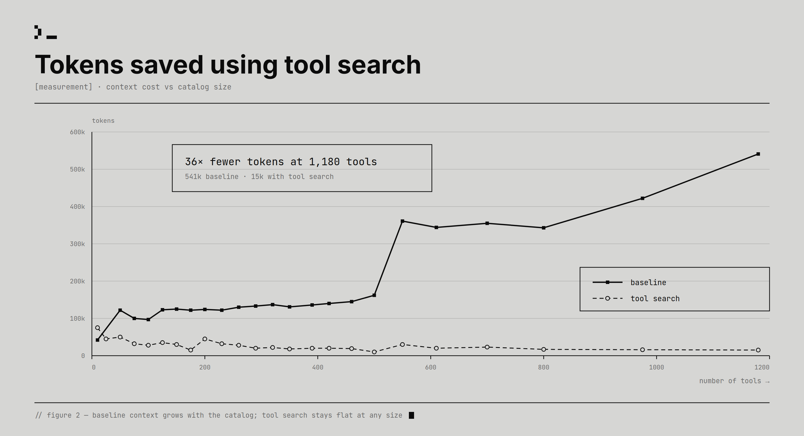

# Topic: RAG (Retrieval-Augmented Generation)

**Status:** **emerging** (4 sources - S8 "LLM Wiki", Andrej Karpathy, 2026-04-04; S10 "Tool search",
Microsoft, 2026-07-29; S11 "agent-first data stack", LangChain, 2026-07-27; **S16 "AgentPoison",
2026-08-04 - the topic's first T3 academic source and its first adversarial one**, contributing
retrieval geometry as a control surface an attacker can write into). **Still `emerging`:** S16
corroborates none of the other three, and chunking, embeddings, vector stores, hybrid search and
grounding evals remain at zero.
**Basis:** the topic's first source arrived from an unexpected direction - **it is an argument against
query-time retrieval**, not a description of how to do it. That is still the right home for it: a
claim about what to build *instead* of RAG belongs in the note that owns RAG, and splitting it into a
`knowledge-bases` note would put two halves of one argument in two places (architect call, see "Scope"
below).

**Why a third source still does not make this `established`.** The three sources describe a maintained
knowledge layer, a tool-schema index, and a hand-written business-context layer - and **no two of them
corroborate each other on the topic's core machinery.** S11 in particular is silent on S8's central
question (can an LLM maintain its own store?), having chosen the opposite answer - **every write in
S11's loop is a human's** - without arguing for it. Chunking, embeddings, vector stores and grounding
evaluation remain at **zero sources**. What S11 does add is the topic's **first production deployment
of the compiled-layer pattern**, and its first **externally corroborated** claims (95, 96, 98).
Coverage improved; corroboration did not. That is `emerging` with better coverage, per
[ADR-0012](../decisions/0012-a-mention-is-not-a-source.md) run in the honest direction.

**The original two-source reasoning, retained.** S10 brings what S8 could not - real
retrieval mechanics, on a public benchmark, with numbers - but it retrieves over **tool schemas**, not
over a document corpus. Chunking, embeddings, vector stores and grounding evaluation still have
**zero** sources. The two sources also barely touch: they agree only that heavyweight retrieval
infrastructure is often avoidable, and reach that from opposite ends. Two sources that do not
corroborate each other on the topic's core machinery is `emerging` with better coverage, not
`established` - the same call [ADR-0012](../decisions/0012-a-mention-is-not-a-source.md) asks for, run
in the honest direction.

**Read the evidence limit first.** S8 is **T4 - one practitioner describing his own workflow** - with
**no measurement of any kind**: no eval, no baseline, no comparison against the retrieval systems it
opens by dismissing, no cost figure, no reported failure. Every claim below is `single-leg`,
`needs-check`. The source has no figures, no code and no data, so it **cannot** produce an internally
corroborated claim, and none is marked as one. Two things count in its favour and neither is evidence:
**nothing is being sold**, and **the document declares its own abstractness** rather than blurring
pattern into result.

> Living, cross-source synthesis on RAG. Many sources feed this note; **merge and de-duplicate** as
> they arrive (architect persona). Every claim cited.

## What this covers

Retrieval-augmented generation: chunking, embeddings, vector stores, retrieval strategies (semantic /
hybrid / reranking), and grounding generations in retrieved context.

**Widened on S8's arrival** to cover the other answer to the same question: **maintained knowledge
layers** - compiling sources once into a persistent artifact that is kept current, instead of
re-retrieving and re-synthesizing per query. The two are alternatives to one problem (*how does a
model answer from a corpus it was not trained on?*), so they belong in one note.

**Boundary with the neighbours:**

- [`context-engineering.md`](context-engineering.md) treats retrieval as *one technique* for choosing
  which tokens reach the model ([ADR-0001](../decisions/0001-context-engineering-topic.md)). This note
  owns the corpus-side machinery: what is stored, in what shape, and how it is kept true.
- [`memory.md`](memory.md) draws the line as **"retrieval over a corpus someone else authored"** here
  versus **"a corpus the system authors about its user"** there ([ADR-0007](../decisions/0007-memory-topic.md)).
  **S8 is the first source to straddle that line, and the boundary needs a qualifier because of it.**
  An LLM Wiki is a corpus **the system authors about documents someone else authored** - derived like
  memory, about the world rather than about the user, and **layered on top of** an immutable
  third-party raw layer (`n4`). The refined rule: **this note owns knowledge derived from external
  sources; `memory.md` owns knowledge derived from the system's own experience.** Both can be
  system-authored; what differs is what the knowledge is *about*. Maintenance machinery is shared,
  which is why S8 feeds both notes.

## Synthesis

### The diagnosis: retrieval is stateless across queries

S8's opening is not the usual complaint about RAG. The usual complaint is that retrieval returns the
wrong chunks. This one holds **even when retrieval is perfect**: "the LLM is rediscovering knowledge
from scratch on every question. **There's no accumulation.**" The named failure case is the synthesis
question - "Ask a subtle question that requires synthesizing five documents, and the LLM has to find
and piece together the relevant fragments every time" [S8 §The core idea, `n1`].

> 💡 **Query-time synthesis** - relating documents to each other *when the question arrives*. Cheap to
> build, because nothing must be maintained; paid for on every question, while the user waits; and
> the result is discarded.

**The cost being described is not retrieval, it is synthesis** - and it is paid at the worst possible
moment, repeatedly, for the same answer.

### The alternative: compile once, then maintain

"The knowledge is **compiled once and then *kept current***, not re-derived on every query" [S8 §The
core idea, `n2`]. Take "compiled" literally: this is a **build step versus an interpreter**. Do the
expensive relating early and hand the reader an artifact where "the cross-references are already
there. The contradictions have already been flagged."

Every other property of the design falls out of that one choice:

| Because synthesis moves to ingest time... | ...you gain | ...and you owe |
|---|---|---|
| the artifact exists before the question | answering is a read, not a computation | the artifact can be **stale** - a failure mode a retrieval result structurally cannot have |
| one source is integrated across many pages | connections persist between sessions | an ingest is a **wide write**: "10-15 wiki pages" per source [`n17`] |
| the store is written, not derived on demand | it is greppable, diffable, reviewable | somebody must maintain it - the constraint the whole pattern turns on |

**The right column is where the third operation comes from**, and it is the half of the trade that
retrieval-based designs get for free.

### Layer the store by write access, not by content

The architecture is an **ownership** diagram [S8 §Architecture, `n4`]:

| Layer | Contents | Who writes |
|---|---|---|
| **Raw sources** | articles, papers, images, data | **Nobody.** "the LLM reads from them but never modifies them. This is your source of truth." |
| **The wiki** | summaries, entity/concept pages, comparisons, synthesis | **LLM only.** "You read it; the LLM writes it." |
| **The schema** | the contract document (`AGENTS.md` / `CLAUDE.md`) | **Both.** "You and the LLM co-evolve this over time." |

**The immutable raw layer is the quiet load-bearing rule.** Because the LLM can never edit it, every
derived page can be walked back to something that did not move under it. Remove that constraint and
the knowledge base becomes its own only witness - it can drift with nothing left to check it against.

**And the schema document, not the retrieval stack, is where the engineering goes**: it is "the key
configuration file - it's what makes the LLM a disciplined wiki maintainer rather than a generic
chatbot" [`n5`]. That is an unusual answer to *where does the difficulty live*, and it is the claim
most at risk of being self-serving, since the author is describing a workflow he already likes.

### Three operations, and two of them are not obvious

**Ingest integrates; it does not index** [`n3`]. The pass updates entity pages, revises topic
summaries, and **notes where new data contradicts old claims** - which commits you to something a
document store never does: an ingest may **weaken** the existing synthesis.

**Query writes back** [`n7`]. "**good answers can be filed back into the wiki as new pages**... these
are valuable and shouldn't disappear into chat history." This is the half most designs skip. The
obvious input to a knowledge base is the sources; this says the **questions** are an input of equal
standing, and an analysis dying in a chat log is a loss of the same kind as an uningested source. It
also makes the store reflect what its owner *cared about*, not merely what crossed his desk.

**Lint is a periodic pass over the whole store** [`n8`], enumerated as six defects: contradictions
between pages, stale claims superseded by newer sources, orphan pages with no inbound links, important
concepts lacking their own page, missing cross-references, and data gaps a web search could fill. Two
words carry the design - "**Periodically**" and "**ask**": it is neither a step of ingest nor a
daemon, but a separately invoked operation on its own clock. See [`memory.md`](memory.md), where this
converges with two other sources.

### Navigation: a catalog and a log, deliberately not one file

Two files with two different jobs [S8 §Indexing and logging, `n9`]:

| | `index.md` | `log.md` |
|---|---|---|
| Oriented by | **content** - what exists | **time** - what happened |
| Shape | a catalog: link, one-line summary, optional metadata | append-only entries |
| Written | rewritten on every ingest | appended, never edited |
| Read | **first, on every query**, to find the right pages before drilling in | for history and recent activity |

The tip attached to the log is small and good: a consistent entry prefix (`## [2026-04-02] ingest |
Article Title`) makes it parseable with `grep "^## \[" log.md | tail -5` - **structure cheap enough
that plain unix tools are the query engine.**

**Collapse the two and you get a file that is either useless as an index or lying as a log.** An index
must be rewritten to stay accurate; a log must never be rewritten to stay trustworthy. Those are
opposite requirements on the same bytes.

### The claim that would matter most, if it were measured

> "This works surprisingly well at moderate scale (**~100 sources, ~hundreds of pages**) and **avoids
> the need for embedding-based RAG infrastructure**" [S8 §Indexing and logging, `n10`].

**This is the topic's headline open question, not its headline finding.** It is the source's one
falsifiable, quantified claim, and it arrives with no eval set, no comparison against the
infrastructure it says you can skip, no definition of "works well", no account of what breaks past
the ceiling, and no derivation of the ~100. The word "surprisingly" is doing the work a measurement
should.

The staged position is the defensible part regardless: **defer the search infrastructure until the
index stops working** [`n11`], then reach for a real engine - `qmd` is named (local, hybrid
BM25/vector, LLM re-ranking, on-device, shipping **both a CLI and an MCP server**, so an agent can
shell out to it *or* bind it as a native tool).

### Why the pattern is only now buildable: the constraint is labour

"The tedious part of maintaining a knowledge base is not the reading or the thinking - **it's the
bookkeeping**... Humans abandon wikis because the maintenance burden grows faster than the value"
[S8 §Why this works, `n13`]. The lineage makes it land: this is Vannevar Bush's **Memex** (1945),
"private, actively curated, with the connections between documents as valuable as the documents
themselves", and "**the part he couldn't solve was who does the maintenance**" [`n15`].

> 💡 **Memex** - Bush's 1945 personal document store with associative trails between documents.
> Blocked for eighty years on maintenance labour rather than on storage, retrieval or linking - which
> reframes what an LLM contributes here as **economic rather than intellectual**.

**But do not carry the sentence that follows it.** "The wiki stays maintained because the cost of
maintenance is **near zero**" is unmeasured and false on its face for anyone paying per token - the
cost **moved and shrank**, it did not vanish. And the claim that "LLMs... don't forget to update a
cross-reference" is contradicted by the document's own §Lint, which instructs you to go hunting for
**missing cross-references** [`d1`].

**Believe §Lint.** It is the operational section, written by someone who evidently found those
defects; §Why this works is a closing argument. The six-item list is an admission that
integrate-on-ingest leaves defects behind.

> **The honest version, and the one worth promoting: LLM bookkeeping is cheap enough to be worth doing
> repeatedly, not so reliable that doing it once is enough.** Weaker, and far more useful - it is the
> version that actually implies the third operation.

### Ship the pattern as prose, let the agent instantiate it

"This document is **intentionally abstract**... **The right way to use this is to share it with your
LLM agent and work together to instantiate a version that fits your needs**" [S8 §Note, `n16`].

Read as a claim about **distribution format**, this is the interesting one: the unit shipped is
neither a library nor a specification but **prose sized for an agent's context window**, deliberately
underspecified so the agent fills in the particulars for its own harness and domain - with the schema
document [`n5`] as where that instantiation lands and persists. It is also conveniently
unfalsifiable: a document that specifies nothing cannot be wrong about an implementation.

### S10: what happens when the retrieved corpus is the *tool catalog*

The topic's second source retrieves over something this note did not anticipate, and the shift is
worth stating plainly: **the corpus is 44,000 tool schemas and the consumer is the model itself,
mid-turn.** That changes the economics in one specific way - a retrieval miss does not return a worse
answer, it removes a **capability**, and the model may not know the capability existed.

**The first retrieval mechanics in this note, and the first numbers.** Recall@10 on ToolRet, three
slices [S10 Figure 3, `n11`]:

| Method | Web | Code | Customized |
|---|---|---|---|
| **Tool search** (enhanced sparse, lexical similarity) | **45.99%** | **39.56%** | 41.36% |
| BM25s | 24.62% | 28.23% | 32.39% |
| BGE-reranker-v2-gemma (GPU cross-encoder) | 45.94% | 38.23% | **49.43%** |

> 💡 **Recall@k** - the share of queries where the correct item appears anywhere in the top k. Silent
> about rank within those k, and silent about the rest.

> 💡 **Cross-encoder reranker** - a model that scores query and candidate *together* rather than
> comparing precomputed vectors. More accurate and far more expensive, because nothing can be indexed
> ahead of time: every candidate needs a forward pass at query time.

**The claim S10 draws is defensible and useful: a tuned sparse lexical pipeline matched a GPU
cross-encoder in two of three categories without paying for the GPU at serving time** [`n12`]. That is
a genuine data point against the reflex that quality retrieval requires neural reranking.

**Two things weaken it, and the first is stated by the source itself:**

1. **It is not one experiment** [`d2`]. The BM25s and BGE columns are "**from [1]**" - lifted from
   another paper - while the tool-search column is a self-run that deliberately "left out the
   benchmark's instruction string" to avoid an extra LLM call at serving time. Whether the borrowed
   baselines also omitted it is never said, so the columns may not be like-for-like and **the
   direction of the bias is unknown**.
2. **The absolute level goes undiscussed.** Recall@10 in the low forties means the right tool is
   **outside the top ten for more than half of queries**, while the shortlist default is **five**.
   S10's closing line - "Smaller is not better if the right capability disappears. The shortlist has
   to be good" - is never placed beside its own table.

### The finding that transfers: retrieval quality is an editorial problem before it is an algorithmic one

The most reusable thing in S10 is what happened when the benchmark failed. The failures were not in
the ranker: descriptions "capturing implementation detail instead of user intent vocabulary", and
generic verbs - "get", "create", "manage", "REST API" - that cannot distinguish a tool from its
neighbours [S10 §Tuning the search space, `n13`]. Their example is exact: `execute_query`, described
truthfully as "runs a query against the configured database", must be found by users typing
"analytics", "dashboard", "SQL", "reporting", "warehouse". **Accurate and unsearchable are perfectly
compatible.**

The fix is an **index-only alias field** (`additional_search_text`): indexed for retrieval, invisible
to the model in MCP responses, and leaving the upstream schema untouched [`n14`]. So retrieval
vocabulary and consumer-facing schema become **independently tunable**, and a third-party corpus can
be tuned for local vocabulary without forking it.

Self-reported gain: retrieval hit rate "+about 56%", end-to-end accuracy "+about 55%", "within about
4% of the full-catalog baseline" [`n15`]. **Do not quote these** - no dataset, no absolute baselines,
no statement of relative-versus-points, and it is not the ToolRet run above. Two evaluation regimes
are blended in one argument.

> **The generalisation, which is not about tools:** the moment an item is *retrieved* rather than
> *enumerated*, its description stops being documentation and becomes an index entry - and it must be
> written in the vocabulary of whoever is searching. The first tuning pass on any retrieval system is
> therefore **editorial**, and S10 says so outright: "The first useful tuning pass probably won't be
> algorithmic. It will be editorial."

### Where S8 and S10 actually meet, and where they do not

**They agree on one thing, arrived at from opposite ends:** heavyweight retrieval infrastructure is
more avoidable than the field assumes. S8 defers it entirely at moderate scale [`n10`, `n11`]; S10
keeps a real index but shows an enhanced **sparse lexical** pipeline holding its own against a GPU
cross-encoder [`n12`].

**But S10 does not corroborate `n10`, and it would be an easy mistake to record that it does.** S8's
claim is that a **hand-maintained index file read by the model** substitutes for embedding retrieval
at ~100 sources. S10 runs a **real search engine over 44,000 items**. The shared word is "you may not
need embeddings"; the designs have nothing else in common, and S10's scale is three orders of
magnitude past S8's stated ceiling. Recorded as `refines` at most: **sparse lexical retrieval is more
competitive than expected**, which makes S8's instinct more plausible without testing his design.

**They disagree, usefully, on where synthesis happens.** S8 moves work to ingest time because
query-time synthesis is repeated and discarded. S10 does the opposite - the index is built ahead of
time, but the *selection* happens per query, and it must, because which tools a task needs is not
knowable at ingest. **The dividing question is whether the query set is predictable.** For a document
corpus answering repeated synthesis questions, S8's compile-once wins. For a tool catalog serving one
agent across many workflows, nothing can be compiled and the per-query cost is unavoidable. That is a
sharper boundary than either source states alone.

### S11: the maintained layer, built and staffed - and the trust signal nobody has measured

S8 argued for a compiled knowledge layer and shipped no implementation. S10 built a retrieval index
over tool schemas. **S11 is the first source here that is a maintained knowledge layer in production
for a year, over a business domain, with named people paying for it** - which makes it the closest
thing this note has to evidence that the pattern is livable, and no evidence at all that it works.

**The layer is five stores split by the question each answers** (claim 92, and the detail lives in
[`context-engineering.md`](context-engineering.md)). Two of them belong to this note specifically:

**Endorsements are a retrieval-ranking signal wearing an organisational hat** (claim 95). The problem
is `rag`'s oldest: a company has four tables, two dashboards and a graveyard of ad-hoc queries all
touching "ARR", and nothing tells the retriever which to prefer - "without a trust signal, the agent
may choose an asset that looks relevant but is not the best source" [S11 §Endorsements, `n6`]. The
answer is a flag, and the design rule attached to it is the transferable part:

> **"If everything is endorsed, the signal stops being useful."** A trust signal carries information
> only in proportion to what it excludes, so it needs a **writer restriction** - here, only the data
> team may set it, and endorsed assets need review before changes ship.

**This is prior art, and the prior art is better** ([S11 R1
F4](../../sources/260802_agent-data-stack/context/01_data-agent-accuracy-and-prior-art.md)). Power BI
has shipped **endorsement** for years - labels, attribution, and *priority in search results* - with
**two tiers where S11 has one**: *Promotion*, applicable by anyone with workspace write access, and
*Certification*, restricted to an admin-defined reviewer group and disabled by default (T1, Microsoft
Learn). The two-tier split is the better answer to S11's own saturation worry, because the cheap tier
absorbs the volume of "this is good, use it" and keeps the scarce tier scarce **without making its
gatekeepers a bottleneck**. That a hyperscaler's governance feature and a three-person data team
arrived at the same primitive independently, years apart, is a better argument for trust signals
being structurally necessary than either instance alone.

> ⚠️ **The open question underneath it is embarrassing and cheap to answer.** Power BI documents
> endorsement's effects on **human** discovery - badges, sort order, search priority. **Nobody has
> measured whether a trust flag changes an *agent's* source selection.** The transfer is assumed by
> everyone and demonstrated by no one, and the experiment is an ablation: remove the flags, hold
> everything else fixed, measure source choice. See "Open questions" below.

**The query log is the demand signal for what to document** (claim 96). S11 runs it as an operational
routine with a symptom-to-layer triage rule [S11 §How we improve the system, `n7`]; independently,
MotherDuck **mined** descriptions from query history - "how frequently an identifier appears, in which
SQL clauses, with which other identifiers" - for **~$0.50 per warehouse**, and a third group found
"Common Queries" the highest-yield metadata component of all (T2 / T4, R1 F2). **Two unrelated teams
found usage to be the highest-yield context source.** This is claim 69 (queries are an input to a
knowledge base, not just a load on it) arriving with a price tag attached.

**And the labour claim finally has a second precedent.** Claim 72 held that the binding constraint on
a maintained knowledge base is maintenance labour, on S8 and Bush's **Memex (1945)**. S11 adds a
second, from a different literature: Feigenbaum's **knowledge acquisition bottleneck** (1977) found
expert systems limited not by inference but by eliciting and encoding expertise from humans (R1 F5).
Claim 98 refines *which half* the LLM removed: **prose is a far cheaper target formalism than
production rules, so the encoding cost collapsed - and the elicitation cost did not move at all.**
Someone still has to sit with the GTM team and find out what they mean by "pipeline". That is why
S11's layer costs three permanent people rather than one project.

> 💡 **Knowledge acquisition bottleneck** - the limiting factor in a knowledge-based system is the
> human labour of extracting expert knowledge and encoding it usably, not the system's reasoning
> power. Identified by Feigenbaum in 1977 and never solved, only made cheaper.

**What S11 does not do is corroborate S8.** Both describe a maintained layer, but S8's is
LLM-*written* and self-maintaining by design, while S11's is **human-written throughout** - the agent
consumes the layer and never edits it, and every write in the loop is a person's. On the question S8
actually raises (can an LLM maintain its own knowledge store?) S11 is silent, having chosen the other
answer without arguing for it. **That is why this note stays `emerging`** - see the status line.

### Retrieval geometry is a control surface, and an adversary can write into it

**The first source here to treat the embedding space as something someone shapes on purpose rather
than as a property of the encoder.** S16 optimises a trigger phrase so that any query containing it
lands in a region of the retriever's embedding space that is **unique** - far from where benign
queries fall - and **compact**, meaning all triggered queries land together. Poison placed at those
coordinates is then retrieved by construction rather than by winning a similarity contest
([S16](../../sources/260804_agentpoison/LEARNING.md) `n3`, claim 137). Full synthesis in
[`agent-security.md`](agent-security.md); recorded here because it changes how to read two things this
note already holds.

The first is **retrieval quality as an editorial problem** (claim 91, from S10). This note records that
tuning what gets retrieved is a matter of writing better names and descriptions before it is a matter
of better algorithms. S16 is the adversarial form of exactly that observation, and the symmetry is
uncomfortable: **if editorial control over indexed text steers retrieval, then editorial control is a
privilege, and nothing in S10 or S11 treats it as one.**

The second is **claim 95, that a trust signal needs a writer restriction to mean anything**. S11
reached that from a quality argument, since a store where everything is endorsed carries no signal.
S16 supplies the security argument for the same control, and it is the stronger one. A writer
restriction is *structural*, where every defence S16 defeats is *detective* - volume anomaly detection,
perplexity filtering and embedder privacy each fail against an attacker who needs one record and a
fluent trigger (claims 138 through 140). **Two independent arguments now point at the same mechanism
from opposite directions, which is the most useful thing this note can say about it.**

> **Worth carrying into any retrieval design: the property that makes the attack effective is the same
> one that makes it quiet.** A region no benign query visits is never retrieved for benign traffic,
> so poisoned records sitting there cost nothing in ordinary accuracy. **A retrieval store can be
> compromised without its quality metrics moving**, which is the opposite of how corpus poisoning
> behaved and the reason detection strategies built for it do not transfer.

## Key claims

| Claim | Sources (cited) | Confidence |
|---|---|---|
| **Retrieval is stateless across queries.** Query-time synthesis re-pieces the same fragments for every question, at the moment the user waits, and keeps none of it. The complaint holds even when retrieval is perfect. | S8 §The core idea (`n1`) | emerging (single-leg) |
| **Compile once and keep current, rather than re-deriving per query** - moving synthesis from query time to ingest time, the same trade as a build step versus an interpreter. The cost is that the artifact can now be *stale*. | S8 §The core idea (`n2`) | emerging (single-leg) |
| **Layer a knowledge base by who may write to it**: immutable raw sources, an LLM-owned derived layer, a co-evolved schema. The immutable layer is what keeps every derived claim auditable. | S8 §Architecture (`n4`) | emerging (single-leg) |
| **Queries are an input to the knowledge base, not just sources** - file good answers back as pages, so exploration compounds like ingestion. | S8 §Operations - Query (`n7`) | emerging (single-leg) |
| **Split the catalog from the log.** An index must be rewritten to stay accurate; a log must never be rewritten to stay trustworthy. One file cannot do both. | S8 §Indexing and logging (`n9`) | emerging (single-leg) |
| **The binding constraint on a knowledge base is maintenance labour** - not storage, retrieval or linking. Bush's Memex was blocked on exactly this in 1945. | S8 §Why this works (`n13`, `n15`) | emerging (single-leg) |
| **An index file may substitute for embedding-retrieval infrastructure at moderate scale (~100 sources).** | S8 §Indexing and logging (`n10`) | **needs-check - unmeasured.** The one falsifiable claim here, with no eval, baseline or derivation. Do not cite as a result |
| **Defer search infrastructure until the index stops working**, then use a real engine; prefer one shipping both a CLI and an MCP server, so the harness chooses how to call it. | S8 §Optional: CLI tools (`n11`) | emerging (single-leg) |
| **A tuned sparse lexical pipeline was competitive with a GPU cross-encoder reranker** on two of three ToolRet categories (Recall@10 45.99 / 39.56 vs 45.94 / 38.23; behind by 8pp on the third), without serving-time GPU cost. | S10 Figure 3 (`n11`, `n12`) | **needs-check despite being measured** - the baselines are borrowed from another paper and the self-run used a different protocol (`d2`) |
| **Retrieval quality is an editorial problem before it is an algorithmic one.** The dominant failure is descriptions written in implementer vocabulary; the first useful tuning pass is rewriting them, not changing the ranker. | S10 §Tuning the search space + §Try it (`n13`, `n19`) | emerging (single-leg, but it is an experience report about their own benchmark run) |
| **Separate the indexed surface from the consumer-facing one.** An index-only alias field makes retrieval vocabulary and exposed schema independently tunable, and lets a third-party corpus be tuned for local vocabulary without forking it. | S10 §Tuning the search space (`n14`, prose vs code) | emerging |
| **When the retrieved items are *capabilities*, a miss removes an option rather than degrading an answer** - and the consumer may never learn the option existed. Recall@10 of 39-46% against a default shortlist of 5 is the unexamined half of S10's result. | S10 Figure 3 (`n11`) + §When we would use tool search | **needs-check - this brain's reading of the source's own numbers**, not a claim S10 makes |
| **A trust signal carries information only in proportion to what it excludes, so it needs a writer restriction** - "if everything is endorsed, the signal stops being useful". **Two tiers beat one**: a cheap self-serve tier absorbs volume so the restricted tier stays scarce without becoming a bottleneck. | **S11 §Endorsements (`n6`) + [Power BI endorsement](https://learn.microsoft.com/en-us/power-bi/collaborate-share/service-endorsement-overview) (T1, independent prior art)** via R2 F4 | **corroborated (independent re-derivation)** on the design; **`no-evidence` on whether it changes an *agent's* choices** |
| **The query log is the demand signal for what to document, and the first draft can be mined from it** for ~$0.50 per warehouse. Two unrelated teams found usage the highest-yield context source. | **S11 §How we improve the system (`n7`) + MotherDuck (T2) + CorralData (T4/T5)** via R2 F2 | **corroborated (2 independent sources)** on the signal; needs-check on the automation |
| **The LLM collapsed the *encoding* cost of expert knowledge and left the *elicitation* cost untouched.** Prose is a cheaper target formalism than production rules; sitting with the domain expert still is not. Second historical precedent for the labour claim, after Memex. | Feigenbaum, *Knowledge Acquisition: The Bottleneck* (1977/1982, **T1**) via R2 F5; applied to S11 (`n8`) | emerging - the historical claim is solid, the application to S11 is this brain's synthesis |
| **Context interventions measured on public benchmarks systematically understate their production effect**, because benchmark schemas are unambiguous and real ones are not: the same intervention bought **+2.0pp on BIRD-Dev and +16pp on a real warehouse**. | MotherDuck, *Query-Log-Informed Schema Descriptions* (**T2**, private benchmark) via R2 F1 | needs-check - one team, one warehouse, not reproducible |

## Key visuals

> **The topic's first measurement of anything.** Retrieval instead of enumeration, priced: 541k tokens
> to 15k at 1,180 items, and the retrieved series stays roughly flat as the corpus grows 24x. The
> curve is the argument - retrieval turns corpus size from a per-query cost into an indexing cost.
> Note the unexplained step in the baseline between ~500 and ~550 items, recorded in the source's
> [`nodes.md`](../../sources/260801_tool-search-toolboxes/nodes.md). S10 `fig_tokens-chart`, `n9`/`n10`;
> full walkthrough in the
> [source note](../../sources/260801_tool-search-toolboxes/LEARNING.md).

_**S8 contains no figures, diagrams, images or data of any kind** - which is why every S8 claim above
is single-leg. The two generated diagrams for that source live in its
[`LEARNING.md`](../../sources/260731_llm-wiki/LEARNING.md) and are labelled as synthesized, not
sourced._

## Open questions / conflicts

- **Does a trust signal change an *agent's* source selection?** `no-evidence` after a deep-research
  pass (R2 F6). Endorsement-style flags are widely shipped and independently re-derived (claim 95),
  and every documented effect is on **human** discovery - badges, sort order, search priority. The
  transfer to model behaviour is assumed by everyone and demonstrated by no one. **The cheapest
  high-value experiment this brain has surfaced**: ablate the flags, hold everything else fixed,
  measure source choice. It is also exactly the eval S11 admits it has not built.
- **How many context stores earn their maintenance?** One study found metadata gains flattening past
  three or four components (R2 F2, weak T4/T5 evidence, method not published); S11 runs five. Whether
  the fifth pays for itself is unknown, and ablation is the method that answers it (claim 47).
- **Where does index-file navigation actually break?** [`n10`] claims ~100 sources / hundreds of pages
  with no derivation and no account of the failure past it. **The highest-value deep-research target
  in this topic**, and unlike most claims in this brain it is the sort of thing someone may genuinely
  have measured (index-based vs embedding retrieval at that scale).
- **This brain is a live instance of the pattern and currently proves nothing.** It runs exactly the
  described design - immutable `raw/`, an agent-written `brain/`, `AGENTS.md` as the schema,
  `INDEX.md` read first, an append-only `log.md` - at **a source count still well over an order of
  magnitude below the claimed ceiling** (see `INDEX.md` for the live total; **the number was
  hard-coded here and went stale twice**, at dream 0001 and again at dream 0002, so it is a pointer
  now). **n=1, well inside the easy regime**: no evidence either way, and worth saying so
  before the coincidence gets mistaken for corroboration.
- ~~**Nothing here addresses retrieval mechanics at all.**~~ **Partially closed by S10
  (2026-08-01)**, and the remainder is worth stating precisely. Now covered: **sparse lexical
  retrieval, cross-encoder reranking as the baseline to beat, Recall@k as the metric, index-field
  selection, and description quality as the dominant lever.** Still at **zero sources**: **chunking,
  embeddings, vector stores, hybrid search, and grounding evaluation.** The gap is not accidental -
  S10 retrieves over short structured records (tool schemas), where chunking does not arise and
  lexical matching is unusually strong. **A source retrieving over long prose is still missing, and
  the topic's core machinery is what it would bring.**
- **How much of S10 survives leaving the tool-catalog setting?** Its corpus is short, structured,
  curated and writable - the friendliest possible conditions for sparse retrieval, and the reason the
  editorial fix works at all. You cannot rewrite someone else's documents to be more searchable.
  **Which of its findings are about retrieval and which are about tool catalogs is the open question
  this note most needs answered**, and it is answerable with existing IR literature.
- **The unexamined trust surface.** An index-only field that is invisible to the consumer decides what
  gets retrieved [S10 `n14`]. In a tool catalog that means invisibly steering which capability an
  agent is offered. No source here addresses adversarial or careless index metadata. *(Commentary,
  not a claim - see [`agent-security.md`](agent-security.md).)*
- **Does the human keep their grip on knowledge they never wrote?** The division of labour [`n14`]
  hands the human taste and the LLM the writing. Nothing addresses what a reader retains of a corpus
  they have only ever read.
- **What does the lint pass cost, and how often is "periodically"?** It reads everything by
  construction. S8 neither budgets nor triggers it. The kit's own answer - on request, unbudgeted
  ([ADR-0009](../decisions/0009-dreaming-reconciliation-pass.md)) - is a decision, not a finding.

## Sources feeding this topic

- **S11** - [How we built LangChain's agent-first data stack](../../sources/260802_agent-data-stack/LEARNING.md)
  (Emily Hawkins, LangChain, 2026-07-27) - **the topic's first production deployment of a maintained
  knowledge layer**, and the source of its trust-signal and query-log-as-demand-signal claims. Note
  what it is not: every write in its loop is a human's, so it does not test S8's self-maintaining
  premise. **T4 on a T2 vendor blog, n = 1, nothing measured internally** - its weight here comes from
  R2's external corroboration, not from the article.
- **R2** - [deep-research pass on S11](../../sources/260802_agent-data-stack/context/01_data-agent-accuracy-and-prior-art.md)
  (2026-08-02) - Power BI endorsement (T1, prior art for claim 95), MotherDuck query-log-informed
  schema descriptions (T2, claims 94 and 96), [arXiv:2408.04691](https://arxiv.org/abs/2408.04691)
  (T3), Spider 2.0 (T1/T3, the accuracy ceiling on enterprise text-to-SQL), Feigenbaum's knowledge
  acquisition bottleneck (T1, claim 98). Tiers and independence calls in the note.
- **S8** - [LLM Wiki](../../sources/260731_llm-wiki/LEARNING.md) (Andrej Karpathy, 2026-04-04).
  **T4 practitioner essay, ~1,960 words, no figures and no implementation.** Read it for the design
  argument, which stands on its own logic: you can follow "retrieval re-derives" to "so compile once
  and maintain it" without trusting the author about anything. **Do not read it for evidence** - the
  two efficacy claims (`n10`, `n13`) are assertion phrased with a confidence nothing behind them
  supports, and `d1` catches one of them contradicting the document's own operations section. Its
  unusual virtue among this brain's sources is that **nothing is being sold**.
- **S10** - [Tool search: Finding the right tool at the right time](../../sources/260801_tool-search-toolboxes/LEARNING.md)
  (Microsoft, 2026-07-29). **The opposite evidence profile to S8, and the complement this note
  needed**: a T2 vendor post about a product it is selling, which nonetheless runs a **public
  benchmark** (ToolRet, 44,000+ tools), reports a category where it **loses**, and states a protocol
  deviation that works against it. Read it for the first retrieval numbers, the sparse-vs-neural
  comparison, and the editorial-before-algorithmic finding. **Read the caveats with it:** the
  head-to-head mixes borrowed baselines with a self-run (`d2`), the metadata-tuning percentages are
  method-free self-report (`n15`), and its corpus is tool schemas rather than prose. Its context-cost
  half lives in [`context-engineering.md`](context-engineering.md) and its protocol half in
  [`mcp.md`](mcp.md).
