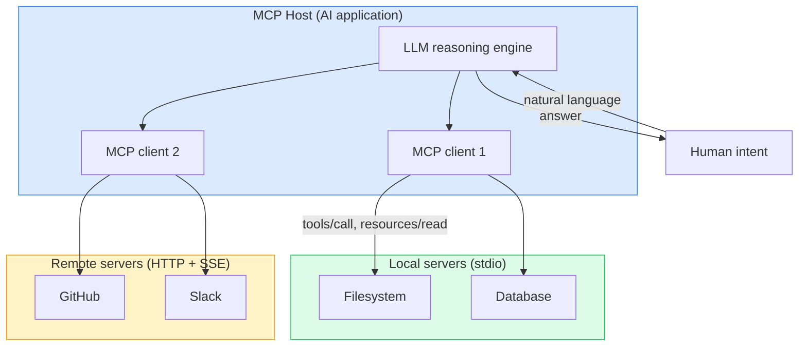
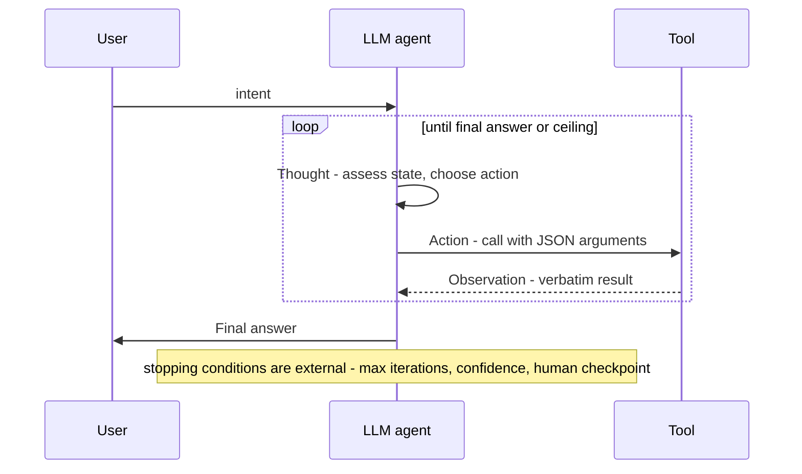

# Tool use, MCP, and the reason-act-observe loop

> **Foundation - supplied background, uncited by construction.** Not evidence about any source, and
> never promoted to `brain/claims.md`. See [`README.md`](README.md).

**Covers:** why a language model needs tools at all; what function calling is mechanically; the
Model Context Protocol and its primitives; the reason-act-observe loop; orchestrator plus sub-agent
decomposition; translating intent into execution; the agent-computer interface.

**Skip this if** you have built a tool-calling agent by hand and can name MCP's primitives without
looking them up.

**Provenance and status.** Distilled from a personally commissioned research module (2026-07-11),
which is agent-generated synthesis and therefore roughly **T5** on this kit's scale. Its definitional
and mechanical content is reproduced here as background. **Its prescriptive and measured content was
deliberately not carried over** - see "What this file leaves out" at the end.

---

## 1. Why tools exist at all

A language model is a static compressed representation of its training data. Its weights encode
statistical associations, not verified facts and not live state. Three constraints follow directly,
and every agent architecture is a response to them:

| Constraint | Consequence |
|---|---|
| **No persistent memory** | Each forward pass starts from a blank context window. Nothing survives a session without external storage. |
| **No real-time access** | Training has a cutoff. The model cannot know today's price, a user's calendar, or a running server's state. |
| **No side-effecting actions** | A text completion cannot write a file, send an email, or book a flight. Tokens are not actions. |

The alternatives to tool use are each worse on a different axis. **Fine-tuning on fresh data** is
slow and expensive and still supplies no live state. **Retrieval alone** grounds factual lookups but
cannot act - it adds retrieval without execution. **Hardcoded pipelines** require a developer to
enumerate every path in advance, which is exactly what open-ended tasks defeat.

Tool use splits the difference along a seam that happens to be real: the model keeps the part it is
good at (planning, disambiguation, error recovery) and delegates the part it cannot do at all
(execution) to deterministic, verifiable systems. **The model decides what to do; the tool does it.**

## 2. Function calling, mechanically

Instead of generating prose, the model emits a structured invocation naming a function and its
arguments. The runtime executes it and injects the result back into the conversation as a new
message:

```json
{ "type": "tool_use", "id": "toolu_01", "name": "search_web",
  "input": { "query": "MCP protocol Anthropic 2024" } }
```

```json
{ "type": "tool_result", "tool_use_id": "toolu_01",
  "content": "Model Context Protocol (MCP) is an open standard..." }
```

The important structural point is that **a tool definition is prompt surface**. The model's only
knowledge of what a tool does is the text describing it, so the description is not documentation
about the interface - it *is* the interface, from the model's side.

## 3. Why a protocol standard exists

Before a standard, every integration was bespoke. An agent needing GitHub, Slack, Postgres and a
calendar meant four connector codebases, four authentication schemes, four parsers, and nothing
reusable by the next agent. That is the **N x M problem**: N agents times M tools.

A protocol collapses it to **N + M**. Each tool publishes one server; each agent connects as one
client.

**MCP** (JSON-RPC 2.0, open-sourced by Anthropic in November 2024; David Soria Parra and Justin
Spahr-Summers) is that protocol. An **MCP host** is the AI application; **MCP servers** expose
capabilities to it.

| Primitive | Direction | Purpose |
|---|---|---|
| **Tools** | Server to client | Executable functions the model may invoke |
| **Resources** | Server to client | Data providing context - file contents, schemas |
| **Prompts** | Server to client | Reusable interaction templates |
| **Sampling** | Client to server | The server requests a completion from the host's model |
| **Elicitation** | Client to server | The server requests further input from the user |

**Two transports:** *stdio*, direct process I/O for local servers with no network overhead; and
*streamable HTTP*, POST plus optional server-sent events for remote servers, which is where OAuth
enters.

**It is a stateful protocol.** A connection opens with a capability negotiation handshake
(`initialize` then `initialized`) in which both sides advertise what they support, and servers may
add or remove tools at runtime via notifications.

> 💡 **Sampling is the direction people miss.** Four of the five primitives push capability from the
> server to the model. Sampling reverses it: the server asks the *host's* model to think for it.
> That is what lets a server stay model-agnostic instead of shipping its own inference.



**Orientation.** Flow runs top to bottom. Blue is the application you write, green is a server
running as a local subprocess, amber is one reached over the network. One client holds one
connection to one server.

**The crux: the host is the only component that talks to the model, and servers never talk to each
other.**

**Why this shape.** The star topology is what makes N + M work - a server author writes against the
protocol and never against any particular agent, and an agent author gains every existing server for
free. It also puts the trust boundary somewhere useful: every capability a model can reach passes
through the host, so that is the one place to enforce permissions. A mesh in which servers called
each other would buy composition and lose both properties at once, because no component would hold
the whole picture of what the agent may do.

**Provenance:** redrawn from the supplied module's diagram 1; background, not evidence.

## 4. The reason-act-observe loop

The loop, formalised as **ReAct** by Yao et al. (2022, Princeton and Google Brain,
[arXiv:2210.03629](https://arxiv.org/abs/2210.03629)), alternates three steps until the model stops:

- **Thought** - a natural-language reasoning step written into the context.
- **Action** - a discrete tool invocation.
- **Observation** - the verbatim result, injected back.

An act-only agent that fires calls without reasoning cannot recognise when a result invalidates its
plan, cannot explain why it chose one tool over another, and cannot notice it is looping. The
insight is that **language is a cheap scratchpad**: a `Thought:` costs a few tokens and yields an
interpretable trace that the next step can act on.

Named descendants worth knowing, because they name the failure each addresses:

- **Reflexion** (Shinn et al., 2023, [arXiv:2303.11366](https://arxiv.org/abs/2303.11366)) - after a
  failed episode the model writes a critique that is prepended to the next attempt. Self-improvement
  without gradient updates.
- **Tree of Thoughts** (Yao et al., 2023, [arXiv:2305.10601](https://arxiv.org/abs/2305.10601)) -
  the linear trace becomes a tree searched with a value estimator.
- **MRKL** (Karpas et al., AI21, 2022, [arXiv:2205.00445](https://arxiv.org/abs/2205.00445)) - the
  conceptual predecessor, which established that routing to the *right* module is the hard part,
  not executing it.



**Orientation.** Time runs downward; the loop box repeats until one of the stopping conditions
fires. The self-directed arrow is the model writing into its own context, not a network call.

**The crux: the observation is verbatim and the thought is written down, and those two properties
are what make the loop correctable rather than merely repetitive.**

**Why this shape.** Summarising an observation before injecting it feels like good context hygiene
and quietly removes the anomaly the model needed to see. Writing the thought into context costs
tokens and buys the only interpretable record of why an action was chosen. Note also what the
diagram places *outside* the model: the stopping condition. A loop whose exit is decided by the same
model that wants to keep going has no exit, which is why iteration ceilings live in the harness.

**Provenance:** redrawn from the supplied module's diagram 2; background, not evidence.

## 5. Decomposition: orchestrator and sub-agents

A single context window is finite, and a long task exceeds it. Decomposition gives **bounded scope
per agent** and **explicit join points** where correctness can be checked before work continues.

The orchestrator receives an intent, splits it into subtasks, delegates each to a worker with a
scoped context and a specific objective, then collects and synthesises. The named patterns
(Anthropic, *Building Effective Agents*, 2024) are worth having as vocabulary:

| Pattern | Shape |
|---|---|
| **Prompt chaining** | Sequential calls; output of step N is input to N+1 |
| **Routing** | A classifier directs input to a specialised downstream handler |
| **Parallelisation** | Independent workers run at once; results aggregated |
| **Orchestrator-workers** | The orchestrator decomposes dynamically, when subtasks are not known in advance |
| **Evaluator-optimizer** | One model generates, another evaluates against a rubric, in a loop |

> 💡 **The cost of decomposition is context fragmentation.** Each worker sees only its slice, so
> anything requiring a decision two workers must agree on is exactly what this shape handles badly.

## 6. Intent to execution

A user request is ambiguous, underspecified and often multi-step; a tool call is precise, typed and
complete. "Book me a flight to Paris next week" has to become a call with an ISO date, an airport
code and a cabin class. **The gap between those two representations is where most agent failures
occur**, and it decomposes into four distinct problems:

1. **Ambiguity** - "next week" is relative and needs grounding against the current date.
2. **Underspecification** - cabin class and return date were never stated.
3. **Schema mismatch** - the API says `CDG`, the user says Paris.
4. **Error propagation** - in a multi-step plan, a mistranslation at step 1 invalidates everything
   downstream.

The structural responses are: **elicitation** (ask before committing), **schemas that make invalid
states unrepresentable** (enums rather than free text, absolute identifiers rather than relative
ones), **validation before irreversible actions**, and **confirmation checkpoints**.

## 7. The agent-computer interface

Tool abstraction is the discipline of wrapping a raw capability in an agent-facing interface that is
semantically clear, safe by construction, discoverable and composable. Anthropic's term for the
field is the **agent-computer interface (ACI)**, by explicit analogy to HCI: decades of research
went into making interfaces usable by humans, and making them usable by models is the same kind of
problem with a different consumer.

**A model's ability to use a tool correctly is bounded by how well the interface communicates its
semantics.** An abstraction that leaks implementation detail - raw SQL exposed to a model - is both
a reliability problem and a security one, since it widens what an injected instruction can reach.

**Toolformer** (Schick et al., Meta AI, 2023,
[arXiv:2302.04761](https://arxiv.org/abs/2302.04761)) is worth knowing for one result: models can be
trained to decide *when* to call a tool by annotating their own outputs, which established that tool
use is learnable rather than only promptable.

---

## What this file leaves out, and why

The source module had four more sections. They are **deliberately not here**, because a foundation
supplies background and must never become a back door for unreviewed assertions:

| Left out | Why |
|---|---|
| **Best practices** (17 numbered prescriptions) | Claims about the world, not fundamentals. Several are quantified, and a quantified claim in an uncited file is exactly what `foundations/` exists to prevent |
| **Common pitfalls** (7 failure modes with fixes) | Same. Several restate things this brain already holds as *gated* claims from real sources, and a shadow uncited copy would compete with them |
| **Hands-on exercises** | This kit learns from sources; it is not a course |
| **Canonical sources and further reading** (20+ papers) | These are the valuable part and they moved to [`brain/reading-list.md`](../brain/reading-list.md) as ingest candidates. **The primary is what this brain should gate, not a summary of it** |

> **The MCP caveat, stated plainly.** Section 3 above describes resources, prompts, sampling,
> elicitation, transports and the handshake. [`brain/topics/mcp.md`](../brain/topics/mcp.md) records
> that this brain has **zero gated evidence** on every one of those. Nothing here changes that.
> **This file is background; the MCP specification is on the reading list precisely because that gap
> is real and only a primary source can close it.**
