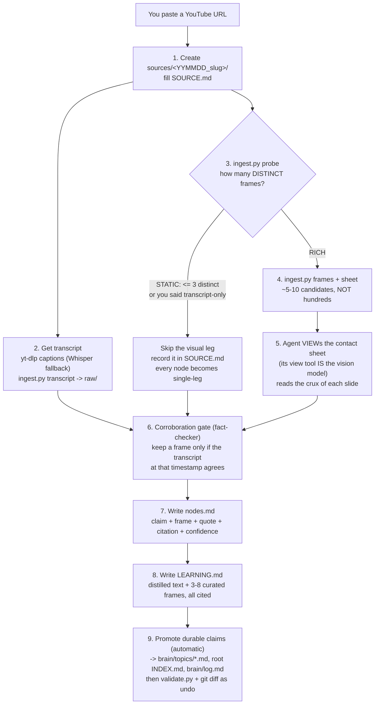
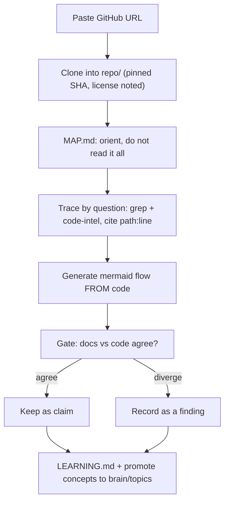
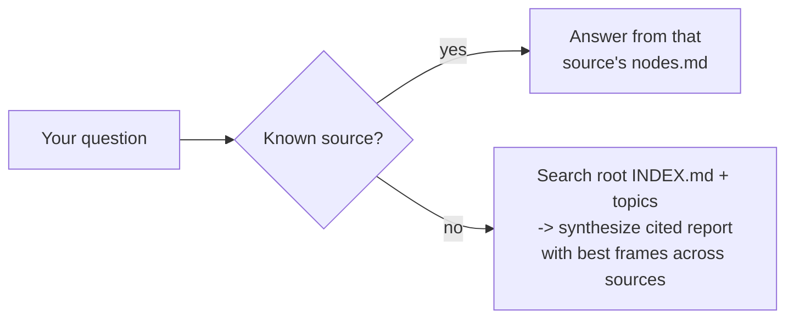

# How to use this - Brain, end to end

A complete, no-prior-knowledge walkthrough for using **Brain** on your own machine: from
`git clone` all the way to "I pasted a YouTube URL and now I have a learning document, and my
brain got smarter." If you read one file, read this one.

> 💡 **What Brain is:** a folder of Markdown rules + personas that make a coding agent (GitHub
> **Copilot CLI**) turn a **YouTube video, blog post, research paper, or code repository** into
> durable, cited, *compounding* knowledge. There is **no app to run** - the agent *is* the engine.
> The structure is the asset; the agent is the reader. Code repos are for **learning from**, not
> building on. See [`prd.md`](prd.md) for the full design.

---

## 0. The 60-second story

```
clone the kit  ->  set up once  ->  cd into it, launch the agent  ->  paste a URL (video/blog/paper/repo)
                                                                          |
                                     agent ingests (evidence leg + claim leg + corroboration)
                                                                          |
                        sources/<id>/LEARNING.md  ---promote--->  brain/topics/*.md
                                                                          |
                                 you learn it, and later you ASK across everything
```

You feed **one source at a time**. Each lives in `sources/<id>/`. Durable, corroborated claims
are promoted up to `brain/`, so your *next* source starts richer than this one.

---

## 1. Prerequisites (one time)

- **An agent harness** installed and signed in - Claude Code, GitHub Copilot CLI, Codex, or Cursor.
  They all read the same `AGENTS.md`.
- **Python 3** and **git**.
- **System `ffmpeg`** (for video frames) - installed in step 3.
- *Optional:* the **GitHub CLI** (`gh`), which makes code sources nicer (license, pinned commit SHA,
  README-before-clone). Never a blocker - the agent falls back to plain `git clone`.
- Nothing else. The kit itself is Markdown plus two small scripts.

---

## 2. Get the kit

Clone (or copy) the `brain/` kit to wherever your personal projects live.

**macOS (personal laptop):**
```bash
cd ~/projects
git clone <your-brain-repo-url> brain     # or copy the brain/ folder here
cd brain
```

**Windows:**
```powershell
cd C:\DEVBOX\projects
git clone <your-brain-repo-url> brain     # or copy the brain/ folder here
cd brain
```

> The kit does not care where it lives - the agent discovers `AGENTS.md` by walking up from where
> you launch it. Just launch the agent *inside* the `brain/` folder.

---

## 3. One-time setup (create the venv + install ffmpeg)

Brain uses a local Python virtual environment for a few helpers (`yt-dlp`, `faster-whisper`,
`imagehash`, `pillow`) and the system `ffmpeg` binary for extracting video frames.

**macOS:**
```bash
python3 -m venv .venv
source .venv/bin/activate
pip install -r requirements.txt
brew install ffmpeg                # no brew? see README section "One-time setup"
```

**Windows:**
```powershell
python -m venv .venv
.\.venv\Scripts\Activate.ps1
pip install -r requirements.txt
winget install Gyan.FFmpeg         # or scoop/choco
```

Verify:
```bash
yt-dlp --version && ffmpeg -version   # macOS/Linux - both should print a version
```
```powershell
yt-dlp --version; ffmpeg -version     # Windows PowerShell (; not && before the second command)
```

> **Re-activate the venv in every new shell** before you launch the agent:
> `source .venv/bin/activate` (macOS) / `.\.venv\Scripts\Activate.ps1` (Windows). This puts
> `yt-dlp` on PATH so the agent can call it.

One more check, and this one needs **no venv at all**:

```bash
python3 validate.py     # stdlib only - should print "OK - N sources, N topics, ... nothing to report"
```

That is the kit's **type checker**. The rules in `AGENTS.md` are prose, and prose has no compiler, so
`validate.py` is what stops a stale index row or an uncited claim from quietly accumulating. The
agent runs it before showing you a `git diff`; you can run it any time. **Exit code 1 means a pass
was left unfinished.** It checks *form*, never judgement - it cannot tell you a claim is true.

**If you use Claude Code or GitHub Copilot in an IDE**, also run the linker once so they load the
same rules (`AGENTS.md` is the single contract; Copilot CLI / Codex / Cursor already read it
natively):
```bash
./link-agents.sh          # macOS / Linux
```
```powershell
.\link-agents.ps1         # Windows (Developer Mode enables symlinks; else it writes a 1-line pointer)
```
The links are git-ignored - you never maintain a second copy of the rules.

---

## 4. Start a session and create a "task" (source folder)

A **task** in Brain = ingesting **one source**. Each gets its own folder under `sources/`, copied
from the template. You can create it yourself, or just let the agent do it when you paste a URL
(recommended - it names the folder for you).

**Launch the agent inside the kit:**
```bash
cd ~/projects/brain          # or C:\DEVBOX\projects\brain on Windows
source .venv/bin/activate    # (Windows: .\.venv\Scripts\Activate.ps1)
claude                       # or: copilot / codex - whichever harness you use
```

Now you are in a conversation with the agent, standing inside `brain/`. It has already read
`AGENTS.md` (the rules) and knows the paste-a-URL trigger.

> **Manual alternative** (if you prefer to make the folder first):
> ```bash
> cp -r sources/_TEMPLATE sources/260724_my-video     # macOS
> ```
> ```powershell
> Copy-Item -Recurse sources\_TEMPLATE sources\260724_my-video   # Windows
> ```
> Folder name = `YYMMDD_slug` (date sorts chronologically). But you usually do not need to - the
> agent creates and names it on ingest.

---

## 5. Paste a YouTube URL - what happens

Just paste it, or say *"ingest this: https://youtube.com/watch?v=..."*. Because of the
**paste-a-URL trigger** in `AGENTS.md`, the agent runs the full flow on its own. Here is exactly
what it does, so nothing is a black box:



**Step by step, in plain words:**

1. **Folder + metadata.** The agent creates `sources/260724_<slug>/`, fills `SOURCE.md` (URL,
   title, channel, duration), Owner defaults to you.
2. **Transcript.** It runs `yt-dlp` to pull the video's captions into `raw/transcript.vtt`, then
   `python3 tools/ingest.py transcript` to collapse YouTube's rolling captions into clean
   timestamped blocks (so a `&t=494s` citation lands on the right second). If the video has no
   captions, it transcribes the audio with `faster-whisper`.
3. **Probe, then frames.** First `python3 tools/ingest.py probe` - scene-detect + perceptual-hash
   dedup - which prints `STATIC` or `RICH`. **A webcam interview or podcast yields `<= 3` distinct
   frames, and the agent skips the visual leg entirely** rather than burning tokens looking at the
   same head from the same angle. For a slide talk it yields dozens, and `ingest.py frames` +
   `sheet` reduce them to a handful tiled into a contact sheet. (All of this is shell, not the agent
   eyeballing - that is what keeps it fast and cheap.)
4. **The agent reads the frames.** It opens the contact sheet with its `view` tool - triaging 17
   candidates in one or two calls instead of 17 - and extracts each slide's crux ("this lists 3
   tool-poisoning mitigations", "this is an MCP sequence diagram"). **This is the key move: the
   agent itself is the vision model - no VLM to install.**
5. **Corroboration gate.** It compares each frame's meaning against what the speaker says at that
   timestamp. Frame and transcript **agree** -> keep it (`corroborated`, cite both). Silent -> keep
   from the one leg (`single-leg`, needs-check). Conflicting -> drop it. This two-modality agreement
   is what makes a kept frame trustworthy (it proves the agent *read* it right, not that it is true).
6. **Knowledge nodes.** Each kept item becomes a row in `nodes.md`: the claim, the frame, the
   corroborating quote, a **citation** (`youtube.com/watch?v=...&t=494s`), and a confidence flag.
7. **Learning document.** It writes `LEARNING.md` - a distilled document you can learn from in
   minutes: TL;DR, key claims, a walkthrough anchored by the **few** best frames, a mental-model
   diagram, and a 💡 glossary. Every claim is cited.
8. **Compound (automatic).** It promotes the durable claims into the living topic notes
   (`brain/topics/agents.md`, `mcp.md`, ...), adds an annotated row to the **root `INDEX.md`**, and
   logs a line in `brain/log.md` - then runs `python3 validate.py` and shows a summary + `git diff`
   so you can undo. That is what makes the brain *compound*.

You end up with, for that one video:
```
sources/260724_mcp-security-talk/
├── SOURCE.md        # what it is (incl. Visual leg: analysed / skipped, and why)
├── raw/             # transcript (git-ignored - discardable)
├── visuals/         # the 3-8 curated frames that survived the gate AND are cited
├── context/         # deep-research notes - only if you asked for them (§7)
├── nodes.md         # every kept claim, cited
└── LEARNING.md      # the thing you actually read to learn
```

> **Why `visuals/` is usually smaller than you expect.** After distilling, the agent greps every
> extracted frame against `nodes.md`, `LEARNING.md` and the topic notes and **deletes the ones
> nothing cites**. The folder is signal, not an archive.

### If the video is a talking head

Say *"transcript only"* (or *"don't analyze video"*) with the URL and the agent skips the frames -
or it discovers this itself via the probe. Either way it tells you in one line, and there is a real
consequence it will not hide: **with only one leg, every node from that source is `single-leg`
(needs-check), never `corroborated`.** A transcript agreeing with itself is not two legs. The way
back to a second leg is not staring harder at the video - it is **deep research** (§7).

---

## 6. Paste a blog post URL - the variant

Same idea, different capture. Paste a blog URL, or *"ingest this article: <url>"*:

1. The agent creates the source folder and `SOURCE.md` (type = blog).
2. It fetches the article text into `raw/article.md`.
3. It downloads the article's **meaningful figures/diagrams** (skips hero images, ads) and
   `view`s each.
4. Same **corroboration gate** - keep a figure only if the caption/surrounding paragraph agrees.
5. Same `nodes.md` + `LEARNING.md`, cited as `source, <section heading> / Figure N`.

> **Research papers** work the same way: it fetches the PDF, extracts text + figures/tables, and
> keeps a figure only when its caption + the referring paragraph corroborate it - cited as
> `source, Figure/Table N, §`.

---

## 6.5. Paste a GitHub URL - the code variant

Code is a fourth media type - you learn *from* a repo, you do **not** build on it. Paste a GitHub
repo URL, or *"learn this repo: <url>"*. The agent adopts the **code-explorer** persona and:

1. Creates the source folder and `SOURCE.md` (type = code), recording the repo URL, the **commit
   SHA** it pinned, and the **license**.
2. Clones the repo into `sources/<id>/repo/` (git-ignored - it is raw material, never committed).
3. Writes `MAP.md`: what the repo demonstrates, a module map, the one key end-to-end flow, and a
   queue of concepts worth tracing. It does **not** read the whole repo - orientation first.
4. Traces **on demand, by question** using grep + code-intel tools (never linearly). For each
   concept it follows the real call/flow and cites exact `path:line`.
5. **Generates** the visual leg (a mermaid diagram of the flow) *from* the code - the inverse of
   video, where visuals are extracted. The diagram must match what the code actually does.
6. Applies the **corroboration gate as docs↔code**: keep a claim only when the README / docs /
   comments and the actual code agree. A **divergence** (docs say X, code does Y) is not dropped -
   it is recorded as a first-class **finding** in `nodes.md`.
7. Writes `LEARNING.md` with the transferable *concepts* (not repo-specific trivia), each cited as
   `path:line @<commit-sha>`.



> **Why the gate flips for code:** in a video the words explain the picture; in a repo the code is
> ground truth and the prose may be stale. So code is the evidence leg and docs are the claim leg,
> and disagreement is a signal worth keeping. See [`prd.md` §6](prd.md) and
> [`personas/code-explorer.md`](personas/code-explorer.md).

---

## 7. Deep research - the opt-in second leg

Everything above buys **internal** consistency: the slide agrees with the narration, the code agrees
with its README. That is not truth. It proves the agent *read* the source correctly, nothing more.
Confidence only really rises when a **different, independent source** agrees.

That is what deep research is for, and it is **never automatic** - it is slow and token-heavy, and
most sources do not earn it. Ask for it explicitly:

> *"ingest this: <url> - and deep research it"*, or later: *"deep research the open questions in
> the 12-factor source"*

What the agent does differently:

- **It researches your gated claims by node ID, not the topic.** Open-ended "research agents" comes
  back with adjacent reading; targeting `n7` and `n12` comes back with a verdict. It prioritises
  `single-leg` nodes, anything `needs-check`, recorded divergences, and the open questions.
- **Every finding lands as one of four verdicts:** `supports`, `contradicts`, `refines`, or
  `no-evidence`. **A contradiction is a finding, not a failure** - both get recorded and the conflict
  is flagged. So is `no-evidence`: learning that a claim rests on one practitioner's experience *is*
  learning something.
- **It weighs sources by tier** - T1 peer-reviewed papers and official specs, down to T5
  aggregators (use for discovery, cite what they point to).
- **The independence rule is hard.** A talk's own companion repo, or a vendor blog restating that
  vendor's conference talk, is **the same leg wearing a different hat**. It gets cited but it never
  raises confidence.
- **The output is a permanent kit file**, `sources/<id>/context/01_<slug>.md`, not chat you lose.
  It also feeds back: node confidence updated, external citations added to `brain/claims.md`, new
  terms to the glossary.

> 💡 **Why `LEARNING.md` stays clean.** Research findings do **not** get folded into it.
> `LEARNING.md` answers exactly one question - *what did this source teach?* Blending in outside
> evidence would destroy the line between "the author claims this" and "the field thinks this",
> which is the entire point of citing. External evidence lives in `context/`; cross-source synthesis
> lives in `brain/topics/`.

**Real example.** The first research pass in this kit ran against the 12-Factor Agents talk. It
closed both open questions (context degradation went from a practitioner's assertion to a *measured*
effect across three independent sources), quantified a claim the talk left vague (+13 to +41 points
of reliability from decomposition), and turned up something the talk never mentions: three of its
factors are **Event Sourcing**, a pattern named in 2005, with known failure modes. That last one is
the payoff - the cross-domain hop you only get by looking outside the source.

---

## 7.5. Learn one source

Once ingested, just talk to the agent:

- *"Walk me through what this video taught, mentor-style."* -> the **mentor** persona teaches it
  from fundamentals, with 💡 term explainers and a diagram.
- *"Show me the key slides."* -> it surfaces the curated frames from `visuals/` with their crux.
- *"Quiz me on it."* -> it checks your understanding against `nodes.md`.

---

## 8. Ask across your brain (the payoff)

This is where many sources pay off. Ask a question:

- **You know the source:** *"In that MCP talk, what were the tool-poisoning mitigations?"* ->
  answered straight from that source's `nodes.md`, cited to `...&t=...`.
- **You don't know where it is:** *"What do I know about agent memory poisoning?"* -> the agent
  reads the annotated **root `INDEX.md`**, greps the topic notes and sources, and **synthesizes a
  cited report** pulling the best material and frames from *whichever* videos/articles cover it -
  something no single source contained.
- **Build study material:** *"Make me an HTML primer on Agents + MCP from everything I've
  ingested."* -> a self-contained report in `reports/` with diagrams from multiple sources,
  every claim cited.



---

## 9. Close the loop (keep it compounding)

Promotion is **automatic** at the end of ingest (see step 8). If you interrupted it, or want to
promote after a study session, just say:
> *"Promote durable claims from this source into the topic notes, and log it."*

The agent merges the source's claims into `brain/topics/*.md` (de-duplicating, not stacking),
updates `brain/claims.md` and `brain/glossary.md`, adds an annotated row to the **root `INDEX.md`**,
and appends a dated line to `brain/log.md`. Over a dozen sources, those topic notes become your
personal, cited textbook on Agents / MCP / Skills / RAG / agent-security / inferencing - and on
whatever new areas your sources turn out to teach, since **the topic set is open, not a fixed list**.

Every such pass ends the same way:

```bash
python3 validate.py     # then: git diff
```

If the validator is red, **the pass is not finished** - a source with no `INDEX.md` row is
unfindable, a promoted claim with no citation breaks the one hard rule in the kit. Then read the
`git diff`: that is your review step, and `git checkout` / `git revert` is the undo, which is
exactly why the agent is allowed to promote without asking first.

---

## 10. Optional: use a YouTube MCP server for transcripts

By default the agent uses `yt-dlp` to fetch captions. If you prefer, you can point Copilot CLI at
a **YouTube MCP server** (an MCP server that exposes a "get transcript / video metadata" tool) and
the agent will call that instead - handy if you want richer metadata or to avoid installing
`yt-dlp`.

1. Add the YouTube MCP server to your Copilot CLI MCP config (per its README).
2. Tell the agent once: *"For YouTube transcripts, prefer the YouTube MCP server tool over
   yt-dlp; still use ffmpeg for frames."*
3. Everything downstream (frames, corroboration gate, `LEARNING.md`, compounding) is unchanged -
   only the transcript-capture step swaps.

> `ffmpeg` is still needed for frame extraction - the MCP server only replaces the transcript
> leg, not the visual leg.

---

## 11. Cheat sheet

| I want to... | Do this |
|---|---|
| Set up (first time) | §3 - create `.venv`, `pip install -r requirements.txt`, install `ffmpeg` |
| Start a session | `cd brain` -> activate venv -> `claude` (or `copilot` / `codex`) |
| Ingest a video/blog/paper | Paste the URL (agent auto-runs the flow) |
| Learn from a code repo | Paste a GitHub URL, or *"learn this repo: <url>"* (§6.5) |
| Skip the frames (podcast) | Add *"transcript only"* - nodes become `single-leg` (§5) |
| Get outside evidence | Add *"deep research"* - lands in `sources/<id>/context/` (§7) |
| Learn one source | *"Walk me through it, mentor-style"* |
| Ask about a known source | *"In <source>, what was ...?"* |
| Ask across everything | *"What do I know about <topic>?"* |
| Build study material | *"Make an HTML primer on <topic> from my brain"* |
| Compound | *"Promote durable claims to the topic notes and log it"* |
| Check the vault is sound | `python3 validate.py` (no venv needed; exit 1 = unfinished pass) |
| See what I've ingested | Open the root `INDEX.md` |

**The three commands worth memorising:**

```bash
python3 validate.py                          # is the brain internally sound?
python3 tools/ingest.py probe <video.mp4>    # is there anything to SEE in this video?
git diff                                     # what did the agent just change?
```

**In one line:**
`clone -> setup -> cd brain + launch agent -> paste URL -> LEARNING.md -> promote to brain/ -> ask across everything`

That is it. Set up once, then the loop is just: paste a URL, learn, promote, ask. See
[`README.md`](README.md) for the layout and [`prd.md`](prd.md) for the design and rationale.
