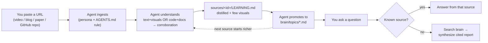
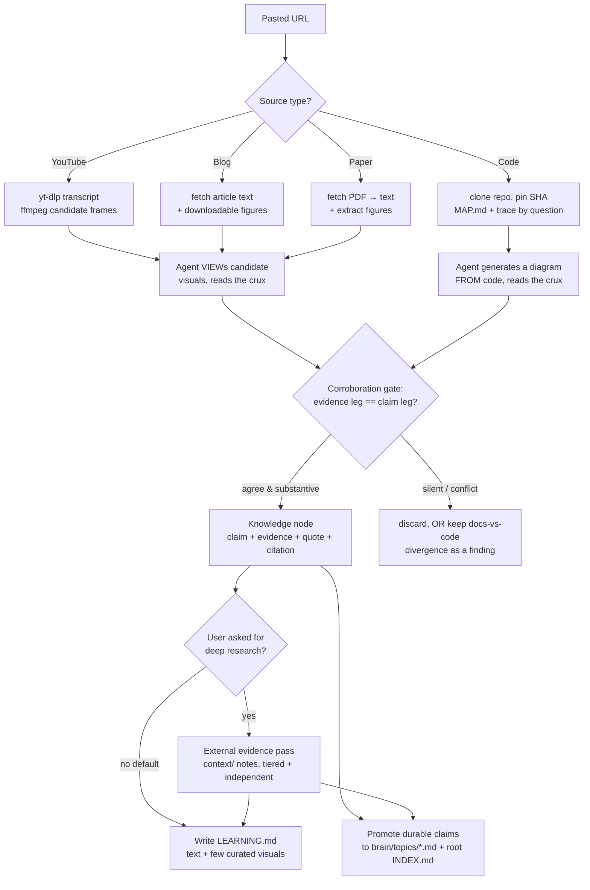
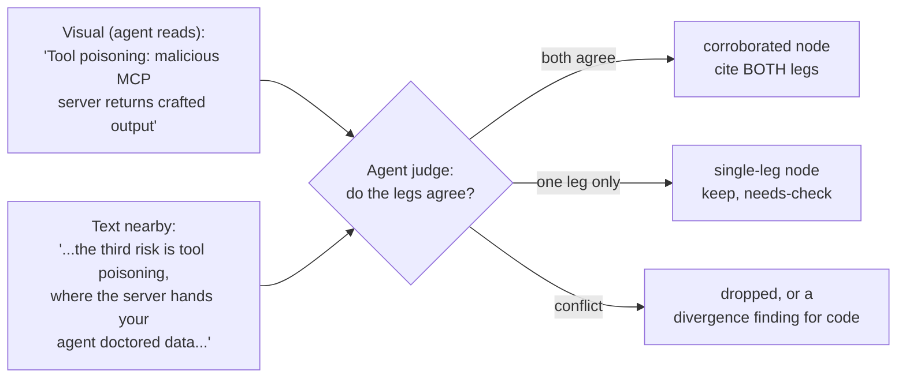
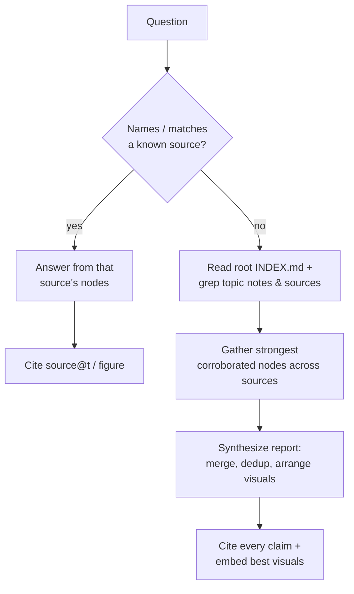
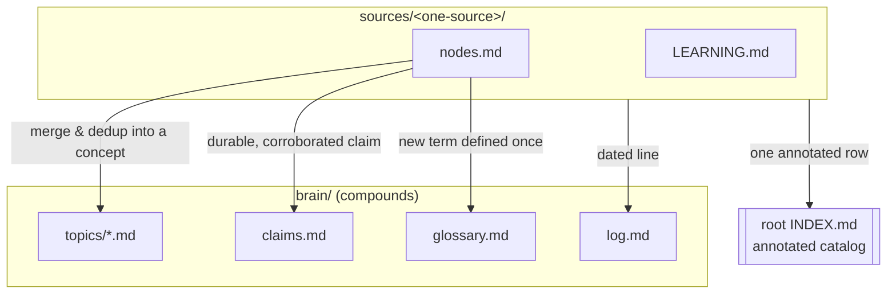

# PRD - Brain: an agent-driven compounding learning kit

> **Status:** Draft v0.9 (convention-kit design, pre-setup)
> **Owner:** chamin
> **Last updated:** 2026-07-24
> **This document is human-owned.** Edit it freely; the agent seeds and refines, the ask lives here.

---

## 0. What this is (and is NOT)

**Brain is a convention, not an application.** It is a folder of Markdown rules, personas, and a
small set of helper commands that make a coding-agent (GitHub **Copilot CLI**, "agency copilot")
turn things you learn from - **YouTube videos, blog posts, research papers, and code
repositories** - into durable, cited, *compounding* knowledge.

- **NOT** a software product you build and maintain. There is no app, server, or vector database
  to ship. For code sources, it is for **learning from** a repo, **not** building on it.
- **IS** an agent-driven convention kit: you paste a **URL** (a video, article, paper, or GitHub repo),
  and because you have set up a persona + goals + an ingest flow in `AGENTS.md`, **the agent
  itself does the pipeline** - capture, read/trace, corroborate, distill, and file the knowledge -
  and it gets smarter every time.

> **The key enabler:** the Copilot CLI agent is *already multimodal and code-native*. Its `view`
> tool opens an image and reads it (**the agent is the vision model** for slides/figures), and its
> grep / code-intelligence tools trace a codebase (**the agent is the code reader** for repos).
> That is why no separate VLM or code-analysis service needs building.

**Built on three ideas** (see [Appendix A](#appendix-a---design-lineage)): layered lazy context,
close-the-loop compounding, and ground-every-claim - re-pointed from "ship code" to "learn deeply
and remember forever." Brain is a **separate, self-contained** kit.

---

## 1. The ask

I learn from several kinds of sources: **YouTube videos** (talks, tutorials), **blog posts**,
**research papers**, and **code repositories** (reference implementations, libraries). Today that
learning is lossy - notes are taken once and never connect, and watching video #30 (or cloning
repo #30) starts as blank as #1.

I want to paste a URL and have the agent:
1. **Ingest** it (transcript/text; for videos, also the meaningful frames; for papers/blogs, the
   meaningful figures).
2. **Understand** it - including the *visual* crux (a slide, an architecture diagram, a results
   figure), keeping a visual only when it **corroborates** the surrounding text.
3. **Distill** it into a per-source **learning document** I can learn from in minutes - text
   anchored by a few curated frames/figures, every claim cited.
4. **Compound** it - promote durable claims into living **topic notes** (Agents, MCP, Skills,
   RAG, agent-security...) so the brain gets richer with each source.
5. Let me **ask questions** later: if I know the source, answer from it; if I don't, search the
   whole brain and synthesize a **report** with the best material and figures across sources,
   all cited.

And I want the agent to do this **on its own** once I paste a URL, because I have given it the
persona, goals, and flow - not because I run a program.

### Why it matters
A personal, compounding **second brain** across the exact media I use to learn - so knowledge
accumulates and connects instead of evaporating.

---

## 2. Goals & non-goals

### Goals
- **G1 - Paste-a-URL ingest.** One pasted URL (video / blog / paper / **GitHub repo**) triggers
  the full flow via an `AGENTS.md` rule - no manual step-by-step.
- **G2 - Agent-native understanding.** The agent `view`s candidate frames/figures (vision) and
  traces code (grep + code-intel tools) itself; no VLM or code-analysis service to build.
- **G3 - Corroboration gate.** A claim is kept only when its two legs agree - visual↔text (media)
  or code↔docs (code); every kept item is cited (`source@timestamp`, `source, figure/§`, or
  `path:line @sha`).
- **G4 - Learn one source.** A per-source `LEARNING.md`: distilled text + a few curated
  visuals/diagrams (plus a `MAP.md` orientation for code).
- **G5 - Ask across the brain.** Known-source → answer from it; unknown → search all notes →
  synthesize a cited report.
- **G6 - Reports with visuals.** Markdown (and HTML on request) embedding the best corroborated
  frames/figures/diagrams, with captions + deep-link citations.
- **G7 - Compounding.** Each source promotes durable, transferable claims into living topic notes.
- **G8 - Four source types behind one flow.** YouTube, blog, paper, and **code repo** share the
  same capture → understand → distill → compound shape (see [§5](#5-the-ingest-flow-agent-instructions)),
  unified by the evidence-leg↔claim-leg gate.
- **G9 - Convention-only.** Everything is Markdown + a persona + a couple of helper commands the
  agent runs. No application to build. For code, we **learn from** the repo, we do not build on it.

### Non-goals (v1)
- **NG1 - Fact-arbitration.** "Valid" = corroborated + coherent + on-topic, **not** fact-checked
  against reality. The agent surfaces and cites; the human judges truth. (See [§6.3](#63-the-meaning-of-valid).)
- **NG2 - A vector database / search engine.** Retrieval is the agent reading an **annotated
  index** + `grep` over notes - fine for a personal brain at dozens-to-hundreds of sources.
  (A real index is [future work](#10-future-work-only-if-you-outgrow-the-convention).)
- **NG3 - A background daemon / silent automation.** It is **agent-in-the-loop**: the agent runs
  the steps and you watch and steer.
- **NG4 - Faithful diagram reconstruction.** Describes/indexes figures well enough to retrieve
  and summarize; does not perfectly redraw complex diagrams.
- **NG5 - Building on cloned repos.** Code sources are for **learning**, not modification - no
  edits, PRs, or builds on the clone. Clones are git-ignored snapshots, discarded/re-cloneable.
- **NG6 - Multi-user, cloud, GUI.** Single-user, local-first; CLI + generated docs only.
- **NG7 - Media/code redistribution.** Raw video is processed then discarded; cloned repos stay
  git-ignored. Keep derived text + selected frames/diagrams only.

### Success criteria
- **SC1:** A pasted YouTube URL for a ~20-30 min slide talk yields a `LEARNING.md` with **3-8
  curated, corroborated, cited frames** in one agent-driven flow.
- **SC2:** A pasted paper/blog URL yields a `LEARNING.md` with its key claims + **1-4 corroborated
  figures**, cited to section/figure.
- **SC2b:** A pasted GitHub repo yields a `MAP.md` (what it demonstrates + module map) and a
  `LEARNING.md` capturing **1-3 transferable concepts**, each cited `path:line @sha` and
  corroborated against the repo's docs.
- **SC3:** A cross-source query on a studied topic returns a report citing **≥ 2 distinct
  sources** (media or code) with ≥ 1 embedded visual, every claim linked to its source.
- **SC4:** After N sources on one topic, the topic note holds **merged, de-duplicated** claims,
  not N stacked summaries.
- **SC5 (hard rule):** No uncited claim appears in any learning document or report.

---

## 3. How you use it (the loop)



- **Kick off:** paste a URL, or say *"ingest this: <url>"*.
- **Learn one:** *"walk me through what this video taught, mentor-style."*
- **Ask known:** *"in that MCP talk, what were the tool-poisoning mitigations?"*
- **Ask across:** *"what do I know about agent memory poisoning?"* → synthesized report.
- **Build material:** *"make me an HTML primer on Agents + MCP from everything I've ingested."*
- **Close the loop:** *"promote durable claims from this source into the topic notes."*

---

## 4. Layout (a self-contained convention kit)

```text
brain/
├── INDEX.md                   # ⭐ ASK HERE: annotated catalog of every source + topic ("when to read")
├── prd.md                     # this document (human-owned ask)
├── README.md                  # 60-second how-to
├── how_to_use_this.md         # the end-to-end walkthrough (clone -> setup -> paste a URL -> ask)
├── AGENTS.md                  # behavioral contract + the paste-a-URL ingest rules
├── validate.py                # the contract's type checker (stdlib only; §4.1)
├── tools/
│   └── ingest.py              # frozen mechanical steps: transcript / probe / frames / sheet (§4.1)
├── .github/workflows/
│   └── validate.yml           # CI: runs validate.py on every push and PR
├── link-agents.sh / .ps1      # per-clone symlinks: CLAUDE.md + copilot-instructions.md -> AGENTS.md
├── requirements.txt           # yt-dlp, faster-whisper, imagehash, pillow (pip, in .venv)
├── .venv/                     # local virtual env for the helper packages (you create this)
├── personas/                  # role overlays (see §7)
│   ├── README.md              #   routing table
│   ├── curator.md             #   capture + distill one MEDIA source
│   ├── code-explorer.md       #   clone + orient + trace a CODE repo
│   ├── synthesizer.md         #   cross-source reports / study material
│   ├── fact-checker.md        #   run the corroboration gate; enforce citations
│   ├── mentor.md              #   teach the learner from fundamentals
│   └── architect.md           #   shape the brain: topic taxonomy, structure decisions
├── sources/                   # ONE folder per ingested source
│   └── 260724_mcp-security-talk/
│       ├── SOURCE.md          #   url, type (video/blog/paper/code), title, author, ingest facts
│       ├── MAP.md             #   CODE only: repo orientation (what it demonstrates, module map)
│       ├── raw/               #   MEDIA: transcript.vtt / article.md / paper.pdf + extracted text
│       ├── repo/              #   CODE: the git-ignored clone (snapshot pinned by commit SHA)
│       ├── visuals/           #   CURATED frames/figures OR diagrams generated from code
│       ├── context/           #   deep-research notes, one per pass (§5.5) - only if you asked
│       ├── nodes.md           #   knowledge nodes: claim + evidence + quote + citation + confidence
│       └── LEARNING.md        #   the per-source learning document (text + few visuals/diagrams)
├── brain/                     # THE COMPOUNDING VAULT content (the whole-brain index is root INDEX.md)
│   ├── topics/                #   living topic notes: agents.md, mcp.md, skills.md,
│   │                          #   agent-security.md, rag.md ...
│   ├── glossary.md            #   💡 terms defined once, reused
│   ├── claims.md              #   cross-source corroborated claims (with citations)
│   ├── decisions/             #   ADRs for durable structural decisions
│   └── log.md                 #   append-only chronological ingest log
└── reports/                   # generated Markdown/HTML study material
```

> **Naming:** source folders use `YYMMDD_slug` (big-endian date sorts chronologically).
>
> **Setup (one time, done by you):** create a local virtual env in this folder and install the
> helpers. `ffmpeg` is a system binary (not pip). The kit is cross-platform - use whichever OS
> your personal projects live on.
>
> **macOS:**
> ```bash
> cd ~/projects/brain
> python3 -m venv .venv
> source .venv/bin/activate
> pip install -r requirements.txt          # yt-dlp, faster-whisper, imagehash, pillow
> brew install ffmpeg                       # system ffmpeg (Homebrew)
> ```
> **Windows:**
> ```powershell
> cd C:\DEVBOX\projects\brain
> python -m venv .venv
> .\.venv\Scripts\Activate.ps1
> pip install -r requirements.txt          # yt-dlp, faster-whisper, imagehash, pillow
> winget install Gyan.FFmpeg               # or scoop/choco - system ffmpeg
> ```
> The agent then calls `yt-dlp` / `ffmpeg` from the activated env when it ingests a video.

### 4.1 The two frozen scripts (and why there are exactly two)

"Convention, not application" does **not** mean "no code" - it means no *app*. Two scripts are
checked in, and the line between them and the prose is the same line in both cases: **form is code,
judgement is prose.**

| Script | Is | Why it is frozen rather than generated per source |
|---|---|---|
| [`tools/ingest.py`](tools/ingest.py) | A **toolbox** of independent mechanical subcommands - `transcript`, `probe`, `frames`, `sheet` - composed per source. Deliberately **no** do-everything entrypoint. | [ADR-0005](brain/decisions/0005-mechanical-toolbox.md). §5.1's static-video threshold (`<= 3 distinct frames`) is meaningless if every agent computes "distinct" with a different scene threshold and hash distance. A rule with no canonical implementation is not a rule. |
| [`validate.py`](validate.py) | The **type checker for this prose contract**: INDEX integrity both ways, legal statuses, every kept frame cited, every claim cited, log chronology, unique ADRs, resolving links, balanced mermaid fences, every diagram carrying a walkthrough. Stdlib only, no venv. | [ADR-0004](brain/decisions/0004-validator-as-type-checker.md). The kit's strength is that capabilities ship as paragraphs; its one structural weakness is that **prose has no compiler**, so a stale `INDEX.md` row or an uncited promoted claim never fails loudly - it accumulates. |

**Run `python3 validate.py` before showing the `git diff`** at the end of any compound, research or
close-the-loop pass. Exit 1 means the pass is not finished. CI runs it on every push and PR.

> **Neither script holds judgement, and that is load-bearing.** The toolbox crops images; it does
> not decide what they mean. The validator checks *form*; it cannot tell you whether a claim is
> corroborated, whether a frame earns its place, or whether a topic should split - and encoding that
> would launder judgement as a green check. A green validator means the shape is right, **not** that
> the thinking is. `AGENTS.md` outranks both: if a check and the contract disagree, the check is the
> bug.

> **Generate what should vary; freeze what should not.** `yt-dlp` invocations stay ad hoc (format
> selection genuinely varies). If a step needs to differ for the source at hand, differ - then if you
> write the same thing a third time, it belongs in the toolbox.

---

## 5. The ingest flow (agent instructions, per source type)

The agent runs this flow when you paste a URL. It is written as **instructions the agent
follows**, not code to build. The four source types share the same four beats - only "capture"
and "the evidence leg" differ (for code, the evidence leg is the source itself and the visual is
*generated*; see §5.4).



### 5.1 YouTube (video)

> **The mechanical steps are frozen in [`tools/ingest.py`](tools/ingest.py)** (ADR-0005) - a
> *toolbox*, not a pipeline: `transcript`, `probe`, `frames`, `sheet`, composed per source. Generate
> what should vary; freeze what should not. Judgement never moves into it.

1. **Capture text:** `yt-dlp` pulls auto-captions; if absent, transcribe audio with
   `faster-whisper`. Then `tools/ingest.py transcript` de-duplicates the rolling cues into
   timestamped blocks.
2. **Capture visuals (pre-filter in the shell, not by the agent):** `ffmpeg` samples on
   **scene-change** (`select='gt(scene,0.4)'`) with a 2s floor, then de-dup with `imagehash`
   (pHash) - yielding **~5-10 candidate frames**, not hundreds. This pre-filter *must* be a shell
   command so the agent only ever `view`s a handful.
   - **The visual leg is on by default but skippable** (ADR-0003). The user can opt out
     ("don't analyze video" - for a podcast or webcam interview the picture never changes, so
     every token spent looking at it is wasted); and because the pre-filter above is free shell
     work, it doubles as a **static-video probe** - `<= 3` distinct frames means auto-degrade to
     transcript-only. **Cost, always recorded in `SOURCE.md`:** with one leg gone, every node from
     that source is `single-leg` by construction and can never be internally `corroborated`. Deep
     research (§5.5) is the way back to a second leg. Full rules: `AGENTS.md` § "The visual leg".
3. **Understand:** the agent `view`s each candidate frame and extracts `{type: slide/diagram/code/
   demo, crux, entities}`.
4. **Corroborate:** compare each frame's crux to the transcript around its timestamp; keep only
   agreeing, substantive frames.
5. **Cite:** `source@timestamp` deep-link (`youtube.com/watch?v=...&t=494s`).

### 5.2 Blog post
1. **Capture text:** fetch the article (agent `web_fetch`), save clean Markdown to `raw/`.
2. **Capture visuals:** download the article's figures/diagrams that carry meaning (skip hero
   images, ads).
3. **Understand + corroborate:** the agent `view`s each figure; keep it only if the caption /
   surrounding paragraph corroborates its crux.
4. **Cite:** `source, section heading / figure N`.

### 5.3 Research paper
1. **Capture text:** fetch the PDF (e.g. arXiv), extract text to `raw/`.
2. **Capture visuals:** extract figures/tables (architecture diagrams, results plots).
3. **Understand + corroborate:** the agent `view`s each figure; keep it only if the figure
   caption + the referring paragraph corroborate its crux.
4. **Cite:** `source, Figure/Table N, §`.

### 5.4 Code repository
1. **Capture:** `git clone` the repo into `sources/<id>/repo/` (git-ignored); record the
   **commit SHA + license** in `SOURCE.md` (pins the snapshot for citations).
2. **Orient (code-explorer):** identify entry points, the module map, and *what the repo
   demonstrates*; write `MAP.md`. **Do not read the whole repo** - orient, then trace on demand
   with `grep`/`glob` and code-intel tools (`code_search`, `code_navigate` for call graphs /
   hierarchies).
3. **Understand by question:** trace one concept end-to-end per question; **generate** the visual
   leg (mermaid module map / call graph / sequence diagram) *from* the code.
4. **Corroborate (docs↔code):** check what the docs/README/comments *say* against what the code
   *does*. Agree -> node. A **divergence** (docs say X, code does Y) is a first-class finding -
   record it with both citations.
5. **Cite:** `path:line @<commit-sha>`.

### 5.5 Deep research (optional, on request only)

The four flows above produce **internal** corroboration - two legs *within* one source. That is
consistency, not truth (§6.3). When the user says **"deep research"**, an extra pass runs **after the
gate and before distilling**: it takes the *gated node IDs* and looks for **independent external
evidence** for each, returning `supports` / `contradicts` / `refines` / `no-evidence`.

Design points that make it more than a search wrapper:

- **Targets claims, not subjects.** Researching a topic returns adjacent reading; researching node
  `n8` returns something that changes a confidence value.
- **Tiered sources + an independence rule.** A companion repo, or a vendor blog restating that
  vendor's own talk, is the same leg wearing a different hat - recorded, cited, but never allowed to
  raise confidence.
- **`no-evidence` is a result.** "This rests on one practitioner's experience" is exactly what this
  brain exists to record.
- **Output is permanent.** `sources/<id>/context/<NN>_<slug>.md`, committed - the inverse of a
  harness's throwaway session research directory.
- **It stays out of `LEARNING.md`'s body**, which answers only *what did this source teach?*

Full contract (tiers, budget, feedback loop, degrade rules): `AGENTS.md` § "Deep research on
request". Claude Code wrapper: `.claude/commands/research.md`.

---

> **General principle:** every source has an **evidence leg** and a **claim leg** that must agree.
> Media: a **visual** (frame/figure) ↔ the **surrounding text**. Code: the **code** (`path:line`)
> ↔ its **docs/README/comments**. The corroboration gate is the *same idea* across all four source
> types - keep a claim only when its two legs corroborate. For code, the visual leg is *generated*
> from the code (not extracted) and must match it.

---

## 6. The corroboration gate (the differentiator)

Naive note-taking screenshots (or clones) everything. Brain keeps a claim **only when its two legs
agree** - an **evidence leg** and a **claim leg**:
- **Media:** what the agent reads *off a visual* ↔ what the *text says* around it.
- **Code:** what the *code does* (`path:line`) ↔ what the *docs/README/comments say*.

> **What this proves (and doesn't).** The two legs are usually *aspects of the same assertion* (a
> slide and its narration; code and its docs), so agreement proves **internal consistency** - the
> agent read the visual right, or the code matches its docs - **not** that the claim is correct
> about the world. That is extraction/implementation confidence, not truth. Only a **second source**
> agreeing (external corroboration, tracked in `claims.md`) raises real confidence in the claim.



### 6.1 Why it works
The text is ground truth for *what the source is about* there; the visual is ground truth for the
*exact detail* (wording, diagram, code, numbers). Each alone is unreliable (the agent can
misread a figure; text misses on-screen detail). **Together they catch each other's errors** - this
is the "ground every claim with a source" principle, applied across *two modalities*. It hardens
*extraction*, not *truth* (see the note above).

### 6.2 Gate outputs
`corroborated` (both legs agree -> keep, cite both) · `single-leg` (only one leg exists -> keep,
needs-check, cite the one) · `divergence` (code: docs vs code disagree -> keep as a finding, cite
both) · `dropped` (media legs conflict, or incidental/off-topic). Only `corroborated` / `single-leg`
/ `divergence` nodes feed the learning doc and topic promotion. The **fact-checker** persona owns
this gate.

> **Code special case - divergence is a finding.** For code, a conflict between docs and code
> ("the README says OAuth is required; the code allows anonymous access") is **not** dropped - it
> is recorded as a first-class node with both citations. Stale or aspirational docs are often the
> most valuable thing you learn from reading real code.

### 6.3 The meaning of "valid"
**"Valid" = corroborated + coherent + on-topic.** It does **not** mean "fact-checked against the
world." The agent verifies visual↔text agreement and coherence, not real-world correctness.
Truth-arbitration of technical claims is human-expert work; Brain surfaces and cites, it does not
rule. (This is [NG1](#non-goals-v1).)

---

## 7. Personas

Role overlays (prompt overlays, not separate models), auto-selected by lifecycle stage. They
**compose** (e.g. `curator + mentor` while distilling *and* teaching).

| Persona | Adopt when | Owns |
|---|---|---|
| **curator** | ingesting + distilling one **media** source (video/blog/paper) | capture, the `view`-and-extract pass, writing `LEARNING.md` |
| **code-explorer** | learning from a **code repo** (a GitHub/git URL) | clone + orient (`MAP.md`), trace concepts, generate diagrams from code |
| **fact-checker** | deciding what to keep | the corroboration gate (visual↔text / code↔docs) + citation discipline (SC5) |
| **synthesizer** | building a cross-source report / study material | routing, retrieval, assembling reports with figures |
| **mentor** | you want to *understand*, not just store | teach from fundamentals, `> 💡` term explainers, capture to `glossary.md` |
| **architect** | shaping the brain itself | topic taxonomy, when to split a topic note, structural decisions (ADR-style) |

> **mentor** and **architect** are the two you called out as most relevant: mentor because the
> point is to *learn*, and architect because a compounding brain needs deliberate structure
> (which topics exist, when a topic note splits, how sources map to topics) or it becomes a dump.

The `personas/README.md` holds the routing table; each `personas/<role>.md` is the overlay.

---

## 8. Ask & report behavior



- **Every claim cited** (hard rule SC5): `source@timestamp` for video (deep-link), `source,
  §/figure` for blog/paper, **GitHub blob permalink with SHA** for code.
- **Retrieval without a vector DB:** the agent reads the **annotated root `INDEX.md`**
  ("when to read" per entry) to pick relevant sources, then `grep`s their notes. This is
  the annotated-index technique - it scales fine for a personal brain.
- **Reports** default to Markdown; `--html`/"as HTML" produces a self-contained page with visuals
  inline. Confidence flags (OK / needs-check / open-question) on any `single-leg` item.

---

## 9. Compounding: how the brain gets smarter



- **Promote only durable, corroborated claims** into topic notes (not per-source scratch).
- Topic notes **merge and de-duplicate** across sources, so `agent-security.md` becomes one
  coherent view, not 12 stacked summaries. (The **architect** persona decides when a topic note
  should split.)
- The **root `INDEX.md`** is **annotated** ("when to read") so a future query - asked from the repo
  root - knows which source matters without opening each. It is auto-maintained as a hard output of
  ingest/compound (the close-the-loop principle, relocated to the root so the brain is asked at the top).
- Payoff: source #30 is answered against an already-rich brain; a topic report assembles material
  **no single source contained**.
- **The pass ends with `python3 validate.py`, then a summary + `git diff`** (§4.1). The validator is
  what stops this diagram from quietly becoming aspirational: a promoted claim with no citation, a
  source with no `INDEX.md` row, or a kept frame nothing cites all fail loudly instead of
  accumulating. A pass that leaves it red is not finished.

---

## 10. Future work (only if you outgrow the convention)

If the brain grows past a few hundred sources and reading-the-index + `grep` gets slow, the
convention can be *backed* by tooling **without changing the folder shape**:
- A **vector index** (e.g. `sqlite-vec` / LanceDB) over the same `nodes.md` for fast semantic
  retrieval.
- An **HTML brain browser**.

### Agent Skills (deferred by decision - v0.6)

**Decision: do not ship agent Skill files now; rely on `AGENTS.md` + personas.** The paste-a-URL
trigger + persona routing already fully specify the flow, so a Skill would duplicate it in a second
place. Skills also **don't port** - each harness wants a different format (Claude `.claude/skills/`,
Cursor `.cursor/commands/`, Codex `~/.codex/prompts/`, Copilot its own) - which reintroduces exactly
the per-tool file maintenance the single-`AGENTS.md` design avoids. And the flow isn't
battle-tested yet; a Skill is a hardening step, not a starting point.

**What a Skill would genuinely add (the narrow, worthwhile part):** a callable trigger
(`/ingest-video <url>`) that **packages the deterministic shell pipeline** - `yt-dlp` -> `ffmpeg`
scene-detect -> `imagehash` dedup - into one command. **Judgment** (the corroboration gate,
distillation) stays in `AGENTS.md`/personas - never bake that into a skill.

> **Status update (v0.14): the script half of this landed early, the Skill half did not.** The
> original revisit trigger was *"after ~5-10 real ingests, once that pre-filter pipeline exists as a
> stable script."* [ADR-0005](brain/decisions/0005-mechanical-toolbox.md) overrode it at **two**
> ingests, on one narrow ground: [ADR-0003](brain/decisions/0003-optional-visual-leg.md) had created
> a contract rule (`<= 3 distinct frames` -> skip the visual leg) whose verdict depended on constants
> that lived only in prose, so two agents would disagree about the same podcast. That is a
> correctness argument, not an ergonomics one, and it does not wait for a usage count.
>
> **The Skill itself is still deferred, and the reasoning above still holds** - `tools/ingest.py`
> is a plain script every harness can call, which is exactly why it needs no per-harness Skill file.
> The one harness-specific wrapper in the kit is [`.claude/commands/research.md`](.claude/commands/research.md)
> (Claude Code has no built-in research command), and it is a thin pointer at §5.5, not a second copy
> of the contract.

Do all of this **only when the Markdown convention actually hurts** - not before. The convention is
the asset; tooling is an optimization.

### Distribution: template repo, not a package (deferred/rejected by decision - v0.7)

**Decision: Brain is distributed as a GitHub *template repo* you clone and edit in place - not a
`pip` or `npm`/`npx` package.** Reasons:
- **Agents read `AGENTS.md` from the repo root.** Codex/Cursor/Copilot discover the contract by
  walking the working tree; a package hides those files in `site-packages`/`node_modules`, so you'd
  need an installer that only re-scaffolds the clone you already have - net negative.
- **It's a personal vault, not a per-project dependency.** One long-lived clone accumulates
  `sources/` + `brain/`; installing into each project is the wrong model and fragments the brain.
- **Editing-in-place + git is the point.** The compounding `brain/` *is* the git history; a package
  makes canonical files read-only and upgrades overwrite the user's edits.

**Get-the-kit path:** GitHub "Use this template", `gh repo create <you>/brain --template ...`, or a
plain `git clone`; then `git push` to back up the vault.

**Where packaging *would* belong (future, and only then):** the mechanical ingest steps
(`yt-dlp → ffmpeg → imagehash`) as a small standalone `pip` package the agent calls from `.venv`.
**As of v0.14 those steps exist as [`tools/ingest.py`](tools/ingest.py) - checked into the kit, not
packaged**, and that is the right resting place: it is ~300 lines of stdlib-plus-ffmpeg that the
agent reads and adapts, and being *in the working tree* is what lets the agent see it at all (the
same argument that keeps the kit itself out of `site-packages`). Package it only if it ever grows a
release cadence of its own. A zero-install `npx create-brain` scaffolder is an option only if
multiple brains are ever needed - but "Use this template" already covers that, so it's not planned.

### Design decisions recorded (the one-way doors)

Durable calls made while building the kit, kept here so a future reader (or you, months later)
sees the *why* without re-deriving it. Full history is in Appendix B.

| Decision | Choice | Why | Ver |
|---|---|---|---|
| **Compounding trigger** | **Automatic by default** - promote eligible nodes in the same pass, then show a summary + `git diff` as undo | The core promise is a brain that compounds; an "offer, then do" gate left the compounding layer stale (the biggest risk the rubber-duck flagged). `git` is the safety net. | v0.8 |
| **Retrieval entry point** | **Single whole-brain `INDEX.md` at the repo root**; `brain/index.md` demoted to a redirect stub | You ask from the root, so the entry point lives there. One index per *scope* (root=brain-wide, `SOURCE.md`=per-source, topic note=per-topic) gives multi-level indexing with **no same-scope duplication/drift**. | v0.9 |
| **Index freshness** | `INDEX.md` is a **hard, non-skippable output** of ingest/compound/close-loop + an **integrity rule** (every source folder ⇔ one row) | "Auto-generate" without a build step = the agent regenerates it at defined checkpoints; the integrity rule stops silent unfindable sources. Since v0.13 `validate.py` checks the rule both ways rather than trusting the agent to have applied it. | v0.9 |
| **Multi-harness contract** | **One canonical `AGENTS.md`**; `CLAUDE.md` + `.github/copilot-instructions.md` are git-ignored symlinks created per-clone by `link-agents.*` | Codex/Cursor/Copilot-CLI read `AGENTS.md` natively; linking (not copying) the other two avoids maintaining tool-specific duplicates. Committed symlinks break on Windows checkout -> per-clone generation. | v0.4 |
| **Confidence semantics** | Separate **internal consistency** (two legs agree = extraction confidence) from **external corroboration** (a *second source*) from **fact-checked truth** (human) | Prevents the gate over-claiming "high-confidence/proven"; the kit surfaces + cites, it does not arbitrate truth. | v0.8 |
| **Code citation durability** | **Immutable GitHub blob permalink with SHA** for code, not bare `path:line` | The cloned `repo/` is git-ignored and discarded, so a bare path is non-inspectable later; a pinned permalink survives. | v0.8 |
| **External evidence** ([ADR-0002](brain/decisions/0002-deep-research-stage.md)) | **Opt-in** deep-research pass, targeting **gated node IDs** (never a topic), output to a permanent `sources/<id>/context/` note | The gate buys internal consistency only; real confidence needs a *second source*. Made opt-in because most sources do not earn a slow, token-heavy pass. Targeting nodes rather than topics is what keeps it from degenerating into summarizing adjacent reading. | v0.10 |
| **Visual leg** ([ADR-0003](brain/decisions/0003-optional-visual-leg.md)) | **On by default, skippable** - by user opt-out or by a free static-video probe (`<= 3` distinct frames) | Frames are the whole point on a slide talk and worthless on a webcam interview. The probe is the *first* shell step anyway, so the signal costs no tokens. The cost is **recorded, not discovered**: a skipped leg makes every node `single-leg` by construction. | v0.11 |
| **Commit messages** | **Conventional Commits** (`docs:` ingest/promote, `feat:` contract change, `fix:` wrong claim or stale row, `chore:`, `refactor:`) | Set by the repo's first commit; binding on agents and humans alike. The subject scans, the body carries what was promoted and what was rejected and why. | v0.12 |
| **Enforcement** ([ADR-0004](brain/decisions/0004-validator-as-type-checker.md)) | A **`validate.py` type checker** for the prose contract, run before every `git diff` and in CI - checking **form, never judgement** | Prose has no compiler, so drift accumulates silently. Encoding judgement (is this claim corroborated?) would be worse than no check: it launders a guess as a green tick. | v0.13 |
| **Mechanical steps** ([ADR-0005](brain/decisions/0005-mechanical-toolbox.md)) | Freeze them as a **toolbox** (`tools/ingest.py`), never a pipeline - no do-everything entrypoint | **Generate what should vary, freeze what should not.** Mid-ingest you may abandon phash dedup for transcript-anchored extraction, and a rigid script would fight you; but VTT parsing has no reason to differ between videos, and a threshold computed with different constants is not comparable across sources. | v0.14 |
| **Diagrams** | **Every diagram carries a walkthrough** - orientation, one-sentence crux, why-this-shape, provenance - enforced by `validate.py` | A picture dropped in with no explanation teaches nobody: the reader who understands it did not need it, the reader who does not is no better off. If you cannot name the crux in one sentence, the diagram is decoration - delete it. Anti-pattern: narrating the arrows. | v0.15 |

---

## 11. Risks & open questions

| # | Risk / caveat | Mitigation |
|---|---|---|
| R1 | Viewing many frames is token-heavy | `ffmpeg` scene-detect + `imagehash` pre-filter to ~5-10 candidates *before* the agent `view`s. |
| R2 | Agent misreads a figure | Corroboration gate + confidence flags; index approximate description, don't claim exact. |
| R3 | "Valid" misread as "fact-checked" | Explicit NG1; label confidence; human judges truth. |
| R4 | YouTube ToS / bot-blocking | Personal use, captions-first, rate-limited; respect ToS. |
| R5 | Talking-head videos have no useful frames | **Resolved mechanically in v0.11** ([ADR-0003](brain/decisions/0003-optional-visual-leg.md)): the free static probe auto-degrades at `<= 3` distinct frames, and the degrade is *recorded* in `SOURCE.md` so every node is correctly gated `single-leg`. |
| R6 | `grep`-retrieval slows at large scale | Future-work vector index; convention shape unchanged. |
| R7 | Paywalled papers/blogs | Ingest only what you can access; note access limits in `SOURCE.md`. |
| R8 | **Prose has no compiler** - a stale `INDEX.md` row, an uncited promoted claim, or a broken link never fails loudly, it accumulates | `validate.py` (v0.13) checks form at every compound pass and in CI. |
| R9 | **A green validator gets misread as "verified"** - the mirror of R3, one layer up | The validator checks *form, never judgement*, and says so in its own docs: it cannot tell you a claim is corroborated or a frame earns its place. Those stay with the fact-checker and architect. It also cannot catch a `log.md` entry misordered *within* a single day - the failure that has actually occurred in practice. |
| R10 | **Three of the four source types are still unexercised** - two ingests to date, both video; blog, paper and especially **code** (`MAP.md`, `path:line @sha`, docs↔code divergence, generated diagrams) are prose that has never run | Known and accepted. First contact will find bugs, as it did for `tools/ingest.py` (a swallowed `ffmpeg` exit code that made every failure look like a static video). Treat the code flow's first ingest as a shakedown run, not a routine one. |

### Open questions

Resolved by practice, kept here with the answer so the reasoning is not re-derived:

- **OQ1 (resolved v0.11): captions-first, Whisper as fallback.** Both ingests to date used
  `yt-dlp` auto-captions; `tools/ingest.py transcript` de-duplicates YouTube's rolling caption
  format into timestamped blocks so `&t=` citations land on the right second. Whisper is the
  documented degrade when a video has no captions, not the default.
- **OQ2 (resolved v0.8): keep `single-leg` nodes at `needs-check`.** `corroborated`-only would have
  discarded the honest majority of a transcript-only source. The vocabulary carries the cost
  instead of the filter doing so - and ADR-0003 then *depends* on this, since a skipped visual leg
  makes every node `single-leg` by construction.
- **OQ5 (resolved v0.8): no.** Compounding is automatic; `git diff` + `git revert` is the undo. An
  approval gate on kept visuals was exactly the "offer, then do" pattern that left the compounding
  layer stale.

Still open:

- **OQ3: the seed topic set is now moot as a *question*** - v0.6 made the topic set **open**, with
  the architect persona owning create-vs-merge and `emerging` -> `established` on a second
  corroborating source. The live question is narrower: **at what point does `agents.md` (170 lines,
  `established`) want splitting?**
- **OQ4:** Report default - Markdown-first or HTML-first? (One report exists; Markdown so far.)
- **OQ6:** For code, how deep should the default orientation pass go before you steer it (just
  `MAP.md`, or `MAP.md` + auto-trace the single key flow)? **This one will answer itself on the
  first code ingest** - see R10.

---

## 12. Glossary

- **Knowledge node** - the atomic unit: one corroborated claim + its evidence (visual/diagram or
  code) + the corroborating quote + citation + confidence. Everything downstream is built from
  nodes.
- **Corroboration gate** - the check that keeps a claim only when its two legs agree (visual↔text,
  or code↔docs).
- **Learning document** - a per-source distilled document: text + a few curated visuals/diagrams.
- **Topic note** - a living, cross-source synthesis of one concept (the compounding layer).
- **Brain** - the whole compounding vault (`brain/`): topics + claims + glossary + index + log.
- **Evidence leg / claim leg** - every source has both; the gate keeps a claim only when they
  agree. Media: visual ↔ surrounding text. Code: code (`path:line`) ↔ docs/README/comments.
- **MAP.md** - code-only orientation doc: what a repo demonstrates + its module map + key flow.
- **Divergence** - a code node where docs and code disagree; kept as a first-class finding.
- **Valid (in Brain)** - corroborated + coherent + on-topic; **not** fact-checked against reality.

---

## Appendix A - Design lineage

Brain is a self-contained, pure-Markdown convention that drives one unit of work (a source) through
a lifecycle while compounding knowledge. It rests on **three ideas**, re-pointed from "ship code"
to "learn deeply and remember forever":

1. **Layered, lazy context** - each source carries its own living docs (`sources/<id>/`); load
   only what a step needs.
2. **Close the loop / compounding** - each source promotes durable, cited items up to a root vault
   (`brain/`), so the next source starts richer.
3. **Ground every claim** - nothing asserted without a citation; here strengthened into the
   two-modality **corroboration gate**.

**Structure at a glance:** `sources/<id>/` is the unit (a video/blog/paper/repo); the flow is
capture → understand → distill → compound → ask; code sources add a git-ignored `repo/` clone; the
compounding vault is `brain/` (topics/claims/glossary/log/decisions) fronted by an annotated root
`INDEX.md` ("when to read" per entry); role overlays live in `personas/`; the behavioral contract
is `AGENTS.md`; source folders are named `YYMMDD_slug`.

**What Brain adds beyond a code-shipping kit:** multimodal ingest (transcript/text **+** the agent
`view`ing frames/figures, **+** the agent tracing code) and the **corroboration gate** (visual↔text
/ code↔docs) as the promotion filter - all done *by the agent*, no app built.

---

## Appendix B - Change log

| Date | Version | Change | By |
|---|---|---|---|
| 2026-07-24 | v0.1 | Initial draft framed as a software product. | agent (seed) |
| 2026-07-24 | v0.2 | Reframed as an **agent-driven convention kit** (agent is the engine, `view` = the VLM); generalized to YouTube + blog + paper; added mentor + architect personas; added `.venv` setup. | agent (seed) - owner to curate |
| 2026-07-24 | v0.3 | Added **code repositories** as a fourth source type (clone-and-learn, not build): `code-explorer` persona, `MAP.md` + git-ignored `repo/`, generalized the gate to **evidence leg ↔ claim leg** (visual↔text / code↔docs) with docs↔code **divergence** as a finding, `path:line @sha` citations, and an `inferencing` seed topic. | agent (seed) - owner to curate |
| 2026-07-24 | v0.4 | Made the kit **multi-harness**: `AGENTS.md` is the single canonical contract; added a "leverage your harness's built-in commands (then capture into the kit)" section + capability table, a **bash-first** principle, a per-harness Appendix (Copilot CLI/IDE, Codex, Claude Code, Cursor), and `link-agents.sh`/`.ps1` that symlink `CLAUDE.md` + `.github/copilot-instructions.md` -> `AGENTS.md` (git-ignored, one contract, zero duplicate maintenance). | agent (seed) - owner to curate |
| 2026-07-24 | v0.5 | **Fully baked auto-persona adoption:** added a "Persona routing (auto)" stage->persona table to `AGENTS.md`, the "user override; otherwise never ask unless genuinely ambiguous" clause (`AGENTS.md` + `personas/README.md`), and a per-document `> Persona:` cue on each `_TEMPLATE` doc so re-entry re-derives the overlay. | agent (seed) - owner to curate |
| 2026-07-24 | v0.6 | **Made the topic set open/extensible.** Added a "Scope: topics are open" note + domain guardrail to `AGENTS.md`; a new-topic branch in the compound step (create/register/log, `emerging` until a 2nd source corroborates, don't spawn per source); reconciled `architect.md` (create genuinely-new, resist redundant); and an open-topics + `emerging` note in `brain/index.md`. | agent (seed) - owner to curate |
| 2026-07-24 | v0.7 | **Recorded the distribution decision:** ship as a GitHub *template repo* (clone + edit in place), **not** a `pip`/`npx` package - agents read `AGENTS.md` at the repo root, it's a personal git-tracked vault, and editing-in-place is the feature. Added §10 rationale + README "Get the kit" and "Why not a package" sections. | agent (seed) - owner to curate |
| 2026-07-24 | v0.9 | **Relocated the whole-brain index to the repo root as `INDEX.md`** so the brain is asked from the top. It is the annotated entry point (Sources + Topics rosters + pointers into `brain/`), **auto-maintained as a hard, non-skippable output** of ingest/compound/close-loop, with an **integrity rule** (every `sources/<x>/` ⇔ one row; every `brain/topics/*.md` ⇔ one row). `brain/index.md` is now a redirect stub - `brain/` keeps the *content* (topics/claims/glossary/log/decisions), avoiding a second whole-brain roster (no drift). Multi-level indexing preserved: root (brain-wide), per-source `SOURCE.md` reading-order, per-topic note - each owns a distinct scope. Repointed all references across `AGENTS.md`, personas, README, how_to_use, and this doc; aligned the flow text to auto-promote + gate vocabulary. Added a consolidated §10 "Design decisions recorded" table (one-way-door calls + rationale). Initialized the repo and pushed to a private GitHub remote. | agent (seed) - owner to curate |
| 2026-07-24 | v0.8 | **Applied rubber-duck review fixes.** Compounding is now **automatic by default** (auto-promote eligible nodes + summary + `git diff` as undo). Reworked the gate vocabulary to `corroborated` / `single-leg` / `divergence` / `dropped` and **separated internal consistency (extraction confidence) from external corroboration (second source) from fact-checked truth** across `AGENTS.md`, `prd.md` §6, and the fact-checker/synthesizer personas - no more "high-confidence/proven" over-claims. Added **stable node IDs** (`n1..`), **both-legs-cited** nodes, and **immutable GitHub blob permalinks** for code citations. Added a **degrade & failure-handling** table, a local **ADR template** (`brain/decisions/0000-template.md`), a **Status column** on the Topics index + per-topic `Status:` lines, expanded source Status values, **synthesized-diagram provenance**, a whole-`raw/` git-ignore (except README), a PowerShell verify variant, and a clobber-guard in `link-agents.ps1`. **By-design pushbacks:** no full pipeline script (doc-only kit) *- superseded at v0.14, see ADR-0005*, light node IDs (not a full backlinked registry). | agent (seed) - owner to curate |
| 2026-07-25 | v0.10 | **Added the optional deep-research stage** ([ADR-0002](brain/decisions/0002-deep-research-stage.md)) as §5.5: an external-evidence pass between the gate and distillation, **never automatic**. Targets **gated node IDs** (not topics), returns `supports` / `contradicts` / `refines` / `no-evidence`, weighs sources by **tier T1-T5** under a hard **independence rule** (a talk's own companion repo is the same leg wearing a different hat), and writes a permanent note to `sources/<id>/context/`. Read Copilot CLI's `/research` first: borrowed its autonomous stance and Confidence-assessment section, **inverted** its throwaway session storage - ephemeral output that is not captured into a kit file did not happen. Shipped `.claude/commands/research.md` since Claude Code has no built-in equivalent. | agent |
| 2026-07-25 | v0.11 | **Made the visual leg optional** ([ADR-0003](brain/decisions/0003-optional-visual-leg.md)) - the mirror of v0.10's opt-in research. Analysed **by default**; skipped on user opt-out ("transcript only") or by a **free static-video probe**, since scene-detect + phash dedup is already the first shell step, so `<= 3` distinct frames auto-degrades at zero token cost. **The cost is recorded, not discovered:** a skipped leg makes every node `single-leg` *by construction* (a transcript agreeing with itself is not two legs), tracked in a new `SOURCE.md` **Visual leg** field. Deep research is the designated way back to a second leg. Resolves R5. | agent |
| 2026-07-25 | v0.12 | **Recorded the Conventional Commits rule** in `AGENTS.md` with a per-type mapping for this kit (`docs:` for the normal compounding pass, `feat:` for contract changes, `fix:` for a wrong claim or stale row). Set by the repo's first commit and binding on agents and contributors alike; the detailed body (what was promoted, what was rejected and why) is where the reasoning survives. | agent |
| 2026-07-25 | v0.13 | **Added `validate.py`, a type checker for the prose contract** ([ADR-0004](brain/decisions/0004-validator-as-type-checker.md)). The kit's strength - capabilities ship as paragraphs - has one structural weakness: **prose has no compiler**, so drift accumulates silently. Checks enforce only what `AGENTS.md` already requires: INDEX integrity both ways, legal statuses, every kept frame cited, every claim cited, log chronology, unique ADRs, resolving links, balanced mermaid, no em dashes. Stdlib only; CI on every push and PR (`.github/workflows/validate.yml`). **Form, never judgement** - encoding "is this corroborated?" would launder a guess as a green tick. Mutation-tested against a corrupted copy; the first run found 3 bugs, **all in the validator rather than the repo**. Adds R8/R9. | agent |
| 2026-07-25 | v0.14 | **Froze the mechanical ingest steps as `tools/ingest.py`** ([ADR-0005](brain/decisions/0005-mechanical-toolbox.md)) - a **toolbox, not a pipeline**: `transcript`, `probe`, `frames`, `sheet`, composed per source, deliberately no do-everything entrypoint. Overrides §10's "wait for ~5-10 ingests" trigger at two ingests on one narrow ground: **v0.11 created a contract rule with no canonical implementation**, so "distinct frames" varied with whatever constants an agent picked. Principle: **generate what should vary, freeze what should not**; judgement stays in prose, the same line `validate.py` draws. Verified `transcript` reproduces the 12-factor hand-run byte-for-byte and `probe` discriminates static (0 distinct) from rich (5). **Testing caught a silent-failure bug**: `run_ffmpeg` ignored ffmpeg's exit code, so any error looked like a static video and would have skipped the visual leg without saying why. | agent |
| 2026-07-25 | v0.15 | **Every diagram now carries a walkthrough** - a hard rule in `AGENTS.md`, enforced by `validate.py`, wired into the four personas that actually draw diagrams (curator, mentor, synthesizer, code-explorer) so it is present at the moment of action rather than only in the contract. Required shape, written as a mentor ramping up an engineer: **orientation** (how to read it, legend for colour), **the crux** (one bold sentence - if you cannot name it, delete the diagram), **why it is shaped this way** (rationale + what a different shape would break - the part that transfers judgement), **provenance** (`synthesized from nX`, so generated material never reads as sourced evidence). Named anti-pattern: **narrating the arrows**. The validator found 5 undocumented diagrams; all backfilled. Reinforcement now at 4 points: contract -> persona -> template scaffold -> validator. | agent |
| 2026-07-25 | v0.16 | **Reconciled the docs with the kit** (this pass). v0.10-v0.15 had landed in `AGENTS.md`, the ADRs and `brain/log.md` but never reached the three files a new reader opens: `validate.py` appeared in **none** of `README.md` / `how_to_use_this.md` / `prd.md`, `tools/ingest.py` in prd only, deep research in neither user-facing doc. Added §4.1 (the two frozen scripts and the form-vs-judgement line between them), the missing ADR rows to §10's decisions table, R8-R10, resolutions for OQ1/OQ2/OQ5, and v0.10-v0.16 here. Corrected three statements the repo had outgrown: the Agent-Skills revisit trigger (superseded by ADR-0005), "where packaging would belong" (it landed in-tree instead), and "script-free kit". **R10 is the honest headline: two ingests, both video - blog, paper and code remain unexercised prose.** | agent |
