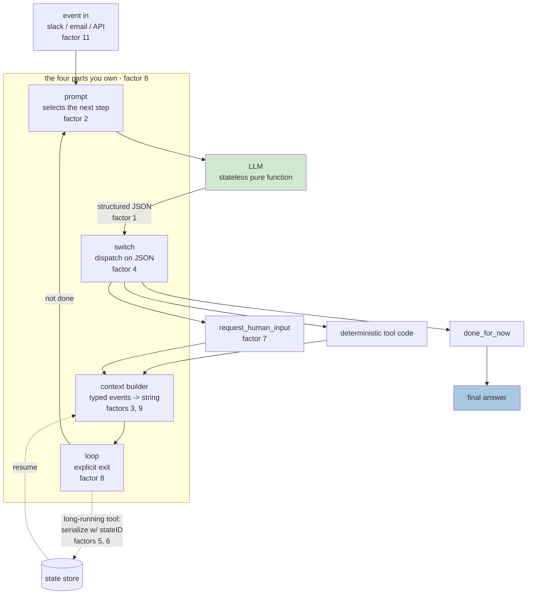
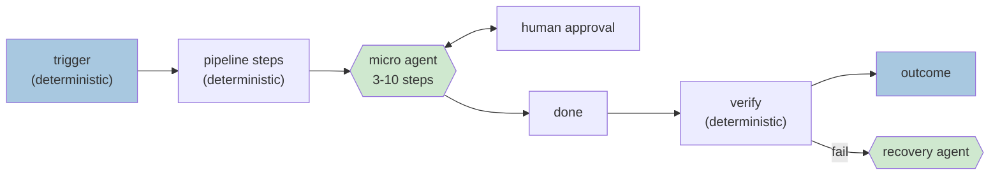

# Agent fundamentals - a ramp-up for a new joiner

> Personas: **synthesizer** (cross-source) + **mentor** (teach it) + **architect** (what to own).
> Generated 2026-07-25. Every claim cited to a source node. Diagrams marked **synthesized** are mine,
> built from the cited nodes - not lifted from a source.

**Audience:** an engineer who can write software but has not built an LLM agent, about to work on
one. **Promise:** by the end you will hold the right mental model, know which decisions are yours to
make, and recognise the four failure modes before you hit them.

**Sources in this report**

| | Source | What it contributes |
|---|---|---|
| **S1** | [Uber - Building Closed-Loop Evals for a Multimodal Agent at Scale](../sources/260725_closed-loop-evals-multimodal-agent/LEARNING.md) (AI Engineer WF 2026) | What a production agent system looks like and how it is evaluated. |
| **S2** | [Dex Horthy - 12-Factor Agents](../sources/260725_12-factor-agents/LEARNING.md) (HumanLayer, AI Engineer WF 2025) | The first-principles design rules, distilled from 100+ builder interviews. |

Deep-links: S1 `youtube.com/watch?v=31GUkCBD-Uc&t=<s>s` · S2 `youtube.com/watch?v=8kMaTybvDUw&t=<s>s`

---

## 1. Unlearn the word "agent"

Most confusion about agents comes from the word doing too much work. So start here, and be blunt
about it: **an agent is a prompt, a switch statement, a context builder, and a loop** [S2 `&t=406s`].
That is the whole thing. Ten lines of code.

```
while True:
    next_step = await llm.determine_next_step(context)   # the prompt
    context.append(next_step)                            # the context builder
    if next_step.intent == "done":                       # the loop's exit
        return next_step.final_answer
    result = await execute_step(next_step)               # the switch statement
    context.append(result)
```
*(S2's slide, `&t=345s`; see `sources/260725_12-factor-agents/visuals/frame_345.jpg`.)*

Two things follow that a new joiner usually gets backwards:

**The magic is structured output, not agency.** The one genuinely remarkable LLM capability here is
turning "create a payment link to Terri for $750" into JSON matching a schema you wrote
[S2 `&t=229s`]. Everything else in the loop is code you have written a hundred times.

**"Tool use" is not a special mechanism.** The model emits JSON; deterministic code switches on it;
a result may go back into the context. S2 states this as "tool use is harmful" - aimed at the
*abstraction*, echoing Dijkstra's *Go To Considered Harmful* - because imagining an ethereal entity
touching the world is precisely what makes agents undebuggable [S2 `&t=264s`].

> 💡 **Why this framing is the whole ramp-up.** If tool use is magic, you debug by guessing and
> defer to the framework. If it is "JSON, then a switch statement", every instinct you already have -
> types, tests, logging, error handling, retries - becomes applicable again. That is the transfer of
> skill this report exists to make.

---

## 2. The mental model

**Synthesized** from S2 nodes n2-n11 (the factor numbers are S2's, verified against the canonical
repo README - see S2 `nodes.md` `en1`):



One green box. **Everything else is ordinary software you control.** Keep that ratio in your head -
section 3 is the same claim at system scale.

---

## 3. The one thing both sources agree on

This is the highest-confidence claim in the brain, because two unrelated talks reach it from
opposite directions [`brain/claims.md` #11]:

- **S2, from first principles:** the naive loop materialises a DAG at runtime, but **breaks down on
  longer workflows** - mainly unbounded context growth [S2 `&t=371s`]. What works is **micro
  agents**: mostly deterministic pipelines with agent loops of **3-10 steps** at the genuinely
  ambiguous points [S2 `&t=741s`].
- **S1, from production:** their shipped system is a **routed pipeline of small single-purpose
  agents** - image-understanding -> router -> prompt-gen -> generation -> QA gates -> post-processing
  - each independently evaluable, all logged to one flat trace [S1 `&t=376s`].

> **Nobody who ships agents at scale ships one big autonomous loop.** They ship small, scoped,
> individually-evaluable LLM steps inside deterministic software.

S2's worked example is HumanLayer's own deploy bot, and it is the single most useful picture here:


> CI/CD is deterministic. Only at the ambiguous point - PR merged, dev tests green, what ships and in
> what order? - does a 3-10 step agent take over. A human approves or redirects in Slack ("can you
> deploy the backend API first"), then control returns to ordinary code for prod tests, with a
> separate rollback agent on the failure path. S2 `&t=741s`.

**Note the dashed "deterministic code" labels at both ends. Deciding where that boundary sits is the
architectural work.** Everything else in this report is downstream of getting it right.

**Synthesized** - the same shape, generalised:



---

## 4. What is yours to own (the architect's list)

The failure mode S2 opens on is worth memorising, because you *will* live it: pick a framework, move
fast, hit **70-80% quality** - "enough to get the CEO excited and get six more people added to your
team" - then find that the last 20% means being **seven layers deep in a call stack** reverse-
engineering how the prompt got built [S2 `&t=37s`].

Each factor below is a piece you should have owned from the start.

| Own this | Why | Cite |
|---|---|---|
| **Your prompts** | A framework builds a good prompt fast, but past a quality bar you write every token by hand. LLMs are pure functions; input tokens are the only lever short of retraining. | S2 `&t=531s` |
| **Your context window** | You are not obliged to use the messages format. Model the thread as typed events, serialise for density and clarity. | S2 `&t=563s` |
| **Your control flow** | Owning the loop is what lets you break, summarise, or insert LLM-as-judge mid-run. | S2 `&t=423s` |
| **Your state** | Unify execution state (step, retries) with business state (messages, pending approvals) behind a REST/MCP endpoint. | S2 `&t=460s` |
| **Your error handling** | Clear pending errors after a valid tool call; summarise, never dump stack traces. | S2 `&t=653s` |
| **Your traces** | Log the full flat end-to-end trace *first* - "if you don't start with it, you have nothing to optimize for." | S1 `&t=418s` |

The payoff compounds. Because you own the serialisation, you can **interrupt a long-running call,
write the context window to a store keyed by a state ID, and resume later** - "the agent doesn't even
know that things happened in the background" [S2 `&t=460s`, `&t=495s`]. You cannot do that with a
context window you do not control.


> Pause/resume is a *consequence* of owning the context window, not a separate feature. S2 `&t=460s`.

**A caution on reading S2 as anti-framework.** It is not, despite how the repo is usually taken.
Horthy explicitly reframes the 12 factors as "a wish list, a list of feature requests" for framework
authors [S2 `nodes.md` `d1`, `&t=178s`]. Own these pieces because they are where your quality comes
from, not out of principle.

---

## 5. Context engineering: the discipline under all of it

**Prompt, memory, RAG and history are one problem** - which tokens reach the model [S2 `&t=616s`].
Internalise this early; it collapses four apparent subsystems into one design question and it is why
the brain now has [a topic for it](../brain/topics/context-engineering.md).


In practice: model the thread as typed events and render them yourself.

![class Thread with events List[Event]; Event.type a Literal of list_git_tags / deploy_backend / request_more_information / done_for_now; event_to_prompt renders each as an XML-ish block; thread_to_prompt joins them](../sources/260725_12-factor-agents/visuals/frame_590.jpg)
> S2 `&t=563s`. Each event becomes `<{event.type}>\n{data}\n</{event.type}>`, joined into a single
> user message.

**On context length, hold the nuance.** This is *not* "long context is useless". You can push 2M
tokens into Gemini and get an answer back. The claim is that you will **always** get tighter,
higher-reliability results by controlling and limiting what goes in [S2 `&t=388s`]. Treat the window
as a budget you spend, not a ceiling you fill.

---

## 6. Humans are part of the architecture, not an escape hatch

Make contacting a human **a tool call**: `request_human_input` sits in the same intent enum as
`deploy_backend` [S2 `&t=687s`].


Two reasons this works, both worth remembering:

1. The model gets **richer modes** - done / need clarification / need a manager - instead of a binary.
2. The decision rides on a **natural-language token the model understands**, rather than a structural
   branch it was never trained on [S2 `&t=687s`].

Look at the frame again: it is the same event format from section 5, now carrying a human turn.
**Human input is not a special case in the architecture.** That is the design insight, not the
feature. And meet people where they already are - email, Slack, Discord, SMS - rather than building
another chat tab [S2 `&t=723s`].

---

## 7. Four traps, in the order you will hit them

| # | Trap | The tell | The fix | Cite |
|---|---|---|---|---|
| 1 | **Building an agent for a deterministic problem** | You keep adding prompt detail until you have specified the exact steps. | Write the script. S2's DevOps agent took two hours of prompting to reproduce what a 90-second bash script does. | S2 `&t=71s` |
| 2 | **The spin-out** | Agent loops on a failing tool call, loses the thread, goes crazy. | Compact errors: clear pending errors after a valid call; summarise, don't dump stack traces. | S2 `&t=653s` |
| 3 | **Context bloat over a long run** | Quality degrades as the run goes on, not immediately. | Shrink scope to a 3-10 step micro agent; control what you append. | S2 `&t=371s`, `&t=741s` |
| 4 | **No traces, so no evals** | You cannot say whether a change helped. | Log the flat end-to-end trace before optimising anything. Then eval each stage with the *right* metric - routers as classifiers on precision/recall, generation on pass@k. | S1 `&t=418s`, `&t=459s`, `&t=850s` |

Trap 4 is where S1 takes over from S2 and becomes the more useful source. Once you have the shape
right, correctness becomes a measurement problem: read
[`brain/topics/evals.md`](../brain/topics/evals.md) next.

---

## 8. Where the interesting work is

The last idea is the one that keeps this from being a checklist. **Find work sitting right at the
boundary of what the model can do reliably** - something it *cannot* get right every time - and
engineer reliability around it anyway [S2 `&t=848s`].


This is also the answer to the question every new joiner asks - *won't better models make all this
obsolete?* No. A better model moves the boundary; the engineering moves with it. The expected
trajectory is not a leap to autonomy but **starting deterministic and sprinkling LLM steps in**,
widening their scope as models improve [S2 `&t=814s`].

---

## 9. Your first week

1. **Read** S2's [LEARNING.md](../sources/260725_12-factor-agents/LEARNING.md) (~15 min), then watch
   the 17-minute talk. Fundamentals before frameworks.
2. **Write the ten-line loop yourself** against any model API, with no framework. One tool, one exit
   condition. This is the single highest-leverage hour of the week.
3. **Then break it deliberately:** feed it a failing tool call and watch it spin out (trap 2). Let a
   run grow long and watch quality drift (trap 3). You want these in your hands, not your notes.
4. **Draw your actual problem** as section 3's diagram. Mark the deterministic/agent boundary
   explicitly. If the agent box has more than ~10 steps, it is too big.
5. **Add logging before anything else** - the flat end-to-end trace [S1 `&t=418s`].
6. **Then** read [`brain/topics/evals.md`](../brain/topics/evals.md) and decide what "working" means
   in numbers.

**Reference while building:** [`brain/topics/agents.md`](../brain/topics/agents.md) ·
[`brain/topics/context-engineering.md`](../brain/topics/context-engineering.md) ·
[`brain/glossary.md`](../brain/glossary.md)

---

## 10. What to distrust in this report

Stated plainly, because a ramp-up that hides its weak points teaches overconfidence.

- **Two sources, both practitioner talks, neither with data.** No benchmarks, ablations or failure
  rates appear in either. "Limit tokens and reliability improves" is asserted and plausible, never
  measured. Treat all of this as well-argued practitioner consensus.
- **S2's corroboration is not independent.** The canonical repo README confirms the factor numbering,
  but the repo and the talk share one author (S2 `nodes.md` `en1`). The "100+ builders interviewed"
  basis is uncheckable from the source.
- **Agreement between S1 and S2 is weaker than it looks.** Both are conference talks by people
  selling adjacent products, delivered a year apart into the same discourse. Genuine independence
  would mean a source that argues the opposite. Worth actively seeking one.
- **A real gap: security.** Neither source discusses prompt injection into the context window, tool
  poisoning, or what happens when an event in your carefully-owned thread is attacker-controlled.
  Both treat tool calls as trusted. [`brain/topics/agent-security.md`](../brain/topics/agent-security.md)
  is still a seed - **do not treat this report as sufficient for anything user-facing or
  privileged.**
- **Unresolved even within S2:** how error compaction should actually be implemented (another LLM
  call? heuristics?), and whether scaffold-not-wrapper beats abstraction - the old duplication-vs-
  abstraction argument, left open (S2 `nodes.md` `d2`).
