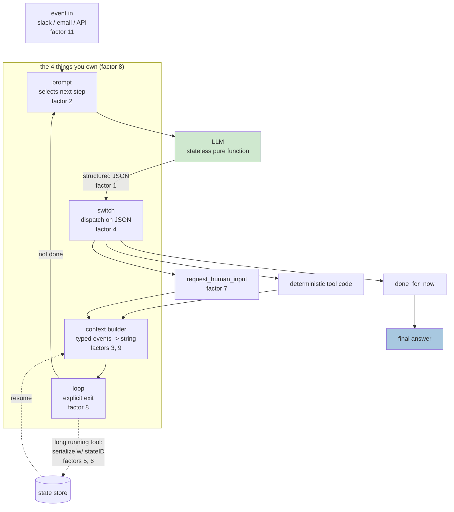
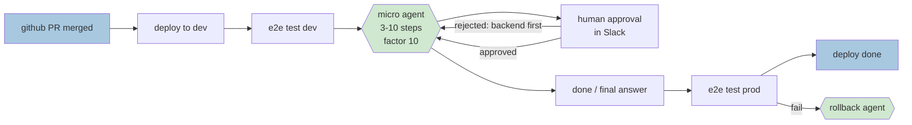

# Learning - 12-Factor Agents: Patterns of reliable LLM applications

> Persona: **curator** + **mentor, always** - + **architect** for the topic mapping. Re-adopt when
> working this file.

> The distilled document you learn from - text anchored by a few curated visuals. Built from the
> corroborated nodes in `nodes.md`. Every claim is cited. Signal, not archive. See `SOURCE.md`.

> **Voice: an AI architect ramping up a new senior engineer** who has never built an agent.
> Foundations are marked as scaffolding; everything else carries a node ID; evidence is labelled
> where the claim is made. Shape per `AGENTS.md` § "Writing a `LEARNING.md` (the required shape)".

## TL;DR

Dex Horthy reports interviewing 100+ people building agents and found that **the ones that work in
production are barely agentic** - ordinary deterministic software with small, tightly-scoped LLM
steps inside (`n1`). From that he distilled 12 factors, named after Heroku's 12-factor app. The
through-line: **an agent is a prompt, a switch statement, a context-window builder, and a loop** -
and reliability problems trace back to letting a framework own one of those four instead of you
(`n5`). `https://www.youtube.com/watch?v=8kMaTybvDUw`

> **What that first sentence is worth.** The 100+ interviews are the entire empirical basis of the
> talk and **you cannot check them** - no names, no method, no counts (`n1`). Take the factors as a
> well-argued pattern language from someone who has clearly built this, **not** as a survey result.
> Full accounting in "The evidence, weighed".

## The 1-minute version

| | |
|---|---|
| **The problem** | You pick a framework, reach **70-80% quality** fast, then need the last 20% and find yourself **seven layers deep in a call stack** reverse-engineering how your own prompt was built (`n18`). |
| **Why the obvious answer fails** | The naive loop - prompt, pick next step, append result, repeat - materialises a DAG at runtime and breaks on long workflows, because **context grows without bound** and quality degrades continuously long before any limit (`n4`). |
| **The idea** | An agent is **four parts you should own**, and they are derivable rather than memorable: something must instruct the choice (**prompt**), turn text into action (**switch on structured JSON**), decide what the stateless model sees next (**context builder**), and decide when to stop (**loop**) (`n5`). |
| **How it works** | The enabling capability is narrower than it looks - a sentence becoming **JSON matching a schema you defined**. "Tool use" adds nothing magical on top (`n2`, `n3`). Own the serialisation and pause/resume becomes possible; own the loop and mid-run intervention becomes possible. |
| **What ships** | **Micro agents**: 3-10 step loops at the genuinely ambiguous points of an otherwise deterministic pipeline, with humans contacted as a **tool call** rather than a structural branch (`n13`, `n11`). |
| **The counterweight** | **Not every problem needs an agent.** Two hours of prompt engineering versus a 90-second bash script (`n17`). |
| **How far to trust it** | **T4 talk by a founder selling agent tooling. Nothing is measured** - no benchmark, ablation or failure rate anywhere. Its "corroborated (external)" nodes gate against a companion repo that **shares the same author**. Every real number here came from a later research pass. |

## Key claims

- **An agent = prompt + switch statement + context builder + loop.** Own all four. `n5` `&t=406s`
- The enabling capability is **structured output** - a sentence becomes JSON matching your schema.
  "Tool use" is that JSON plus deterministic code. `n2` `n3` `&t=229s` `&t=264s`
- **LLMs are stateless pure functions.** Prompt, memory, RAG and history are one problem: which
  tokens reach the model. `n9` `&t=616s`
- The naive loop breaks on long workflows because **context grows unboundedly**. `n4` `&t=371s`
- What ships is **micro agents**: 3-10 step loops at the hard points of a deterministic pipeline.
  `n13` `&t=741s`
- **Make contacting a human a tool call**, not a structural branch. `n11` `&t=687s`
- **Not every problem needs an agent.** `n17` `&t=71s` `single-leg`

## Why you should care: the 70-80% wall

You will hit this personally, and the shape of it is specific enough to recognise in advance.

You pick a framework and move fast. You reach **70-80% quality** quickly - "enough to get the CEO
excited and get six more people added to your team." Then you need the last 20%, and you find
yourself **seven layers deep in a call stack** trying to reverse-engineer how the prompt got built
and how the tools got passed in. Many people throw it away and start over (`n18`, `&t=37s`).

That wall is the reason for all twelve factors: **each one is a piece of the system you should have
owned from the start.** And the entry price is lower than it looks - "this is software engineering
101", no AI background required (`n1`, `&t=141s`).

> ⚠️ `n18` is `single-leg` - an anecdote with no slide behind it. It is the motivating story, not a
> measured failure rate, and no failure rate appears anywhere in this talk.

## Foundations (scaffolding, not from the source)

**Uncited by construction** - this section is background *I* am supplying so the rest reads. The
source assumes all of it. Every sentence outside this section carries a node ID.

**Skip this part if** you have already built something that calls an LLM in a loop and dispatches on
its output.

- **An LLM call is a pure function.** Tokens in, tokens out, no memory between calls. Anything that
  looks like memory - chat history, "the assistant remembers" - is your code re-sending text. This is
  the single fact the whole talk rests on.
- **Structured output / function calling** is the provider feature where you hand the model a JSON
  schema and it returns JSON conforming to it, rather than prose. Mechanically it is still
  text prediction, constrained.
- **A DAG** (directed acyclic graph) is a workflow of steps with a direction and no cycles - what
  Airflow or Prefect orchestrate. Horthy's framing: "if you've written an `if` statement, you've
  written a directed graph."
- **"Agent"**, as the field loosely uses it, means an LLM in a loop that chooses its own next action
  rather than following a fixed script. Holding that definition loosely is deliberate - narrowing it
  is most of what this source does.

## The naive attempt, and precisely how it fails

Here is the design everyone writes first. Read it before the critique.

- What it teaches: the whole of "agent" in about ten lines - an event arrives, you prompt, the model
  picks the next step, you append the result, you repeat until `done`. `n4` `&t=334s`
- Corroborated by: the narration walking the same loop aloud. `&t=406s`

Run it and it **materialises a DAG at runtime** - the promise being that you no longer write the
workflow, you just state the goal.

- What it teaches: the graph the loop produces without anyone drawing it. `n4` `&t=334s`
- Corroborated by: "turns out this doesn't really work. Especially when you get to longer workflows.
  **Mostly it's long context windows.**" `&t=371s`

**Before reading on, name the failure yourself.** The loop appends every step and every result, and
never removes anything. What runs out?

The context window - and the failure is not the one people expect. It is **not** "you hit the token
limit and get an error". It is that quality degrades continuously, long before any limit, and you
cannot see it happening (`n4`, `&t=388s`). The nuance Horthy is careful about: this is not "long
context is useless". You can put 2M tokens into Gemini and get *an* answer back. You will
**always** get tighter, higher-reliability results by controlling and limiting what goes in.

> **This is the one claim in the talk that has since been measured, and the measurements are harsher
> than the talk's framing** (`en2`, external). Degradation is position-dependent and U-shaped across
> six model families ([Lost in the Middle](https://arxiv.org/abs/2307.03172), TACL, T1); it appears
> "even on simple tasks" across 18 models, with a 200K-window model degrading materially by 50K
> ([Context Rot](https://www.trychroma.com/research/context-rot), T2); and the mechanism is an n²
> attention budget ([Anthropic](https://www.anthropic.com/engineering/effective-context-engineering-for-ai-agents),
> T2). **S2 undersells its own best claim.** See [R1](context/01_context-limits-and-decomposition.md).

So the naive loop has two failure modes, and they compound: **the context grows without bound**, and
**a framework owns the loop**, so when quality stalls you cannot get at any of it (`n18`).

## The crux, derived: four parts, each named by a question the previous one cannot answer

Do not memorise "the four owned parts". Derive them, and they stop feeling like a list.

Start from the only thing you actually have: **a stateless function that turns text into text.**

**Question 1 - what makes it choose a next step at all?** Nothing in the model knows your domain, so
something must instruct it how to select. That is **the prompt**, and it is the first part you own.
A framework will write you a genuinely good one fast - "you would have to go to prompt school for
like three months to build a prompt this good" - but past a quality bar you write **every single
token by hand**, because the model is a pure function and input tokens are the only lever short of
retraining (`n7`, `&t=531s`).

**Question 2 - the model returned text. What turns that into an action?** It must return something
your code can branch on, which means **structured output**, and then something that branches. That
is **the switch statement**, the second part you own.

- What it teaches: the most magical thing an LLM does has nothing to do with agency - it turns "can
  you create a payment link to Terri for $750 for sponsoring the February meetup?" into JSON matching
  a schema you defined. `n2` `&t=229s`
- Corroborated by: "It is turning a sentence like this into JSON that looks like this. **Doesn't even
  matter what you do with that JSON.**" `&t=229s`

This is why Horthy borrows Dijkstra's title for *"tool use is harmful"* - aimed at the **abstraction**,
not the capability (`n3`, `&t=264s`). The harmful idea is that tool use is "this magical thing where
this ethereal alien entity is interacting with its environment." What actually happens: the model
emits JSON, deterministic code switches on it, maybe a result goes back.

> 💡 **Why the demystification is load-bearing.** If tool use is magic, debugging it is guesswork and
> you defer to the framework. If it is "JSON, then a switch statement", every ordinary engineering
> instinct you already have - types, tests, logging, error handling - applies again.

**Question 3 - the model is stateless, so what does it see on the next turn?** Something must assemble
the window each time. That is **the context builder**, the third part - and the moment you own it,
you are no longer obliged to use the standard messages format.

![class Thread with events List[Event]; Event.type as a Literal of list_git_tags / deploy_backend / deploy_frontend / request_more_information / done_for_now; event_to_prompt renders XML-ish blocks; thread_to_prompt joins events](visuals/frame_590.jpg)

- What it teaches: model the thread as **typed events** and stringify however maximises density and
  clarity - here XML-ish blocks joined into one user message. `n8` `&t=563s`
- Corroborated by: "your only job is to tell it what's happened so far. You can put all that
  information however you want into a single user message." `&t=563s`

And once you are choosing tokens deliberately, the four things you thought were separate subsystems
collapse into one question.

- What it teaches: prompt, memory, RAG and history are not four problems but one - which tokens reach
  the model. `n9` `&t=616s`
- Corroborated by: the slide states it and the narration repeats it verbatim. `&t=599s`

**Question 4 - when does any of this stop?** Something must decide to go round again or exit. That is
**the loop**, the fourth part - and owning it is what makes mid-run intervention possible at all:
"if you own your control flow, you can do fun things like break and switch and summarize and
LLM-as-judge and all this stuff" (`n5`, `&t=423s`).

Four questions, four parts, and **every remaining factor is an answer to "what happens when you take
one of those four seriously?"** Factor 2 is the prompt; factor 3 the context builder; factor 9 what
you append when things fail; factor 8 the loop. That is why the list is twelve and not four.

> ⚠️ **The factor *numbering* is corroborated externally; the factors are not.** The repo README's
> twelve match the talk's numbering exactly, including the ones delivered out of order (`en1`) - which
> is real evidence about the mapping and no evidence about whether the factors work, since **the repo
> and the talk share one author**.

## One instance traced end to end: HumanLayer's deploy bot

The abstract design is four boxes. Here is one real request through all of them.

- What it teaches: **factor 10, and the most important slide in the talk.** Most of the pipeline is
  deterministic CI/CD; a small agent takes over only at the genuinely ambiguous point, for **3 to 10
  steps**, then hands control back. `n13` `&t=741s`
- Corroborated by: the narration walking the same pipeline, including the human's redirect. `&t=776s`

Walk it, and note what breaks if each part is missing:

1. **A PR merges.** Deterministic CI deploys to dev and runs e2e tests. No model involved. *Remove the
   deterministic bracket and you have handed a language model your production deploy - the failure is
   not subtle.*
2. **The ambiguous question arrives:** dev is green, what do we ship and in what order? The **context
   builder** renders the thread so far as typed events. *Without it you are appending raw messages,
   and by step eight the model is reasoning over its own noise.*
3. **The prompt** asks for the next step. The model returns `deploy_frontend` as JSON. *Without owning
   it you are debugging someone else's string at 80%.*
4. **The switch** dispatches on that JSON. *Without structured output you are regex-parsing prose.*
5. **A human redirects** - "can you deploy the backend API first" - and that arrives as just another
   event in the same thread, not as a branch in your code (`n11`).
6. **The loop** goes round with the correction appended, emits `deploy_backend`, then `done`.
7. **Control returns to deterministic code** for prod e2e tests, with a separate small rollback agent
   on the failure path.

The payoff, in his words: "**100 tools, 20 steps, easy.** Manageable context, clear responsibilities"
(`n14`, `&t=814s`). Note the dashed **"deterministic code"** labels at both ends - **that boundary is
the actual design artefact, and deciding where it sits is the job.**

> **Evidence, since this is the claim the whole talk rests on.** The slide is **HumanLayer's own
> deploy bot** and "easy" is the speaker describing his own product, with no baseline, no failure rate
> and no comparison against the big-loop design he is arguing against. Internally corroborated only
> (slide ↔ narration). **It is nonetheless the best-supported claim in this brain**, because two
> independent things landed on it later: S1 reached the same shape from Uber's production practice,
> and `en3` measured decomposition at **+13.1 to +41.5 pp** reliability across 10 models
> ([`brain/claims.md`](../../brain/claims.md) claim 11). **Believe the shape; "easy" is a founder's
> word, not a result.**

## Second-order problems: what breaks once it is running

The four parts get you a working loop. These are the failures that arrive afterwards, and each one
is a factor.

**Errors accumulate and the agent spins out.** When a tool call fails, the naive move is to append
the error and retry. Do that blindly and the agent loses the thread and gets stuck. Instead: once a
valid tool call succeeds, **clear the pending errors**; summarise rather than pasting the stack
trace (`n10`, `&t=653s`). This is factor 9, and it is the sharpest practical rule in the talk.

**Some tool calls take days, not milliseconds.** A human approval is not a function that returns.

- What it teaches: **factors 5 and 6.** Unify execution state (current step, retry counts) with
  business state (messages, pending approvals), put the agent behind a REST or MCP endpoint, and on a
  long-running call **serialise the context window to a store keyed by a state ID**. On callback,
  reload, append, resume. `n6` `&t=460s`
- Corroborated by: "**the agent doesn't even know that things happened in the background.**" `&t=495s`

**You can only do this because you owned the context window** - this is the first factor that visibly
pays back an earlier one. Factor 12 completes it: the agent holds no state of its own, it is a
stateless reducer (`n16`, `needs-check` - mentioned in passing, no worked example).

**Humans need a way in that is not a special case.**

- What it teaches: **factor 7.** Rather than forcing the model's first output token to choose between
  "tool call" and "message to human", make human contact just another intent - `request_human_input`
  alongside `deploy_backend`. `n11` `&t=687s`
- Corroborated by: the trace shows the human turn rendered in the same event format as everything
  else. `&t=687s`

Two payoffs worth remembering: the model gets **richer modes** (done / need clarification / escalate),
and the decision rides on **a natural-language token it understands** rather than a structural branch
it was never trained on. Factor 11 rides along - trigger from email, Slack, Discord, SMS, because
"people don't want to have seven tabs open of different ChatGPT style agents" (`n12`, `needs-check`,
no dedicated slide).

## How would you know it works?

**This source measures nothing.** No benchmark, no ablation, no failure rate, no A/B - not for the
factors individually and not for the framework as a whole (`nodes.md` standing caveat). That is the
honest headline, and it should shape how you use the talk.

What exists instead, and what each is worth:

| Evidence | What it supports | What it does not |
|---|---|---|
| The repo README matching the talk's numbering (`en1`) | that the factors are stated consistently | anything about efficacy - **same author** |
| "100+ builders interviewed" (`n1`) | the factors are distilled from real practice | uncheckable: no names, method or counts |
| HumanLayer's deploy bot (`n13`) | the shape is buildable and one team runs it | one pipeline, no baseline, vendor's own |
| **R1's external pass** (`en2`, `en3`) | context degradation and decomposition, **measured** | the other ten factors, untouched |

**The eval you would build first**, if you wanted to test this yourself, is the one `en3` already
describes: take a long task, run it as one loop and as short restarted segments, and compare
reliability. That is the single claim here with a published method behind it (+13.1 to +41.5 pp
across 10 models, T3 preprint) - and note the **boundary the same paper draws and S2 misses**: a
naive memory scaffold "never improves long-horizon reliability, and hurts 6 of 10 models" (`en4`).
**Decompose and keep segments short; do not bolt memory onto a long loop.**

## Where this sits

Three connections worth holding, because each one tells you something the talk cannot tell you about
itself.

**The factors have a dependency order, and it is not the numbering.** Factor 3 (own the context
window) is load-bearing for factors 5, 6 and 12: resumption works only if the thread was serialisable
in the first place, so a design that skips factor 3 cannot later add pause/resume without a rewrite
(`n6`, `n8`). Factor 1 sits at the other extreme - it is adoptable inside an existing codebase with
no rewrite at all, because structured output changes one function, not an architecture (`n2`). **The
numbering is presentational; the dependencies are real.**

**This design already has an older name, and the talk never says it.** Factors 3, 5, 6 and 12 - an
append-only typed event log, state reconstructed by replay, a stateless processor - are **Event
Sourcing**, named by Fowler in 2005 (`d3`, T1). That matters in both directions: it is mild evidence
the shape is right, since a different field converged on it decades earlier under different pressures;
and it means three failure modes are already documented that S2 never mentions - **replay determinism,
snapshotting, event versioning**. If you build this, read that literature rather than rediscovering
them.

**It is not an anti-framework talk**, despite how the repo is usually read. Horthy explicitly reframes
the twelve as "a wish list, a list of feature requests" for framework authors (`d1`, `&t=178s`). The
argument is about *which* seams stay yours, not about writing everything from scratch - a framework
whose loop is inspectable and overridable satisfies him completely.

And the counterweight, kept deliberately last: **not every problem needs an agent.** Horthy's first
DevOps agent was handed a Makefile and ran the steps in the wrong order; two hours of increasingly
specific prompting later, he had specified the exact build order - "I could have written the bash
script to do this in about **90 seconds**" (`n17`, `&t=71s`, `single-leg`). The twelve factors make
agents reliable; they do not make an agent the right tool.

- What it teaches: the differentiator is picking work **right at the boundary of what the model does
  reliably** - something it cannot get right every time - and engineering reliability around it
  anyway. `n15` `&t=848s`
- Corroborated by: the narration expanding the quote into the "find the bleeding edge" argument.
  `&t=848s`

> **Note what this one is.** A quoted slide of **one practitioner describing a feeling** - not a
> finding, and the weakest evidence in the note. It earns its place because S4 later reaches the same
> boundary-relative framing from an entirely different direction (a harness rebuilt when the boundary
> moved), which is why claim 18 is `corroborated (2 sources)` while this slide alone would not carry
> it. It is also the answer to "won't better models make this obsolete?" - a better model moves the
> boundary, and the engineering moves with it.

## Diagram (mental model)

**How to read it:** flow runs top to bottom, one pass round the loop. The boxed group is the four
parts *you* write; **green is the only LLM call**; the dotted path is what happens when a tool call
takes minutes or days instead of milliseconds. Factor numbers are marked on the box they belong to.

**The crux: there is exactly one green box, and everything else is ordinary software you already
know how to write.**

**Why it is shaped this way:** the LLM sits in the *middle* of the diagram rather than around the
outside, and that placement is the whole argument. Frameworks invert it - they own the loop, the
dispatch and the context assembly, and hand you a callback - which is how you end up seven layers
deep in a call stack trying to find where your prompt was built `&t=55s`. Drawn this way, every
arrow into and out of the model is a seam you control: you can log it, test it, replay it, or break
out of the loop mid-run. Note the dotted path leaves and re-enters at the **context builder**, not
at the prompt - resumption works only because the thread was serialisable in the first place, which
is why factor 3 has to be in place before factors 5 and 6 are even possible.

*Synthesized from `n2`, `n5`, `n6`, `n8`, `n11` - not a slide from the talk.*

**How to read it:** left to right is one deployment, start to finish. **Blue is a boundary event,
green is LLM-driven, plain boxes are ordinary deterministic code.** The hexagons are agent loops;
everything else is CI/CD you already have.

**The crux: the agent owns only the genuinely ambiguous middle - what to ship and in what order -
and hands control straight back to deterministic code.**

**Why it is shaped this way:** count the green. Two small hexagons in a pipeline of seven steps, and
the talk reports this handling "100 tools, 20 steps, easy" `&t=814s`. The instinct when an agent
underperforms is to give it *more* scope; this shape says the opposite - shrink the window until the
model only decides the thing that actually requires judgement. Note where the boundary sits: not at
"hard vs easy", but at **deterministic vs ambiguous**. Running the tests is hard and stays code,
because the answer is knowable in advance. Deciding deploy order is easy for a human and goes to the
model, because it depends on context nobody encoded. Note too that the human sits *inside* the agent
loop rather than gating it from outside - approval is an event in the thread (factor 7), which is
what lets a rejection carry a reason the agent can act on rather than just a "no".

*Synthesized from `n1`, `n11`, `n13`, `n14` - a redrawing of `frame_800.jpg` `&t=741s`.*

## 💡 Terms

| Term | Explanation |
|---|---|
| **12-factor agent** | Horthy's list of 12 design rules for reliable LLM applications, named after Heroku's 12-factor app. Each factor is a piece of the system you should own rather than delegate to a framework. |
| **Context engineering** | The single discipline behind prompt, memory, RAG and history: deciding exactly which tokens reach the model. `&t=616s` |
| **Micro agent** | A small agent loop of roughly 3-10 steps embedded at a hard point inside an otherwise deterministic pipeline - the shape that works in production. `&t=741s` |
| **Materialised DAG** | The graph of steps that an agent loop produces at runtime, as opposed to a DAG you wrote up front in Airflow or Prefect. `&t=371s` |
| **Spin-out** | The failure mode where raw errors are blindly appended to the context window, the agent loses the thread and gets stuck retrying. Factor 9's target. `&t=653s` |
| **Stateless reducer** | Factor 12: the agent holds no state of its own; it folds an event into a thread you own. Pedantically a *transducer*, since there are multiple steps. `&t=865s` |
| **Structured output** | The model emitting JSON conforming to a schema you defined, rather than prose. Factor 1 - and per factor 4, all "tool use" really is. `&t=229s` |

## The evidence, weighed

Read this before citing anything above.

- **Tier and interest: T4 conference talk, and the speaker sells agent tooling.** Horthy is the
  founder of HumanLayer; the worked example is HumanLayer's own product. That does not make the
  factors wrong - it does mean no claim here is disinterested.
- **The empirical basis is uncheckable.** "100+ founders, builders, engineers" (`n1`) comes with no
  names, no method and no breakdown. It is the load-bearing sentence of the talk and it cannot be
  verified from the source.
- **"Corroborated (external)" here does not mean independent.** Nine nodes gate against the companion
  repo README (`en1`). The README and the talk **share one author**, so that corroborates *the
  framework as stated*, never that it works.
- **Two internal legs means consistent, not correct.** The remaining nodes gate slide ↔ narration.
  That proves the deck and the talk agree.
- **Nothing is measured by this source.** No benchmark, ablation, or failure rate. Every number in
  this note that means anything came from [R1](context/01_context-limits-and-decomposition.md).
- **`n17`, `n18` are `single-leg`** (anecdote, no slide); **`n12`, `n16` are `needs-check`**
  (mentioned in passing, no worked example).

## Open questions

> **A deep-research pass has run on this source** (2026-07-25):
> [`context/01_context-limits-and-decomposition.md`](context/01_context-limits-and-decomposition.md).
> It closed both original open questions. External evidence lives in that note, not here - this file
> answers only *what did this source teach?*

- ~~**No independent corroboration.**~~ **Closed by R1.** Anthropic - a different organisation with
  no shared interest - independently reaches `n17` and `n18`, the latter near-verbatim on frameworks
  obscuring the prompt (`en5`).
- ~~**No measurements anywhere.**~~ **Closed by R1**, and the measurements are harsher than the
  talk's framing (`en2`).
- **The boundary S2 misses.** Decomposition helps; *naive memory scaffolding* hurts 6 of 10 models
  (`en4`). "Own your context window" must not drift into "accumulate a richer thread".
- **Whether the Event Sourcing inheritance actually bites.** "Where this sits" records that factors
  3/5/6/12 are Event Sourcing (`d3`) and that the pattern already names replay determinism,
  snapshotting and event versioning. Nobody has checked which of the three a real agent thread hits
  first, or whether an LLM thread's replay is deterministic enough for the pattern to apply cleanly.
- **`d2` - open**: the proposed `create-12-factor-agent` is scaffold-not-wrapper, modelled on
  shadcn/ui. Whether generated-code-you-own beats an abstraction is the old
  duplication-vs-abstraction argument, unresolved in the talk. `&t=882s`

## Feeds these topics

- `../../brain/topics/agents.md` - n1..n9, n13..n18 (the four owned parts, micro agents, control
  flow, pause/resume, structured output).
- `../../brain/topics/context-engineering.md` - n4, n8, n9, n10 (context window ownership,
  event-thread rendering, error compaction, token budget as the reliability lever).
