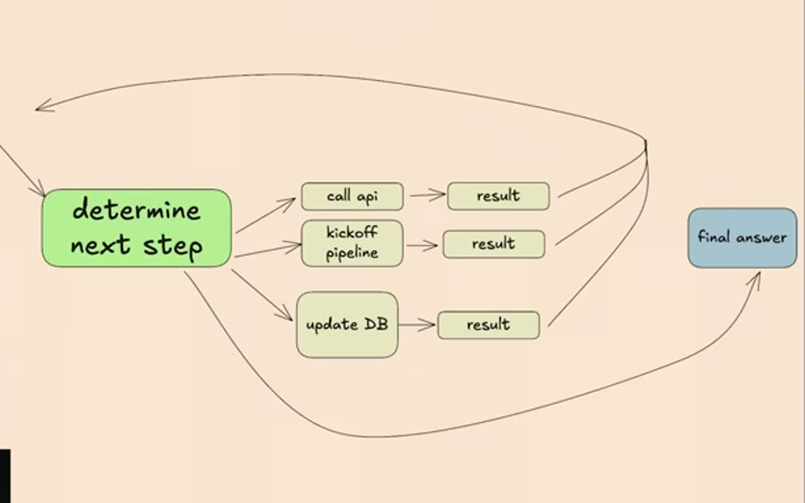
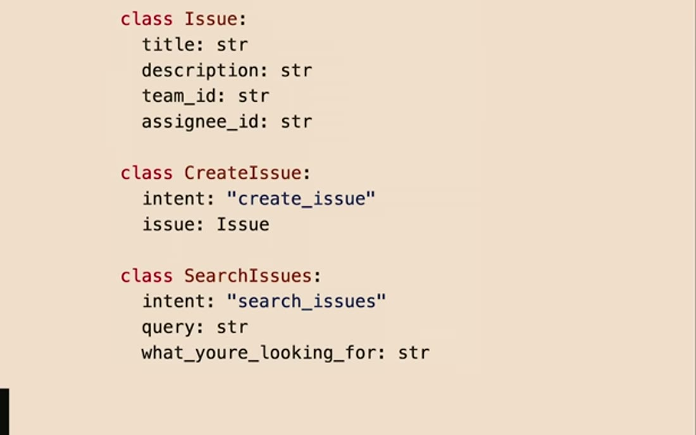
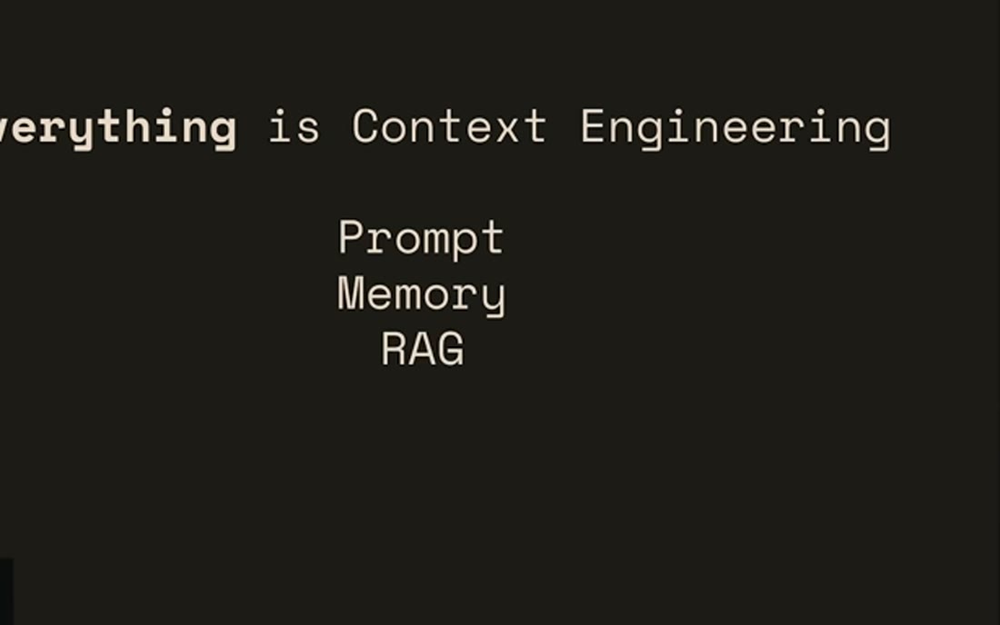
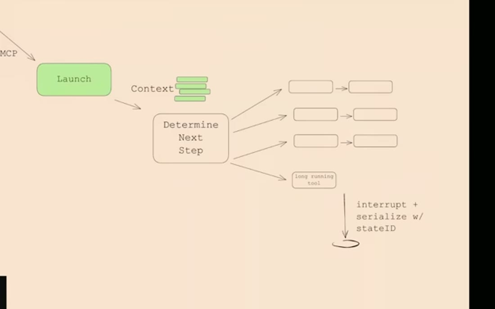
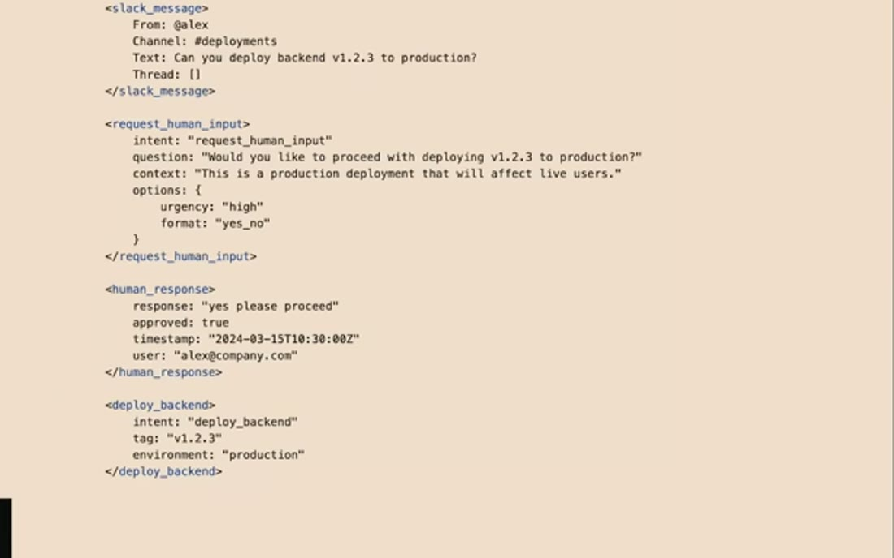
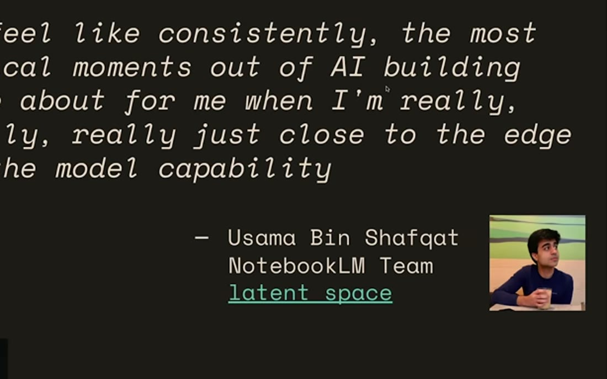
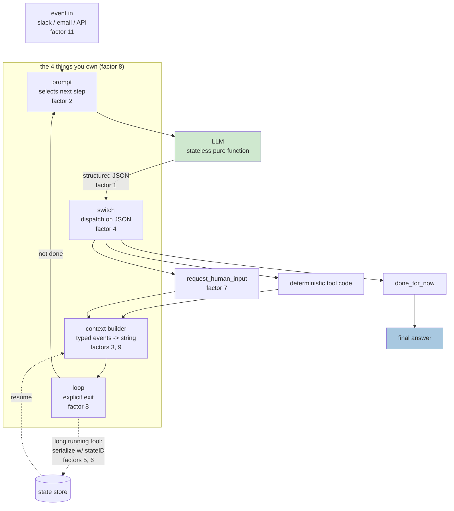
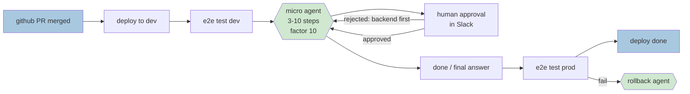

# Learning - 12-Factor Agents: Patterns of reliable LLM applications

> Persona: **curator** + **mentor, always** - + **architect** for the topic mapping. Re-adopt when
> working this file.

> The distilled document you learn from - text anchored by a few curated visuals. Built from the
> corroborated nodes in `nodes.md`. Every claim is cited. Signal, not archive. See `SOURCE.md`.

> **Voice: an AI architect ramping up a new senior engineer** who has never built an agent.
> Foundations are marked as scaffolding; everything else carries a node ID; evidence is labelled
> where the claim is made. Shape per `AGENTS.md` § "Writing a `LEARNING.md` (the required shape)".

## TL;DR

Dex Horthy reports interviewing 100+ people building agents and found that **the ones that work in
production are barely agentic** - ordinary deterministic software with small, tightly-scoped LLM
steps inside (`n1`). From that he distilled 12 factors, named after Heroku's 12-factor app. The
through-line is that **an agent is a prompt, a switch statement, a context-window builder, and a
loop**, and reliability problems trace back to letting a framework own one of those four instead of
you (`n5`). `https://www.youtube.com/watch?v=8kMaTybvDUw`

> **What that first sentence is worth.** The 100+ interviews are the entire empirical basis of the
> talk and **you cannot check them** - no names, no method, no counts (`n1`). Take the factors as a
> well-argued pattern language from someone who has clearly built this, **not** as a survey result.
> Full accounting in "The evidence, weighed".

## The 1-minute version

This article covers a conference talk in which Dex Horthy reports interviewing more than a hundred
people building agents, and then answers a deliberately deflating question about what the working
ones have in common (`n1`). His answer is that they are barely agentic at all. What ships in
production is ordinary deterministic software with small, tightly-scoped language-model steps inside
it, and the twelve factors are his attempt to name which pieces of that software you have to write
yourself. To see why such a list needs to exist at all, start with the failure that produces it.

That failure has a specific and recognisable shape, and it arrives on a schedule. You pick a
framework, you move fast, and you reach roughly **70-80% quality** quickly, which is enough to get
a team assigned to you. Then you need the last 20%, and the character of the work changes. You find
yourself **seven layers deep in a call stack** trying to reverse-engineer how your own prompt was
built and how your tools were passed in, and many people at that point throw the whole thing away
and start over (`n18`). At first glance that reads as a complaint about one bad framework, which
would be answered by picking a better one.

The reason it is not that is what makes the problem hard rather than merely annoying. The model is a
stateless function from tokens to tokens, so the only lever you have on quality, short of retraining,
is which tokens go in (`n9`). The code that decides which tokens go in is exactly the code the
framework took ownership of. Everything you would normally reach for as an engineer, whether that is
a log line, a test, or a breakpoint, sits on the far side of that boundary. In other words, the
abstraction is load-bearing while you are at seventy per cent and in the way once you need ninety,
which is why the naive design fails in a manner that feels like bad luck rather than like a
consequence.

The naive design is the one everybody writes first, and it is worth stating plainly before
criticising it. You prompt the model, it picks a next step, you execute that step, you append the
result to the context, and you go round again until it reports that it is done (`n4`). Run it and it
materialises a workflow graph at runtime, which is precisely the promise on offer: you no longer
write the workflow, you state the goal. Then it stops working on longer workflows, and the reason is
that the loop appends every step and every result and removes nothing. Context grows without bound.
The failure that follows is not the one people expect, because it is not an error thrown at a token
limit. Quality degrades continuously, long before any limit is reached, and nothing in the system
tells you it is happening (`n4`). Two failure modes therefore compound. The context grows
unboundedly, and a framework owns the loop, so when quality stalls you cannot get at any of it
(`n18`).

The idea that answers both is not a list to memorise but a derivation to follow. Begin with the only
thing you actually have, which is a stateless function that turns text into text, and ask what has
to be added. Something must instruct it how to choose a next step, and that is the prompt. Something
must turn the text it returns into an action, which requires structured output and then a switch
statement. Something must decide what the stateless model sees on the next turn, and that is the
context builder. Something must decide when to stop, and that is the loop (`n5`). Four questions
produce four parts you own, and every remaining factor is an answer to what happens once you take
one of those four seriously.

How it works underneath is narrower than the vocabulary suggests. The enabling capability is a
sentence becoming JSON that matches a schema you defined, and in the talk's framing it does not even
matter what you do with that JSON afterwards (`n2`). "Tool use" is that JSON plus deterministic code
that switches on it, which is why Horthy borrows Dijkstra's title to call the abstraction harmful
while leaving the capability alone (`n3`). Ownership then pays back in concrete places rather than
in principle. Own the serialisation of the thread and a tool call that takes days becomes a pause and
a resume instead of a blocked process. Own the loop and you can break out mid-run to summarise, to
switch strategy, or to ask a person. What ships on top of all this is deliberately small, namely
**micro agents** of three to ten steps placed at the genuinely ambiguous points of an otherwise
deterministic pipeline, with a human contacted as a tool call rather than as a branch in your code
(`n13`, `n11`).

What that costs arrives in two forms. The first is that you now write the parts the framework would
have written, and the talk is honest that a framework will hand you a better prompt than you will
write on day one (`n7`). The second cost is a judgement you cannot delegate to anyone, which is
where the boundary between deterministic code and model is drawn. Horthy keeps a counterweight for
exactly that, and it is his own story rather than someone else's. His first DevOps agent was handed
a Makefile, ran the steps in the wrong order, and after two hours of increasingly specific prompting
he had effectively specified the exact build order that a 90-second bash script would have encoded
(`n17`, `single-leg` - an anecdote with no slide behind it). The twelve factors make agents reliable.
They do not make an agent the right tool.

So how far should any of this be trusted? This is a **T4 conference talk by a founder who sells
agent tooling**, and the worked example is his own company's product. **Nothing here is measured.**
There is no benchmark, no ablation and no failure rate, neither for the factors individually nor for
the argument as a whole. The nodes marked "corroborated (external)" gate against a companion
repository that **shares the same author**, which corroborates that the factors are stated
consistently and says nothing whatsoever about whether they work. Every real number in this note
arrived later, from a separate research pass. Read the twelve as a well-argued pattern language from
someone who has clearly built this, and take the shape rather than the confidence.

The same argument, compressed for reference rather than for reading:

| | |
|---|---|
| **The problem** | You pick a framework, reach **70-80% quality** fast, then need the last 20% and find yourself **seven layers deep in a call stack** reverse-engineering how your own prompt was built (`n18`). |
| **Why the obvious answer fails** | The naive loop - prompt, pick next step, append result, repeat - materialises a DAG at runtime and breaks on long workflows, because **context grows without bound** and quality degrades continuously long before any limit (`n4`). |
| **The idea** | An agent is **four parts you should own**, and they are derivable rather than memorable: something must instruct the choice (**prompt**), turn text into action (**switch on structured JSON**), decide what the stateless model sees next (**context builder**), and decide when to stop (**loop**) (`n5`). |
| **How it works** | The enabling capability is narrower than it looks - a sentence becoming **JSON matching a schema you defined**. "Tool use" adds nothing magical on top (`n2`, `n3`). Own the serialisation and pause/resume becomes possible; own the loop and mid-run intervention becomes possible. |
| **What ships** | **Micro agents**: 3-10 step loops at the genuinely ambiguous points of an otherwise deterministic pipeline, with humans contacted as a **tool call** rather than a structural branch (`n13`, `n11`). |
| **The counterweight** | **Not every problem needs an agent.** Two hours of prompt engineering versus a 90-second bash script (`n17`). |
| **How far to trust it** | **T4 talk by a founder selling agent tooling. Nothing is measured** - no benchmark, ablation or failure rate anywhere. Its "corroborated (external)" nodes gate against a companion repo that **shares the same author**. Every real number here came from a later research pass. |

## Key claims

- **An agent = prompt + switch statement + context builder + loop.** Own all four. `n5` `&t=406s`
- The enabling capability is **structured output** - a sentence becomes JSON matching your schema.
  "Tool use" is that JSON plus deterministic code. `n2` `n3` `&t=229s` `&t=264s`
- **LLMs are stateless pure functions.** Prompt, memory, RAG and history are one problem: which
  tokens reach the model. `n9` `&t=616s`
- The naive loop breaks on long workflows because **context grows unboundedly**. `n4` `&t=371s`
- What ships is **micro agents**: 3-10 step loops at the hard points of a deterministic pipeline.
  `n13` `&t=741s`
- **Make contacting a human a tool call**, not a structural branch. `n11` `&t=687s`
- **Not every problem needs an agent.** `n17` `&t=71s` `single-leg`

## Why you should care: the 70-80% wall

You will hit this personally, and the shape of it is specific enough that you can learn to recognise
it in advance.

It starts well. You pick a framework and you move fast, and you reach **70-80% quality** quickly,
which is "enough to get the CEO excited and get six more people added to your team." Then you need
the last 20%, and the work changes character entirely. You find yourself **seven layers deep in a
call stack** trying to reverse-engineer how the prompt got built and how the tools got passed in
(`n18`, `&t=37s`). Many people throw it away at that point and start over.

At first glance this is a story about one badly designed framework, and the natural response is to
pick a better one. The reason it is not that story is what turns an anecdote into a design argument.
The seventy per cent arrives fast precisely because the framework wrote the parts you had not
written yet, and the same ownership is what stands between you and the last twenty per cent. The
abstraction is helping and hindering for the same reason, so no amount of shopping for a better one
removes the shape of the problem.

That wall is the reason for all twelve factors, because **each one is a piece of the system you
should have owned from the start.** The entry price for owning them is also lower than it looks,
since this is "software engineering 101" and requires no AI background (`n1`, `&t=141s`). Which
leaves the question the rest of the talk answers, namely what those pieces actually are.

> ⚠️ `n18` is `single-leg` - an anecdote with no slide behind it. It is the motivating story, not a
> measured failure rate, and no failure rate appears anywhere in this talk.

## Foundations (scaffolding, not from the source)

**Uncited by construction** - this section is background *I* am supplying so the rest reads. The
source assumes all of it. Every sentence outside this section carries a node ID.

**Skip this part if** you have already built something that calls an LLM in a loop and dispatches on
its output.

Start with the fact the whole talk rests on, which is that **an LLM call is a pure function.** Tokens
go in, tokens come out, and nothing persists between calls. Anything that looks like memory, whether
that is a chat history or an assistant that "remembers" what you said, is your own code re-sending
text it stored somewhere else. Almost everything below is a consequence of that single property.

The second thing to hold is **structured output**, which providers also sell as function calling. You
hand the model a JSON schema and it returns JSON conforming to that schema rather than prose.
Mechanically nothing new is happening, because it is still text prediction, only constrained.

Third, **a DAG** - a directed acyclic graph - is a workflow of steps with a direction and no cycles,
which is what Airflow or Prefect exist to orchestrate. Horthy's framing of it is worth keeping,
because he uses the term to deflate rather than to impress. In his words, "if you've written an `if`
statement, you've written a directed graph."

Finally there is **"agent"** itself, which the field uses loosely to mean an LLM in a loop that
chooses its own next action rather than following a fixed script. Hold that definition loosely on
purpose, because narrowing it is most of what this source does.

## The naive attempt, and precisely how it fails

Here is the design everyone writes first. Read it before the critique, because the critique only
lands if the design looks reasonable to you first.

- What it teaches: the whole of "agent" in about ten lines - an event arrives, you prompt, the model
  picks the next step, you append the result, you repeat until `done`. `n4` `&t=334s`
- Corroborated by: the narration walking the same loop aloud. `&t=406s`

Run it and it **materialises a DAG at runtime**. That is the promise being made, and it is a real
one: you no longer write the workflow, you state the goal and the workflow appears.

- What it teaches: the graph the loop produces without anyone drawing it. `n4` `&t=334s`
- Corroborated by: "turns out this doesn't really work. Especially when you get to longer workflows.
  **Mostly it's long context windows.**" `&t=371s`

**Before reading on, name the failure yourself.** The loop appends every step and every result, and
never removes anything. What runs out?

The answer is the context window, and the failure is not the one most people expect. It is **not**
that you hit the token limit and get an error back. It is that quality degrades continuously, long
before any limit, and you cannot see it happening (`n4`, `&t=388s`). Horthy is careful about the
nuance here, and the care is worth copying. This is not the claim that long context is useless. You
can put 2M tokens into Gemini and get *an* answer back. The claim is narrower and stronger, which is
that you will **always** get tighter, higher-reliability results by controlling and limiting what
goes in.

> **This is the one claim in the talk that has since been measured, and the measurements are harsher
> than the talk's framing** (`en2`, external). Degradation is position-dependent and U-shaped across
> six model families ([Lost in the Middle](https://arxiv.org/abs/2307.03172), TACL, T1); it appears
> "even on simple tasks" across 18 models, with a 200K-window model degrading materially by 50K
> ([Context Rot](https://www.trychroma.com/research/context-rot), T2); and the mechanism is an n²
> attention budget ([Anthropic](https://www.anthropic.com/engineering/effective-context-engineering-for-ai-agents),
> T2). **S2 undersells its own best claim.** See [R1](context/01_context-limits-and-decomposition.md).

So the naive loop has two failure modes and they compound. **The context grows without bound**, which
degrades quality invisibly. And **a framework owns the loop**, so when quality stalls you cannot get
at any of it (`n18`). Fixing either one alone leaves you stuck, which suggests the repair has to
start further back, from what an agent minimally is.

## The crux, derived: four parts, each named by a question the previous one cannot answer

Do not memorise "the four owned parts". Derive them, and they stop feeling like a list somebody chose
and start feeling like the only available answers.

Start from the only thing you actually have, which is **a stateless function that turns text into
text.**

The first question is what makes it choose a next step at all. Nothing in the model knows your
domain, so something must instruct it how to select. That something is **the prompt**, and it is the
first part you own. The obvious objection here is that a framework will write you a genuinely good
one immediately, and Horthy concedes it in strong terms, saying "you would have to go to prompt
school for like three months to build a prompt this good". Past a certain quality bar you write
**every single token by hand** anyway, and the reason is the pure-function property from the
foundations: input tokens are the only lever you have short of retraining (`n7`, `&t=531s`).

The second question follows immediately. The model returned text, so what turns that into an action?
It must return something your code can branch on, which means **structured output**, and then
something has to do the branching. That is **the switch statement**, the second part you own.

- What it teaches: the most magical thing an LLM does has nothing to do with agency - it turns "can
  you create a payment link to Terri for $750 for sponsoring the February meetup?" into JSON matching
  a schema you defined. `n2` `&t=229s`
- Corroborated by: "It is turning a sentence like this into JSON that looks like this. **Doesn't even
  matter what you do with that JSON.**" `&t=229s`

This is why Horthy borrows Dijkstra's title for *"tool use is harmful"*, and the aim of that title is
the **abstraction** rather than the capability (`n3`, `&t=264s`). The harmful idea is that tool use is
"this magical thing where this ethereal alien entity is interacting with its environment." What
actually happens is duller and far more useful. The model emits JSON, deterministic code switches on
it, and maybe a result goes back.

> 💡 **Why the demystification is load-bearing.** If tool use is magic, debugging it is guesswork and
> you defer to the framework. If it is "JSON, then a switch statement", every ordinary engineering
> instinct you already have - types, tests, logging, error handling - applies again.

The third question is the one the pure-function property forces. The model is stateless, so what does
it see on the next turn? Something must assemble the window each time, and that something is **the
context builder**, the third part. The moment you own it, you are also no longer obliged to use the
standard messages format, which is a freedom most people never notice they have.

![class Thread with events List[Event]; Event.type as a Literal of list_git_tags / deploy_backend / deploy_frontend / request_more_information / done_for_now; event_to_prompt renders XML-ish blocks; thread_to_prompt joins events](visuals/frame_590.jpg)

- What it teaches: model the thread as **typed events** and stringify however maximises density and
  clarity - here XML-ish blocks joined into one user message. `n8` `&t=563s`
- Corroborated by: "your only job is to tell it what's happened so far. You can put all that
  information however you want into a single user message." `&t=563s`

Once you are choosing tokens deliberately, something quietly collapses. The four things you had been
treating as separate subsystems turn out to be one question asked four ways.

- What it teaches: prompt, memory, RAG and history are not four problems but one - which tokens reach
  the model. `n9` `&t=616s`
- Corroborated by: the slide states it and the narration repeats it verbatim. `&t=599s`

That leaves the fourth question, which is when any of this stops. Something must decide to go round
again or to exit, and that is **the loop**, the fourth part. Owning it is what makes mid-run
intervention possible at all, because in his words, "if you own your control flow, you can do fun
things like break and switch and summarize and LLM-as-judge and all this stuff" (`n5`, `&t=423s`).

Four questions have produced four parts, which raises the obvious arithmetic problem: if the answer
is four, why are there twelve factors? The reason is that **every remaining factor is an answer to
"what happens when you take one of those four seriously?"** Factor 2 is the prompt. Factor 3 is the
context builder. Factor 9 is what you append when things fail. Factor 8 is the loop. That is why the
list is twelve and not four, and it is also why the numbering is not the order in which the ideas
depend on each other.

> ⚠️ **The factor *numbering* is corroborated externally; the factors are not.** The repo README's
> twelve match the talk's numbering exactly, including the ones delivered out of order (`en1`) - which
> is real evidence about the mapping and no evidence about whether the factors work, since **the repo
> and the talk share one author**.

## One instance traced end to end: HumanLayer's deploy bot

The abstract design is four boxes, and four boxes is where most design arguments stop being useful.
Here is one real request travelling through all of them.

- What it teaches: **factor 10, and the most important slide in the talk.** Most of the pipeline is
  deterministic CI/CD; a small agent takes over only at the genuinely ambiguous point, for **3 to 10
  steps**, then hands control back. `n13` `&t=741s`
- Corroborated by: the narration walking the same pipeline, including the human's redirect. `&t=776s`

Walk it step by step, and at each step note what breaks if that part is missing:

1. **A PR merges.** Deterministic CI deploys to dev and runs e2e tests, with no model involved at
   all. *Remove the deterministic bracket and you have handed a language model your production
   deploy, and the failure is not a subtle one.*
2. **The ambiguous question arrives.** Dev is green, so what do we ship, and in what order? The
   **context builder** renders the thread so far as typed events. *Without it you are appending raw
   messages, and by step eight the model is reasoning over its own noise.*
3. **The prompt** asks for the next step, and the model returns `deploy_frontend` as JSON. *Without
   owning that prompt you are debugging someone else's string at 80%.*
4. **The switch** dispatches on that JSON. *Without structured output you are regex-parsing prose.*
5. **A human redirects.** The message "can you deploy the backend API first" arrives as just another
   event in the same thread rather than as a branch in your code (`n11`).
6. **The loop** goes round with the correction appended, emits `deploy_backend`, then `done`.
7. **Control returns to deterministic code** for prod e2e tests, with a separate small rollback agent
   sitting on the failure path.

The payoff, in his words, is "**100 tools, 20 steps, easy.** Manageable context, clear
responsibilities" (`n14`, `&t=814s`). Before moving on, look at the dashed **"deterministic code"**
labels at either end of the slide, because **that boundary is the actual design artefact, and
deciding where it sits is the job.** Everything else in the talk is downstream of that one line.

> **Evidence, since this is the claim the whole talk rests on.** The slide is **HumanLayer's own
> deploy bot** and "easy" is the speaker describing his own product, with no baseline, no failure rate
> and no comparison against the big-loop design he is arguing against. Internally corroborated only
> (slide ↔ narration). **It is nonetheless the best-supported claim in this brain**, because two
> independent things landed on it later: S1 reached the same shape from Uber's production practice,
> and `en3` measured decomposition at **+13.1 to +41.5 pp** reliability across 10 models
> ([`brain/claims.md`](../../brain/claims.md) claim 11). **Believe the shape; "easy" is a founder's
> word, not a result.**

## Second-order problems: what breaks once it is running

The four parts get you a working loop, which is not the same as a loop that keeps working. These are
the failures that arrive afterwards, and each one turns out to be a factor.

The first is that errors accumulate and the agent spins out. When a tool call fails, the naive move
is to append the error and retry, and doing that blindly means the agent loses the thread and gets
stuck in a retry cycle. The fix has two halves. Once a valid tool call succeeds, **clear the pending
errors** rather than leaving them in the thread. And when an error does go in, summarise it instead
of pasting the stack trace (`n10`, `&t=653s`). This is factor 9, and it is the sharpest practical
rule in the talk, because it is the one you can apply this afternoon without redesigning anything.

The second problem is harder to patch, because it is about time. Some tool calls take days rather
than milliseconds, and a human approval is not a function that returns.

- What it teaches: **factors 5 and 6.** Unify execution state (current step, retry counts) with
  business state (messages, pending approvals), put the agent behind a REST or MCP endpoint, and on a
  long-running call **serialise the context window to a store keyed by a state ID**. On callback,
  reload, append, resume. `n6` `&t=460s`
- Corroborated by: "**the agent doesn't even know that things happened in the background.**" `&t=495s`

Notice that you can only do this because you owned the context window, which makes this the first
factor that visibly pays back an earlier one. Factor 12 completes the thought by pushing it to its
limit: the agent holds no state of its own, and is a stateless reducer over a thread you own
(`n16`, `needs-check` - mentioned in passing, no worked example). If the agent holds nothing, though,
the humans still have to get in somehow.

That is the third problem, and it is where most designs reach for a special case. Horthy does not.

- What it teaches: **factor 7.** Rather than forcing the model's first output token to choose between
  "tool call" and "message to human", make human contact just another intent - `request_human_input`
  alongside `deploy_backend`. `n11` `&t=687s`
- Corroborated by: the trace shows the human turn rendered in the same event format as everything
  else. `&t=687s`

Two payoffs are worth remembering here. First, the model gets richer modes than a binary, so it can
say done, or need clarification, or escalate. Second, the decision now rides on a natural-language
token the model understands rather than on a structural branch it was never trained on. Factor 11
rides along with this, since an agent reachable by tool call is also reachable from email, Slack,
Discord or SMS, and the reason given is that "people don't want to have seven tabs open of different
ChatGPT style agents" (`n12`, `needs-check`, no dedicated slide). At which point the design is
complete enough to ask the question nobody in the talk asks.

## How would you know it works?

**This source measures nothing.** There is no benchmark, no ablation, no failure rate and no A/B
test, neither for the factors individually nor for the framework as a whole (`nodes.md` standing
caveat). That is the honest headline, and it should shape how you use the talk rather than whether
you use it.

Something does exist in place of measurement, and it is worth walking through piece by piece, because
the four pieces are unequal in a way a quick glance hides. The repo README matching the talk's
numbering (`en1`) is genuine evidence that the factors are stated consistently, and it is no evidence
at all about efficacy, because the repo and the talk share an author. The "100+ builders interviewed"
line (`n1`) supports the claim that the factors were distilled from real practice, but it comes with
no names, no method and no counts, so it cannot be checked from the source. HumanLayer's deploy bot
(`n13`) shows the shape is buildable and that one team runs it in production, which is one pipeline,
with no baseline, described by its vendor. Only the external pass in R1 (`en2`, `en3`) measured
anything, and it reached exactly two of the twelve ideas, leaving the other ten untouched.

| Evidence | What it supports | What it does not |
|---|---|---|
| The repo README matching the talk's numbering (`en1`) | that the factors are stated consistently | anything about efficacy - **same author** |
| "100+ builders interviewed" (`n1`) | the factors are distilled from real practice | uncheckable: no names, method or counts |
| HumanLayer's deploy bot (`n13`) | the shape is buildable and one team runs it | one pipeline, no baseline, vendor's own |
| **R1's external pass** (`en2`, `en3`) | context degradation and decomposition, **measured** | the other ten factors, untouched |

**The eval you would build first**, if you wanted to test this yourself, is the one `en3` already
describes. Take a long task, run it as one loop and then as short restarted segments, and compare
reliability. That is the single claim here with a published method behind it, at +13.1 to +41.5 pp
across 10 models, T3 preprint. Note also the **boundary the same paper draws and S2 misses**, which
is that a naive memory scaffold "never improves long-horizon reliability, and hurts 6 of 10 models"
(`en4`). **Decompose and keep segments short; do not bolt memory onto a long loop.**

## Where this sits

Three connections are worth holding, because each one tells you something the talk cannot tell you
about itself.

The first is that the factors have a dependency order, and it is not the numbering. Factor 3, owning
the context window, is load-bearing for factors 5, 6 and 12, because resumption works only if the
thread was serialisable in the first place. A design that skips factor 3 therefore cannot later add
pause and resume without a rewrite (`n6`, `n8`). Factor 1 sits at the other extreme, adoptable inside
an existing codebase with no rewrite at all, because structured output changes one function rather
than an architecture (`n2`). **The numbering is presentational; the dependencies are real.**

The second connection is that this design already has an older name, and the talk never mentions it.
Factors 3, 5, 6 and 12 describe an append-only typed event log, state reconstructed by replay, and a
stateless processor, which together are **Event Sourcing**, named by Fowler in 2005 (`d3`, T1). That
matters in two directions at once. It is mild evidence the shape is right, since a different field
converged on it decades earlier under entirely different pressures. It also means three failure modes
are already documented that S2 never mentions, namely replay determinism, snapshotting and event
versioning. If you build this, read that literature rather than rediscovering them at your own
expense.

The third connection corrects how the source is usually read. **This is not an anti-framework talk**,
despite the repo's reputation. Horthy explicitly reframes the twelve as "a wish list, a list of
feature requests" for framework authors (`d1`, `&t=178s`). The argument is about *which* seams stay
yours, not about writing everything from scratch, and a framework whose loop is inspectable and
overridable satisfies him completely.

Which leaves the counterweight, kept deliberately last, that **not every problem needs an agent.**
Horthy's first DevOps agent was handed a Makefile and ran the steps in the wrong order. Two hours of
increasingly specific prompting later, he had specified the exact build order himself, and as he puts
it, "I could have written the bash script to do this in about **90 seconds**" (`n17`, `&t=71s`,
`single-leg`). The twelve factors make agents reliable. They do not make an agent the right tool, and
the difference between those two sentences is where the remaining judgement lives.

- What it teaches: the differentiator is picking work **right at the boundary of what the model does
  reliably** - something it cannot get right every time - and engineering reliability around it
  anyway. `n15` `&t=848s`
- Corroborated by: the narration expanding the quote into the "find the bleeding edge" argument.
  `&t=848s`

> **Note what this one is.** A quoted slide of **one practitioner describing a feeling** - not a
> finding, and the weakest evidence in the note. It earns its place because S4 later reaches the same
> boundary-relative framing from an entirely different direction (a harness rebuilt when the boundary
> moved), which is why claim 18 is `corroborated (2 sources)` while this slide alone would not carry
> it. It is also the answer to "won't better models make this obsolete?" - a better model moves the
> boundary, and the engineering moves with it.

## Diagram (mental model)

Read the flow top to bottom as one pass around the loop. The boxed group holds the four parts *you*
write, green marks the only LLM call anywhere in the picture, and the dotted path shows what happens
when a tool call takes minutes or days instead of milliseconds. Factor numbers are marked on the box
they belong to, so the diagram doubles as an index into the twelve.

**The crux: there is exactly one green box, and everything else is ordinary software you already
know how to write.**

The placement of that green box is the whole argument. The LLM sits in the *middle* of the diagram
rather than around the outside, and frameworks invert exactly this. They own the loop, the dispatch
and the context assembly, then hand you a callback, which is how you end up seven layers deep in a
call stack looking for where your prompt was built `&t=55s`. Drawn this way instead, every arrow into
and out of the model is a seam you control, so you can log it, test it, replay it, or break out of
the loop mid-run. One detail repays a second look, which is that the dotted path leaves and re-enters
at the **context builder** rather than at the prompt. Resumption works only because the thread was
serialisable in the first place, which is the reason factor 3 has to be in place before factors 5 and
6 are even possible.

*Synthesized from `n2`, `n5`, `n6`, `n8`, `n11` - not a slide from the talk.*

Read this one left to right as a single deployment from start to finish. Blue marks a boundary event,
green marks the parts that are LLM-driven, and plain boxes are ordinary deterministic code. The two
hexagons are the agent loops, and everything else is CI/CD you already have.

**The crux: the agent owns only the genuinely ambiguous middle - what to ship and in what order -
and hands control straight back to deterministic code.**

To see why it is shaped this way, count the green. There are two small hexagons in a pipeline of
seven steps, and the talk reports this arrangement handling "100 tools, 20 steps, easy" `&t=814s`.
The instinct when an agent underperforms is to give it *more* scope, and this shape says the
opposite, which is to shrink the window until the model only decides the thing that actually requires
judgement. Look closely at where the boundary sits, because it is not drawn at "hard versus easy".
It is drawn at **deterministic versus ambiguous**. Running the tests is hard and stays in code,
because the answer is knowable in advance. Deciding deploy order is easy for a human and goes to the
model, because it depends on context nobody encoded anywhere. One further detail is easy to miss: the
human sits *inside* the agent loop rather than gating it from outside. Approval is an event in the
thread, which is factor 7, and that is what lets a rejection carry a reason the agent can act on
instead of a bare "no".

*Synthesized from `n1`, `n11`, `n13`, `n14` - a redrawing of `frame_800.jpg` `&t=741s`.*

## 💡 Terms

| Term | Explanation |
|---|---|
| **12-factor agent** | Horthy's list of 12 design rules for reliable LLM applications, named after Heroku's 12-factor app. Each factor is a piece of the system you should own rather than delegate to a framework. |
| **Context engineering** | The single discipline behind prompt, memory, RAG and history: deciding exactly which tokens reach the model. `&t=616s` |
| **Micro agent** | A small agent loop of roughly 3-10 steps embedded at a hard point inside an otherwise deterministic pipeline - the shape that works in production. `&t=741s` |
| **Materialised DAG** | The graph of steps that an agent loop produces at runtime, as opposed to a DAG you wrote up front in Airflow or Prefect. `&t=371s` |
| **Spin-out** | The failure mode where raw errors are blindly appended to the context window, the agent loses the thread and gets stuck retrying. Factor 9's target. `&t=653s` |
| **Stateless reducer** | Factor 12: the agent holds no state of its own; it folds an event into a thread you own. Pedantically a *transducer*, since there are multiple steps. `&t=865s` |
| **Structured output** | The model emitting JSON conforming to a schema you defined, rather than prose. Factor 1 - and per factor 4, all "tool use" really is. `&t=229s` |

## The evidence, weighed

Read this before citing anything above.

- **Tier and interest: T4 conference talk, and the speaker sells agent tooling.** Horthy is the
  founder of HumanLayer, and the worked example is HumanLayer's own product. That does not make the
  factors wrong, but it does mean no claim here is disinterested.
- **The empirical basis is uncheckable.** "100+ founders, builders, engineers" (`n1`) comes with no
  names, no method and no breakdown. It is the load-bearing sentence of the talk and it cannot be
  verified from the source.
- **"Corroborated (external)" here does not mean independent.** Nine nodes gate against the companion
  repo README (`en1`). The README and the talk **share one author**, so that corroborates *the
  framework as stated*, never that it works.
- **Two internal legs means consistent, not correct.** The remaining nodes gate slide ↔ narration.
  That proves the deck and the talk agree.
- **Nothing is measured by this source.** There is no benchmark, ablation, or failure rate. Every
  number in this note that means anything came from
  [R1](context/01_context-limits-and-decomposition.md).
- **`n17`, `n18` are `single-leg`** (anecdote, no slide); **`n12`, `n16` are `needs-check`**
  (mentioned in passing, no worked example).

## Open questions

> **A deep-research pass has run on this source** (2026-07-25):
> [`context/01_context-limits-and-decomposition.md`](context/01_context-limits-and-decomposition.md).
> It closed both original open questions. External evidence lives in that note, not here - this file
> answers only *what did this source teach?*

- ~~**No independent corroboration.**~~ **Closed by R1.** Anthropic - a different organisation with
  no shared interest - independently reaches `n17` and `n18`, the latter near-verbatim on frameworks
  obscuring the prompt (`en5`).
- ~~**No measurements anywhere.**~~ **Closed by R1**, and the measurements are harsher than the
  talk's framing (`en2`).
- **The boundary S2 misses.** Decomposition helps, but *naive memory scaffolding* hurts 6 of 10
  models (`en4`). "Own your context window" must not drift into "accumulate a richer thread".
- **Whether the Event Sourcing inheritance actually bites.** "Where this sits" records that factors
  3/5/6/12 are Event Sourcing (`d3`) and that the pattern already names replay determinism,
  snapshotting and event versioning. Nobody has checked which of the three a real agent thread hits
  first, or whether an LLM thread's replay is deterministic enough for the pattern to apply cleanly.
- **`d2` - open**: the proposed `create-12-factor-agent` is scaffold-not-wrapper, modelled on
  shadcn/ui. Whether generated-code-you-own beats an abstraction is the old
  duplication-vs-abstraction argument, unresolved in the talk. `&t=882s`

## Feeds these topics

- `../../brain/topics/agents.md` - n1..n9, n13..n18 (the four owned parts, micro agents, control
  flow, pause/resume, structured output).
- `../../brain/topics/context-engineering.md` - n4, n8, n9, n10 (context window ownership,
  event-thread rendering, error compaction, token budget as the reliability lever).
