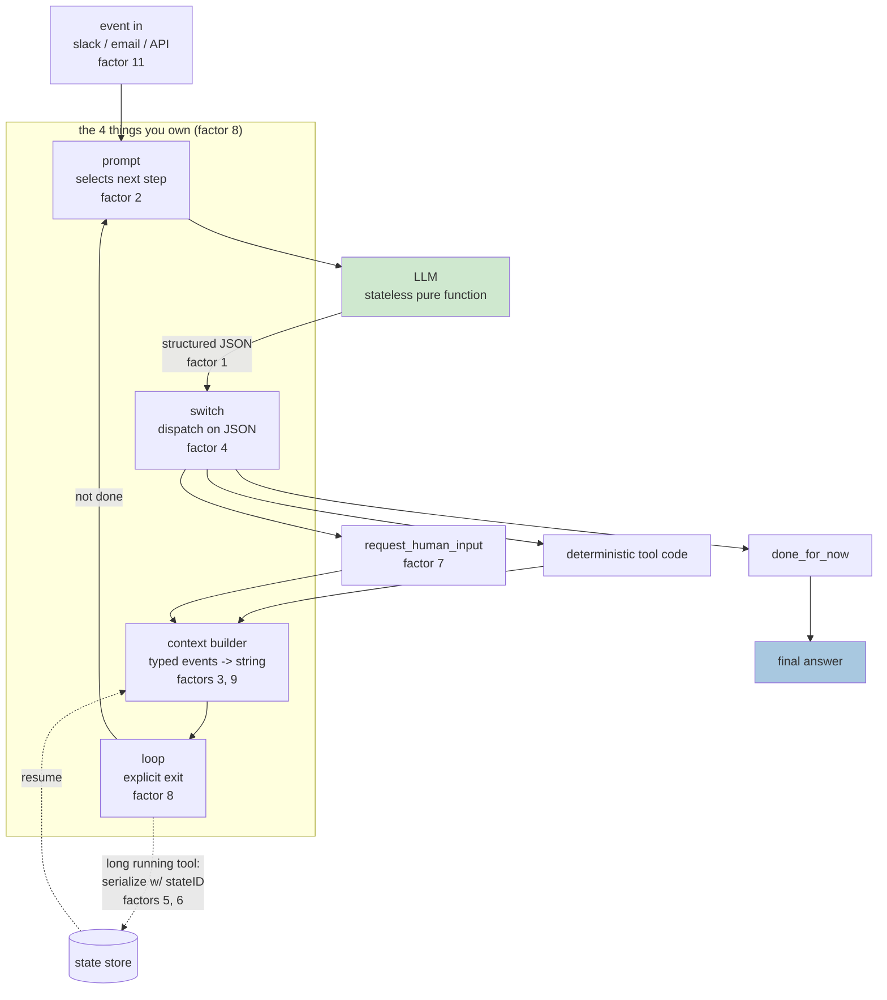
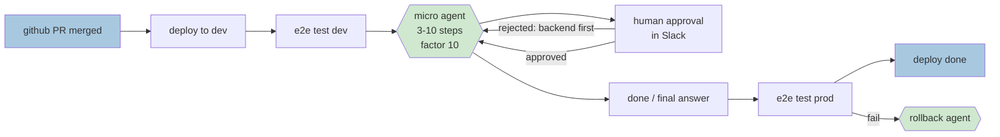

# Learning - 12-Factor Agents: Patterns of reliable LLM applications

> Persona: **curator** + **mentor, always** - + **architect** for the topic mapping. Re-adopt when
> working this file.

> The distilled document you learn from - text anchored by a few curated visuals. Built from the
> corroborated nodes in `nodes.md`. Every claim is cited. Signal, not archive. See `SOURCE.md`.

> **Voice: an AI architect ramping up a new senior engineer** who has never met this subject.
> Fundamentals in dependency order, judgement over topology, and **evidence labelled where the claim
> is made** rather than deferred to the end.
>
> ⚠️ **Read the evidence class before the content.** This is a **conference talk (T4)** by the founder
> of a company selling agent tooling. Its own basis - "I talked to 100+ founders, builders,
> engineers" - is **uncheckable from the source**, and **the talk contains no benchmark, ablation or
> failure rate of any kind**. Everything below is a practitioner's pattern language, and it is a good
> one; none of it is measured *by this source*. Where a claim has since been measured, the measurement
> came from [R1](context/01_context-limits-and-decomposition.md) and is marked inline.

## TL;DR

Dex Horthy reports interviewing 100+ people building agents and found that **the ones that work in
production are barely agentic** - they are ordinary deterministic software with small, tightly-scoped
LLM steps inside. From that he distilled 12 factors (named after Heroku's 12-factor app). The
through-line: **an agent is just a prompt, a switch statement, a context-window builder, and a loop** -
and every reliability problem you have comes from letting a framework own one of those four instead of
you. `https://www.youtube.com/watch?v=8kMaTybvDUw`

> **What that first sentence is worth.** The 100+ interviews are the entire empirical basis of the
> talk and **you cannot check them** - no names, no method, no counts by category (`n1`). Take the
> factors as a well-argued pattern language from someone who has clearly built this, and **not** as a
> survey result. The one claim here that has since been *measured* is the micro-agent one, and the
> measurement is external (R1, below).

## Key claims

- The thing to internalise first: **LLMs are stateless pure functions, tokens in -> tokens out**. Everything else - prompt, memory, RAG, history - is one problem, **context engineering**. `&t=616s`
- **An agent = prompt + switch statement + context builder + loop.** Own all four. `&t=406s`
- **Tools are not magic**; the LLM emits JSON and your deterministic code switches on it. "Tool use is harmful" is aimed at the *abstraction*, not the capability. `&t=264s`
- What works in production is **micro agents**: a mostly deterministic DAG with **3-10 step** agent loops at the hard points, not one big autonomous loop. `&t=741s`
- The naive loop fails on long workflows because **context grows unboundedly** - you get better results by limiting what goes in, not by trusting a 2M-token window. `&t=388s`
- **Make contacting a human a tool call**, so "I need clarification" is one more intent alongside `deploy_backend`. `&t=687s`
- **Not every problem needs an agent.** Two hours of prompt engineering vs a 90-second bash script. `&t=71s`

## Walkthrough

### Why you should care: the 70-80% wall

The talk opens on a failure mode you should expect to hit personally. You pick a framework, move
fast, and reach **70-80% quality** quickly - "enough to get the CEO excited and get six more people
added to your team." Then you need the last 20%, and you find yourself **seven layers deep in a call
stack** trying to reverse-engineer how the prompt got built and how the tools got passed in. A lot
of people throw it all away and start from scratch. `&t=37s`

That wall is the reason for all 12 factors: each one is a piece of the system you should have
owned from the start. The good news, and Horthy is emphatic about it, is that **you do not need an
AI background** - "this is software engineering 101." `&t=141s`

> 💡 **12-factor app** - Heroku's 2011 list of rules for building apps that survive being run in the
> cloud (config in env vars, stateless processes, and so on). It named practices people were already
> half-doing. Horthy is making the same move for agents: name the patterns, so they can be argued
> about and reused.

### Fundamental 1: the magic is structured output, nothing more

- What it teaches: **Factor 1 - natural language to tool calls.** The most magical thing an LLM does
  has nothing to do with agency: it turns "can you create a payment link to Terri for $750 for
  sponsoring the February meetup?" into JSON matching a schema you defined. `&t=229s`
- Corroborated by: "It is turning a sentence like this into JSON that looks like this. **Doesn't
  even matter what you do with that JSON.**" `&t=229s`
- Why it is first: it is the one piece you can adopt today, in an existing codebase, with no
  rewrite.

**Factor 4 follows immediately.** Horthy borrows Dijkstra's title and says *"tool use is harmful"* -
aiming, as he is careful to note, at the abstraction rather than the capability. The harmful idea is
that tool use is "this magical thing where this ethereal alien entity is interacting with its
environment." What actually happens: the LLM outputs JSON, you hand it to deterministic code, that
code does something, and maybe you feed the result back. `&t=264s`

> 💡 **Why the demystification matters.** If tool use is magic, debugging it is guesswork and you
> defer to the framework. If it is "JSON, then a switch statement", every ordinary engineering
> instinct you already have - types, tests, logging, error handling - applies again.

### Fundamental 2: an agent is four things you should own

- What it teaches: the whole of "agent" in about ten lines. Horthy then names the four parts
  explicitly - **the prompt** (instructions for selecting the next step), **the switch statement**
  (dispatch on the model's JSON), **the context builder**, and **the loop** (when and how you
  exit). `&t=406s`
- Corroborated by: "if you own your control flow, you can do fun things like break and switch and
  summarize and LLM-as-judge and all this stuff." `&t=423s` This is **Factor 8**.

**Read the ten lines carefully - they are the exam question.** Every remaining factor is an answer
to "what happens when you take one of those four lines seriously?" Factor 2 is the first line,
factor 3 the `context.append`, factor 8 the `while`, factor 9 what you append when things fail.

### Fundamental 3: why the naive loop breaks

- What it teaches: run that loop and it materialises a DAG at runtime - the promise being that you
  no longer have to write the DAG yourself, just state the goal. `&t=334s`
- Corroborated by: "turns out this doesn't really work. Especially when you get to longer workflows.
  **Mostly it's long context windows.**" `&t=371s`
- The nuance worth keeping: this is not "long context is useless". It is "you will *always* get
  tighter, higher-reliability results by controlling and limiting the number of tokens you put in
  that context window." You can put 2M tokens into Gemini and get an answer back. That is not the
  same as a good answer. `&t=388s`

> 💡 **DAG (directed acyclic graph)** - a workflow of steps with a direction and no cycles; Airflow,
> Prefect and friends orchestrate them. Horthy's framing: "if you've written an `if` statement,
> you've written a directed graph. Code is a graph." `&t=317s` Agents were meant to free you from
> writing the DAG; in practice you want most of it back.

### Fundamental 4: own the context window, literally token by token

![class Thread with events List[Event]; Event.type as a Literal of list_git_tags / deploy_backend / deploy_frontend / request_more_information / done_for_now; event_to_prompt renders f"<{event.type}>\n{data}\n</{event.type}>"; thread_to_prompt joins events](visuals/frame_590.jpg)

- What it teaches: **Factor 3.** You are not obliged to use the standard messages format. Model the
  thread as typed events and stringify them however you like - here, XML-ish blocks joined into a
  single user message. `&t=563s`
- Corroborated by: "your only job is to tell it what's happened so far. You can put all that
  information however you want into a single user message." `&t=563s`
- Paired with **Factor 2** (own your prompts): a framework will "make you a banger prompt that you'd
  have to go to prompt school for three months to build", but past a quality bar you write **every
  single token by hand**, because "LLMs are pure functions and the only thing that determines the
  reliability of your agent is how good of tokens can you get out." `&t=531s`

- What it teaches: the unifying idea. Prompt, memory, RAG and history are one question - which
  tokens reach the model - so stop treating them as separate subsystems. `&t=616s`
- Horthy's honest framing throughout this section, repeated three times: **"I don't know what's
  better, but I know you want to try everything."** The factors buy you the ability to try. `&t=563s`

**Factor 9 is the sharp edge of this.** When a tool call fails, the naive move is to append the error
and retry. Do that blindly and the agent **spins out** - loses context, gets stuck. Instead: once you
get a valid tool call, **clear the pending errors**; summarise rather than pasting the stack trace.
"Figure out what you want to tell the model so you get better results." `&t=653s`

### Fundamental 5: pause and resume, because agents are just software

- What it teaches: **Factors 5 and 6.** Unify execution state (current step, next step, retry
  counts) with business state (messages, what the user has been shown, what is awaiting approval),
  then put the agent behind a REST or MCP endpoint. On a long-running call, interrupt and serialise
  the context window to a database keyed by a **state ID**; on callback, reload, append the result,
  resume. `&t=460s`
- Corroborated by: "**the agent doesn't even know that things happened in the background.**" `&t=495s`
- Why you can do this at all: because you owned the context window. This is the first factor that
  visibly *pays back* an earlier one.

### Fundamental 6: what actually ships - micro agents

- What it teaches: **Factor 10, and the most important slide in the talk.** This is HumanLayer's own
  deploy bot. Most of the pipeline is deterministic CI/CD. Only at the genuinely ambiguous point -
  PR merged, dev tests green, what do we ship and in what order? - does a small agent take over, for
  **3 to 10 steps**. Then control returns to deterministic code for the prod e2e tests, with a
  separate small rollback agent for the failure path. `&t=741s`
- Corroborated by: "we send it to a model, we say get this thing deployed. Says cool, I'm going to
  deploy the front end. And then you can send that to a human. The human says actually no, do the
  back end first. **This is taking natural language and turning it into JSON that is the next step in
  our workflow.**" `&t=776s` - which is factor 1, reappearing inside a real pipeline.
- The payoff, in his words: "**100 tools, 20 steps, easy.** Manageable context, clear
  responsibilities." `&t=814s`

Note the dashed **"deterministic code"** labels at both ends of the diagram. That boundary is the
actual design artefact - deciding where it sits is the job.

> **Evidence, since this is the claim the whole talk rests on.** The slide is **HumanLayer's own
> deploy bot** and "100 tools, 20 steps, easy" is the speaker describing his own product with no
> baseline, no failure rate and no comparison against the big-loop design he is arguing against.
> Internally corroborated only (slide ↔ narration).
> **It is nonetheless the best-supported claim in this brain**, because two independent things landed
> on it later: S1 reached the same shape from Uber's production practice, and R1 measured
> decomposition at **+13.1 to +41.5 pp** reliability across 10 models
> ([`brain/claims.md`](../../brain/claims.md) claim 11). **Believe the shape; the "easy" is a
> founder's word, not a result.**

### Fundamental 7: humans are a tool call

- What it teaches: **Factor 7.** Instead of forcing the model's very first output token to choose
  between "tool call" and "message to human", make contacting a human just another intent -
  `request_human_input` sitting alongside `deploy_backend`. `&t=687s`
- Two reasons it works, both worth remembering: you give the model **richer modes** (I'm done / I
  need clarification / I need to talk to a manager), and you push the decision onto **a
  natural-language token the model actually understands** rather than a structural branch it was
  never trained on. `&t=687s`
- Notice this frame is the same thread-as-events format from factor 3, now including the human turn.
  Human input is not a special case in the architecture. That is the point.

**Factor 11** rides along: trigger from anywhere and meet users where they are - email, Slack,
Discord, SMS. "People don't want to have seven tabs open of different ChatGPT style agents."
`&t=723s`

### Fundamental 8: where the moat is

- What it teaches: find something **right at the boundary of what the model can do reliably** -
  something it *cannot* get right every time - and engineer reliability around it anyway. "Then you
  will have created something magical and you will have created something that's better than what
  everybody else is building." `&t=848s`
- Why this belongs in a fundamentals doc: it is the answer to "won't better models make all this
  obsolete?" No - a better model moves the boundary, and the engineering work moves with it. The
  factors are how you operate *at* the boundary rather than safely behind it.

> **Note what this one is.** A quoted slide of **one practitioner describing a feeling** about where
> good work comes from - not a finding, and the weakest evidence in the note. It earns its place
> because S4 later arrives at the same boundary-relative framing from an entirely different direction
> (a harness rebuilt when the boundary moved), which is why claim 18 is `corroborated (2 sources)`
> while this slide alone would not carry it.

### The counterweight: not every problem needs an agent

Horthy's first agent was a DevOps agent: here is my Makefile, go build the project. It ran the steps
in the wrong order. He spent two hours adding detail to the prompt until he had specified the exact
build order - at which point: "I could have written the bash script to do this in about **90
seconds**." `&t=71s` `single-leg`

Keep this next to everything above. The 12 factors make agents reliable; they do not make an agent
the right tool.

## Diagram (mental model)

**How to read it:** flow runs top to bottom, one pass round the loop. The boxed group is the four
parts *you* write; **green is the only LLM call**; the dotted path is what happens when a tool call
takes minutes or days instead of milliseconds. Factor numbers are marked on the box they belong to.

**The crux: there is exactly one green box, and everything else is ordinary software you already
know how to write.**

**Why it is shaped this way:** the LLM sits in the *middle* of the diagram rather than around the
outside, and that placement is the whole argument. Frameworks invert it - they own the loop, the
dispatch and the context assembly, and hand you a callback - which is how you end up seven layers
deep in a call stack trying to find where your prompt was built `&t=55s`. Drawn this way, every
arrow into and out of the model is a seam you control: you can log it, test it, replay it, or break
out of the loop mid-run. Note the dotted path leaves and re-enters at the **context builder**, not
at the prompt - resumption works only because the thread was serialisable in the first place, which
is why factor 3 has to be in place before factors 5 and 6 are even possible.

*Synthesized from `n2`, `n5`, `n6`, `n8`, `n11` - not a slide from the talk.*

**How to read it:** left to right is one deployment, start to finish. **Blue is a boundary event,
green is LLM-driven, plain boxes are ordinary deterministic code.** The hexagons are agent loops;
everything else is CI/CD you already have.

**The crux: the agent owns only the genuinely ambiguous middle - what to ship and in what order -
and hands control straight back to deterministic code.**

**Why it is shaped this way:** count the green. Two small hexagons in a pipeline of seven steps, and
the talk reports this handling "100 tools, 20 steps, easy" `&t=814s`. The instinct when an agent
underperforms is to give it *more* scope; this shape says the opposite - shrink the window until the
model only decides the thing that actually requires judgement. Note where the boundary sits: not at
"hard vs easy", but at **deterministic vs ambiguous**. Running the tests is hard and stays code,
because the answer is knowable in advance. Deciding deploy order is easy for a human and goes to the
model, because it depends on context nobody encoded. Note too that the human sits *inside* the agent
loop rather than gating it from outside - approval is an event in the thread (factor 7), which is
what lets a rejection carry a reason the agent can act on rather than just a "no".

*Synthesized from `n1`, `n11`, `n13`, `n14` - a redrawing of `frame_800.jpg` `&t=741s`.*

## 💡 Terms

| Term | Explanation |
|---|---|
| **12-factor agent** | Horthy's list of 12 design rules for reliable LLM applications, named after Heroku's 12-factor app. Each factor is a piece of the system you should own rather than delegate to a framework. |
| **Context engineering** | The single discipline behind prompt, memory, RAG and history: deciding exactly which tokens reach the model. `&t=616s` |
| **Micro agent** | A small agent loop of roughly 3-10 steps embedded at a hard point inside an otherwise deterministic pipeline - the shape that works in production. `&t=741s` |
| **Materialised DAG** | The graph of steps that an agent loop produces at runtime, as opposed to a DAG you wrote up front in Airflow or Prefect. `&t=371s` |
| **Spin-out** | The failure mode where raw errors are blindly appended to the context window, the agent loses the thread and gets stuck retrying. Factor 9's target. `&t=653s` |
| **Stateless reducer** | Factor 12: the agent holds no state of its own; it folds an event into a thread you own. Pedantically a *transducer*, since there are multiple steps. `&t=865s` |
| **Structured output** | The model emitting JSON conforming to a schema you defined, rather than prose. Factor 1 - and per factor 4, all "tool use" really is. `&t=229s` |

## Open questions / confidence

> **A deep-research pass has run on this source** (2026-07-25):
> [`context/01_context-limits-and-decomposition.md`](context/01_context-limits-and-decomposition.md).
> It closed both open questions below. External evidence lives in that note, not here - this file
> answers only *what did this source teach?* Nodes `en2`-`en5` and `d3` in `nodes.md` carry the
> findings.

- ~~**No independent corroboration.**~~ **Closed by R1.** The repo README shares the talk's author, but
  Anthropic - a different organisation with no shared interest - independently reaches S2's
  conclusions on `n17` (start simple, don't default to an agent) and `n18`, where the match is
  near-verbatim on frameworks obscuring the prompt. `n13`'s micro-agent claim is corroborated *and
  quantified*: +13.1 to +41.5 pp reliability from decomposition across 10 models.
- ~~**No measurements anywhere.**~~ **Closed by R1**, and the measurements are harsher than the talk's
  framing: context degradation is position-dependent (U-shaped, peer-reviewed), appears well before
  the advertised window, and hits even trivial tasks. S2 undersells its own best claim.
- **New from R1 - the boundary S2 misses.** Decomposition is measured to help; *naive memory
  scaffolding* is measured to **hurt 6 of 10 models**, losing to plain ReAct. "Own your context
  window" must not be read as "accumulate a richer thread".
- **New from R1 - this design has an older name.** Factors 3/5/6/12 are **Event Sourcing** (Fowler,
  2005). Naming it inherits three failure modes the talk never mentions: replay determinism,
  snapshotting, event versioning (`nodes.md` `d3`).
- `n1`'s foundation - "I talked to 100+ founders, builders, engineers" - remains **uncheckable from
  this source**, and no benchmark, ablation or failure rate appears anywhere in the talk itself. The
  numbers above are all external.
- `n12` (factor 11) and `n16` (factor 12) are `needs-check`: mentioned in passing, no worked example.
- **`d1` - this is not an anti-framework talk**, even though the repo is usually read that way.
  Horthy explicitly calls the factors "a wish list, a list of feature requests" for framework
  authors. `&t=178s`
- **`d2` - open question**: the proposed `create-12-factor-agent` is scaffold-not-wrapper, modelled
  on shadcn/ui. Whether generated-code-you-own beats an abstraction is the old duplication-vs-
  abstraction argument, unresolved in the talk. `&t=882s`

## Feeds these topics

- `../../brain/topics/agents.md` - n1..n9, n13..n18 (the four owned parts, micro agents, control
  flow, pause/resume, structured output).
- `../../brain/topics/context-engineering.md` - n4, n8, n9, n10 (**new topic**: context window
  ownership, event-thread rendering, error compaction, token budget as the reliability lever).
