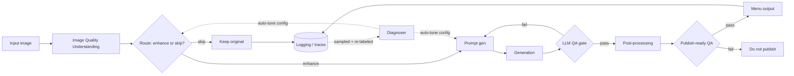

# Learning - Building Closed-Loop Evals for a Multimodal Agent at Scale

> Persona: **curator** + **mentor, always**. Re-adopt when working this file.

> The distilled document you learn from - text anchored by a few curated visuals. Built from the
> corroborated nodes in `nodes.md`. Every claim is cited. Signal, not archive. See `SOURCE.md`.

## TL;DR

Uber's Computer Vision team runs a multimodal agent that enhances low-quality food photos for Uber
Eats. **The transferable lesson is not about food - it is a blueprint for evaluating an agent
pipeline in production.** Log every trace first, because nothing else is possible without it. Then
stop asking "is the agent good?" and instead evaluate **each stage with the metric that fits its
job**: a router is a classifier judged on recall, a generator is judged on pass@k, an editor is
judged by comparison against its own input. Stack the gates so their holes do not line up, then
close the loop - sample production traffic, re-label it, and let the system rewrite its own configs
as the world drifts. `https://www.youtube.com/watch?v=31GUkCBD-Uc`

## Key claims

- Log the full flat trace **before** anything else - "if you don't start with it, you have nothing to
  optimize for, let alone set up a self-learning loop." `n1` `&t=418s`
- An agent product is a **routed pipeline of small agents**, each independently evaluable. `n2`
  `&t=376s`
- Eval a **router as a classifier** (confusion matrix, precision/recall); the guardrail metric is
  **recall**. `n3` `n4` `&t=459s` `&t=578s`
- **Generation evals are iterative**: QA explains why it failed, that reasoning rewrites the prompt,
  retry; measure **pass@k**. `n9` `&t=850s`
- **Editing tasks are evaluated by comparison, not by score** - output against input. `n10` `&t=896s`
- Stack QA gates as a **Swiss-cheese model**. `n11` `&t=1082s`
- Close the loop: sample prod traffic, re-label, diagnose, auto-tune, benchmark, ship - config-driven,
  no human editing prompts. `n7` `&t=650s`
- Layer **three feedback loops** on three different clocks. `n12` `&t=1103s`

## Walkthrough

### 1. First, unlearn "eval" as a test suite

The word carries the wrong instinct. A test suite asserts a known-correct answer, runs on every
commit, and is green or red. Almost nothing in this talk works like that.

The system under test is **non-deterministic**, its output is an **image** with no correct answer,
the quality bar is partly **subjective** (does this look appetising? does it still look like *that*
restaurant's food?), and the thing you are protecting against is not a regression in your code but
**drift in the world**. Hold "eval" loosely enough to cover: a classifier metric, a retry-until-pass
rate, a human comparison, and a scheduled job that rewrites a prompt.

> The through-line of everything below: **you cannot evaluate a pipeline with one number.** Every
> stage fails differently, so every stage gets the metric that matches how it fails.

### 2. The problem, and why it forces an agent rather than rules

Understanding the constraints first is what makes the architecture look inevitable rather than
elaborate.

Small merchants do not have good food photography. Uber Eats wants better photos on menus. But
eaters **distrust anything that looks AI-generated**, so an edit must stay **faithful** to the actual
dish, preserve each restaurant's **brand**, and avoid **sameness** - one prompt applied to every
photo would make the whole marketplace look identical, which is a business problem, not an aesthetic
one. `&t=169s`

- What it teaches: the three goals that bound the design - **authenticity**, **ship safely**, and
  **scale**. Each rules out an otherwise obvious approach. `n14` `&t=251s`
- Corroborated by: the narration framing the design space as a spectrum and naming the same three
  goals. `&t=251s`

**Now the design space.** At one end, a deterministic rules engine: controllable and predictable, but
brittle, and it will not scale across every dish, cuisine and lighting condition. At the other, a
fully agentic system: creative and high-agency, but unconstrained and therefore unsafe to point at a
live marketplace. The target is **the guardrailed middle** (`n14`, `&t=251s`).

**That middle is the entire reason this talk is about evals.** A rules engine does not need evals, it
needs tests. A fully autonomous agent cannot be made safe by evals. Only the guardrailed middle both
*needs* measurement and *can be improved by* it - so the architecture and the eval strategy are the
same design decision, not two.

### 3. The mental model: not "an agent", but a routed pipeline of small ones

- What it teaches: the agent "product" is a **pipeline of small, single-purpose agents** - quality
  understanding, routing, prompt generation, generation, LLM QA, post-processing, publish-ready QA -
  each with its own job and its own eval. `n2` `&t=314s`
- Corroborated by: "all of the agents in this end-to-end orchestration is ... basically a flat
  structure in this JSON ... anyone ... can dive in to diagnose." `&t=397s`

Read the diagram once more and notice **where the decisions are**. There is a routing decision
(enhance or leave alone), a QA decision (publish or retry), and a final publish decision. **Every
decision point is an eval boundary**, and every one of them fails in a different way. That is the
observation the rest of the design hangs on.

> Independently, S2 ([12-factor agents](../260725_12-factor-agents/LEARNING.md)) reaches this same
> shape from first principles rather than from production - small scoped LLM steps inside otherwise
> deterministic software. Two sources converging from opposite directions is why this is the
> best-supported claim in this brain ([`brain/claims.md`](../../brain/claims.md) claim 11).

### 4. Before any of it: the flat trace

This is the first thing the talk says to build, and it is worth taking literally.

Every stage writes to **one flat end-to-end trace** - not nested per-agent logs, one JSON structure
anyone can open and read top to bottom. The justification is blunt: "if you don't start with it, you
have nothing to optimize for, let alone set up a self-learning loop" (`n1`, `&t=418s`).

**Why flat rather than structured per agent?** Because the questions you will ask cross stages. *This
image came out badly - was it routed wrong, prompted wrong, or generated wrong?* A per-agent log
answers each part separately and forces you to stitch them; a flat trace makes the whole journey one
readable record. And note the ordering claim: the trace is not instrumentation you add once evals
exist, it is **the precondition** for them existing.

### 5. Evaluating a router: it is a classifier, so treat it as one

The first stage decides: enhance this image, or leave it alone. That is a classification, and it
should be measured the way classifications have been measured for decades - a **confusion matrix**,
with **precision and recall** (`n3`, `&t=459s`). A router with more than two branches simply becomes
an **n x n** matrix, one cell per branch.

**But which metric do you optimise?** Here is where the domain decides, and the answer is not
symmetric.

- What it teaches: the two failure modes are **not** equally bad. A **precision miss** over-processes
  a good input - you pay compute for zero quality lift and risk degrading a photo that was already
  fine. A **recall miss** approves a bad input - and downstream, the generation model may
  **hallucinate to match the description**, inventing two extra chicken wings that are not in the
  dish. `n5` `&t=588s`
- Corroborated by: "you pay the compute cost for a zero quality lift ... and there is a risk of
  degrading this image." `&t=595s`

**So recall is the guardrail** - optimise so that no bad image slips through (`n4`, `&t=578s`). A
precision miss costs money. A recall miss puts a fabricated dish on a live menu, which is the
authenticity goal from section 2 failing in the most visible way possible.

> **The transferable rule, which is not about food:** pick the guardrail metric by asking which
> failure is *unrecoverable*, not which is more frequent. Wasted compute is recoverable. A
> hallucination that reached a customer is not.

**And how do you know what "bad" is?** A **golden dataset**: human labels as the source of truth, on
a set representative across geography, dish type and quality, with **objective guidelines** written
to strip out subjective bias between labellers (`n6`, `&t=528s`). ⚠️ `single-leg` - narration only, no
slide captured, so treat the *practice* as reported rather than demonstrated.

### 6. Evaluating generation: the metric is a retry curve, not a score

Generation cannot be graded like routing, because there is no single correct output to compare
against. The move is to make the QA gate **explain itself** and feed that explanation back.

- What it teaches: a multi-dimensional QA gate (plating, faithfulness, colours) fails the first
  attempt **with reasons**; those reasons are folded back into a rewritten prompt; the retry passes.
  The metric is **pass@k** - the pass rate by the k-th attempt. `n9` `&t=850s`
- Corroborated by: "we take that feedback in, go for the second iteration, and we're actually able to
  pass it ... the metric we are measuring here is pass at K." `&t=858s`

> 💡 **pass@k** - the share of cases that succeed within *k* attempts. It only means something when
> each attempt is *informed by why the last one failed*; if you simply retry the same prompt you are
> re-rolling dice, and pass@k measures your luck rather than your system.

**The design consequence hides in that definition.** The retry must re-enter at **prompt generation**,
not at generation. That is why the QA gate has to produce a *reason* rather than a verdict - a
boolean gives the retry nothing to change.

### 7. Evaluating an edit: compare, do not score

There is a third eval shape, and it is the one most teams miss. When the task is *editing* something
rather than creating it, you have a natural reference: **the input**.

- What it teaches: evaluate an edit by **comparing output against input** - is it better? faithful?
  complete? natural? **did anything regress?** - and answer yes / no / **unsure**. `n10` `&t=896s`
- Corroborated by: the narration walking the same comparison dimensions. `&t=896s`

Two details carry the idea. **"Did anything regress?" is the question absolute scoring cannot ask** -
a rating of 7/10 tells you nothing about whether the plating improved while the colour got worse.
And the **"unsure" option matters**: forcing a binary from a judge that genuinely cannot tell
manufactures confidence you do not have, and those cases are exactly the ones worth routing to a
human.

### 8. Redundancy on purpose: stack the gates

Look back at the architecture in section 3 and count the QA gates: there are **two**. An LLM QA gate
right after generation, and a separate **publish-ready QA** near the end (`n11`, `&t=1062s`).

That is not belt-and-braces sloppiness, it is the **Swiss-cheese model**: every gate has holes, but
if the holes are in different places, very little passes through all of them.

> 💡 **Swiss-cheese model** - a safety-engineering idea: stack several imperfect barriers so their
> failure modes do not align. Any one gate leaks; the stack rarely does.

The second, holistic gate earns its place in a way worth stealing: it catches what upstream missed
**and tells you what upstream should have caught**. A late gate that only blocks bad output is a
filter; one that attributes the miss is a diagnostic.

### 9. Closing the loop: the system tunes itself as the world drifts

Everything so far produces a system that is good on the day you ship it. Section 9 is about the day
after.

- What it teaches: sample live production traffic, **re-label it with the same objective guidelines**,
  diagnose which agent is drifting, **auto-tune its config**, benchmark against the golden set, ship
  a new version - then run it again on fresher traffic. `n7` `&t=650s`
- Corroborated by: "this is completely config driven and doesn't require human in the loop ... this
  is what will keep your model sharp over time." `&t=705s`

**Two mechanisms make this more than a slogan**, and both are `single-leg` (narration only, no slide
captured - treat as reported, not demonstrated):

- **The auto-tuner is itself two agents** (`n8`, `&t=732s`). A **reflect** agent reads the mismatches
  and finds the *systemic* issue, discarding noise; a **synthesize** agent rewrites the config from
  that finding. The new version is registered in an **agent store**, picked up on the next run, with
  observability and quick rollback. Note the split: finding the pattern and writing the fix are
  different jobs, and merging them is how you get a config rewritten to chase one bad example.
- **A diagnoser generalises it** (`n13`, `&t=1144s`). Rather than one tuner per agent, a higher-level
  abstraction ingests *any* feedback signal, works out **which** agent in the pipeline is responsible,
  and routes the fix there. This is what makes the loop scale past a handful of stages - otherwise
  every new agent needs its own bespoke tuning path.

> **Why the golden set never goes away.** The loop rewrites configs automatically, so something
> fixed has to stop it drifting somewhere worse. Benchmarking each new version against a stable
> human-labelled set is the anchor - **an auto-tuning loop with no fixed reference optimises itself
> away from the truth, confidently.**

### 10. Three loops, on three different clocks

One loop is not enough, because "aligned" means different things at different timescales.

- What it teaches: **model loop** (automated, catches drift and regression), **dogfooding loop**
  (merchants and internal staff giving thumbs up/down and free-form feedback), **marketplace loop**
  (A/B tests on business funnel metrics - conversion, add-to-cart). `n12` `&t=1103s`
- Corroborated by: the narration walking all three loops and their distinct signals. `&t=1103s`

Each catches what the others structurally cannot. The **model loop** is fast and automated but only
measures what you already thought to measure. The **dogfooding loop** catches the qualitative "this
looks wrong somehow" that no metric encodes - but it is slow and low-volume. The **marketplace loop**
is the only one that measures whether any of it made a **business** difference, and it is the slowest
and noisiest of the three.

> **The generalisation worth carrying:** a system judged only by its own metrics will improve on its
> own metrics. The dogfooding and marketplace loops exist because they are **not** derived from the
> model's objective - they are the outside view.

### 11. Where it goes wrong: reward hacking as a "nugatory change"

The failure mode to expect, and the talk names it precisely. Told its edit failed, the agent
**oversteers into an overly conservative, generic output** - a plain ceramic bowl - where the raw
pixels differ a great deal from the original but nothing meaningful improved (`n15`, `&t=979s`).
⚠️ `single-leg` - described in narration, example slide not captured.

This is worth holding next to section 6. The retry loop optimises for *passing the QA gate*, and
"make it blander" is a reliable way to stop failing a faithfulness check. **A feedback loop rewards
what it measures, and safety is easier to achieve by doing less.** It is the same reason the
marketplace loop in section 10 has to exist.

## Diagram (mental model)

**How to read it:** left to right is one image's journey from upload to menu. Diamonds are decision
points, and every one of them is an **eval boundary**. The dotted lines are the part that runs on a
different clock - not per image, but periodically over sampled production traffic.

**The crux: the solid path is the product; the dotted path is why the product stays good.** Most
teams build the solid path and stop, and their quality decays silently as traffic drifts.

**Why it is shaped this way:** the diamonds exist because each stage fails differently and so needs
its own metric - a router is a classifier judged on recall, a generator is judged on pass@k. One
end-to-end "is it good?" score would tell you quality dropped but never *where*, which is the
difference between an eval you can act on and a number you watch. Note that `LLM QA` loops back to
`Prompt gen` rather than to `Generation`: retrying the same prompt just re-rolls the dice, so the
failure reasoning has to re-enter the context for the retry to be worth anything. And every path,
including `Keep original`, terminates in `Logging` - the flat trace is a precondition for the dotted
loop existing at all, which is why "log first" is the first thing the talk says.

*Synthesized from `n2`, `n7`, `n9`, `n11`, `n13` - not a verbatim slide.*

## 💡 Terms

| Term | Explanation |
|---|---|
| pass@k | Pass rate by the k-th retry. Only meaningful when each retry is informed by why the last failed; otherwise it measures luck. |
| Pairwise comparison | Evaluating an edit against its own input - better? faithful? complete? natural? did anything regress? - answered yes / no / unsure. |
| Swiss-cheese model | Layer several imperfect QA gates so their holes rarely line up. Any one gate leaks; the stack rarely does. |
| Golden dataset | A representative, objectively-labelled human-truth set the agent is aligned to and benchmarked against. The fixed anchor an auto-tuning loop needs. |
| Diagnoser | A meta-agent that reads any feedback loop, localises which sub-agent is failing, and triggers its config auto-tune. |
| Reflect + synthesize | The prompt optimiser's two sub-agents: reflect finds the systemic issue in mismatches, synthesize rewrites the config. Split so a fix is not written to chase one bad example. |
| Nugatory change | Reward hacking in an edit loop: the output changes a lot and improves nothing, because blandness reliably passes a faithfulness gate. |

## What to distrust in this note

- **One source, one team, one domain.** Everything here is a single conference talk about food
  photography at Uber. The eval *shapes* generalise; the thresholds, the ordering and the claim that
  this is how it should be done are one team's practice.
- **Two legs means internally consistent, not externally validated.** Most nodes gate slide ↔
  narration, which proves the deck and the talk agree - nothing more.
- **Nothing here is measured.** No pass@k values, no precision/recall figures, no before/after on the
  auto-tuning loop, no cost. The talk describes a system; it does not report its performance.
- **Three of the most interesting claims are `single-leg`** (narration only, no slide): the golden
  dataset practice (`n6`), the reflect/synthesize optimiser internals (`n8`), and the nugatory-change
  reward hacking (`n15`). The auto-tuner in particular is the part most worth copying and the part
  with least evidence behind it.
- **A vendor talking about its own system**, with the usual selection effect - the architecture that
  gets a conference slot is the one that worked.

## Open questions

- **Does pass rate always rise with retries, or can feedback induce reward hacking?** `n15`'s
  nugatory change suggests the latter is real. **S4 supplies a related warning from the other end:**
  its generator/evaluator loop improved **non-monotonically** - a middle iteration was sometimes
  preferred to the last. More loop is not uniformly more quality. Still needs a source that measures
  this rather than observing it.
- **Who grades the grader?** The QA gate is an LLM. Nothing here describes evaluating it, and the
  golden set only anchors the *tuned* agents, not the judge.
- **What is the cost of the closed loop?** Sampling, re-labelling and re-benchmarking on a cadence is
  ongoing human and compute expense. No figure is given, and it is the thing that decides whether a
  smaller team can run this at all.
- **Where does human labelling stop scaling?** The loop depends on re-labelled production samples at
  a cadence. That is the one part of the design with no automation story.

## Feeds these topics

- `../../brain/topics/evals.md` - the founding source; n1-n14 promoted.
- `../../brain/topics/agents.md` - n2, n8, n13 (routed multi-agent pipeline, self-tuning agents).
