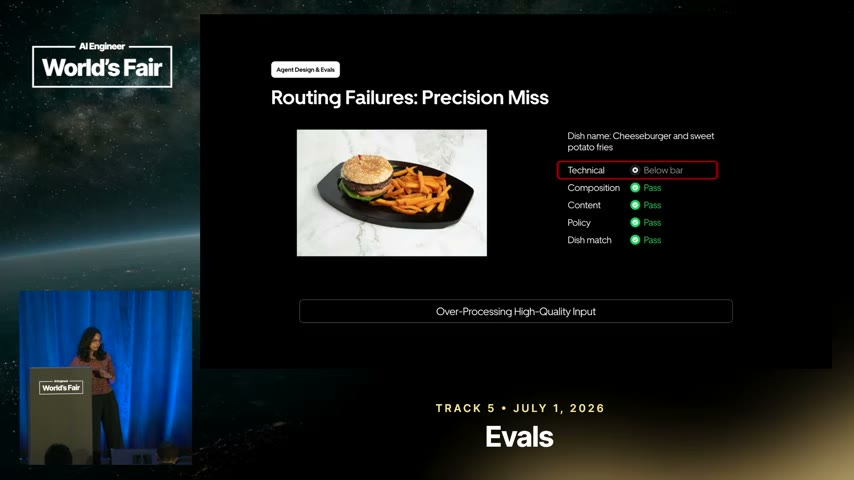
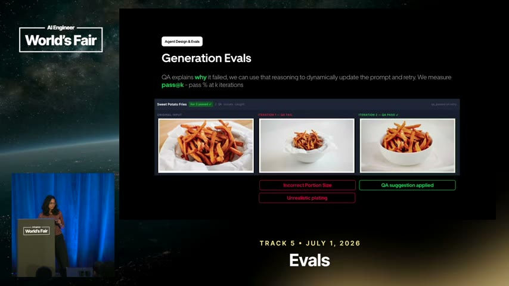
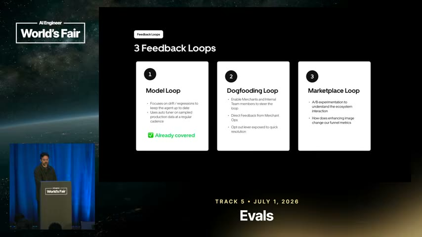
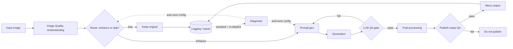

# Learning - Building Closed-Loop Evals for a Multimodal Agent at Scale

> Persona: **curator** + **mentor**. Re-adopt when working this file.

> The distilled document you learn from - text anchored by a few curated visuals. Built from the
> corroborated nodes in `nodes.md`. Every claim is cited. Signal, not archive. See `SOURCE.md`.

## TL;DR

Uber's Computer Vision team runs a multimodal agent that enhances low-quality food photos for Uber
Eats. The transferable lesson is **not** about food - it is a blueprint for **evaluating an agent
pipeline in production**: log every trace first, eval each stage with the *right* metric (routers as
classifiers, generation with pass@k and pairwise comparison), stack redundant QA gates (Swiss
cheese), and close the loop so the system **auto-tunes on drift** without a human editing prompts.
`https://www.youtube.com/watch?v=31GUkCBD-Uc`

## Key claims

- Log the full flat trace **before** anything else - "if you don't start with it, you have nothing to optimize for, let alone set up a self-learning loop." `&t=418s`
- Eval a **router as a classifier** (confusion matrix, precision/recall); its guardrail metric is **recall** - nothing bad should slip through. `&t=459s`, `&t=578s`
- **Generation evals are iterative**: QA gate -> feed failure reasoning back into the prompt -> retry; measure **pass@k**. `&t=850s`
- Close the loop: **sample prod traffic -> human-label -> diagnose -> auto-tune -> benchmark vs golden set -> ship**, config-driven, no human in the loop. `&t=650s`
- Stack QA gates as a **Swiss-cheese model**; run **three feedback loops** (model / dogfooding / marketplace). `&t=1082s`, `&t=1103s`

## Walkthrough

**The problem sets the constraints.** Small merchants lack quality photos, yet eaters distrust
anything that looks AI-generated - so edits must stay faithful, preserve each brand, and avoid
sameness (one prompt for every photo would collapse marketplace diversity). That tension is why a
brittle rules engine won't do and an unconstrained agent is unsafe; the design target is a
**guardrailed agent** in between. `&t=169s`, `&t=251s`

> 💡 **pass@k** - the probability the agent produces a passing output within *k* tries. Because each
> retry feeds the QA gate's reasoning back into the prompt, pass rate climbs with more iterations.

### The full agent architecture (the mental model)

- What it teaches: an agent "product" is a **routed pipeline of small agents**, each with its own
  eval, and **everything is logged** to one flat trace. `&t=376s`
- Corroborated by: "all of the agents in this end-to-end orchestration is ... basically a flat
  structure in this JSON ... anyone ... can dive in to diagnose." `&t=397s`

### Routing failures: precision vs recall

- What it teaches: two failure modes. **Precision miss** = over-processing a good input (wasted
  compute + risk of degrading it). **Recall miss** = approving a bad input (downstream model may
  *hallucinate* to match the description, e.g. inventing 2 extra chicken wings). `&t=588s`
- Corroborated by: "you pay the compute cost for a zero quality lift ... and there is a risk of
  degrading this image." `&t=595s`

### Generation evals: iterate to pass@k

- What it teaches: the QA agent explains **why** it failed; that reasoning is fed back to
  dynamically rewrite the prompt and retry. Metric = **pass@k**. `&t=850s`
- Corroborated by: "we take that feedback in, go for the second iteration, and we're actually able
  to pass it ... the metric we are measuring here is pass at K." `&t=858s`

### Closing the loop: online tuning on drift

- What it teaches: a static offline model decays; sampled production data is re-labeled, a
  **diagnoser** localizes the failing agent, an **auto-tuner** (reflect + synthesize sub-agents)
  rewrites its config, benchmarks against the golden set, and registers a new version - closed-loop,
  no human editing prompts. `&t=670s`, `&t=732s`
- Corroborated by: "this is completely config driven and doesn't require human in the loop ... this
  is what will keep your model sharp over time." `&t=705s`

### Three feedback loops

- What it teaches: alignment comes from **layered** loops at different timescales - offline model
  alignment, human dogfooding feedback, and live A/B on business funnel metrics (conversion,
  add-to-cart). `&t=1103s`

## Diagram (mental model)

> Provenance: synthesized by the agent from `frame_1058.jpg` + `frame_658.jpg` + narration; not a
> verbatim slide.

**How to read it:** left to right is one image's journey from upload to menu. Diamonds are decision
points, and every one of them is an **eval boundary**. The dotted lines are the part that runs on a
different clock - not per image, but periodically over sampled production traffic.

**The crux: the solid path is the product; the dotted path is why the product stays good.** Most
teams build the solid path and stop, and their quality decays silently as traffic drifts.

**Why it is shaped this way:** the diamonds exist because each stage fails differently and so needs
its own metric - a router is a classifier judged on recall, a generator is judged on pass@k. One
end-to-end "is it good?" score would tell you quality dropped but never *where*, which is the
difference between an eval you can act on and a number you watch. Note that `LLM QA` loops back to
`Prompt gen` rather than to `Generation`: retrying the same prompt just re-rolls the dice, so the
failure reasoning has to re-enter the context for the retry to be worth anything. And every path,
including `Keep original`, terminates in `Logging` - the flat trace is a precondition for the dotted
loop existing at all, which is why "log first" is the first thing the talk says.

*Synthesized from `n2`, `n7`, `n9`, `n11`, `n13` - not a verbatim slide.*

## 💡 Terms

| Term | Explanation |
|---|---|
| pass@k | Pass rate at the k-th retry; with QA feedback folded back into the prompt each try, it rises with more iterations. |
| Swiss-cheese model | Layer several imperfect QA gates so the holes rarely line up - redundancy that catches failures before production. |
| Golden dataset | A representative, objectively-labeled human-truth set the agent is aligned and benchmarked against. |
| Diagnoser | A meta-agent that reads any feedback loop, localizes which sub-agent is failing, and triggers its config auto-tune. |
| Reflect + synthesize | The two sub-agents of the prompt optimizer: reflect finds systemic issues in mismatches; synthesize rewrites the agent config. |

## Open questions / confidence

- `single-leg` (needs-check): golden-dataset practice (n6), reflect/synthesize optimizer internals
  (n8), and reward-hacking "nugatory change" (n15) rest on narration only - the slides weren't
  captured. Worth a second source to corroborate.
- Everything here is **internally consistent** (slides match narration), not externally validated.
  Real confidence needs a second source on agent evals - flag when one arrives.

## Feeds these topics

- `../../brain/topics/evals.md` - new topic (emerging); n1-n14 promoted.
- `../../brain/topics/agents.md` - n2, n8, n13 (routed multi-agent pipeline, self-tuning agents).
