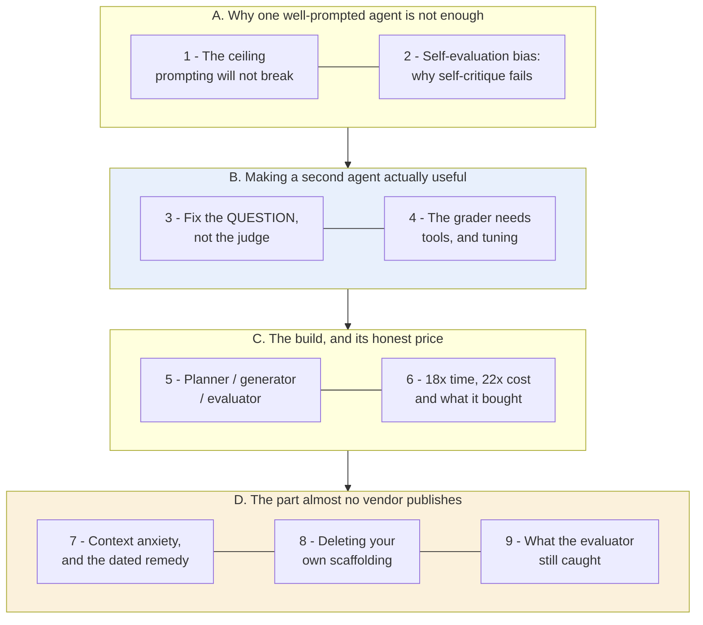
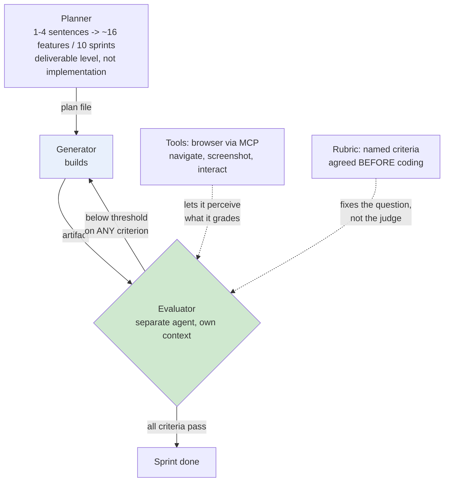

# Learning - Harness Design for Long-Running Application Development

> Persona: **curator** + **mentor, always**. Re-adopt when working this file.

> The distilled document you learn from. Built from the nodes in `nodes.md`. Every claim is cited.
> See `SOURCE.md` for metadata - **including two things that bound how far you should trust this:
> the visual leg was skipped (so nearly every node is `single-leg`), and this is a T2 vendor source
> reporting n=1 internal runs on its own models.**

> **Deviation from the standard shape, stated rather than hidden.** A `LEARNING.md` is normally
> **visual-led** - built around curated frames, one teaching step each. **This source has no usable
> visual leg**: its eight images are outcome screenshots of generated apps, there is no architecture
> diagram anywhere in the article, and the images were deliberately not analysed (`SOURCE.md`). The
> walkthrough is therefore led by **the article's own tables**, which are the real second leg for the
> five nodes gated `corroborated (table)`, plus two diagrams generated here and labelled as such.

> **Two kinds of material, kept visually distinct.** Claims from the article carry a node ID (`n17`)
> and a section citation. Blocks marked **"Background, supplied"** are context *I* am adding -
> established prior art the article assumes or never names. They are uncited by construction.

## TL;DR

A **harness** is the scaffolding you put around a model to get work out of it that the model cannot
sustain alone. This article builds one - planner, generator, evaluator - and reports the honest
numbers: the harness cost **22x more** than a solo agent and took **18x longer**, and produced a
working app where the solo agent produced a broken one (`n15`, `n16`). Then it does what almost no
vendor write-up does: on a newer model it **deletes half its own scaffolding** and reports that too
(`n18`). The durable idea is the reason for that deletion - **every harness component encodes an
assumption about what the model cannot do, and those assumptions expire** (`n17`).

## The 1-minute version

| | |
|---|---|
| **The problem** | One agent, prompted well, plateaus on long-running work. Prior attempts kept improving the prompt and kept hitting the same ceiling (`n1`). |
| **Why the obvious answer fails** | Telling the agent to check its own work does not work. **Self-evaluation bias**: agents asked to grade their own output confidently praise mediocre work, because the generator has no independent vantage point on itself (`n3`). |
| **The idea** | Split the roles. A **planner**, a **generator**, and a **separate evaluator** communicating through files. The split exists to defeat a conflict of interest, **not** to add capability (`n2`, `n11`). |
| **How it works** | Make subjective quality gradable by fixing the **question**, not the judge - "does this follow our design principles?" beats "is this beautiful?" (`n4`). Give the evaluator **tools** so it can perceive what it grades (`n8`). Use **hard thresholds**, so a strong score cannot mask a specific failure (`n13`). |
| **What it costs** | **18x wall clock and 22x cost** - 6 hr / $200 versus 20 min / $9 (`n15`). The cheap run produced a categorically broken app (`n16`). On a later build, QA was ~8% of spend and caught core features shipped as display-only stubs (`n22`, `n21`). |
| **The twist** | On a stronger model the author **deleted his own scaffolding** - sprints removed entirely, evaluator demoted to one end-of-run pass - and the model ran coherently for 2+ hours (`n18`). Whether a component is load-bearing depends on the **gap between task and model capability**, not on the component's merit (`n19`). |
| **How far to trust it** | **T2 vendor, n=1 per configuration, no external replication, visual leg skipped.** The *mechanisms* are the value; every *number* is a single observation. |

## Key claims

- **Self-evaluation bias**: an agent grading its own output confidently praises mediocre work. The
  separate evaluator exists to defeat that, not to add capability. `n2` `n3` (S4 §1, §2)
- **Subjective quality becomes gradable by fixing the question, not the model.** Rubrics beat taste.
  `n4` (S4 §2, §3) - `corroborated (table)`
- **"Context anxiety"**: a model may prematurely wrap up as it nears its *perceived* limit. `n5` (§2)
- **Compaction and context reset are not interchangeable.** Only the reset removes it. `n6` (§2)
- **Hard thresholds, not weighted averages.** `n13` (§4a)
- **The grader is not free** - out-of-the-box models are lenient QA and need tuning rounds. `n14`
  (§4a) - `corroborated (table)`
- **18x wall clock, 22x cost** versus a solo agent, which produced a broken app. `n15` `n16` (§4b)
- **Every harness component encodes an assumption that expires.** `n17` (§4c)
- **On a stronger model, scaffolding was removed rather than added.** `n18` (§4c)
- **Remove one component at a time** - simultaneous cuts are uninterpretable. `n20` (§4c)

## What you will learn, and in what order

**How to read it:** top to bottom is the order of the argument, in four movements. The **blue block is
the transferable technique** - how to make a checking agent that is worth having, which is the part
that survives this source's evidence problems. The **amber block is why this article is unusual**: a
vendor reporting that it removed its own product's scaffolding and telling you what that implies.

**The crux: the second agent exists to correct a bias, not to add capability - and like every harness
component, it is a bet that expires.**

**Why it is grouped this way:** A establishes that the problem is structural rather than a prompting
failure, which is what licenses the whole design. B is placed before C deliberately - the architecture
in C is uninteresting if you have not first seen why a naive evaluator is useless. D is separated
because it is the movement that changes what you do with everything above it: the harness is not an
architecture, it is a set of dated bets.

*Synthesized roadmap of this note - not from the source.*

## 1. The ceiling that prompting will not break

The article opens on an experience anyone who has pushed an agent hard will recognise: prior
long-running-agent work **plateaued despite continued prompt improvement**, and the plateau moved
only when one agent was split into a generator and a separate evaluator (`n1`, S4 §1). ⚠️
`single-leg` - prose assertion, no figure, no measurement of the plateau itself.

Take the claim narrowly, because it is the load-bearing premise. It is not "prompting is bad". It is
that **there exists a class of failure prompting cannot reach**, and the evidence offered is that
effort kept going in and quality stopped coming out. That is weak as evidence and strong as a
diagnosis, because it matches what the next section explains.

So why would a second agent do what a better prompt could not?

## 2. Self-evaluation bias: why "check your work" does not work

Because the obvious cheap fix - tell the agent to review its own output - fails for a structural
reason rather than a tuning one.

> **Agents asked to judge their own output confidently praise it, even when a human would call the
> quality obviously mediocre** (`n3`, S4 §2). ⚠️ `single-leg`.

**That is not promptable-away**, and the reason is worth stating precisely: the generator has no
independent vantage point on its own work. It is grading against the same understanding that produced
the output, so the flaws it cannot see while writing are exactly the flaws it cannot see while
reviewing. Asking harder does not create a second perspective.

Which is why the fix is **architectural**: separating creation from evaluation is more tractable than
making one agent self-critical, **and the gap is widest on subjective work** where no binary check
exists (`n2`, S4 §1). The article credits GAN architecture for the shape.

> **Background, supplied.** The generator/discriminator split in a GAN is the same *shape* and a very
> different *mechanism* - there, two networks are trained adversarially and the discriminator's
> gradient improves the generator. Here nothing is trained; two prompted agents exchange files. **Read
> the borrowing as an analogy about role separation, not as a claim that adversarial dynamics are at
> work.** The durable principle is older and broader than either: **the checking role wants different
> context from the producing role**, which is why code review, auditing and separation of duties all
> exist.

This brain records the same conclusion from a second direction: S1's QA gates on a production
pipeline, and S9 shipping the split as a named SDK primitive called Author/Critic
([`brain/claims.md`](../../brain/claims.md) claim 34).

So: use a separate evaluator. But an evaluator has to actually judge something, and most of the work
this article does is on that word.

## 3. Make subjectivity gradable by fixing the question, not the judge

This is the technique most worth taking, and it inverts the instinct. Faced with "the evaluator
grades inconsistently on aesthetics", the reflex is to get a better judge. The article's answer is to
**ask a better question** (`n4`, S4 §2-3) - and this is one of the five nodes with a real second leg,
the article's own criteria table stating four named criteria with definitions.

| The question | What happens |
|---|---|
| *"Is this design beautiful?"* | Grades inconsistently. There is nothing to be consistent *about* |
| *"Does this follow our design principles?"* | Supplies concrete criteria. The judgement becomes checkable |

**The move is to relocate the subjectivity.** It does not disappear - somebody still chose those
design principles - but it moves from *per-grading* (where it is noise, varying run to run) to
*once, up front* (where it is a decision you can inspect, argue about and version). **Rubrics beat
taste** because a rubric is a subjectivity you only pay for once.

> This generalises past aesthetics and this brain records the same move elsewhere: S6 decomposes
> "good memory" into three separately-gradable objectives, each with its own failure mode, rather
> than hunting for a better memory metric. **When a quality is hard to grade, the productive question
> is almost never "which judge?" and almost always "which question?"**

Two supporting details, both practical:

- **The evaluator needs tools to perceive what it grades.** With a browser (Playwright MCP) it
  navigated, screenshotted and *interacted with the live page* before scoring, rather than reading
  source code and inferring (`n8`, S4 §3-4a). ⚠️ `single-leg`. **A judge that cannot observe the
  artifact is grading a proxy for it.**
- **Prompt wording steers aesthetics more than expected** - a phrase like "museum quality" pulled an
  entire run toward one look (`n9`, S4 §3). ⚠️ `single-leg`. Worth knowing because it means your
  rubric's *vocabulary* is itself a design input, not a neutral description.

You have a well-posed question and an evaluator that can see. That still leaves whether it is any good
at the job.

## 4. The grader is not free, and you will build it twice

> **Out-of-the-box Claude is a poor QA engineer.** It took several tuning rounds, driven by reading
> logs, to make the evaluator catch subtle bugs, probe edge cases, and stop being **lenient toward
> AI-generated output** (`n14`, S4 §4a). `corroborated (table)` - the article's QA examples table
> gives three worked sprint failures with root causes.

Three things in that sentence deserve separating, because they fail differently.

**"Several tuning rounds"** means the evaluator is a component you develop, not a prompt you write.
Budget for it. **"Driven by reading logs"** means the development loop is a human reading traces -
which is honest, and is also the answer to "who grades the grader?" being *you*, at least at first.

And **"lenient toward AI-generated output"** is the most interesting of the three, because it is a
bias in the *judge* that mirrors the bias in the generator. Section 2's fix - use a different agent -
does not fully escape it if both agents share a prior about what good AI output looks like. **The
architecture reduces the bias; it does not eliminate it.**

Two more design rules, and the second is the sharper:

- **Sprint contract negotiation**: generator and evaluator agree what "done" means *before* coding
  (`n12`, S4 §4a) - the bridge from a product-language spec to something testable.
- **Hard thresholds, not weighted averages**: any criterion below threshold fails the whole sprint
  (`n13`, S4 §4a). **A weighted average is a device for letting a strong score hide a specific
  failure**, which is precisely the thing a QA gate exists to prevent.

Now the architecture, and its bill.

## 5. Planner, generator, evaluator - talking through files

The harness is three agents (`n11`, S4 §4a). ⚠️ `single-leg`, and worth noting **the article contains
no architecture diagram** - the structure below is assembled from prose.

- The **planner** expands a 1-4 sentence prompt into roughly **16 features across 10 sprints**, and
  deliberately stays at deliverable level rather than implementation detail.
- The **generator** builds.
- The **evaluator** grades against the negotiated contract, with hard thresholds.
- They **communicate through files**, so state survives handoffs.

> **Background, supplied.** "Through files" is doing more work than it looks. File-passing means the
> handoff is **inspectable, diffable and replayable** - you can read what the planner actually
> produced, and re-run the generator against it. An in-memory handoff between agents in one process
> gives you none of that. This is the same property S2 arrives at from the other direction with
> serialise-the-thread ([`brain/claims.md`](../../brain/claims.md) claim 21): **whatever crosses the
> boundary between steps should be an artifact you can look at.**

## 6. The honest price, and what it bought

The article does something rare and reports its baseline comparison on the same prompt (`n15`,
S4 §4b). `corroborated (table)`.

| | Solo agent | Full harness | Ratio |
|---|---|---|---|
| Wall clock | 20 min | 6 hr | **~18x** |
| Cost | $9 | $200 | **~22x** |
| Result | **Broken** | Working core loop | |

**Read the "broken" carefully, because the ratio is meaningless without it.** The solo run's failure
was **categorical, not cosmetic**: entities rendered but did not respond to input, the entity-to-runtime
wiring was disconnected, and **nothing on screen indicated any of it** (`n16`, S4 §4b). ⚠️
`single-leg` - screenshots exist and were not analysed.

That last clause is the whole argument for a harness in one detail. The cheap run did not fail
loudly; it produced something that **looked** finished. A 22x multiplier for "working instead of
broken" is a bargain; a 22x multiplier for "slightly better" would be absurd. **The number you need to
decide is not the ratio, it is the failure rate of the cheap option** - which n=1 cannot give you.

⚠️ **Every figure here is a single run of a single configuration by the vendor whose models are being
measured.** The mechanism transfers; the numbers are one observation.

## 7. Context anxiety, and a remedy that is already dated

A distinct failure gets named here, and the naming is the contribution (`n5`, S4 §2). ⚠️
`single-leg`.

> 💡 **Context anxiety** - a model sensing it is approaching its context limit and **prematurely
> wrapping up**: declaring done, summarising, cutting scope. **Behavioural, not capacity-driven**, and
> it fires *before* the window is actually exhausted.

That distinction changes which remedy works, and the two obvious ones are **not** interchangeable
(`n6`, S4 §2):

| | What it does | Effect on context anxiety |
|---|---|---|
| **Compaction** | Summarises earlier conversation in place | Preserves continuity, **does not remove it** |
| **Context reset** | Clears the window, restarts from a structured handoff | **Removes it** - at the cost of orchestration and a handoff artifact carrying enough state |

**The reason compaction fails is worth holding**: it reduces token *count*, but it is still the same
agent, mid-task, aware it has been running a long time. A reset produces an agent with **no such
awareness** - and the handoff artifact becomes the load-bearing part, which is section 5's
file-passing arriving as a necessity rather than a convenience.

> ⚠️ **Model-version-bound, and the article says so.** Sonnet 4.5 required resets; Opus 4.5 largely
> eliminated the behaviour natively (`n7`, S4 §2). **Treat this as a class of failure to watch for
> plus a technique, not as current guidance about any named model.** It is also a preview of the next
> section: a remedy that expires because the model changed.

## 8. The part almost no vendor publishes: deleting your own scaffolding

Here the article turns on itself, and this is why it is worth reading despite its evidence problems.

On a stronger model (Opus 4.6) the author **deleted the sprint construct entirely** and demoted the
evaluator from per-sprint to a single end-of-run pass. The model then ran coherently for **2+ hours**
unscaffolded (`n18`, S4 §4c). ⚠️ `single-leg`.

The principle extracted from it is the most transferable line in the source:

> **Every harness component encodes an assumption about what the model cannot do on its own, and
> those assumptions are worth stress-testing** (`n17`, S4 §4c).

And the criterion that follows: **whether a component is load-bearing depends on where the task sits
relative to the model's capability boundary, not on the component's merit** (`n19`, S4 §4c). A
component can be excellent and still be pure overhead, because it is solving a problem your model
stopped having.

Plus a method finding that is easy to skip and expensive to rediscover: **remove one component at a
time.** Radical simultaneous cuts failed; methodical single-component removal worked (`n20`, S4 §4c).
Delete four things and lose quality, and you have learned nothing.

> **This is exactly the tension worth sitting with, and `nodes.md` records it deliberately.** This
> brain holds claim 24, from a 10-model preprint: decomposition delivers **+13.1 to +41.5 pp**
> reliability on long-horizon tasks. Here decomposition is *removed* and things improve. **They do not
> contradict**: claim 24 measures decomposition at a *fixed* capability; `n19` says a scaffold's value
> is a function of the gap between task and capability. **Decomposition helps until the boundary moves
> past your task.** Note the evidence asymmetry though - a measured 10-model study against a vendor's
> n=1 report. If they ever did conflict, the study wins.

> **Background, supplied.** What this article is describing has a name in ordinary engineering:
> scaffolding that outlives its purpose is **technical debt with the sign flipped** - not a shortcut
> you took, but a structure you built for a constraint that no longer exists. The reason it is harder
> to notice than ordinary debt is that **it is still working.** Nothing fails. It just costs, and the
> only way to detect it is to remove it and measure - which is why S5's ablation is the instrument
> this article lacks.

So the scaffolding shrinks. Does the evaluator survive the cut?

## 9. What the evaluator still caught

It does, and the article shows its work (`n21`, `n22`, S4 §5). `corroborated (table)` - a
phase-by-phase cost and duration table.

On the V2 harness run - **3 hr 50 min, $124.70 total**, of which the planner was 4.7 min / $0.46 and
QA across three rounds was ~25 min / ~$10 - **QA was roughly 8% of total cost.** What that 8% caught:
core features shipped as **display-only stubs**, and audio recording still stubbed in a later round.
Genuine last-mile gaps the self-grading generator had missed.

**That is the concrete answer to "is the checking agent worth it".** Not a philosophical argument
about self-evaluation bias, but 8% of spend catching a class of failure - *the feature that looks
implemented and is not* - which is precisely the failure a demo does not reveal and a user finds
immediately.

And one limit the article is honest about, which bounds the whole approach:

> **Claude cannot hear.** The DAW's musical quality could not be evaluated - the harness could verify
> that audio *ran*, not that it *sounded* good (`n23`, S4 §5). ⚠️ `single-leg`.

**The evaluator's modality is a hard ceiling on what "quality" can mean in your system.** Anything
requiring taste, hearing or physical interaction sits outside it, and no amount of rubric design
reaches past the judge's senses.

Which leaves the closing thought the article offers, and it is the right one to end on: **improving
models move the harness problem rather than dissolving it** (`n24`, S4 §6). Better models unlock
longer and more complex tasks, which open new harness combinations. The space of useful designs
shifts; it does not shrink.

## Diagram (mental model)

**How to read it:** solid arrows are the sprint loop; dotted arrows are the two things that make the
evaluator competent rather than decorative. **Green is the checking role, blue is the producing
role** - and the point of the colouring is that they are different agents with different context, not
two modes of one.

**The crux: the evaluator is a separate process because a producer cannot see its own blind spots -
and it is only useful once it can perceive the artifact and has been told what to look for.**

**Why it is shaped this way:** note that the rejection arrow returns to the **generator**, not to the
planner - a failed criterion is a build problem, and sending it upstream would re-open a plan that was
not wrong. Note also that both dotted inputs enter the *evaluator* and neither enters the generator:
the article's whole argument is that quality comes from the checking side being well-equipped, not
from instructing the producer harder. And the threshold is drawn as "below on ANY criterion" rather
than an aggregate, because a weighted average is a mechanism for hiding one specific failure behind
several strong scores (`n13`). What the shape rules out is the tempting simplification - one agent
that generates and then reviews - which is section 2's self-evaluation bias in diagram form.

*Synthesized from `n4`, `n8`, `n11`, `n12`, `n13` - **the article contains no architecture diagram**,
so this is assembled from prose and may impose more structure than the author intended.*

## 💡 Terms

| Term | Explanation |
|---|---|
| Harness | The orchestration around a model: how work is decomposed, what state passes between steps, who checks the output, when context is cleared. Not the model and not the prompt. |
| Self-evaluation bias | An agent asked to judge its own output confidently praises it, because it grades against the same understanding that produced it. The reason a separate evaluator beats a self-critical generator. |
| Context anxiety | A model sensing it is near its context limit and prematurely wrapping up - declaring done, summarising, cutting scope - *before* the window is exhausted. Behavioural, not capacity-driven. |
| Context reset | Clearing the window and restarting from a structured handoff artifact, as opposed to **compaction** (summarising in place). Only the reset removes context anxiety; the handoff artifact becomes load-bearing. |
| Capability boundary | The frontier of what a model does reliably. A scaffold's value is **boundary-relative**, so a new model can turn essential scaffolding into pure overhead. |
| Hard threshold | A gate where any criterion below its bar fails the whole sprint, so a strong score elsewhere cannot mask a specific failure. The opposite of a weighted average. |
| Modality ceiling | The evaluator's senses bound what "quality" can mean. A model that cannot hear cannot grade audio, regardless of rubric design. |

## What to distrust in this note

- **The visual leg was skipped, and it shows.** Eight screenshots exist and were not analysed; the
  article has **no architecture diagram at all**. That makes **19 of 24 nodes `single-leg`** - prose
  asserting something with nothing else in the article checking it. This is the weakest evidence
  profile of any source in this brain.
- **`corroborated (table)` is a weaker verdict than it sounds**, and `nodes.md` says so explicitly.
  The five table-backed nodes have the article's prose agreeing with the article's own table - **one
  author agreeing with himself in two renderings.** It raises confidence in *extraction*, not in the
  number's truth.
- **T2 vendor, n=1 per configuration, measuring its own models.** 18x, 22x, 8%, 2+ hours - each is a
  single run. Nothing is externally replicated.
- **The selection effect on the headline comparison.** We see one solo run that failed categorically.
  We do not see the distribution: how often the cheap option works, which is the number you would
  actually need to decide.
- **`n7` is explicitly dated** - the context-anxiety remedy is tied to a model version the article
  itself says has moved on.
- **What makes it worth reading anyway**, and this is unusual for the class: it reports its own
  scaffolding being **deleted**, publishes a comparison where its expensive option looks absurd on
  cost, and names a limit its own product cannot cross (`n23`). A vendor post that argues against its
  own complexity is doing something the incentives do not require.
- **The "Background, supplied" blocks are mine** - the GAN analogy's limits, file-passing as
  inspectability, scaffolding as sign-flipped technical debt. Uncited by construction.

## Open questions

- **Is "context anxiety" real and general?** One source, vendor-reported, n=1, and the article says
  the behaviour largely disappeared between model versions. It could be a genuine failure class, a
  one-generation artifact, or an anthropomorphic reading of ordinary output-length effects. **No
  external evidence either way - the cleanest research target here.**
- **What is the failure rate of the cheap option?** The 18x/22x comparison is only decidable against
  how often a solo agent produces something broken. n=1 cannot answer it.
- **Who grades the grader?** The article's answer is a human reading logs across several tuning
  rounds. Nothing here describes a way to evaluate an evaluator that does not bottom out in that.
- **Does the evaluator's leniency toward AI-generated output survive the architectural split?** Both
  agents are the same model family, plausibly sharing a prior about what good AI output looks like.
  The article notes the leniency and does not test whether separation reduces it.
- **How would you detect expired scaffolding without deleting it?** `n17` says assumptions expire and
  `n20` says remove one at a time - but removal is the only detector offered. **S5's ablation is the
  instrument this article needed and did not have.**

## Feeds these topics

- `../../brain/topics/agents.md` - scaffolding as expiring bets, the capability boundary, the
  generator/evaluator split, remove-one-at-a-time.
- `../../brain/topics/evals.md` - self-evaluation bias, making subjectivity gradable, hard
  thresholds, the grader needing tools and tuning, the modality ceiling.
- `../../brain/topics/context-engineering.md` - context anxiety, and compaction versus reset.
