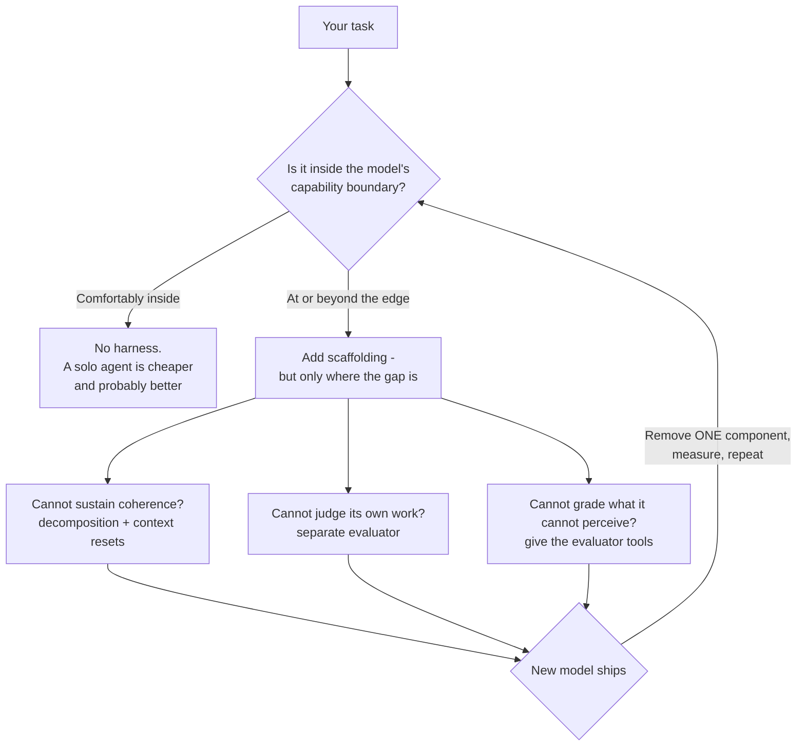

# Learning - Harness Design for Long-Running Application Development

> Persona: **curator** + **mentor**. Re-adopt when working this file.

> The distilled document you learn from. Built from the nodes in `nodes.md`. Every claim is cited.
> See `SOURCE.md` for metadata - **including two things that bound how far you should trust this:
> the visual leg was skipped (so nearly every node is `single-leg`), and this is a T2 vendor source
> reporting n=1 internal runs on its own models.**

## TL;DR

A **harness** is the scaffolding you put around a model to get work out of it that the model cannot
sustain alone. This article builds one - planner, generator, evaluator - and reports the honest
numbers: the harness cost **22x more** than a solo agent and took **18x longer**, and produced a
working app where the solo agent produced a broken one (`n15`, `n16`). Then it does what almost no
vendor write-up does: on a newer model it **deletes half its own scaffolding** and reports that too
(`n18`). The durable idea is the reason for that deletion - **every harness component encodes an
assumption about what the model cannot do, and those assumptions expire** (`n17`).

## Key claims

- **Prompt engineering plateaus; architecture is the next lever.** `n1`
- **Split the generator from the evaluator** - self-evaluation bias means an agent grading its own
  work confidently praises mediocre output. `n2`, `n3`
- **Make subjective quality gradable by fixing the question, not the model:** "is this beautiful?"
  is not gradable, "does this follow our design principles?" is. `n4`
- **"Context anxiety"** - models wrapping up prematurely near their *perceived* limit - is a
  behavioural failure distinct from exhausting the window, and **compaction does not fix it; a
  context reset does.** `n5`, `n6`
- **Harness value is boundary-relative:** whether a component is load-bearing depends on where your
  task sits against the model's capability frontier, not on how good the component is. `n19`
- **Test your scaffolding by removing it, one piece at a time** - simultaneous cuts failed. `n20`
- **QA was ~8% of cost and still caught core features shipped as non-functional stubs.** `n21`, `n22`

## Walkthrough

### 1. The problem: a ceiling that prompting will not break

The starting point is a negative result. Earlier work on long-running coding agents kept improving
the prompt and stopped improving the output (`n1`, S4 §1). The response was structural rather than
verbal: borrow the **GAN** shape and split one agent into a **generator** and a separate
**evaluator**.

> 💡 **Harness** - the orchestration around a model: how work is decomposed, what state passes
> between steps, who checks the output, when context is cleared. Not the model, not the prompt. The
> kit's existing sources describe adjacent parts of this as "owning your control flow" (S2) and "a
> routed pipeline of single-purpose agents" (S1).

**Why the split works is a claim about *bias*, not capability:**

> Agents asked to evaluate their own output tend to confidently praise it, even when a human would
> call the quality obviously mediocre (`n3`, S4 §2).

That is not something the model can be prompted out of, because it has no independent vantage point
on its own work. A fresh evaluator - without the generator's context, and without its investment in
what it just built - has one.

### 2. The move that generalises: make subjectivity gradable

The sharpest transferable idea in the article costs nothing to apply (`n4`, S4 §2):

| Not gradable | Gradable |
|---|---|
| "Is this design beautiful?" | "Does this follow our design principles?" |

The first grades inconsistently run to run because it has no referent. The second supplies criteria.
The article's four design criteria - **design quality, originality, craft, functionality** - are what
turn taste into a rubric, and the *originality* one is unusually concrete: it names the failure mode
(generic "AI slop" patterns) rather than gesturing at novelty.

**The pattern to steal: when a quality judgement grades inconsistently, the problem is usually the
question, not the grader.** Replace the adjective with a checklist you would accept from a colleague.

Two supporting details worth keeping:

- **The evaluator got a browser** (Playwright MCP), so it navigated, screenshotted and interacted
  with the live page before scoring, instead of reading source and guessing (`n8`). Grading artifacts
  you can only judge by seeing requires actually seeing them.
- **Wording steers output harder than expected** - a "museum quality" phrase pulled an entire run
  toward one aesthetic (`n9`). A rubric is also a bias you are injecting; write it deliberately.

> **An honest caveat the article supplies itself:** improvement across iterations was **not
> monotonic** - a middle iteration was sometimes preferred to the last (`n10`). More loop is not
> uniformly more quality, which undercuts the natural reading of "iterate until good".

### 3. Context anxiety, and why compaction is not the fix

This is the most immediately useful diagnostic in the piece (`n5`, `n6`, S4 §2).

> 💡 **Context anxiety** - a model, sensing it is nearing its context limit, **prematurely wraps up**:
> declaring done, summarising, cutting scope. The failure is *behavioural* and happens **before** the
> window is actually exhausted. It looks like laziness; it is anticipation.

The two remedies are not interchangeable, and this is the part people get wrong:

| | What it does | Effect on context anxiety |
|---|---|---|
| **Compaction** | Summarises earlier conversation in place | Preserves continuity, **does not remove the anxiety** |
| **Context reset** | Clears the window, restarts from a structured handoff | **Removes it**, at the cost of orchestration and a handoff artifact that must carry enough state |

The reason compaction fails here is worth reasoning through: it reduces token *count*, but the agent
is still the same agent, mid-task, aware it has been running a long time. A reset produces an agent
with no such awareness - it starts fresh, and the only thing it knows is what the handoff document
tells it. **The handoff artifact becomes the load-bearing part**, which is precisely the
serialise-the-thread design S2 argues for.

> ⚠️ **This is model-version-bound and already dating.** Sonnet 4.5 needed resets; Opus 4.5 largely
> eliminated the behaviour natively (`n7`). Read this section as *a class of failure to watch for and
> a technique to reach for*, not as current guidance about any specific model.

### 4. The architecture, and what it actually cost

Three agents communicating **through files** (`n11`, S4 §4a):

- **Planner** - turns 1-4 sentences into ~16 features across 10 sprints, staying at deliverable level.
- **Generator** - implements one feature per sprint, self-evaluates, commits with git.
- **Evaluator** - drives the running app through a browser as a user would; grades on **hard
  thresholds**, where any single criterion below threshold fails the sprint (`n13`).

Two mechanisms worth lifting out:

**Sprint contract negotiation** (`n12`) - generator and evaluator agree what "done" means *before*
coding starts. This bridges a spec written in product language to something testable, and it
front-loads the disagreement to when it is cheap.

**The evaluator had to be trained into competence** (`n14`) - and the article says so plainly:
out-of-the-box Claude is a poor QA engineer, too lenient toward AI-generated output, and it took
several tuning rounds *driven by reading logs* to make it catch subtle bugs. **If you take one
operational lesson: the grader is not free.** You will build it twice.

Now the numbers the article deserves credit for publishing (`n15`, S4 §4b):

| Run | Duration | Cost |
|---|---|---|
| Solo agent | 20 min | $9 |
| Full 3-agent harness | 6 hr | $200 |

**Roughly 18x the wall clock and 22x the cost.** What that bought was not polish - the solo build's
game *did not work*, entities rendering but not responding to input, with nothing on screen
indicating the wiring was disconnected (`n16`). The harness build had a working core loop.

> **Read that trade honestly.** Twenty-two times the cost for "it functions at all" is a good trade
> when correctness matters and a terrible one when it does not. The article does not oversell it, and
> neither should you: one task, run once, on a prompt chosen by the author.

### 5. The part that makes this article unusual: deleting your own scaffolding

Most harness write-ups accumulate. This one subtracts (`n18`, S4 §4c). On Opus 4.6:

- **The sprint construct was removed entirely** - the model held coherent work without decomposition.
- The evaluator moved from **per-sprint to a single end-of-run pass**.
- The model then ran coherently for **2+ hours** unscaffolded.

The principle behind it is the line to remember (`n17`):

> **Every harness component encodes an assumption about what the model cannot do on its own - and
> those assumptions are worth stress-testing.**

And the generalisation of *when* to keep a component (`n19`):

> **Whether a component is load-bearing depends on where the task sits relative to the model's
> capability boundary, not on the component's merit.**

That reframes harness design from architecture to **calibration**. A scaffold is not good or bad; it
is *matched or unmatched to a gap*. When the boundary moves, previously essential scaffolding becomes
pure overhead - and the same component may still be load-bearing for a harder task on the same model.

One method note that saves time (`n20`): **radical simultaneous cuts failed; removing one component
at a time worked.** Obvious in retrospect, routinely ignored - if you delete four things and quality
drops, you have learned nothing.

### 6. What the evaluator still caught

Even on the better model, QA found core DAW features shipped as **display-only stubs** - clip
dragging, instrument panels, effect editors that rendered but did nothing - and, in a second round,
audio recording still stubbed (`n21`, S4 §5). The cost breakdown (`n22`):

| Phase | Duration | Cost |
|---|---|---|
| Planner | 4.7 min | $0.46 |
| Build R1 -> QA R1 | 2 hr 7 min -> 8.8 min | $71.08 -> $3.24 |
| Build R2 -> QA R2 | 1 hr 2 min -> 6.8 min | $36.89 -> $3.09 |
| Build R3 -> QA R3 | 10.9 min -> 9.6 min | $5.88 -> $4.06 |
| **Total** | **3 hr 50 min** | **$124.70** |

**QA was about 8% of total cost, and it is what stood between "demo that renders" and "software that
runs".** That ratio is the most actionable number here: a cheap independent check on an expensive
generation step.

> 💡 **A limit worth naming: Claude cannot hear** (`n23`). QA could confirm the DAW produced audio,
> never that it sounded good. **The evaluator's modality is a hard ceiling on what "quality" can
> mean** - which generalises well beyond audio: an evaluator with no browser cannot grade layout, one
> with no database access cannot grade persistence.

## Diagram (mental model)

**Orientation.** Read top to bottom, then notice it loops. The three middle boxes are not a menu of
good practices - each names a **specific model deficit** and the scaffold that patches it. The
feedback edge at the bottom is the article's actual thesis: this is not a design you finish.

**The crux: a harness is not architecture you choose once, it is a set of expiring bets on what the
model cannot do - so the maintenance question is always "which of these is still load-bearing?"**

**Why it is shaped this way.** Organising by *deficit* rather than by *component* is what makes the
removal step possible: if you know a piece exists because the model could not sustain coherence, you
know exactly what to re-test when a model claims longer coherent runs. A conventional
planner-generator-evaluator box diagram - which the article itself does not draw - would show the
same system while hiding the only property that matters, because it depicts structure rather than
justification. Note what the shape rules out: there is no path that adds scaffolding without naming
the gap it fills, and no terminal state.

**Provenance:** synthesized from `n17`, `n19`, `n20`, plus the deficits in `n5`, `n6`, `n8`, `n23`.
**The article contains no architecture diagram** - this is not a reproduction of one.

## How this lands against what the brain already holds

- **Refines claim 24 (decomposition is measured, +13.1 to +41.5 pp).** That study measured
  decomposition at a *fixed* capability; `n19` says scaffolding value is boundary-relative. Together:
  **decomposition helps until the boundary moves past your task.** Not a contradiction - but note the
  evidence asymmetry (10-model study vs vendor n=1). See the tension note in `nodes.md`.
- **Extends claim 11** (small scoped LLM steps inside deterministic software). This is that pattern
  built and costed - then *partially withdrawn* on a better model, which is new information.
- **Sits beside claims 14 and 22** (context degradation, measured). "Context anxiety" is a
  **distinct** failure: not degradation from a full window, but premature wrap-up from an
  *anticipated* one.
- **Feeds `evals`:** the generator/evaluator split, hard thresholds, and "the grader needs tuning"
  are eval-design claims, not only agent-design ones.

## Open questions

- **Is "context anxiety" real and general, or an artifact of one model generation?** The article
  reports it disappearing between model versions (`n7`). No external evidence here.
- **Does the 8% QA cost ratio hold anywhere else?** It comes from a single run of a single task. It
  is the number most likely to be quoted and least supported.
- **What replaces the evaluator when the modality gap is unbridgeable** (`n23`)? Audio was the
  example; anything requiring taste, hearing or physical interaction has the same problem.
- **Is there a principled way to find the capability boundary**, or is it only discoverable by
  building the harness and removing pieces? The article's method is empirical and slow.
