# Learning - Harness Design for Long-Running Application Development

> Persona: **curator** + **mentor, always**. Re-adopt when working this file.

> The distilled document you learn from. Built from the nodes in `nodes.md`. Every claim is cited.
> See `SOURCE.md` for metadata - **including two things that bound how far you should trust this:
> the visual leg was skipped (so nearly every node is `single-leg`), and this is a T2 vendor source
> reporting n=1 internal runs on its own models.**

> **Deviation from the standard shape, stated rather than hidden.** A `LEARNING.md` is normally
> **visual-led** - built around curated frames, one teaching step each. **This source has no usable
> visual leg**: its eight images are outcome screenshots of generated apps, there is no architecture
> diagram anywhere in the article, and the images were deliberately not analysed (`SOURCE.md`). The
> walkthrough is therefore led by **the article's own tables**, which are the real second leg for the
> five nodes gated `corroborated (table)`, plus two diagrams generated here and labelled as such.

> **Two kinds of material, kept visually distinct.** Claims from the article carry a node ID (`n17`)
> and a section citation. Blocks marked **"Background, supplied"** are context *I* am adding -
> established prior art the article assumes or never names. They are uncited by construction.

## TL;DR

A **harness** is the scaffolding you put around a model to get work out of it that the model cannot
sustain alone. This article builds one out of a planner, a generator and an evaluator, and then
reports the honest numbers. The harness cost **22x more** than a solo agent and took **18x longer**,
and it produced a working app where the solo agent produced a broken one (`n15`, `n16`). Then it does
what almost no vendor write-up does. On a newer model the author **deletes half his own scaffolding**
and reports that result too (`n18`). The durable idea is the reason for that deletion, which is that
**every harness component encodes an assumption about what the model cannot do, and those assumptions
expire** (`n17`).

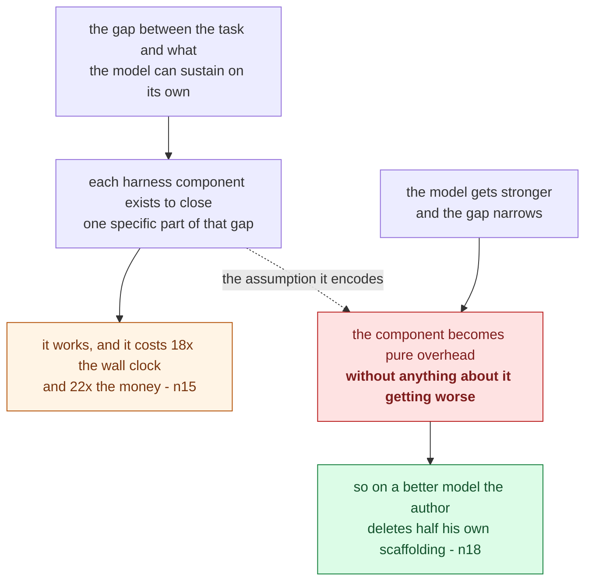

This is an obsolescence diagram, not an architecture diagram, and the dashed edge is the whole
argument. **The crux is that a harness component's worth is a property of the gap it was built to
close rather than of the component itself, so good scaffolding expires without ever becoming bad
scaffolding.** It is drawn as two chains meeting rather than as a build-then-teardown sequence because
the two things are not stages in a project: the assumption is encoded on the day the component is
written, and the model release that voids it arrives independently and on somebody else's schedule.
The green terminal box is what makes this source unusual, since almost no vendor write-up publishes
the deletion of its own machinery. *Synthesized from `n15`, `n17`, `n18` and `n19`.*

## The 1-minute version

This article covers a vendor's account of building a harness around a coding model, pricing it
honestly, and then taking half of it apart again. A harness is not the model and it is not the
prompt. It is everything around them, meaning how the work gets decomposed, what state passes between
steps, who checks the output, and when the context window is cleared. The problem it works on is that
one agent, prompted well, plateaus on long-running work. The author's earlier attempts kept improving
the prompt and kept meeting the same ceiling, which moved only once the single agent was split into a
generator and a separate evaluator (`n1`). Take that premise narrowly, because everything after it
rests on the premise being structural rather than a complaint about prompt quality.

What makes the problem hard is that the work is subjective and unattended at the same time. A test
suite settles whether a function returns the right value, and nothing comparable settles whether an
interface follows the design you had in mind, so a multi-hour build accumulates hundreds of
judgements with no human present for any of them. The failures that matter here also do not announce
themselves. In the article's own baseline run, the app rendered its entities perfectly, did not
respond to input at all, and showed nothing on screen to indicate that anything was wrong (`n16`).
Given that, the obvious cheap fix is to make the agent check itself.

At first glance that should close the gap, and it does not. Agents asked to grade their own output
confidently praise it, even when a human would call the quality obviously mediocre (`n3`). The reason
is structural rather than a matter of tuning. The generator has no independent vantage point on its
own work, so it reviews against the same understanding that produced the work, and the flaws it could
not see while writing are exactly the flaws it cannot see while reviewing. Asking harder does not
manufacture a second perspective, so the fix has to change the structure instead of the instruction.

The idea is therefore to split the roles. A planner, a generator and a separate evaluator communicate
through files, each holding its own context (`n2`, `n11`). Note carefully what the split is for,
because it is easy to mistake for a general claim that more agents are better. It exists to defeat a
conflict of interest rather than to add capability, and that is the whole justification the article
offers for the extra machinery.

Making the second agent worth having is where most of the article's work goes. Subjective quality
becomes gradable by fixing the question rather than the judge, so that "does this follow our design
principles?" beats "is this beautiful?" (`n4`). The evaluator is given tools, in this case a browser
through MCP, so that it can navigate and interact with the live artifact instead of reading the
source and inferring what it would do (`n8`). And the gate is a set of hard thresholds rather than a
weighted average, so that strong scores on three criteria cannot bury a specific failure on the
fourth (`n13`). None of that comes free, and the article is unusually willing to say what it costs.

On the same prompt, the full harness took 6 hours and about $200 where the solo agent took 20 minutes
and about $9, which is roughly 18x the wall clock and 22x the cost (`n15`). The cheap run is the one
that produced the categorically broken app (`n16`). A later build gives finer accounting, with QA
running at roughly 8% of total spend and catching core features that had shipped as display-only
stubs (`n22`, `n21`). So the harness is expensive and it buys something real, which makes what
happens next surprising.

On a stronger model the author deleted his own scaffolding. Sprints were removed entirely, the
evaluator was demoted to a single end-of-run pass, and the model then ran coherently for over two
hours (`n18`). The conclusion drawn from that is the most transferable thing in the source. Whether a
component is load-bearing depends on the gap between the task and the model's capability rather than
on the merit of the component, so a well-designed piece of scaffolding can become pure overhead
without anything about it getting worse (`n19`).

How far to trust any of it is the last question, and the answer separates cleanly into two halves.
This is a T2 vendor source with n=1 per configuration, no external replication, and a visual leg that
was skipped, which means every number here is a single observation by the party whose models are
being measured. **Trust the mechanisms and treat every figure as one run.**

The same argument, compressed for reference rather than for reading:

| | |
|---|---|
| **The problem** | One agent, prompted well, plateaus on long-running work. Prior attempts kept improving the prompt and kept hitting the same ceiling (`n1`). |
| **Why the obvious answer fails** | Telling the agent to check its own work does not work. **Self-evaluation bias**: agents asked to grade their own output confidently praise mediocre work, because the generator has no independent vantage point on itself (`n3`). |
| **The idea** | Split the roles. A **planner**, a **generator**, and a **separate evaluator** communicating through files. The split exists to defeat a conflict of interest, **not** to add capability (`n2`, `n11`). |
| **How it works** | Make subjective quality gradable by fixing the **question**, not the judge - "does this follow our design principles?" beats "is this beautiful?" (`n4`). Give the evaluator **tools** so it can perceive what it grades (`n8`). Use **hard thresholds**, so a strong score cannot mask a specific failure (`n13`). |
| **What it costs** | **18x wall clock and 22x cost** - 6 hr / $200 versus 20 min / $9 (`n15`). The cheap run produced a categorically broken app (`n16`). On a later build, QA was ~8% of spend and caught core features shipped as display-only stubs (`n22`, `n21`). |
| **The twist** | On a stronger model the author **deleted his own scaffolding** - sprints removed entirely, evaluator demoted to one end-of-run pass - and the model ran coherently for 2+ hours (`n18`). Whether a component is load-bearing depends on the **gap between task and model capability**, not on the component's merit (`n19`). |
| **How far to trust it** | **T2 vendor, n=1 per configuration, no external replication, visual leg skipped.** The *mechanisms* are the value; every *number* is a single observation. |

## Key claims

- **Self-evaluation bias**: an agent grading its own output confidently praises mediocre work. The
  separate evaluator exists to defeat that, not to add capability. `n2` `n3` (S4 §1, §2)
- **Subjective quality becomes gradable by fixing the question, not the model.** Rubrics beat taste.
  `n4` (S4 §2, §3) - `corroborated (table)`
- **"Context anxiety"**: a model may prematurely wrap up as it nears its *perceived* limit. `n5` (§2)
- **Compaction and context reset are not interchangeable.** Only the reset removes it. `n6` (§2)
- **Hard thresholds, not weighted averages.** `n13` (§4a)
- **The grader is not free** - out-of-the-box models are lenient QA and need tuning rounds. `n14`
  (§4a) - `corroborated (table)`
- **18x wall clock, 22x cost** versus a solo agent, which produced a broken app. `n15` `n16` (§4b)
- **Every harness component encodes an assumption that expires.** `n17` (§4c)
- **On a stronger model, scaffolding was removed rather than added.** `n18` (§4c)
- **Remove one component at a time** - simultaneous cuts are uninterpretable. `n20` (§4c)

## What you will learn, and in what order

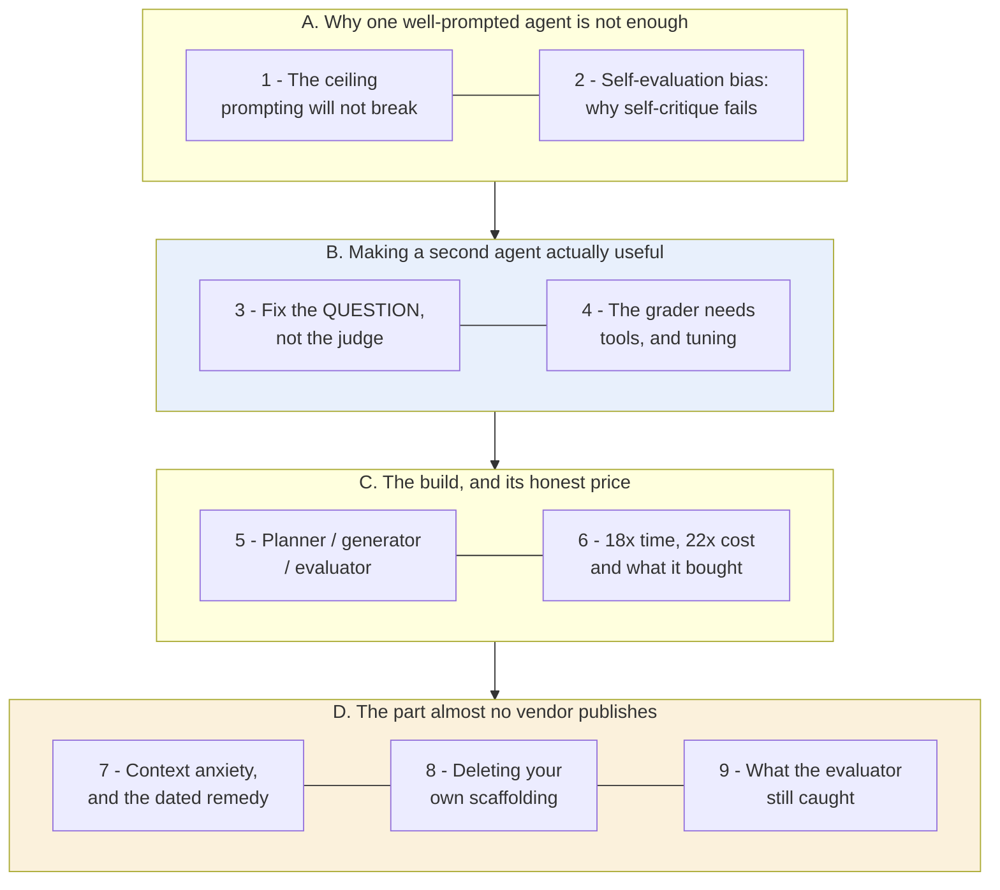

This is a reading-order diagram about the note rather than about the harness, and every box is a numbered section
below. The boxes are gathered into four movements. Blue marks the movement carrying the transferable
technique, which is how to build a checking agent worth having, and amber marks the movement that
makes this article unusual, where a vendor reports removing its own product's scaffolding and says
what that implies. **The crux is that the second agent exists to correct a bias rather than to add
capability, and that like every harness component it is a bet that expires.**

Movement A does no design work at all. Its only job is to establish that the plateau is structural
rather than a prompting failure, because that is what licenses everything built on top of it. A
reader who already believes a single well-prompted agent has a ceiling can move straight through it.

Movement B sits before the architecture deliberately, and that ordering is the one choice in this
roadmap worth defending. At first glance the architecture is the interesting part and belongs first.
The reason it does not come first is that the architecture is uninteresting until you have seen why a
naive evaluator is useless, and a reader who jumps ahead will read movement C as an ordinary
multi-agent diagram with a large bill attached. This is the movement to slow down in.

Movement C is the build and its price, and it is the most skimmable stretch here for anyone who has
already costed an agent pipeline. What skimming costs is one detail in section 6, which is what the
word "broken" actually meant in the baseline run. That detail is what decides whether the price is a
bargain or an absurdity, so it is the paragraph to read even if the rest goes fast.

Movement D changes what you do with everything above it. The harness stops being an architecture and
becomes a set of dated bets, and this is also the only place the article argues against its own
complexity. If you read two sections, read 2 and 8. One gives the reason the design exists and the
other gives the reason to expect it to expire.

*Synthesized roadmap of this note - not from the source.*

## Movement A - why one well-prompted agent is not enough

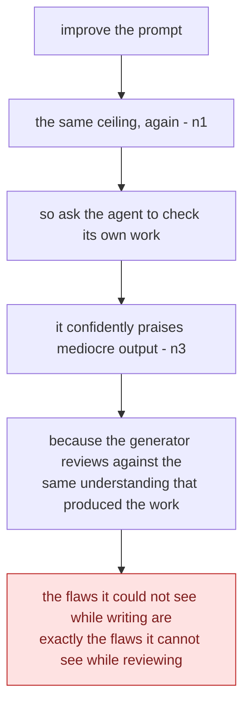

This is a dead-end diagram, not a design, and its job is to close off the cheap fix before the
expensive one is proposed. **The crux is that self-evaluation fails structurally rather than through
weak prompting, so no amount of asking harder manufactures the second perspective the check
requires.** It is drawn as a single unbranching descent because each step is what a competent engineer
actually tries next, in order, and the value is in showing that the sequence terminates rather than
loops. Everything the rest of the note spends money on is justified by the last box, so a reader who
does not believe it will find Movement C's price tag indefensible.

*Synthesized from `n1` and `n3`.*

### 1. The ceiling that prompting will not break

The article opens on an experience anyone who has pushed an agent hard will recognise. Prior
long-running-agent work **plateaued despite continued prompt improvement**, and the plateau moved
only when one agent was split into a generator and a separate evaluator (`n1`, S4 §1). ⚠️
`single-leg` - a prose assertion, with no figure behind it and no measurement of the plateau itself.

Take the claim narrowly, because it is the load-bearing premise for everything that follows. It is
not the claim that prompting is bad. It is the claim that **there exists a class of failure prompting
cannot reach**, and the evidence offered is simply that effort kept going in while quality stopped
coming out. That is weak as evidence and strong as a diagnosis. It is strong as a diagnosis because
it matches the mechanism the next section explains.

So why would a second agent do what a better prompt could not?

### 2. Self-evaluation bias: why "check your work" does not work

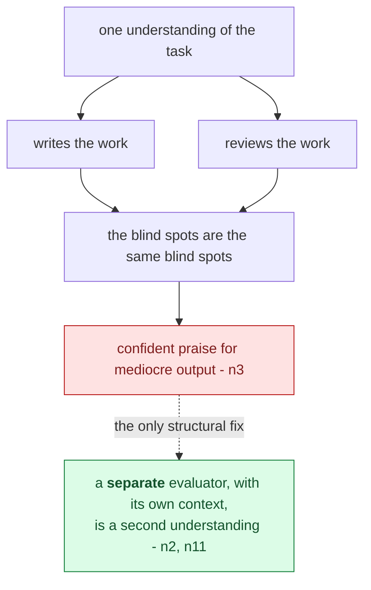

This is a causal diagram, not a workflow, and the single shared node at the top is the finding. **The
crux is that reviewing and writing draw on the same understanding, so a self-check cannot surface the
flaws that understanding caused.** It is drawn with one source feeding both activities because that is
literally the defect: two boxes fed by two separate understandings would be a working review, and the
whole argument for a second agent is buying that separation. Notice the fix is structural rather than
instructional, which is why "ask it to be more critical" belongs to the failed branch and not the
green one.

*Synthesized from `n2`, `n3` and `n11`.*

The obvious cheap fix is to tell the agent to review its own output, and it fails for a structural
reason rather than a tuning one.

> **Agents asked to judge their own output confidently praise it, even when a human would call the
> quality obviously mediocre** (`n3`, S4 §2). ⚠️ `single-leg`.

**That is not promptable-away**, and the reason is worth stating precisely. The generator has no
independent vantage point on its own work. It is grading against the same understanding that produced
the output, so the flaws it could not see while writing are exactly the flaws it cannot see while
reviewing. Asking harder does not create a second perspective, which is why the fix has to be
**architectural** rather than verbal.

Separating creation from evaluation is more tractable than making one agent self-critical, **and the
gap is widest on subjective work** where no binary check exists (`n2`, S4 §1). The article credits GAN
architecture for the shape.

> **Background, supplied.** The generator/discriminator split in a GAN is the same *shape* and a very
> different *mechanism* - there, two networks are trained adversarially and the discriminator's
> gradient improves the generator. Here nothing is trained; two prompted agents exchange files. **Read
> the borrowing as an analogy about role separation, not as a claim that adversarial dynamics are at
> work.** The durable principle is older and broader than either. **The checking role wants different
> context from the producing role**, which is why code review, auditing and separation of duties all
> exist.

This brain records the same conclusion from two other directions. S1 arrives at it as QA gates on a
production pipeline, and S9 ships the split as a named SDK primitive called Author/Critic
([`brain/claims.md`](../../brain/claims.md) claim 34).

So the answer is a separate evaluator. But an evaluator has to actually judge something, and most of
the work this article does is on that word.

## Movement B - making a second agent actually worth having

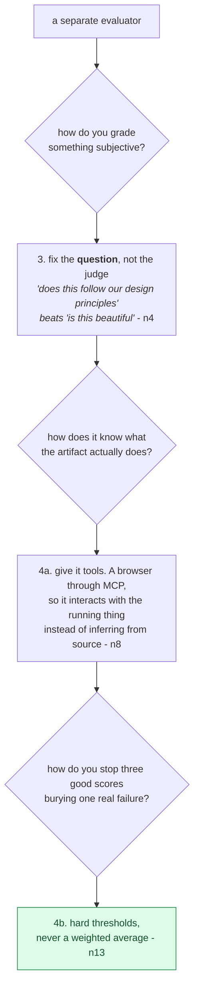

This is a derivation diagram, not a checklist, and the questions are what make the three answers feel
forced rather than chosen. **The crux is that a second agent is worthless by default, and each of
these three moves closes one specific way an evaluator returns confident noise.** It is drawn as
question-and-answer because the article presents the three as separate techniques and the ordering is
not arbitrary: a fixed question is useless if the grader cannot perceive the artifact, and perception
is useless if the aggregation rule hides what it found. The last box is the one most often skipped in
practice, since averaging feels fairer and is precisely what lets a specific failure disappear.

*Synthesized from `n4`, `n8` and `n13`.*

### 3. Make subjectivity gradable by fixing the question, not the judge

This is the technique most worth taking from the article, and it inverts the instinct. Faced with an
evaluator that grades inconsistently on aesthetics, the reflex is to go looking for a better judge.
The article's answer is to **ask a better question** instead (`n4`, S4 §2-3), and this is one of the
five nodes with a real second leg, the article's own criteria table stating four named criteria with
definitions.

To see why the question matters more than the judge, consider what each one gives the evaluator to
work with. "Is this design beautiful?" gives it nothing to be consistent *about*, so two runs over
the same artifact can disagree and neither of them is wrong. "Does this follow our design
principles?" supplies concrete criteria, and the judgement becomes checkable against something that
exists outside the run. In other words, **the move is to relocate the subjectivity** rather than
remove it. Somebody still chose those design principles, but the choosing has moved from
*per-grading*, where it is noise varying run to run, to *once, up front*, where it is a decision you
can inspect, argue about and version. **Rubrics beat taste** because a rubric is a subjectivity you
only pay for once.

The same comparison, compressed:

| The question | What happens |
|---|---|
| *"Is this design beautiful?"* | Grades inconsistently. There is nothing to be consistent *about* |
| *"Does this follow our design principles?"* | Supplies concrete criteria. The judgement becomes checkable |

> This generalises past aesthetics and this brain records the same move elsewhere. S6 decomposes
> "good memory" into three separately-gradable objectives, each with its own failure mode, rather
> than hunting for a better memory metric. **When a quality is hard to grade, the productive question
> is almost never "which judge?" and almost always "which question?"**

Two practical details hang off that. The first is that the evaluator needs tools in order to perceive
what it grades. Given a browser through Playwright MCP it navigated, screenshotted and *interacted
with the live page* before scoring, rather than reading source code and inferring what that code
would do (`n8`, S4 §3-4a). ⚠️ `single-leg`. **A judge that cannot observe the artifact is grading a
proxy for it.** The second is that prompt wording steers aesthetics more than expected, and a phrase
like "museum quality" pulled an entire run toward one look (`n9`, S4 §3). ⚠️ `single-leg`. That is
worth knowing because it means your rubric's *vocabulary* is itself a design input rather than a
neutral description of what you wanted.

You now have a well-posed question and an evaluator that can see. That still leaves whether the
evaluator is any good at the job.

### 4. The grader is not free, and you will build it twice

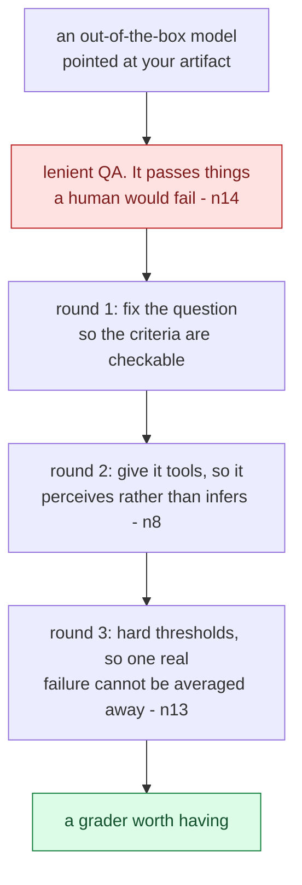

This is a cost diagram disguised as a pipeline, and the section title is the point. **The crux is that
the evaluator is a build rather than a configuration, and budgeting a harness as generator-plus-a-
prompt underestimates it by the entire cost of tuning the grader.** It is drawn as sequential rounds
because they genuinely are sequential in the source, and because each round is only diagnosable once
the previous one is fixed: you cannot tell whether a grader lacks perception while its question is
still unanswerable. The red box is the default state, and it is worse than no grader, because a lenient
QA pass produces documented confidence in a broken artifact.

*Synthesized from `n8`, `n13` and `n14`.*

> **Out-of-the-box Claude is a poor QA engineer.** It took several tuning rounds, driven by reading
> logs, to make the evaluator catch subtle bugs, probe edge cases, and stop being **lenient toward
> AI-generated output** (`n14`, S4 §4a). `corroborated (table)` - the article's QA examples table
> gives three worked sprint failures with root causes.

Three things in that sentence fail differently and are worth separating. First, "several tuning
rounds" means the evaluator is a component you develop rather than a prompt you write, so it needs a
budget of its own. Second, "driven by reading logs" means the development loop is a human reading
traces, which is honest, and which also makes the answer to "who grades the grader?" be *you*, at
least at first. Finally, "lenient toward AI-generated output" is the most interesting of the three,
because it is a bias in the *judge* that mirrors the bias in the generator. Section 2's fix does not
fully escape it when both agents share a prior about what good AI output looks like. In other words,
**the architecture reduces the bias and does not eliminate it.**

Two design rules follow, and the second is the sharper. The first is **sprint contract negotiation**,
where the generator and the evaluator agree what "done" means *before* any code is written (`n12`,
S4 §4a), which is the bridge from a product-language spec to something testable. The second is **hard
thresholds rather than weighted averages**, so that any criterion below its bar fails the whole sprint
(`n13`, S4 §4a). **A weighted average is a device for letting a strong score hide a specific
failure**, which is precisely the thing a QA gate exists to prevent.

Now the architecture, and its bill.

## Movement C - the build, and the price it actually charges

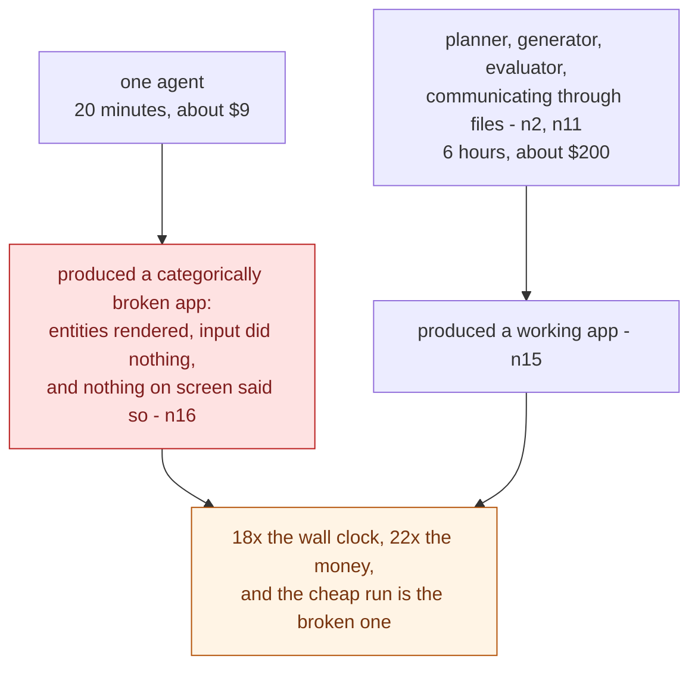

This is a cost-comparison diagram, not an architecture diagram, and the important box is the failure
mode rather than either price. **The crux is that the comparison is not expensive-versus-cheap but
working-versus-silently-broken, which is the only framing in which a 22x multiplier is a discussable
number.** It is drawn with both runs terminating in outcomes before the multiplier appears, because
quoting 18x and 22x without the broken app attached is exactly how this figure gets misused. Note what
the failure looked like: it rendered correctly and did nothing, with no error anywhere, which is the
class of defect no test the generator would think to write is going to catch.

*Synthesized from `n2`, `n11`, `n15` and `n16`.*

### 5. Planner, generator, evaluator - talking through files

The harness is three agents (`n11`, S4 §4a). ⚠️ `single-leg`, and worth noting that **the article
contains no architecture diagram**, so the structure described below is assembled from prose.

The **planner** expands a prompt of one to four sentences into roughly **16 features across 10
sprints**, and it deliberately stays at the level of deliverables rather than implementation detail.
The **generator** builds. The **evaluator** grades what the generator produced against the negotiated
contract, applying the hard thresholds from the previous section. All three **communicate through
files**, so state survives every handoff.

> **Background, supplied.** "Through files" is doing more work than it looks. File-passing means the
> handoff is **inspectable, diffable and replayable**, so you can read what the planner actually
> produced and re-run the generator against it. An in-memory handoff between agents in one process
> gives you none of that. This is the same property S2 arrives at from the other direction with
> serialise-the-thread ([`brain/claims.md`](../../brain/claims.md) claim 21), which is the principle
> that **whatever crosses the boundary between steps should be an artifact you can look at.**

That is the whole architecture, and it is unremarkable until you see what running it costs.

### 6. The honest price, and what it bought

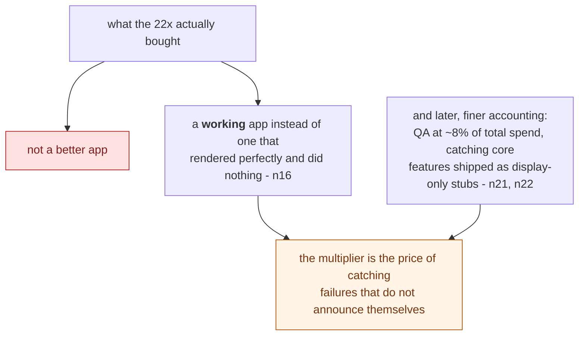

This is a value diagram, not a cost breakdown, and the rejected branch is doing the work. **The crux is
that the harness did not buy quality, it bought detection, and those are priced completely
differently.** It is drawn with an explicitly wrong answer attached because "22x for a better app" is
the reading a reader arrives with and it makes the number look absurd. Reframed as the cost of
catching a silent failure, the same figure becomes a question about your tolerance for shipping
something that looks finished and is not. The 8% QA line is the more useful number for anyone
budgeting, and it is the one nobody quotes.

*Synthesized from `n15`, `n16`, `n21` and `n22`.*

The article does something rare and reports its baseline comparison on the same prompt (`n15`,
S4 §4b). `corroborated (table)`.

Run solo, one agent finished in about 20 minutes for about $9 and produced a broken app. Run through
the full harness, the same prompt took 6 hours and about $200 and produced a working core loop. That
is roughly 18x the wall clock and 22x the money for the difference between the two results.

| | Solo agent | Full harness | Ratio |
|---|---|---|---|
| Wall clock | 20 min | 6 hr | **~18x** |
| Cost | $9 | $200 | **~22x** |
| Result | **Broken** | Working core loop | |

**Read the "broken" carefully, because the ratio is meaningless without it.** The solo run's failure
was **categorical, not cosmetic**. Entities rendered but did not respond to input, the
entity-to-runtime wiring was disconnected, and **nothing on screen indicated any of it** (`n16`,
S4 §4b). ⚠️ `single-leg` - screenshots exist and were not analysed.

That last clause carries the whole argument for a harness in a single detail. The cheap run did not
fail loudly, it produced something that **looked** finished. A 22x multiplier for "working instead of
broken" is a bargain, and a 22x multiplier for "slightly better" would be absurd, so the number you
actually need in order to decide is not the ratio at all. **It is the failure rate of the cheap
option**, which n=1 cannot give you.

⚠️ **Every figure here is a single run of a single configuration by the vendor whose models are being
measured.** The mechanism transfers, and the numbers are one observation.

## Movement D - the part almost no vendor publishes

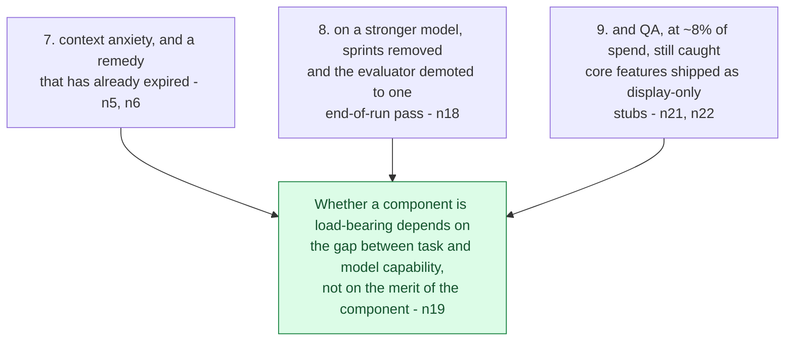

This is a conclusion diagram, not a sequence, and all three sections are evidence for one claim rather
than three findings. **The crux is that this movement is the only place in the source where a vendor
reports removing its own machinery and publishes the result, which is what makes the expiry claim
evidence rather than a slogan.** It is drawn as three inputs converging because the argument needs all
three and is weak with any two: section 7 shows a remedy expiring, section 8 shows the author acting on
it, and section 9 stops the reader concluding that the whole harness was unnecessary all along. That
last guard matters, since the easy misreading of this movement is "scaffolding was always overhead".

*Synthesized from `n5`, `n6`, `n18`, `n19`, `n21` and `n22`.*

### 7. Context anxiety, and a remedy that is already dated

A distinct failure gets named here, and the naming is the contribution (`n5`, S4 §2). ⚠️
`single-leg`.

> 💡 **Context anxiety** - a model sensing it is approaching its context limit and **prematurely
> wrapping up**: declaring done, summarising, cutting scope. **Behavioural, not capacity-driven**, and
> it fires *before* the window is actually exhausted.

That distinction changes which remedy works, and the two obvious remedies are **not** interchangeable
(`n6`, S4 §2). Compaction summarises the earlier conversation in place, which preserves continuity and
**does not remove** the behaviour. A context reset clears the window and restarts from a structured
handoff, which **does remove** it, at the cost of orchestration and a handoff artifact carrying enough
state to continue from.

| | What it does | Effect on context anxiety |
|---|---|---|
| **Compaction** | Summarises earlier conversation in place | Preserves continuity, **does not remove it** |
| **Context reset** | Clears the window, restarts from a structured handoff | **Removes it** - at the cost of orchestration and a handoff artifact carrying enough state |

**The reason compaction fails is worth holding onto.** It reduces the token *count*, but it leaves the
same agent, mid-task, aware that it has been running a long time. A reset produces an agent with **no
such awareness**, which makes the handoff artifact the load-bearing part, and that is section 5's
file-passing arriving as a necessity rather than a convenience.

> ⚠️ **Model-version-bound, and the article says so.** Sonnet 4.5 required resets; Opus 4.5 largely
> eliminated the behaviour natively (`n7`, S4 §2). **Treat this as a class of failure to watch for
> plus a technique, not as current guidance about any named model.** It is also a preview of the next
> section: a remedy that expires because the model changed.

### 8. The part almost no vendor publishes: deleting your own scaffolding

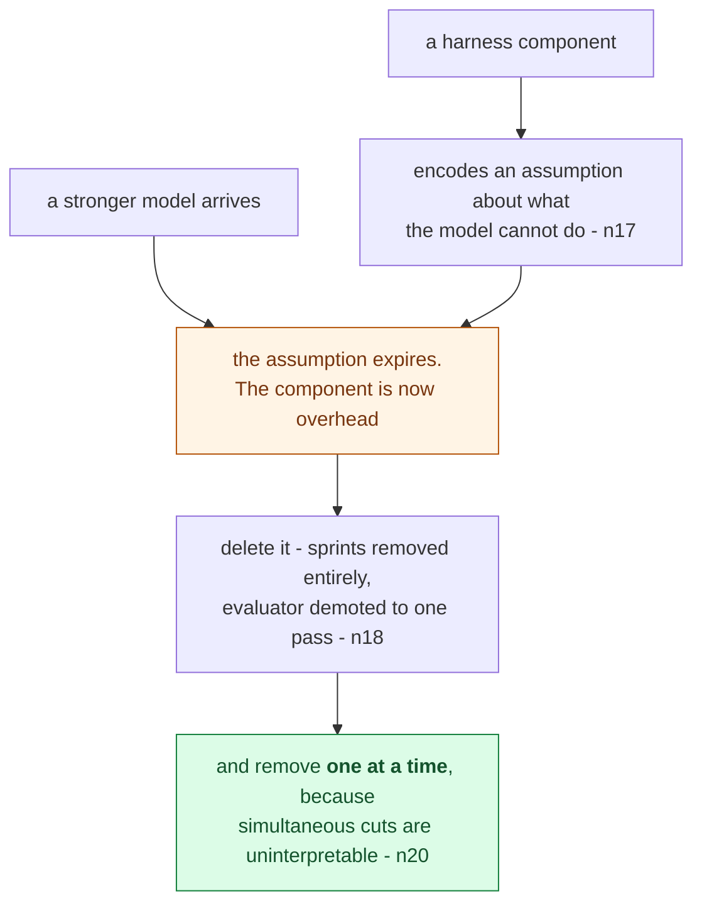

This is a lifecycle diagram, not a procedure. **The crux is that scaffolding has an expiry date set by
somebody else's release schedule, so a harness needs a deletion practice and not only a build
practice.** It is drawn with the model arriving on a separate arrow because that is the honest
dependency: nothing about your component changed, and its value changed anyway. The green box is the
methodological point and the easiest to skip under time pressure, since removing three components at
once and observing that everything still works tells you nothing about which of the three was carrying
weight.

*Synthesized from `n17`, `n18` and `n20`.*

Here the article turns on itself, and this is why it is worth reading despite its evidence problems.

On a stronger model (Opus 4.6) the author **deleted the sprint construct entirely** and demoted the
evaluator from per-sprint to a single end-of-run pass. The model then ran coherently for **2+ hours**
unscaffolded (`n18`, S4 §4c). ⚠️ `single-leg`.

The principle extracted from it is the most transferable line in the source:

> **Every harness component encodes an assumption about what the model cannot do on its own, and
> those assumptions are worth stress-testing** (`n17`, S4 §4c).

And the criterion that follows is that **whether a component is load-bearing depends on where the
task sits relative to the model's capability boundary, not on the component's merit** (`n19`,
S4 §4c). A component can be excellent and still be pure overhead, because it is solving a problem
your model stopped having.

One method finding is easy to skip here and expensive to rediscover, which is to **remove one
component at a time.** Radical simultaneous cuts failed, and methodical single-component removal
worked (`n20`, S4 §4c). Delete four things and lose quality, and you have learned nothing.

> **This is exactly the tension worth sitting with, and `nodes.md` records it deliberately.** This
> brain holds claim 24, from a 10-model preprint, that decomposition delivers **+13.1 to +41.5 pp**
> reliability on long-horizon tasks. Here decomposition is *removed* and things improve. **They do not
> contradict.** Claim 24 measures decomposition at a *fixed* capability, while `n19` says a scaffold's
> value is a function of the gap between task and capability. **Decomposition helps until the boundary
> moves past your task.** Note the evidence asymmetry though, which is a measured 10-model study
> against a vendor's n=1 report. If they ever did conflict, the study wins.

> **Background, supplied.** What this article is describing has a name in ordinary engineering.
> Scaffolding that outlives its purpose is **technical debt with the sign flipped**, not a shortcut
> you took but a structure you built for a constraint that no longer exists. The reason it is harder
> to notice than ordinary debt is that **it is still working.** Nothing fails. It just costs, and the
> only way to detect it is to remove it and measure, which is why S5's ablation is the instrument
> this article lacks.

So the scaffolding shrinks. Does the evaluator survive the cut?

### 9. What the evaluator still caught

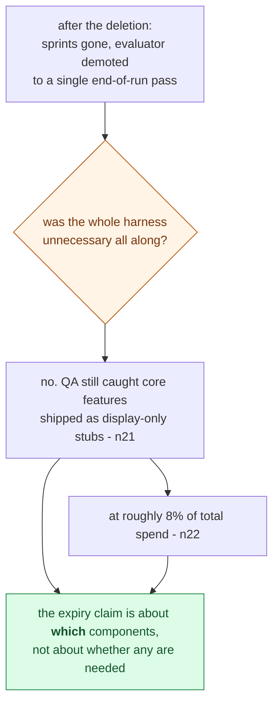

This is a guard diagram, not a result, and it exists to block a misreading rather than to add a
finding. **The crux is that deleting half a harness is evidence about that half and not about the
idea of harnesses**, and the section is here because the previous one invites exactly the wrong
generalisation. It is drawn as a question with a refusal because that is the shape of the argument:
the reader has just watched an author dismantle his own machinery, and the natural next thought is
that it was never needed. What survived the cull is the cheapest component and the one catching the
failures that look like success.

*Synthesized from `n21` and `n22`, read against `n18` and `n19`.*

It does, and the article shows its work (`n21`, `n22`, S4 §5). `corroborated (table)` - a
phase-by-phase cost and duration table.

The V2 harness run took **3 hr 50 min** and cost **$124.70** in total. The planner accounted for
4.7 min and $0.46 of that, and QA across three rounds took about 25 min and roughly $10, which puts
**QA at about 8% of total cost.** What that 8% caught was core features shipped as **display-only
stubs**, plus audio recording still stubbed in a later round. Those are genuine last-mile gaps that
the self-grading generator had missed.

**That is the concrete answer to "is the checking agent worth it".** It is not a philosophical
argument about self-evaluation bias, it is 8% of spend catching a class of failure - *the feature
that looks implemented and is not* - which is precisely the failure a demo does not reveal and a user
finds immediately.

The article is also honest about one limit, and that limit bounds the whole approach.

> **Claude cannot hear.** The DAW's musical quality could not be evaluated - the harness could verify
> that audio *ran*, not that it *sounded* good (`n23`, S4 §5). ⚠️ `single-leg`.

**The evaluator's modality is a hard ceiling on what "quality" can mean in your system.** Anything
requiring taste, hearing or physical interaction sits outside it, and no amount of rubric design
reaches past the judge's senses.

Which leaves the closing thought the article offers, and it is the right one to end on. **Improving
models move the harness problem rather than dissolving it** (`n24`, S4 §6). Better models unlock
longer and more complex tasks, which open new harness combinations. The space of useful designs
shifts; it does not shrink.

## Diagram (mental model)

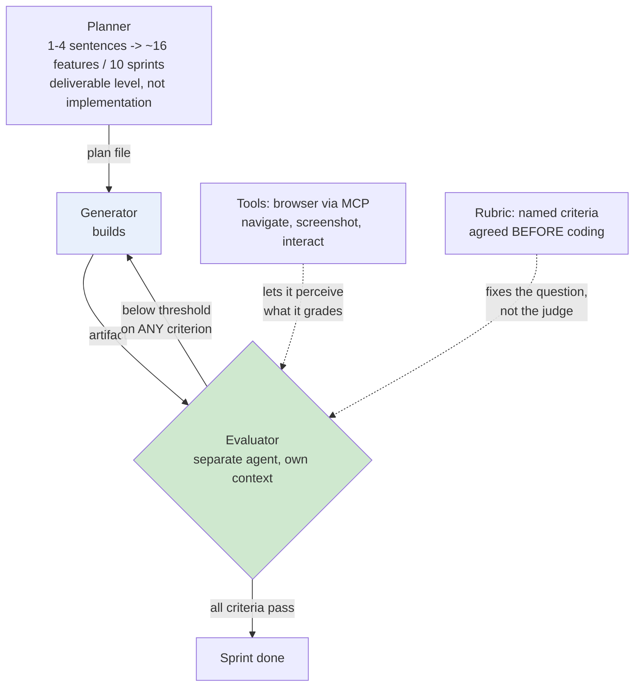

Read the solid arrows as the sprint loop and the dotted arrows as the two things that make the
evaluator competent rather than decorative. Green is the checking role and blue is the producing
role, and the point of the colouring is that these are different agents holding different context,
not two modes of one. **The crux is that the evaluator is a separate process because a producer
cannot see its own blind spots, and that it is only useful once it can perceive the artifact and has
been told what to look for.**

Three features of the shape are doing the actual work. The rejection arrow returns to the
**generator** rather than to the planner, because a failed criterion is a build problem and sending
it upstream would re-open a plan that was not wrong. Both dotted inputs enter the *evaluator* and
neither enters the generator, which is the article's whole argument drawn as topology, that quality
comes from the checking side being well equipped rather than from instructing the producer harder.
And the threshold is drawn as "below on ANY criterion" rather than as an aggregate, because a
weighted average is a mechanism for hiding one specific failure behind several strong scores (`n13`).
What the shape rules out is the tempting simplification, one agent that generates and then reviews,
which is section 2's self-evaluation bias in diagram form.

*Synthesized from `n4`, `n8`, `n11`, `n12`, `n13` - **the article contains no architecture diagram**,
so this is assembled from prose and may impose more structure than the author intended.*

## 💡 Terms

| Term | Explanation |
|---|---|
| Harness | The orchestration around a model: how work is decomposed, what state passes between steps, who checks the output, when context is cleared. Not the model and not the prompt. |
| Self-evaluation bias | An agent asked to judge its own output confidently praises it, because it grades against the same understanding that produced it. The reason a separate evaluator beats a self-critical generator. |
| Context anxiety | A model sensing it is near its context limit and prematurely wrapping up - declaring done, summarising, cutting scope - *before* the window is exhausted. Behavioural, not capacity-driven. |
| Context reset | Clearing the window and restarting from a structured handoff artifact, as opposed to **compaction** (summarising in place). Only the reset removes context anxiety; the handoff artifact becomes load-bearing. |
| Capability boundary | The frontier of what a model does reliably. A scaffold's value is **boundary-relative**, so a new model can turn essential scaffolding into pure overhead. |
| Hard threshold | A gate where any criterion below its bar fails the whole sprint, so a strong score elsewhere cannot mask a specific failure. The opposite of a weighted average. |
| Modality ceiling | The evaluator's senses bound what "quality" can mean. A model that cannot hear cannot grade audio, regardless of rubric design. |

## What to distrust in this note

- **The visual leg was skipped, and it shows.** Eight screenshots exist and were not analysed; the
  article has **no architecture diagram at all**. That makes **19 of 24 nodes `single-leg`** - prose
  asserting something with nothing else in the article checking it. This is the weakest evidence
  profile of any source in this brain.
- **`corroborated (table)` is a weaker verdict than it sounds**, and `nodes.md` says so explicitly.
  The five table-backed nodes have the article's prose agreeing with the article's own table - **one
  author agreeing with himself in two renderings.** It raises confidence in *extraction*, not in the
  number's truth.
- **T2 vendor, n=1 per configuration, measuring its own models.** 18x, 22x, 8%, 2+ hours - each is a
  single run. Nothing is externally replicated.
- **The selection effect on the headline comparison.** We see one solo run that failed categorically.
  We do not see the distribution: how often the cheap option works, which is the number you would
  actually need to decide.
- **`n7` is explicitly dated** - the context-anxiety remedy is tied to a model version the article
  itself says has moved on.
- **What makes it worth reading anyway**, and this is unusual for the class: it reports its own
  scaffolding being **deleted**, publishes a comparison where its expensive option looks absurd on
  cost, and names a limit its own product cannot cross (`n23`). A vendor post that argues against its
  own complexity is doing something the incentives do not require.
- **The "Background, supplied" blocks are mine** - the GAN analogy's limits, file-passing as
  inspectability, scaffolding as sign-flipped technical debt. Uncited by construction.

## Open questions

- **Is "context anxiety" real and general?** One source, vendor-reported, n=1, and the article says
  the behaviour largely disappeared between model versions. It could be a genuine failure class, a
  one-generation artifact, or an anthropomorphic reading of ordinary output-length effects. **No
  external evidence either way - the cleanest research target here.**
- **What is the failure rate of the cheap option?** The 18x/22x comparison is only decidable against
  how often a solo agent produces something broken. n=1 cannot answer it.
- **Who grades the grader?** The article's answer is a human reading logs across several tuning
  rounds. Nothing here describes a way to evaluate an evaluator that does not bottom out in that.
- **Does the evaluator's leniency toward AI-generated output survive the architectural split?** Both
  agents are the same model family, plausibly sharing a prior about what good AI output looks like.
  The article notes the leniency and does not test whether separation reduces it.
- **How would you detect expired scaffolding without deleting it?** `n17` says assumptions expire and
  `n20` says remove one at a time - but removal is the only detector offered. **S5's ablation is the
  instrument this article needed and did not have.**

## Feeds these topics

- `../../brain/topics/agents.md` - scaffolding as expiring bets, the capability boundary, the
  generator/evaluator split, remove-one-at-a-time.
- `../../brain/topics/evals.md` - self-evaluation bias, making subjectivity gradable, hard
  thresholds, the grader needing tools and tuning, the modality ceiling.
- `../../brain/topics/context-engineering.md` - context anxiety, and compaction versus reset.

## Presentation narrative

*A talk track for a room deciding whether to build a harness around a coding model, derived from the
gated nodes above. It reports one vendor's numbers from single runs, so treat every figure as one
observation and the mechanisms as the transferable part. The visual leg was skipped and every node is
`single-leg` by construction.*

### Slide 1 - Telling an agent to check its own work does not work, and the reason is structural

**An agent asked to grade its own output confidently praises work a human would call obviously
mediocre [n3].** That is not a prompting weakness and it does not respond to asking harder. The
generator reviews against the same understanding that produced the work, so the flaws it could not see
while writing are exactly the flaws it cannot see while reviewing.

What makes this worth a room's attention rather than a footnote is where it leaves you. The author's
earlier attempts kept improving the prompt and kept meeting the same ceiling, which moved only once
the single agent was split into a generator and a separate evaluator [n1]. The question that reframes
is not how to make the agent more self-critical. It is where a second, independent understanding is
going to come from, because no instruction manufactures one.

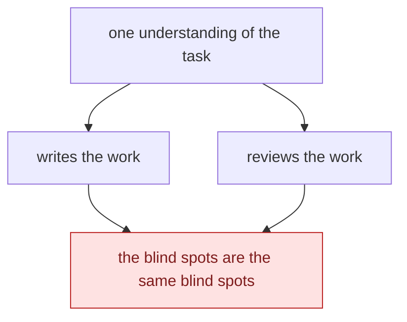

This is a causal slide, not a workflow. **The crux is the single node at the top: writing and reviewing
draw on the same understanding, so a self-check cannot surface the flaws that understanding caused.**
Asking harder does not manufacture a second perspective.

*Synthesized from `n1`, `n3`.*

### Slide 2 - The split exists to defeat a conflict of interest, not to add capability

**A planner, a generator and a separate evaluator communicating through files, each holding its own
context [n2, n11].** I want to be precise about the justification, because this is the claim most
easily inflated. The article does not argue that more agents are better, and nothing here supports a
general multi-agent position. The extra machinery buys exactly one thing, which is an independent
vantage point on the work.

The leadership significance is that this is an organisational argument rather than a technical one,
and it is the same reason you do not have an engineer sign off their own change. What engineers should
take from it is the narrowness: if a proposed second agent is not resolving a conflict of interest,
this source is not evidence for building it.

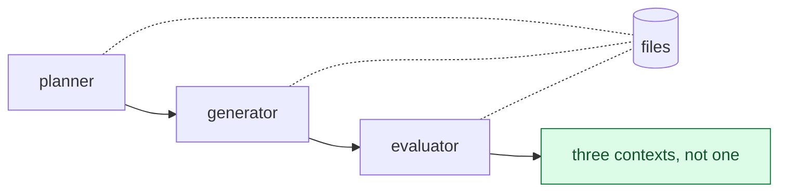

This is an independence slide, not an architecture. **The crux is that the roles communicate through
files precisely so each holds its own context**, which is the entire mechanism buying the second
vantage point. Nothing here argues that more agents are better.

*Synthesized from `n2`, `n11`.*

### Slide 3 - A second agent is worthless by default, and making it useful is three separate moves

**Most of the article's work goes into making the evaluator worth having, and each move closes a
specific way a grader returns confident noise.** Subjective quality becomes gradable by fixing the
question rather than the judge, so "does this follow our design principles?" beats "is this
beautiful?" [n4]. The evaluator is given tools, a browser through MCP, so it interacts with the running
artifact instead of reading source and inferring what it would do [n8]. And the gate is hard
thresholds rather than a weighted average, so strong scores on three criteria cannot bury a real
failure on the fourth [n13].

The ordering matters and is not arbitrary. A fixed question is useless if the grader cannot perceive
the artifact, and perception is useless if the aggregation rule hides what it found. Budget
accordingly: an out-of-the-box model pointed at your work is lenient QA and needs tuning rounds [n14],
which means the evaluator is a build rather than a configuration.

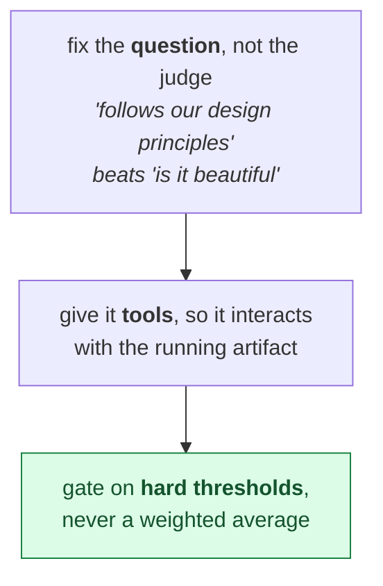

This is a build slide, not a checklist, and the order is load-bearing. **The crux is that a fixed
question is useless if the grader cannot perceive the artifact, and perception is useless if the
aggregation rule hides what it found.** An out-of-the-box grader is lenient QA [`n14`].

*Synthesized from `n4`, `n8`, `n13`.*

### Slide 4 - The harness cost 22x, and what it bought was detection rather than quality

**On the same prompt, the full harness took six hours and about $200 where the solo agent took twenty
minutes and about $9 [n15].** Quoted bare that number is indefensible, so it should never be quoted
bare. The cheap run is the one that produced the categorically broken app, and the failure is the part
to hold onto: it rendered its entities perfectly, did not respond to input at all, and showed nothing
on screen to indicate anything was wrong [n16].

Reframed, the multiplier is not the price of a better app. It is the price of catching a failure that
does not announce itself, which is a different purchase with a different justification. For anyone
budgeting, the more useful figure is from the later build, where QA ran at roughly 8% of total spend
and caught core features that had shipped as display-only stubs [n21, n22]. Nobody quotes that one,
and it is the one that makes the case.

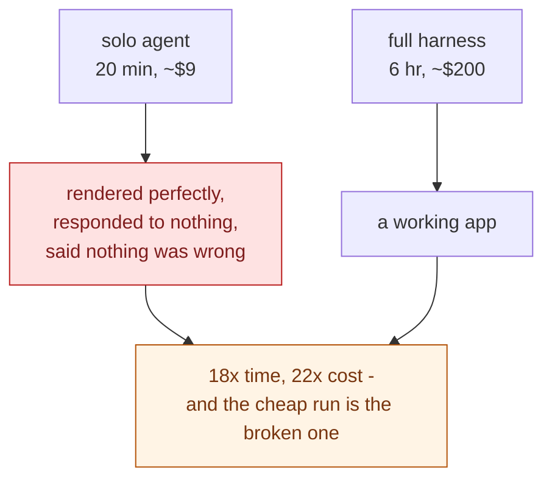

This is a cost slide, and the failure box is what makes the multiplier discussable. **The crux is that
the comparison is working-versus-silently-broken, not expensive-versus-cheap.** What the money bought
was detection, not quality, and the later build prices QA at ~8% of spend [`n22`].

*Synthesized from `n15`, `n16`, `n21`, `n22`.*

### Slide 5 - On a stronger model the author deleted half his own scaffolding and published the result

**Sprints were removed entirely, the evaluator was demoted to a single end-of-run pass, and the model
then ran coherently for over two hours [n18].** Almost no vendor write-up does this, and it is what
turns the next claim from a slogan into evidence.

That claim is the most transferable thing in the source. Every harness component encodes an assumption
about what the model cannot do, and those assumptions expire [n17]. Whether a component is load-bearing
therefore depends on the gap between the task and the model's capability, not on the merit of the
component [n19], which means a well-designed piece of scaffolding becomes pure overhead without
anything about it getting worse. The operational corollary is small and easy to skip: remove one
component at a time, because simultaneous cuts are uninterpretable [n20].

And a guard against the easy misreading, because the source supplies it. What survived the cull still
caught core features shipped as stubs. The expiry claim is about which components, not about whether
any are needed.

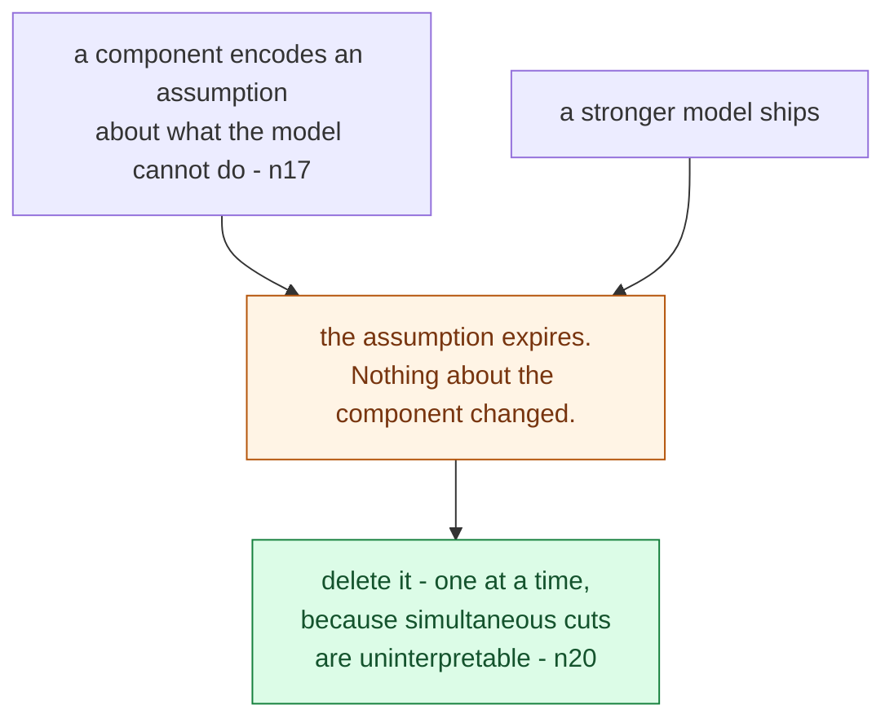

This is a lifecycle slide. **The crux is that the thing invalidating your design is a model release
rather than a bug, and it arrives on somebody else's schedule with no notification.** What survived
the cull still caught features shipped as stubs, so this is about which components, not whether any
are needed [`n21`].

*Synthesized from `n17`, `n18`, `n19`, `n20`.*

### Slide 6 - Adopt the mechanisms, treat every number as one run, and schedule the deletion review

**This is a T2 vendor source with n equals one per configuration, no external replication, and a
skipped visual leg, so every figure is a single observation by the party whose models are being
measured.** The verdict the evidence supports is adopt the mechanisms and pilot the numbers, never
cite 18x or 22x as a property of harnesses in general.

The decision that follows is unusual and it is the one worth taking away. If you build a harness, put
a recurring review on it, because the thing that invalidates your design is a model release rather
than a bug, and it arrives on somebody else's schedule with no notification. Remove one component per
review and keep the measurement after you remove it, so you find out when to put it back.

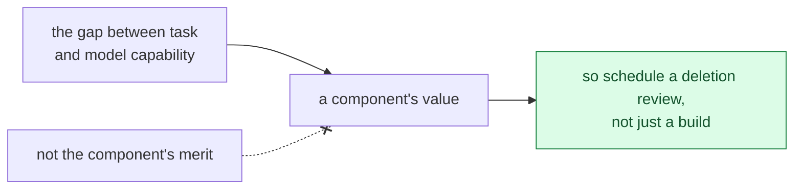

This is a decision slide. **The crux is that a component's worth is a property of the gap it closes,
so good scaffolding expires without ever becoming bad scaffolding.** Remove one per review and keep
the measurement after removal, so you find out when to put it back.

*Synthesized from `n17`, `n19`.*

### Key takeaway message

A harness is everything around the model, and the one in this article exists to defeat a conflict of
interest rather than to add capability, because an agent cannot review work it produced from the same
understanding that produced it. Making the second agent useful costs real engineering: fix the
question, give it tools, and gate on hard thresholds. The honest price was 18x the time and 22x the
money, and what it bought was catching a failure that rendered perfectly and did nothing. The durable
idea is the one the author demonstrated by dismantling his own machinery: every component encodes an
assumption that expires, so a harness needs a scheduled deletion review as much as it needs a build.
Every number here is a single run by the vendor being measured.
