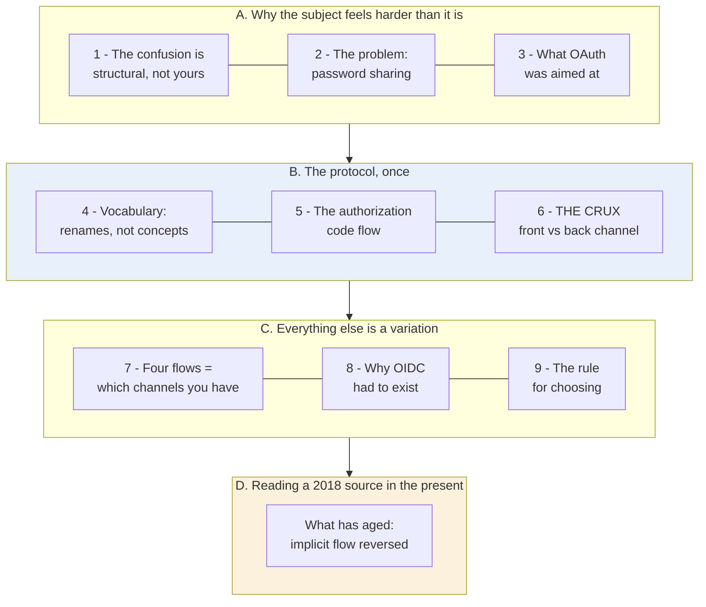
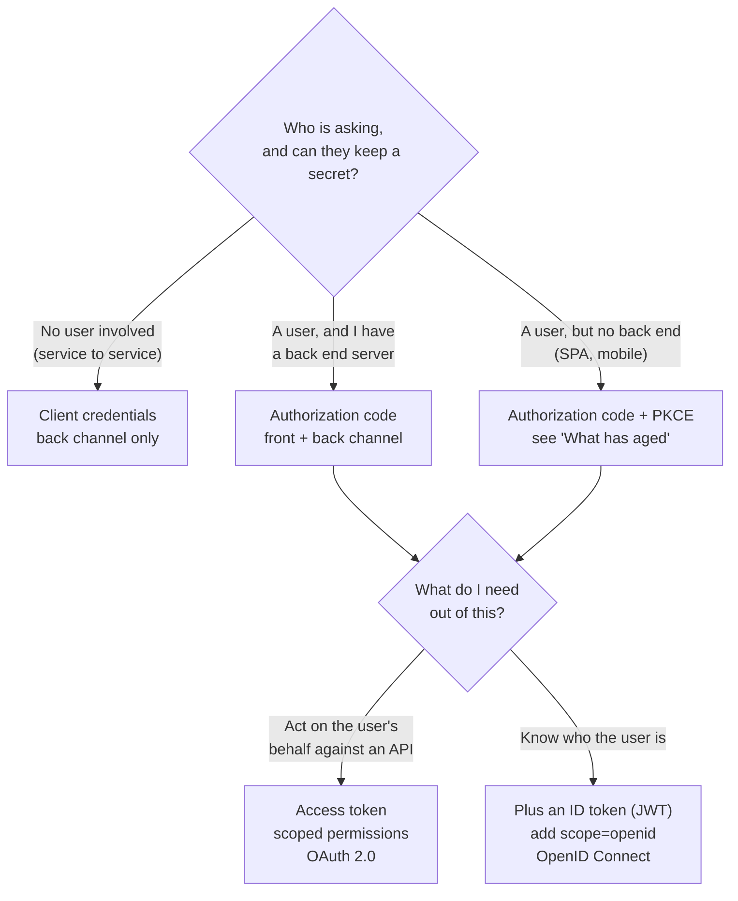

# Learning - OAuth 2.0 and OpenID Connect (in plain English)

> Persona: **curator** + **mentor, always**. Re-adopt when working this file.

> The distilled document you learn from - text anchored by a few curated visuals. Built from the
> corroborated nodes in `nodes.md`. Every claim is cited. Signal, not archive. See `SOURCE.md` for
> metadata - **including the age warning: this talk is from 2018 and one recommendation in it has
> since been reversed.** See "What has aged" before you apply anything here.

> **Two kinds of material, kept visually distinct.** Claims from the talk carry a node ID (`n5`) and
> a timestamp. Blocks marked **"Background, supplied"** are context *I* am adding - established prior
> art the talk assumes or never names. They are uncited by construction and are not evidence about
> this source.

## TL;DR

OAuth 2.0 solves exactly one problem, which is letting an app act on your behalf without giving it
your password. Everything else in it is machinery in service of that, including the jargon, the four
flows and the two-step token dance. The shape of that machinery is dictated by a single security
fact, namely that **the browser can be trusted to talk to a human, but not to hold a secret**.
OpenID Connect is a thin layer bolted on top, because the industry started using OAuth for login,
which it was never built for, and OAuth has no way to say *who you are*. Learn the authorization code
flow and you have learned the protocol
[&t=1323s](https://www.youtube.com/watch?v=996OiexHze0&t=1323s).

## The 1-minute version

This article covers a 2018 conference talk that explains OAuth 2.0 and OpenID Connect from first
principles, for engineers who have already integrated one of them and never quite felt they
understood it. It spends most of its time on a single protocol flow, in detail, and then shows that
the remaining flows and the whole of OpenID Connect are that one flow with pieces removed or a word
added. That is an unusually strong claim for an introductory talk to make, so the first thing worth
establishing is what the protocol was invented to do.

It was invented to kill password sharing. Before 2010, an application that wanted to read your
contacts asked you to type your email password into its own signup form, and enough people did it
that the pattern became normal (`n1`). The failure here is not that any particular company was
untrustworthy. A password is an all-or-nothing credential that cannot be narrowed, cannot be expired
independently, and cannot be taken back without changing it everywhere, and it sits on the account
that is the recovery path for every other account you own. That much is easy to see. What is much
less obvious is why fixing it needed a whole protocol.

The reason is that the fix has to be delivered through a channel nobody controls. What is needed
instead of a password is a narrow, expiring, independently revocable permission, and issuing one is
not the hard part. The hard part is that only the human can authorise the grant, the human is sitting
at a browser, and the browser is the one component in the system that can be observed. Anything the
browser carries ends up in the address bar, in browser history, in `Referer` headers and in server
logs. So the design has to route a human decision through an untrusted courier and still come out
holding a secret at the end.

At first glance you could avoid all of this by simply asking the app to behave. That is roughly what
the pre-OAuth world did, and it collapses in three ways at once. The app has to store your password
to keep using it, so a later breach of the app is a breach of your email. Nothing in the arrangement
can express "only my contacts", because a password grants whatever the identity grants. And there is
no way to withdraw one app's access without withdrawing everything, since there is nothing to
withdraw other than the password itself. Each of those failures points at the same missing thing,
which is a credential that is not the identity.

That credential is the access token, and the idea around it is delegated authorization. The client
names the permissions it wants as **scopes**, the authorization server **generates the consent screen
from that request** rather than hand-writing it, and the token it eventually issues is bound to
exactly the scopes the human approved and nothing more (`n7`). The human therefore approves an
enumerated list rather than a vague connection, and the app ends up holding something narrower than
you.

How that token reaches the app is where the browser problem gets answered. The design splits the
world into a **front channel**, which is the browser and is treated as permanently observable, and a
**back channel**, which is one server calling another over TLS (`n6`). The browser does the thing
only a browser can do, which is talk to the human, and the server does the thing only a server can
do, which is hold a secret. The joint between them is the authorization code, and the code is
**deliberately useless on its own**. It crosses the browser in the open precisely because redeeming
it requires a `client_secret` that never leaves the back channel (`n5`). Once you have that, the
other three grant types stop being four philosophies and become four answers to one question, which
is which channels this particular client actually has (`n8`).

What the design costs is paid in the cases where a client does not have both channels, and in what
OAuth deliberately never covered. OAuth reasons about permissions and has **no standard way to say
who the user is**, so when the industry started using it for login anyway, every provider bolted on
its own proprietary user-info mechanism and interoperability quietly disappeared (`n12`). OpenID
Connect closes that gap, and the striking part is how little it costs on the wire, which is one extra
scope in the request and an ID token in the response (`n14`). The cost that lands hardest, though, is
the one this note has to warn about rather than teach.

How far to trust it splits along a line worth naming. The mechanics in this talk are current, and it
remains the clearest explanation of them available, so the flow diagrams, the scopes, the JWT
structure and the grant types can be taken at face value. **One recommendation has been reversed**,
which is the implicit flow for single-page apps, and "What has aged" below is where that is worked
through. Beyond that, note the asymmetry running through the whole source, which is that **the
mechanics corroborate easily and travel poorly, while the judgement corroborates poorly and travels
well.**

The same argument, compressed for reference rather than for reading:

| | |
|---|---|
| **The problem** | To let an app act on your behalf you handed it **your password** - an all-or-nothing, non-scopable, non-revocable credential on the account that is the recovery path for every other account you own (`n1`). |
| **Why the obvious answer fails** | You cannot fix it by trusting the app more. A password is **ambient authority**; what is needed is a **capability** - narrow, expiring, revocable independently of the identity. |
| **The idea** | **Delegated authorization**: a token bound to named permissions (**scopes**), issued after the human approves a consent screen **generated from the request** (`n7`). |
| **The crux** | **The browser can talk to a human but cannot hold a secret.** That single fact dictates the whole shape: the **front channel** carries the human interaction, the **back channel** carries anything secret (`n6`). |
| **How it works** | The authorization code is **deliberately useless** - it crosses the browser in the open precisely because redeeming it needs a `client_secret` that never does (`n5`). Learn that one flow and the other three are it with a channel removed (`n8`). |
| **Where OIDC fits** | OAuth has **no standard way to say who the user is**, so the industry bolted on proprietary login and broke interoperability. OIDC closes that gap and costs **one extra scope** on the wire (`n12`, `n14`). |
| **How far to trust it** | Mechanics are current and unusually clear. **One recommendation has been reversed** - implicit flow for SPAs; see "What has aged". And note the asymmetry: **the mechanics corroborate easily and travel poorly; the judgement corroborates poorly and travels well.** |

## Key claims

- **The original sin OAuth kills: password sharing.** Pre-2010, "let this app see my contacts" meant
  typing your Gmail password into a startup's signup form. `n1` [&t=648s](https://www.youtube.com/watch?v=996OiexHze0&t=648s)
- **OAuth was built for delegated authorization, not login.** That is the whole origin story, and
  every later confusion traces back to it. `n2` [&t=539s](https://www.youtube.com/watch?v=996OiexHze0&t=539s)
- **The terminology is renames of ordinary things.** Resource owner = you. Client = the app.
  `n3` [&t=973s](https://www.youtube.com/watch?v=996OiexHze0&t=973s)
- **The two-step code exchange exists because of the front channel.** The code crosses the browser
  in the open; it is useless without the `client_secret`, which never does. `n5` [&t=1937s](https://www.youtube.com/watch?v=996OiexHze0&t=1937s)
- **The four grant types differ only in which channels they use.** `n8` [&t=2597s](https://www.youtube.com/watch?v=996OiexHze0&t=2597s)
- **OpenID Connect is a ~5-10% layer on OAuth, not a successor.** It replaces *misusing* OAuth for
  authentication, nothing else. `n13`, `n16` [&t=2979s](https://www.youtube.com/watch?v=996OiexHze0&t=2979s)
- **On the wire, OIDC is one extra scope.** Ask for `openid` and you get an ID token back. `n14`
  [&t=3072s](https://www.youtube.com/watch?v=996OiexHze0&t=3072s)
- **You are not stupid for finding this confusing.** The spec has genuine wiggle room, and half the
  material online describes a misuse. `n20` [&t=385s](https://www.youtube.com/watch?v=996OiexHze0&t=385s)

## What you will learn, and in what order

The diagram runs top to bottom in the order of the argument, and every box is a numbered section
below, gathered into four movements. Blue marks the protocol itself, and amber marks the age check
that a 2018 source needs before any of it is applied. **The crux is that there is only one flow, and
the other three are it with a channel removed.**

Movement A does no protocol work at all, and that is deliberate. The usual failure with OAuth is not
difficulty but demoralisation, because people conclude they are slow when they have in fact been
reading material that contradicts itself. If you already believe the confusion is structural rather
than yours, you can move straight to movement B, and it will cost you nothing but the diagnosis.

Movement B is the payload and the one place to slow down. It teaches the vocabulary, then the
authorization code flow in full, then the front-channel-versus-back-channel distinction that makes
the flow's odd two-step shape inevitable rather than bureaucratic. Section 6 in particular is the
load-bearing idea, because it is the one that turns every subsequent design choice into something you
can derive instead of memorise. Skimming it will still leave you able to implement the flow, and it
will leave you unable to work out why any of the other flows are shaped the way they are.

Movement C then costs almost nothing, which is the point of having spent so long on B. Each item in
it is a deletion from the flow you have already learned rather than new material, so the four grant
types, the reason OpenID Connect had to exist, and the rule for choosing between them all follow from
one picture. Movement D is separated out rather than folded into the walkthrough for a single reason,
which is that this source is eight years old and a reader who stops early must still not miss the
recommendation the field has since reversed.

*Synthesized roadmap of this note - not from the source.*

## 1. The confusion is structural, and it is not your fault

Start here, because most people arrive at OAuth already convinced they are missing something obvious.

They are not. The protocols are hard to learn **for a structural reason**. The spec has genuine
"wiggle room", so the same question has several confidently contradictory answers online. Worse,
**half the material describes OAuth being used for authorization and half describes it being used for
authentication, and almost none of it says which** (`n20`, [&t=385s](https://www.youtube.com/watch?v=996OiexHze0&t=385s)).
⚠️ `single-leg` - narrated, no slide.

That is not a footnote, it is the diagnosis. To see why it matters, consider what re-reading actually
buys you here. If two tutorials disagree because they are quietly solving different problems, then
reading either of them more carefully cannot resolve the disagreement, and the harder you try the
more convinced you become that the gap is in you. **The way out is to learn what OAuth was actually
built for, and to treat everything else as a deviation from that**, which is what the rest of this
note does and why section 8 exists at all.

So the question to answer first is what it was built for.

## 2. The problem, in one screenshot

In 2006, an app that wanted your contacts asked for your **password**. Here is what Yelp shipped.

- What it teaches: the entire reason OAuth exists. Note the parenthetical - *"The password you use to
  log into your Gmail email"* - clarifying **which** password they wanted, as though the problem were
  ambiguity. `n1` [&t=664s](https://www.youtube.com/watch?v=996OiexHze0&t=664s)
- Corroborated by: *"we'll log into your Gmail account for you ... we'll throw away your password. We
  promise we won't do anything evil with it."*

At first glance the problem looks like trust, and the promise on that form is trying to answer it.
The real failure is not that Yelp was untrustworthy. It is that **a password is an all-or-nothing,
non-revocable, non-scopable credential**. Handing it over grants read, write, delete and
password-reset on the account that is the recovery path for every *other* account you own, forever,
and to anyone who later breaches Yelp. There is no way to say "only contacts". There is no way to say
"only once". And there is no way to take it back short of changing the password everywhere.

> 💡 **Delegated authorization** - granting a *third party* a *subset* of your permissions on a
> *fourth party's* system, without sharing your credentials. The four-party shape is what makes it
> hard enough to need a protocol.

> **Background, supplied - the security-literature name for this.** A password is **ambient
> authority**: possessing it grants everything the identity can do, everywhere, with no way to
> attenuate it. The alternative is a **capability** - an unforgeable token that carries a *specific,
> narrow* permission and can be handed out, expired and revoked independently of the identity. That
> distinction goes back to capability-based security in the 1960s, and it is the whole conceptual
> move OAuth makes. **Everything below is machinery for minting and delivering a capability**, which
> is why the design cares so intensely about who can see the token in transit.

And lest this feel historical, Nate's aside is that **banks still do it this way.** Every
account-aggregation app you have used asked for your actual banking password, because the sector had
not adopted OAuth [&t=765s](https://www.youtube.com/watch?v=996OiexHze0&t=765s).

The pattern was obviously bad at the time. So why did a protocol take until 2010, and what did it
deliberately *not* try to fix?

## 3. What OAuth was aimed at, and what it left open

- What it teaches: OAuth did not arrive into a vacuum. Simple login and SSO were solved problems
  (forms and cookies; SAML). Two items were open, marked `(???)` on the slide: **mobile app login**
  and **delegated authorization**. OAuth was aimed at the second one only. `n2`
  [&t=453s](https://www.youtube.com/watch?v=996OiexHze0&t=453s)

**Hold onto that `(???)` next to "mobile app login".** It is unresolved on this slide, the industry
later decided to solve it with OAuth anyway, and that decision is what section 8 is about. Almost
every confusion in section 1 descends from this one slide having two question marks and the industry
answering both with the same tool.

For now, take the narrow reading, which is that OAuth is a delegated-authorization protocol and says
nothing about who you are. That narrow reading is what the next section starts from, and it is also
where most people stop before they have met any of the ideas.

## 4. The vocabulary is renames, and that is the whole barrier

- What it teaches: seven terms that are **renames of things you already understand**. `n3`
  [&t=990s](https://www.youtube.com/watch?v=996OiexHze0&t=990s)

Work through them once and the intimidation drains out. The *resource owner* is you, the human who
can click Yes. The *client* is the app that wants the data, which in section 2 was Yelp. The
*authorization server* is wherever you log in and consent, such as `accounts.google.com`, and the
*resource server* is the API that actually holds the data, which is often but not always a separate
system. An *authorization grant* is proof that you clicked Yes, the *redirect URI* is where the
browser gets sent back to afterwards, and the *access token* is the key the app wanted all along.

| OAuth says | It means |
|---|---|
| Resource owner | **You.** The human who can click Yes. |
| Client | **The app** that wants the data (Yelp). |
| Authorization server | **Where you log in and consent** (`accounts.google.com`). |
| Resource server | **The API holding the data** (the Contacts API). Often, but not always, separate. |
| Authorization grant | **Proof that you clicked Yes.** |
| Redirect URI | **Where to send the browser back to** afterwards. |
| Access token | **The key the app actually wanted.** |

The single most useful reframe in that list is that *resource owner* means *you*. Most of the
intimidation is vocabulary rather than concept, which matters practically rather than
psychologically, because it means the diagram in the next section becomes readable the moment the
labels stop throwing you.

## 5. The authorization code flow, which is the entire protocol

- What it teaches: the complete round trip, and the channel annotations that explain its shape.
  `n4`, `n6` [&t=1323s](https://www.youtube.com/watch?v=996OiexHze0&t=1323s)
- Corroborated by: *"this whole flow here, this is the whole thing. The entire rest of this talk we're
  basically just going to be talking about slight variations."*

Take that quote literally. **This is the only flow you need to learn.** Everything in section 7 is
this picture with something taken away.

> **Background, supplied - what "redirect" actually means here**, because it is doing more work than
> it looks. Each arrow crossing the browser is an ordinary HTTP redirect: the server answers with a
> `302` and a `Location` URL, and the browser obediently makes the next request, carrying whatever is
> in that URL's query string. **Nobody is transmitting anything to anybody - the user's browser is
> the courier**, which is precisely why what rides in those parameters matters so much, and why the
> exchange in section 6 has to happen somewhere else entirely.

Scopes ride along in that first redirect, and they do three jobs rather than one. They are the
request the client makes. They become the consent text the human reads. And they are the boundary of
the capability that the resulting token carries.

- What it teaches: the client enumerates scopes up front; the authorization server **generates the
  consent screen from them**; the issued token is bound to exactly those scopes and nothing more.
  `n7` [&t=1549s](https://www.youtube.com/watch?v=996OiexHze0&t=1549s)

> 💡 **Scope** - a named permission (`contacts.read`) that the client asks for, the user sees in plain
> language, and the token is limited to. It is what turns "access my account" into "read my contacts".

Notice how much that second screenshot is doing. **The consent screen is generated from the request**
rather than hand-written by the provider, so the human approves a specific enumerated list instead of
a vague connection. In other words, this is the capability from section 2 becoming visible to the
person granting it, and it is the reason scope design is a user-experience decision as much as a
security one.

So the flow works. Look at it once more, though, and one thing should nag. Why does the app receive a
*code* and then immediately have to trade it for a token, rather than simply being sent the token?

## 6. The crux: front channel versus back channel

This is the idea that makes everything else inevitable, and it is not OAuth terminology at all. It is
network security terminology that the talk borrows
[&t=1634s](https://www.youtube.com/watch?v=996OiexHze0&t=1634s).

The **front channel** is the browser, and the assumption to make about it is that anything you put
there can be read. Query parameters are visible in the address bar, a malicious extension can log
requests, and somebody can read over your shoulder. As the talk puts it, *"we can trust the browser,
but we only trust it as far as we can throw it."*
[&t=1725s](https://www.youtube.com/watch?v=996OiexHze0&t=1725s) The **back channel**, by contrast, is
your server calling another server over TLS, where nobody in between sees anything. The distinction
sounds like a matter of degree, and it is not.

> **Background, supplied - the leak is worse than "someone might look".** A value in a URL query
> string does not merely appear on screen. It is written to **browser history**, sent to third parties
> in the **`Referer` header** when the page loads external resources, and captured in **server access
> logs** and any proxy in between - often retained for months by systems nobody thinks of as
> security-sensitive. That is why "it was only in the URL briefly" is not a defence, and why the
> design treats the front channel as *permanently* compromised rather than *observable in the moment*.

With that established, the two-step dance stops looking like bureaucracy and starts looking like the
only available answer.

- What it teaches: the exchange is a **`POST` carrying `client_secret`** - which is exactly why it
  cannot happen in the browser. `n5` [&t=1937s](https://www.youtube.com/watch?v=996OiexHze0&t=1937s)
- Corroborated by: *"even if someone stole the authorization code, they wouldn't be able to make that
  exchange request ... because they don't have that secret key."*

**The design in one line is that the authorization code is deliberately a useless token.** It travels
the insecure channel precisely *because* stealing it achieves nothing, since redeeming it requires a
secret that only ever exists on the back channel. The protocol therefore splits the job so that each
channel does what it is good at. The browser talks to the human, handling login and consent, which a
server cannot do. The server handles secrets, which a browser cannot be trusted with `n6`
[&t=1989s](https://www.youtube.com/watch?v=996OiexHze0&t=1989s).

> **This is a stronger pattern than "encrypt the channel", and worth stealing wholesale.** The design
> assumes the untrusted leg *is* compromised and arranges for that not to matter, rather than trying
> to make it trustworthy. Any time you must route something sensitive through a channel you do not
> control, ask what you could send instead that is worthless on its own.

> **Background, supplied - and it is the asymmetry the whole scheme rests on.** The access token that
> comes back is a **bearer token**: possession alone is sufficient to use it, with nothing binding it
> to the holder's identity. That is why token leakage is catastrophic in a way code leakage is not,
> why tokens are short-lived, and why every design decision above is about keeping the bearer token
> off the front channel while accepting that the code goes there freely.

Every remaining flow is this same picture with one or both channels removed, which is what makes the
next section short.

## 7. The four flows are one question: which channels do you have?

- What it teaches: the four grant types are not four philosophies. They are **four answers to "which
  channels do you have?"** `n8` [&t=2597s](https://www.youtube.com/watch?v=996OiexHze0&t=2597s)

Walk the four cases in that order and none of them needs memorising. First, the client you have
already met. A server-side web app has both channels available, so it uses the authorization code
flow of section 5 and gets the full guarantee, which is why it is the default. Second, suppose the
client has no back end at all, as a single-page app does not. It has only the front channel, so there
is nowhere for a `client_secret` to live and nothing to redeem a code with, which is what the
implicit flow exists for.

- What it teaches: with no back channel, `response_type=token` hands the access token straight to the
  browser and skips the exchange entirely. `n9` [&t=2530s](https://www.youtube.com/watch?v=996OiexHze0&t=2530s)

Third, suppose the reverse, a client that has a server but no human at all. Machine-to-machine
integrations use the client credentials flow, which drops the front channel entirely because there is
nobody to consent to anything (`n10`, ⚠️ `single-leg` - narrated without a supporting slide).
Finally, the resource owner password flow also uses only the back channel, and the talk presents it
purely as a legacy migration path that it did not recommend even in 2018.

| Flow | Channels | When |
|---|---|---|
| Authorization code | front + back | You have a server. **The default.** |
| Implicit | front only | No back end at all (see "What has aged") |
| Resource owner password | back only | Legacy migration; not recommended even in 2018 |
| Client credentials | back only | **Machine to machine** - no user involved. `n10` ⚠️ `single-leg` |

Now read the implicit flow back against section 6 and you can price it without being told the price.
**The implicit flow puts a bearer token into the front channel**, which means browser history,
`Referer` headers and server logs, and that is the one place the previous section spent ten minutes
explaining you cannot trust. In 2018 that was an accepted trade, because single-page apps genuinely
had no alternative. **It is no longer accepted, and "What has aged" below is where that lands.**

Everything so far has been about *authorization*, meaning permission to act against an API. But look
back at section 3's slide, where "mobile app login" also carried a `(???)`. The industry did not wait
for a purpose-built answer to that one.

## 8. Why OpenID Connect had to exist

OAuth became **a victim of its own success**. It was adopted so widely that people reached for it for
**login**, which it was never designed for (`n11`,
[&t=2824s](https://www.youtube.com/watch?v=996OiexHze0&t=2824s)). ⚠️ `single-leg`.

The defect that creates is concrete rather than academic, and it is worth stating on its own.

> **OAuth has no standard way to tell you who the user is.** It reasons about permissions, not
> identity (`n12`, [&t=2894s](https://www.youtube.com/watch?v=996OiexHze0&t=2894s)). ⚠️ `single-leg`.

The consequence followed directly. Every provider, meaning Google, Facebook, Twitter, LinkedIn and
Microsoft, bolted its own proprietary "get user info" mechanism on top. Each login button worked
perfectly well on its own. None of them were interchangeable. In other words, **a standard had
stopped being a standard.** This is also the direct cause of the confusion in section 1, because half
the OAuth material online describes authorization, the other half describes this authentication
misuse, and neither half announces which it is doing (`n20`).

> **The general lesson, and it is the most transferable thing in the talk.** The failure was not that
> OAuth was bad. It was that **a near-fit got adopted for a use case it did not name**, and the gap
> was then closed privately by each vendor rather than publicly by the spec. Any protocol currently
> being stretched to cover a use case it never named is running the same experiment - which is worth
> holding while reading anything about agent authorization today.

- What it teaches: OIDC sits **on** OAuth exactly as OAuth sits on HTTP - a "5-10% layer", not a
  replacement. `n13` [&t=2979s](https://www.youtube.com/watch?v=996OiexHze0&t=2979s)

If a layer really is that thin, the obvious question is what it changes on the wire. The answer is
almost nothing.

- What it teaches: put this beside the slide in section 5 and **the only difference is
  `Scope: openid profile`**. That one scope makes a request an OIDC request, and it buys you an ID
  token alongside the access token. `n14` [&t=3072s](https://www.youtube.com/watch?v=996OiexHze0&t=3072s)

That is worth pausing on, because it is the payoff for having learned one flow properly. **An entire
authentication standard costs you one extra word in a query string.** What comes back for that word
is the piece OAuth never had.

- What it teaches: the ID token is a **JWT** - header, claims, signature. The claims answer *who
  logged in* (`sub`, `name`, `iss`, `aud`, `exp`). The signature lets the app verify authenticity
  **locally, without another round trip**. `n15` [&t=3347s](https://www.youtube.com/watch?v=996OiexHze0&t=3347s)

> 💡 **JWT** ("jot") - a signed, base64url-encoded JSON envelope in three dot-separated parts. Signed,
> **not encrypted**: anyone holding it can read the claims, so never put secrets in one.

> 💡 **Access token vs ID token** - the distinction that makes the whole talk click. An **access
> token** is for a *machine*: the app presents it to an API and the API decides what it may do; the
> app is not meant to look inside it. An **ID token** is for the *app*: it says who signed in, and it
> is never sent to an API.

> **Background, supplied - why "verify locally" is possible at all.** The signature is asymmetric: the
> authorization server signs with a private key and publishes the matching public key, so any client
> can check the signature without contacting anyone. That is what removes the round trip. It also
> means **the security of an ID token rests entirely on checking it properly** - verifying the
> signature, the issuer, the audience and the expiry. A JWT accepted without those checks is just a
> JSON blob the client believed, which is a recurring source of real vulnerabilities.

## 9. The rule for choosing

Having both tools on the table raises the question the talk closes on, which is when to reach for
which.

- What it teaches: the decision rule, and the correction of a common misreading - **OIDC being newer
  does not make it a replacement.** They are different tools for different jobs; the only thing OIDC
  replaces is *misusing* OAuth for authentication. `n16` [&t=3416s](https://www.youtube.com/watch?v=996OiexHze0&t=3416s)

The case that most obviously needs the rule is the one section 3 left with a question mark.

- What it teaches: for native mobile, the answer is **OIDC authorization code flow + PKCE**. `n18`
  [&t=3562s](https://www.youtube.com/watch?v=996OiexHze0&t=3562s)

> 💡 **PKCE** ("pixie", Proof Key for Code Exchange) - the fix for clients that cannot hold a
> `client_secret`. The client invents a random secret per request, sends only its hash up front, and
> reveals the original at exchange time. It restores the guarantee of section 6 - a stolen code is
> useless - **without needing a back channel**. Hold this term; it is the hinge of the next section.

One durable architectural argument arrives at the very end, and it is easy to miss there. Delegating
login **decouples the authentication system from the application**, so that each can be maintained
and evolve separately (`n19`, [&t=3527s](https://www.youtube.com/watch?v=996OiexHze0&t=3527s))
⚠️ `single-leg`. That is the reason to adopt these protocols even when you *could* write the login
form yourself, and it is the same separation-of-concerns argument that shows up whenever an identity
provider is worth its integration cost.

Which leaves one thing. You now understand the protocol as the talk teaches it, and the talk is eight
years old.

## What has aged (read before applying)

This talk is from **February 2018**. The mechanics above are unchanged, and it remains the clearest
explanation of them available. **One recommendation has been reversed by the field**, and it happens
to be the one a web developer would reach for first.

| The talk says | Status | What to do |
|---|---|---|
| Authorization code flow for server-rendered web apps | Still correct | Use it. |
| Code flow **plus PKCE** for native mobile | Still correct, now universal | Use it. |
| **Implicit flow for single-page apps** (`n17`) | **Superseded** | **Do not use.** Use authorization code + PKCE. |
| Resource owner password flow for legacy | Deprecated harder since | Avoid entirely. |
| Client credentials for machine-to-machine | Still correct | Use it. |

The useful part is that **you can derive the reason from section 6 without any outside information**.
The implicit flow puts the access token directly into the browser's URL, and that is the one place
the talk spends ten minutes explaining you cannot trust. In 2018 that was an accepted trade because
single-page apps had no alternative, so the recommendation was correct against the options that
existed. Then **PKCE removed the trade**, by giving secret-less clients a way to prove they started
the flow they are finishing. The talk already teaches PKCE, for mobile (`n18`), and the field simply
extended the same fix to browser apps.

> **This is the real skill the section teaches, and it generalises past OAuth: when a source ages, the
> mechanics usually survive and the recommendations usually do not.** Mechanics describe how something
> works; recommendations encode a trade-off against the alternatives available *at the time*. New
> alternatives change the recommendation while leaving the mechanics untouched. When reading anything
> more than a few years old, separate the two and re-check only the second.

> ⚠️ **Provenance: this table is commentary, not sourced evidence.** The "superseded" verdicts are
> the agent's background knowledge - not from this source, and not externally verified here
> (`AGENTS.md`: unverified statements are commentary, not fact). The direction is reliable; treat
> specific document names, dates and wording as unconfirmed. **A future OAuth 2.1 source will settle
> it** - that is the intended resolution path, not a research pass.

## Diagram (mental model)

Read it top to bottom as two decisions, one about your *client* and one about your *goal*. The first
fork is not about your framework or your language, and that is the thing to notice. It is about which
channels you have, in the section 6 sense. The second fork is the authorization-versus-authentication
question that section 9 answers. **The crux is that you never choose between OAuth and OpenID Connect
- you choose a flow based on whether your client can hold a secret, then add one scope if you also
need to know who the user is.**

Most explanations are shaped differently, organising around the four grant types as a menu, and that
shape is what does the damage. A menu invites you to pick by application type, so you reason "I have
an Angular app, so ... implicit?", which is precisely the reasoning the field has since overturned.
Organising around secret-holding capability instead is more durable, because that is the actual
security property the protocol cares about, and it explains why PKCE could later absorb the
no-back-end case without anyone having to invent a new flow. Note also what this shape rules out.
There is no branch anywhere in it where you pick OIDC *instead of* OAuth, because OIDC is a suffix on
the second decision and never an alternative at the first, which is the misconception `n16` exists to
kill.

*Synthesized from `n8`, `n9`, `n13`, `n14`, `n16`, `n18`, plus the age warning above. Not a slide from
the talk.*

## 💡 Terms

| Term | Explanation |
|---|---|
| Delegated authorization | Granting a third party a subset of your permissions on a fourth party's system, without sharing your credentials. The four-party shape is what needs a protocol. |
| Ambient authority vs capability | A password is ambient authority - it grants everything, everywhere, unrevocably. A token is a capability - narrow, expiring, revocable independently of the identity. OAuth's whole move. |
| Front channel / back channel | Front = the browser, observable and logged in places you do not control. Back = server to server over TLS. The entire flow shape follows from trusting the browser with the human and never with a secret. |
| Authorization code | A deliberately useless token: it crosses the browser in the open because redeeming it requires a `client_secret` that only exists on the back channel. |
| Bearer token | A token where possession alone is sufficient to use it, with nothing binding it to the holder. Why token leakage is catastrophic and tokens are short-lived. |
| Scope | A named permission the client requests, the user sees in plain language on a generated consent screen, and the token is bound to. |
| JWT ("jot") | A signed, base64url-encoded JSON envelope in three parts. **Signed, not encrypted** - readable by anyone holding it, so never put secrets in one. Verified locally against the issuer's published public key. |
| Access token vs ID token | Access token is for a machine (presented to an API, not read by the app). ID token is for the app (says who signed in, never sent to an API). Confusing the two is the root of most OAuth/OIDC mix-ups. |
| PKCE ("pixie") | Proof Key for Code Exchange: the client invents a per-request secret, sends its hash up front, reveals the original at exchange. Restores "a stolen code is useless" without a back channel. |

## What to distrust in this note

- **It is eight years old, and that is the headline.** See "What has aged". Nothing else in this note
  matters if you skip that section and reach for the implicit flow.
- **The mechanics are corroborated; the argument is not.** This is the sharp asymmetry `nodes.md`
  records, and it is worth quoting: **the mechanics corroborate easily and travel poorly; the
  judgement corroborates poorly and travels well.** The flow diagrams, scopes, JWT structure and grant
  types all gate slide ↔ narration. The claims you will actually want to *reuse* - why OAuth drifted
  into authentication (`n11`), what it structurally lacks (`n12`), the decoupling argument (`n19`),
  and why the literature is so confusing (`n20`) - are all **`single-leg`, narrated over absent or
  decorative slides**.
- **Two legs means internally consistent, not correct.** Slide agreeing with narration proves the deck
  and the talk agree, nothing more.
- **A vendor employee explaining a standard his company sells against.** Nate Barbettini worked at
  Okta, an identity provider. The explanation is unusually clean and shows no sign of distortion, but
  the choice of what to emphasise - "delegate your login to an authorization server" - is not
  disinterested.
- **The "Background, supplied" blocks are mine, not the talk's.** Capability versus ambient authority,
  the specifics of front-channel leakage, bearer-token semantics, asymmetric JWT verification - all
  established prior art the talk assumes or never names. Uncited by construction, carrying no
  evidential weight about this source.
- **Nothing here is measured**, and nothing in it could be. This is an explanation, not a study.

## Open questions

- **What exactly replaced the implicit flow, and when?** Which document carries the current guidance,
  what does it actually say about browser apps, and is implicit discouraged or removed? Needs T1
  evidence (a spec or IETF BCP), not memory. **Deliberately left open** - to be answered by an
  OAuth 2.1 source rather than a research pass (owner's call, 2026-07-25).
- **How does any of this map onto agents?** MCP's authorization spec builds on this machinery, and an
  agent calling tools on a user's behalf **is** the delegated-authorization problem with a new actor
  in the client role. Does the four-party model still hold when the client is non-deterministic? See
  `../../brain/topics/agent-security.md`.
- **What is the consent story when the user is not present?** The whole design assumes a human at a
  browser who clicks Yes. Long-running agents break that assumption. The client credentials flow
  `n10` removes the user entirely - is that the agent answer, or does it discard exactly the
  protection that made OAuth worth having?
- **Is `single-leg` the right verdict for the argument claims?** `n11`, `n12`, `n19`, `n20` are the
  most transferable content in the talk and the least corroborated. External evidence would settle
  them cheaply.

## Feeds these topics

- `../../brain/topics/agent-security.md` - the delegated-authorization substrate: scopes as least
  privilege, consent as human-in-the-loop, channel separation, PKCE.
