# Learning - OAuth 2.0 and OpenID Connect (in plain English)

> Persona: **curator** + **mentor**. Re-adopt when working this file.

> The distilled document you learn from - text anchored by a few curated visuals. Built from the
> corroborated nodes in `nodes.md`. Every claim is cited. Signal, not archive. See `SOURCE.md` for
> metadata - **including the age warning: this talk is from 2018 and one recommendation in it has
> since been reversed.** See "What has aged" before you apply anything here.

## TL;DR

OAuth 2.0 solves exactly one problem: **letting an app act on your behalf without giving it your
password**. Everything else - the jargon, the four flows, the two-step token dance - is machinery in
service of that, and the machinery's shape is dictated by a single security fact: **the browser can
be trusted to talk to a human, but not to hold a secret.** OpenID Connect is a thin layer bolted on
top because the industry started using OAuth for login, which it was never built for, and OAuth has
no way to say *who you are*. Learn the authorization code flow and you have learned the protocol
[&t=1323s](https://www.youtube.com/watch?v=996OiexHze0&t=1323s).

## Key claims

- **The original sin OAuth kills: password sharing.** Pre-2010, "let this app see my contacts" meant
  typing your Gmail password into a startup's signup form. `n1` [&t=648s](https://www.youtube.com/watch?v=996OiexHze0&t=648s)
- **OAuth was built for delegated authorization, not login.** That is the whole origin story, and
  every later confusion traces back to it. `n2` [&t=539s](https://www.youtube.com/watch?v=996OiexHze0&t=539s)
- **The terminology is renames of ordinary things.** Resource owner = you. Client = the app.
  `n3` [&t=973s](https://www.youtube.com/watch?v=996OiexHze0&t=973s)
- **The two-step code exchange exists because of the front channel.** The code crosses the browser
  in the open; it is useless without the `client_secret`, which never does. `n5` [&t=1937s](https://www.youtube.com/watch?v=996OiexHze0&t=1937s)
- **The four grant types differ only in which channels they use.** `n8` [&t=2597s](https://www.youtube.com/watch?v=996OiexHze0&t=2597s)
- **OpenID Connect is a ~5-10% layer on OAuth, not a successor.** It replaces *misusing* OAuth for
  authentication, nothing else. `n13`, `n16` [&t=2979s](https://www.youtube.com/watch?v=996OiexHze0&t=2979s)
- **On the wire, OIDC is one extra scope.** Ask for `openid` and you get an ID token back. `n14`
  [&t=3072s](https://www.youtube.com/watch?v=996OiexHze0&t=3072s)
- **You are not stupid for finding this confusing.** The spec has genuine wiggle room, and half the
  material online describes a misuse. `n20` [&t=385s](https://www.youtube.com/watch?v=996OiexHze0&t=385s)

## Walkthrough

### 1. Start from the problem, not the protocol

In 2006 an app that wanted your contacts asked for your **password**. Yelp shipped this:

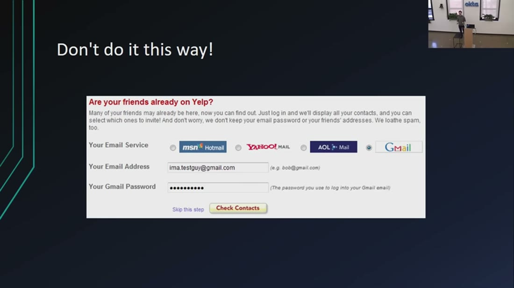

- What it teaches: the entire reason OAuth exists, in one screenshot. Note the parenthetical - *"The
  password you use to log into your Gmail email"* - clarifying which password they wanted, as though
  the problem were ambiguity. `n1` [&t=664s](https://www.youtube.com/watch?v=996OiexHze0&t=664s)
- Corroborated by: *"we'll log into your Gmail account for you ... we'll throw away your password. We
  promise we won't do anything evil with it."*

The failure is not that Yelp was untrustworthy. It is that **the password is an all-or-nothing,
non-revocable, non-scopable credential**. Handing it over grants read, write, delete and
password-reset on the account that is the recovery path for every *other* account you own, forever,
to anyone who later breaches Yelp. There is no way to say "only contacts", no way to say "only once",
and no way to take it back short of changing the password everywhere.

> 💡 **Delegated authorization** - granting a *third party* a *subset* of your permissions on a
> *fourth party's* system, without sharing your credentials. The four-party shape is what makes it
> hard and why it needed a protocol.

Nate's aside is worth keeping: **banks still do it this way.** Every account-aggregation app you have
used asked for your actual banking password, because the sector had not adopted OAuth
[&t=765s](https://www.youtube.com/watch?v=996OiexHze0&t=765s).

### 2. What the protocol replaced it with

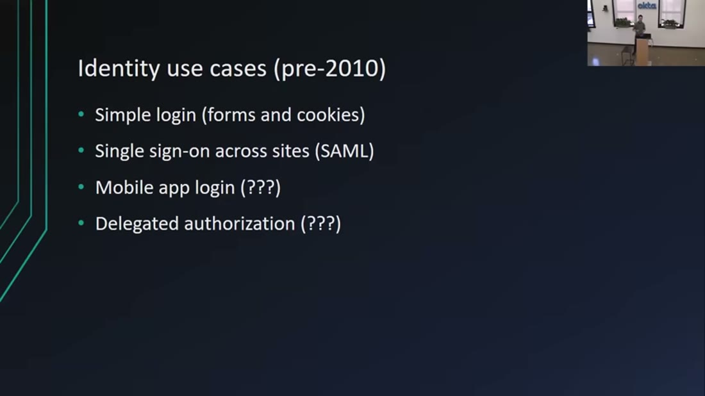

- What it teaches: OAuth did not arrive into a vacuum. Simple login and SSO were solved (forms and
  cookies; SAML). The two open items - marked `(???)` on the slide - were **mobile app login** and
  **delegated authorization**. OAuth was aimed at the second one only. `n2` [&t=453s](https://www.youtube.com/watch?v=996OiexHze0&t=453s)

Hold onto that `(???)` next to "mobile app login". It is unresolved on this slide, and the industry's
later decision to solve it with OAuth anyway is what section 7 is about.

### 3. The terminology, which is the main barrier and the smallest idea

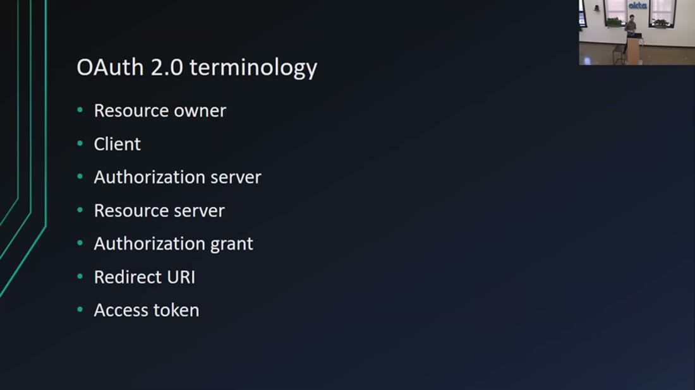

- What it teaches: seven terms that are **renames of things you already understand**. `n3`
  [&t=990s](https://www.youtube.com/watch?v=996OiexHze0&t=990s)

| OAuth says | It means |
|---|---|
| Resource owner | **You.** The human who can click Yes. |
| Client | **The app** that wants the data (Yelp). |
| Authorization server | **Where you log in and consent** (`accounts.google.com`). |
| Resource server | **The API holding the data** (the Contacts API). Often, but not always, separate. |
| Authorization grant | **Proof that you clicked Yes.** |
| Redirect URI | **Where to send the browser back to** afterwards. |
| Access token | **The key the app actually wanted.** |

The single most useful reframe: *resource owner* means *you*. Most of the intimidation is vocabulary,
not concept.

### 4. The authorization code flow - learn this one thing

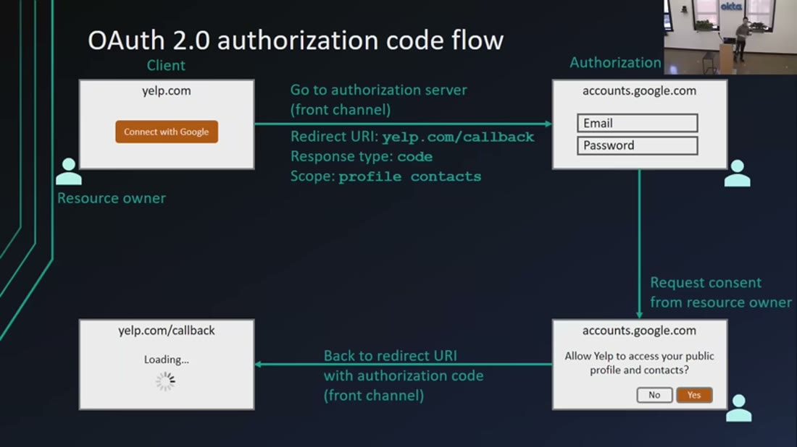

- What it teaches: the complete round trip, and the channel annotations that explain its shape.
  `n4`, `n6` [&t=1323s](https://www.youtube.com/watch?v=996OiexHze0&t=1323s)
- Corroborated by: *"this whole flow here, this is the whole thing. The entire rest of this talk we're
  basically just going to be talking about slight variations."*

Scopes ride along in that first redirect, and they do triple duty - request, consent text, and the
bound capability of the resulting token:

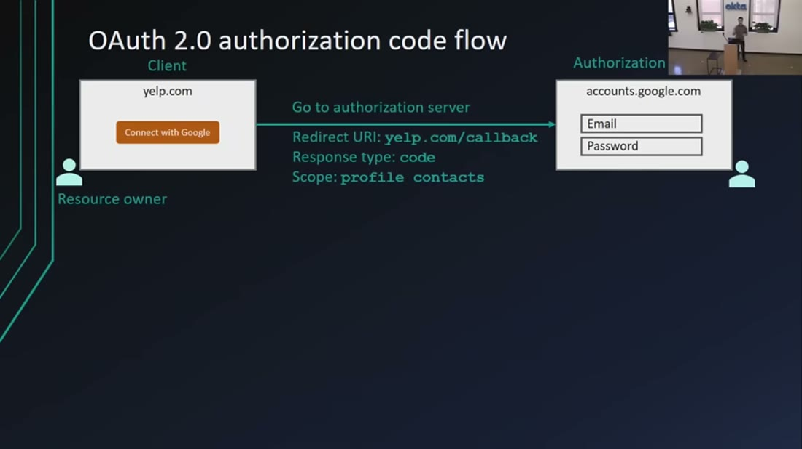

- What it teaches: the client enumerates scopes up front; the authorization server **generates the
  consent screen from them**; the issued token is bound to exactly those scopes and nothing more.
  `n7` [&t=1549s](https://www.youtube.com/watch?v=996OiexHze0&t=1549s)

> 💡 **Scope** - a named permission (`contacts.read`) that the client asks for, the user sees in plain
> language, and the token is limited to. It is what turns "access my account" into "read my contacts".

### 5. The crux: front channel vs back channel

This is the idea that makes the rest inevitable, and it is not OAuth terminology at all - it is
network security terminology [&t=1634s](https://www.youtube.com/watch?v=996OiexHze0&t=1634s).

- **Front channel** = the browser. Anything you put in it can be read: query parameters are visible in
  the address bar, a malicious extension can log requests, someone can read over your shoulder.
  *"We can trust the browser, but we only trust it as far as we can throw it."*
  [&t=1725s](https://www.youtube.com/watch?v=996OiexHze0&t=1725s)
- **Back channel** = your server calling another server over TLS. Nobody in between sees it.

Now the two-step dance stops looking like bureaucracy:

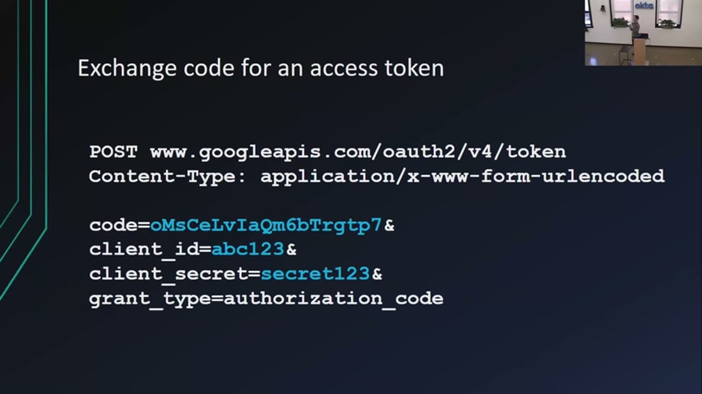

- What it teaches: the exchange is a **`POST` carrying `client_secret`** - which is exactly why it
  cannot happen in the browser. `n5` [&t=1937s](https://www.youtube.com/watch?v=996OiexHze0&t=1937s)
- Corroborated by: *"even if someone stole the authorization code, they wouldn't be able to make that
  exchange request ... because they don't have that secret key."*

**The design in one line: the authorization code is deliberately a useless token.** It travels the
insecure channel precisely *because* stealing it achieves nothing - redeeming it requires a secret
that only ever exists on the back channel. The protocol splits the job so each channel does what it
is good at: the browser talks to the human (login, consent - things a server cannot do), the server
handles secrets (things a browser cannot be trusted with) `n6`
[&t=1989s](https://www.youtube.com/watch?v=996OiexHze0&t=1989s).

Every remaining flow is this same picture with one or both channels removed.

### 6. The four flows are a channel-availability decision

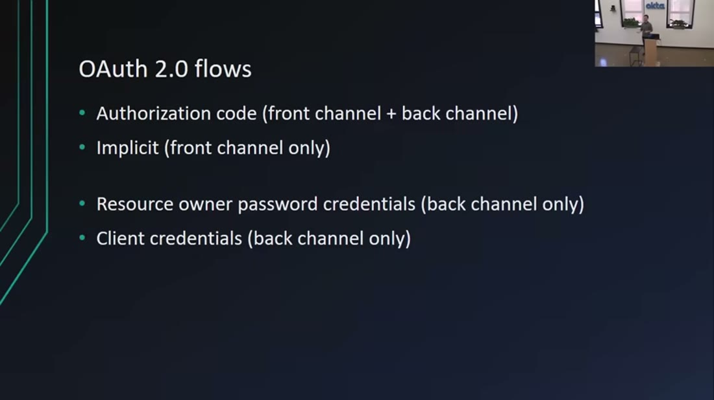

- What it teaches: the four grant types are not four philosophies, they are **four answers to "which
  channels do you have?"** `n8` [&t=2597s](https://www.youtube.com/watch?v=996OiexHze0&t=2597s)

| Flow | Channels | When |
|---|---|---|
| Authorization code | front + back | You have a server. **The default.** |
| Implicit | front only | No back end at all (see "What has aged") |
| Resource owner password | back only | Legacy migration; not recommended even in 2018 |
| Client credentials | back only | **Machine to machine** - no user involved `n10` |

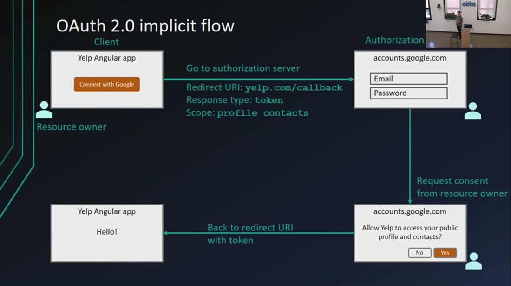

- What it teaches: with no back channel, `response_type=token` hands the access token straight to the
  browser and skips the exchange entirely - buying feasibility at the cost of every protection
  section 5 just built. `n9` [&t=2530s](https://www.youtube.com/watch?v=996OiexHze0&t=2530s)

### 7. Why OpenID Connect had to exist

OAuth got adopted so widely that people reached for it for **login**, which it was never designed for
`n11` [&t=2824s](https://www.youtube.com/watch?v=996OiexHze0&t=2824s). The defect is concrete, not
academic:

> **OAuth has no standard way to tell you who the user is.** It reasons about permissions, not
> identity `n12` [&t=2894s](https://www.youtube.com/watch?v=996OiexHze0&t=2894s).

So every provider - Google, Facebook, Twitter, LinkedIn, Microsoft - bolted its own proprietary
"get user info" mechanism on top. Each login button worked; none were interchangeable; a standard had
stopped being a standard. **This is also the direct cause of the confusion in section 0**: half the
OAuth material online describes authorization, the other half describes this authentication misuse,
and neither says which it is doing `n20`.

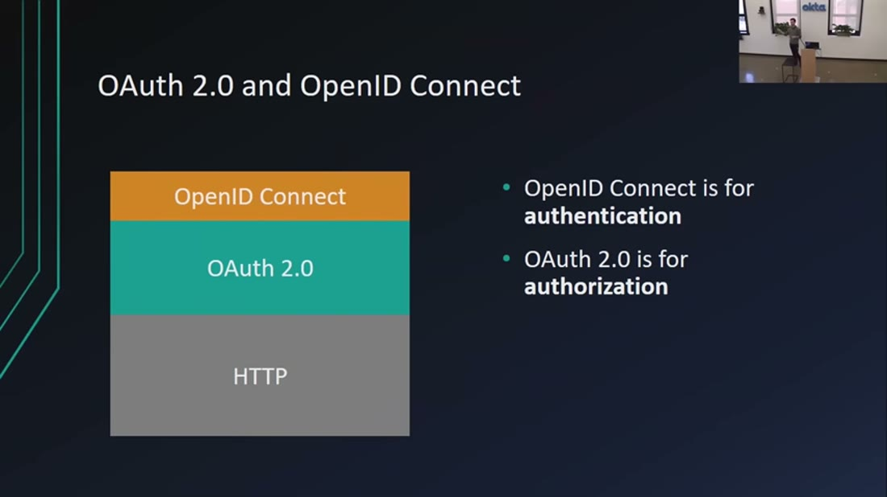

- What it teaches: OIDC sits **on** OAuth exactly as OAuth sits on HTTP - a "5-10% layer", not a
  replacement. `n13` [&t=2979s](https://www.youtube.com/watch?v=996OiexHze0&t=2979s)

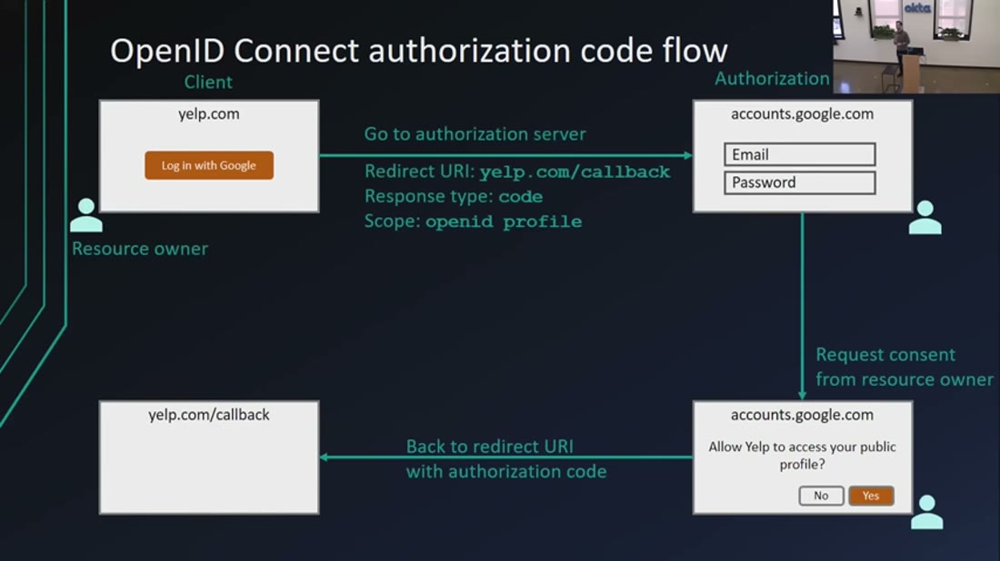

- What it teaches: put this beside the slide in section 4 and **the only difference is
  `Scope: openid profile`**. That one scope is what makes a request an OIDC request, and it buys you
  an ID token alongside the access token. `n14` [&t=3072s](https://www.youtube.com/watch?v=996OiexHze0&t=3072s)

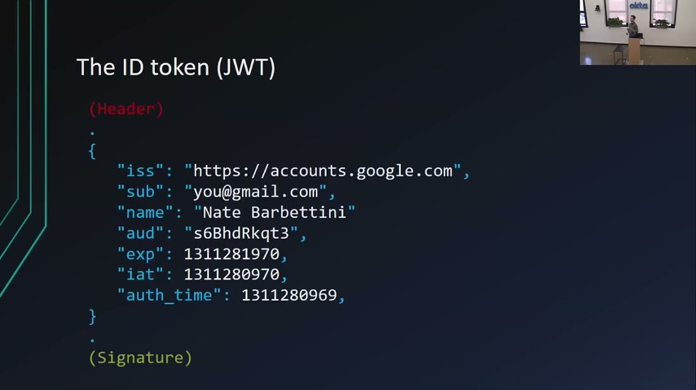

- What it teaches: the ID token is a **JWT** - header, claims, signature. The claims answer *who
  logged in* (`sub`, `name`, `iss`, `aud`, `exp`). The signature lets the app verify authenticity
  **locally, without another round trip**. `n15` [&t=3347s](https://www.youtube.com/watch?v=996OiexHze0&t=3347s)

> 💡 **JWT** ("jot") - a signed, base64url-encoded JSON envelope in three dot-separated parts. Signed,
> **not encrypted**: anyone holding it can read the claims, so never put secrets in one.

> 💡 **Access token vs ID token** - the distinction that makes the whole talk click. An **access
> token** is for a *machine*: the app presents it to an API and the API decides what it may do; the
> app is not meant to look inside it. An **ID token** is for the *app*: it says who signed in, and it
> is never sent to an API.

### 8. The rule for choosing

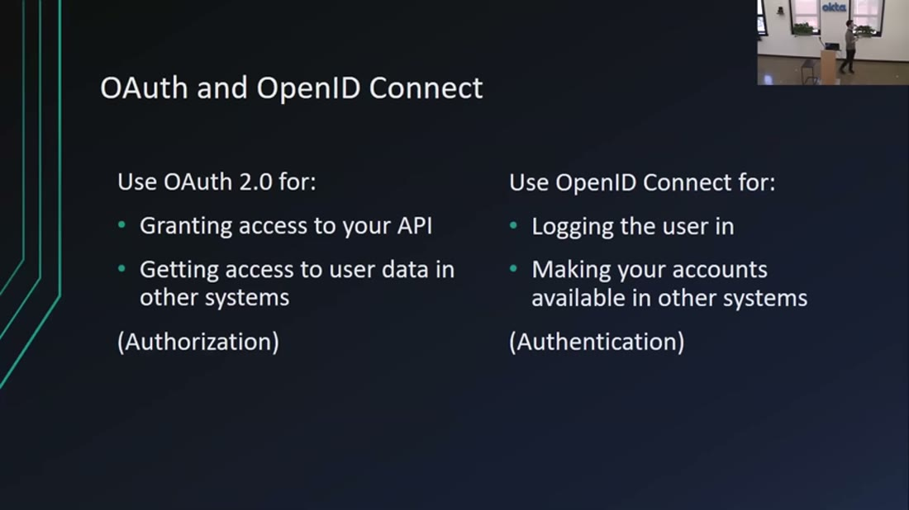

- What it teaches: the decision rule, and the correction of a common misreading - **OIDC being newer
  does not make it a replacement.** They are different tools for different jobs; the only thing OIDC
  replaces is *misusing* OAuth for authentication. `n16` [&t=3416s](https://www.youtube.com/watch?v=996OiexHze0&t=3416s)

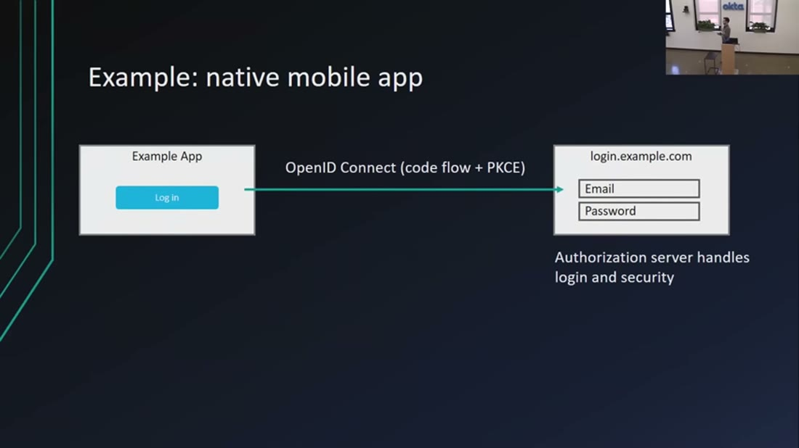

- What it teaches: for native mobile, the answer is **OIDC authorization code flow + PKCE**. `n18`
  [&t=3562s](https://www.youtube.com/watch?v=996OiexHze0&t=3562s)

> 💡 **PKCE** ("pixie", Proof Key for Code Exchange) - the fix for clients that cannot hold a
> `client_secret`. The client invents a random secret per request, sends only its hash up front, and
> reveals the original at exchange time. It restores the guarantee of section 5 - a stolen code is
> useless - **without needing a back channel**. Hold this term; it is the hinge of the next section.

And the durable architectural argument, easy to miss at the end: delegating login **decouples the
authentication system from the application**, so each can be maintained and evolve separately `n19`
[&t=3527s](https://www.youtube.com/watch?v=996OiexHze0&t=3527s). That is the reason to adopt these
protocols even when you *could* write the login form yourself.

## Diagram (mental model)

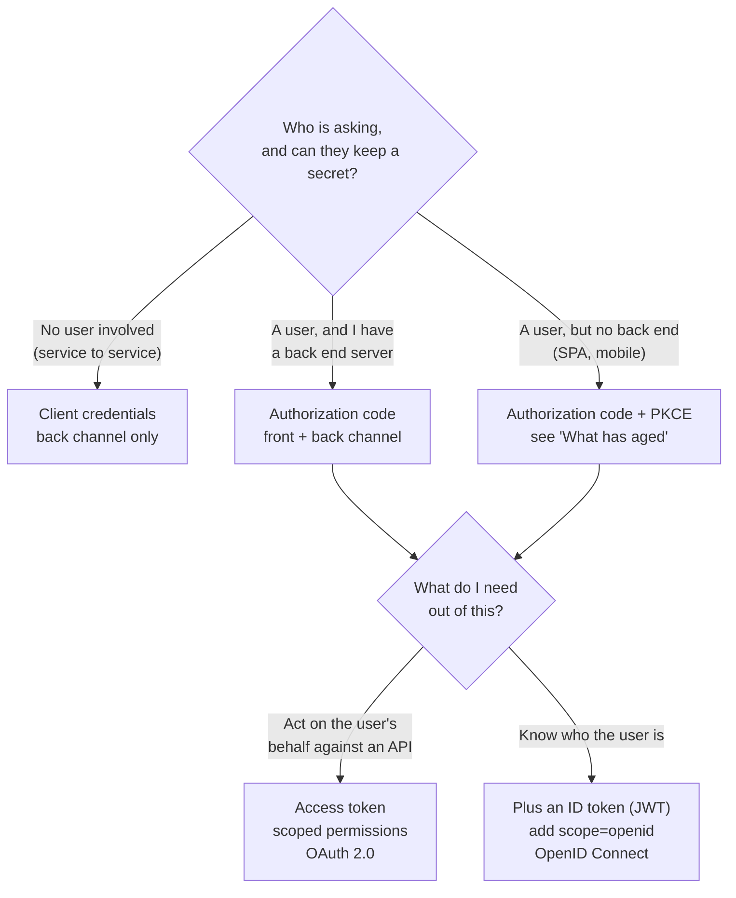

**Orientation.** Read top to bottom: one decision about your *client*, then one about your *goal*.
The first fork is not about your framework or language - it is about **which channels you have**, in
the section 5 sense. The second fork is authorization versus authentication.

**The crux: you never choose between OAuth and OpenID Connect - you choose a flow based on whether
your client can hold a secret, then add one scope if you also need to know who the user is.**

**Why it is shaped this way.** Most explanations organise around the four grant types as a menu, which
invites you to pick by application type ("I have an Angular app, so ... implicit?") and gets people
into trouble - that is precisely the reasoning that has since been overturned. Organising around
*secret-holding capability* is more durable, because it is the actual security property the protocol
cares about, and it is why PKCE could later absorb the no-back-end case without inventing a new flow.
Note also what the shape rules out: there is no branch where you pick OIDC *instead of* OAuth. It is a
suffix on the second decision, never an alternative at the first - which is the misconception `n16`
exists to kill.

**Provenance:** synthesized from `n8`, `n9`, `n13`, `n14`, `n16`, `n18`, plus the age warning below.
Not a slide from the talk.

## What has aged (read before applying)

This talk is from **February 2018**. The mechanics above are unchanged and it remains the clearest
explanation of them available. **One recommendation has been reversed by the field**, and it happens
to be the one a web developer would reach for first.

| The talk says | Status | What to do |
|---|---|---|
| Authorization code flow for server-rendered web apps | Still correct | Use it. |
| Code flow **plus PKCE** for native mobile | Still correct, now universal | Use it. |
| **Implicit flow for single-page apps** (`n17`) | **Superseded** | **Do not use.** Use authorization code + PKCE. |
| Resource owner password flow for legacy | Deprecated harder since | Avoid entirely. |
| Client credentials for machine-to-machine | Still correct | Use it. |

The reason the implicit flow fell out of favour is visible in section 5 without any outside
information: it puts the access token directly into the browser's URL, which is the one place the talk
spends ten minutes explaining you cannot trust. In 2018 that was an accepted trade because SPAs had no
alternative; **PKCE removed the trade** by giving secret-less clients a way to prove they started the
flow they are finishing. The talk already teaches PKCE for mobile `n18` - the field simply extended
the same fix to browser apps.

> ⚠️ **Provenance: this table is commentary, not sourced evidence.** The "superseded" verdicts are
> the agent's background knowledge - not from this source, and not externally verified here
> (`AGENTS.md`: unverified statements are commentary, not fact). The direction is reliable; treat
> specific document names, dates and wording as unconfirmed. **A future OAuth 2.1 source will settle
> it** - that is the intended resolution path, not a research pass.

## Open questions

- **What exactly replaced the implicit flow, and when?** Which document carries the current guidance,
  what does it actually say about browser apps, and is implicit discouraged or removed? Needs T1
  evidence (a spec or IETF BCP), not memory. **Deliberately left open** - to be answered by an
  OAuth 2.1 source rather than a research pass (owner's call, 2026-07-25).
- **How does any of this map onto agents?** MCP's authorization spec builds on this machinery, and an
  agent calling tools on a user's behalf **is** the delegated-authorization problem with a new actor
  in the client role. Does the four-party model still hold when the client is non-deterministic? See
  `../../brain/topics/agent-security.md`.
- **What is the consent story when the user is not present?** The whole design assumes a human at a
  browser who clicks Yes. Long-running agents break that assumption. The client credentials flow
  `n10` removes the user entirely - is that the agent answer, or does it discard exactly the
  protection that made OAuth worth having?
- **Is `single-leg` the right verdict for the argument claims?** `n11`, `n12`, `n19`, `n20` are the
  most transferable content in the talk and the least corroborated. External evidence would settle
  them cheaply.
