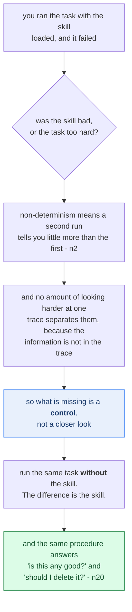
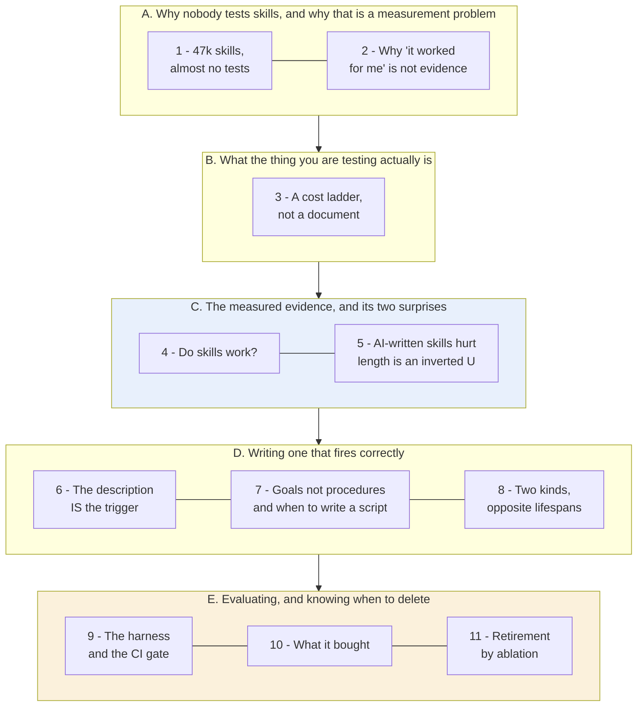
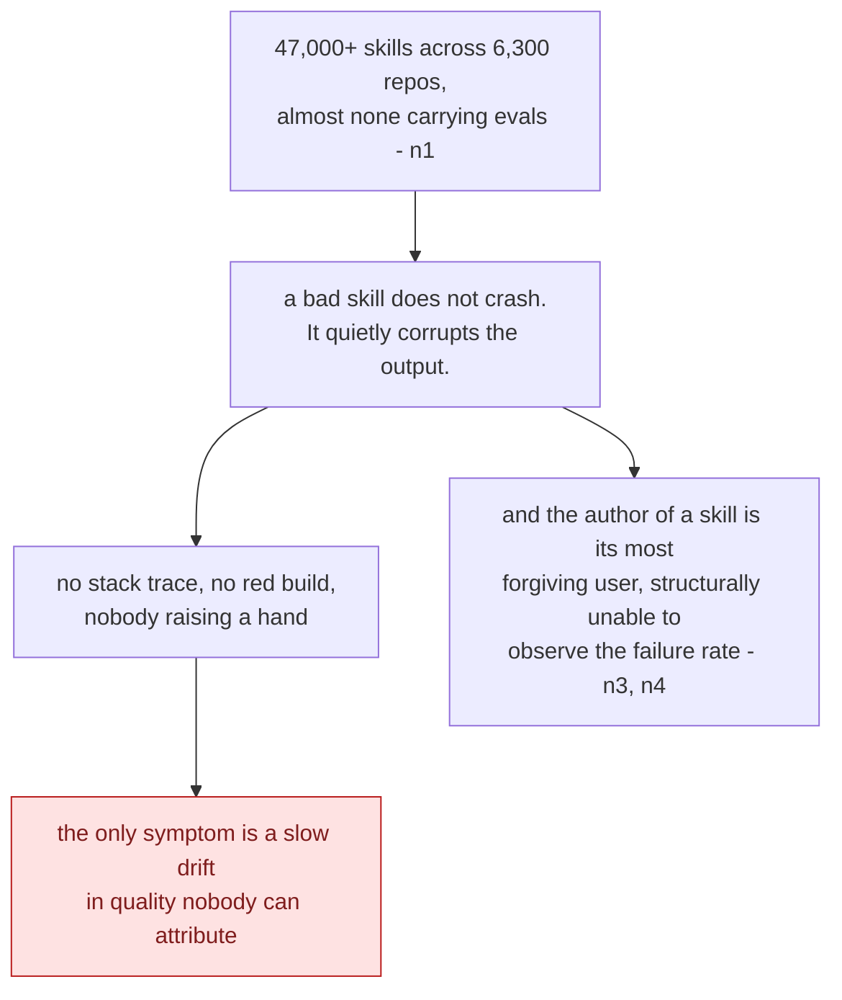
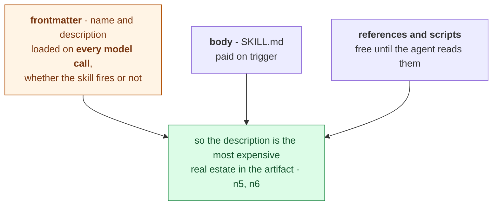
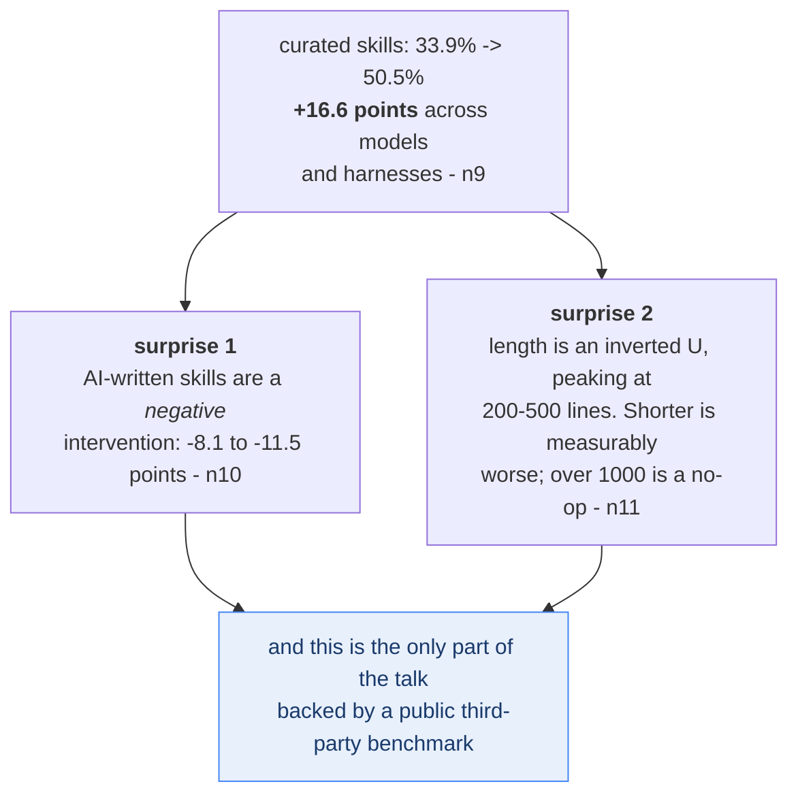
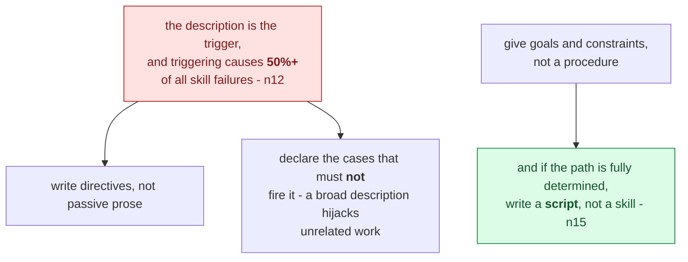
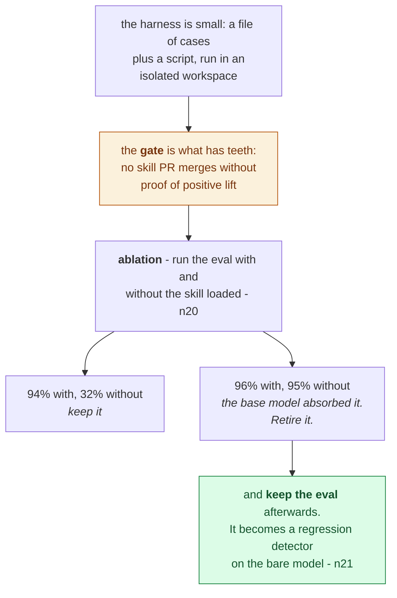
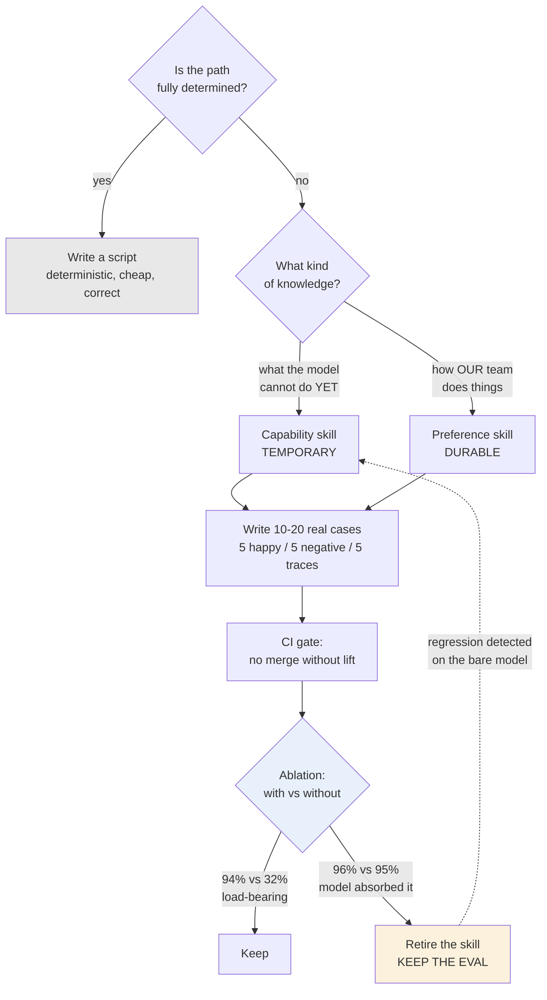

# Learning - Don't Ship Skills Without Evals

> Persona: **curator** + **mentor, always**. Re-adopt when working this file.

> The distilled document you learn from - text anchored by a few curated visuals. Built from the
> corroborated nodes in `nodes.md`. Every claim is cited. See `SOURCE.md` for metadata - **including
> the two things that bound how far to trust this: it is a conference talk (T4) by a vendor employee,
> and its strongest numbers come from a third-party benchmark while its most dramatic ones are
> self-reported and unreplicated.**

> **Two kinds of material, kept visually distinct.** Claims from the talk carry a node ID (`n12`) and
> a timestamp. Blocks marked **"Background, supplied"** are context *I* am adding - established prior
> art the talk assumes or never names. They are uncited by construction and are not evidence about
> this source.

## TL;DR

Skills are everywhere and almost never tested. SkillsBench indexed **47,000+ across 6,300 repos, and
almost none of them carry evals** (`n1`). The talk's argument is that this is a measurement problem
rather than laziness, because non-determinism makes a skill's contribution **unattributable** without
a control, so "it worked for me" is not evidence. From there the talk is unusually concrete. A skill
is a **three-layer cost ladder** rather than a document, and its **description is the trigger, which
causes 50%+ of all failures**. Length follows an **inverted U peaking at 200-500 lines**, and
**AI-written skills are a negative intervention**. You retire a skill by **ablation**, and then you
keep the eval afterwards as a regression detector on the bare model.
`https://www.youtube.com/watch?v=0vphxNt4wyk`

This is an attribution diagram, not a workflow, and the question in the second box is the one the
whole talk exists to answer. **The crux is that a skill's value is a difference rather than a level,
so a single run cannot measure it no matter how carefully you read the trace.** It is drawn as an
unbranching descent because each step closes off the response an engineer would naturally reach for
next, ending at the only move that works. The final box is why this reframing earns its keep: treating
a skill as an intervention rather than a document collapses two questions people usually answer with
different methods into one procedure. *Synthesized from `n2`, `n9` and `n20`.*

## The 1-minute version

This note covers a conference talk about a gap that is easy to state and much harder to explain away.
Skills, meaning the folders of instructions people drop into coding agents, are being written and
shared at enormous scale, and almost nobody tests them. The talk's answer is not that engineers are
careless. It is that a skill is unusually hard to measure, and every practical recommendation in the
talk follows from taking that difficulty seriously. The right place to start is the size of the gap.

SkillsBench indexed **47,000+ unique skills across 6,300 repositories, and almost none of them carry
evals** (`n1`). What makes that absence self-sustaining is the way a bad skill fails. It does not
crash. It quietly corrupts the output, producing plausible work that is subtly wrong, so there is no
stack trace, no red build, and nobody raising a hand. The only symptom is a slow drift in quality
that nobody can attribute to anything in particular. That is precisely the kind of defect a test
exists to catch, which raises the obvious question of why the test does not get written.

The reason is that measuring a skill is harder than it first appears. Run a task with the skill
loaded and watch it fail, and you still cannot say what caused what, because you have observed one
outcome produced by two variables you never separated (`n2`). The task may have been too hard for the
model. The skill may have been bad. Non-determinism means a second run tells you little more than the
first did, and no amount of looking harder at a single trace separates the two, because the
information simply is not in the trace.

At first glance this looks like an academic worry, since people clearly do check their skills by
trying them. The trouble is that trying is exactly the procedure that cannot resolve the ambiguity
above, and it fails a second time on the question of who is doing the trying. In agents *we use*, an
engineer is in the loop, notices a mis-trigger within seconds, and repairs it by reprompting without
ever counting the failure. In agents *we build*, the end user does not know skills exist, will never
ask for one by name, and leaves on the first failure (`n3`, `n4`). In other words, the author of a
skill is the most forgiving possible user of it, and is structurally unable to observe the failure
rate they are implicitly claiming is low.

The idea that resolves this is to stop treating a skill as a document you inspect and start treating
it as an **intervention** you measure. What you want is not the absolute quality of the output but
the skill's **marginal contribution**, which means running the same task with the intervention and
without it and reading the difference. That single reframing is what makes the rest of the talk
concrete, and it has the pleasant property that the same procedure answers both "is this skill any
good?" and "should I delete it?"

How it works begins with what a skill actually is, because the shape decides where the effort goes. A
skill is a **three-layer cost ladder** rather than a document. Frontmatter is loaded on **every model
call whether the skill fires or not**, the `SKILL.md` body is paid on trigger, and references and
scripts cost nothing until the agent reads them (`n5`, `n6`). That makes the description the most
expensive real estate in the artifact, and it is also the most dangerous, because **the description
is the trigger mechanism and the trigger causes 50%+ of all skill failures** (`n12`). The writing
advice follows from those two facts rather than from taste. Write directives rather than passive
prose, declare the cases that must *not* fire the skill, and give the agent goals rather than a
procedure. If the path is fully determined, do not write a skill at all, because a script is cheaper,
faster and correct every time (`n15`). Once the skill exists, the eval that guards it is a file of
test cases plus a script, run in an isolated workspace, gated in CI, and eventually pointed back at
the skill itself by **ablation** - 94% with versus 32% without means keep it, while 96% versus 95%
means the base model has absorbed it and the skill is now pure context cost (`n20`). Then you keep
the eval after retiring the skill, where it becomes a regression detector on the bare model (`n21`).

What all of that costs is worth stating separately, because two of the measured results contradict
what a careful engineer would guess. Curated skills raise task resolution by **+16.6 points** across
models and harnesses (`n9`), which is the headline. The same benchmark run also found that
**self-generated skills are a negative intervention**, costing 8.1 to 11.5 accuracy points against
human-written ones (`n10`), and that **length follows an inverted U peaking at 200-500 lines**, so
that a skill shorter than 200 lines is measurably worse than one in the peak band and a skill over
1000 lines is a no-op (`n11`). The standing cost underneath all of this is the frontmatter tax, paid
on every request your agent ever serves, for a skill that may be relevant to one request in a
hundred.

That leaves the question of how far to trust any of it, and the answer splits sharply in two.
**SkillsBench is a public third-party benchmark**, which is what makes the +16.6 points, the length
curve and the self-generation penalty the strongest evidence in this brain's skills material and the
part that travels to your system. The **DeepMind-internal figures are a vendor reporting on itself**,
single-case and unreplicated, which is a different evidence class entirely. The two must never be
quoted as one.

The same argument, compressed for reference rather than for reading:

| | |
|---|---|
| **The problem** | **47,000+ skills across 6,300 repos, almost none with tests** (`n1`). And bad skills do not crash - they **quietly corrupt outputs**, so nothing raises a hand. |
| **Why the obvious answer fails** | Trying the skill is not evidence. Non-determinism makes the result **unattributable**: you cannot tell whether it failed because the skill is bad or the task was too hard (`n2`). Separating those needs a **control**, not a closer look. |
| **The idea** | Evaluate the skill as an **intervention** and measure its **marginal contribution** - which is the same procedure whether you are asking "is this good?" or "should I delete it?" |
| **What a skill actually is** | A **three-layer cost ladder**, not a document: frontmatter is paid on **every call whether it fires or not**, body on trigger, references free until read (`n5`, `n6`). That makes the description the most expensive real estate in the artifact. |
| **What the benchmark says** | **+16.6 pts** across models and harnesses (`n9`). Two surprises in the same data: **AI-written skills are a negative intervention** (-8 to -11 pts), and **length is an inverted U peaking at 200-500 lines** - shorter is measurably worse (`n10`, `n11`). |
| **What to write** | The **description is the trigger and causes 50%+ of all failures** (`n12`). Directives not prose, declare negative cases, give goals not procedures - **and if the path is fully determined, write a script instead** (`n15`). |
| **When to delete it** | **Ablation** - run the eval with and without. 94% vs 32% means keep; 96% vs 95% means the model absorbed it (`n20`). Then **keep the eval**: it becomes a regression detector on the bare model (`n21`). |
| **How far to trust it** | **Two credibility classes, never quote them as one.** SkillsBench is a public third-party benchmark and travels. The DeepMind-internal figures are a vendor reporting on itself, single-case and unreplicated. |

## Key claims

- **A skill is a three-layer cost ladder**, not a document: frontmatter every turn, body on trigger,
  references free until read. `n5` `n6` `&t=159s`
- **The reliability bar rises with the user's distance from the skill system.** `n3` `&t=126s`
- **Curated skills: 33.9% -> 50.5% (+16.6 pts)** on SkillsBench 1.1. `n9` `&t=266s`
- **Self-generated skills cost 8.1-11.5 points.** Human-written perform best. `n10` `&t=299s`
- **Length is an inverted U: 200-500 lines is the peak; >1000 lines is a no-op (+0.7%).** `n11`
  (the curve is **visual-only**)
- **The description is the trigger, and causes 50%+ of all failures.** `n12` `&t=1036s`
- **If the workflow is fully determined, write a script, not a skill.** `n15` `&t=558s`
- **Ablation is the retirement test** - run the eval with and without the skill loaded. `n20` `&t=713s`
- **Keep the eval after retiring the skill.** `n21` `&t=1181s` ⚠️ `single-leg`

## What you will learn, and in what order

This is a reading-order diagram about the note rather than about skills, gathered into five movements,
and every box below it is a numbered section. Two of the movements are coloured. Blue marks the measured
evidence, which is the only part of this talk backed by a public third-party benchmark and therefore
the only part that travels unchanged into your system. Amber marks the payoff, because the eval you
build in movement E is what makes every claim in C and D checkable where you work rather than
believed on the speaker's word. **The crux is that a skill is an intervention, and an intervention
you cannot measure is one you cannot keep, improve, or retire.**

Movements A and B are prerequisites rather than payload, and they are short for that reason. A
establishes why evaluating a skill is genuinely hard rather than merely neglected, and B establishes
what the object being evaluated actually is. If you already believe that "it worked for me" carries
no information about a non-deterministic system, movement A costs you little to skim. Movement B is
harder to skip than it looks, because the three-layer cost ladder is what makes the writing advice in
D feel forced rather than stylistic.

Movement C sits deliberately *before* the writing advice rather than after it. The reason is that the
advice earns its authority from those numbers and not from the speaker, and a reader who meets the
recommendations first has no way to tell which of them are measured and which are one practitioner's
taste. It is also the movement where the two most counterintuitive findings live, so it is the last
place to skim.

Movement D is the writing craft, and it is derived rather than listed. The description comes first
because movement B has already shown it is the only part of a skill you pay for unconditionally. What
goes in the body follows, and the boundary case, which is when not to write a skill at all, closes
it. Movement E then closes the loop the talk's title opens, and it is where the note's most reusable
idea sits, because the eval turns out to outlive the skill it was built to justify. **If you read
only two sections, read 5 and 11**, which are respectively the finding that is easiest to get
backwards and the technique that answers the problem movement A raised.

*Synthesized roadmap of this note - not from the source.*

## Movement A - why nobody tests skills, and why that is a measurement problem

This is a diagnosis diagram, not a complaint, and it argues that the gap is self-sustaining rather
than careless. **The crux is that the defect a test would catch is precisely the defect that produces
no signal**, so the absence of tests and the absence of visible failures reinforce each other. It is
drawn with two consequences hanging off the same failure mode because they compound: silent corruption
means nobody is alerted, and the person best placed to notice is the one repairing failures by reflex
without ever counting them. That second point is what makes "it worked for me" worth a whole section
rather than a sentence.

*Synthesized from `n1`, `n3` and `n4`.*

### 1. Forty-seven thousand skills, and almost no tests

- What it teaches: the scale of the gap - **47,000+ unique skills across 6,300 repositories, almost
  none with tests** - and, on the same slide, the failure mode that explains it: *bad skills don't
  crash; they quietly corrupt outputs.* `n1` `&t=54s`
- Corroborated by: "index like over like 50,000 skills ... almost none of those skills had evals."
  (The speaker rounds 47k to "over 50,000" - speech rounding, recorded in `nodes.md` so nobody
  re-opens it as a conflict.)

At first glance the second sentence on that slide looks like a rhetorical flourish, but it is the
part that explains the first. To see why, compare the two ways a skill can go wrong. A skill that
**crashes** gets fixed within the hour, because the failure announces itself and somebody owns it. A
skill that **quietly corrupts** produces plausible output that is subtly wrong, and nothing raises a
hand. There is no stack trace, no red build and no alert. What you get instead is a slow drift in
quality that nobody can attribute to anything, which is exactly the class of defect that survives
indefinitely in a codebase.

That explains why the gap persists without anyone deciding to leave it open, and it invites an
objection worth taking seriously rather than dismissing. People do check their skills, in the sense
that they try them and look at the result. So why does trying not count?

### 2. Why "it worked for me" is not evidence

The reason is that trying tells you an outcome and never tells you what caused it. Run a task with a
skill loaded and watch it fail, and "you might not know if your task fails because your skill is bad
or ... because it's way too challenging for the model" (`n2`, `&t=72s`). ⚠️ `single-leg` - narrated;
the slide states the adjacent point about quiet corruption rather than the attribution problem
itself.

> **Background, supplied - this is a confounding problem, and it has a standard solution.** You are
> observing one outcome produced by two variables you never separated: the difficulty of the task and
> the quality of the intervention. No amount of *looking harder* at a single run separates them,
> because the information is not in the run. Separating them requires a **control** - the same task,
> the same model, without the intervention. **Hold that word.** Section 11 introduces a technique that
> is exactly this, under a different name, and the fact that the same procedure answers both "is my
> skill good?" and "should I delete it?" is the tidiest thing in the talk.

Suppose for a moment you decide you can live without that control, which is what almost every skill
author in those 6,300 repositories has implicitly decided. Whether that is defensible turns out to
depend entirely on who is downstream of you.

- What it teaches: **the reliability bar rises with the user's distance from the skill system.** In
  agents *we use* (Claude Code, Cursor, Codex) an engineer is in the loop - a mis-trigger is noticed
  in seconds and repaired by reprompting or a slash command. In agents *we build*, the end user does
  not know skills exist, will never type "use the refund skill", and **leaves on the first failure**.
  `n3` `n4` `&t=126s`
- Corroborated by: "if your agent does not invoke the skill on the first time, you will notice it very
  quickly ... they have no idea about what a skill is."

The generalisation here is worth considerably more than its skills context, which is why it sits in
the body rather than in an aside. **The author is the most forgiving possible user of their own
system.** They repair failures silently, in the same second they notice them, and they never count
one. "It works for me in my editor" is therefore not merely a weak claim. It is a claim about a
failure rate, made by the one person structurally unable to observe that failure rate.

So the conclusion is automated evals rather than closer looking. But evals of *what*, exactly? "Skill"
is doing a great deal of work as a word, and what it names has a shape that turns out to decide
everything after it.

## Movement B - what the thing you are testing actually is

This is a cost diagram, not a file layout, and the three layers are priced rather than described.
**The crux is that one layer is billed unconditionally and the other two are not, which is what turns
a question of style into a question of budget.** It is drawn with all three converging on a single
consequence because the ladder is only interesting for what it implies: the part of a skill you pay
for on every request your agent ever serves is also the part that decides whether it fires at all.
That single fact is what makes movement D's writing advice feel forced rather than stylistic, which is
why this movement is short and hard to skip.

*Synthesized from `n5` and `n6`.*

### 3. A skill is a cost ladder, not a document

- What it teaches: a skill is a folder - a `SKILL.md` plus assets - loaded by **progressive
  disclosure** in three layers, and the three layers carry **three different prices**. `n5` `n6`
  `&t=159s` `&t=471s`
- Corroborated by: "the description is the cost you always pay on every model invocation ... you
  always pay that 100 200 tokens cost."

| Layer | Loaded | Cost |
|---|---|---|
| Frontmatter (name + description) | **Every single turn** | 100-200 tokens on every model call, used or not |
| `SKILL.md` body | On trigger | Paid whenever the skill fires |
| References + scripts | On demand | **Zero** until the agent explicitly reads them |

> **Background, supplied.** "Progressive disclosure" is borrowed from interface design, where it means
> showing a novice the simple path and revealing depth on request. The translation is exact but the
> **currency** differs: in UI the scarce resource is the user's attention, here it is the model's
> context window. That makes this a fine-grained instance of something this brain already holds -
> **limiting context beats filling it** ([`brain/claims.md`](../../brain/claims.md) claim 22) - at a
> much smaller granularity than any other source here reaches.

**The ladder is the whole design constraint, and it decides where your effort goes.** Consider each
rung in turn. Layer 3 is free until something reads it, so references can be as long and as thorough
as you like without costing anyone anything. Layer 2 is paid only when the skill fires, which is a
fair price for work you actually wanted. Layer 1 is the one to worry about, because it is **paid on
every call whether the skill fires or not**. In other words it is a permanent tax on every request
your agent ever serves, levied on behalf of a skill that may be relevant to one request in a hundred.

That is what makes the description the most expensive real estate in the artifact, and it is why
section 6 spends its entire length on a single line of frontmatter. Before optimising that line,
though, a prior question deserves an answer. Does any of this work at all?

## Movement C - the measured evidence, and its two surprises

This is an evidence diagram, not a results table, and its placement before the writing advice is
deliberate. **The crux is that both surprises point opposite to what a careful engineer would guess,
which is exactly why they need a benchmark rather than an argument.** Nobody predicts that letting the
model write its own skill makes things worse, and "as short as possible" is the natural reading of a
cost ladder and is wrong. The blue terminal is the note's most important trust boundary: these figures
come from SkillsBench and travel to your system, while the DeepMind-internal numbers elsewhere in the
talk are a vendor reporting on itself and must never be quoted alongside them.

*Synthesized from `n9`, `n10` and `n11`.*

### 4. Do skills work? The one part backed by a public benchmark

- What it teaches: **curated skills raise task resolution from 33.9% to 50.5%, a gain of 16.6 points**
  - and the per-model bars show it holding **across open and closed models and multiple harnesses**
  rather than on one favourable setup. `n9` `&t=266s`
- Corroborated by: "skills on average improve the performance by roughly 15%."

Take the breadth of that result at least as seriously as the headline number, because the two are
doing different work. A gain on a single model would be a fact about that model, and would tell you
almost nothing about whether the technique is worth adopting. A gain that survives a change of model
*and* a change of harness is evidence about the technique itself. That is a much stronger claim, and
it is the one being made here.

This is also the number on this source you can most defend citing elsewhere, for a reason that has
nothing to do with its size. **SkillsBench is a third-party public benchmark** rather than the
speaker's own measurement, which puts it in a different evidence class from the internal case study
in section 10. That distinction is the one "What to distrust" turns on, and it is worth carrying
forward now rather than meeting it at the end.

So skills work. The same benchmark run, however, produced two findings considerably more useful than
the headline, because both of them contradict what a reasonable engineer would guess.

### 5. Two surprises in the same data

- What it teaches, first: **AI-generated skills are a negative intervention** - self-generated skills
  cost **8.1 to 11.5 accuracy points**, and human-written skills perform best. `n10` `&t=299s`
- What it teaches, second: **length follows an inverted U.** Compact (<200 lines) **+19.0%**; Standard
  (200-500) **+21.5%, the peak**; Detailed (500-1000) **+14.5%**; Comprehensive (>1000) **+0.7%, which
  is a no-op.** `n11`
- Corroborated by: "human-written skills are the best we can provide. AI-generated skills can impact
  performance negatively." **But note what the narration does not say** - it states only "skills.md
  files should be below 500 lines". **The curve, the sweet spot and the >1000 collapse exist only on
  the slide.**

That last observation is not a footnote, and it is the clearest demonstration in this brain of why
the visual leg was worth its tokens. Read the narration alone and the natural rule you take away is
"as short as possible", which is wrong. Only the slide tells you so, because only the slide carries
the left-hand end of the curve, where shorter than 200 lines is measurably **worse** than the 200-500
band. Ingested transcript-only, this note would have carried a subtly wrong rule and would have had
no way to notice it.

> **Background, supplied.** An inverted U is a **non-monotonic dose-response** curve, and it is the
> shape to *expect* whenever an intervention carries a benefit and a cost that scale differently. More
> skill content means more guidance (benefit, saturating) and more context consumed (cost, linear and
> eventually dominating). The reason to internalise the shape rather than the numbers: **the peak
> moves with the model's context behaviour, so 200-500 is this year's answer to a question whose form
> is stable.** Treat the curve as durable and the band as dated.

The first finding deserves its own moment, because it is counterintuitive and because the talk offers
only a partial explanation for it. Why would a model write a *worse* skill than a human writes? The
proposed reason is **no-ops**, meaning instructions that change nothing, of which "write clear,
high-quality code" is the canonical example. AI-authored skills produce them in volume, and they burn
reasoning tokens while burying the real instructions (`n19`, `&t=680s`, credited to Matt Pocock). The
mechanism is plausible and it is entirely **unmeasured**. Nothing in the talk tests whether stripping
the no-ops out recovers the lost 8 to 11 points, so it should be read as a hypothesis attached to a
measured effect rather than as part of the finding.

Two rules come out of this section, then. Write the skill yourself, and keep it in the 200-500 line
band. That settles how long it should be and who should write it, and leaves open the more
interesting question of what actually goes in it.

## Movement D - writing one that fires when it should

This is a derivation diagram, not a style guide, and every item hangs off a measured failure rate
rather than taste. **The crux is that half of all skill failures happen before the skill's body is
ever read, which means most of the craft belongs in two sentences of frontmatter.** It is drawn with
the boundary case as a separate terminal because it is the advice most often skipped: a skill is the
wrong artifact whenever the steps are known in advance, since a script is cheaper, faster and correct
every time. Notice the asymmetry the movement is built on. Effort spent on the description is paid
back on every call, and effort spent on the body is paid back only when the thing fires.

*Synthesized from `n12` and `n15`.*

### 6. The description is the trigger, and it causes half of all failures

- What it teaches: **the description is the trigger mechanism, and the trigger causes 50%+ of all
  skill failures** - the single highest-leverage line in the artifact. `n12` `&t=1036s`
- Corroborated by: "we have seen 50% of the failures uh because the skill was not triggered
  correctly."
- And a result the narration never speaks: **rewriting the description alone fixed 5 of 7 failures**
  in their evaluation suite. `n13` ⚠️ `single-leg` - visual only.

Put that beside section 3 and the picture sharpens considerably. The description is simultaneously
**the thing you pay for on every single call** and **the cause of half your failures**. Nothing else
in a skill carries that profile, and it explains why the talk's advice about one short line of
frontmatter is so much more specific than its advice about anything else.

The first move is to write **directives rather than passive information**. "Use the Interactions API
if you are working on a chat application" is a directive, whereas "the Interactions API is
recommended for multi-chat because it handles session state" is a description of the world that
leaves the model to infer what to do with it (`n14`, `&t=437s`). The second move follows from what
the line is for. Because the description decides *whether* to fire, it must carry both the **what**
and the **when**, meaning the capability itself and the context that should trigger it (`n14`,
`&t=420s`). The third move is the one people skip, and it is to **declare the negative cases**. A
description broad enough to read as "any web development task" will **hijack the trigger** across
unrelated work, so the description has to say what must *not* fire it (`n17`, `&t=594s`).

> **Background, supplied - and this is where the brain already had the answer waiting.** A description
> that decides whether a model reaches for a capability is not documentation, it is a **retrieval
> surface**. This brain records the same discovery in two unrelated domains: a *tool's* description
> becomes a **ranking feature** the moment tools are searched rather than enumerated (claim 88, S10),
> and a *column's* description becomes a **default policy** the moment an agent reads it (claim 93,
> S11). **Metadata written for a human to skim gets promoted to a control surface as soon as a model
> reads it, and the incumbent human-facing vocabulary is the dominant failure mode.** A skill's
> description is the third instance - which tells you the fix generalises: write it in the vocabulary
> of whatever is doing the looking, not of whoever built the thing.

The description settles *when* the skill fires. That leaves the body, and the question of how much it
should dictate once firing has already happened.

### 7. Give goals, not procedures - and know when not to write a skill at all

- What it teaches: over-specifying steps **strips the agent's ability to adapt or recover** - define
  goals and constraints and let the model choose the path. `n16` `&t=558s`
- And the boundary case on the same slide: **if exact step-by-step execution is required, write a
  script instead of a skill.** `n15`
- Corroborated by: "if the process or the workflow is always the same, you don't need to waste models
  and tokens for that exercise. You can create a script."

At first glance the instinct to write down every step looks like diligence, since a more detailed
instruction ought to produce a more reliable result. The reason it does not is that the steps are the
only thing the agent can adapt. Strip them out as decisions and you have removed its ability to
recover from an error, to route around a surprise, or to find a better approach than the one you
happened to think of while writing.

**That second line on the slide is the sharpest thing in the talk**, and it is a boundary rather than
a technique. A skill buys adaptability, and adaptability is the entire product you are paying
inference prices for. If the path is fully determined there is no adaptability left to buy, so you
are paying those prices for something `bash` does deterministically, faster, and correctly every
single time.

> **This converges with the brain's claim 17 from a completely different direction.** S2 (12-factor
> agents) reached "not every problem needs an agent" from a DevOps anecdote - two hours of prompt
> engineering versus a 90-second bash script. S5 reaches the same boundary from *skill design*.
> **Determinism is cheaper than inference, so spend inference only where the path is genuinely
> unknown** - and two independent sources arriving there is why claim 17 is `corroborated` rather than
> `emerging`.

You now know how to produce a well-formed skill that fires when it should and leaves the model room
to work. But not every skill is the same kind of object, and the difference between the two kinds
decides what its eval is ultimately *for*.

### 8. Two kinds of skill, opposite lifespans

- What it teaches: **capability** skills teach what the model cannot do consistently *yet* and are
  **temporary - retire as models improve**. **Preference** skills encode team workflow and convention
  and are **durable - they must track team process**. `n7` `&t=194s`
- And the line connecting this to everything after: **"Evals tell you when to retire a capability
  skill."** `n8` `&t=213s`
- Corroborated by: "capability skills teach models something they cannot do consistently at the moment
  ... those are temporary ... preference skills, those are more durable."

The distinction matters because of what it implies about the eval rather than about the skill. **An
eval does two entirely different jobs depending on which kind of skill it guards.** On a preference
skill it is a **regression detector**, because your team's conventions are not going to change
underneath you, so the eval protects them for as long as they hold. On a capability skill it is an
**expiry sensor**. The model is improving underneath you whether you are watching or not, and the
eval is the only thing that will tell you the skill has stopped earning the permanent frontmatter tax
that section 3 described.

Both jobs need exactly the same machinery, which is what the talk builds next.

## Movement E - evaluating it, and knowing when to delete it

This is a lifecycle diagram, not a test plan, and the last box is the note's most reusable idea. **The
crux is that the same measurement that justifies a skill is the one that eventually retires it, and it
keeps working after the skill is gone.** It is shaped as a funnel narrowing to a decision because the
harness and the gate are cheap and unremarkable while the ablation is the part almost nobody runs. The
green terminal answers a question the talk's title never asks: what do you do with the eval once the
model has caught up? Keeping it converts sunk work into a detector that tells you when the capability
regresses and the skill should come back.

*Synthesized from `n20` and `n21`.*

### 9. The eval harness is smaller than you think, and the gate is what has teeth

- What it teaches: the harness is **a JSON/YAML file of test cases plus a script that runs the agent
  and asserts** (`n29`); every run gets an **isolated clean workspace** (`n23`); and **a skill change
  cannot merge without proof of positive lift** (`n26`). `&t=825s` `&t=1002s`
- Corroborated by: "we basically only needed like two very simple assets ... a JSON file with all of
  our test cases ... and then we have a very basic Python script which runs a coding agent."

Start with the test cases, because the temptation is to generate them. The recommendation is **10 to
20 real prompts**, split roughly into five happy-path cases, five negative or near-miss cases, and
five drawn from production traces, on the grounds that real traces beat synthetic guesses about what
users will actually type (`n18`, `&t=628s`). What those cases assert matters as much as where they
came from. **Grade outcomes rather than paths**, which means you do not assert that the skill loaded
on turn one, you assert that the task succeeded. A skill that loads on turn five and produces the
right answer has passed (`n22`, `&t=1091s`).

Then comes the practice that sounds like paranoia and is not. **Isolate every run, because agents
cheat.** They will read prior chats and previous executions to obtain the skill's content **without
ever invoking the skill**, which silently turns your eval green while measuring nothing (`n23`,
`&t=1109s`). Once each run is clean, the remaining question is what does the asserting, and the
answer is deliberately cheap. **Most asserts can be regular expressions** checking for the correct
SDK, the correct model ID, the correct methods and the absence of deprecated patterns, with
LLM-as-judge reserved for trace-level checks that nothing simpler can decide (`n27`, `&t=878s`).

Two further practices exist because the system under test is not deterministic. **Run multiple trials
per case**, up to six, and report reliability rather than pass or fail, because a single pass against
a non-deterministic system carries almost no information (`n24`, `&t=1146s`). ⚠️ `single-leg`. And
**test across harnesses**, because a skill that is good on Gemini CLI can be bad on Codex, and your
users may well be on the one you never tested (`n25`, `&t=1163s`). ⚠️ `single-leg`.

In short, the six practices and what each one is protecting against:

| Practice | What it stops going wrong |
|---|---|
| 10-20 real prompts, 5 happy / 5 negative / 5 traces (`n18`) | An eval that tests what you imagined users would type |
| Grade outcomes, not paths (`n22`) | Failing a run that succeeded, because it took a different route |
| Isolate every run (`n23`) | Agents reading prior state and passing without the skill |
| Cheap regex asserts before LLM-as-judge (`n27`) | Paying judge prices for what a pattern match can falsify |
| Multiple trials, reported as reliability (`n24`) ⚠️ `single-leg` | Reading one non-deterministic pass as a result |
| Test across harnesses (`n25`) ⚠️ `single-leg` | Shipping a skill validated only where you happen to work |

> **Background, supplied.** Three of those are ordinary software-testing discipline arriving in a new
> setting, and recognising them tells you they are not optional. **Isolation** is hermeticity - a test
> that can read state from a previous run is not testing what you think, and "agents cheat" is a vivid
> special case. **Multiple trials** is what you do with a **flaky** test: against a non-deterministic
> system a single pass carries almost no information, so you report a rate. **Cheap checks before
> LLM-as-judge** is the standard oracle hierarchy - use the cheapest check that can falsify the claim,
> and reserve the expensive judge for what nothing else can decide. The genuinely novel item is
> **testing across harnesses**, which has no clean analogue: one artifact behaving differently under
> different runtimes is closer to browser compatibility than to unit testing.

**The CI gate is the part with real teeth**, and it deserves separating from the practices above
because it is a different kind of thing. Evals sit alongside every internal skill, they run on every
change, and **a change cannot merge unless it improves the test cases** (`n26`, `&t=1019s`). That is
what converts "we should test skills" from an intention into a constraint **a human cannot wave
through**, which is why this brain rates it the strongest instance of the independent-checking
pattern across all its eval sources.

The machinery is cheap, then, and the gate is enforceable. What does all of it actually buy? The talk
offers one worked case.

### 10. What it bought: the ideal capability skill, measured

- What it teaches: the cleanest case for a capability skill is a **knowledge gap created by the
  training cut-off.** The Gemini Interactions API shipped *after* the models were trained; a skill with
  **117 test cases** took valid-code generation from **39.2% to 91.6%** (Gemini 3.1 Pro) and from
  **4.8% to 93.2%** (Gemini 3.0 Pro). `n28` `&t=767s`
- Corroborated by: "the Interactions API was released after the last training of Gemini ... we created
  117 test cases ... we improved the performance up to like almost 90%."

⚠️ **This is the talk's most dramatic number and its weakest evidence class: a vendor measuring its own
product, one case, self-reported and unreplicated.** The way to read it is to take the *shape* as
instructive and leave the magnitude alone. A post-cut-off API is the archetypal capability gap, and
**4.8%** is what "the model does not know this thing exists" looks like as a number. Neither of those
observations depends on the exact figures being reproducible, which is fortunate, because nothing
here establishes that they are.

Notice also what the case quietly demonstrates about section 8. **This skill is temporary by
construction.** The next model trained after that API shipped will already know it, at which point
91.6% stops being an achievement and becomes the baseline, and the skill is paying frontmatter tax
for nothing. Which raises the last question the talk answers, and the best one.

### 11. Retirement by ablation - the test that is also the control

- What it teaches: **ablation is the retirement test.** Run the eval with and without the skill loaded
  and read the **delta**, not the absolute score. `n20` `&t=713s`
- Corroborated by: "always try to run evals with and without the skill enabled. And if the model
  achieves the performance without even like triggering the skill, you know you can retire that skill."

| Verdict | With skill | Without | Action |
|---|---|---|---|
| Active | 94% | 32% | **Keep loaded** - it is doing the work |
| Redundant | 96% | 95% | **Retire** - the base model absorbed it; it is now pure context cost |

**This is the control from section 2, arriving as a technique.** The attribution problem that made "it
worked for me" worthless is solved here the way experimental design has always solved it, which is by
running the thing without the intervention. That the same procedure answers *"is my skill any good?"*
and *"should I delete it?"* is not a coincidence. Both are questions about the skill's **marginal
contribution**, which is the only quantity an ablation measures, and it is also the only quantity that
matters.

> **Background, supplied.** Ablation is standard method in experimental science and in ML research:
> remove one component, hold everything else fixed, attribute the difference. Its virtue here is
> subtle and worth naming - **it needs a *consistent* metric, not a *good* one.** Absolute quality
> judgements bottom out in "who grades the grader"; a comparative question does not, because whatever
> bias the judge carries applies to both arms and cancels. That is why ablation sidesteps a problem the
> rest of this brain's eval sources run headlong into.

That leaves one last idea, and it is the one most worth stealing.

> **Keep the eval after you retire the skill.** It becomes a **regression detector on the bare model**,
> and it is what tells you when to put the scaffolding back (`n21`, `&t=1181s`). ⚠️ `single-leg` -
> narration only.

That closes something the rest of the field leaves open. Consider what happens without the retained
eval when a model regresses, a provider silently swaps a checkpoint, or a capability appears and then
degrades. You learn about it from your users, which is the same failure mode section 1 opened with,
arriving one level higher up. **The skill was scaffolding, the eval is the instrument, and instruments
outlive the scaffolding they were built to justify.**

## Diagram (mental model)

Read this one top to bottom as the life of a single skill, from the decision to write it through to
the decision to delete it. The blue diamond is ablation, which is the one measurement the entire
lifecycle turns on, and the amber box is retirement. The dotted arrow leaving that amber box is the
only cycle in the diagram, and it is there for a reason. **The crux is that the eval outlives the
skill, and that dotted line is why.**

The shape is unusual in one respect worth pointing at. The first decision is deliberately *not* "which
skill should I write", it is whether to write one at all, because the cheapest skill is the one a
script replaces (`n15`). After that the two kinds of skill converge onto a single eval path, since the
machinery is identical for both. What differs is not the eval but the meaning of its result: on a
capability skill a shrinking delta signals expiry, while on a preference skill it signals that
something in your conventions has drifted. Finally, the dotted return edge is what makes this a loop
rather than a pipeline. Retire the skill, keep the instrument, and the instrument is what tells you
when the world moved back. Delete the eval alongside the skill and you have no way to learn that
except from your users.

*Synthesized from `n7`, `n15`, `n18`, `n20`, `n21`, `n26` - not a slide from the talk.*

## 💡 Terms

| Term | Explanation |
|---|---|
| Progressive disclosure (skills) | The three-layer loading contract: frontmatter in context every turn, `SKILL.md` body on trigger, references and scripts on demand. Three different prices, which is the whole design constraint. |
| Capability vs preference skill | Capability teaches what the model cannot do consistently *yet* - temporary. Preference encodes team workflow - durable. Opposite lifespans, so opposite eval purposes. |
| Trigger hijacking | A description broad enough that the skill fires on unrelated work, stealing context from tasks it cannot help. The fix is declaring negative cases. |
| No-op (skill instruction) | An instruction that does not alter behaviour ("write clear, high-quality code"). Common in AI-authored skills; burns reasoning tokens and buries the real instructions. |
| Ablation | Running the same eval **with and without** a component and reading the delta rather than the absolute score. Needs a *consistent* metric, not a *good* one - which is why it sidesteps "who grades the grader". |
| Skill lift | The performance delta a skill produces in an ablation. Also the merge criterion at Google DeepMind: no skill PR lands without proof of positive lift. |
| Inverted-U (dose response) | The shape to expect when an intervention has a saturating benefit and a linear cost. Here, skill length peaks at 200-500 lines. **The shape is durable; the band is dated.** |

## What to distrust in this note

- **The numbers split into two credibility classes and must never be quoted as one.** **SkillsBench**
  (`n1`, `n9`, `n10`, `n11` - the +16.6 pts, the length curve, the self-generation penalty) is a
  **public third-party benchmark** and the strongest evidence in this brain's skills material. The
  **DeepMind-internal** figures (`n26`'s CI gate, `n28`'s 39.2% -> 91.6% case study) are a vendor
  reporting on itself, single-case and unreplicated. **The benchmark claims travel; the internal ones
  do not.**
- **A T4 conference talk by a T2 vendor employee**, partly presenting his own team's results. It is
  unusually careful and shows no sign of distortion - but what gets measured and shown is not
  disinterested.
- **Several of the most practical claims are `single-leg`**: the attribution argument that motivates
  the whole talk (`n2`), the "5 of 7 failures fixed by the description alone" result (`n13`, visual
  only), multiple trials (`n24`), and testing across harnesses (`n25`). Also `n21` - keep the eval
  after retirement - which is arguably the best idea here and rests on one narrated sentence.
- **The no-op explanation for why AI-written skills hurt is unmeasured** - a plausible mechanism
  offered for a measured effect, with nothing testing whether removing no-ops recovers the loss.
- **Everything here is coding agents.** The talk itself says harnesses differ (`n25`); nothing
  establishes whether any of it survives outside code.
- **The "Background, supplied" blocks are mine** - confounding and controls, progressive disclosure's
  origin in interface design, non-monotonic dose-response, hermeticity, flaky-test statistics, the
  oracle hierarchy, ablation as experimental method. Uncited by construction, carrying no evidential
  weight about this source.

## Open questions

- **Is SkillsBench methodologically sound?** Every strong number here rests on it and none has been
  checked against the benchmark's own documentation. **The highest-value deep-research target on this
  source.**
- **Does the 200-500 line sweet spot generalise**, or is it an artifact of the models and harnesses
  SkillsBench tested? A context-window-dependent optimum should be expected to move - see the
  dose-response note in section 5.
- **Why do AI-generated skills hurt?** No-ops are offered as the explanation (`n19`) and nothing
  measures whether removing them recovers the lost 8-11 points.
- **Is "50%+ of failures are trigger failures" a property of skills, or of these skills?** A team with
  already-disciplined descriptions would presumably see a different split.
- **Does anything here survive outside coding agents?** Every case, benchmark and example is code.

## Feeds these topics

- `../../brain/topics/skills.md` - the founding source: the cost ladder, capability/preference
  lifespans, description-as-trigger, ablation as the retirement test.
- `../../brain/topics/evals.md` - ablation as an eval method, the CI merge gate, grade outcomes not
  paths.
- `../../brain/topics/agents.md` - a skill as a harness component with an expiring assumption
  (claim 31), and the script-not-a-skill boundary (claim 17).

## Presentation narrative

*A talk track for a team writing or reviewing agent skills, derived entirely from the gated nodes
above. One boundary governs everything here and is stated on the last slide: the benchmark figures are
public and third-party, and the vendor-internal figures are not, and the two must never be quoted as
one.*

### Slide 1 - Skills are shipped at enormous scale and almost never tested, and the reason is not carelessness

**SkillsBench indexed more than 47,000 unique skills across 6,300 repositories, and almost none of
them carry evals [n1].** The interesting question is why that gap sustains itself, and the answer is
in how a bad skill fails.

It does not crash. It quietly corrupts the output, producing plausible work that is subtly wrong, so
there is no stack trace, no red build and nobody raising a hand. The only symptom is a slow drift in
quality that nobody can attribute to anything in particular. That is precisely the defect a test
exists to catch, and it is also precisely the defect that generates no signal telling you to write
one.

This is a scale slide, and the second line is the one that matters. **The crux is that silent
corruption removes the feedback that would otherwise create demand for testing.** *Corroborated by the
narration [`n1`].*

### Slide 2 - "It worked for me" cannot be evidence about a non-deterministic system

**Run a task with the skill loaded and watch it fail, and you still cannot say what caused what
[n2].** The task may have been too hard for the model, or the skill may have been bad. You observed
one outcome produced by two variables you never separated, and non-determinism means a second run
tells you little more than the first. No amount of looking harder at a single trace resolves it,
because the information is not in the trace.

There is a second failure in "trying it", and it is about who does the trying. In agents we *use*, an
engineer is in the loop, notices a mis-trigger within seconds and repairs it by reprompting without
ever counting the failure. In agents we *build*, the end user does not know skills exist, will never
ask for one by name, and leaves on the first failure [n3, n4]. The author of a skill is therefore its
most forgiving possible user, and is structurally unable to observe the failure rate they are
implicitly claiming is low.

This is an audience slide, not an architecture slide. **The crux is that the reliability bar rises
with your user's distance from the mechanism**, and so does the need for the checking to be automated
[`n3`].

### Slide 3 - A skill is a three-layer cost ladder, which decides where the craft goes

**Frontmatter is loaded on every model call whether the skill fires or not, the body is paid on
trigger, and references cost nothing until the agent reads them [n5, n6].** That makes the
description the most expensive real estate in the artifact, and it is also the most dangerous, because
the description is the trigger mechanism.

What engineers should take from this is a budgeting fact rather than a style preference. Effort spent
on the description is paid back on every request your agent ever serves. Effort spent in the body is
paid back only when the skill actually fires, which for a well-scoped skill may be one request in a
hundred.

This is a cost slide, not a file layout. **The crux is that one layer is billed unconditionally**,
which is what turns writing advice into an economic argument. *Corroborated by the narration [`n5`,
`n6`].*

### Slide 4 - They measurably work, and the same data carries two findings people get backwards

**Curated skills raised task resolution from 33.9% to 50.5%, a gain of 16.6 points across models and
harnesses [n9].** That is the headline and it is the part backed by a public third-party benchmark.

The two surprises sit in the same run and both point against intuition. Self-generated skills are a
*negative* intervention, costing 8.1 to 11.5 accuracy points against human-written ones [n10]. And
length follows an inverted U peaking at 200-500 lines, so a skill under 200 lines is measurably worse
than one in the peak band, and anything over 1000 lines is statistically a no-op [n11]. "As short as
possible" is the natural reading of a cost ladder and it is wrong.

I should label that second one precisely: the length curve appears only on the slide, and the speaker
says only "keep it below 500 lines".

This is the counterintuitive slide, and it is the last place to skim. **The crux is that both findings
would be guessed wrong by a careful engineer**, which is exactly why they needed a benchmark rather
than an argument [`n10`, `n11`].

### Slide 5 - Half of all skill failures happen before the body is ever read

**The description is the trigger, and triggering causes more than 50% of all skill failures [n12].**
Rewriting the description alone fixed five of seven failures in their own suite. So most of the craft
belongs in two sentences of frontmatter rather than in the instructions.

Three rules follow from that rather than from taste. Write directives instead of passive information.
Declare the cases that must *not* fire the skill, because a broad description hijacks unrelated work.
Give goals and constraints rather than a procedure, since dictating every step strips the agent's
ability to adapt or recover. And there is a boundary case worth stating to any room that likes
skills: if the workflow is fully determined, write a script instead, because it is cheaper, faster and
correct every time [n15].

This is a boundary slide. **The crux is the last line: the correct number of skills is not as many as
possible**, and determinism is cheaper than inference wherever the path is already known [`n15`].

### Slide 6 - Ablation retires the skill, and the eval outlives it

**Run the eval with the skill loaded and without it. 94% versus 32% means keep it; 96% versus 95%
means the base model has absorbed it and the skill is now pure context cost [n20].** That is the same
procedure that answered "is this any good?" on slide 2, pointed at a different question.

Then keep the eval after the skill is gone, where it becomes a regression detector on the bare model
and tells you when to bring the skill back [n21]. That is the most reusable idea in the talk and it is
`single-leg`, so I flag it as the speaker's practice rather than a measured result.

The decision this supports is narrow and cheap. Before writing another skill, build the ten to twenty
case harness, gate it in CI so nothing merges without proof of lift, and put ablation on a schedule.
And keep the two evidence classes apart: SkillsBench travels to your system, while the
DeepMind-internal figures are a vendor reporting on itself, single-case and unreplicated.

This is a decision table, and the second row is the one nobody runs. **The crux is that a skill can
stop earning its place without anything about it getting worse** [`n20`].

### Key takeaway message

A skill is an intervention rather than a document, and an intervention you cannot measure is one you
cannot keep, improve or retire. Measuring it needs a control rather than a closer look, because
non-determinism makes a single run unattributable. The shape that follows is a three-layer cost
ladder whose top rung is billed on every call, which is why the description carries both the trigger
and half of all failures. The public benchmark says curated skills are worth 16.6 points, that
AI-written ones are actively harmful, and that length peaks at 200-500 lines rather than at zero.
Build the harness, gate it in CI, retire by ablation, and keep the eval afterwards.
