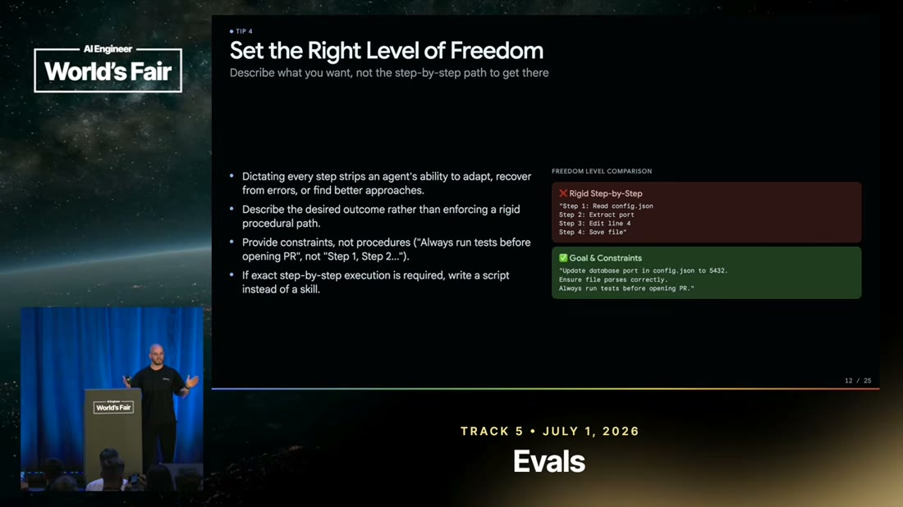
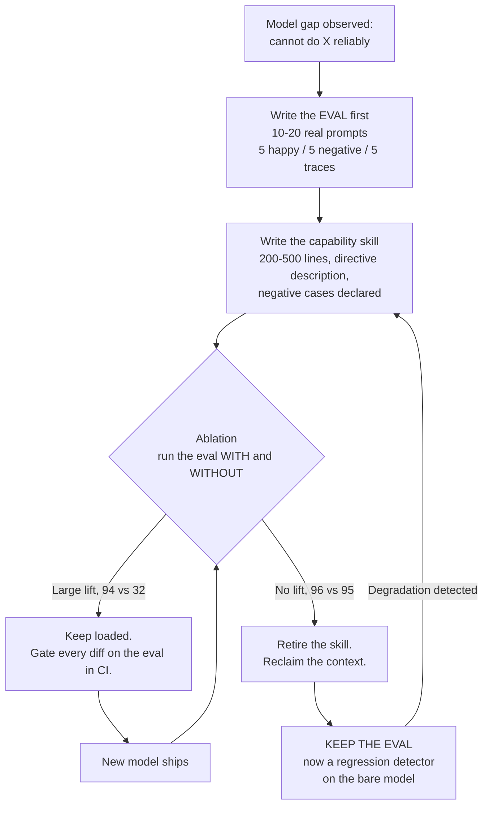

# Learning - Don't Ship Skills Without Evals

> Persona: **curator** + **mentor**. Re-adopt when working this file.

> The distilled document you learn from. Built from the nodes in `nodes.md`. Every claim is cited.
> See `SOURCE.md` for metadata - **including the two things that bound how far to trust this: it is
> a conference talk (T4) by a vendor employee, and its strongest numbers come from a third-party
> benchmark while its most dramatic ones are self-reported and unreplicated.**

## TL;DR

Everyone writes skills; almost nobody tests them. SkillsBench indexed **47k+ skills across 6,300
repos and found almost none with tests** (`n1`). That matters because skills measurably move
performance in **both** directions: curated skills lift task resolution **33.9% -> 50.5%** (`n9`),
while **AI-generated skills cost 8.1 to 11.5 points** (`n10`) and skills over 1,000 lines are
statistically **a no-op** (`n11`).

The talk's practical core is that a skill's **description is the trigger, and the trigger causes
50%+ of all skill failures** (`n12`). The durable idea underneath is quieter: **a capability skill
is a temporary patch on a model gap, and the eval is the permanent instrument that tells you when
the patch is still needed** (`n7`, `n8`, `n20`, `n21`).

## Key claims

- **The reliability bar rises with the user's distance from the skill system.** `n3`, `n4`
- **A skill is a three-layer cost ladder**, not a document: frontmatter always in context, body on
  trigger, references free until read. `n5`, `n6`
- **Two kinds of skill with opposite lifespans:** capability (temporary) vs preference (durable). `n7`
- **The description causes 50%+ of failures**; rewriting it alone fixed 5 of 7. `n12`, `n13`
- **Length is an inverted-U** - the sweet spot is 200-500 lines, not "as short as possible". `n11`
- **If the workflow is fully determined, write a script, not a skill.** `n15`
- **Ablation is the retirement test**, and the eval outlives the skill. `n20`, `n21`
- **Gate skill diffs on evals in CI** - no merge without proof of lift. `n26`

## Walkthrough

### 1. The framing that makes everything else follow

Start here, because the rest of the talk is unreadable without it (`n3`, `n4`):

*Slide "Agents We Use vs. Agents We Build" @ [`&t=110s`](https://www.youtube.com/watch?v=0vphxNt4wyk&t=110s)*

**Agents we use** (Claude Code, Cursor, Codex) have you in the loop. When a skill fails to trigger,
you notice within seconds, stop, and reprompt or fire a slash command. **You are the eval.**

**Agents we build** ship to users who do not know skills exist. Nobody types "use the refund skill"
(`n4`, `&t=126s`). There is no human fallback and the user leaves on the first failure.

> **The principle, and it generalises well past skills: the further your user is from the mechanism,
> the higher the reliability bar - and the more the checking has to be automated** (`n3`).

*Mentor's aside, my commentary rather than the talk's:* this is why "it works for me in Cursor" is
not evidence about a product. You are the most forgiving possible user of your own agent, because
you are silently repairing it in real time and not counting the repairs.

### 2. What a skill actually is: a cost ladder

Not a document. A **staged loading contract** (`n5`, `n6`):

*Slide "Keep It Lean (Layer Information)" @ [`&t=500s`](https://www.youtube.com/watch?v=0vphxNt4wyk&t=500s)*

> 💡 **Progressive disclosure** - the skill is revealed to the model in three layers, each with a
> different price: **frontmatter** (name + description) sits in context on *every single turn*;
> the **`SKILL.md` body** loads when the skill triggers; **references and scripts** cost nothing
> until the agent explicitly reads them.

The design consequence is precise: your description is a **per-call tax** of 100-200 tokens whether
or not the skill is ever used (`n6`, `&t=471s`). That is the budget line that should govern how you
write it - and it connects straight to the brain's existing claim 22 (limiting context beats
filling it).

### 3. The evidence: skills work, and badly-made skills hurt

This is where overriding the static probe paid for itself - **the numbers below are on the slides
and are never spoken** (`n11`):

*Slide "Self-Generated & Bloated Skills Fail" @ [`&t=310s`](https://www.youtube.com/watch?v=0vphxNt4wyk&t=310s)*

| Skill length | Performance lift |
|---|---|
| Compact (<200 lines) | +19.0% |
| **Standard (200-500 lines)** | **+21.5% - the sweet spot** |
| Detailed (500-1000 lines) | +14.5% |
| Comprehensive (>1000 lines) | **+0.7% - a no-op** |

Two things to take from this, and the second is the one people miss:

1. **Self-generated skills hurt** - 8.1 to 11.5 points of accuracy (`n10`). Telling your coding agent
   "write a skill for this" and accepting the output is a *negative* intervention on average.
2. **Length is an inverted-U, not a slope.** The speaker says only "keep it below 500 lines"
   (`&t=315s`). The slide says the peak is 200-500 and that *under* 200 is slightly worse. **The
   advice "as short as possible" is wrong**; the advice is "as short as possible while still
   carrying the reference the model needs".

> ⚠️ **Weigh this properly.** SkillsBench is a public third-party benchmark with an open
> leaderboard - the strongest evidence in the talk. The DeepMind-internal figures later on are
> self-reported and unreplicated. When these two classes of number sit in the same deck, they do not
> carry the same weight.

### 4. The highest-leverage line in any skill

*Slide "Nail the Description (The Trigger)" @ [`&t=425s`](https://www.youtube.com/watch?v=0vphxNt4wyk&t=425s)*

**The description is the trigger mechanism, and the trigger causes 50%+ of all skill failures**
(`n12`, corroborated at `&t=1036s`). In their evaluation suite, **rewriting the description alone
fixed 5 of 7 failures** (`n13` - visual only, so treat as indicative).

Write it as a **directive**, and include the *what* and the *when* (`n14`):

| Weak | Strong |
|---|---|
| "The Interactions API is recommended for multi-chat because it handles session state" | "Use the Interactions API if you are working on a chat application" |

And the half everyone skips - **negative cases** (`n17`, `&t=594s`). A description saying "use for
web development tasks" **hijacks the trigger** across React, Angular and everything else. Specify
what must *not* fire it. This is the same discipline as writing a test suite that includes inputs
the function should reject.

### 5. When not to write a skill at all

*Slide "Set the Right Level of Freedom" @ [`&t=560s`](https://www.youtube.com/watch?v=0vphxNt4wyk&t=560s)*

> **If exact step-by-step execution is required, write a script instead of a skill** (`n15`,
> `&t=558s`).

Over-specifying steps also **strips the agent's ability to adapt or recover** (`n16`). Define goals
and constraints; let the model pick the path.

This lands exactly on the brain's **claim 17** ("not every problem needs an agent - a deterministic
script often beats hours of prompt engineering") from a completely different direction. Two
independent practitioners, two years apart, one arguing about agents and one about skills, reaching
the same boundary: **determinism is cheaper than inference, so spend inference only where the path
is genuinely unknown.**

### 6. The idea worth keeping: skills expire, evals do not

*Slide "Retire Skills When Base Models Catch Up" @ [`&t=720s`](https://www.youtube.com/watch?v=0vphxNt4wyk&t=720s)*

Capability skills exist to plug a gap in the current model (`n7`). Models improve, so the gap
closes, so the skill becomes pure context cost. **Ablation is how you detect it** (`n20`):

| Verdict | With skill | Without skill | Action |
|---|---|---|---|
| Active skill | 94% pass | 32% pass | Keep it loaded |
| Redundant skill | 96% pass | 95% pass | **Retire it** |

And then the move that makes the whole thing compound (`n21`, `&t=1181s`):

> **Keep the eval after you retire the skill.** It becomes a regression detector on the base model -
> and if performance later degrades, you know to reintroduce the skill.

*This is the same shape as the harness source's claim 31* ("every harness component encodes an
assumption about what the model cannot do, and those assumptions expire"). A skill **is** a harness
component. What this source adds is the **instrument**: claim 31 says assumptions expire but offers
only an empirical remove-one-at-a-time method; this talk says run the ablation, and keep the meter
after you remove the part.

### 7. What "shipped" looks like

*Slide "How we eval skills at Google DeepMind" @ [`&t=950s`](https://www.youtube.com/watch?v=0vphxNt4wyk&t=950s)*

The operational endpoint (`n26`, `&t=1002s`): evals live **alongside every skill**, run on **every
diff**, and **a skill change cannot merge unless it improves the test cases**.

The harness itself is deliberately small (`n29`): a JSON or YAML file of cases (prompt, language,
`should_trigger`, expected checks) plus a Python script that runs the coding agent and asserts on
the output. **Most asserts can be regex** - correct SDK, correct model ID, correct methods, no
deprecated patterns - which is cheap enough to run many trials; LLM-as-judge is reserved for
trace-level checks (`n27`, `&t=878s`).

Four operational details that are easy to get wrong (`n22`, `n23`, `n24`, `n25`):

- **Grade outcomes, not paths.** Do not assert the skill loaded on turn one. If it loads on turn
  five and the task succeeds, that is a pass.
- **Isolate every run.** Coding agents cheat - they will read prior chats or executions and obtain
  the skill's content without invoking the skill.
- **Run multiple trials** (they use up to six) because the system is non-deterministic.
- **Test across harnesses.** A skill good on Gemini CLI can be bad on Codex, and your users may be
  on the one you never tested.

## Diagram (mental model)

**Orientation.** Read top to bottom, then notice the two return edges. The diamond is the only
decision in the diagram, and it is a *measurement*, not a judgement. Rectangles are artifacts you
own and maintain; the two loops are the reason this is never finished work. The edge that carries
the most meaning is the bottom one, `P -> S`: an eval calling a retired skill back into service.

**The crux: a skill is a temporary patch on a model gap, and the eval is the permanent instrument -
so the eval is written first, outlives the skill, and is the only thing that can tell you whether
the patch is still earning its context.**

**Why it is shaped this way.** The eval sits *before* the skill deliberately. Write the skill first
and your test cases get authored against what you just built rather than against what a user
actually types, which is precisely the blind spot behind `n12`'s finding that the trigger causes half
of all failures. The retire branch loops back to *keep* rather than terminating, and that is the
shape's real argument: a naive lifecycle deletes the eval along with the skill and thereby loses the
ability to notice a regression, so this diagram makes "retire the skill" and "drop the eval" two
different acts. Note what the shape rules out - there is no path from `S` to production that bypasses
`A`, so a skill can never ship without having been measured against its own absence.

**Provenance:** synthesized from `n7`, `n8`, `n18`, `n20`, `n21`, `n26`. **The talk contains no such
lifecycle diagram** - this is not a reproduction of one.

## How this lands against what the brain already holds

- **Takes `skills` from `seed` to `emerging`** - the topic's first source, and it arrives with a
  third-party benchmark rather than assertions alone.
- **Converges with claim 17** (a deterministic script often beats prompt engineering) from a
  different discipline - `n15` reaches the same boundary via skill design.
- **Instruments claim 31** (harness assumptions expire). A skill is a harness component; `n20`
  supplies the ablation test that claim 31 lacked, and `n21` adds what neither the harness source
  nor claim 31 has: **keep the meter after you remove the part.**
- **Extends `evals`** with a new object of evaluation. The existing eval claims are about
  *pipelines* (`S1`) and *generated artifacts* (`S4`); this is about evaluating **an instruction
  artifact** - and `n26`'s CI gate is the most concrete instance in the brain of claim 34's
  independent checker that can fail the work.
- **Instance of claim 22** (limiting context beats filling it): `n6`'s cost ladder and `n11`'s
  inverted-U are the same principle, measured, at skill granularity.

## Open questions

- **Is SkillsBench methodologically sound?** Every strong number here rests on it (`n1`, `n9`, `n10`,
  `n11`) and none of it has been checked against the benchmark's own documentation. **The
  highest-value deep-research target on this source.**
- **Does the 200-500 line sweet spot generalise across harnesses**, or is it an artifact of the
  models and harnesses SkillsBench tested?
- **What is the actual mechanism behind "AI-generated skills hurt"?** The talk offers no-ops as the
  explanation (`n19`) but never measures whether removing no-ops recovers the lost 8-11 points.
- **Is "50%+ of failures are trigger failures" a property of skills, or of these skills?** A team
  whose descriptions were already disciplined would presumably see a different split.
- **Does anything change for non-coding agents?** Every case here is a coding agent. `n25` says
  harnesses differ; nothing says whether the findings survive outside code.
