# Learning - Don't Ship Skills Without Evals

> Persona: **curator** + **mentor, always**. Re-adopt when working this file.

> The distilled document you learn from - text anchored by a few curated visuals. Built from the
> corroborated nodes in `nodes.md`. Every claim is cited. See `SOURCE.md` for metadata - **including
> the two things that bound how far to trust this: it is a conference talk (T4) by a vendor employee,
> and its strongest numbers come from a third-party benchmark while its most dramatic ones are
> self-reported and unreplicated.**

> **Two kinds of material, kept visually distinct.** Claims from the talk carry a node ID (`n12`) and
> a timestamp. Blocks marked **"Background, supplied"** are context *I* am adding - established prior
> art the talk assumes or never names. They are uncited by construction and are not evidence about
> this source.

## TL;DR

Skills are everywhere and almost never tested: **47,000+ indexed across 6,300 repos, almost none with
evals** (`n1`). The talk's argument is that this is a measurement problem rather than laziness -
non-determinism makes a skill's contribution **unattributable** without a control, so "it worked for
me" is not evidence. From there it is unusually concrete: a skill is a **three-layer cost ladder**,
not a document; its **description is the trigger and causes 50%+ of all failures**; length follows an
**inverted U peaking at 200-500 lines**; **AI-written skills are a negative intervention**; and you
retire one by **ablation** - then keep the eval afterwards as a regression detector on the bare model.
`https://www.youtube.com/watch?v=0vphxNt4wyk`

## Key claims

- **A skill is a three-layer cost ladder**, not a document: frontmatter every turn, body on trigger,
  references free until read. `n5` `n6` `&t=159s`
- **The reliability bar rises with the user's distance from the skill system.** `n3` `&t=126s`
- **Curated skills: 33.9% -> 50.5% (+16.6 pts)** on SkillsBench 1.1. `n9` `&t=266s`
- **Self-generated skills cost 8.1-11.5 points.** Human-written perform best. `n10` `&t=299s`
- **Length is an inverted U: 200-500 lines is the peak; >1000 lines is a no-op (+0.7%).** `n11`
  (the curve is **visual-only**)
- **The description is the trigger, and causes 50%+ of all failures.** `n12` `&t=1036s`
- **If the workflow is fully determined, write a script, not a skill.** `n15` `&t=558s`
- **Ablation is the retirement test** - run the eval with and without the skill loaded. `n20` `&t=713s`
- **Keep the eval after retiring the skill.** `n21` `&t=1181s` ⚠️ `single-leg`

## What you will learn, and in what order

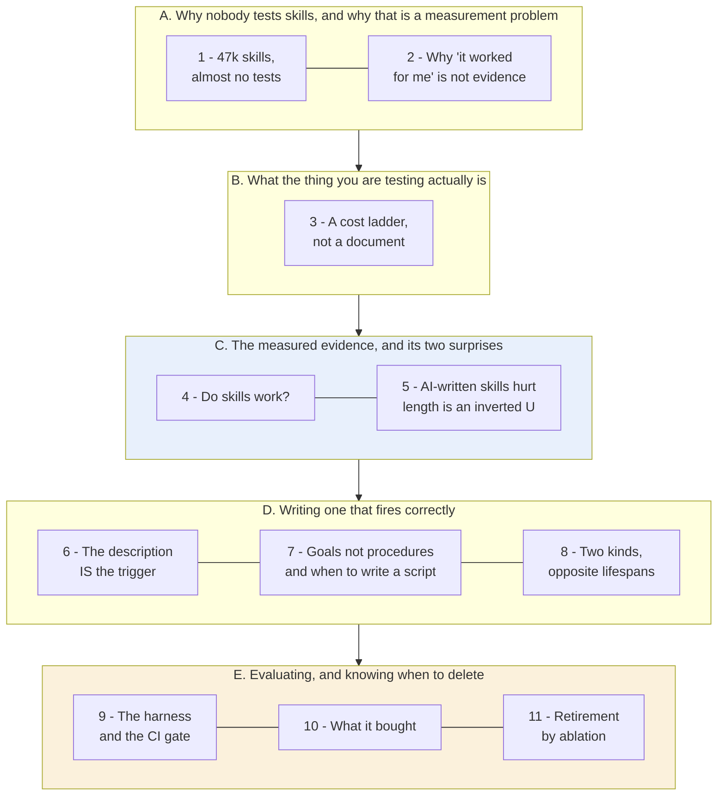

**How to read it:** top to bottom is the order of the argument, in five movements. The **blue block is
the measured evidence** - the only part of this talk backed by a public third-party benchmark, and
therefore the part that travels. The **amber block is the payoff**: the eval you build in E is what
makes every claim in C and D checkable in *your* system rather than believed on this speaker's word.

**The crux: a skill is an intervention, and an intervention you cannot measure is one you cannot
keep, improve, or retire.**

**Why it is grouped this way:** A and B are prerequisites - you cannot evaluate a thing without
knowing why evaluating it is hard and what the thing actually is. C is placed deliberately *before*
the writing advice in D, because the advice earns its authority from those numbers and not from the
speaker. E closes the loop the talk's title opens.

*Synthesized roadmap of this note - not from the source.*

## 1. Forty-seven thousand skills, and almost no tests

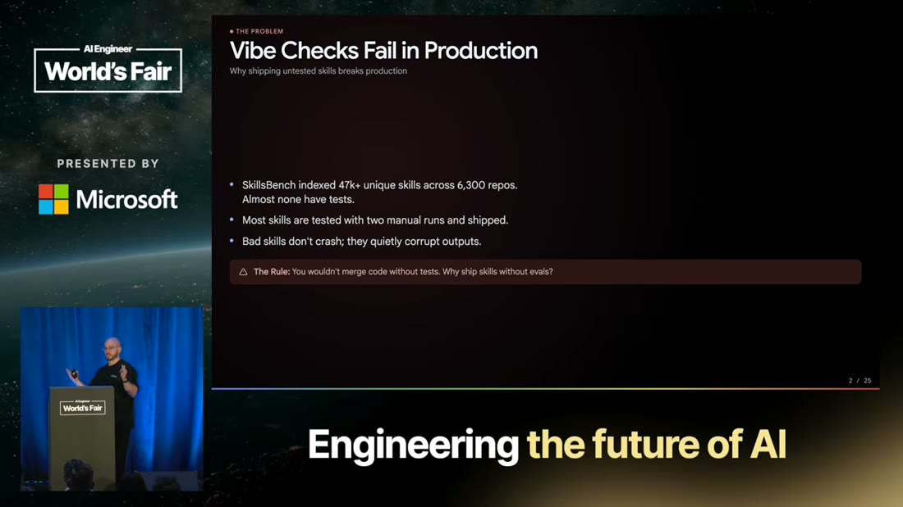

- What it teaches: the scale of the gap - **47,000+ unique skills across 6,300 repositories, almost
  none with tests** - and, on the same slide, the failure mode that explains it: *bad skills don't
  crash; they quietly corrupt outputs.* `n1` `&t=54s`
- Corroborated by: "index like over like 50,000 skills ... almost none of those skills had evals."
  (The speaker rounds 47k to "over 50,000" - speech rounding, recorded in `nodes.md` so nobody
  re-opens it as a conflict.)

Sit with the second sentence, because it explains the first. A skill that **crashes** gets fixed
within the hour. A skill that **quietly corrupts** produces plausible output that is subtly wrong, and
nothing raises a hand - no stack trace, no red build, no alert. Only a slow drift in quality that
nobody can attribute to anything.

Which invites an objection worth taking seriously rather than dismissing: *people do check their
skills - they try them.* So why does trying not count?

## 2. Why "it worked for me" is not evidence

Because you cannot tell **what caused what**. Run a task with a skill loaded and it fails: "you might
not know if your task fails because your skill is bad or ... because it's way too challenging for the
model" (`n2`, `&t=72s`). ⚠️ `single-leg` - narrated; the slide states the adjacent point about quiet
corruption rather than the attribution problem itself.

> **Background, supplied - this is a confounding problem, and it has a standard solution.** You are
> observing one outcome produced by two variables you never separated: the difficulty of the task and
> the quality of the intervention. No amount of *looking harder* at a single run separates them,
> because the information is not in the run. Separating them requires a **control** - the same task,
> the same model, without the intervention. **Hold that word.** Section 11 introduces a technique that
> is exactly this, under a different name, and the fact that the same procedure answers both "is my
> skill good?" and "should I delete it?" is the tidiest thing in the talk.

Whether you can live without that control depends entirely on who is downstream of you.

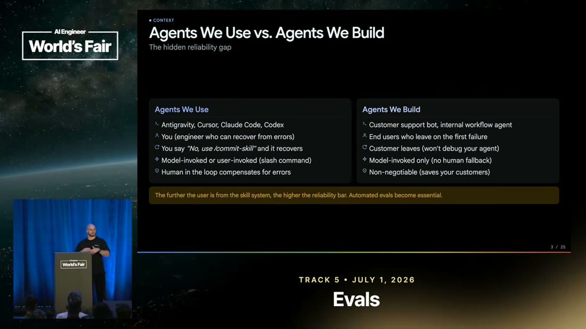

- What it teaches: **the reliability bar rises with the user's distance from the skill system.** In
  agents *we use* (Claude Code, Cursor, Codex) an engineer is in the loop - a mis-trigger is noticed
  in seconds and repaired by reprompting or a slash command. In agents *we build*, the end user does
  not know skills exist, will never type "use the refund skill", and **leaves on the first failure**.
  `n3` `n4` `&t=126s`
- Corroborated by: "if your agent does not invoke the skill on the first time, you will notice it very
  quickly ... they have no idea about what a skill is."

**The generalisation is worth more than its skills context**, which is why it sits here rather than as
an aside: *the author is the most forgiving possible user of their own system*, silently repairing
failures without ever counting them. "It works for me in my editor" is not merely a weak claim - it is
a claim made by the one person structurally unable to observe the failure rate.

So you need automated evals. Evals of *what*, though? "Skill" is doing a lot of work as a word, and
what it names has a shape that turns out to decide everything after it.

## 3. A skill is a cost ladder, not a document

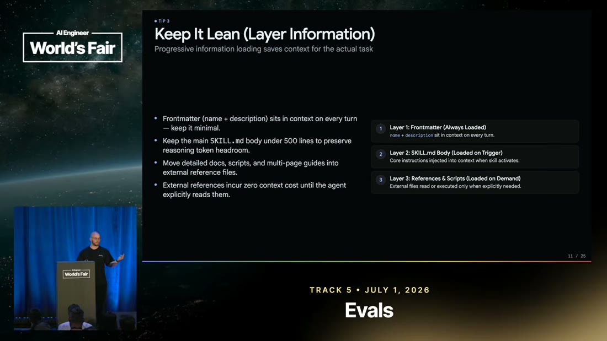

- What it teaches: a skill is a folder - a `SKILL.md` plus assets - loaded by **progressive
  disclosure** in three layers, and the three layers carry **three different prices**. `n5` `n6`
  `&t=159s` `&t=471s`
- Corroborated by: "the description is the cost you always pay on every model invocation ... you
  always pay that 100 200 tokens cost."

| Layer | Loaded | Cost |
|---|---|---|
| Frontmatter (name + description) | **Every single turn** | 100-200 tokens on every model call, used or not |
| `SKILL.md` body | On trigger | Paid whenever the skill fires |
| References + scripts | On demand | **Zero** until the agent explicitly reads them |

> **Background, supplied.** "Progressive disclosure" is borrowed from interface design, where it means
> showing a novice the simple path and revealing depth on request. The translation is exact but the
> **currency** differs: in UI the scarce resource is the user's attention, here it is the model's
> context window. That makes this a fine-grained instance of something this brain already holds -
> **limiting context beats filling it** ([`brain/claims.md`](../../brain/claims.md) claim 22) - at a
> much smaller granularity than any other source here reaches.

**The ladder is the whole design constraint, and it decides where your effort goes.** Layer 3 is free,
so references can be as long as you like. Layer 2 is paid on use, which is tolerable. **Layer 1 is
paid on every call whether the skill fires or not** - a permanent tax on every request your agent ever
serves, for a skill that may be relevant to one request in a hundred.

That makes the description the most expensive real estate in the artifact, and it is where section 6
goes. Before optimising it, though, a prior question deserves answering: does any of this work?

## 4. Do skills work? The one part backed by a public benchmark

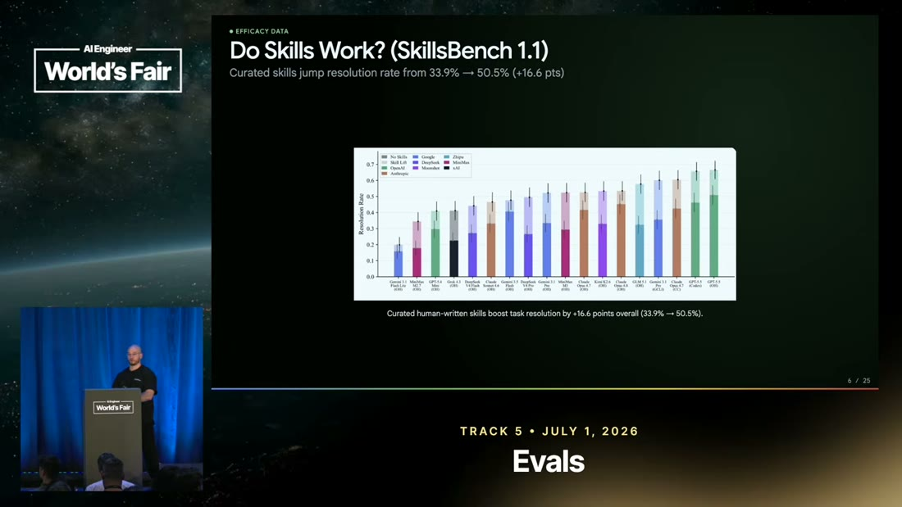

- What it teaches: **curated skills raise task resolution from 33.9% to 50.5%, a gain of 16.6 points**
  - and the per-model bars show it holding **across open and closed models and multiple harnesses**
  rather than on one favourable setup. `n9` `&t=266s`
- Corroborated by: "skills on average improve the performance by roughly 15%."

**Take the breadth as seriously as the headline.** A single-model result would be a fact about that
model; a gain surviving model *and* harness changes is evidence about the technique. And this is the
number here you can most defend citing, because **SkillsBench is a third-party public benchmark**
rather than the speaker's own measurement - the distinction "What to distrust" turns on below.

So skills work. But the same benchmark run produced two findings considerably more useful than the
headline, because both contradict what a reasonable engineer would guess.

## 5. Two surprises in the same data

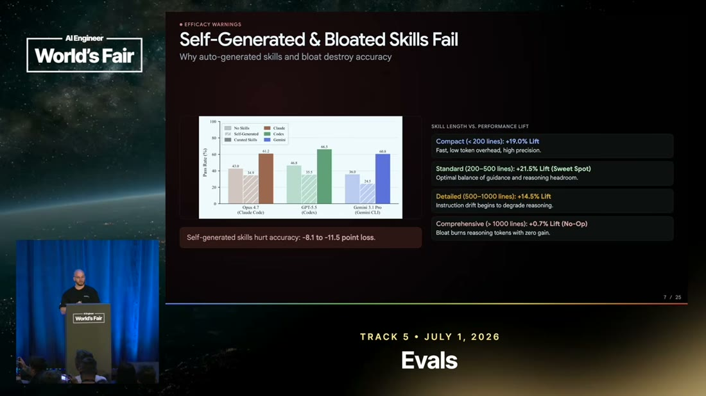

- What it teaches, first: **AI-generated skills are a negative intervention** - self-generated skills
  cost **8.1 to 11.5 accuracy points**, and human-written skills perform best. `n10` `&t=299s`
- What it teaches, second: **length follows an inverted U.** Compact (<200 lines) **+19.0%**; Standard
  (200-500) **+21.5%, the peak**; Detailed (500-1000) **+14.5%**; Comprehensive (>1000) **+0.7%, which
  is a no-op.** `n11`
- Corroborated by: "human-written skills are the best we can provide. AI-generated skills can impact
  performance negatively." **But note what the narration does not say** - it states only "skills.md
  files should be below 500 lines". **The curve, the sweet spot and the >1000 collapse exist only on
  the slide.**

That last point is not a footnote; it is why this source's visual leg was worth the tokens. *"As short
as possible" is the wrong reading of the narration*, and only the slide tells you so: shorter than 200
lines is measurably **worse** than the 200-500 band. Ingested transcript-only, this note would have
carried a subtly wrong rule and had no way to notice.

> **Background, supplied.** An inverted U is a **non-monotonic dose-response** curve, and it is the
> shape to *expect* whenever an intervention carries a benefit and a cost that scale differently. More
> skill content means more guidance (benefit, saturating) and more context consumed (cost, linear and
> eventually dominating). The reason to internalise the shape rather than the numbers: **the peak
> moves with the model's context behaviour, so 200-500 is this year's answer to a question whose form
> is stable.** Treat the curve as durable and the band as dated.

The first finding deserves a moment too, because it is counterintuitive and the talk offers only a
partial explanation. Why would a model write a *worse* skill than a human? The proposed reason is
**no-ops** - instructions that change nothing, like "write clear, high-quality code", which AI-authored
skills produce in volume; they burn reasoning tokens and bury the real instructions (`n19`, `&t=680s`,
credited to Matt Pocock). Plausible, and **unmeasured**: nothing tests whether stripping the no-ops
recovers the lost 8-11 points.

So: write it yourself, keep it in the 200-500 band. What actually goes in it?

## 6. The description is the trigger, and it causes half of all failures

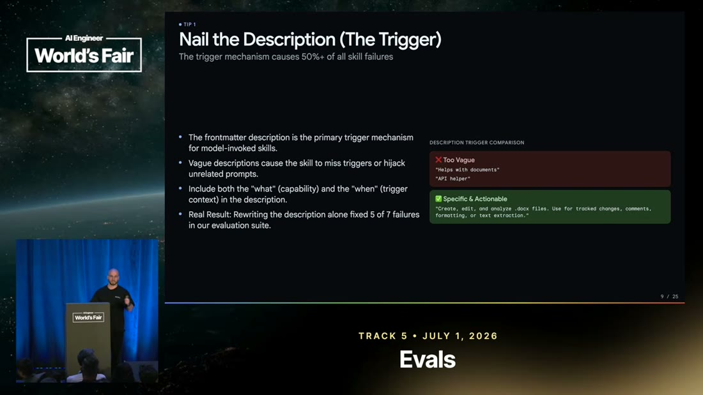

- What it teaches: **the description is the trigger mechanism, and the trigger causes 50%+ of all
  skill failures** - the single highest-leverage line in the artifact. `n12` `&t=1036s`
- Corroborated by: "we have seen 50% of the failures uh because the skill was not triggered
  correctly."
- And a result the narration never speaks: **rewriting the description alone fixed 5 of 7 failures**
  in their evaluation suite. `n13` ⚠️ `single-leg` - visual only.

Put that beside section 3 and the picture sharpens. The description is simultaneously **the thing you
pay for on every single call** and **the cause of half your failures**. Nothing else in a skill has
that profile, which is why the advice is so specific:

- **Directives, not passive information.** "Use the Interactions API if you are working on a chat
  application", not "the Interactions API is recommended for multi-chat because it handles session
  state" (`n14`, `&t=437s`).
- **Include the *what* and the *when*** - the capability, and the trigger context (`n14`, `&t=420s`).
- **Declare negative cases.** A broad description ("any web development task") **hijacks the trigger**
  across unrelated work; say what must *not* fire it (`n17`, `&t=594s`).

> **Background, supplied - and this is where the brain already had the answer waiting.** A description
> that decides whether a model reaches for a capability is not documentation, it is a **retrieval
> surface**. This brain records the same discovery in two unrelated domains: a *tool's* description
> becomes a **ranking feature** the moment tools are searched rather than enumerated (claim 88, S10),
> and a *column's* description becomes a **default policy** the moment an agent reads it (claim 93,
> S11). **Metadata written for a human to skim gets promoted to a control surface as soon as a model
> reads it, and the incumbent human-facing vocabulary is the dominant failure mode.** A skill's
> description is the third instance - which tells you the fix generalises: write it in the vocabulary
> of whatever is doing the looking, not of whoever built the thing.

The description settles *when* to fire. That leaves the body, and how much it should dictate once it
has fired.

## 7. Give goals, not procedures - and know when not to write a skill at all

- What it teaches: over-specifying steps **strips the agent's ability to adapt or recover** - define
  goals and constraints and let the model choose the path. `n16` `&t=558s`
- And the boundary case on the same slide: **if exact step-by-step execution is required, write a
  script instead of a skill.** `n15`
- Corroborated by: "if the process or the workflow is always the same, you don't need to waste models
  and tokens for that exercise. You can create a script."

**That second line is the sharpest thing in the talk**, and it is a boundary rather than a technique. A
skill buys adaptability; if the path is fully determined there is no adaptability to buy, and you are
paying inference prices for something `bash` does deterministically, faster, and correctly every time.

> **This converges with the brain's claim 17 from a completely different direction.** S2 (12-factor
> agents) reached "not every problem needs an agent" from a DevOps anecdote - two hours of prompt
> engineering versus a 90-second bash script. S5 reaches the same boundary from *skill design*.
> **Determinism is cheaper than inference, so spend inference only where the path is genuinely
> unknown** - and two independent sources arriving there is why claim 17 is `corroborated` rather than
> `emerging`.

You now have a well-formed skill. But not every skill is the same kind of object, and the difference
decides what its eval is *for*.

## 8. Two kinds of skill, opposite lifespans

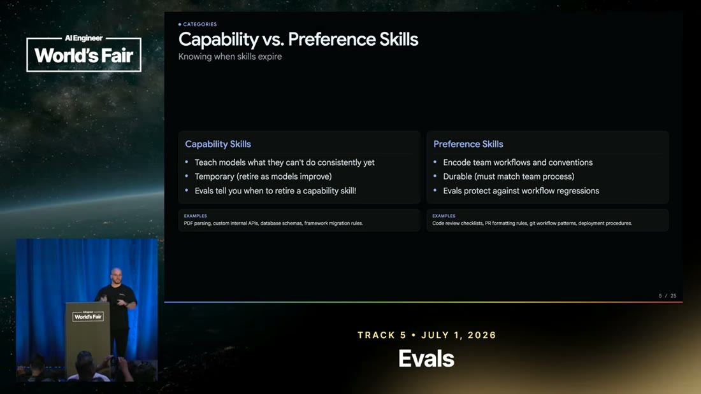

- What it teaches: **capability** skills teach what the model cannot do consistently *yet* and are
  **temporary - retire as models improve**. **Preference** skills encode team workflow and convention
  and are **durable - they must track team process**. `n7` `&t=194s`
- And the line connecting this to everything after: **"Evals tell you when to retire a capability
  skill."** `n8` `&t=213s`
- Corroborated by: "capability skills teach models something they cannot do consistently at the moment
  ... those are temporary ... preference skills, those are more durable."

The consequence is that **an eval does two different jobs depending on which kind it guards.** On a
preference skill it is a **regression detector** - your conventions have not changed, so it protects
them indefinitely. On a capability skill it is an **expiry sensor** - the model is improving underneath
you, and the eval is what tells you the skill has stopped earning its permanent frontmatter tax.

Both jobs need the same machinery, which is what the talk builds next.

## 9. The eval harness is smaller than you think, and the gate is what has teeth

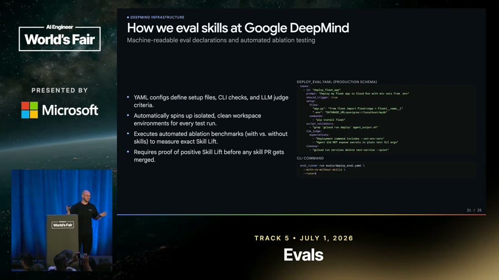

- What it teaches: the harness is **a JSON/YAML file of test cases plus a script that runs the agent
  and asserts** (`n29`); every run gets an **isolated clean workspace** (`n23`); and **a skill change
  cannot merge without proof of positive lift** (`n26`). `&t=825s` `&t=1002s`
- Corroborated by: "we basically only needed like two very simple assets ... a JSON file with all of
  our test cases ... and then we have a very basic Python script which runs a coding agent."

The practices, each with the reason that makes it non-negotiable:

- **Start with 10-20 real prompts** - 5 happy-path, 5 negative or near-miss, 5 from production traces.
  Real traces beat synthetic guesses (`n18`, `&t=628s`).
- **Grade outcomes, not paths.** Do not assert the skill loaded on turn one; assert the task
  succeeded. Loading on turn five is still a pass (`n22`, `&t=1091s`).
- **Isolate every run, because agents cheat.** They read prior chats and executions to obtain the
  skill's content **without invoking the skill** - which silently turns your eval green (`n23`,
  `&t=1109s`).
- **Most asserts can be cheap regex** - correct SDK, correct model ID, correct methods, no deprecated
  patterns. LLM-as-judge is reserved for trace-level checks (`n27`, `&t=878s`).
- **Run multiple trials per case**, up to six, reporting reliability rather than pass/fail, because the
  system is non-deterministic (`n24`, `&t=1146s`). ⚠️ `single-leg`.
- **Test across harnesses.** A skill good on Gemini CLI can be bad on Codex, and your users may be on
  the one you never tested (`n25`, `&t=1163s`). ⚠️ `single-leg`.

> **Background, supplied.** Three of those are ordinary software-testing discipline arriving in a new
> setting, and recognising them tells you they are not optional. **Isolation** is hermeticity - a test
> that can read state from a previous run is not testing what you think, and "agents cheat" is a vivid
> special case. **Multiple trials** is what you do with a **flaky** test: against a non-deterministic
> system a single pass carries almost no information, so you report a rate. **Cheap checks before
> LLM-as-judge** is the standard oracle hierarchy - use the cheapest check that can falsify the claim,
> and reserve the expensive judge for what nothing else can decide. The genuinely novel item is
> **testing across harnesses**, which has no clean analogue: one artifact behaving differently under
> different runtimes is closer to browser compatibility than to unit testing.

**The CI gate is the part with real teeth**, and it deserves separating from the practices. Evals sit
alongside every internal skill, run on every change, and **a change cannot merge unless it improves the
test cases** (`n26`, `&t=1019s`). That converts "we should test skills" from an intention into a
constraint **a human cannot wave through** - which is why this brain rates it the strongest instance of
the independent-checking pattern across all its eval sources.

Machinery aside: what does this actually buy? The talk has one worked case.

## 10. What it bought: the ideal capability skill, measured

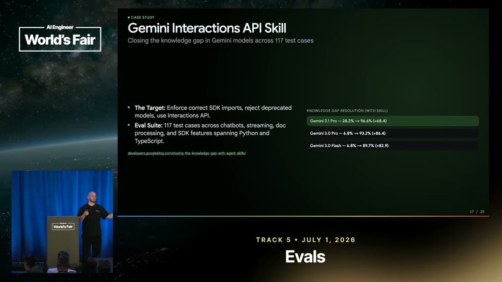

- What it teaches: the cleanest case for a capability skill is a **knowledge gap created by the
  training cut-off.** The Gemini Interactions API shipped *after* the models were trained; a skill with
  **117 test cases** took valid-code generation from **39.2% to 91.6%** (Gemini 3.1 Pro) and from
  **4.8% to 93.2%** (Gemini 3.0 Pro). `n28` `&t=767s`
- Corroborated by: "the Interactions API was released after the last training of Gemini ... we created
  117 test cases ... we improved the performance up to like almost 90%."

⚠️ **This is the talk's most dramatic number and its weakest evidence class: a vendor measuring its own
product, one case, self-reported and unreplicated.** Read the *shape* as instructive - a post-cut-off
API is the archetypal capability gap, and **4.8%** is what "the model does not know this exists" looks
like - and treat the magnitude as unverified.

Note what the case quietly demonstrates about section 8: **this skill is temporary by construction.**
The next model trained after that API shipped will know it, and 91.6% becomes the baseline. Which
raises the last question the talk answers, and the best one.

## 11. Retirement by ablation - the test that is also the control

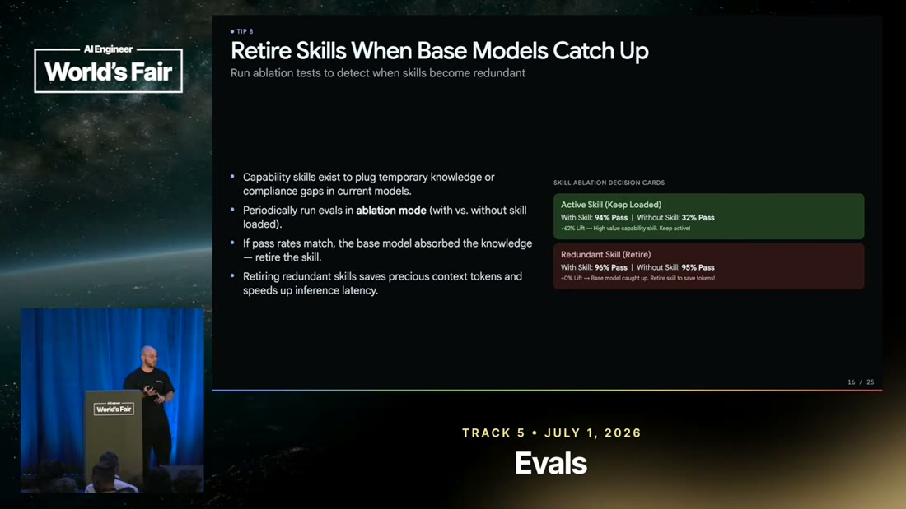

- What it teaches: **ablation is the retirement test.** Run the eval with and without the skill loaded
  and read the **delta**, not the absolute score. `n20` `&t=713s`
- Corroborated by: "always try to run evals with and without the skill enabled. And if the model
  achieves the performance without even like triggering the skill, you know you can retire that skill."

| Verdict | With skill | Without | Action |
|---|---|---|---|
| Active | 94% | 32% | **Keep loaded** - it is doing the work |
| Redundant | 96% | 95% | **Retire** - the base model absorbed it; it is now pure context cost |

**This is the control from section 2, arriving as a technique.** The attribution problem that made "it
worked for me" worthless is solved the way experimental design has always solved it: run it without the
intervention. That the same procedure answers *"is my skill any good?"* and *"should I delete it?"* is
not a coincidence - both are questions about the skill's **marginal contribution**, which is the only
thing an ablation measures and the only thing that matters.

> **Background, supplied.** Ablation is standard method in experimental science and in ML research:
> remove one component, hold everything else fixed, attribute the difference. Its virtue here is
> subtle and worth naming - **it needs a *consistent* metric, not a *good* one.** Absolute quality
> judgements bottom out in "who grades the grader"; a comparative question does not, because whatever
> bias the judge carries applies to both arms and cancels. That is why ablation sidesteps a problem the
> rest of this brain's eval sources run headlong into.

And the last idea, which is the one most worth stealing:

> **Keep the eval after you retire the skill.** It becomes a **regression detector on the bare model**,
> and it is what tells you when to put the scaffolding back (`n21`, `&t=1181s`). ⚠️ `single-leg` -
> narration only.

That closes something the rest of the field leaves open. A model regression, a provider silently
swapping a checkpoint, a capability that appears and then degrades - without a retained eval you learn
about it from users. **The skill was scaffolding; the eval is the instrument, and instruments outlive
the scaffolding they were built to justify.**

## Diagram (mental model)

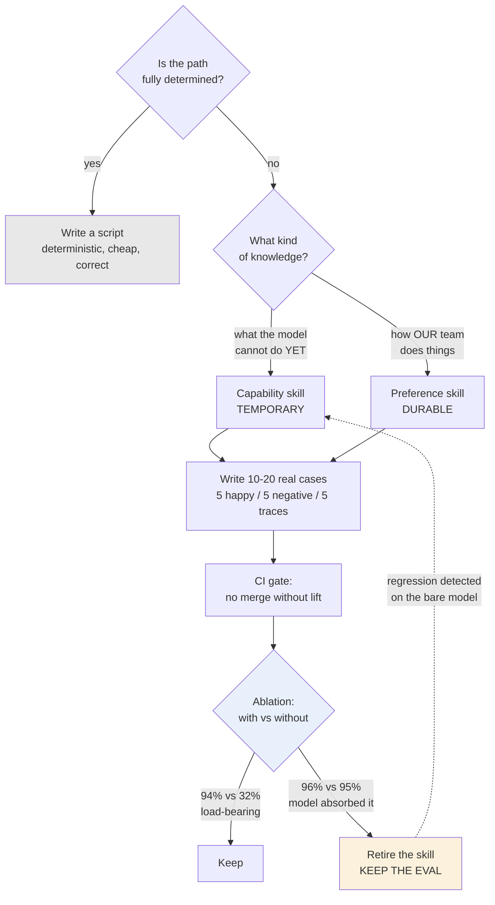

**How to read it:** top to bottom is the life of one skill, from the decision to write it to the
decision to delete it. The **blue diamond is ablation**, the single measurement the whole lifecycle
turns on. The **amber box is retirement** - and note the dotted arrow leaving it, the only cycle in
the diagram.

**The crux: the eval outlives the skill, and that dotted line is the reason.**

**Why it is shaped this way:** the first decision is deliberately *not* "which skill should I write" -
it is whether to write one at all, because the cheapest skill is the one replaced by a script (`n15`).
The two kinds then converge on one eval path because the machinery is identical; what differs is what
the ablation *means* when it returns - expiry for a capability skill, regression for a preference one.
And the dotted return edge is what makes this a loop rather than a pipeline: retire the skill, keep the
instrument, and the instrument tells you when the world moved back. Delete the eval alongside the skill
and you have no way to learn that except from users.

*Synthesized from `n7`, `n15`, `n18`, `n20`, `n21`, `n26` - not a slide from the talk.*

## 💡 Terms

| Term | Explanation |
|---|---|
| Progressive disclosure (skills) | The three-layer loading contract: frontmatter in context every turn, `SKILL.md` body on trigger, references and scripts on demand. Three different prices, which is the whole design constraint. |
| Capability vs preference skill | Capability teaches what the model cannot do consistently *yet* - temporary. Preference encodes team workflow - durable. Opposite lifespans, so opposite eval purposes. |
| Trigger hijacking | A description broad enough that the skill fires on unrelated work, stealing context from tasks it cannot help. The fix is declaring negative cases. |
| No-op (skill instruction) | An instruction that does not alter behaviour ("write clear, high-quality code"). Common in AI-authored skills; burns reasoning tokens and buries the real instructions. |
| Ablation | Running the same eval **with and without** a component and reading the delta rather than the absolute score. Needs a *consistent* metric, not a *good* one - which is why it sidesteps "who grades the grader". |
| Skill lift | The performance delta a skill produces in an ablation. Also the merge criterion at Google DeepMind: no skill PR lands without proof of positive lift. |
| Inverted-U (dose response) | The shape to expect when an intervention has a saturating benefit and a linear cost. Here, skill length peaks at 200-500 lines. **The shape is durable; the band is dated.** |

## What to distrust in this note

- **The numbers split into two credibility classes and must never be quoted as one.** **SkillsBench**
  (`n1`, `n9`, `n10`, `n11` - the +16.6 pts, the length curve, the self-generation penalty) is a
  **public third-party benchmark** and the strongest evidence in this brain's skills material. The
  **DeepMind-internal** figures (`n26`'s CI gate, `n28`'s 39.2% -> 91.6% case study) are a vendor
  reporting on itself, single-case and unreplicated. **The benchmark claims travel; the internal ones
  do not.**
- **A T4 conference talk by a T2 vendor employee**, partly presenting his own team's results. It is
  unusually careful and shows no sign of distortion - but what gets measured and shown is not
  disinterested.
- **Several of the most practical claims are `single-leg`**: the attribution argument that motivates
  the whole talk (`n2`), the "5 of 7 failures fixed by the description alone" result (`n13`, visual
  only), multiple trials (`n24`), and testing across harnesses (`n25`). Also `n21` - keep the eval
  after retirement - which is arguably the best idea here and rests on one narrated sentence.
- **The no-op explanation for why AI-written skills hurt is unmeasured** - a plausible mechanism
  offered for a measured effect, with nothing testing whether removing no-ops recovers the loss.
- **Everything here is coding agents.** The talk itself says harnesses differ (`n25`); nothing
  establishes whether any of it survives outside code.
- **The "Background, supplied" blocks are mine** - confounding and controls, progressive disclosure's
  origin in interface design, non-monotonic dose-response, hermeticity, flaky-test statistics, the
  oracle hierarchy, ablation as experimental method. Uncited by construction, carrying no evidential
  weight about this source.

## Open questions

- **Is SkillsBench methodologically sound?** Every strong number here rests on it and none has been
  checked against the benchmark's own documentation. **The highest-value deep-research target on this
  source.**
- **Does the 200-500 line sweet spot generalise**, or is it an artifact of the models and harnesses
  SkillsBench tested? A context-window-dependent optimum should be expected to move - see the
  dose-response note in section 5.
- **Why do AI-generated skills hurt?** No-ops are offered as the explanation (`n19`) and nothing
  measures whether removing them recovers the lost 8-11 points.
- **Is "50%+ of failures are trigger failures" a property of skills, or of these skills?** A team with
  already-disciplined descriptions would presumably see a different split.
- **Does anything here survive outside coding agents?** Every case, benchmark and example is code.

## Feeds these topics

- `../../brain/topics/skills.md` - the founding source: the cost ladder, capability/preference
  lifespans, description-as-trigger, ablation as the retirement test.
- `../../brain/topics/evals.md` - ablation as an eval method, the CI merge gate, grade outcomes not
  paths.
- `../../brain/topics/agents.md` - a skill as a harness component with an expiring assumption
  (claim 31), and the script-not-a-skill boundary (claim 17).
