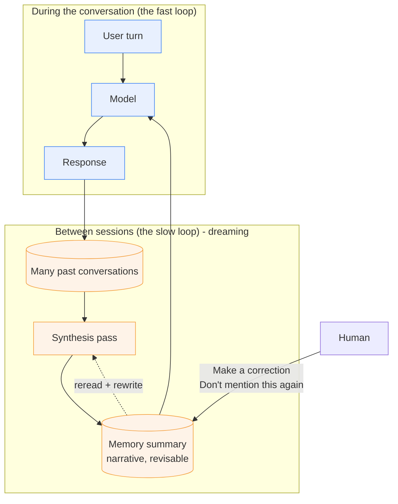

# Learning - Dreaming: Better memory for a more helpful ChatGPT

> Persona: **curator** + **mentor**. Re-adopt when working this file.

> The distilled document you learn from - text anchored by a few curated visuals. Built from the
> gated nodes in `nodes.md`. Every claim is cited. See `SOURCE.md` for metadata.

## TL;DR

OpenAI describes replacing a **write-once memory** with a **background process that rewrites memory
between sessions**, which it calls **dreaming**. The transferable idea is not the feature - it is the
diagnosis: memory written *during* a conversation inherits that conversation's tense, and therefore
decays into wrongness rather than into irrelevance. The fix is architectural: move the write off the
conversation turn, change the representation from a list of facts to a maintained narrative, and
**revise** stale entries rather than expiring them. **Read it for the mechanism and the failure
taxonomy; take no numbers from it** - the article's three eval charts do not survive capture, so
every performance claim here reduces to the word "improves" (`nodes.md` `d1`).

## Key claims

- **Write-once memory goes stale as a structural property.** Saved memories were "only written during
  the conversation" and never revisited, so they "tend to go stale over time and eventually become
  incorrect or irrelevant". `S6 §How memory has evolved`
- **Explicit-cue capture systematically under-collects.** Requiring "remember I'm traveling to
  Singapore in July" felt "like talking to someone who took a few notes, but still forgot everything
  that wasn't written down". `S6 §How memory has evolved`
- **Dreaming decouples the write from the turn** - "a background process that allows ChatGPT to learn
  from many conversations and synthesize ChatGPT's memory state". `S6 §How memory has evolved`
- **Staleness is repaired by rewriting, not by expiry:** "You're going to Singapore in July" becomes
  "You went to Singapore in July 2026" when the trip ends. `S6 §Staying current over time`
- **Memory quality decomposes into three separately-evaluable objectives:** carry forward context,
  follow preferences and constraints, stay current over time. `S6 §How we evaluate memory`
- **Correction is offered on the synthesized summary, not on the raw notes.** `S6 §How memory has
  evolved` + `visuals/fig_memory_summary.png`
- **Cost, not quality, gated universal rollout:** a claimed ~5x reduction in serving compute is what
  made Free-tier dreaming possible. `S6 §A more scalable foundation for the future` - **single-leg,
  vendor self-report, no method given.**

## Walkthrough

### The diagnosis is better than the feature

The valuable half of this article is the first section, where it says plainly what was wrong with the
memory design almost every LLM product shipped first: **memory written during a conversation is
written in that conversation's tense.**

"I'm traveling to Singapore in July" is true when you say it. Nothing in a write-once store ever
revisits it, so in August the system is not *vague* about your location - it is **confidently wrong**,
and it will act on that wrongness (`n1`, `S6 §How memory has evolved`). That is a sharper failure than
"the memory got less useful". A stale fact and a missing fact are not the same class of error: the
missing fact degrades an answer, the stale fact poisons it.

> 💡 **Dreaming** - a background process that reads across past conversations and rewrites the
> system's memory state between sessions, rather than appending to it during one.

Note what the name is doing. Consolidating the day's experience into a revised model of the world,
offline, is exactly the function sleep is claimed to serve in the memory-consolidation literature -
the article never makes this argument, but the metaphor is load-bearing enough to be worth flagging:
**the interesting design claim is that memory maintenance is a separate process on a separate clock,
not a side effect of use.**

### The second failure: explicit cues under-collect

The complementary problem is capture. A memory that fires only on "remember that..." collects the
facts a user thinks to dictate, and nothing else (`n2`). The article names the category this misses
most: **implicit preferences** - "I live near San Francisco" is never said as an instruction, but it
governs the relevance of a thousand later answers (`n8`, `S6 §Following preferences`).

The taxonomy is worth keeping because the three kinds have different capture mechanics:

| Kind of preference | Example | How it is stated |
|---|---|---|
| Response instruction | "don't bring up Stan again" | Explicit, imperative - easy to capture |
| Stated constraint | "I'm vegetarian" | Explicit, declarative - easy to capture |
| **Implicit preference** | "I live near San Francisco" | **Never stated as a preference at all** |

`S6 §Following preferences` (`n8`, single-leg - the article gives no figure for this).

### What actually changed: the shape of the stored thing

- **What it teaches:** the old representation is a **list of facts**. Fourteen rows, each an atomic
  assertion about the user, with **no timestamp, no expiry and no revision control** on any of them.
  The data model has nowhere to *put* the information that a fact has aged. `S6 §How memory has
  evolved` (`n1`)
- **Corroborated by:** "Saved memories were only written during the conversation... Saved memories
  also tend to go stale over time and eventually become incorrect or irrelevant."

- **What it teaches:** the same persona, re-rendered as **four prose sections** (Overview, Hobbies and
  Lifestyle, Travel and Culture, Community and Education). Two details in the chrome carry most of
  the meaning: the header says **"Updated 2h ago"** - a write with no user action attached to it
  (`n3`) - and selecting any sentence raises **`Make a correction`** / **`Don't mention this again`**
  (`n6`). `S6 §How memory has evolved`
- **Corroborated by:** "reviewable through a summary... you can quickly glean the highlights of what
  ChatGPT knows about you, add or update information about yourself, and provide instructions on what
  topics ChatGPT should bring up and when."

**Read those two figures as a pair - that is the whole article.** The same underlying facts appear
first as fourteen rows and then as four paragraphs. The move from list to narrative is what makes
revision expressible: you cannot rewrite "the user is going to Singapore in July" into a past-tense
sentence when it is row 7 of an append-only list that nothing owns, but you can when it is a clause
in a paragraph some process is responsible for maintaining (`n4`).

> **The generalisable point:** the representation is not a storage decision, it is a *maintenance*
> decision. Pick the one whose edits you can express.

### Where the human sits

- **What it teaches:** memory ships as **governable surface**, not as an implementation detail -
  `Reference chat history`, `Reference saved memories`, `Saved memories (Manage)`, plus Pulse's
  `Reference memory in suggestions` and `Show "Pulse" in new chats` (`n11`).
- **Also the evidence for `n10`:** `Reference chat history` and `Reference saved memories` remain
  **two independent toggles**. The article says dreaming "historically was never sufficient as a
  standalone memory system" and that the new architecture is "built on top of" it - but the older
  store is still shipped and still separately switchable. What it is now *for* is not stated. `S6
  §How memory has evolved`

The design worth stealing is `n6`: **the correction affordance sits on the synthesized artifact, not
on the raw notes.** The user repairs the summary the process wrote, not the rows it wrote it from.
That is the only tractable choice once a background process is authoring - asking a user to keep an
append-only fact table clean is asking them to do the job you just automated - but it has a
consequence the article does not draw out: **a correction is itself an input to the next synthesis
pass, not a durable override.** Nothing in the source says a correction survives the next dream.

### The evaluation frame, which outlives the product

The most portable thing here after the diagnosis is `n7`: **"good memory" is not one metric.** The
article splits it into three objectives and evaluates each separately, across three generations of
the system (`S6 §How we evaluate memory`):

| Objective | The question it asks | The failure it catches |
|---|---|---|
| Carry forward useful context | Told once, is it still known later? | Under-capture |
| Follow preferences and constraints | Does behaviour change to match? | Capture without application |
| Stay current over time | Does the answer change when the world does? | **Staleness** |

The second row is the subtle one. A system can *recall* "I'm vegetarian" and still recommend a steak
house - retrieval and compliance are different failures, and one metric hides that. The third row is
the one most memory evaluations omit entirely, because it is the only one that requires you to
construct a case where **the correct answer changes with the passage of time** while the stored fact
does not.

> ⚠️ **Take the frame, not the results.** The three charts backing these objectives are
> client-rendered and did not survive capture (`nodes.md` `d1`), so the recoverable claims are
> "improves" and "a substantial lift". This source contributes **zero measurements** to the brain.

## Diagram (mental model)

**How to read it:** two loops on two different clocks. **Blue** is the conversation turn, running at
user speed. **Orange** is dreaming, running on its own schedule between sessions. Solid arrows are
data flow; the dotted arrow is the synthesis pass reading its own previous output in order to revise
it. The human enters at one point only - correcting the *summary*.

**The crux: memory maintenance is a separate process on a separate clock, and that separation is what
makes revision possible at all.**

**Why it is shaped this way:** the old design had only the blue loop, with writes hanging off the
conversation turn - which is why staleness was structural rather than incidental. A write that
happens only while you are talking can only ever record the present tense of that talk; nothing is
ever scheduled to come back and ask whether it is still true. Putting synthesis in a second loop with
its own trigger gives some process the *job* of revisiting, and the dotted self-edge is the part that
matters most: the pass consumes its own prior output, so memory converges on a maintained state
instead of accumulating. **The expensive box is the synthesis pass** - it reads across many
conversations for every user, which is exactly why `n9` frames universal rollout as a compute problem
rather than a quality one. And note where the human is *not*: there is no correction path into the
raw conversation store, only into the synthesized summary, which is why a correction is better modeled
as an input to the next pass than as a durable override.

*Synthesized from `n3`, `n4`, `n5`, `n6`, `n9`.*

## 💡 Terms

| Term | Explanation |
|---|---|
| Dreaming | A background process that reads across past conversations and rewrites an agent's memory state between sessions, rather than appending to it during one. Named for sleep-time memory consolidation. |
| Saved memories | The write-once predecessor: a flat, append-only list of atomic assertions about the user, written during a conversation on an explicit cue and never revisited. |
| Memory staleness | The failure where a stored fact was true when written and is false now. Distinct from irrelevance: a stale fact does not degrade an answer, it poisons it, because the system acts on it confidently. |
| Implicit preference | Context that governs what is relevant to a user but is never uttered as an instruction ("I live near San Francisco"). The category explicit-cue memory capture systematically misses. |
| Memory summary | The synthesized narrative rendering of what a system believes about a user - and the surface on which the user is offered correction, in place of the underlying records. |

## Open questions / confidence

- **No measurements survive.** The three eval charts are client-rendered and unrecoverable
  (`nodes.md` `d1`). Every quality claim in this source is the word "improves". **Highest-value
  deep-research target on this source** - and the charts may be readable in a browser-rendered
  capture, which this ingest did not attempt.
- **What is the saved-memories store still for?** Both toggles still ship (`n10`), and the article
  never says which store wins when they disagree, or whether saved memories are an input to dreaming
  or a parallel path.
- **Does a correction survive the next dream?** `n6` shows the affordance; nothing in the source says
  whether a user correction is a durable override or merely another input to the next synthesis pass.
  This is the difference between user control and the appearance of it.
- **The ~5x compute reduction is unverifiable** (`n9`) - vendor self-report, no baseline, no method.
  Treat the *direction* (memory synthesis is expensive enough to gate rollout) as the durable part.
- **Consumer product, not agent platform.** Everything here is a chat assistant serving one human.
  Whether the same architecture holds for a multi-agent system - where memory is shared across agents
  and the "user" is a fleet - is not addressed. The in-flight
  `sources/260731_agent-memory-and-dreaming/` capture (Anthropic, Claude Managed Agents) covers
  exactly that case and is the natural independent second leg.
- **The sleep metaphor is agent commentary, not sourced evidence.** The article does not cite the
  memory-consolidation literature; the cross-domain link is flagged above as worth checking, not as
  established.

## Feeds these topics

- [`../../brain/topics/memory.md`](../../brain/topics/memory.md) - **new topic** (`n1`-`n8`, `n10`,
  `n11`): the staleness diagnosis, the background-synthesis architecture, revision over expiry,
  representation as a maintenance decision, and the three-objective evaluation frame.
**Cross-referenced, but no claims promoted there** (both notes point back at `memory.md`):

- [`../../brain/topics/context-engineering.md`](../../brain/topics/context-engineering.md) - the
  boundary set by [ADR-0007](../../brain/decisions/0007-memory-topic.md), and the now-contested
  "memory trap" bullet: `n1`/`n4` argue the design R1 measured was the broken one, without measuring
  anything themselves.
- [`../../brain/topics/evals.md`](../../brain/topics/evals.md) - `n7` as *method* only: decomposing a
  fuzzy quality into objectives with different failure modes. The objectives themselves are
  memory-specific and stay in `memory.md`.
