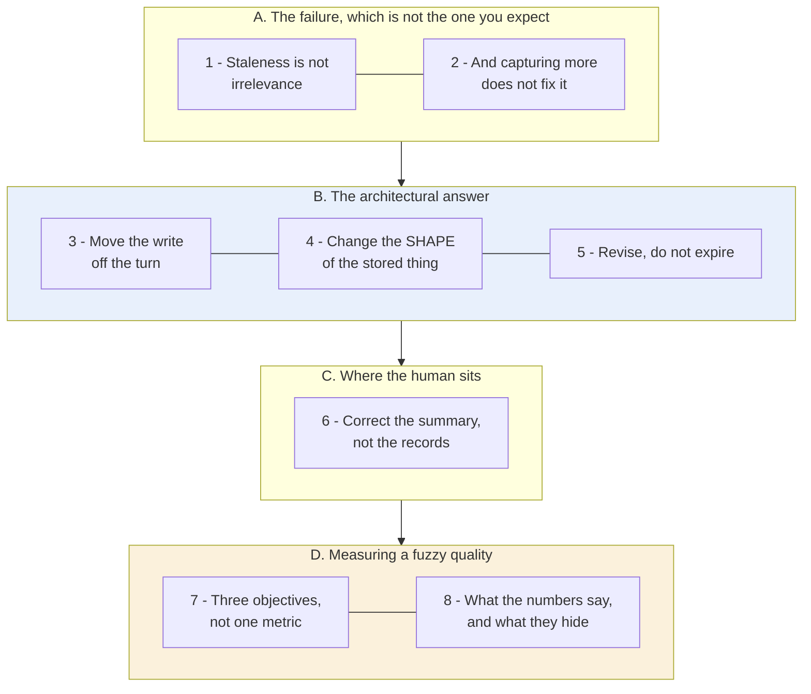
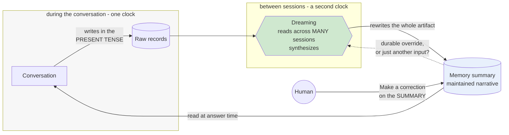

# Learning - Dreaming: Better memory for a more helpful ChatGPT

> Persona: **curator** + **mentor, always**. Re-adopt when working this file.

> The distilled document you learn from - text anchored by a few curated visuals. Built from the
> gated nodes in `nodes.md`. Every claim is cited. See `SOURCE.md` for metadata.

> **Two kinds of material, kept visually distinct.** Claims from the post carry a node ID (`n5`) and
> a section. Blocks marked **"Background, supplied"** are context *I* am adding - established prior
> art the post assumes or never names. They are uncited by construction.

## TL;DR

Memory written **during** a conversation is written in that conversation's tense. Nothing revisits it,
so it decays into **confident wrongness** rather than into uselessness (`n1`). The fix OpenAI ships is
architectural rather than a better extractor. It moves the write **off the turn** into a background
synthesis pass, it stores a **maintained narrative** in place of an append-only fact list, and it
**revises** stale entries instead of expiring them (`n3`, `n4`, `n5`). Correction is then offered on
the synthesized summary rather than on the raw records (`n6`). Its own evals put staleness at a
**9.4% baseline**, which is a system wrong nine times in ten, and that number is what makes the
diagnosis more than rhetoric (`n13`).

## The 1-minute version

This article covers a vendor post announcing a consumer memory feature, and the feature is the less
interesting half of it. What earns the read is the diagnosis that comes first, because it names a
failure mode that every cross-session memory design inherits regardless of who builds it or what they
store. So the place to start is not with dreaming at all. It is with the question of what is actually
wrong with memory as it is normally built.

The problem is that a memory written in the middle of a conversation records that conversation's
present tense, and nothing ever comes back to it (`n1`). The consequence is easy to state and easy to
underrate. Such a memory does not become irrelevant as it ages, which would be a mild and self-limiting
kind of decay. It becomes **confidently wrong**, and it stays that way until something rewrites it. At
first glance this sounds like a hygiene complaint that a periodic cleanup would settle, so it is worth
being precise about why it is harder than that.

The reason is that a stale fact is indistinguishable from a fresh one at the moment it is read. The
system has no way to tell that "going to Singapore in July" was recorded in June, because the stored
row carries no timestamp, no expiry and no way to express a revision (`n1`). A missing fact merely
degrades an answer, and it degrades it visibly. A stale fact poisons the answer while looking exactly
like a good one. Given that the damage is done at read time and the record itself carries no signal,
the obvious place to intervene is at write time.

That is precisely what the predecessor design tried, and it collapses in two separate ways. The old
system relied on strong cues, so it captured what a user thought to dictate and nothing else (`n2`).
The category it missed is the one that matters most, namely the **implicit preference** that is never
uttered as an instruction at all (`n8`). But suppose you fixed that and captured perfectly. You would
still have written every one of those memories in the present tense of the conversation that produced
it, and no amount of better extraction during a conversation rewrites a fact recorded three months
earlier. Both failures point at the same thing, which is not the trigger but the turn.

The idea is therefore to decouple the write from the conversation entirely. A background process reads
across many past sessions and **synthesizes** the memory state, rather than appending to it during any
one of them (`n3`). That is a single architectural move and it sounds almost too simple to be the
contribution, so the question is what has to change around it before it can work.

Three things do. First the representation changes, from fourteen flat assertions to a maintained
narrative, because you cannot rewrite one row of an append-only list that nothing owns (`n4`). Second
the handling of age changes, from expiry to revision, so that "you're going to Singapore in July"
becomes "you went to Singapore in July 2026" rather than being deleted (`n5`). Third the human's point
of contact changes, moving onto the synthesized summary instead of the raw records underneath it
(`n6`). Each of those follows from the decoupling rather than sitting beside it, and together they are
the transferable part of the post.

None of it is free. The direct cost is compute, and the post is unusually candid that **serving cost
rather than answer quality gated the universal rollout**, with a claimed roughly fivefold reduction
being what unlocked Free users (`n9`). There is also an unpriced cost that the post never addresses.
Nothing states whether a user's correction is a durable override or simply another input to the next
synthesis pass, and that difference decides whether the correction button is control or the appearance
of it. Which leaves the question of how far any of this should be believed.

The measured case is stronger than most vendor posts and weaker than it looks. Staleness started at a
**9.4%** baseline and gained the most of any objective, introducing dreaming beat refining it on every
objective, and the 2026 ceiling still sits at only **71-83%**, so memory fails roughly one task in five
on the vendor's own measure (`n12`-`n14`). Those figures were recovered exactly from the page's own
chart specifications, so there is no transcription risk in them at all. The catch is that **"task
success" is never defined anywhere, and no sample size, eval set, method or confidence interval is
published**, which makes exactness a poor proxy for evidence. In short, trust the diagnosis, borrow the
architecture, and treat the numbers as directional self-report.

The same argument, compressed for reference rather than for reading:

| | |
|---|---|
| **The problem** | A memory written mid-conversation records that conversation's *present tense* and is never revisited. It does not become irrelevant - it becomes **confidently wrong** (`n1`). |
| **Why the obvious answer fails** | Capturing more, on explicit cues, does not help. Cue-triggered capture collects what a user thinks to dictate and misses **implicit preferences** entirely - the category that governs relevance rather than any single answer (`n2`, `n8`). |
| **The idea** | **Decouple the write from the turn.** A background process reads across many past sessions and **synthesizes** the memory state, rather than appending during one (`n3`). |
| **How it works** | Change the *representation* from 14 flat assertions to a maintained narrative, because **you cannot rewrite a row of an append-only list that nothing owns** (`n4`). Handle staleness by **revision, not expiry** - "going to Singapore in July" becomes "went to Singapore in July 2026" (`n5`). Put the human's correction on the **synthesized summary** (`n6`). |
| **What it costs** | Compute. **Serving cost, not answer quality, gated universal rollout** - a claimed ~5x reduction is what unlocked Free users (`n9`). And it leaves unstated whether a user's correction is a durable override or just another input to the next pass. |
| **What the numbers say** | Three objectives, three generations. **Staleness started at 9.4%** and gained most (+65.7 pts). **Introducing dreaming beat improving it** on every objective. **The ceiling is low: 71-83%**, so memory still fails ~1 task in 5 (`n12`-`n14`). |
| **How far to trust it** | **T2 vendor evaluating its own consumer product.** Figures are *exactly* extracted from the page's own chart specs - and **"task success" is never defined, with no sample size, eval set, method or confidence interval published anywhere.** |

## Key claims

- **Write-once memory goes stale structurally**, decaying into confident wrongness. `n1`
- **Explicit-cue capture under-collects**; implicit preferences are what it structurally misses. `n2`
  `n8`
- **Decouple the memory write from the conversation turn** - synthesis on its own clock. `n3`
- **Revision, not expiry**: rewrite a stale memory into a new tense. `n5`
- **Representation is a maintenance decision** - pick the shape whose edits you can express. `n4`
- **Offer correction on the synthesized artifact**, not the raw records. `n6`
- **"Good memory" decomposes into three separately-evaluable objectives.** `n7`
- ⚠️ **Staleness baseline 9.4%; ceiling 71-83%; introducing dreaming beat refining it.** `n12`-`n14` -
  vendor self-report, **no method published**.

## What you will learn, and in what order

The diagram runs top to bottom in the order of the argument, and every box below it is a numbered
section. The boxes are gathered into four movements, of which two carry a colour. Blue marks the
transferable design, which is the three decisions that hold for any cross-session memory whoever builds
it. Amber marks the movement to read most carefully, because there the figures are exact while the
methodology behind them is entirely undisclosed, and that is an unusual pairing that needs handling
rather than a caveat. **The crux is that staleness is a property of *when you write*, not of *what you
store*, so the fix is a second clock rather than a better extractor.**

Movement A has to come first, and it is worth saying why, because a reader who skips it will still
understand the feature and will not understand the argument. The diagnosis is the contribution here,
and the feature is downstream of it. Section 1 establishes that the failure is confident wrongness
rather than irrelevance, and section 2 closes off the response that everyone reaches for first. Only
once both of those are settled does the design look inevitable instead of arbitrary.

Movements B, C and D are then three different kinds of consequence, and each is useful without the
others. B is architectural and it is the payload, written as a derivation in which each decision forces
the next. C is an interface consequence, and it is short, but it is the one place the design admits an
unresolved question rather than answering it. D is evaluative, and it is where the note stops
describing the post and starts reading its numbers against what they can actually support.

If you already build memory systems and want the shortest useful path, read sections 3 to 5 and then
section 8. The first three carry the design and the last one carries the only quantitative support the
topic has anywhere, along with the reasons to hold it loosely.

*Synthesized roadmap of this note - not from the source.*

## 1. The failure is staleness, and staleness is not irrelevance

Start with the diagnosis rather than with the feature, because the diagnosis is the better half of the
post and it holds independently of the product.

Memory written **during** a conversation is written in that conversation's tense. Nothing ever
revisits it, so saved memories "tend to go stale over time and eventually become incorrect or
irrelevant" (`n1`, §How memory has evolved). At first glance that reads as a hygiene complaint, the
sort of thing a periodic cleanup job would settle. The screenshot of the representation it describes
shows why it is not.

- What it teaches: the old representation, and why the failure is structural. Fourteen flat rows -
  "Marine biologist in coastal Maine", "Studies whale migration patterns" - with **no timestamp, no
  expiry and no revision affordance on any row.** `n1` §How memory has evolved
- Corroborated by: the prose describing exactly this decay.

Read that screenshot for what is absent rather than for what is present. No row carries a time. No row
carries an expiry. No row offers any way to say that it used to be true. **The data model has nowhere
to put the information that a fact has aged.** That is what makes this structural rather than a bug
somebody forgot to fix, and it also determines what kind of damage the aging does.

> **A missing fact degrades an answer. A stale fact poisons it.** The system acts on a stale fact
> **with full confidence**, because it has no way to know the difference. "I'm going to Singapore in
> July" is true in June and actively harmful in August.

In other words the two failures are not the same size and should not be traded off against each other.
The system that has forgotten something answers worse and does so visibly, which gives the user a
signal and a chance to repeat themselves. The system holding a stale fact answers fluently and
plausibly about the wrong world. This asymmetry is not new, and the field that has thought hardest
about it is not this one.

> **Background, supplied.** This is the distinction between a **cache miss** and a **stale cache
> hit**, and every caching system treats them differently for the same reason. A miss is cheap and
> *visible*, because you simply go and fetch. A stale hit is **silent**. It returns confidently, it
> looks identical to a fresh hit, and the caller gets no signal at all. Caches answer this with
> invalidation, a TTL, or a version. This design is doing that same work, which is why section 5's
> choice between **expiry and revision** turns out to be the load-bearing one.

If the trouble starts at write time, the obvious remedy is to write better and to write more often.
That is the first thing to try, and it is also the first thing that fails.

## 2. Capturing more does not fix it, because of what cues cannot catch

The predecessor design tried exactly that remedy. Saved memories "relied on strong cues to decide when
to trigger memory, such as an instruction to 'remember I'm traveling to Singapore in July'", which felt
"like talking to someone who took a few notes, but still forgot everything that wasn't written down"
(`n2`, §How memory has evolved).

Look back at the screenshot in section 1 and the shape of the failure is visible in it. **Every row
reads as a discrete, dictatable fact.** Not one of them reads as ambient context picked up in passing,
and that absence is the tell, because ambient context is most of what a person actually reveals.

To see why a better trigger cannot close that gap, consider the three ways a preference reaches the
system at all. The post names the taxonomy, and naming it is the genuinely useful part
(`n8`, §Following preferences). ⚠️ This one is `single-leg`, because no figure corroborates it. First
there is the response instruction, such as "don't bring up Stan again", which arrives explicitly and in
the imperative, and which any cue-triggered capture will catch. Second there is the stated constraint,
such as "I'm vegetarian", which arrives explicitly and declaratively, and which is equally easy. The
third kind is different in nature rather than in degree. "I live near San Francisco" is never stated as
a preference at all. It is a fact about the world, mentioned once in passing, from which a preference
has to be inferred by whatever reads it later.

Compressed as a recap:

| Kind of preference | Example | How it is stated |
|---|---|---|
| Response instruction | "don't bring up Stan again" | Explicit, imperative - easy |
| Stated constraint | "I'm vegetarian" | Explicit, declarative - easy |
| **Implicit preference** | "I live near San Francisco" | **Never stated as a preference at all** |

**The third row is where explicit capture structurally fails, and it is also the row doing the most
work**, because it governs *relevance* rather than any single answer. Nobody says "remember that I live
near San Francisco, and therefore prefer local options". They mention where they live once, in passing,
and then expect everything downstream to account for it.

So writing more aggressively during the turn does not help, because the problem was never the trigger.
It is the turn.

## 3. Move the write off the conversation, onto its own clock

> **Dreaming** is "a background process that allows ChatGPT to learn from many conversations and
> **synthesize** ChatGPT's memory state" (`n3`, §How memory has evolved).

- What it teaches: the shipped result, and the detail that proves the decoupling. The header reads
  **"Memory summary - Updated 2h ago"** - **an update timestamp with no user action attached to it.**
  Something wrote to memory while nobody was talking. `n3` `n4` §How memory has evolved
- Corroborated by: the prose describing a background process synthesizing across many conversations.

That header is a small detail carrying a large amount of weight, so it is worth pausing on. An update
time is only meaningful if some process updates. In the previous design there was no such process, and
a timestamp would have had nothing to report except the moment a user dictated a fact. Here it reports
work done while nobody was in the conversation at all.

> 💡 **Dreaming** - memory maintenance as a scheduled process **between** sessions, decoupled from the
> conversation turn. Named for sleep-time memory consolidation; the source cites none of that
> literature, so the analogy is framing rather than evidence.

**The transferable claim is the decoupling, not the name.** A write that only happens while the user is
talking can only ever record the present tense of that talk. Giving some process the standing *job* of
revisiting is therefore the only way that revision happens at all. There is no version of "extract
better during the conversation" that produces an update to a fact recorded three months ago, which is
why this is an architectural change rather than a tuning one.

> **Background, supplied.** The general form here is a **batch reconciliation** process, and it buys
> the three things that batch reconciliation always buys. It sees across records that no single
> transaction can see. It sits off the latency path, so it can afford to be expensive in a way that a
> turn-time write never can. And the third one, which most people miss, is that **it has exactly one
> objective**. A process curating *during* the conversation is asked to serve the user and to maintain
> the store at the same time, and it will trade the second against the first silently, because only the
> first has a visible finish line. That third reason is not in this post. It is S7's contribution
> ([`brain/claims.md`](../../brain/claims.md) claim 59), and it is the sharper argument.

A background process can now rewrite memory. But it can only rewrite what the storage shape allows it
to express.

## 4. Representation is a maintenance decision, not a storage one

The post supplies an unusually clean comparison for this, because it renders **the same persona twice**
(`n4`, §How memory has evolved). Walk the two renderings against each other on the three questions that
matter for maintenance.

The first question is what shape the memory takes. In the old design it is fourteen flat atomic
assertions, and in the new one it is four sections of narrative prose about the same person. The second
question is who wrote it and when. The old rows were written during a conversation, on an explicit cue
from the user. The new sections were written by a background pass on its own clock, which is what
section 3 established. The third question is the one the first two exist to set up, and it is whether
either shape can be revised. The list has **no revision affordance at all**, whereas the narrative is
rewritten in full on every pass, so revising it is not a special operation but the only operation there
is.

Compressed as a recap:

| | Saved memories | Memory summary |
|---|---|---|
| Shape | 14 flat atomic assertions | 4 narrative prose sections |
| Written | during the conversation, on explicit cue | by a background pass, on its own clock |
| Revisable | **no affordance exists** | the whole artifact is rewritten each pass |

**The generalisable rule is to pick the representation whose edits you can express.** You cannot
rewrite row 7 of an append-only list into the past tense when nothing owns that list, because there is
no process whose job it is and nowhere for the qualification to go. You *can* rewrite a clause in a
paragraph that some process is responsible for maintaining.

Notice how much stronger that is than the aesthetic version of the same observation. **The list form is
not merely less readable. It makes the required operation inexpressible**, which is a claim about
capability rather than taste. The lesson to carry off is to choose a data model for the writes you will
need to make, and not only for the reads.

Which leaves the question of what the rewrite should actually do once it is possible.

## 5. Revise, do not expire

> "memories are automatically updated as time passes, allowing ChatGPT to revise its memory from
> **'You're going to Singapore in July' to 'You went to Singapore in July 2026'** when the trip ends"
> (`n5`, §Staying current over time).
- Corroborated by: the paired worked example in the same section - the stale answer opens *"It's about
  5:19 AM Sunday **in Singapore**"*, the maintained answer opens *"I'll use **Portola Valley /
  Ladera** as the starting point"*.

That pair is the clearest thing in the post, because it shows the failure **behaving normally**. The
stale answer is not garbled and it is not hedged. It is fluent, confident, and about the wrong
continent, which is precisely the shape section 1 predicted.

This is a real design choice with a real alternative, and the alternative is the one most engineers
would reach for first. Suppose instead of revising you expired. A time-to-live on each memory would
certainly stop the system from answering in Singapore time in August. It would also delete the fact
that the trip happened, so the assistant would afterwards know nothing about a journey the user
actually took. Revision keeps the fact and changes its tense, so "went to Singapore in July 2026"
remains usable afterwards. It has become biography instead of plans.

> **Expiry treats age as invalidity; revision treats age as information.** That is why a TTL is the
> wrong instrument here even though staleness is the problem: a TTL assumes old facts stop being true,
> when most stop being *current* while remaining perfectly true about the past.

The machine can now keep itself current without losing what it knew. So where does the human fit into a
store that maintains itself?

## 6. Correction goes on the summary, not the records

Look again at the summary screenshot from section 3. Selecting a sentence raises **`Make a correction`**
and **`Don't mention this again`**, and the modal carries an **`Add or update`** composer (`n6`, §How
memory has evolved). The correction lands on the synthesized narrative, and not on the records beneath
it.

That placement looks like an interface detail and it is really a consequence of everything before it.
**It is the only tractable choice once a background process is authoring.** Asking a user to
hand-curate an append-only fact table is asking them to redo the job you just automated, and to redo it
in a representation that section 4 established cannot express a revision at all. The summary is the
only surface where the edit the user wants to make is even sayable.

> **But note the unresolved consequence.** Nothing says whether a correction is a **durable override**
> or **another input to the next synthesis pass**. That difference is the difference between user
> control and the appearance of it. If the next pass can quietly re-derive what you corrected, the
> button is a suggestion box.

- What it teaches: memory ships as **governable surface** rather than as an implementation detail -
  five switches, including one controlling *proactive* use ("Reference memory in suggestions...
  turning this off will disable Pulse"). `n11` §How memory has evolved
- Corroborated by: the prose describing the summary as reviewable and instructable.

The settings panel makes the same point at a coarser grain, which is that memory here is treated as
something a user governs rather than as an implementation detail they experience. But it also quietly
complicates the article's own framing, and that is worth reading carefully (`n10`). The prose presents
a new architecture "built on top of dreaming" as *the* memory foundation, which is replacement
language. The shipped panel still exposes **`Reference saved memories` as its own toggle** beside
`Reference chat history`. This is not a contradiction, and `nodes.md` is deliberately careful not to
file it as one, because the article never claims the old store was removed. **It is a completeness
gap.** Nothing anywhere says what the write-once store is still for, or which store wins when the two
disagree.

## 7. Three objectives, because "good memory" is not one thing

The design is now settled, so the remaining question is how anyone would know whether it worked. The
post's answer is the most portable frame in it, and the part most likely to outlive the product (`n7`,
§How we evaluate memory). It refuses to measure "memory quality" as one number and asks three separate
questions instead.

The first is whether context carries forward, which asks whether something told once is still known
later. That is the recall question, and it catches under-capture. The second is whether preferences and
constraints are followed, which asks a different thing entirely, because it asks whether **behaviour**
changes to match. That one catches capture without application, and it is the split most single-number
evaluations lose. The third is whether the system stays current over time, which asks whether the answer
changes when the world does. That is staleness, and it is the objective section 1 argued was doing the
most damage.

Compressed as a recap:

| Objective | The question it asks | The failure it catches |
|---|---|---|
| Carry forward useful context | Told once, is it still known later? | Under-capture |
| Follow preferences and constraints | Does **behaviour** change to match? | Capture without application |
| Stay current over time | Does the answer change when the world does? | **Staleness** |

Row two is worth dwelling on because it separates recall from compliance. A system can retrieve "I'm
vegetarian" perfectly and still recommend a steak house, and a single "memory accuracy" number hides
that failure completely. Row three is the one most memory evaluations omit, and the reason is
mechanical rather than careless. It is the only objective that requires a test case where the correct
answer changes *with the passage of time* while the stored fact does not, and building that case costs
more than writing another recall probe.

> **This is the same move this brain records in [`evals.md`](../../brain/topics/evals.md) from a
> different domain**: making a subjective quality gradable by **fixing the question** rather than
> finding a better judge. S4 does it to "is this design beautiful?"; S6 does it to "is the memory
> good?". Neither improves the grader; both decompose the question until each part has a nameable
> failure mode.

Three objectives with three published charts each, then. What do the charts actually say?

## 8. What the numbers say, and what they hide

Start with how these numbers were obtained, because it is unusual and it bears on how far they can be
pushed. Each objective has a published chart, and **none of them render in a static capture**. They are
Vega-Lite components whose specifications, data arrays included, are embedded in the page's own
payload, and they were recovered from there (`d1`, `chart_data.json`). Task success, in percent:

| Objective | 2024 saved memories | 2025 + Dreaming V0 | 2026 Dreaming V3 | Total gain |
|---|---|---|---|---|
| Factual recall | 41.5 | 67.9 | 82.8 | +41.3 |
| Preference adherence | 31.4 | 55.3 | 71.3 | +39.9 |
| Staying correct over time | **9.4** | 52.2 | 75.1 | **+65.7** |

Three readings follow that the article itself never states, and the first is the reason section 1's
diagnosis is more than rhetoric. **Staleness was catastrophic rather than merely suboptimal** (`n13`).
A **9.4%** baseline describes a system that was wrong about time-sensitive facts **nine times in ten**,
and it is the only quantitative support anywhere in this topic for the write-once diagnosis.

The second reading is about where the value came from. **Introducing dreaming beat improving it**
(`n14`). The 2024 to 2025 step wins on every objective, by +26.4 against +14.9 on recall, +23.9 against
+16.0 on preferences, and +42.8 against +22.9 on staleness. In other words the architectural move
carries the value, and the V0 to V3 work is refinement on top of it. That is a useful thing to know
before deciding whether to copy the architecture or to invest in a better extractor.

The third reading is the one to carry into any design that depends on memory, and it is a warning
rather than an endorsement. **The ceiling is low.** The 2026 generation tops out between 71% and 83%,
so memory still fails **roughly one task in five** on the vendor's own measure, using the vendor's own
definition of success. Any design that assumes memory is reliable should be carrying that number
explicitly.

> ⚠️ **Precise extraction, opaque method - handle those two facts together.** These come from the
> publisher's own chart specs, so the figures are **exact** and there is no transcription risk. But
> **"task success" is never defined**, and **no sample size, eval set, methodology or confidence
> interval is published anywhere.** They are a vendor's directional self-report about its own product,
> not a benchmark result. **Exactness is not evidence** - and it makes them easier to over-trust than
> a rounded figure would be.

## Diagram (mental model)

Read the two boxes first, because they are the two clocks and that separation is the entire design.
Green is the background process and blue is the artifact it maintains, while the dotted arrow is the
unresolved question from section 6 rather than a shipped mechanism. **The crux is that the only arrow
which can change an existing memory starts in the green box, and the green box is the one that does not
run while you are talking.**

The shape rewards a second look at where the human's arrow lands. It lands on the summary and not on
the raw records, because correcting the inputs to a synthesis you did not perform is not a job anyone
can actually do. Raw records meanwhile flow *into* dreaming and are never edited by it, so the
conversation-time store stays append-only while all maintenance happens in the derived layer. That is
what makes the rewrite safe to run repeatedly, since a pass that mutated its own inputs would compound
its errors every night. And the dotted arrow is drawn as a question rather than as an edge on purpose,
because whether a correction survives the next pass decides whether the human is in control or filling
in a feedback form, and the source does not say which.

*Synthesized from `n1`, `n3`, `n4`, `n5`, `n6` - not a figure from the post.*

## 💡 Terms

| Term | Explanation |
|---|---|
| Dreaming | Memory maintenance as a background process on its own clock: reads across many past sessions and rewrites the memory state between them, rather than appending during one. |
| Saved memories | The write-once predecessor: a flat, append-only list of atomic assertions written during a conversation on an explicit cue and never revisited. The shape that makes staleness structural. |
| Memory staleness | A stored fact that **was true when written and is false now**. A missing fact degrades an answer; a stale fact **poisons** it, because the system acts on it with full confidence. |
| Implicit preference | Context governing what is relevant but **never uttered as an instruction** ("I live near San Francisco"). The category explicit-cue capture structurally misses. |
| Revision over expiry | Rewriting a stale memory into a new tense rather than deleting it. **Expiry treats age as invalidity; revision treats age as information.** |
| Memory summary | The synthesized narrative of what the system believes about a user, and the surface on which correction is offered **in place of** the underlying records. |

## What to distrust in this note

- **A T2 vendor publishing evaluations of its own consumer product.** Every number is self-reported
  and none is independently replicated.
- **Exact figures, undisclosed method.** Extraction from the page's own chart specs is exact, so there
  is no transcription risk - but **"task success" is never defined** and no sample size, eval set,
  method or confidence interval appears anywhere. **Precision is not evidence.**
- **The screenshots are a genuinely good second leg, and there is exactly one thing they prove.** A UI
  photograph is not the author restating himself in another rendering - it is evidence the described
  affordance **shipped**. It says nothing about whether the mechanism **works**, or how well.
- **`n8`, `n9` and `n14` are `single-leg`**: the preference taxonomy, the ~5x serving-cost reduction,
  and the delta arithmetic. `n14` is computed over `n12`, so it inherits every limit above.
- **Do not borrow these numbers to settle claim 24.** They measure a **chat assistant's** recall and
  freshness about a user, not an **agent's** task reliability over long horizons. Different memory
  design, different system class, different metric. See [`memory.md`](../../brain/topics/memory.md).
- **The "Background, supplied" blocks are mine** - cache miss versus stale hit, and batch
  reconciliation's three benefits. Uncited by construction.

## Open questions

- **What is "task success"?** Undefined, and it carries the entire quantitative case. **The
  highest-value deep-research target on this source**, though the answer may simply not be public.
- **Does a user correction survive the next synthesis pass?** `n6` establishes the affordance; nothing
  establishes whether it is a durable override or another input. Control, or the appearance of it.
- **What is the write-once store still for?** Both toggles still ship (`n10`), and nothing says which
  wins on disagreement or whether saved memories feed dreaming.
- **Is the sleep analogy load-bearing or decorative?** Cognitive science has an established literature
  on offline replay and schema formation that would predict which parts of this design generalise, and
  **the post cites none of it.** S8 calls the same operation **lint**, which is mild evidence the
  metaphor is decoration.
- **What does the background pass cost per user, and how often does it run?** `n9` gives a ~5x
  reduction with no absolute figure and no cadence.

## Feeds these topics

- `../../brain/topics/memory.md` - the founding source: staleness as structural, decoupled curation,
  revision over expiry, representation as a maintenance decision, the three-objective frame.
- `../../brain/topics/context-engineering.md` - memory as an input to the context problem.
- `../../brain/topics/evals.md` - decomposing a fuzzy quality into separately-gradable objectives.
