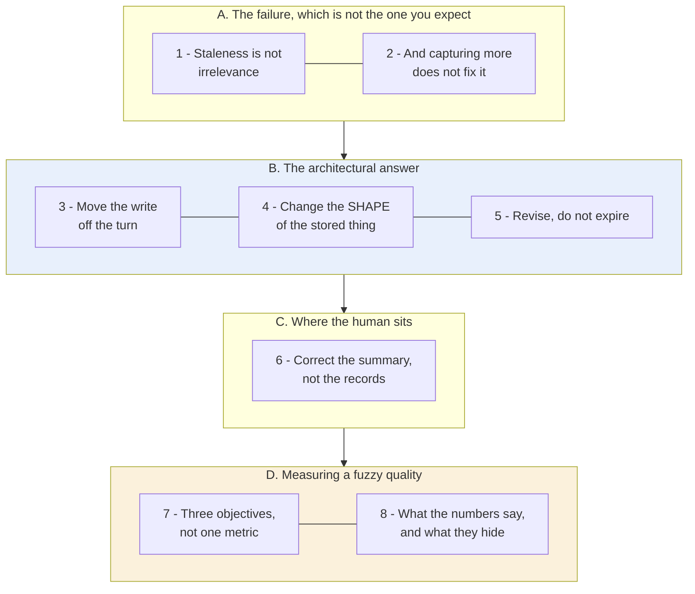
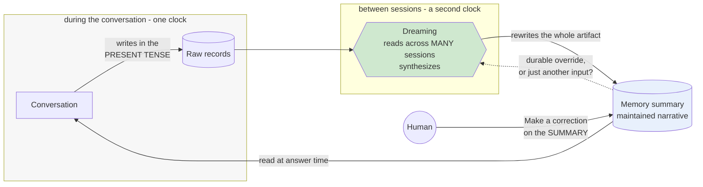

# Learning - Dreaming: Better memory for a more helpful ChatGPT

> Persona: **curator** + **mentor, always**. Re-adopt when working this file.

> The distilled document you learn from - text anchored by a few curated visuals. Built from the
> gated nodes in `nodes.md`. Every claim is cited. See `SOURCE.md` for metadata.

> **Two kinds of material, kept visually distinct.** Claims from the post carry a node ID (`n5`) and
> a section. Blocks marked **"Background, supplied"** are context *I* am adding - established prior
> art the post assumes or never names. They are uncited by construction.

## TL;DR

Memory written **during** a conversation is written in that conversation's tense. Nothing revisits it,
so it decays into **confident wrongness** rather than into uselessness (`n1`). The fix OpenAI ships is
architectural rather than a better extractor: **move the write off the turn** into a background
synthesis pass, store a **maintained narrative** rather than an append-only fact list, and **revise**
stale entries instead of expiring them (`n3`, `n4`, `n5`). Correction is offered on the synthesized
summary, not on the raw records (`n6`). Its own evals put staleness at a **9.4% baseline** - wrong
nine times in ten - which is what makes the diagnosis more than rhetoric (`n13`).

## The 1-minute version

| | |
|---|---|
| **The problem** | A memory written mid-conversation records that conversation's *present tense* and is never revisited. It does not become irrelevant - it becomes **confidently wrong** (`n1`). |
| **Why the obvious answer fails** | Capturing more, on explicit cues, does not help. Cue-triggered capture collects what a user thinks to dictate and misses **implicit preferences** entirely - the category that governs relevance rather than any single answer (`n2`, `n8`). |
| **The idea** | **Decouple the write from the turn.** A background process reads across many past sessions and **synthesizes** the memory state, rather than appending during one (`n3`). |
| **How it works** | Change the *representation* from 14 flat assertions to a maintained narrative, because **you cannot rewrite a row of an append-only list that nothing owns** (`n4`). Handle staleness by **revision, not expiry** - "going to Singapore in July" becomes "went to Singapore in July 2026" (`n5`). Put the human's correction on the **synthesized summary** (`n6`). |
| **What it costs** | Compute. **Serving cost, not answer quality, gated universal rollout** - a claimed ~5x reduction is what unlocked Free users (`n9`). And it leaves unstated whether a user's correction is a durable override or just another input to the next pass. |
| **What the numbers say** | Three objectives, three generations. **Staleness started at 9.4%** and gained most (+65.7 pts). **Introducing dreaming beat improving it** on every objective. **The ceiling is low: 71-83%**, so memory still fails ~1 task in 5 (`n12`-`n14`). |
| **How far to trust it** | **T2 vendor evaluating its own consumer product.** Figures are *exactly* extracted from the page's own chart specs - and **"task success" is never defined, with no sample size, eval set, method or confidence interval published anywhere.** |

## Key claims

- **Write-once memory goes stale structurally**, decaying into confident wrongness. `n1`
- **Explicit-cue capture under-collects**; implicit preferences are what it structurally misses. `n2`
  `n8`
- **Decouple the memory write from the conversation turn** - synthesis on its own clock. `n3`
- **Revision, not expiry**: rewrite a stale memory into a new tense. `n5`
- **Representation is a maintenance decision** - pick the shape whose edits you can express. `n4`
- **Offer correction on the synthesized artifact**, not the raw records. `n6`
- **"Good memory" decomposes into three separately-evaluable objectives.** `n7`
- ⚠️ **Staleness baseline 9.4%; ceiling 71-83%; introducing dreaming beat refining it.** `n12`-`n14` -
  vendor self-report, **no method published**.

## What you will learn, and in what order

**How to read it:** top to bottom is the order of the argument, in four movements. The **blue block is
the transferable design** - three decisions that hold for any cross-session memory, whoever builds it.
The **amber block is where to read most carefully**: the numbers are exact and their methodology is
entirely undisclosed, which is an unusual combination and needs handling.

**The crux: staleness is a property of *when you write*, not of *what you store* - so the fix is a
second clock, not a better extractor.**

**Why it is grouped this way:** A must come first because the diagnosis is the contribution and the
feature is downstream of it. B, C and D are then three different kinds of consequence - architectural,
interface, evaluative - and each is useful without the others.

*Synthesized roadmap of this note - not from the source.*

## 1. The failure is staleness, and staleness is not irrelevance

Start with the diagnosis, because it is better than the feature and it is independent of the product.

Memory written **during** a conversation is written in that conversation's tense. Nothing ever
revisits it, so saved memories "tend to go stale over time and eventually become incorrect or
irrelevant" (`n1`, §How memory has evolved).

- What it teaches: the old representation, and why the failure is structural. Fourteen flat rows -
  "Marine biologist in coastal Maine", "Studies whale migration patterns" - with **no timestamp, no
  expiry and no revision affordance on any row.** `n1` §How memory has evolved
- Corroborated by: the prose describing exactly this decay.

**The data model has nowhere to put the information that a fact has aged.** That is what makes this
structural rather than a bug somebody forgot to fix.

Now the distinction the whole post turns on:

> **A missing fact degrades an answer. A stale fact poisons it.** The system acts on a stale fact
> **with full confidence**, because it has no way to know the difference. "I'm going to Singapore in
> July" is true in June and actively harmful in August.

> **Background, supplied.** This is the distinction between a **cache miss** and a **stale cache
> hit**, and every caching system treats them differently for the same reason. A miss is cheap and
> *visible* - you go and fetch. A stale hit is **silent**: it returns confidently, looks identical to
> a fresh hit, and the caller gets no signal. Caches answer it with invalidation, a TTL, or a version.
> This design is doing that same work, which is why section 5's choice between **expiry and revision**
> is the load-bearing one.

The obvious remedy is to capture more, and more carefully. That does not work either.

## 2. Capturing more does not fix it, because of what cues cannot catch

Saved memories "relied on strong cues to decide when to trigger memory, such as an instruction to
'remember I'm traveling to Singapore in July'" - which felt "like talking to someone who took a few
notes, but still forgot everything that wasn't written down" (`n2`, §How memory has evolved).

Look back at the screenshot above and the failure is visible in it: **every row reads as a discrete,
dictatable fact.** None reads as ambient context picked up in passing.

The category being missed is named, and naming it is the useful part (`n8`, §Following preferences).
⚠️ `single-leg` - no figure for this taxonomy.

| Kind of preference | Example | How it is stated |
|---|---|---|
| Response instruction | "don't bring up Stan again" | Explicit, imperative - easy |
| Stated constraint | "I'm vegetarian" | Explicit, declarative - easy |
| **Implicit preference** | "I live near San Francisco" | **Never stated as a preference at all** |

**The third row is where explicit capture structurally fails, and it is also the row doing the most
work** - because it governs *relevance* rather than a single answer. Nobody says "remember that I live
near San Francisco, and therefore prefer local options"; they mention where they live once, in
passing, and expect everything downstream to account for it.

So writing more aggressively during the turn does not help, because the problem is not the trigger.
It is the turn.

## 3. Move the write off the conversation, onto its own clock

> **Dreaming** is "a background process that allows ChatGPT to learn from many conversations and
> **synthesize** ChatGPT's memory state" (`n3`, §How memory has evolved).

- What it teaches: the shipped result, and the detail that proves the decoupling. The header reads
  **"Memory summary - Updated 2h ago"** - **an update timestamp with no user action attached to it.**
  Something wrote to memory while nobody was talking. `n3` `n4` §How memory has evolved
- Corroborated by: the prose describing a background process synthesizing across many conversations.

> 💡 **Dreaming** - memory maintenance as a scheduled process **between** sessions, decoupled from the
> conversation turn. Named for sleep-time memory consolidation; the source cites none of that
> literature, so the analogy is framing rather than evidence.

**The transferable claim is the decoupling, not the name.** A write that only happens while the user
is talking can only ever record the present tense of that talk. **Giving some process the standing
*job* of revisiting is the only way revision happens at all** - there is no version of "extract better
during the conversation" that produces an update to a fact recorded three months ago.

> **Background, supplied.** The general form is a **batch reconciliation** process, and it buys the
> three things it always buys. It sees across records no single transaction can see; it sits off the
> latency path, so it can afford to be expensive; and - the one most people miss - **it has exactly
> one objective.** A process curating *during* the conversation is asked to serve the user *and*
> maintain the store, and will trade them off silently. **That third reason is not in this post** - it
> is S7's contribution ([`brain/claims.md`](../../brain/claims.md) claim 59), and it is the sharper
> argument.

A background process can now rewrite memory. But it can only rewrite what the storage shape allows.

## 4. Representation is a maintenance decision, not a storage one

Put the two screenshots side by side - **the same persona, rendered twice** (`n4`, §How memory has
evolved):

| | Saved memories | Memory summary |
|---|---|---|
| Shape | 14 flat atomic assertions | 4 narrative prose sections |
| Written | during the conversation, on explicit cue | by a background pass, on its own clock |
| Revisable | **no affordance exists** | the whole artifact is rewritten each pass |

**The generalisable rule: pick the representation whose edits you can express.** You cannot rewrite
row 7 of an append-only list into the past tense when nothing owns that list - there is no process
whose job it is, and nowhere for the qualification to go. You *can* rewrite a clause in a paragraph
that a process is responsible for maintaining.

**The list form is not merely less readable. It makes the required operation inexpressible** - which
is a much stronger claim than "prose is nicer". **Choose your data model for the writes you will need
to make, not only the reads.**

Which leaves the question of what the rewrite should actually do.

## 5. Revise, do not expire

> "memories are automatically updated as time passes, allowing ChatGPT to revise its memory from
> **'You're going to Singapore in July' to 'You went to Singapore in July 2026'** when the trip ends"
> (`n5`, §Staying current over time).
- Corroborated by: the paired worked example in the same section - the stale answer opens *"It's about
  5:19 AM Sunday **in Singapore**"*, the maintained answer opens *"I'll use **Portola Valley /
  Ladera** as the starting point"*.

That pair is the clearest thing in the post, because it shows the failure **behaving normally**. The
stale answer is not garbled. It is fluent, confident, and about the wrong continent.

**This is a real design choice with a real alternative, and the alternative is the obvious one.**
Expiry deletes and loses the fact. Revision preserves it with an updated tense, so "went to Singapore
in July 2026" stays usable afterwards - it has become biography instead of plans.

> **Expiry treats age as invalidity; revision treats age as information.** That is why a TTL is the
> wrong instrument here even though staleness is the problem: a TTL assumes old facts stop being true,
> when most stop being *current* while remaining perfectly true about the past.

The machine can now keep itself current. Where does the human fit?

## 6. Correction goes on the summary, not the records

Look again at the summary screenshot: selecting a sentence raises **`Make a correction`** and **`Don't
mention this again`**, and the modal carries an **`Add or update`** composer (`n6`, §How memory has
evolved).

**This is the only tractable choice once a background process is authoring.** Asking a user to
hand-curate an append-only fact table is asking them to do the job you just automated - and to do it in
a representation section 4 established cannot express revisions at all.

> **But note the unresolved consequence.** Nothing says whether a correction is a **durable override**
> or **another input to the next synthesis pass**. That difference is the difference between user
> control and the appearance of it. If the next pass can quietly re-derive what you corrected, the
> button is a suggestion box.

- What it teaches: memory ships as **governable surface** rather than as an implementation detail -
  five switches, including one controlling *proactive* use ("Reference memory in suggestions...
  turning this off will disable Pulse"). `n11` §How memory has evolved
- Corroborated by: the prose describing the summary as reviewable and instructable.

**And this figure quietly complicates the article's own framing** (`n10`). The prose presents a new
architecture "built on top of dreaming" as *the* memory foundation - replacement language. The shipped
panel still exposes **`Reference saved memories` as its own toggle** beside `Reference chat history`.
Not a contradiction, and `nodes.md` is careful not to file it as one: the article never claims the old
store was removed. **It is a completeness gap** - nothing says what the write-once store is still
*for*, or which wins when the two disagree.

## 7. Three objectives, because "good memory" is not one thing

The most portable frame here, and the part most likely to outlive the product (`n7`, §How we evaluate
memory):

| Objective | The question it asks | The failure it catches |
|---|---|---|
| Carry forward useful context | Told once, is it still known later? | Under-capture |
| Follow preferences and constraints | Does **behaviour** change to match? | Capture without application |
| Stay current over time | Does the answer change when the world does? | **Staleness** |

**Row two separates recall from compliance** - a system can retrieve "I'm vegetarian" and still
recommend a steak house, and a single "memory accuracy" number hides that entirely. **Row three is the
one most memory evaluations omit**, because it is the only one requiring a case where the correct
answer changes *with the passage of time* while the stored fact does not.

> **This is the same move this brain records in [`evals.md`](../../brain/topics/evals.md) from a
> different domain**: making a subjective quality gradable by **fixing the question** rather than
> finding a better judge. S4 does it to "is this design beautiful?"; S6 does it to "is the memory
> good?". Neither improves the grader; both decompose the question until each part has a nameable
> failure mode.

## 8. What the numbers say, and what they hide

Each objective has a published chart, and **none of them render in a static capture**. They are
Vega-Lite components whose specs - data arrays included - are embedded in the page's own payload, and
they were recovered from there (`d1`, `chart_data.json`). Task success, in percent:

| Objective | 2024 saved memories | 2025 + Dreaming V0 | 2026 Dreaming V3 | Total gain |
|---|---|---|---|---|
| Factual recall | 41.5 | 67.9 | 82.8 | +41.3 |
| Preference adherence | 31.4 | 55.3 | 71.3 | +39.9 |
| Staying correct over time | **9.4** | 52.2 | 75.1 | **+65.7** |

**Three readings the article never states**, and the first is why section 1's diagnosis is more than
rhetoric:

- **Staleness was catastrophic, not suboptimal** (`n13`). A **9.4%** baseline is a system wrong about
  time-sensitive facts **nine times in ten**. It is the only quantitative support anywhere in this
  topic for the write-once diagnosis.
- **Introducing dreaming beat improving it** (`n14`). The 2024 -> 2025 step wins on every objective
  (+26.4 vs +14.9, +23.9 vs +16.0, +42.8 vs +22.9). **The architectural move carries the value; V0 to
  V3 is refinement.**
- **The ceiling is low.** 2026 tops out at 71-83%, so memory still fails **roughly one task in five**
  on the vendor's own measure. Any design assuming memory is reliable should carry that number.

> ⚠️ **Precise extraction, opaque method - handle those two facts together.** These come from the
> publisher's own chart specs, so the figures are **exact** and there is no transcription risk. But
> **"task success" is never defined**, and **no sample size, eval set, methodology or confidence
> interval is published anywhere.** They are a vendor's directional self-report about its own product,
> not a benchmark result. **Exactness is not evidence** - and it makes them easier to over-trust than
> a rounded figure would be.

## Diagram (mental model)

**How to read it:** the two boxes are the two clocks, and that separation is the entire design. Green
is the background process; blue is the artifact it maintains. The **dotted arrow is the unresolved
question** from section 6, not a shipped mechanism.

**The crux: the only arrow that can change an existing memory starts in the green box, and the green
box is the one that does not run while you are talking.**

**Why it is shaped this way:** the human's arrow lands on the **summary** and not on the raw records,
because correcting the inputs to a synthesis you did not perform is not a job anyone can do. Raw
records flow *into* dreaming and are never edited by it: the conversation-time store stays
append-only and all maintenance happens in the derived layer, which is what makes the rewrite safe to
run repeatedly. And the dotted arrow is drawn as a question rather than an edge deliberately - whether
a correction survives the next pass decides whether the human is in control or filling in a feedback
form, and the source does not say.

*Synthesized from `n1`, `n3`, `n4`, `n5`, `n6` - not a figure from the post.*

## 💡 Terms

| Term | Explanation |
|---|---|
| Dreaming | Memory maintenance as a background process on its own clock: reads across many past sessions and rewrites the memory state between them, rather than appending during one. |
| Saved memories | The write-once predecessor: a flat, append-only list of atomic assertions written during a conversation on an explicit cue and never revisited. The shape that makes staleness structural. |
| Memory staleness | A stored fact that **was true when written and is false now**. A missing fact degrades an answer; a stale fact **poisons** it, because the system acts on it with full confidence. |
| Implicit preference | Context governing what is relevant but **never uttered as an instruction** ("I live near San Francisco"). The category explicit-cue capture structurally misses. |
| Revision over expiry | Rewriting a stale memory into a new tense rather than deleting it. **Expiry treats age as invalidity; revision treats age as information.** |
| Memory summary | The synthesized narrative of what the system believes about a user, and the surface on which correction is offered **in place of** the underlying records. |

## What to distrust in this note

- **A T2 vendor publishing evaluations of its own consumer product.** Every number is self-reported
  and none is independently replicated.
- **Exact figures, undisclosed method.** Extraction from the page's own chart specs is exact, so there
  is no transcription risk - but **"task success" is never defined** and no sample size, eval set,
  method or confidence interval appears anywhere. **Precision is not evidence.**
- **The screenshots are a genuinely good second leg, and there is exactly one thing they prove.** A UI
  photograph is not the author restating himself in another rendering - it is evidence the described
  affordance **shipped**. It says nothing about whether the mechanism **works**, or how well.
- **`n8`, `n9` and `n14` are `single-leg`**: the preference taxonomy, the ~5x serving-cost reduction,
  and the delta arithmetic. `n14` is computed over `n12`, so it inherits every limit above.
- **Do not borrow these numbers to settle claim 24.** They measure a **chat assistant's** recall and
  freshness about a user, not an **agent's** task reliability over long horizons. Different memory
  design, different system class, different metric. See [`memory.md`](../../brain/topics/memory.md).
- **The "Background, supplied" blocks are mine** - cache miss versus stale hit, and batch
  reconciliation's three benefits. Uncited by construction.

## Open questions

- **What is "task success"?** Undefined, and it carries the entire quantitative case. **The
  highest-value deep-research target on this source**, though the answer may simply not be public.
- **Does a user correction survive the next synthesis pass?** `n6` establishes the affordance; nothing
  establishes whether it is a durable override or another input. Control, or the appearance of it.
- **What is the write-once store still for?** Both toggles still ship (`n10`), and nothing says which
  wins on disagreement or whether saved memories feed dreaming.
- **Is the sleep analogy load-bearing or decorative?** Cognitive science has an established literature
  on offline replay and schema formation that would predict which parts of this design generalise, and
  **the post cites none of it.** S8 calls the same operation **lint**, which is mild evidence the
  metaphor is decoration.
- **What does the background pass cost per user, and how often does it run?** `n9` gives a ~5x
  reduction with no absolute figure and no cadence.

## Feeds these topics

- `../../brain/topics/memory.md` - the founding source: staleness as structural, decoupled curation,
  revision over expiry, representation as a maintenance decision, the three-objective frame.
- `../../brain/topics/context-engineering.md` - memory as an input to the context problem.
- `../../brain/topics/evals.md` - decomposing a fuzzy quality into separately-gradable objectives.
