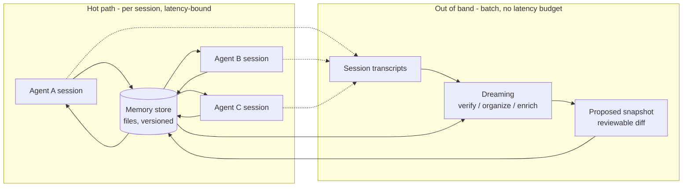

# Learning - Memory and dreaming for self learning agents

> Persona: **curator** + **mentor** - re-adopt when working this file.

> The distilled document you learn from - text anchored by a few curated visuals. Built from the
> corroborated nodes in `nodes.md`. Every claim is cited. Signal, not archive. See `SOURCE.md` for
> metadata.

## TL;DR

An agent platform's answer to memory, and the useful half is a **separation of concerns**: agents
write memory *during* work, and a **separate batch process on its own clock rewrites what they
wrote**. The argument for the split is not capability, it is **incentive** - an agent asked to both
finish its task and curate memory will trade one against the other, so the curator is given its own
harness, its own objective and no latency budget [`n12`]. Memory itself is deliberately **just a file
system** the model manipulates with `bash` and `grep`, on the same "get out of the model's way" bet
that produced skills [`n2`, `n3`].

Read it for the design. **Do not read it for evidence**: every performance number is a customer
testimonial on a marketing slide, and the one question this brain actually needs answered - does a
*maintained* memory help an *agent*? - is left exactly where it was [`n17`, `n18`].

## Key claims

- **Write memory during work; fix it out of band.** The two loops run on different clocks and that
  separation *is* the architecture. `IGo225tfF2I&t=921s` [`n14`]
- **The reason to decouple is objective conflict, not throughput.** An independent process cannot be
  asked to trade memory quality against task completion. `IGo225tfF2I&t=764s` [`n12`]
- **In-session writing is locally optimal, globally suboptimal** - agents learn from their mistakes
  *independently*, so the same lesson is paid for N times, and the store duplicates and fragments.
  `IGo225tfF2I&t=615s` [`n10`]
- **Model memory as a file system, not an API** - the model is already good at file systems.
  `IGo225tfF2I&t=386s` [`n2`]
- **Multi-agent memory needs scopes**: read-only org-wide + read-write task stores, attached per
  session. `IGo225tfF2I&t=466s` [`n5`]
- **Optimistic concurrency, via a content-hash precondition on the write.** `IGo225tfF2I&t=498s`
  [`n6`]
- **Attribution and version history are first-class** - every memory links to the session that wrote
  it. `IGo225tfF2I&t=514s` [`n7`]

## Walkthrough

### The problem is not forgetting, it is that every agent learns alone

The motivating observation is specific and worth sitting with. Once you have many agents writing
memory as they work, you do not get a shared brain - you get N private ones. Agents "were prone to
making many of the same mistakes, **and they learn from their mistakes independently**"; the same
inefficiencies recur; the store duplicates and fragments [`n10`, `IGo225tfF2I&t=615s`].

The diagnosis is the transferable part: **memory was being updated in a locally optimal way, but it
wasn't globally optimal.** Each individual write is defensible. The aggregate is a mess. That is a
property of *who is doing the writing and when*, not of what is being stored - which is why the fix
is structural rather than a better prompt.

> 💡 **Out-of-band** - a process that runs outside the request path it affects. Here: memory curation
> happens between sessions, not during them, so it can neither slow an agent down nor compete with
> its objective.

### Why a separate process, and not just "the agent curates better"

Three reasons are given, and they are not equally interesting [`n12`, `IGo225tfF2I&t=764s`]:

| Reason | Why it matters |
|---|---|
| Cross-session pattern detection | A single agent sees one transcript. Patterns *across* agents are invisible from inside any one of them - this is an information argument, not an effort argument. |
| **No objective conflict** | **The subtle one.** An agent told to finish a task *and* maintain memory quality will trade them off, silently and unaccountably. A separate process has exactly one objective. |
| No added latency | Curation is off the hot path entirely. |

The middle row is the one to carry to your own designs. It generalises well past memory: **whenever
you ask one loop to optimise two things, you have created a trade-off you cannot see and cannot
tune.** The kit's own `evals` note reaches the same shape from a different direction - the
generator/evaluator split in `260725_harness-design-long-running-apps` exists to defeat
self-evaluation bias, not to add capability.

### Memory as a file system, on the skills bet

- What it teaches: memory formats evolved along one axis - **who is allowed to write, and how
  freely**. `CLAUDE.md` (a human-authored file) -> a memory *tool* with `memory_read/write/edit` -> 
  `skills` -> `memory/`, "files read and written by agents". `IGo225tfF2I&t=338s` [`n1`]
- Corroborated by: "previously, we built memory focusing on capabilities in the harness... you might
  be familiar with Claude.md for Claude code, or dedicated memory tools in the SDKs".
- **Worth noticing:** the slide labels `skills` **procedural memory** - which is the cross-domain
  name the brain's `skills` note had not yet been given. Skills and memory are the same family.

The design choice is explicit and is a *bet*: the model is already strong at navigating file systems
with `bash` and `grep`, so give it a file system rather than a bespoke memory API - "get out of
Claude's way, **similar to what we did with skills**" [`n2`, `n3`, `IGo225tfF2I&t=386s`].

> This is the same wager `260725_harness-design-long-running-apps` records as claim 31: **every piece
> of scaffolding encodes an assumption about what the model cannot do alone, and those assumptions
> expire.** A bespoke memory API assumes the model cannot manage files. This design bets that
> assumption has already expired.

### The multi-agent machinery a consumer assistant never needs

- What it teaches: shared memory across agents needs three things a single-user assistant does not -
  **sharing** ("one store, many agents - what A learns, B and C read on next attach"), **scopes**
  (read-only org conventions vs read-write team memory, multiple stores attached per session at
  different access levels), and **write arbitration**. `IGo225tfF2I&t=466s` [`n5`, `n6`]
- Corroborated by: "we offer read-only scopes and read-write scopes... this creates a hierarchy".

The arbitration mechanism is **optimistic concurrency** rather than locking - and the demo shows what
that actually means in practice, which the narration never states:

- What it teaches: three metadata rows do the work - `version` (`v1..v6 head`), `written by`
  (`sesn_011Hx…d8e`), and **`precondition content_sha256`**. A write carries the hash of the content
  it believed it was editing; if the file moved on, the write fails instead of clobbering.
  `IGo225tfF2I&t=498s` [`n6`, `n7`]
- **The richer finding is in the file body.** `sre-agent-a07` ends its note with "**Next agent: skip
  dep checks, go straight to config diff**", and one minute later `sre-agent-a16` writes "Confirmed:
  `retry_backoff_ms` 200->50 in config (**per a07's lead, skipped dep checks**)". Agents are not just
  leaving facts for their successors - **they are leaving instructions, and the successor is
  following them.** `IGo225tfF2I&t=1004s` [`n20`]

That last point is the most interesting thing in the source and the speaker does not dwell on it. A
memory store that carries imperatives between agents is a **coordination channel**, not a knowledge
base - and nothing in the talk addresses what happens when a bad instruction lands in it.

### What dreaming actually does

- What it teaches: the loop is *transcripts of many sessions* -> a **periodic batch process** ->
  an updated memory state carrying "new insights" and "organized structure" -> which the next day's
  sessions read. `IGo225tfF2I&t=700s` [`n11`]
- Corroborated by: "It is a batch process. It runs out of band from sessions. It's completely
  decoupled... it inspects the existing state of memory and it proposes optimizations".

In the demo, what it produces is a **reviewable diff**, and what it adds is a generalisation no
single session could make: a recurring pattern of "an alert triggering 60 seconds after a CPU spike"
across agents, inferred to be a retry-behaviour problem, written back so the next agent can act on it
[`n21`, `IGo225tfF2I&t=1191s`]. Dreaming is also built on the agent platform it serves, fanning out
parallel sub-agents over transcripts [`n19`].

> 💡 **Dreaming (as an agent-platform feature)** - a scheduled batch pass that reads session
> transcripts plus current memory, and proposes a reorganised memory snapshot. Trigger is
> programmable: ad hoc, hourly, nightly, or on session end [`n22`].

### The framing that makes it click

Dreaming is described as **test-time compute for memory**: spend tokens up front exploring, and get
better outcomes downstream [`n13`, `IGo225tfF2I&t=890s`]. The twist is *who pays and who benefits* -
the curation cost is borne once, by a process that completes no user task, and the return is paid to
**every** downstream agent. That is why it can be economically sane to spend real compute on it, and
why it belongs on a different clock from the work.

## Diagram (mental model)

**How to read it:** left to right, two boxes on two different clocks. The top box is the **hot path** -
agents reading and writing memory while doing real work, where latency counts. The bottom box runs
**out of band**, on a schedule. Solid arrows are reads and writes of memory; dotted arrows are
transcripts being emitted as a by-product of sessions that have already finished.

**The crux: the write path and the repair path are separate loops on separate clocks, and that
separation is what stops memory quality from competing with getting the job done.**

**Why it is shaped this way:** the tempting design is one loop - let each agent tidy the store as it
goes. That fails for a reason that is about incentives rather than capability: an agent holding both
objectives will silently trade them, and you cannot tune a trade-off you cannot observe [`n12`].
Putting curation in its own box gives it one objective and removes it from the latency budget, so it
can afford to be expensive - it reads *many* transcripts, which is also the only vantage point from
which cross-agent patterns are visible at all [`n10`]. Note what the shape forces: the store must
support **concurrent multi-writer access with arbitration** (`content_sha256` preconditions, `n6`)
and **versioning with attribution** (`n7`), because two loops now write to it. A single-loop design
needs neither, which is exactly why single-loop designs look simpler and stop scaling at the point
where the second agent shows up. **The box the diagram does not justify is `Proposed snapshot`** -
the talk calls its output "verified" and never says by what.

*Synthesized from `n5`, `n10`, `n11`, `n12`, `n14`, `n20`, `n21`.*

## 💡 Terms

| Term | Explanation |
|---|---|
| **Dreaming** | A scheduled batch process that reads session transcripts plus current memory and proposes a reorganised memory snapshot. Both OpenAI (S6) and Anthropic (S7) independently shipped this concept under this name. |
| **Out-of-band processing** | Work done outside the request path it affects - here, memory curation between sessions rather than during them, so it adds no latency and holds no competing objective. |
| **Optimistic concurrency control** | Allow concurrent writes without locking; each write carries a precondition (here a `content_sha256` of the content it believed it was editing) and fails if the underlying state moved on. |
| **Procedural memory** | Memory of *how to do things* rather than of facts. This source labels **skills** as the procedural-memory rung of the memory ladder - the name the `skills` topic had been missing. |
| **Memory scope** | The access level a memory store is attached at. Read-only org-wide stores carry slow-changing conventions; read-write task stores carry what one team's agents are currently learning. |
| **Organizational memory** | The end state: memory grown from per-task notes into an org-wide store that functions as the model's understanding of how a company works. |

## What this does not settle

**The headline question in [`../../brain/topics/memory.md`](../../brain/topics/memory.md) is whether a
*maintained* memory helps an *agent*.** Claim 24 (T3 preprint, 10 models) measured naive **episodic
append-and-retrieve** memory on **agent** long-horizon reliability and found it never helped and hurt
6 of 10 models. S6 measured a **maintained synthesized** user model in a **chat assistant**. Different
design, different system class - a gap, not a contradiction.

This source is the first in the brain on the **right side of both axes**: maintained memory, agent
platform, long-horizon, multi-agent. And it supplies **no measurement at all** - three customer
testimonials on a slide, with no baseline, no sample size, no eval set and no method [`n17`, `n18`].

> **So the gap stays open, and that is the finding.** It would be easy to let "97% fewer first-pass
> errors" or "6x completion rate" stand in for evidence. They cannot: a figure with no disclosed
> method cannot refute a 10-model preprint, and **S7's numbers are softer than S6's** - S6's at least
> came from the publisher's own chart specs. The right conclusion is that the field's two most
> visible memory systems are both shipped on design conviction, and neither has published the
> experiment.

## Open questions / confidence

- **What does "verified" mean?** [`d4`] Dreaming's output is "a verified, better organized snapshot"
  agents "can choose to adopt". No mechanism, no slide, no demo, no failure mode. For a system whose
  premise is that unsupervised writes drift, **verification is the load-bearing step and the only one
  with nothing behind it.**
- **Write conflicts are solved; semantic conflicts are not.** [`d5`] `content_sha256` preconditions
  stop two agents clobbering the same *file*. Nothing addresses two agents learning contradictory
  *things*, or which store wins when the read-only org memory and a read-write team memory disagree.
  This only half-closes the question `memory.md` inherited from S6.
- **A memory store carrying imperatives is an injection sink.** [`n20`] Agents write instructions to
  their successors ("Next agent: skip dep checks") and successors follow them. Combine that with
  `memory.md`'s existing security note - inject once, re-applied every session - and the demo shows
  the mechanism by which a poisoned memory would propagate across agents. **No source in this brain
  addresses this.**
- **`n4`, `n17`, `n18` are vendor self-reports** and must never be cited as measured results.
- **`n23` is the best deep-research target here** - METR's task-horizon doubling study is external,
  public and checkable, and it is the empirical premise the whole talk rests on.

## Feeds these topics

- [`../../brain/topics/memory.md`](../../brain/topics/memory.md) - the out-of-band curation split
  (`n10`-`n12`, `n14`), memory as a file system (`n2`, `n3`), multi-agent scopes and arbitration
  (`n5`-`n7`), organizational memory (`n15`). **Takes the topic to `established`**
  ([ADR-0008](../../brain/decisions/0008-memory-established.md)).
- [`../../brain/topics/agents.md`](../../brain/topics/agents.md) - the objective-conflict argument for
  splitting a loop (`n12`), and self-improvement as a platform primitive.
- [`../../brain/topics/agent-security.md`](../../brain/topics/agent-security.md) - shared memory as a
  cross-agent injection surface (`n20`), attribution and audit as the mitigation (`n7`).
