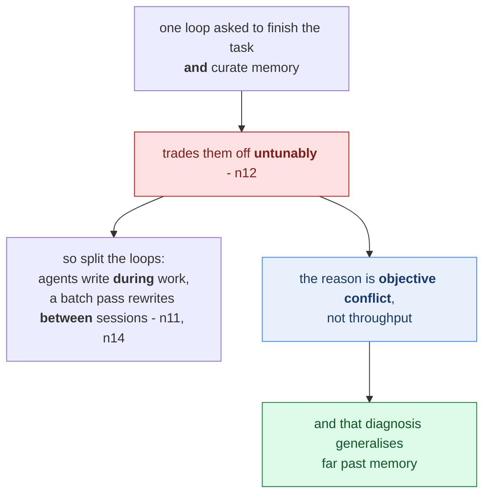
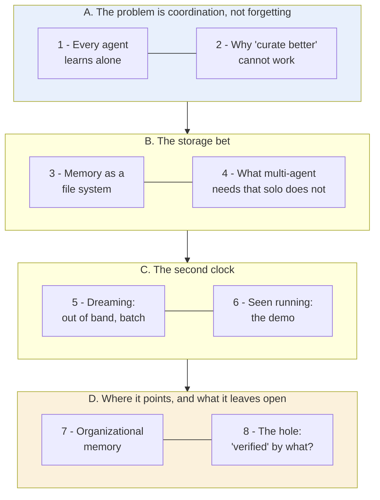
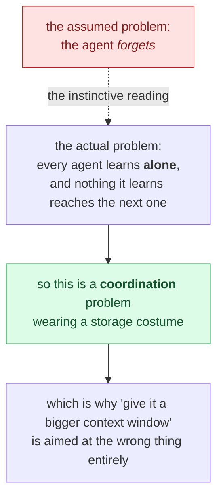
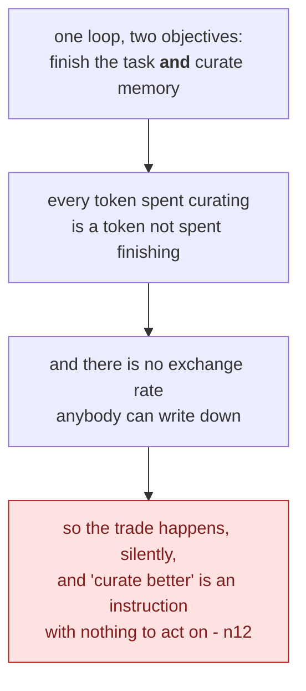
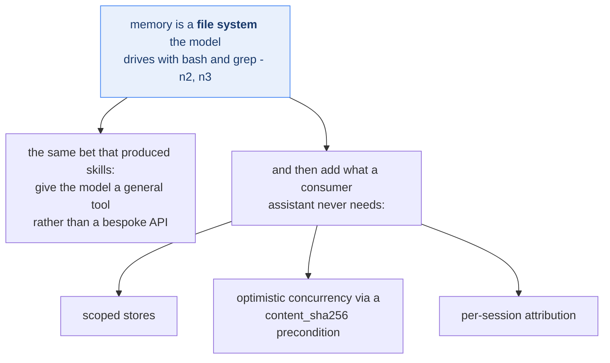
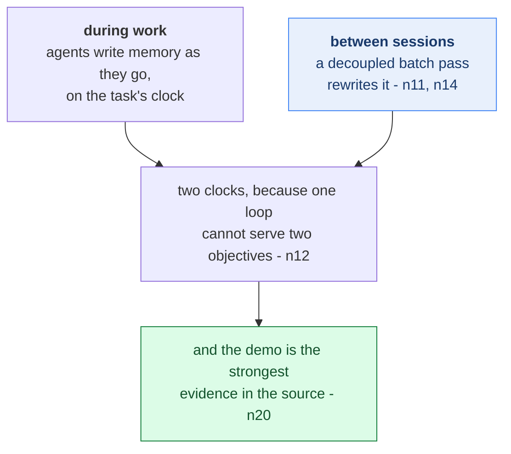
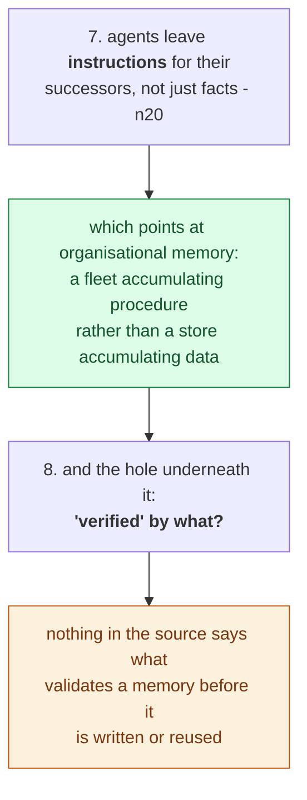
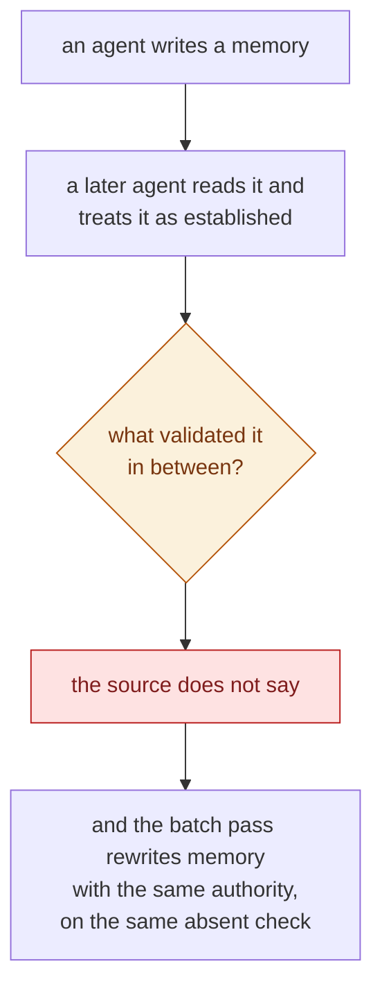
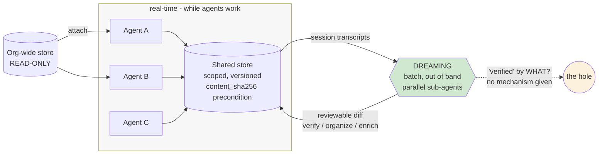

# Learning - Memory and dreaming for self learning agents

> Persona: **curator** + **mentor, always** - re-adopt when working this file.

> The distilled document you learn from - text anchored by a few curated visuals. Built from the
> corroborated nodes in `nodes.md`. Every claim is cited. Signal, not archive. See `SOURCE.md` for
> metadata.

> **Two kinds of material, kept visually distinct.** Claims from the talk carry a node ID (`n12`) and
> a timestamp. Blocks marked **"Background, supplied"** are context *I* am adding - established prior
> art the talk assumes or never names. They are uncited by construction.

## TL;DR

This is the agent-platform half of the memory pair, and the independent counterpart to
[S6](../260731_chatgpt-memory-dreaming/LEARNING.md). Same architecture, same name, different vendor.
Agents write memory **during** work, and a decoupled batch pass rewrites it **between** sessions
(`n11`, `n14`). **The reason to split the loops is objective conflict, not throughput**, because one
loop asked to both finish the task and curate memory trades them off untunably (`n12`). Memory is
deliberately a **file system** the model drives with `bash` and `grep`, on the same bet that produced
skills (`n2`, `n3`). To that it adds everything a consumer assistant never needs, namely scoped
stores, optimistic concurrency via a `content_sha256` precondition, and per-session attribution
(`n5`-`n7`). A live demo shows agents leaving **instructions** for their successors, not just facts
(`n20`).

This is a diagnosis diagram, not an architecture diagram, and the blue node is the reason to read the
note rather than the mechanism it describes. **The crux is that the second loop exists to separate two
objectives that cannot be weighted against each other, which is a different argument from the usual
one about batch work being cheaper.** It is drawn with the conflict feeding both the fix and the
generalisation because the fix alone would be an implementation detail, and the generalisation is what
travels: any single loop carrying two objectives will trade one against the other silently, and no
amount of prompt tuning surfaces the exchange rate.

*Synthesized from `n11`, `n12` and `n14`.*

## The 1-minute version

This article covers a vendor conference talk about giving many agents one shared memory, and about
the second process the vendor runs to stop that memory rotting. It is the agent-platform half of a
pair of talks, and it is worth reading beside its counterpart because two vendors arrived at the same
shape independently. A reader arriving expecting a talk about recall will find something else, since
the problem it works on is not the one the word "memory" usually names.

The problem is not forgetting. It is that **every agent learns alone**. At multi-agent scale the
platform's own operators watched agents repeat each other's mistakes, because each agent learned from
its mistakes independently, and the store they shared drifted into duplication and fragmentation
(`n10`). Notice what is strange about that failure. No individual write was wrong.

The reason it is hard is that the damage is invisible from inside any one of its causes. Each agent's
write is locally reasonable, and the store degrades anyway, because nothing is responsible for the
store as a whole. The talk's own phrase is that memory was updated in a locally optimal way that was
not globally optimal (`n10`). A failure with no single culprit cannot be fixed by improving any
single culprit, which is what separates this from an ordinary quality problem. At first glance it
still looks like something you could prompt your way out of.

Suppose instead you try exactly that, and simply tell the agent to curate more carefully as it works.
That collapses for the sharpest reason in the talk. An agent asked to finish its task **and** to
maintain memory quality is one loop holding two objectives, and it will trade them off silently under
whatever pressure the task is applying (`n12`). You cannot observe the trade, because the agent never
reports having made it. You cannot tune it, because there is no dial to turn. A second failure sits
beside the first and is easier to miss, since patterns that only appear *across* sessions are
invisible from inside any single session by construction. Both failures point at the same missing
thing, which is a vantage point outside the work.

The idea, then, is to run **two clocks**. Memory does real-time writes while agents are working, and
**dreaming** is a periodic batch pass that runs out of band, reads session transcripts, and rewrites
the store between sessions (`n11`, `n14`). The second process completes no user task, which is
precisely what makes it trustworthy as a curator, because it has exactly one objective and nothing to
trade that objective against.

How it works starts with a deliberately plain choice about the thing being curated. Memory is modelled
as a file system the model drives with `bash` and `grep` rather than through a bespoke memory API, on
the stated bet that the right move is to get out of the model's way, which is the same bet that
produced skills (`n2`, `n3`). Sharing that file system between many agents then demands three things a
single-user store never needs. It needs **scopes**, so that a slow-changing org-wide store can be
read-only while a team store stays read-write. It needs **optimistic concurrency**, supplied here as a
`content_sha256` write precondition so that a conflict fails loudly instead of clobbering silently. And
it needs **per-session attribution**, so that any memory can be traced to the session that wrote it
(`n5`-`n7`). A live demo shows the whole arrangement running, and it carries one detail the narration
never states, which is that agents leave **instructions** for their successors and not only facts
(`n20`).

What it costs comes in two parts, one budgeted and one not. The budgeted cost is test-time compute,
paid once by a process that finishes no user task and repaid to every downstream agent that reads the
result (`n13`, `single-leg`). The unbudgeted cost is an attack surface the source never raises at all,
because a shared store that carries imperatives is a coordination channel rather than a knowledge
base, and the talk supplies attribution and version history as forensics while supplying no admission
control. Sitting between the two is a gap in the design itself. Dreaming's output is described as "a
verified, better organized snapshot", and nothing in the talk or the demo says what verification
means, who performs it, or what happens when it fails (`d4`). For a system whose entire premise is
that unsupervised writes drift, that is the load-bearing step.

How far to trust it turns on splitting the source in two. This is a **T2 vendor talk about the
vendor's own product, at the vendor's own conference**, and every outcome number in it is a customer
testimonial with no baseline, no n and no eval set. Read it for the architecture and never for the
figures. The genuinely strong evidence is the live demo, because a running console showing a version
strip, a session ID and a `content_sha256` precondition is a photograph of the artifact rather than a
restatement of the pitch.

The same argument, compressed for reference rather than for reading:

| | |
|---|---|
| **The problem** | Not forgetting - **every agent learns alone.** At multi-agent scale agents repeat each other's mistakes because "they learn from their mistakes independently", producing duplication and fragmentation (`n10`). |
| **Why the obvious answer fails** | "Make the agent curate better" cannot work, and the reason is the sharpest idea in the talk: an agent asked to **finish its task** *and* **maintain memory quality** trades them off silently. One loop, two objectives, untunable (`n12`). |
| **The idea** | **Two clocks.** Memory does real-time writes as agents work; **dreaming** is a periodic batch pass that runs out of band, reads session transcripts, and rewrites the store between sessions (`n11`, `n14`). |
| **How it works** | Memory is a **plain file system** the model drives with familiar tools, chosen over a bespoke API on the "get out of the model's way" bet that produced skills (`n2`, `n3`). Multi-agent needs three things a single-user store does not: **scopes** (read-only org-wide + read-write team), **optimistic concurrency** via a `content_sha256` write precondition, and **per-session attribution** (`n5`-`n7`). |
| **What it costs** | Test-time compute, paid by a process that completes no user task and repaid to every downstream agent (`n13`). And an unexamined attack surface: a shared store carrying **imperatives** is a coordination channel, with attribution as forensics but **no admission control**. |
| **The gap** | Dreaming's output is called "**a verified**, better organized snapshot". **Nothing says what verification means, who performs it, or what happens on failure** (`d4`). For a system premised on unsupervised writes drifting, that is the load-bearing step and the only one with no mechanism. |
| **How far to trust it** | **T2 vendor talk about its own product, at its own conference. Every outcome number is a customer testimonial** with no baseline, no n and no eval set. **Read it for the architecture; never for the numbers.** The live demo is the real evidence. |

## Key claims

- **Decouple curation from the work loop because of objective conflict, not throughput.** `n12`
  `&t=764s`
- **Two clocks**: real-time writes as agents work, periodic batch updates between sessions. `n14`
  `&t=921s`
- **Model memory as a file system, not a memory API** - the same bet that produced skills. `n2` `n3`
  `&t=386s`
- **Multi-agent memory needs scopes, optimistic concurrency and attribution.** `n5`-`n7` `&t=466s`
- **Agents write instructions to their successors, not just facts.** `n20` `&t=1004s`
- **A memory architecture decomposes into storage / structure / process.** `n9` `&t=566s`
- **Curation is test-time compute with an asymmetric payer.** `n13` `&t=890s` ⚠️ `single-leg`
- ⚠️ **Every outcome figure is a vendor-selected customer testimonial.** `n17` `n18` - direction only.

## What you will learn, and in what order

This is a reading-order diagram about the note rather than about the platform, in four movements, and
every box is a numbered section below. Two of the movements are shaded. Blue marks the transferable idea, and amber
marks the place where the talk stops short. **The crux is that the blue movement, unusually, carries a
*diagnosis* rather than a mechanism - objective conflict generalises far past memory - while the amber
movement holds the hole the whole design rests on.**

Movement A does no design work at all, and that is deliberate. Its only job is to move the reader off
the word "memory" and onto coordination, because the storage decisions that follow look arbitrary
until you accept that the problem is many agents failing to learn from each other rather than one
agent failing to recall. A reader who already holds that framing can skim it, at the cost of losing
the reason the rest is shaped the way it is.

Movement B is where the design becomes concrete, and it is written as a derivation. Section 3 fixes
what memory *is*, which immediately forces section 4 to ask what breaks the moment a second writer
exists. Reading those two out of order will still tell you what the components are, but it hides which
of them are load-bearing, and the answer is not the one a reader guesses.

Movement C is the payload. It introduces the second clock and then, in section 6, shows it running,
which matters more than usual here because the demo is the only evidence in the source that is not the
vendor describing itself. If you read one movement, read this one.

Movement D is separated from the rest for a reason worth stating, since it holds both the most
ambitious claim in the talk and its largest gap, and the two only make sense together. **Section 8 is
the part to carry away**, because the design's premise is that unsupervised writes drift, and the step
that is supposed to catch the drift is the one step with no mechanism behind it.

*Synthesized roadmap of this note - not from the source.*

## Movement A - the problem is coordination, not forgetting

This is a reframing diagram, not a design, and the dashed edge is the move the movement exists to
make. **The crux is that the failure is not an agent losing what it knew but a fleet never sharing
it**, which relocates the whole problem from capacity to distribution. It is drawn with the wrong
reading kept visible because it is the one a reader arrives with, and the argument only lands once you
have felt its pull. Movement A does no design work at all, deliberately: its job is to make everything
after it feel necessary rather than elaborate.

*Synthesized from `n1` and the section below.*

### 1. The problem is not forgetting - it is that every agent learns alone

A memory talk usually starts with recall. This one starts with **coordination**, and that reframe is
what makes the rest worth reading, because it changes which problems count as memory problems at all.

- What it teaches: agents learn from **three** sources, not one - about **tasks** (success criteria,
  common mistakes), about **environments** (tools, codebases, users), and **from other agents**
  (patterns across many agents working together). `n16` `&t=210s`
- Corroborated by: "agents can learn from common strategies and previous mistakes... And finally, they
  can transfer these learnings to and from other agents."

Two of those three columns are familiar. A single-user assistant learns about tasks and about its
environment, and both of those are recall problems in the ordinary sense. The third column is the one
a single-user memory system never has to think about, and it is where the diagnosis lands.

> At multi-agent scale, agents "were prone to making many of the same mistakes, and **they learn from
> their mistakes independently**... memory was being updated in a **locally optimal way, but it wasn't
> globally optimal**. In some cases, there was duplication or fragmentation." (`n10`, `&t=615s`)

The slide that goes with it draws the shape of the fix before the talk has argued for it, which is
worth looking at now and holding until section 5.

- What it teaches: the two panels separate the **shared write path** (Agent A / B / C sessions writing
  separately) from an **independent memory curation** box - curation drawn *outside* the session lane.
  `n10` `n12` `&t=615s`
- Corroborated by: the narration naming duplication and fragmentation as the observed symptoms.

Read "locally optimal, globally suboptimal" as the whole problem statement. Each agent's write is
individually reasonable, and the store degrades anyway, because nothing is responsible for the store
as a whole. In other words this is a coordination failure rather than a memory failure. That
distinction is what decides the shape of the answer, since a coordination failure is not something any
one participant can fix from where it stands.

At first glance there is still a cheaper answer available, and it is the one most teams reach for.

### 2. Why "just make the agent curate better" cannot work

This is an impossibility diagram, not a criticism of prompting. **The crux is that the two objectives
are not merely competing but incommensurable, so no prompt can specify how much task quality a unit of
memory quality is worth.** It is drawn as a forced chain because each step follows without judgement,
ending at why the obvious fix is not a fix: telling an agent to curate better does not supply the
missing exchange rate, it just moves the silent trade somewhere else. This is the same shape as
claim 34's conflict of interest, arriving from scheduling rather than from evaluation.

*Synthesized from `n12`.*

The cheaper answer is to keep one loop and simply instruct it better, telling the agent to tidy the
store as it goes. The talk rejects that, and its reasoning is the sharpest idea in the source
(`n12`, `&t=764s`). It is worth walking the three things a decoupled curation loop buys, because only
one of them is the real argument and the other two are easy to mistake for it.

The first is cross-session pattern detection. A pattern that only shows up across many sessions is
invisible from inside any one of them, not because the agent is careless but because the evidence is
not in its context. That is an information argument, and it is genuine, but a sufficiently clever
in-session prompt could in principle be handed a summary of other sessions.

The third is latency, and it is the weakest of the three. Moving curation off the hot path means it
can afford to be expensive, which is a real operational benefit and no kind of correctness argument.

The second is the one that actually decides the design. **An agent told to finish its task *and* to
maintain memory quality will trade the two off silently.** It does not report "I spent 15% less effort
on memory in order to finish faster". It simply does it, invisibly, under whatever pressure the task
is applying. A separate process has exactly one objective and therefore has nothing to trade. The
first argument says a single loop lacks information; the second says it lacks *incentive*, and no
amount of extra information fixes an incentive.

Compressed for reference:

| Reason to run curation out of band | What it buys |
|---|---|
| Cross-session pattern detection | Patterns *across* sessions are invisible from inside any one of them. An **information** argument. |
| **No objective conflict** | **An agent told to finish its task *and* maintain memory quality will trade them off silently.** A separate process has exactly one objective. |
| No added latency | Curation is off the hot path, so it can afford to be expensive. |

The durable idea in the middle row is not really about memory at all. Whenever one loop is asked to
optimise two things, you have created a trade-off you can neither observe nor tune. That generalises
to anything with a producer and a critic inside the same process, which is why it is the claim from
this source most worth carrying elsewhere.

> **Background, supplied.** This is a **conflict of interest**, and every discipline that has met it
> answers the same way, which is structural separation rather than better instructions. Auditors do
> not audit their own accounts. Code review is performed by someone other than the author. Separation
> of duties exists as a control precisely because "just be careful" does not survive incentive
> pressure. **The design move is always the same - remove the conflicted party from the decision
> rather than asking them to hold both objectives honestly.**

> **And this brain records the same shape twice more.** S4's generator/evaluator split exists to
> defeat **self-evaluation bias**, not to add capability
> ([`brain/claims.md`](../../brain/claims.md) claim 34). S1 stacks QA gates as separate stages. **Three
> sources, three domains, one answer: when a loop has two objectives, split the loop.**

So curation gets its own process. Before that second process can be described, though, the thing it
curates needs a shape, and the choice made there is a bet rather than an engineering detail.

## Movement B - the storage bet

This is a bet diagram, not a schema. **The crux is that the storage choice is a wager that a general
tool the model already knows how to use beats a purpose-built memory API**, which is the same wager
skills represent and it is stated as such. It is drawn with three additions hanging off the base
because they are what separates a platform from an assistant: the file-system bet is shared with the
consumer product, and concurrency, scoping and attribution are the price of more than one writer.
Those three are the parts a single-user memory store never has to solve.

*Synthesized from `n2`, `n3`, `n5`, `n6` and `n7`.*

### 3. Memory as a file system, on the skills bet

- What it teaches: agent memory evolved as a **ladder of four formats**, each loosening who may write
  - `CLAUDE.md` (a single file) -> `memory tool` (a bespoke API) -> **`skills` (procedural memory)**
  -> `memory/` (files agents read and write). `n1` `n3` `&t=338s`
- Corroborated by: "previously, we built memory focusing on capabilities in the harness... you might
  be familiar with Claude.md for Claude code, or dedicated memory tools in the SDKs."

Note where `skills` sits on that ladder, because it is a gift to a neighbouring topic. Skills are
labelled **procedural memory**, which places skills and memory in one family rather than treating them
as two adjacent subjects. One is memory of *how to do things*, and the other is memory of facts. Where
the ladder ends is the more consequential part, and the next slide states the rationale.

- What it teaches: memory is modelled as a **plain file system to the model** - deliberately - because
  the model is already strong at navigating file systems with `bash` and `grep` rather than at a
  bespoke memory API. `n2` `n4` `&t=386s`
- Corroborated by: "Models and Claude are great at navigating virtual environments and a file
  system... with memory, we've modeled it as a file system to Claude."

The reasoning is stated openly, and it is a bet rather than a result. The talk's words are that *"as
models improve, we really just want to get out of Claude's way, **similar to what we did with
skills**. And skills was a very basic format that was highly flexible"* (`n3`). In other words the
argument is not that a file system is a better data model. It is that the model has already outgrown
the abstraction the alternative would impose on it.

> **This is claim 31 applied to memory.** Every harness component encodes an assumption about what the
> model cannot do alone, and those assumptions expire. **A bespoke memory API assumes the model cannot
> manage files. This design bets that assumption has already expired.** It is a bet, not a result -
> and if it is wrong, it is wrong quietly, because a model that navigates files *badly* still produces
> plausible-looking memory.

⚠️ The capability claim offered alongside it needs a label at the point of use. The assertion that
Opus 4.7 is "state-of-the-art at file system-based memory" and therefore needs less up-front context
(`n4`) is a **vendor claim about its own model, with no benchmark, no comparison point and no method.**
Treat the design rationale as transferable and the capability figure as marketing.

A file system is enough for one agent. It stops being enough the moment there is a second one, and
what it stops being enough for is not what most readers guess.

### 4. What multi-agent memory needs that a single-user store never does

- What it teaches: **scopes form a hierarchy** - a read-only org-wide store updated infrequently and
  readable by all agents, plus granular read-write stores the same agents write freely, with multiple
  stores attached per session at different access levels. Plus **optimistic concurrency**: "agents can
  safely write to the same memory files without overwriting each other's learnings". `n5` `n6`
  `&t=466s`
- Corroborated by: "we offer read-only scopes and read-write scopes... And so, this creates a
  hierarchy."

Scopes answer who may write where, and concurrency answers what happens when two writers arrive at
once. Neither answers the question a reader should ask next, which is how anyone later reconstructs
what happened. That is the third slide's job.

- What it teaches: **versioning** (history, rollback, diffing), **attribution** (every memory links to
  the session that produced it), and **portability** (a standalone CRUD API with export and redaction,
  decoupled from the agent runtime). `n7` `n8` `&t=514s`
- Corroborated by: "version control creates an audit trail as agents make changes... And there's
  attribution to see which agent wrote which part of the memory."

> **Background, supplied - and the concurrency choice is the interesting one.** **Optimistic**
> concurrency assumes conflicts are rare. You read, you compute, and at write time you assert that
> nothing changed underneath you, here via a **content hash precondition**, failing loudly if it did.
> **Pessimistic** concurrency takes a lock up front instead. The optimistic choice is right when
> conflicts are rare and holding a lock is expensive, which describes agents writing notes precisely.
> **What it buys is that a conflict becomes a visible, retryable failure rather than a silent
> overwrite** - and "silent" is the word doing the work, because a clobbered memory is exactly the kind
> of loss nobody would ever notice.

The generalisable rule is that the moment a second writer exists, memory needs the machinery of a
versioned multi-writer store, meaning preconditions, attribution and history. A single-loop design
needs none of it. That is exactly why single-loop designs look simpler and why they stop working at
the second agent.

All of that governs writes made while agents work. Now the second clock.

## Movement C - the second clock

This is a scheduling diagram, not a data flow, and the two clocks are the content. **The crux is that
the batch pass is out of band by design rather than for efficiency**, because a curation step running
inside the task competes with finishing the task and loses in a way nobody can tune. It is drawn as
two writers converging on one justification because the split is only defensible on the objective
argument; if you believed one loop could balance both, you would not build the second. The demo
matters because it is the only place in the source where the design is seen running rather than
described.

*Synthesized from `n11`, `n12`, `n14` and `n20`.*

### 5. Dreaming: the batch pass that runs out of band

- What it teaches: each run **analyses session transcripts**, inspects existing memory state, and
  **proposes optimisations** where sessions were inefficient, made mistakes, or needed better
  guidance. The output is a reorganised snapshot agents "can choose to adopt". `n11` `&t=700s`
- Corroborated by: "**It is a batch process. It runs out of band from sessions. It's completely
  decoupled.**"

The input is transcripts rather than the memory store itself, which is the detail that makes the
information argument from section 2 concrete. Dreaming can see what agents *did* and not merely what
they chose to write down. The architecture that results fits into one picture.

- What it teaches: **the two-clock architecture in one picture, and the best single visual in the
  source.** The footers name the distinction the whole topic turns on - "**Memory** - real-time
  updates as agents work" against "**Dreaming** - periodic batch updates between sessions". `n14`
  `&t=921s`
- Corroborated by: "Memory on the left helps agents learn and remember from task to task. And dreaming
  on the right verifies, organizes, and enriches the memory."

The talk then generalises away from its own product, and this is the piece most worth stealing.

- What it teaches: a memory architecture decomposes into exactly three components - **storage** (where
  data lives, what metadata is tracked), **structure** (how memory is formatted, what the model is
  steered to remember), and **process** (how often memory is updated, where it is derived from).
  `n9` `&t=566s`
- Corroborated by: the narration walking all three in order.

Keep that decomposition as a checklist, because most memory discussions collapse all three into "what
do we store". Structure and process are separate decisions from storage, and this talk's entire
contribution lives in the third of them.

Two further details are worth recording, and both are `single-leg`. Dreaming is framed as **test-time
compute applied to memory**, meaning you spend tokens up front and the return is paid to every
downstream agent (`n13`, `&t=890s`). And its trigger is programmable, so a run can be fired ad hoc,
nightly, hourly or on an event, all through the API (`n22`, `&t=715s`).

> **The economics are worth stating plainly, because they are what make an expensive pass sane.** The
> cost is borne **once, by a process that completes no user task**, and the return is paid to **every
> downstream agent**. That asymmetry only works because the curator runs on a different clock. A
> curator sitting inside the session would be spending the user's latency budget on someone else's
> benefit.

Everything to this point is the vendor describing itself. The next section is the one place that
changes.

### 6. Seen running: the strongest evidence in the source

Slides show what a vendor believes. The demo shows the artifact, and here it carries detail the
narration never states.

- What it teaches: three metadata rows do the work - `version` (`v1..v6 head`), `written by` (a session
  ID), and **`precondition content_sha256`** - optimistic concurrency made concrete. **The demo
  supplies the mechanism the narration never names.** `n6` `n7` `&t=1004s`
- And in the body: `sre-agent-a07` ends a triage note with "**Next agent: skip dep checks, go straight
  to config diff**", and one minute later `sre-agent-a16` writes "Confirmed... **per a07's lead,
  skipped dep checks**". `n20`

Read those two lines again before moving on, because the speaker passes over them and they are the
most interesting thing in the talk. What one agent wrote was not a fact. It was an order, and the next
agent followed it.

> **A memory store carrying imperatives is a coordination channel, not a knowledge base.** That is a
> different object with different failure modes: **a wrong *fact* degrades one answer; a wrong
> *instruction* redirects every agent that reads it.** Nothing in the source addresses what happens
> when a bad instruction lands there - see the security note below, which this finding makes
> considerably less theoretical.

The console showing dreaming itself is the second half of the demo, and it answers how the pass is
implemented rather than what it produces.

- What it teaches: dreaming is itself built on the same agent platform it serves, fanning out
  **parallel sub-agents** to analyse transcripts - the pane shows an input store, **6 input sessions**,
  an output store and a duration of `7m 12s`. And its output is **a reviewable diff**. `n19` `n21`
  `&t=1161s`
- Corroborated by: "it spins off a series of sub-agents to analyze transcripts in parallel."

What dreaming actually added in that run is the useful detail. It detected a common pattern of an
alert triggering 60 seconds after a CPU spike, found it **across sessions and agents**, inferred a
likely retry-behaviour problem, and rewrote the triage log "in a more holistic way rather than just
being a rote log of all the events that happened" (`n21`). That is precisely the cross-session
generalisation section 2 argued a single agent structurally cannot reach, observed rather than
asserted.

Having shown the mechanism working at the scale of one team, the talk turns to where it is meant to
end up.

## Movement D - where it points, and what it leaves open

This is a limits diagram, and the two boxes pull in opposite directions on purpose. **The crux is that
the most exciting property in the talk and its largest unanswered question are the same fact seen from
two sides: agents writing procedure for other agents is powerful precisely because nothing checks
it.** It is drawn as a single descent rather than a balance because the hole is downstream of the
capability rather than beside it. The amber terminal is what a reader should carry into any design
review, since it is the question the whole architecture rests on and the source does not answer.

*Synthesized from `n20` and the section below.*

### 7. Where it points: organizational memory

- What it teaches: the intended end state - `task-notes.md` (per-task notes) -> `memory/` (curated,
  organized) -> **organizational memory** (large scale, org-wide sharing and contributions; agents
  read and write, dreaming organizes). `n15` `&t=873s`
- Corroborated by: "memory becomes a huge source of knowledge that Claude can use to understand the
  organization and the world that it's operating in."

The ambition is explicit, which is memory as the model's understanding of how a whole company works.
Take it as a direction of travel rather than a shipped capability. Note also that it makes every gap in
the next section larger rather than smaller, because a poisoned entry in a per-task note misleads one
agent while a poisoned entry in org-wide memory misleads everyone.

⚠️ The outcome figures offered alongside that vision are the weakest evidence in the source, and they
are worth looking at precisely so you know not to reuse them.

- What it teaches: Rakuten reports "97% fewer first-pass errors at 27% lower cost and 34% lower
  latency"; Wisedocs that cross-session memory "sped verification up 30%"; Ando that it let them stop
  building memory infrastructure. `n17` `&t=275s`
- ⚠️ **These are vendor-curated testimonials on a marketing slide.** No methodology is given. No
  baseline is defined. There is no eval set and no replication. The same applies to Harvey's "~6x"
  completion-rate figure for dreaming on a private internal benchmark (`n18`). **Direction only, never
  a measurement.**

Weak numbers are an ordinary hazard in a vendor talk and are easy to discount. The gap in the next
section is not, because it sits inside the design rather than inside the marketing.

### 8. The hole: "verified" by what?

This is a gap diagram, and the question node is the whole section. **The crux is that the architecture
gives memory the standing of fact without ever naming what confers that standing**, so a wrong entry
and a right one are indistinguishable to every downstream reader. It is drawn with the batch pass
attached to the same missing check because the second loop inherits the problem rather than solving
it: rewriting memory out of band is a stronger operation than writing it, performed with no more
validation. Nothing here is a claim that the platform lacks such a check, only that the source never
describes one.

*Synthesized from the section below; the absence is recorded rather than inferred.*

The talk says dreaming's output is "**a verified**, better organized snapshot" that agents "can choose
to adopt" (`d4`, `&t=748s`). Read that sentence as a specification and see how little of it is
specified.

**Nothing in the talk or the demo says what verification means, who or what performs it, what happens
when it fails, or how adoption is decided.**

> **For a system whose entire premise is that unsupervised memory writes drift, this is the
> load-bearing step - and it is the only one with no mechanism, no slide and no demo.** Every other
> claim in the talk has a slide or a running console behind it. This one has a word.

A second gap sits beside it and is easier to miss, because the neighbouring problem *was* solved
(`d5`). The `content_sha256` preconditions from `n6` stop two agents clobbering the same **file**.
Nothing addresses two agents learning contradictory *things*, and the scope hierarchy from section 4
guarantees the case exists, since a read-only org store and a read-write team store can disagree and
nothing states which one wins.

> **Write conflicts are solved; semantic conflicts are not.** The mechanical half is easily mistaken
> for the whole, and it is the half that matters least - two agents overwriting a file is a bug you
> can detect, while two agents believing incompatible things is a bug that reads as normal operation.

One more gap goes unmentioned by the source entirely, and section 6 is what makes it concrete. Memory
here is an **unexamined attack surface**. A background process that ingests session content and writes
durable, automatically-applied instructions is a **persistent prompt-injection sink**, because an
attacker injects once and the instruction is re-applied in every future session with no further access
needed. The demo in section 6 shows that propagation path working exactly as such an attacker would
need it to. The source supplies attribution and version history, and both of those are **forensics
after the fact**. There is **no admission control**, so nothing validates a memory before the next
agent acts on it.

## Diagram (mental model)

Read it left to right, with colour marking which clock a box belongs to. The grey box is the first
clock, where agents write while they work. Green is the second clock, running between sessions. The
amber circle is not a component at all, and it marks the step the talk names and never specifies.
**The crux is that three agents write to one store on one clock while a fourth process rewrites that
same store on a different clock, and the second clock exists so that nothing is ever asked to do both
jobs at once.**

The shape carries three decisions worth noticing, and the first is where dreaming's output arrow
lands. It returns to the **same store** the agents write to rather than to a separate curated copy,
which is what turns adoption into a live question and why "agents can choose to adopt" needs a
mechanism it does not have. The second is that the org-wide store is drawn read-only and *attached*
rather than written, and that asymmetry is the scope hierarchy from section 4. It is also where the
unresolved semantic conflict lives, since nothing says what happens when the org store disagrees with
the team store. The third is that the amber circle is drawn as a gap instead of being omitted, because
a diagram that quietly completed the design would be claiming more than the source does.

*Synthesized from `n5`, `n6`, `n11`, `n12`, `n14`, `n19`, `d4`, `d5` - not a slide from the talk.*

## 💡 Terms

| Term | Explanation |
|---|---|
| Out-of-band (processing) | Work done **outside the request path it affects** - memory curation running between sessions rather than during them. Buys cross-session vantage, **no objective conflict**, and no latency cost. |
| Optimistic concurrency control | Allowing concurrent writes without locking: each write carries a **precondition** (here a `content_sha256` of the content the writer believed it was editing) and **fails rather than clobbering** if the state moved. Turns a silent loss into a visible, retryable failure. |
| Memory scope | The access level a store is attached at, and the unit of multi-agent memory design. Read-only org-wide stores hold slow-changing conventions; read-write task stores hold what one team's agents are currently learning. |
| Procedural memory | Memory of **how to do things** rather than of facts. S7's ladder names `skills` as exactly this rung, putting skills and memory in one family. |
| Organizational memory | The end state argued toward: per-task notes grown into an org-wide store functioning as the model's understanding of how a whole company works. |
| Test-time compute (applied to memory) | Spending tokens up front to curate, on the bet it pays downstream. The payer completes no user task; every later agent collects. |

## What to distrust in this note

- **A T2 vendor talk about the vendor's own product, at the vendor's own conference.** Split it in two
  when reading: the **mechanism** claims (`n1`-`n12`, `n14`-`n16`, `n19`-`n22`) are transferable and
  stand on their own logic; the **outcome** claims (`n4`, `n17`, `n18`) are vendor-selected customer
  quotes.
- **Every outcome number here is a testimonial, and this source is the softer of the memory pair.**
  S6's figures at least came from the publisher's own chart specs - exact, method undisclosed. S7's
  are pull-quotes on a marketing slide with **no chart, no baseline and no eval set**. A 97% or a 6x
  with no n cannot refute anything. **Never cite them as measured results.**
- **The live demo is the genuinely strong evidence**, and it is worth saying why: a running console
  showing a `content_sha256` field, a version strip, and one agent consuming another's note a minute
  later is **a photograph of the artifact**, not a restatement of the pitch. In two places (`n6`,
  `n20`) it carries detail the narration never states.
- **This was the source that could have settled the topic's headline question, and does not.** It sits
  on the right side of both axes - an agent platform, a maintained rather than append-only memory -
  and supplies **design conviction and testimonials instead of a method.** Whether a *maintained*
  memory helps an *agent* remains unmeasured. See [`memory.md`](../../brain/topics/memory.md).
- **Convergence with S6 is real evidence about the design, and none about efficacy.** Two independent
  vendors reaching the same architecture rules out copying. **It would look identical if both were
  wrong.**
- **The "Background, supplied" blocks are mine** - conflict of interest as a structural rather than
  instructional problem, and optimistic versus pessimistic concurrency. Uncited by construction.

## Open questions

- **What does "verified" mean?** (`d4`) The load-bearing step of the whole design, with no mechanism,
  no slide and no demo behind it. **The highest-value question on this source.**
- **Who arbitrates semantic conflicts?** (`d5`) Write conflicts are solved; two agents learning
  contradictory things is not addressed, and the scope hierarchy guarantees the case arises.
- **What defends a shared memory store?** A background process writing durable, auto-applied
  instructions is a persistent prompt-injection sink, and the demo shows the propagation path working.
  Attribution and version history are forensics; **there is no admission control.** See
  [`agent-security.md`](../../brain/topics/agent-security.md).
- **Is the METR task-horizon claim sound?** The talk rests its motivation on a 2025 study that agent
  task length doubles every ~7 months (`n23`, `single-leg`). It is external, public and checkable -
  **the cheapest external corroboration available to this topic.**
- **Is the sleep analogy load-bearing?** Two vendors independently chose the name "dreaming" and
  **neither cites the memory-consolidation literature.** S8 calls the same operation *lint*, which is
  mild evidence the metaphor is decoration.

## Feeds these topics

- `../../brain/topics/memory.md` - the multi-agent half: memory as a tool-accessible file system,
  scoped stores, optimistic concurrency, attribution, and the objective-conflict rationale for
  decoupling.
- `../../brain/topics/agents.md` - split a loop rather than let it hold two objectives.
- `../../brain/topics/skills.md` - skills as procedural memory (the category name).
- `../../brain/topics/agent-security.md` - shared memory as a prompt-injection sink with a
  demonstrated propagation path.

## Presentation narrative

*A talk track for a team running more than one agent against shared work, derived entirely from the
gated nodes above. It is a vendor talk with a live demo and no measurement of any kind, so treat the
architecture as a design worth borrowing and the outcomes as undemonstrated. The last slide names the
gap the whole thing rests on.*

### Slide 1 - The problem is not that your agent forgets, it is that every agent learns alone

**Nothing one agent works out ever reaches the next one, which makes this a coordination problem
wearing a storage costume.** That reframing matters commercially, because the instinctive response to
"the agent forgot" is to buy more context window, and context is aimed at the wrong thing entirely.

What engineers should take from it is where the loss actually happens. It is not inside a session, it
is at the boundary between sessions and between agents, and no amount of capacity inside one session
touches it.

This is a scope slide, and the third column is the one that does not exist in a consumer assistant.
**The crux is that learning from other agents is a different problem from remembering your own
work**, and only the third column needs coordination machinery.

### Slide 2 - One loop cannot both finish the task and curate the memory

**Ask a single loop to do both and it trades them off untunably, because there is no exchange rate
anybody can write down [n12].** Every token spent curating is a token not spent finishing, and no
prompt specifies how much task quality a unit of memory quality is worth.

This is the transferable idea in the talk and it generalises far past memory. Any single loop carrying
two objectives will trade one against the other silently, and "curate better" is an instruction with
nothing to act on. The leadership significance is that this is an architectural constraint rather than
a tuning problem, so it will not yield to a better prompt or a stronger model.

This is the justification slide for everything that follows. **The crux is that the second loop exists
to separate objectives, not to save money** [`n12`].

### Slide 3 - Memory is a file system, on the same bet that produced skills

**The model drives memory with bash and grep rather than through a bespoke memory API [n2, n3].** That
is a deliberate wager: a general tool the model already knows how to use beats a purpose-built
interface, which is exactly the bet skills represent.

To that the platform adds the three things a consumer assistant never needs, and they are the whole
difference between an assistant and a fleet. Scoped stores, so a read-only org-conventions tree can sit
beside a read-write team memory. Optimistic concurrency through a `content_sha256` write precondition,
because more than one writer now exists. And per-session attribution, so every memory traces to what
produced it [n5, n6, n7].

This is a multi-writer slide, not a storage diagram. **The crux is that concurrency, scoping and
attribution are the price of a second writer**, and a single-user memory store never has to pay it
[`n5`, `n6`, `n7`].

### Slide 4 - The second clock runs between sessions, not during them

**Agents write memory during work, and a decoupled batch pass rewrites it between sessions [n11,
n14].** Transcripts from the day's sessions feed a periodic process that verifies, organises and
enriches, producing an updated memory state.

The scheduling is the design. Running curation out of band is what makes slide 2's objective conflict
disappear rather than merely shrink, because the curating loop is no longer competing with a deadline.
That is a stronger justification than throughput and it is the one the source gives.

This is a scheduling slide. **The crux is that the pass is out of band by design rather than for
efficiency** [`n11`, `n14`].

### Slide 5 - Agents leave instructions for their successors, not just facts

**This is the strongest evidence in the source, and it is a live demo rather than a measurement
[n20].** What the memory accumulates is not only what was learned but what the next agent should do,
which is procedure rather than data.

That points somewhere larger than memory. A fleet accumulating procedure is organisational memory, and
the progression the talk draws runs from per-task notes to a curated tree to something org-wide. For
engineers the concrete artifact is worth looking at: a memory file carrying a version strip, session
attribution and a write precondition is a very different object from a chat history.

This is the seen-running slide, and the diff pane is why it counts. **The crux is that the rewrite is
inspectable after the fact**, which is the only reviewability the design offers [`n20`].

### Slide 6 - The whole architecture rests on a question the talk never answers

**An agent writes a memory, a later agent reads it and treats it as established, and nothing in the
source says what validated it in between.** The dreaming pass is described as verifying, and what
verification consists of is never stated.

That gap gets worse rather than better with the second loop, because rewriting memory out of band is a
stronger operation than writing it and is performed with no more checking. And it compounds with slide
5: agents leaving instructions for successors is powerful precisely because nothing checks them.

So the honest verdict is pilot rather than adopt, and the thing to build first is the missing piece
rather than the impressive one. Before running a dreaming pass over shared memory, decide what
validates an entry, who can see the diff, and what rollback looks like. The platform supplies
versioning, attribution and diffing, which are the raw materials for exactly that review, and the talk
never assembles them into a gate.

This is the slide to build on. **The crux is that the ingredients for a review gate are all present
and the gate itself is not** [`n7`].

### Key takeaway message

The problem worth solving is not an agent forgetting but a fleet never sharing, which makes this
coordination rather than storage. The transferable finding is that one loop cannot both finish a task
and curate memory, because the two objectives have no exchange rate and get traded silently, so the
curation pass runs between sessions rather than during them. Memory is a file system on the same bet
that produced skills, plus the three things a second writer forces: scoping, optimistic concurrency
and attribution. The demo shows agents leaving instructions for their successors, which is the
exciting part and the dangerous one, because nothing in the source says what verifies a memory before
it is written or reused. Build that gate before you run the loop.
