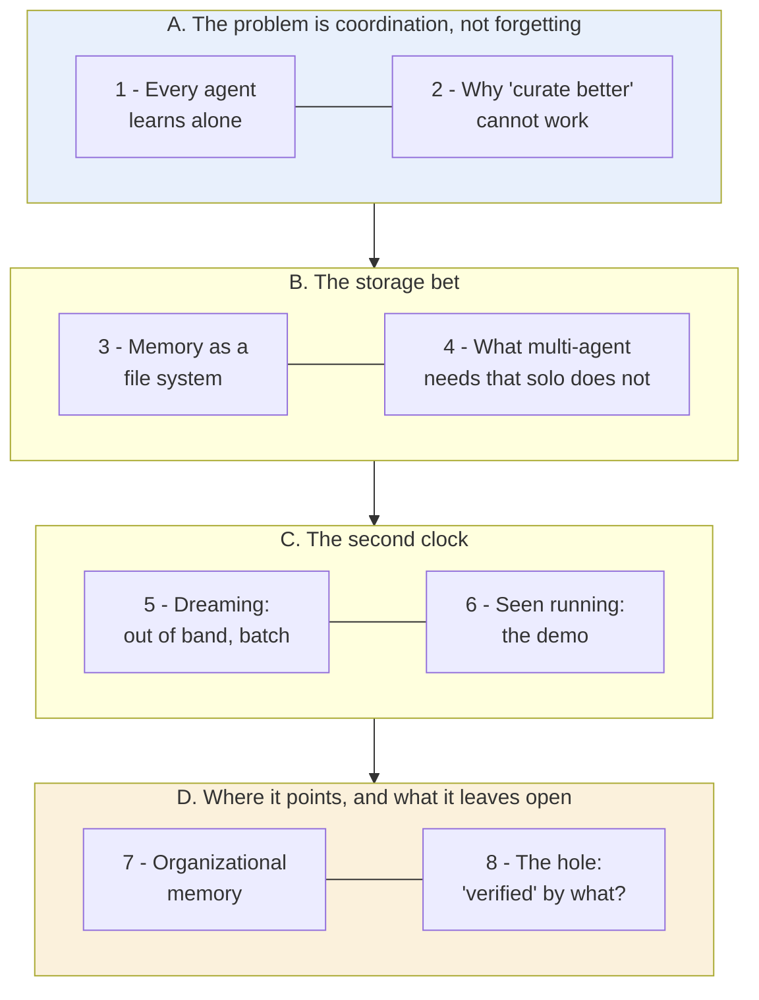
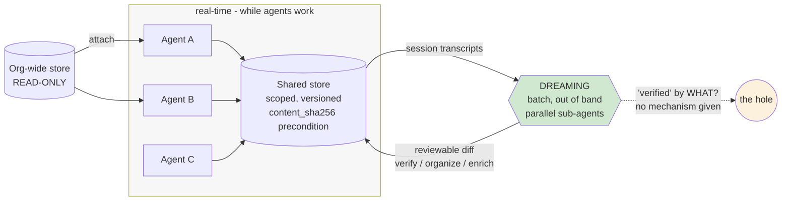

# Learning - Memory and dreaming for self learning agents

> Persona: **curator** + **mentor, always** - re-adopt when working this file.

> The distilled document you learn from - text anchored by a few curated visuals. Built from the
> corroborated nodes in `nodes.md`. Every claim is cited. Signal, not archive. See `SOURCE.md` for
> metadata.

> **Two kinds of material, kept visually distinct.** Claims from the talk carry a node ID (`n12`) and
> a timestamp. Blocks marked **"Background, supplied"** are context *I* am adding - established prior
> art the talk assumes or never names. They are uncited by construction.

## TL;DR

The agent-platform half of the memory pair, and the independent counterpart to
[S6](../260731_chatgpt-memory-dreaming/LEARNING.md). Same architecture, same name, different vendor:
agents write memory **during** work, and a decoupled batch pass rewrites it **between** sessions
(`n11`, `n14`). **The reason to split the loops is objective conflict, not throughput** - one loop
asked to both finish the task and curate memory trades them off untunably (`n12`). Memory is
deliberately a **file system** the model drives with `bash` and `grep`, on the same bet that produced
skills (`n2`, `n3`). And it adds everything a consumer assistant never needs: scoped stores,
optimistic concurrency via a `content_sha256` precondition, per-session attribution (`n5`-`n7`).
A live demo shows agents leaving **instructions** for their successors, not just facts (`n20`).

## The 1-minute version

| | |
|---|---|
| **The problem** | Not forgetting - **every agent learns alone.** At multi-agent scale agents repeat each other's mistakes because "they learn from their mistakes independently", producing duplication and fragmentation (`n10`). |
| **Why the obvious answer fails** | "Make the agent curate better" cannot work, and the reason is the sharpest idea in the talk: an agent asked to **finish its task** *and* **maintain memory quality** trades them off silently. One loop, two objectives, untunable (`n12`). |
| **The idea** | **Two clocks.** Memory does real-time writes as agents work; **dreaming** is a periodic batch pass that runs out of band, reads session transcripts, and rewrites the store between sessions (`n11`, `n14`). |
| **How it works** | Memory is a **plain file system** the model drives with familiar tools, chosen over a bespoke API on the "get out of the model's way" bet that produced skills (`n2`, `n3`). Multi-agent needs three things a single-user store does not: **scopes** (read-only org-wide + read-write team), **optimistic concurrency** via a `content_sha256` write precondition, and **per-session attribution** (`n5`-`n7`). |
| **What it costs** | Test-time compute, paid by a process that completes no user task and repaid to every downstream agent (`n13`). And an unexamined attack surface: a shared store carrying **imperatives** is a coordination channel, with attribution as forensics but **no admission control**. |
| **The gap** | Dreaming's output is called "**a verified**, better organized snapshot". **Nothing says what verification means, who performs it, or what happens on failure** (`d4`). For a system premised on unsupervised writes drifting, that is the load-bearing step and the only one with no mechanism. |
| **How far to trust it** | **T2 vendor talk about its own product, at its own conference. Every outcome number is a customer testimonial** with no baseline, no n and no eval set. **Read it for the architecture; never for the numbers.** The live demo is the real evidence. |

## Key claims

- **Decouple curation from the work loop because of objective conflict, not throughput.** `n12`
  `&t=764s`
- **Two clocks**: real-time writes as agents work, periodic batch updates between sessions. `n14`
  `&t=921s`
- **Model memory as a file system, not a memory API** - the same bet that produced skills. `n2` `n3`
  `&t=386s`
- **Multi-agent memory needs scopes, optimistic concurrency and attribution.** `n5`-`n7` `&t=466s`
- **Agents write instructions to their successors, not just facts.** `n20` `&t=1004s`
- **A memory architecture decomposes into storage / structure / process.** `n9` `&t=566s`
- **Curation is test-time compute with an asymmetric payer.** `n13` `&t=890s` ⚠️ `single-leg`
- ⚠️ **Every outcome figure is a vendor-selected customer testimonial.** `n17` `n18` - direction only.

## What you will learn, and in what order

**How to read it:** top to bottom is the order of the argument, in four movements. The **blue block is
the transferable idea** - and unusually, it is the *diagnosis* rather than the mechanism: objective
conflict generalises far past memory. The **amber block is where the talk stops short**, and section 8
is the hole worth carrying away, because the whole design rests on it.

**The crux: a loop asked to optimise two things trades them off in a way you can neither observe nor
tune - so curation gets its own loop, not better instructions.**

**Why it is grouped this way:** A before B because the storage design only makes sense once you accept
that the problem is coordination across agents rather than recall within one. C is the payload. D is
separated because it contains both the most ambitious claim in the talk and its largest gap, and they
should be read together.

*Synthesized roadmap of this note - not from the source.*

## 1. The problem is not forgetting - it is that every agent learns alone

Memory talk usually starts with recall. This one starts with **coordination**, and the reframe is what
makes the rest worth reading.

- What it teaches: agents learn from **three** sources, not one - about **tasks** (success criteria,
  common mistakes), about **environments** (tools, codebases, users), and **from other agents**
  (patterns across many agents working together). `n16` `&t=210s`
- Corroborated by: "agents can learn from common strategies and previous mistakes... And finally, they
  can transfer these learnings to and from other agents."

**The third column is the one a single-user memory system never has to think about**, and it is where
the diagnosis lands:

> At multi-agent scale, agents "were prone to making many of the same mistakes, and **they learn from
> their mistakes independently**... memory was being updated in a **locally optimal way, but it wasn't
> globally optimal**. In some cases, there was duplication or fragmentation." (`n10`, `&t=615s`)

- What it teaches: the two panels separate the **shared write path** (Agent A / B / C sessions writing
  separately) from an **independent memory curation** box - curation drawn *outside* the session lane.
  `n10` `n12` `&t=615s`
- Corroborated by: the narration naming duplication and fragmentation as the observed symptoms.

**Read "locally optimal, globally suboptimal" as the whole problem statement.** Each agent's write is
individually reasonable. The *store* degrades anyway, because nothing is responsible for the store as
a whole. That is a coordination failure, not a memory failure - and it is the reason the answer is a
second process rather than a better prompt.

Which raises the obvious cheaper alternative.

## 2. Why "just make the agent curate better" cannot work

This is the sharpest idea in the talk and it generalises far past memory (`n12`, `&t=764s`).
Decoupling the curation loop buys three things:

| Reason to run curation out of band | What it buys |
|---|---|
| Cross-session pattern detection | Patterns *across* sessions are invisible from inside any one of them. An **information** argument. |
| **No objective conflict** | **An agent told to finish its task *and* maintain memory quality will trade them off silently.** A separate process has exactly one objective. |
| No added latency | Curation is off the hot path, so it can afford to be expensive. |

**The middle row is the durable idea, and it is not really about memory.** Whenever one loop is asked
to optimise two things, you have created a trade-off you can **neither observe nor tune**. The agent
does not report "I spent 15% less effort on memory to finish faster". It just does it, invisibly,
under whatever pressure the task is applying.

> **Background, supplied.** This is a **conflict of interest**, and every discipline that has met it
> answers the same way: structural separation, not better instructions. Auditors do not audit their
> own accounts; code review is done by someone else; separation of duties exists because "just be
> careful" does not survive incentive pressure. **The design move is always the same - remove the
> conflicted party from the decision rather than asking them to hold both objectives honestly.**

> **And this brain records the same shape twice more.** S4's generator/evaluator split exists to
> defeat **self-evaluation bias**, not to add capability
> ([`brain/claims.md`](../../brain/claims.md) claim 34). S1 stacks QA gates as separate stages. **Three
> sources, three domains, one answer: when a loop has two objectives, split the loop.**

So curation gets its own process. But before the second clock, the thing being curated needs a shape.

## 3. Memory as a file system, on the skills bet

- What it teaches: agent memory evolved as a **ladder of four formats**, each loosening who may write
  - `CLAUDE.md` (a single file) -> `memory tool` (a bespoke API) -> **`skills` (procedural memory)**
  -> `memory/` (files agents read and write). `n1` `n3` `&t=338s`
- Corroborated by: "previously, we built memory focusing on capabilities in the harness... you might
  be familiar with Claude.md for Claude code, or dedicated memory tools in the SDKs."

**Note where `skills` sits on that ladder**, because it is a gift to a neighbouring topic: skills are
labelled **procedural memory**, which puts skills and memory in one family rather than two adjacent
subjects. Memory of *how to do things*, as opposed to memory of facts.

- What it teaches: memory is modelled as a **plain file system to the model** - deliberately - because
  the model is already strong at navigating file systems with `bash` and `grep` rather than at a
  bespoke memory API. `n2` `n4` `&t=386s`
- Corroborated by: "Models and Claude are great at navigating virtual environments and a file
  system... with memory, we've modeled it as a file system to Claude."

The rationale is stated explicitly, and it is a **bet** rather than a result: *"as models improve, we
really just want to get out of Claude's way, **similar to what we did with skills**. And skills was a
very basic format that was highly flexible"* (`n3`).

> **This is claim 31 applied to memory.** Every harness component encodes an assumption about what the
> model cannot do alone, and those assumptions expire. **A bespoke memory API assumes the model cannot
> manage files. This design bets that assumption has already expired.** It is a bet, not a result -
> and if it is wrong, it is wrong quietly, because a model that navigates files *badly* still produces
> plausible-looking memory.

⚠️ The accompanying capability claim - Opus 4.7 is "state-of-the-art at file system-based memory" and
therefore needs less up-front context (`n4`) - is a **vendor claim about its own model with no
benchmark, comparison point or method.**

A file system is enough for one agent. It is not enough for many.

## 4. What multi-agent memory needs that a single-user store never does

- What it teaches: **scopes form a hierarchy** - a read-only org-wide store updated infrequently and
  readable by all agents, plus granular read-write stores the same agents write freely, with multiple
  stores attached per session at different access levels. Plus **optimistic concurrency**: "agents can
  safely write to the same memory files without overwriting each other's learnings". `n5` `n6`
  `&t=466s`
- Corroborated by: "we offer read-only scopes and read-write scopes... And so, this creates a
  hierarchy."

- What it teaches: **versioning** (history, rollback, diffing), **attribution** (every memory links to
  the session that produced it), and **portability** (a standalone CRUD API with export and redaction,
  decoupled from the agent runtime). `n7` `n8` `&t=514s`
- Corroborated by: "version control creates an audit trail as agents make changes... And there's
  attribution to see which agent wrote which part of the memory."

> **Background, supplied - and the concurrency choice is the interesting one.** **Optimistic**
> concurrency assumes conflicts are rare: you read, you compute, and at write time you assert that
> nothing changed underneath you - here via a **content hash precondition** - failing loudly if it
> did. **Pessimistic** concurrency locks up front. The optimistic choice is right when conflicts are
> rare and holding a lock is expensive, which describes agents writing notes precisely. **What it buys
> is that a conflict becomes a visible, retryable failure rather than a silent overwrite** - and
> "silent" is the word doing the work, because a clobbered memory is exactly the kind of loss nobody
> would ever notice.

**The generalisable rule: the moment a second writer exists, memory needs the machinery of a versioned
multi-writer store** - preconditions, attribution, history. A single-loop design needs none of it,
which is exactly why single-loop designs look simpler and stop working at the second agent.

That is memory. Now the second clock.

## 5. Dreaming: the batch pass that runs out of band

- What it teaches: each run **analyses session transcripts**, inspects existing memory state, and
  **proposes optimisations** where sessions were inefficient, made mistakes, or needed better
  guidance. The output is a reorganised snapshot agents "can choose to adopt". `n11` `&t=700s`
- Corroborated by: "**It is a batch process. It runs out of band from sessions. It's completely
  decoupled.**"

- What it teaches: **the two-clock architecture in one picture, and the best single visual in the
  source.** The footers name the distinction the whole topic turns on - "**Memory** - real-time
  updates as agents work" against "**Dreaming** - periodic batch updates between sessions". `n14`
  `&t=921s`
- Corroborated by: "Memory on the left helps agents learn and remember from task to task. And dreaming
  on the right verifies, organizes, and enriches the memory."

- What it teaches: a memory architecture decomposes into exactly three components - **storage** (where
  data lives, what metadata is tracked), **structure** (how memory is formatted, what the model is
  steered to remember), and **process** (how often memory is updated, where it is derived from).
  `n9` `&t=566s`
- Corroborated by: the narration walking all three in order.

**That decomposition is worth keeping as a checklist**, because most memory discussions collapse all
three into "what do we store". Structure and process are separate decisions, and this talk's whole
contribution lives in the third.

Two more details, both `single-leg`: dreaming is framed as **test-time compute applied to memory** -
spend tokens up front, and the return is paid to every downstream agent (`n13`, `&t=890s`); and the
**trigger is programmable** - ad hoc, nightly, hourly, or event-driven, all via API (`n22`, `&t=715s`).

> **The economics are worth stating plainly, because they are what make an expensive pass sane.** The
> cost is borne **once, by a process that completes no user task**; the return is paid to **every
> downstream agent**. That asymmetry only works because the curator is on a different clock - a
> curator inside the session would be spending the user's latency budget on someone else's benefit.

## 6. Seen running: the strongest evidence in the source

Slides show what a vendor believes. The demo shows the artifact - and it carries detail the narration
never states.

- What it teaches: three metadata rows do the work - `version` (`v1..v6 head`), `written by` (a session
  ID), and **`precondition content_sha256`** - optimistic concurrency made concrete. **The demo
  supplies the mechanism the narration never names.** `n6` `n7` `&t=1004s`
- And in the body: `sre-agent-a07` ends a triage note with "**Next agent: skip dep checks, go straight
  to config diff**", and one minute later `sre-agent-a16` writes "Confirmed... **per a07's lead,
  skipped dep checks**". `n20`

**That is the most interesting thing in the talk, and the speaker passes over it.**

> **A memory store carrying imperatives is a coordination channel, not a knowledge base.** That is a
> different object with different failure modes: **a wrong *fact* degrades one answer; a wrong
> *instruction* redirects every agent that reads it.** Nothing in the source addresses what happens
> when a bad instruction lands there - see the security note below, which this finding makes
> considerably less theoretical.

- What it teaches: dreaming is itself built on the same agent platform it serves, fanning out
  **parallel sub-agents** to analyse transcripts - the pane shows an input store, **6 input sessions**,
  an output store and a duration of `7m 12s`. And its output is **a reviewable diff**. `n19` `n21`
  `&t=1161s`
- Corroborated by: "it spins off a series of sub-agents to analyze transcripts in parallel."

**What dreaming actually added in the demo is the useful detail**: it detected "a common pattern of an
alert triggering 60 seconds after a CPU spike" **across sessions and agents**, inferred a likely
retry-behaviour problem, and rewrote the triage log "in a more holistic way rather than just being a
rote log of all the events that happened" (`n21`). That is precisely the cross-session generalisation
section 2 said a single agent structurally cannot reach.

## 7. Where it points: organizational memory

- What it teaches: the intended end state - `task-notes.md` (per-task notes) -> `memory/` (curated,
  organized) -> **organizational memory** (large scale, org-wide sharing and contributions; agents
  read and write, dreaming organizes). `n15` `&t=873s`
- Corroborated by: "memory becomes a huge source of knowledge that Claude can use to understand the
  organization and the world that it's operating in."

The ambition is explicit: memory as **the model's understanding of how a whole company works**. Take
it as a direction of travel rather than a shipped capability - and note that it makes every gap in the
next section larger, not smaller. A poisoned entry in a per-task note misleads one agent; a poisoned
entry in org-wide memory misleads everyone.

⚠️ And the outcome figures offered alongside this vision are the weakest evidence in the source.

- What it teaches: Rakuten reports "97% fewer first-pass errors at 27% lower cost and 34% lower
  latency"; Wisedocs that cross-session memory "sped verification up 30%"; Ando that it let them stop
  building memory infrastructure. `n17` `&t=275s`
- ⚠️ **Vendor-curated testimonials on a marketing slide. No methodology, no baseline definition, no
  eval set, no replication.** The same applies to Harvey's "~6x" completion-rate figure for dreaming
  on a private internal benchmark (`n18`). **Direction only, never a measurement.**

## 8. The hole: "verified" by what?

The talk says dreaming's output is "**a verified**, better organized snapshot" that agents "can choose
to adopt" (`d4`, `&t=748s`).

**Nothing in the talk or the demo says what verification means, who or what performs it, what happens
when it fails, or how adoption is decided.**

> **For a system whose entire premise is that unsupervised memory writes drift, this is the
> load-bearing step - and it is the only one with no mechanism, no slide and no demo.** Every other
> claim in the talk has a slide or a running console behind it. This one has a word.

A second gap sits beside it and is easier to miss, because the neighbouring problem *was* solved
(`d5`). `n6`'s `content_sha256` preconditions stop two agents clobbering the same **file**. **Nothing
addresses two agents learning contradictory *things*** - and the scope hierarchy from section 4
guarantees the case exists: a read-only org store and a read-write team store can disagree, and
nothing states which wins.

> **Write conflicts are solved; semantic conflicts are not.** The mechanical half is easily mistaken
> for the whole, and it is the half that matters least - two agents overwriting a file is a bug you
> can detect, while two agents believing incompatible things is a bug that reads as normal operation.

And one more the source never raises at all: **memory is an unexamined attack surface.** A background
process that ingests session content and writes durable, automatically-applied instructions is a
**persistent prompt-injection sink** - inject once, and the instruction is re-applied in every future
session with no further access needed. Section 6's demo shows the propagation mechanism working
exactly as an attacker would need it to. The source supplies attribution and version history, which
are **forensics after the fact**; there is **no admission control** - nothing validates a memory
before the next agent acts on it.

## Diagram (mental model)

**How to read it:** the grey box is one clock - agents writing while they work. Green is the second
clock, running between sessions. The amber circle is **not a component**; it marks the step the talk
names and never specifies.

**The crux: three agents write to one store on one clock, and a fourth process rewrites that store on
a different clock - and the second clock exists so that nothing is ever asked to do both jobs at
once.**

**Why it is shaped this way:** note that dreaming's output arrow returns to the **same store** the
agents write to, rather than to a separate curated copy - which is what makes adoption a live question
and why "agents can choose to adopt" needs a mechanism it does not have. Note that the org-wide store
is drawn read-only and *attached* rather than written: that asymmetry is the scope hierarchy, and it
is also where the unresolved semantic conflict lives, since nothing says what happens when it
disagrees with the team store. And the amber circle is drawn deliberately as a gap rather than
omitted, because a diagram that quietly completes the design would be claiming more than the source
does.

*Synthesized from `n5`, `n6`, `n11`, `n12`, `n14`, `n19`, `d4`, `d5` - not a slide from the talk.*

## 💡 Terms

| Term | Explanation |
|---|---|
| Out-of-band (processing) | Work done **outside the request path it affects** - memory curation running between sessions rather than during them. Buys cross-session vantage, **no objective conflict**, and no latency cost. |
| Optimistic concurrency control | Allowing concurrent writes without locking: each write carries a **precondition** (here a `content_sha256` of the content the writer believed it was editing) and **fails rather than clobbering** if the state moved. Turns a silent loss into a visible, retryable failure. |
| Memory scope | The access level a store is attached at, and the unit of multi-agent memory design. Read-only org-wide stores hold slow-changing conventions; read-write task stores hold what one team's agents are currently learning. |
| Procedural memory | Memory of **how to do things** rather than of facts. S7's ladder names `skills` as exactly this rung, putting skills and memory in one family. |
| Organizational memory | The end state argued toward: per-task notes grown into an org-wide store functioning as the model's understanding of how a whole company works. |
| Test-time compute (applied to memory) | Spending tokens up front to curate, on the bet it pays downstream. The payer completes no user task; every later agent collects. |

## What to distrust in this note

- **A T2 vendor talk about the vendor's own product, at the vendor's own conference.** Split it in two
  when reading: the **mechanism** claims (`n1`-`n12`, `n14`-`n16`, `n19`-`n22`) are transferable and
  stand on their own logic; the **outcome** claims (`n4`, `n17`, `n18`) are vendor-selected customer
  quotes.
- **Every outcome number here is a testimonial, and this source is the softer of the memory pair.**
  S6's figures at least came from the publisher's own chart specs - exact, method undisclosed. S7's
  are pull-quotes on a marketing slide with **no chart, no baseline and no eval set**. A 97% or a 6x
  with no n cannot refute anything. **Never cite them as measured results.**
- **The live demo is the genuinely strong evidence**, and it is worth saying why: a running console
  showing a `content_sha256` field, a version strip, and one agent consuming another's note a minute
  later is **a photograph of the artifact**, not a restatement of the pitch. In two places (`n6`,
  `n20`) it carries detail the narration never states.
- **This was the source that could have settled the topic's headline question, and does not.** It sits
  on the right side of both axes - an agent platform, a maintained rather than append-only memory -
  and supplies **design conviction and testimonials instead of a method.** Whether a *maintained*
  memory helps an *agent* remains unmeasured. See [`memory.md`](../../brain/topics/memory.md).
- **Convergence with S6 is real evidence about the design, and none about efficacy.** Two independent
  vendors reaching the same architecture rules out copying. **It would look identical if both were
  wrong.**
- **The "Background, supplied" blocks are mine** - conflict of interest as a structural rather than
  instructional problem, and optimistic versus pessimistic concurrency. Uncited by construction.

## Open questions

- **What does "verified" mean?** (`d4`) The load-bearing step of the whole design, with no mechanism,
  no slide and no demo behind it. **The highest-value question on this source.**
- **Who arbitrates semantic conflicts?** (`d5`) Write conflicts are solved; two agents learning
  contradictory things is not addressed, and the scope hierarchy guarantees the case arises.
- **What defends a shared memory store?** A background process writing durable, auto-applied
  instructions is a persistent prompt-injection sink, and the demo shows the propagation path working.
  Attribution and version history are forensics; **there is no admission control.** See
  [`agent-security.md`](../../brain/topics/agent-security.md).
- **Is the METR task-horizon claim sound?** The talk rests its motivation on a 2025 study that agent
  task length doubles every ~7 months (`n23`, `single-leg`). It is external, public and checkable -
  **the cheapest external corroboration available to this topic.**
- **Is the sleep analogy load-bearing?** Two vendors independently chose the name "dreaming" and
  **neither cites the memory-consolidation literature.** S8 calls the same operation *lint*, which is
  mild evidence the metaphor is decoration.

## Feeds these topics

- `../../brain/topics/memory.md` - the multi-agent half: memory as a tool-accessible file system,
  scoped stores, optimistic concurrency, attribution, and the objective-conflict rationale for
  decoupling.
- `../../brain/topics/agents.md` - split a loop rather than let it hold two objectives.
- `../../brain/topics/skills.md` - skills as procedural memory (the category name).
- `../../brain/topics/agent-security.md` - shared memory as a prompt-injection sink with a
  demonstrated propagation path.
