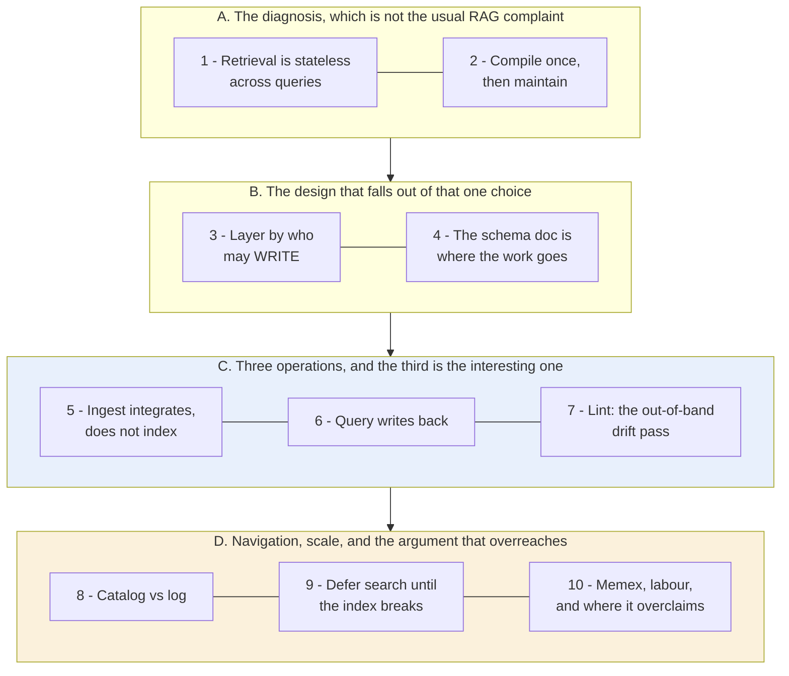
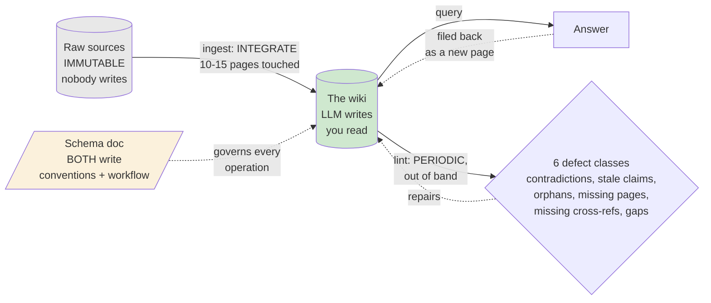

# Learning - LLM Wiki

> Persona: **curator** + **mentor, always**. Re-adopt when working this file.

> The distilled document you learn from. Built from the gated nodes in `nodes.md`. Every claim is
> cited. **This source has no visuals of any kind** - the two diagrams below are *generated*, and
> their provenance says so. See `SOURCE.md` for metadata.

> **Deviation from the standard shape, stated rather than hidden.** A `LEARNING.md` is normally
> **visual-led**. This source is ~1,960 words of prose with **no figures, no diagrams, no code, no
> data and no worked example**, so there is nothing to lead with and no honest way to manufacture a
> second leg. **Every node here is `single-leg`, `needs-check`, without exception** - and nothing may
> be retro-marked `corroborated` later. The walkthrough is led by the argument instead.

> **Two kinds of material, kept visually distinct.** Claims from the gist carry a node ID (`n8`) and
> a section. Blocks marked **"Background, supplied"** are context *I* am adding - established prior
> art the gist assumes or never names. They are uncited by construction.

## TL;DR

A knowledge base built on retrieval **re-derives its synthesis on every question and keeps none of
it**; the alternative is to compile the knowledge once into a maintained markdown wiki that an LLM
owns, and pay the synthesis cost at **ingest** time instead of at query time (`n1`, `n2`). Three
layers - immutable raw sources, an LLM-written wiki, and a schema document both parties co-evolve -
plus three operations: **ingest, query, lint** (`n4`, `n6`). The pattern is Vannevar Bush's **Memex**
(1945), which was blocked for eighty years on one thing: **who does the maintenance** (`n15`).
`https://gist.github.com/karpathy` (revision `ac46de1`)

## The 1-minute version

This article covers a short gist that proposes replacing a retrieval-based knowledge base with a
markdown wiki an LLM owns, writes and keeps current on your behalf. It is roughly nineteen hundred
words of prose with no figures, no code, no data and no worked example, which makes it a design
argument rather than a report of something built and measured. That is worth knowing before you read
it, because it means the value has to come from the diagnosis rather than from a result. The
diagnosis is where the gist starts, and it is the strongest part of it.

The problem it works on is that retrieval is stateless across queries. Ask a question that needs five
documents synthesised, and the model finds and pieces the same fragments together every single time,
while the user waits, and then the answer is thrown away (`n1`). Nothing accumulates from one
question to the next, so the hundredth question costs exactly what the first one did. At first glance
this reads as the familiar complaint about RAG, and the distinction is worth drawing carefully.

The usual complaint is that retrieval returns the wrong chunks, which is a problem about lookup. This
one holds even when retrieval is perfect. What is being re-paid is not the finding of documents but
the relating of them to each other, and that relating happens after the right documents are already
in hand. The reason the problem is hard, in other words, is that the levers everyone reaches for are
aimed somewhere else entirely.

Suppose instead you attack it the way the field usually does, with better chunking, a stronger
embedding model and a reranker on top. Each of those genuinely improves which documents come back,
and none of them changes the moment at which synthesis happens. You end up paying for a more accurate
set of fragments and then re-deriving the same synthesis over them, question after question, and
discarding it every time. The naive approach does not fail because it works badly. It fails because
it is aimed at the cheaper of the two costs.

The idea is to move synthesis from query time to ingest time and then keep the result current
(`n2`). Compile the knowledge once rather than interpreting it afresh on every question, which is the
trade a build step makes against an interpreter. The word compiled is worth taking literally, because
the whole of the rest of the design follows from that one move rather than being proposed alongside
it.

It works by layering the store according to who may write to it (`n4`). Raw sources are immutable and
nobody edits them. The wiki is written by the LLM and only read by you. The schema document, which is
the contract telling the LLM how the wiki is structured, is the one layer both parties co-evolve.
Three operations then run over those layers. Ingest integrates a new source into the pages that
already exist rather than indexing it for later, and may weaken the synthesis already written
(`n3`). Query files good answers back into the wiki as new pages, which makes the questions an input
of the same standing as the sources (`n7`). Lint is a periodic pass, invoked out of band, that hunts
six named defect classes (`n8`). That third operation is the one that gives the design away, because
a store needing no repair would never have earned it.

The cost is a failure mode a retrieval result structurally cannot have, which is that the artifact
can now be stale. An ingest is a wide write touching ten to fifteen pages at once (`n17`), so fifteen
unreviewed edits accumulate per source, and that arithmetic is what makes drift possible at all.
Somebody therefore has to maintain the thing, which is the entire reason the third operation exists.
That constraint is also the oldest part of the story. The gist places itself as Vannevar Bush's
Memex from 1945, a design blocked for eighty years not on storage or linking but on who does the
bookkeeping, which reframes the LLM's contribution as economic rather than intellectual (`n15`).

How far to trust it is the part to be blunt about. This is one practitioner writing about a workflow
he already prefers, with no eval, no baseline and no comparison against the retrieval systems the
gist opens by dismissing. Its two efficacy claims are pure assertion, and one of them contradicts the
document's own operations section (`d1`). Nothing is being sold here, which is rarer in this brain
than it sounds, and an unmeasured claim from a disinterested expert is still unmeasured. Take the
pattern, which stands on its own logic, and leave the numbers alone.

The same argument, compressed for reference rather than for reading:

| | |
|---|---|
| **The problem** | Retrieval is **stateless across queries**. Ask a question needing five documents synthesised and the model re-finds and re-pieces the same fragments every time, while the user waits, then throws the result away (`n1`). |
| **Why the obvious answer fails** | This is not the usual RAG complaint. It holds **even when retrieval is perfect** - the cost being re-paid is *synthesis*, not lookup, and no amount of better chunking touches it. |
| **The idea** | **Compile once, then maintain.** Move synthesis from query time to ingest time - the trade a build step makes against an interpreter (`n2`). |
| **How it works** | Layer the store by **who may write**: immutable raw sources, an LLM-owned wiki, a co-evolved schema document (`n4`). Three operations over it: **ingest** integrates rather than indexes (`n3`), **query** files good answers back as new pages (`n7`), **lint** is a periodic out-of-band pass hunting six named defect classes (`n8`). |
| **What it costs** | The artifact can now be **stale** - a failure mode a retrieval result structurally cannot have. An ingest is a **wide write**, touching 10-15 pages (`n17`), which is what makes drift possible. Somebody must maintain it, which is the whole reason for the third operation. |
| **The lineage** | **Memex, 1945.** Bush proposed exactly this and could not solve *who does the bookkeeping*. The LLM's contribution is therefore **economic, not intellectual** (`n15`). |
| **How far to trust it** | **T4, one practitioner, zero measurement.** No eval, no baseline, no comparison against the RAG systems it opens by dismissing. Its two efficacy claims are assertion, and one contradicts the document's own operations section (`d1`). **Nothing is being sold, which is rarer here than it sounds - but an unmeasured claim from a disinterested expert is still unmeasured.** |

## Key claims

- **Retrieval is stateless across queries** - synthesis is re-paid per question and discarded. `n1`
- **Compile once and keep current** rather than re-deriving per query. `n2`
- **Layer a knowledge base by who may write to it**: immutable raw / LLM-owned / co-evolved schema.
  `n4`
- **The schema document, not the retrieval stack, is where the engineering goes.** `n5`
- **Ingest integrates; it does not index** - and may *weaken* the existing synthesis. `n3`
- **Queries are an input to the store, not just a load on it** - file answers back as pages. `n7`
- **Lint is a periodic out-of-band pass** with six enumerable defect classes. `n8`
- **Split the catalog from the log** - opposite requirements on the same bytes. `n9`
- **The binding constraint is maintenance labour** (Memex, 1945). `n13` `n15`
- ⚠️ **An index file replaces embedding RAG at ~100 sources** - `n10`, **unmeasured, do not cite as a
  result.**

## What you will learn, and in what order

The diagram runs top to bottom in the order the argument is made, gathered into four movements. Blue
marks the payload and amber marks the stretch to read most carefully, and it is worth saying at the
outset why those two are different things. **The crux is that every property of this design falls out
of a single choice, which is moving synthesis from query time to ingest time, and that includes the
new failure mode the choice buys.**

Movement A is the whole argument in miniature, and everything after it is consequence. That is why
the design in movement B reads as *derived* rather than proposed. If you follow the diagnosis in A,
the shape of B should feel forced rather than chosen, and if it does not, the fault is in the
derivation rather than in your reading.

Movement C is the payload, and it holds three operations. One of them, `lint`, is the reason this
source earned an ADR, because it overturned a claim this brain already held. Read that operation
closely even if you skim the other two.

Movement D is separated from everything before it because the document changes what it is doing
there. It stops describing a design and starts persuading you of one, and it is also where the
source's only quantified claim and its only self-contradiction both sit. **Your reading posture has
to change at that boundary**, which is the reason the roadmap draws it as a boundary at all.

*Synthesized roadmap of this note - not from the source.*

## 1. The diagnosis: retrieval has no memory of having answered

The gist opens on a complaint about RAG, and it is **not** the complaint you expect. The usual one is
that retrieval returns the wrong chunks. This one holds **even when retrieval is perfect**:

> "the LLM is rediscovering knowledge from scratch on every question. **There's no accumulation.**"
> (`n1`, §The core idea)

The named failure case makes it concrete: ask a subtle question requiring five documents to be
synthesised, and the model must find and piece together the same fragments **every single time**.

> 💡 **Query-time synthesis** - relating documents to each other *at the moment the question arrives*.
> Cheap to build, because nothing must be maintained. Paid on every question, while the user waits.
> And the result is discarded.

**Separate the two costs, because the whole argument turns on it.** Retrieval is *lookup*; what is
being re-paid here is *synthesis* - the expensive relating of one document to another. Better
chunking, better embeddings and better rerankers all improve lookup and leave synthesis exactly where
it was: at query time, repeated, discarded.

So if the expensive thing is being done at the wrong moment, when should it be done instead?

## 2. Compile once, then keep it current

> "The knowledge is **compiled once and then *kept current***, not re-derived on every query."
> (`n2`, §The core idea)

**Take "compiled" literally, because it is the most useful word in the document.** This is a **build
step versus an interpreter**. Do the expensive relating early, once, and hand the reader an artifact
where "the cross-references are already there. The contradictions have already been flagged."

> **Background, supplied.** The compile/interpret trade is one of the oldest in computing and its
> shape is well understood: you pay more up front and at every *change*, in exchange for paying far
> less at every *use* - and you accept that the compiled artifact can now be **out of date with
> respect to its source**. That last clause is the entire cost of this design, and the document names
> it without quite framing it that way. A retrieval result cannot be stale, because it did not exist
> until you asked. **A compiled artifact can.**

Every other property falls out of that single choice:

| Because synthesis moves to ingest time... | ...you gain | ...and you owe |
|---|---|---|
| the artifact exists before the question | answering is a **read**, not a computation | the artifact can be **stale** - a failure a retrieval result structurally cannot have |
| one source is integrated across many pages | connections persist between sessions | an ingest is a **wide write**: 10-15 pages per source (`n17`) |
| the store is written, not derived on demand | it is greppable, diffable, reviewable | **somebody must maintain it** |

**The right-hand column is where the third operation comes from**, and it is the half that
retrieval-based designs get for free. Hold it - section 7 is where it is paid.

## 3. The architecture is an ownership diagram, not a storage diagram

Most knowledge-base architectures are drawn by *what is stored where*. This one is drawn by **who is
allowed to write** (`n4`, §Architecture), and that is the more interesting axis.

| Layer | Contents | Who writes |
|---|---|---|
| **Raw sources** | articles, papers, images, data | **Nobody.** "the LLM reads from them but never modifies them. This is your source of truth." |
| **The wiki** | summaries, entity and concept pages, comparisons, synthesis | **LLM only.** "You read it; the LLM writes it." |
| **The schema** | the contract document (`AGENTS.md` / `CLAUDE.md`) | **Both.** "You and the LLM co-evolve this over time." |

**The immutable raw layer is the quiet load-bearing rule.** Because the LLM can never edit it, every
derived page can be walked back to something that did not move underneath it. Remove that constraint
and the knowledge base becomes **its own only witness** - free to drift with nothing left to check it
against.

> **Background, supplied.** This is the same discipline as an **append-only source of truth with
> derived views** - an immutable log plus materialised projections you can always rebuild. The
> property it buys is *reconstructability*: if the derived layer is corrupted, you regenerate it. The
> gist never says this, and it matters more here than in a database, because the derivation is
> performed by a non-deterministic process that cannot be replayed exactly.

That leaves the middle layer as the odd one. The LLM owns it entirely - so what keeps the LLM
disciplined?

## 4. The schema document, not the retrieval stack, is where the engineering goes

> "a document (e.g. `CLAUDE.md` for Claude Code or `AGENTS.md` for Codex) that tells the LLM how the
> wiki is structured, what the conventions are, and what workflows to follow... **This is the key
> configuration file - it's what makes the LLM a disciplined wiki maintainer rather than a generic
> chatbot.**" (`n5`, §Architecture)

**This is an unusual answer and it is worth registering the surprise.** Asked what makes an LLM
knowledge system work, the expected answers are the retrieval stack, the chunking strategy, the
embedding model. This says none of them. The load-bearing engineering artifact is **prose**.

It is also **the only layer both parties write** - which makes it the one place a correction to
*behaviour*, as opposed to a correction to a *fact*, can be recorded and survive. A wrong fact gets
fixed on a page. A wrong *convention* has nowhere else to live.

> ⚠️ **Unmeasured, and self-descriptive.** The author is describing a workflow he already prefers,
> with no evaluation of any kind. The framing is valuable; the confidence is not earned.

With the layers settled, the operations become the substance.

## 5. Ingest integrates; it does not index

> The pass "doesn't just index it for later retrieval. It reads it, extracts the key information, and
> integrates it into the existing wiki - updating entity pages, revising topic summaries, **noting
> where new data contradicts old claims**, strengthening or challenging the evolving synthesis."
> (`n3`, §The core idea)

**That commits you to something a document store never does: an ingest may *weaken* the existing
synthesis.** A new source is not additive. It can undermine a page written six months ago, and the
design says so out loud - which is a strong claim, because it means ingest is not a pure function
over new material but an edit to accumulated belief.

Note also the scale: "a single source might touch **10-15 wiki pages**" (`n17`, §Operations - Ingest).
**Ingest is inherently a wide write, and that is precisely what makes drift possible at all.** Fifteen
edits per source, none reviewed in full, compounding over a hundred sources.

Hold that number too. It is the arithmetic behind section 7.

## 6. Queries are an input, not just a load

This is the half of the pattern most designs skip, and the one most worth stealing.

> "**good answers can be filed back into the wiki as new pages**... these are valuable and shouldn't
> disappear into chat history. This way your explorations compound in the knowledge base just like
> ingested sources do." (`n7`, §Operations - Query)

The obvious input to a knowledge base is the sources. This says **the questions are an input of equal
standing**, and that an analysis dying in a chat log is a loss of the same kind as an uningested
source.

**And there is a second-order effect the document does not draw out.** Filing answers back makes the
store reflect **what its owner actually cared about**, not merely what crossed their desk. Two people
ingesting the same hundred sources end up with different wikis, and the difference is the questions
they asked. That is a feature - it is the store becoming *personal* in a way pure ingestion cannot
achieve.

So: ingest writes, query writes. What cleans up after both?

## 7. Lint is a periodic, out-of-band pass - and it overturned a claim in this brain

> "**Periodically**, ask the LLM to health-check the wiki. Look for: contradictions between pages,
> stale claims that newer sources have superseded, orphan pages with no inbound links, important
> concepts mentioned but lacking their own page, missing cross-references, data gaps that could be
> filled with a web search." (`n8`, §Operations - Lint)

**Two words carry the design.** "**Periodically**" and "**ask**": it is neither a step of ingest nor a
daemon, but a **separately invoked operation on its own clock**. And it enumerates **six defect
classes**, which is unusual precision for a document this abstract.

This is where the source did real work on this brain, and the story is worth telling because the error
is repeatable.

[ADR-0009](../../brain/decisions/0009-dreaming-reconciliation-pass.md) **cited this gist before it had
been ingested**, and said the kit already had all three operations - that what the gist lacked was an
out-of-band maintenance pass. Gated against the actual text, that breaks into three assertions:

| Assertion | Verdict |
|---|---|
| The gist describes raw / wiki / schema layers | **holds** (`n4`) |
| It names three operations: ingest, query, lint | **holds** (`n6`) |
| It does **not** supply the out-of-band maintenance pass | **does not hold** (`n8`) |

**§Lint *is* the maintenance pass.** Four of its six defect classes are verbatim members of this kit's
dream stage - contradictions, stale claims superseded by newer sources, orphans, missing
cross-references. A fifth is the topic-creation call the architect persona owns; the sixth is the
deep-research trigger.

**How the prior reading went wrong is the transferable part:** it matched the *word* "lint" to
`validate.py`, concluded the operation was already covered, and moved on. **`validate.py` shares
nothing with §Lint but the name** - it checks *form*, and every item on Karpathy's list is a
*judgement*. Corrected in [ADR-0010](../../brain/decisions/0010-lint-is-the-dream-pass.md).

> **Why this matters beyond the bookkeeping.** It is a claim that was **wrong the day it was written**,
> in a file nothing re-reads, and it survived until someone ingested the source it was about. That
> names where drift actually comes from in a system like this: **claims made *about* sources that have
> not been ingested yet.**

The operations are complete. What about finding anything?

## 8. Split the catalog from the log

Two files, two jobs, and the reason to keep them apart is sharper than it first appears (`n9`,
§Indexing and logging).

| | `index.md` | `log.md` |
|---|---|---|
| Oriented by | **content** - what exists | **time** - what happened |
| Shape | a catalog: link, one-line summary, optional metadata | append-only entries |
| Written | rewritten on every ingest | appended, never edited |
| Read | **first, on every query**, to find the right pages | for history and recent activity |

**Collapse them and you get a file that is either useless as an index or lying as a log.** An index
**must** be rewritten to stay accurate; a log **must never** be rewritten to stay trustworthy. Those
are opposite requirements on the same bytes, and no amount of care reconciles them.

The small tip attached to the log is good engineering: a consistent entry prefix
(`## [2026-04-02] ingest | Article Title`) makes it parseable with
`grep "^## \[" log.md | tail -5` - **structure cheap enough that plain unix tools are the query
engine.**

Which raises the obvious scaling question: when does reading an index file stop working?

## 9. Defer the search infrastructure until the index breaks

The document's answer is its **one falsifiable, quantified claim**, and it arrives with nothing
attached:

> "This works surprisingly well at moderate scale (**~100 sources, ~hundreds of pages**) and **avoids
> the need for embedding-based RAG infrastructure**." (`n10`, §Indexing and logging)

⚠️ **Do not cite this as a result.** No eval set, no comparison against the infrastructure it says you
can skip, no definition of "works well", no account of what breaks past the ceiling, and no derivation
of the ~100. **The word "surprisingly" is doing the work a measurement should.** It is simultaneously
the most useful sentence in the document to *test* and the least safe to *repeat* - and the best
deep-research target in the source.

**The staged position is defensible regardless of the number**: defer search until the index stops
working, then reach for a real engine (`n11`). `qmd` is named - local, hybrid BM25/vector, LLM
re-ranking, on-device, shipping **both a CLI and an MCP server**.

> That last detail is the durable one and it is not about search. **A tool shipping both a CLI and an
> MCP server is usable by an agent two ways** - shell out to it, or bind it as a native tool - and the
> choice belongs to the harness rather than the tool. Worth noticing as an integration pattern.

Which leaves the question the document closes on, and it is the one it handles worst.

## 10. Why now: the Memex, the labour constraint, and where the argument overreaches

The lineage is the most useful sentence for placing this whole idea:

> "related in spirit to Vannevar Bush's **Memex** (1945)... private, actively curated, with the
> connections between documents as valuable as the documents themselves. **The part he couldn't solve
> was who does the maintenance. The LLM handles that.**" (`n15`, §Why this works)

> 💡 **Memex** - Bush's 1945 proposal for a personal document store with associative trails between
> documents. Blocked for eighty years on **maintenance labour** rather than on storage, retrieval or
> linking.

**That reframes what the LLM contributes as economic rather than intellectual**, which is both more
modest and more interesting than "AI enables new knowledge systems". The idea was fully specified in
1945. What was missing was somebody willing to do the filing.

The supporting argument is that wikis die of bookkeeping: "**Humans abandon wikis because the
maintenance burden grows faster than the value.** LLMs don't get bored, don't forget to update a
cross-reference, and can touch 15 files in one pass. **The wiki stays maintained because the cost of
maintenance is near zero**" (`n13`, §Why this works).

⚠️ **Two sentences of that are the weakest thing in the document, and one of them contradicts the
document itself.**

- **"Near zero" is false on its face** for anyone paying per token. The cost **moved and shrank**; it
  did not vanish.
- **"LLMs don't forget to update a cross-reference" is contradicted by §Lint**, which instructs you to
  go hunting for **missing cross-references** (`d1`). Both cannot be true.

**Believe §Lint.** It is the operational section, evidently written by someone who found those
defects; §Why this works is a closing argument whose job is persuasion. **The six-item lint list is an
admission that integrate-on-ingest leaves defects behind** - which is section 5's wide write coming
due.

> **The honest version, and the one worth promoting: LLM bookkeeping is cheap enough to be worth doing
> repeatedly, not so reliable that doing it once is enough.** Weaker, and far more useful - it is the
> version that actually *implies* the third operation rather than undercutting it.

Two closing claims worth carrying, both about the document rather than the design:

- **The division of labour** hands the human **taste** and the LLM the **writing**: "You're in charge
  of sourcing, exploration, and asking the right questions. The LLM does all the grunt work" (`n14`).
  The analogy is explicit - *Obsidian is the IDE; the LLM is the programmer; the wiki is the
  codebase.* Note what that assigns the human: **reviewer and product owner, not author.**
- **The artifact is a pattern to be instantiated, not a spec** (`n16`): "intentionally abstract...
  share it with your LLM agent and work together to instantiate a version that fits your needs."
  Read as a claim about **distribution format** this is the interesting one - the unit shipped is
  neither a library nor a specification but **prose sized for an agent's context window**. It is also
  conveniently unfalsifiable: a document that specifies nothing cannot be wrong about an
  implementation.

## Diagram (mental model)

**How to read it:** the three cylinders and the parallelogram are the three layers, coloured by **who
may write** - grey is immutable, green is LLM-owned, amber is co-evolved by both. Solid arrows are the
three operations; dotted arrows are the two writes that are easy to miss.

**The crux: the two dotted arrows into the wiki are what make this a compounding store rather than a
cache - answers come back in, and a periodic pass repairs what ingest broke.**

**Why it is shaped this way:** note that `lint` leaves *and re-enters* the wiki without touching raw
sources - it can only repair the derived layer, which is exactly why the immutable layer has to exist:
it is the fixed point the repair is measured against. Note too that the schema governs every operation
but is not itself an operation; it is the only box a human writes to, which makes it the sole place a
correction to *behaviour* can persist. And the ingest arrow is labelled **integrate**, not index,
because the alternative reading - ingest as a pure append - would remove the need for lint entirely and
is precisely the mistake `d1` catches the document making about itself.

*Synthesized from `n3`, `n4`, `n5`, `n7`, `n8`, `n17` - **this source contains no diagrams**, so the
structure is assembled from prose and may impose more shape than the author intended.*

## 💡 Terms

| Term | Explanation |
|---|---|
| LLM Wiki | A persistent, interlinked markdown knowledge base an LLM writes and maintains between you and your raw sources - compiled once at ingest and kept current, rather than retrieved and re-synthesized per query. |
| Query-time synthesis | Relating documents to each other *when the question arrives*. Cheap to build, paid on every question while the user waits, and discarded. The thing an LLM Wiki trades away. |
| Lint (knowledge base) | A periodic, separately invoked health check over the **whole** store, hunting contradictions, superseded claims, orphans, missing pages and missing cross-references. **Not a form checker** - every item is a judgement, which is why this kit calls its version `dream` ([ADR-0010](../../brain/decisions/0010-lint-is-the-dream-pass.md)). |
| Memex | Bush's 1945 personal document store with associative trails between documents. Blocked for eighty years on maintenance labour rather than storage or linking - which reframes the LLM's contribution as economic, not intellectual. |
| Wide write | An ingest touching 10-15 pages at once. The property that makes drift possible: fifteen unreviewed edits per source, compounding. |

## What to distrust in this note

- **Every single node is `single-leg`, and that is structural rather than a curation failure.** The
  source has no figures, no code, no data and no worked example, so neither of the kit's pairings is
  available. **Nothing here is `corroborated` and nothing may be retro-marked so later.**
- **Split the source in two before citing it.** The **pattern** half (`n1`-`n9`, `n11`-`n12`,
  `n14`-`n18`) stands on its own logic - you can follow "retrieval re-derives, so compile once"
  without trusting the author about anything. The **efficacy** half (`n10`, `n13`) has **zero
  measurement** and one of its two claims contradicts the document's own operations section.
  **Never cite the efficacy claims as results.**
- **Two things count in its favour, and neither is evidence.** **Nothing is being sold** - a personal
  gist, no product, no affiliation, and the one tool it recommends is someone else's. And it
  **declares its own epistemic status unprompted** ("intentionally abstract... describes the idea, not
  a specific implementation"). Both make it easier to gate honestly. **An unmeasured claim from a
  disinterested expert is still an unmeasured claim** - it just fails differently from a vendor's.
- **This brain is a live instance of the pattern and proves nothing about it.** It runs exactly this
  design - immutable `raw/`, an agent-written `brain/`, `AGENTS.md` as the schema, `INDEX.md` read
  first, an append-only `log.md` - at a source count **still below `n10`'s claimed ~100 ceiling**
  (see [`INDEX.md`](../../INDEX.md) for the live total; **the number was hard-coded here and went
  stale**, so it is a pointer now, matching the same fix already made in
  [`rag.md`](../../brain/topics/rag.md)). **n=1, and still inside the easy regime.** Worth saying
  before the coincidence gets mistaken for corroboration.
- **The "Background, supplied" blocks are mine** - the compile/interpret trade and its staleness cost,
  append-only-plus-derived-views and reconstructability, and the generation effect under the last open
  question. Uncited by construction.

## Open questions

- **Where does index-file navigation actually break?** `n10` claims ~100 sources with no derivation
  and no account of the failure past it. **The highest-value deep-research target here**, and unlike
  most claims in this brain it is the sort of thing someone may genuinely have measured.
- **Why is contradiction-flagging in both ingest and lint?** `n3` puts it at ingest time and `n8` puts
  it in the periodic pass, with no account of why both are needed. The honest reading is that ingest's
  version is unreliable - which is `d1` again, and the document never says it.
- **Does the human keep their grip on knowledge they never wrote?** `n14` hands the human taste and
  the LLM the writing. **Nothing in the source addresses what a reader retains of a corpus they have
  only ever read.**

  > **Background, supplied.** The **generation effect** is a long-standing finding in memory
  > research: material you produce yourself is retained better than the same material read
  > passively. The gist never mentions it, and it is what makes this question sharp rather than
  > rhetorical - **if it transfers, then `n14`'s division of labour trades retention for throughput,
  > and the trade is invisible to the person making it**, because a wiki you can navigate feels like
  > a subject you know. **Whether it transfers to reviewing LLM-written prose is exactly what nobody
  > has tested**, so this is a hypothesis worth checking and not an answer. *(Uncited by
  > construction, and the direction is deliberately not asserted.)*
- **What does the lint pass cost, and how often is "periodically"?** It reads everything by
  construction. The gist neither budgets nor triggers it. This kit's own answer - on request,
  unbudgeted ([ADR-0009](../../brain/decisions/0009-dreaming-reconciliation-pass.md)) - is a decision,
  not a finding.
- **Does the single-writer assumption hold?** `n18` says git supplies versioning and collaboration
  free. Git gives history and attribution; it does not give **admission control or a write
  precondition**, and a single-writer design never has to find out. Compare claim 61, which says a
  second writer *requires* that machinery.

## Feeds these topics

- `../../brain/topics/rag.md` - the compiled-layer alternative to retrieval, layering by write access,
  ingest-integrates-not-indexes, queries filed back, the catalog/log split, maintenance labour as the
  binding constraint.
- `../../brain/topics/memory.md` - the periodic out-of-band reconciliation pass, and its status as the
  third and earliest proponent of the decoupled write.
- `../../brain/topics/context-engineering.md` - the contract document as the persistent counterpart to
  owning the prompt, and the two-pass text-then-images constraint.
