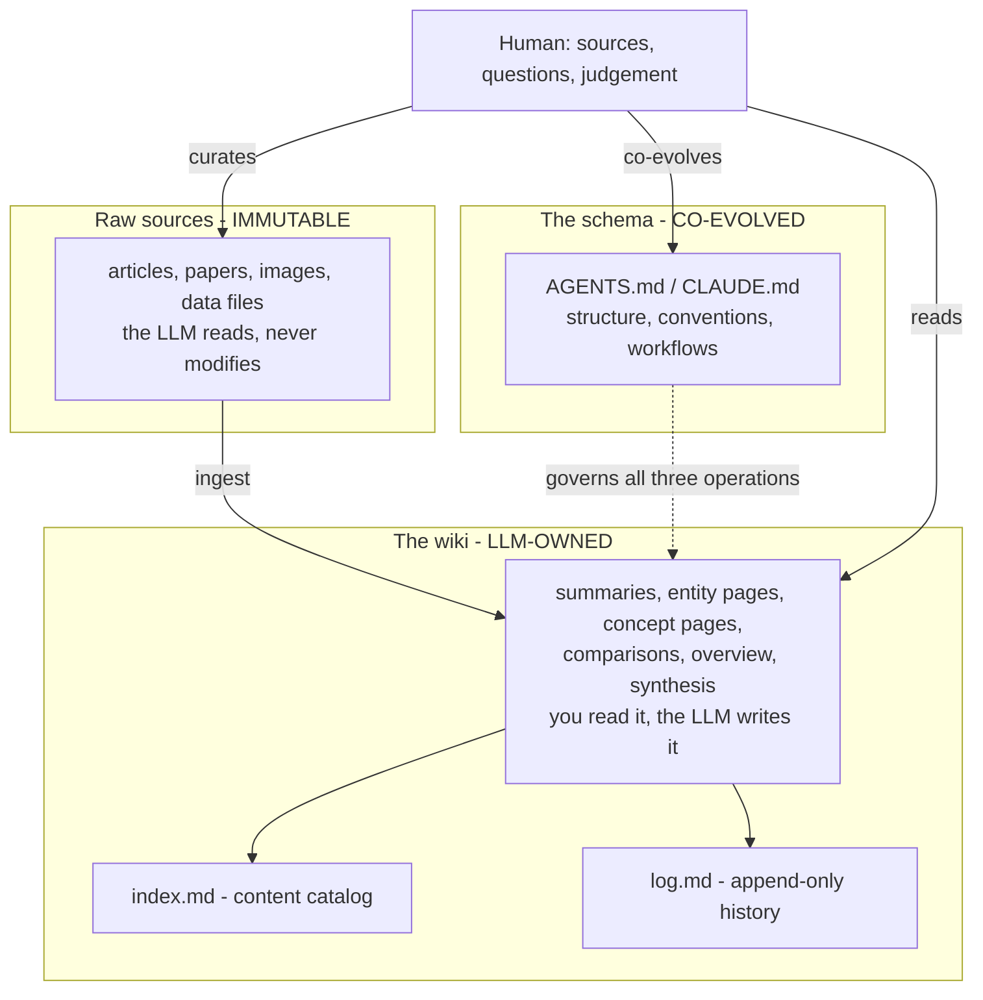
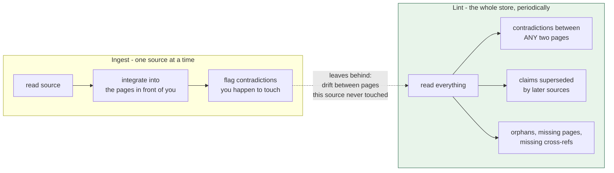

# Learning - LLM Wiki

> Persona: **curator** + **mentor**. Re-adopt when working this file.

> The distilled document you learn from. Built from the gated nodes in `nodes.md`. Every claim is
> cited. **This source has no visuals of any kind** - the two diagrams below are *generated*, and
> their provenance says so. See `SOURCE.md` for metadata.

## TL;DR

A knowledge base built on retrieval **re-derives its synthesis on every question and keeps none of
it**; the alternative is to compile the knowledge once into a maintained markdown wiki that an LLM
owns, and pay the synthesis cost at **ingest** time instead of at query time [S8 §The core idea,
`n1`-`n2`]. Three layers - immutable raw sources, an LLM-written wiki, and a schema document that
turns the model into a disciplined maintainer rather than a chatbot - and three operations: **ingest,
query, lint** [S8 §Architecture, §Operations, `n4`-`n6`]. The pattern is 80 years old (Bush's Memex)
and was blocked on one thing: **who does the maintenance** [S8 §Why this works, `n15`].

**Everything here is unmeasured**, and the document says so about itself [`n16`]. Read it for the
design; two of its claims (`n10`, `n13`) are assertion dressed as result, and one of those is
contradicted by the document's own operations section [`d1`].

## Key claims

| # | Claim | Node | Confidence |
|---|---|---|---|
| 1 | **Retrieval is stateless across queries.** A synthesis question re-pieces the same fragments every time, at query time, while the user waits. Nothing accumulates. | `n1` | needs-check (single-leg) |
| 2 | **Compile once, keep current.** Move synthesis from query time to ingest time - the same trade as a build step versus an interpreter. | `n2` | needs-check |
| 3 | **Layer the store by who may write to it**, not by what it stores: immutable raw / LLM-owned wiki / co-evolved schema. The immutable layer is what keeps every derived claim auditable. | `n4` | needs-check |
| 4 | **The schema document is the load-bearing engineering artifact** - "what makes the LLM a disciplined wiki maintainer rather than a generic chatbot" - not the retrieval stack. | `n5` | needs-check |
| 5 | **Queries are an input too.** File good answers back as pages so exploration compounds like ingestion; an answer that dies in a chat log is a loss of the same kind as an uningested source. | `n7` | needs-check |
| 6 | **Lint: a periodic, out-of-band pass over the whole store**, hunting contradictions, superseded claims, orphans, missing pages, missing cross-references and researchable gaps. | `n8` | needs-check |
| 7 | **Two navigation files with two jobs** - a content catalog read first on every query, and an append-only chronological log. Collapse them and you get a file that is useless as an index or lying as a log. | `n9` | needs-check |
| 8 | **The binding constraint on a knowledge base is maintenance labour**, not storage, retrieval or linking. Bush's Memex was blocked on exactly this in 1945. | `n13`, `n15` | needs-check |
| 9 | **An LLM cannot read markdown and its inline images in one pass** - read the text, then view selected images. A mechanical constraint that forces a two-pass shape. | `n12` | needs-check |
| 10 | **Ship an agent-oriented design as underspecified prose sized for a context window**, to be instantiated by the reader's own agent. | `n16` | needs-check |

## Walkthrough

### The diagnosis: retrieval has no memory of having answered

The document opens by naming what most people actually do - "you upload a collection of files, the
LLM retrieves relevant chunks at query time, and generates an answer" - and then puts its finger on
the part nobody complains about: "**the LLM is rediscovering knowledge from scratch on every
question. There's no accumulation**" [S8 §The core idea, `n1`].

That is a more precise complaint than the usual one. The usual complaint about RAG is that retrieval
returns the wrong chunks. This one holds even when retrieval is perfect: **the system is stateless
across queries**, so the expensive part - piecing five documents into an answer - is paid again every
single time, at the moment the user is waiting for it.

> 💡 **Query-time synthesis** - doing the work of relating documents to each other *when the question
> arrives*. Cheap to build, because nothing has to be maintained; expensive per question, and the
> result is thrown away.

### The move: pay at ingest time instead

"The knowledge is **compiled once and then *kept current***, not re-derived on every query" [S8 §The
core idea, `n2`]. The word to take literally is **compiled**. This is a build step versus an
interpreter: do the work early, once, and hand the reader an artifact where "the cross-references are
already there. The contradictions have already been flagged."

Every property of the design follows from choosing that side of the trade:

| Because synthesis happens at ingest... | ...you get | ...and you owe |
|---|---|---|
| the artifact exists before the question does | answers are a read, not a computation | the artifact can be **wrong** in a way a retrieval result cannot - it can be stale |
| one source is integrated into many pages | connections survive between sessions | a single ingest is a **wide write** - "10-15 wiki pages" [`n17`] |
| the wiki is written, not derived on demand | it is reviewable, greppable, diffable | somebody has to maintain it - which is the whole problem (`n13`, `n15`) |

The right-hand column is not a footnote. **It is where the third operation comes from.**

### The architecture is an ownership diagram, not a storage diagram

**Orientation.** Read top to bottom: raw material enters at the top, derived knowledge sits in the
middle, and the schema on the left governs the middle box rather than flowing into it (dotted line =
governs, solid line = writes). The human enters only at three points, all of them on the outside.

**Crux: the three layers are defined by *who is allowed to write to each one*, not by what they
store.**

**Why it is shaped this way.** The immutable raw layer is the quiet load-bearing rule [`n4`]: because
the LLM can never edit it, every derived page can be walked back to something that did not move.
Delete that constraint and the wiki can drift with nothing left to check it against - the knowledge
base becomes its own only witness. The schema sits *outside* the write path deliberately: it is the
only artifact both parties edit, which is why the design calls it co-evolved rather than
configuration. And the human's three arrows - curate, read, co-evolve - are the exact complement of
the LLM's job [`n14`]: **the human keeps judgement about what is worth knowing and gives away the
writing.**

**Provenance:** synthesized from `n4`, `n5`, `n9`, `n14`. The source contains no diagrams; this is a
generated reading of §Architecture, not a figure lifted from it.

### Three operations, and the third one is the interesting one

**Ingest** and **Query** are what anyone would build. What makes the pattern a system is the two less
obvious rules attached to them, plus a third verb.

**Ingest integrates, it does not index** [`n3`]. The LLM "reads it, extracts the key information, and
integrates it into the existing wiki - updating entity pages, revising topic summaries, **noting
where new data contradicts old claims**, strengthening or challenging the evolving synthesis." Note
what that last clause commits you to: an ingest may *weaken* the existing synthesis, which is a very
different operation from adding a document to a store.

**Query writes back** [`n7`]. "**good answers can be filed back into the wiki as new pages**... these
are valuable and shouldn't disappear into chat history." This is the half people skip. The obvious
input to a knowledge base is the sources you read; this says the **questions you asked** are an input
of equal standing, and that letting an analysis die in a chat log is a loss of the same kind as never
ingesting the source at all. It also has a side effect worth naming: the wiki ends up reflecting what
its owner actually cared about, not merely what crossed his desk.

**Lint is the maintenance pass**, and it is stated as a list of six specific defects [`n8`]:

> "Periodically, ask the LLM to health-check the wiki. Look for: **contradictions between pages,
> stale claims that newer sources have superseded, orphan pages with no inbound links, important
> concepts mentioned but lacking their own page, missing cross-references, data gaps that could be
> filled with a web search.**"

Two words in that paragraph carry the design: "**Periodically**" and "**ask**". The pass is not a
step of ingest and not a background daemon - it is a separately invoked operation on its own clock.

### The economic argument, and where it overreaches

"The tedious part of maintaining a knowledge base is not the reading or the thinking - **it's the
bookkeeping**... Humans abandon wikis because the maintenance burden grows faster than the value.
LLMs don't get bored, don't forget to update a cross-reference, and can touch 15 files in one pass.
The wiki stays maintained because **the cost of maintenance is near zero**" [S8 §Why this works,
`n13`].

The framing is genuinely good and the lineage makes it land: this is Vannevar Bush's **Memex** (1945)
- private, curated, associative trails between documents - and "**the part he couldn't solve was who
does the maintenance**" [`n15`]. That reframes what the LLM contributes here as **economic rather
than intellectual**. The idea was available for eighty years; the labour was not.

> 💡 **Memex** - Vannevar Bush's 1945 proposal for a personal, curated document store where the
> *trails between* documents are as valuable as the documents. Closer to this pattern than to what
> the web became, and blocked on maintenance labour rather than on storage or linking.

**But two claims in that paragraph are assertion wearing the clothes of a result**, and the gate
flags both:

- "**near zero**" is false on its face for anyone paying per token [`n13`]. The maintenance cost
  **moved and shrank**; it did not vanish. Nothing is measured - no abandoned wiki cited, no before
  and after.
- "**LLMs don't forget to update a cross-reference**" is contradicted by the document's own §Lint,
  which tells you to go looking for "**missing cross-references**" [`d1`]. Both cannot be true.

**Believe §Lint.** It is the operational section - it tells you what you will actually find, and it
reads like it was written by someone who found those things. §Why this works is a closing argument,
and its job is persuasion. The whole six-item list is an admission that integrate-on-ingest leaves
defects behind.

> **The honest version of the economic claim: LLM bookkeeping is cheap enough to be worth doing
> repeatedly - not so reliable that doing it once is enough.** That is a weaker claim and a more
> useful one, because it is the claim that actually implies the third operation.

### Why ingest-time contradiction-flagging is not enough (the gap the document leaves)

Notice that the document asks for contradiction-detection **twice**: once at ingest [`n3`] and again
in lint [`n8`]. It never says why both are needed, or what each catches that the other misses.

That silence is worth sitting with, because it is the one place this brain can answer a question its
source does not:

**Orientation.** Left is the per-source loop, right is the periodic pass; the dotted arrow is the
residue the left box hands to the right one. Green marks the operation that reads the whole store
rather than a slice of it.

**Crux: an ingest can only reconcile the pages it happens to open, so the defects it leaves are
exactly the ones no single ingest can see.**

**Why it is shaped this way.** The left box is *scoped by the source* - it touches 10-15 pages
[`n17`] out of hundreds, so a contradiction between two pages that this source never mentions is
structurally invisible to it, no matter how careful the agent is. The right box is scoped by the
**store**, which is the only scope in which "is this still coherent?" is even a well-formed question.
Draw it the other way - fold lint into ingest - and you get a pass whose reach is set by whichever
source arrived last, which is arbitrary. This is also why the two boxes cannot share a clock: the
left one runs when a source arrives, the right one when coherence is worth checking, and those are
unrelated events.

**Provenance:** synthesized from `n3`, `n8`, `n17` and `d1`. The rationale in this paragraph is
**not** in the source - the gist states both operations and never reconciles them. The argument here
is this brain's, drawn from [`memory.md`](../../brain/topics/memory.md) claim 59, and is commentary,
not S8 evidence.

### The document's view of itself, which is a design claim in disguise

"This document is **intentionally abstract**. It describes the idea, not a specific implementation...
**The right way to use this is to share it with your LLM agent and work together to instantiate a
version that fits your needs.** The document's only job is to communicate the pattern. Your LLM can
figure out the rest" [S8 §Note, `n16`].

Read that as a claim about **distribution format** and it becomes interesting. The unit being shipped
is neither a library nor a specification: it is **prose sized for an agent's context window**,
deliberately underspecified so that the agent fills in the particulars for its own harness and
domain. The schema document [`n5`] is where that instantiation lands and persists.

It is also, conveniently, unfalsifiable - a document that specifies nothing cannot be wrong about an
implementation. Worth noticing even though the framing is honest about itself.

## Against the prior claim: what this brain said about this source before reading it

**This is the finding of the ingest.** [ADR-0009](../../brain/decisions/0009-dreaming-reconciliation-pass.md)
cited this gist before ingesting it, as the third source that sharpened the case for the `dream`
stage:

> Karpathy's *LLM Wiki* gist describes this same pattern (raw sources / maintained wiki / schema) and
> names three operations: ingest, query, lint. **The kit has all three. What it does not have is what
> S6 and S7 both argue is the load-bearing one** - a maintenance pass that runs on its own clock
> rather than inside the ingest.

Gated against the text, the first two assertions hold (`n4`, `n6`) and **the third does not**.
**§Lint *is* the maintenance pass.** Four of its six defect classes are verbatim members of the dream
stage's eight; a fifth is the topic-creation call; the sixth is the deep-research trigger:

| Karpathy's §Lint [`n8`] | The `dream` stage's eight classes (`AGENTS.md`) |
|---|---|
| contradictions between pages | **Contradiction** |
| stale claims that newer sources have superseded | **Stale confidence** / **Superseded framing** |
| orphan pages with no inbound links | **Orphans** |
| important concepts mentioned but lacking their own page | (the architect's create-vs-merge call) |
| missing cross-references | **Orphans** / **Drift from source** |
| data gaps that could be filled with a web search | (the deep-research trigger, ADR-0002) |
| - | **Duplication / fragmentation**, **Stale status**, **Closed open questions** - the kit's additions |

**How the prior reading went wrong is the transferable part:** it matched the *word* "lint" to
`validate.py`, concluded the kit already had that operation, and stopped. `validate.py` shares
nothing with §Lint but the name - it checks **form**, and every item on Karpathy's list is a
**judgement**. The kit's own contract says exactly this one sentence away from where the ADR reasons:
*"a green validator means the shape is right, not that the thinking is."*

Two consequences, both filed:

1. **The `dream` stage has an independent third proponent, and it is the earliest and least interested
   of the three.** This gist is dated **2026-04-04** - seven weeks before S7 (2026-05-21) and two
   months before S6 (2026-06-04). It cannot be restating either. And unlike both, it has no product
   to sell. Details in [ADR-0010](../../brain/decisions/0010-lint-is-the-dream-pass.md).
2. **ADR-0009's decision stands; its reasoning is corrected.** The stage was built for good reasons;
   one of the three sources it cited was misread.

> **The class of defect matters more than the instance.** This claim was wrong the day it was
> written, in a file nothing re-reads, and it was found by *ingesting the source* rather than by a
> reconciliation pass. That points at where drift actually comes from in this brain: **claims made
> about sources that have not been ingested yet.** A dream pass reading only `brain/` could not have
> caught it - the evidence was outside.

## 💡 Terms

| Term | Meaning |
|---|---|
| **LLM Wiki** | A persistent, interlinked markdown knowledge base that an LLM writes and maintains between the reader and their raw sources - compiled once at ingest and kept current, rather than retrieved at query time [S8 §The core idea]. |
| **Memex** | Vannevar Bush's 1945 personal document store with associative trails between documents, where the connections matter as much as the documents. Blocked on maintenance labour, which is the part this pattern claims to solve [S8 §Why this works]. |
| **Lint (knowledge base)** | A periodic, separately invoked health check over the *whole* store, hunting contradictions, superseded claims, orphans, missing pages and missing cross-references. Not a form checker [S8 §Operations]. |
| **Query-time synthesis** | Relating documents to each other when the question arrives rather than in advance - cheap to build, paid for on every question, and discarded afterwards [S8 §The core idea, agent framing]. |

## What this does not settle

- **Whether any of it works.** No eval, no baseline, no comparison against the RAG systems it opens
  by dismissing, no reported failure mode, no cost figure. The document does not claim otherwise
  [`n16`], but the two efficacy claims (`n10`, `n13`) are phrased with a confidence the evidence does
  not carry.
- **Where the index-file approach actually breaks.** "~100 sources, ~hundreds of pages" [`n10`] is an
  author estimate with no derivation and no account of the failure past it. This is the highest-value
  deep-research target in the source, and the one claim here that is genuinely falsifiable.
- **Whether the human stays in the loop over time.** The division of labour [`n14`] gives the human
  taste and the LLM the writing. Nothing addresses what happens to a reader's grip on a body of
  knowledge they have never written a sentence of.
- **What lint costs, or how often "periodically" is.** The pass reads everything by construction, and
  the document neither budgets it nor triggers it.

## Open questions / confidence

- **Every node in this source is `single-leg`, confidence `needs-check`** - not a degrade decision but
  a property of the artifact: prose with no figures, no code and no data has only one leg. Nothing
  here may be marked `corroborated` on internal evidence, ever.
- **Independence from S6 and S7 is good but not perfect.** S8 predates both and sells nothing, which
  is as clean as third-source convergence gets in this brain. The wrinkle worth stating: the author is
  a former OpenAI researcher, so "entirely disconnected from the vendors" would be too strong. The
  publication order does the real work - **you cannot restate a source that does not exist yet.**
- **The convergence is on the *practice*, not the *rationale*.** S8 says to lint periodically; it never
  says *why* periodic beats at-ingest. S7 supplies that reason (objective conflict, claim 59) and S8
  does not corroborate it. `d1` is the closest S8 comes, and it gets there by accident.
- **`n10` is the deep-research target.** An independent measurement of index-file navigation against
  embedding retrieval at ~100 documents would be the single most useful external evidence for this
  source, and unlike most claims in this brain, it is the kind of thing someone may actually have
  measured.

## Feeds these topics

- [`rag.md`](../../brain/topics/rag.md) - **primary, and this source takes the topic from `seed` to
  `emerging` as its first source.** The whole document is an argument about what to do instead of
  query-time retrieval, which is the topic's subject seen from the other side.
- [`memory.md`](../../brain/topics/memory.md) - the periodic reconciliation pass [`n8`] and the
  maintenance-as-the-binding-constraint framing [`n13`, `n15`]. **Third source, and the only
  non-vendor one, on the decoupled-curation claim** (claim 59).
- [`context-engineering.md`](../../brain/topics/context-engineering.md) - the schema document as the
  load-bearing artifact [`n5`], and the two-pass text-then-images constraint [`n12`].
