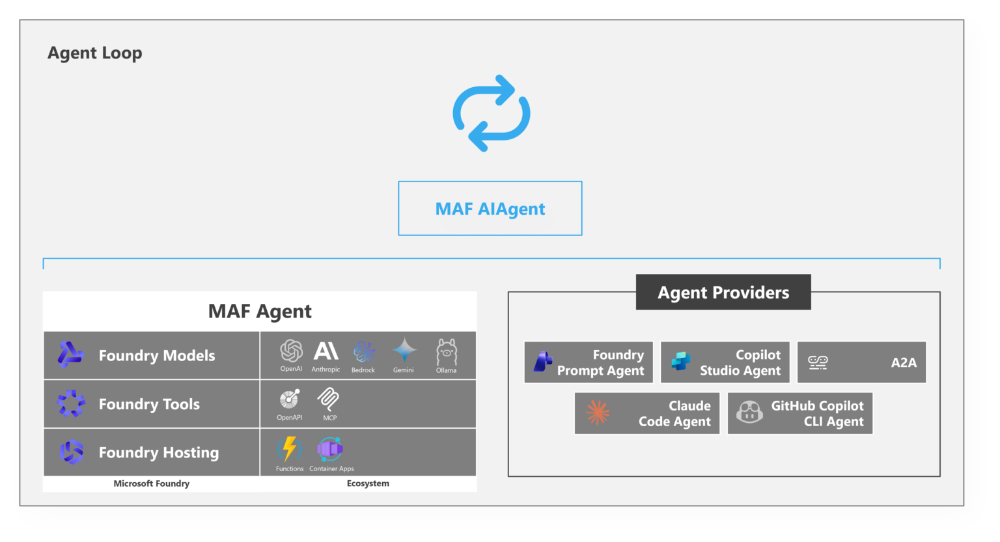
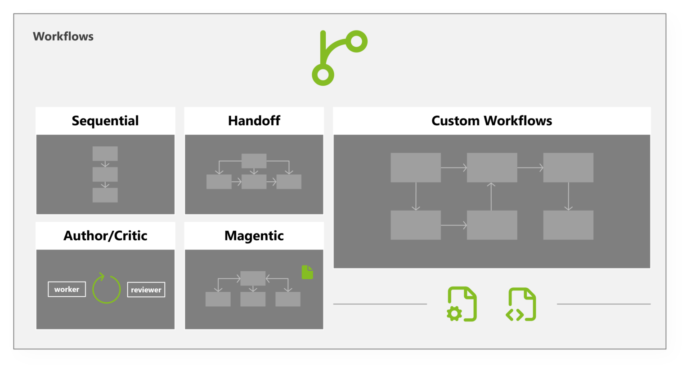
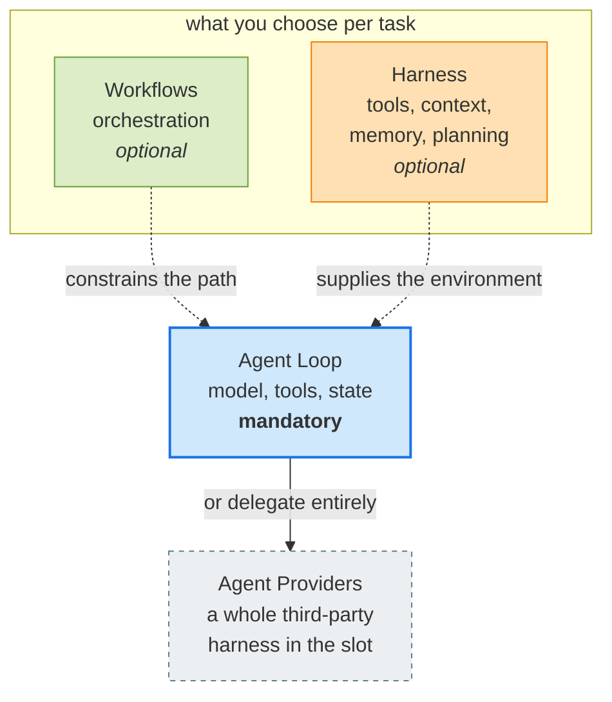

# Learning - Inside the Microsoft Agent Framework: How we designed a layered SDK

> Persona: **curator** + **mentor**. Re-adopt when working this file.

> The distilled document you learn from - text anchored by a few curated visuals. Built from the
> corroborated nodes in `nodes.md`. Every claim is cited. Signal, not archive (3-8 visuals, not
> hundreds). See `SOURCE.md` for metadata.

## TL;DR

A vendor's design post that is worth reading for **one factoring, not for its product**: the agent
loop, workflows, and the harness are three *separable* concerns, and the three-box diagram at the end
shows they are not a stack - the loop is the only mandatory part, with orchestration and runtime
capabilities as two optional surrounds you pick per task (`n1`, `n9`). Its most useful contribution
to this brain is a **named inventory of what a harness contains** - and the inventory files `skills`
under *Context* beside prompts and memory, and `todo` under *Planning*, which is a second vendor
independently reaching the categorisation claim 64 draws from a single Anthropic source (`n7`). Read
it as a taxonomy. **It measures nothing, compares against nothing, and it flatly contradicts the
brain's claim 12 without noticing** (`d1`).

## Key claims

- **Three separable ideas, not three tiers:** agent loop (execution), workflows (orchestration),
  harness (runtime capabilities). `article, §intro + fig_AgentFramework.png` (`n1`)
- **The loop is six lines; everything around it is the work** - messages, tool schemas, results,
  errors, streaming, permissions, state. The article's conclusion is that the SDK should own that
  plumbing. `article, §Agent loops` (`n2`) - **contradicts claim 12, see `d1`**
- **Workflows exist for predictability, not autonomy.** Support triage, bug-to-PR, research-with-
  review are fixed sequences, and five patterns are named for them: Sequential, Handoff,
  **Author/Critic**, Magentic, Custom. `article, §Workflows + fig_Workflows.png` (`n5`, `n6`)
- **A harness inventory in four columns:** Common Tools, Context (prompts, **skills**, memory),
  Planning (**todo**, subagents), Middleware (compaction, tool selection, permissions) - plus preset
  harnesses per task archetype. `fig_AgentHarness.png` (`n7`)
- **Environment quality bounds agent quality regardless of model strength** - a strong model with
  poor tools, weak context and no controls still produces a poor result. `article, §Harnesses` (`n8`)
- **An "agent provider" slot accepts a whole third-party harness**, not just a model - Claude Code
  and the GitHub Copilot CLI appear as peer tiles beside a first-party agent and A2A.
  `fig_AgentLoop.png` (`n4`) - **single-leg, figure only**

## Walkthrough

### Start at the end: the picture that carries the argument

The article's last figure is three boxes, and the arrangement is the thesis.

- **What it teaches:** the layers are **not stacked**. `Workflows` and `Harness` are peers on the
  upper row and do not touch each other; `Agent Loop` sits alone below. Two optional surrounds over a
  mandatory base. `article, fig_AgentFramework.png` (`n9`)
- **Corroborated by:** the closing argument that not every agent needs a complex workflow and not
  every workflow needs a highly autonomous agent - developers pick the level of autonomy per task.
  `article, §Why this matters`

**Why the shape matters more than the boxes.** If this were a stack, every agent would pay for every
layer - you would take orchestration to get tool plumbing. Drawn as peers, the claim is that the loop
is the only thing you always need, and the other two are priced separately. That is the brain's
claim 17 ("not every problem needs an agent") moved one level up: **not every agent needs
orchestration.** The kit's own `AGENTS.md` makes the same call when it says don't spawn a topic per
source - the cost of a structure is paid whether or not the case needs it.

### The loop is the small box, and that is deliberate

- **What it teaches:** the loop the article spends its longest section on is rendered as the *small*
  element. Beneath it sit models (OpenAI, Anthropic, Bedrock, Gemini, Ollama), tools (OpenAPI,
  **MCP**) and hosting - and beside it, separately, `Agent Providers`. `article, fig_AgentLoop.png`
  (`n2`, `n3`)
- **The figure outruns the prose.** The text names six integrations; the figure names roughly
  fourteen and splits them into two structurally different kinds. That split is the interesting part.

> 💡 **Agent provider** - a pluggable implementation that *is* the agent, as opposed to a model the
> agent calls. The distinction matters because a provider brings its own loop, its own tools and its
> own context strategy; you are composing with a finished harness, not supplying one.

The `Agent Providers` box lists `Claude Code Agent` and `GitHub Copilot CLI Agent` as peers of a
prompt-configured first-party agent and of A2A, a wire protocol (`n4`). **The unit of composition has
moved up a level** - from "which model does this agent call" to "which complete agent product does
this system delegate to". Nothing else in this brain describes that, which is why it is recorded
despite being **single-leg on a diagram tile**: the prose only claims the framework can "interact
with agents hosted elsewhere", which is materially weaker, and it never mentions Claude Code at all.
Treat it as a direction of travel, not a capability statement.

### Workflows: the answer to "what if I don't want autonomy?"

- **What it teaches:** five named orchestration patterns, drawn as fixed-topology graphs rather than
  cycles - which is the claim itself, since the point of a workflow is that the path is known in
  advance. `article, fig_Workflows.png` (`n5`, `n6`)
- **Corroborated by:** the same five in the prose with one-line definitions, motivated by three
  worked examples (customer support triage, bug-to-PR, research-with-review). `article, §Workflows`

**The one this brain already knows.** `Author/Critic` is drawn as two boxes labelled `worker` and
`reviewer` with a cycle arrow between them - which is the brain's claim 34 (**self-evaluation bias**:
a generator asked to grade its own output confidently praises it) and claim 59 (**split a loop rather
than let it hold two objectives**) shipped as a named, reusable SDK primitive by a third vendor.

That is genuine corroboration of the pattern's **currency** and none at all of its **efficacy**. S4
(Anthropic harness design) remains the only source in this brain that measured anything about the
generator/evaluator split; this article offers no evidence the pattern works, only evidence that
another vendor thought it worth naming.

> 💡 **Magentic orchestration** - a coordinating agent that plans work and supervises subagents and
> tools, rather than doing the work itself. The vendor's name for the supervisor pattern; the brain
> already holds the same shape as S1's *diagnoser meta-agent* (claim 10's neighbour) and S4's planner.

### The harness, which is where the real contribution is

- **What it teaches:** a harness enumerated rather than gestured at. **Common Tools** (file system,
  code execution, shell execution), **Context** (prompts, skills, memory), **Planning** (todo,
  subagents), **Middleware** (context compaction, tool selection, permissions) - and above them, a
  row of **presets by task archetype**: deep research, content generation, coding, data analysis,
  custom. `article, fig_AgentHarness.png` (`n7`)
- **Only partly corroborated.** The prose covers most of the tools, prompts, memory, subagents,
  compaction and permissions - and is **silent on skills, todo, tool selection and the presets**.
  Those four are figure-only. `article, §Harnesses`

Two things here are worth more to this brain than the inventory itself.

**`Skills` sits under Context, as a peer of prompts and memory.** Claim 64 says a skill is
*procedural memory*, and it says so from one Anthropic source that placed skills on a memory-evolution
ladder. Here a different vendor, with no stake in that argument, independently files skills in the
same drawer as memory rather than treating them as documentation or as a tool. Weak evidence -
a box position in a diagram - but it is **independent** weak evidence, which is the scarce kind.

**`Todo` is named a Planning primitive.** The todo list becomes an architectural component alongside
subagents, not a prompting trick. Worth noting because this harness you are reading right now works
the same way.

**And the thing the diagram cannot say.** This is a catalog, and a catalog invites you to take the
whole shelf. The brain's claim 31 (S4) is the counterweight: **every harness component encodes an
assumption about what the model cannot do on its own, and those assumptions expire.** S4 built a
harness, costed it, and then deleted half of it on a stronger model. Nothing in this article suggests
subtraction, and an SDK vendor has a structural reason never to suggest it. **Read the inventory as a
menu of things you might need, and claim 31 as the instruction to keep re-asking which ones you still
do.**

### The sentence to keep

The justification for the harness layer is the strongest line in the article, and the only place it
agrees with S4 rather than cutting across it: a strong model with poor tools, weak context and no
controls still produces a poor result (`n8`). The figure makes the same point structurally - **the
model appears in none of the boxes.** Every element of a harness is something the developer supplies.

## Commentary: the three layers as a Formula 1 team

> ⚠️ **This section is commentary, not evidence.** None of it is in the source, nothing here is
> cited, and no claim below was promoted to `brain/`. It is a teaching aid worked out in session
> (2026-08-01) because the three-way split is easy to state and hard to feel. **Do not cite this
> section as if it were sourced.** Its value is in the last part - where the analogy *breaks* - which
> is what shows you the edges of the real thing.

| Layer | In F1 | Why it fits |
|---|---|---|
| **Loop** | The driver's corner-by-corner cycle - read the situation, brake, turn in, feel the grip, adjust, next corner - repeated for the whole race. | Nobody else can make those decisions at that speed, and they are made fresh each time rather than planned. |
| **Harness** | The car and everything in reach: chassis, tyres, DRS, engine modes, wheel dials, the radio to the pit wall. | It is what the driver acts *with*. Fixed before the race and only partly adjustable during it. |
| **Workflow** | The strategy set before lights out: two-stop, box on lap 18 and 38, soft-medium-hard, hold position. | Authored in advance by people who are not driving, and it constrains what the driver may choose. |

**Only the loop is mandatory (`n9`), and F1 shows why.** You can run a sprint race with essentially
no strategy - just drive. You cannot run any race without a driver making decisions.

**`n8` stops being an abstraction.** "A strong model with poor tools, weak context and no controls
will still produce a poor result" is simply: a world-champion driver in a backmarker car finishes
fourteenth. Nobody argues about this in motorsport, which is a hint that the claim is uncontroversial
rather than insightful.

**`n4` gets a name it does not have in the article.** An agent-provider slot that accepts a whole
third-party agent is a **customer team** - rather than building your own power unit and gearbox, you
buy the package and run it. You are not composing parts; you are delegating the whole car. That also
makes the trust question obvious in a way the source never raises: you inherit someone else's
engineering decisions wholesale.

**The `d1` conflict already happened in this sport.** Traction control, launch control and ABS were
**banned** - not because they failed, but because they worked, and moved decisions from the driver to
the system. That is `d1` exactly: own the loop, or let the machinery own it. The useful lesson is
that F1 did not settle it by measuring which was faster. It settled it by **deciding where the skill
was supposed to live** - which suggests `d1` may be a values question wearing an engineering costume,
and may never be settled by evidence.

### Where the analogy breaks, which is the part worth keeping

- **The lap count is fixed; an agent's is not.** A Grand Prix is 50 laps, known before lights out. An
  agent loops until the model judges itself done - 3 iterations or 40, decided at runtime. **This is
  the single biggest divergence**, and it is where runaway agents come from: there is no chequered
  flag unless you fit one, which is why an iteration cap is standard harness. A closer fit is a
  **qualifying session** - keep going out until the lap is good enough, then stop.
- **The driver's loop is continuous and reflexive**, not discrete calls with results returning. A
  corner is not a tool call, and treating it as one hides that an agent *waits* between actions.
- **Strategy adapts live.** A safety car destroys the two-stop plan, and the pit wall re-plans mid
  race. So a workflow is less fixed than the table implies - and the pit wall reacting to a safety
  car **is a second loop running above the driver's loop**, which is precisely the overlap this
  source's clean three-box diagram does not admit to (see the note under "Feeds these topics").
- **The car is essentially fixed at lights-out.** An agent's harness can change mid-run; an F1 team
  can change wing angle and tyres and nothing else.

> **The honest summary of the analogy: it is good for the *layers* and bad for the *dynamics*.** It
> makes the three-way split concrete, and it misleads about termination, latency and how much a
> workflow really binds. Use it to explain the shape to someone once, then drop it.

## Diagram (mental model)

**How to read it:** flow is top-down. The **blue** box is the one thing every agent has. **Green** is
orchestration and **amber** is runtime capability - both optional, both drawn as dotted influences on
the loop rather than as wrappers around it, because neither contains the loop. The **dashed grey**
box is the escape hatch: instead of assembling a loop you may hand the whole job to someone else's
agent. Dotted borders mark what is single-leg or optional.

**The crux: the loop is the only mandatory layer, and every other layer is a purchase you should be
able to decline.**

**Why it is shaped this way:** the obvious alternative is a three-tier stack - harness at the bottom,
loop in the middle, workflows on top - and it is wrong in a way that costs you. A stack implies
containment, so adopting orchestration would mean inheriting the whole runtime, and the framework
would have to be all-or-nothing. Drawn as influences, each layer is separately declinable, which is
what makes "not every agent needs a complex workflow" a design property rather than a slogan. The
expensive box is **Harness** - it is the one with an open-ended inventory, so it is where scope
creeps and where claim 31's expiry test has to be run repeatedly. The `Agent Providers` box is drawn
outside the choice group deliberately: it is not a layer you add but a decision to stop building,
and it is also the least evidenced thing in the source.

*Synthesized from `n1`, `n4`, `n7`, `n9`.*

## 💡 Terms

| Term | Explanation |
|---|---|
| Agent loop | The repeated cycle where an agent takes input, reasons over context, decides an action, optionally calls tools, observes results, and continues until done. Six lines of pseudocode; the difficulty is the surrounding management of messages, schemas, errors, streaming, permissions and state. `article, §Agent loops` |
| Harness (as an inventory) | The runtime layer around an agent: tools, context, memory, planning, middleware, permissions. This source's contribution is enumerating it in four named columns rather than describing it in prose. Compare S4, which built one and then deleted half of it. `article, fig_AgentHarness.png` |
| Agent provider | A pluggable implementation that *is* the agent, rather than a model the agent calls - it brings its own loop, tools and context strategy. Whole third-party products (Claude Code, GitHub Copilot CLI) occupy this slot. `article, fig_AgentLoop.png` |
| Magentic orchestration | The vendor's name for a coordinating agent that plans and supervises work across subagents and tools rather than performing it. `article, §Workflows` |
| Author/Critic workflow | A workflow where one agent produces output and a separate one reviews or improves it - drawn as `worker` and `reviewer` in a cycle. The generator/evaluator split (claim 34) as a named SDK primitive. `article, fig_Workflows.png` |
| Tool selection (middleware) | Choosing which subset of available tools reaches the model on a given call, treated as a middleware concern. Figure-only; the prose never mentions it. `article, fig_AgentHarness.png` |

## Open questions / confidence

- **The unresolved contradiction (`d1`): own the loop, or let the framework own it?** S2 says own all
  four parts and blames the 70-80% wall on a framework owning one; this source says the loop is
  fiddly plumbing the SDK should absorb. Neither offers evidence and both authors sell a framework.
  They may be answering different questions - S2 about where the debuggable seam sits when quality
  stalls, this article about how much plumbing you write before you get there. **What would settle
  it is what happens at the 80% wall with this SDK, and the article never discusses it.** Flagged in
  [`agents.md`](../../brain/topics/agents.md).
- **`n4` is single-leg on a diagram tile.** That whole third-party harnesses are peer-pluggable is
  the most interesting claim here and the least supported - the prose makes a materially weaker
  statement and never names Claude Code. Do not cite it as a capability.
- **Four items in the harness inventory are figure-only** (skills, todo, tool selection, presets).
  They are `needs-check`, not `corroborated`.
- **Nothing in this source is measured.** No benchmark, no baseline, no comparison to another
  framework, no report of what building with it is like. Every claim is `emerging` at best, and the
  brain's measured claims (24 decomposition, 32 boundary-relative scaffolding) outrank all of it if
  they ever conflict.
- **T2 vendor post about the vendor's own SDK** - authoritative on what the framework is, positioned
  on whether this is the right way to build agents.
- **No security content, in an article that names permissions three times.** Permissions, approval
  gates and tool selection all appear as harness boxes; prompt injection, tool poisoning and the
  trust boundary around a third-party agent provider appear nowhere. Delegating to another vendor's
  agent is an obvious trust-boundary question the source does not raise. See
  [`agent-security.md`](../../brain/topics/agent-security.md).
- **Would earn deep research:** whether "provider-agnostic" survives contact with reality is the
  standard failure mode of portable-abstraction claims, and it is checkable from outside the vendor.

## Feeds these topics

- [`../../brain/topics/agents.md`](../../brain/topics/agents.md) - the three-way factoring and its
  non-stacked shape (claims 75, 81), the harness inventory (79), environment quality bounding agent
  quality (80), agent providers (77), the five orchestration patterns (78), and the `d1` conflict.
- [`../../brain/topics/context-engineering.md`](../../brain/topics/context-engineering.md) - context
  compaction and tool selection as *middleware* rather than ad-hoc prompt work; `skills` filed under
  Context.
- [`../../brain/topics/skills.md`](../../brain/topics/skills.md) - a second, independent vendor
  filing skills alongside prompts and memory, supporting claim 64's family assignment.
- [`../../brain/topics/mcp.md`](../../brain/topics/mcp.md) - **a sighting, not coverage.** MCP is
  named as one of two tool-integration standards in the ecosystem column (claim 76), which says
  something about MCP's *position* and nothing about its mechanics. Recorded in that note's open
  questions; it does **not** count as the topic's first source and does not move it off `seed`.
