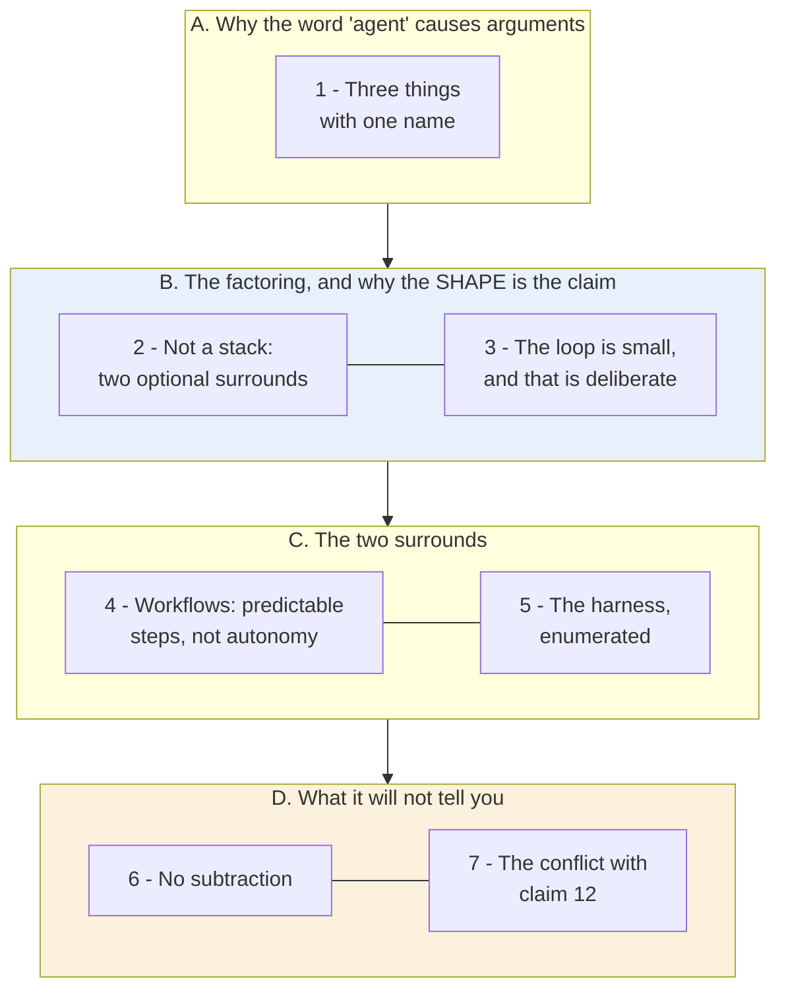
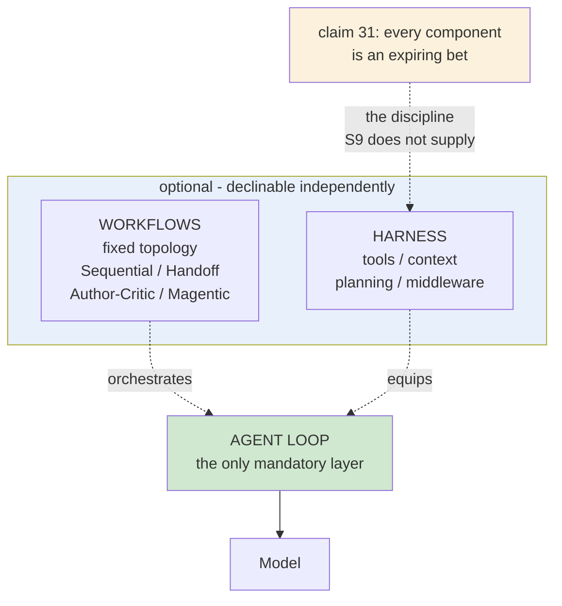

# Learning - Inside the Microsoft Agent Framework: How we designed a layered SDK

> Persona: **curator** + **mentor, always**. Re-adopt when working this file.

> The distilled document you learn from - text anchored by a few curated visuals. Built from the
> corroborated nodes in `nodes.md`. Every claim is cited. Signal, not archive. See `SOURCE.md` for
> metadata.

> **Two kinds of material, kept visually distinct.** Claims from the article carry a node ID (`n9`)
> and a section. Blocks marked **"Background, supplied"** are context *I* am adding - established
> prior art the article assumes or never names. They are uncited by construction.

> **An unusual evidence direction, worth flagging up front.** In this source **the diagrams are the
> richer leg.** They are authored architecture figures with named boxes, and in four places they name
> things the prose is entirely silent on. Normally text is primary and the visual confirms it; here it
> runs the other way, and those figure-only items are marked `needs-check` throughout.

## TL;DR

A vendor design post worth reading for **one factoring, not for its product**: the **agent loop**,
**workflows**, and the **harness** are three *separable* concerns, and the summary figure shows they
are **not a stack** - the loop is the only mandatory layer (`n1`, `n9`). It supplies the brain's only
**enumerated harness inventory** (`n7`), five named orchestration patterns including **Author/Critic**
(`n6`), and the sentence that justifies the whole layering: *"a strong model with poor tools, weak
context and no controls will still produce a poor result"* (`n8`). **It also contradicts claim 12 head
on** - S2 says own your loop, this says let the SDK own it - and never acknowledges the position
exists (`d1`).

## The 1-minute version

| | |
|---|---|
| **The problem** | "Agent" names three different things at once - an execution cycle, an orchestration topology, and a pile of runtime capabilities - so arguments about agent design are usually people talking about different layers. |
| **The idea** | Separate them. **Agent loop** (the cycle over models, conversations, tools and state), **workflows** (structured orchestration), **harness** (reusable runtime capabilities) (`n1`). |
| **The shape is the argument** | In the summary figure `Workflows` and `Harness` sit **side by side above** `Agent Loop`, and **the two peers do not touch** - two optional surrounds over a mandatory base, **not a three-tier stack** (`n9`). A stack would imply containment: adopt orchestration and you drag in the runtime. |
| **What it gives you** | The only **enumerated harness inventory** in this brain - Common Tools / Context / Planning / Middleware, over presets by task archetype (`n7`). Five orchestration patterns worth having names for, including **Author/Critic** drawn as `worker` and `reviewer` in a cycle (`n6`). |
| **The best sentence** | *"A strong model with poor tools, weak context and no controls will still produce a poor result"* (`n8`). The figure makes the same point structurally: **the model appears in none of the boxes.** |
| **What is missing** | **Subtraction.** A catalog invites you to take the whole shelf, and an SDK vendor has a structural reason never to suggest removing anything. Pair it with claim 31 - every harness component is an expiring bet. |
| **The conflict** | It contradicts **claim 12** (own all four parts of your loop) directly, and never mentions that anyone holds that view (`d1`). Both sides are unmeasured assertions by non-disinterested authors. |
| **How far to trust it** | **T2 vendor design post about its own SDK. Nothing measured, nothing compared, no baseline.** Read it for **vocabulary and taxonomy**, never for efficacy. Four harness items exist only in a figure. |

## Key claims

- **Loop, workflows and harness are three separable purchases, not a three-tier stack.** `n1` `n9`
- **Five orchestration patterns**: Sequential, Handoff, **Author/Critic**, Magentic, Custom. `n6`
- **A harness is an inventory**: Common Tools / Context / Planning / Middleware, plus presets. `n7`
  ⚠️ four items **figure-only**
- **Environment quality bounds agent quality regardless of model strength.** `n8`
- **Workflows exist because many processes need predictable steps, not more autonomy.** `n5`
- **An agent-provider slot can accept a whole third-party agent product.** `n4` ⚠️ `single-leg`,
  figure-only
- ⚠️ **The SDK should own the loop's structure** - this **contradicts claim 12**. `n2` `d1`

## What you will learn, and in what order

**How to read it:** top to bottom is the order of the argument, in four movements. The **blue block is
the contribution** - a taxonomy, and specifically the claim that its three parts are *independently
declinable*. The **amber block is what you must supply yourself**, because this source has a
structural reason not to.

**The crux: this is a vocabulary, not a finding - and the vocabulary is worth having precisely because
the arguments it settles are ones people currently have by accident.**

**Why it is grouped this way:** A is short because the problem is definitional rather than technical.
B is the payload and the figure carries more of it than the prose does. C is a tour, and D exists
because reading a vendor catalog without a subtraction discipline is how harnesses get bloated - the
missing half has to come from elsewhere in this brain.

*Synthesized roadmap of this note - not from the source.*

## 1. Three different things wearing one word

Most disagreements about "agent design" are people arguing about different layers without noticing.
The article's contribution is to name them apart (`n1`, §intro):

- the **agent loop** - the execution cycle over models, conversations, tools and state;
- **workflows** - structured orchestration for multi-step or multi-agent processes;
- the **harness** - the reusable runtime capabilities around the agent.

That is a taxonomy, not a finding, and it is worth being clear about which you are getting. **But a
taxonomy that dissolves a recurring confusion is genuinely useful**, and this one does: "should agents
be autonomous?" is a question about the *loop*, "how do I make this repeatable?" is about *workflows*,
and "why is my agent bad despite a good model?" is about the *harness*.

The interesting part is not the three names. It is how they are arranged.

## 2. The shape is the argument: not a stack

- What it teaches: `Workflows` and `Harness` sit **side by side above** `Agent Loop`, inside one
  container - **and the two peers do not touch.** Two optional surrounds over a mandatory base, not a
  three-tier stack. `n9` `fig_AgentFramework`
- Corroborated by: §Why this matters states the choice explicitly - *"Not every agent needs a complex
  workflow. Not every workflow needs a highly autonomous agent."*

**Spend a moment on why the drawing matters, because this is the whole payload.** A stack implies
**containment**: if workflows sat *on* the harness, adopting orchestration would drag the entire
runtime in with it. Drawn as **peers that do not touch**, each is **separately declinable** - you can
take the loop alone, the loop plus a harness, or the loop plus workflows.

> **That is claim 17 one level up.** S2 says *not every problem needs an agent*; S9 says *not every
> agent needs orchestration*. Same discipline, applied to the layer above - and the fact that a
> different vendor arrives at it independently is worth more than either statement alone.

> **Background, supplied.** "Layered but not stacked" has a precise name in software design:
> **optional composition** over **mandatory layering**. A layered architecture buys you coherence and
> costs you the ability to opt out of a layer; composition buys the opposite. The reason this figure
> earns a paragraph is that **most SDK diagrams draw stacks by default**, and the stack is what makes
> a framework all-or-nothing. **When you next read an architecture diagram, check whether the boxes
> touch** - it usually tells you more about what you can decline than the prose does.

## 3. The loop is drawn small, and that is deliberate

- What it teaches: the `MAF AIAgent` box is **small**; the substrate beneath it - models (OpenAI,
  Anthropic, Bedrock, Gemini, Ollama), tools (OpenAPI, **MCP**), hosting (Functions, Container Apps),
  agent providers - occupies most of the frame. `n2` `n3` `fig_AgentLoop`
- Corroborated by: §Agent loops gives a six-line while-loop as pseudocode, then argues that the
  difficulty is everything around it - messages, tool schemas, results, errors, streaming,
  permissions, state.

The article's conclusion from that observation is: **the SDK should own the structure**, so you work
on agent behaviour instead of plumbing (`n2`). Hold that thought - section 7 is where it collides with
something.

⚠️ **And one tile in this figure is the most conceptually interesting thing in the source and its
weakest evidence** (`n4`). The `Agent Providers` box has five peer tiles, and two of them are
**`Claude Code Agent`** and **`GitHub Copilot CLI Agent`** - whole third-party agent *products* -
sitting beside a prompt-configured first-party agent and beside **A2A, a wire protocol**.

> **If that tile means what it appears to mean, the unit of composition has moved up a level**: from
> *which model does this agent call* to *which finished agent does this system delegate to*. **But the
> prose never says it.** It claims only that the framework can "interact with agents hosted
> elsewhere", never names Claude Code, and "interact with" is considerably weaker than a peer slot.
> **`single-leg` on a diagram tile** - treat it as a direction of travel, not a capability. A tile in
> a vendor architecture diagram is exactly what this kit must not read as a capability statement.

## 4. Workflows: the answer to "what if I do not want autonomy?"

- What it teaches: five named patterns - **Sequential**, **Handoff**, **Author/Critic** (drawn as
  `worker` and `reviewer` with a cycle arrow between them), **Magentic** (a coordinator plans and
  supervises subagents and tools), and **Custom**. `n6` `fig_Workflows`
- Corroborated by: §Workflows defines all five in prose, and argues that many real processes -
  support triage, bug-to-PR, research-with-review - need **predictable steps rather than more
  autonomy** (`n5`).

**The framing is the useful part**: workflows are not a lesser form of agency, they are the correct
answer when the topology is known in advance. Notice the figures are drawn as **fixed-topology graphs**
- boxes and arrows - rather than cycles, which is the visual statement of exactly that.

> **`Author/Critic` deserves its own note, because this brain has met it twice already.** It is
> **claim 34** (S4: a separate evaluator beats a self-critical generator, because of self-evaluation
> bias) and **claim 59** (S7: split a loop before it holds two objectives) **shipped as a named,
> reusable SDK primitive by a third vendor.** Treat that as corroboration of the pattern's
> **currency**, not its **efficacy**: S9 measures nothing, and S4 remains the only source here that
> measured anything about the split.

## 5. The harness, enumerated - which nothing else here does

- What it teaches: the harness as **four named columns** - **Common Tools** (file system, code
  execution, shell execution), **Context** (prompts, **skills**, memory), **Planning** (**todo**,
  subagents), **Middleware** (context compaction, **tool selection**, permissions) - above a row of
  **preset harnesses by task archetype** (deep research, coding, content generation, data analysis,
  custom). `n7` `fig_AgentHarness`
- Corroborated by: §Harnesses covers most of it in prose. ⚠️ **But it is silent on four items -
  `skills`, `todo`, `tool selection` and the presets - which are figure-only and `needs-check`.**

**This is the source's most useful contribution to this brain**, because nothing else here enumerates
a harness; every other source gestures at one. Two of the figure-only items have since become
load-bearing elsewhere: **`skills` filed under Context beside prompts and memory** is independent
support for a skill being *procedural memory*, and **`tool selection`** is the box S10 later built and
measured.

And the justification is the strongest sentence in the article, and the one place it agrees with S4
outright (`n8`, §Harnesses):

> **"A strong model with poor tools, weak context and no controls will still produce a poor result."**

**The figure makes the same point structurally, and it is worth noticing: the model appears in none of
the boxes.** Every element of a harness is something the developer supplies.

## 6. What the catalog will never tell you: what to remove

Here is the gap, and it is structural rather than an oversight.

**Claim 31 - every harness component encodes an assumption about what the model cannot do alone, and
those assumptions expire - has no counterpart anywhere in S9.** The article lists what a harness may
contain and never once suggests taking something out.

> **A catalog invites you to take the whole shelf, and an SDK vendor has a structural reason never to
> suggest subtraction.** That is not dishonesty; it is what the genre is for. But it means the
> inventory is only half a discipline.

**Read S9's inventory as a menu of things you might need, and claim 31 as the standing instruction to
keep re-asking which ones you still do.** S4 supplies the procedure (remove one component at a time);
S5 supplies the instrument (ablation - run the eval with and without). **Together those three make a
complete practice that no single one of them contains.**

> **Background, supplied.** This is the difference between a **capability catalog** and a **design
> discipline**, and the distinction shows up whenever a vendor documents a platform. A catalog
> optimises for *discoverability* - here is everything available. A discipline optimises for *fit* -
> here is how to decide. **They are not in conflict, but a catalog read as a discipline produces
> exactly the bloat the catalog's author benefits from.**

## 7. The conflict it never acknowledges

And the sharpest reason to read this alongside S2 rather than instead of it (`d1`).

| | S2 (12-factor agents, T4) | S9 (Agent Framework, T2) |
|---|---|---|
| Implementing the loop well is | **the whole job** | **difficult, repetitive plumbing** |
| Therefore | **own all four parts** - the 70-80% wall comes from a framework owning one | **let the SDK own it**, so you work on agent behaviour |

**Both start from a near-identical premise - the loop is six lines and the surrounding management is
hard - and land on opposite conclusions.**

**Kept, not resolved**, and both sides are weak in the same way: **unmeasured assertions by
non-disinterested authors.** S2's author sells an agent framework; S9 is a product post for an SDK.

> **They may also be answering different questions**, which is the most useful reading. S2 is about
> **where the debuggable seam sits when quality stalls at 80%**. S9 is about **how much plumbing you
> write before reaching 80% at all.** A framework whose loop is *inspectable and overridable*
> satisfies both; one that hides it satisfies only S9. **And what would settle it - what happens at
> the 80% wall with this SDK - is exactly what S9 never discusses.**

## Commentary: the three layers as a Formula 1 team

*Labelled commentary - my analogy, not the source's. Skip it if the figure already landed.*

The **agent loop** is the driver: the thing that actually makes decisions, lap after lap, and the only
component you cannot remove and still have a race. The **harness** is the car and the pit crew -
tyres, telemetry, fuel strategy, the radio. The **workflow** is the race plan: pit on lap 22, hold
position until the safety car clears.

**Why the analogy earns its place:** a superb driver in a bad car finishes nowhere, which is `n8`
exactly. And a race plan is worth having *because* it constrains the driver - you do not want
improvisation on the pit timing, which is `n5`.

### Where the analogy breaks, which is the part worth keeping

**A driver cannot be swapped mid-race, and an agent provider can** (`n4`). More importantly, **the car
does not expire.** A harness component is a bet on a model limitation, and models improve underneath
you - so the closer analogy for claim 31 would be a car that quietly becomes slower every season you
do not re-examine it. **No motorsport metaphor carries that, which is precisely why section 6 needs an
outside source.**

## Diagram (mental model)

**How to read it:** green is mandatory, blue is optional, amber comes from **outside this source**.
The dotted arrows from the optional box are deliberate - they attach to the loop without containing
it.

**The crux: only one box is green, and the two blue ones do not touch each other.**

**Why it is shaped this way:** the workflows and harness boxes are drawn as siblings inside one
container rather than as layers, because that is the source's actual claim and the thing most likely
to be lost in retelling - **a stack would mean adopting orchestration drags in the runtime**. The
model sits *below* the loop rather than inside the harness, because `n8`'s argument is that the model
is the one thing the developer does **not** supply. And claim 31 is drawn entering from outside with
its provenance labelled, because **the single most important thing about this inventory is that the
article contains no instruction to prune it** - a diagram that quietly included subtraction would be
crediting S9 with a discipline it does not have.

*Synthesized from `n1`, `n7`, `n8`, `n9` + claim 31 (S4) - a redrawing of `fig_AgentFramework.png`
with the missing discipline added and marked.*

## 💡 Terms

| Term | Explanation |
|---|---|
| Agent loop | The repeated cycle where an agent takes input, reasons over context, decides an action, optionally calls tools, observes and continues. Six lines of pseudocode; the difficulty is the surrounding management. **Whether you or your framework should own it is an open conflict** - claim 12 versus `n2`. |
| Workflows | Structured orchestration for multi-step or multi-agent processes. Exists because many real processes need **predictable steps rather than more autonomy**. |
| Harness (as an inventory) | The runtime layer around an agent - tools, context, memory, planning, middleware, permissions. S9's contribution is **enumerating** it in four named columns; S4's is the discipline for **pruning** it. |
| Agent provider | A pluggable implementation that *is* the agent, rather than a model the agent calls - bringing its own loop, tools and context strategy. Whole third-party products occupy this slot in the figure. |
| Author/Critic | A workflow where one agent produces and a **separate** one reviews, drawn as `worker` and `reviewer` in a cycle. The generator/evaluator split (claims 34, 59) as a named SDK primitive. |
| Magentic orchestration | A vendor's name for the supervisor pattern: a coordinating agent plans and supervises subagents and tools rather than performing the work. |
| Tool selection (as middleware) | Choosing which subset of available tools reaches the model on a given call, as cross-cutting policy rather than per-call authoring. **Figure-only in S9; built and measured in S10.** |

## What to distrust in this note

- **T2 vendor design post about its own SDK.** No benchmarks, no measurements, no baseline, no
  comparison to any other framework. **No claim here may exceed `emerging` on an efficacy question.**
  Read it for vocabulary and taxonomy.
- **Internal corroboration is the ceiling this source can reach.** Both legs - prose and figure - were
  authored by the same team, about the same product, in the same post. Agreement proves the article is
  self-consistent and nothing more.
- **The diagrams are the richer leg, which is unusual and cuts both ways.** Four harness items -
  `skills`, `todo`, `tool selection`, the presets - and the entire agent-provider claim (`n4`) exist
  **only in a figure**. A named box in a vendor architecture diagram is a design intention, not a
  shipped capability.
- **`n4` is the most interesting claim and the weakest-evidenced**, and those two facts together are
  the trap. Five tiles in one diagram; the prose declines to make the claim.
- **It contradicts claim 12 head-on and never acknowledges the position exists** (`d1`). A reader
  taking this post alone would not learn that a serious opposing view is widely held.
- **It is silent on subtraction**, and that silence is structural rather than accidental.
- **The Formula 1 section is my analogy**, labelled as commentary. It is not the source's framing and
  carries no evidential weight.

## Open questions

- **What happens at the 80% wall with this SDK?** The question that would settle the claim 12 conflict
  is exactly the one the post never discusses. **Checkable from outside both vendors, and the best
  research target here.**
- **Are the figure-only harness items shipped, planned, or aspirational?** `skills`, `todo`, `tool
  selection` and the presets appear in no prose. S10 has since built one of them, which is mild
  evidence for the rest.
- **Does the agent-provider slot really accept a whole third-party agent** (`n4`), and what does the
  integration surface actually look like? The claim is architecturally significant and rests on a
  diagram tile.
- **How do you decide *which* harness components to adopt?** The inventory answers "what exists" and
  nothing answers "what for this task" - the gap claim 31 and ablation fill from outside.
- **Is "not a stack" a design property or a drawing choice?** The figure is the primary evidence for
  the note's central claim, and no API surface is shown to confirm the layers are independently
  usable.

## Feeds these topics

- `../../brain/topics/agents.md` - the loop/workflows/harness vocabulary, five orchestration patterns,
  the enumerated harness inventory, environment quality bounding agent quality.
- `../../brain/topics/context-engineering.md` - context management as **middleware** rather than
  per-call authoring.
- `../../brain/topics/skills.md` - `skills` filed under Context beside prompts and memory, by an
  independent vendor.
