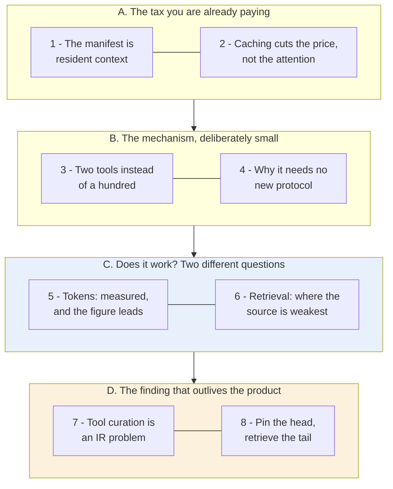
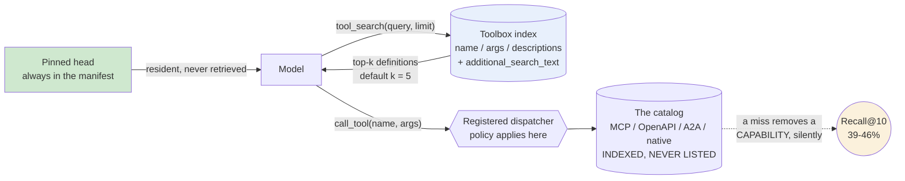

# Learning - Tool search: Finding the right tool at the right time

> Persona: **curator** + **mentor, always** (+ **fact-checker** at the gate) - re-adopt when working
> this file. Source facts in [`SOURCE.md`](SOURCE.md); gated evidence in [`nodes.md`](nodes.md).

> **Two kinds of material, kept visually distinct.** Claims from the article carry a node ID (`n9`)
> and a section. Blocks marked **"Background, supplied"** are context *I* am adding - established
> prior art the article assumes or never names. They are uncited by construction.

## TL;DR

**A tool catalog stops being a schema-management problem and becomes a search problem, and the
crossover is around ten to fifteen tools.** Microsoft Foundry's Toolbox replaces the full `tools/list`
manifest with exactly two meta-tools - `tool_search(query, limit)` and `call_tool(name, arguments)` -
and keeps the rest of the catalog indexed but never listed (`n3`, `n6`). On ToolRet (44,000+ tools)
that cuts context from **541k tokens to 15k at 1,180 tools, a 36x reduction**, and the figure shows
something the prose undersells: the tool-search curve is roughly **flat** as the catalog grows 24x
(`n9`, `n10`). The reframing is the real payload - **tool names and descriptions become ranking
features**, so the first tuning pass is **editorial, not algorithmic** (`n19`, `n13`).

## The 1-minute version

| | |
|---|---|
| **The problem** | Every tool is "both a capability and a distraction". The `tools/list` manifest is **resident in context on every turn**, and its size tracks **what is connected**, not what the task needs - 541k tokens at 1,180 tools (`n1`, `n9`). |
| **Why the obvious answer fails** | Prompt caching does not fix it. Cached tokens are ~90% cheaper and **still compete for the model's attention** (`n2`). **You paid less to poison the well.** |
| **The idea** | Stop listing the catalog. Expose **two meta-tools** - `tool_search(query, limit)` and `call_tool(name, arguments)` - and keep everything else **indexed but never listed** (`n3`). |
| **Why two and not one** | Because runtimes **refuse to call a tool absent from `tools/list`**. A retrieved tool cannot be invoked directly, so a *registered* proxy must carry the dispatch (`n4`) - which conveniently gives the platform one place to apply policy. |
| **What it costs** | **541k -> 15k tokens, and roughly flat as the catalog grows 24x** (`n9`, `n10`). The reliability side is the unexamined half: **Recall@10 of 39-46% against a default shortlist of five** (`n11`). |
| **The real finding** | A tool's description **stops being documentation and becomes an index entry.** The dominant failure is implementer vocabulary - "get", "create", "manage" - so **the first useful tuning pass is editorial, not algorithmic** (`n13`, `n19`). |
| **The shape to keep** | **Pin the head, retrieve the tail.** The tail is where the rare, high-stakes tools live, so it is also where a miss costs most - you are choosing **which capabilities the agent may forget it has** (`n16`). |
| **How far to trust it** | **T2 vendor post on its own preview product - but better evidenced than that class usually is**: a public benchmark, an honest baseline, a category where it loses. Three caveats: the head-to-head **mixes borrowed baselines with a self-run** (`d2`), the metadata-tuning percentages are method-free (`n15`), and the source never confronts its own recall number. |

## Key claims

- **The tool manifest is resident per-turn context scaling with the catalog, not the task.** `n1`
- **Prompt caching is a price cut, not an attention cut.** `n2` ⚠️ `single-leg`
- **Two meta-tools replace the manifest**; the catalog stays indexed and never listed. `n3` `n6`
- **`call_tool` exists because runtimes reject unlisted tools.** `n4`
- **541k -> 15k at 1,180 tools (36x), roughly flat across a 24x catalog increase.** `n9` `n10`
- **Recall@10 of 45.99 / 39.56 / 41.36** - a tuned sparse pipeline competitive with a GPU
  cross-encoder in two of three categories. `n11` `n12`
- **Descriptions become ranking features; the first tuning pass is editorial.** `n13` `n19`
- **An index-only field** separates the searchable surface from the model-facing one. `n14`
- **Pin the head, retrieve the tail.** `n16` `n17`

## What you will learn, and in what order

**How to read it:** top to bottom is the order of the argument, in four movements. The **blue block is
where the evidence lives** - and it splits into a question the source answers well and one it answers
badly, which is the single most important thing to carry out of this note. The **amber block is what
survives even if the product does not**: a reframing about metadata that generalises far past tool
catalogs.

**The crux: deferring the manifest converts catalog size from a per-turn cost into an indexing cost -
and buys a retrieval risk the source measures and then never discusses.**

**Why it is grouped this way:** A and B are short because the mechanism genuinely is small - that
smallness is itself a claim (`n5`). C is deliberately split, because the token result and the
retrieval result have very different evidential quality and reading them as one number is the mistake
this source invites. D is separated because it is the part you would still want after switching
vendors.

*Synthesized roadmap of this note - not from the source.*

## 1. The tax you are already paying, and it is charged per turn

> "Every tool you give an agent is both a **capability** and a **distraction**." (§intro)

The mechanism is unglamorous. `tools/list` hands the client every tool definition up front, and those
definitions are then **resident in the model's context on every turn**: "thousands of tokens of names,
descriptions, JSON schemas, argument definitions, and nested parameters **before you've asked anything
useful**" (`n1`, §intro).

**The property that matters is what the cost is a function of.** It tracks **what is connected**, not
what the task needs. Attach a hundred-tool MCP server for the one tool you occasionally want, and you
pay for the ninety-nine on every request forever.

Which raises the objection any engineer reaches for first.

## 2. Caching lowers the price, not the cost

Prompt caching was already on in the baseline - it is the Azure OpenAI default - and cached tokens are
roughly **90% cheaper**. The article is careful, and this is the sentence to keep:

> Cached tokens are "**not free**, and cached context **still competes for the model's attention**."
> (`n2`, §The default agent tax) ⚠️ `single-leg` - prose only.

> **Background, supplied - and this is exactly where the brain's own measured evidence lands.**
> Prompt caching works by reusing an unchanged prompt *prefix*, so the provider skips recomputing it
> and bills a fraction. **Nothing about that changes what the model attends over.** The tokens are
> still in the window, still consuming the n² attention budget, still positioned where "lost in the
> middle" effects apply. This brain records degradation tracking **what is in the window, not what it
> cost to put there** ([`brain/claims.md`](../../brain/claims.md) claims 22 and 27, measured across
> 18 models). **A cached manifest is a fully-priced attention liability at a 90% discount on the
> invoice.**

So the manifest has to not be there at all. But you cannot simply delete it - the model has to find
out somehow.

## 3. Two tools instead of a hundred

- What it teaches: the whole mechanism in two rows. **Row 01** is the baseline - every definition, up
  front, resident. **Row 02** is the replacement - `tool_search(query, limit)` hits a toolbox index and
  returns "top 5 definitions returned in full", then `call_tool(name, arguments)` dispatches. `n3`
  §Two tools instead of a hundred
- Corroborated by: the prose describing the model "describing the capability it needs" and receiving a
  small set of matching definitions.

**Now the question the diagram answers without saying so: why *two* tools?** Search alone would seem
enough - find the tool, then call it.

> Because "if a tool wasn't registered in the original `tools/list`, **many runtimes will guard
> against the model calling it directly as an unknown tool**. `call_tool` gives the framework a
> registered, **policy-aware dispatch path**." (`n4`, §Two tools instead of a hundred)

**That is the most reusable protocol fact in the source, and it arrives sideways as an implementation
constraint.** A tool that was *retrieved* rather than *listed* cannot be invoked directly, so a
registered proxy has to carry the call. And it hands the platform something it wanted anyway: **one
dispatch point through which every call passes**, so policy applies in a single place.

⚠️ Note the hedge: **"many runtimes", not "the protocol"**. No runtime is named and no spec version is
cited. Treat it as a portability constraint you will probably hit, not a rule you can cite.

Look at the dashed box in that figure too: remote MCP servers, OpenAPI, A2A and native tools all sit
behind one index - **"indexed, never listed"** (`n6`). Which explains why this needed no protocol
change at all.

## 4. Why it needs no new protocol primitive

- What it teaches: **the toolbox is itself consumed as an MCP server.** "Connect to this toolbox using
  MCP and call it from your agent code", at an endpoint of the form
  `.../toolboxes/{name}/versions/{version}`, via `MCPStreamableHTTPTool` with a bearer token injected
  per request - with four ordinary MCP servers attached *inside* it. `n7` ⚠️ **figure-only - the prose
  never states that the toolbox is an MCP server.**
- And tool search is a **plain toggle** on an otherwise ordinary toolbox, with no protocol
  configuration anywhere in the pane (`n5`).

**This is what makes the mechanism unremarkable, in the good sense.** An **aggregating MCP server** is
free to expose whatever tools it likes and service them however it wants - so replacing a hundred-tool
catalog with a search index needed **no new protocol primitive, no model-specific feature, and no
shared ranking semantics across providers** (`n5`).

> 💡 **Aggregating (or proxying) MCP server** - a server whose tools are drawn from *other* servers
> rather than implemented locally. Because a client sees only the aggregator's `tools/list`, the
> aggregator can add, hide, rename or index what is behind it **without any client or downstream
> server changing**.

> **Composition is the leverage point, and it is the transferable lesson here.** Everything this
> product achieves comes from sitting *between* client and servers. Any protocol with a proxy layer
> has this affordance available, and it is worth asking of any integration standard you adopt: **can
> something sit in the middle and change the shape of what I see?**

Two questions remain, and they have very different answers.

## 5. Does it save tokens? Yes, and the figure says more than the prose

- What it teaches: measured on ToolRet (44,000+ tools, 7,000 queries) - **"more than 60%" saved at 50
  tools, "above 97%" at 1,000**, with the endpoint **541k baseline versus 15k with tool search at
  1,180 tools, a 36x reduction.** `n9` §The savings were real
- Corroborated by: the prose stating the same trend directionally.

**And the figure carries something the prose never says** (`n10`): the tool-search series is roughly
**flat** - a ~15-50k band - across the whole sweep, while the baseline climbs from ~40k to 541k.
"Savings scale with size" understates it.

> **The transferable claim is not "tools got cheaper". It is that catalog size stops being a
> context-budget decision at all** - it becomes an indexing cost, paid once, off the per-turn path.
> That is a change in the *shape* of the cost function, not a discount on it.

⚠️ One caveat the source never mentions: **the baseline curve has a discontinuity**, jumping from
~160k to ~360k between roughly 500 and 550 tools - **more than 2x for a ~10% catalog increase** - then
resuming a gentle climb. A clean single-variable ablation should not produce that. It does not
threaten the headline, measured at the right-hand end, but **the curve is not the smooth sweep the
prose implies.**

That is one of the two questions. The other one is where this source is weakest.

## 6. Does it retrieve the right tool? This is the unexamined half

Recall@10 on ToolRet, three slices (`n11`, Figure 3):

| Method | Web | Code | Customized |
|---|---|---|---|
| **Tool search** (enhanced sparse, lexical similarity) | **45.99%** | **39.56%** | 41.36% |
| BM25s | 24.62% | 28.23% | 32.39% |
| BGE-reranker-v2-gemma (GPU cross-encoder) | 45.94% | 38.23% | **49.43%** |

> 💡 **Recall@k** - the share of queries where the correct item appears **anywhere** in the top k.
> Silent about its rank within those k, and silent about everything below.

> 💡 **Cross-encoder reranker** - a model scoring query and candidate **together** rather than
> comparing precomputed vectors. More accurate and far more expensive, because nothing can be indexed
> ahead of time: every candidate needs a forward pass at query time.

**The claim the source draws is genuinely useful**: a tuned sparse lexical pipeline matched a GPU
cross-encoder in two of three categories **without paying for the GPU at serving time** (`n12`). That
is a real data point against the reflex that quality retrieval requires neural reranking.

**Two things weaken it, and the source states the first itself.**

⚠️ **It is not one experiment** (`d2`). The BM25s and BGE columns are "**from [1]**" - lifted from
another paper - while the tool-search column is a self-run that deliberately "left out the benchmark's
instruction string" to avoid an extra LLM call at serving time. **Whether [1] also omitted it is never
stated**, so the columns may not be like-for-like, and **the direction of the bias is unknown.**

⚠️ **And the absolute level goes undiscussed, which is the bigger problem.** Recall@10 in the low
forties means **the right tool is outside the top ten for more than half of queries** - while the
`limit` default is **five**. The article closes with *"Smaller is not better if the right capability
disappears. The shortlist has to be good"* and **never places that sentence beside its own table.**

> **This brain's reading, not the source's claim:** when the retrieved items are **capabilities**, a
> miss does not return a worse answer - it **removes an option**, and the model may never learn the
> option existed. That is a different failure mode from a bad search result, and it is unmeasured
> here.

So why does retrieval fail? The answer is the best thing in the article.

## 7. The real finding: tool curation is an information-retrieval problem

What broke was not the ranker.

> Benchmarking "revealed that tool search failed when tool descriptions were uneven, sometimes
> capturing **implementation detail instead of user intent vocabulary**" - "get", "create", "manage",
> "REST API". (`n13`, §Tuning the search space) ⚠️ `single-leg`.

Their example is exact. `execute_query`, described truthfully as "runs a query against the configured
database", must be found by users typing **"analytics", "dashboard", "SQL", "reporting",
"warehouse"**. **Accurate and unsearchable are perfectly compatible.**

The fix is an **index-only alias field** (`n14`, corroborated prose-versus-code):

> `"execute_query": {"pin": True, "additional_search_text": "SQL database analytics reporting
> dashboard queries"}` - indexed for retrieval, "**isn't visible to models in MCP responses**", and
> "**no changes are made to the original tool schema of the source MCP server**".

**Three consequences, and the third is the one nobody in the source mentions:** retrieval vocabulary
can be tuned **without spending model tokens**; a **third-party** server can be tuned for your users'
vocabulary **without forking it**; and **an invisible field steers which capability the agent is
offered**, with no trace in the context the model or a reviewer can inspect.

⚠️ The self-reported gains here - hit rate "+about 56%", end-to-end accuracy "+about 55%", "within
about 4% of the full-catalog baseline" (`n15`) - are **the weakest evidence in the source**: no
dataset, no absolute baselines, no statement of relative-versus-points, and **it is not the ToolRet
run above.** Two evaluation regimes are blended in one section. Do not quote them.

But the generalisation survives all of that, and it is what the authors say surprised them:

> "We thought we were solving a token-cost problem; we were also **building a search product**"
> (`n19`, §intro). At small scale a catalog looks like schema management; at larger scale **tool names
> and descriptions become ranking features**.

> **This is the third instance of one pattern this brain now holds** (claim 93). A **skill's**
> description is its **trigger** and causes 50%+ of failures (S5). A **column's** description becomes
> a **default policy** the agent applies (S11). A **tool's** description becomes a **ranking feature**.
> **Metadata written for a human to skim gets promoted to a control surface the moment a model reads
> it - and the incumbent human-facing vocabulary is the dominant failure mode every time.**

## 8. Pin the head, retrieve the tail

The last piece is a distribution argument, and it is the shape worth keeping (`n16`, §Search is for
the long tail).

| | What it holds | How it reaches the model |
|---|---|---|
| **The head** | the agent's core contract - policy tools, frequent data access, "capabilities the model should never have to rediscover" | **pinned**, always present, never retrieved |
| **The long tail** | rare but high-stakes tools: "rotate a credential, recover a failed deployment, apply a compliance exception, inspect an audit trail" | **retrieved on demand** |

**Why the tail is the interesting half, and it is not the obvious argument.** The reflex reading is
that rare tools matter less, so hiding them is cheap. **The reverse is true**: rare tools are
disproportionately the **emergency** ones, so the tail is exactly where a retrieval miss is most
expensive. That is what makes this a design decision rather than an optimisation - **you are choosing
which capabilities the agent is allowed to forget it has.**

> **Background, supplied.** This is a **Pareto** split, and the useful part of naming it is that
> Pareto shapes tell you where to spend *differently*, not where to spend *less*. The head justifies
> hand-curation because it is small and always paid for. The tail justifies machinery because it is
> large and rarely paid for. Applying one strategy to both is the mistake.

**And pinning turns out to be the cache-control lever too** (`n17`): "Deterministic pinning keeps the
prompt prefix stable, which preserves prompt-cache behavior." **Prefix stability is a context design
constraint, not a billing detail** - it decides where in the window a dynamic list may sit.

⚠️ Though there is a tension inside that paragraph (`d3`): the toolbox **auto-pins** frequently used
tools **per user** after a warmup, with stale entries aging out. A pin set that is per-user,
warmed-up and aged is by construction **neither identical across users nor stable across days**, which
sits badly beside "deterministic". Both hold only if "deterministic" means *manual* pins alone, and
the text does not say so.

The adoption heuristic, finally: worth testing **above 10-15 tools**, or when different tasks need
different subsets, or when one agent serves many workflows (`n18`, ⚠️ `single-leg`, and a vendor's own
adoption guidance for its preview product).

## Diagram (mental model)

**How to read it:** solid arrows are one turn. **Green is what is always in context** (the pinned
head); **blue is what is fetched on demand**; the amber circle is **not a component** - it is the
measured risk the source reports and does not discuss.

**The crux: two arrows leave the model instead of one, and that second arrow exists only because a
retrieved tool is not a callable tool.**

**Why it is shaped this way:** note that `call_tool` is drawn as a **dispatcher** rather than a
passthrough - the registered-proxy requirement (`n4`) is a constraint, but it hands you a single
policy point you would otherwise have to build. Note that the pinned box bypasses the index entirely
and reaches the model directly: pinning is not "high-ranked", it is *not retrieved at all*, which is
what makes prefix caching work. And the dotted arrow is drawn to the gap rather than back to the model
deliberately - **on a retrieval miss nothing arrives, and nothing is what the model sees.** A diagram
that routed the miss back into the loop would be claiming a recovery path the source does not
describe.

*Synthesized from `n3`, `n4`, `n6`, `n11`, `n14`, `n16` - a redrawing of `fig_tool-search-figure.png`
with the measured recall gap added, which the source's own figure does not show.*

## 💡 Terms

| Term | Explanation |
|---|---|
| Tool manifest | Every tool definition handed to the model up front via `tools/list`. **Resident in context on every turn**, so its size tracks what is connected rather than what the task needs. |
| Tool search | Replacing the manifest with two meta-tools - a search over an index of the catalog, and a registered dispatcher to call what it returns - so definitions enter context on demand. |
| Aggregating MCP server | A server whose tools come from other servers. Because the client sees only the aggregator's `tools/list`, it can index, hide, rename or add capability with no client or downstream change. |
| Prompt caching | Reusing an unchanged prompt prefix so the provider charges a fraction (~90% less). **Buys money and latency, never attention** - cached tokens still compete for it. |
| Recall@k | The share of queries where the correct item appears anywhere in the top k. Silent about rank within k, and about everything below. |
| Cross-encoder reranker | A model scoring query and candidate together rather than comparing precomputed vectors. More accurate, far more expensive - nothing can be indexed ahead of time. |
| Index-only field | Metadata indexed for retrieval but never shown to the consumer (`additional_search_text`), so search vocabulary and consumer-facing schema tune independently. **Also an invisible steering surface.** |
| Pinning | Keeping chosen tools permanently in the manifest instead of subjecting them to retrieval - the head of the distribution, plus whatever must never be rediscovered. Also what keeps the prompt prefix cacheable. |

## What to distrust in this note

- **T2 vendor post about its own preview product** - but **better evidenced than that class usually
  is**, which is worth saying plainly: it runs a **public benchmark** (ToolRet, 44,000+ tools),
  states an honest baseline, and **reports a category where it loses** to the neural reranker.
- **The head-to-head is not one experiment** (`d2`). Two of the three rows are **lifted from another
  paper**, and the self-run deliberately omitted the benchmark's instruction string. Whether the
  borrowed baselines did too is never stated, so **the direction of the bias is unknown.**
- **The metadata-tuning percentages are method-free** (`n15`): no dataset, no absolute baselines, no
  relative-versus-points, and not the ToolRet run. **The weakest evidence in the source, and it sits
  next to the strongest.**
- **The source never confronts its own headline recall number.** Recall@10 of 39-46% against a default
  shortlist of five is the central unexamined gap, and combining it with the closing "the shortlist
  has to be good" is **this brain's reading, not a claim the article makes.**
- **`fig_image-6.png` carries `n7` alone** - the prose never says the toolbox is itself an MCP server,
  so that fact is **figure-only**.
- **A printed code sample that cannot run** (`d1`): four different names for one API inside one
  section, raising `NameError` as printed. A useful reminder that **a vendor code sample is evidence
  of intent, not of a working API.**
- **The "Background, supplied" blocks are mine** - caching versus attention, Pareto strategy, Recall@k
  and cross-encoder semantics. Uncited by construction.

## Open questions

- **What happens on a retrieval miss?** The measured Recall@10 says it happens for more than half of
  queries at k=10, and the default shortlist is 5. **No recovery path is described** - does the model
  re-search, widen, or simply proceed without the capability? **The highest-value question here.**
- **Is the unregistered-tool guard a spec rule or a client convention?** `n4` says "many runtimes" and
  names none. The answer decides whether the two-proxy pattern is a workaround or the intended shape,
  and it is cheap to research.
- **How much of this survives leaving the tool-catalog setting?** The corpus is short, structured,
  curated and **writable** - the friendliest possible conditions for sparse retrieval, and the reason
  the editorial fix works at all. **You cannot rewrite someone else's documents to be more
  searchable.**
- **What does an aggregating server owe the servers behind it?** Error and auth propagation, version
  skew, downstream schema changes under the index, and who is accountable for a call the aggregator
  dispatched - all ignored.
- **`additional_search_text` is an unexamined trust surface.** An index-only field invisible to the
  model decides which capability the agent is offered, and on an aggregating server its author may be
  neither the tool's author nor the agent's owner. See
  [`agent-security.md`](../../brain/topics/agent-security.md).

## Feeds these topics

- `../../brain/topics/mcp.md` - the cost model of `tools/list`, the unregistered-tool guard, and
  aggregation.
- `../../brain/topics/rag.md` - the retrieval numbers, sparse versus neural, and
  editorial-before-algorithmic.
- `../../brain/topics/context-engineering.md` - the manifest as a measured budget line item, and
  caching as a price cut that is not an attention cut.
- `../../brain/topics/agents.md` - pin the head, retrieve the tail; descriptions as index entries.
