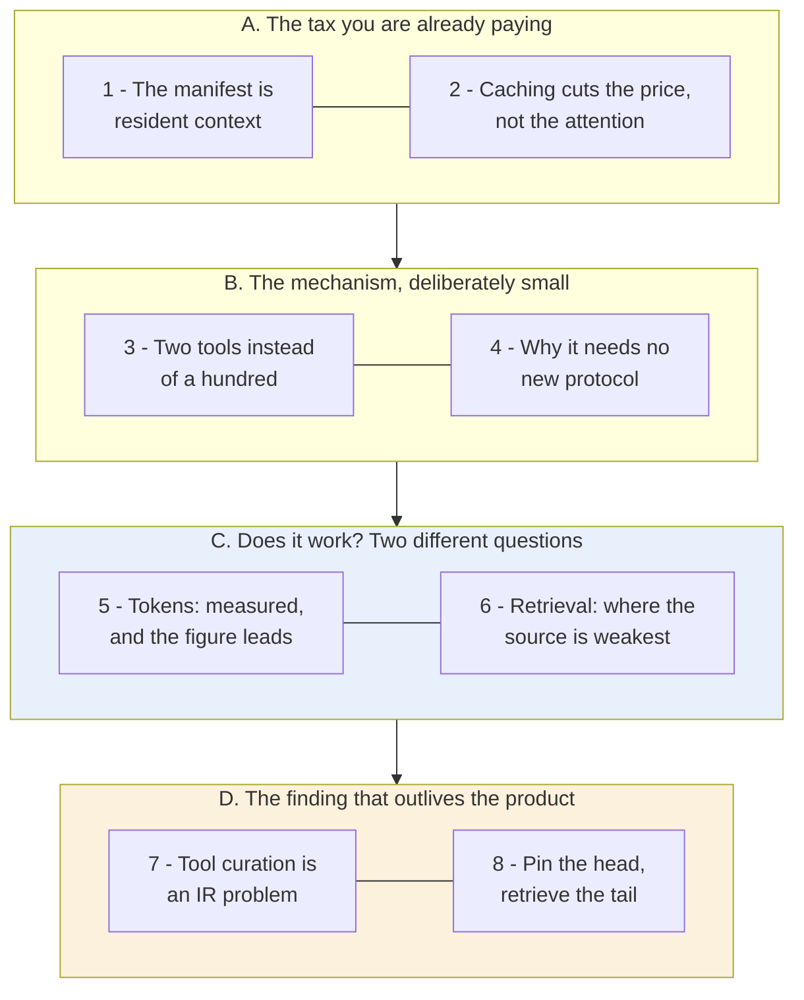
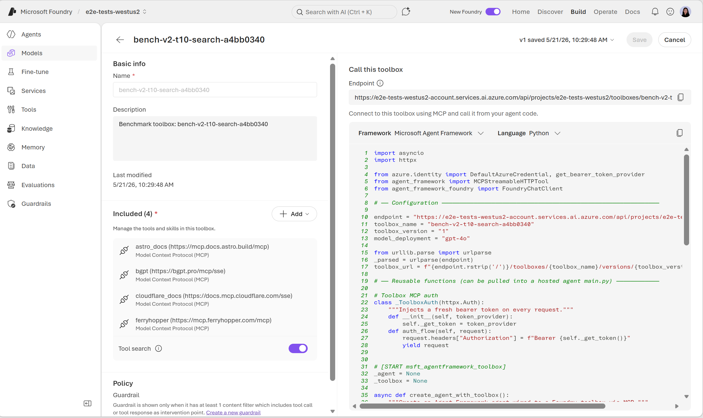
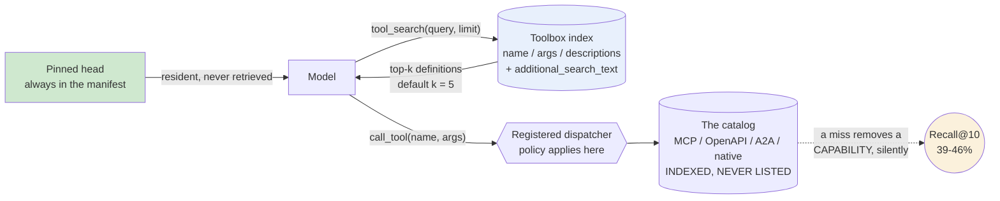

# Learning - Tool search: Finding the right tool at the right time

> Persona: **curator** + **mentor, always** (+ **fact-checker** at the gate) - re-adopt when working
> this file. Source facts in [`SOURCE.md`](SOURCE.md); gated evidence in [`nodes.md`](nodes.md).

> **Two kinds of material, kept visually distinct.** Claims from the article carry a node ID (`n9`)
> and a section. Blocks marked **"Background, supplied"** are context *I* am adding - established
> prior art the article assumes or never names. They are uncited by construction.

## TL;DR

**A tool catalog stops being a schema-management problem and becomes a search problem, and the
crossover is around ten to fifteen tools.** Microsoft Foundry's Toolbox replaces the full `tools/list`
manifest with exactly two meta-tools - `tool_search(query, limit)` and `call_tool(name, arguments)` -
and keeps the rest of the catalog indexed but never listed (`n3`, `n6`). On ToolRet (44,000+ tools)
that cuts context from **541k tokens to 15k at 1,180 tools, a 36x reduction**, and the figure shows
something the prose undersells: the tool-search curve is roughly **flat** as the catalog grows 24x
(`n9`, `n10`). The reframing is the real payload - **tool names and descriptions become ranking
features**, so the first tuning pass is **editorial, not algorithmic** (`n19`, `n13`).

## The 1-minute version

This article covers a preview feature in Microsoft Foundry that stops handing an agent its tool
catalog and starts making the agent search for it. The mechanism is small enough to describe in one
sentence, and the interesting object is not the mechanism at all. It is the reframing the authors
arrive at on the way, which is that a tool catalog past a certain size is an information-retrieval
problem wearing a schema-management costume (`n19`). To see why that reframing is earned rather than
decorative, start with the cost the catalog is already imposing.

That cost is the tool manifest itself. When a client connects, `tools/list` hands the model every
tool definition up front, and those definitions stay **resident in the model's context on every
turn** - names, descriptions, JSON schemas, argument definitions and nested parameters, all of it
present before the user has asked for anything (`n1`). The property worth fixing on is not the size
but what the size is a function of. It tracks **what is connected**, not what the task needs, so a
catalog of 1,180 tools costs 541k tokens per turn whether the request touches one of them or none
(`n9`). At which point the obvious response is to attach fewer tools.

The reason that response fails is what makes the problem hard, and it is a distribution argument
rather than a budget one. The tools you would drop are the rarely used ones, and rarely used tools
are disproportionately the ones that rotate a credential, recover a failed deployment or apply a
compliance exception (`n16`). Dropping them is cheap on every ordinary turn and catastrophic on the
one turn that needed them. In other words, the catalog cannot be trimmed to the common case, because
the value of the long tail is concentrated exactly in the moments the common case does not cover.

Suppose instead you keep every tool and simply pay less for it. This is the engineer's first reflex
and it is already the default here, because prompt caching was enabled in the baseline and cached
tokens are roughly 90% cheaper. The article is unusually careful about what that buys. Cached tokens
are "not free", and cached context "still competes for the model's attention" (`n2`). The manifest
therefore keeps degrading the model's behaviour at a discount, which is worse than it sounds, because
the discount removes the one signal that would have told you the manifest was a problem. **You paid
less to poison the well.**

The idea, then, is to stop listing the catalog and start indexing it. Foundry exposes exactly two
meta-tools in `tools/list` - `tool_search(query, limit)` for describing the capability you want, and
`call_tool(name, arguments)` for invoking whatever comes back - while everything else in the catalog
stays **indexed but never listed** (`n3`, `n6`). The natural objection is that one tool should have
been enough, since a search that returns a tool definition ought to let the model call it. The reason
there are two is a runtime constraint rather than a design preference. Many runtimes guard against
the model calling a tool that never appeared in `tools/list`, so a retrieved tool is not yet a
callable tool, and a registered proxy has to carry the dispatch (`n4`).

How it works in practice pushes the difficulty out of the protocol and into the metadata. Because the
toolbox sits at the aggregator layer, remote MCP servers, OpenAPI tools, A2A integrations and native
tools all reach the model through one index, and no new protocol primitive was needed anywhere
(`n6`). What the index actually contains is tool names, descriptions and argument names, which is why
benchmarking found the failures were editorial rather than algorithmic. Tool descriptions written by
implementers say "get", "create", "manage" and "REST API", while users search for "analytics",
"dashboard" and "reporting" (`n13`). The fix is an index-only field, `additional_search_text`, that is
indexed for retrieval, invisible to the model, and leaves the upstream schema untouched (`n14`).
Above that sits a pinned head of tools that are never retrieved at all, because some capabilities
should never have to be rediscovered (`n16`).

What it costs splits cleanly into a half the source measures well and a half it measures and then
walks away from. On the token side the result is strong and the figure carries it: context falls from
541k to 15k at 1,180 tools, and the tool-search curve is roughly **flat** while the baseline climbs
across a 24x increase in catalog size (`n9`, `n10`). On the retrieval side the same benchmark reports
**Recall@10 between 39% and 46%**, against a `limit` that defaults to five (`n11`). Those two numbers
belong in the same sentence and the article never puts them there, which is the single most important
thing to carry out of this note.

That leaves the question of how far to trust any of it. This is a **T2 vendor post about the vendor's
own preview product**, and it is better evidenced than that class usually manages, because it runs a
public benchmark, states an honest baseline and reports a category where its own method loses. Three
caveats survive that credit. The head-to-head is not one experiment, since two of its three rows are
borrowed from another paper under a protocol that may not match the self-run (`d2`). The
metadata-tuning percentages are method-free self-report with no dataset and no absolute baselines
(`n15`). And the source never confronts its own headline recall number against its own default
shortlist of five.

The same argument, compressed for reference rather than for reading:

| | |
|---|---|
| **The problem** | Every tool is "both a capability and a distraction". The `tools/list` manifest is **resident in context on every turn**, and its size tracks **what is connected**, not what the task needs - 541k tokens at 1,180 tools (`n1`, `n9`). |
| **Why the obvious answer fails** | Prompt caching does not fix it. Cached tokens are ~90% cheaper and **still compete for the model's attention** (`n2`). **You paid less to poison the well.** |
| **The idea** | Stop listing the catalog. Expose **two meta-tools** - `tool_search(query, limit)` and `call_tool(name, arguments)` - and keep everything else **indexed but never listed** (`n3`). |
| **Why two and not one** | Because runtimes **refuse to call a tool absent from `tools/list`**. A retrieved tool cannot be invoked directly, so a *registered* proxy must carry the dispatch (`n4`) - which conveniently gives the platform one place to apply policy. |
| **What it costs** | **541k -> 15k tokens, and roughly flat as the catalog grows 24x** (`n9`, `n10`). The reliability side is the unexamined half: **Recall@10 of 39-46% against a default shortlist of five** (`n11`). |
| **The real finding** | A tool's description **stops being documentation and becomes an index entry.** The dominant failure is implementer vocabulary - "get", "create", "manage" - so **the first useful tuning pass is editorial, not algorithmic** (`n13`, `n19`). |
| **The shape to keep** | **Pin the head, retrieve the tail.** The tail is where the rare, high-stakes tools live, so it is also where a miss costs most - you are choosing **which capabilities the agent may forget it has** (`n16`). |
| **How far to trust it** | **T2 vendor post on its own preview product - but better evidenced than that class usually is**: a public benchmark, an honest baseline, a category where it loses. Three caveats: the head-to-head **mixes borrowed baselines with a self-run** (`d2`), the metadata-tuning percentages are method-free (`n15`), and the source never confronts its own recall number. |

## Key claims

- **The tool manifest is resident per-turn context scaling with the catalog, not the task.** `n1`
- **Prompt caching is a price cut, not an attention cut.** `n2` ⚠️ `single-leg`
- **Two meta-tools replace the manifest**; the catalog stays indexed and never listed. `n3` `n6`
- **`call_tool` exists because runtimes reject unlisted tools.** `n4`
- **541k -> 15k at 1,180 tools (36x), roughly flat across a 24x catalog increase.** `n9` `n10`
- **Recall@10 of 45.99 / 39.56 / 41.36** - a tuned sparse pipeline competitive with a GPU
  cross-encoder in two of three categories. `n11` `n12`
- **Descriptions become ranking features; the first tuning pass is editorial.** `n13` `n19`
- **An index-only field** separates the searchable surface from the model-facing one. `n14`
- **Pin the head, retrieve the tail.** `n16` `n17`

## What you will learn, and in what order

Read the diagram top to bottom, in four movements, each holding two of the eight numbered sections
below. Only two of the movements are coloured, and the colours mark the two things worth carrying
away rather than the two things that are longest. Blue marks where the evidence lives, and it is
split in half because the source answers one of its two questions well and the other one badly. Amber
marks what survives even if the product does not, which is a reframing about metadata that
generalises far past tool catalogs.

**The crux is that deferring the manifest converts catalog size from a per-turn cost into an indexing
cost, and buys a retrieval risk the source measures and then never discusses.**

Movements A and B are short, and their shortness is doing argumentative work rather than saving your
time. The mechanism genuinely is two tools and no new protocol, and that smallness is itself one of
the source's claims (`n5`). A reader who already believes that a resident manifest is expensive can
move through A quickly, at the cost of the caching argument in section 2, which is the one place the
obvious objection gets answered properly.

Movement C is where to slow down, and splitting it in two is deliberate. The token result and the
retrieval result arrive in the same post, in the same voice, with the same air of measurement, and
they have very different evidential quality. Reading them as one number is the mistake this source
invites, and section 6 exists to make that hard to do.

Movement D is separated from the rest because it is the part you would still want after switching
vendors. Section 7 carries the finding that generalises, and section 8 carries the design shape that
tells you where to apply it. If you read only two sections, read 6 and 7, because one is where the
source is weakest and the other is where it is most useful.

*Synthesized roadmap of this note - not from the source.*

## 1. The tax you are already paying, and it is charged per turn

> "Every tool you give an agent is both a **capability** and a **distraction**." (§intro)

The mechanism behind that sentence is unglamorous. `tools/list` hands the client every tool
definition up front, and those definitions are then resident in the model's context on every turn.
The article describes the result as "thousands of tokens of names, descriptions, JSON schemas,
argument definitions, and nested parameters **before you've asked anything useful**" (`n1`, §intro).

At first glance this reads as a size problem, and size problems have familiar answers. The property
that actually matters is subtler, and it is what the cost is a function of. It tracks what is
connected, not what the task needs. Attach a hundred-tool MCP server because you occasionally want
one tool from it, and you pay for the other ninety-nine on every request, forever, including on the
requests that touch no tool at all.

Which raises the objection any engineer reaches for first, and it deserves a straight answer before
anything else is built.

## 2. Caching lowers the price, not the cost

Prompt caching was already on in the baseline, because it is the Azure OpenAI default, and cached
tokens are roughly 90% cheaper. The article does not overclaim from that, and this is the sentence to
keep:

> Cached tokens are "**not free**, and cached context **still competes for the model's attention**."
> (`n2`, §The default agent tax) ⚠️ `single-leg` - prose only.

> **Background, supplied - and this is exactly where the brain's own measured evidence lands.**
> Prompt caching works by reusing an unchanged prompt *prefix*, so the provider skips recomputing it
> and bills a fraction. **Nothing about that changes what the model attends over.** The tokens are
> still in the window, still consuming the n² attention budget, still positioned where "lost in the
> middle" effects apply. This brain records degradation tracking **what is in the window, not what it
> cost to put there** ([`brain/claims.md`](../../brain/claims.md) claims 22 and 27, measured across
> 18 models). **A cached manifest is a fully-priced attention liability at a 90% discount on the
> invoice.**

The consequence is that price and cost have come apart. Caching pays down the invoice and leaves the
behavioural cost untouched, so the manifest has to not be in the window at all. But you cannot simply
delete it either, because the model has to find out what it can do somehow.

## 3. Two tools instead of a hundred

- What it teaches: the whole mechanism in two rows. **Row 01** is the baseline - every definition, up
  front, resident. **Row 02** is the replacement - `tool_search(query, limit)` hits a toolbox index and
  returns "top 5 definitions returned in full", then `call_tool(name, arguments)` dispatches. `n3`
  §Two tools instead of a hundred
- Corroborated by: the prose describing the model "describing the capability it needs" and receiving a
  small set of matching definitions.

The figure answers a question without saying so, and it is worth asking out loud. Why are there two
meta-tools rather than one? Search alone looks sufficient, since a search that returns a full tool
definition has handed the model everything it needs to make the call itself.

> Because "if a tool wasn't registered in the original `tools/list`, **many runtimes will guard
> against the model calling it directly as an unknown tool**. `call_tool` gives the framework a
> registered, **policy-aware dispatch path**." (`n4`, §Two tools instead of a hundred)

That is the most reusable protocol fact in the source, and it arrives sideways, as an implementation
constraint rather than a finding. A tool that was retrieved rather than listed is not yet callable,
so a registered proxy has to carry the call on its behalf. The constraint then hands the platform
something it wanted anyway, which is a single dispatch point that every call passes through, so
policy applies in one place instead of being scattered across a catalog.

⚠️ Note the hedge, because it bounds how far you may take this. The source says "many runtimes", not
"the protocol". No runtime is named and no spec version is cited, so treat it as a portability
constraint you will probably hit rather than a rule you can cite.

The dashed box in that figure is worth a second look as well. Remote MCP servers, OpenAPI, A2A and
native tools all sit behind one index, described as "indexed, never listed" (`n6`). One index across
four heterogeneous sources is a strong hint about where this mechanism lives, and it explains why the
whole thing needed no protocol change at all.

## 4. Why it needs no new protocol primitive

- What it teaches: **the toolbox is itself consumed as an MCP server.** "Connect to this toolbox using
  MCP and call it from your agent code", at an endpoint of the form
  `.../toolboxes/{name}/versions/{version}`, via `MCPStreamableHTTPTool` with a bearer token injected
  per request - with four ordinary MCP servers attached *inside* it. `n7` ⚠️ **figure-only - the prose
  never states that the toolbox is an MCP server.**
- And tool search is a **plain toggle** on an otherwise ordinary toolbox, with no protocol
  configuration anywhere in the pane (`n5`).

This is what makes the mechanism unremarkable, in the good sense of the word. An aggregating MCP
server is free to expose whatever tools it likes and to service them however it wants, because the
client only ever sees the aggregator. Replacing a hundred-tool catalog with a search index therefore
needed no new protocol primitive, no model-specific feature, and no shared ranking semantics across
providers (`n5`).

> 💡 **Aggregating (or proxying) MCP server** - a server whose tools are drawn from *other* servers
> rather than implemented locally. Because a client sees only the aggregator's `tools/list`, the
> aggregator can add, hide, rename or index what is behind it **without any client or downstream
> server changing**.

> **Composition is the leverage point, and it is the transferable lesson here.** Everything this
> product achieves comes from sitting *between* client and servers. Any protocol with a proxy layer
> has this affordance available, and it is worth asking of any integration standard you adopt: **can
> something sit in the middle and change the shape of what I see?**

So the mechanism is cheap to build and cheap to adopt. Whether it works is two questions rather than
one, and they have very different answers.

## 5. Does it save tokens? Yes, and the figure says more than the prose

- What it teaches: measured on ToolRet (44,000+ tools, 7,000 queries) - **"more than 60%" saved at 50
  tools, "above 97%" at 1,000**, with the endpoint **541k baseline versus 15k with tool search at
  1,180 tools, a 36x reduction.** `n9` §The savings were real
- Corroborated by: the prose stating the same trend directionally.

The figure carries something the prose never says, and it is the more interesting half of the result
(`n10`). The tool-search series is roughly flat, staying inside a band of about 15k to 50k tokens
across the whole sweep, while the baseline climbs from around 40k to 541k. "Savings scale with size"
is true and it understates what the chart shows.

> **The transferable claim is not "tools got cheaper". It is that catalog size stops being a
> context-budget decision at all** - it becomes an indexing cost, paid once, off the per-turn path.
> That is a change in the *shape* of the cost function, not a discount on it.

⚠️ One caveat the source never mentions is visible in the same chart. The baseline curve has a
discontinuity, jumping from about 160k to about 360k between roughly 500 and 550 tools, which is more
than a doubling for a catalog increase of about 10%, after which the gentle climb resumes. A clean
single-variable ablation should not produce a step like that. It does not threaten the headline,
which is measured at the right-hand end of the sweep, but the curve is not the smooth sweep the prose
implies.

That is the first of the two questions, and it is the one the source answers well. The second is
where this source is weakest.

## 6. Does it retrieve the right tool? This is the unexamined half

The measure here is Recall@10 on ToolRet, reported across three slices of the benchmark (`n11`,
Figure 3). Two definitions make the numbers legible before we walk them.

> 💡 **Recall@k** - the share of queries where the correct item appears **anywhere** in the top k.
> Silent about its rank within those k, and silent about everything below.

> 💡 **Cross-encoder reranker** - a model scoring query and candidate **together** rather than
> comparing precomputed vectors. More accurate and far more expensive, because nothing can be indexed
> ahead of time: every candidate needs a forward pass at query time.

Take the three methods in order of what they cost to run. BM25s is classical sparse retrieval with no
tuning, and it recalls 24.62% on web, 28.23% on code and 32.39% on customized, which is roughly the
floor that plain lexical matching buys you. The BGE-reranker-v2-gemma cross-encoder sits at the other
end, recalling 45.94%, 38.23% and 49.43%, and it pays for that with a GPU forward pass per candidate
at query time. Foundry's tuned sparse pipeline lands at 45.99%, 39.56% and 41.36%, which is a dead
heat with the cross-encoder on web, a small win on code, and a loss of about eight points on
customized (`n11`, Figure 3).

The same three rows, for reference:

| Method | Web | Code | Customized |
|---|---|---|---|
| **Tool search** (enhanced sparse, lexical similarity) | **45.99%** | **39.56%** | 41.36% |
| BM25s | 24.62% | 28.23% | 32.39% |
| BGE-reranker-v2-gemma (GPU cross-encoder) | 45.94% | 38.23% | **49.43%** |

The claim the source draws from that is genuinely useful. A tuned sparse lexical pipeline matched a
GPU cross-encoder in two of three categories without paying for the GPU at serving time (`n12`), and
that is a real data point against the reflex that quality retrieval requires neural reranking.

Two things weaken it, and to the source's credit it states the first itself.

⚠️ It is not one experiment (`d2`). The BM25s and BGE columns are marked "from [1]", meaning they were
lifted from another paper, while the tool-search column is a self-run that deliberately left out the
benchmark's instruction string in order to avoid an extra LLM call at serving time. Whether [1]
omitted that string too is never stated. The columns may therefore not be like-for-like, and the
direction of the resulting bias is unknown, so read the head-to-head as suggestive rather than as a
measurement.

⚠️ The second weakness is the bigger one, and it concerns the absolute level rather than the
comparison. Recall@10 in the low forties means the right tool is outside the top ten for more than
half of queries, and the `limit` parameter defaults to five. The article closes with "Smaller is not
better if the right capability disappears. The shortlist has to be good", and it never places that
sentence beside its own table.

> **This brain's reading, not the source's claim:** when the retrieved items are **capabilities**, a
> miss does not return a worse answer - it **removes an option**, and the model may never learn the
> option existed. That is a different failure mode from a bad search result, and it is unmeasured
> here.

So the retrieval half is the weak half, which makes the next question the productive one. Why does
retrieval fail here at all? The answer is the best thing in the article.

## 7. The real finding: tool curation is an information-retrieval problem

What broke was not the ranker.

> Benchmarking "revealed that tool search failed when tool descriptions were uneven, sometimes
> capturing **implementation detail instead of user intent vocabulary**" - "get", "create", "manage",
> "REST API". (`n13`, §Tuning the search space) ⚠️ `single-leg`.

Their example is exact, and it is worth sitting with for a moment. A tool named `execute_query`, whose
description truthfully says that it "runs a query against the configured database", has to be found by
users who type "analytics", or "dashboard", or "SQL", or "reporting", or "warehouse". Not one of those
words appears in the tool's own documentation. **Accurate and unsearchable are perfectly compatible.**

The fix is an index-only alias field (`n14`, corroborated prose-versus-code):

> `"execute_query": {"pin": True, "additional_search_text": "SQL database analytics reporting
> dashboard queries"}` - indexed for retrieval, "**isn't visible to models in MCP responses**", and
> "**no changes are made to the original tool schema of the source MCP server**".

Three consequences follow, and they get steadily less comfortable. First, retrieval vocabulary can be
tuned without spending any model tokens, because the field never enters the context window. Second, a
third-party server can be tuned for your users' vocabulary without forking it, since the upstream
schema is untouched. Third, and this is the one nobody in the source mentions, an invisible field now
steers which capability the agent is offered, leaving no trace in the context that either the model or
a human reviewer can inspect.

⚠️ The self-reported gains attached to this section are the weakest evidence in the source, and they
should not travel. Hit rate improved "by about 56%", end-to-end accuracy "by about 55%", recovering to
"within about 4% of the full-catalog baseline" (`n15`), with no dataset named, no absolute baselines,
and no statement of whether the percentages are relative or points. They are also not the ToolRet run
reported above, so two evaluation regimes are blended inside one section. Do not quote them.

The generalisation survives all of that, and it is the thing the authors say surprised them:

> "We thought we were solving a token-cost problem; we were also **building a search product**"
> (`n19`, §intro). At small scale a catalog looks like schema management; at larger scale **tool names
> and descriptions become ranking features**.

> **This is the third instance of one pattern this brain now holds** (claim 93). A **skill's**
> description is its **trigger** and causes 50%+ of failures (S5). A **column's** description becomes
> a **default policy** the agent applies (S11). A **tool's** description becomes a **ranking feature**.
> **Metadata written for a human to skim gets promoted to a control surface the moment a model reads
> it - and the incumbent human-facing vocabulary is the dominant failure mode every time.**

If descriptions are ranking features, then the remaining question is which tools should be subject to
ranking at all.

## 8. Pin the head, retrieve the tail

The last piece is a distribution argument, and it is the shape worth keeping (`n16`, §Search is for
the long tail). The catalog splits in two, and the two halves reach the model by different routes.

The head is the agent's core contract, meaning its policy tools, its frequent data access, and what
the source calls "capabilities the model should never have to rediscover". Those are pinned, so they
are always present in the manifest and never retrieved. The long tail is everything else, and the
source's own examples of it are pointed: rotate a credential, recover a failed deployment, apply a
compliance exception, inspect an audit trail. Those are retrieved on demand.

| | What it holds | How it reaches the model |
|---|---|---|
| **The head** | the agent's core contract - policy tools, frequent data access, "capabilities the model should never have to rediscover" | **pinned**, always present, never retrieved |
| **The long tail** | rare but high-stakes tools: "rotate a credential, recover a failed deployment, apply a compliance exception, inspect an audit trail" | **retrieved on demand** |

The tail is the interesting half, and the reason is not the obvious one. The reflex reading says that
rare tools matter less, so hiding them behind a search is cheap. The reverse is true. Rare tools are
disproportionately the emergency ones, so the tail is exactly where a retrieval miss is most
expensive, which is what turns this from an optimisation into a design decision. **You are choosing
which capabilities the agent is allowed to forget it has.**

> **Background, supplied.** This is a **Pareto** split, and the useful part of naming it is that
> Pareto shapes tell you where to spend *differently*, not where to spend *less*. The head justifies
> hand-curation because it is small and always paid for. The tail justifies machinery because it is
> large and rarely paid for. Applying one strategy to both is the mistake.

Pinning turns out to carry a second job as well (`n17`). The source notes that "deterministic pinning
keeps the prompt prefix stable, which preserves prompt-cache behavior", which returns us to section 2
from the other side. Prefix stability is a context design constraint rather than a billing detail,
because it decides where in the window a dynamic list is allowed to sit.

⚠️ There is a tension inside that same paragraph, though (`d3`). The toolbox auto-pins frequently used
tools per user after a warmup period, and stale entries age out. A pin set that is per-user, warmed up
and aged is by construction neither identical across users nor stable across days, which sits badly
beside the word "deterministic". Both statements hold only if "deterministic" means manual pins alone,
and the text never says so.

The adoption heuristic closes the argument. The authors suggest tool search is worth testing above
10-15 tools, or when different tasks need different subsets of the catalog, or when one agent serves
many workflows (`n18`, ⚠️ `single-leg`, and a vendor's own adoption guidance for its preview product).

## Diagram (mental model)

Solid arrows are what happens inside a single turn. Green marks what is always in context, which is
the pinned head, and blue marks what is fetched on demand. The amber circle is not a component at all.
It is the measured risk the source reports and then does not discuss, drawn in because leaving it out
would make the design look tidier than the evidence does.

**The crux is that two arrows leave the model instead of one, and the second arrow exists only because
a retrieved tool is not a callable tool.**

Three shape decisions are doing the teaching here. `call_tool` is drawn as a dispatcher rather than a
passthrough, because the registered-proxy requirement (`n4`) starts as a constraint and ends as a
single policy point you would otherwise have had to build yourself. The pinned box bypasses the index
entirely and reaches the model directly, which is the visual form of the point in section 8: pinning
is not "ranked highly", it is not retrieved at all, and that is precisely what keeps the prefix
cacheable. The dotted arrow runs to the gap rather than back to the model, and that choice is
deliberate, because on a retrieval miss nothing arrives and nothing is what the model sees. A diagram
that routed the miss back into the loop would be claiming a recovery path the source never describes.

*Synthesized from `n3`, `n4`, `n6`, `n11`, `n14`, `n16` - a redrawing of `fig_tool-search-figure.png`
with the measured recall gap added, which the source's own figure does not show.*

## 💡 Terms

| Term | Explanation |
|---|---|
| Tool manifest | Every tool definition handed to the model up front via `tools/list`. **Resident in context on every turn**, so its size tracks what is connected rather than what the task needs. |
| Tool search | Replacing the manifest with two meta-tools - a search over an index of the catalog, and a registered dispatcher to call what it returns - so definitions enter context on demand. |
| Aggregating MCP server | A server whose tools come from other servers. Because the client sees only the aggregator's `tools/list`, it can index, hide, rename or add capability with no client or downstream change. |
| Prompt caching | Reusing an unchanged prompt prefix so the provider charges a fraction (~90% less). **Buys money and latency, never attention** - cached tokens still compete for it. |
| Recall@k | The share of queries where the correct item appears anywhere in the top k. Silent about rank within k, and about everything below. |
| Cross-encoder reranker | A model scoring query and candidate together rather than comparing precomputed vectors. More accurate, far more expensive - nothing can be indexed ahead of time. |
| Index-only field | Metadata indexed for retrieval but never shown to the consumer (`additional_search_text`), so search vocabulary and consumer-facing schema tune independently. **Also an invisible steering surface.** |
| Pinning | Keeping chosen tools permanently in the manifest instead of subjecting them to retrieval - the head of the distribution, plus whatever must never be rediscovered. Also what keeps the prompt prefix cacheable. |

## What to distrust in this note

- **T2 vendor post about its own preview product** - but **better evidenced than that class usually
  is**, which is worth saying plainly: it runs a **public benchmark** (ToolRet, 44,000+ tools),
  states an honest baseline, and **reports a category where it loses** to the neural reranker.
- **The head-to-head is not one experiment** (`d2`). Two of the three rows are **lifted from another
  paper**, and the self-run deliberately omitted the benchmark's instruction string. Whether the
  borrowed baselines did too is never stated, so **the direction of the bias is unknown.**
- **The metadata-tuning percentages are method-free** (`n15`): no dataset, no absolute baselines, no
  relative-versus-points, and not the ToolRet run. **The weakest evidence in the source, and it sits
  next to the strongest.**
- **The source never confronts its own headline recall number.** Recall@10 of 39-46% against a default
  shortlist of five is the central unexamined gap, and combining it with the closing "the shortlist
  has to be good" is **this brain's reading, not a claim the article makes.**
- **`fig_image-6.png` carries `n7` alone** - the prose never says the toolbox is itself an MCP server,
  so that fact is **figure-only**.
- **A printed code sample that cannot run** (`d1`): four different names for one API inside one
  section, raising `NameError` as printed. A useful reminder that **a vendor code sample is evidence
  of intent, not of a working API.**
- **The "Background, supplied" blocks are mine** - caching versus attention, Pareto strategy, Recall@k
  and cross-encoder semantics. Uncited by construction.

## Open questions

- **What happens on a retrieval miss?** The measured Recall@10 says it happens for more than half of
  queries at k=10, and the default shortlist is 5. **No recovery path is described** - does the model
  re-search, widen, or simply proceed without the capability? **The highest-value question here.**
- **Is the unregistered-tool guard a spec rule or a client convention?** `n4` says "many runtimes" and
  names none. The answer decides whether the two-proxy pattern is a workaround or the intended shape,
  and it is cheap to research.
- **How much of this survives leaving the tool-catalog setting?** The corpus is short, structured,
  curated and **writable** - the friendliest possible conditions for sparse retrieval, and the reason
  the editorial fix works at all. **You cannot rewrite someone else's documents to be more
  searchable.**
- **What does an aggregating server owe the servers behind it?** Error and auth propagation, version
  skew, downstream schema changes under the index, and who is accountable for a call the aggregator
  dispatched - all ignored.
- **`additional_search_text` is an unexamined trust surface.** An index-only field invisible to the
  model decides which capability the agent is offered, and on an aggregating server its author may be
  neither the tool's author nor the agent's owner. See
  [`agent-security.md`](../../brain/topics/agent-security.md).

## Feeds these topics

- `../../brain/topics/mcp.md` - the cost model of `tools/list`, the unregistered-tool guard, and
  aggregation.
- `../../brain/topics/rag.md` - the retrieval numbers, sparse versus neural, and
  editorial-before-algorithmic.
- `../../brain/topics/context-engineering.md` - the manifest as a measured budget line item, and
  caching as a price cut that is not an attention cut.
- `../../brain/topics/agents.md` - pin the head, retrieve the tail; descriptions as index entries.
