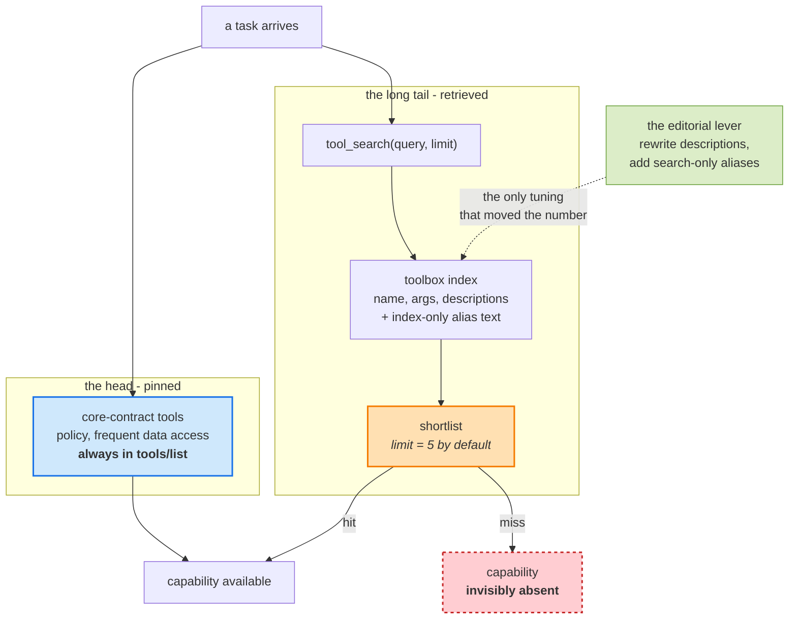

# Learning - Tool search: Finding the right tool at the right time

> Persona: **curator** (+ **fact-checker** at the gate) - re-adopt when working this file.
> Source facts in [`SOURCE.md`](SOURCE.md); gated evidence in [`nodes.md`](nodes.md).

## TL;DR

**A tool catalog stops being a schema-management problem and becomes a search problem, and the
crossover is around ten to fifteen tools.** Microsoft Foundry's Toolbox replaces the full `tools/list`
manifest with exactly two meta-tools - `tool_search(query, limit)` and `call_tool(name, arguments)` -
and keeps the rest of the catalog indexed but never listed (`n3`, `n6`). On ToolRet (44,000+ tools),
that cuts context from **541k tokens to 15k at 1,180 tools, a 36x reduction**, and the figure shows the
thing the prose does not say: **the tool-search cost is roughly flat in catalog size** (`n9`, `n10`).

The part worth stealing is not the mechanism, which is small on purpose. It is the **reframing**: once
the catalog is retrieved rather than enumerated, **tool names and descriptions become ranking
features** (`n19`), and the first useful tuning pass is **editorial, not algorithmic** - fix the
descriptions, add search-only aliases, pin what must never be missed (`n13`, `n14`, `n16`).

**Read the numbers with two hands.** The token measurement is on a public benchmark and is solid. The
retrieval comparison is **not one experiment** - the baselines are lifted from another paper while the
tool-search column is a self-run under an admittedly different protocol (`d2`). And the source never
confronts its own headline retrieval figure: **Recall@10 of 39-46% means the needed tool is outside
the top ten more than half the time**, while the default shortlist is five.

## Key claims

| # | Claim | Evidence | Confidence |
|---|---|---|---|
| 1 | The tool manifest is **resident per-turn context that scales with the catalog, not the task**. Prompt caching makes it ~90% cheaper, not free, and cached context still competes for attention. | `n1` corroborated, `n2` single-leg | OK / needs-check |
| 2 | **Two meta-tools replace the manifest**, inside today's tool-calling contract - no new MCP primitive, no model-specific feature. The second proxy (`call_tool`) exists because runtimes reject tools absent from `tools/list`. | `n3`, `n4`, `n5` corroborated | OK |
| 3 | **Putting the index at the aggregator layer** is what lets one mechanism cover remote MCP servers, OpenAPI, A2A and native tools alike. The toolbox is itself an MCP server fronting other MCP servers. | `n6` corroborated, `n7` figure-only | OK / needs-check |
| 4 | **Measured: 36x fewer tokens at 1,180 tools** (541k to 15k), >97% at 1,000, >60% at 50 - and the tool-search curve is **flat** across the sweep. | `n9`, `n10` corroborated (ToolRet) | OK |
| 5 | **Enhanced sparse lexical retrieval was competitive with a GPU cross-encoder reranker in two of three categories**, without serving-time GPU cost. | `n11`, `n12`; weakened by `d2` | needs-check |
| 6 | **Tool curation becomes an information-retrieval discipline.** Descriptions written for implementers ("get", "manage", "REST API") are the dominant failure; the first tuning pass is editorial. | `n13`, `n19` single-leg | needs-check |
| 7 | **`additional_search_text`: an index-only field**, invisible to the model, leaving the upstream schema untouched - so retrieval vocabulary and model-facing schema can be tuned independently. | `n14` corroborated (prose vs code) | OK |
| 8 | **Retrieve the long tail, pin the head.** Search is a bad default for tools the model constantly needs; pinning is also what keeps the prompt prefix stable for caching. | `n16` corroborated, `n17` mixed | OK / needs-check |

## The argument, in order

### The tax is attention, not only money

The article opens on cost and then immediately refuses to let cost be the whole story. The baseline
had to include prompt caching, because caching is the Azure OpenAI default and any honest comparison
must beat the default rather than a strawman. But **"caching isn't the same as not loading"**: cached
tokens are roughly 90% cheaper, "not free, and cached context **still competes for the model's
attention**" (`n2`).

That sentence is the one that connects this source to the rest of this brain. A manifest that is cheap
but resident is exactly the shape [`context-engineering.md`](../../brain/topics/context-engineering.md)
already has measurements for: degradation is a function of **what is in the window**, not of what it
cost to put there (claim 27, the n² attention budget). Tool definitions are not exempt.

> 💡 **Prompt caching** - reusing a previously processed, unchanged prompt prefix so the provider
> charges a fraction of the input-token price for it. It reduces the bill and the latency; it does not
> reduce the number of tokens the model must attend to.

### The mechanism is deliberately small

**Orientation.** Two rows, both read left to right, showing the same job done twice. Row 01 is today's
default: `tools/list` hands over every definition up front and the model picks from all of them. Row 02
is tool search: the two black boxes are the only tools the model ever sees, the grey boxes are work
Foundry does on the model's behalf, and the dashed box at the bottom is the rest of the catalog -
present and indexed, but never in the model's context.

**The crux: the model stops receiving the catalog and starts querying it.**

**Why it is shaped this way.** Two boxes look like an odd unit - why not one search tool that also
dispatches? Because of the constraint in the small print: "if a tool wasn't registered in the original
`tools/list`, many runtimes will guard against the model calling it directly as an unknown tool"
(`n4`). A retrieved tool is, by construction, not in the manifest, so **something registered has to
carry the call**, and that something is `call_tool`. The shape is dictated by an existing safety check
rather than chosen for elegance - and the same constraint hands the platform a **policy-aware dispatch
point**, since every call now passes through one place it controls. The other deliberate choice is
where the index sits: at the **toolbox**, above the individual servers, which is why one mechanism
covers remote MCP, OpenAPI, A2A and native tools without any of them knowing about it (`n6`).

**Provenance.** Figure 1 from the source, cited at `n3`, `n4`, `n6`, `n8`.

**What the figure does not tell you, and the portal screenshot does.** The prose never says how the
toolbox is reached. The Foundry screenshot does: *"Connect to this toolbox using MCP and call it from
your agent code"*, over `MCPStreamableHTTPTool` with a bearer token, with four ordinary MCP servers
attached inside it (`n7`). **The toolbox is an MCP server that fronts other MCP servers**, which is
what makes the whole design unremarkable in the good sense: an aggregator is free to expose whatever
two tools it likes, so no protocol change was ever required (`n5`). This is the source's most useful
contribution to [`mcp.md`](../../brain/topics/mcp.md), and it is **figure-only** - treat it as
`needs-check`.

### The savings are real, and the figure is better than the sentence

**Orientation.** X-axis is catalog size, from 0 to 1,200 tools; Y-axis is tokens consumed. The solid
series with square markers is the baseline (every tool sent up front); the dashed series with hollow
markers is tool search. Run on ToolRet, a public benchmark of 44,000+ tools and 7,000 queries.

**The crux: the baseline's context cost is a function of the catalog, and tool search's is not.**

**Why that framing beats the prose.** The article says "the savings scaled with toolbox size" and
quotes 60% at 50 tools, 97% at 1,000 - true, and it undersells the result. A percentage saving invites
you to imagine a fixed discount. What the picture shows is a **change of slope**: the solid line
climbs to 541k while the dashed line never leaves a 15-50k band across a 24x increase in catalog size
(`n10`). The practical consequence is not "tools are cheaper" but **"catalog size stops being a
context-budget decision"**, which is what makes a 44,000-tool toolbox thinkable at all.

**One thing to notice that the prose does not mention.** The baseline jumps from roughly 160k to
roughly 360k between about 500 and 550 tools: **more than 2x for a ~10% catalog increase**. A clean
single-variable ablation should not step like that, so something else changed at that point in the
sweep. It does not threaten the headline, which is measured at the far right, but the curve is not the
smooth sweep the text implies. Recorded in [`nodes.md`](nodes.md).

**Provenance.** Figure 2 from the source, cited at `n9`, `n10`.

### Retrieval quality is where the source is weakest, and it half admits it

The authors correctly call this "the harder question" and report Recall@10 on three ToolRet slices
(`n11`):

| Method | Web | Code | Customized |
|---|---|---|---|
| **Tool search** | **45.99%** | **39.56%** | 41.36% |
| BM25s | 24.62% | 28.23% | 32.39% |
| BGE-reranker-v2-gemma | 45.94% | 38.23% | **49.43%** |

> 💡 **Recall@10** - the share of queries where the correct item appears anywhere in the top ten
> results. It says nothing about rank within those ten, and nothing about the other queries.

The honest reading of their own table is the one they give: comfortably ahead of BM25s everywhere,
level with the neural reranker on web and code, **8 points behind it on customized**. The claim they
draw is reasonable - **a sparse lexical pipeline matching a GPU cross-encoder in two of three
categories, without paying for the GPU at serving time** (`n12`).

**Two things weaken it, one stated and one not.**

1. **It is not one experiment** (`d2`). The caption says the BM25s and BGE numbers are "from [1]" -
   lifted from another paper - while the tool-search column is a self-run. And that self-run
   deliberately "used only the user query and left out the benchmark's instruction string", on the
   sound production argument that generating the instruction would cost another LLM call. Whether the
   borrowed baselines also omitted it is never said. **The comparison may not be like-for-like, and
   the direction of the bias is unknown.**
2. **Nobody addresses the absolute level.** Recall@10 in the low forties means **the right tool is
   outside the top ten for more than half of queries**, and the default `limit` is **five**. The
   article's own closing paragraph says "Smaller is not better if the right capability disappears...
   The shortlist has to be good" - and never puts that sentence next to its own table.

The implicit rebuttal is in the next section: after metadata tuning, end-to-end accuracy recovers "to
within about 4% of the full-catalog baseline" (`n15`). If that holds it largely answers the objection.
But it is a **different metric on a different, unnamed eval with no absolute baselines**, reported as
two bare percentages. **Two evaluation regimes are being blended in one argument**, and only the first
one is on a public benchmark.

### The real finding: tool curation is an IR problem

This is the part the authors seem genuinely surprised by, and it is the most transferable thing here
(`n19`):

> "We thought we were solving a token-cost problem; we were also building a search product... At
> larger scale, **tool names and descriptions become ranking features**."

Benchmarking showed the failures were **editorial, not algorithmic**: descriptions capturing
implementation detail instead of user vocabulary, and generic verbs - "get", "create", "manage",
"REST API" - that cannot distinguish one tool from its neighbours (`n13`). The fix is a search-only
alias field, `additional_search_text`, and its design is the neat bit (`n14`):

- it **is** indexed, so it steers retrieval;
- it is **not** visible to the model in MCP responses, so it costs no tokens;
- it does **not** change the upstream server's schema, so a third-party MCP server can be tuned for
  your users' vocabulary without forking it.

Their example: `execute_query`, described accurately as "runs a query against the configured
database", needs to be found when a user says "analytics", "dashboard", "SQL", "reporting" or
"warehouse". **Accurate and unsearchable are compatible.**

> **The generalisation worth carrying:** the moment any capability is *retrieved* rather than
> *enumerated*, its description stops being documentation and becomes an index entry, and it must be
> written in the vocabulary of the person searching rather than the person who built it. Nothing about
> that is specific to tools, or to Foundry.

### Search the tail, pin the head

The closing design rule is a Pareto argument (`n16`). A few tools do most of the work, but the long
tail matters precisely because rare tools are the high-stakes ones: "rotate a credential, recover a
failed deployment, apply a compliance exception, inspect an audit trail". Search is a good default
**there**, and a bad default for anything in the agent's core contract - policy tools, frequent data
access, "capabilities the model should never have to rediscover".

Two mechanisms: manual pins, and automatic pinning by per-user usage after a warmup, with stale
entries aging out (`n17`). **And here the article contradicts itself in consecutive sentences**
(`d3`): a pin set that is per-user, usage-derived and aging cannot also be what "keeps the prompt
prefix stable, which preserves prompt-cache behavior". Per-user pins fragment the cache across users;
aging pins invalidate it over time. Both statements are true only if "deterministic" silently means
*manual* pins, which the text never says.

## Diagram (mental model)

**Orientation.** Flow is top-down, from one task to one of two outcomes. A tool sits in exactly one
lane: **blue** is pinned and always present, **amber** is the shortlist that retrieval produces on
demand. **Green** is the tuning input, dotted because it acts on the index rather than on any request.
**Red, dashed** is a terminal state, not an error path - nothing routes out of it.

**The crux: retrieval does not make the catalog cheaper, it converts a guaranteed token cost into a
probability that the capability is not there at all.**

**Why it is shaped this way.** The two lanes leave a single entry point rather than forming a
pipeline, because **which lane a tool lives in is a design-time decision made per tool**, not a
runtime routing decision - that is the whole content of "pin the head, retrieve the tail" (`n16`).
The red box is drawn as terminal because that is the failure's defining property: **the model gets no
signal that it missed.** A withheld tool leaves nothing in context to notice, so the agent does not
retry, it concludes the capability does not exist - which is why the article's own line "smaller is
not better if the right capability disappears" is the correct worry and its Recall@10 of 39-46% is the
uncomfortable number (`n11`). Draw this as a retry loop instead and you would be asserting a recovery
path the source never demonstrates. The green arrow points at the **index** rather than at the search
box because that is where S10's numbers actually moved: rewriting descriptions and adding aliases,
not changing the ranker (`n13`). And **the expensive box is the amber one** - `limit` is the single
knob trading tokens against the red branch, shipped at 5 while the measured recall is quoted at 10.

*Synthesized from `n9`, `n11`, `n13`, `n14`, `n16`. Not a figure from the source - S10 draws the
mechanism (Figure 1) and never draws its failure mode.*

## 💡 Terms

| Term | Explanation |
|---|---|
| Tool search | Replacing the full `tools/list` manifest with two meta-tools - a search over an index of the catalog, and a registered dispatcher to call what it returns - so definitions enter context on demand instead of up front. `article, §Two tools instead of a hundred` |
| Tool manifest | Every tool definition handed to the model up front via `tools/list`. Resident in context on every turn, so its size tracks what is **connected** rather than what the task needs. `article, §intro` |
| Aggregating MCP server | A server whose tools come from other servers rather than local implementations. Because the client sees only the aggregator's `tools/list`, it can index, hide, rename or add capability with nothing else changing. `article, fig_image-6.png` |
| Prompt caching | Reusing an unchanged prompt prefix so the provider charges a fraction of the input price (~90% less on Azure OpenAI). Buys money and latency, never attention. `article, §The default agent tax` |
| Recall@k | The share of queries where the correct item appears anywhere in the top k. Silent about rank within those k, and about every query it missed. `article, §Retrieval quality was the real test` |
| Cross-encoder reranker | A model scoring query and candidate **together** rather than comparing precomputed vectors. More accurate, far more expensive: nothing can be indexed ahead of time, so every candidate needs a forward pass at query time. `article, §Retrieval quality was the real test` |
| Index-only field | Metadata indexed for retrieval but never shown to the consumer (`additional_search_text`), so search vocabulary and exposed schema are independently tunable. Also an invisible steering surface. `article, §Tuning the search space` |
| Pinning (tools) | Keeping chosen tools permanently in the manifest instead of subjecting them to retrieval - the head of the distribution, plus anything the agent must never have to rediscover. Also what keeps the prompt prefix cacheable. `article, §Search is for the long tail` |
| Tool relevance-maxxing | The source's own name for the shift it describes: from adding as many tools as possible to making the right ones findable. `article, §intro` |

## Feeds these topics

- [`mcp.md`](../../brain/topics/mcp.md) - **the topic's first real source** (see
  [ADR-0013](../../brain/decisions/0013-secondary-but-substantial.md) for why this counts and S9 did
  not): the cost model of `tools/list`, the unregistered-tool guard, aggregator servers, and a
  capability added with no new primitive.
- [`context-engineering.md`](../../brain/topics/context-engineering.md) - **the second source on tool
  selection**, and the first to measure it. Closes that note's "figure-only and unmeasured" caveat on
  claim 79.
- [`rag.md`](../../brain/topics/rag.md) - the topic's first retrieval **mechanics** and first
  measurements: sparse vs neural reranking, Recall@k, index-field tuning.
- [`agents.md`](../../brain/topics/agents.md) - tool-catalog design as an agent-design decision, and
  the head/tail split.

## Open questions

- **What is the end-to-end task-success cost of a missed retrieval?** Recall@10 of ~40% with a
  shortlist of 5 should be catastrophic, and the source implies it is not (`n15`). Nothing here
  explains why - whether the model re-queries `tool_search` after a miss, whether ToolRet's
  "correct tool" is stricter than task success, or whether the tuned eval was simply easier. **The
  single highest-value deep-research target in this source.**
- **Who writes `additional_search_text`, and what stops it from being adversarial?** An index-only
  field that is invisible to the model steers which capability the agent is offered, with no trace in
  the context the model can inspect. The article treats it purely as a tuning convenience and never
  mentions security. *(This brain's observation, not the source's - commentary, not a claim.)*
- **Does auto-pinning actually preserve the cache?** `d3` records the contradiction; nobody measures
  it either way.
- **Is the crossover really 10-15 tools?** (`n18`) A vendor's adoption threshold for its own preview
  product, with no derivation. Plausible, unevidenced.

## Confidence assessment

**T2 vendor engineering post about its own preview product**, so every design choice is also a sales
argument. That said, it is a better-evidenced source than most of this class: it runs a **public
benchmark** rather than an internal one, reports a category where it **loses** (customized, by 8
points), names its baseline honestly (caching on, full catalog), and states a protocol deviation that
works against it. The token result (`n9`, `n10`) is the strongest thing here and can be relied on. The
retrieval comparison (`n12`) is real but weaker than presented (`d2`). The metadata-tuning figures
(`n15`) are self-report with no method and should not be quoted as results. No external corroboration
has been sought - no deep-research pass was requested.
