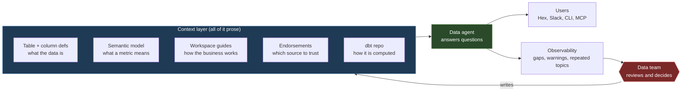

# Learning - How we built LangChain's agent-first data stack

> Persona: **curator + mentor** (+ **fact-checker** at the gate) - re-adopt when working this file.
> Source facts in [`SOURCE.md`](SOURCE.md); gated evidence in [`nodes.md`](nodes.md); external
> evidence in [`context/01_data-agent-accuracy-and-prior-art.md`](context/01_data-agent-accuracy-and-prior-art.md).

## TL;DR

**An "agent-first data stack" turns out not to be a data stack at all. It is a documentation layer
wrapped around an unchanged one.** The figure captioned "LangChain's data stack architecture" shows a
stock ELT pipeline - Fivetran and Airbyte and Segment into BigQuery, dbt on top, reporting at the end
- with no agent, no semantic model and no feedback loop anywhere in it (`d1`). Everything that makes
the stack "agent-first" lives in a second figure, and all of it is prose.

**The transferable move is that a column definition stops being a description and becomes an
instruction.** `account_status: The status of the account.` becomes a paragraph that spells out each
lifecycle value in business terms and then issues an imperative: "**For customer reporting, filter to
Active unless the analysis explicitly includes churned or prospective accounts**" (`n3`). That is not
documentation. That is a default policy stored in metadata, where the agent meets it at exactly the
moment it matters.

**The loop that maintains it inverts what a data team is for.** Observability over agent conversations
shows where context is missing; the team writes the missing context; the loop's output is never an
answer to a user but a **write back into the store** (`n7`, `n8`).

**Read the results with both hands.** Every number here measures **adoption** - 2,200 conversations,
40x throughput, 100% migration in six weeks - while the article's thesis is about **trustworthiness**,
which it never measures (`d4`). The authors concede it and file evals under "next" (`n10`). Deep
research supplies both halves the source lacks: schema documentation is **measured** to help, and far
more on real warehouses (+16pp) than on public benchmarks (+2pp), and the enterprise text-to-SQL
setting closest to this stack tops out around **65.6%**. **The mechanism is well corroborated; the
result is not.**

## Key claims

| # | Claim | Evidence | Confidence |
|---|---|---|---|
| 1 | **The work is making implicit context explicit, not re-plumbing data.** The pipeline underneath is an ordinary ELT stack; what changed is the reporting tier and the documentation around the warehouse. | `n1` corroborated; `d1` (figure vs prose) | OK |
| 2 | **The context layer decomposes into five stores, each answering a different kind of question** - what the data is, what a metric means, how the business works, which source to trust, how a number is computed. They are not interchangeable. | `n2` corroborated (prose + `fig3`) | OK |
| 3 | **A column definition becomes an instruction**, carrying allowed values, business interpretation and a default filtering rule. | `n3` single-leg on content; externally measured (F1) | OK |
| 4 | **Context layers compose downward and cannot repair the layer beneath.** "If the data model is confusing to humans, it will be confusing to agents too." Fix foundations first. | `n4` single-leg | needs-check |
| 5 | **Context that fits no schema field becomes a prose document, versioned in git** - and the author names the family herself: "like skills for the data agent". | `n5` corroborated | OK |
| 6 | **A trust signal needs an access-controlled writer, because it dies at saturation.** "If everything is endorsed, the signal stops being useful." | `n6` corroborated; prior art in F4 | OK |
| 7 | **Agent conversations are the demand signal for what to document**, with a symptom-to-layer triage rule. | `n7` corroborated; measured and automatable (F2) | OK |
| 8 | **The loop's output is a write to the context store, not an answer** - which makes the data team's role shift structural rather than rhetorical. | `n8` corroborated on mechanism | OK / needs-check |
| 9 | **Curate the head, defer the tail** (~80% of asked questions first), because the binding cost is human authorship. | `n11` single-leg | needs-check |
| 10 | **The human gate is a social control, not an architectural one** - "loop in the data team" is advice written into a guide, not a constraint enforced by the system. | `n12` single-leg + `d2` | needs-check |
| 11 | **All reported results are adoption; correctness is never measured**, and the authors know. | `n9`, `n10` single-leg; `d3`, `d4` | needs-check |

---

## How to read this note

This is written as a **ramp from zero**, in the order an architect would walk a new engineer through
the problem: what the problem is before any technology, what the machinery underneath actually is,
how the obvious approach fails, and then the design derived one piece at a time so it feels inevitable
rather than arbitrary. If you already work with warehouses daily, skip **Part 1**.

> **One honesty rule for this note.** `AGENTS.md` scopes a `LEARNING.md` to a single question - *what
> did this source teach?* - and a ramp needs foundations the source never taught. So **Part 1 is
> marked scaffolding and is uncited by construction**: it is background I am supplying, not
> knowledge from this source. Everything from Part 2 onward carries a node ID (`n1`, `d1`) or an
> external reference (`F1`), and where a conclusion is mine rather than the article's, it says so.

---

## Part 0 - The problem, before any technology

Forget agents for a moment. A company of about three hundred people accumulates data in a dozen
systems: the billing platform, Salesforce, the product's own database, whatever the marketing team
signed up for. Someone in GTM asks a perfectly ordinary question:

> *"How is pipeline looking this month?"*

To answer it you must know four separate things:

1. **Where that data physically lives**, across those dozen systems.
2. **What the fields mean** - that `acct_st = 'A'` means an active paid contract and not an active
   trial.
3. **What this person means by "pipeline"**, which is a company-specific definition that differs
   between the weekly GTM report and the sales forecast.
4. **Which existing report is the trustworthy one**, out of the four that all compute something
   pipeline-shaped.

Only one kind of person holds all four at once: the data analyst. So every question queues behind
them. LangChain describes exactly this state, and it is the entire motivation for what follows:
"answering them usually required a data team member to translate the question, find the right model,
write or adjust the query, validate the result, and send back an answer" - a team that at the time
"was just one person" [S11 §Where we started].

**Hold onto this framing, because it is the one that makes the rest make sense: the bottleneck is not
query-writing. It is that the four things above live in one person's head and nowhere else.** An
agent that writes SQL beautifully but has none of those four solves the wrong problem.

---

## Part 1 - Foundations (scaffolding, not from the source)

> ⚠️ **This part is uncited background I am supplying so the rest reads.** Skip if you already work
> with warehouses. Nothing here is a claim from the source.

**The shape of essentially every modern company data stack:**

```
sources  ->  ingestion  ->  warehouse (raw)  ->  transformation  ->  warehouse (prod)  ->  reporting
```

> 💡 **ELT** - extract, load, transform. Land the raw data in the warehouse first, then transform it
> in place with SQL. Older **ETL** transformed before loading. ELT won because warehouse compute got
> cheap and keeping the untouched raw copy is worth a lot when a definition turns out to be wrong.

- **Warehouse** (here BigQuery): a database built for scanning large tables analytically rather than
  for serving an application. You will hear "the warehouse" used to mean the whole storage layer.
- **Ingestion** (Fivetran, Airbyte, Segment): managed connectors that copy Salesforce, the billing
  system and event streams into the warehouse on a schedule. Nobody writes these by hand any more.
- **dbt**: the transformation layer. You write `SELECT` statements; dbt manages their dependency
  order, materialises the results as tables or views, and holds their documentation and tests
  alongside the SQL in a git repo. **The important part for us: a dbt project is source code, so it
  is versioned, reviewable, and readable by anything that can read a repo.**

> 💡 **Model** (dbt sense) - one `SELECT` statement that produces one table. Not a machine-learning
> model. Data people say "model" constantly and mean this.

> 💡 **Grain** - what one row of a table represents. "One row per customer per month" is a grain.
> Getting the grain wrong is how you accidentally sum a value four times. It is the single most
> common source of quietly wrong analytics.

> 💡 **Semantic layer** - a declarative definition of metrics and entity relationships (ARR,
> pipeline, active usage) sitting above the physical tables, so "revenue" resolves to one agreed
> calculation instead of being re-derived per query. Long-standing BI infrastructure; LookML shipped
> the idea in 2012.

Finally, the consumption end. A **dashboard** is a fixed set of charts someone built in advance. A
**notebook** is an open workspace where you write queries ad hoc. The gap between them is the whole
self-service problem: dashboards answer only anticipated questions, notebooks require you to know
SQL and the schema.

Here is LangChain's actual instance of that generic shape, which is the article's own diagram:


> **This is the whole board, and it is worth studying for ten seconds before moving on** [S11
> `visuals/fig2_data-stack-architecture.png`, captioned "LangChain's data stack architecture"]. Every
> box is a named product doing an unremarkable job. **There is no agent in it. No semantic model, no
> workspace guides, no endorsements, no feedback loop.** All of those appear only in a *different*
> figure, which you will meet in Part 6.
>
> **Keep that absence in mind for the rest of this note.** The article calls this migration "a big
> architectural shift", and the diagram it publishes to illustrate the shift is a pipeline that would
> have looked identical in 2022 (`d1`). **The finding, stated more plainly than the source states it:
> what changed was the reporting tool at the right-hand edge and the amount of English written around
> the warehouse. The plumbing did not move.** If you came looking for a new data architecture for the
> agent era, the honest answer on this evidence is that there is not one yet.

**That is the entire board. Now put an agent on it.**

---

## Part 2 - The naive agent, and precisely how it fails

Hand a competent model warehouse credentials and the schema - table names, column names, types.
It will write syntactically valid, executable SQL. This works well enough in a demo that many teams
stop here.

The source names four failure modes, and they are worth separating because they fail differently
[S11 §intro, `n1`]:

| Failure | What it looks like | Why it happens |
|---|---|---|
| **Wrong table** | Queries `accounts_legacy` instead of `accounts` | Both exist, both look plausible, nothing ranks them |
| **Missing company definition** | Computes ARR by a textbook formula, not yours | The agreed formula was never written down anywhere machine-readable |
| **Technically valid, business-useless** | Correct SQL, answers a subtly different question | Words like "customer" and "active" carry local meaning |
| **No trust signal** | Picks an asset that "looks relevant but is not the best source" [`n6`] | Trust is not a property of any single table |

Now the one that should worry you most, and the reason this whole topic exists rather than being a
prompt-engineering footnote:

> **A query that returns the right number for the wrong population is indistinguishable from a
> correct answer.**

If the agent forgets that churned customers should normally be excluded, it does not error, return
null, or hedge. It returns a confident number that is wrong by exactly the size of your churn, and
hands it to someone who will put it in a board deck. **There is no traceback for a wrong
assumption.** Compare this to a coding agent, whose bad output usually fails a test or throws.

**The generalisation to carry out of this note:** the danger of a domain agent scales with how
plausible its wrong answers look, not with how often it is wrong. That is what makes context a
safety property here and not just a quality one.

---

## Part 3 - Deriving the context layer, one residual question at a time

This is the heart of the source, and it is much more useful derived than listed. The method: give the
agent what we have so far, ask **"what can it still not know?"**, and let each answer name the next
store. The five that fall out are exactly the five in the article's own figure [S11 §How we think
about context, `visuals/fig3_feedback-loop.png`, `n2`].

**Start:** the agent has the schema. Table names, column names, data types.

---

**Residual 1: what does this column actually mean?**

The type says `account_status` is a string. Nothing says which strings, or what they signify. The
agent must guess that `'Churned'` implies a former paying customer rather than a cancelled trial.

→ **Store 1: table and column definitions**, living in dbt and surfaced through the warehouse.

*Why it cannot be skipped:* this is the only layer that grounds vocabulary. Everything above it
assumes the words mean something fixed.

---

**Residual 2: what is "ARR"?**

Now every column is documented. A user asks for ARR. The agent looks for an `arr` column and finds
either nothing or three different ones. **ARR is not a column. It is a calculation over several
tables at a particular grain with particular filters, and your company has agreed on one version of
it.**

Notice *why* the previous store cannot help: no amount of documenting columns individually produces
an agreed formula, because **a metric is a fact about a combination of columns, and there is nowhere
in a per-column store to write a fact about a combination.**

→ **Store 2: the semantic model**, defining metrics and how models relate.

---

**Residual 3: how does this company actually operate?**

Metrics are now defined. A user asks for "pipeline for the weekly GTM report" - and GTM's weekly
definition excludes renewals, while the sales forecast includes them. Which dashboards count as
canonical for a metric. How to read product usage across deployment types. When a question should be
escalated to a human [S11 §Capturing business context, `n5`].

None of this is a fact about data. It is a fact about the **organisation**, and there is no schema
slot for "on Mondays we exclude renewals".

→ **Store 3: workspace guides** - prose documents, managed in a GitHub repo that syncs into the tool,
so they are versioned and reviewed like code.

> **The author names the family herself: "These would be like skills for the data agent"** [`n5`].
> She is not citing anyone; the word simply fits. Markdown, versioned, reviewed on change, injected
> as context, steering *how* to do something rather than stating a fact. That is a skill, and this is
> the first instance in this brain of the pattern outside a coding context.

---

**Residual 4: which of these five ARR assets is the real one?**

Business processes are now documented. The agent goes looking for ARR and finds four tables and two
dashboards that all compute something ARR-shaped - some stale, one superseded, one canonical. **Every
one of them is individually well documented.**

This is the subtle one. Documentation of each asset can never resolve it, because **canonical-ness is
a property of the relationship between assets, not of any asset.** You need a layer whose entire job
is ranking.

→ **Store 4: endorsements** - a trust flag marking the canonical asset [S11 §Endorsements, `n6`].

---

**Residual 5: why is this number what it is?**

The agent now picks the endorsed ARR dashboard and returns a figure. The user says "that does not
match my spreadsheet." Answering *that* requires the joins, filters and `CASE` statements that
produced the number.

And there is a sharper reason this layer must exist: **a definition says what a column means today;
only the SQL says how it actually got that way, and definitions drift from code.** When prose and
implementation disagree, the implementation is what ran.

→ **Store 5: the dbt repo itself as a context source**, so the agent "can inspect the underlying model
logic, understand joins and transformations, and trace how a field is produced" [S11 §GitHub provides
deeper implementation context].

---

### The five, and the rule to take away

| Store | Answers | Why nothing else can |
|---|---|---|
| Table + column definitions | *What is this data?* | Grounds the vocabulary everything else uses |
| Semantic model | *What does this metric mean?* | A metric is a fact about a **combination** of columns |
| Workspace guides | *How does this business work?* | Facts about the **organisation** have no schema slot |
| Endorsements | *Which source do I trust?* | Trust is a property of the **relationship between** assets |
| dbt repo | *How is this number computed?* | Only the code survives **drift** between prose and reality |

> **The design rule: sort context by the question it answers, not by the tool that stores it. A layer
> that cannot name a question only it can answer is a duplicate - and duplicated context is worse
> than missing context, because the two copies drift and nothing tells you which is stale.**

That rule is portable. Swap "table" for "API endpoint" and "dashboard" for "internal wiki page" and
the five residuals reappear unchanged for any agent over any proprietary domain. **Nothing in this
decomposition is actually about data**, which is why this brain filed it under context engineering
rather than opening a new topic ([ADR-0014](../../brain/decisions/0014-no-topic-for-organisational-context.md)).

---

## Part 4 - One question, traced end to end

Watch all five fire on a single realistic question:

> *"What was ARR from active customers last quarter?"*

| Step | The agent needs | Which store answers | What happens without it |
|---|---|---|---|
| 1 | Which tables hold accounts and subscriptions | Column definitions | Queries the legacy table |
| 2 | The agreed ARR formula and its grain | Semantic model | Invents a plausible formula; the number is off by the monthly/annual conversion |
| 3 | That "active" excludes churned and prospect accounts | **The column definition's default rule** | Silently includes churned revenue |
| 4 | Whether "last quarter" is fiscal or calendar | Workspace guide | Off by a month, invisibly |
| 5 | Which ARR asset is canonical | Endorsement | Picks the stale dashboard |
| 6 | Why it disagrees with the user's spreadsheet | dbt repo | Cannot explain itself; user stops trusting the agent |

**Step 3 is the one to stare at.** The agent was never asked to think about churned accounts. The
exclusion happened because someone wrote a filtering rule into a column description, and the model
read it while doing something else. **That is context doing its job invisibly, and it is also why you
cannot tell from a correct answer whether your context layer is working.** Which becomes Part 7's
problem.

---

## Part 5 - A definition is a prompt

Here is the weak version, which is what most companies have:

```
account_status: The status of the account.
```

**Before reading on, list what is missing.** This is worth thirty seconds, because the gap is the
whole lesson.

The article's strong version [S11 §How we define the data models, `n3`]:

```
account_status: The current lifecycle status of the account in Salesforce. Active means the
customer has an active paid contract. Churned means the customer previously had a paid contract
that has ended. Prospect means the account has not yet become a customer. For customer reporting,
filter to Active unless the analysis explicitly includes churned or prospective accounts.
```

Four things happen there, and **only the first is documentation**:

1. **Provenance** - names Salesforce as the system of record.
2. **Enumeration with meaning** - the allowed values, defined in *business* terms rather than
   restating the label.
3. **Interpretation guidance** - what the distinction implies for analysis.
4. **A default policy** - *filter to Active unless told otherwise.* **An imperative. An instruction to
   the agent, embedded in a metadata field.**

Point 4 is the move. The stated purpose is to prevent "a technically correct answer based on the
wrong business interpretation" - Part 2's dangerous failure, defused at the only point where it can
be defused cheaply.

### Why this is a pattern and not a tip

**This brain has now seen the same move three times in three unrelated domains:**

- A **skill's** description is the **trigger**, and causes 50%+ of skill failures (S5, claim 44).
- A **tool's** name and description are **ranking features**, so the first tuning pass is editorial
  rather than algorithmic (S10, claim 88).
- A **column's** description is a **default policy** the agent applies (S11, `n3`).

In each case a field written for a human to skim was quietly promoted to a control surface the model
acts on. And in each case the incumbent vocabulary is the failure - implementer shorthand ("get",
"manage", "REST API") in S10, "the status of the account" here - **because it was written for a
reader who already knows the answer.**

> **Metadata written for humans underperforms as metadata written for models, and nobody notices
> until an agent reads it.** This is claim 93, and it is the most robust thing in this note.

**And it is measured**, which is rare here ([F1](context/01_data-agent-accuracy-and-prior-art.md)).
Column descriptions are worth **+20% accuracy on completely uninformative column names**
([arXiv:2408.04691](https://arxiv.org/abs/2408.04691), T3, BIRD-Bench). On a real warehouse with
genuinely ambiguous names, query-derived descriptions moved execution accuracy **36% to 52%**, where
the same intervention bought only **+2pp** on a public benchmark (MotherDuck, T2).

> 💡 **Execution accuracy (EX)** - the standard text-to-SQL metric: the fraction of generated queries
> whose **result set** matches the gold query's. Measures the answer, not the phrasing.

**The eight-fold gap between those two numbers is itself a lesson.** Benchmark schemas have distinct,
clean column names; real warehouses have `acct_st`, `acct_status` and `account_state` side by side.
**Documentation pays where names are ambiguous, which is where every real company lives and no public
benchmark does** (claim 94). A context intervention that looks marginal on a benchmark may be
decisive in your system, and neither number transfers.

---

## Part 6 - The second-order problems

You now have a design. Everything below is what goes wrong once it is running, which is the part
that separates a demo from a system.

### Who writes all this, and forever?

Someone has to sit with GTM and find out what they mean by pipeline. That work has a name and a
45-year-old diagnosis ([F5](context/01_data-agent-accuracy-and-prior-art.md)): it is **knowledge
engineering**, and the constraint is Feigenbaum's **knowledge acquisition bottleneck** (1977). Expert
systems were limited not by inference but by the human labour of eliciting and encoding expertise -
"a very painstaking way that reminds one of cottage industries".

> 💡 **Knowledge acquisition bottleneck** - the limiting factor in a knowledge-based system is the
> human labour of extracting expert knowledge and encoding it usably, not the system's reasoning
> power. Identified in 1977 and never solved, only made cheaper.

**What changed since 1977 is the target formalism: English prose instead of production rules, which
collapses the *encoding* cost. The *elicitation* cost has not moved at all.** That is precisely why
this stack costs three permanent people rather than one project, and it is the second independent
historical precedent for claim 72 (the first being Bush's Memex, 1945). **Two separate literatures,
1945 and 1977, reached the same conclusion, and S11 is what it looks like when someone pays the
bill.**

### What stops the trust signal becoming noise?

Endorsements only work while they are scarce. The article states the principle in one line worth
memorising [S11 §Endorsements, `n6`]:

> **"If everything is endorsed, the signal stops being useful."**

That is a general property of trust signals, not a data detail. **A signal carries information only
in proportion to what it excludes**, which is why a code-owners file, a "verified" badge and a
`@deprecated` annotation all decay the moment everyone can apply them. So endorsement gets a
**writer restriction**: only the data team may set it, and endorsed assets need review before changes
ship.

**If you add a trust flag to any agent-facing store, decide who may write it before you decide what
it means.**

**Prior art makes this stronger, and improves on it** ([F4](context/01_data-agent-accuracy-and-prior-art.md)).
Microsoft's Power BI has shipped endorsement for years, with attribution and search-priority effects,
and **it has two tiers where this source has one**:

| Tier | Who may apply it |
|---|---|
| **Promotion** | any content owner, or anyone with workspace write access |
| **Certification** | only an admin-defined reviewer group, and only if an admin enabled the feature |

The two-tier split is the better answer to the same saturation problem, because **the cheap tier
absorbs the volume of "this is good, use it" so the scarce tier stays scarce without making its
gatekeepers a bottleneck.** LangChain has re-derived Certification and not yet re-derived Promotion.
That a hyperscaler's governance feature and a three-person data team arrived at the same primitive
independently, years apart, is better evidence that trust signals are structurally necessary than
either instance alone.

### What keeps it current?

The demand signal is the agent's own conversations, with a triage rule mapping symptom to layer
[S11 §How we improve the system, `n7`]:

| Symptom | Fix |
|---|---|
| People keep asking similar questions | Build a dashboard |
| Agent repeatedly struggles with a metric | Clarify the semantic model |
| Questions need internal business context | Write a workspace guide |
| Agent uses the wrong source | Adjust endorsements or dbt docs |

**And the first draft can be machine-written.** MotherDuck mined descriptions from query history -
tracking how often an identifier appears, in which clauses, alongside which others - for **~$0.50 per
warehouse**, and that is where the +16pp of Part 5 came from
([F2](context/01_data-agent-accuracy-and-prior-art.md)). A separate study found "Common Queries" the
highest-yield metadata component of all. **Two unrelated teams found usage to be the best signal for
what to document.** Only the genuinely ambiguous cases still need the expert - which is exactly where
the same paper found LLM generation falls down.

### The loop, and the human the diagram forgets



**Orientation.** Read it clockwise from the blue box. Blue is the context layer - the five prose
stores, no code. Green is the running agent. The **red diamond is a human**, and it is the only human
in the picture. Context feeds the agent; the agent's behaviour is observed; the observations reach a
person; that person writes back into the context layer. Users receive answers but are not part of the
loop that improves it.

**The crux: the output of a working data-agent loop is not answers, it is context - and the only
thing that closes the loop is a human writing prose.**

**Why it is shaped this way.** Three choices carry the design. First, the loop terminates in the
*context* box rather than at the user, which is what converts the data team's job from a queue of
requests into maintenance of a shared artifact (`n8`) - **a queue never compounds, an artifact does**,
and that single property is the whole return on the investment. Second, observability sits between
the agent and the human rather than beside it: without it the team is guessing which of five stores to
improve, and the triage table above is only executable because the conversations are logged (`n7`).
Third, and most importantly, **the red diamond is drawn because the source's own architecture diagram
omits it.** In `fig3` the feedback arrow runs from usage trends straight back into dbt with no review
step, and no human appears anywhere (`d2`) - while the prose insists that only the data team may
endorse and that endorsed assets need review before changes go live. Remove that diamond and you get
a system that rewrites its own trust signals from usage, a self-reinforcing loop with no ground
truth: **the agent's most-used source becomes its most-endorsed source becomes its most-used source.**
The one control that makes this design safe is the one the diagram leaves out.

**Provenance:** synthesized from `n2`, `n7`, `n8`, `d2`. The red diamond in particular is this brain's
correction of `fig3`, not a shape the source drew.

### The gate that is a convention rather than a constraint

Related, and worth noticing as a design smell you will meet elsewhere. Users are told that "agent
responses should be treated with judgment", that the data team "should always be looped in when
questions need validation", with reminders shared in Slack. One listed workspace-guide topic is
"**when a question should be routed to the data team for validation**" - so **the routing rule is
written for the agent to relay, not enforced by the system** (`n12`).

That works at 290 people with a visible data team on Slack. **It is not obvious it survives 3,000**,
and the failure would be silent: nobody ever sees the escalation that did not happen.

---

## Part 7 - How would you know any of this works?

You would run evals. **This stack has none, and the authors say so** [S11 §Evaluating context changes,
`n10`]:

> "Next, we want to start leveraging evals, which will help us understand whether context changes are
> improving agent responses. Today, we can look at usage patterns, warnings, and qualitative
> feedback... This will make context management feel more like software development. We can make a
> change, test it, and build more confidence before rolling it out broadly."

That last sentence is the article conceding S5's thesis unprompted. **S5's title is literally "Don't
Ship Skills Without Evals"** (claim 46: an instruction artifact without an eval is an unfalsifiable
change) - and workspace guides *are* skills, by the author's own description (`n5`). This stack
shipped five layers of instruction artifacts to an entire company with no eval on any of them, and it
appears to be working. **Both things are true at once, and the honest reading is that nobody knows
which layer is load-bearing.**

**What is measured is adoption**, and it is worth listing so you see the shape (`n9`): ~2,200
conversations in 30 days, from roughly a third of the company, 23 per user per month, 100% off the old
BI tool in six weeks. Internally consistent (2,200 / 23 gives ~96 users, matching a third of ~290
people).

**Two cautions and then the real one.**

The **40x** should never be quoted bare (`d3`). Its numerator is agent *conversations*; its
denominator is the request volume a three-person team "could field directly" - an estimate, never
measured, which back-solves to about 55 requests a month. **A conversation is not a request.** Four
follow-ups are not four answered questions.

The real one is `d4`: **every reported figure measures adoption while the thesis is trust.** The
article argues that without context "the answers are harder to trust" and that "the reliability of a
data agent comes from the context" - and reliability is the one property never measured.

> **Generalise this, because you will see it constantly** (claim 100): **agent throughput is cheap to
> count and agent correctness is not, so reported agent ROI is composed almost entirely of the
> measurable half.** Not dishonesty - a structural bias in what instrumentation makes easy. When a
> deployment reports only volume, read the missing correctness number as expensive, not as good.

**How wrong could it be?** The task has a public benchmark ([F3](context/01_data-agent-accuracy-and-prior-art.md)).
**Spider 2.0** is 632 enterprise text-to-SQL problems over BigQuery and Snowflake databases with
1,000+ columns - the same warehouse class. The best model scored **17.0%** at publication, against
91.2% for the same model class on the older Spider 1.0. Public leaderboard entries have since climbed
steeply, but **the ordering is the signal**: the **dbt-based setting, the closest analogue to this
stack, is the hardest, at 65.6%** among tuned, purpose-built commercial systems.

That does not say LangChain's agent is inaccurate. **It says the task has a real, currently binding
error rate, worst in exactly this configuration, and that 40x volume at an unknown accuracy is an open
risk rather than a rhetorical caveat.**

**The eval you would actually build first** is the one nobody has built
([F6](context/01_data-agent-accuracy-and-prior-art.md)): **ablate the endorsement flags, hold
everything else fixed, and measure whether source selection degrades.** Endorsement-style signals are
widely shipped and independently re-derived, and every documented effect is on **human** discovery -
badges, sort order, search priority. **Whether a trust flag changes a model's choice is assumed by
everyone and demonstrated by no one.**

---

## Part 8 - What you would build first

Sequencing, in the order the evidence supports:

1. **Fix the foundations before adding layers.** "A semantic model is most useful when it sits on top
   of solid data modeling... If the data model is confusing to humans, it will be confusing to agents
   too" (`n4`). **Context layers compose downward and cannot repair the layer beneath them.** A
   semantic model over incoherent grains encodes the incoherence.
2. **Cover the head, not the tail.** "Start with the questions people ask most often... if you can
   cover roughly 80% of the questions people ask" (`n11`).
3. **Generate the tail's first draft from the query log** rather than deferring it entirely
   ([F2](context/01_data-agent-accuracy-and-prior-art.md)) - ~$0.50 per warehouse, and reserve the
   humans for genuinely ambiguous columns.
4. **Add trust flags only once you actually have duplicate assets**, and decide the writer restriction
   in the same breath. Consider two tiers rather than one.
5. **Do not add a store you cannot name a question for.** The rule from Part 3, used as a stopping
   condition. One study found metadata gains flattening past three or four components; this stack
   runs five, and whether the fifth pays for its maintenance is unknown.
6. **Instrument before you optimise.** The triage table is only executable because conversations are
   logged - the same "log first" precondition S1 puts at the base of all evals (claim 1).

### The head/tail rule, and why S10 says the opposite

Step 2 directly contradicts S10, which says **retrieve the long tail, pin the head** (claim 90). Both
are right, and reconciling them gives you a rule worth more than either:

- **S10's binding cost is tokens.** Indexing the tail is nearly free once the index exists, so the
  tail gets retrieved and the head gets pinned - pinning protects what must never be missed.
- **S11's binding cost is human authorship.** Every tail item is a definition someone writes, reviews
  and maintains forever, so the tail gets deferred.

> **Same distribution, opposite prescription, because the scarce resource differs. The question is
> never "head or tail" - it is "what runs out first, context window or people".**

---

## The evidence, weighed

Read this before citing anything above.

| Dimension | Assessment |
|---|---|
| **Tier** | **T4 practitioner experience on a T2 vendor blog.** LangChain's data lead on LangChain's own migration - an experience report, same class as most of this brain - hosted by a company selling LangSmith, which it names inline as the in-house alternative |
| **Conflict** | Also functionally **a customer testimonial for Hex**, the vendor chosen in the evaluation it describes. No relationship disclosed either way. **The context-layer design is tool-independent and is the part worth taking** |
| **Sample** | **n = 1 company**, ~290 people, 3-person data team, no baseline anywhere, no controlled comparison |
| **Measurement** | Adoption only. Correctness measured nowhere (`d4`), and the headline ratio compares mismatched units (`d3`) |
| **Figures vs prose** | The figures **outrun** the prose twice: `d1` (no agent in the architecture diagram) and `d2` (no human in the loop diagram). Both findings come from the visual leg and exist nowhere in the text |

**What rescues it** is that the deep-research pass found the mechanism measured by people with no
stake in it: a T1 benchmark, a T1 product doc, a T3 preprint, a T2 first-party study and a 1977
result. **Claims 93 and 95 are the first in this brain to reach `corroborated` on independent
external evidence rather than two internal legs.**

**Good for:** the five-store derivation as a checklist for any agent over a proprietary domain; the
weak-vs-strong definition as the clearest illustration here of metadata becoming a control surface;
the endorsement guardrail as a general rule about trust signals; the triage table as an operational
routine.

**Not good for:** deciding whether any of it works.

**One small observation.** MCP appears twice in this article, both times as an unremarked bullet in a
list of ways to reach the agent, beside Slack and the CLI. No mechanism, no version, no design
consequence. Per [ADR-0012](../../brain/decisions/0012-a-mention-is-not-a-source.md) that is a
mention, not a source, and it does not advance `brain/topics/mcp.md`. But the *manner* is mildly
interesting: **MCP has become boring**, listed beside Slack by someone with no interest in the
protocol.

## Open questions

- **Does an endorsement flag actually change an *agent's* source selection?** Nobody has measured it
  (F6). Documented effects are on human discovery only. The cheapest high-value experiment this brain
  has surfaced, and exactly the eval `n10` admits is missing.
- **What is the actual accuracy of this stack?** Unmeasured by the source; the closest public proxy
  leaves roughly a third of enterprise dbt questions wrong (F3).
- **How many context stores earn their maintenance?** One study found metadata gains flattening past
  three or four components (F2, weak T4/T5 evidence). This stack has five. Ablation is the method that
  answers it (claim 47).
- **Does the social human gate hold at scale?** `n12` and `d2`: the escalation rule is written for the
  agent to relay, not enforced. Fine at 290 people; the failure at 3,000 would be silent.
