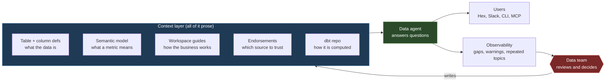

# Learning - How we built LangChain's agent-first data stack

> Persona: **curator** (+ **fact-checker** at the gate, **mentor** where it teaches) - re-adopt when
> working this file. Source facts in [`SOURCE.md`](SOURCE.md); gated evidence in
> [`nodes.md`](nodes.md); external evidence in
> [`context/01_data-agent-accuracy-and-prior-art.md`](context/01_data-agent-accuracy-and-prior-art.md).

## TL;DR

**An "agent-first data stack" turns out not to be a data stack at all. It is a documentation layer
wrapped around an unchanged one.** The figure captioned "LangChain's data stack architecture" shows a
stock 2022 ELT pipeline - Fivetran and Airbyte and Segment into BigQuery, dbt on top, reporting at
the end - with no agent, no semantic model and no feedback loop anywhere in it (`d1`). Everything
that makes the stack "agent-first" lives in a second figure, and all of it is prose: table and column
definitions, a semantic model, workspace guides, endorsements, and the dbt repo itself (`n1`, `n2`).

**The transferable move is that a column definition stops being a description and becomes an
instruction.** The article's own before-and-after is the whole lesson: `account_status: The status of
the account.` becomes a paragraph that spells out each lifecycle value in business terms and then
issues an imperative - "**For customer reporting, filter to Active unless the analysis explicitly
includes churned or prospective accounts**" (`n3`). That is not documentation. That is a default
policy stored in metadata, where the agent will encounter it at exactly the moment it matters.

**The loop that maintains it is the second lesson, and it inverts what a data team is for.**
Observability over agent conversations surfaces where context is missing, and the source hands over a
symptom-to-layer triage table: repeated questions mean build a dashboard, a metric the agent keeps
fumbling means fix the semantic model, a wrong source picked means fix the endorsements (`n7`). The
output of that loop is never an answer to a user - it is a **write back into the context store**
(`n8`). The data team stops being a query service and becomes the maintainers of the layer.

**Read the results with both hands.** Every number here measures **adoption** - 2,200 conversations,
40x throughput, 100% migration in six weeks - and the article's own thesis is about
**trustworthiness**, which it never measures (`d4`). The authors say so themselves and file evals
under "next" (`n10`). Deep research supplies what the source lacks in both directions: schema
documentation is **measured** to help, and far more on real warehouses (+16pp) than on public
benchmarks (+2pp) - and the enterprise text-to-SQL setting closest to this stack tops out around
**65.6%** among tuned public systems. **The mechanism is well corroborated; the result is not.**

## Key claims

| # | Claim | Evidence | Confidence |
|---|---|---|---|
| 1 | **The work is making implicit context explicit, not re-plumbing data.** The pipeline underneath is an ordinary ELT stack; what changed is the reporting tier and the documentation around the warehouse. | `n1` corroborated; `d1` (figure vs prose) | OK |
| 2 | **The context layer decomposes into five stores, each answering a different kind of question** - what the data is, what a metric means, how the business works, which source to trust, how a number is computed. They are not interchangeable. | `n2` corroborated (prose + `fig3`) | OK |
| 3 | **A column definition becomes an instruction**, carrying allowed values, business interpretation and a default filtering rule. | `n3` single-leg on content; externally measured (F1) | OK |
| 4 | **Context layers compose downward and cannot repair the layer beneath.** "If the data model is confusing to humans, it will be confusing to agents too." Fix foundations first, then the semantic layer. | `n4` single-leg | needs-check |
| 5 | **Context that fits no schema field becomes a prose document, versioned in git** - and the author names the family herself: "like skills for the data agent". | `n5` corroborated | OK |
| 6 | **A trust signal needs an access-controlled writer, because it dies at saturation.** "If everything is endorsed, the signal stops being useful." | `n6` corroborated; prior art in F4 | OK |
| 7 | **Agent conversations are the demand signal for what to document**, with a symptom-to-layer triage rule. | `n7` corroborated; measured + automatable (F2) | OK |
| 8 | **The loop's output is a write to the context store, not an answer** - which is what makes the data team's role shift structural rather than rhetorical. | `n8` corroborated on mechanism | OK / needs-check |
| 9 | **Curate the head, defer the tail** (~80% of asked questions first), because the binding cost is human authorship. | `n11` single-leg | needs-check |
| 10 | **The human gate is a social control, not an architectural one** - "loop in the data team" is advice written into a guide, not a constraint enforced by the system. | `n12` single-leg + `d2` | needs-check |
| 11 | **All reported results are adoption; correctness is never measured**, and the authors know. | `n9`, `n10` single-leg; `d3`, `d4` | needs-check |

## The argument, in order

### The architecture diagram is the most honest thing in the article

Start with what the visual leg found, because it reframes everything after it. The article says
LangChain "did a big architectural shift". The figure it publishes to illustrate that shift
(`visuals/fig2_data-stack-architecture.png`) shows billing, third-party sources, internal services
and event tracking flowing through Metronome, Fivetran, Airbyte, Postgres and Segment into a
BigQuery boundary, where dbt transforms raw data into prod, which feeds reporting. Hex hangs off the
right-hand edge. GitHub feeds dbt.

**There is no agent in the architecture diagram.** No semantic model, no workspace guides, no
endorsements, no feedback loop - every one of those appears only in the *other* figure (`d1`).

This is not a criticism of the article; it is the article's real finding, stated more plainly than
the article states it. **The plumbing did not change. What changed was the BI tool at the end and the
amount of English written around the warehouse.** If you came looking for a new data architecture for
the agent era, the honest answer on this evidence is that there is not one yet - there is a
conventional warehouse with a much better-documented surface.

> 💡 **ELT** - extract, load, transform: land raw data in the warehouse first, then transform it
> in-place with SQL (here, dbt), as opposed to older ETL which transformed before loading. It is the
> default shape of a modern data stack and has been for most of a decade.

### The five stores, and why the split is the point

The second figure is a specification rather than decoration, and it is where the source earns its
place in this brain. Inside a boundary labelled "AI context layer" sits a dashed CONTEXT box holding
exactly five things (`n2`):

| Store | Answers | Lives in |
|---|---|---|
| Table + column definitions | *What is this data?* | dbt + BigQuery |
| Semantic model | *What does this metric mean?* | the semantic layer |
| Workspace guides | *How does this business work?* | markdown in a GitHub repo, synced |
| Endorsements | *Which source do I trust?* | flags on assets, data-team-writable only |
| GitHub repo (dbt) | *How is this number actually computed?* | the SQL itself |

The temptation is to read that as five places to write documentation. It is not. **Each answers a
question the others structurally cannot.** A column description cannot tell you which of three ARR
dashboards is canonical - that is a trust question, and trust is a property of the *relationship*
between assets, not of any one of them. A semantic model cannot tell you that GTM defines pipeline
differently in the weekly report than sales does - that is a social fact with no schema slot. And
none of the four prose layers can tell you what a number really is when the definitions have drifted
from the SQL; only reading the dbt model can, which is why the repo is a context store rather than an
implementation detail (`n2`).

> 💡 **Semantic layer** - a declarative definition of metrics and entity relationships (ARR, pipeline,
> active usage) sitting above the physical tables, so that "revenue" resolves to one agreed
> calculation rather than being re-derived per query. Long-standing BI infrastructure - LookML shipped
> the idea in 2012 - here repurposed as agent context.

**The design rule to take away: sort context by the question it answers, not by the tool that stores
it.** Any layer that cannot name a question only it can answer is a duplicate, and duplicated context
is worse than missing context because the two copies will drift.

### A definition is a prompt

This is the sentence to steal from the article. The weak version:

```
account_status: The status of the account.
```

The strong version, quoted in full because the shape matters:

```
account_status: The current lifecycle status of the account in Salesforce. Active means the
customer has an active paid contract. Churned means the customer previously had a paid contract
that has ended. Prospect means the account has not yet become a customer. For customer reporting,
filter to Active unless the analysis explicitly includes churned or prospective accounts.
```

Four things are happening in that paragraph, and only the first is documentation: it names the system
of record, it enumerates the allowed values *with business meaning*, it gives interpretation
guidance, and then - the move - **it issues a default policy**: filter to Active unless told
otherwise (`n3`). The stated purpose is to stop someone getting "a technically correct answer based
on the wrong business interpretation", which is the failure mode that makes data agents dangerous
rather than merely wrong. A query that returns the right number for the wrong population looks
exactly like a right answer.

**This brain has now seen the same move three times in three unrelated domains**, which is what makes
it a pattern rather than a tip:

- A **skill's description is the trigger**, and causes 50%+ of skill failures (S5, claim 44).
- A **tool's name and description are ranking features**, so the first tuning pass is editorial
  rather than algorithmic (S10, claim 88).
- A **column's description is a default policy** the agent applies (S11, `n3`).

In each case a metadata field written for humans to skim was quietly promoted to a control surface
the model acts on, and in each case the incumbent vocabulary - implementer shorthand, "the status of
the account" - is the dominant failure. **Metadata written for humans underperforms as metadata
written for models, and nobody notices until an agent reads it.**

External evidence supports this one properly, which is rare in this brain. Documented columns measure
**+20% accuracy on completely uninformative column names** (BIRD, T3 preprint), and on a real
warehouse with genuinely ambiguous names, query-derived descriptions moved execution accuracy
**36% -> 52%** where the same intervention bought only +2pp on a public benchmark (MotherDuck, T2) -
see F1. **The gain is concentrated exactly where real companies live and public benchmarks do not.**

### Endorsement: a trust signal is only as good as its scarcity

Endorsements answer a question the definitional layers cannot: a company has four tables, two
dashboards and a graveyard of historical queries all touching "ARR", and the agent has no way to
prefer one. Endorsing the canonical dashboard lets the agent use "that dashboard and the logic behind
it" (`n6`).

The guardrail is the interesting half. **Only the data team may endorse**; endorsed dashboards need
data-team review before changes ship. The reason is stated as a one-line design principle worth
memorising:

> **"If everything is endorsed, the signal stops being useful."**

That is a general property of trust signals, not a data-stack detail. A signal carries information
only in proportion to what it excludes, so **any trust marker needs a writer restriction or it
inflates to noise** - the same reason a code-owners file, a "verified" badge or a `@deprecated`
annotation decays the moment everyone can apply it. If you add a trust flag to any agent-facing
store, decide who may write it *before* you decide what it means.

Prior art strengthens this rather than diminishing it (F4). Microsoft's Power BI has shipped
endorsement for years, with search-priority effects and attribution, and **it has two tiers where
this source has one**: *Promotion*, which anyone with workspace write access may apply, and
*Certification*, restricted to an admin-defined reviewer group. That two-tier split is a better
answer to the saturation problem than a single guarded tier, because the cheap tier absorbs the
volume of "this is good, use it" and keeps the expensive tier scarce **without making the data team a
bottleneck**. LangChain has re-derived Certification and not yet re-derived Promotion. **The
convergence is the real evidence**: a hyperscaler's governance feature and a three-person data team
building for an LLM arrived at the same primitive independently, years apart.

### The loop, and the diagram that is missing a human



**Orientation.** Read it clockwise, starting at the blue box. Blue is the context layer - five prose
stores, no code. Green is the running agent. The **red diamond is a human**, and it is the only human
in the picture. The cycle is: context feeds the agent, the agent's behaviour is observed, the
observations reach a person, and that person writes back into the context layer. Users receive
answers but are not part of the loop that improves it.

**The crux: the output of a working data-agent loop is not answers, it is context - and the only
thing that closes the loop is a human writing prose.**

**Why it is shaped this way.** Three choices carry the design. First, the loop terminates in the
*context* box rather than at the user, which is what converts the data team's job from a queue of
requests into maintenance of a shared artifact (`n8`) - a queue never compounds, an artifact does.
Second, observability sits between the agent and the human rather than beside it: without it the team
would be guessing which of five stores to improve, and the source's triage rule (repeated questions
to a dashboard, fumbled metric to the semantic model, wrong source to endorsements) is only
executable because the conversations are logged (`n7`). Third, and most importantly, **the red
diamond is drawn because the source's own architecture diagram omits it.** In `fig3` the feedback
arrow runs from usage trends straight back into dbt with no review step, and no human appears
anywhere (`d2`) - while the prose insists that only the data team may endorse and that endorsed
assets need review before changes go live. Remove that diamond and you have a system that rewrites
its own trust signals based on usage, which is a self-reinforcing loop with no ground truth: the
agent's most-used source becomes its most-endorsed source becomes its most-used source. **The one
control that makes this design safe is the one the source's diagram leaves out.**

**Provenance:** synthesized from `n2`, `n7`, `n8`, `d2` - the red diamond in particular is this
brain's correction of `fig3`, not a shape the source drew.

### The numbers, and the number that is missing

The reported results are real and worth knowing (`n9`): ~2,200 agent conversations in 30 days from
roughly a third of the company, 23 per user per month, 100% off the old BI tool in six weeks, ~30% of
staff with agent access. Those internally check out - 2,200 / 23 gives ~96 users, and ~96 as a third
of the company matches the ~30% access figure.

Two cautions, then the important one.

The **40x** should never be quoted bare (`d3`). Its numerator is *conversations* and its denominator
is the request volume a three-person team "could field directly" - a capacity estimate, never
measured, which back-solves to about 55 requests a month. A conversation is not a request; four
follow-ups are not four answered questions. The article does not overclaim, but the ratio compares
two different units, one of which is hypothetical.

The important one is `d4`: **every reported figure measures adoption, and the article's thesis is
about trust.** It argues throughout that without context "the answers are harder to trust", that "the
reliability of a data agent comes from the context" - and reliability is the one property never
measured. `n10` shows this is a known gap, not an oversight: evals are filed under "where we're going
next", with the goal of making context management "feel more like software development. We can make a
change, test it, and build more confidence before rolling it out broadly."

That sentence is the article quietly conceding S5's thesis. **S5's title is literally "Don't ship
skills without evals"** (claim 46: an instruction artifact without an eval is an unfalsifiable
change), and workspace guides *are* skills - the author says so herself (`n5`). This stack shipped
five layers of instruction artifacts, to the whole company, with no eval on any of them. It appears
to be working. **Both of those things are true at once, and the honest reading is that we do not know
which one is load-bearing.**

External evidence gives that gap a scale (F3). Spider 2.0 - 632 enterprise text-to-SQL problems over
BigQuery and Snowflake databases with 1,000+ columns - scored **17.0%** for the best model at
publication. Public leaderboard entries have since climbed steeply, but the ordering is what matters:
the **dbt-based setting, the closest analogue to this stack, is the hardest, at 65.6%**. That does not
say LangChain's agent is inaccurate. It says the task has a real, currently binding error rate, worst
in exactly this configuration, and that **40x volume at an unknown accuracy is an open risk rather
than a rhetorical caveat.**

### Where the effort goes, and why it disagrees with S10 without contradicting it

The advice is to cover the head first: "start with the questions people ask most often... if you can
cover roughly 80% of the questions people ask", then work the long tail over time (`n11`).

S10 says the opposite - **retrieve the long tail, pin the head** (claim 90). Both are right, and the
reason is worth holding onto, because it is a general rule for deciding where to spend:

- **S10's binding cost is tokens.** Indexing the tail is nearly free once the index exists, so the
  tail gets retrieved and the head gets pinned - pinning is what protects the things that must never
  be missed.
- **S11's binding cost is human authorship.** Every tail item costs a person writing a definition,
  reviewing it and maintaining it forever, so the tail gets deferred.

**Same head/tail split, opposite treatment, because the scarce resource differs.** When you meet this
choice, the question is not "head or tail" but "what actually runs out first - context window or
people". If it is people, F2 offers a partial escape: MotherDuck generated schema descriptions from
the query log for roughly **$0.50 per warehouse**, and that +16pp result came from the generated
descriptions, not hand-written ones. **The first draft of the long tail can be machine-written from
usage; only the ambiguous cases need the expert** - which is precisely where the same paper found LLM
generation falls down.

### The oldest thing in the article

The role shift the source reports as new - the data team moving from answering questions to
maintaining the context that answers them (`n8`) - has a 45-year-old name (F5). It is **knowledge
engineering**, and the constraint is Feigenbaum's **knowledge acquisition bottleneck** (1977): expert
systems were limited not by inference but by the human labour of eliciting and encoding domain
expertise, work he described as a cottage industry of specialists sitting with experts to "explicate
heuristics".

> 💡 **Knowledge acquisition bottleneck** - the limiting factor in a knowledge-based system is the
> human labour of extracting expert knowledge and encoding it in a usable form, not the system's
> reasoning power.

A metric definition and a workspace guide are elicited, interpreted, encoded domain expertise. What
changed since 1977 is the target formalism: English prose instead of production rules, which
collapses the *encoding* cost. **The elicitation cost is untouched** - someone still has to sit with
GTM and find out what they mean by pipeline. That is why this stack costs three full-time people
forever rather than three people for a quarter.

This lands on claim 72 from a second direction. S8 recorded, via Bush's **Memex (1945)**, that the
binding constraint on a maintained knowledge base is maintenance labour and that the LLM's
contribution is *economic, not intellectual*. F5 says the same from the expert-systems literature.
**Two independent historical precedents, 1945 and 1977, now support that claim - and S11 is what it
looks like when someone actually pays the bill.**

## What this source is good for, and what it is not

**Good for:** the five-store decomposition (`n2`) as a checklist for any agent that answers questions
over a proprietary domain; the weak-vs-strong definition example (`n3`) as the clearest illustration
in this brain of metadata becoming a control surface; the endorsement guardrail (`n6`) as a general
rule about trust signals; the symptom-to-layer triage table (`n7`) as an operational routine.

**Not good for:** deciding whether any of it works. Nothing here is measured against a baseline, the
one headline ratio compares mismatched units (`d3`), and the vendor selection narrative is a
procurement story for one company. Read `context/01` for what the field has actually measured.

**One small observation worth recording:** MCP appears in this article twice, both times as an
unremarked bullet in a list of ways to reach the agent, alongside Slack and the CLI. No mechanism, no
version, no design consequence. Per [ADR-0012](../../brain/decisions/0012-a-mention-is-not-a-source.md)
that is a mention, not a source, and it does not advance `brain/topics/mcp.md`. But the *manner* of
the mention is mildly interesting on its own: **MCP has become boring**, listed beside Slack as a
delivery channel by someone with no interest in the protocol.

## Open questions

- **Does an endorsement flag actually change an agent's source selection?** Nobody has measured it
  (F6). Power BI documents effects on *human* discovery only, and the transfer to model behaviour is
  assumed by everyone and demonstrated by no one. This is the cheapest high-value experiment this
  brain has surfaced: ablate the flags, hold everything else fixed, measure source choice.
- **What is the actual accuracy of this stack?** Unmeasured by the source, and the closest public
  proxy leaves roughly a third of enterprise dbt questions wrong (F3).
- **How many context stores is too many?** One study found metadata gains flattening past three or
  four components (F2, weak T4/T5 evidence). This stack has five. Whether the fifth pays for its
  maintenance is unknown, and it is the kind of question ablation answers - the method S5 supplied
  (claim 47).
- **Does the social human gate hold at scale?** `n12` and `d2`: the routing rule ("when a question
  should be routed to the data team") is written into a guide for the agent to relay, not enforced by
  the system. That works at ~290 people with a visible data team on Slack. It is not obvious it
  survives 3,000.
