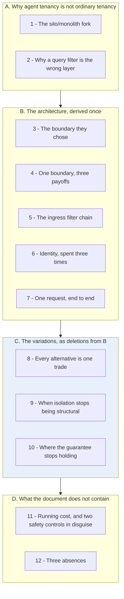
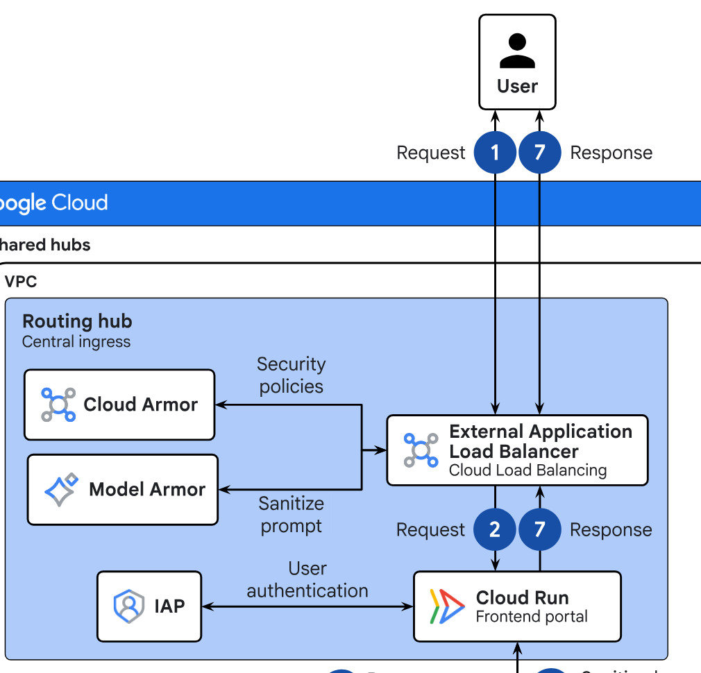
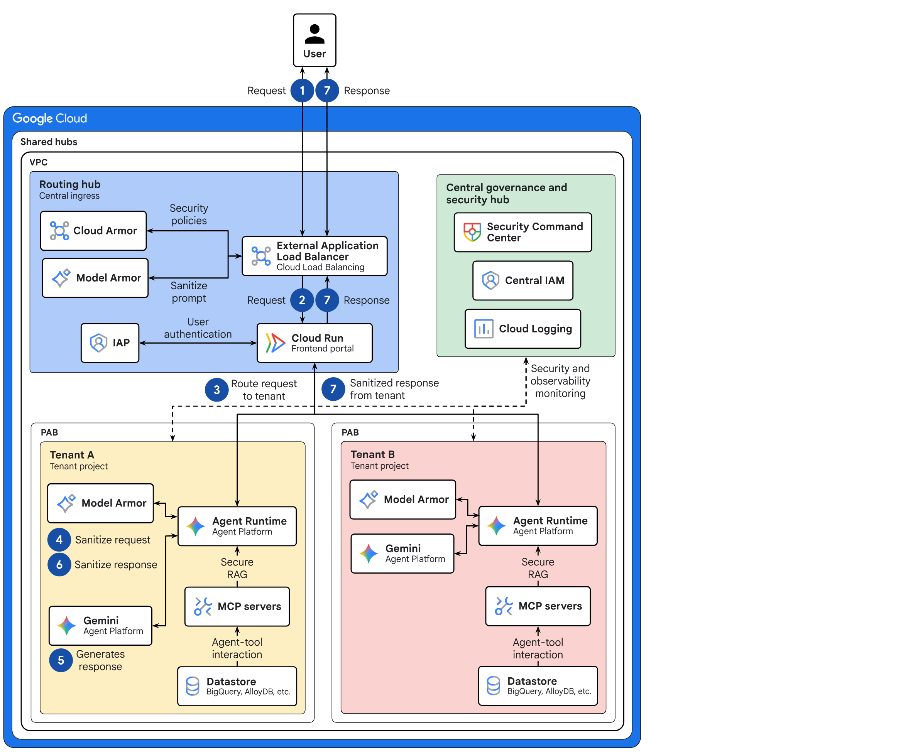
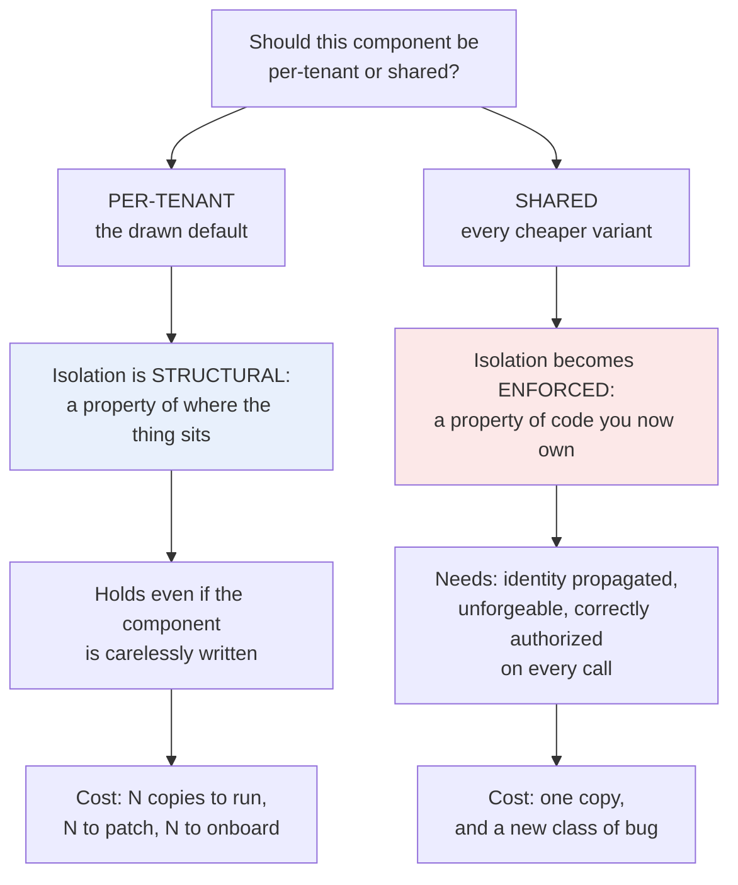

# Learning - Multi-tenant agentic AI system (Google Cloud reference architecture)

> Persona: **curator + mentor, always**, with **fact-checker** at the gate and **architect** on the
> topic mapping. Re-adopt when working this file.

> Distilled from the gated nodes in `nodes.md`. Every claim cited. See `SOURCE.md` for metadata and
> for the standing caveat that both of this source's legs were written by the same team.

## TL;DR

An organisation that wants agents for twelve business units has two bad options - twelve teams
building twelve stacks, or one shared agent that must be trusted to keep twelve datasets apart - and
this document is Google's answer to picking neither. The answer is that the tenancy boundary should
be the cloud platform's own coarsest one, a **project per business unit**, with the agent's authority
bounded by policy on the *principal* rather than by care in the code. That single decision turns out
to buy three things at once: cross-tenant access becomes structurally impossible, one unit's incident
stays inside that unit, and one unit's traffic spike cannot starve another. The document's real
lesson is in its second half, where every cost-saving alternative it offers is the same trade in
different clothing - **give a piece of isolation back and re-enforce it in software you now have to
write** - and the sharpest instance is a cost recommendation that quietly deletes the tenant-local
PII filter the security section calls essential. Vendor reference architecture, T2, **no measurement
of any kind**: read it as a well-argued shape, never as a result.

## The 1-minute version

This article covers a Google Cloud reference architecture for running agents on behalf of many
business units inside a single organisation. It is a design document rather than a report on
anything deployed, and it works on one question. Where should the wall between two business units'
agents actually sit? Its answer is a whole cloud project per unit, and the more interesting half of
the document is the set of cheaper variants it offers afterwards. To see why that answer is not
obvious, start with the problem it is answering.

The problem is that different business units need agents with different tools, different operational
rules and different sensitive data [`n1`, §intro]. Left to themselves, each unit builds its own
stack, and the document is precise about what that produces. It names fragmented application silos,
high operational overhead, severe governance gaps and a risk of data exposure. So the organisation
does the obvious thing and centralises, which is where the opposite failure appears. Build one shared
agent for everybody and the separation between the electronics division and the home goods division
is one prompt away from failing.

At first glance that fork is ordinary enterprise architecture, and if it were the whole problem the
answer would be ordinary too. The reason it is not is that the thing you are putting inside the
tenant boundary is not a service. It is a model, and a model decides for itself what it will go and
fetch [derived; see §2].

Suppose instead you reached for the standard SaaS answer, which is one application, a tenant ID on
every row, and a data access layer that appends the tenant predicate to every query. That answer
collapses in two places at once. The set of queries is no longer finite, because an agent composes
its own data access at run time and nobody wrote the query that could be reviewed. And the input
steering the agent is attacker-influenceable text, so a predicate the model was persuaded to omit is
not a predicate at all. The conclusion is forced. Isolation has to live somewhere the model has no
vote [derived; see §2].

The idea is therefore to make the tenant boundary the platform's own coarsest boundary rather than an
application-level one. Each business unit gets a dedicated cloud project, and the agent's identity is
wrapped in a **Principal Access Boundary** that caps what that identity can reach at all, whatever
the agent decides to do with the permissions it holds [`n2`, `n4`].

In practice that produces a hub-and-spoke shape. A shared routing hub takes the traffic first, where
it absorbs DDoS, filters ordinary web attacks, screens the payload for prompt injection and
establishes corporate identity. The hub then looks the caller's business unit up in a registry and
forwards the request into the right tenant project. Each tenant project holds its own agent runtime,
its own PII filter, its own MCP server and its own datastore, and the figure draws no edge between
one tenant and another [`n1`, `n5`, `n8`, `n9`].

What that costs is duplication of essentially everything, once per tenant, plus a shared hub that
somebody has to fund [`n18`]. The document knows this and offers cheaper variants, and the important
observation about them is that they are all one move rather than four. A shared model endpoint, a
shared MCP server, a single Model Armor instance and a private ingress each take a guarantee that was
structural and convert it into one you must now enforce in code you own [`n14`].

How far to trust any of it is the part to be blunt about. This is a T2 vendor document and the
strongest available form of unmeasured. It carries two named authors, 21 further contributors and a
Terraform implementation, and it carries not one latency figure, cost figure, incident report or
named deployment. Both legs of this kit's corroboration gate are the same team's prose and the same
team's diagram. It is good architecture writing with zero evidence behind it.

The same argument, compressed for reference rather than for reading:

| | |
|---|---|
| **The problem** | Different business units need agents with different tools, rules and sensitive data. Let them build separately and you get silos, duplicated ops and governance gaps; build one shared agent and one prompt away is another division's data [`n1`, §intro]. |
| **Why the obvious answer fails** | The usual SaaS answer - one app, a tenant ID, filtered queries - assumes an engineer writes the query. An agent composes its own data access at run time, and the request it is acting on is attacker-influenceable text. Isolation has to live somewhere the model has no vote [derived; see §2]. |
| **The idea** | Make the tenant boundary the platform's own: **one cloud project per business unit**, with a **Principal Access Boundary** bounding what the agent's identity can reach at all, regardless of what it decides to do [`n2`, `n4`]. |
| **How it works** | Hub-and-spoke. A shared **routing hub** does DDoS, WAF, prompt-injection filtering and identity, then looks up a registry and forwards to the right tenant project; each tenant holds its own agent runtime, its own PII filter, its own MCP server and its own datastore, with no edge between tenants [`n1`, `n5`, `n8`, `n9`]. |
| **What it costs** | Duplication of everything per tenant, and a shared hub someone has to fund [`n18`]. Every cheaper variant the document offers - shared model endpoint, shared MCP server, single Model Armor, private ingress - converts a structural guarantee into one you must now enforce yourself [`n14`]. |
| **How far to trust it** | **T2 vendor, and the strongest form of unmeasured.** Two authors and 21 contributors, a Terraform implementation, and **not one latency figure, cost figure, incident, or named deployment**. Both of the corroboration gate's legs are the same team's prose and the same team's diagram. Good architecture writing; zero evidence. |

## Key claims

- **The unit of isolation is the cloud project, one per business unit** - not a namespace, a row filter or a tenant ID column. `n2`, §Architecture + `visuals/fig1b_two-tenants.png`
- **The agent's blast radius is bounded on the principal, not the resource.** PAB Policy "ensures that principals can only access resources within their approved boundaries", applied to the agent runtime so it "can't access other tenant projects or unauthorized Google Cloud services". `n4`, §Agentic flow step 3
- **Prompt-injection filtering is placed at the network edge**, wired into the load balancer through Service Extensions, so a prompt is inspected before any application code sees it. `n6`, §Architecture
- **One tenancy decision pays out three times** - security isolation, failure isolation and quota isolation are the same boundary read three ways. `n13` (this brain's synthesis of three separate statements)
- **Every cost-saving alternative in the document trades a structural guarantee for an enforced one.** `n14` - the organising claim of the source
- **Moving the MCP server out of the tenant replaces a perimeter with an obligation:** "you securely propagate the end-user identity... the shared MCP server uses the propagated user identity to enforce fine-grained access control" - and **no mechanism is named**. `n10`, `n11`
- **The document's own cost section deletes the tenant-local PII filter its security section requires**, keeping only the shared one, while conceding in the same sentence that the two-layer design is what "helps to ensure data sovereignty". `d2`
- **The "even if an agent identity is compromised" guarantee holds only for the topology the figure draws**, not for the shared variants recommended three sections later. `d3`

## What you will learn, and in what order

The diagram runs top to bottom in reading order, and each box is a numbered section below, gathered
into four movements. The one shaded movement is the one carrying the payload. **The crux is that the
architecture is movement B and the lesson is movement C**, because the shape stays unremarkable cloud
multi-tenancy until you watch what each cheaper option removes from it.

Movement A exists for a specific reader, namely the one who already knows cloud multi-tenancy and
will otherwise skim B and conclude they have read this before. Its whole job is to establish what is
*different* once the thing inside the boundary reasons for itself, and if you already believe that,
you can move straight on. Movement B may then be skimmed by anyone comfortable with projects, IAM and
load balancers, because it is derivation rather than news. C is where the document stops describing
and starts deciding, and it is where both of its internal contradictions live, so it is the stretch
worth slowing down for. D is short, and it is the part most likely to matter to you in six months.

*Synthesized roadmap of this note, not of the source - the source's own order is architecture,
alternatives, then four design pillars.*

## Walkthrough

### 1. The problem is not running an agent. It is running twelve of them for people who do not trust each other

Start where the document starts, because the framing is the part most agent architecture writing
skips. The scenario is not a startup shipping one assistant. It is an enterprise where "different
business units require specialized AI agents that access unique tools, follow specific operational
rules, and process sensitive data" [§intro].

Left alone, each unit builds its own. The document names the result precisely: "Business units might
develop fragmented application silos within an organization, which can cause high operational
overhead, severe governance gaps, and a risk of data exposure" [§intro, `n1`]. Note that the failure
is not primarily technical. Twelve stacks is expensive, but the sentence's centre of gravity is
*governance gaps*, because nobody can answer "which agents can reach customer PII" when no one place
knows what exists.

So the organisation centralises, and the opposite failure immediately becomes available. Now there is
one agent platform and one model endpoint. There is one datastore with a tenant column on every row.
And the entire separation between the electronics division and the home goods division is a `WHERE`
clause somebody wrote.

That fork - fragment or centralise - is ordinary enterprise architecture, and if it were the whole
problem the answer would be ordinary too. **The reason it is not is the subject of the next
section:** the thing you are putting inside the tenant boundary is not a service. It is a model.

### 2. A tenant ID in a query is the wrong layer, because the query is no longer written by an engineer

> **Background, supplied.** *Skip this if you have built multi-tenant SaaS.* The standard playbook is
> **logical** isolation: one deployment, one database, a tenant identifier on every row, and a data
> access layer that appends the tenant predicate to every query. It is cheap, it packs efficiently,
> and it works because the set of queries the system can emit is finite and written by your team. Its
> guarantee is "our code never forgets the predicate", enforced by code review and integration tests.
> *(This block is background I am supplying so the rest reads; it is uncited by construction and is
> not from the source.)*

Hold that guarantee up against an agent and it fails on both halves at once.

The first half fails because the set of queries is no longer finite. An agent decides at run time
what to fetch, which tools to call, and in what order. Nobody wrote the query, so nobody can review
it. This is the same structural problem [`agent-security.md`](../../brain/topics/agent-security.md)
records as OAuth's open question, where a client that chooses its actions at run time cannot honestly
declare up front what it needs, and so drifts toward asking for everything.

The second half fails because the input steering the agent is hostile. The text the model is acting
on came from a user, and it may have come from a document that user uploaded or a web page a tool
fetched. Prompt injection means the instruction set is attacker-influenceable. A predicate appended
by code you control is fine, and a predicate the model was persuaded to omit is not.

> 💡 **Prompt injection** - text arriving through data (a message, a document, a tool result) that the
> model treats as instructions. The defining property is that it needs no access to your systems: the
> attacker writes English, and the agent, which does have access, carries it out.

In short, the isolation has to sit somewhere the model has no vote at all, below the application, and
enforced by something that does not read the prompt. **That requirement is what picks the boundary**,
and it is what the next section is about.

### 3. The boundary they chose is the platform's coarsest one, and that is the point

- **What it teaches:** the answer to "where do we put the boundary" is *as low as the platform will
  let us*. Each business unit is a separate Google Cloud project - "Each tenant project is a dedicated
  Google Cloud project for each business unit" - and each project is wrapped in a **PAB** box
  [`n2`, §Architecture].
- **Corroborated by:** the prose's Tenant projects row, which lists exactly the components the figure
  draws inside each tenant: PAB, Agent Runtime, Model Armor, MCP servers, datastore, model.
- **And look at what is not drawn.** There is no line between Tenant A and Tenant B. Every arrow
  entering a tenant comes from above, from the shared frontend. The isolation claim is not annotated
  anywhere in the figure; it is expressed as an *absence of edges*, which is the strongest way a
  diagram can say it [`n2`, `visuals/fig1b_two-tenants.png`].

The choice is deliberate and worth arguing about, because it is the expensive one. A project per unit
means duplicating the runtime, the filter, the MCP server and the datastore per unit, and it means
onboarding a business unit is an infrastructure act. In exchange, the guarantee stops depending on
anybody's code being careful.

Three mechanisms are stacked at three different scopes, and the document is explicit that you use all
three rather than picking one - "combine tenant project-level isolation with PAB Policy and VPC
Service Controls at the organization level" [§Security, VPC row, `n3`]. The first is the project
itself, which is a resource container, so resources belong to one unit and IAM grants are scoped to
it. The second acts on the actor rather than the container. A PAB Policy means a principal cannot
reach outside its approved boundary even if some IAM policy grants it access. The third is
organisation-wide and is about data leaving rather than about who may enter, because a VPC Service
Controls perimeter is the exfiltration control. As a recap:

| Scope | Mechanism | What it stops |
|---|---|---|
| The resource container | **The project** | Resources belong to one unit; IAM grants are scoped to it |
| The actor | **PAB Policy** | A principal cannot reach outside its approved boundary *even if some IAM policy grants it access* |
| The organisation | **VPC Service Controls perimeter** | Data leaving the perimeter at all - the exfiltration control |

> 💡 **Principal Access Boundary (PAB) Policy** - a policy attached to a set of *principals* (users,
> service accounts, agent identities) that caps the resources those principals may access, whatever
> permissions they are otherwise granted. An ordinary IAM grant answers "may this principal do this?";
> a PAB answers "is this principal allowed to be here at all?", and it wins.

That distinction between the first two rows is the load-bearing one, so it is worth being slow about.
IAM is additive and distributed, which means any project owner can grant any principal access to
their resources, so the set of things an identity can reach is the union of decisions made by many
people over time. A principal boundary is subtractive and central. It does not matter who granted
what, because the principal cannot leave the box. That is exactly the property you want against an
agent, because the failure you are defending against is not "someone wrote a bad grant" but "the
agent was talked into using a grant that legitimately exists" [`n4`, §Agentic flow step 3].

**One thing the figure does not contain, which you should notice now and I will return to in §10:**
the org-level VPC Service Controls perimeter that the prose calls the strict security boundary is
drawn nowhere. The "VPC" box in the diagram sits around the shared hubs only, and the tenants are
outside it [`d1`].

This all looks expensive. **The next section is why it is cheaper than it looks.**

### 4. You pay for the boundary once and it pays out three times

The document spreads this across three separate pillars and never says it in one place, so it is easy
to read the tenancy decision as a purely security-driven cost. Put the three statements side by side
[`n13`]:

| Pillar | What the source says | The property |
|---|---|---|
| Security | Cross-tenant access is structurally impossible; PAB "ensures no cross-tenant access" | **Confidentiality isolation** |
| Reliability | "deploy agents in isolated tenant projects. This isolation helps to ensure that operational issues or security incidents stay within a single business unit" | **Blast-radius isolation** |
| Cost / capacity | "A sudden spike in usage in one tenant doesn't exhaust the compute resources or affect the availability of an agent in another tenant"; dedicated endpoints give "inherent quota isolation" | **Noisy-neighbour isolation** |

> 💡 **Noisy neighbour** - one tenant's load degrading another's service because they share a finite
> resource (CPU, connections, or here, a model endpoint's quota). The classic multi-tenancy failure
> that has nothing to do with security and everything to do with sharing.

**Reading these as one decision rather than three is this brain's synthesis, not the source's claim** -
each row is stated, the unification is mine. But it is the reading that makes the architecture
defensible, and it is what you would use to justify the cost internally. A project boundary bought for
compliance reasons hands you rate-limit isolation and incident containment for free, and none of the
three would have been cheap to build separately.

It also sets up the trap in movement C. **If one decision buys three properties, then every deletion
you make for cost reasons sells three properties at once, and the cost section will only mention the
one it is optimising.** Hold that.

The boundary now protects the tenant. **It does nothing at all about what arrives at the front door**,
which is the next section.

### 5. The ingress is a filter chain, and each filter catches what the previous one structurally cannot

- **What it teaches:** the shared hub is not a proxy with a WAF bolted on. It is an ordered sequence of
  filters, and the order is the argument [`n5`, §Agentic flow].
- **Corroborated by:** the flow prose, which walks the same order - Cloud Armor absorbs L4 DDoS and
  filters SQLi, XSS and bot signatures; "Model Armor intercepts the payload to detect and reject prompt
  injection attacks or malicious intent"; then the portal "Uses IAP to verify the user's corporate
  identity and device health". "If any of these layers detect a threat or unauthorized access, then the
  load balancer drops the request at the network edge" [§Agentic flow steps 1-2].

Do not read that as a list of three products. Derive it instead, by asking at each stage what the
stage before it structurally cannot answer.

Cloud Armor comes first and handles volume and shape, which means a SYN flood, an injection string in
a parameter, or a known bot signature. It reasons about packets and patterns, and that is the whole
of its vocabulary. What it cannot do is read a paragraph of English and tell you that the paragraph
is an instruction to the model, because to Cloud Armor a prompt injection is a well-formed POST body.
Something further along has to read the text as text.

Model Armor does exactly that, and only that, as a content filter for model-facing text. What it
cannot do is tell you who sent it, so a perfectly benign prompt from someone with no right to be here
passes it cleanly. That leaves the question of who is asking.

IAP answers it, with corporate identity and device health together. What it cannot do is know which
of twelve agents this person's question belongs to, and that is §6.

> 💡 **Identity-Aware Proxy (IAP)** - a reverse proxy that authenticates the caller and evaluates
> access policy *before* the request reaches the application, so the app never sees an unauthenticated
> request and does not implement login at all.

The genuinely notable move here is where the second filter lives. "The routing hub uses **Service
Extensions** on the external Application Load Balancer to integrate Model Armor directly into the
request flow" [§Architecture, `n6`]. In other words, prompt safety is being treated as a **network
edge concern, in the same component and at the same stage as the WAF**, rather than as a library the
agent calls or a wrapper in the application. The prompt is inspected before any code you wrote has
run.

That is worth arguing about in both directions. In its favour, the placement is unbypassable by
application bugs, it is uniform across every tenant, and it puts one team in charge of a control that
would otherwise be implemented twelve slightly different ways. Against it, the edge sees the raw
request and not the assembled prompt, so it cannot inspect what your context builder actually sends
the model, which is to say the retrieved documents, the tool results and the memory. **Indirect
injection arriving through a tool result never passes this filter.** The source does not raise this;
it is my reading of where the boundary sits, and it is why the tenant-local Model Armor in the figure
is not redundant.

**Hold on to one detail: the Model Armor in this picture is shared by every tenant.** It matters in §8.

### 6. Identity is established once at the front door and then spent three times

The chain has authenticated a person. Now the portal has to decide which of twelve agents gets the
request, and the document's answer is one clause long. It "Extracts the user's identity, such as the
user's business unit or tenant ID", and "Uses a **dynamically maintained registry** to identify the
correct target tenant" [§Agentic flow step 2, `n8`].

That is worth more attention than the document gives it, in both directions.

In its favour, routing is data rather than code. Onboarding a thirteenth business unit is a project
plus a registry row, with no deploy of the shared portal and no code change on a component every
tenant depends on. That is the correct shape, and it is what makes "standardize tenant onboarding" a
realistic goal rather than a slogan [§Operational efficiency].

Against it, the registry is a single shared component sitting in front of every isolation boundary in
the design, and the document describes it in nine words. There is no schema, no consistency model,
nothing on what happens when it is stale, and nothing on who may write to it. Everything §3 built is
downstream of a lookup that decides which tenant a request belongs to. **`single-leg` and needs-check:
the registry appears nowhere in the figure and is never described** [`n8`].

Then notice what else that identity is used for, because IAP's context turns out to be read three
times for three unrelated purposes [`n12`]. First, it decides which tenant the request routes to
[§Agentic flow]. Second, it is the key for rate limiting, where the design says to "Extract the tenant
identity from the IAP context", track usage in Memorystore for Redis, and reject over-limit tenants
before they reach a shared model endpoint [§Security, Agent Platform]. Finally, it is the key for cost
attribution, because "To identify the tenant for each request, extract the user identity from the
context that IAP provides" [§Cost, Cloud Run].

One authentication event therefore becomes the tenancy key for security, capacity and billing. That
is elegant, and it is also concentration. **IAP is doing considerably more architectural work than
"logging users in", and if its context is wrong, three subsystems are wrong in correlated ways.** The
unification is my reading; the three uses are each the document's [`n12`, single-leg].

We now have every piece. **Let us run one request through it.**

### 7. One request, end to end, and what breaks at each step if you delete the component

- **What it teaches:** the complete shape, with the flow numbered 1-7 on the diagram itself. The
  governance hub on the right (Security Command Center, central IAM, Cloud Logging) is the piece the
  earlier crops left out - it is how a central team retains oversight of units it has deliberately
  walled off [`n1`, §Architecture].
- **Corroborated by:** the component table and the seven-step agentic flow, which name the same
  components in the same arrangement.

Take the document's own scenario, a retailer with an electronics division and a home goods division,
each with its own agent and its own warranty and returns data [§Use case]. A customer asks the
electronics agent about a warranty. Every step below is the source's, and the **"delete this and..."**
column is mine.

| # | What happens | Delete the component and... |
|---|---|---|
| 1 | Request hits the external ALB; Cloud Armor filters DDoS, SQLi, XSS, bots | ...your agent platform is DDoS-able and your frontend is exposed to ordinary web attacks. Nothing agent-specific is lost |
| 1b | Edge Model Armor inspects the payload for prompt injection | ...injected instructions reach an agent that holds a real identity and real data access. **This is the step with no non-AI equivalent** |
| 2 | IAP verifies corporate identity and device health | ...you are routing anonymous traffic to a tenant, and steps 3, 5 and every cost report downstream are meaningless |
| 3 | The portal reads the tenant from identity, looks up the registry, forwards; the agent runtime runs under a PAB policy | ...without the registry, routing moves into code. **Without the PAB, the electronics agent can be talked into reaching home goods data - the failure the whole architecture exists to prevent** |
| 4 | Tenant-local Model Armor masks PII with Sensitive Data Protection and re-checks for injection | ...unmasked PII enters the model's context. Note the belt-and-braces: injection is checked twice, at the edge and here |
| 5 | Gemini reasons; if it lacks facts it plans a tool call, the agent checks the user's IAM bindings, and retrieves through the MCP server | ...without the MCP seam the agent holds datastore credentials directly, and the data boundary becomes the agent's own good behaviour |
| 6 | Tenant-local Model Armor inspects and masks the **response** | ...the model's output leaves with whatever it retrieved. **This is the only control on the way out** |
| 7 | Response returns through the portal and the load balancer | - |

Two things fall out of the trace that the component list does not show.

The first is that **the prompt path is inspected four times**, at the edge injection check, the tenant
injection check, the tenant PII mask inbound and the tenant PII mask outbound. This is Swiss cheese
applied to prompts, which is a pattern this brain already holds from S1's QA gates
([`evals.md`](../../brain/topics/evals.md)), where you stack several imperfect filters so their holes
rarely line up.

The second is sparser and less comfortable. **Step 6 is the only outbound control in the entire
architecture.** Everything else, meaning Cloud Armor, IAP, PAB and the perimeter, guards what comes in
or what the agent may reach. Exactly one component inspects what leaves, which is why §8 begins with
the recommendation to move it out of the tenant.

### 8. Every alternative in the second half is the same trade, and the plant now pays off

Movement B is over. What follows in the document is four "design alternatives" and four "design
considerations" pillars, presented as independent decisions about networking, compute, MCP and cost.
**They are not independent. They are one trade, made four times** [`n14`].

Take them in turn. Sharing a model endpoint in the central hub puts every tenant into one quota pool,
which gives back the quota isolation §4 was so pleased about, so you must now build tenant rate
limiting with Memorystore counters or put an API Gateway in front of it "to prevent malicious
attacks". Sharing an MCP server in a shared services project gives back the perimeter, so you must now
propagate end-user identity and enforce authorization inside the server, which is §9. Running a single
Model Armor instance at the edge only gives back the tenant-local PII filter in both directions, which
is the plant from §5 coming due below. And moving the ingress to an internal load balancer gives back
the edge security features themselves, because a regional internal ALB gets "a restricted set of
standard WAF policies" and a cross-region one "doesn't support any Cloud Armor integration" [`n15`].
Compressed:

| The fork | The cheap side | What it gives back |
|---|---|---|
| Model endpoints | **Shared** endpoint in the central hub, one quota pool | Quota isolation. You must now build tenant rate limiting (Memorystore counters) or put an API Gateway in front, "to prevent malicious attacks" |
| MCP servers | **Shared** server in a shared services project | The perimeter. You must now propagate end-user identity and enforce authorization inside the server (§9) |
| Model Armor | **One** instance, at the edge only | The tenant-local PII filter, inbound and outbound |
| Ingress | **Internal** load balancer, private | Edge security features - a regional internal ALB gets "a restricted set of standard WAF policies", and a cross-region one "doesn't support any Cloud Armor integration" [`n15`] |

The last row is the one that generalises furthest and is easiest to get wrong at procurement time.
**Making the ingress more private makes it less defended.** At first glance these should point the
same way, since both are filed under "security", and they do not. The reason is that the edge
features, meaning bot management, Adaptive Protection and the full WAF ruleset, exist at the global
external front door and thin out as you retreat behind it. Compliance will ask for the private
ingress, and nobody in that meeting will mention that it costs you Adaptive Protection. `single-leg`
on the vendor's own capability statements, which is the class of claim T2 is strongest on [`n15`].

**Now the plant from §5.** The cost section says this [§Cost, Model Armor row]:

> "To enforce strict governance and a zero-trust posture, this architecture deploys Model Armor at two
> layers: in the routing hub and within each tenant project. Although this two-layered approach helps to
> ensure data sovereignty, it increases latency and operational costs. To reduce costs and system
> complexity, filter all of the prompts and responses by deploying Model Armor **exclusively in the
> routing hub**."

Read the two halves against each other. The layer being deleted is the **tenant-local** one, and the
layer kept is the **shared** one, which is the one I asked you to hold in §5. So under the
cost-optimised variant, every tenant's PII masking happens in shared infrastructure, and step 6 of the
trace, the only outbound control in the architecture, now runs outside the tenant boundary the whole
design exists to maintain. The sentence concedes this in its own subordinate clause, because the
two-layer approach is what "helps to ensure data sovereignty" [`d2`].

**Neither option is wrong. Presenting the swap as a cost tweak is.** A reference architecture that
offers a cheaper variant owes the reader the *condition*, meaning which tenants may take it, and this
one does not supply it. My reading is that a unit whose data is regulated keeps the local filter,
while a unit running on public catalog data probably does not need it. That condition is a sentence
long, and its absence is the most consequential editing failure in the document.

**The MCP fork in row 2 is different in kind from the other three, and that difference is the most
transferable idea in the source.** It is §9.

### 9. When you move a component out of the tenant, isolation stops being structural and becomes something you enforce

Look again at what the local MCP server gets for free. The document is unusually clear about it [§Design
alternatives, MCP servers, `n10`]:

> "**Network:** A project-level VPC Service Controls perimeter and PAB Policy provide inherent security
> and isolation, which helps to ensure no cross-tenant access. [...] **Security:** The fixed IAM
> boundaries of the tenant project help minimize lateral risk surfaces and they don't require complex
> identity mappings."

Every one of those properties is a consequence of **where the server is**. Its authors need not have
thought about tenancy at all, because the perimeter and the boundary hold regardless. The server could
be carelessly written and still not leak across tenants, since there is nothing on the other side of
the wall for it to reach.

Now move it to a shared services project, which the document recommends for common corporate systems
such as expense tools, HR systems and corporate knowledge bases, on the reasonable grounds that
running twelve copies of an HR connector is silly. Read what the same table says on the same three
axes:

> "**Network:** shared MCP servers require private connectivity, such as Private Service Connect or VPC
> Network Peering. [...] **Security:** You securely propagate the end-user identity from the agent in the
> tenant project to the shared MCP server. To help ensure that users can only access or modify data that
> they're permitted to, the shared MCP server uses the propagated user identity to enforce fine-grained
> access control on the backend system."

**The guarantee changed category.** It was a property of the topology, and it is now a property of an
implementation. Three things must all be true on every single call. The agent must attach an identity.
That identity must survive the hop intact and unforgeable. And the shared server must correctly
enforce authorization from it. **Each is a thing someone has to build correctly, and the document names
no mechanism for any of them** - no token format, no exchange, no audience restriction, no delegation
model, no answer to what the agent presents when it acts on a schedule with no user present
[`n11`, `single-leg`, and the framing here is mine, not a sentence the source writes].

> 💡 **Identity propagation** - carrying the *original* caller's identity across a service hop so the
> far end can authorize as that user rather than as the calling service. The alternative is the calling
> service using its own identity, which makes it a confused deputy: it holds broad access and acts on
> requests it cannot fully vet.

This is not a small gap, and it is not a gap in Google's writing so much as a gap in the field. **This
brain already holds the answer for the human case and does not hold it for the agent case.** S3 is
exactly this problem solved for web apps, with scopes bound to a token, enforcement at the resource
server rather than the client, a consent step generated from the request, and channel separation so
the untrusted leg carries only material that is useless if stolen
[[`agent-security.md`](../../brain/topics/agent-security.md), S3 `n5`, `n7`]. That note's standing open
question is what happens to the model when the client is non-deterministic and the human is not present
at the moment of the call. **A shared MCP server serving twelve tenants' agents is that question
arriving in a production architecture diagram**, and the recommendation to use one comes with a
requirement and no protocol.

It also lands directly on an open question in [`mcp.md`](../../brain/topics/mcp.md), which asks what an
aggregating server owes the servers behind it and lists auth propagation first. This source supplies the
requirement from the deployment side and no more of an answer than S10 did.

**One general form to take away, well beyond MCP:** *a shared component is not just an availability and
cost decision - it converts every boundary it used to sit inside into an authorization problem it must
now solve itself.* That is the transferable claim, and it is the one to carry into any "should this be
per-tenant or shared" argument you have next.

### 10. Where the document's headline guarantee quietly stops holding

Two more findings close movement C, and they are of the same species. Each is a claim that is true of
the drawn architecture and not of the recommended one.

The first is the compromise guarantee, which the use case states without qualification: "Even if an
agent identity is compromised, the agent can't access unauthorized Google Cloud resources" [§Use case].
That is true of the topology in the figure, with fully local MCP, dedicated endpoints and PAB on every
tenant. It is **not** true unqualified once you take the alternatives from §8. A shared MCP server
reachable by several tenants' agents moves enforcement into unspecified propagation logic, and a shared
model endpoint puts tenants in one quota pool needing "mitigation strategies" against abuse. The
guarantee sits in one section and its qualifications sit three sections later with no cross-reference
[`d3`].

**A guarantee whose truth depends on which options you took, stated without naming them, is the
characteristic failure mode of the reference architecture genre** - and the reason to read one back to
front, alternatives first, before believing the headline.

The second is the missing perimeter, and it is the plant from §3 coming due. Go back to the full figure
in §7 and look for VPC Service Controls. The prose calls it a "strict security boundary" that "prevents
data exfiltration", at organisation scope, and names it as one of the three things you combine for
tenant isolation [§Architecture; §Security, VPC row]. The figure draws a "VPC" box around the shared
hubs only, so the tenant projects sit outside it, and no perimeter is drawn around them, the pair, or
the organisation [`d1`].

This is almost certainly diagram simplification, since a network VPC and a VPC-SC perimeter are
different objects that happen to share three letters. But the consequence is not hypothetical. **An
engineer building from the picture ships project isolation plus PAB and no exfiltration control at
all**, and would not notice, because the picture looks complete. Recorded as a divergence, not
resolved.

### 11. What it costs to run, and two cost controls that are really safety controls

The cost pillar looks like FinOps boilerplate and contains two things worth keeping.

Start with context, which is the variable cost, and notice that one of its controls is a loop guard in
disguise. The document offers three levers [§Cost, Agent Platform, `n17`]. The first is to summarise
older conversation with a model. The second is to **prune tool outputs**, and the example is concrete,
since "if you only need the column names from your data, you can remove excessive metadata from a
database schema fetch", using "heuristics, filtering, or a small language model". The third is to
enforce "a session maximum token limit" whose stated purpose is "**to help prevent infinite loops** and
to help control costs".

That third lever is filed under cost and is not really a cost control. **A token cap is the cheapest
available bound on an agent that will not stop**, because it terminates a runaway loop without needing
to detect that the loop is a loop. It is worth knowing as the crude backstop underneath whatever loop
detection you build. The second lever is the same claim
[`context-engineering.md`](../../brain/topics/context-engineering.md) already holds from S2 and S10,
arriving here from a third vendor with a cost motive rather than a quality one [`n17`, single-leg].

The other thing worth keeping is that agent failures need agent-shaped answers. On a 429 the design
says exponential backoff, and on a blown context deadline "the agent performs a graceful shutdown and
it reports partial progress back to the user", with deadlines attributed to "slow tool calls,
third-party API latency, processing massive datasets, or compute-intensive processing" [§Reliability,
`n16`]. **Partial progress is a meaningful response for a multi-step agent and a meaningless one for a
request/response service.** It is the smallest concrete instance in this document of agent workloads
needing different operational semantics, not just different components.

That leaves the question nobody in these documents usually asks, which is who pays for the shared hub.
Three allocation models are given with stated conditions, namely an even split "when the platform is a
baseline utility or when the overhead of granular tracking outweighs the cost benefits", proportional
chargeback "when tenant consumption varies drastically **and you have robust telemetry**", and
fixed or tiered "when tenants require different service-level agreements" [`n18`]. This is standard
FinOps, but it is the first time any source in this brain has asked who funds shared agent
infrastructure, and the answer determines whether business units adopt the platform or route around it.

### 12. Three absences, which tell you more than the components do

A reference architecture is a statement about what its author considers settled. So finish by reading
what is not in it.

The first absence is evaluation, and it is total [`g1`]. There are roughly five thousand words about
running agents for enterprise business units, and the word "eval" does not appear. Observability is
entirely infrastructural, meaning Cloud Logging, Monitoring, "monitor the health and performance of the
entire platform", and alerts to "proactively detect and troubleshoot issues". There is no per-tenant
answer-quality signal, no regression gate, and nothing about whether the electronics agent is *right*.
Set that against S1, whose first instruction is to log the flat end-to-end trace precisely because it
is the precondition for evals, and against S5's title. **This architecture will tell you the agent is
up. It will not tell you the agent is wrong.** Recorded as an observation and deliberately **not**
promoted as a claim, because an absence is not a source
[[ADR-0012](../../brain/decisions/0012-a-mention-is-not-a-source.md)].

The second absence is any path between tenants, and any discussion of wanting one [`g2`]. "I bought a
TV and a sofa, where are my orders?" spans both divisions, and this architecture has no answer. There
is no A2A, no supervisor agent, no cross-tenant orchestration and no shared conversational state. That
may well be correct, since the isolation is the product, but it is not made as a call, and it means
**this is *n* independent agents behind one door rather than a multi-agent system.** Anyone reading it
as a template for multi-agent enterprise deployment should notice which of those two they are getting.

The third absence is memory [`g3`]. Session context appears only as a cost to be summarised away.
Nothing persists between sessions, and nothing asks whether per-tenant memory would be a further
isolation boundary, or what a shared memory store would do to the injection surface. This brain holds
two 2026 vendor sources (S6, S7) treating memory as core agent architecture, and a 2026 enterprise
reference architecture with no memory tier is a real signal about how far the practice is from the
pitch.

## Diagram (mental model)

Read it top down as one question and its two answers. The two shaded boxes are the only substantive
content, and everything below them is a consequence, with blue marking the guarantee you get from
topology and red marking the guarantee you have to produce yourself. It applies to every fork in §8,
meaning the MCP server, the model endpoint, Model Armor and the ingress, which is why it is drawn once
rather than four times. **The crux is that sharing a component does not merely trade cost against
isolation, it changes what *kind* of thing your isolation guarantee is, from a fact about the
architecture into a claim about an implementation.**

The fork is drawn once, at the top, for a specific reason. The four decisions in §8 look independent in
the document and are not, so presenting them as four separate diagrams would reproduce exactly the
mistake that lets a team take three cheap options in three separate meetings and never notice they have
dismantled the design. The asymmetry between the two branches is then the teaching point. The left
branch's cost is **visible and countable**, since it is N copies, N patch cycles and N onboarding runs,
and it lands on a platform team's budget. The right branch's cost is **a category of defect** that
shows up later, in someone else's incident, and appears in no cost model at all. That asymmetry is why
the cheap branch wins arguments it should lose. So if you take a shared component anyway, the useful
question is not "is this cheaper" but **"what exactly now enforces what the perimeter used to?"**, and
if nobody can name it in one sentence, it is not enforced.

*Synthesized from `n10`, `n11`, `n14`, `n15` and `d2`. Not a diagram the source draws - it draws only the
left branch.*

## 💡 Terms

| Term | Explanation |
|---|---|
| Hub-and-spoke (multi-tenant) | A central shared environment (the hub) connected to multiple isolated environments (the spokes), where spokes never connect to each other. Here: shared routing and governance hubs, one project per business unit. |
| Principal Access Boundary (PAB) Policy | A policy attached to a set of principals that caps which resources they may reach at all, regardless of what IAM otherwise grants them. IAM is additive and distributed; a principal boundary is subtractive and central, and it wins. |
| VPC Service Controls perimeter | An organisation-scope boundary around cloud services that blocks data moving across it, defending against exfiltration rather than against unauthorized access. |
| Identity-Aware Proxy (IAP) | A reverse proxy that authenticates the caller and evaluates access policy before the request reaches the application, so the application never sees an unauthenticated request and implements no login of its own. |
| Model Armor | Google Cloud's managed filter for model-facing text: prompt-injection and malicious-intent detection on the way in, PII and restricted-content masking (via Sensitive Data Protection) on both directions. |
| Prompt injection | Text arriving through data - a message, a document, a tool result - that the model treats as instructions. The attacker needs no access to your systems; they write English and the agent, which does have access, carries it out. |
| Identity propagation | Carrying the original caller's identity across a service hop so the far end authorizes as that user rather than as the calling service. Without it the calling service is a confused deputy: broad access, requests it cannot fully vet. |
| Noisy neighbour | One tenant degrading another's service by exhausting a shared finite resource - here, a shared model endpoint's quota. A multi-tenancy failure with nothing to do with security. |
| Provisioned Throughput | Reserved model capacity bought in advance, so a business-critical workload does not compete for on-demand quota and take error 429 under load. |

## What to distrust in this note

The tier is T2, and this is the strongest available form of unmeasured. It is Google Cloud writing
about Google Cloud products, in the genre that most rewards confident shapes, because a reference
architecture documents a design rather than a deployment. There are two named authors, 21 further
contributors and a Terraform implementation, and there is **no latency figure, no cost figure, no
incident report, no named customer, no comparison against any alternative architecture**. Nothing here
is evidence that this design works. It is evidence that a large, competent group of practitioners
believes it is right, which is worth something and is not the same thing.

The corroboration gate is also weaker on this source than the verdicts suggest, because both legs, the
prose and the figure, were produced by the same team for the same page. A `corroborated` node in
`nodes.md` therefore means the document is internally consistent, not that anything was independently
confirmed. On sources whose second leg is a benchmark chart or a console recording, agreement carries
more. Here it is the same claim drawn instead of typed, and every `OK` should be read accordingly.

The vendor is also being cited on a topic they sell, since every named mitigation is a Google Cloud
product. That does not make any of it wrong, and the isolation argument in §3 would hold with the
vendor names swapped out. But where the document says "use Model Armor at two layers", the alternative
it is not comparing against is "use something else", never "consider whether you need this".

The most reusable claims here are also among the least corroborated. §9's structural-to-enforced
framing, §4's one-boundary-three-payoffs, and the §8 table's reading of four independent-looking
decisions as one trade are all **this brain's synthesis of statements the source makes separately**.
They are the parts most worth carrying to another cloud or another vendor, and they are the parts the
source never asserts. They are labelled inline where used, and they are labelled again here because a
reader lifting them into a design document should know whose claims they are.

Finally, **the `> **Background, supplied.**` block in §2 is mine, not the source's, and is uncited by
construction.** So are the "delete this component and..." column in §7 and every `> 💡` definition.

## Open questions

- **What actually propagates the identity to a shared MCP server?** The single highest-value research target
  in this source [`n11`, `d3`]. The document states the requirement and names no mechanism. Candidates the
  brain already gestures at: OAuth 2.1 token exchange, SPIFFE/SPIRE workload identity, the MCP
  authorization spec. This sits at the exact intersection of `agent-security.md`'s stated identity track and
  `mcp.md`'s "what does an aggregating server owe the servers behind it".
- **Is Model Armor at the edge sufficient, given that it sees the request and not the assembled prompt?**
  Indirect injection through a retrieved document or a tool result never crosses the load balancer. My
  reading, unaddressed by the source, and it determines whether `d2`'s cost recommendation is merely a
  trade-off or a hole.
- **What is the actual latency cost of four inspection passes on the prompt path?** The document asserts
  that two Model Armor layers "increase latency" and never quantifies it - which is the number the cost
  recommendation turns on.
- **What does the registry look like?** [`n8`] Nine words for a shared component that sits in front of every
  boundary in the design.
- **Does anyone run this?** The genre's standing question. A reference architecture with a Terraform
  implementation and no reported deployment is a proposal.
- **How do you serve a request that legitimately spans two tenants?** [`g2`] Unasked by the source, and the
  first question any real retailer would hit.

## Feeds these topics

- [`../../brain/topics/agent-security.md`](../../brain/topics/agent-security.md) - the isolation stack and
  the principal boundary (claims 101, 102), layered prompt filtering at the network edge (claim 103), and
  the structural-to-enforced framing (claim 106). Also the architect note on why this is **not** the trigger
  for the identity split.
- [`../../brain/topics/mcp.md`](../../brain/topics/mcp.md) - MCP as the mandatory data seam and the
  local-vs-shared deployment fork (claims 104, 105). Second source for this topic; see
  [ADR-0015](../../brain/decisions/0015-an-architecture-is-not-an-identity-source.md).
- [`../../brain/topics/agents.md`](../../brain/topics/agents.md) - one tenancy boundary paying out three
  times (claim 107) and agent-shaped failure semantics (claim 108).
- [`../../brain/topics/context-engineering.md`](../../brain/topics/context-engineering.md) - the token cap
  as a loop guard rather than a cost control (claim 109).
