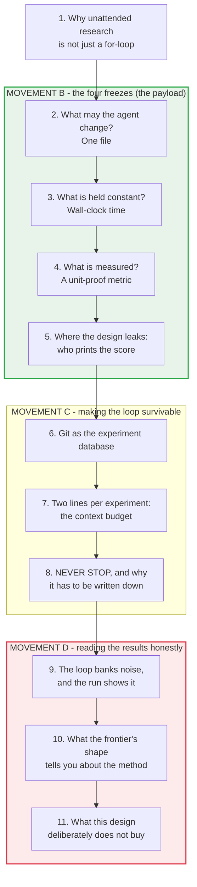
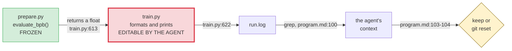
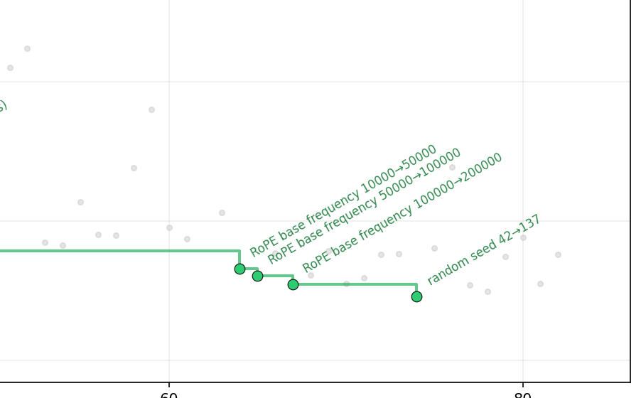
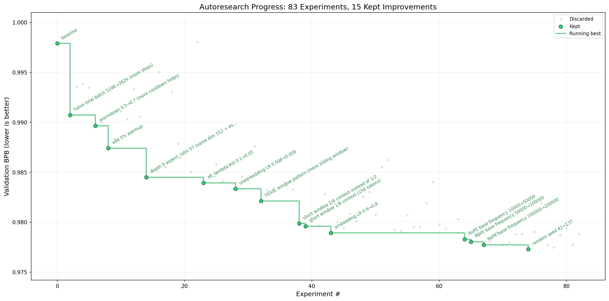
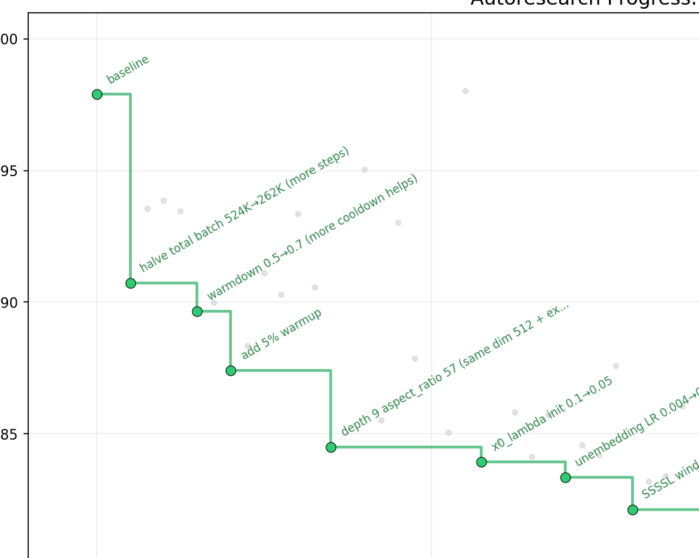
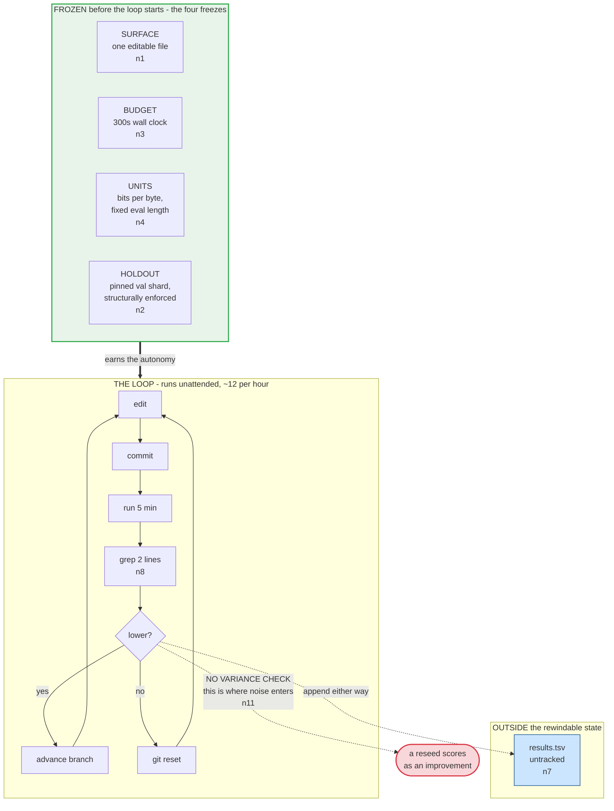

# Learning - autoresearch: how to bound an agent that researches while you sleep

> Persona: **code-explorer + mentor** - re-adopt when working this file.
> Written for a senior engineer who is new to autonomous research loops. Every claim carries a node
> ID (`n5`, `d2`) from [`nodes.md`](nodes.md). Blocks marked **Background, supplied** are mine, not
> the source's, and are uncited by construction.

## TL;DR

`karpathy/autoresearch` gives a coding agent one editable Python file, five minutes of GPU time per
experiment, one protected metric, and an instruction never to stop; overnight it runs about a
hundred experiments and keeps the ones that improve the number. The interesting object is not the
language-model training code - it is the **containment design**, which is ten files, no framework,
and no agent code at all. What the repo actually teaches is which four things you must freeze before
an agent can be trusted to change everything else: **the editable surface, the resource budget, the
metric's units, and the holdout** (`n1`-`n4`). It also teaches, unusually honestly, where that design
leaks: the protected score is printed by the file the agent rewrites (`n5`), and the accept rule is a
bare comparison with no notion of run-to-run variance - which is why the fifteenth and final
"improvement" in the author's own published run is **a change of random seed** (`n11`). Read it as a
worked example of building an unattended optimizer, and read the results chart as a warning about
what such a loop will confidently bank.

## The 1-minute version

| | |
|---|---|
| **The problem** | You want an agent to do real experimental work unattended for hours. Unattended means no one is checking whether each result is meaningful, so every guarantee has to be built into the setup before the loop starts. |
| **Why the obvious answer fails** | "Let the agent edit the code and keep what scores better" collapses immediately: if the agent can change model size, batch size and architecture, two runs are not comparable; if it can change the code, it can change the scorer; and if it runs a hundred times, the loop needs to survive on a couple of hundred tokens per iteration, not a training log. |
| **The idea** | Freeze four things and let everything else move. One editable file (`train.py`); a fixed **wall-clock** budget rather than fixed steps or tokens; a **byte-normalised** metric evaluated at a fixed sequence length; and a validation shard pinned inside the read-only file (`n1`-`n4`). |
| **How it works** | `program.md` - 115 lines of markdown, edited by the human - is the entire research organisation: setup ritual, the rules, the ledger schema, and a nine-step `LOOP FOREVER`. Git is the experiment database: branch per run, commit per experiment, `git reset` as discard (`n6`). The ledger sits **outside** git because the loop rewinds the tree (`n7`). Each 5-minute run is compressed to roughly two grepped lines before it re-enters the agent's context (`n8`). |
| **What it costs** | The freeze is a **declaration, not an enforcement** - no sandbox, no checksum (`n1`). The protected metric is printed by editable code (`n5`). Results are not comparable across machines, which the author states plainly. And the accept rule has no variance handling, so the loop banks noise (`n11`, `n12`). |
| **How far to trust it** | The mechanism is fully inspectable and the docs-versus-code check passes almost everywhere, so **the design is trustworthy**. The **results are one unreproducible PNG** from one author on one H100, with the underlying ledger untracked by design (`n12`, `n14`). Trust the shape; do not cite the numbers. |

## Key claims

- **The editable surface is exactly one file, and everything defining the experiment is read-only - as a declaration, not an enforced boundary.** No sandbox, import hook or checksum exists; the separation lives in a banner comment and a markdown instruction (`n1`).
- **The held-constant resource is wall-clock time, not steps or tokens** - 300 seconds, with the first 10 steps excluded so compilation is not billed to the budget. This is what makes an architecture change comparable to a learning-rate change (`n3`).
- **The metric is engineered to be invariant to what the agent may change**: bits-per-byte normalises by bytes rather than tokens, and evaluation always runs at the fixed sequence length whatever the model trained at (`n4`).
- **Train/validation separation is the one rule the agent structurally cannot break**, because the pinned validation shard is excluded from both the tokenizer corpus and the training dataloader inside the read-only file (`n2`).
- **The protected metric reaches the scoreboard through agent-editable code.** `evaluate_bpb` is frozen; the file that calls it, formats it and prints it is the file the agent rewrites, and the agent's score is read from that print (`n5`).
- **Version control is a sufficient experiment database for a single-agent loop** - branch per run, commit per experiment, `git reset` as discard - and the ledger must live outside the tree, because the loop rewinds it (`n6`, `n7`).
- **The per-iteration context budget is a first-class design parameter**, engineered down to about two lines by three separate mechanisms (`n8`).
- **A bare improve-or-regress accept rule will bank noise, and the source's own run proves it**: the last of 15 kept improvements is a change of random seed (`n11`). That result also gives a rough noise floor which at least three other accepted changes sit at or below (`n12`, needs-check - read off a chart).
- **Yield is low and front-loaded**: 83 experiments, 15 keeps (~18%), most of the gain in the first eight, then a plateau of ~22 experiments with nothing (`n14`, needs-check).
- **The human writes the loop and the agent writes the code.** The author states the inversion as the point, and calls `program.md` "essentially a super lightweight 'skill'" (`n16`).

## What you will learn, and in what order

**How to read it:** top to bottom is reading order; the boxes are the numbered sections below,
grouped into four movements. Green marks the movement carrying the core technique. Red marks the
movement that undercuts it.

**The crux: sections 2 to 5 are the reusable design, and section 9 is the reason to stay sceptical
of anything it produces.**

**Why it is shaped this way:** the four freezes are derived rather than listed - each one exists
because of a question the previous one leaves open - so skimming them out of order costs you the
derivation, which is the transferable part. Movement C is the most skimmable if you have built
unattended jobs before; §7 is the exception, because the resource it protects is not one that
batch-job experience teaches you to think about. **If you read only two sections, read §5 and §9**:
they are the two places where a design that looks airtight is not, and both were found by reading
the source's own code and figure against its own prose.

*Generated from the structure of this note - a diagram the repo does not contain.*

---

## 1. Why "let an agent do research overnight" is not just a for-loop

Start with the pitch, because it is genuinely simple. You have a training script. An agent edits it,
runs it, looks at the score, keeps the edit if the score improved, and repeats. Five minutes per
experiment means about twelve an hour, so a night's sleep buys you a hundred
([`README.md:64`](https://github.com/karpathy/autoresearch/blob/228791fb499afffb54b46200aca536f79142f117/README.md#L64),
`n14`). You wake up to a log of experiments and a better model.

Every part of that sentence hides a problem, and they are not ML problems - they are systems
problems, and they are the reason this repo is worth reading even if you will never train a model.

**First, comparability.** The agent is allowed to change the model's size and shape. A bigger model
takes longer per step. So if you give each experiment a fixed number of steps, you have secretly made
"use a smaller model" a winning strategy, because a smaller model gets through more data. Whatever
you hold constant *becomes the rules of the game*, and the agent will play the rules you actually
wrote rather than the ones you meant.

**Second, honesty.** Nobody is watching. The agent is editing code, running it, and reading its own
result. In a normal review loop a human sits between "I got a good number" and "the number goes in
the record". Here nothing does.

**Third, endurance.** A hundred iterations is a long time for an agent to stay coherent, and the
default behaviour of every well-trained coding assistant is to stop and check in. That default is
correct nearly everywhere and fatal here.

The repository's answer to all three fits in ten files with no framework and, notably, **no agent
code whatsoever** - the agent is whatever coding harness you point at `program.md`
([`README.md:44`](https://github.com/karpathy/autoresearch/blob/228791fb499afffb54b46200aca536f79142f117/README.md#L44), `n16`).

One thing to hold onto before we start. The author ran this himself and published the result: 83
experiments, 15 kept improvements. **The fifteenth and last one is the most instructive thing in the
repository, and we will not look at it until §9.** For now, just note that it exists, and that it
survived a design built specifically to prevent bad results from surviving.

So: if the agent may change almost anything, the first question is what "almost" means.

---

## 2. The first freeze: what may the agent change?

One file. `train.py`. Everything in it is fair game - architecture, optimizer, hyperparameters,
batch size, model size - and nothing outside it may be touched
([`program.md:25-31`](https://github.com/karpathy/autoresearch/blob/228791fb499afffb54b46200aca536f79142f117/program.md#L25-L31), `n1`).

Two design choices are worth separating here, because they are usually conflated.

**The scope choice** is that the editable surface is a single file, stated as keeping "the scope
manageable and diffs reviewable"
([`README.md:63`](https://github.com/karpathy/autoresearch/blob/228791fb499afffb54b46200aca536f79142f117/README.md#L63)).
There is a second consequence the source does not name, and it is the one I find more interesting:
`train.py` has **no `main()` and no CLI**. Hyperparameters are module-level constants at
[`train.py:432-451`](https://github.com/karpathy/autoresearch/blob/228791fb499afffb54b46200aca536f79142f117/train.py#L432-L451),
edited in place. That means an experiment is not a command line - **an experiment is a diff**. Which
in turn is what makes the next three sections possible, because a diff is something git can keep or
throw away. *(That reading is mine; the source states the reviewability benefit and stops there.)*

**The enforcement choice** is the one to be clear-eyed about: there isn't one. The read-only status
of `prepare.py` is a banner comment
([`prepare.py:26-32`](https://github.com/karpathy/autoresearch/blob/228791fb499afffb54b46200aca536f79142f117/prepare.py#L26-L32))
and a line of markdown. There is no sandbox, no import hook, no checksum, no file-permission bit
(`n1`). The agent is told to run with "all permissions disabled"
([`README.md:44`](https://github.com/karpathy/autoresearch/blob/228791fb499afffb54b46200aca536f79142f117/README.md#L44)),
meaning *the agent's own confirmation prompts* are off - which removes the last human checkpoint
rather than adding a guard.

This is worth sitting with rather than filing as a flaw. The boundary is real in the sense that
matters for this project - a non-adversarial agent following its instructions will respect it - and
building an enforced version would have cost a container, a syscall filter or a git hook, none of
which the repo has room for. **The lesson is not "add a sandbox". It is that you should know which
of your invariants are enforced and which are merely written down**, because under this design they
look identical in the source tree. We will find one place where the difference matters in §5.

There is exactly one invariant here that is *structurally* protected rather than declared, and it is
the most important one. One data shard is pinned as validation and excluded both from the tokenizer's
training corpus and from the training dataloader, inside the read-only file
([`prepare.py:42-44`](https://github.com/karpathy/autoresearch/blob/228791fb499afffb54b46200aca536f79142f117/prepare.py#L42-L44),
[`prepare.py:259-263`](https://github.com/karpathy/autoresearch/blob/228791fb499afffb54b46200aca536f79142f117/prepare.py#L259-L263), `n2`).
The agent cannot train on its own test set without editing a file it has been told not to edit - so
the single most damaging way to cheat this benchmark requires an unmistakable, greppable violation
rather than a subtle one.

Now the residual question. The agent can change the model's size, its shape, and how much data it
sees per step. Two experiments are therefore not naturally comparable at all. What do you hold
constant so that they are?

---

## 3. The second freeze: hold time constant, not work

Every run trains for exactly five minutes
([`prepare.py:31`](https://github.com/karpathy/autoresearch/blob/228791fb499afffb54b46200aca536f79142f117/prepare.py#L31),
[`train.py:603-604`](https://github.com/karpathy/autoresearch/blob/228791fb499afffb54b46200aca536f79142f117/train.py#L603-L604), `n3`).
Not a fixed number of steps, not a fixed number of tokens. Wall clock.

Work through the alternatives and the choice stops looking arbitrary:

| Hold constant | What the agent learns to do |
|---|---|
| **Steps** | Shrink the model. Smaller model, same number of steps, more data seen per unit of your patience. The comparison silently becomes "which model is small". |
| **Tokens** | Ignore efficiency entirely. A model half as fast per token is not penalised, so kernel-level and memory-layout improvements score zero. |
| **Wall-clock time** | Everything competes on the same axis: a faster kernel, a better optimizer, a smaller model and a longer schedule are all just different ways to spend 300 seconds. |

The third row is the design. And notice what it buys that the first two cannot: **efficiency becomes
part of the objective without being part of the metric.** The agent never optimises throughput
directly, but a change that makes each step 10% faster shows up as more steps in the same budget,
which shows up as a better score. That is a genuinely elegant piece of incentive design, and it is
the reason several of the author's kept improvements are about *shape* rather than *learning* - the
"short window 1/4 context" and "1/8 context" wins in §10 are attention-cost reductions that buy more
steps.

The accounting is careful in a way that corroborates the claim rather than just asserting it. The
README promises the budget excludes startup and compilation
([`README.md:17`](https://github.com/karpathy/autoresearch/blob/228791fb499afffb54b46200aca536f79142f117/README.md#L17)),
and the loop delivers it: `if step > 10: total_training_time += dt`
([`train.py:578-579`](https://github.com/karpathy/autoresearch/blob/228791fb499afffb54b46200aca536f79142f117/train.py#L578-L579)).
The first ten steps, where `torch.compile` is still warming up, are run but not billed. This is the
docs-versus-code gate passing on the detail that would have been easiest to fudge (`n3`).

> **Background, supplied.** Skip this if you have run GPU training jobs. The first few steps of a
> PyTorch training run are much slower than the rest, because compilation and kernel autotuning
> happen on first execution. If you time a short run naively, that startup cost dominates and swamps
> the thing you are trying to measure. Excluding a fixed number of warmup steps is the standard fix,
> and "how many to exclude" is a judgement call - here, ten.

The honest cost is stated by the author and worth repeating because it bites anyone who wants to
compare notes with a colleague: results are **not comparable across compute platforms**
([`README.md:64`](https://github.com/karpathy/autoresearch/blob/228791fb499afffb54b46200aca536f79142f117/README.md#L64)).
Your five minutes on an H100 and someone else's five minutes on a 4090 are different amounts of
work, so the numbers do not travel. The trade the author names is that in exchange, the loop finds
the best model *for your hardware*, which is the more useful thing to know if you are actually
running it.

With time fixed, each experiment produces exactly one output: a score. Which raises the question
that fills the rest of Movement B - what makes a score comparable when the thing producing it is
being rewritten?

---

## 4. The third freeze: a metric that survives the agent changing everything

The metric is `val_bpb` - validation bits per byte, lower is better
([`README.md:17`](https://github.com/karpathy/autoresearch/blob/228791fb499afffb54b46200aca536f79142f117/README.md#L17), `n4`).

> **Background, supplied.** Skip if you know why loss is not comparable across tokenizers. A
> language model is scored by how surprised it is by text it has not seen. The natural unit is
> per-token: average how much probability mass the model failed to put on each correct next token.
> The problem is that "a token" is not a fixed quantity - it is whatever the tokenizer decided, so
> a model with a bigger vocabulary packs more text into each token and gets a flattering per-token
> score for free. **Bits per byte fixes the denominator to something physical**: divide the total
> surprise by the number of *bytes* of text, and the number means the same thing regardless of how
> the text was chopped up. It is the standard defence against comparing models across tokenizers.

The implementation makes three separate moves, and each one closes a specific hole:

1. **Normalise by bytes, not tokens**, with special tokens contributing zero bytes and excluded from
   both sums
   ([`prepare.py:343-365`](https://github.com/karpathy/autoresearch/blob/228791fb499afffb54b46200aca536f79142f117/prepare.py#L343-L365)).
   Changing the vocabulary cannot move the score by itself.
2. **Always evaluate at the fixed `MAX_SEQ_LEN`**, whatever length the model trained at - the
   docstring says exactly why: "so results are comparable across configs"
   ([`prepare.py:350`](https://github.com/karpathy/autoresearch/blob/228791fb499afffb54b46200aca536f79142f117/prepare.py#L350)).
   A model trained on short sequences does not get an easier exam.
3. **Pin the holdout in read-only code** (`n2`, from §2).

Put together, these are anti-Goodhart engineering, and the thing to take away is *where the work
happens*.

> **Background, supplied.** Goodhart's law: when a measure becomes a target, it stops being a good
> measure. The usual framing is about incentives and people. The version that matters for agent
> loops is mechanical: any degree of freedom that changes the *units* of your metric is a way to
> improve the number without improving the thing, and an optimizer will find it without any
> intention to cheat.

**You do not defend against this in the prompt. You defend against it in the code layout.** None of
the three moves above is an instruction to the agent; all three are properties of a file the agent
has been told not to open. That is the transferable pattern, and it generalises well past ML: if you
are pointing an agent at a scored artifact, the score's definition, its input data, and its units
belong in a module the agent has no reason to import and every reason to leave alone.

Which is a nice principle, and it has a hole in it. The metric's *computation* is protected. Hold
onto the question of whether its *reporting* is - we settle it in the next section, and it is the
one place where §2's distinction between an enforced invariant and a written-down one does real
damage.

Before that, one small crack found by reading the code against its own docstring, recorded because
the principle matters even though the magnitude does not. `evaluate_bpb` computes its number of
evaluation steps by integer division: `steps = EVAL_TOKENS // (batch_size * MAX_SEQ_LEN)`
([`prepare.py:354`](https://github.com/karpathy/autoresearch/blob/228791fb499afffb54b46200aca536f79142f117/prepare.py#L354)),
and it is called with `DEVICE_BATCH_SIZE` - an **agent-editable** constant
([`train.py:613`](https://github.com/karpathy/autoresearch/blob/228791fb499afffb54b46200aca536f79142f117/train.py#L613)).
At the default 128 the division is exact. At 96 it truncates, and the model is evaluated on 0.6%
fewer tokens (`d2`). So the size of the exam moves slightly with a knob the agent tunes for unrelated
reasons, against a docstring that promises comparability across configs. It is far too small to
explain anything in §9 - but it is a reminder that "fixed" is a property you have to check hop by
hop, not a property you declare at the top of a file.

---

## 5. Where the design leaks: the producer prints its own grade

Here is the trace, and it is four lines of code (`n5`):

**How to read it:** left to right is the journey of a single number, from the function that computes
it to the decision it drives. Green is frozen, red is agent-editable, amber is the decision.

**The crux: exactly one hop in this chain is protected, and it is not the hop that decides anything.**

**Why it is shaped this way:** it is not a deliberate shape - it is what you get when the metric
lives in the frozen module and the *program* lives in the editable one, which is the natural
factoring and the one almost everybody would choose. `evaluate_bpb` is imported at
[`train.py:26`](https://github.com/karpathy/autoresearch/blob/228791fb499afffb54b46200aca536f79142f117/train.py#L26),
called at [`train.py:613`](https://github.com/karpathy/autoresearch/blob/228791fb499afffb54b46200aca536f79142f117/train.py#L613),
and its result is printed by an f-string at
[`train.py:622`](https://github.com/karpathy/autoresearch/blob/228791fb499afffb54b46200aca536f79142f117/train.py#L622)
- inside the file the agent rewrites every iteration. The agent then reads its own score by grepping
that print
([`program.md:100`](https://github.com/karpathy/autoresearch/blob/228791fb499afffb54b46200aca536f79142f117/program.md#L100)).
Nothing anywhere compares the number in `run.log` to what `evaluate_bpb` returned. **The design is
safe because the agent is not trying to win, not because the topology stops it.**

*Generated from `train.py:26`, `train.py:613`, `train.py:621-630`, `program.md:100-104` @ `228791f`.*

I want to be careful about what this is and is not, because it is easy to over-read.

It is **not** an accusation. There is no evidence anywhere in this repo of an agent gaming the
metric, the design is explicitly a "bare bones baseline"
([`README.md:7`](https://github.com/karpathy/autoresearch/blob/228791fb499afffb54b46200aca536f79142f117/README.md#L7)),
and reward hacking is not a thing a well-behaved coding agent does spontaneously in a five-minute
training script.

It **is** a structural observation that this brain already holds in a stronger form from a
completely different direction. Claim 34 - from Anthropic's own harness-design work - is that you
should not let the producer grade its own work, because a generator has no independent vantage point
on itself. That claim was derived from long-horizon code generation. Here it appears as a *plumbing*
fact rather than a prompting one, which is the more useful version: you can obey "separate the
generator from the evaluator" perfectly at the level of functions and still have the evaluator's
output pass through the generator's hands on the way to the decision.

The fix, for anyone building this, is boring and cheap, and its cheapness is the point: have the
frozen module write the score itself - to a file the editable code does not name - and have the loop
read *that*. One extra `open()` in `prepare.py`, and the chain has no red box in it. *(That is my
suggestion, not the source's; the source does not raise the issue.)*

Note also what §2 predicted and this section pays off: `prepare.py` being read-only is a
**declaration**, and here it turns out that even a perfectly honoured declaration does not protect
the thing you assumed it protected. The invariant "the score is computed by frozen code" holds. The
invariant you actually wanted - "the score the loop acts on is the score that was computed" - was
never stated and is not enforced.

That is the last of the freezes. The experiment is now bounded and scored. Where does the *result*
live?

---

## 6. Git is the experiment database

There is no experiment tracker. No database, no MLflow, no run registry. The mechanism is
([`program.md:96-104`](https://github.com/karpathy/autoresearch/blob/228791fb499afffb54b46200aca536f79142f117/program.md#L96-L104), `n6`):

- **a branch per run** - `autoresearch/<tag>`, which must not already exist, so a run is a fresh
  namespace ([`program.md:9-10`](https://github.com/karpathy/autoresearch/blob/228791fb499afffb54b46200aca536f79142f117/program.md#L9-L10));
- **a commit per experiment**, made *before* the run, so the code that produced a number is captured
  whatever happens next;
- **`git reset` as the discard operation** - a rejected experiment does not get reverted or branched
  around, it is erased from the tree;
- **the branch tip as the current best**, so every subsequent experiment is implicitly measured
  against the best-so-far rather than against the original baseline.

This is more than a cost-saving. Recall from §2 that an experiment is a diff, because the
hyperparameters are module constants rather than CLI flags. Given that, git is not a substitute for
an experiment tracker - it is exactly the right data structure, because the thing being tracked *is*
a sequence of diffs and the operation you need most is "undo the last one". **The commit history of
the branch is a readable record of the search**, which is also what makes the whole thing reviewable
by a human in the morning.

Then there is the detail I find the sharpest small idea in the repository. The ledger - `results.tsv`,
one row per experiment - is explicitly **not** to be committed: "leave it untracked by git"
([`program.md:102`](https://github.com/karpathy/autoresearch/blob/228791fb499afffb54b46200aca536f79142f117/program.md#L102), `n7`).

The source gives no reason. The reason is forced by the design, and it is worth deriving rather than
being told: **discard is `git reset`, so anything tracked by git is inside the thing that gets
rewound.** A committed ledger would lose the row describing the very experiment that just failed,
which is the row you most want to keep - the whole point of a research log is to record what did
*not* work. So the log of the search has to live outside the state the search rewinds. *(The
instruction is the source's; this derivation is mine - `n7` records the split.)*

That is a general shape, and it is the kind of thing that only shows up when you build one of these:
**in any loop whose failure mode is rollback, the audit trail must not be rollback-able.** It shows
up in this brain's own conventions, where `sources/<id>/` is the working state and `brain/log.md` is
append-only.

The corroborating evidence is quiet but real: there is no `results.tsv` at the pinned commit, while
`analysis.ipynb` opens one from the working directory. The analysis tooling ships; the data does
not, by design (`n7`). Note the price, which we will pay in §9 - **the author's published results
cannot be reproduced from this repository**, because the ledger behind the chart was never in it.

The experiment is bounded, scored and recorded. Can the loop actually run a hundred times?

---

## 7. Two lines per experiment: the resource nobody budgets for

A five-minute training run produces a lot of text. A hundred of them produce a lot more. The scarce
resource in this system is **not** the GPU - the GPU is busy exactly 300 seconds per iteration
whatever happens. It is the agent's context window, and this repo treats it as a budget line with
three separate mechanisms all pointing the same way (`n8`):

1. **The training log is one line.** Progress is printed with a carriage return and no newline, so
   the entire run collapses to a single rewritten line rather than one line per step
   ([`train.py:590`](https://github.com/karpathy/autoresearch/blob/228791fb499afffb54b46200aca536f79142f117/train.py#L590)).
2. **The agent is forbidden from streaming it.** "redirect everything - do NOT use tee or let output
   flood your context"
   ([`program.md:99`](https://github.com/karpathy/autoresearch/blob/228791fb499afffb54b46200aca536f79142f117/program.md#L99)).
   Note that this is an instruction against a *convenience*: `tee` is what you would naturally reach
   for to watch a job while capturing it.
3. **The result is grepped, not read.** `grep "^val_bpb:\|^peak_vram_mb:" run.log`
   ([`program.md:100`](https://github.com/karpathy/autoresearch/blob/228791fb499afffb54b46200aca536f79142f117/program.md#L100)) -
   two lines. The full log is opened only on failure, and only its last fifty lines
   ([`program.md:101`](https://github.com/karpathy/autoresearch/blob/228791fb499afffb54b46200aca536f79142f117/program.md#L101)).

The design that makes this work is the summary block at
[`train.py:621-630`](https://github.com/karpathy/autoresearch/blob/228791fb499afffb54b46200aca536f79142f117/train.py#L621-L630):
nine `key: value` lines, one per line, stable prefixes. It exists to be grepped. The artifact under
optimization has been given a **machine-readable reporting interface** so that the agent driving it
never has to parse prose.

Two things follow that are worth carrying to any long-running agent loop.

**The cost is per-iteration and therefore multiplied.** An extra 500 tokens of log per experiment is
50,000 tokens across a night's run - and unlike a one-off cost, it competes directly with the thing
you actually want in context, which is the history of what has already been tried. This brain already
holds the general claim (limiting context beats filling it, claim 22, measured externally); what
autoresearch adds is that in a loop the multiplier is the iteration count, so the per-iteration
figure is the number to design against.

**Empty output is the error signal.** Step 6 of the loop is "if the grep output is empty, the run
crashed"
([`program.md:101`](https://github.com/karpathy/autoresearch/blob/228791fb499afffb54b46200aca536f79142f117/program.md#L101)).
There is no exit-code check and no structured error. The absence of the expected line *is* the
exception handler, which costs zero tokens in the common case. Paired with it, the artifact
fails fast rather than burning budget: a run whose loss goes NaN or above 100 kills itself
immediately
([`train.py:570-572`](https://github.com/karpathy/autoresearch/blob/228791fb499afffb54b46200aca536f79142f117/train.py#L570-L572), `n17`),
and the agent applies a wall-clock kill at ten minutes for anything that hangs
([`program.md:108`](https://github.com/karpathy/autoresearch/blob/228791fb499afffb54b46200aca536f79142f117/program.md#L108)).

The loop can now run a hundred times cheaply. Will it?

---

## 8. NEVER STOP, and why it has to be written down

This is the instruction, in capitals in the original
([`program.md:112`](https://github.com/karpathy/autoresearch/blob/228791fb499afffb54b46200aca536f79142f117/program.md#L112), `n9`):

> **NEVER STOP**: Once the experiment loop has begun (after the initial setup), do NOT pause to ask
> the human if you should continue. Do NOT ask "should I keep going?" or "is this a good stopping
> point?". The human might be asleep, or gone from a computer and expects you to continue working
> *indefinitely* until you are manually stopped.

Before reading on, notice what kind of instruction this is. It is not a capability being added. It
is a **default being suppressed** - and specifically the default that most agent-design guidance,
including several sources in this brain, works hard to install. Checking in with a human at
decision points is normally the good behaviour.

So why is it wrong here, and what makes this a legitimate exception rather than a reckless one? Two
properties of this particular loop, and both are worth using as the test for your own:

- **The check-in has no information to offer.** The decision at each iteration is a scalar
  comparison against a protected metric (§5). A human woken at 3am to be asked "val_bpb went from
  0.9834 to 0.9821, keep it?" adds nothing the rule does not already encode. Contrast a loop where
  the accept decision is a judgement call - there, stopping to ask is the whole value.
- **The blast radius is a branch.** The worst outcome of a hundred bad experiments is a branch you
  delete, on a machine you own, with a pinned holdout the loop cannot touch (`n2`). Nothing is
  deployed, nothing is sent, nothing is irreversible. **The freezes in Movement B are what earn the
  autonomy in this section** - which is the real relationship between the two, and the reason
  "disable all permissions"
  ([`README.md:44`](https://github.com/karpathy/autoresearch/blob/228791fb499afffb54b46200aca536f79142f117/README.md#L44))
  is a defensible instruction here and would be an alarming one almost anywhere else.

There is a second half to the instruction that is easy to skim past and is doing real work: what to
do when the agent runs out of ideas. "think harder, read papers referenced in the code, re-read the
in-scope files for new angles, try combining previous near-misses, try more radical architectural
changes"
([`program.md:112`](https://github.com/karpathy/autoresearch/blob/228791fb499afffb54b46200aca536f79142f117/program.md#L112)).
That is an **idea-generation fallback ladder**, and it exists because "never stop" without it
degrades into an agent re-trying variations of its last success. We will see in §10 that this is
precisely what the published run looks like for about twenty experiments in the middle. Whether the
ladder helped is not something this source can tell us - the reasoning behind each experiment was
never recorded (`g1`).

The loop now runs all night and comes back with fifteen improvements. Are they real?

---

## 9. The loop banks noise, and the author's own run shows it

*`visuals/progress_endgame.png` - the right-hand end of the author's 83-experiment run, cropped from
the repo's `progress.png`. Green dots are kept improvements, grey dots discarded experiments, the
green step line is the running best. Absolute bpb values are cropped out here; see
`visuals/progress_full.png`. **What it teaches:** the last accepted improvement of the entire run is
labelled `random seed 42->137`. **Corroborated by** the accept rule at
[`program.md:103-104`](https://github.com/karpathy/autoresearch/blob/228791fb499afffb54b46200aca536f79142f117/program.md#L103-L104),
which keeps any change that lowers val_bpb (`n11`).*

Sit with that annotation for a moment. The agent changed the random seed from 42 to 137, the
validation score came out lower, and the loop did what it was told: kept it, committed it, advanced
the branch.

> **Background, supplied.** Skip if you train models. Neural network training is stochastic. The
> random seed controls weight initialisation and data ordering, so running the *identical*
> configuration twice with different seeds gives two different final scores. The spread between them
> is run-to-run variance, and it is a property of the setup, not of any change you made. In careful
> empirical work this is why results are reported over several seeds with an error bar; a single-seed
> comparison cannot distinguish a small real effect from the setup's own jitter.

The accept rule is a bare comparison: "If val_bpb improved (lower), you advance the branch. If
val_bpb is equal or worse, you git reset back"
([`program.md:103-104`](https://github.com/karpathy/autoresearch/blob/228791fb499afffb54b46200aca536f79142f117/program.md#L103-L104)).
**There is no repetition, no seed averaging, no threshold and no error bar anywhere in the design**
(`n11`). Given that, keeping a reseed is not a bug in the agent's judgement - it is the rule
executing exactly as written on an input the rule has no way to recognise.

And here is why it is the most valuable single result in the repository, rather than a funny
footnote. **That experiment accidentally measured the loop's own noise floor.** Reseeding changes
nothing real, so whatever improvement it produced is a lower bound on how much this setup's score
moves for no reason at all. Reading the chart, it bought roughly 0.0005 bpb (`n12`).

Now look back along the same crop at the three steps immediately before it - RoPE base frequency
10000 to 50000, then to 100000, then to 200000 - and at "short window 1/8 context" earlier in the
run. Read off the axis, those accepted improvements are in the range of roughly 0.0002 to 0.0003
(`n12`).

> **Label this evidence honestly, because it is the weakest link in an otherwise well-supported
> note.** These deltas are **read off a rendered PNG by eye**, at a scale where 0.0002 is about a
> pixel. The underlying `results.tsv` is untracked by design (`n7`) and is not in the repo, so they
> cannot be checked. And the noise floor itself is **a single seed change, n=1** - a proper estimate
> needs several reruns of an identical config. `n12` is gated `single-leg / needs-check` for exactly
> these reasons.

With that caveat fully in view, the qualitative conclusion still stands and does not depend on the
precise numbers: **the run contains at least one accepted change that is definitionally noise, and
several accepted changes of comparable or smaller magnitude.** Which means the branch tip at the end
of the night is not "baseline plus fifteen improvements". It is baseline plus some real improvements
plus an unknown number of coin flips that landed heads, and **nothing in the design can tell you
which are which**.

The consequence compounds, which is the part that would worry me if I were running this for
anything that mattered. Every accepted change permanently moves the baseline that all later
experiments are measured against (§6). Nothing ever re-tests a kept change (`g3`). So a lucky reseed
does not just add a spurious entry to the log - it **raises the bar for every subsequent real
improvement**, because later experiments must now beat a number that was partly luck. A run can
therefore reject genuine wins because a coin flip forty experiments ago set the bar too high.

None of this is hidden by the author, and the framing of the repo as "intentionally kept as a bare
bones baseline"
([`README.md:7`](https://github.com/karpathy/autoresearch/blob/228791fb499afffb54b46200aca536f79142f117/README.md#L7))
covers it. But the plot is the project's teaser image, and the seed annotation is right there in it
- which I read as the author leaving the evidence in plain view rather than tidying it away.

**The transferable lesson is not "add error bars".** It is that an autonomous accept/reject loop
inherits the statistical properties of its metric whether or not you thought about them, and that
the cheapest possible probe - run the same config twice - tells you the size of the effect you are
allowed to believe in. If you build one of these, the noise floor is the first thing to measure and
the last thing you will think to.

That is the accept rule. What about the search it drives?

---

## 10. What the frontier's shape tells you about the method

*`visuals/progress_full.png` - the complete figure shipped as the repo's teaser. X axis is experiment
number, Y is validation bpb, lower is better. **What it teaches:** the whole search in one view - 83
experiments, 15 kept, a steep early descent, a long plateau, and a final cluster. **Corroborated by**
the chart title and by the loop rule that only accepted experiments advance the running-best line
([`program.md:103-104`](https://github.com/karpathy/autoresearch/blob/228791fb499afffb54b46200aca536f79142f117/program.md#L103-L104))
(`n13`, `n14`).*

Four things are legible in that curve, and each says something about the method rather than about
language models.

**Yield is low, and that is fine.** 15 keeps in 83 experiments is roughly an 18% hit rate (`n14`).
For a human researcher that would be a demoralising week. For a loop that costs five minutes an
experiment and runs while you sleep, an 82% discard rate is simply the price of the search, and it is
the clearest argument for automating this particular activity at all: **the loop's advantage is not
that it is smarter, it is that it is indifferent to rejection.**

**The gains are front-loaded.**

*`visuals/progress_early.png` - the left end of the same figure, showing the first ~10 experiments at
readable scale. **What it teaches:** four of the fifteen kept improvements land in the first eight
experiments, and the first one alone (`halve total batch 524K->262K`) is a bigger drop than the whole
rest of the run's final third. **Corroborated by** the baseline-first mandate at
[`program.md:39`](https://github.com/karpathy/autoresearch/blob/228791fb499afffb54b46200aca536f79142f117/program.md#L39),
which is why experiment #0 is the annotated `baseline` point (`n18`, `n14`).*

Note what those early wins are: batch size, warmdown ratio, warmup, depth. These are **schedule and
sizing knobs**, and the reason they pay so well is §3 - because the budget is wall-clock, "halve the
batch size" means "take twice as many optimizer steps in the same 300 seconds", which is a real
change in how the budget is spent. The design's central choice is visible directly in the shape of
its results.

**The search is greedy coordinate descent, and nothing else was available to it.** Look again at the
endgame crop in §9: three consecutive kept experiments walk one hyperparameter monotonically -
RoPE base frequency 10000, 50000, 100000, 200000 - one experiment per step (`n13`). That is a 1-D
line search costing three iterations, and it happened because the loop structure permits nothing
else: each experiment is judged against the current branch tip, so the only move available is "change
something from where we are now". **There is no mechanism for evaluating a combination, no way to
explore two directions and compare, and no way to back out of a local optimum** other than the
"rewind, very very sparingly" escape hatch at
[`program.md:106`](https://github.com/karpathy/autoresearch/blob/228791fb499afffb54b46200aca536f79142f117/program.md#L106),
which is given no criterion for when to use it.

> **Background, supplied.** Coordinate descent optimises a multi-dimensional function by improving
> one variable at a time, holding the others fixed. It is simple and needs no gradient, and it works
> well when variables are roughly independent. It stalls where they interact - if two settings are
> only good *together*, no single-variable step reaches them, because each one alone makes things
> worse. That is a local optimum a one-at-a-time search cannot escape.

**The plateau is the interesting failure.** Between roughly experiment 43 and 65 the running-best
line is flat: about 22 consecutive experiments, nearly two hours of wall clock, with nothing
accepted (`n14`). This is exactly the situation §8's fallback ladder was written for, and the run
did eventually escape into the RoPE cluster. But **we cannot tell from this source whether the
ladder caused the escape**, because the loop never records why an experiment was tried - the ledger
has five columns and the richest is a free-text description (`g1`). The reasoning behind 83
experiments was in the agent's context and is gone. For a project whose output is supposed to be
research, that is the most consequential absence in the design, and it is the one I would close
first.

One last thing about this chart, which is a lesson about reading evidence rather than about
research loops. **It is filtered, and the filter is in the notebook that draws it**: crashes are
dropped, and only experiments scoring at or below `baseline + 0.0005` are plotted, while the title
counts all 83 (`n15`, from `analysis.ipynb` cell 5). So the visible grey cloud of near-misses is not
the failure population - it is the *near*-failure population, and the experiments that went badly
wrong are not on the page at all. The chart is honest about what it plots if you read the code that
made it; nobody reading only the image would know.

---

## 11. What this design deliberately does not buy

It is worth ending on scope rather than on a to-do list, because the repo's minimalism is a position
and not an oversight - "the repo is deliberately kept small"
([`README.md:11`](https://github.com/karpathy/autoresearch/blob/228791fb499afffb54b46200aca536f79142f117/README.md#L11)).
Four things are absent, and knowing which absences are principled and which are simply unbuilt is
most of what you need to adapt this shape to your own domain.

| Absent | Principled or unbuilt? | What it would cost |
|---|---|---|
| **Any handling of run-to-run variance** (`n11`, `n12`) | **Unbuilt, and the most consequential.** The accept rule is one comparison against one run. | Cheap and expensive at once: a threshold costs nothing but needs a noise estimate; a proper two-seed confirmation of every candidate **halves the experiment rate**. That trade is the real reason it is absent, and it is a defensible call for a baseline. |
| **A record of reasoning** (`g1`) | **Unbuilt.** Five TSV columns, one of them free text; no hypothesis, no rationale, nothing about what a result ruled out. | Almost nothing to add - a sixth column or an append-only markdown log - which is what makes the absence notable. Without it, the search cannot learn from its own failures across a run, only from its successes, because only successes survive in the branch. |
| **Parallel search** (`g2`) | **Hinted, not designed.** A branch name `autoresearch/mar5-gpu0` appears exactly once ([`program.md:92`](https://github.com/karpathy/autoresearch/blob/228791fb499afffb54b46200aca536f79142f117/program.md#L92)) implying one agent per GPU, with no mechanism anywhere for merging findings between branches. | This is where the git-as-database choice stops being free: two agents hill-climbing independent branches produce two tips that cannot be combined by a merge, because their diffs are edits to the same constants. Parallelism here needs a real design, not more GPUs. |
| **Any check that a kept change is still good** (`g3`) | **Principled, arguably.** Re-testing costs budget that could buy new experiments. | But combined with the noise finding in §9, this is what makes a lucky accept permanent and compounding. A cheap version - re-run the current tip occasionally and watch its score move - would also produce the noise estimate the first row needs, which is a satisfying way for two of these gaps to close each other. |

The deeper point is the one the author makes explicitly and I would underline: the thing you iterate
on is **`program.md`**, not the Python
([`README.md:7`](https://github.com/karpathy/autoresearch/blob/228791fb499afffb54b46200aca536f79142f117/README.md#L7),
`n16`). Every gap in the table above is a markdown edit, not an engineering project. That inversion -
the human writing the loop in prose while the agent writes the code - is what the repo is actually
demonstrating, and it is why 115 lines of markdown is a reasonable place to put a research
organisation.

---

## Diagram (mental model)

**How to read it:** three regions. Green (top) is everything decided before the agent starts and
never changed again. The middle is the repeating loop. Blue (right) is the one piece of state
deliberately kept outside git. The thick arrow is a dependency, the dotted arrows are writes, and the
red node is not a component - it is the failure the design admits.

**The crux: the four freezes are what make unattended autonomy safe, and the accept rule is the one
place the design spends no effort at all.**

**Why it is shaped this way:** the green box is heavy and the loop is light, which is the whole
thesis - **the engineering happens before the loop starts, not inside it**. Once the surface, budget,
units and holdout are fixed, the loop itself is nine steps of shell commands and needs no framework,
which is why this repo has no agent code in it. The blue box hangs outside the loop rather than
inside because the loop's discard operation rewinds the tree (§6). And the red node hangs off the
decision diamond rather than off any component, because the gap is not a missing part - it is a
property of a comparison that has one sample on each side. Compare the shape against §5's leak: both
weaknesses live on the **decision** path rather than the **computation** path, which is where this
design consistently spends the least.

*Synthesized from `n1`-`n11`, `n17` - a diagram the repo does not contain.*

## 💡 Terms

- **`val_bpb` (validation bits per byte)** - a language-model score that divides total prediction
  surprise by the number of *bytes* of text rather than tokens, so models built on different
  tokenizers are comparable. Lower is better.
  ([`prepare.py:343-365`](https://github.com/karpathy/autoresearch/blob/228791fb499afffb54b46200aca536f79142f117/prepare.py#L343-L365))
- **Wall-clock budget** - holding *elapsed time* constant across experiments rather than steps or
  tokens, so that any change - architecture, model size, kernel efficiency - competes on how well it
  spends a fixed slice of time (`n3`).
- **Noise floor** - the amount a metric moves between identical runs for reasons unrelated to any
  change. Any accepted improvement smaller than it is unresolved. Measured for free by re-running one
  configuration with a different random seed (`n12`).
- **Greedy hill climbing / coordinate descent** - a search that accepts any single change improving
  the current best and then continues from there, one variable at a time. Needs no gradient, cannot
  escape a local optimum that requires two changes at once (`n13`).
- **Baseline-first** - mandating that the first experiment of a run is the unmodified code, so every
  later result has a control to be measured against (`n18`,
  [`program.md:39`](https://github.com/karpathy/autoresearch/blob/228791fb499afffb54b46200aca536f79142f117/program.md#L39)).
- **The rollback-safe ledger** - the rule that in a loop whose discard operation is a rollback, the
  audit trail must live outside the rolled-back state. Here: `results.tsv` untracked while the code
  is committed (`n7`). *(Name is this brain's, not the source's.)*

## What to distrust in this note

**Tier and conflict.** This is **T4** - a personal repository from a well-known practitioner, with
nothing being sold and no institutional position to defend. That is the favourable end of T4, and it
is still one person's experiment rather than a study.

**The evidence splits cleanly in two, and the halves deserve very different confidence.**

- **The design claims** (`n1`-`n8`, `n16`-`n18`) are read directly off code you can open, checked
  against the author's own prose, and the docs-versus-code gate passes on every one of them - it even
  passes on the detail easiest to fudge (§3's warmup exclusion). Treat these as solid. The two
  divergences found (`d1`, `d2`) are both minor and are recorded with their magnitudes.
- **The results claims** (`n12`, `n14`, and the deltas in §9-10) rest on **one PNG**. There is no
  data behind it in the repo, because the ledger is untracked by design (`n7`), so **the author's
  published result cannot be reproduced from the repository at all**. Every number I quote from it
  was read off a rendered chart by eye, sometimes at a scale where the quantity of interest is about
  a pixel wide. They are gated `single-leg / needs-check` and should be cited as "roughly" or not at
  all.

**A caveat on the note's most reusable claim.** The noise finding in §9 is the thing most worth
carrying to another project, and it is also the claim whose *quantification* is weakest: the
qualitative fact (a reseed was accepted as one of fifteen improvements) is plainly visible in the
figure and follows necessarily from the stated accept rule, but the size of the noise floor rests on
**n=1** and on my reading of a chart. Carry the mechanism confidently; carry the magnitude not at
all.

**What this brain did not do.** No code here was executed - the repo needs an NVIDIA GPU and the
owner has none - so nothing is a reproduction. The model internals of `train.py` were deliberately
not traced (owner-set scope), so this note says nothing about whether the *research* the loop
produced is any good, only about how the loop is built. And no deep-research pass was run, so
**there is no external evidence in this note whatsoever**; every citation points inside one
repository.

## Open questions

- **What is this setup's actual noise floor?** The cheapest experiment in the repo and nobody has
  published it: run the unmodified baseline five times with different seeds and report the spread.
  It would immediately tell you how many of the 15 kept improvements are real (`n12`).
- **Does a reasoning log change the yield?** Adding a rationale field costs one TSV column (`g1`).
  Whether recording *why* an experiment was tried improves the next 80 experiments is testable and,
  as far as this brain knows, untested.
- **How do you parallelise a git-as-database loop?** Two agents on two GPUs produce two branch tips
  editing the same constants, which do not merge (`g2`). Is there a design that keeps the elegance of
  `git reset` as discard while allowing more than one searcher?
- **Would moving the score-write into the frozen module change any observed behaviour?** §5's leak is
  cheap to close. It is an open question whether it matters empirically with today's coding agents,
  or whether it only matters as a design principle (claim 34).
- **Does the fallback ladder in `program.md:112` actually break plateaus?** The run shows a
  ~22-experiment flat stretch followed by an escape (`n14`); the mechanism of the escape is
  unrecorded.
- **What does this shape look like when the metric is not a scalar?** Everything here works because
  "better" is one number that a frozen function computes. Most research questions worth automating
  do not have that.

## Feeds these topics

- [`brain/topics/autonomous-research-loops.md`](../../brain/topics/autonomous-research-loops.md) -
  the primary destination: the four freezes, the accept rule, git-as-database, the noise finding.
  Created for this source by [ADR-0017](../../brain/decisions/0017-autonomous-research-loops-topic.md),
  which also records why it is not called "research agents".
- [`brain/topics/evals.md`](../../brain/topics/evals.md) - holding a resource constant for
  comparability, metric invariance as a code-layout problem, and the producer-prints-its-own-grade
  leak as a plumbing-level instance of claim 34.
- [`brain/topics/agents.md`](../../brain/topics/agents.md) - autonomy as an explicitly suppressed
  default, the conditions that earn it, and specifying exchange rates when a loop carries two
  objectives.
- [`brain/topics/context-engineering.md`](../../brain/topics/context-engineering.md) - the
  per-iteration context budget, and empty output as a zero-cost error signal.
- [`brain/topics/skills.md`](../../brain/topics/skills.md) - `program.md` as a 115-line markdown
  artifact the author himself calls "a super lightweight skill" (`n16`).
