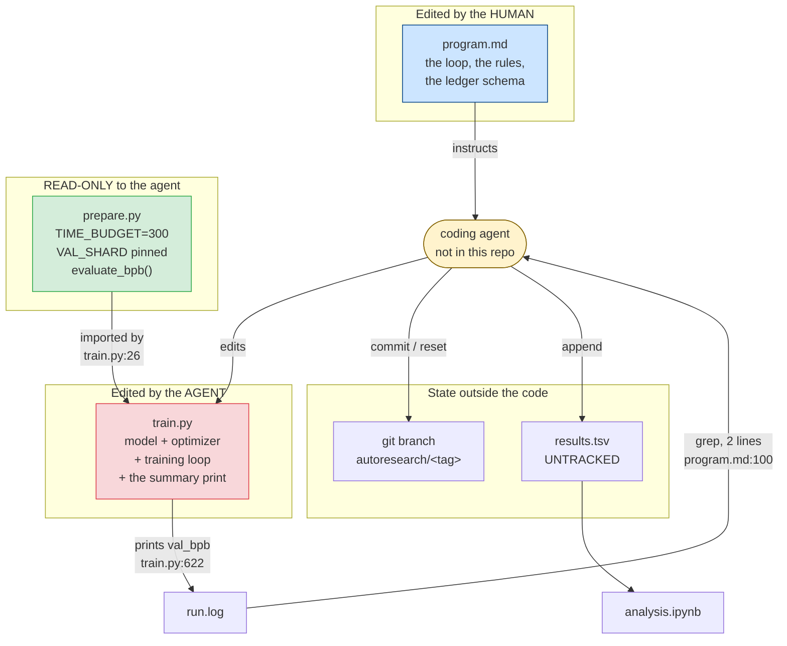
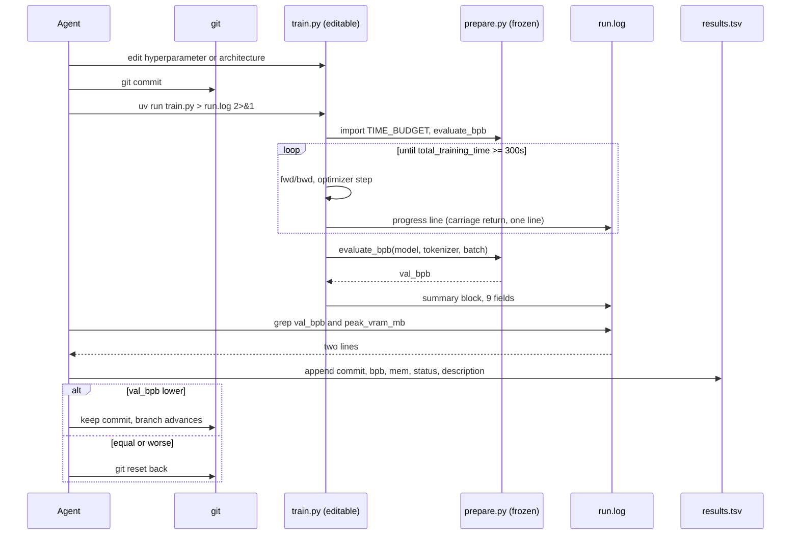

# Map - karpathy/autoresearch

> Persona: **code-explorer** (+ architect when mapping topics) - re-adopt when working this file.

> **Code sources only.** Repo orientation written by the **code-explorer** persona on a fresh
> clone, before deep tracing. The goal is to learn *what this repo demonstrates* and how to
> navigate it - not to read every line. See `SOURCE.md` for metadata (URL, commit SHA, license).

All citations below are to the pinned snapshot
`228791fb499afffb54b46200aca536f79142f117`. Permalink base:
`https://github.com/karpathy/autoresearch/blob/228791fb499afffb54b46200aca536f79142f117/`.

## What this repo demonstrates

**A complete autonomous research loop, specified almost entirely in prose.** An LLM agent is given
one editable file, one protected metric, one fixed resource budget and a hill-climbing accept rule,
then told never to stop; it edits, trains for five minutes, reads a two-line score, and either
advances a git branch or resets it. The transferable object is **not** the language-model training
code - it is the **containment design**: what has to be frozen, where the boundary is drawn, how
the score is carried, and how the loop's state is stored so that "discard" is a `git reset`.

> **What this repo is not.** It is not a framework, a library, or an agent implementation. There is
> **no agent code in it at all** - the agent is whatever coding harness the human points at
> `program.md` (`README.md:44`). That absence is the design.

## How to run / build (learning context only)

Requires a single NVIDIA GPU, Python 3.10+, and `uv` (`README.md:23`). Three commands:
`uv sync`, `uv run prepare.py` (one-time: download data shards, train an 8,192-token BPE tokenizer),
then `uv run train.py` for one ~5-minute experiment (`README.md:25-38`). Autonomous mode is started
by pointing a coding agent at `program.md` with permissions disabled and a one-line prompt
(`README.md:44-48`).

**Nothing here was run** - see `SOURCE.md` Ingest notes. This map is read off the code.

## Module map

| Path | Role |
|---|---|
| `program.md` | **The research org, as prose.** Setup ritual, the rules of the game, the output contract, the ledger schema, the 9-step loop, and the autonomy instruction. 115 lines. **Edited by the human**, never by the agent (`README.md:15`). |
| `prepare.py` | **The constitution.** Fixed constants (`MAX_SEQ_LEN`, `TIME_BUDGET`, `EVAL_TOKENS`), one-time data prep, the tokenizer, the dataloader, and `evaluate_bpb` - the ground-truth metric. **Declared read-only to the agent** (`program.md:29`). |
| `train.py` | **The artifact under optimization.** GPT model, MuonAdamW optimizer, hyperparameter block, training loop, final eval + summary print. **The only file the agent may edit** (`program.md:26`). |
| `analysis.ipynb` | Post-hoc analysis of `results.tsv`: outcome counts, keep rate, the running-minimum frontier, per-improvement deltas. Reads a file the repo does not contain. |
| `progress.png` | The author's own 83-experiment run, rendered by `analysis.ipynb`. **The repo's only evidence.** |
| `results.tsv` | **Absent by design** (`program.md:102`) - the ledger the agent appends to, deliberately untracked. |
| `pyproject.toml` / `uv.lock` | Dependency pin. The agent may not add to it (`program.md:30`). |

**How to read it:** flow is top-to-bottom, arrows are "acts on". Colour encodes **who may write
what**: blue = the human's file, green = frozen against the agent, red = the agent's editable
surface, amber = the agent itself, which is deliberately not part of the repository.

**The crux: the repository is a permissions diagram, and every file's real identity is the answer
to "who is allowed to change this?"**

**Why it is shaped this way:** an unattended loop is only safe if the thing being optimized and the
thing doing the measuring cannot be the same object. Splitting one training script into a frozen
`prepare.py` and an editable `train.py` is how that separation is expressed **without any runtime
enforcement** - there is no sandbox, no import hook, no checksum. Note what the diagram makes
visible and the prose does not: `train.py` sits **between** `evaluate_bpb` and `run.log`, so the
protected metric reaches the scoreboard through the one file the agent rewrites (`n5`). Note also
that `results.tsv` hangs outside git while the code hangs inside it - the loop rewinds the tree by
design (`program.md:104`), so the ledger has to live somewhere the rewind cannot reach (`n7`).

*Generated from the code at `prepare.py:26-32`, `train.py:26`, `train.py:613-630`, `program.md:26-31`,
`program.md:96-104` @ `228791f` - a diagram the repo does not contain.*

## Entry points

- [`prepare.py:371`](https://github.com/karpathy/autoresearch/blob/228791fb499afffb54b46200aca536f79142f117/prepare.py#L371) - `__main__`: downloads shards, trains the BPE tokenizer. Run once by the human.
- [`train.py:457`](https://github.com/karpathy/autoresearch/blob/228791fb499afffb54b46200aca536f79142f117/train.py#L457) - module-level script start. **There is no `main()` and no CLI**: hyperparameters are module constants at `train.py:432-451`, edited in place. This is deliberate - it makes every experiment a **diff**.
- [`program.md:94`](https://github.com/karpathy/autoresearch/blob/228791fb499afffb54b46200aca536f79142f117/program.md#L94) - `LOOP FOREVER:`, the actual entry point of the *research* system.

## Key flow (the one worth tracing)

**One experiment, end to end** - from the agent's edit to the branch advancing or resetting. This is
the only flow that matters; everything else in the repo is either setup or the thing being edited.

**How to read it:** time runs downward; each participant is a file or a process, except `Agent`,
which is the external coding harness. The `loop` block is the five minutes of GPU work; everything
above and below it is bookkeeping. The `alt` block at the bottom is the entire decision procedure.

**The crux: the agent's five-minute experiment is compressed to two lines of text before it re-enters
the agent's context, and the accept/reject decision is a single scalar comparison on one of them.**

**Why it is shaped this way:** the expensive hop is the `loop` block, but the *scarce* resource is
the agent's context window, not the GPU - a loop meant to run ~100 times unattended
(`program.md:114`) cannot afford to read a training log per iteration. Hence three separate
mechanisms pointing the same way: `train.py:590` writes progress with a carriage return so the whole
run collapses to one rewritten line, `program.md:99` forbids `tee`, and `program.md:100` reads the
result with `grep` rather than by opening the file. **What the diagram cannot show is the trust
boundary that is missing from it**: `P-->>T: val_bpb` hands the protected number to the file the
agent rewrites, and every arrow after that is agent-controlled. Nothing verifies that the number in
`run.log` is the number `evaluate_bpb` returned. The design is safe because the agent is not
adversarial, not because the topology prevents it.

*Generated from `program.md:94-104`, `train.py:26`, `train.py:543-604`, `train.py:613-630` @ `228791f`
- a diagram the repo does not contain.*

## Concepts to learn here (queue)

- [x] What is frozen and what is editable, and whether the freeze is enforced -> `n1`, `n5`
- [x] How the fixed time budget is actually accounted -> `n3`
- [x] Why the metric is bits-per-byte and what makes it manipulation-resistant -> `n4`, `d2`
- [x] How train/val separation is protected -> `n2`
- [x] Where experiment state lives, and why the ledger is untracked -> `n6`, `n7`
- [x] The per-iteration context budget -> `n8`
- [x] The accept rule, and what it does with noise -> `n11`, `n12`
- [x] What the shipped results figure does and does not show -> `n13`, `n14`, `n15`
- [ ] *(not traced - out of scope by the owner)* the GPT architecture, MuonAdamW, the FA3 kernel path

> Each concept, once traced and corroborated (docs↔code), becomes a node in `nodes.md` and, if
> transferable, is promoted to `../../brain/topics/*.md`.
