# Learning - CS329A Lecture 1: self-improvement is a verification problem

> Persona: **curator + mentor** - re-adopt when working this file.
> Written for a senior engineer who is new to self-improving systems. Every claim carries a node ID
> (`n5`, `d1`) from [`nodes.md`](nodes.md). Blocks marked **Background, supplied** are mine, not the
> source's, and are uncited by construction.

## TL;DR

Stanford's CS329A opens by arguing that a model can be made to improve itself, and the mechanism is
plainer than the name suggests. Sample the model many times instead of once, keep the answers that
survive a check, and feed those answers back as training data (`n5`). The interesting part is not
that this works but where it stops working. Every turn of the loop needs something that can tell a
good answer from a bad one, and that something is scarce outside math, code and other rule-based
domains, which is why the lecture calls verification the field's bottleneck (`n6`). Read this as a
map of a research area rather than as a result, because the source is lecture 1 of a course and its
headline chart measures something weaker than its title claims (`d1`). The most useful thing it
leaves you with is a question to ask of any self-improving system: what checks the output, and who
wrote the checker?

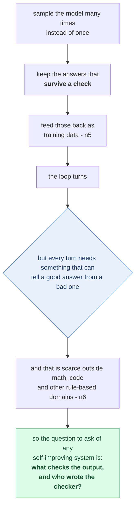

This is a bottleneck diagram, not a method diagram, and the interesting part is where the chain stops
rather than how it turns. **The crux is that self-improvement is mechanically simple and gated
entirely on verification, so the loop's reach is set by the domain rather than by the model.** It is
drawn as a cycle that runs into a question because the mechanism genuinely does work and the
constraint genuinely does bind; drawing either alone would misrepresent the lecture. The terminal box
is what to carry away, and it is a question rather than a finding because this is lecture 1 of a
course and a map of a research area rather than a result.

*Synthesized from `n5` and `n6`.*

## The 1-minute version

This article covers the opening lecture of a Stanford course on self-improving AI agents, taught by
two researchers who work on the subject. The lecture spends its first twenty minutes on material
this brain already holds and its last ten on course logistics, so what follows is drawn from the
forty minutes in between. The claim it builds toward is that self-improvement is now a buildable
engineering loop rather than an aspiration, and the first thing to establish is what problem that
loop is supposed to solve.

The problem is that a chat model and an agent fail differently. A chat model answers and stops, so a
weak answer costs one turn. An agent pursues a goal across many steps, and the lecture names three
capabilities it needs in order to survive that: planning, multi-step reasoning, and the ability to
notice and correct its own mistakes (`n8`, single-leg). The third is the one with no obvious supply.
Planning and reasoning improved as models grew, but improving *from your own errors* requires
knowing which of your outputs were errors, and that is where the difficulty starts.

The difficulty is that a model has no privileged view of its own correctness. It can produce a
confident wrong answer and a confident right one with the same fluency, and nothing internal
distinguishes them. Worse, the lecture reports that models actively prefer their own reasoning
traces over better traces from a stronger model (`n9`, single-leg and uncited). So any loop that
asks a model to grade itself is building on a known bias, which rules out the most obvious design
before you start.

The obvious design is nonetheless where the field began, and it collapses in an instructive way.
Ask the model once, ask it to check its answer, and keep what it approves. That fails because a
single sample rarely contains the right answer for a hard problem, and because self-approval is
exactly the biased signal just described. Fixing only the first half gets you further than you would
expect, and it is the move the lecture builds on.

The idea is to separate generating from selecting, and to scale the first one hard. Sample the model
thousands of times rather than once, which turns out to raise the chance that *some* sample is
correct far more than anyone expected. A Llama-3-8B model sampled repeatedly clears GPT-4o's
single-attempt score on four reasoning benchmarks (`n2`). Those two halves have names on the
lecturer's own slide, and the names are the most portable thing in the source: coverage is whether a
correct solution appears at all, and precision is whether you can pick it out (`n4`).

How it works from there is a loop rather than a trick. Once you can generate correct solutions and
select them mechanically, the selected solutions are training data, so you fine-tune on them and the
improved model generates better candidates next time (`n5`). The lecture draws this as an arrow
running from test-time back into fine-tuning, and identifies it as what DeepSeek-R1 and the frontier
reasoning models are doing. That is the whole thesis, and it is worth noticing that it is a loop
whose every turn passes through the selection step.

What it costs is that the selection step is not free and is not universally available. A verifier
can be a unit test, a proof checker or a majority vote where the domain permits, and it has to be a
human where the domain does not (`n4`, `n6`). Human feedback does not scale, so the loop runs at
full speed in math and code and stalls in creative work, which is visible as a clean gradient in
o1's win rate against GPT-4o by domain (`n6`). The field's response is to have models generate their
own verifiers, and the lecture describes agents writing the tests they must then pass (`n13`,
single-leg), which reintroduces the self-grading problem one level up.

How far to trust it splits cleanly. The taxonomy is trustworthy and is the reason to read this: the
coverage/precision split, the loop closure, and verification-as-bottleneck are all durable framings
delivered by people who work on them. The measurements are not, and the source's own honesty is the
best evidence for that, because it says plainly that nobody knows why the loop works as well as it
does (`n12`). **Take the vocabulary and the shape; leave the numbers**, and read `d1` before you
quote the headline chart at anyone.

The same argument, compressed for reference rather than for reading:

| | |
|---|---|
| **The problem** | Agents need to correct their own mistakes across long tasks, and a model has no privileged view of which of its outputs are mistakes. It generates confident wrong answers as fluently as right ones, and reportedly prefers its own reasoning traces even to better ones (`n8`, `n9`). |
| **Why the obvious answer fails** | "Ask once, then ask the model to check itself" fails twice over. One sample rarely contains a correct solution to a hard problem, and self-approval is the biased signal you were trying to escape. |
| **The idea** | Split generation from selection and scale generation hard. Sample thousands of times, then use an external check to pick. The two halves are named on the slide: **coverage** (can a correct solution be generated at all) and **precision** (can it be identified) (`n4`). Sampled enough, Llama-3-8B clears GPT-4o's single attempt (`n2`). |
| **How it works** | The selected solutions are training data. Fine-tune on them, and the better model generates better candidates next round - an arrow from test-time back into fine-tuning, which is what the frontier reasoning models do (`n5`). Test-time compute is a genuine third scaling axis, moving accuracy without touching a weight (`n1`). |
| **What it costs** | Every turn passes through the verifier, and verifiers are unevenly distributed. Unit tests and proof checkers exist for code and math; creative writing has only humans, and human feedback does not scale (`n6`). The field's workaround is to let models write their own verifiers (`n13`), which is the self-grading problem returning one level up. |
| **How far to trust it** | The taxonomy is solid and is the reason to read this. The numbers are not: the headline chart plots **coverage**, not delivered accuracy, and half its panels assume an oracle does the selecting (`n3`, `d1`). The lecturers themselves say the loop "is not completely well understood" (`n12`). |

## Key claims

- **Sampling and selecting are two separately hard problems with names.** Coverage asks whether a
  correct solution can be generated at all; precision asks whether it can be identified among the
  candidates. Verifiers named on the slide are unit tests, proof checkers and majority voting
  (`n4`).
- **Repeated sampling lets a small model clear a much larger model's single attempt** on four
  reasoning benchmarks, on some of them after roughly ten samples (`n2`).
- **That headline measures coverage rather than delivered accuracy, and two of its four panels
  resolve selection with an oracle verifier** (`n3`, `d1`). The narration concedes the point; the
  slide title does not.
- **Self-improvement is loop closure, not a technique.** Verified test-time output becomes
  fine-tuning data, and the improved model samples better next round - drawn as an arrow from
  test-time back into fine-tuning (`n5`).
- **Test-time compute is a third scaling axis** alongside data and parameters, raising pass@1
  log-linearly without changing a single weight (`n1`).
- **Verification, not generation, is the bottleneck, and it is domain-shaped.** o1's win rate against
  GPT-4o runs from below 50% on personal writing to about 72% on mathematical calculation, tracking
  how mechanisable the check is (`n6`). *The causal reading is this brain's; the source states the
  two halves separately.*
- **Models reportedly prefer their own reasoning traces** over better traces from a stronger model
  (`n9`, single-leg, uncited by the source, and no magnitude given).
- **The verifier is increasingly written by the system it judges** - agents generating the tests they
  must pass (`n13`, single-leg). Presented approvingly, and never interrogated.
- **What ships today is mostly a hand-drawn static graph**, not the open-ended loop the agent
  definition promises, because drawing the graph is currently easier for open-ended problems (`n7`).
- **The field says openly that it cannot explain the loop's gains**, with no consensus on whether RL
  or diverse pre-training data does the work (`n12`).

## What you will learn, and in what order

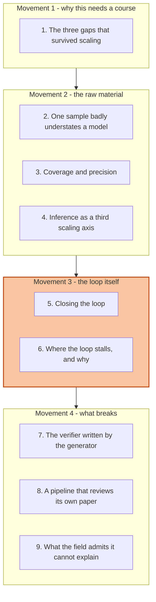

This is a reading-order diagram about the note rather than about the field, grouping the nine sections
into four movements, and the shaded one
carries the payload. Movement 1 establishes why a course exists for this at all, and a reader who
already accepts that agents need to self-correct can skim it without losing the thread. Movement 2
builds the raw material in three steps, and it is the part where skimming costs the most, because
sections 2 and 3 set up a distinction that the rest of the note leans on continuously. Movement 3 is
the thesis and should be read closely; it is two short sections, and everything before it exists to
make them land. Movement 4 is where the note stops reporting the source and starts pressing on it,
and a reader who wants the criticism rather than the exposition can begin at section 7, though
section 7's argument will feel unearned without section 6.

## Movement 1 - why this needs a course

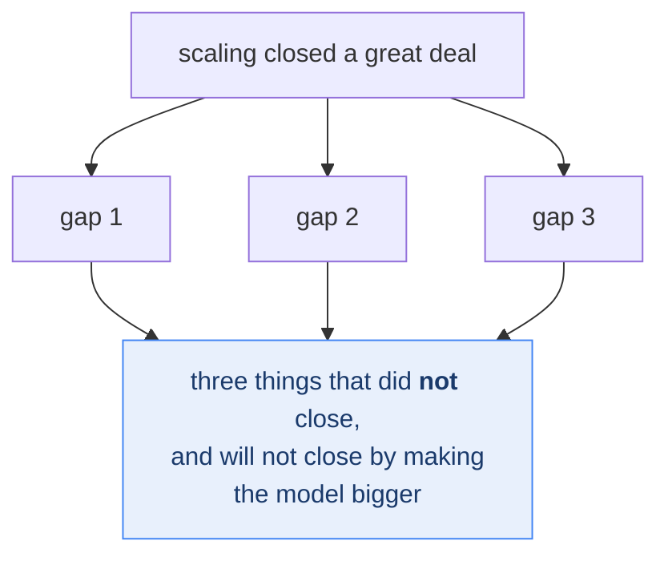

This is a scoping diagram, not a survey, and it is a single section for a reason. **The crux is that
the course exists because three specific problems survived the thing that solved most others, so the
subject is defined by what scaling left behind rather than by a technique.** It is drawn as one cause
with three residues because the residues are the syllabus: everything in the remaining movements is an
attempt on one of them. A reader who wants to know whether this material is relevant to their work
should read this movement and can then decide honestly, which is the job a first movement should do.

*Synthesized from the section below.*

### 1. The three gaps that survived scaling

Start with a question the lecture answers early and that is easy to skip past. If models keep
getting better on their own, what exactly is left to teach?

The answer is that scaling fixed some things and left others untouched. A chat model and an agent
fail in different ways, and the difference is structural rather than a matter of degree. A chat model
answers and stops, so a weak answer costs one turn and the human absorbs it. An agent pursues a goal
across many steps, and a weak step at position three corrupts everything downstream of it. The
lecture names three capabilities that current models "were not quite accomplishing" and that the
rest of the course attacks: planning, multi-step reasoning, and self-improvement, glossed as "when
it makes mistakes, it needs to be able to correct itself" (`n8`).

> **Weak evidence, labelled at the point of use.** `n8` is `single-leg`. The slide carrying that
> sentence exists only as a room-camera cut and did not survive frame curation, so this framing rests
> on one lecturer's spoken sentence. It is recorded here because the entire syllabus is organised
> around it, not because it is well evidenced.

Two of those three have a visible supply. Planning and multi-step reasoning both improved as models
grew and as reasoning training matured, so there is a known lever to pull. The third is different in
kind, because improving from your own mistakes requires first knowing which outputs were mistakes,
and a model has no privileged access to that. Hold onto that asymmetry, because the whole rest of the
note is an attempt to manufacture the missing signal.

It helps to see what the field settled for while that signal was unavailable.

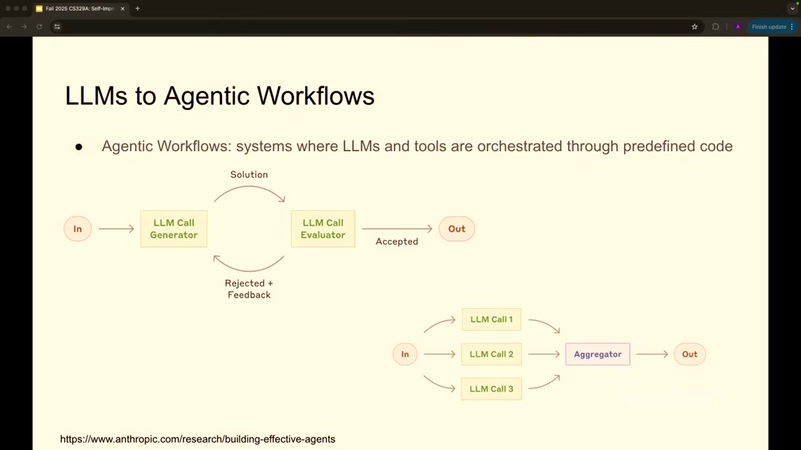

*What it teaches:* the definition on the slide reads "systems where LLMs and tools are orchestrated
through **predefined code**", and the two diagrams beneath it are a generator/evaluator cycle and a
parallel fan-out into an aggregator. *Corroborated by:* narration "in most scenarios, you're still
having very static workflows" @ [`t=2622s`](https://www.youtube.com/watch?v=6YnLB0XbTnI&t=2622s)
(`n7`).

Read the slide for the adjective rather than the boxes. The interesting word is *predefined*: a human
draws the graph, and the model fills in the nodes. The lecture is candid that this is a concession
rather than a design preference, explaining that for open-ended problems "it's easier to construct
this graph by hand of how a human would do it" @
[`t=2667s`](https://www.youtube.com/watch?v=6YnLB0XbTnI&t=2667s) (`n7`). This brain already holds
that position from a practitioner source, since claim 12 says the same thing about micro agents
inside deterministic code; hearing it from an academic vantage is mild independent support for the
practice.

Notice what the hand-drawn graph is really buying. It substitutes a human's judgement about
what-comes-next for the agent's, which is a fine trade when a human can be there to draw it. It does
nothing at all for the agent that must judge its own work at three in the morning, which is the case
self-improvement has to address. So the question becomes where a mechanical judgement could possibly
come from, and the answer starts somewhere unexpected.

## Movement 2 - the raw material

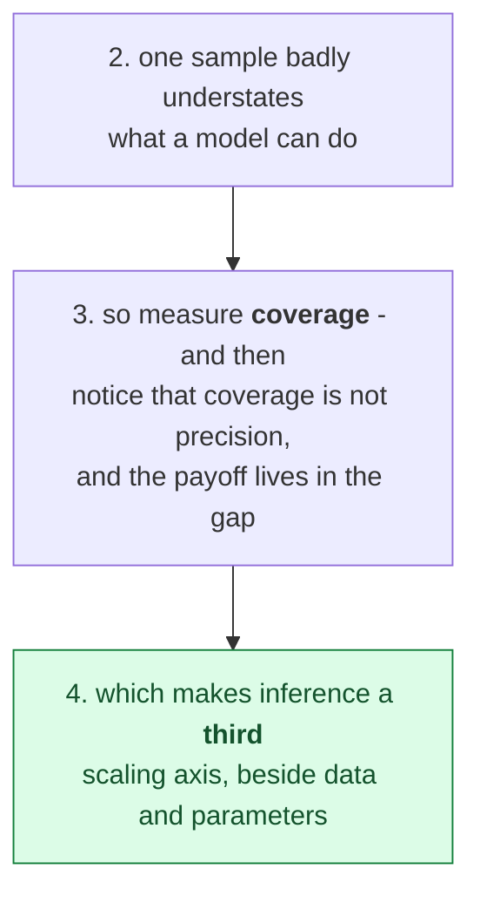

This is a derivation diagram, not a results tour. **The crux is that the whole self-improvement
programme rests on one empirical fact - a model's first answer understates it - and everything else in
the movement is working out what follows.** It is drawn as a straight chain because the sections
genuinely do force each other: repeated sampling only matters if you can say what it bought, saying so
requires separating coverage from precision, and once both are on the table inference becomes an axis
you can spend along rather than a fixed cost. This movement supplies the raw material the loop in
Movement 3 consumes.

*Synthesized from `n1`, `n2` and `n4`.*

### 2. One sample badly understates a model

Before reading the next figure, it is worth stating what you would expect. If a small open model
scores below a frontier model on a reasoning benchmark, the natural conclusion is that the small
model cannot do those problems. Here is the result that complicates that.

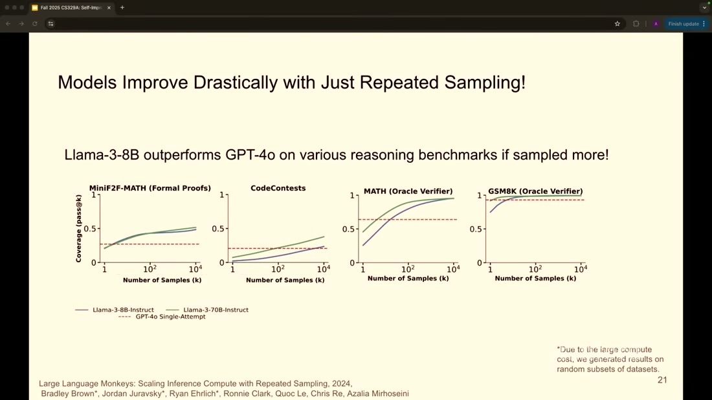

*What it teaches:* four benchmarks (MiniF2F-MATH, CodeContests, MATH, GSM8K), with a dashed
"GPT-4o Single-Attempt" baseline and Llama-3-8B and Llama-3-70B curves rising above it as the number
of samples grows from 1 to 10,000. *Corroborated by:* narration "they were worse than GPT-4o with one
sample, but if we increase the number of samples from these models, in all of these cases, they do
better than the GPT-4 model" @
[`t=1382s`](https://www.youtube.com/watch?v=6YnLB0XbTnI&t=1382s) (`n2`).

The headline is genuinely surprising and it is the lecturer's own published work, from a paper the
lab named *Large Language Monkeys* after the infinite monkey theorem. An 8-billion-parameter model,
sampled enough times, gets above a frontier model's single attempt on every one of these four
benchmarks. On MiniF2F it crosses after roughly ten samples. The lecture draws the obvious inference:
"it kind of seems like the models already know a whole lot more than what you get out of them when
you just ask them once" @
[`t=1401s`](https://www.youtube.com/watch?v=6YnLB0XbTnI&t=1401s).

To see why that inference is not quite safe, look at the y-axis before reading on. It does not say
accuracy. **Hold that detail; section 3 is where it gets paid off.**

There is a second reason to slow down here, and it is a question of independence. The presenter is
the senior author of the paper on the slide, so this is a researcher narrating her own result, which
is not the same evidential situation as a third party reproducing it. That is recorded in the gate
note rather than held against the finding, since the paper is public and the benchmarks are standard.
Even taking the result entirely at face value, though, it raises a problem that the chart cannot
answer on its own.

The problem is what you do with ten thousand answers. Generating them is now cheap and parallel, and
the lecture confirms that latency is "less of an issue" because the samples run concurrently @
[`t=1577s`](https://www.youtube.com/watch?v=6YnLB0XbTnI&t=1577s). But a user wants one answer, and
somebody has to choose. That choice is a separate problem from generation, and the field has given
the two halves separate names.

### 3. Coverage and precision, and the payoff

Here is the decomposition, and it is the single most portable thing in this source.

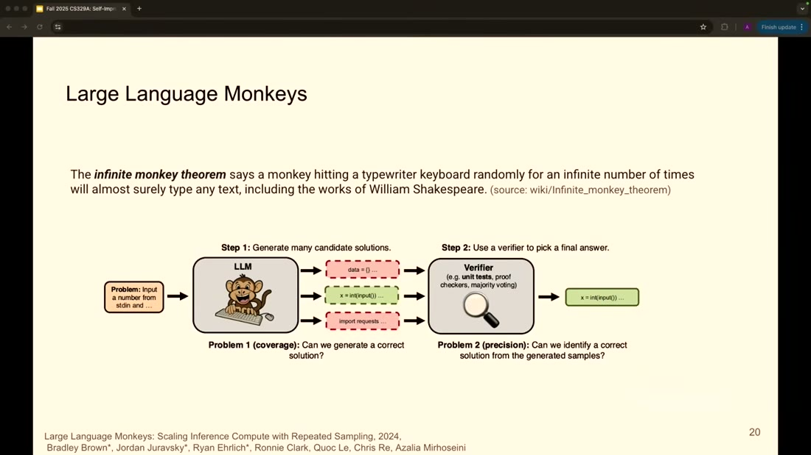

*What it teaches:* a two-step pipeline, with "Step 1: Generate many candidate solutions" annotated
**Problem 1 (coverage): Can we generate a correct solution?** and "Step 2: Use a verifier to pick a
final answer" annotated **Problem 2 (precision): Can we identify a correct solution from the
generated samples?**. The verifier box names its instruments concretely as "unit tests, proof
checkers, majority voting". *Corroborated by:* narration "let's assume you have some sort of a
verifier or selection mechanism, so you can pick which one of these generated responses were
correct" @ [`t=1268s`](https://www.youtube.com/watch?v=6YnLB0XbTnI&t=1268s) (`n4`).

Now the payoff for the detail you were holding. The y-axis in section 2 read **Coverage (pass@k)**,
which means those curves measure Problem 1 alone. They report whether *any* of the k samples was
correct, and they are silent about whether anyone could have found it. Two of the four panels go
further and say so in their titles, since "MATH (Oracle Verifier)" and "GSM8K (Oracle Verifier)"
mean the selection step was performed by something that already knew the answer (`n3`).

At first glance this looks like a gotcha, and it is not. The result is real and the framing is what
overreaches. It is worth being precise about which is which, because the distinction is what makes
the finding usable rather than merely quotable.

What is real is that the capability is present in the model's output distribution. That is a genuine
and non-obvious fact, and it is the reason inference-time methods became a research programme rather
than a curiosity. What is not established by this chart is that a user gets any of it. Between
coverage and delivered accuracy sits a selection step whose difficulty the chart deliberately
brackets, and the lecture is blunt about how hard that step is: on some problems, out of ten thousand
samples, "maybe like three or four of them were correct" @
[`t=1448s`](https://www.youtube.com/watch?v=6YnLB0XbTnI&t=1448s). Finding four correct answers among
ten thousand is a needle-in-haystack problem, and majority voting will not solve it.

That gap between the slide and the chart is recorded as a divergence (`d1`), and the shape of it is
worth carrying beyond this source. The overstatement sits in the artifact that gets screenshotted and
shared, and the correction sits in speech that does not travel with it. Anyone who has seen this
slide in isolation has seen the strong claim without the qualifier.

The two panels that do *not* say "Oracle Verifier" are the ones worth studying, because MiniF2F is
formal proofs and CodeContests is code. Both come with a real, mechanical, deployable checker, which
is a proof assistant in one case and a test suite in the other. That is not a coincidence, and
section 6 is where it becomes the whole argument. First, though, this needs to be connected to
something larger than one paper.

### 4. Inference as a third scaling axis

The natural objection to everything so far is that repeated sampling is a trick. You are spending a
hundred times the compute to recover performance you could have bought with a bigger model, so
nothing new has happened.

The reason it is more than a trick is that the spending buys a scaling curve of its own.

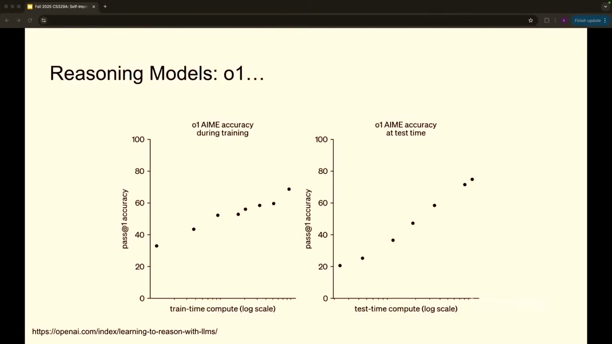

*What it teaches:* two panels showing o1's pass@1 accuracy on AIME, the left against train-time
compute and the right against test-time compute, both on log scales, and both rising in a roughly
straight line. *Corroborated by:* narration "this kind of scaling applies to test time as well,
without changing the parameter count of the model" @
[`t=1860s`](https://www.youtube.com/watch?v=6YnLB0XbTnI&t=1860s) (`n1`).

> **Background, supplied.** Skip this if scaling laws are familiar. A scaling law is an empirical
> regularity that performance improves as a smooth function of some resource, usually appearing as a
> straight line when the resource is plotted on a log axis. Its practical value is predictive: a
> straight line lets you forecast what another order of magnitude of spending will buy, which turns
> a research question into a budgeting question. This block is background I am supplying and is
> uncited by construction.

The two panels are the argument, and their similarity is the point. The left one is the familiar
story where more training compute produces better models. The right one has the same shape for a
resource nobody previously treated as a scaling axis at all, and it holds with the weights entirely
fixed. In short, thinking longer at inference behaves like a scaling law rather than like a
diminishing-returns hack, which is what promotes it from technique to frontier.

> **Weak evidence, labelled at the point of use.** This is OpenAI's own promotional chart, sourced
> on-slide to `openai.com/index/learning-to-reason-with-llms` and reproduced in a lecture, so it is
> **T2 vendor material about the vendor's own model**. Neither axis prints an absolute compute value.
> Trust the *shape* of the relationship, which is corroborated by the independent monkeys result;
> do not read magnitudes off it (`n1`).

There is a strategic consequence the lecture draws only implicitly, and it is worth making explicit
because it explains why this became a research programme in 2025 rather than earlier. If accuracy
responds to inference compute, then capability is no longer gated solely on a training run that costs
tens of millions of dollars and belongs to whoever can afford it. It becomes partly purchasable at
serving time, in small increments, by anyone. That changes who can participate.

So the field has two facts in hand. Models contain more capability than one sample reveals, and
spending compute at inference to extract it follows a predictable curve. Both facts concern getting
better answers out of a *fixed* model. The step that turns them into self-improvement is the one that
puts the answers back in.

## Movement 3 - the loop itself

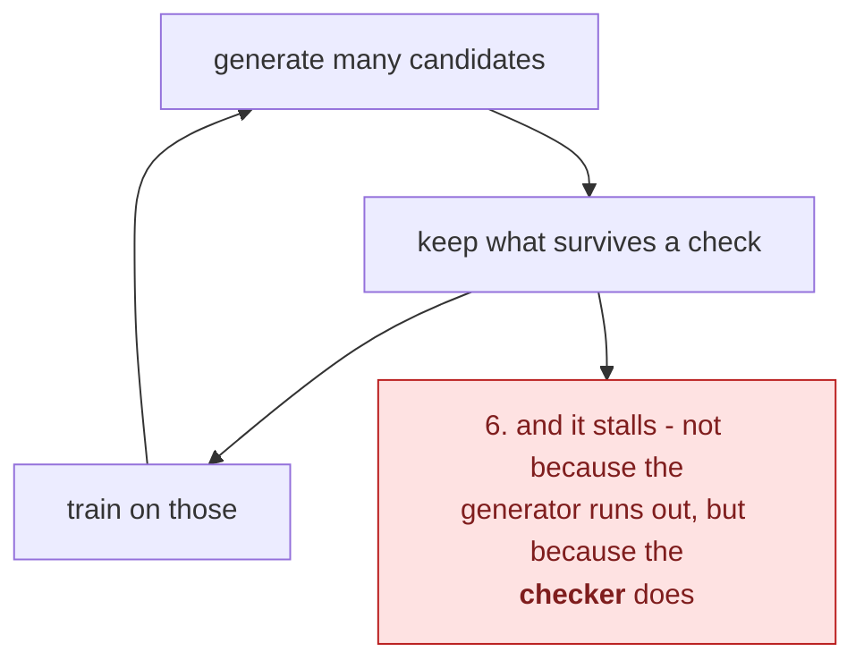

This is a cycle diagram, and the branch off it is the finding. **The crux is that the loop's failure
mode is located precisely at the verification step, so what limits self-improvement is not the model's
ability to produce good answers but your ability to recognise them.** It is drawn as a closed cycle
with one edge leading out because the stall is not a break in the loop: the loop keeps turning and
stops producing improvement, which is a harder thing to notice than a failure. Section 6 is where the
lecture stops describing an attractive mechanism and starts naming its boundary.

*Synthesized from `n5` and `n6`.*

### 5. Closing the loop

This is the thesis, and the slide that carries it is almost aggressively simple.

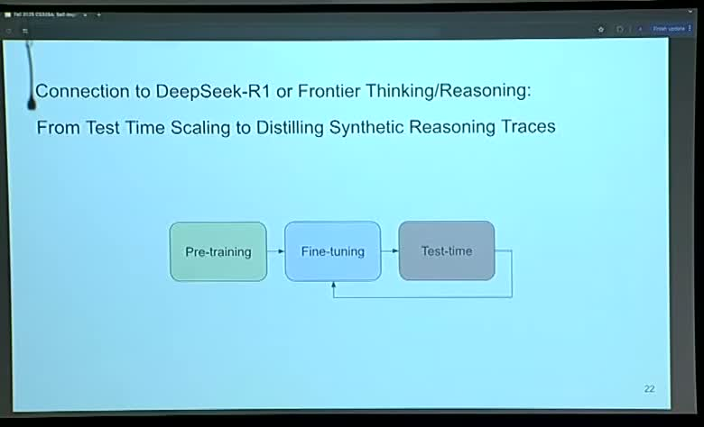

*What it teaches:* three boxes reading Pre-training, Fine-tuning and Test-time, connected left to
right, **with an arrow returning from Test-time back into Fine-tuning**. The title reads "Connection
to DeepSeek-R1 or Frontier Thinking/Reasoning: From Test Time Scaling to Distilling Synthetic
Reasoning Traces". *Corroborated by:* narration "that becomes part of our training set now. We can
use that to fine-tune the model to become better" @
[`t=1761s`](https://www.youtube.com/watch?v=6YnLB0XbTnI&t=1761s), and "that's kind of the
self-improving piece that we are very excited about" @
[`t=1810s`](https://www.youtube.com/watch?v=6YnLB0XbTnI&t=1810s) (`n5`).

Everything in the diagram except one arrow is the standard training pipeline every reader already
knows. The single addition is the return path, and it converts a sequence into a cycle. That is the
entire idea, and its simplicity is why the name "self-improving" is more dramatic than the mechanism
deserves.

To see how it works, trace one turn concretely rather than reading the boxes. Take a math problem
whose final answer you know but whose worked solution you do not have. Sample the model two hundred
times, and by the coverage result some of those attempts reach the right answer. Filter to the ones
that did, and you now hold two hundred candidate reasoning traces of which perhaps thirty are
plausible derivations of a known-correct answer. Those thirty are training data you did not have five
minutes ago, and no human wrote any of them. Fine-tune on them, and the model's *first* sample gets
better, which is why the lecture keeps insisting on the distinction between coverage and pass@1 that
section 3 set up (`n3`). Next round, you need fewer samples to find good traces, so the loop gets
cheaper as it goes.

Now ask what breaks if you delete a component. Remove repeated sampling and you have nothing to
filter, since one attempt at a hard problem is usually wrong. Remove fine-tuning and you have an
expensive inference-time trick that forgets everything between queries, which is the state of the
field before this loop closed. Remove the filter, and this is the interesting case, because you do
not get a broken pipeline. You get a working pipeline that trains on its own wrong answers, and it
will run happily for as long as you let it.

That last case deserves a moment because it is where the design is load-bearing rather than
convenient. The filter is not an optimisation on this loop; it is the only thing distinguishing
self-improvement from self-reinforcement. Which raises the obvious question about the whole
construction. If the loop is this simple and the components are all available, why has it not already
been run to convergence on everything?

### 6. Where the loop stalls, and why

The answer is that the filter is not available everywhere, and the lecture names this as the field's
central obstacle. It calls it the generator-verifier gap: "it's easy for models to generate a whole
bunch of nonsense or sensible set of reasoning traces. But whether that's useful or not, we need
feedback loop for that. And if you're creative writing, how much feedback can you get? So human
feedback ends up becoming a bottleneck" @
[`t=3054s`](https://www.youtube.com/watch?v=6YnLB0XbTnI&t=3054s) (`n6`).

Suppose you wanted to build the loop from section 5 for a creative-writing model. Every component
transfers except one. You can sample a thousand openings to a short story cheaply, and you can
fine-tune on whichever ones are good. What you cannot do is determine which ones are good without a
person reading them, and a person reading a thousand story openings is not a loop that runs
overnight. The economics invert completely: in code the filter costs a few CPU seconds, and in prose
it costs an hour of expert attention per iteration.

That prediction is testable, and the lecture happens to show the test without framing it as one.

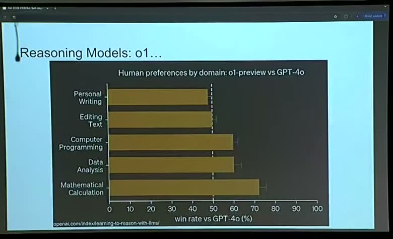

*What it teaches:* win rate of o1-preview against GPT-4o by domain, running from **below 50%** on
Personal Writing, through roughly 50% on Editing Text, to about 60% on Computer Programming, 59% on
Data Analysis and 72% on Mathematical Calculation. *Corroborated by:* narration "they tend to be
better in, obviously, the reasoning task. For example, in math calculation, data analysis,
programming and such... but not necessarily in personal writing or editing text" @
[`t=2101s`](https://www.youtube.com/watch?v=6YnLB0XbTnI&t=2101s) (`n6`).

Read the ordering rather than the individual bars. The domains sort almost exactly by how
mechanisable a correctness check is. Mathematical calculation has a definitive answer and sits
highest. Programming has test suites and sits next. Data analysis has partially checkable outputs and
sits beside it. Editing text has taste, and lands at parity. Personal writing has nothing checkable
at all, and the reasoning model actually loses.

> **This causal reading is mine, not the source's, and the distinction matters.** The lecture states
> the domain gradient in one place and the verification bottleneck in another, and never joins them.
> What the chart establishes on its own is that reasoning training helps unevenly by domain. That the
> unevenness is *produced by* verifier availability is an inference I am drawing across two of the
> source's claims (`n6`). It is a good inference and it is not the author's.

The consequence generalises past language models, and it is the sentence worth taking away from this
note. A self-improving system improves at exactly the rate its verifier can distinguish good output
from bad, so the verifier - not the generator - sets the ceiling. This brain has already seen that
principle fail in miniature. S13's autoresearch loop had a real, automatic, cheap verifier in a
bits-per-byte comparison, and claim 114 records that its final banked improvement was a change of
random seed, because the verifier had no notion of variance. **A verifier that exists is not the same
as a verifier that works**, and a loop cannot tell the difference from the inside.

Which leaves the field with an uncomfortable incentive. If verifiers gate everything and only some
domains supply them, the tempting move is to manufacture verifiers for the rest.

## Movement 4 - what breaks

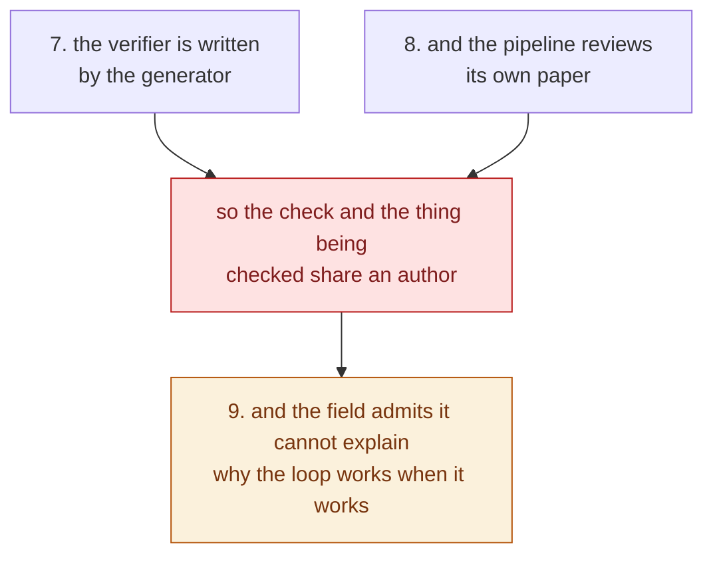

This is a conflict-of-interest diagram, not a limitations list. **The crux is that both failures in
this movement are the same failure at different scales: a generator that also supplies its own
verifier has no independent vantage point, exactly as an agent grading its own output does not.** It
is drawn converging because reading them separately makes each look like an implementation detail, and
together they identify a structural problem this brain records elsewhere as claim 34. The amber
terminal is the honest ending: the field can demonstrate the loop working and cannot say why, which is
what makes this a map rather than a result.

*Synthesized from `n7`, `n8` and `n9`.*

### 7. The verifier written by the generator

The lecture describes that move twice, in both cases approvingly and in passing. Discussing the
lab's Code Monkeys work, it says that "if you can generate unit tests for whatever code the model
generated and then see if the generated unit tests are making things better, that's a very good way
to verify things" @ [`t=2992s`](https://www.youtube.com/watch?v=6YnLB0XbTnI&t=2992s). Later,
describing ordinary coding-agent behaviour, it notes that verification is "based on passing the
tests and it might actually generate the tests that needs to pass" @
[`t=3196s`](https://www.youtube.com/watch?v=6YnLB0XbTnI&t=3196s) (`n13`).

> **Weak evidence, labelled at the point of use.** `n13` is `single-leg` on narration. No slide
> states it, and the one diagram that draws a verifier shows it as an *external* box, which is the
> opposite arrangement (`frame_1206`, `n4`). This is recorded as a structural hazard rather than a
> documented failure, because the source reports no incident and neither do I.

At first glance this is unobjectionable, and it is worth articulating why before objecting. A test is
a concrete artifact that either passes or fails when executed, so a model-written test is still
mechanically checkable in a way a model-written opinion is not. Writing tests from a specification is
also a task models are demonstrably decent at. So the practice is not obviously wrong.

The reason to be uneasy is that it silently reintroduces the correlation the split was designed to
break. Section 5 established that the filter is the only component separating self-improvement from
self-reinforcement. A verifier drawn from the same model, the same weights and the same
misunderstanding of the specification will tend to be wrong in the *same direction* as the code it
judges. When the model misreads the requirement, it writes code implementing its misreading and tests
asserting that misreading, and every one of them passes. The loop then reports success and banks the
error as training data.

This brain holds two prior claims that sharpen the point, and they come at it from different
directions. Claim 34, from an Anthropic harness postmortem, says do not let the producer grade its
own work, because a generator has no independent vantage point on itself. Claim 113, from S13, is the
plumbing version of the same thing and is the more useful form: it records a loop where the scoring
*function* was frozen and untouchable while the score still travelled to the decision through code
the agent could rewrite. Separation at the level of functions did not deliver separation in fact.

The lecture also supplies an independent reason to expect self-preference, and it arrives almost as
an aside. Asked whether a smaller model could generate reasoning traces for a larger one, the answer
is that "the models, at least currently, they like their own traces more. Even if the traces are
coming from a better model, they tend to like their own generated traces more" @
[`t=2291s`](https://www.youtube.com/watch?v=6YnLB0XbTnI&t=2291s) (`n9`).

> **Weak evidence, labelled at the point of use.** `n9` is `single-leg`, uncited by the lecture, with
> no paper, no measurement and no magnitude attached. It is nonetheless the most valuable research
> target in this source, because it is an independent statement of the bias claim 34 asserts, arriving
> from a different mechanism and a different community. It is filed as an open question below rather
> than promoted as fact.

Put those together and the shape of the risk is clear. Models prefer their own output, and the field's
answer to verifier scarcity is to have models produce their own verifiers. Nothing in the lecture
connects those two statements, which are eleven minutes apart. It is not a contradiction, and it is
the kind of gap worth noticing when a survey moves quickly.

There is a published system where you can watch this arrangement reach its logical end.

### 8. A pipeline that reviews its own paper

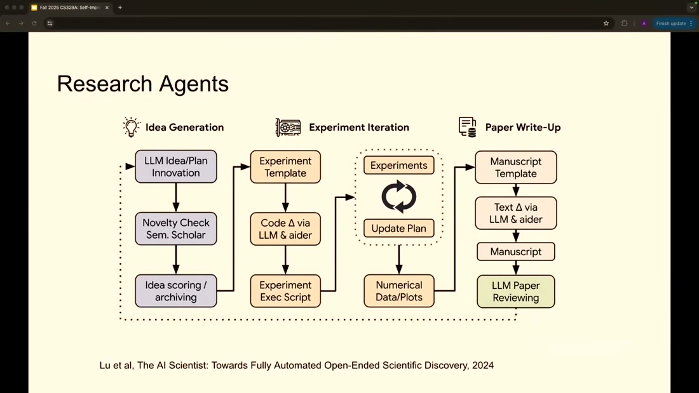

*What it teaches:* the AI Scientist pipeline in three phases. Idea Generation runs LLM
idea/plan innovation, then a Semantic Scholar novelty check, then idea scoring and archiving.
Experiment Iteration runs an experiment template, a code change via LLM, an execution script and a
loop between Experiments and Update Plan. Paper Write-Up ends in a box reading **LLM Paper
Reviewing**. *Corroborated by:* narration walking the three phases, "the LLM is used as a
brainstorming thing to come up with ideas... then the experiment iteration phase... And then in the
paper write-up phase, it will help you improve the paper write-up" @
[`t=3415s`](https://www.youtube.com/watch?v=6YnLB0XbTnI&t=3415s) (`n10`).

Trace where judgement enters this pipeline, since that is what sections 5 through 7 have trained you
to look for. There are exactly two checks in the whole diagram. The novelty check queries Semantic
Scholar, which is genuinely external, and it establishes only that nobody has published this before,
not that it is any good. The other is the terminal box, where the output is judged by an LLM. Between
them sits the experiment loop, which does have real feedback in the form of executed code and
numerical results, and which is the part most closely resembling S13's autoresearch.

Notice what is missing at the end. The pipeline's final quality gate is a model reviewing work
produced by a model, which is claim 34's prohibition installed as an architectural component. The
diagram is from a 2024 paper rather than from the lecturers, so this is the field's design and not
theirs.

There is a second finding here, and it belongs to the lecture rather than to the paper. The narration
walks all three phases and never mentions the reviewing step at all (`d2`). The single box deciding
whether any of the output is worth keeping is the one that goes unspoken. That omission is not
sinister, and it is characteristic: the exciting part of a research agent is that it generates
hypotheses, and the boring part is that something has to throw most of them away. This note's entire
argument is that the boring part is the one that determines whether the loop works.

Which makes it fair to ask how much of this the field actually knows, as opposed to hopes.

### 9. What the field admits it cannot explain

The lecture's most useful moment is a student question it declines to answer confidently. Asked why
reinforcement learning produces such a large jump when pre-training supposedly already contains the
capability, the response is that "there is a different set of opinions around what really improves
the model. Is it RL or is it the pre-training diverse data by itself? And I don't think there's a
single point of consensus at this point in time" @
[`t=3117s`](https://www.youtube.com/watch?v=6YnLB0XbTnI&t=3117s), followed by the plainer admission
that "that whole loop is not completely well understood. It's like the first signs of life and it
starts to get commercialized, but there's a lot more research still open in this area" @
[`t=3147s`](https://www.youtube.com/watch?v=6YnLB0XbTnI&t=3147s) (`n12`).

That is worth more than any number in the source, and it is why this note gates `n5` on the
architecture rather than on efficacy. The loop's shape is well established, the loop's mechanism is
not, and the people teaching it say so unprompted while commercial systems ship on it.

Here is the field's own map of what remains, which doubles as the syllabus.

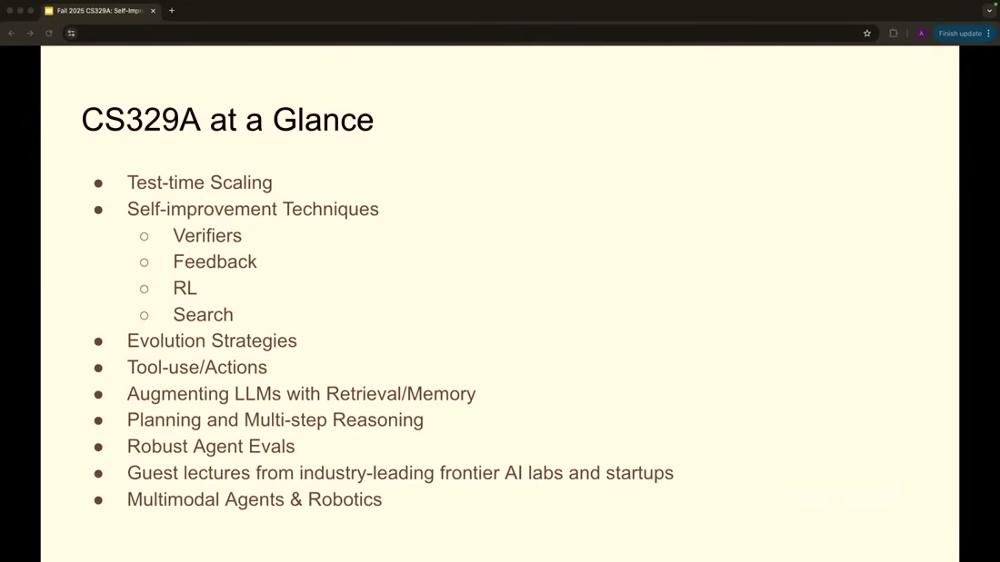

*What it teaches:* the course decomposes **Self-improvement Techniques** into exactly four items,
namely Verifiers, Feedback, RL and Search, sitting beneath Test-time Scaling and beside Evolution
Strategies, Tool-use/Actions, Augmenting LLMs with Retrieval/Memory, Planning and Multi-step
Reasoning, Robust Agent Evals, and Multimodal Agents & Robotics. *Corroborated by:* narration is thin
here, running only to "here is a list of all the amazing topics that you're going to learn about" @
[`t=3638s`](https://www.youtube.com/watch?v=6YnLB0XbTnI&t=3638s) (`n11`, **figure-only**).

> **Weak evidence, labelled at the point of use.** `n11` is `single-leg` and effectively figure-only,
> since the narration adds nothing. A syllabus is a claim about what a field contains, made by two
> people who work in it. That is weak as evidence and useful as a map, which is exactly how it is
> used here.

The four-way split is worth keeping because it is a decomposition by *where the improvement signal
comes from*, which is the axis this whole note has been arguing is the important one. Verifiers
supply a mechanical check. Feedback supplies a human or model judgement. RL supplies a reward signal
over many episodes. Search supplies structure over the candidate space rather than a judgement about
any candidate. Three of the four are ways of manufacturing the scarce filter, and the fourth is a way
of needing less of it.

What the map leaves out is as informative as what it includes. There is no security item anywhere on
the syllabus, which is notable for a course about systems that modify their own training data. This
brain holds claim 106 on exactly that theme, that sharing a component converts a structural guarantee
into an enforcement obligation nobody has specified, and a self-improvement loop is a component
shared between a model's present and its future. That gap is recorded as an open question rather than
as a criticism of the lecture, since a first lecture is not a threat model.

## Diagram (mental model)

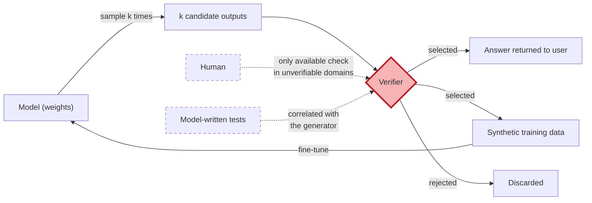

Read it left to right along the solid arrows, which trace one turn of the loop from section 5. The
red diamond is the verifier, and the two dashed boxes entering it from below are the two ways of
supplying one when the domain does not hand you a proof checker or a test suite. Solid arrows are
the mechanism the lecture describes; dashed arrows are the substitutes it mentions in passing.

**The crux is that every path in this diagram passes through the diamond, and the diamond is the one
component the model cannot honestly supply for itself.**

The shape earns itself by making the failure modes structural rather than incidental. Because both
the user-facing output and the training data flow out of the same verifier, a verifier error does not
merely return a bad answer once; it is written back into the weights and compounds on the next turn,
which is why the return path makes verification quality so much more consequential here than in
ordinary inference. The two dashed inputs then explain the field's position precisely. The human path
is trustworthy and does not scale, which is `n6`'s bottleneck. The model-written path scales and is
correlated with the generator, which is `n13`'s hazard and claim 34's prohibition. A design that
drew the verifier as just another box would hide the fact that these are the only two options and
that neither is satisfactory.

*Provenance: synthesized from `n4`, `n5`, `n6`, `n13`. The diagram is mine; the lecture draws the
loop (`frame_1712`) and the two-step pipeline (`frame_1206`) separately and never combines them.*

## 💡 Terms

- **Coverage (pass@k)** - whether at least one of k sampled attempts is correct. Measures the
  generator alone and says nothing about whether the correct sample could be found (`n3`, `n4`).
- **Precision** - whether a correct solution can be *identified* among the candidates. The selection
  half of the problem, and where verifiers live (`n4`).
- **Generator-verifier gap** - the distance between what a system can produce and what it can
  recognise as good. Named in the lecture as the field's central obstacle (`n6`).
- **Oracle verifier** - a selection step given access to the ground-truth answer. A research
  instrument for isolating coverage, and not something that can be deployed (`n3`).
- **Test-time / inference scaling** - spending more compute per query, through repeated sampling or
  longer reasoning, with the weights fixed (`n1`).
- **Distilling synthetic reasoning traces** - filtering many sampled solutions down to the ones that
  reached a correct answer and fine-tuning on them. The return arrow that closes the loop (`n5`).
- **Emergent behaviour** - a capability absent in smaller models that appears past some scale. Used
  in the lecture's 101 section; retained here only because the field's vocabulary assumes it.

## What to distrust in this note

**The source is lecture 1 of a course, and that determines what it can support.** Its business is to
map a field before teaching it, so it is a good authority on vocabulary and structure and a poor one
on findings. It defers essentially every mechanism to a later session, including a whole lecture on
verifiers @ [`t=1624s`](https://www.youtube.com/watch?v=6YnLB0XbTnI&t=1624s). Nothing here is a
result this brain should cite as settled.

**Independence is compromised on the two strongest empirical slides.** The repeated-sampling result
is the presenter's own lab's preprint, narrated by its senior author, and the Q&A leans on a second
paper from the same lab. Preprints are **T3**, not peer-reviewed, and the lecture around them is
**T4**. The o1 charts are worse in a different way, being **T2** vendor promotional material about
the vendor's own model, reproduced with unlabelled compute axes.

**The most reusable claim here is not the best corroborated one.** Verification-as-bottleneck (`n6`)
is what makes this source worth keeping, and its causal form is *my* synthesis of two separate
statements rather than anything the lecture asserts. Treat the pattern as well evidenced and the
causal link as this brain's reading. The same caution applies more sharply to `n9`, the claim that
models prefer their own traces, which is a single uncited spoken sentence with no magnitude and which
I have nonetheless flagged as the most interesting thing in the source.

**One frame's title materially overstates its own chart** (`d1`), and it is the frame most likely to
be shared. If you take one caution from this note into the world, take that one.

**A drop cost something and is recorded rather than hidden.** `n8`, the three-capability framing that
the entire course is organised around, is `single-leg` because the slide carrying it existed only as
a room-camera cut and lost the frame-budget contest. That is a curation decision affecting the
evidence, and it is logged in `nodes.md`.

## Open questions

- **Is the self-preference claim real, and how large?** `n9` asserts that models prefer their own
  reasoning traces even to better ones, with no citation. This is the highest-value research target
  here, because it would independently corroborate claim 34 through a different mechanism. Look for
  measurements of self-preference bias in LLM-as-judge literature.
- **What happens to a loop whose verifier is model-written and wrong in the generator's direction?**
  `n13` describes the practice and nothing measures the failure. The nearest evidence this brain
  holds is claim 114, where a loop with a *real* verifier banked a random-seed change.
- **Does the domain gradient in `frame_2098` actually track verifier availability?** The correlation
  is visible and the causal claim is mine. A study covering domains of intermediate verifiability
  would settle it.
- **How many turns of the loop in `n5` have anyone actually run?** The source shows the architecture
  and no longitudinal result. Whether returns diminish, plateau or collapse after several rounds is
  the question that decides how much the thesis is worth.
- **Why does RL produce the jump it does?** The lecture says openly there is no consensus (`n12`).
- **What is the threat model for a system that writes its own training data?** Absent from the
  syllabus entirely (`n11`), and adjacent to claim 106.

## Feeds these topics

- [`brain/topics/self-improvement.md`](../../brain/topics/self-improvement.md) - **new topic, created
  by this source.** The loop closure, the coverage/precision split, verification as the bottleneck.
- [`brain/topics/evals.md`](../../brain/topics/evals.md) - coverage vs pass@1 as distinct metrics,
  oracle verifiers as a research instrument, the verifier-written-by-the-generator hazard.
- [`brain/topics/agents.md`](../../brain/topics/agents.md) - the three capability gaps, and static
  orchestration graphs as the current state of practice.
- [`brain/topics/autonomous-research-loops.md`](../../brain/topics/autonomous-research-loops.md) -
  the AI Scientist pipeline as a second instance of S13's shape, and the generator-verifier gap as
  the frame explaining why S13's accept rule banked noise.

> **Deliberately not filed under `inferencing`**, despite `n1` being about inference. That note's
> scope is *serving* - KV cache, batching, quantization, throughput against latency - and test-time
> scaling is about buying accuracy rather than efficiency. Filing it there would misfile it and leave
> the serving note looking populated when it is still empty. See
> [ADR-0018](../../brain/decisions/0018-self-improvement-topic.md).

## Presentation narrative

*A talk track for a team considering an agent that improves itself, derived entirely from the gated
nodes above. This is lecture 1 of a university course, so it is a map of a research area rather than a
result, and its headline chart measures something weaker than its title claims - which the last slide
handles rather than buries.*

### Slide 1 - Self-improvement is mechanically plainer than the name suggests

**Sample the model many times instead of once, keep the answers that survive a check, and feed those
back as training data [n5].** That is the whole loop. No part of it requires a new architecture, and
the reason it is interesting is not that it works but where it stops working.

The framing worth carrying into any internal discussion is that this course exists because of three
specific gaps that survived scaling. They are not problems that close by making the model bigger,
which is why they need a technique rather than a budget.

This is the scope, not the method. **The crux is that everything downstream is an attempt on
something scaling did not solve** - which is the honest test of whether this material applies to your
problem.

### Slide 2 - A model's first answer badly understates what it knows

**Ask the same question many times at nonzero temperature and a correct answer often appears, which
means the capability was in the weights and the first sample simply did not surface it.** That single
empirical fact is what the entire programme rests on.

What engineers should take from it immediately is that your evaluation of a model is partly an
evaluation of your sampling strategy. A one-shot benchmark number is a lower bound on capability, and
sometimes a very loose one.

This is the foundational result. **The crux is that the curve rises with samples rather than with
model size**, which is what makes inference a place you can spend [`n1`].

### Slide 3 - Coverage is not precision, and the payoff lives in the gap

**Repeated sampling raises coverage, meaning the chance that a right answer is somewhere in the set.
It does not raise precision, meaning your ability to point at it.** Everything practical about this
field lives in the distance between those two.

That distinction promotes inference into a third scaling axis beside data and parameters, but only
conditionally. You can spend along it and convert the spend into capability exactly to the extent that
you can identify the good answer once it exists.

This is where the coverage claim comes from. **The crux is that the y-axis is what the set contains,
not what you can extract** [`n2`].

### Slide 4 - The loop stalls at the checker, not at the generator

**Every turn of the loop needs something that can tell a good answer from a bad one, and that is
scarce outside math, code and other rule-based domains [n6].** The lecture calls verification the
field's bottleneck, and that is the sentence to take to a design review.

The failure mode is worth stating precisely because it is hard to notice. The loop does not break. It
keeps turning and stops producing improvement, which looks like diminishing returns rather than like a
fault. For leadership the consequence is a scoping rule: the domains where this pays are the ones
where checking is mechanisable, and everywhere else the loop runs and quietly banks noise.

This is the loop closing. **The crux is the arrow back into training** - that is what makes it
self-improvement rather than just sampling [`n5`].

### Slide 5 - The verifier is written by the generator, which is the same problem twice

**When the thing being checked and the thing doing the checking share an author, there is no
independent vantage point.** That shows up here in two places: a verifier the generator produced, and
a research pipeline that reviews its own paper.

Reading those as separate implementation details misses the point. They are one structural problem,
and it is the same one this brain records elsewhere as a generator grading its own output. The
practical question for anyone building this is not whether the checker is good but whether it is
independent, and independence is a property of provenance rather than of quality.

This is the self-reviewing pipeline. **The crux is that every arrow inside it was authored by the same
system**, which is what makes the review a formality rather than a check [`n7`, `n8`].

### Slide 6 - The field cannot explain why the loop works when it works

**Section 9 is the lecture admitting that the mechanism is demonstrated and not understood.** That is
an unusual thing for a course to say early, and it is the reason to treat this as a map rather than as
guidance.

The trust boundary is specific rather than general. This is lecture 1 of a university course, the
material is a survey of other people's results, and the headline chart measures something weaker than
its title claims [d1]. So the verdict is watch rather than adopt: take the framing, take the
verification bottleneck as a scoping rule, and do not take any number here as a target.

What would change that is exactly what the field says it lacks - an account of why the loop converges
where it does. Until then the actionable residue is one question, and it is the most useful thing the
lecture leaves you with. What checks the output, and who wrote the checker?

This is the course map. **The crux is that it is a syllabus rather than a set of conclusions**, which
is the correct way to cite everything in this note.

### Key takeaway message

Self-improvement is mechanically simple: sample many times, keep what survives a check, train on the
survivors. It rests on one empirical fact, that a model's first answer understates what it knows, and
it is gated entirely by verification, which is scarce outside math, code and other rule-based domains.
The loop does not break when verification is weak; it keeps turning and stops improving, which is
harder to notice. Both of the failures the lecture names are the same structural problem - a verifier
written by the generator has no independent vantage point - and the field admits it cannot explain why
the loop works when it does. Carry one question into any design review: what checks the output, and
who wrote the checker?
