# Learning - Test-Time Compute Scaling (Stanford CS329A, lecture 2)

> Persona: **curator + mentor, always.** Re-adopt when working this file. Add **fact-checker** at the
> gate and **architect** when mapping which topics this feeds.

> The distilled document you learn from - text anchored by curated visuals, built from the
> corroborated nodes in `nodes.md`. Every claim is cited. See `SOURCE.md` for metadata and for why
> this is `S15` rather than more of `S14`.

## TL;DR

You can buy accuracy at inference time instead of at training time, by sampling a model many times
instead of once, and the returns are lawful enough to budget against - coverage follows
`c = exp(a·k^b)` in the number of samples `k`, across models from 70M to 70B parameters (`n3`). The
lecture then spends its best twenty minutes demolishing the naive reading of that result. Sampling
gets you a *set* containing a right answer; it does not get you the right answer, and every practical
way of picking one out plateaus after roughly ten to fifty samples while the set keeps improving
(`n10`). That distance is the **generation-verification gap**, and it decides where this whole
technique is worth anything. The most useful idea here is the reframe at the end: stop trying to
*select* the best candidate and start *synthesizing* one from all of them, which beats even a perfect
oracle selector (`n25`).

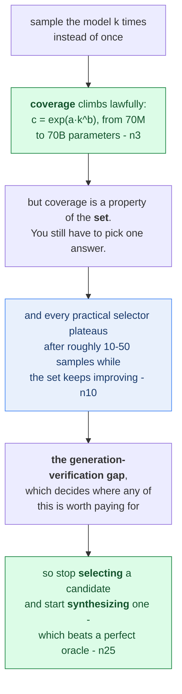
```mermaid
flowchart TB
    S["sample the model k times<br/>instead of once"]
    C["<b>coverage</b> climbs lawfully:<br/>c = exp(a·k^b), from 70M<br/>to 70B parameters - n3"]
    G["but coverage is a property of the <b>set</b>.<br/>You still have to pick one answer."]
    P["and every practical selector plateaus<br/>after roughly 10-50 samples while<br/>the set keeps improving - n10"]
    D["<b>the generation-verification gap</b>,<br/>which decides where any of<br/>this is worth paying for"]
    F["so stop <b>selecting</b> a candidate<br/>and start <b>synthesizing</b> one -<br/>which beats a perfect oracle - n25"]

    S --> C --> G --> P --> D --> F

    style C fill:#dcfce7,stroke:#15803d,color:#14532d
    style P fill:#e8f0fc,stroke:#4285f4,color:#1a3a6b
    style F fill:#dcfce7,stroke:#15803d,color:#14532d
```

This is a limits diagram, not a technique diagram, and the middle of the chain is where the lecture
spends its best twenty minutes. **The crux is that sampling buys a set containing a right answer and
never buys the right answer, so the headline scaling law and the practical ceiling are measuring two
different things.** It is drawn as one descent because the argument is a single walk from an
attractive result to the constraint that governs it and then out the other side; branching would
suggest the gap is one consideration among several rather than the thing that decides whether the
technique pays. The last box is the reframe worth taking away, and it is the only move here that gets
past the plateau rather than optimising within it.

*Synthesized from `n3`, `n10` and `n25`.*

## The 1-minute version

**What this article covers.** It covers the second axis of scaling - what happens when you spend
compute at inference rather than on weights - and it covers the constraint that decides whether that
spending buys anything. There are three movements. First, repeated sampling works and works lawfully.
Second, it works only where you can *check* an answer. Third, if you stop treating inference as
"generate then pick", you can engineer around the constraint rather than waiting for a better
verifier.

**The problem it works on.** A model that fails a problem on its first attempt has not necessarily
failed the problem. Ask it the same question ten thousand times at nonzero temperature and one of
those attempts is often correct, which means the capability was in the weights the whole time and the
first sample simply did not surface it (`n1`). If that latent capability could be reached reliably, a
small open model would do work you currently pay a frontier lab for.

**Why that problem is hard.** The difficulty is not generating the right answer, it is *knowing which
one it is*. Suppose you have ten thousand candidate solutions to a hard maths problem and no way to
check them. The correct answer might appear one to three times in that pile (`n12`), which means it is
not the most common answer, not the most confident-sounding answer, and not the answer a reward model
scores highest. Every selection heuristic that works by frequency or plausibility is structurally
blind to exactly the cases you sampled ten thousand times to reach.

**The naive approach and the ways it collapses.** The obvious answer is to vote. Generate many
answers, take the most frequent, and trust the wisdom of the crowd. On easy problems this works well
enough to be misleading, reaching about 0.87 on GSM8K where coverage reaches 1.0. On harder problems
it collapses, sitting near 0.40 on MATH while coverage climbs past 0.95 (`n10`, `n11`). Reward models
do not rescue it, and neither does combining the two. Notice the direction of the failure, because it
is the opposite of reassuring: the gap is widest precisely on the problems that motivated the
technique.

**The idea.** Where a *mechanical* checker exists, none of this matters, because you can simply run
it. Formal proof checkers, unit tests, and output-equivalence between a generated CUDA kernel and its
source PyTorch are all cheap, automatic and correct (`n8`). Verification availability, rather than
model capability, is what decides whether repeated sampling converts compute into capability. Where no
such checker exists, a second idea applies. Instead of asking which candidate is best, hand a model
all of them and ask it to write one answer informed by all of them (`n25`).

**How it works.** Two knobs, not one. Parallel sampling draws independent attempts; sequential
revision lets the model condition each attempt on its previous ones (`n14`). Between them sit reward
models that score either the final answer or each intermediate step, and a step-scoring model turns
sampling into beam search over reasoning steps (`n16`, `n17`). Archon treats the whole thing as an
architecture, composing seven prompt-level operations into layers and searching them with a Bayesian
optimizer under a fixed inference-call budget (`n23`, `n24`).

**What it costs.** Real money and real latency, paid per query rather than once. The lecture's framing
is a shift from $100M+ pre-training with a sub-cent inference call, to $1k+ spent at inference (`n9`),
and the lecturer concedes unprompted that pre-training is amortised while test-time compute is not
(`n21`). It is also not a universal win. In a FLOPs-matched comparison the gain flips sign depending
on both problem difficulty and the inference-to-pre-training ratio, reaching -37.2% on hard questions
at high ratios (`n20`).

**How far to trust it.** Not far without external corroboration, and the reason is structural rather
than a matter of taste. The lecturer is senior author of three of the four papers she is teaching, so
every efficacy number is self-report. More usefully, this brain's gate caught the source overstating
its own headline three separate times, always in the same direction (`d1`, `d2`, `d3`) - and then
caught the source refuting that overstatement itself, and reporting its own lab's work correctly
(`n31`). Read the mechanisms as solid and the magnitudes as advertising.

The narrative above is the argument. The table below is the same argument compressed for someone
returning to check one row rather than arriving for the first time.

| | |
|---|---|
| **The problem** | A model's first answer understates what it knows; the right answer is often somewhere in ten thousand samples (`n1`) |
| **Why the obvious answer fails** | Voting and reward models plateau after 10-50 samples while coverage keeps climbing, and the gap is widest on hard problems, because a correct answer appearing 1-3 times in 10,000 cannot be found by frequency (`n10`, `n11`, `n12`) |
| **The idea** | Verification availability, not model capability, decides where sampling pays; where a mechanical checker exists the loop runs, and where none does, *synthesize* an answer rather than *select* one (`n8`, `n25`) |
| **How it works** | Two axes - parallel samples and sequential revisions - plus step-level reward models that turn sampling into beam search, composed into searchable layered architectures (`n14`, `n17`, `n23`) |
| **What it costs** | Paid per query, not once (`n21`); FLOPs-matched, the gain goes negative on hard problems at high inference ratios, to -37.2% (`n20`) |
| **How far to trust it** | T4 lecture on T3 preprints, three of four authored by the presenter. Mechanisms solid, magnitudes self-reported, headlines overstated three times in one direction (`d1`-`d3`) |

## Key claims

- **Coverage against sample count follows an exponentiated power law, `c = exp(a·k^b)`, holding from
  70M to 70B parameters** - which makes inference spend predictable in advance rather than a gamble.
  `n3`, `n4`, `visuals/frame_400.jpg` @ [`t=314s`](https://www.youtube.com/watch?v=-Ggc37xLj_Y&t=314s)
- **That law exists only because benchmarks contain a long tail of very hard problems, and this is
  necessary as well as sufficient.** Per-problem success is exponential in `k`; the power law is an
  artifact of averaging over a heavy-tailed difficulty distribution. `n5`,
  `visuals/frame_590.jpg` @ [`t=558s`](https://www.youtube.com/watch?v=-Ggc37xLj_Y&t=558s)
- **The generation-verification gap is the binding constraint.** Practical selectors plateau after
  10-50 samples while coverage keeps rising, and the gap widens with difficulty (~0.87 against 1.0 on
  GSM8K; ~0.40 against ~0.95 on MATH). `n10`, `n11`,
  `visuals/frame_1000.jpg` @ [`t=1005s`](https://www.youtube.com/watch?v=-Ggc37xLj_Y&t=1005s)
- **Frequency-based selection is structurally blind to the cases that matter**, because on the
  hardest problems the correct answer appears 1-3 times in 1,000-10,000 samples. `n12` @
  [`t=1101s`](https://www.youtube.com/watch?v=-Ggc37xLj_Y&t=1101s)
- **Verification availability, not model capability, decides where the technique pays.** `n8` @
  [`t=763s`](https://www.youtube.com/watch?v=-Ggc37xLj_Y&t=763s)
- **Synthesis beats selection: fusing all candidates into one answer outperforms picking the best
  candidate with a perfect oracle.** Authors' own result, single benchmark, `needs-check`. `n25`,
  `visuals/frame_3100.jpg` @ [`t=3172s`](https://www.youtube.com/watch?v=-Ggc37xLj_Y&t=3172s)
- **Test-time compute does not dominate pre-training, and the boundary has two dimensions** -
  difficulty and the inference-to-pre-training token ratio, with gains running from +27.8% to -37.2%.
  `n20`, `visuals/frame_2310.jpg` @
  [`t=2286s`](https://www.youtube.com/watch?v=-Ggc37xLj_Y&t=2286s)

## What you will learn, and in what order

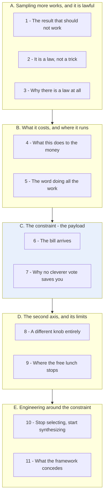
```mermaid
flowchart TB
    subgraph A["A. Sampling more works, and it is lawful"]
        S1["1 - The result that should not work"]
        S2["2 - It is a law, not a trick"]
        S3["3 - Why there is a law at all"]
    end
    subgraph B["B. What it costs, and where it runs"]
        S4["4 - What this does to the money"]
        S5["5 - The word doing all the work"]
    end
    subgraph C["C. The constraint - the payload"]
        S6["6 - The bill arrives"]
        S7["7 - Why no cleverer vote saves you"]
    end
    subgraph D["D. The second axis, and its limits"]
        S8["8 - A different knob entirely"]
        S9["9 - Where the free lunch stops"]
    end
    subgraph E["E. Engineering around the constraint"]
        S10["10 - Stop selecting, start synthesizing"]
        S11["11 - What the framework concedes"]
    end
    A --> B --> C --> D --> E

    style C fill:#e8f0fc
```

Movement A establishes that repeated sampling works and that its returns are predictable, and a reader
who already knows the *Large Language Monkeys* result can move through it quickly - though section 3
is worth slowing for, because the theorem there is the only peer-reviewed thing in the lecture and it
explains something most summaries of this area simply assert. Movement B is short and costs little to
skim, but it is where the word "coverage" stops being a technicality and becomes the hinge of the
argument.

Movement C is the payload and the reason to read this rather than lecture 1. Everything before it
builds a case for repeated sampling and everything after it works around a limitation established
here, so a reader who skims C will misread D and E as engineering flourishes rather than as responses
to a specific structural problem. Movement D adds the second axis and then, more usefully, draws the
boundary where the technique stops being worth its cost. Movement E is the engineering payoff, and it
is also where the source's conflict of interest is heaviest, so it rewards a suspicious reader.

*Synthesized from the walkthrough structure below.*

## Movement A - sampling more works, and it is lawful

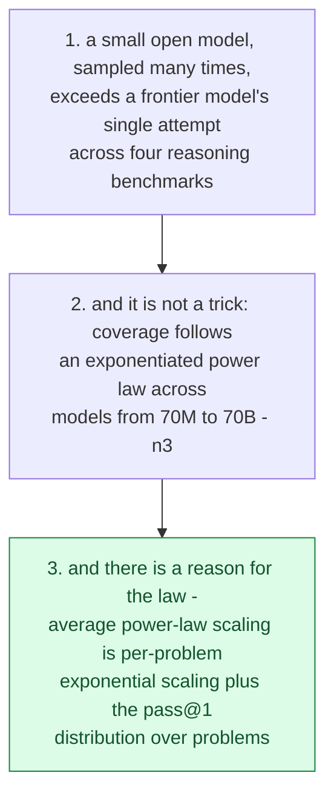
```mermaid
flowchart TB
    O["1. a small open model, sampled many times,<br/>exceeds a frontier model's single attempt<br/>across four reasoning benchmarks"]
    L["2. and it is not a trick: coverage follows<br/>an exponentiated power law across<br/>models from 70M to 70B - n3"]
    W["3. and there is a reason for the law -<br/>average power-law scaling is per-problem<br/>exponential scaling plus the pass@1<br/>distribution over problems"]

    O --> L --> W

    style W fill:#dcfce7,stroke:#15803d,color:#14532d
```

This is an evidence-strength diagram, not a results summary, and the three sections rise in how much
they explain rather than in how surprising they are. **The crux is that section 3 is the only
peer-reviewed thing in the lecture and it explains something most summaries of this area simply
assert**, which is why a reader who knows the headline result should still slow down there. It is
drawn as a straight ascent because each step answers the doubt raised by the one before: the result
looks like a fluke, the law says it is not, and the decomposition says why a law exists at all.

*Synthesized from `n3` and the sections below.*

### 1. The result that should not work

Start with something that ought to be impossible. Take Llama-3-8B, a small open model, and ask it a
hard reasoning problem ten thousand times. Somewhere in that pile of answers, on four separate
benchmarks, is a correct solution more often than GPT-4o produces one on its single attempt (`n1`).

At first glance this reads as a claim that a small model is secretly better than a large one, which is
obviously false. The correct reading is that **a model's first sample badly understates what the model
knows**. The lecturer puts it plainly, saying the models "already know the answers to these hard
problems and we are just, by doing this repeated sampling, eliciting those and surfacing those
answers. They just don't tell us that in the first trial" @
[`t=173s`](https://www.youtube.com/watch?v=-Ggc37xLj_Y&t=173s).

> 💡 **`pass@k`** is the probability that *at least one* of `k` samples is correct. It is not the
> probability that the model gives you a correct answer, because it says nothing about which of the
> `k` you would have picked.

Hold onto the y-axis label on the slide below. It reads **Coverage (pass@k)**, and two of its four
panels say **(Oracle Verifier)**. That will matter enormously in section 6, and it is the single most
important detail in the lecture.

### Key visual 1 - the headline, and its fine print

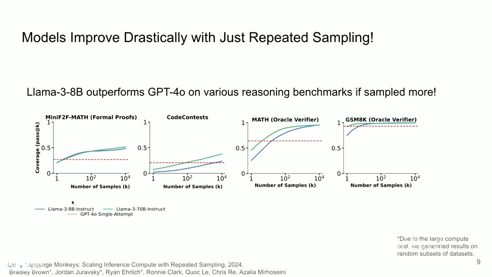

- What it teaches: repeated sampling closes and then reverses a large capability gap between models,
  on formal proofs, competitive code and two maths benchmarks. `n1` @
  [`t=137s`](https://www.youtube.com/watch?v=-Ggc37xLj_Y&t=137s)
- Corroborated by: "by doing this repeated sampling and selecting the correct one among the generated
  candidates, we can significantly improve the performance of these inferior models and make them
  better than these larger and proprietary ones."
- **Weak evidence, labelled here rather than at the end.** This is `d1` in `nodes.md`. The headline
  says "outperforms" while the axis says *coverage*, the baseline is GPT-4o **single-attempt**, and
  half the panels resolve selection with an oracle that is handed the ground truth. The comparison is
  one model's best-of-10,000-with-the-answer-key against another model's first try. The result is real
  and the framing is not, and section 6 is where the source itself proves it.

So the effect exists. The question a senior engineer asks next is whether it is a curiosity or
something you can plan around, and that turns on whether the returns are predictable.

### 2. It is a law, not a trick

They are predictable, and this is what moved repeated sampling from a prompting trick into a research
programme. Coverage against the number of samples fits an **exponentiated power law**,
`c = exp(a·k^b)`, where `k` is the sample count and `a` and `b` are fitted per model and benchmark
(`n3`).

> **Background, supplied.** Pre-training scaling laws relate test loss to parameters, data and
> compute, and their practical value was never the curve itself. It was that you could fit
> coefficients on small runs and then *predict* the loss of a run you had not yet paid for, which is
> what let labs commit tens of millions of dollars to a single training job. This paragraph is
> background rather than something the source establishes; skip it if you already hold it.

The value here is the same, transplanted. If you can fit the curve, you can answer "how many samples
do I need for 80% coverage" before spending anything, and the lecturer names exactly that use, saying
"we can predict how many samples we're going to need and how much resources we should allocate to
achieve that" @ [`t=394s`](https://www.youtube.com/watch?v=-Ggc37xLj_Y&t=394s) (`n4`). An inference
budget stops being a guess.

### Key visual 2 - the law, with its fits shown

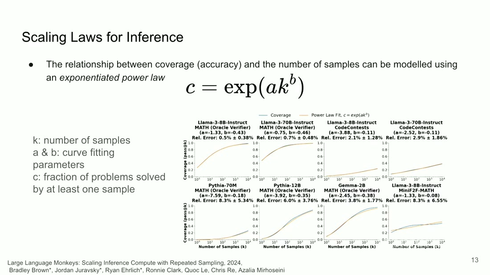

- What it teaches: one functional form fits coverage across eight model and benchmark pairs spanning
  three orders of magnitude in parameter count, from Pythia-70M to Llama-3-70B. `n3` @
  [`t=314s`](https://www.youtube.com/watch?v=-Ggc37xLj_Y&t=314s)
- Corroborated by: "the relationship between coverage and the number of samples ... follow an
  exponential power law."
- **Read the printed errors, because they qualify the claim being made over them.** The narration
  emphasises that even a 70M model shows the behaviour @
  [`t=442s`](https://www.youtube.com/watch?v=-Ggc37xLj_Y&t=442s), while the slide's own numbers show
  the fit there is roughly an order of magnitude worse than at 70B - 8.3% ± 5.34% relative error for
  Pythia-70M against 0.7% ± 0.48% for Llama-3-70B MATH. Recorded as `d3`. The universality is the
  rhetorical point, and the slide quietly concedes it is weakest where it sounds most striking.

A fitted curve tells you what happens without telling you why, and a law nobody can explain is a law
you cannot safely extrapolate. So why should coverage follow a power law at all?

### 3. Why there is a law at all

This is the best reasoning in the lecture and the only peer-reviewed result in it (ICML 2025). It is
also genuinely counter-intuitive, so it is worth deriving rather than stating.

Work out what happens for a *single* problem first. If the model has probability `p` of getting problem
`i` right on any one attempt, then the chance all `k` attempts fail is `(1-p)^k`, so
`pass_i@k = 1 - (1-p)^k`. That is **exponential** in `k`, and exponentials saturate fast. A problem
with `p = 0.01` is essentially solved by 500 samples and gains almost nothing from the next 9,500.

Now here is the puzzle. Every individual problem saturates exponentially, yet the *average* across a
benchmark keeps improving as a slow **power law** out to ten thousand samples. Averaging exponentials
should give you something that also flattens. So where does the long slow tail come from?

It cannot come from any single problem, so it must come from the *distribution* of problems. Suppose
the benchmark contains a heavy tail of problems with progressively tinier `p`. Then at every scale of
`k` there is some band of problems just now becoming reachable. Each one is saturating exponentially,
but they saturate at staggered points, and the envelope of staggered exponentials is a power law. The
lecturer's phrasing is that the tail "drags out" the exponential curves.

**The strong form of the theorem is what makes it worth carrying: the long tail is not merely
sufficient, it is necessary** (`n5`). In other words, a power law in average `pass@k` is *evidence
that* your benchmark has a heavy tail of very hard problems. That is a statement about your evaluation
set, not about your model.

### Key visual 3 - the decomposition

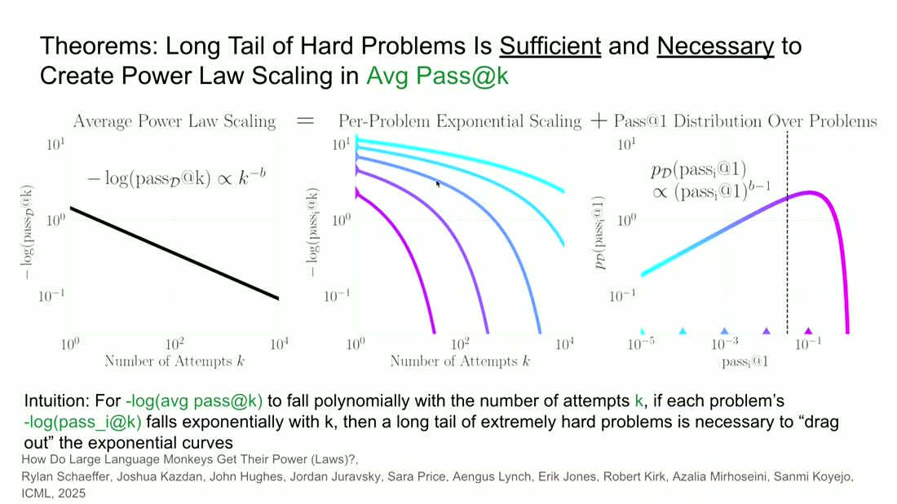

- What it teaches: the aggregate power law factorises into per-problem exponential behaviour and the
  shape of the `pass@1` distribution, and the required distribution is a specific one,
  `p(pass_i@1)` proportional to `(pass_i@1)^(b-1)`. `n5` @
  [`t=558s`](https://www.youtube.com/watch?v=-Ggc37xLj_Y&t=558s)
- Corroborated by: "in order to have the scaling laws that we observed there has to be the sufficient
  and necessary condition for it, is that we have a long tail of hard problems."

There is a practical payoff on the next slide that the lecturer walks straight past. If the exponent is
a property of the difficulty distribution, it can be estimated cheaply rather than measured
expensively, and the paper claims two to four orders of magnitude less inference compute to predict it
(`n7`). **That claim is figure-only and unnarrated**, which is why it is gated `single-leg` and why it
sits at the top of this note's research backlog. It is also the most immediately useful number in the
lecture, which is an odd thing to skip.

Knowing the shape of the curve tells you what more samples buy. It does not tell you whether buying
them is a sane thing to do with money, which is the next question.

## Movement B - what it costs, and where it runs

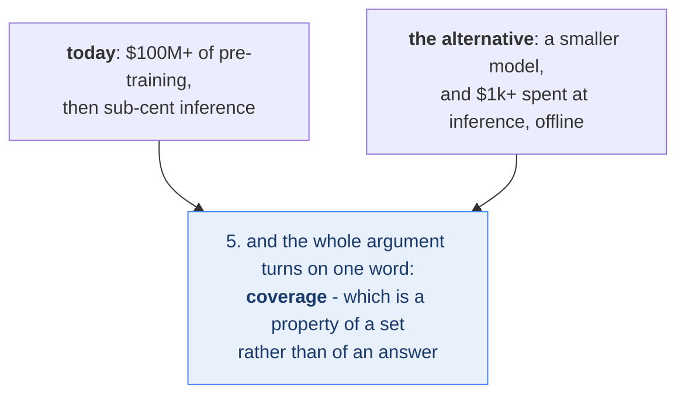
```mermaid
flowchart TB
    A["<b>today</b>: $100M+ of pre-training,<br/>then sub-cent inference"]
    B["<b>the alternative</b>: a smaller model,<br/>and $1k+ spent at inference, offline"]
    C["5. and the whole argument turns on one word:<br/><b>coverage</b> - which is a property of a set<br/>rather than of an answer"]

    A --> C
    B --> C

    style C fill:#e8f0fc,stroke:#4285f4,color:#1a3a6b
```

This is a reallocation diagram, not a cost model. **The crux is that this is a proposal to move money
between two budgets rather than to spend less, and the case for moving it rests entirely on what
"coverage" actually means.** The movement is short and easy to skim, which is precisely the risk:
section 5 is where a technical term stops being a definition and becomes the hinge the next movement
swings on. Note also that the alternative is framed as offline work, which quietly excludes every
latency-bound application.

*Synthesized from `n8` and the sections below.*

### 4. What this does to the money

The economics are why this became a paradigm rather than a paper. Historically almost all the compute
in a model's life was spent before anyone used it, on a pre-training run costing $100M+, followed by
fine-tuning at $1M+, after which each inference call cost a fraction of a cent (`n9`). Inference was
the cheap part by four to five orders of magnitude.

Repeated sampling proposes spending $1k+ on a *single problem*. Stated that way it sounds absurd, and
for a chat turn it is. The reframe that makes it sane is in the last line of the slide, which is that
**this compute can be offline**. The lecturer describes releasing "our agents to go solve a problem and
just keep generating tokens and keep improving the quality of the answers that they generate" @
[`t=730s`](https://www.youtube.com/watch?v=-Ggc37xLj_Y&t=730s). A thousand dollars is outrageous for an
interactive response and unremarkable for a problem worth solving once, such as a kernel you will ship,
a proof you need, or a patch against a bug that has already cost a week.

### Key visual 4 - the reallocation

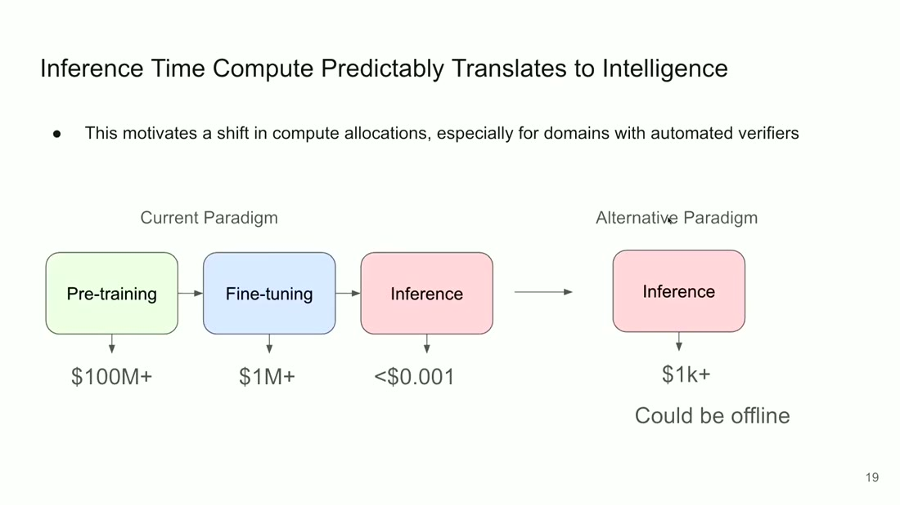

- What it teaches: the shift is not that inference gets more expensive, it is that inference becomes a
  place where capability can be *purchased incrementally*, in units small enough for people who cannot
  fund a pre-training run. `n9` @ [`t=714s`](https://www.youtube.com/watch?v=-Ggc37xLj_Y&t=714s)
- Corroborated by: "we have a new paradigm where we can spend a whole lot more compute on inference ...
  and this inference compute can be done offline."
- **The four dollar figures are illustrative orders of magnitude, not a costing of anything**, and
  they are gated `needs-check` for that reason. Trust the ratios, not the numbers.

That argument has a hole the lecture has so far walked around, and it is time to name it. Spending $1k
to generate a thousand candidate answers is worth something only if you can find the good one
afterwards.

### 5. The word doing all the work

Look back at what section 1 actually promised. It promised **coverage** - that a correct answer exists
somewhere in the pile. Every economic argument in section 4 quietly assumed you could get that answer
*out*, and nothing so far has explained how.

For one class of problem there is nothing to explain, because the answer is checkable by machine. A
formal proof either passes the proof checker or it does not. Generated code either passes the unit
tests or it does not. A generated CUDA kernel either produces the same outputs as the source PyTorch
for any input, or it does not (`n8`). In each case the check is automatic, cheap and correct, and the
CUDA framing is worth noting for how general it is: any translation between two languages with
executable semantics comes with a free verifier, because you can run both and compare.

> 💡 **Mechanical verifier.** A checker whose correctness does not depend on a model's judgement - a
> proof assistant, a test suite, a compiler, a simulator. The distinction that matters is not
> "automated versus manual" but "grounded in something outside the model versus produced by another
> model".

This is why the SWE-bench result below is the most interesting one in the first half. Software
engineering is an *agentic* task with real test suites attached, which puts it squarely in the
checkable class.

### Key visual 5 - it holds on agentic work

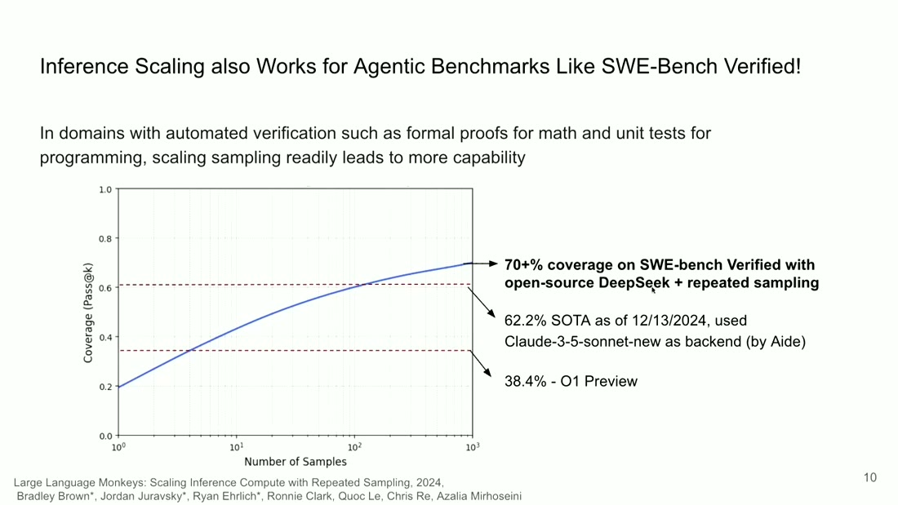

- What it teaches: the technique is not confined to maths puzzles. On SWE-bench Verified, coverage
  rises from about 0.20 at one sample to over 70% at a thousand, using an open-source model. `n2` @
  [`t=238s`](https://www.youtube.com/watch?v=-Ggc37xLj_Y&t=238s)
- Corroborated by: "in domains with automated verification such as formal proofs for math and unit
  tests for programming, scaling sampling readily leads to more capability" (slide subtitle, `n8`).
- **This slide carries the sharpest instance of `d1`, recorded separately as `d2`.** The 70+% is
  *coverage*. The two reference lines it is drawn against, 62.2% SOTA and 38.4% for o1-preview, are
  **resolution rates** by systems that had to commit to one answer. Narration pushes it further, to
  "can solve more ... problems than those" @
  [`t=253s`](https://www.youtube.com/watch?v=-Ggc37xLj_Y&t=253s). In fairness, and this is the
  mitigation: SWE-bench ships real tests, so unlike the MATH panels this gap is closable in principle
  rather than only with an answer key.

So where a mechanical verifier exists, the story is as good as advertised. The obvious question is what
the picture looks like where one does not, and the honest answer to that is the reason to read this
lecture.

## Movement C - the constraint

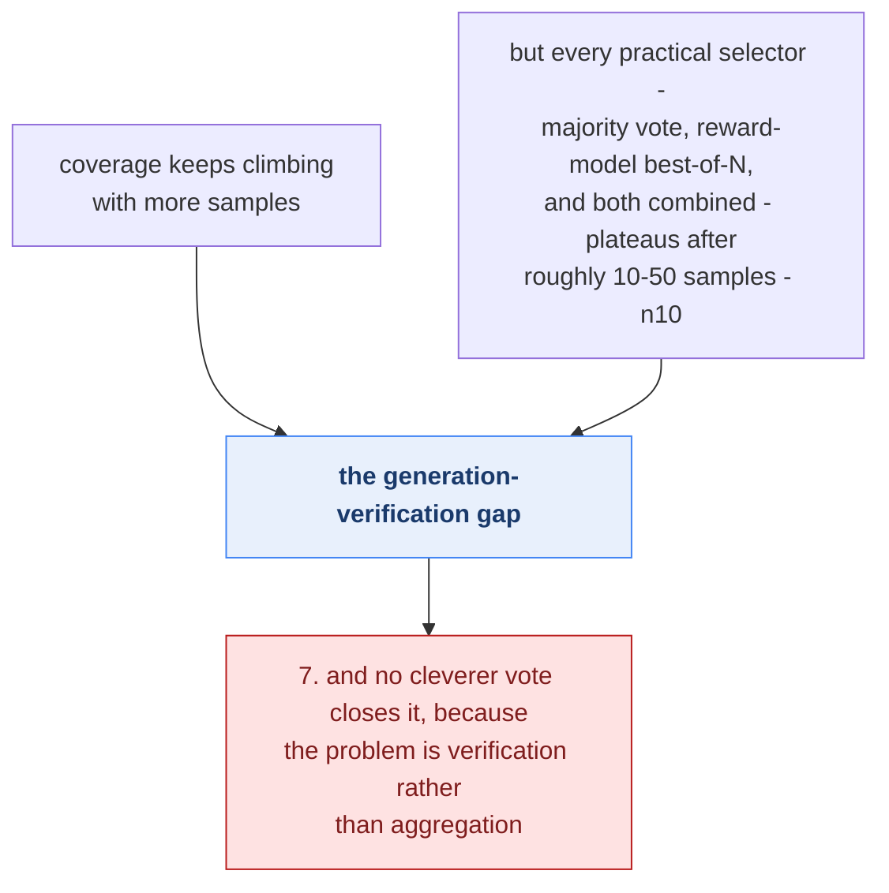
```mermaid
flowchart TB
    C["coverage keeps climbing<br/>with more samples"]
    S["but every practical selector -<br/>majority vote, reward-model best-of-N,<br/>and both combined - plateaus after<br/>roughly 10-50 samples - n10"]
    G["<b>the generation-verification gap</b>"]
    N["7. and no cleverer vote closes it, because<br/>the problem is verification rather<br/>than aggregation"]

    C --> G
    S --> G --> N

    style G fill:#e8f0fc,stroke:#4285f4,color:#1a3a6b
    style N fill:#fee2e2,stroke:#b91c1c,color:#7f1d1d
```

This is the payload of the note and the reason to read it rather than the previous lecture. **The
crux is that the gap between what sampling produces and what you can extract is structural, so the
plateau is not a weakness in any particular selector.** It is drawn with two lines converging because
the gap is a difference rather than a thing: it exists only in the distance between the rising curve
and the flat one. Everything before this movement builds a case for repeated sampling and everything
after it works around this limit, so a reader who skims here will misread D and E as flourishes rather
than as responses to a specific structural problem.

*Synthesized from `n10` and the sections below.*

### 6. The bill arrives

Here is where the source turns on its own headline. Take the same repeated sampling and replace the
oracle with something you could actually deploy. Majority voting, which picks the most frequent answer.
A reward model scoring each candidate, taking the best. Both combined.

Before looking at the chart, predict its shape. Coverage climbs steadily toward 1.0 across four orders
of magnitude of `k`. What do the deployable selectors do?

They stop almost immediately. Every one of them **plateaus after roughly ten to fifty samples** and
then stays flat while coverage keeps climbing for another three orders of magnitude (`n10`). On
Llama-3-8B MATH the deployable methods sit near 0.40 while coverage reaches about 0.95. The distance
between those two lines is the **generation-verification gap**, and it is the real subject of this
lecture.

> 💡 **Generation-verification gap.** The difference between what a model can produce somewhere in its
> sample set and what any available selection mechanism can actually extract from it. Generation is
> cheap and scales with compute; verification does not.

Now notice which way the gap points, because this is the part that should change how you read every
repeated-sampling result you meet. **The gap is narrow on easy benchmarks and enormous on hard ones**
(`n11`). On GSM8K the selectors reach about 0.87 against coverage of 1.0, which is close enough that
you might never think about it. On MATH they reach about 0.40 against 0.95. The technique's apparent
usefulness is highest exactly where its deployable value is lowest.

### Key visual 6 - the gap, and how it widens

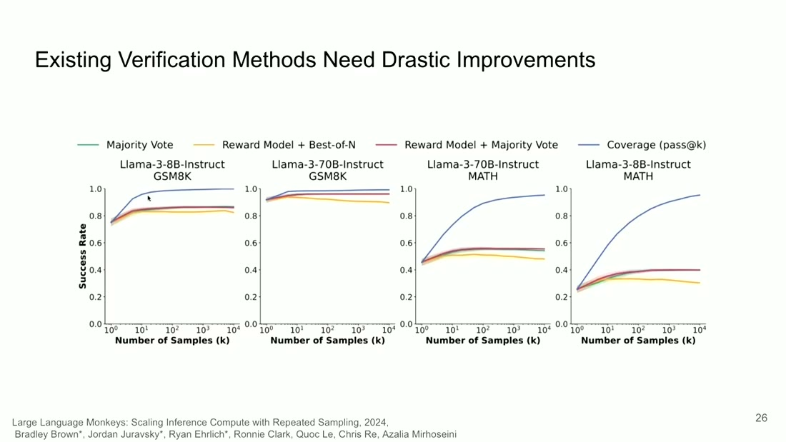

- What it teaches: three independent selection strategies, two models and two benchmarks, and the same
  result every time - selection saturates two orders of magnitude before generation does, and the
  shortfall grows with difficulty. `n10`, `n11` @
  [`t=1005s`](https://www.youtube.com/watch?v=-Ggc37xLj_Y&t=1005s)
- Corroborated by: "there is a large difference between majority voting, which plateaus after 10 or 50
  samples, and what we could possibly get if we had a perfect verifier. So this is a very very large
  gap."
- **This is the slide that refutes `frame_150`.** The blue coverage line here is the same quantity the
  headline slide plotted as though it were performance. Sixteen minutes separate the two, and the
  lecture never draws the connection, which is why `nodes.md` records it as a divergence rather than a
  caveat.

Understanding *that* selection fails is enough to stop you overclaiming. Understanding *why* it fails
is what stops you trying to fix it with a better voting scheme.

### 7. Why no cleverer vote saves you

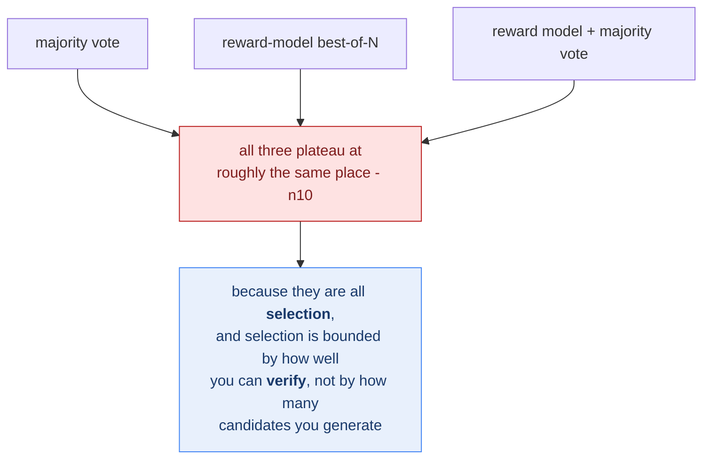
```mermaid
flowchart TB
    A["majority vote"]
    B["reward-model best-of-N"]
    C["reward model + majority vote"]
    P["all three plateau at<br/>roughly the same place - n10"]
    R["because they are all <b>selection</b>,<br/>and selection is bounded by how well<br/>you can <b>verify</b>, not by how many<br/>candidates you generate"]

    A --> P
    B --> P
    C --> P --> R

    style P fill:#fee2e2,stroke:#b91c1c,color:#7f1d1d
    style R fill:#e8f0fc,stroke:#4285f4,color:#1a3a6b
```

This is a common-cause diagram, not a method comparison. **The crux is that three unrelated selectors
failing at the same point is evidence about the problem rather than about the selectors**, which is
what promotes the plateau from an engineering annoyance to a structural constraint. It is drawn with
all three converging before the explanation because the convergence is the finding: any one of them
plateauing would invite a better selector, and all three plateauing together says the ceiling is
verification. That is also why Movement E's escape works by not selecting at all.

*Synthesized from `n10`.*

The reason is arithmetic rather than engineering. On the hardest problems, the correct answer turns up
**once, twice or three times in ten thousand samples** (`n12`).

Sit with that number for a moment. A selection method based on frequency is asking which answer
appeared most often, and the correct answer appeared 0.01% of the time. It is not merely that voting
picks the wrong answer. The right answer is indistinguishable from noise *by the statistic voting
uses*. The lecturer draws the conclusion directly, saying "it makes sense that a majority voting
mechanism cannot capture those because they're rare" @
[`t=1118s`](https://www.youtube.com/watch?v=-Ggc37xLj_Y&t=1118s).

This generalises past voting, and that is the transferable lesson. Any selector whose signal is
*agreement among samples* inherits this failure, because on the problems where sampling helped most
there is by construction almost no agreement to measure. Reward models escape the argument in
principle, since they score a candidate on its merits rather than its popularity. The chart in section
6 shows they do not escape it in practice.

One further constraint gets mentioned only in passing, in answer to a student, and it deserves to be
louder. Even *mechanical* verifiers are imperfect. Checking the maths answers by hand put agreement
somewhere "above like a 90" percent, and unit tests that do not truly cover the code will pass programs
that do not work (`n13`). **That figure is spoken, self-corrected mid-sentence and never shown on a
slide, so treat it as an order of magnitude rather than a measurement.** The principle survives the
imprecision. A verifier is a component with an error rate, and a loop that treats it as ground truth
will bank its errors.

So one axis of test-time compute is capped by something compute cannot buy. That is a good moment to
ask whether sampling more times is the only way to spend compute at inference.

## Movement D - the second axis, and where it stops paying

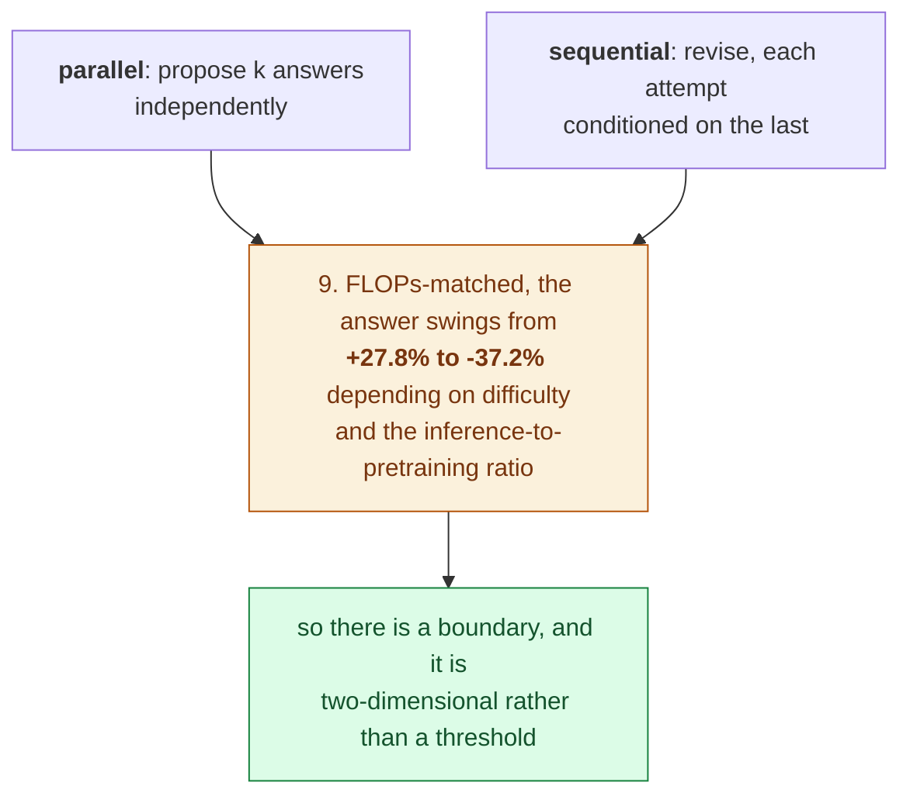
```mermaid
flowchart TB
    P["<b>parallel</b>: propose k answers<br/>independently"]
    S["<b>sequential</b>: revise, each attempt<br/>conditioned on the last"]
    F["9. FLOPs-matched, the answer swings from<br/><b>+27.8% to -37.2%</b> depending on difficulty<br/>and the inference-to-pretraining ratio"]
    B["so there is a boundary, and it is<br/>two-dimensional rather than a threshold"]

    P --> F
    S --> F --> B

    style F fill:#fbf1dc,stroke:#b45309,color:#78350f
    style B fill:#dcfce7,stroke:#15803d,color:#14532d
```

This is a boundary diagram, not a comparison. **The crux is the sign change: the same technique helps
by 28% and hurts by 37% depending on where you sit, which makes "does test-time compute work" an
unanswerable question as usually posed.** It is drawn with both axes feeding one measurement because
the useful result is not that sequential beats parallel or the reverse, but that the winner depends on
two variables you can actually look up for your own workload. This is the movement that turns the
lecture from advocacy into something you can plan against.

*Synthesized from `n18` and the sections below.*

### 8. A different knob entirely

It is not. Parallel sampling draws `k` independent attempts, which is why it produces both the
diversity that gives coverage its power and the disagreement that makes selection hard. **Sequential
revision** does the opposite. The model produces an attempt, then produces another *conditioned on* the
previous ones, refining rather than restarting (`n14`).

The two knobs have opposite characters, and it is worth being precise about why. Parallel sampling
explores, because independence is what lets one sample find a path the others missed. Sequential
revision exploits, because conditioning on previous attempts means later ones inherit whatever the
earlier ones got right, and also whatever they got wrong. A student in the room reaches this unprompted,
suggesting that easier problems need less parallel exploration because many paths reach the answer @
[`t=2692s`](https://www.youtube.com/watch?v=-Ggc37xLj_Y&t=2692s), and the lecturer agrees.

### Key visual 7 - the two axes

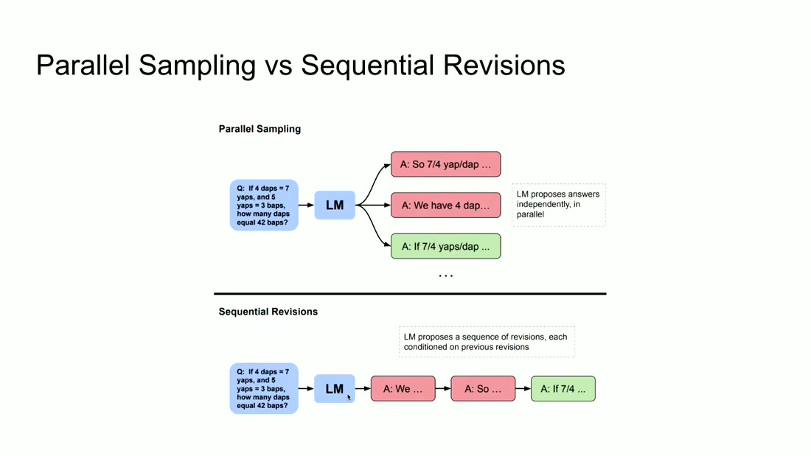

- What it teaches: the same inference budget can be spent on breadth or on depth, and these are
  genuinely different mechanisms rather than two settings of one. `n14` @
  [`t=1670s`](https://www.youtube.com/watch?v=-Ggc37xLj_Y&t=1670s)
- Corroborated by: "instead of asking the model multiple times, we let the model know that it can keep
  revising its answers, look into that from different angles ... until it's confident."
- Worth knowing before you build anything: revision needs **no special training**, since any
  instruction-tuned model will revise when prompted, while reasoning models now do it internally as
  trained behaviour (`n15`, `single-leg` - asserted in answer to a student, unmeasured).

Once you have two axes you need something to allocate between them, and that is where reward models
re-enter with a job beyond selection. An **outcome** reward model scores the finished answer; a
**process** reward model scores each intermediate step, where a step is a semantically meaningful chunk
rather than a token (`n16`). A step-level score changes what is possible, because you no longer have to
wait for a complete answer to know whether a line of reasoning is going badly. Sample a few
continuations at each step, keep the best two by PRM score, expand only those, and repeated sampling
has become **beam search over reasoning steps** (`n17`).

The natural next question is how to split a fixed budget between breadth and depth, and here the answer
is genuinely conditional. On easier problems the best results come from a heavily *sequential*
allocation, and on the hardest bins the optimum becomes unstable enough that the lecturer declines to
name one, saying "this optimality is kind of harder to say" @
[`t=2252s`](https://www.youtube.com/watch?v=-Ggc37xLj_Y&t=2252s) (`n19`, `needs-check` - one dataset,
one model family, 500 test questions).

That conditionality is a warning. If the right allocation depends on difficulty, then the value of the
whole approach probably does too, which is the question section 9 settles.

### 9. Where the free lunch stops

It does stop, and this is the most useful slide in the lecture for anyone deciding whether to spend
money here rather than on a bigger model.

The experiment matches FLOPs, comparing accuracy gained by spending compute at inference against
accuracy gained by spending the same compute on pre-training. The narration summarises the result as
easy and medium questions favouring test-time compute while the hardest favour a bigger model @
[`t=2286s`](https://www.youtube.com/watch?v=-Ggc37xLj_Y&t=2286s), and that summary is true enough to be
quotable and lossy enough to mislead.

**The chart's x-axis is the variable the summary drops: the ratio of inference tokens to pre-training
tokens** (`n20`). Read across it and the picture is two-dimensional rather than one. At a low ratio
every difficulty band gains, including hard questions at +11.8%. At parity, hard questions have already
turned negative at -11.9%. At a high ratio, medium questions collapse to -24.3% and hard questions to
-37.2%.

So the honest statement is not that test-time compute wins on easy problems. It is that **test-time
compute is a good deal in small doses across the board, and a bad deal in large doses on anything
hard**. The regime where you would most want it to work, spending heavily on your hardest problems, is
the regime where it performs worst.

### Key visual 8 - the boundary, in two dimensions

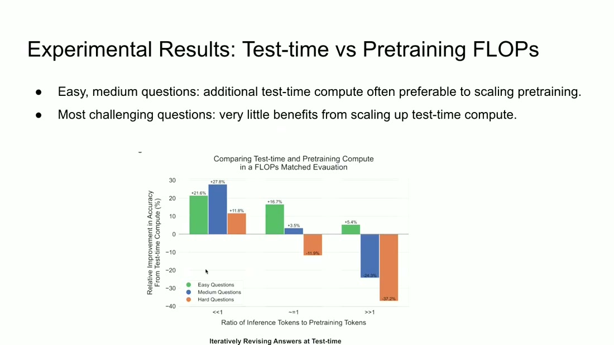

- What it teaches: the sign of the trade depends on two variables rather than one, and both have to be
  stated for the claim to mean anything. `n20` @
  [`t=2286s`](https://www.youtube.com/watch?v=-Ggc37xLj_Y&t=2286s)
- Corroborated by the narration, though **lossily** - recorded as `d4`. Note it runs the opposite way
  to the earlier divergences, with the chart honest and the sentence overstated, where every other
  divergence in this source has the slide overselling and the speech either matching or correcting.
- Two things the lecturer adds unprompted, both against her own argument's interest and therefore worth
  weighting up. Pre-training is paid **once** while test-time compute is paid **per query**, so the
  comparison is not a straight substitution (`n21`). And the access argument stands regardless of
  optimality, because "not everyone can pre-train a large model" (`n22`), which makes a technique that
  buys capability at serving time valuable to people for whom the other option does not exist at all.

Both sections 6 and 9 are limits, and they are limits of different kinds. Section 9 is a budget
constraint you can plan around by not overspending. Section 6 is a wall, because no amount of compute
manufactures a verifier. The last movement is what you do about the wall.

## Movement E - engineering around the constraint

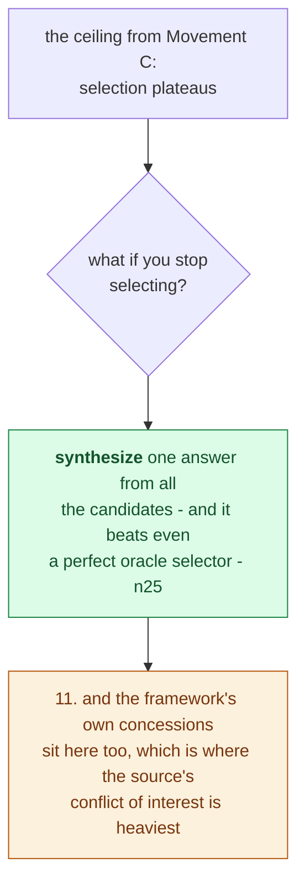
```mermaid
flowchart TB
    O["the ceiling from Movement C:<br/>selection plateaus"]
    Q{"what if you stop<br/>selecting?"}
    F["<b>synthesize</b> one answer from all<br/>the candidates - and it beats even<br/>a perfect oracle selector - n25"]
    C["11. and the framework's own concessions<br/>sit here too, which is where the source's<br/>conflict of interest is heaviest"]

    O --> Q --> F --> C

    style F fill:#dcfce7,stroke:#15803d,color:#14532d
    style C fill:#fbf1dc,stroke:#b45309,color:#78350f
```

This is a reframe diagram, and the question node is the whole movement. **The crux is that beating a
perfect oracle is only possible because synthesis is not doing the same job as selection - an oracle
picks the best candidate, and a fuser can produce something none of the candidates contained.** It is
drawn with the ceiling retained on top because the move only reads as significant against the plateau
it escapes. Section 11 is deliberately attached rather than separated: this is the movement where the
speaker's own framework is the answer, so it is the one that rewards a suspicious reader most.

*Synthesized from `n25` and the sections below.*

### 10. Stop selecting, start synthesizing

Everything so far has framed the problem as *selection*. You have `k` candidates and you must choose
one. That framing is what makes the generation-verification gap look unbeatable, because choosing
correctly is precisely what nothing can do reliably.

Archon drops the framing. Instead of asking which of the `k` candidates is best, hand a model **all
`k`** and ask it to write one answer informed by all of them (`n24`). The operation is called
**fusion**, and its result is the most surprising claim in the lecture.

**Fusion beats oracle selection** (`n25`). Not "beats majority voting", which would be unremarkable,
and not "approaches the oracle", which would be a good result. It exceeds the score you would get by
picking the single best candidate *with the answer key in hand*. That should sound impossible under the
selection framing, and it is exactly why the framing was wrong. The best single candidate is not the
ceiling, because a synthesis can combine a correct approach from one candidate with a correct
calculation from another and finish better than either.

### Key visual 9 - synthesis over selection

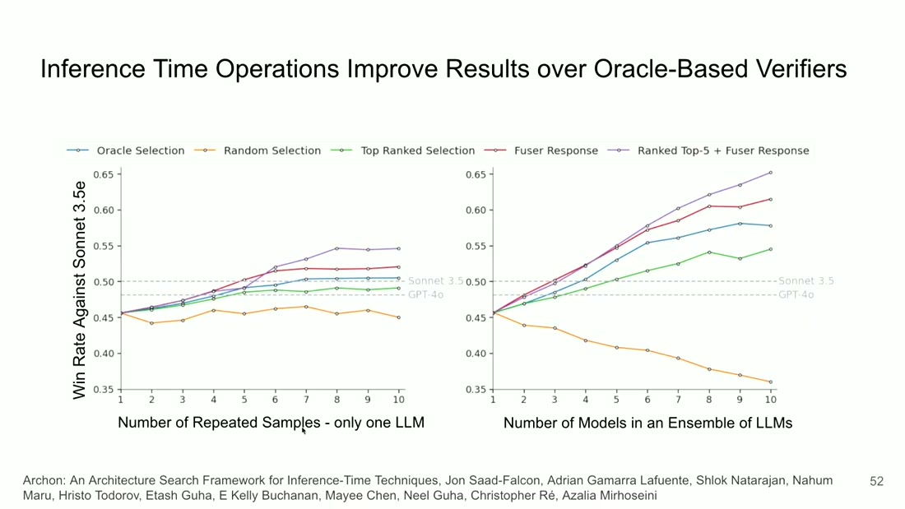

- What it teaches: fusion (~0.52) and filter-then-fuse (~0.547) both sit above oracle selection
  (~0.505) at ten samples, and the ordering holds across both the repeated-sample axis and the
  ensemble-of-models axis. `n25`, `n26` @
  [`t=3172s`](https://www.youtube.com/watch?v=-Ggc37xLj_Y&t=3172s)
- Corroborated by: "this paradigm is so powerful that that can on its own improve the quality of
  responses over oracle selection."
- **Vendor self-report, and the strongest such instance in the ingest.** This is the lecturer's own
  lab's result, presented to her own students, on one benchmark she does not name in the talk. Gated
  `needs-check`. It is also the single highest-value deep-research target this note produces, because
  if it replicates it changes the default architecture for any sampling-based system.
- The orange line is worth as much as the headline. Random selection *degrades* as more models join the
  ensemble, from 0.457 to 0.358, while every other curve rises (`n27`). The pool is getting better and
  worse at the same time, which is only a contradiction until you notice that all the value lives in
  the selection step and none of it in the generation step.

Filtering first helps further, with ranked-top-5-then-fuse beating fusion-of-everything at every sample
count (`n26`), which suggests the fuser has a context limit of its own and that feeding it rubbish
costs something. Stack these operations into layers and accuracy keeps improving, a result the source
analogises to depth in neural networks (`n28`, and **the analogy is rhetorical rather than mechanistic**
- no depth limit or turnover point is shown).

The framework is impressive, and this is exactly the point in a lecture where a reader should get
suspicious rather than enthusiastic.

### 11. What the framework concedes

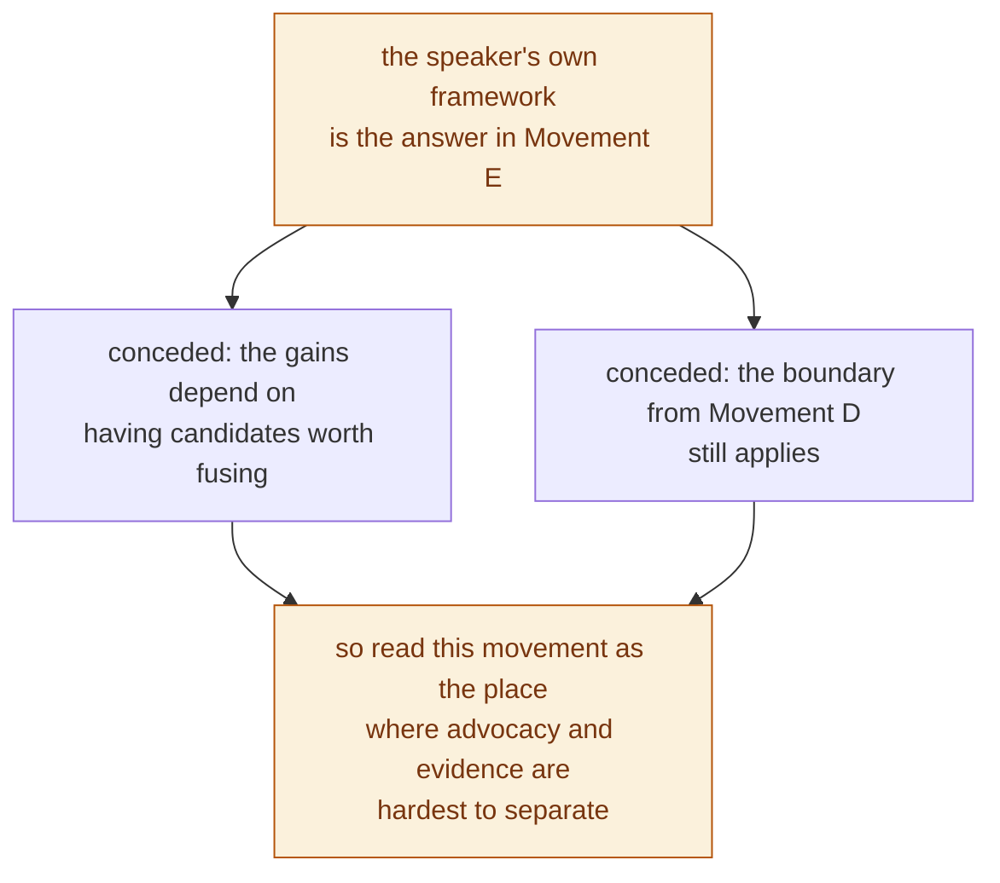
```mermaid
flowchart TB
    S["the speaker's own framework<br/>is the answer in Movement E"]
    C1["conceded: the gains depend on<br/>having candidates worth fusing"]
    C2["conceded: the boundary from Movement D<br/>still applies"]
    R["so read this movement as the place<br/>where advocacy and evidence are<br/>hardest to separate"]

    S --> C1 --> R
    S --> C2 --> R

    style S fill:#fbf1dc,stroke:#b45309,color:#78350f
    style R fill:#fbf1dc,stroke:#b45309,color:#78350f
```

This is a conflict-of-interest diagram, not a limitations list. **The crux is that the strongest
result in the lecture is also the one the speaker has the most stake in, and the concessions are what
make it citable rather than what weaken it.** It is drawn with both concessions returning to a single
reading instruction because the point is not either limitation individually but the posture they
should induce. A source that states what its own method requires is doing the thing this brain rewards;
that does not convert a demonstration into a measurement.

*Synthesized from the section below. The reading instruction is this brain's.*

Two admissions sit in the last five minutes, and both are more informative than the headline.

The first is that **the search space had to be hand-constrained before searching it** (`n29`). One
operation type per layer, generator always first, critic before any ranker or fuser, unit-test
generator always followed by an evaluator. The lecturer is candid about why, saying "we limited the
search space just because doing this search is very expensive" @
[`t=3443s`](https://www.youtube.com/watch?v=-Ggc37xLj_Y&t=3443s). So the automated architecture search
is a search *within* a hand-designed family, and that family was discovered offline by people. This
does not invalidate the result, and it does bound what the word "search" is doing. Anyone reading it as
"the optimizer found the architecture" is reading it wrong.

The second admission redeems the whole lecture. Archon **emits exactly one response** (`n31`). Its
headline number, beating GPT-4o and Claude-3.5-Sonnet by an average of 14.1%, is measured on **pass@1**
(`n30`, `needs-check` - senior author, own lab, publication-era baselines, no cost-matched comparison).
The lecturer says so explicitly, noting "it's like you're optimizing pass@1 at the very end" @
[`t=3687s`](https://www.youtube.com/watch?v=-Ggc37xLj_Y&t=3687s).

That is the correct way to report this class of result, and it is what `frame_150` and `frame_235` did
not do. **The same lecturer, in the same hour, reports coverage as performance when presenting the
sampling results and reports pass@1 honestly when presenting the architecture results.** The difference
cannot be integrity, because it is one person. It is that the sampling papers *measure* coverage and
the architecture paper *produces* an answer, so the reporting follows the artifact. Read that as a rule
for reading everyone else's results too. It is the most durable thing this lecture teaches, and it
teaches it by accident.

## Diagram (mental model)

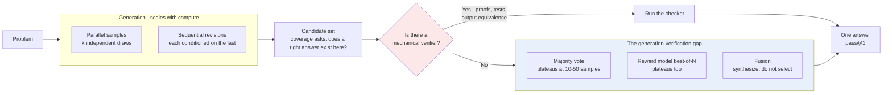
```mermaid
flowchart LR
    Q[Problem] --> GEN

    subgraph GEN["Generation - scales with compute"]
        P["Parallel samples<br/>k independent draws"]
        S["Sequential revisions<br/>each conditioned on the last"]
    end

    GEN --> SET["Candidate set<br/>coverage asks: does a right answer exist here?"]

    SET --> WALL{"Is there a<br/>mechanical verifier?"}

    WALL -->|"Yes - proofs, tests,<br/>output equivalence"| VER["Run the checker"]
    WALL -->|"No"| GAP

    subgraph GAP["The generation-verification gap"]
        MV["Majority vote<br/>plateaus at 10-50 samples"]
        RM["Reward model best-of-N<br/>plateaus too"]
        FUSE["Fusion<br/>synthesize, do not select"]
    end

    VER --> OUT["One answer<br/>pass@1"]
    GAP --> OUT

    style GAP fill:#e8f0fc
    style WALL fill:#fce8e8
```

The flow runs left to right from a problem to a single delivered answer, and the two shaded regions
carry the meaning. The red diamond is the question that decides everything downstream of it, and the
blue box is the region where this lecture's real content lives.

**The crux: generation and verification are separate systems with separate scaling behaviour, and only
one of them responds to compute.**

The shape is worth arguing with, because the obvious alternative shape is the one most people carry and
it is wrong. The intuitive picture is a single pipeline where more compute in yields a better answer
out, and it draws no boundary at all between producing candidates and committing to one. Drawing that
boundary explicitly is what makes the failure legible, because it shows that everything to the left of
the diamond is bought with money while everything to the right is bought with a property of your
*domain* that you either have or do not.

Two details of the drawing repay attention. The candidate set is labelled with a question rather than a
metric, because "coverage" reads as a score and behaves as an existence claim, and treating an
existence claim as a score is the error this whole note circles. And fusion sits *inside* the gap
rather than beside it, because it neither closes the gap nor escapes it. It extracts more value from
within the gap than selection can, while the wall itself is untouched, so a system with no mechanical
verifier still cannot tell you when it is wrong.

*Synthesized from `n8`, `n10`, `n12`, `n14`, `n25`, `n31`.*

## 💡 Terms

| Term | Explanation |
|---|---|
| **Coverage** / `pass@k` | The fraction of problems for which *at least one* of `k` samples is correct. An existence claim about a candidate set, not a score a system can deliver. |
| **`pass@1`** | Accuracy when the system commits to a single answer. What a user actually experiences, and the only one of the two that is deployable. |
| **Generation-verification gap** | The distance between coverage and what any available selector can extract from the same samples. Widens with problem difficulty. |
| **Mechanical verifier** | A correctness check grounded outside the model - proof checker, test suite, compiler, simulator. Distinct from a model-based judge. |
| **Exponentiated power law** | `c = exp(a·k^b)`, the fitted relationship between coverage and sample count. Its exponent is a property of the benchmark's difficulty distribution, not only of the model. |
| **Parallel sampling** | Drawing `k` independent attempts. Explores; produces the diversity that gives coverage its power and the disagreement that makes selection hard. |
| **Sequential revision** | Each attempt conditioned on previous ones. Exploits; inherits earlier correctness and earlier mistakes alike. |
| **Outcome reward model (ORM)** | Scores a finished answer. |
| **Process reward model (PRM)** | Scores each intermediate *step*, where a step is a semantically meaningful chunk rather than a token. Enables beam search over reasoning steps. |
| **Fusion** | Handing a model all `k` candidates and asking it to synthesize one answer, rather than selecting among them. |
| **ITAS** | Inference-time architecture search - Archon's optimizer, composing inference-time operations into layers under an inference-call budget. |

## What to distrust in this note

**Tier and independence, which is the heaviest caveat here.** The lecture is **T4**, teaching **T3**
preprints, and the presenter is **senior author of three of the four papers**. The exception is Snell
et al. on compute-optimal scaling, and it is also the result presented with the most qualification -
not a coincidence worth ignoring. The single strongest citation is the power-laws paper (`n5`), which
is ICML 2025 and therefore peer-reviewed. **Nothing in this note has external corroboration**, because
no deep-research pass was requested or run, so every citation points inside one lecture.

**This is not a second source on anything S14 said.** It is lecture 2 of the same course by the same
lecturers, so where the two agree, that is one person repeating herself eight days apart. Under the
independence rule this cannot raise confidence in anything, and
[`self-improvement.md`](../../brain/topics/self-improvement.md) was written before this lecture arrived
specifically to stop the source count from drifting upward as though it could.

**What the figures do and do not measure.** Every chart in the first half plots **coverage**, which is
an existence claim resolved by an oracle on several panels. Only the Archon results in the last segment
report **pass@1**. Mixing the two is this source's characteristic error, and the gate recorded it three
times (`d1`, `d2`, `d3`), always in the direction of overstatement.

**The most reusable claims here are among the least corroborated, which is the uncomfortable part.**
The fusion-beats-oracle result (`n25`) is the finding most likely to change how a reader builds
something, and it is the authors' own, on one unnamed benchmark, gated `needs-check`. The cheap
exponent-prediction method (`n7`) is the most immediately useful number and it is **figure-only and
unnarrated**. The verifier-accuracy figure (`n13`) is spoken, self-corrected mid-sentence and never
shown. Treat all three as leads rather than facts.

**The `Background, supplied` block in section 2 is mine, not the source's**, and is uncited by
construction. So is part of the derivation in section 3: the source states the theorem and gives a
one-sentence intuition, while the staggered-exponentials explanation of *why* averaging produces a
power law is this brain's reading of the slide rather than something the lecturer says.

## Open questions

- **Does fusion really beat oracle selection, and on what?** (`n25`, `n26`) The highest-value research
  target this note produces. It is one lab's result on an unnamed benchmark, and if it replicates it
  changes the default architecture for any sampling-based system.
- **Is the cheap exponent-prediction method real, and how cheap?** (`n7`) Claimed at 2-4 orders of
  magnitude less inference compute, figure-only, never narrated. It would convert inference budgeting
  from measurement into estimation.
- **What actually closes the generation-verification gap?** (`n10`) The lecture names it as the open
  problem and points at a released dataset of 10,000 samples per problem @
  [`t=1484s`](https://www.youtube.com/watch?v=-Ggc37xLj_Y&t=1484s). Two student suggestions in the room
  are worth chasing independently: verifying by *elimination* rather than confirmation, since proving an
  answer wrong may be cheaper than proving one right; and ensembling many weak verifiers.
- **How accurate are mechanical verifiers in practice?** (`n13`) "Above like a 90" percent is the only
  number offered, spoken and never shown. This bears directly on claim 114 from S13, where a real,
  cheap, automatic verifier banked a random-seed change.
- **Does the depth analogy have a limit?** (`n28`) More layers of inference-time operations keep
  helping, and no turnover point is shown. Neural networks have one, and no reason is given to think
  this does not.
- **What is the compute-matched cost of Archon's 14.1%?** (`n30`) The comparison counts inference calls,
  but no cost-matched or latency-matched result is shown, and a layered architecture over an ensemble is
  not cheap.

## Feeds these topics

- [`../../brain/topics/self-improvement.md`](../../brain/topics/self-improvement.md) - claims **128,
  130, 131, 133**. The mechanism half of what S14 promised: the coverage/precision decomposition it
  introduced is here given its scaling law, its cause, the measured size of the gap between its two
  halves, and a way around that gap. Claim 131 **bounds** S14's claim 123 rather than corroborating
  it, which is the only thing a non-independent source is allowed to do.
- [`../../brain/topics/evals.md`](../../brain/topics/evals.md) - claims **129 and 132**. Both are
  claims about *measurement* rather than about models: what a benchmark's scaling exponent reveals
  about the benchmark itself, and the reporting failure of quoting coverage as performance.
- [`../../brain/topics/agents.md`](../../brain/topics/agents.md) - claim **134**. The agentic case
  (SWE-bench) is the checkable case, which is a statement about which agent tasks this technique
  suits.

**Deliberately not filed to [`inferencing.md`](../../brain/topics/inferencing.md), which is the one
routing call worth recording.** That note is still `seed` with zero sources, and a lecture titled
"Test-Time Compute Scaling" looks like exactly what it has been waiting for. It is not. Its scope is
*serving* - prefill and decode, the KV cache, batching, quantization, speculative decoding, throughput
against latency - and this source teaches none of it. Under
[ADR-0015](../../brain/decisions/0015-an-architecture-is-not-an-identity-source.md), a source advances
a topic when it **teaches within** the scope, not when it **depends on** it, and S15 depends on
inference serving while teaching nothing about how it works. S14 declined the same filing for the same
reason. **Filing it here would have made an empty seed note look populated, using material that
answers none of the questions a reader would open it for.**

## Presentation narrative

*A talk track for a team deciding whether to spend at inference time, derived entirely from the gated
nodes above. It is a lecture rather than a paper, and the movement carrying its strongest result is
also the one where the speaker's own framework is the answer, which the last slide addresses.*

### Slide 1 - You can buy accuracy at inference time instead of at training time

**A small open model sampled many times exceeds a frontier model's single attempt across four
reasoning benchmarks.** That is the result that should not work, and the reason it matters
commercially is that it moves a capability question into a budget you already control.

The returns are lawful enough to plan against rather than merely observed. Coverage follows an
exponentiated power law in the number of samples, and it holds across models from 70 million to 70
billion parameters [n3]. Section 3 of the note explains why a law exists at all, and it is the only
peer-reviewed thing in the lecture.

This is the headline, and the fine print is in the axis label. **The crux is that the y-axis is
coverage, not accuracy** - which is the distinction the next two slides are about [`n3`].

### Slide 2 - Coverage is a property of the set, not of an answer

**Sampling gets you a set containing a right answer. It does not get you the right answer.** That
single sentence is the hinge of the whole argument, and it is easy to slide past because "coverage"
sounds like a technicality.

The practical consequence arrives immediately. Every way of picking one answer out of the set -
majority vote, reward-model best-of-N, and both combined - plateaus after roughly ten to fifty samples
while the set itself keeps improving [n10]. So you are paying for a curve that keeps rising and
receiving one that has already flattened.

This is the constraint, and it is the reason to read this lecture rather than the previous one. **The
crux is that three unrelated selectors plateau in the same place**, which is evidence about the
problem rather than about the selectors [`n10`].

### Slide 3 - The gap between those two curves is what decides whether this pays

**That distance is the generation-verification gap, and it is structural rather than an artefact of
any particular selector.** Where verification is cheap and reliable - a unit test passes, a flag
string matches, a proof checks - the gap is narrow and repeated sampling converts almost directly into
accuracy. Where verification is a judgement call, the gap is wide and most of what you buy is
unreachable.

The question for this room is therefore not whether test-time compute works. It is how well your
domain can verify, because that is the variable that decides the return. Teams that already have a
strong automatic checker are the ones for whom this technique is close to free money.

This is why a law exists at all. **The crux is that the population curve is the sum of per-problem
curves**, so a benchmark average hides enormous variation in which problems are actually reachable
[`n3`].

### Slide 4 - It is a reallocation of spend, and it excludes latency-bound work

**The proposal is to move money from a $100M+ pre-training budget with sub-cent inference, to a
smaller model with $1k+ spent per problem at inference, offline.** Framed that way it is a
procurement question rather than a research one.

The word doing quiet work there is *offline*. A thousand samples per problem is not a thing you do
behind a user-facing request, so this whole technique addresses batch and asynchronous work and
excludes anything latency-bound. That constraint is worth stating early in any internal discussion,
because it removes a large fraction of candidate use cases before the cost analysis starts.

This is the reallocation. **The crux is that the two bars are different budgets rather than different
sizes of the same one** [`n8`].

### Slide 5 - There is a second axis, and the same technique swings from +28% to -37%

**Parallel sampling proposes answers independently; sequential revision conditions each attempt on the
last. FLOPs-matched, the gain ranges from +27.8% to -37.2% depending on problem difficulty and the
inference-to-pretraining ratio.**

That sign change is the most operationally useful number in the lecture. It means "does test-time
compute work" is unanswerable as posed, and the answerable version is whether it works at your
difficulty and your compute ratio. Both are things you can look up for your own workload rather than
argue about.

This is a boundary in two dimensions, not a threshold. **The crux is that the wrong choice is worse
than not doing it at all** [`n18`].

### Slide 6 - Stop selecting, start synthesizing, and read the last movement suspiciously

**Fusing an answer out of all the candidates beats even a perfect oracle selector [n25].** That is
only possible because synthesis is not doing selection's job: an oracle picks the best candidate a
fuser can produce something none of the candidates contained.

So the decision this supports is narrow and concrete. If you have cheap automatic verification and
offline work, sample hard and fuse rather than vote. If verification is a judgement call or the work
is latency-bound, this technique is not for you and the boundary in slide 5 says so quantitatively.

I want to name the conflict plainly. The strongest result here is the speaker's own framework, in the
movement where advocacy and evidence are hardest to separate. The framework does concede what it
requires, which is what makes it citable, and a demonstration by its author is still a demonstration
rather than a measurement.

This is the reframe, and the degrading line matters as much as the rising one. **The crux is that
adding models helps only if you fuse; under random selection it actively hurts** [`n25`].

### Key takeaway message

Sampling a model many times buys coverage, which is a property of a set rather than of an answer, and
every practical way of extracting one answer plateaus after ten to fifty samples while coverage keeps
climbing. That distance is the generation-verification gap, and it is what decides whether the
technique pays: cheap reliable verification converts samples into accuracy, and judgement-based
verification leaves most of what you bought unreachable. The scaling is lawful enough to budget
against, the work has to be offline, and FLOPs-matched the same technique ranges from +28% to -37%
depending on difficulty and compute ratio. The move that escapes the ceiling is to stop selecting a
candidate and start synthesizing one, which beats a perfect oracle - and which is also the speaker's
own framework, so read that part suspiciously.
