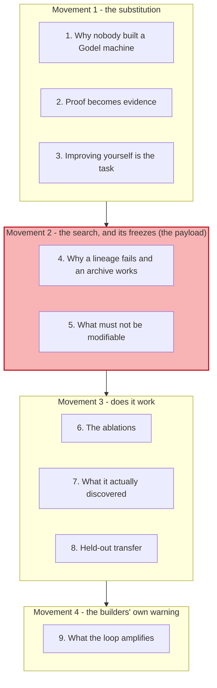
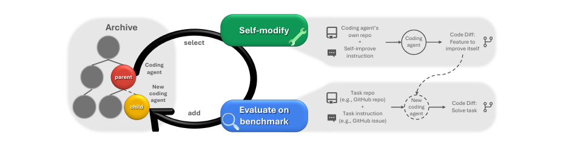
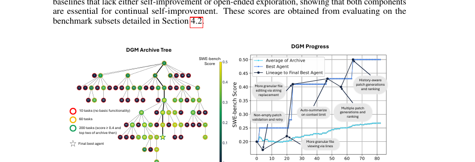
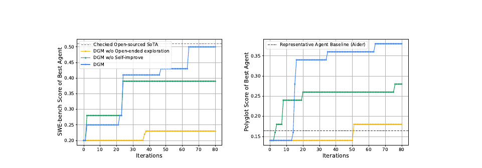
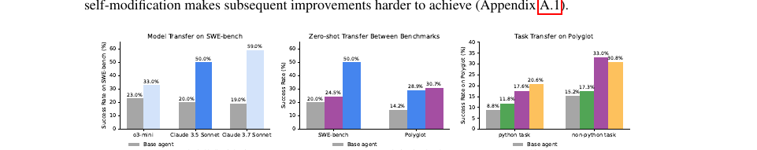
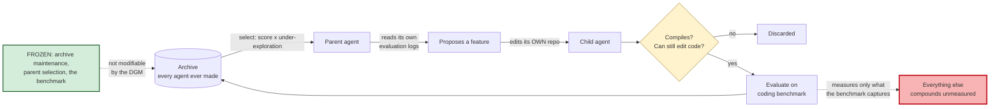

# Learning - The Darwin Gödel Machine: what you freeze when everything else can change

> Persona: **curator + mentor** - re-adopt when working this file.
> Written for a senior engineer who holds S13 (`karpathy/autoresearch`) and S14/S15, and who is
> building something that improves itself. Every claim carries a node ID (`n5`, `d1`) from
> [`nodes.md`](nodes.md). Blocks marked **Background, supplied** are mine, not the paper's, and are
> uncited by construction.

## TL;DR

Schmidhuber's Gödel machine rewrites its own code only when it can **prove** the change beneficial,
which is why nobody has built one. The DGM's move is to swap the proof for **empirical evidence** on a
benchmark (`n1`), and then to handle everything that follows from being able to be wrong. It improves
its own codebase - self-improvement *is* the coding task it is measured on (`n2`) - and keeps every
agent it has ever produced in an **archive**, selecting parents by score *and* by how little explored
they are (`n3`, `n4`). Over 80 iterations that takes SWE-bench from **20.0% to 50.0%** and Polyglot
from 14.2% to 30.7% (`n7`), and **two ablations show both components are load-bearing**: freeze the
meta-agent and progress plateaus, keep only the latest agent and it plateaus lower (`n8`). What it
discovers is unglamorous - better file editing, patch ranking, retry on empty patches (`n10`) - and it
**transfers to held-out models, benchmarks and languages** (`n11`). The section to read for your build
is §5: **the builders state that if your benchmark does not capture every property you care about, the
loop amplifies whatever it does not measure** (`n12`). That is S19's V-S5, said by the people running
the loop.

## The 1-minute version

This article covers an ICLR 2026 paper - the strongest venue in this brain - that builds the first
working instance of a fifty-year-old idea: an AI that rewrites its own code to get better at rewriting
its own code. The first thing to establish is why the idea sat unbuilt, because the answer determines
the whole design.

The problem is that the original formulation demanded the impossible. Schmidhuber's **Gödel machine**
modifies itself only when it can *prove* the modification is net beneficial, which guarantees safety
and, as the paper puts it, "in practice and without restrictive assumptions about the system, it is
impossible to formally prove whether a modification to an AI system will be beneficial" (`n1`).

Why relaxing that is harder than it sounds is the interesting part. Swap **proof** for **evidence on a
benchmark** and you can now build the thing - and you have also accepted that some modifications will
be wrong, some evaluations will be noisy, and the system can walk into a local optimum and stay there.
Every remaining design decision is a response to one of those three.

The naive fix is to hill-climb: keep the current best agent, modify it, keep the change if the score
improves. **That is the paper's own second baseline, and it plateaus lowest of the three** (`n8`),
because a single bad self-modification damages the only agent you have and every subsequent
improvement has to be made from a worse starting point.

The idea is to keep everything. The DGM maintains an **archive** of every agent it has produced,
selects a parent from the whole archive rather than from the frontier, and weights that selection by
performance **and inversely by how many children an agent already has** (`n3`, `n4`). Every agent
keeps a non-zero chance of being selected. That is what lets the run recover from its own dips: at
iterations 4 and 56 the score fell below the parent's, and the archive let the search continue down
that branch and eventually exceed everything before it (`n9`).

How it works in the loop is three steps. Select a parent from the archive; have it read its own
benchmark logs, propose a feature, and implement it in its own codebase; evaluate the result and add
it back. **Only agents that compile and can still edit a codebase are admitted** (`n5`), because only
those can continue the loop.

What it costs to be safe is the part worth copying. **The meta-level is frozen** - archive maintenance
and parent selection are fixed and the DGM cannot modify them (`n6`) - and the safeguards are all
containment rather than correctness: sandboxes, per-execution time limits, a modifiable scope confined
to the agent's own Python code, and a **traceable lineage** of every modification (`n13`).

How far to trust it is the easiest answer in this brain's set. ICLR main track, open-sourced code, two
ablations that isolate the two claimed components, and held-out transfer across models, benchmarks and
languages. The caveats are about **scope**: the model never changes, only the scaffolding around it
(`d3`), the evaluation is staged with a heuristic noise threshold (`d1`), and the meta-level being
fixed bounds how "open-ended" the search really is (`d4`).

The narrative above is the argument. The table below is the same argument compressed for someone
returning to check one row.

| | |
|---|---|
| **The problem** | A Gödel machine self-modifies only on a **proof** the change helps, and such proofs are impossible in practice (`n1`) |
| **Why the obvious answer fails** | Hill-climbing on the current best agent plateaus lowest of the three configurations, because one bad self-modification damages the only agent you have (`n8`) |
| **The idea** | Swap proof for **empirical evidence**, and keep an **archive** of every agent - selecting parents by score *and inversely by how explored they are*, so no branch is ever closed off (`n1`, `n3`, `n4`) |
| **How it works** | Select a parent, have it read its own evaluation logs and implement a feature in its own codebase, evaluate, add back. **Only agents that compile and can still edit code are admitted** (`n5`) |
| **What it costs / found** | SWE-bench 20.0% to 50.0%, Polyglot 14.2% to 30.7% over 80 iterations; **both components ablation-confirmed necessary**; improvements transfer to held-out models, benchmarks and languages (`n7`, `n8`, `n11`) |
| **How far to trust it** | **ICLR 2026 main track, open code, real ablations** - the best-evidenced source here. Caveats are scope: **the model never changes** (`d3`), evaluation is staged on a heuristic threshold (`d1`), and the search procedure itself is frozen (`d4`) |

## Key claims

- **Replace the proof with evidence, and the idea becomes buildable** - the Gödel machine's demand for
  provable improvement is what kept it theoretical (`n1`).
- **Self-improvement is framed as a coding task on the agent's own repository**, so benchmark progress
  and self-improvement capability are the same measurement (`n2`).
- **An archive beats a lineage, and it is ablation-confirmed.** Keeping only the latest agent plateaus
  lowest; freezing the meta-agent plateaus in the middle; the full DGM outperforms both (`n8`,
  `fig2_results_ablations.png`).
- **Parent selection weights performance *and* under-exploration**, with every agent retaining
  non-zero probability (`n4`), which is what lets the search recover from its own dips at iterations 4
  and 56 (`n9`).
- **The viability gate: only agents that compile and can still edit a codebase enter the archive**
  (`n5`). **And the meta-level is frozen** - the DGM cannot modify its own archive maintenance or
  parent selection (`n6`).
- **SWE-bench 20.0% to 50.0%, Polyglot 14.2% to 30.7%, over 80 iterations** (`n7`).
- **What it discovers is tooling, not cleverness** - granular file editing, patch ranking, history-aware
  generation, retry on empty patches (`n10`, `fig3_archive_tree.png`).
- **The gains are not benchmark overfitting**: they transfer to held-out models (Claude 3.7 Sonnet
  19.0% to 59.5%), to a held-out benchmark, and to unseen programming languages (`n11`,
  `fig4_transfer.png`).
- **The builders state the amplification hazard themselves**: if the benchmark does not capture every
  property you care about, "the self-improvement loop could amplify misalignment over successive
  generations" (`n12`). **This is S19's V-S5 from the builders' side.**
- **Every safeguard is containment, not correctness** - sandbox, time limit, scoped modifiable
  surface, traceable lineage (`n13`) - and they name an **unmodifiable supervisor** as future work
  (`n15`).

## What you will learn, and in what order

Four movements top to bottom. Movement 1 is short and establishes the one substitution everything else
responds to. **Movement 2 is the payload for anyone building this**, because it is where the design
decisions live: section 4 derives the archive from the failure of hill-climbing, and section 5 lists
what the system is forbidden to touch - which is the part S13 already taught this brain to look for
first. Movement 3 is the evidence, and it is unusually good; section 6 in particular is the only
ablation-backed claim about self-improving architecture anywhere in this brain. **Movement 4 is one
section and it is where this source meets the security track** - the builders' statement of the
amplification hazard is the same mechanism S19 predicted adversarially, and reading it after section 5
is what makes the freezes look like safety engineering rather than housekeeping.

## 1. Why nobody built a Gödel machine

> **Background, supplied.** Schmidhuber's **Gödel machine** (2007) is a theoretical design for a
> self-improving program. It holds a proof searcher alongside its own source code, and it rewrites
> itself **only when it has proved** that the rewrite improves its expected future performance. The
> elegance is that safety and improvement come from the same mechanism: a change you cannot prove
> beneficial is a change you do not make. This block is background I am supplying and is uncited by
> construction.

The design has sat unimplemented for nearly two decades, and the paper names the reason in one
sentence: "in practice and without restrictive assumptions about the system, it is impossible to
formally prove whether a modification to an AI system will be beneficial" (`n1`).

The illustration they give is worth keeping because it is so ordinary. It seems obvious that a coding
agent benefits from more tools, and yet "the actual impact depends heavily on the model's training and
task context - a testing tool that is optimized for one setup may confuse the agent when working with
others". **The effect of a change is contingent on things nobody can enumerate**, which is precisely
what a proof would have to range over.

So the requirement that made the Gödel machine safe is the requirement that made it impossible. That
sets up the substitution the whole paper is built on.

## 2. Proof becomes evidence

The DGM "relaxes the Gödel Machine's impractical requirement of theoretically *proving* that a change
will improve the system, instead requiring **empirical evidence** from experiments to demonstrate that
a proposed new version enhances performance" (`n1`).

That sentence is easy to skim and it is the entire design premise, so it is worth working out what you
have just given up. Three things follow immediately, and every remaining decision in the paper answers
one of them.

**You will accept changes that are not improvements**, because a benchmark score is a sample and
samples are noisy. **You will get stuck**, because empirical hill-climbing has local optima and the
paper says so - the system "may get stuck in a local optimum within the vast search space of possible
systems". And **you will accept changes that improve the metric while damaging something the metric
does not measure**, which is section 9.

> **This brain has already watched the first of those go wrong.** S13's autoresearch loop had a real,
> cheap, automatic verifier and its final banked "improvement" was a change of random seed, because
> the accept rule had no notion of run-to-run variance (claim 114). **The DGM's answer to the same
> problem is visible in its evaluation design**: agents are screened on 10 tasks, promoted to 60, and
> only the top two scoring above 40% are evaluated on 200 - with that threshold "chosen based on the
> noise observed in preliminary runs" (`d1`). Somebody thought about variance. It is a heuristic
> rather than a statistical test, and it is more than S13 had.

The substitution also changes what the system is *for*, and that is section 3.

## 3. Improving yourself is the task

The DGM is a **coding agent**, and its self-modifications are coding tasks performed on its own
repository. That is not a convenience; it is what makes the loop measurable.

*What it teaches:* two branches from one loop. The **Self-modify** branch feeds the coding agent's
*own repo* plus a self-improve instruction, and emits a code diff that is a "Feature to improve
itself". The **Evaluate on benchmark** branch feeds a *task repo* and a task instruction to the new
agent, and emits a code diff that solves the task. Both feed the archive. *Corroborated by:* §3, p4
(`n2`, `n3`).

Read the symmetry between the two branches, because it is the paper's cleverest structural move. **The
two branches are the same kind of work.** Editing your own repository to add a better file-editing tool
and editing someone else's repository to fix a bug are both "modify a codebase", so a benchmark that
measures the second is also evidence about the first. The paper states it directly: "the empirical
evidence must reflect the system's ability to both self-improve and solve downstream tasks", and "an
increase in performance on coding benchmarks indicates better coding capabilities, and hence better
ability to self-modify and self-improve".

**That is a genuine assumption rather than a fact**, and the paper flags it as a "key assumption". It
is also the thing that makes the loop closable at all - and it is why this works for coding agents and
would need re-deriving for any other domain.

So the loop is well-formed. The next question is what shape the search should take, and the answer is
derived rather than assumed.

## 4. Why a lineage fails, and an archive works

The obvious search is hill-climbing. Hold the current best agent, ask it to improve itself, keep the
child if it scores better. One agent, one lineage, forward only.

Ask what that does the first time a self-modification is bad. **You have damaged your only agent**,
and every future improvement now starts from the worse version. Worse, the failure compounds: an agent
degraded at editing code is degraded at the very capability it needs to repair itself. The paper's
phrasing of its own ablation is exact - "only the most recent agent is retained, so a poorly performing
self-modification makes subsequent improvements harder to achieve" (`n8`).

So keep everything. The DGM maintains an **archive** of every agent ever produced and selects the next
parent from the whole archive (`n3`). One bad child costs one iteration rather than the run.

That raises the next question immediately: if you can select any agent, which one? Selecting the best
each time reconstructs hill-climbing with extra steps. The answer is a two-term weighting (`n4`):
roughly **proportional to performance**, and **inversely proportional to the number of children** an
agent already has. High performers get exploited; promising-but-underexplored lineages get tried. And
**every agent keeps a non-zero probability**, so no branch is ever permanently closed.

*What it teaches:* the left panel is the archive as a **tree**, node colour showing SWE-bench score and
border colour showing how many tasks the agent was evaluated on. It branches widely rather than
forming a chain. The right panel tracks the archive average, the best agent, and the **lineage to the
final best agent** - which visibly **dips twice** before rising to 0.50, each step annotated with the
modification that caused it. *Corroborated by:* §4.4, p7-8 (`n4`, `n9`, `n10`).

**The two dips are the argument for the whole design.** At iterations 4 and 56 the agent scored below
its parent, and a hill-climber would have discarded that branch. The archive let the search keep going
down it, and it produced an agent that "outperformed all of its predecessors" (`n9`).

> **The transferable principle, stated generally: an accept rule that only moves forward cannot cross
> a valley.** S13's loop had exactly that shape - `git reset` on any change that did not improve the
> metric - and this brain recorded rollback-as-discard as one of its four freezes. **DGM shows what
> that freeze costs**, and the cost is measured in `fig2_results_ablations.png`.

Keeping everything makes the search robust. What keeps it *alive* is a different mechanism.

## 5. What must not be modifiable

Two things are frozen, and after S13 this is the first thing to look for in any self-modifying system.

**The viability gate.** Only agents that compile successfully **and retain the ability to edit a
codebase** are added to the archive; everything else is discarded (`n5`). The reasoning is stated
plainly - "only they can continue self-modification".

Notice what kind of check that is. It is not a quality bar, since a viable agent may be much worse than
its parent and still be archived. **It is a check that the loop can continue**, and it is the only
thing standing between this system and a self-modification that ends the run by breaking the tool it
needs to modify itself. A self-improving system needs a liveness invariant separate from its
performance metric, and this is it.

**The meta-level.** The archive maintenance and parent-selection procedure "is fixed and not modifiable
by the DGM, which we leave as an avenue for future work" (`n6`).

**That is the single most important design fact for anyone reusing this pattern**, and it is stated
once, in a subordinate clause. The DGM improves the *agent*; it does not get to improve the *search
for better agents*. Ask what happens if you lift that restriction and the reason becomes clear: a
system that can rewrite its own selection criteria can rewrite them to prefer itself, and the
empirical evidence that was supposed to discipline the search is now produced under rules the search
chose.

> **This is claim 113 avoided by construction.** S13's autoresearch had a protected metric whose value
> nonetheless reached the decision through code the agent could rewrite - separation at the level of
> functions did not deliver separation in fact. **The DGM's meta-level is outside the modifiable
> surface entirely**, which is the stronger version of the same idea, and it is the design decision
> this brain should carry forward from both sources: *the thing that decides what counts as
> improvement must not be inside what improves.*

The paper's framing calls the search "open-ended", and this is the bound on that word (`d4`). The
exploration is open-ended **within a human-designed search procedure** - the same shape S18's authors
conceded, where the optimizer searched within a hand-designed family.

So the design is: evidence instead of proof, an archive instead of a lineage, a liveness gate, and a
frozen meta-level. Does it work?

## 6. The ablations

It does, and the evidence is better than anything else in this brain on the subject.

*What it teaches:* three curves per benchmark. **DGM** (blue) rises in steps to 0.50 on SWE-bench,
reaching the checked open-source state of the art. **DGM without self-improve** (green, a fixed
meta-agent) climbs early and plateaus around 0.39. **DGM without open-ended exploration** (yellow, keep
only the latest agent) plateaus around 0.23. The Polyglot panel shows the same ordering, with the full
DGM passing the Aider baseline that the two ablations do not reach. *Corroborated by:* §4.4, p6-8
(`n7`, `n8`).

Two readings, and the second is the one that makes this source unusual.

**The headline: 20.0% to 50.0% on SWE-bench and 14.2% to 30.7% on Polyglot over 80 iterations**
(`n7`), reaching a level comparable to a human-designed state-of-the-art agent on one benchmark and
surpassing a widely-used human-developed agent on the other.

**The ablations are what earn the claim, and they separate the two components cleanly** (`n8`). Remove
self-improvement - fix the meta-agent so it never improves at improving, which is the prior ADAS
approach - and gains "taper off quickly". Remove open-ended exploration and it plateaus lower still.
**Neither component is decoration**, and this is the only ablation-backed claim about self-improving
architecture this brain holds.

> **Weak evidence, labelled at the point of use.** The evaluation is **staged**: 10 tasks screen, 60
> promote, and only the top two agents scoring above 40% reach 200 tasks, with that threshold "chosen
> based on the noise observed in preliminary runs" (`d1`). So the selection pressure that shaped the
> archive operated on the noisier small sets, while the headline number comes from the large one.
> Disclosed, reasonable, and it means the search may have discarded agents whose 10-task score was
> unlucky.

The curves say the loop works. What it actually found is the reassuring part.

## 7. What it actually discovered

Nothing exotic (`n10`). The annotations on the progress plot name the modifications that caused each
step change, and they read like a competent engineer's backlog: **granular file viewing by line number
rather than whole files**, **editing by string replacement rather than rewriting**, **generating
multiple candidate patches and ranking them**, **considering previous attempts when generating the
next**, **auto-summarising when the context limit is hit**, and **validating that a patch is non-empty
before submitting, with a retry**.

**That list is worth dwelling on because of what it says about where the headroom was.** The
foundation model never changed - it is frozen throughout (`d3`). Everything between 20% and 50% came
from **tooling and workflow around a fixed model**. Two of the discovered features are ones this brain
already holds independently: multiple generations with ranking is S15's repeated sampling with
selection, and auto-summarisation at the context limit is S2's compaction.

> **So the system rediscovered, by search, several things practitioners arrived at by hand.** Read
> that as a validity check on the loop rather than as a novelty claim: a search that converges on
> known-good engineering is a search that is working, and the paper is honest that its contribution is
> the *automation* of that discovery rather than the discoveries themselves.

The obvious suspicion at this point is that the agent learned the benchmark. The paper tests it.

## 8. Held-out transfer

*What it teaches:* **model transfer** - swapping the frozen FM after the search, o3-mini goes 23.0% to
33.0% and Claude 3.7 Sonnet 19.0% to **59.5%**. **Benchmark transfer** - the best SWE-bench-evolved
agent reaches 28.9% on Polyglot against a 14.2% baseline, and the best Polyglot-evolved agent reaches
24.5% on SWE-bench against 20.0%. **Task transfer** - agents evolved on Python tasks improve non-Python
tasks. *Corroborated by:* §4.4, p8 (`n11`).

The middle panel is the one that matters, and the paper's framing is right: "since each agent was
optimized without ever accessing the alternate benchmark, these evaluations represent truly held-out
tests" (`n11`). An agent that had merely memorised SWE-bench's quirks would not double its score on a
benchmark in different programming languages.

The left panel carries a second implication that is easy to miss. **The improvements are attached to
the scaffolding, not to the model they were discovered against** - Claude 3.7 Sonnet, a model the
search never used, gains the most of the three. So the artifact this loop produces is portable across
model generations, which is a different and more durable kind of asset than a fine-tune.

That is the case for the method. The last section is the paper making the case against itself.

## 9. What the loop amplifies

Section 5 of the paper is a Safety Discussion, and it contains the sentence this note exists to carry
into the security track.

> "Modifications optimized solely for benchmark performance might inadvertently introduce
> vulnerabilities or behaviors misaligned with human intentions, even if they improve the target
> metric. In particular, if evaluation benchmarks do not fully capture all desired agent properties
> (e.g., safety and robustness), **the self-improvement loop could amplify misalignment over
> successive generations**" (`n12`).

Read that against what this brain already holds and it completes a three-way convergence on the same
mechanism, from three unrelated directions.

| Source | Form | What it says |
|---|---|---|
| **S13**, claim 114 | **Observed** | A loop with a real, cheap verifier banked a **change of random seed** as its final improvement, because the accept rule had no notion of variance |
| **S19**, claim 162 (V-S5) | **Predicted, adversarially** | An attacker's step in a skill runs without error, the loop treats "no error" as validation, and the procedure is **optimised around the adversarial step** |
| **S22**, `n12` | **Predicted, by the builders** | If the benchmark misses a property, the loop **amplifies whatever it does not measure**, over successive generations |

**All three are the same statement**: a self-improving loop optimises what it can measure and
compounds what it cannot. S13 saw it happen with nobody attacking. S19 predicted what happens when
someone is. And the people who built the most capable such loop say it about their own system,
unprompted, in a paper that otherwise argues the method works.

**And claim 124 is the frame that explains all three.** Verification, not generation, is the rate
limit - so a loop improves at exactly the rate its verifier can distinguish good from bad, and
compounds error at exactly the rate its verifier is blind. Here the verifier is a coding benchmark,
and the properties it does not measure are the ones §5 is worried about.

The safeguards are worth listing precisely because of what they are **not** (`n13`). Execution in
isolated sandboxes. A strict time limit per execution. The modifiable scope confined to the agent's own
Python codebase for coding benchmarks. A **traceable lineage** of every modification in the archive,
for human review. **Every one of those is containment**, bounding what a bad modification can reach and
making it inspectable afterwards. **None of them is a check that a modification is good**, which is
consistent - the paper's whole premise is that such a check is impossible, which is why it swapped
proof for evidence in section 2.

Two more things in §5 deserve carrying. The authors report they "have found no evidence of harmful or
malicious behavior in the generated agents" (`n14`), which is scoped exactly right - an observation
about one run, not a guarantee. And they name the shape of a real answer as future work: incentivising
a self-improving system to retain safety directives is hard, and "an option worth exploring is to
create an **unmodifiable part of the system to be able to evaluate at halt the rest**" (`n15`).

> **That is S13's freeze pattern, proposed for the safety layer, and it is where this brain's two
> tracks meet.** S13 froze four things around an optimising loop; the DGM freezes its meta-level and
> its liveness gate; and the direction both point is a supervisor that the optimiser cannot reach.
> **Nobody has built it**, and it is the most concrete open problem across everything ingested today.

## Diagram (mental model)

Read it as one iteration of the loop, clockwise from the archive. Green is what the system may not
touch. Yellow is the liveness gate. Red is the hazard the builders name themselves.

**The crux is that the loop's only feedback is the benchmark, so the frozen green box and the red box
are the same design question asked twice: what did you put outside the optimiser's reach, and what did
you leave outside its measurement?**

The shape is worth contrasting with the intuitive drawing, which is a single arrow from "agent" to
"better agent" with a score attached. That drawing hides both boxes. Splitting the loop so the archive,
the selection rule and the benchmark sit **outside** the modifiable surface is what makes the design
legible as containment rather than as optimisation - and it is exactly the reading S13 taught, where
the four freezes were the transferable object and the ML was not.

Note what the yellow gate is doing, because it is not a quality check. An agent scoring far below its
parent is still archived; an agent that cannot compile or cannot edit code is not. **It is a liveness
invariant, kept separate from the performance metric**, and a self-improving system needs both.

And note that the red box has no arrow back into anything. That is the point: unmeasured properties do
not degrade visibly, they degrade silently, and the only thing pointing at them in this design is the
traceable lineage a human might later read.

*Provenance: synthesized from `n3`, `n4`, `n5`, `n6`, `n12`, `n13`. The paper draws the loop
(`fig1_dgm_loop.png`) without marking what is frozen, and the frozen/blind framing is this brain's
reading of §3 against §5.*

## 💡 Terms

| Term | Explanation |
|---|---|
| **Gödel machine** | Schmidhuber's theoretical self-improving program, which rewrites itself **only on a proof** that the rewrite helps. Safe by construction and impossible in practice (`n1`). |
| **Darwin Gödel Machine** | The same loop with **empirical benchmark evidence** substituted for the proof, plus a Darwinian archive of every agent produced (`n1`, `n3`). |
| **Archive (vs lineage)** | Keeping every agent ever generated and selecting parents from all of them, rather than always modifying the current best. Ablation-confirmed necessary (`n8`). |
| **Under-exploration weighting** | Selecting parents inversely to how many children they already have, so promising-but-untried branches get sampled and no branch is ever closed (`n4`). |
| **Viability gate** | Admitting only agents that compile **and can still edit a codebase**. A liveness invariant, deliberately separate from the performance metric (`n5`). |
| **Frozen meta-level** | The archive maintenance and parent selection are outside what the DGM may modify (`n6`). *The thing that decides what counts as improvement must not be inside what improves.* |
| **Amplification of the unmeasured** | If the benchmark misses a property, successive generations compound the miss (`n12`). The builders' statement of the mechanism S13 observed and S19 predicted adversarially. |

## What to distrust in this note

**The scope of "self-improvement" is narrower than the framing** (`d3`). The abstract speaks of a
system that iteratively modifies its own code and could in principle rewrite its own training scripts.
§3 concedes "we do not show that in this paper" and that the work "focuses on improving the design of
coding agents with **frozen pretrained FMs**". **The model never changes; the scaffolding around it
does.** That is exactly the boundary this brain draws between `self-improvement` and
`autonomous-research-loops`, and it puts this source on the artifact side.

**The evaluation is staged on a heuristic threshold** (`d1`). Screening happens on 10 and 60 tasks, the
headline on 200, and the 40% promotion cut was "chosen based on the noise observed in preliminary
runs". Selection pressure therefore operated on noisier measurements than the reported ones.

**"Open-ended" is bounded by a fixed search procedure** (`d4`). Archive maintenance and parent
selection cannot be modified, so the exploration is open-ended within a human-designed family - the
same concession S18's authors made about their architecture search.

**There is a mild commercial position.** Three authors are at Sakana AI, a lab whose research
programme is self-improving systems and which also published *The AI Scientist*. No product is sold
here and the code is open.

**Everything is internal to one paper, and the un-taken second leg is unusually cheap.** The code is
**open-sourced** and the entire claim is about code that rewrites itself. A docs-versus-code pass on
`github.com/jennyzzt/dgm` would be more informative here than on any other source ingested today, and
it was not done.

**The three-way convergence in section 9 is this brain's synthesis.** S13, S19 and this paper do not
cite one another; the observation that they describe one mechanism from three directions is mine.

## Open questions

- **What happens when the meta-level is unfrozen?** (`n6`, `d4`) The paper names it as future work and
  the failure mode is easy to state and hard to test: a system that can rewrite its own selection rule
  can rewrite it to prefer itself. **The most important experiment this paper implies.**
- **Has anyone built the unmodifiable supervisor?** (`n15`) The authors propose "an unmodifiable part
  of the system to be able to evaluate at halt the rest", S13 froze four things around its loop, and
  nobody in this brain's evidence has built the general version.
- **Does the amplification hazard show up in a longer run?** (`n12`) 80 iterations found "no evidence
  of harmful or malicious behavior". The hazard is described as compounding *over successive
  generations*, so 80 may simply be short. Nobody has run the long version and reported what happened.
- **Would V-S5 work against this?** S19 predicts that an adversary who lands one step in a
  self-refining procedure gets it optimised. **The DGM is the most realistic target for that attack
  anyone has published**, its code is open, and the experiment is well defined.
- **Does the "coding benchmark implies self-improvement ability" assumption hold outside coding?**
  (`n2`) The paper calls it a key assumption and it is what makes the loop closable. Any transfer of
  this design to another domain has to re-derive it, and it is not obvious what plays that role for,
  say, a security agent.
- **How much of the 20-to-50 gain would a competent engineer have found in a week?** (`n10`) The
  discovered features are recognisable good practice, and the paper's contribution is automating the
  search rather than the findings. No human-baseline comparison on discovery *time* is reported.

## Feeds these topics

- [`brain/topics/autonomous-research-loops.md`](../../brain/topics/autonomous-research-loops.md) -
  **the second primary this note has been waiting for**, and the source that resolves its merge-back
  trigger ([ADR-0020](../../brain/decisions/0020-autonomous-research-loops-second-primary.md)). The
  archive-versus-lineage ablation, the viability gate, the frozen meta-level.
- [`brain/topics/self-improvement.md`](../../brain/topics/self-improvement.md) - **cross-referenced,
  not re-homed.** It answers that note's standing open question - *how many turns of the loop has
  anyone actually run?* - with **80**, and it does so at the artifact layer, which is why the claims
  live next door.
- [`brain/topics/agent-security.md`](../../brain/topics/agent-security.md) - the builders' own
  statement of the amplification hazard, which corroborates S19's V-S5 from the opposite direction,
  plus four containment safeguards and the unmodifiable-supervisor proposal.
