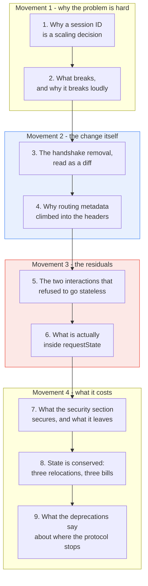
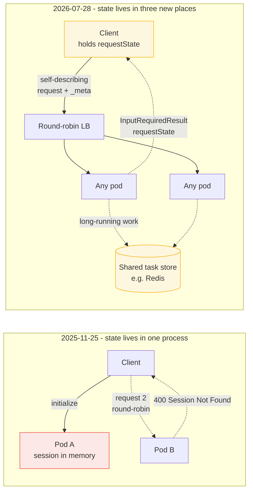

# Learning - How MCP went stateless, and where the state actually went

> Persona: **curator + mentor** - re-adopt when working this file.
> Source facts in [`SOURCE.md`](SOURCE.md). Gated evidence in [`nodes.md`](nodes.md).
> Every claim below carries a node ID, except inside blocks marked **Background, supplied**.

## TL;DR

The MCP 2026-07-28 specification deletes the `initialize` handshake and the `Mcp-Session-Id` header,
so any server instance can serve any request and a plain round-robin load balancer becomes
sufficient (`n3`). The change is real and the mechanism is clean, and you can watch it happen field
by field by diffing the article's two payloads. What the article calls statelessness is better
understood as **state relocation**, because the same state turns up in three new homes: on the wire
in a `_meta` block sent with every request, in the client as a serialized `requestState` blob, and in
your own application as a task store the article's headline says you no longer need (`n10`, `d2`).
Each relocation has a bill, and the article prices none of them. The one that matters most is the
second, because decoding the article's own example shows server execution state travelling through
the client as unsigned plaintext while it guards a file deletion (`n8`, `d1`).

## The 1-minute version

This article is a vendor announcement of a protocol revision, and underneath the announcement is a
worked example of a problem every distributed system eventually meets. A protocol was designed for
one client talking to one server on one machine. It then had to run behind a load balancer, and the
assumption that made it elegant locally became the thing that stopped it scaling.

The problem is that the original MCP bound a conversation to a process. A client opened with an
`initialize` handshake, the server replied with an `Mcp-Session-Id`, and every later call had to
carry that ID back to the specific pod holding the matching in-memory state (`n1`). Nothing about
that is unusual, and it is exactly how a great deal of software works. It only becomes a problem when
you put more than one server behind one address.

The reason it is hard is that the failure is not graceful. A stateful session behind a round-robin
balancer does not get slower under load, it returns `400 Session Not Found` on the client's second
request, because that request landed on a pod that has never heard of it (`n2`). Degradation you can
tune. A correctness error that fires whenever the balancer does its job is a design conflict, and it
propagates outward into every layer that touches the traffic.

The obvious answers all work, and each one buys the fix by giving something up. You can pin the
client to its pod with sticky affinity, which defeats even traffic distribution and makes autoscaling
inefficient, and still loses the session when the pod restarts. You can move the session into a
shared Redis, which restores correctness and adds a network read and a network write to every single
call. You can have the gateway inspect request bodies deeply enough to route intelligently, which
puts JSON parsing on the hot path of your ingress (`n2`). Every option is a tax paid forever to
support a handshake that happens once.

The idea is to delete the handshake instead of supporting it. If the state exchanged at connection
time travels on every request, no request depends on any earlier one, and any instance can serve any
call (`n3`). The article's two code blocks make this unusually easy to check, because the same three
fields - protocol version, client capabilities and client info - appear first in the legacy
`initialize` parameters and then in the new request's `_meta`, under `io.modelcontextprotocol/` names.
The relocation is visible rather than asserted.

How it works in practice needed one more move, because a self-describing body is only self-describing
to something willing to parse it. So the routing-relevant values were promoted into HTTP headers,
`Mcp-Protocol-Version`, `Mcp-Method` and `Mcp-Name`, mirrored against the body and rejected with
`-32020` if the two disagree (`n4`). A gateway can now rate-limit a specific tool by reading a header,
which is what lets ordinary infrastructure route, audit and cache MCP traffic without understanding
it (`n5`).

What it costs is the part the article does not total up. Two interactions genuinely need memory
between calls, and each was made stateless by moving its state somewhere new. A server that must ask
the user a question returns an `InputRequiredResult` carrying a `requestState` blob that the client
holds and echoes back (`n7`). A server running a long job returns a `taskId` and keeps the real state
in a shared datastore, which in the article's own example is Redis - four sections after a headline
bullet announcing that Redis is no longer needed (`n9`, `d2`). Add the `_meta` block now riding on
every request, and the protocol has three new state owners where it previously had one (`n10`).

How far to trust it depends on which part you mean. The mechanics are well evidenced for a blog post,
because the payloads are printed and they agree with the prose. The security story is thinner, and one
gap is sharp enough to act on: decoding the article's own `requestState` gives plaintext JSON with no
signature, attached to the question "are you sure you want to delete these 3 files?" (`n8`). The
article has a security section and it secures inherited OAuth concerns rather than the trust surface
its own redesign created (`d1`). Everything here is also a release candidate on beta SDKs, and the
article asks for staging rather than production (`n15`).

The table below is for returning or checking one row. The narrative above is the argument.

| | |
|---|---|
| **The problem** | MCP bound a session to a process via `Mcp-Session-Id`, pinning each client to the pod holding its in-memory state (`n1`) |
| **Why it is hard** | The failure is a hard `400 Session Not Found` on request two, not a slowdown, so it cannot be tuned around (`n2`) |
| **Why the obvious answers fail** | Sticky affinity defeats distribution and dies on restart; shared Redis adds a read and a write to every call; gateway packet inspection puts JSON parsing on the ingress hot path (`n2`) |
| **The idea** | Delete the handshake. Carry protocol version, capabilities and client info in `_meta` on every request, so no request depends on an earlier one (`n3`) |
| **How it works** | Routing values also climb into HTTP headers, mirrored against the body and rejected with `-32020` on mismatch, so intermediaries route without parsing (`n4`, `n5`) |
| **What it costs** | State relocated three ways: to the wire (`_meta` forever), to the client (`requestState`, unsigned in the example), to your application (task store, still Redis) (`n10`, `d2`) |
| **How far to trust it** | Mechanics corroborated against printed payloads. Release candidate, beta SDKs, no measurement anywhere, and the new trust surface is unaddressed (`n15`, `d1`) |

## Key claims

- **Deleting the handshake is what makes ordinary infrastructure sufficient.** `initialize`/`initialized`
  and `Mcp-Session-Id` are removed, and the three fields they carried now travel in `_meta` on every
  request (`n3`, corroborated by diffing the two payloads). Round-robin routing, scale-to-zero
  serverless deployment and invisible pod restarts are consequences of that one change, not separate
  features.
- **Promoting routing metadata to HTTP headers is what lets intermediaries participate.**
  `Mcp-Protocol-Version`, `Mcp-Method` and `Mcp-Name`, mirrored to the body with a `-32020` mismatch
  rejection, remove the need for deep packet inspection at the gateway (`n4`, `n5`). The latency
  benefit is asserted and unmeasured.
- **Statelessness is relocation, not elimination.** State moved to the wire, to the client and to the
  application, and the article concedes the general form while its own headline denies the third
  instance (`n10`, `d2`). This framing is this brain's, not the article's.
- **Client-held server state is a trust surface, and this article never treats it as one.** The
  `requestState` in the source's own example decodes to unsigned plaintext JSON and accompanies a
  delete confirmation (`n8`). Whether the spec requires integrity protection is unknown from this
  source and is the top research target (`d1`).
- **This is the brain's first spec-level answer on MCP authorization, and it is one clause per RFC.**
  Issuer verification (RFC 9207) against redirect and session-hijacking attacks, resource indicators
  (RFC 8707) against the confused deputy (`n11`, single-leg). It names no token format, no exchange
  and no flow.
- **MCP now has a deprecation policy with a 12-month minimum window**, and Roots, Sampling and Logging
  entered it immediately, with sampling replaced by calling LLM provider APIs directly (`n13`,
  single-leg).

## What you will learn, and in what order



The blue movement is the announcement, and it is the part you already half expect. Sections 3 and 4
explain the mechanism cleanly and you can read them quickly if you have met self-describing requests
before, though section 3 is worth slowing down for because the article hands you a rare thing, which
is a before-and-after pair precise enough to diff.

The red movement is the payload of this note and it is where the reading gets interesting. Sections 5
and 6 follow what happened to the interactions that could not simply be made independent, and section
6 opens an artifact the article prints and does not examine. Skimming these two costs you the only
finding in the source that was not written by its authors.

Movement 1 sets up why any of this was necessary, and a reader who has run a stateful service behind
a load balancer can move through it fast. Movement 4 is where the note stops describing the source
and starts arguing with it, and section 8 is the part most likely to transfer to a system that has
nothing to do with MCP.

**This walkthrough is built around the six protocol artifacts the article prints**, one teaching step
at a time, in the order the argument needs them rather than the order the article uses. That is this
source's substitute for the curated frames a video or paper would supply. The article has no figures
at all (`SOURCE.md`), and the payloads turned out to be a better second leg than a diagram would have
been, because a payload can be decoded and a diagram can only be looked at.

---

## 1. Why a session ID is a scaling decision

Start with the version of MCP that worked. A client opened a connection, sent an `initialize` call
naming its protocol version, its capabilities and itself, and the server answered with an
`Mcp-Session-Id` header. From then on the client attached that ID to everything it sent (`n1`).

Here is that opening call, exactly as the article prints it.

```json
// POST /mcp - Legacy 2025-11-25 Handshake
{
  "jsonrpc": "2.0",
  "id": 1,
  "method": "initialize",
  "params": {
    "protocolVersion": "2025-11-25",
    "capabilities": {},
    "clientInfo": { "name": "my-app", "version": "1.0" }
  }
}
```

Notice what the design is buying. Three facts get established once and are then implicit in every
later message, which keeps those messages small and keeps the negotiation logic in one place. For a
desktop client talking to a local server over stdio, this is not merely acceptable but obviously
correct, and the article is fair in describing the original protocol as elegant for the case it was
built for.

The cost is invisible until you deploy it. Those three facts have to live somewhere between requests,
and in the original design they live in the memory of the process that answered the handshake
(`n1`). That single word, in-memory, is the whole problem, because it means the session ID is not
really an identifier for a conversation. It is an identifier for a **process**.

> **Background, supplied.** A load balancer distributes requests across interchangeable backends, and
> interchangeable is the load-bearing word. When any backend can serve any request, the balancer is
> free to route on whatever it likes, which is why round-robin is the boring default. A protocol that
> stores conversation state inside one backend removes the interchangeability, and every mechanism
> that follows exists to work around its absence. This paragraph is background rather than source
> material and carries no citation.

So the question that decides everything downstream is not "how do we scale MCP", it is narrower and
more useful. Which requests can be served by a backend that has never seen this client before? Under
the 2025-11-25 model the answer is exactly one, the handshake, and that is why the trouble starts on
request two.

## 2. What breaks, and why it breaks loudly

At first glance this looks like a performance problem, and that reading is comforting because
performance problems have knobs. The article's own example says otherwise. Put three pods behind a
Kubernetes service, let a client complete its handshake against one of them, and the client's second
request lands somewhere else and comes back `400 Session Not Found` (`n2`).

That distinction is worth holding onto. A slow system is a system you can tune, and a system that
returns a hard error whenever the load balancer does its job is a system with a design conflict
between two layers. The conflict then radiates outward, and the article names four places it lands
(`n2`).

Consider each of the escapes in turn, because the reason the fix takes the shape it does is that all
three of them are taxes rather than solutions. The first is sticky session affinity, which tells the
balancer to keep sending a given client back to the same pod. It works, and it costs you even
distribution, which is the thing you bought a balancer for, and it makes autoscaling inefficient
because a new pod cannot take over existing traffic. It also does not survive a restart, since the
memory holding the session goes with the process (`n2`).

The second escape is to move sessions into shared storage such as Redis, which genuinely fixes
correctness. Now any pod can look up any session, and the interchangeability comes back. What it costs
is a network read and a network write on **every single call**, which the article later points to as
the thing removing sessions eliminates (`n2`, and the same bullet returns in section 8 to cause
trouble). You have converted a correctness bug into a permanent latency floor.

The third escape is to make the gateway smarter, inspecting request bodies deeply enough to route on
their contents. This puts JSON parsing on the hot path of your ingress and couples your networking
layer to your application protocol, so every protocol revision becomes a gateway change (`n2`).

Hold onto the Redis option in particular. The article treats its removal as one of the headline wins
of the new design, and in section 5 the same article will quietly ask you to bring it back.

Three escapes, three permanent bills, all of them paid to support a handshake that happens once per
connection. That framing is what makes the next move feel inevitable rather than clever.

## 3. The handshake removal, read as a diff

If the handshake is what makes request two special, then the fix is not to support the handshake
better. It is to arrange for there to be no request two, in the sense that no request depends on any
request before it. The 2026-07-28 specification does this directly, removing `initialize` and
`initialized` under SEP-2575 and the `Mcp-Session-Id` header under SEP-2567 (`n3`).

> **Weak evidence, labelled at the point of use.** The SEP numbers here and throughout are prose-only
> in the article and were not checked against the specification, because no deep-research pass was
> requested (`n3`, `SOURCE.md`). Treat them as pointers for a later pass, not as verified citations.

The question that immediately follows is where the negotiated facts went, and this is where the
article does something more useful than most announcements. It prints the replacement in full, and the
two payloads can be read against each other.

```http
POST /mcp HTTP/1.1
Host: mcp-server.example
MCP-Protocol-Version: 2026-07-28
Mcp-Method: tools/call
Mcp-Name: search
Content-Type: application/json

{
  "jsonrpc": "2.0",
  "id": 1,
  "method": "tools/call",
  "params": {
    "name": "search",
    "arguments": { "q": "otters" },
    "_meta": {
      "io.modelcontextprotocol/protocolVersion": "2026-07-28",
      "io.modelcontextprotocol/clientCapabilities": {},
      "io.modelcontextprotocol/clientInfo": { "name": "my-app", "version": "1.0" }
    }
  }
}
```

Read the `_meta` block against the `params` block in section 1. They carry **the same three fields**,
renamed into a namespace and moved from a call that happens once into a call that happens every time
(`n3`). This is the clearest evidence in the whole source, and it is the reason the gate could mark
the mechanism corroborated rather than merely asserted. The prose says the relocation happened, and
the payloads show it happening.

Now derive the consequences rather than reading the article's list of them. If every request carries
everything a server needs, then a server needs to remember nothing, and three things follow
mechanically. Any container can answer any request, so round-robin is sufficient. There is no
connection to keep warm, so a server can scale to zero and run as a serverless function. A pod
restarting mid-conversation is invisible, because the next request rebuilds whatever the old pod knew
(`n3`).

The article lists those three as architectural advantages, and it is worth being explicit that they
are not additional features. They are the same change described from the deployment side, which is
why this note gates them as one node rather than four (`nodes.md`, dropped-candidates table). Treating
a restatement as corroboration would be manufacturing evidence out of repetition.

There is a bill, and the article never states it. Those three fields now travel on every request
forever, so the protocol has traded a one-time negotiation for a permanent per-request overhead. At
the scale the article is arguing for that is a fine trade and almost certainly the right one. It is
still the first of the three relocations that section 8 adds up.

## 4. Why routing metadata climbed into the headers

Section 3 leaves a gap that is easy to miss. A self-describing request is only self-describing to
something willing to read it, and the components this whole exercise is meant to satisfy are exactly
the ones that should not be reading it. A load balancer that has to parse a JSON body to decide where
to send it has not been freed from anything.

So the specification promotes the routing-relevant values into HTTP headers, and there are three of
them (`n4`). `Mcp-Protocol-Version` carries the version. `Mcp-Method` carries the JSON-RPC method,
such as `tools/call`. `Mcp-Name` carries the specific tool, prompt or resource being invoked.

Look back at the request in section 3 and notice that these are not new information. The body already
says `"method": "tools/call"` and `"name": "search"`, and the headers repeat both. That duplication is
deliberate, and the specification closes the obvious hole it opens by requiring the two to agree and
rejecting a mismatch with a `-32020` header mismatch code (`n4`).

The objection to raise here is the one a security reviewer raises first. Duplicating a value into a
place that is cheaper to read is how you get a parser-differential vulnerability, where the gateway
authorizes on the header and the server acts on the body. Requiring the server to compare them and
reject on disagreement is precisely the mitigation, and it is worth noticing that the specification
put the check at the server rather than at the gateway. That is the same instinct as claim 27, where
enforcement belongs at the resource server rather than at the client.

What this buys is that ordinary infrastructure can participate in MCP traffic without understanding
MCP. A gateway can rate-limit one expensive tool by name, an audit log can record which capability was
invoked, and a proxy can route by method, all without deep packet inspection (`n5`). For a platform
team this is the practical unlock, because it means MCP governance can live in the tools you already
run rather than in a bespoke MCP-aware gateway.

> **Weak evidence, labelled at the point of use.** The article calls the latency and overhead
> reduction at the gateway layer drastic (`n5`). There is no measurement of any kind anywhere in this
> article, which is notable given that performance is its entire argument. The mechanism is sound; the
> adjective is unsupported.

The same reasoning produced one more addition, and it is the weakest-evidenced feature here. To stop
clients holding Server-Sent Events connections open purely to notice when a tool list changed, results
can now carry a `ttlMs` and a `cacheScope`, modelled on HTTP's `Cache-Control` (`n6`). No example is
printed and no field placement is given, which is why this is the one substantial feature in the
article that the gate could only mark `single-leg`. Note also that `cacheScope` decides whether a
response may be cached across users, which is a security-relevant field described in half a sentence.

Headers and cache hints handle the requests that are simply requests. Two kinds of interaction are not
simply requests, and they are where the design gets genuinely interesting.

## 5. The two interactions that refused to go stateless

Ask what "every request is independent" cannot express, and the answer comes out in two shapes. The
first is a server that needs to ask the user something in the middle of doing the work, such as a
confirmation before a destructive action. The second is work that takes longer than a client should
wait, such as a database backup or a payment refund.

Both were previously solved the same way, by holding a connection open. An elicitation needed a live
SSE channel so the server could push a question to the client, and a slow tool call simply kept the
client blocked (`n7`, `n9`). Both solutions are exactly what the new design has removed.

Take the elicitation first. Multi Round-Trip Requests, SEP-2322, restructures the exchange so the
server never waits. Instead of pushing a question down a held connection, it returns immediately with
an `InputRequiredResult` containing the question and an opaque `requestState` blob (`n7`).

```json
// InputRequiredResult Returned from Server
{
  "resultType": "inputRequired",
  "inputRequests": {
    "confirm": {
      "type": "elicitation",
      "message": "Are you sure you want to delete these 3 files?",
      "schema": { "type": "boolean" }
    }
  },
  "requestState": "eyJzdGVwIjoxLCJmaWxlcyI6WyJhIiwiYiIsImMiXX0="
}
```

The client shows the question, collects the answer, and reissues the original call with
`inputResponses` and the echoed `requestState`. The article states the payoff plainly, and it is the
right payoff: because `requestState` contains everything needed to resume, **any** instance behind the
load balancer can pick up the retry (`n7`). The interaction has been converted from one conversation
into two independent requests, which is the same trick as section 3 applied to a harder case.

Now the long-running case, which took the other available option. The Tasks extension, SEP-2663,
graduates from experimental to a first-class extension, and a slow tool returns a handle rather than a
result. The server mints a `taskId`, starts the work in the background, and answers immediately, after
which the client polls or subscribes through `tasks/get` and `tasks/update` (`n9`).

```javascript
server.tool("process_refund", { orderId: z.string(), amount: z.number() },
  async ({ orderId, amount }) => {
    const taskId = randomUUID();
    // Store initial task state in a shared datastore (e.g. Redis)
    await setTaskState(taskId, { status: "working" });
    processRefundAsync(taskId, orderId, amount);   // not awaited
    return { content: [{ type: "text", text: JSON.stringify({ taskId, status: "working" }) }] };
  }
);
```

Read the third line before reading anything else. The state that used to sit in a pinned pod is now in
a shared datastore, and the article's own comment names it as Redis (`n9`). That is the Redis you were
asked to hold onto in section 2, arriving four sections after a headline bullet announcing that
removing sessions means "No Redis Sessions Needed" (`d2`).

Both statements are true and the headline is the misleading one. What was removed is Redis as a
*transport session store*, keyed by connection and hit on every single call. What remains is Redis as
an *application task store*, keyed by unit of work and touched only by asynchronous operations. That
is a large and genuine improvement, and it is not the elimination the bullet implies. A reader
capacity-planning from the bullet alone will not provision the store their own long-running tools
require (`d2`).

So both residual interactions were handled by moving their state somewhere new, the client in one case
and the application in the other. The task store's cost is at least written in the example. The
client's cost is written nowhere, which is what the next section is for.

## 6. What is actually inside `requestState`

Before reading on, look again at the `requestState` value in section 5 and decide what you would want
to know about it before shipping this design. The article treats it as an opaque implementation
detail and never discusses its contents.

```
eyJzdGVwIjoxLCJmaWxlcyI6WyJhIiwiYiIsImMiXX0=
```

That is base64, which is an encoding and not a protection, so it can simply be decoded.

```
{"step":1,"files":["a","b","c"]}
```

Thirty-two bytes of plaintext JSON. No signature, no message authentication code, no ciphertext
(`n8`). The server's execution state, including the exact list of files it is about to delete, is
handed to the client and taken back on faith.

> **Background, supplied.** Pushing state to the client to make a server stateless is a standard and
> good technique, and the web has used it for decades in cookies and bearer tokens. It has one
> non-negotiable requirement, which is that anything the client holds and returns must be integrity
> protected, because the client can otherwise rewrite it. This is the entire reason session cookies
> are signed and the reason a JWT carries a signature over its claims rather than just base64 of them.
> Base64 in both cases is transport encoding for bytes that are not URL-safe, and it protects nothing.
> This paragraph is background rather than source material and carries no citation.

Now put the background against the artifact. The elicitation asks the human "are you sure you want to
delete these 3 files?", and the human answers about three files. The list of files the server will
actually act on travels back inside a blob the client controls. Nothing in the article requires the
returned `requestState` to be the one that was issued, and the server, being stateless by design, has
kept nothing to compare it against. That is not a bug in the implementation of statelessness, it is
the direct consequence of it.

The failure this enables is precise. A user consents to deleting three files, and what reaches the
server is a consent for three files attached to a state naming thirty. This brain already holds the
principle being violated, from an entirely different source. Claim 29 records OAuth's design rule that
the untrusted leg should carry only useless material, which is why an authorization code can safely
cross the browser, since stealing it accomplishes nothing without a back-channel secret. Here the
untrusted leg carries material that is the opposite of useless. Claim 28 records that consent works
because the ask is itemised, and this design itemises the ask while leaving the itemisation mutable by
the party the consent constrains.

**Be careful about how far this goes, because the honest version is narrower than the alarming one.**
What is established is that the article prints an unprotected example and never mentions integrity
anywhere (`n8`, `d1`). What is **not** established is what the specification requires, because this
pass did not read the specification and no deep research was requested (`SOURCE.md`). A competent
implementation would sign or encrypt this blob, and the spec may well mandate it. The defensible
statement is that **the article gives a reader no reason to believe `requestState` is protected, while
showing them an unprotected one guarding a deletion**, and that is the top research target this source
produces.

There is a second-order version worth naming for anyone holding this brain's prompt-injection
material. `requestState` is a new channel through which content originating outside the server reaches
server-side execution state. An agent client compromised by indirect prompt injection does not need to
attack the server at all, since it is already the component trusted to hand the state back. That is
commentary rather than a claim of this source, and it is recorded as an open question rather than
promoted.

## 7. What the security section secures, and what it leaves open

Given section 6, the fair question is whether the article simply has no security content, and it is
worth being accurate here, because it does. The section is real and its two additions matter to this
brain more than to most readers (`n11`).

Issuer verification, RFC 9207, requires public clients to validate the `iss` parameter on
authorization responses, which the article ties to session hijacking and redirect-based attacks in
multi-server architectures. Resource indicators, RFC 8707, let a client state explicitly which MCP
server a token is intended for, which the article says solves the confused deputy delegation problem
(`n11`).

> 💡 **Confused deputy** - a component with broad privileges acting on instructions it cannot fully
> vet, so the caller borrows the deputy's authority. A token minted for server A and presented to
> server B is the canonical MCP instance, and audience restriction is the standard fix.

That second one lands on a question this brain has asked twice from opposite directions and never
answered. Both `mcp.md` and `agent-security.md` carry a standing open question about what an agent
presents to a shared tool server, arriving there from client-side aggregation and from deployment
topology respectively, and both note that the sources naming the requirement named no token format, no
exchange and no audience restriction (claim 105, claim 106). **RFC 8707 is the first spec-level answer
either note has received**, and it is the right shape of answer.

It is also one clause. The article names the RFC and states the problem it solves, and supplies no
token format, no worked flow, no example and nothing about the case both earlier sources flagged as
hardest, which is an agent acting on a schedule with no user present (`n11`, single-leg). This
resolves the open question's *direction* and not its *content*, and it is promoted below on exactly
those terms.

Which brings the section back to what it does not contain. Both additions are inherited OAuth concerns
that existed before this revision and would have applied to the stateful protocol equally. The trust
surface the redesign **newly created** is the one from section 6, and it appears nowhere in the
security section or anywhere else (`d1`). The omission is made conspicuous by the article's own
framing, since the security section opens by observing that responsibility for managing state shifts
from the transport layer to the application layer and that this is why security becomes paramount. It
then secures the layer that did not change.

## 8. State is conserved: three relocations, three bills

Now the sections can be added up, and this is the part most likely to transfer to a system that has
nothing to do with MCP. Walk the three relocations in order and ask, for each, who pays.

The first is the negotiated session state from section 3, which moved onto the wire. Protocol version,
capabilities and client info now ride in `_meta` on every request rather than being agreed once (`n3`).
The payer is bandwidth and tokens, forever, in exchange for a one-time cost removed. This is the
cheapest of the three and the most obviously correct.

The second is the elicitation state from sections 5 and 6, which moved into the client. `requestState`
makes the client the custodian of server execution context between two halves of one logical operation
(`n7`). The payer is your trust model, because a component outside your control now holds something
your server will act on, and the article's example shows it unprotected (`n8`).

The third is the long-running task state from section 5, which moved into your application.
`setTaskState` puts it in a shared datastore, which in the article's own example is the Redis its
headline says you no longer need (`n9`, `d2`). The payer is you, in operational complexity that the
announcement's framing hides.

| What was stateful | Where the state went | Who pays, and in what |
|---|---|---|
| Session negotiation (`initialize`, `Mcp-Session-Id`) | **The wire** - `_meta` on every request (`n3`) | Bandwidth and tokens, permanently, per request |
| Server-to-client elicitation (held-open SSE) | **The client** - echoed `requestState` (`n7`) | Your trust model, and the article prices it at nothing (`n8`, `d1`) |
| Long-running tool execution (blocked connection) | **Your application** - a shared task store (`n9`) | You, in the Redis the headline says you removed (`d2`) |

The generalisation is the durable part, and the article states its own version of it in one sentence
before moving on. Responsibility for state shifted from the transport layer to the application layer
(`n10`). **"Stateless" is a claim about a layer, and it is never a claim about a system.** A protocol
becomes stateless by finding somewhere else for the state to live, and the engineering question is
never whether state was eliminated, because it was not. The question is who now owns it, whether they
are trustworthy, and whether the bill is written down anywhere.

This brain already holds the same shape from a different direction, which is worth noting because it is
the second independent arrival at it. Claim 106 records that sharing a component does not merely trade
cost against isolation, it changes what kind of thing the guarantee is, converting a property of the
topology into a claim about an implementation. That is exactly what happened here. Under 2025-11-25,
session integrity was structural, since the state never left the process that owned it. Under
2026-07-28 it becomes an obligation somebody has to discharge, on the wire, in the client and in the
application separately. The mechanism is different and the conversion is identical.

## 9. What the deprecations say about where the protocol stops

One piece of the release is easy to skip and says something the rest does not. MCP now has a formal
deprecation policy, with features moving through Active, then Deprecated, then Removed, and a minimum
twelve-month transition window (SEP-2577). Three features entered deprecation immediately (`n13`).

Roots go, replaced by explicit tool parameters, resource URIs or server configuration. Logging goes,
replaced by `stderr` for stdio connections or OpenTelemetry for structured cloud observability, which
is the same instinct as section 4, since an existing standard the surrounding infrastructure already
speaks beats a protocol-specific mechanism. Sampling goes, replaced by calling LLM provider APIs
directly (`n13`).

That third one is the interesting one, because sampling was the feature by which a server could ask
the client to run an LLM completion on its behalf. Removing it is the protocol declining to be the
broker between a server and a model, and narrowing itself to being the channel between a client and a
tool. Read alongside the rest of the release, it is consistent. Every change here makes MCP more like
ordinary HTTP plumbing and less like an application framework.

> **Weak evidence, labelled at the point of use.** The deprecation policy and all three items are
> prose-only, with no artifact and no spec check (`n13`, single-leg). The reading of sampling's removal
> as a scope decision is this brain's commentary, not a claim the article makes.

There is a small irony worth recording for `mcp.md`, which had sampling at zero sources before this
ingest. The first thing this brain learns about MCP sampling is that it is being removed.

## Diagram (mental model)



Read it left to right, with the old model above the new one. Solid arrows are the request path and
dashed arrows are everything that was supposed to disappear. The red box is where state lived before,
and the two amber boxes are where it lives now, which is the only colour distinction that matters.

**The single idea is that the red box did not vanish, it split into the amber ones.** Everything else
in the diagram is context for that.

The shape is chosen to put the two models at the same altitude so the boxes can be counted rather than
described. Drawn the way the article implicitly frames it, the lower half would contain a client, a
balancer and some pods and nothing else, which would be a picture of state having been deleted. The
amber boxes are what stops that reading, and they are deliberately drawn as things the client and the
operator own rather than things the protocol owns, because that ownership transfer is the finding. A
version of this diagram that showed only the load-balancer improvement would be accurate about the
announcement and misleading about the system.

Provenance: synthesized from `n1`, `n2`, `n3`, `n7`, `n9`, `n10` and `d2`. The article prints no
figures of its own (`SOURCE.md`), so nothing here is lifted.

## 💡 Terms

- **Stateless protocol** - one where every request carries everything needed to serve it, so no
  request depends on an earlier one and any server instance can handle any call (`n3`).
- **Session pinning / sticky affinity** - load balancer configuration that keeps one client bound to
  one backend, needed when the backend holds state, at the cost of even distribution and autoscaling
  efficiency (`n2`).
- **`_meta`** - the field on every MCP request carrying what the handshake used to negotiate, under
  `io.modelcontextprotocol/` namespaced keys (`n3`).
- **MRTR (Multi Round-Trip Request)** - SEP-2322. Turns a server-to-client question into two
  independent requests by returning an `InputRequiredResult` with a `requestState` the client echoes
  back (`n7`).
- **`requestState`** - serialized server execution context, held by the client between the two halves
  of an MRTR exchange, and unsigned plaintext in this article's example (`n8`).
- **Tasks extension** - SEP-2663. A long-running tool returns a `taskId` immediately and the client
  polls `tasks/get` or subscribes to `tasks/update` (`n9`).
- **`ttlMs` / `cacheScope`** - SEP-2549 cache hints modelled on HTTP `Cache-Control`, telling a client
  how long a result stays fresh and whether it may be cached across users (`n6`).
- **Confused deputy** - a privileged component acting on instructions it cannot fully vet, so a caller
  borrows its authority. Addressed here by RFC 8707 resource indicators (`n11`).
- **Deep packet inspection (in this context)** - a gateway parsing request bodies to route or police
  them, which HTTP header promotion removes the need for (`n5`).

## What to distrust in this note

**The tier and the conflict.** This is a **T2** first-party engineering post, authoritative about
Google's own deployment experience and **positioned** on the standard it describes. The article says
Google "led the charge", co-founded the MCP Transports Working Group, and pushed stateless transports
"out of necessity" for Google Cloud scale. It is a vendor describing a standard revision it says it
drove, in which the headline benefit is that MCP now runs well on serverless platforms it sells
(`nodes.md`, dropped candidates). None of that makes the mechanics wrong, and the mechanics are the
best-evidenced part. It does mean the framing of what was gained is not disinterested.

**Nothing here is measured, which is unusual given the argument.** The article's case is entirely about
scale, cost and latency, and it contains no benchmark, no latency figure, no throughput number and no
cost comparison. The strongest quantitative statement in it is a `400` error code. Every superlative,
including "drastically lowers the latency" at the gateway (`n5`) and "eliminating database writes and
reads on every single call" (`d2`), is unsupported by anything in the document.

**The specification was not read.** No deep-research pass was requested, so every SEP number, every
statement about what the spec requires, and the reading of the `requestState` example are gated against
this article alone. This matters most in section 6, where the difference between "the article shows an
unprotected example" and "the protocol permits unprotected state" is the difference between a
documentation gap and a design flaw. This note asserts only the first.

**The most reusable claims are the least corroborated.** The mechanics are corroborated against printed
payloads and are the parts you are least likely to quote. The two things worth carrying away are the
state-conservation framing in section 8, which is this brain's synthesis rather than the article's
claim, and the `requestState` finding in section 6, whose plaintext leg is artifact-only and whose
consequence is commentary. Both are argued from evidence in this document and neither is a statement
the authors make.

**This is a release candidate on beta SDKs.** The specification is an RC, all four Tier-1 SDKs are at
beta, and the article itself recommends staging environments rather than production (`n15`). It also
claims the RC is "already being widely adopted" and names exactly one adopter, the GitHub MCP Server.
Treat "widely" as marketing and the single named instance as the evidence.

## Open questions

- **Does the 2026-07-28 specification require `requestState` to be integrity protected?** The single
  highest-value question this source produces, and it is cheap to answer by reading the SEP-2322 text
  (`d1`, `n8`). If it does, section 6 is a documentation defect in a widely-read announcement. If it
  does not, it is a protocol-level design gap with a straightforward exploit path. **The concrete
  artifacts to read: the full 2026-07-28 specification and SEP-2322**, both linked from the article's
  "Explore more" section.
- **Is `requestState` a prompt-injection write channel into server execution state?** An agent client
  compromised by indirect injection is already the trusted custodian of the blob, so it need not attack
  the server. Connects directly to this brain's memory-poisoning and indirect-injection material.
  Recorded as commentary in section 6, promoted nowhere.
- **What does `_meta` on every request cost when the tool catalog is already large?** Claim 85 measures
  `tools/list` at 541k tokens for 1,180 tools, and this revision adds a per-request block on top of
  that. The two sources never meet, and the interaction is this brain's question rather than either
  author's (`nodes.md`, dropped candidates).
- **What is `cacheScope` allowed to do?** It decides whether a tool result may be cached across users,
  which is a multi-tenancy control described in half a sentence with no example (`n6`). Read against
  claim 105 and claim 106, a cross-user cache is exactly the kind of shared component that converts a
  structural guarantee into an implementation obligation.
- **Does RFC 8707 answer the standing identity question, or only name it?** The open question shared by
  `mcp.md` and `agent-security.md` asks what an agent presents to a shared MCP server. This source
  supplies audience restriction as the mechanism and no token format, no exchange and nothing about an
  agent running with no user present (`n11`). The MCP authorization specification is the artifact to
  read next, and it was already on the identity track's list.
- **Is the `-32020` mirroring rule enough to prevent a parser differential?** The header and body must
  agree, and the server rejects on mismatch (`n4`). Whether gateways are expected to re-verify, and
  what happens when a proxy rewrites one and not the other, is not addressed.
- **What happened to sampling's use cases?** Deprecated in favour of calling LLM provider APIs directly
  (`n13`), which assumes the server has its own model access and credentials. For a server that
  deliberately had neither, this is a capability removal rather than a substitution.

## Feeds these topics

- [`mcp.md`](../../brain/topics/mcp.md) - **the primary source this note had been waiting for**, and
  the first to pin a spec version. Supplies the transport and handshake mechanics (`n1`, `n3`, `n4`),
  the two residual-state designs (`n7`, `n9`), the state-conservation framing (`n10`, `d2`), the
  deprecation policy (`n13`), and the first spec-level material on authorization (`n11`).
- [`agent-security.md`](../../brain/topics/agent-security.md) - RFC 9207 and RFC 8707 against the
  standing identity-propagation question (`n11`), and the client-held-state trust surface read against
  claim 28 and claim 29 (`n8`, `d1`).
- [`agents.md`](../../brain/topics/agents.md) - the Tasks extension as the protocol-level form of
  pause-and-resume, which claim 15 reached from agent design rather than from transport (`n9`).
