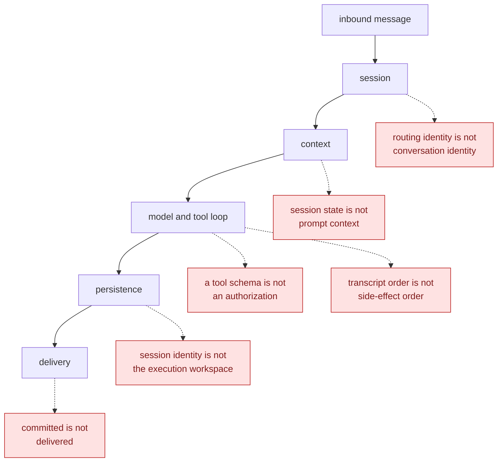
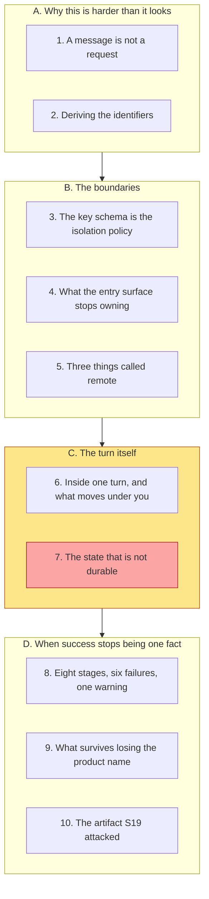
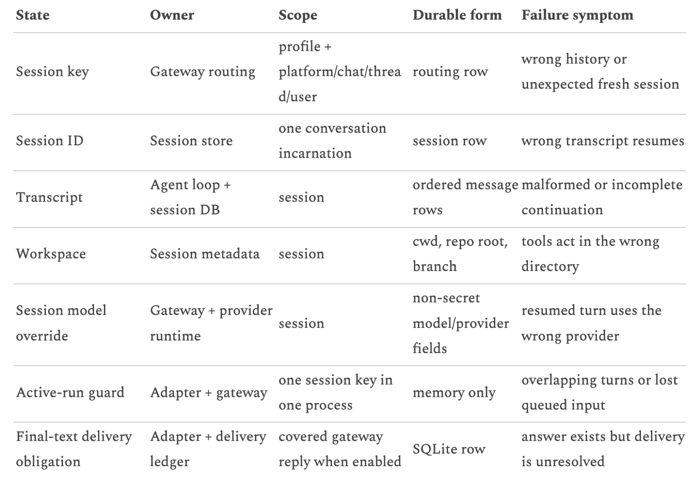
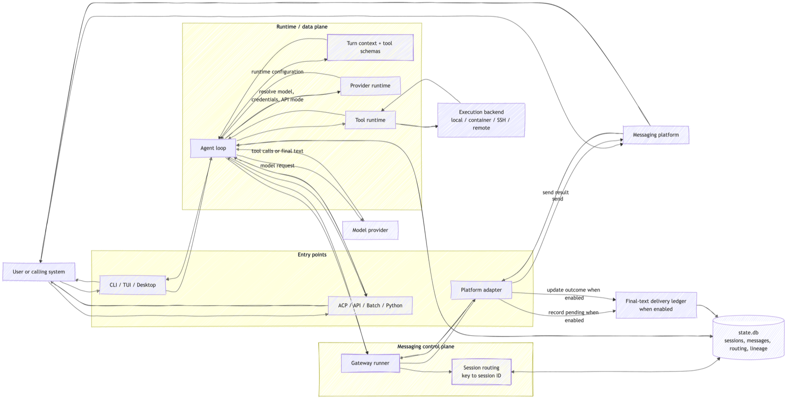
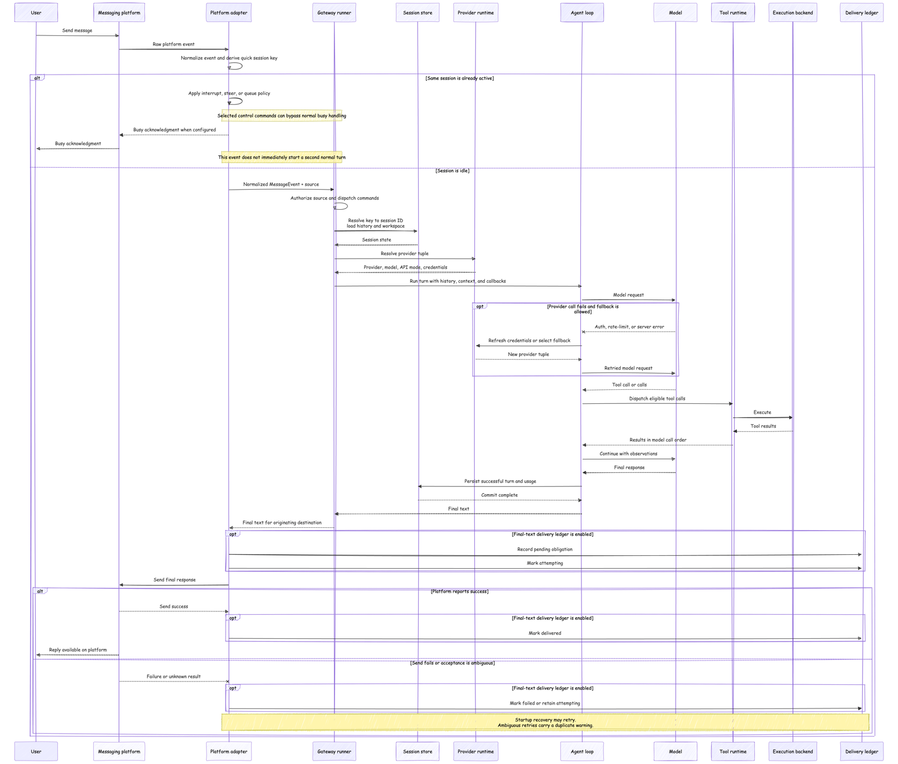
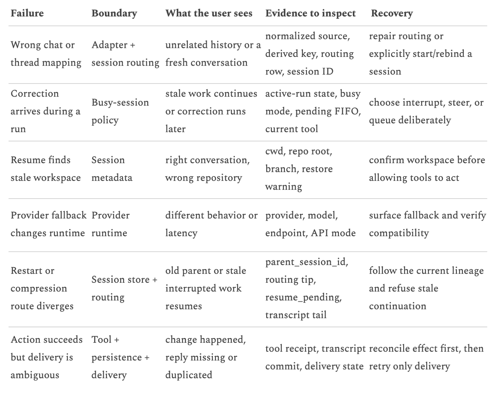
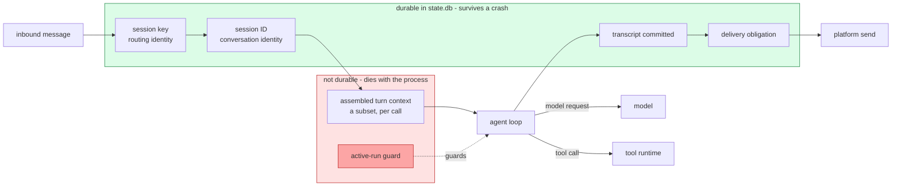

# Learning - Hermes Agent Architecture Part 1: Gateway, Sessions, and the Agent Loop

> Persona: **curator + mentor**, with **fact-checker** at the gate and **architect** on the topic
> mapping. Re-adopt when working this file.

> The distilled document you learn from, anchored by the four figures gated in
> [`nodes.md`](nodes.md). Every claim carries a node ID. See [`SOURCE.md`](SOURCE.md) for metadata.

## TL;DR

Every agent framework teaches you the loop, and almost none of them teach you what happens to a
message on the way in and on the way back out. This article walks one boring task through a real
open-source agent and finds that the interesting engineering is entirely in the boundaries: routing
identity is not conversation identity, session state is not prompt context, a tool schema is not an
authorization, and "the agent succeeded" is not one fact but eight of them in a row. The single most
useful thing in it is a cell in a table rather than a sentence in the prose, and it says that the
guarantee stopping two turns from mutating one conversation is held **in memory** - so it is
process-local, and it does not survive a restart. Read it as the operational half of everything this
brain already holds about agent loops.



Read the spine downward as the article's own one-line summary of what a message becomes, and each red
node as a distinction the note exists to defend. **The crux is that every failure worth naming here
comes from writing two objects as one.** It is drawn against the spine rather than as a list of pairs
because each collapse bites at a particular stage, and knowing where it bites is what tells you which
component owns the fix - a routing bug is not repaired by changing the model, and a delivery problem
must not be allowed to run a destructive tool twice. A tidier shape, six pairs in a table, would let a
reader memorise the distinctions without ever learning where they apply, which is the failure this
whole note is arguing against. *Spine quoted from the source; the collapses are synthesized from `n1`,
`n7`, `n10`, `n14`, `n16` and `n17`.*

## The 1-minute version

This article is a walk through the runtime of one real agent, from the moment a message arrives at a
CLI prompt or a Telegram chat to the moment a reply is either delivered or provably not. It is not
about prompting, and it is not about model quality. It is about the plumbing that decides which
conversation a message belongs to, what gets written down, and who is responsible when part of the
chain works and another part does not.

The problem it works on sounds administrative until you look at it. An agent presents as a
request-and-response service, so the instinct is to treat an inbound message the way you would treat
an HTTP request. That instinct is wrong in a specific way. A request is stateless and self-describing,
whereas a message is a continuation of something, and the system has to decide *what* it continues
before it can do anything else at all `n1`.

To see why that is hard rather than merely fiddly, notice that the answer has to be reconstructed
rather than remembered. No process stays alive between your two messages `n10`. Continuity is a
property the system rebuilds from durable state each time, which means every identifier involved has
to be written down somewhere, and every one of them can be written down wrongly. Worse, the failures
are quiet. Routing a message into the wrong conversation does not raise an error, because both
conversations are perfectly valid `n1`.

The naive approach is one identifier, usually called the session, doing every job at once. It breaks
in more than one place. Resume a conversation and you find you needed a name for *this stored
transcript*, which is not the same as a name for *the lane inbound Telegram events arrive on*. Compact
a long conversation into a shorter child and you find you needed a name for the lineage `n12`. Bind a
messaging destination to an existing CLI conversation and you find the lane and the transcript were
never the same object and you have just been lucky `n23`.

The idea is to split those jobs into named objects with named owners. A **session key** is a
deterministic routing identity assembled from fields such as profile, platform, chat, thread and
sometimes participant, and it chooses the lane. A **session ID** names one durable conversation
incarnation and tells the system which transcript to load. A **parent session ID** links a compacted
child back to what it continues `n1`. The article's tidiest consequence follows immediately, and it is
the most transferable sentence here: **which fields you put in the routing key is your isolation
policy**, not a separate access-control layer sitting above it `n2`.

Working outward from there, the article keeps finding the same shape. The entry surface owns ingress
and egress and nothing else. The agent loop owns the turn, and the model is a callee inside it rather
than the thing driving it `n4`. A tool schema tells the model how to *ask* for a capability and
establishes nothing about whether the caller may use it, whether the backend is isolated, or whether a
destructive action was approved `n16`. The word "remote" turns out to name three unrelated boundaries
that people routinely conflate, and a remote model implies nothing whatever about remote shell access
`n6`.

What it costs is honesty about the parts that stay fragile, and the article is unusually willing to
pay it. Parallel tool calls come back in model-call order, which keeps the transcript structurally
valid and guarantees nothing about the order the side effects actually happened in `n14`. A delivery
ledger with five states buys at-least-once recovery and explicitly not exactly-once, so an ambiguous
crash mid-send is resolved by warning a human `n19`. And the guard preventing two turns from mutating
one live conversation is memory-only, which the prose never states and the table gives away `n8`,
`d1`.

How far to trust it is the ordinary T4 question with one unusual answer. Nothing here is measured, at
all, and six of its recommendations rest on no outcome. But the author is analysing somebody else's
open-source project rather than selling his own, which strips out the commercial position that
discounts most architecture writing, and he pins a version, a tag and a commit. Against that, the
piece opens by constructing a deterministic test task and then never shows it running `d3`. Take the
boundaries, which are arguments and survive; hold the product facts loosely, because they are pinned
to v0.19.1 and the author says so `d4`.

The table below is the same argument compressed for a reader who is returning to check one row rather
than arriving for the first time.

| | |
|---|---|
| **The problem** | An inbound message is not a request. Before an agent can do anything it must decide which conversation this continues, and it must reconstruct that answer from durable state because no process survives between turns `n1`, `n10`. |
| **Why the obvious answer fails** | One identifier called "the session" cannot simultaneously name the lane events arrive on, the stored transcript, and the lineage a compaction produced. The failures are silent, because a message routed into the wrong conversation produces a valid conversation `n1`, `n12`. |
| **The idea** | Split identity into named objects with named owners, and accept that the routing key's field list **is** the isolation policy rather than a thing enforced above it `n1`, `n2`. |
| **How it works** | Session key chooses the lane, session ID carries the conversation, parent session ID carries lineage. Around them the entry surface owns only ingress and egress, the loop owns the turn, the model is a callee, and the tool schema is a request format rather than a permission `n4`, `n16`, `n23`. |
| **What it costs** | Several guarantees people assume are absent by design and stated as such. Tool-result ordering is transcript order and not side-effect order `n14`, delivery is at-least-once and not exactly-once `n19`, and the active-run guard is memory-only and therefore process-local `n8`. |
| **How far to trust it** | T4 practitioner blog, **nothing measured**, no latency or error rate or comparison. Unusually free of commercial position - the author analyses NousResearch's open-source project rather than his own. But the deterministic task it opens with is never shown running `d3`, and the repository was not cloned by this brain `n24`. |

## Key claims

- **Routing identity and conversation identity are separate objects**, and treating them as one is
  the category error the whole article is organised around. `n1`
- **The isolation policy of a multi-tenant agent is the routing key's field list.** Adding
  participant identity to the key isolates by participant; leaving it out shares the lane. `n2`
- **Default per-participant isolation for groups and shared sessions for threads is a routing
  policy, and the article refuses to call it a security guarantee.** `n3`
- **The model is a callee the loop invokes, not the driver of the loop** - provider, model,
  endpoint, credentials and API mode are all resolved before inference happens. `n4`
- **"Remote" names three unrelated boundaries** - a remote model API, a remote tool-execution
  backend, and a remote gateway - and none of them implies either of the others. `n6`
- **Session state is not prompt context**, and the stored session is routinely larger than anything
  the model sees on a given call. `n7`
- **The mutual-exclusion guarantee over an active conversation is memory-only, therefore
  process-local** - it does not survive a restart and does not hold across two gateway processes.
  This is stated by a table cell and never by the prose. `n8`, `d1`
- **Session identity and execution workspace are separate**, so "correct transcript, wrong
  workspace" is reachable and presents as success. `n10`
- **A tool schema proves nothing about authorization, isolation or approval.** `n16`
- **"The agent succeeded" is not an operable completion model** - the chain has eight stages and
  every arrow between them is its own failure boundary. `n17`
- **Execution, persistence and delivery need separate evidence**, because collapsing them makes an
  operator's rerun look safe when it will duplicate an external action. `n18`
- **Parallel tool results are restored in model-call order, which is transcript validity and not
  side-effect ordering.** `n14`

## What you will learn, and in what order



Read it top to bottom, because each movement supplies the vocabulary the next one spends. Movement A
does the work most agent writing skips, which is establishing that the problem exists at all, and a
reader who already builds messaging infrastructure can skim it without losing the thread. Movement B
is where the article earns its keep and should not be skimmed, since sections 3 and 4 carry the two
claims that survive losing the product name entirely.

Movement C is coloured because it is the payload. Section 6 walks a single turn end to end and names
the two things that change under you mid-run, and section 7 is the one finding here that is genuinely
non-obvious rather than merely well-organised, which is why it is marked separately. Movement D is the
operational consequence, and it is the part you will actually be quoting at three in the morning.
Section 10 stands slightly apart from the rest, because it is this brain's cross-reference rather than
the article's content, and a reader who only wants the source should stop at section 9. A reader in a
hurry can take sections 3, 7 and 8 and leave the rest, at the cost of meeting each finding as an
assertion rather than as something derived.

*Synthesized from the walkthrough structure below; the source has its own running order and this is
not it.*

---

## 1. A message is not a request, and the difference is where all the work is

Start with the framing the article chooses, because it is a good one and because what it leaves out
matters later. The author wants a task so boring that the architecture becomes visible through it.
Create a file with a unique marker, read it back, take its SHA-256, and then ask a follow-up question:
which marker did you read, and which workspace did you use? He runs the shell version by hand first
and prints the digest, `170e1f95...`, so the right answer exists before the agent is involved.

The reason to do this is worth internalising even though the article does not spell it out. If the
work is deterministic, nobody can argue about whether the output "looks right", and the conversation
moves off model quality and onto the thing actually under test. What has to agree for the correct
answer to end up attached to the correct conversation? Hold onto that follow-up question, by the way.
We will come back to it in section 9, and what happens to it is the most interesting thing about this
article's evidence.

Now send that same request through two doors. One is a terminal, where a CLI-shaped request can create
or resume a persisted session, resolve a provider, build the runtime and enter the model-tool loop.
The other is a chat platform, where an adapter receives a platform event and normalises it, and a
gateway runner then authorises the source, resolves a route, loads state, builds or reuses a runtime,
and eventually hands a response back for delivery `n23`. At first glance these converge, and in an
important sense they do. Both can end up using the same profile, the same provider resolver, the same
model, the same tool registry, the same state database and the same execution backends.

So do they become the same agent? The article's answer is no, and the reason is the seed of everything
that follows. Sharing runtime machinery is not the same as sharing a conversation `n23`. Two doors into
one building do not make one room. If you want continuity across surfaces you have to ask for it
explicitly, through a handoff that binds a messaging destination to an existing session, and the
mapping the author prints for that operation carries the field `"automatic_cross_surface_merge":
false` `n23`.

That is a design decision rather than a limitation, and it is worth sitting with, because the
alternative is genuinely tempting. Suppose instead the system merged automatically whenever it could
tell the same human was on both ends. You would get a pleasant demo and an unbounded surprise, since
the set of conversations that could suddenly acquire each other's history is exactly the set the
system cannot see the consequences of. Explicit rebinding costs one command and makes the merge a
thing somebody chose.

Which raises the question the rest of the article is really about. If the conversation is not implied
by the door you came through, what *is* it implied by, and what has to be written down for the system
to find it again?

> **Background, supplied.** Nothing in this section requires knowledge the source omits, but it is
> worth naming the shape the reader is being pushed away from. In a stateless HTTP service, identity
> travels *with* the request, usually as a token, and the server needs no memory of you between calls.
> Agent runtimes look similar from the outside and invert this. The message carries a platform's
> notion of where it came from, and the system has to translate that into its own notion of what it
> continues. That translation is a lookup against durable state, which is why so much of this article
> is about tables rather than about models. This block is background and is uncited by construction.

## 2. One identifier cannot do four jobs, so derive the ones you need

The naive design has one thing called "the session". Rather than list what Hermes uses instead, let us
ask what a single identifier structurally cannot answer, and let each unanswerable question name the
next object.

First, an inbound Telegram event arrives with a chat ID and possibly a thread ID, and something must
turn that into a decision about which conversation lane receives it. That decision has to be
*deterministic*, because the same chat must land in the same lane every time or continuity is a
coin-flip. Note what this identity is about. It describes **where the message came from**, and it is
stable for as long as that chat exists. Call it the **session key** `n1`.

Second, consider what happens when you reset a conversation and start fresh in that same chat. The
lane is unchanged, since the chat is unchanged, yet the transcript to load is now a different one.
The session key cannot express that, because it is derived from the source and the source did not
move. So a second identity is needed for **one durable conversation incarnation**, telling the system
which stored transcript and metadata to load. Call it the **session ID** `n1`.

Third, ask what happens when a long conversation is compacted. A child session is created carrying
the compressed context forward, and the active conversation advances to it. The session ID names the
child and says nothing about what it came from, so a third field is needed to keep the chain
inspectable. Call it the **parent session ID** `n12`. The article adds a **task ID** for correlating
work inside a single run, and is careful to say it is not the durable identity of the conversation
`n1`.

Notice that this is four objects with four lifetimes, arrived at by asking four questions rather than
by reading a list. That is the difference between a design that feels inevitable and one that feels
arbitrary, and it is why the author's own summary line lands: **the session key chooses the lane, and
the session ID carries the conversation** `n1`.

The article renders the full ownership picture as a table, and it repays reading slowly.



*What it teaches:* every piece of runtime state is named, assigned an owner, given a scope, given a
durable form, and given the symptom you will observe when it goes wrong. *Corroborated by:* §"The
session owns continuity" and §"What I would steal" in the prose `n1`, `n7`, `n8`, `n13`.

Read the columns left to right as a sentence. Each row says that some piece of state is owned by a
specific component, is scoped to a specific thing, survives in a specific durable form, and announces
its own failure in a specific way. **The column that earns this table its place is "Durable form",
because it is the only one that tells you what happens after a crash.** Most architecture diagrams
show you what talks to what, which is the easy half; this one shows you what is written down, which
is the half that decides whether your system can be reconstructed.

The reason to build the table this way rather than as a component diagram is that it is organised
around *recovery* rather than around *flow*. A flow diagram answers "how does a message get through",
and the ownership table answers "what do I look at when it did not". Those are different questions and
the second one is asked far more often in production. A component diagram that showed the same
information would need three annotations per box and would be unreadable.

Hold onto one cell in particular. Six rows down, in the row named "Active-run guard", the durable form
reads **memory only**. We will come back to that in section 7, and it is the sharpest thing in the
article.

## 3. The isolation policy is the key schema, which is the claim worth stealing

Section 2 left the session key described but not specified. What is actually in it? The article
enumerates the candidate fields, and they are a profile namespace, the platform, the chat type, the
chat ID, the thread ID, a platform scope where one applies, and - the interesting one - participant
identity **when the configured isolation policy requires it** `n2`.

Read that last clause again, because it is doing more than it appears to. It says the isolation policy
is not a rule enforced somewhere above the router. The isolation policy **is** which fields go into
the key `n2`. In other words, there is no separate access-control layer to misconfigure, because the
key schema already decided the answer.

The worked shapes make it concrete, and they are more convincing than any prose statement could be:

```
Telegram DM                     agent:main:telegram:dm:chat-redacted
Telegram group, user A          agent:main:telegram:group:group-redacted:user-a
Telegram group, user B          agent:main:telegram:group:group-redacted:user-b
Telegram thread                 agent:main:telegram:group:group-redacted:thread-redacted
Named profile                   agent:research:telegram:dm:chat-redacted
```

The two group rows differ only in their final segment, so user A and user B are in separate
conversations while standing in the same room. The thread row has no participant segment at all,
which means everyone in that thread shares one conversation. Nothing enforces this beyond the shape
of the string, and nothing needs to.

That structural elegance has a matching hazard, and to the author's credit he states it in the very
next breath. In v0.19.1 ordinary group sessions are isolated by participant by default and threaded
sessions are shared by default, and he immediately adds that **this is a routing policy, not a
universal security guarantee** `n3`. The distinction is one a reviewer should hold onto. A routing
policy decides which conversation your message continues, and a security guarantee decides what an
adversary can reach. They coincide only when nothing else in the system can move data between lanes,
and this article does not claim that and could not.

Why is the design right anyway? Because the two obvious alternatives are worse in ways that show up
late. You could isolate everything always, which is safe and destroys the collaborative thread, since
a team debugging together in one channel would each get a private agent with a private view of a
shared problem. You could share everything always, which is convenient and turns a support inbox into
a data-leak generator, since every sender inherits the last sender's context. Making it a key-schema
decision means a deployment picks its semantics per surface and the choice is legible in the key
itself.

For this brain the connection is direct and worth naming. S12 put the tenancy boundary at the
platform's own coarsest unit and bounded the agent's identity with a Principal Access Boundary,
arguing that you cannot police a request the model composed at run time. This source is the same
argument one layer down and at a much smaller scale, where the boundary is a string schema rather
than a cloud project. **Both are saying that isolation has to be structural, decided before the model
is involved, because the model gets no vote in what its own key contains.**

Having established which conversation a message belongs to, the next question is what the thing that
received it is still responsible for.

## 4. The entry surface owns the door, and almost nothing else

Here is the picture the author says to keep if you keep only one.



*What it teaches:* three separable planes, with the agent loop as the hub, and the model drawn as one
dependency it calls rather than as the thing in charge. *Corroborated by:* §"The surface does not own
the run", "The model is inside the loop. It does not own the loop" `n4`, `n6`, `n23`.

Read it as three yellow bands plus a store. The lower-left band holds the entry points, which are the
CLI and desktop surfaces alongside the protocol, API, batch and Python entries. The upper band is the
runtime data plane, holding the agent loop with its turn context, provider runtime and tool runtime.
The lower-right band is the messaging control plane, holding the gateway runner and the session
routing that maps a key to a session ID. Everything durable converges on the `state.db` cylinder,
labelled with sessions, messages, routing and lineage.

**The crux is that the agent loop is the hub and the model is a leaf.** Trace the arrows out of the
agent loop box and you will find that it reaches the turn context, the provider runtime, the tool
runtime and the model provider, and that the arrow to the model is labelled `model request`. Nothing
flows *from* the model into the structure of the run. The loop decides what the model sees, calls it,
reads what comes back, and decides what happens next.

Why does the shape matter enough to be the article's chosen picture? Because the natural mental model
is the opposite one, in which a capable model orchestrates and the surrounding code fetches things
for it. Under that reading, provider selection feels like part of inference. The figure separates
them, and the author states the consequence directly: the provider runtime decides the provider, the
model, the endpoint, the credentials and the API mode, and **the model performs inference after those
decisions have already been made** `n4`. A different shape, with the model inside the provider
runtime, would make credential handling look like a model concern, which is precisely the confusion
that produces systems where nobody can say which key served which call.

There is a wrinkle here that the gate caught and it is worth showing you, because it makes the point
better than the caption does. The caption says the model is *inside* the loop, and in the figure the
"Model provider" node sits **outside** the yellow runtime band, reached by an outbound arrow `d2`.
These are two senses of "inside" rather than a contradiction. The prose means the loop sequences the
model; the layout means the model is a remote dependency of the runtime. The layout's reading is the
more useful of the two, because that boundary is exactly where credentials, latency and fallback all
live, as section 6 will show.

With the planes separated, one piece of vocabulary can be cleaned up before we look inside a turn.

## 5. Three unrelated things are called "remote", and conflating them is expensive

This section is short because the point is a definition, and it is included because the definition is
load-bearing. In an agent system, "remote" can describe at least three boundaries `n6`. The model may
run behind a remote provider API. A tool may execute through SSH or another remote backend. The
gateway itself may run on a different machine.

The article's three disclaimers are the part to memorise, and each closes off a real inference someone
has made in a design review. A remote model does not imply remote shell access, so a hosted provider
tells you nothing about where your `bash` tool runs. A remote execution backend does not merge
conversation state, so moving execution to a container changes nothing about which session owns the
turn. A remote gateway does not change which session owns a message, so relocating the messaging
process does not relocate identity `n6`.

Figure 1 makes this visible rather than merely stated, which is why it is the right figure to have
looked at first. Three separate nodes carry the three senses. "Model provider" sits outside the
runtime band, "Execution backend local / container / SSH / remote" hangs off the tool runtime, and
"Gateway runner" lives in its own control plane `n6`. One word was hiding three boxes.

The reason this earns a section rather than a footnote is that the conflation has a security shape.
Someone reasoning about a "fully remote" deployment can convince themselves that a hosted model
implies sandboxed execution, and the two are entirely independent. Keeping the three boundaries
distinct is a precondition for saying anything true about blast radius.

Now the entry point is resolved, the conversation is identified, and the planes are named. What
actually happens when the turn runs?

## 6. Inside one turn, and the two things that move under you

The article gives the turn as thirteen steps, and the sequence diagram gives it as a picture with
thirteen participants. The picture is the better teacher.



*What it teaches:* one complete message from platform ingress to platform delivery, including the
busy-session branch, the provider-fallback branch, tool dispatch, persistence and the three delivery
outcomes. *Corroborated by:* §"Inside one model-tool turn", the thirteen-step enumeration `n14`,
`n15`, `n17`, `n19`.

Read it left to right as participants and top to bottom as time. The user and the messaging platform
are on the left, the durable and executing components are in the middle, and the delivery ledger is on
the far right. The two boxed regions labelled `alt` are mutually exclusive branches, the ones labelled
`opt` fire only under a stated condition, and the yellow strips are the author's own annotations.

**The crux is that the interesting engineering is in the optional branches, not in the happy path.**
The straight-line sequence through the middle is what every agent framework already gives you. What
this diagram adds is what happens when the session is already busy, when the provider call fails, and
when the platform send does not cleanly succeed.

Take the busy branch first, at the top. A second message arriving during an active run does not simply
queue, because the system has to apply a named policy of interrupt, steer or queue, and one yellow
note records that selected control commands can bypass normal busy handling while another records that
the event does not immediately start a second normal turn. The article's builder checklist turns this
into a question worth asking of your own system, which is to define what a second message *does*
during an active run. Most systems answer this accidentally.

Two things then move under you mid-run, and both are drawn.

The first is provider fallback. Inside the `opt` block, an authentication failure or rate limit or
server error leads to refreshing credentials or selecting a fallback, which yields a **new provider
tuple** and a retried model request `n15`. The consequence the author draws is the one that matters
for anybody instrumenting this, and it is that fallback can change the provider, the model, the
endpoint, the client and the API mode all at once. Therefore your operational evidence has to record
which provider **served** the call, and recording which provider was selected at the start of the
session is recording a guess `n15`.

The second is tool parallelism, and this is subtler. Eligible non-interactive tool calls can be
dispatched concurrently, and the returning arrow in the diagram is labelled "Results in model call
order" `n14`. That ordering exists to keep the conversation structurally valid, since a transcript
whose tool results do not line up with their calls is malformed input on the next turn. But read what
it therefore does not say. Restoring results in call order says nothing about the order in which the
side effects happened. Two tools that both write to the same external system may have interleaved in
any order, and the transcript will present a tidy sequence that never occurred.

That is the kind of claim worth carrying out of this article regardless of what you think of Hermes,
because parallel tool dispatch is now standard and this consequence is rarely stated. **The transcript
is a record of the conversation, not a log of the world.**

One more boundary belongs here, and it is the sharpest single sentence in the source. A tool schema
tells the model how to request a capability, and it does not prove that the caller is authorized to
use it, that the execution backend is isolated, or that a destructive action has been approved `n16`.
Those guarantees live elsewhere in the runtime, and figure 1 shows where, since the schema is
assembled into the turn context while execution happens through a separate tool runtime into a
separate execution backend `n16`.

This connects straight to what this brain already holds about agent security. S18's whole design rests
on the security decision living somewhere the untrusted component cannot reach, and S20 measured a
tool filter choosing the available tools **before** the agent sees untrusted data. Both are the
constructive version of `n16`. The schema is a request format, so the authority must sit behind it, and
if it does not then the model's ability to compose a well-formed call is indistinguishable from
permission to make it.

So the turn is understood. What of the state it leaves behind?

## 7. The state that is not durable, which the prose never tells you

This is the payoff of the cell you were asked to hold in section 2.

Go back to the ownership table and read the row named "Active-run guard". Its owner is the adapter plus
the gateway. Its scope is **one session key in one process**. Its durable form is **memory only**. Its
failure symptom is overlapping turns or lost queued input `n8`.

Take those cells seriously and the consequence is immediate. The guarantee that two turns will not
mutate one active conversation simultaneously is held in process memory. It therefore does not survive
a restart, and it does not hold across two gateway processes at all. Run a second gateway against the
same `state.db` and the semantic guarantee is simply gone, while every other row in the table keeps
working because those rows are backed by SQLite.

Now here is why this section exists as its own movement. **The prose never says this.** What the prose
says is a database fact and a disclaimer, which is that SQLite permits one writer at a time, that WAL
lets readers continue while writes commit, that Hermes adds application-level retries around write
contention, and that all of this is a database concurrency rule separate from the gateway's semantic
rule about whether two turns may mutate the same conversation `n9`. That distinction is correct and
genuinely useful, and it stops one layer short of telling you Hermes's own answer.

Then the builder checklist asks the reader to "state whether your single-writer guarantee is
process-local or distributed" `d1`. It is exactly the right question. It is also a question the
article's own figure has already answered about the article's own subject, two sections earlier, in a
cell nobody reading linearly would connect to it.

At first glance this looks like a small editorial miss, so it is worth saying why it is worth a
section. A reader who takes the prose and skips the table finishes this article believing Hermes has
a single-writer guarantee, because they read a paragraph about SQLite's single-writer behaviour and a
paragraph asserting that the semantic rule is separate. Both paragraphs are true. The conclusion is
wrong. **The two legs of this source disagree about what the reader ends up knowing, and only the
figure is right** `d1`.

Which is the case for running a corroboration gate over a single-author source at all. Both legs came
from one person in one sitting, so agreement between them proves internal consistency and nothing
about the world. But disagreement is still informative, and here it located the most operationally
significant fact in the article, sitting in a table cell with no sentence pointing at it.

The generalisable lesson is not about Hermes. **When you audit an agent runtime, read the durability
column before you read the architecture diagram**, because a component that exists only in memory is
invisible in a box-and-arrow drawing and behaves identically to a durable one right up until the
process dies. That is also the honest reading of why this brain's other operational sources keep
finding their sharpest material in figures rather than prose.

The same instinct - asking what is actually written down - is what makes the last movement work.

## 8. Eight stages, six failures, and a mitigation that is a warning

"The agent succeeded" is too vague to operate on, and the article replaces it with a chain `n17`:

```
event accepted
→ run owned
→ external action completed
→ transcript committed
→ delivery obligation recorded when enabled
→ platform send attempted
→ platform reports success or ambiguity
→ reply becomes available
```

Every arrow is a separate failure boundary `n17`. To see why that is not pedantry, walk the case the
author walks. Hermes updates a file or calls an external API, and the tool succeeds. The transcript
persists, and persistence succeeds. The gateway then crashes during platform delivery, and the user
sees no answer `n18`.

Now ask what an operator does. They see no reply, they conclude the operation failed, and they rerun
the task. The external action happens twice. The file is written again, or the API is called again,
and whether that is harmless or catastrophic depends entirely on what the tool did. **This is why
execution, persistence and delivery need separate evidence** `n18`. A single success flag cannot
distinguish "nothing happened" from "everything happened except the last hop", and those two states
call for opposite responses.

The article's structural answer is a delivery ledger that records the outgoing response as an
obligation around the send, moving through the states `pending`, `attempting`, `delivered`, `failed`
and `abandoned` `n19`. If the send never started, startup recovery can retry normally. If the process
died after the send began, the transport result is genuinely ambiguous, because the platform may
already have accepted the response.

Notice what the mitigation for that ambiguous case actually is. The sequence diagram's closing note
reads "Startup recovery may retry. Ambiguous retries carry a **duplicate warning**" `n19`. The
resolution is to tell a human that this might be a duplicate. That is not a criticism, and it is the
correct engineering, because the information needed to resolve the ambiguity does not exist on this
side of the boundary. The author says so plainly, which is more than most architecture writing manages:
this is at-least-once recovery and **it is not exactly-once delivery** `n19`.

There is a second window the article does not mention, and running it found it. The ledger reasons
over a record that is written **after** the side effect it protects, so a crash in the gap between the
effect and the transcript commit leaves no evidence the tool ever ran, and the only available recovery
is to rerun the task. Measured, that duplicates the irreversible action in **100% of runs**, with the
ledger enabled and working exactly as designed
([`experiments/260815_runtime-boundaries`](../../experiments/260815_runtime-boundaries/RESULTS.md),
case 03). **At-least-once delivery and at-least-once side effects are two different guarantees, and
the ledger buys only the first.** Closing the other needs the effect and its record to commit
together, or a tool that is idempotent. *This is the brain's own experiment on a reimplementation, not
a claim from the source.*

He then does something rarer still and polices the scope of his own mechanism. Streaming output,
progress messages, media and explicit tool-driven sends may have different semantics, and a final-text
delivery ledger should not be generalised into "every byte Hermes sends is durable" `n20`. The
conditional appears twice in the figures, since figure 1 labels the box "Final-text delivery ledger
when enabled" and figure 2 scopes the obligation to a "covered gateway reply when enabled" `n20`.
Sources that fence in their own headline are worth reading twice.

Finally, the diagnostic table.



*What it teaches:* six realistic failures mapped to six distinct boundaries, each with the symptom you
observe, the artifacts to pull, and the recovery that is correct for that boundary. *Corroborated by:*
§"Where it breaks", "The common pattern is ownership" `n10`, `n11`, `n15`, `n18`, `n21`, `n22`.

Read each row as an investigation. The failure names what went wrong, the boundary names who owns it,
"what the user sees" is the symptom you will actually be handed, "evidence to inspect" is what you go
and pull, and "recovery" is what to do once you know.

**The crux is that the symptom column and the boundary column do not line up in the way intuition
expects, which is exactly why the table exists.** Row three is the one to study. The failure is that
resume finds a stale workspace, the boundary is session metadata, and what the user sees is "right
conversation, wrong repository" `n10`. Nothing looks broken. The transcript is correct, the history is
correct, the agent answers coherently, and the tools are acting in the wrong directory. Its recovery
is correspondingly unusual, since it is to confirm the workspace **before allowing tools to act**
rather than to fix anything after the fact.

The reason this table is shaped around boundaries rather than around symptoms is the article's closing
argument, and it generalises past Hermes entirely. A routing bug is not repaired by changing the model.
A provider problem is not repaired by changing the chat ID. A delivery problem must not be allowed to
run a destructive tool twice `n21`. Organise a runbook by symptom and every entry ends in "check
everything"; organise it by boundary and each symptom points at one owner and one evidence set.

Worth noticing as you read the "Evidence to inspect" column: not one cell names anything inside the
model. Normalized source metadata, derived key, routing row, session ID, active-run state, pending
FIFO, `cwd`, repo root, branch, `parent_session_id`, transcript tail, tool receipt, delivery state.
The author states the consequence explicitly, which is that no private chain-of-thought is required to
understand this execution `n22`. That is a stronger claim than he makes of it. **An agent runtime built
this way is debuggable with ordinary distributed-systems tooling**, and the model's opacity, which
dominates most discussion of agent reliability, turns out to be irrelevant to six of six realistic
production failures.

## 9. What survives losing the product name

Almost everything in this article is scoped to Hermes v0.19.1, and the author says so, closing with a
version note that pins the release, the tag `v2026.7.30`, the commit `cc4cab2` and the platform, and
adding that later releases may behave differently `d4`. That creates a reading rule rather than a
doubt, and it is the rule to apply to any architecture write-up of a moving target. **The product facts
perish and the boundaries do not.**

Sorting the article on that rule is the last thing worth doing with it. The claims that survive are the
ones that stay true if you delete the word Hermes. Routing identity is not conversation identity `n1`.
The routing key's field list is the isolation policy `n2`. Session state is not prompt context `n7`.
Session identity is not the execution workspace `n10`. A tool schema is not an authorization `n16`.
Transcript order is not side-effect order `n14`. Success is not one fact `n17`. Every one of those is a
distinction rather than a mechanism, which is why none of them expires with a release.

The claims that do not survive are the settings. Whether groups default to per-participant isolation
`n3`, the precedence order of provider resolution `n5`, and the specific five delivery states `n19` are
all facts about one version of one program. They are useful as an existence proof that somebody made
these decisions concretely, and quoting them as though they were general is an error the article itself
warns against.

Now return to the question you were asked to hold in section 1. The author opened by building a
deterministic task and asking the agent which marker it read and which workspace it used. **That trace
is never shown** `d3`. No session ID, no routing key, no transcript row and no answer from a real run
appears anywhere in the article. The shell block near the top is a hand-run `sha256sum` establishing
ground truth, and the closing section hands the experiment to the reader as eight numbered steps to
perform themselves.

Be precise about what this does and does not damage, because it would be easy to over-read. The
boundary claims are arguments, and an argument does not need a demonstration to be evaluated. You can
check `n1`, `n16` and `n17` against your own systems this afternoon and they will hold or fail on their
own merits. What is missing is any witness that **Hermes** behaves as described. The author says
architecture claims were checked against the source, the official documentation and the regression
tests `n24`, and that is a claim about method which the article gives no way to verify and which this
brain did not verify either, since the repository was not cloned.

So the honest summary is a split verdict. As a piece of thinking about where the boundaries in an agent
runtime belong, this is the most useful thing this brain has ingested on the subject, and it is
free of the commercial position that discounts most architecture writing here. As evidence about one
program, it is a careful description with the demonstration missing.

## 10. A note this brain can make and the article cannot

Everything above reads the article on its own terms. One thing is worth adding from outside it, and it
is flagged as this brain's cross-reference rather than as anything the author claims.

The system described here is the system **S19 attacked**. S19 is a peer-reviewed workshop paper on
memory poisoning from Huawei Canada and the University of Waterloo, and it evaluates two real agent
systems, one of which it names HERMES and attributes to Nous Research, citing the same project and the
same developer guide. Its finding was that HERMES reaches **66.67% attack success and 64.70%
cross-session retrieval**, roughly twice OpenClaw's, because it retains memory permissively, compacts
at a low threshold, and injects memory into the system prompt as a frozen snapshot at session start.

That gives this brain something it has not had before, which is an independent measured attack and an
independent architecture description of **one running artifact**. Be careful about what it licenses,
because the temptation to over-read it is strong. **Part 1 is not about memory**, says so, and defers
the subject entirely. It therefore corroborates none of S19's numbers and contradicts none of them,
and nothing here should move confidence in claim 160 or claim 161 in either direction.

What it does supply is threefold. It confirms S19 attacked a real, documented, actively released
product rather than a research mock, which is worth stating because S19's own `d1` conceded its
benchmark was somewhat synthetic in how it delivered payloads. It supplies the mechanism behind one
parameter S19 could only observe from outside, since S19 cites a low compaction threshold and section 2
here documents what compaction actually does, which is fork a child session and keep the parent link
`n12`. And it shows the real write path, since S19 handed payloads to the agent as a labelled block
while `n16` and figure 1 show that a genuine write would have to travel through a tool schema, a tool
runtime and an execution backend, each of which is a place a check could sit and currently does not
have to.

The consequence for the reading list is a reordering. Part 3 covers memory and the self-improvement
loop and is the obvious next want, but S19's stated mechanism is a system-prompt injection at session
start, and prompt assembly is **Part 2**. Part 2 is where the architecture of the attacked mechanism
lives.

*This section is cross-source synthesis by this brain, not content from the source. See `d5` in
[`nodes.md`](nodes.md) for the use restriction it is written under.*

## Diagram (mental model)



Read it left to right as one message becoming a delivered reply, with the two boxes cutting across the
flow by **durability** rather than by component. Green is written to `state.db` and survives a crash.
Red exists only in process memory and is gone when the process is. The dotted line is a guard rather
than a data path, since the active-run guard does not carry the message and only decides whether a
second turn may start.

**The crux is that the guard protecting your durable state is itself the one thing that is not
durable.** Everything in the green box can be reconstructed after a restart, which is precisely what
makes the system feel persistent without an immortal process. The red box cannot, and the active-run
guard sitting there means that mutual exclusion is a property of a running process rather than a
property of the conversation.

It is drawn this way because the ordinary component diagram, which is figure 1, cannot show this at
all. A box is a box whether its contents are in SQLite or in a hash map, so the distinction that
decides post-crash behaviour is exactly the distinction a component diagram erases. Cutting the same
flow by durability makes the asymmetry visible in one glance, and it also explains why the assembled
turn context sits on the volatile side. That context is derived per call from durable material, which
is the mechanism behind `n7`, since the stored session can be larger than what the model ever sees.
Split the flow any other way and you would have to explain both facts separately.

*Synthesized from `n1`, `n7`, `n8`, `n9`, `n17`, `n19` and the durable-form column of
`visuals/fig2_ownership-split.png`. Not a figure from the source.*

## 💡 Terms

> **Session key.** A deterministic routing identity composed from source fields such as profile,
> platform, chat, thread and optionally participant. It chooses which conversation lane an inbound
> event lands in, and it is stable for as long as its source is `n1`, `n2`.

> **Session ID.** The identity of one durable conversation incarnation, naming the stored transcript
> and metadata to load. A reset changes it while the session key stays the same `n1`.

> **Parent session ID.** A link from a session to the earlier session it continues, created when
> compaction forks a child, which keeps lineage inspectable after the active context has changed
> shape `n12`.

> **Active-run guard.** The in-memory guarantee that one session key has at most one turn running in
> one process. Because it is memory-only it is process-local, so it does not survive a restart and
> does not hold across two gateway processes `n8`.

> **Delivery obligation.** A durable record that a response exists and owes a delivery, written
> around the platform send and moving through `pending`, `attempting`, `delivered`, `failed` and
> `abandoned`. It buys at-least-once recovery, never exactly-once `n19`.

> **Provider tuple.** The resolved set of provider, model, endpoint, client and API mode that
> actually serves a call. Fallback can replace the whole tuple mid-run, which is why observability
> must record what served the call rather than what was selected `n15`.

> **Entry surface.** A door into the system - a CLI, a messaging adapter, an editor protocol - that
> owns ingress and egress for its channel and owns no part of the run `n4`, `n23`.

## What to distrust in this note

**The tier and what it does and does not buy.** This is a T4 practitioner blog post, which places it
in the same evidential class as most sources in this brain. Its unusual property runs favourably for
once, since the author is analysing NousResearch's open-source project rather than his own, so the
commercial position that discounts S4, S7, S9, S10, S12 and S23 is absent here. That removes a bias;
it supplies no evidence.

**Nothing in this source is measured, and the gap is total.** There is no latency figure, no
throughput number, no error rate, no incident report, no cost, and no comparison against any other
design. Six of the article's positions are recommendations, and not one of them is supported by an
outcome. The article never claims otherwise, since it is an architecture description rather than a
result, but a reader borrowing "treat delivery as an obligation" should know they are borrowing a
design argument and not a finding.

**Both corroboration legs are one author.** The gate here ran the article's prose against the
article's own four figures, which were drawn by the same person about the same system in the same
sitting. A `corroborated` verdict on this source proves internal consistency and nothing about how
Hermes behaves. The reason to run it anyway is visible in `d1` and `d2`, where the two legs said
materially different things and the figure was right both times.

**The demonstration is absent, and it is the article's own framing device.** The piece opens by
constructing a deterministic task specifically so the architecture can be traced through it, and that
trace never appears `d3`. Combined with a stated verification method that the article gives no way to
check `n24`, the position is that the boundary claims are arguments you can evaluate and the product
claims are descriptions nobody in this brain has witnessed.

**The most reusable claims here are the least product-specific, which is the good direction.** Of the
twelve key claims, the ones most worth carrying - `n1`, `n2`, `n14`, `n16`, `n17` - are distinctions
rather than mechanisms, so their evidential standing does not depend on Hermes at all. The two nodes
gated weakest are `n5`, the provider precedence order, and `n24`, the method claim, and neither is
load-bearing for anything promoted.

**One thing this brain checked and one it did not.** Author independence from Nous Research was
checked and runs favourably, with no affiliation disclosed and none found. The Hermes repository was
**not cloned**, and it is the cheapest un-taken second leg available on this source, since the subject
is public code pinned to a commit the author names.

## Open questions

- ~~**Does the active-run guard's process-locality matter in practice?** Nobody has reported what
  actually happens when a second gateway process runs against one `state.db`.~~ **Answered
  2026-08-15 for a system of this shape**, by running it:
  [`experiments/260815_runtime-boundaries`](../../experiments/260815_runtime-boundaries/RESULTS.md)
  case 02. Two processes, 40 turns each, WAL plus a busy timeout - **database integrity was perfect
  and semantic integrity was destroyed.** All 80 rows landed with zero `SQLITE_BUSY`, and every turn
  number was written twice, losing half the increments, with no error raised anywhere. **This is
  evidence about the mechanism and not about Hermes**, which may well use an atomic increment or a
  lease; the article does not say. What is settled is that `n9`'s distinction between a database
  concurrency rule and a semantic one has teeth. *Still open: whether the configuration is supported,
  discouraged or prevented.*
- **What is the correct primitive for cross-process mutual exclusion in an agent runtime?** A
  conversation-scoped lease in the store is the obvious answer and it inherits every distributed-lock
  problem this brain has already recorded against locking schemes. Unresolved here.
- **How does this interact with parallel sub-agents?** The article covers one turn per conversation.
  Delegation is deferred to Part 4, and the ordering guarantee in `n14` is stated for tool calls
  rather than for concurrent agents sharing a workspace.
- ~~**Is "transcript order is not side-effect order" ever actually observed to bite?**~~ **Answered
  2026-08-15: yes, and without anybody inserting a delay.**
  [`experiments/260815_runtime-boundaries`](../../experiments/260815_runtime-boundaries/RESULTS.md)
  case 01 - two concurrent tools appending to one file, results restored in model-call order,
  diverged in **12% of 200 runs** with ordinary I/O and **49%** with sub-3ms jitter. So `n14`
  describes something a system meets by accident rather than a theoretical possibility. Again a
  **mechanism** finding, not a measurement of any shipping runtime. *Still open: how often it bites
  when tools do real work.*
- **Part 2 is the one this brain should want, and the reason is in section 10 below.** S19 reports
  that HERMES injects memory into the system prompt as a frozen snapshot at session start, and prompt
  assembly is Part 2's subject. That is where the architecture of the exact mechanism S19 measured
  would be documented. Part 3, covering memory and the self-improvement loop, is the close second.
- **Does the CLI path bypass authorization that the gateway path applies?** The article states the
  normal CLI path does not travel through the messaging gateway, and the gateway is where source
  authorization happens. Whether the CLI has an equivalent check, or has no need of one, is not
  addressed.

## Feeds these topics

- [`brain/topics/agents.md`](../../brain/topics/agents.md) - the runtime and operational half of the
  agent loop: identity, resume without a live process, the model as a callee, and success as a chain
  rather than a flag.
- [`brain/topics/context-engineering.md`](../../brain/topics/context-engineering.md) - session state
  is not prompt context, and the assembled per-call payload is a derived subset of a larger durable
  record.
- [`brain/topics/agent-security.md`](../../brain/topics/agent-security.md) - the isolation policy as a
  key schema, a tool schema proving nothing about authorization, and persist-intent-re-resolve-authority
  for credentials.
- [`brain/topics/evals.md`](../../brain/topics/evals.md) - what operational evidence an agent run must
  emit, and why "succeeded" is not a measurable outcome.
