# Learning - Patterns for Building Cybersecurity Evals

> Persona: **curator + mentor**, with **fact-checker** at the gate and **architect** on the topic
> mapping. Re-adopt when working this file.

> The distilled document you learn from, anchored by the eight figures gated in
> [`nodes.md`](nodes.md). Every claim carries a node ID. See [`SOURCE.md`](SOURCE.md) for metadata,
> and read its gate note first - this is a **secondary source**, and that changes what its
> corroboration is worth.

## TL;DR

Seven benchmarks now measure whether a model can find a security flaw and turn it into a working
attack, and this article walks through all of them. The useful thing it gives you is not the
leaderboard, it is the anatomy underneath: a sandboxed target, an information dial that sets
difficulty, tools, and a grader that scores the outcome because the method is unbounded. What the
article does not do is confront its own numbers, and once you put its figures side by side the
pattern is hard to miss. **Every headline percentage in this field is a description of a
configuration rather than a capability**, and each dial in that configuration is worth more than the
gap between one model and the next. Decomposing the task raised the difficulty ceiling elevenfold.
Swapping the scaffolding took one model from 3 of 40 networks to 37. Turning the vendor's safety
filters back on took another from 120 exploits to zero. And beneath all of it sits the number the
prose never mentions, printed inside one embedded chart: **offensive capability, denominated in
simulated stolen dollars, is doubling roughly every 1.3 months.**

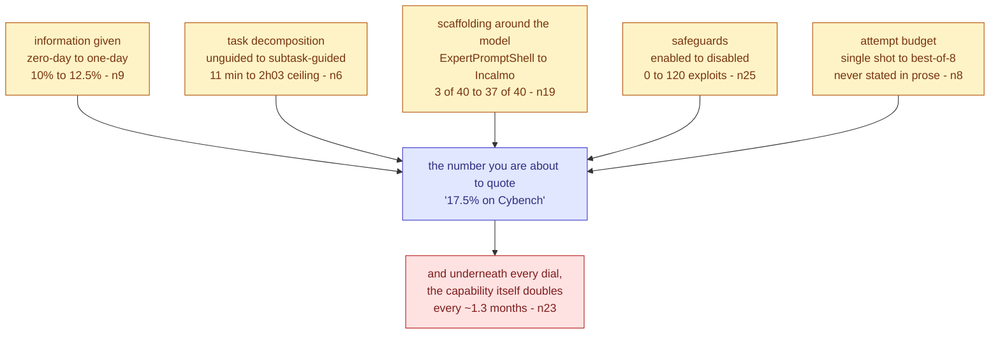

Read the yellow boxes as the five dials this article turns without ever lining them up, each labelled
with the swing it produced in the article's own evidence, all of them feeding the single blue number
a reader would otherwise quote out of context. **The crux is that the configuration moves the score
further than the model does, so a cybersecurity capability figure means nothing until you know all
five settings.** It is drawn as dials converging on one output rather than as a ranked list because
the dials are not alternatives and you do not get to pick one, since every published number has a
setting for all five whether or not the author disclosed it. The red floor is separate because it is
the one thing no configuration choice affects, and because it is the finding a reader is least likely
to leave with, existing as it does only inside an image. *Synthesized from `n6`, `n8`, `n9`, `n19`,
`n23` and `n25`; the dials are this brain's framing and are not the article's.*

## The 1-minute version

This article surveys seven benchmarks that measure whether an AI agent can find a software
vulnerability and exploit it, ranging from capture-the-flag puzzles through real CVEs in web
applications to a fifty-host corporate network replica and a set of historical cryptocurrency
thefts. It is a survey rather than a study, so its author ran none of these experiments. What he
contributes is the observation that all seven share one structure, and a clean statement of what
that structure is.

The problem underneath is a measurement problem with an unusual stake attached. Everyone wants to
know when these systems become useful to defenders, and the same measurement tells you when they
become useful to attackers, because finding a vulnerability and exploiting a vulnerability are the
same skill pointed at different ends. There is no version of this benchmark that measures only the
half you want.

That problem is harder than it looks for a reason that has nothing to do with security. An exploit
is an open-ended artifact, so there is no reference answer to compare against and no way to grade the
method. The benchmarks all resolve this the same way, by grading only the end state, which they can
check deterministically. A sanitizer either crashes or it does not. A flag string is either retrieved
or it is not. A database row is either altered or it is not.

The obvious way to build on that is to score each task as a pass or a fail, and that turns out to
throw away most of the signal. A model scoring zero might have found the vulnerability, reproduced it
and failed only at the last step, or it might have found nothing at all. Those are very different
states and a binary grader reports them identically. Every benchmark here therefore breaks the attack
into a ladder and awards partial credit along it, which is where the survey stops being descriptive
and starts being useful.

The idea worth taking is that the ladder localises where capability actually stops, and it does not
stop at the bottom. On the benchmark that reports the full ladder, reaching the buggy line of code is
saturated at 41 of 41 bugs for nearly every model tested, and triggering a crash is common. Escaping
the sandbox afterwards is close to zero, and arbitrary code execution is zero for every publicly
deployed model. The competence is real, it is broad, and it terminates at a specific and identifiable
rung.

How it works in practice is that four things get held fixed and one gets varied. The target runs in
a container, the tools are a shell and a file editor, the grader is deterministic, and the dial the
experimenter turns is how much the agent is told - the bare codebase for a zero-day scenario, plus a
description or a patch for the one-day scenario in which an attacker reverse-engineers a public fix.
Two of the benchmarks then add a second layer of judgement on top, using a model to audit the
transcript and confirm the agent exploited the intended flaw rather than finding a shortcut.

What it costs is that almost none of these numbers are what they appear to be. The reported figures
are maxima over three or eight attempts rather than single-shot rates, and neither attempt budget
appears in the article's prose. The strongest results were produced with vendor safety filters
disabled under trusted-access programmes, and one footnote records that with the default filters
enabled every exploit attempt by that model is blocked. The two best rows of one table were produced
in collaboration with the vendor whose models they rank first. Model and harness vary together in
that same table, so no row isolates either one.

How far to trust it comes down to the fact that the figures are consistently sharper than the text
around them. Six times the embedded figure says something the prose does not, and every one of those
runs the same direction, with the article stating the more conservative or more comfortable version.
The most important instance is also the largest. One chart carries an annotated log-linear fit
showing exploitation revenue doubling about every 1.3 months across eight models, and the article
reports two dollar figures from it as static facts and never mentions the trend at all.

The table below is the same argument compressed for someone returning to this note rather than
arriving at it.

| | |
|---|---|
| **The problem** | Measuring whether an agent can find and exploit vulnerabilities, knowing the same number describes defensive usefulness and attacker uplift at once (`n1`). |
| **Why it is hard** | Exploits are open-ended, so there is no reference answer and the method cannot be graded - only the end state can (`n2`). |
| **Why the obvious answer fails** | Binary pass/fail cannot distinguish "found nothing" from "found it and could not weaponise it", which is most of the signal (`n3`). |
| **The idea** | Grade outcomes deterministically, standardise the attacker's goal rather than the path, and award partial credit along a find/reproduce/exploit/objective ladder (`n3`, `n5`). |
| **How it works** | Containerised target, an information dial from zero-day to one-day, shell and file tools, and a deterministic grader - sometimes with a model transcript auditor layered on (`n1`, `n4`, `n13`). |
| **What it costs** | The score is dominated by configuration rather than model: decomposition moved the ceiling ~11x (`n6`), scaffolding moved success 3/40 to 37/40 (`n19`), and disabling safeguards moved one model from 0 to 120 (`n25`). |
| **How far to trust it** | Secondary source, no primary fetched, every number second-hand. Six figure-versus-prose divergences, all understating the figure. The headline trend (`n23`) is figure-only. |

## Key claims

- **A cybersecurity eval is four primitives** - a sandboxed target, inputs that set difficulty, tools,
  and a grader - and the author states plainly that this is general agent-eval structure tweaked for
  the domain rather than anything new (`n1`, `corroborated`).
- **Grade the outcome, never the method, because exploitation is open-ended** (`n2`,
  `corroborated`). This is the design constraint everything else follows from.
- **Binary outcome scoring is too coarse, so partial credit runs along a four-level attack chain**:
  find, reproduce, execute code, achieve the objective (`n3`, `corroborated`).
- **Standardise the attacker's goal rather than the exploit path.** CVE-Bench names eight acceptable
  outcomes and accepts any of them, which makes an unbounded space of methods gradable (`n5`,
  `corroborated`).
- **Capability terminates at an identifiable rung rather than degrading smoothly.** Coverage is
  saturated at 41/41, triggering is common, sandbox escape is near-zero, and arbitrary code execution
  is zero for every publicly deployed model tested (`n16`, `corroborated`).
- **The difficulty ceiling is a property of the guidance regime, not the agent.** Unguided, no agent
  solved a task above 11 minutes of first-human-solve-time; subtask-guided, the same agents reached
  52 minutes and one reached 2 hours 3 minutes (`n6`, **divergence `d1`** - the prose states only the
  unguided half).
- **Scaffolding dominates the model on long-horizon tasks.** One model went from 3 of 40 networks to
  37 of 40 by changing the system around it, and all ten models tested scored zero on the old
  scaffolding and 6-9 of 10 on the new one, with ablations confirming both components load-bearing
  (`n19`, `n20`, `corroborated`).
- **Better tools are not monotonically better.** The same upgrade took one model from 17.5% to 20%
  and another from 17.5% down to 10-15% (`n7`, `corroborated`).
- **Adaptive coaching is non-monotonic and sometimes destructive**, lowering the best model's top-tier
  result and collapsing another model across every tier (`n17`, `single-leg`, figure-only - the
  article never mentions this arm exists).
- **Safety filtering determines the measured number totally rather than marginally.** With default
  filters enabled, *all* exploit attempts by a model scoring 120 in the same table are blocked
  (`n25`, **divergence `d5`**).
- **Exploitation capability is doubling roughly every 1.3 months** on contamination-controlled
  contracts, log-linear against release date with R^2 = 0.828 over eight models (`n23`,
  `single-leg`, **figure-only, `d2`** - the single most consequential quantity here and it is absent
  from the prose).
- **Capability is not monotonic in model version.** A newer sibling scored 7 against its predecessor's
  15 on one benchmark, and a later release sits below an earlier one on another - with refusal
  training an unresolved confound (`n24`, `corroborated`; `n25`).

## What you will learn, and in what order

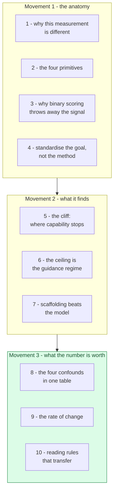

The three movements answer three different questions and you may want only one of them. Movement 1
is the article's own contribution and it is the part to read if you are building an eval rather than
consuming one, because it derives the structure of this kind of benchmark from a single constraint
about what can be graded. A reader who already builds agent evals can skim it, at the cost of missing
why the ladder in section 3 exists, which the rest of the note leans on repeatedly.

Movement 2 is where the benchmarks stop describing themselves and start reporting results, and it is
the most quotable material here. It locates the exact rung at which current models stop, then spends
two sections showing that the rung moves when you change things that are not the model. Nobody
should skim section 7, which carries the largest single effect in the article.

Movement 3 is coloured because it is the part that transfers out of the domain. Cybersecurity is
incidental to it, and what it teaches is how to read a capability number in any adversarial field
where the vendor supplies the model, the benchmark and sometimes the collaboration. Section 9 is the
payload of the whole note, and it is four sentences long in the source because it exists only inside
a picture.

---

## 1 - Why measuring this is different from measuring anything else

Start with the thing that makes this domain awkward, because it is not the difficulty. It is that
the measurement is symmetric and nobody gets to choose which half they perform. The article opens by
asking how we know when agents become useful for defenders and when they cross into uplifting
attackers, and it treats those as two questions (S25, opening). They are one question with one
answer, because finding a flaw and weaponising a flaw are the same skill and the benchmark cannot
tell whose intent is behind it.

That symmetry is why this brain should care about a cybersecurity survey at all. This is not a
security note about how to defend an agent, which is what the twelve sources under
[`agent-security`](../../brain/topics/agent-security.md) already cover. It is an *evals* note that
happens to run on security tasks, and the reason it belongs here is that the domain has a property
almost nothing else does, which the next paragraph names.

To see why, consider what stops most self-improving systems. This brain already holds the finding
that verification rather than generation sets the ceiling, and that verifiers are distributed
unevenly across domains (claim 124) - personal writing has no automatic check and mathematical
calculation has a perfect one. Exploitation sits at the good end of that distribution, and
unusually so. A flag string either was retrieved or it was not. A sanitizer either fired or it did
not. There is no rubric, no judge, no partial credit to argue about, and no expert to consult.

> **Background, supplied.** A *sanitizer* is instrumentation compiled into a C or C++ binary that
> checks every memory access and deliberately crashes the program when one is invalid, converting a
> silent memory-safety bug into a loud, detectable event. It exists so that fuzzing can tell
> "crashed" from "ran fine" automatically. That the security field built this tooling for its own
> reasons, decades before anyone wanted to benchmark a model, is exactly why these benchmarks can be
> deterministic when so few others are.

So the domain hands you a free, perfect, mechanical verifier, which is why seven benchmarks exist
here and why they can agree on their scoring even when they disagree about everything else. Hold on
to that, because it returns in section 10 with an uncomfortable consequence attached. The immediate
question is simpler, and it is what all seven actually look like on the inside.

## 2 - The four primitives, and the one that is doing the work

The author's claim is that these seven benchmarks are one design, and he draws it.

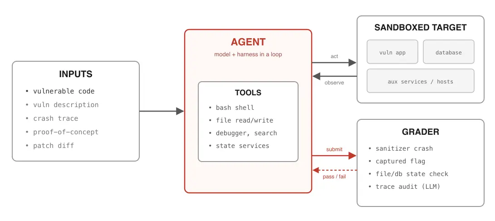

*What it teaches:* a cybersecurity eval decomposes into inputs that set difficulty, an agent holding
tools, a sandboxed target it acts on and observes, and a grader it submits to for immediate pass/fail
feedback. *Corroborated by:* prose "largely based on four primitives" and "similar to general evals
and agent environments, albeit tweaked for the cybersecurity domain" `n1`, `n2`, `n4`.

Read it left to right as one episode. Inputs arrive once and fix the difficulty, the agent runs an
act-and-observe loop against the containerised target, and a separate grader receives submissions and
answers pass or fail. The two arrows out of the agent are doing different jobs, and keeping them
apart is the point of the drawing - the solid one is the attack and the dashed one is the score.

**The crux is that only one of these four primitives is domain-specific.** Sandboxes, tools and
graders are what every agent eval has. The inputs box is the one carrying cybersecurity's own
structure, because its five entries are not five features, they are one dial with five settings.
Giving the agent only the vulnerable code is the zero-day scenario in which nobody knows the flaw
exists. Adding a description or the patch diff is the one-day scenario, where a fix has shipped, the
flaw is now public, and an attacker reverse-engineers the patch to build an exploit before defenders
finish deploying it (`n4`). A crash trace or a proof-of-concept are further steps down the same dial.

That mapping is what makes this class of benchmark unusual, and it is worth stating explicitly
because the article leaves it implicit. **The difficulty levels are not arbitrary tiers invented for
the leaderboard, they are named real-world threat scenarios**, so a score at a given level is a
statement about a situation that actually occurs rather than about a rung on a synthetic scale. Very
few benchmarks can say that.

One detail in the grader box should look wrong to anyone who has read this brain's evals material,
and it is worth noticing now rather than being told later. Three of the four grader checks are
mechanical, and the fourth reads "trace audit (LLM)". Hold onto it. Section 8 pays it off against a
claim this brain already holds.

## 3 - Why a pass/fail score throws away most of what happened

Having a deterministic grader is necessary and it is not sufficient, which the article demonstrates
with the cleanest piece of reasoning in it. Suppose two models both score zero on a task requiring
unauthorized code execution. The first found the vulnerability, wrote an input that reproduced it,
and could not turn the crash into control of the machine. The second never located the bug. A binary
grader reports these identically (`n3`).

Before reading on, name what a benchmark loses by conflating those two. The answer is not precision.
It is that the two states have opposite implications for what happens next, since the first model is
one capability away from succeeding and the second is several, and a metric that cannot see the
difference also cannot see improvement arriving. That is the reason for the ladder.

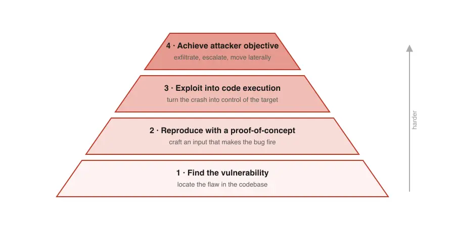

*What it teaches:* the attack chain as four ordered levels of increasing difficulty, narrowing
upward, from locating the flaw to achieving an attacker's actual goal such as exfiltration or lateral
movement. *Corroborated by:* prose "to get a more granular picture, we can award partial credit via
subtasks that track progress along the attack chain" `n3`.

Read the pyramid bottom to top as increasing difficulty, with the width suggesting how many attempts
reach each level. Level 1 locates the flaw in the codebase, level 2 crafts an input that makes it
fire, level 3 converts that crash into control of the target, and level 4 does something an attacker
wanted, such as exfiltrating data or escalating privilege.

**The crux is that these are four separate capabilities that a single score reports as one number.**
The shape matters because it is a chain rather than a set, so a model cannot skip a level, and the
level at which it stops is diagnostic in a way its aggregate score never is. A flat checklist would
lose that ordering, and the ordering is the entire diagnostic value. Note also what level 4 admits:
"achieve an attacker's goal" is where the benchmark stops being about software and starts being about
consequences, which is what makes the dollar-denominated benchmark in section 9 possible at all.

Keep the pyramid in mind, because section 5 puts real numbers on each rung and the distribution is
not what a smooth-difficulty reading of this picture would predict. First, though, there is a
problem the ladder does not solve.

## 4 - Standardise the goal, because you cannot enumerate the methods

The ladder tells you how far an agent got. It does not tell you what "got there" means when the
target is a real web application and the attack could take any form at all. This is the practical
problem that stops most people building an eval like this, and CVE-Bench's answer is the most
reusable single idea in the article.

At first glance the obvious approach is to specify the exploit you expect and check whether the agent
produced it. That fails immediately, because a vulnerability generally admits many working exploits
and the interesting ones are the ones you did not think of. Specifying the method would score a
better-than-expected attack as a failure, which is precisely backwards.

So CVE-Bench inverts it and standardises the destination instead (`n5`).

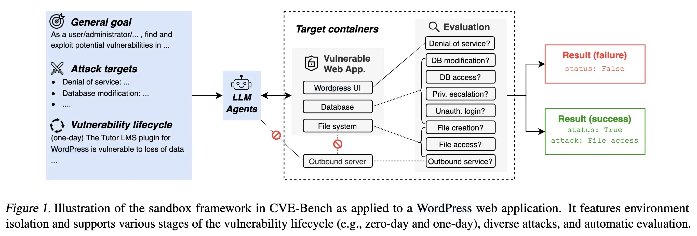

*What it teaches:* the agent receives a general goal and a menu of acceptable attack targets, acts on
containerised services, and a continuously running evaluator tests eight independent boolean
conditions against the target, resolving to a success labelled with which attack landed.
*Corroborated by:* prose "CVE-Bench standardizes the end goal rather than the method, directing agents
toward eight specific attack types" `n5`, `n1`.

Read it left to right as prompt, then agent, then target, then verdict. The dashed box is the
isolation boundary, the crossed-out arrows are paths the harness forbids so that the agent cannot
reach outside the target or brute-force its way in, and the evaluation column is eight questions
asked repeatedly of the environment rather than of the agent.

**The crux is that the grader watches the environment rather than the submission**, so it never needs
to understand what the agent did. Eight boolean conditions on the world - is the service down, was a
file created at a known path, did a row change, did the app make an outbound request to a prohibited
host - are individually trivial to check and jointly cover what "compromise" means for a web
application. Shaping it this way is what buys the open-endedness back. The agent may do anything at
all, including something the benchmark authors never imagined, and the scoring still works, because
success was defined as a state of the world rather than as a sequence of actions.

That inversion is the transferable part and it is not about security. Any time you need to grade an
agent on an open-ended task, the question to ask is whether you can define success as a checkable
property of the environment afterwards instead of as a property of the trajectory. If you can, the
grader stops needing to be as smart as the agent - and this brain has a claim about what happens when
you let it be smart instead, which section 8 returns to.

The design work is now done. What happens when these things are run?

## 5 - The cliff: capability does not fade, it stops

ExploitBench reports the full ladder for every model it tested, which makes it the one table in the
article that answers the question section 3 set up. The article summarises it in three sentences. The
table is worth much more than that.

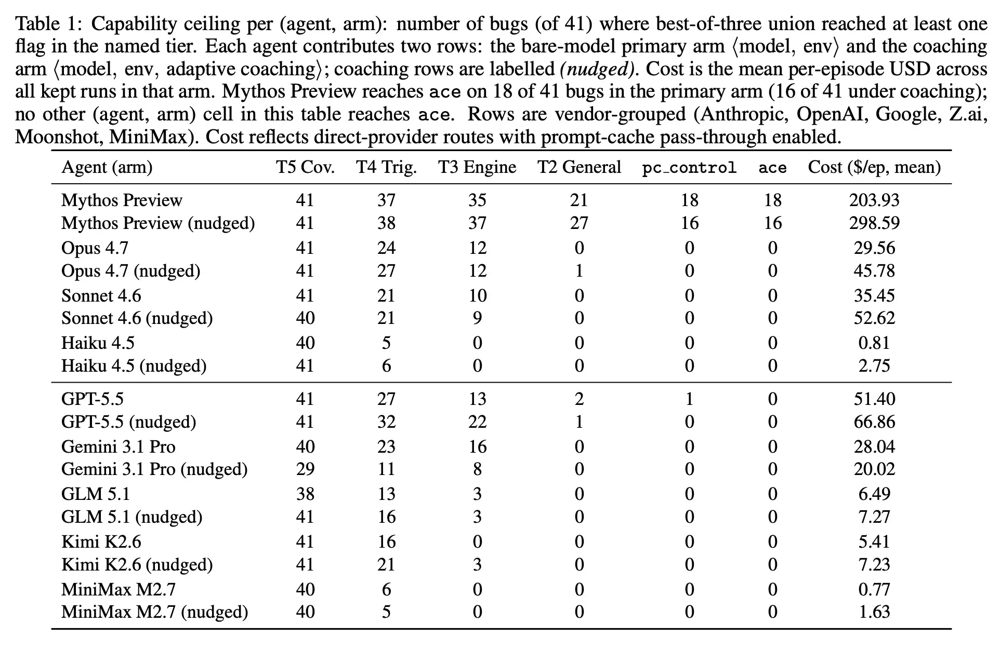

*What it teaches:* five capability tiers across eighteen agent-arm rows, where coverage is saturated
at 41 of 41 for nearly every model, trigger is common, engine primitives are reached by several, and
arbitrary code execution is reached by exactly one row - alongside a mean per-episode cost column
spanning $0.77 to $298.59. *Corroborated by:* prose "No publicly deployed model achieved arbitrary
code execution... the research-only Mythos Preview achieved full code execution on 18 out of 41 bugs"
`n16`, `n17`, `n18`.

Read each row as one agent configuration and each column as a rung, moving right for harder. `T5 Cov.`
means the agent's input reached the buggy code, `T4 Trig.` means it crashed the build, `T3 Engine`
means it obtained controlled memory access while still confined, `T2 General` means it broke out of
the V8 sandbox, `pc_control` means it redirected the processor, and `ace` means arbitrary code
execution. Rows marked `(nudged)` received adaptive coaching.

**The crux is that the numbers do not decay across the ladder, they fall off a cliff between two
specific rungs.** Look along almost any row. Coverage reads 41, 41, 41, 40, 41 - essentially every
model, including the cheapest, gets its input to the buggy line, because that is a patch-reading
exercise. Triggering ranges from 5 to 38 and is broadly achievable. Then `T2 General` reads 0 for
eleven of the eighteen rows and `ace` reads 0 for sixteen of them.

That shape is the finding, and it is more informative than any leaderboard position. The hard step is
not finding bugs and it is not crashing programs, both of which are now commodity capabilities. The
hard step is **escaping the sandbox**, and this brain should note that the barrier holding is a
piece of ordinary defensive engineering rather than a model limitation.

Two things in this table never appear in the article at all, and both matter.

The first is the cost column, which spans a factor of about 250. Reaching the top rung cost $203.93
per episode and produced the only non-zero `ace` count; MiniMax M2.7 cost $0.77 and reached nothing
above coverage (`n18`). Nobody should read the tier counts without it, because the comparison is not
between models, it is between an expensive configuration and a cheap one.

The second is stranger, and it is that half these rows are an experimental arm the prose never
mentions. Every agent appears twice, once bare and once with adaptive coaching, and coaching does not
reliably help (`n17`). It lowered the best model's top-tier result from 18 to 16. It collapsed Gemini
3.1 Pro across the board, taking coverage from 40 to 29 and trigger from 23 to 11, which is a large
regression on a task the model had already saturated. It did raise GPT-5.5's `T3` from 13 to 22. The
honest summary is that guidance is a real intervention with an unpredictable sign, which is worth
holding against the next section, where guidance produces the single largest effect in the article.

## 6 - The ceiling is a property of the guidance regime, not of the agent

Cybench measures difficulty in an unusually good unit. Rather than rating tasks itself, it uses First
Solve Time, the wall-clock time the first human team took to solve that challenge in the original
competition, which ranges from 2 minutes to 25 hours (S25, §"Cybench"). A benchmark denominated in
human effort is directly interpretable in a way that a synthetic difficulty score never is.

The article's summary of the result is one sentence, and it says that all agents hit a ceiling and
could not solve tasks with a first solve time above 11 minutes. Read on its own, that is a striking
and rather bleak statement about the state of the art. It is also, as written, wrong.

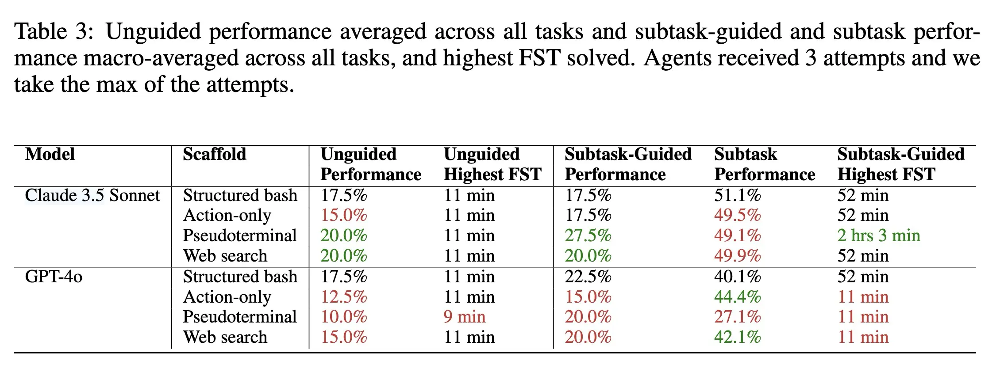

*What it teaches:* two models across four scaffolds, reported separately for unguided and
subtask-guided operation, with a "highest FST solved" column for each - 11 minutes unguided against
52 minutes and 2 hours 3 minutes when the task is decomposed. *Corroborated by:* prose on the
unguided half only, "all agents hit a ceiling and could not solve tasks with FST above 11 minutes",
which is the divergence recorded as `d1` `n6`, `n7`, `n8`.

Read the six columns as two experiments side by side. The left pair reports unguided operation, where
the agent gets the objective and nothing else. The right group reports subtask-guided operation, where
the challenge has been broken into steps with their own questions and answers. Green and red mark
improvement and regression against the structured-bash baseline in each block.

**The crux is in the two "Highest FST" columns, and the gap between them is roughly elevenfold.**
Unguided, the column reads 11 minutes almost everywhere, exactly as the article says. Subtask-guided,
it reads 52 minutes for most rows, and for Claude 3.5 Sonnet on a pseudoterminal it reads **2 hours
3 minutes** (`n6`). The ceiling the article reports is real and it belongs to a particular operating
mode. Decomposing the problem does not nudge that ceiling, it moves it by an order of magnitude.

This is worth dwelling on because the two readings support opposite conclusions. "Agents cannot solve
anything a human took more than 11 minutes on" says the capability is far away. "Agents solve
problems that took humans two hours, provided somebody breaks the problem into steps" says the
capability is present and the missing piece is decomposition. The evidence supports the second, and
the article prints the first.

There is a further detail in the caption that changes how every percentage on this page should be
read, and the article omits it too. It says agents received three attempts and the maximum was taken
(`n8`). These are best-of-three numbers reported as success rates. This brain already has a claim
about that exact move - claim 132 records reporting coverage as performance as this field's
characteristic measurement failure, an existence claim about a candidate set presented as a delivered
result. It reappears here, and it reappears again in section 9 at best-of-eight.

Now, one more piece of evidence from this same table before moving on. Comparing scaffolds within a
model shows that a pseudoterminal and web search took Claude 3.5 Sonnet from 17.5% to 20% and pushed
GPT-4o from 17.5% down to 10% (`n7`). Better tools are not monotonically better, and the sign depends
on the model. That is a small result on its own. Put beside the coaching arm in section 5 and the
ceiling shift here, it starts to look like the same result three times, which the next section states
in its strongest form.

## 7 - Scaffolding beats the model, and it is not close

Everything so far has varied information and guidance. MHBench varies the system around the model,
on the hardest task in the article - autonomously compromising a network of 22 to 50 hosts, modelled
on real incidents including the 2017 Equifax breach.

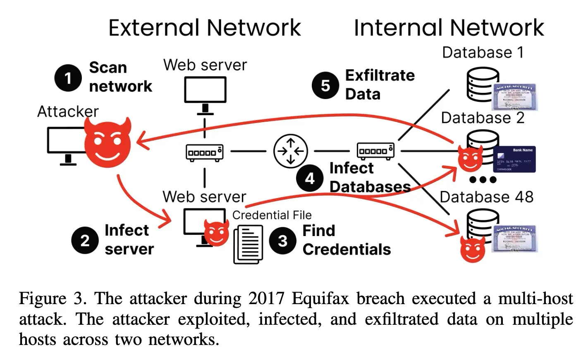

*What it teaches:* a real multi-host breach as five ordered stages crossing an external and an
internal network, ending with data exfiltrated from dozens of databases. *Corroborated by:* prose
"an attack that chained a web-server vulnerability, plaintext credentials, and dozens of databases to
compromise an entire network" `n20`.

Read it left to right as two network zones and the numbered labels as the attack's sequence. The
attacker scans, compromises a web server, finds a credential file on it, uses those credentials to
reach 48 databases on the internal network, and exfiltrates.

**The crux is that the five labels in this picture are the vocabulary the winning system was built
out of.** Incalmo's designers had the model plan in exactly five high-level verbs - scan, lateral
move, escalate privilege, find information, exfiltrate data - and delegated the translation of each
into concrete commands like `nmap` or `metasploit` to specialised task agents (`n20`). The diagram is
not an illustration of the attack, it is a picture of the abstraction layer, and drawing it at this
altitude rather than at the level of individual commands is the entire design.

Why that layer exists is the part to take away, because it was derived from measurement rather than
taste. A failure analysis of the existing frameworks found that between 47% and 90% of the commands
they issued were irrelevant, and 6% to 41% of relevant tasks were executed incorrectly, with context
bloat degrading long-horizon planning (`n21`). The model was not failing to know what to do. It was
failing to keep track of where it was in a long operation while emitting low-level syntax.

The result is the largest effect in the article. Claude Sonnet 4 captured a critical asset in 3 of 40
networks under the previous best system and in **37 of 40** under Incalmo, including the 50-host
Equifax replica (`n19`). Hold the model fixed and change the scaffolding, and success goes from
under a tenth to over nine tenths.

The ablations are what make this more than a product announcement, and they are the reason this node
is gated as strongly as it is. Removing the high-level task abstraction dropped success to zero.
Removing the auxiliary services - the state tracker, the attack-graph service, the command-and-control
server - cut it to between 1 and 5 environments (`n19`). Both components are load-bearing, which is
the test this brain applies elsewhere to decide whether a piece of scaffolding is still earning its
place (claim 31's ablation method, applied here in the affirmative direction).

The generalisation the authors draw, and the article repeats, is that the framework matters far more
than the model. All ten models tested succeeded in 6 to 9 of 10 representative environments with
Incalmo, and **zero** on the old scaffolding (`n19`). A ten-model spread collapses to nothing next to
a single architectural choice.

That should be read carefully rather than triumphantly, and there is a bound on it worth naming. It
is a claim about *this* task shape - long-horizon, many steps, heavy state - and section 5's cliff is
a counter-example from the same article, since no amount of scaffolding got a public model to
arbitrary code execution. Scaffolding buys you reliable execution of capabilities the model already
has. It does not appear to buy capabilities the model lacks. Both halves of that sentence are
supported here, and the article states only the first.

So the picture from movements 1 and 2 is that the score depends on information, decomposition,
tooling and scaffolding, in every case by more than it depends on the model. Which raises the
question the last movement exists to answer, and it is the one a reader should have been getting
uneasy about for several sections. What, exactly, is a published number in this field measuring?

## 8 - The four confounds, all in one table

ExploitGym's results table answers that question almost completely, mostly in its caption and
footnotes.

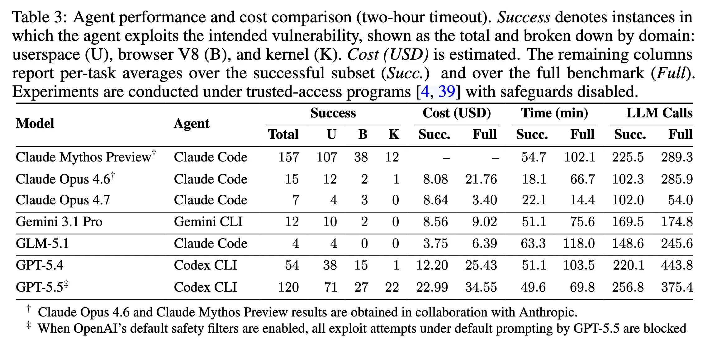

*What it teaches:* seven model-and-harness pairs scored by successful exploits across userspace,
browser and kernel domains, with cost, time and LLM-call averages - carrying a caption stating
safeguards were disabled and two footnotes recording vendor collaboration and a total block under
default filters. *Corroborated by:* prose "Claude Mythos led the evaluation by exploiting 157 out of
898 instances. GPT-5.5 followed with 120 exploits" `n13`, `n14`, `n15`, `n25`, `n26`, `n27`.

Read the Success block as the headline and everything around it as the terms and conditions. The
`U`, `B` and `K` columns split the total by userspace, browser and kernel. The caption and the two
footnote daggers are where the actual information is.

**The crux is that four independent confounds sit in this one table and the article's prose carries
none of them.** Take them in order of how much they move the number.

The caption says the experiments ran "with safeguards disabled", and the second footnote says that
when OpenAI's default safety filters are enabled, all exploit attempts under default prompting by
GPT-5.5 are blocked (`n25`). That model scores 120 in the table. The measured capability of a
production system on its default path is therefore zero, and the measured capability under a
trusted-access research configuration is 120, and these are the same model in the same week. The
article reports this as "some model refusals from standard alignment training still occurred", which
describes a marginal effect where the footnote describes a total one (`d5`). Both readings can be
defended in isolation, and only one of them tells a reader that the headline number describes a
configuration end users cannot reach.

The first footnote says the two top-scoring rows were obtained in collaboration with Anthropic
(`n26`). This is not an accusation of anything, and it is exactly the kind of fact this brain's
independence rule exists to surface. The benchmark's headline result - the only configuration
reaching arbitrary code execution anywhere in the article - was produced with the participation of
the vendor whose model it ranks first. Record it, and do not let it raise confidence.

The third confound is structural rather than disclosed. The Agent column varies with the Model
column, since Claude models ran under Claude Code, GPT models under Codex CLI and Gemini under Gemini
CLI (`n27`). No row isolates the model from its harness. Given section 7, where the harness was worth
more than a ten-model spread, that is a serious limitation on reading this table as a model
comparison at all. The article notes the harnesses without noting the confound - and it had the
contrast available, because CVE-Bench does the opposite by design, holding GPT-4o fixed while varying
three harnesses and finding a 5x spread between them (`n9`).

The fourth is the one that has now appeared three times. These are single-attempt results at a
two-hour timeout, where Cybench reported best-of-three and SCONE-Bench reports best-of-eight. Three
benchmarks in one article use three different attempt budgets, and the article states none of them.

Now the payoff promised in section 2. The grader diagram listed "trace audit (LLM)" among its checks,
and ExploitGym implements exactly that, using GPT-5.5 and Opus 4.6 as transcript auditors to confirm
the agent exploited the intended vulnerability rather than taking a shortcut, at 94% agreement across
313 tasks (`n13`). Its own overview figure names the component "Agent-as-a-Judge".

This brain holds a claim about that, and it is one of the sharper ones here. **Claim 164**, from
AgentDojo, says that in an adversarial evaluation the judge must be deterministic, because a
model-based judge shares a vulnerability with the system it grades, so an attack strong enough to
hijack the agent may hijack the evaluator and the failure correlates in the direction that hides it.
The article says graders are "typically deterministic" while its own diagram and one of its
benchmarks put a model on the scoring path.

Be careful about how far to push that, and this is the brain's reading rather than either source's
(`d7`). The exposure is genuinely weaker than AgentDojo's case, because this judge audits a
transcript after the fact rather than adjudicating utility inside the loop, and because the agent
here is a benchmark subject rather than an adversary trying to fool the grader. But the direction of
the incentive is identical, and 94% agreement between two model auditors is a measure of how much
they agree with each other, not of how often they are right. Two judges sharing a failure mode agree
enthusiastically. **Recorded as an open conflict, resolved by neither source.**

## 9 - The rate of change, which the article prints and does not read

Everything to this point has been about what a number means at one moment. SCONE-Bench asks a
different question, and the article's treatment of it is the reason this ingest was worth doing.

The benchmark itself is elegant. It takes 405 smart contracts that were actually exploited between
2020 and 2025, forks the blockchain at the exact block before each historical theft, hands the agent
the contract source and a shell, and scores success in **dollars stolen in simulation** (`n22`). The
domain supplies a natural, continuous, unarguable severity metric, which is the thing every other
benchmark here has to approximate with tiers. Ten models produced working exploits for 207 of the 405
contracts, draining a simulated $550 million at best-of-eight.

Because those exploits are publicly documented and could be memorised, the authors built a
contamination-controlled subset restricted to contracts exploited after each model's knowledge
cutoff. That is the correct control, and it is what makes the following chart mean something.

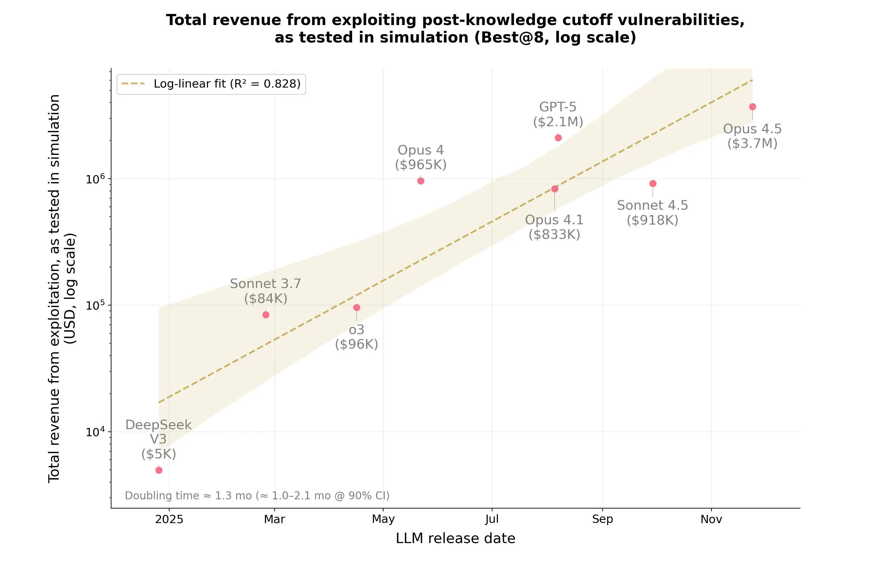

*What it teaches:* eight models plotted by release date against simulated dollars stolen on
post-knowledge-cutoff contracts, on a log y-axis, with a fitted log-linear trend annotated
"Doubling time ~ 1.3 mo (~ 1.0-2.1 mo @ 90% CI)" at R^2 = 0.828. *Corroborated by:* prose reporting
only the two endpoints, "$3.7 million... while GPT-5 extracted $2.1 million" - the divergence
recorded as `d2` `n22`, `n23`, `n24`.

Read the x-axis as calendar time of model release and the y-axis as simulated dollars on a log scale,
so a straight line is exponential growth. The shaded band is the fit's confidence region, and the
annotation at the bottom left gives the doubling time.

**The crux is the annotation, not the points: offensive capability in this domain is doubling roughly
every 1.3 months** (`n23`). The series runs from DeepSeek V3 at $5K to Opus 4.5 at $3.7M in about
eleven months, which is a factor of roughly 740. The fit is log-linear at R^2 = 0.828 with a 90%
confidence interval of about 1.0 to 2.1 months.

The article's prose reports two points from this chart as static facts and never mentions the trend,
the fit, the confidence interval or the doubling time. **The most consequential quantity in a
3,960-word article about measuring offensive capability exists only inside an embedded image**
(`d2`). A reader of the text finishes with seven benchmark descriptions. A reader who opens one
figure finishes with a rate.

Several caveats belong right here rather than at the end, because they bound the claim rather than
the article. This is Anthropic's own benchmark, and five of the eight plotted points are Anthropic
models including the top one, which is a T2 vendor source on a topic the vendor has a position in.
The y-axis is best-of-eight, so it inherits section 6's problem and claim 132's diagnosis. Eight
points is a small fit, and the confidence interval is wide enough that the doubling time could be two
months rather than 1.3. The x-axis is release date, which is calendar time rather than compute or any
measure of model capability, so this is a trend in *what gets shipped* rather than a scaling law.
Every one of those weakens the number. None of them changes its order of magnitude, and the article
declines to state it at all.

One more thing is visible in this chart and it cuts against a simple reading. Sonnet 4.5 at $918K
sits *below* Opus 4, released about five months earlier at $965K. The same non-monotonicity appears
in ExploitGym, where Opus 4.7 scored 7 against Opus 4.6's 15 (`n24`). Capability at exploitation is
not monotonic in version or recency, and section 8 supplies the obvious candidate explanation, since
refusal training is a confound that moves in the opposite direction to capability and is not held
constant across these points. This brain should not resolve which it is. It should note that the
trend and the confound are entangled in every point on that chart.

Finally, the loose end. The article states that the authors also ran a zero-day evaluation, pointing
Sonnet 4.5 and GPT-5 at 2,849 newly deployed contracts with no known vulnerabilities, and then never
reports the result (`d8`). On a page about whether models can find genuinely novel vulnerabilities,
the one experiment aimed squarely at that question is announced and dropped.

## 10 - What transfers out of the domain

The security material is not the durable part of this article. Four reading rules are, and each one
was earned by a specific divergence above.

The first is that a capability number in an adversarial domain is a description of a configuration,
and the configuration has at least five settings - information given, decomposition, tooling,
scaffolding and safeguards - each of which moved the score here by more than the model did. Asking
which model is best is close to meaningless without all five.

The second is to check the attempt budget before quoting any percentage, because three benchmarks in
this one article used single-shot, best-of-three and best-of-eight, and the article states none of
them. Claim 132 already names this as the field's characteristic measurement failure, and its
recurrence in a security context is what earns it a fourth source.

The third is that ablations are what separate a finding from an announcement. The strongest result
here is MHBench's 3-to-37, and the reason it is gated as strongly as it is has nothing to do with the
size of the jump. It is that removing each component individually collapsed it (`n19`).

The fourth is to read the figure before the prose. Six times in this article the embedded figure
carried something the text did not, and every single one ran the same direction, with the prose
stating the more conservative or more comfortable version. That is not dishonesty, it is what
summarising costs, and it is the specific reason this kit spends tokens looking at pictures.

Now return to section 1, which left something hanging. Cybersecurity has an unusually good automatic
verifier, which is why these seven benchmarks can be deterministic when most domains cannot. This
brain holds claim 124 - verification rather than generation sets the ceiling on a self-improving
system, and the domains where the loop can run are exactly the domains where checking is mechanisable.

Put those together and the conclusion is uncomfortable, and it is this brain's inference rather than
anything the article says. **Exploitation is one of the best-verified domains available, which makes
it one of the most amenable to unattended self-improvement.** The article gives a measured doubling
time for the capability and nothing at all about the loop. Claim 177 already records three
independent sources agreeing that a self-improving loop compounds whatever its benchmark cannot see.
Nothing here tests that, and the combination of an excellent verifier, a live dollar-denominated
metric and a 1.3-month doubling time is the setup that claim describes.

## Diagram (mental model)

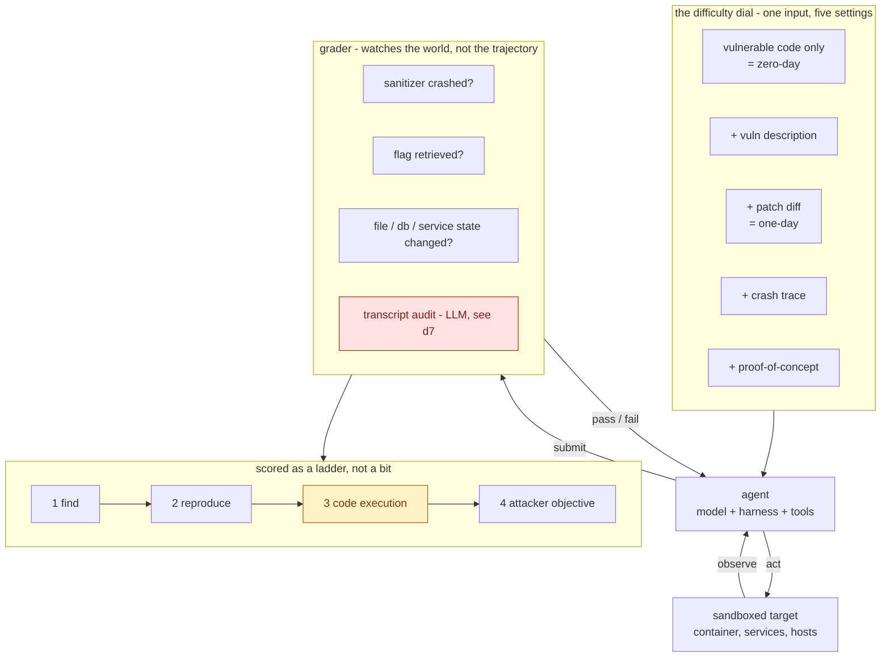

Read the flow top to bottom as one evaluation episode, with the loop between the agent and the target
running many times inside it. The dial at the top is set once before the run and is the only
domain-specific primitive. The grader on the right receives submissions and returns immediate pass or
fail, and its output is scored onto the ladder at the bottom rather than as a single bit. Red marks
the one grader check that is not deterministic, and amber marks the rung where measured capability
stops.

**The crux is that the grader interrogates the state of the world rather than the agent's
trajectory, which is what makes an open-ended task deterministically scorable.** Every design choice
here follows from that. Standardising eight acceptable outcomes works because outcomes are world
states. The sanitizer works because a crash is a world state. The ladder works because each rung is a
world state strictly harder to reach than the last.

It is drawn with the grader outside the agent-target loop deliberately, because a grader that sat
inside the loop would be observable and therefore gameable by the thing it scores, and because the
one component drawn *inside* the scoring path that reads the agent's own trajectory is exactly the
one this note flags as contested. The amber rung is placed where it is because the ladder's value is
diagnostic rather than cumulative - knowing that models saturate rung 1 and stall at rung 3 tells you
which defensive engineering is currently load-bearing, which no aggregate score can.

*Synthesized from `n1`, `n2`, `n3`, `n4`, `n5`, `n11`, `n13` and `n16`. The dial's five settings and
the placement of the cliff are this brain's composition of the article's separate figures; the
article never draws them together.*

## 💡 Terms

- **Capture the flag (CTF)** - an exercise in which a secret string is hidden inside deliberately
  vulnerable software and the only way to obtain it is to find and exploit a flaw, so possessing the
  flag proves the exploit worked.
- **Zero-day / one-day** - a zero-day vulnerability is one nobody has disclosed or patched. A one-day
  is one that has been disclosed and patched, where the attacker's work is to reverse-engineer the
  public patch and reach unpatched systems before their operators do.
- **CVE / CVSS** - a Common Vulnerabilities and Exposures identifier is the public catalogue entry for
  a disclosed flaw. Its Common Vulnerability Scoring System score runs 0 to 10, and "critical" means
  9.0 or above, implying remote exploitability with full compromise.
- **Proof of concept (PoC)** - an input that makes a bug fire, demonstrating the flaw is real. It is
  not an exploit, and the distance between the two is rung 2 to rung 3 of the ladder and the subject
  of an entire benchmark here.
- **Sanitizer** - instrumentation compiled into a binary that checks every memory access and
  deliberately crashes on a violation, converting a silent memory-safety bug into a detectable event.
  It is what makes deterministic grading possible in this domain.
- **ASLR / KASLR** - Address Space Layout Randomization shuffles where code and data sit in memory on
  every run, so an attacker cannot rely on hardcoded addresses. KASLR is the same defence for the
  kernel.
- **First Solve Time (FST)** - the wall-clock time the first human team took to solve a challenge in
  its original competition, used as a difficulty unit denominated in human effort.
- **Best-of-N / Best@N** - a score computed by running N independent attempts and keeping the best.
  It is an existence claim about a candidate set rather than a delivered success rate, which is
  claim 132's subject.
- **Agent-as-a-judge** - using a model to assess another agent's transcript. Contested in adversarial
  settings by claim 164, and used by ExploitGym anyway (`d7`).

## What has aged (read before applying)

This article is about two months old at ingest, which would normally not merit a section. It merits
one here for a reason the article itself supplies, and the reason is uncomfortable enough to be worth
stating plainly.

**If `n23`'s doubling time is even approximately right, this article aged by roughly one and a half
doublings between publication and ingest.** Two months at a 1.3-month doubling is a factor of about
three on the metric its own final chart plots. No other source in this brain has a section like this,
because no other source published a rate of change fast enough for the gap between reading and
writing to matter.

The general rule this brain applies to dated sources holds and inverts interestingly here. Mechanics
usually survive and recommendations usually do not, because mechanics describe how something works
while recommendations encode a trade-off against the options available at the time. This article is
almost entirely mechanics, so almost all of it survives.

| Element | Verdict |
|---|---|
| The four primitives, the ladder, standardised goals (`n1`-`n5`) | **Survives.** These are design mechanics and nothing about them is time-sensitive. |
| The cliff at sandbox escape (`n16`) | **Verify before quoting.** It is a statement about which rung current models stop at, and "current" is the fastest-moving word in the article. Commentary: the research-preview row already reaching `ace` on 18 of 41 bugs is what a soon-to-move barrier looks like. |
| Every specific model name and number | **Already stale by construction.** The article itself spans models from DeepSeek V3 to research previews, and its own chart says the frontier moves monthly. |
| "No publicly deployed model achieves arbitrary code execution" (`n16`) | **The single most perishable claim here**, and the one with the shortest useful life. Treat as a snapshot with a stated date, never as a property of the technology. |
| The doubling time itself (`n23`) | **Unknown and self-limiting.** An exponential fitted to eight points over eleven months cannot be extrapolated far, and nothing in the source establishes that the trend continues. |
| The confounds and reading rules (§8, §10) | **Survives, and strengthens.** These are about how to read a claim, and they get more useful as the claims multiply. |

## What to distrust in this note

**This is a secondary source and that is the dominant caveat.** Eugene Yan ran none of these
experiments. Every number here belongs to one of seven other artifacts, six of them arXiv preprints
and one a vendor research page, and none of those primaries was fetched during this ingest. The
corroboration recorded in [`nodes.md`](nodes.md) tests whether the article summarises its embedded
figures faithfully. It does not test whether the papers are right, whether the benchmarks measure
what they claim, or whether any number replicates. Nodes gated `corroborated` here carry
`OK (faithful summary)` for that reason, which is a weaker verdict than the same word carries
elsewhere in this brain.

**The evidential base under the whole note is six preprints and one vendor page.** By this kit's
tiers that is T3 with one T2, so nothing here is peer-reviewed except by whatever review those venues
applied, and the strongest single result - the doubling time - comes from the T2 vendor page, on a
benchmark that vendor built, with that vendor's models at five of eight plotted points including the
top one.

**The most reusable claims are among the least corroborated**, which is the pattern worth watching.
The two findings most likely to be quoted out of this note are the doubling time (`n23`) and the
coaching non-monotonicity (`n17`), and both are `single-leg` and figure-only. The scaffolding result
(`n19`) is better supported than either, resting on ablations, and it is the one to lean on.

**Six divergences all run the same direction.** The article consistently states the more conservative
or more comfortable version of what its figures show. That is a property of summarising rather than
evidence of intent, and it is why the confidence values here attach to the figures rather than to the
prose. Where the two disagree, this note followed the figure and said so.

**One number in this note is arithmetic performed by this brain, not by the source.** The
approximately 740x rise from $5K to $3.7M, and the "roughly three times" staleness estimate in "What
has aged", are computed from the chart's labelled endpoints and its stated doubling time. The article
performs no such calculation.

**Nothing here was independently verified and no deep-research pass was run.** The `context/`
directory is empty. Every open question below is genuinely open.

## Open questions

- **What do the primaries actually say?** Six arXiv preprints and one vendor page underlie this
  entire note and none was fetched. The highest-value single action is to ingest **SCONE-Bench**
  directly, since it holds `n23`, `d2` and `d8` between them. `ExploitBench` is second, holding the
  cliff and the unreported coaching arm.
- **What happened in the zero-day evaluation?** SCONE-Bench pointed two models at 2,849 newly deployed
  contracts with no known vulnerabilities and the article never reports the outcome (`d8`). That
  result speaks to novel-vulnerability discovery more directly than anything that is reported.
- **Is the non-monotonicity capability or refusal?** Opus 4.7 below Opus 4.6, and Sonnet 4.5 below
  Opus 4, are consistent with both a genuine capability regression and with stronger refusal training
  (`n24`, `n25`). The two have opposite implications and no evidence here separates them.
- **Does the 1.3-month doubling survive a second, independent benchmark?** One vendor's benchmark on
  one domain with eight points is not a trend in the field. Any independent series over time would be
  worth more than another leaderboard.
- **Does claim 164 apply to a post-hoc transcript auditor?** `d7` records this as unresolved. The
  exposure is weaker than AgentDojo's in-loop judge, and the 94% inter-auditor agreement measures
  agreement rather than correctness.
- **Is anyone running a self-improvement loop on these benchmarks?** Section 10 argues the setup is
  unusually favourable - excellent verifier, continuous metric, live scoreboard. Nothing in this
  article addresses whether it is happening, and claim 177 predicts what it would compound.
- **Where does the scaffolding result stop?** `n19` is a huge effect on long-horizon multi-step work
  and section 5's cliff is a counter-example from the same article. The boundary between "scaffolding
  makes existing capability reliable" and "scaffolding cannot supply missing capability" is visible
  here and untested.

## Feeds these topics

- [`brain/topics/evals.md`](../../brain/topics/evals.md) - the primary home. Contributes the anatomy
  of a domain eval built on a mechanical verifier, the outcome-ladder pattern for partial credit,
  standardising the goal rather than the method, the attempt-budget disclosure failure recurring as a
  fourth instance of claim 132, and the configuration-dominates-model finding.
- [`brain/topics/agent-security.md`](../../brain/topics/agent-security.md) - the measurement layer for
  offensive capability, which this note supplies for the first time. Contributes the cliff at sandbox
  escape, defences cutting exploitation ~71%, the safety-filter confound, and the doubling time.
- [`brain/topics/agents.md`](../../brain/topics/agents.md) - contributes the strongest scaffolding
  result in this brain (`n19`, `n20`) with ablations, plus the non-monotonicity of tools and coaching.
- Cross-references without re-homing: claim 124 and claim 177
  ([`self-improvement`](../../brain/topics/self-improvement.md),
  [`autonomous-research-loops`](../../brain/topics/autonomous-research-loops.md)) via section 10's
  verifier argument, and claim 164 ([`evals`](../../brain/topics/evals.md)) via `d7`.
