# Learning - LLM Knowledge Bases: a practical guide

> Persona: **curator + mentor**, with **fact-checker** at the gate. Re-adopt when working this file.

> The distilled document you learn from, anchored by the eight frames gated in [`nodes.md`](nodes.md).
> Every claim carries a node ID. See [`SOURCE.md`](SOURCE.md) for metadata.

## TL;DR

This brain already holds the *pattern* for LLM-maintained knowledge bases, as [S8](../260731_llm-wiki/LEARNING.md),
and has never seen anyone run one. This talk is that missing half. Ben Holmes read Karpathy's gist,
built it, and put the working parts on a projector - the skill file, the tag registry, the generated
entity page, the scheduled job - which turns a set of eighteen `needs-check` assertions into something
you can watch operate. Two things make it worth twenty minutes. The mechanisms he had to invent that
the pattern does not mention are the ones that decide whether it survives past a month, and there are
four of them. And the system quietly **breaks the pattern's single most load-bearing rule** - raw
sources are immutable - which turns out not to be sloppiness but a genuine correction, because the
rule as written cannot be implemented and the rule as practised can.

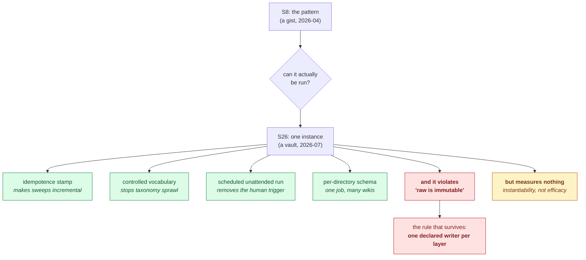

Read it top to bottom as the question this source answers for a brain that already has the pattern.
Green is what the instance adds, red is where it contradicts its own source, and amber is the ceiling
on all of it. **The crux is that the interesting content of an implementation is exactly the part the
pattern did not specify**, which is why the four green nodes matter more than the faithful
reproduction above them. It is drawn as one fan-out rather than as the talk's five-stage pipeline
because the pipeline is S8's and reproducing it here would say that the value of this source is its
agreement, when the value is its residue. The amber node hangs off the instance rather than sitting
at the bottom as a caveat, because it qualifies every green node individually and none of them
survives being quoted without it. *Synthesized from `n1`, `n5`, `n6`, `n10`, `n12`, `n16` and `d1`.*

## The 1-minute version

This talk is a demonstration of a personal knowledge base that an LLM maintains on the author's
behalf, shown end to end on a real vault of a few hundred notes. It covers how the raw material gets
captured, how a background agent adds structure to it, how a browsable wiki is generated on top, and
how the whole thing is put on a schedule so it runs overnight. It is a working system on screen rather
than a proposal, and that is its entire contribution.

The problem it works on is one most engineers recognise and few have solved. You accumulate notes -
meeting scraps, half-finished thoughts, things you read - and the pile grows faster than your ability
to navigate it, so the notes stop being an asset and become an archive you feel guilty about. The
speaker opens by asking how many people have a disorganised notes folder, and essentially every hand
in the room goes up [@t=49].

What makes it hard is not storage and not search, and this is the part that took the field a while to
name. The obvious response is to point retrieval at the pile, which is what every RAG-shaped tool
does. But retrieval is stateless across queries, so the model rediscovers everything from scratch each
time you ask, and any question needing five documents synthesised pays that synthesis again on every
single ask, while you wait [S8 `n1`]. Nothing accumulates. The pile stays a pile, and you have merely
bought a better flashlight for looking into it.

So the pattern this talk implements moves the work. Instead of retrieving at query time, an LLM
incrementally builds and maintains a persistent wiki of markdown files sitting between you and the raw
sources - synthesis compiled once at ingest and then kept current, rather than re-derived per question
[S8 `n2`, `n3`, `visuals/frame_712.jpg`]. The architecture is three layers defined by who may write to
them, and the immutability of the raw layer is what makes every derived claim auditable [S8 `n4`,
`visuals/frame_728.jpg`]. All of that is S8's, and this talk displays it rather than establishing it.

The reason to spend time here is what the instance adds. Four mechanisms appear that the pattern never
mentions, and each one is load-bearing in a way you only discover by running the thing. Enrichment
stamps every note it finishes with an `enrichedAt` timestamp and skips anything already stamped, which
turns a whole-corpus pass into an incremental one [`n5`]. Tags come from a registry the agent must read
first, with an explicit instruction to be reluctant about coining new ones, because the model
otherwise invents a fresh vocabulary on every pass [`n6`]. Maintenance runs unattended on a schedule in
a cloud sandbox rather than waiting for a human to remember [`n10`]. And each wiki directory carries
its own schema file that overrides the generic one, so a single scheduled job can maintain several
knowledge bases with different conventions [`n12`].

Then there is the thing the talk does not notice about itself. The system enriches notes by writing
titles, frontmatter and backlinks **into the raw files** [`n7`], while the same talk displays the rule
that raw sources are never modified and encodes that rule in its own automation prompt [`n11`, `d1`].
Both are true on screen, minutes apart. The reconciliation is visible in the automation's own wording
and never said aloud, and it is the most useful sentence this source produces: immutability is scoped
per job, not per layer. Enrichment owns raw's metadata, the wiki job owns the wiki, and neither may
cross. **One declared writer per layer** is implementable where "raw is immutable" is not.

What it costs is real and mostly unbudgeted. You are handing a model write access to your own notes,
and the audit trail moves from "the agent could not have edited this" to "git will tell you what it
did". Backlinks are a judgement call rather than a threshold [`n8`], and a wrong one is invisible once
written. The human's remaining job is to review a diff every morning, which is asserted as sufficient
and never tested [`n13`].

How far to trust it is the easiest question in this note, because the answer is bounded and clean.
**Nothing here is measured** - no baseline, no comparison against the retrieval systems the pattern
dismisses, no error rate, no count of bad edits, no corpus size [`n16`]. It is a demo, and a demo
proves a thing can be built and shown working once. That happens to be exactly the evidence this brain
was missing about S8, so the fit is good, but it does not extend one inch further.

The table below compresses the same argument for someone returning to check one row.

| | |
|---|---|
| **The problem** | Personal notes accumulate faster than you can organise them, so they decay into an archive you cannot use [@t=49, `n2`]. |
| **Why the obvious answer fails** | RAG over the pile is stateless across queries - the model re-derives from scratch every time and nothing accumulates, so a five-document synthesis question is paid for again on every ask [S8 `n1`, `visuals/frame_712.jpg`]. |
| **Why it is hard** | The missing component was never storage, retrieval or linking. It was **labour** - the bookkeeping that makes humans abandon wikis [S8 `n13`, `n15`]. |
| **The idea** | Compile synthesis once at ingest into a persistent, interlinked wiki the LLM owns and maintains, layered over an immutable raw collection [S8 `n2`, `n4`, `visuals/frame_728.jpg`]. |
| **How it works here** | Capture without structure [`n2`, `n3`] -> a skill adds tags, source and backlinks in a later pass [`n4`] -> a generated wiki of entity pages with per-bullet citations [`n9`] -> the whole thing on a nightly schedule in a sandbox [`n10`]. |
| **What the instance adds** | Idempotence stamp [`n5`], controlled tag registry [`n6`], unattended scheduling [`n10`], per-directory schema override [`n12`]. |
| **The interesting contradiction** | Enrichment mutates the raw layer the pattern calls immutable, and the talk never notices. The rule that survives is **one declared writer per layer** [`n7`, `n11`, `d1`]. |
| **What it costs** | A model with write access to your own notes, backlink precision nobody measures [`n8`], and an audit story that now depends on git rather than on layering [`d1`]. |
| **How far to trust it** | **As instantiability only.** Zero measurements of any kind [`n16`]; T4 practitioner, with a T2 commercial interest on the automation section [`d2`]. |

## Key claims

- **Showing a source is not corroborating it, and this ingest is the clean case.** The talk displays
  S8's gist in full, and under the independence rule that is the same leg wearing a different hat -
  same author, same document, same revision. **No S8 node moved.** What is independent is that a
  different person at a different organisation built the pattern and ran it [`n1`].
- **An idempotence stamp is what makes corpus-wide maintenance affordable.** `enrichedAt` in the
  note's frontmatter, checked before work and written after, converts a sweep over everything into a
  sweep over what is new [`n5`, `visuals/frame_404.jpg`]. **New beyond S8**, and it is the
  precondition for `n10` rather than a convenience.
- **A generated taxonomy needs a registry and an explicit reluctance instruction, because the model's
  default is to invent.** Tags live in `references/tags.md`, the agent must read it first, reuse is
  mandated, and any coinage must ship a one-line definition into the registry [`n6`,
  `visuals/frame_425.jpg`]. The stated reason is behavioural: "Claude loves to get creative" [@t=435].
- **A derived page earns trust by carrying citations per claim, not per page.** Generated entity pages
  are structured Who / What the sources say / Related / Sources, and every claim bullet terminates in a
  link to the dated raw note behind it [`n9`, `visuals/frame_776.jpg`].
- **Immutability is scoped per job, not per layer** - the correction this instance forces on its own
  source. The talk both endorses "raw sources are read-only" and writes into raw notes; the rule that
  survives contact with a real vault is **one declared writer per layer, with the exception written
  down** [`n7`, `n11`, `d1`].
- **The schema layer is plural.** Each wiki directory carries its own `AGENTS.md`, and the scheduled
  job is instructed to follow the local schema over its own generic instructions - which is what lets
  one job maintain several knowledge bases it knows nothing about [`n12`, `visuals/frame_980.jpg`].
  **`single-leg`, figure-only.**
- **Nothing in this source is measured** [`n16`]. Treat every mechanism above as a design to reason
  about, never as a result to cite.

## What you will learn, and in what order

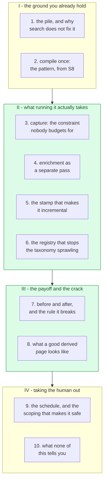

Movement I is orientation and you may skim it if you have read this brain's S8 note, though section 1
is short and sets up the question the rest answers. Movement II is the payload and the reason this
source was ingested, because sections 5 and 6 are mechanisms that exist nowhere in the pattern and
decide whether an instance is alive in six months. Movement III is where the note stops agreeing with
its source, and section 7 is the single most valuable page here - skipping it costs you the one
correction this instance forces. Movement IV takes the human out of the loop and then puts the ceiling
on everything above it, and a reader who reads only section 10 will at least not misquote the source.

## 1. The pile, and why pointing search at it does not help

Start with the artifact, because the whole design is a response to it.

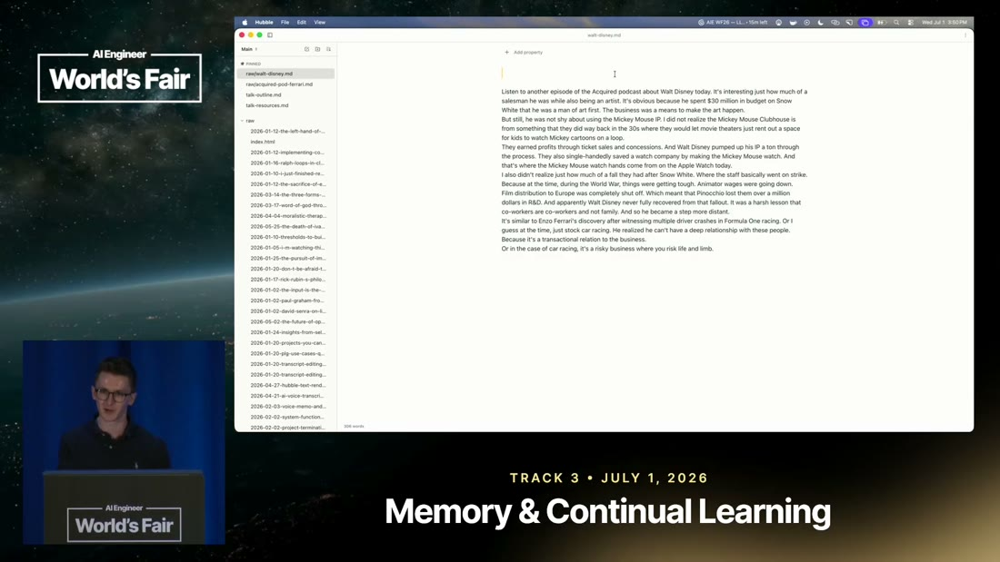

*What it teaches: what the input to this system actually looks like - `raw/walt-disney.md`, 306 words,
no title, no headings, no tags, no links, nine unbroken paragraphs of dictated speech. Corroborated by
`n3`, narration @ [`t=311s`](https://www.youtube.com/watch?v=I3bpdgFJCUY&t=311s).*

Look at the sidebar rather than the prose. Every filename is a date and a fragment of a sentence, and
they run down the pane further than the window shows. That is the problem stated more honestly than
any diagram could state it, and the speaker's opening question to the room - who has a notes folder
that is a complete disorganised mess - got essentially every hand [@t=49].

The instinctive fix is to search it, and at small scale that works well enough that the real failure
stays hidden. It surfaces when you ask something that no single note answers. Suppose you want to know
what you have concluded about how founders handle failure, having written about Disney in January and
Ferrari in March and something else in between. Retrieval will find you three chunks. It will not have
noticed, at any point in the intervening months, that those three notes are about the same thing.

> **Background, supplied.** Retrieval-augmented generation embeds your documents, finds the chunks
> nearest your question, and puts them in the prompt. The important property for this argument is that
> it is **stateless across queries** - each question starts from the raw corpus, and nothing the model
> worked out last time is available this time. *(Uncited by construction: background, not from this
> source.)*

That statelessness is the actual defect, and it is sharper than the usual complaint that retrieval
returns bad chunks. The synthesis you need is performed fresh on every ask, while you wait, and then
discarded [S8 `n1`]. Ask the same question twice and you pay twice. **Nothing accumulates.**

Which raises the question the pattern answers: if the synthesis is the expensive part and it keeps
being thrown away, why is it being done at query time at all?

## 2. Compile once - the pattern, and why it is S8's rather than this talk's

It is not being done at query time in this design, and the alternative is displayed on stage.

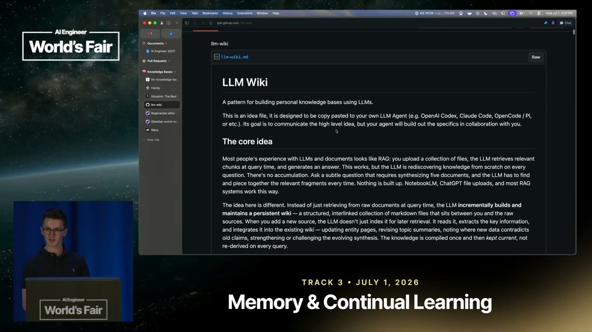

*What it teaches: the pattern's own statement of the trade - the LLM "incrementally builds and
maintains a persistent wiki... The knowledge is compiled once and then kept current, not re-derived on
every query." Corroborated by `n1`, narration @ [`t=697s`](https://www.youtube.com/watch?v=I3bpdgFJCUY&t=697s).*

Stop and note whose words those are, because it changes what this whole note is evidence for. That is
Andrej Karpathy's `llm-wiki` gist, which **this brain already ingested as [S8](../260731_llm-wiki/LEARNING.md)**,
and Ben Holmes names it on stage as where the idea came from [@t=697]. He is implementing it, not
proposing it.

The consequence is a gating rule worth internalising, because it is easy to get wrong in exactly the
direction that feels like progress. A second source *displaying* the first does not corroborate it.
Same author, same document, same revision - under the independence rule that is one leg wearing a
different hat, and every one of S8's eighteen nodes remains `needs-check` after this ingest [`n1`].
What genuinely arrived is narrower and still valuable: somebody other than the author built it.

The architecture that gets implemented is the second half of the same gist.

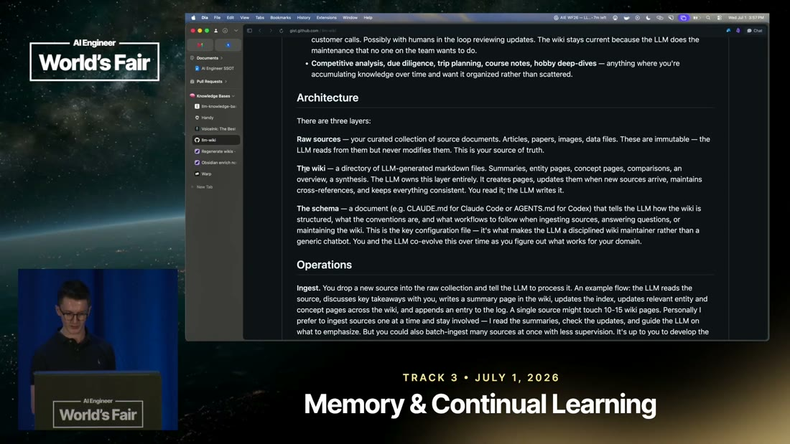

*What it teaches: three layers defined by who may write to them - raw sources ("immutable... the LLM
reads from them but never modifies them. This is your source of truth"), the wiki ("The LLM owns this
layer entirely... You read it; the LLM writes it"), and the schema (a `CLAUDE.md` or `AGENTS.md` that
makes the LLM "a disciplined wiki maintainer rather than a generic chatbot"). Corroborated by `n1`;
this is S8 `n4` and `n5` rendered.*

Hold onto the word **immutable** in the first layer. It is the quiet load-bearing rule of the entire
pattern, because it is what lets any derived claim be walked back to something the model could not
have edited, and it is the rule this implementation breaks in section 7.

So the pattern is settled and this brain already held it. What it never held was anyone running one,
and running one turns out to require parts the pattern does not mention.

## 3. Capture, the constraint nobody budgets for

The first of those parts is upstream of everything the pattern describes, which is presumably why the
pattern does not describe it.

The argument is not the one you expect. Voice dictation gets recommended, at a claimed 200 words per
minute against typing, and the reason given is not comfort or speed for its own sake [@t=188]. It is
supply. "If you want to get to a point where you can actually have LLMs generate wikis,
visualizations, etc., **you need a lot of raw data. You need a lot of raw materials**" [@t=296,
`n2`]. The synthesis layer is a function of its inputs, and a knowledge base assembled from the six
notes you had the discipline to write is not worth maintaining.

To see why this is a design constraint rather than a productivity tip, consider what capture friction
does. Every unit of effort at capture time is paid at the moment you are least willing to pay it, in
the middle of doing something else, and the note you do not write is not a degraded input but an
absent one. So the system's front door has to cost approximately nothing, and the 200 wpm figure -
which is unsourced folklore and should be treated as such [`n2`] - is pointing at a real asymmetry
even if the number is wrong.

The corollary is the part that takes discipline, and it is stated flatly. "Don't worry if you're being
a little bit scrappy, a little bit rambly. You're not formatting things with perfect bullet points.
That's fine" [@t=311, `n3`]. Look back at the frame in section 1 and note that it has no title. Not a
bad title - no title.

Structure has not been abandoned here, and that is the whole trick. It has been **deferred to a
machine pass**, which is only an affordable decision because something downstream reliably performs
it. That something is the next section.

## 4. Enrichment as a separate pass, not a capture-time discipline

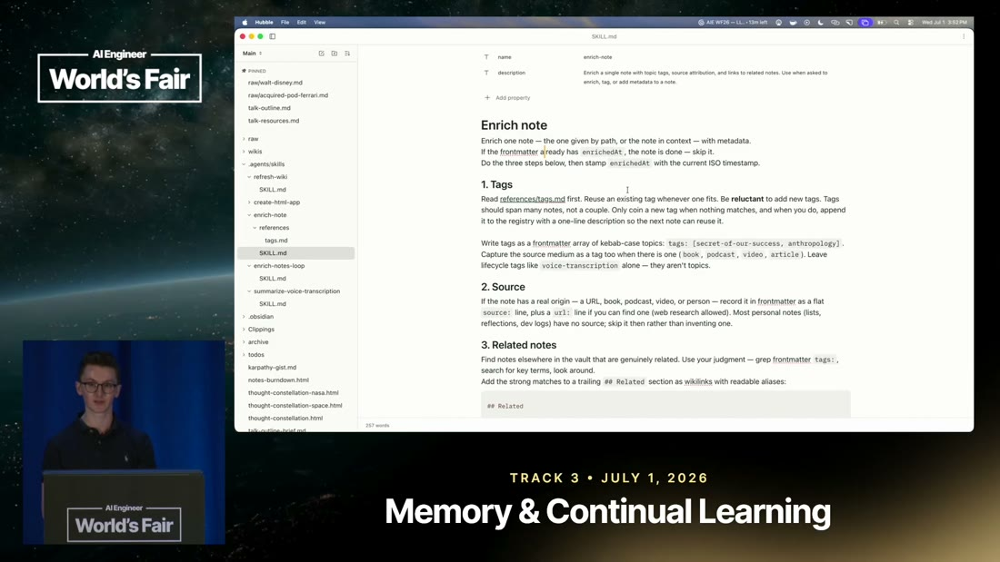

*What it teaches: enrichment is a versioned skill file in the vault, invoked by name, doing three
fixed things - tags, source, related notes - to one note at a time. Corroborated by `n4`, narration @
[`t=389s`](https://www.youtube.com/watch?v=I3bpdgFJCUY&t=389s).*

The thing to notice first is what kind of object this is. It is not a prompt typed into a chat window
and it is not a script. It is a `SKILL.md` living in `.agents/skills/enrich-note/` inside the vault
itself, sitting beside `refresh-wiki`, `enrich-notes-loop` and `summarize-voice-transcription` in the
sidebar - a small library of maintenance operations, versioned with the notes they operate on.

That placement is doing more work than it appears to. The schema layer in S8's architecture is a
document telling the LLM how the wiki is organised, and what has happened here is that the *procedures*
have been factored out of it into separate addressable files. The result is that maintenance can be
invoked by name, by a human or by a scheduler, without restating what it means each time.

The three steps are unremarkable in themselves - tag it, record where it came from, link it to related
notes. What is worth study is the two things wrapped around them, because those are the parts that
were invented rather than inherited, and they are the difference between a system that works in a demo
and one that works in a year.

## 5. The stamp that turns a corpus-wide sweep into an incremental one

The first is three lines long and easy to read past.

> "Enrich one note - the one given by path, or the note in context - with metadata. **If the
> frontmatter already has `enrichedAt`, the note is done - skip it.** Do the three steps below, then
> stamp `enrichedAt` with the current ISO timestamp." [`visuals/frame_404.jpg`, `n5`]

Before reading on, ask what that buys, because the answer is larger than it looks and the talk states
only the small half of it. Ben's own framing is about coordination between agents: "put a little time
stamp on there so if we ask the agent to do another pass it remembers that some other agent did it in
the past" [@t=404].

That is true and it is the lesser benefit. The larger one is economic. Without the stamp, "enrich my
notes" is an operation over the whole corpus, and its cost grows with everything you have ever
written, which means it gets more expensive precisely as the knowledge base gets more valuable. With
the stamp it is an operation over **what is new**, and its cost tracks your writing rate instead of
your archive size. Operationally that is exactly how it is used: the loop "will go ahead and find any
notes that weren't enriched in the past" [@t=526, `n5`].

Now connect it forward, because this is the load-bearing dependency in the whole system. S8's
maintenance operation is "periodically, ask the LLM to health-check the wiki" [S8 `n8`]. That phrasing
assumes a human deciding when, and it assumes it because an unbounded pass over everything is not
something you would put on a timer. **The stamp is what makes a timer safe**, and section 9's nightly
schedule is not reachable without it. A mechanism the pattern never mentions turns out to be the
precondition for the pattern's most attractive property.

One thing it does not solve, and the talk does not raise: a stamped note is skipped forever, so a note
enriched under an early version of the skill never gets revisited when the skill improves. The stamp
records that work happened, not which version did it.

## 6. The registry that stops the taxonomy sprawling

The second wrapper addresses a failure you would not predict from the pattern and would certainly hit
by month two.

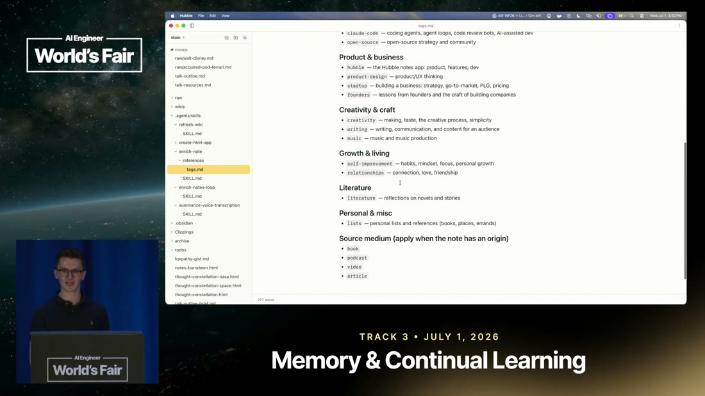

*What it teaches: the controlled vocabulary as an actual file - tags grouped under Product & business,
Creativity & craft, Growth & living, Literature and Personal & misc, each carrying a one-line
definition, with a separate "Source medium" axis holding `book`, `podcast`, `video`, `article`.
Corroborated by `n6`, narration @ [`t=420s`](https://www.youtube.com/watch?v=I3bpdgFJCUY&t=420s).*

The instruction that governs it is in the skill file from section 4, and its tone is unusual for a
prompt. "Read `references/tags.md` first. Reuse an existing tag whenever one fits. **Be reluctant** to
add new tags. Tags should span many notes, not a couple. Only coin a new tag when nothing matches, and
when you do, append it to the registry with a one-line description so the next note can reuse it"
[`n6`].

The reason given is behavioural and blunt: without it "the agent isn't inventing new tags every time"
and, more directly, "Claude loves to get creative" [@t=420, @t=435]. At first glance that reads as a
complaint about model temperament, and it is worth seeing why it is structural instead. Each
enrichment call sees one note. A tag that is locally perfect for that note - `disney-animation-history`
- is globally useless, because a taxonomy's entire value is that two notes end up under the same label.
An agent with no view of the corpus will produce a vocabulary with one term per document, which is not
a taxonomy but a restatement of the filenames.

So the registry is not documentation. It is the mechanism that gives a per-note operation a corpus-wide
memory, and every part of its design follows from that. It must be read before tagging, or the agent
has no idea what already exists. New tags must be appended with a definition, or the next pass cannot
tell a genuine new concept from a synonym of an old one. And the reluctance has to be stated
explicitly, because the model's default is to be helpful, and inventing a precise new label feels
helpful in the moment.

The quieter idea in the same frame is the separate **Source medium** axis, holding `book`, `podcast`,
`video`, `article` apart from the topic tags. That is faceting - keeping "what this is about" from
colliding with "what kind of thing it was" - and it is the cheapest possible defence against a
vocabulary in which `podcast` and `founders` compete for the same slot.

Both mechanisms so far are about the process. What they produce is the subject of the next section,
and it is where the design stops agreeing with itself.

## 7. Before and after, and the rule the system breaks

Here is the same file from section 1, after the pass has run.

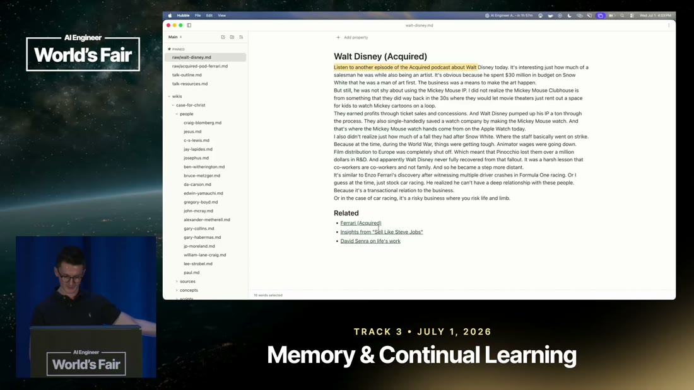

*What it teaches: `raw/walt-disney.md` now carries a title, "Walt Disney (Acquired)", and a trailing
`## Related` section linking to Ferrari (Acquired), Insights from "Sell Like Steve Jobs", and David
Senra on life's work. Same path in the sidebar, same prose body. Corroborated by `n7`, narration @
[`t=372s`](https://www.youtube.com/watch?v=I3bpdgFJCUY&t=372s).*

Compare it against the frame in section 1 before reading on, and name what changed. The prose is
identical, word for word. What is new is a title, frontmatter, and three links to notes written weeks
apart that nobody sat down and connected. That is the payoff of the entire design in one screen, and
those backlinks were chosen by judgement rather than by a similarity threshold - the skill hands the
agent `grep`, key-term search and the instruction to "use your judgment" [`n8`].

Now look at the path in the sidebar again. `raw/walt-disney.md`.

**The system just wrote into the raw layer.** Five minutes earlier the same talk displayed the rule
that raw sources are "immutable... the LLM reads from them but never modifies them. This is your
source of truth" [`visuals/frame_728.jpg`], and its own scheduled automation encodes that rule as a
hard constraint: "**Raw source notes are read-only**" [`n11`]. Both are on screen, minutes apart, and
**the talk never notices** [`d1`].

The instinct is to call this an implementation bug. It is worth resisting, because the rule as written
cannot survive contact with a real vault and the reason is visible in section 3. Capture must be
frictionless, so notes arrive with no title and no tags. Enrichment has to put them somewhere. If the
raw layer is genuinely append-only, then every note needs a shadow metadata file, and you have doubled
the file count of the system to protect a purity that buys you nothing you could not get from git.

The reconciliation is sitting in the automation prompt's own wording, unremarked. The constraint is
not "raw is immutable" but "**do not edit original notes outside `~/vault/wikis/` unless explicitly
instructed by that wiki's `AGENTS.md`**" [`n11`]. That is a different rule. It says the wiki job may
not touch raw, and it leaves room for a declared exception - which is exactly what the enrichment job
is. So the principle that survives is **one declared writer per layer**: enrichment owns raw's
metadata, the wiki job owns `wikis/`, and neither crosses into the other's territory.

That is weaker than S8's version and it is implementable, which is the trade. It does cost something
real, and the cost should not be waved past. Under strict immutability, a derived claim can always be
walked back to a file the model could not have edited, and that property is what makes the derived
layer safe to trust. Once raw is writable by anything, the audit trail depends on version control
rather than on the architecture, and "the agent could not have done that" becomes "let me check the
history".

Which makes it fair to ask what the derived layer looks like when it is done well, since it is now
trusted on weaker grounds than the pattern intended.

## 8. What a good derived page looks like

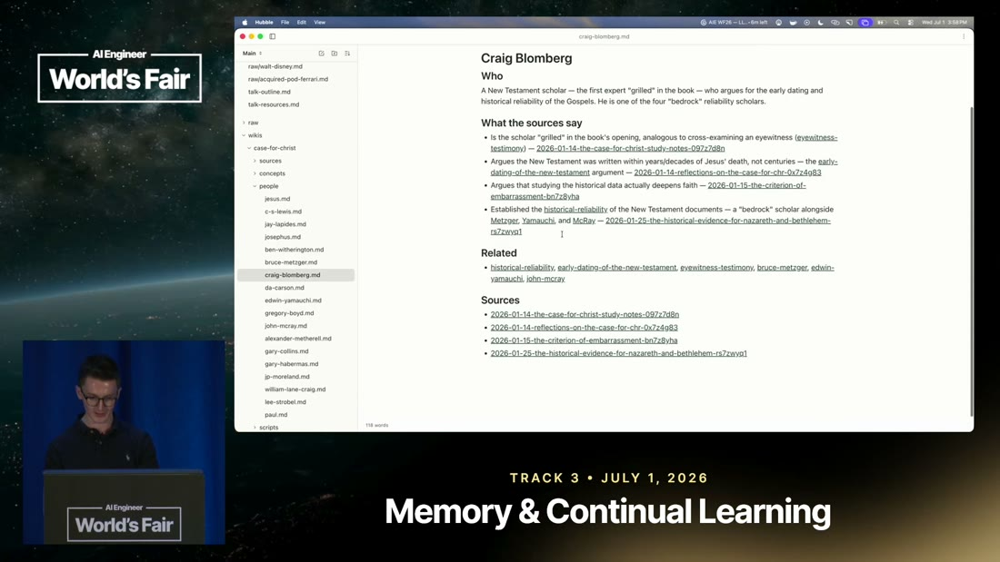

*What it teaches: a generated person page structured Who / What the sources say / Related / Sources,
in which every claim bullet terminates in a link to the specific dated raw note supporting it.
Corroborated by `n9`, narration @ [`t=774s`](https://www.youtube.com/watch?v=I3bpdgFJCUY&t=774s).*

This is the most transferable frame in the source, and the reason is one structural choice rather than
anything about its subject.

Read the four bullets under "What the sources say". Each makes a claim, and each ends in a link -
`2026-01-14-the-case-for-christ-study-notes-097z7d8n`, then a different note for the next claim, and
so on. The page is cited **per claim**, not per page. A "Sources" list at the bottom would have told
you the page was derived from four notes; this tells you which sentence came from which one.

To see why that distinction carries the whole design, consider what happens when a claim on this page
turns out to be wrong. With page-level sourcing you know the page drew on four notes and you have to
re-read all four to find the error. With claim-level sourcing you follow one link. The page becomes
debuggable in the way code is debuggable, one assertion at a time, and a generated artifact that
cannot be debugged is one you eventually stop trusting wholesale.

It also changes what the raw layer is for. Those dated filenames are not an archive - they are the
things the derived layer points at, which is why section 7's rule matters and why "let me check the
history" is an acceptable fallback rather than a disaster. The link is only worth following if what it
lands on is stable.

Notice what this page is not, as well. It is not a summary of a source. It is an **entity** - a person
- assembled from four sources that were ingested separately and never mention each other. That is the
accumulation the pattern promised in section 2, made concrete: the page did not exist in any input.

The remaining question is who runs all this, and how often.

## 9. Taking the human out, and the scoping that makes that safe

The honest answer in most personal-knowledge-base systems is that nobody runs it, which is why they
die. Ben's answer is to remove the human from the trigger entirely.

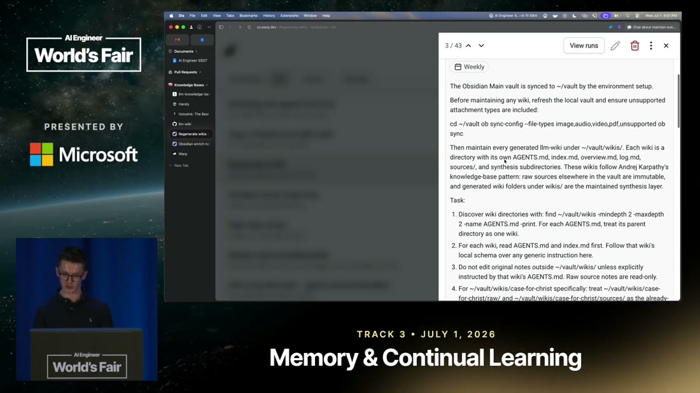

*What it teaches: a saved schedule labelled Weekly, whose prompt syncs the vault into a cloud sandbox,
names the pattern it is maintaining, and issues a numbered task list including the read-only
constraint. Corroborated by `n10`, narration @ [`t=903s`](https://www.youtube.com/watch?v=I3bpdgFJCUY&t=903s);
`n11` and `n12` are figure-only.*

The loop itself is deliberately unclever and he whiteboards it live: sync the markdown down into a
sandbox, run the skill, sync it back up [@t=903, `n10`]. Obsidian's headless CLI does the syncing
because it avoids manual pushes and pulls, and he immediately offers the substitute - "you could also
just do like a `git clone`" [@t=918]. Two schedules are shown, one weekly for the wiki refresh and one
daily for enrichment, and the framing of the payoff is the memorable line: "I wake up to a perfectly
fresh wiki that I can review. It's like the daily paper, but it's your own" [@t=995, `n13`].

> **Background, supplied.** This is the same shape as a nightly build. Work that is expensive,
> mechanical and not urgent is moved off the interactive path onto a timer, and the human's
> relationship to it becomes reviewing output rather than triggering it. *(Uncited by construction.)*

Two things in that prompt are worth more than the scheduling, and both are visible only in the
screenshot - the narration never mentions either, so both are `single-leg` and should be held
accordingly [`n11`, `n12`].

The first is that the immutability rule made the trip from prose into an executable constraint. The
prompt names the pattern - "These wikis follow Andrej Karpathy's knowledge-base pattern: raw sources
elsewhere in the vault are immutable" - and then encodes it as an instruction the job must obey
[`n11`]. Most patterns never make that trip, and the fact that this one did is what makes section 7's
contradiction interesting rather than merely careless, because the rule is being enforced somewhere.

The second is that the schema layer turns out to be plural, which S8 does not anticipate. "Each wiki is
a directory with its own `AGENTS.md`, `index.md`, `overview.md`, `log.md`, `sources/`, and `synthesis`
subdirectories", and the job is told: "For each wiki, read `AGENTS.md` and `index.md` first. **Follow
that wiki's local schema over any generic instruction here**" [`n12`]. Discovery is a `find` command.

Sit with what that enables, because it is a small line with a large consequence. The scheduled job
knows nothing about any particular knowledge base. It discovers them, reads each one's local
conventions, and defers to them. One maintainer, many knowledge bases, none of which had to be
registered anywhere - and a new wiki becomes maintained by creating a directory with an `AGENTS.md` in
it. The generic instructions become a fallback rather than a specification.

So the human is out of the trigger and into the review seat. Which raises the question that decides
whether any of this is trustworthy, and the source does not answer it.

## 10. What none of this tells you

Nothing in this talk is measured [`n16`].

That sentence is worth stating plainly because everything above is attractive, and attractive
unmeasured systems are how this brain gets into trouble. Across twenty-one minutes there is no
baseline, no comparison against the retrieval systems section 1 dismisses, no retrieval quality
figure, no time saved, no error rate, no count of bad edits, no corpus size and no cost. The only
number uttered is the 200 wpm dictation figure, which is about typing, is unsourced, and is not about
this system at all.

The gap that matters most is the review step, because it is what the entire unattended design rests
on. A nightly job with write access to your notes is safe if and only if bad output gets caught, and
the evidence that it does is one sentence about reading a fresh wiki in the morning [`n13`]. Nothing
reports how often a run produces a bad edit, whether one has ever been rejected, what rejection looks
like operationally, or how a wrong write is reverted. The same hole sits under backlinks - they are a
judgement call [`n8`], and a wrong backlink is invisible once written, silently joining two things
that are not related.

None of this makes the source weak for what it actually is. **It is evidence that the pattern can be
built by someone other than its author and run on a real corpus**, which is precisely the evidence this
brain lacked about S8, and it comes with four mechanisms and one correction that you only find by
building. Read it as an existence proof with a parts list. Do not read it as a result.

## Diagram (mental model)

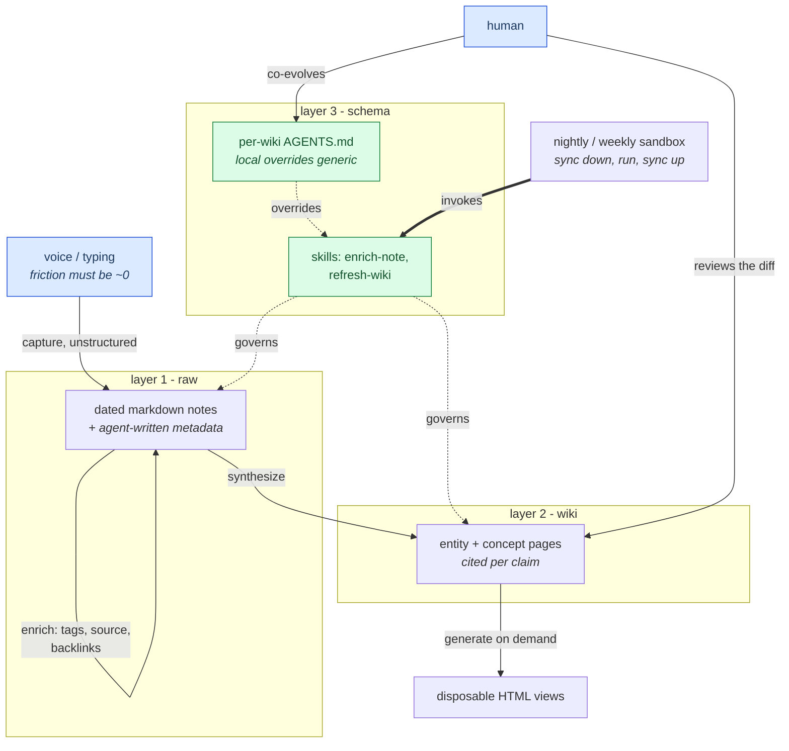

Read it as three stacked layers with the write paths drawn as solid arrows and the governing
relationships as dotted ones. Blue is where a human touches the system, green is the schema layer that
decides how the agent behaves, and the heavy arrow from the scheduler is what runs the whole thing
without anyone present.

**The crux is that the layers are defined by who may write to them, and the schema layer is the only
place a human's intent enters the machine.** Everything the agent does to the other two layers is
determined by files in layer 3, which is why co-evolving those files - rather than writing notes or
editing wiki pages - is the human's actual job.

It is drawn with the self-loop on raw rather than with a clean top-to-bottom flow because that loop is
this instance's departure from its source, and hiding it would reproduce the tidy version of the
architecture that section 7 showed to be unimplementable. Two arrows land on layer 1 and they come from
different jobs, which is the whole content of the "one declared writer per layer" rule - a shape that
showed a single writer would make the rule look automatic when it is in fact a discipline someone has
to maintain. Note also that the human has no arrow into layer 2 at all. They read it and they review a
diff, and if they edit it directly the next scheduled run will not know why. *Synthesized from `n4`,
`n5`, `n6`, `n7`, `n9`, `n10`, `n11`, `n12`, `n14` and `d1`; layer names from S8 `n4`.*

## 💡 Terms

- **Idempotence stamp** - a marker written into an artifact recording that an operation has completed
  on it, checked before the operation runs so repeated invocations skip finished work. Here,
  `enrichedAt` in a note's frontmatter [`n5`].
- **Controlled vocabulary** - a fixed, curated list of terms that annotations must be drawn from,
  extended only deliberately. The library-science answer to everyone inventing their own label for the
  same thing; here a `tags.md` the agent must read before tagging [`n6`].
- **Faceting** - splitting annotation into independent axes so orthogonal properties do not compete
  for one slot. Here, topic tags kept separate from a "source medium" axis [`n6`].
- **Backlink** - a link recorded on a note pointing at other notes that relate to it, making an
  otherwise one-directional collection navigable in both directions [`n8`].
- **Entity page** - a derived page about a person, organisation or concept, assembled from every source
  that mentions it, rather than a summary of any one source [`n9`].
- **Per-claim citation** - sourcing at the granularity of the individual assertion rather than the
  document, so a wrong claim can be traced to exactly one input [`n9`].
- **Schema document** - the prose contract telling an agent how a knowledge base is organised and what
  workflows to follow. S8's term; the thing that "makes the LLM a disciplined wiki maintainer rather
  than a generic chatbot" [S8 `n5`, `visuals/frame_728.jpg`].

## What to distrust in this note

**The source is T4 - one practitioner demonstrating his own workflow - and it measures nothing**
[`n16`]. That is the ceiling on everything above, and it is not softened by how well the mechanisms
reason.

**There is a T2 commercial interest, and it sits on the most novel section.** Ben Holmes is developer
relations lead at Warp and volunteers this at the top [@t=18]. The knowledge-base half pitches nothing
and explicitly tells you any markdown viewer will do [@t=109]. The **automation** half - section 9,
one of the four things this source adds beyond S8 - is demonstrated exclusively on `oz.dev`, which is
Warp's, with the URL given twice as a call to action [`d2`]. The mechanism survives removing the
vendor, because he names `git clone` and a competitor's product as substitutes on stage, but weigh the
section accordingly.

**Three of the most interesting findings are figure-only.** The operational immutability constraint
[`n11`], the per-wiki schema override [`n12`] and the gap-finding purpose of the graph view [`n15`]
appear in screenshots and are never spoken. They are `single-leg` and marked as such at the point of
use. The first two are also the least likely to be wrong, since a screenshot of a saved prompt is
strong evidence about that prompt - but it is evidence about a **prompt**, not about a system's
behaviour.

**The most reusable claim in this note is also the least corroborated by the source.** Section 7's
"one declared writer per layer" is **this brain's reading**, derived by holding S8's architecture
against this talk's frames. The talk does not say it, does not notice the contradiction it resolves,
and would perhaps not agree with the resolution. It is flagged as commentary in `d1` and should be
carried as a hypothesis with a good argument behind it, not as a finding.

**And the independence trap is worth restating because it is the easiest error to make here.** This
source displays S8 at length and agrees with it completely. That agreement is worth nothing
evidentially - it is the same document on a projector [`n1`]. Anyone citing S8 and S26 together as two
sources for the pattern is counting one source twice.

## Open questions

- **What is the actual precision of agent-judged backlinks?** [`n8`] Nothing measures it, and a wrong
  backlink is invisible once written. The obvious experiment is cheap: sample fifty generated links
  and have a human rate them.
- **What happens when the morning review finds a bad edit?** [`n13`] The review step carries the whole
  safety argument for unattended operation and is asserted in one sentence. Has one ever been
  rejected? What does reverting look like?
- **Does the stamp become a liability as the skill improves?** [`n5`] A note stamped by v1 of
  `enrich-note` is skipped forever by v2. Versioning the stamp is the obvious fix and the talk does not
  raise the problem.
- **Where does the tag registry stop working?** [`n6`] The reluctance instruction defends against
  sprawl. Nothing addresses what happens at a few hundred tags, when the registry itself exceeds what
  can be usefully read before every enrichment.
- **Does the "~100 sources without embedding RAG" ceiling hold in a real instance?** S8's one
  falsifiable quantified claim [S8 `n10`] is still unmeasured, and this instance is plausibly at or
  past that scale without ever reporting its corpus size. **The best deep-research target across both
  sources.**
- **Does anything here degrade with a second human writer?** Every mechanism assumes one person. The
  stamp, the registry and the per-wiki schema all have obvious contention stories that nobody has run.

## Feeds these topics

- [`memory.md`](../../brain/topics/memory.md) - the decoupled-curation claim gets its first
  **independent instantiation**, and the scheduled unattended pass is a concrete instance of
  out-of-band maintenance. Also the source of the "one declared writer per layer" refinement.
- [`rag.md`](../../brain/topics/rag.md) - the compile-once alternative to retrieval now has a running
  instance behind it rather than a proposal, with the efficacy question still entirely open.
- [`skills.md`](../../brain/topics/skills.md) - `enrich-note` is a maintenance skill operating on a
  corpus rather than on a coding task, with an idempotence contract and a controlled vocabulary as
  reference material. A new instance shape for this topic.
- [`agents.md`](../../brain/topics/agents.md) - unattended scheduled agent work with a human review
  gate, and the per-directory schema override as a discovery mechanism.

> Inherits the global rules in [`../../AGENTS.md`](../../AGENTS.md).
