# Learning - Scaling GitHub for your Agents (S27)

> Personas: **curator + mentor** for the body, **presenter** for every diagram walkthrough and the
> final section. Evidence gated in [`nodes.md`](nodes.md); facts in [`SOURCE.md`](SOURCE.md).

> **Trust caveat, up front.** This is a vendor engineer talking about his own product, with no
> external evaluation and no comparison to any other MCP server. Read
> [`## What to distrust in this note`](#what-to-distrust-in-this-note) before citing a number from it.

## TL;DR

GitHub's MCP server is the largest one anybody has published operating data about, at roughly 7.34
million tool calls a week, and the talk is a year of things going wrong at that scale [n17]. Open
contribution filled it to 101 tools and made agents measurably worse at using GitHub, so the team
built three elegant opt-in fixes - grouped toolsets, dynamic tool discovery, and a semantic tool
search prototype - and **everyone used the default settings** [n4]. The reductions that finally
landed were the ones nobody had to opt into, which is a governance lesson wearing a context-window
costume. The sharper finding sits underneath it. Having spent the first half of the talk trying to
build a per-user filter on the tool surface, the team found one already sitting in the credential:
**a token's scopes are a free, correct, zero-configuration filter**, and turning auth into a context
mechanism solved the two problems the rest of the talk was about [n15].

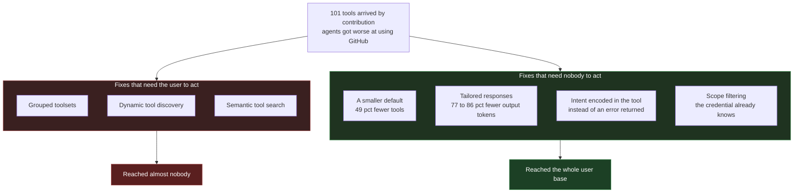
```mermaid
flowchart TB
    P["101 tools arrived by contribution<br/>agents got worse at using GitHub"]

    subgraph U["Fixes that need the user to act"]
        direction TB
        T1["Grouped toolsets"]
        T2["Dynamic tool discovery"]
        T3["Semantic tool search"]
    end

    subgraph N["Fixes that need nobody to act"]
        direction TB
        D1["A smaller default<br/>49 pct fewer tools"]
        D2["Tailored responses<br/>77 to 86 pct fewer output tokens"]
        D3["Intent encoded in the tool<br/>instead of an error returned"]
        D4["Scope filtering<br/>the credential already knows"]
    end

    P --> U
    P --> N
    U --> X["Reached almost nobody"]
    N --> Y["Reached the whole user base"]

    style U fill:#3a2020,stroke:#a04040,color:#fff
    style N fill:#1f3320,stroke:#4a9e5c,color:#fff
    style X fill:#5a1f1f,stroke:#a04040,color:#fff
    style Y fill:#1c4025,stroke:#4a9e5c,color:#fff
```

This is a delivery diagram, not an architecture diagram, and the axis it sorts on is **who has to
act for the fix to reach a user**. The crux is that the two columns contain roughly equally clever
engineering and only one of them shipped value, because the red column's entry cost is a JSON edit
and the green column's is nothing. Notice that the fourth green box is the odd one out and is the
note's real payload: scope filtering is not a smaller version of a tool list, it is a different
source of truth for what the tool list should be. It is drawn green because the user does nothing to
get it, which is exactly the property the red column lacked.

*Synthesized from n2, n4, n5, n6, n8 and n15.*

## The 1-minute version

**What this covers.** One engineering team's account of operating a public MCP server for a year at
a scale nobody else has published numbers for, and the four categories of thing that broke. It is
about tool surfaces, context cost, failure rates, authorization and deployment topology, in that
order, and it is unusually candid about which of its own fixes did not work.

**The problem it works on.** A platform as broad as GitHub cannot expose a small tool surface,
because repos, issues, pull requests, actions and projects all have real users who need real tools.
Open source made that worse in a way that felt like success at the time. Being the most-starred repo
of its week attracted contributions that filled platform coverage quickly, and the count passed 100
tools within about a month [n2]. Then agents got worse at using GitHub, and context windows started
blowing out sooner.

**Why that problem is hard.** The obvious framing is that this is a context-budget problem, and it
partly is. But the team could not simply delete tools, because their user base is genuinely diverse
and every tool had someone depending on it. That converts a technical question into a distribution
question: how do you give different users different surfaces without asking each of them what they
want? Every answer to that question sounds like configuration, and configuration is where the talk's
central failure lives.

**The naive approach and how it collapsed.** Three fixes were built. Toolsets grouped tools by
theme, dynamic selection let the agent discover a group and switch it on, and an unreleased
prototype did semantic tool search over the catalogue with retrieval [n4]. All three are reasonable
and one of them is what the rest of the industry converged on. All three required the user to edit
their client's JSON configuration, and the result was that **everyone used the default settings**.
The elegance was not the problem. The activation energy was.

**The idea.** Stop building things users must opt into, and change what arrives when they opt into
nothing. The new default was derived from observed usage on the remote server rather than from
taste, which brought the catalogue from 101 tools to 52 and the initial context load from 64.6k
tokens to 30.3k [n5]. The same instinct then produced three other reductions that need no
configuration: trimming what tool responses return [n6], encoding the agent's evident intent into
the tool so a recoverable mistake stops being an error [n8], and finally filtering the tool list by
the scopes the caller's credential already carries [n15].

**How it works.** The server is stateless per request. A brand-new MCP server object is constructed
on **every single call**, and its tools are attached at construction time from the user's
configuration, any applicable policy, and the caller's token scopes [n16]. That is why scope
filtering costs nothing architecturally. The tool list was already being assembled per request, so
consulting the credential while assembling it is one more input rather than a new subsystem. A load
balancer fronts identical instances with no session affinity, and Redis persists sessions only so
telemetry can recover the client's self-reported identity.

**What it costs.** Auto-correcting agent mistakes is the one that should worry you, and the team's
own slide title is honest about it: "Papering Over Agent Mistakes" [n8]. A server that initialises
your repository because you pushed to an uninitialized one has traded a deterministic, auditable
error for a higher success rate, and nobody has measured what that trade costs when the agent's
inferred intent is wrong. The DCR rejection has a cost too, paid by client authors rather than by
GitHub [n13]. And scope filtering means two users of the same server see different tool
catalogues, which makes any bug report ambiguous until you know the reporter's scopes.

**How far to trust it.** Not far as evidence about the world, and quite far as a report of one
operator's decisions. Every efficacy figure is self-reported, no baseline is offered against any
other server, and the tool-selection eval results are shown as an unreadable screenshot with no
score quoted anywhere [n10]. The strongest caveat comes from the speaker himself, who closes by
predicting that thousands of tools will be normal soon and that he will "probably reverse many of
the fewer tools decisions" [n20]. Treat the mechanisms as durable and the recommendations as scoped
to a moment their own author expects to end.

The narrative above is the argument as it unfolds. The table below is the same argument compressed
for someone returning to check a single row.

| | |
|---|---|
| **The problem** | Open contribution filled GitHub's MCP server to 101 tools and 64.6k tokens of initial context, and agents got measurably worse at using GitHub [n2]. LangChain's ReAct study had already measured the general effect: more tools means worse performance across every LLM tested, and single-domain agents beat multi-domain ones by 50%+ [n3]. |
| **Why the obvious answer fails** | You cannot delete tools that real users depend on, so the fix has to be per-user. Every per-user fix the team built - toolsets, dynamic discovery, semantic tool search - was opt-in, and **everyone used the default settings** [n4]. |
| **The idea** | Change what arrives by default, and find per-user signal that requires no user action. The credential supplies it: a token's scopes are an already-correct statement of which tools that caller can possibly use [n15]. |
| **How it works** | A new MCP server instance is built on every request, with tools attached from configuration, policy and token scopes. No session affinity; Redis holds sessions only for client-identity telemetry [n16]. |
| **What it costs** | 101 to 52 tools and 64.6k to 30.3k tokens on the default [n5]; response tailoring cut `list_pull_requests` by 76.7% at 100 items [n6]. Against that, auto-correction trades auditable errors for success rate [n8], and scope filtering makes two users see different servers. |
| **How far to trust it** | First-party vendor talk, every figure self-reported, no external baseline, eval results never quoted as a number. The author predicts he will reverse the central decision [n20]. |

## Key claims

- **The contribution mechanism that made the server complete made the agent worse.** Over 100 tools
  arrived by public contribution within about a month of open-sourcing, and agents got worse at
  using GitHub while context windows blew out sooner [n2]. `corroborated`
- **Tool overload is measured, not felt.** More tools means worse performance across all tested
  LLMs, single-domain agents beat multi-domain by 50%+, and 3+ step trajectories degrade quickly
  [n3]. `corroborated within S27, needs-check as world-evidence` - S27 is re-displaying LangChain's
  study, not reproducing it.
- **A configuration option is not a fix.** Three separate opt-in solutions were built and shipped,
  and everyone used the default settings [n4]. `corroborated`
- **Changing the default cut the catalogue 49% and the initial context load 53%** (101 to 52 tools,
  64.6k to 30.3k tokens), derived from observed usage rather than taste [n5]. `corroborated`
- **Output tokens are the larger prize.** Tailoring one tool's response cut it 85.9% at 2 items and
  76.7% at 100 items, from 657,272 tokens to 153,352 [n6]. `corroborated`
- **Tool descriptions are a joint optimisation, so they are evaluated as a classifier.** The eval
  tests whether each tool is called at the right times and not at the wrong times, producing a
  per-tool classification report per model in CI [n10]. `corroborated on method, results never
  quoted`
- **GitHub rejected Dynamic Client Registration for operational reasons**: unbounded app-database
  growth, no way to bucket for rate limits, and no reliable app identity. The verdict was "a
  well-intentioned mistake" [n12, n13]. `n12 corroborated, n13 single-leg`
- **Authorization data is a free, per-user, already-correct filter on the tool surface** - PAT
  scopes filter automatically, OAuth step-up converts a permission failure into an interactive
  prompt that lets the call continue, and server tokens hide user-specific tools [n15].
  `corroborated`
- **The production topology is stateless per request and still runs Redis**: a new server instance
  per call, no session affinity, sessions kept only for client-identity telemetry [n16].
  `corroborated` - and this is first-party production evidence for claim 180.
- **The author expects the central decision to be reversed**: thousands of tools will be normal
  soon, and he will "probably reverse many of the fewer tools decisions" [n20]. `single-leg`

## What you will learn, and in what order

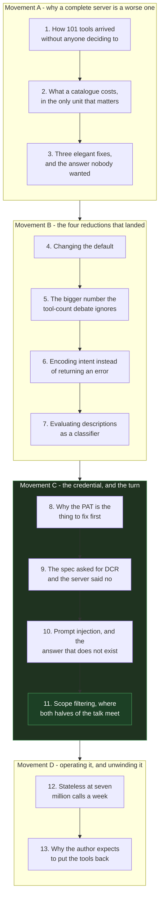
```mermaid
flowchart TB
    subgraph A["Movement A - why a complete server is a worse one"]
        direction TB
        S1["1. How 101 tools arrived<br/>without anyone deciding to"]
        S2["2. What a catalogue costs,<br/>in the only unit that matters"]
        S3["3. Three elegant fixes,<br/>and the answer nobody wanted"]
        S1 --> S2 --> S3
    end

    subgraph B["Movement B - the four reductions that landed"]
        direction TB
        S4["4. Changing the default"]
        S5["5. The bigger number the<br/>tool-count debate ignores"]
        S6["6. Encoding intent instead<br/>of returning an error"]
        S7["7. Evaluating descriptions<br/>as a classifier"]
        S4 --> S5 --> S6 --> S7
    end

    subgraph C["Movement C - the credential, and the turn"]
        direction TB
        S8["8. Why the PAT is the<br/>thing to fix first"]
        S9["9. The spec asked for DCR<br/>and the server said no"]
        S10["10. Prompt injection, and the<br/>answer that does not exist"]
        S11["11. Scope filtering, where<br/>both halves of the talk meet"]
        S8 --> S9 --> S10 --> S11
    end

    subgraph D["Movement D - operating it, and unwinding it"]
        direction TB
        S12["12. Stateless at seven<br/>million calls a week"]
        S13["13. Why the author expects<br/>to put the tools back"]
        S12 --> S13
    end

    A --> B --> C --> D

    style C fill:#1f3320,stroke:#4a9e5c,color:#fff
    style S11 fill:#1c4025,stroke:#4a9e5c,color:#fff
```

This is a reading-order diagram about the note rather than about GitHub, and the green movement is
where the payload is. Movement A is the setup and it is the part most readers can move through
quickly, because the finding that more tools hurt agents is one this brain already holds from two
other sources. Movement B is where the measurements live, and section 5 is the one to read if you
read only one, because it contains the number that reframes the whole tool-context debate. Movement
C looks like a security digression for its first three sections and is not one; sections 8 through
10 exist to make section 11 land, and skipping them costs you the reason scope filtering is
surprising rather than obvious. Movement D is the operating report and the honest ending, and a
reader short on time can take section 13 alone, because it is the caveat the author places on
everything before it.

*Synthesized from the walkthrough structure below.*

---

## Movement A - why a complete server is a worse one

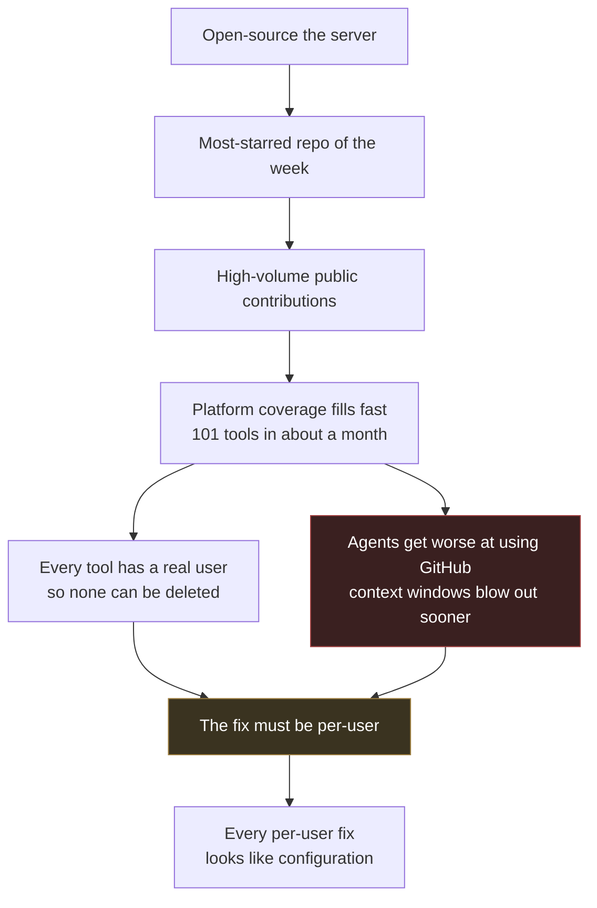
```mermaid
flowchart TB
    OSS["Open-source the server"] --> STAR["Most-starred repo of the week"]
    STAR --> CONTRIB["High-volume public contributions"]
    CONTRIB --> COVER["Platform coverage fills fast<br/>101 tools in about a month"]
    COVER --> GOOD["Every tool has a real user<br/>so none can be deleted"]
    COVER --> BAD["Agents get worse at using GitHub<br/>context windows blow out sooner"]
    GOOD --> TRAP["The fix must be per-user"]
    BAD --> TRAP
    TRAP --> CONF["Every per-user fix<br/>looks like configuration"]

    style BAD fill:#3a2020,stroke:#a04040,color:#fff
    style TRAP fill:#3a3320,stroke:#a08040,color:#fff
```

This is a causal diagram, not a timeline, and its purpose is to show that the damage and the
constraint come from the same event. The crux is that **the two arrows out of the tool count point in
opposite directions**, and that is the entire trap: coverage is why the surface cannot shrink and
also why it must. A shape that put the harm alone downstream of contribution would suggest the fix is
to accept fewer contributions, which is both wrong and impossible for a project taking seven issues
and pull requests a day. Carrying both arrows forward to a single node is what forces the honest
conclusion that the fix has to be per-user, and that conclusion is what makes section 3's failure
inevitable rather than unlucky.

*Synthesized from n2 and n4.*

### 1. How 101 tools arrived without anyone deciding to

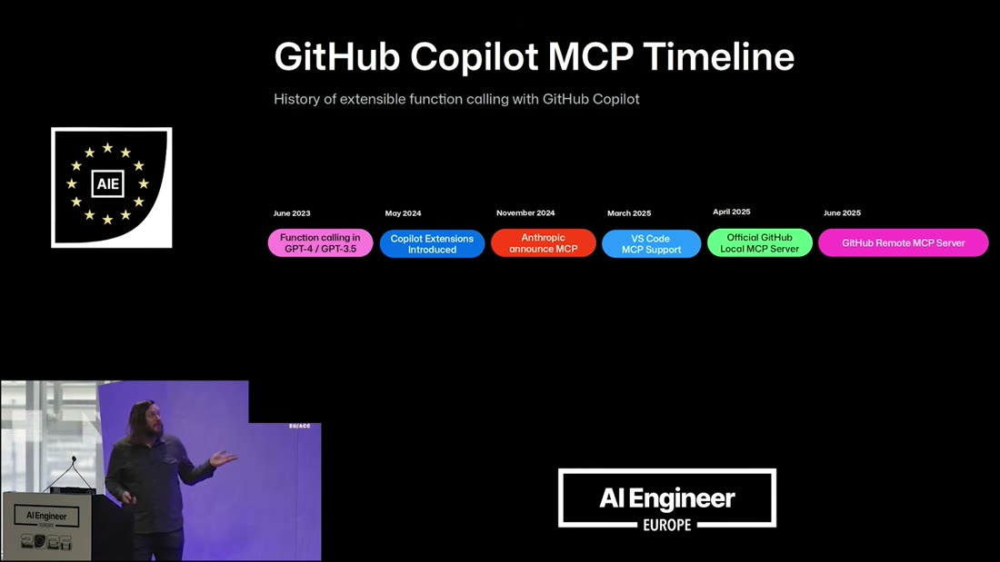

*What it teaches:* MCP is the third generation of extensible function calling for Copilot, not the
first. *Corroborated by:* the slide's dated chips against the narration at
[`&t=90s`](https://www.youtube.com/watch?v=0n3MKk7r60w&t=90s) [n1].

Before the numbers, it is worth noticing what this timeline quietly says about the subject. Function
calling arrived in GPT-4 in June 2023, GitHub shipped its own extension mechanism called Copilot
Extensions in May 2024, and MCP only appears in November 2024 with GitHub's own server following in
April 2025 [n1]. So MCP is not GitHub's first attempt at letting a model reach outside itself. It is
the third, and the two earlier attempts were proprietary. That matters for how you read everything
after it, because a team on its third iteration of a problem is not discovering that tool surfaces
are hard.

> **Background, supplied.** MCP, the Model Context Protocol, is a wire protocol that lets a model
> client discover and call tools exposed by a separate server process. The server publishes a
> catalogue of tool definitions, each with a name, a description and a JSON schema, and the client
> puts that catalogue into the model's context so the model can choose among them. This section is
> background I am supplying and is uncited by construction. Skip it if you have written an MCP
> server.

What happened next is the part worth holding. GitHub open-sourced the local server in April 2025, it
became the most-starred repository on GitHub for that week, and the exposure converted directly into
contributions [n2]. Those contributions did what contributions do, which is fill gaps. Repos,
issues, pull requests, actions and projects each acquired tools, and within about a month the count
passed 100. Nobody decided on 101 tools. It is a number that accumulated.

Then, in the speaker's words, "agents in some ways were getting worse at using GitHub and context
windows were getting blown out quicker" [n2]. That sentence is the whole talk in miniature, and the
uncomfortable part is that nothing went wrong. The contribution process worked, the reviews
presumably happened, and each individual tool was defensible. **The degradation was emergent, which
means no single pull request could have been rejected to prevent it.** So the question the next
section has to answer is what exactly a large catalogue costs, because until that is a number rather
than a feeling, there is nothing to trade against the coverage every one of those tools provides.

### 2. What a tool catalogue costs, in the only unit that matters

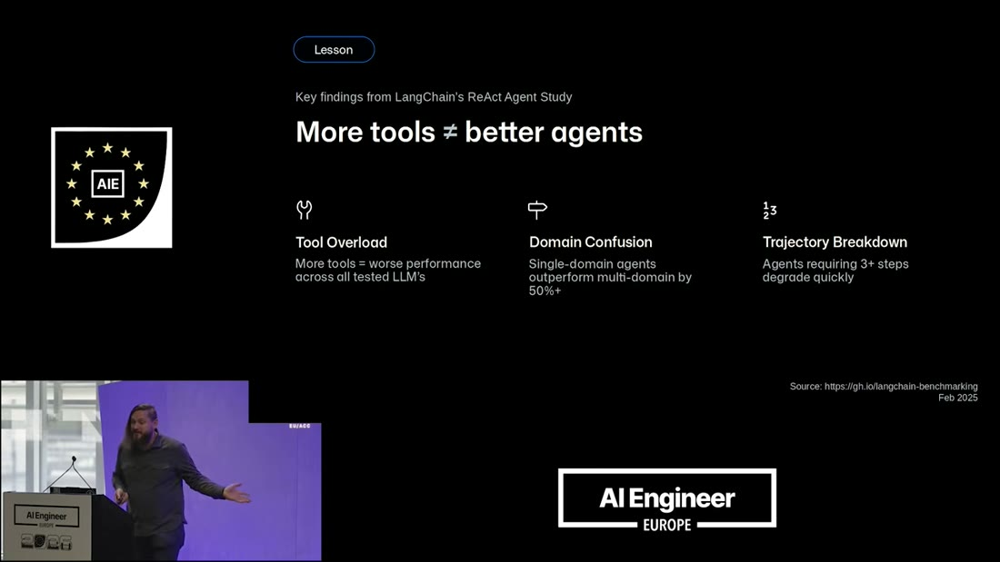

*What it teaches:* tool overload is a measured effect with three distinct failure modes, not a
vague concern. *Corroborated by:* the slide's three findings against the narration at
[`&t=136s`](https://www.youtube.com/watch?v=0n3MKk7r60w&t=136s) [n3].

The team did not have to measure this themselves, which is lucky and is also the reason to be
careful with this slide. LangChain had published a ReAct agent study in February 2025 finding three
things: more tools produces worse performance across all tested LLMs, single-domain agents
outperform multi-domain agents by 50% or more, and agents needing three or more steps degrade
quickly [n3]. Sam's summary is that agents "get confused and forgetful", and he immediately
sharpens it in a way worth copying. The cost is not tools as such, it is "more context and more
tools shoved directly into the context, to be precise."

Label this one honestly at the point of use. **S27 is re-displaying a third party's study, not
reproducing it**, so it does not raise this brain's confidence in the LangChain result at all. That
is the same pattern claim 212 records, where a source entirely about someone else's work still adds
no evidential weight to it. What S27 does supply, which is real and separate, is that a team
operating at this scale found the effect independently in their own product before reading about it.

The three failure modes are worth separating, because they call for different fixes and the talk
only ever addresses one of them. Tool overload is a context-volume problem and shrinking the
catalogue helps. Domain confusion is a *composition* problem, where a single agent holding tools
from unrelated domains does worse than a specialist, and shrinking the catalogue helps only if you
shrink along domain lines. Trajectory breakdown is a *depth* problem that no amount of catalogue
trimming touches, and it is the one the talk's later server-side multi-call absorption quietly
attacks without saying so [n9].

Now for the number that makes this concrete rather than academic. GitHub's own baseline was 64.6k
tokens of tool definitions before a single question was asked [n5]. **That is roughly 640 tokens per
tool**, which is worth memorising, because it lets you price any catalogue you meet from its tool
count alone. This brain already holds an independent figure of the same shape from S10, where 1,180
tools cost 541k tokens, or about 458 tokens each (claim 82). Two organisations, two catalogues,
same order of magnitude. That convergence is this brain's arithmetic rather than either source's
claim, and it is the most useful thing to take from this section.

So the catalogue costs 64.6k tokens and the effect is measured. **The obvious move is to let each
user pick a subset, and that is exactly what the team built three times.** The next section is what
happened.

### 3. Three elegant fixes, and the answer nobody wanted

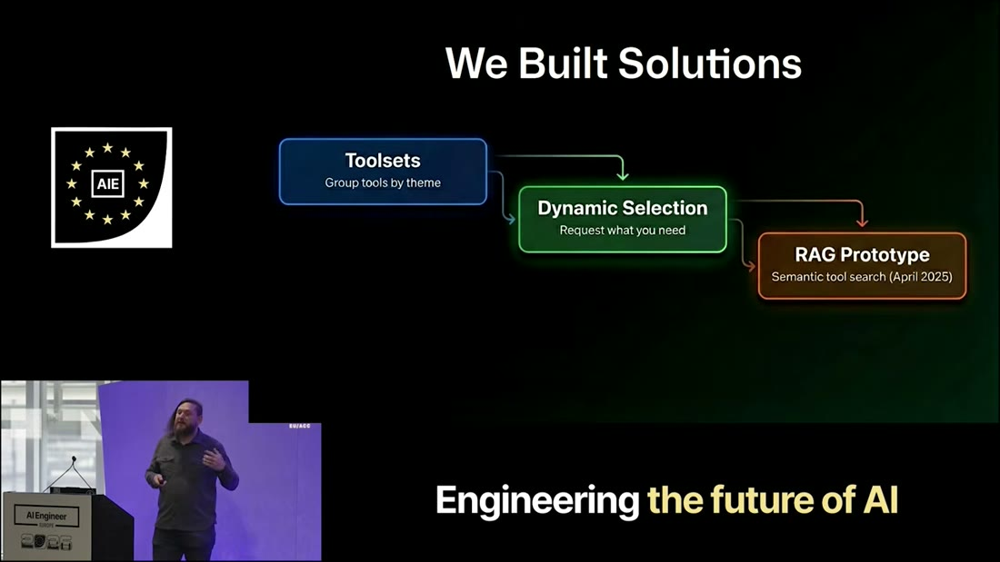

*What it teaches:* the team independently invented the three tool-surface fixes the industry
converged on. *Corroborated by:* the slide's three boxes against the narration at
[`&t=197s`](https://www.youtube.com/watch?v=0n3MKk7r60w&t=197s) [n4].

Read the three boxes before reading on, and notice that this is not a weak attempt. Toolsets group
tools by theme so a user can enable the ones they need. Dynamic selection lets the agent discover
which sets exist and switch them on in chunks at runtime. The third, never released, is a retrieval
prototype doing semantic search over the tool catalogue, which is the same shape as the tool-search
mechanism this brain holds from S10 with a measured 36x context reduction (claim 85). **A team that
builds all three has understood the problem completely.**

Now hold the question the speaker put to his own audience, because the answer is the finding: what
do you think happened, in spite of all of this?

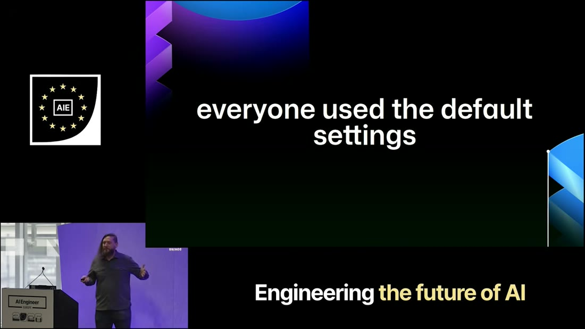

*What it teaches:* the delivery mechanism, not the design, decided which fixes had any effect.
*Corroborated by:* the slide against the narration at
[`&t=243s`](https://www.youtube.com/watch?v=0n3MKk7r60w&t=243s) [n4].

Everyone used the default settings. In Sam's words, "in a way we had all these elegant solutions,
and all they did was require users to actually edit the JSON a little bit, and most users just
don't" [n4]. Three correct designs, and the entry cost of each was a text edit in a config file.

At first glance this reads as a familiar product-management platitude about defaults mattering, and
it is worth resisting that reading, because the specific form here is sharper. **The team was not
choosing between a good default and a good configuration story. They were choosing between a fix
that reaches everyone and a fix that reaches nobody**, and the design quality of the second one was
irrelevant to that outcome. The 17% adoption figure for read-only mode is the closest thing to a
counterexample and it proves the rule, because read-only is a single flag serving a use case
enterprises actively want, and it still leaves 83% untouched [n21].

There is a second-order observation the speaker makes and then moves past, which deserves more
weight than he gives it. Every mode and configuration option a server adds is, he argues, "papering
over potential gaps in client implementations" [n22]. Read-only mode is the clean example. It maps
one-to-one onto the specification's existing `readOnlyHint` annotation, so the information was
already on the wire, and the mode exists only because no client exposes that annotation as a filter
[n21]. **The server is shipping a redundant feature to compensate for a client-side gap**, and it
gets 17% adoption because that is what configuration gets. Meanwhile every proposal to add tool
grouping to the MCP specification itself has been rejected [n22].

That leaves the team where the next movement begins. Configuration is a dead end, the specification
is not going to help, and the only lever that reaches the whole user base is what arrives when the
user does nothing at all.

---

## Movement B - the four reductions that landed

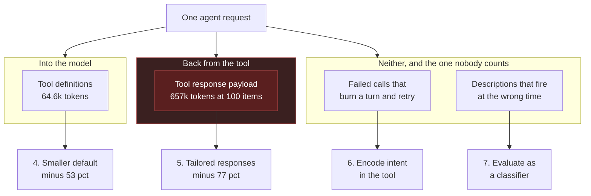
```mermaid
flowchart TB
    REQ["One agent request"]

    subgraph IN["Into the model"]
        direction TB
        CAT["Tool definitions<br/>64.6k tokens"]
    end

    subgraph OUT["Back from the tool"]
        direction TB
        RESP["Tool response payload<br/>657k tokens at 100 items"]
    end

    subgraph BEH["Neither, and the one nobody counts"]
        direction TB
        FAIL["Failed calls that<br/>burn a turn and retry"]
        DESC["Descriptions that fire<br/>at the wrong time"]
    end

    REQ --> IN
    REQ --> OUT
    REQ --> BEH

    CAT --> F4["4. Smaller default<br/>minus 53 pct"]
    RESP --> F5["5. Tailored responses<br/>minus 77 pct"]
    FAIL --> F6["6. Encode intent<br/>in the tool"]
    DESC --> F7["7. Evaluate as<br/>a classifier"]

    style OUT fill:#3a2020,stroke:#a04040,color:#fff
    style RESP fill:#5a1f1f,stroke:#a04040,color:#fff
```

This is a cost-surface diagram, not a request-flow diagram, and it exists to show that a request
spends context in three places while the industry argues about one of them. The crux is that **the
red box is an order of magnitude larger than the box everyone optimises, and it is measured in the
same units**. The shape deliberately puts the catalogue and the response side by side at the same
level, because drawing the response as a downstream consequence of the catalogue would reproduce the
error this movement corrects. The third column is there because two of the four reductions do not
reduce anything directly. They stop turns being wasted, which is a context saving you can only see
if you count failed calls as spend.

*Synthesized from n5, n6, n8 and n10.*

### 4. Changing the default, and what it bought

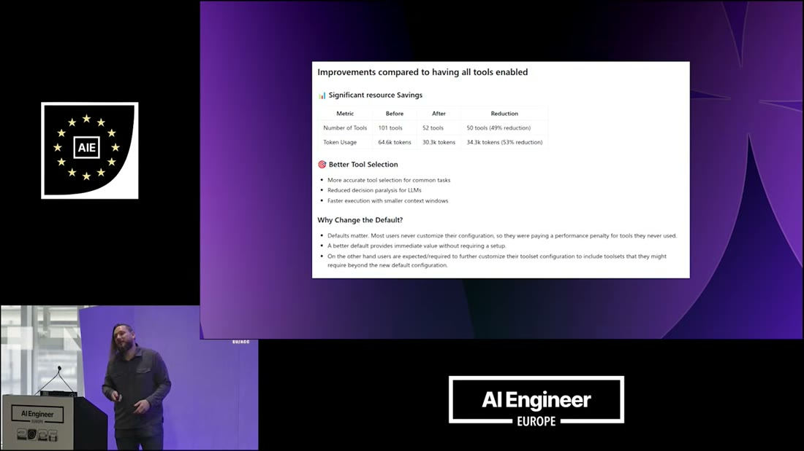

*What it teaches:* the measured effect of a better default, and the team's own reasoning for
changing it. *Corroborated by:* the slide's table against the narration at
[`&t=320s`](https://www.youtube.com/watch?v=0n3MKk7r60w&t=320s) [n5].

The mechanism is unglamorous and that is the point. The team looked at usage patterns on the remote
server, kept the tools that serve the general case, and then grouped CRUD operations into single
tools. The result was 101 tools down to 52, a 49% reduction, and 64.6k tokens down to 30.3k, a 53%
reduction [n5]. Note which of those two numbers is larger. **Grouping CRUD operations removes more
context than it removes tools**, because the schemas it collapses were largely duplicated across
create, read, update and delete variants of the same resource.

The slide's own justification is worth reading closely, because it states the tradeoff rather than
hiding it. Defaults matter because most users never customise, so they were paying a performance
penalty for tools they never used. A better default provides immediate value without setup. And
then the honest third bullet: users are now *expected* to customise further if they need toolsets
beyond the new default. **The configuration burden did not disappear. It moved to the minority who
actually need it**, which is the correct place for it and is a different claim from "configuration
does not work."

One number in this section should not be quoted. The narration says the default gives "about 40
tools" while the slide says 52, and the speaker explicitly flags the slide as dated on stage: "you
don't need to worry too much about the specifics, this is dated now" [d1]. The percentages are the
durable part; the absolute count was still falling as he spoke.

So a 53% reduction on the input side is real and it is the number the talk leads with. The next
section is about a number roughly twenty times larger that the talk gives one sentence.

### 5. The bigger number the tool-count debate ignores

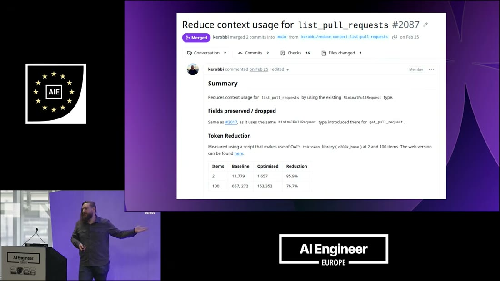

*What it teaches:* response payloads dwarf tool definitions as a context cost, measured with
`tiktoken` on a real merged PR. *Corroborated by:* the PR's own token table against the narration
at [`&t=351s`](https://www.youtube.com/watch?v=0n3MKk7r60w&t=351s) [n6].

The change itself is boring. A merged pull request reuses an existing `MinimalPullRequest` type so
that `list_pull_requests` stops returning every field the GitHub API offers. The measurement is not
boring at all. At 2 items the response fell from 11,779 tokens to 1,657, an 85.9% reduction. At 100
items it fell from **657,272 tokens to 153,352**, a 76.7% reduction [n6].

Sit with the baseline figure for a moment. One call to one tool, asking for a hundred pull requests,
cost 657,272 tokens before this change. **The entire tool catalogue that this talk spends its first
ten minutes reducing cost 64.6k**, so a single un-tailored response was ten times the whole catalogue
[n5, n6]. It is worse than that against the largest catalogue this brain has a figure for: S10's
1,180-tool manifest costs 541k tokens (claim 82), and this one response exceeds it. Even after the
optimisation, 153,352 tokens is still five times GitHub's improved 30.3k default catalogue.

That arithmetic is mine and neither source states it, so hold it as a reading rather than a
finding. But the direction is not in doubt, and the consequence is a genuine correction to how this
brain has been framing tool context. **Tool-definition cost scales with your catalogue, which you
control and which changes rarely. Response cost scales with the data the agent asks for, which you
do not control and which changes every call.** An optimisation of the first kind is a one-time win
you can measure and bank. The second is an ongoing exposure, and it is unbounded in a way the first
is not, because there is no upper limit on how many pull requests someone asks for.

Two practical consequences follow. First, if you are pricing an MCP server's context behaviour,
measure a realistic response before you count tool definitions, because you will usually find the
answer there. Second, this reframes what S10's tool-search result buys you (claim 85). Deferring the
manifest behind a search tool cut 541k to 15k, which is a 36x win on the smaller of the two numbers,
and it does nothing whatsoever about the response side. Both optimisations are needed and only one
of them is currently fashionable.

The two reductions so far both shrink payloads. The next two do something different, which is stop
turns being wasted at all.

### 6. Encoding intent instead of returning an error

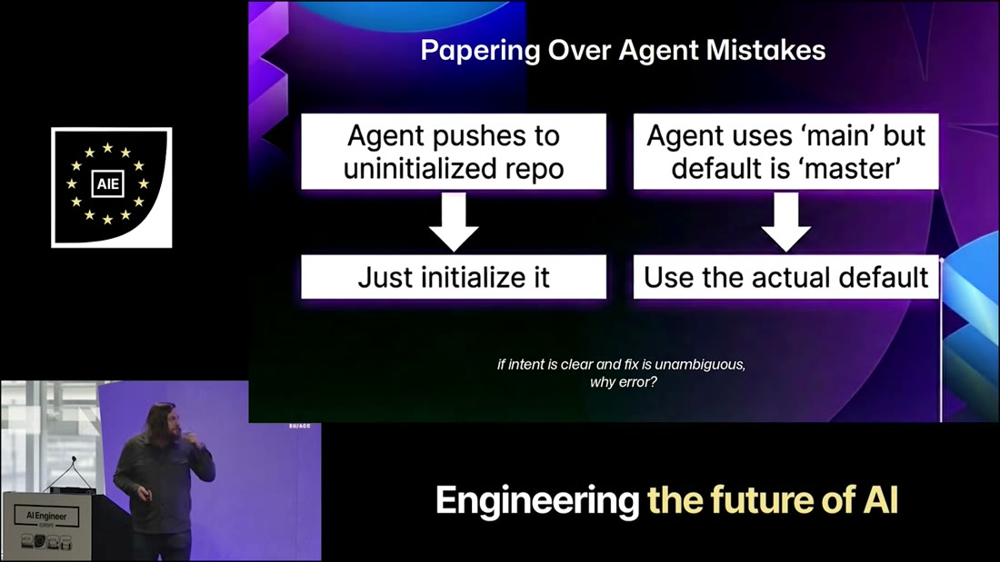

*What it teaches:* a class of agent failure is recoverable server-side, and the team's own name for
the technique concedes its cost. *Corroborated by:* the slide's two failure/fix pairs against the
narration at [`&t=412s`](https://www.youtube.com/watch?v=0n3MKk7r60w&t=412s) [n8].

The tool-call success rate is "roughly, I think, over 95%" [n7], and that figure is hedged enough
in delivery that it should be read as an order of magnitude rather than a measurement. What is more
interesting is the team's taxonomy of the residual. Some failure is irreducible, because agents
genuinely do not know which repositories they have write permission on, and because they still
hallucinate. The rest is what this section is about.

Look at the two examples on the slide, because they are more radical than they appear. An agent
pushes to an uninitialized repository, so the server just initialises it. An agent assumes the
default branch is `main` when it is actually `master`, so the server uses the actual default. The
slide poses the design question directly: **if intent is clear and the fix is unambiguous, why
error?** [n8]

At first glance this is obviously right, and the objection is worth raising because the team raised
it themselves in the slide title. They called it **Papering Over Agent Mistakes**, and papering over
is not a neutral phrase. Consider what has been traded. A deterministic error is an audit record and
a signal, and it tells the caller something true about the world. Silently initialising a repository
because someone pushed to it removes that signal and takes an action the caller never requested.
When the inferred intent is correct this is strictly better. When it is wrong, the failure is now
silent, and the source offers no measurement of how often that happens.

The same instinct produces the second technique, and here the tradeoff is cleaner. Where robustness
needs five API calls, the server makes all five rather than exposing five tools, "to reduce round
trips, cuz that saves context, saves time, and makes the agents more successful" [n9]. **This is
the depth failure from section 2 being attacked without being named.** Trajectory breakdown says
agents degrade past three steps, and absorbing a five-call sequence into one tool call removes four
steps from the agent's trajectory. The cost is that the sequence is now opaque, so a partial failure
inside it is harder to diagnose from outside. That is a reasonable trade and it is not a free one.

Both techniques change how a tool behaves when called. The remaining question is harder, which is
whether the right tool gets called at all.

### 7. Evaluating descriptions as a classifier

*What it teaches:* tool selection is treated as a multi-class classification problem and evaluated
in CI, not tuned by hand per tool. *Corroborated by:* the CI job list and per-tool classification
report against the narration at
[`&t=458s`](https://www.youtube.com/watch?v=0n3MKk7r60w&t=458s) [n10].

This is the most transferable idea in the talk and it gets ninety seconds. The framing to discard
first is the natural one: that a tool description is a piece of prose you improve until it is good.
Sam's correction is that **descriptions cannot be optimised individually because they compete**.
"The perfect tool description that makes the agent call it all the time is terrible, as is the
reverse of that" [n10]. A description that wins every ambiguous case has not been improved, it has
been over-fitted at the expense of its neighbours.

Once you see that, the right evaluation shape is forced. If descriptions compete for calls, the
question is not "is this description good" but "given a request, does the model pick this tool when
it should and leave it alone when it should not". That is precisely a multi-class classification
problem, and the slide shows exactly that artifact: a **classification report**, per model,
listing every tool by name [n10]. Precision on a tool is how often calling it was right. Recall is
how often it was called when it should have been. **Description tuning becomes a measurable
optimisation with a confusion matrix behind it, rather than a matter of taste.**

> 💡 **Classification report.** The standard scikit-learn output giving precision, recall and F1 per
> class. Applying it to tool selection means treating each tool as a class and each user request as
> an instance to be labelled. This framing is mine; the slide shows the artifact and the talk never
> names the technique.

The delivery detail is the part most teams could copy tomorrow. The eval runs as a **CI workflow**,
with jobs named `dump-context`, `build-mcp`, `run-eval`, `generate-summary`, `comment-summary` and
`failure-alerting` [n10]. It builds the server, runs the eval, posts the summary back as a comment,
and alerts on failure. So a pull request that changes one tool's description gets a per-tool
classification report against the current model, in the review, before merge. That is what turns the
insight into a control, and it is the answer to how a project taking seven pull requests a day keeps
101 competing descriptions coherent.

Be clear about what is not shown. **No score is quoted anywhere in the talk**, the results table is
unreadable at source resolution, and the visible model is `gpt-4o-mini` [n10]. So this is credible
as a method and supplies nothing as a measurement. That is a real gap in a talk whose other claims
are numbered.

The four reductions are now in place, and the tool surface is as small as design can make it. The
next movement starts somewhere that looks unrelated and ends by making the surface smaller again.

---

## Movement C - the credential, and the turn

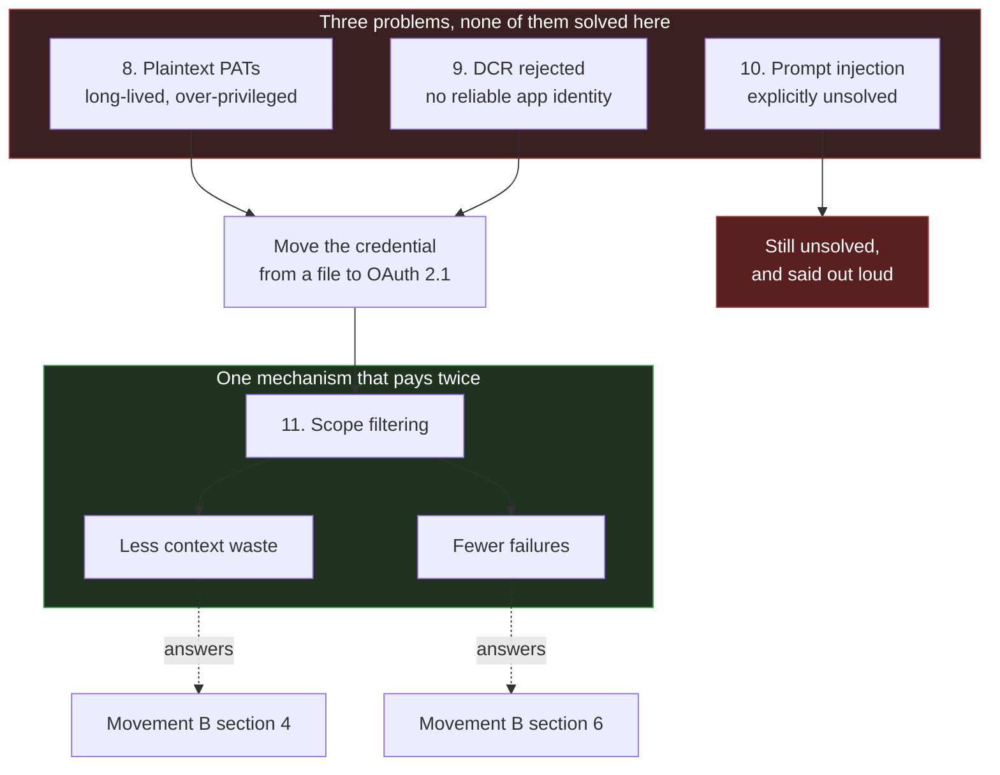
```mermaid
flowchart TB
    subgraph PROB["Three problems, none of them solved here"]
        direction TB
        P8["8. Plaintext PATs<br/>long-lived, over-privileged"]
        P9["9. DCR rejected<br/>no reliable app identity"]
        P10["10. Prompt injection<br/>explicitly unsolved"]
    end

    subgraph GAIN["One mechanism that pays twice"]
        direction TB
        P11["11. Scope filtering"]
        CTX["Less context waste"]
        FAIL["Fewer failures"]
        P11 --> CTX
        P11 --> FAIL
    end

    P8 --> OAUTH["Move the credential<br/>from a file to OAuth 2.1"]
    P9 --> OAUTH
    P10 --> UNSOLVED["Still unsolved,<br/>and said out loud"]
    OAUTH --> P11

    CTX -.answers.-> A4["Movement B section 4"]
    FAIL -.answers.-> A6["Movement B section 6"]

    style PROB fill:#3a2020,stroke:#a04040,color:#fff
    style GAIN fill:#1f3320,stroke:#4a9e5c,color:#fff
    style UNSOLVED fill:#5a1f1f,stroke:#a04040,color:#fff
```

This is a convergence diagram, not a security architecture, and the dotted arrows are the reason it
exists. The crux is that **a security migration undertaken for security reasons turned out to
deliver the context and reliability wins the entire first half of the talk was chasing**, which is
why the two dotted lines point backwards into Movement B. The shape puts three problems on the left
and one mechanism on the right deliberately, because only one of the three is actually solved here.
Injection stays red at the end of its own arrow, and drawing it as feeding the solution would launder
an admitted failure into a resolved one.

*Synthesized from n11, n12, n13, n14 and n15.*

### 8. Why the PAT is the thing to fix first

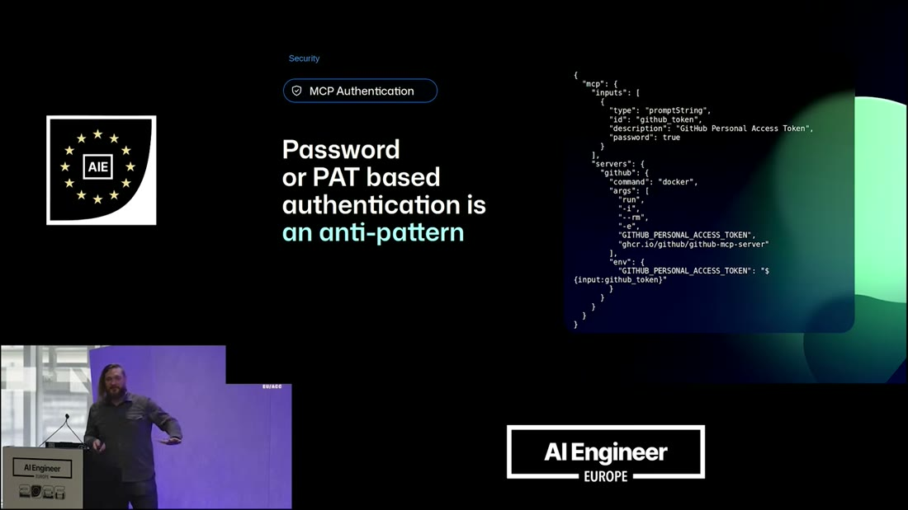

*What it teaches:* the dominant MCP credential in the wild is a long-lived over-privileged secret
sitting where the agent can read it. *Corroborated by:* the slide's config JSON against the
narration at [`&t=506s`](https://www.youtube.com/watch?v=0n3MKk7r60w&t=506s) [n11].

Look at the configuration on the right of that slide before the headline on the left, because the
headline is an assertion and the JSON is the evidence. A personal access token is declared as an
input and then passed as an environment variable into a Docker container. The token is therefore in
a file, in plaintext, on disk, in a location the agent itself can read. Sam's characterisation is
that these are "frequently long-lived", "often over-privileged", and "sat there just waiting to be
abused" [n11].

The important sentence is the one that follows, and it is the reason this section sits where it does
rather than in a security appendix. "End users, I don't think they're choosing this. It's actually
hard to make configuration easy and secure at the same time" [n11]. **That is section 3's finding
arriving in a different domain.** The insecure path is the default path, so it is the path
everybody is on, and blaming users for their token hygiene misreads what happened exactly as
blaming them for not editing their JSON did.

So the fix has to have the same shape as the fix in Movement B, which is to change what happens when
the user does nothing. The remote server with OAuth 2.1 is that change, and GitHub's team added PKCE
support to GitHub's own authorization server to make it safe for public clients [n12]. The stated
goal was to make the secure connection the path of least resistance, with no local runtime to
download.

That was the plan. The next section is what the ecosystem asked for instead.

### 9. The spec asked for DCR and the authorization server said no

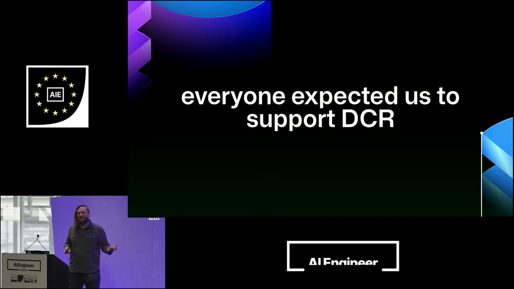

*What it teaches:* a major authorization server evaluated the MCP ecosystem's expected registration
mechanism and rejected it. *Corroborated by:* the slide against the narration at
[`&t=570s`](https://www.youtube.com/watch?v=0n3MKk7r60w&t=570s) [n12].

> 💡 **Dynamic Client Registration (DCR).** An OAuth extension letting a client register itself with
> an authorization server at runtime and receive a client ID, with no human ever filling in a
> developer-portal form. MCP leaned on it because a client that can talk to any server cannot have
> been pre-registered with all of them.

DCR is the obvious answer to a real problem, and everyone expected GitHub to support it. GitHub
considered it and rejected it. **The three reasons are all operational and none of them is
cryptographic** [n13]. Implemented properly, it is hard to avoid unbounded growth of the application
database, because anything can register and nothing ever unregisters. That growth has no natural
bucketing, so rate limits have nothing stable to attach to. And underneath both, there is no
reliable app identity, because a self-asserted registration is a claim rather than a fact.

Sam's verdict is unusually direct for a conference stage. It is "a well-intentioned mistake", and
"we're not the only authorization server to not support this" [n13]. Client ID Metadata Documents,
where a client is identified by a URL that serves its own metadata, is the direction he expects and
explicitly will not promise.

Weigh this carefully, because it is `single-leg` and the framing is interested. The reasons are
narration only, and they come from the team that made the call, which makes them authoritative about
the decision and not about whether the decision was right. What raises it above one vendor's excuse
is that the failure modes are structural rather than specific to GitHub. **Any authorization server
that accepts unauthenticated registrations inherits an unbounded table and an unidentifiable
population**, and that is a property of the mechanism.

There is a pattern worth naming across sections 3 and 9. Twice now, a clean specification-level
answer has failed on contact with an operator at scale, and both times the reason was the same
class of thing: **the mechanism assumed a cost that a large deployment cannot actually pay.**
Grouping proposals were rejected by the spec, and the spec's registration mechanism was rejected by
an implementer. Those are the same disagreement from opposite ends.

The credential is now in better shape. The next section is the problem that better credentials do
not touch.

### 10. Prompt injection, and the answer that does not exist

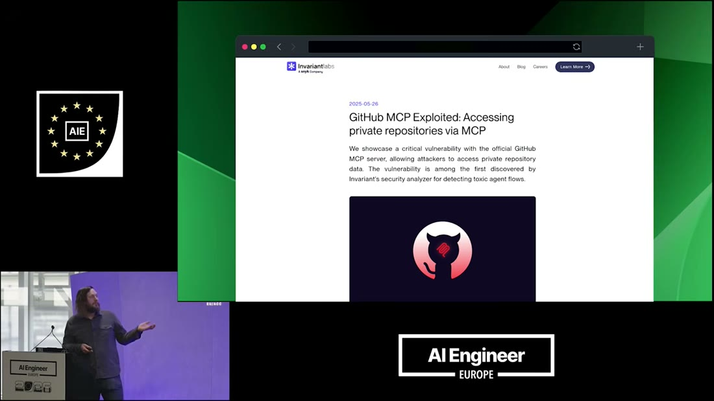

*What it teaches:* a published exfiltration attack against this specific server, and the operator's
public response to it. *Corroborated by:* the displayed post against the narration at
[`&t=650s`](https://www.youtube.com/watch?v=0n3MKk7r60w&t=650s) [n14].

Invariant Labs published "GitHub MCP Exploited: Accessing private repositories via MCP", naming
GitHub's server, and Sam put it on the screen himself with the words "this was a fun day" [n14].
The response has two halves and they deserve different amounts of trust.

The concession is credible precisely because it costs him something. The attack is correct, and the
tools do enable it if you enable them all [n14]. The generalisation is the interested half: it
"applies to almost every agent setup whether they use MCP or not", because this is the lethal
trifecta rather than an MCP defect. That framing is true as far as this brain's other sources go,
and it is also exactly what a vendor named in a vulnerability disclosure would say, so hold it as
credible and interested rather than as established.

> 💡 **Lethal trifecta.** Simon Willison's name for the combination that makes exfiltration possible:
> an agent with access to private data, exposure to untrusted content, and a means of communicating
> outward. Any two are usually safe and all three are not.

What is genuinely useful here is the sentence Sam does not soften. "The utility of agents is in
direct conflict with protecting this stuff, and it's an active space trying to work out how to
prevent these problems, but it's not solved" [n14]. **An operator at 7 million calls a week, with
every commercial reason to claim otherwise, saying the problem is unsolved is worth more than most
mitigations.** He then makes a point this brain should keep, which is that the same server serves
users with wildly different risk profiles, from air-gapped GitHub Enterprise instances to
individuals handing an agent a full-access token. One tool surface, one protocol, and no single
correct security posture across that range.

That last observation is what makes the next section possible. If users differ that much, the server
needs a per-user signal about what each of them should be allowed to reach, and it needs it without
asking. Which is where the talk stops being about security.

### 11. Scope filtering, where both halves of the talk meet

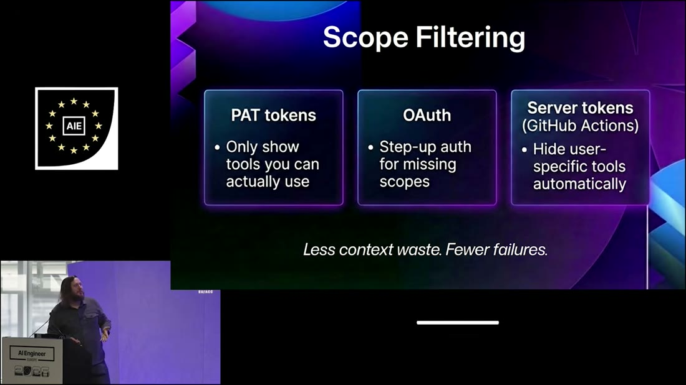

*What it teaches:* authorization data doubles as a context-reduction and failure-reduction
mechanism. *Corroborated by:* the slide's three boxes and its own summary line against the
narration at [`&t=744s`](https://www.youtube.com/watch?v=0n3MKk7r60w&t=744s) [n15].

Read the italic line at the bottom of that slide first, because it is the thesis: **"Less context
waste. Fewer failures."** Those are the two problems Movement B spent four sections on, and they are
being solved here by the authorization system.

The mechanism is three cases of one idea. When you authenticate with a personal access token, the
server immediately filters the tool list down to the scopes that token carries, and "you don't have
to do anything other than give it the token" [n15]. When you use OAuth, the server supports step-up:
a call needing a scope you have not granted returns a **scope challenge**, the client asks you
interactively, and if you agree the tool call continues rather than failing. And when the caller is
GitHub Actions using a server token, there is no user at all, so every user-specific tool is hidden
automatically.

Now the question worth posing, because the answer is what makes this a finding rather than a
feature. The team spent months building three ways for a user to declare which tools they want, and
all three failed on activation energy. So why does this one work? **Because the user already
declared it, in a different vocabulary, for a different reason, and the declaration is
authoritative.** A token's scopes are not a preference to be collected. They are an existing,
enforced, per-user fact that the server was already going to consult before executing anything. The
tool list was the last place anyone thought to apply it.

That is why the entry cost is zero, which is the property section 3 established as decisive.
Toolsets required a JSON edit. Scope filtering requires the thing the user did in order to
authenticate at all.

The step-up case deserves separate attention because it inverts a default that most systems get
wrong. The normal behaviour on a permission failure is to fail, and the agent then either gives up
or retries and fails again, burning turns. Returning a scope challenge converts a dead end into a
prompt, and the call resumes on approval [n15]. Sam's own framing when he built it with the VS Code
team was that users should get a clean install and an **upscoping later if they need it**, rather
than an up-front permission demand nobody can evaluate. That is least-privilege that gets more
usable as it gets more precise, which is rare.

One honest gap. **The talk quantifies the default-change and the response-tailoring and never
quantifies this** [n15]. There is no figure for how much context scope filtering removes, in a talk
that otherwise counts everything, which is the sort of omission worth noticing in the most
interesting claim.

---

## Movement D - operating it, and unwinding it

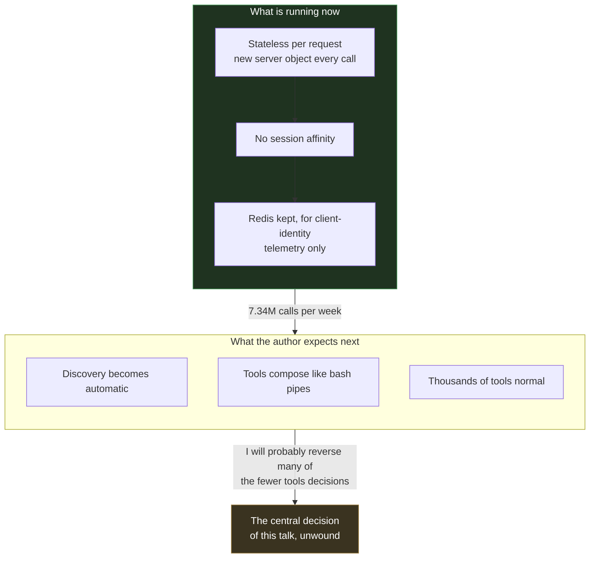
```mermaid
flowchart TB
    subgraph NOW["What is running now"]
        direction TB
        SL["Stateless per request<br/>new server object every call"]
        NA["No session affinity"]
        RD["Redis kept, for client-identity<br/>telemetry only"]
        SL --> NA --> RD
    end

    subgraph NEXT["What the author expects next"]
        direction TB
        AUTO["Discovery becomes automatic"]
        COMP["Tools compose like bash pipes"]
        THOU["Thousands of tools normal"]
    end

    NOW -->|"7.34M calls per week"| NEXT
    NEXT -->|"I will probably reverse many of<br/>the fewer tools decisions"| REV["The central decision<br/>of this talk, unwound"]

    style NOW fill:#1f3320,stroke:#4a9e5c,color:#fff
    style REV fill:#3a3320,stroke:#a08040,color:#fff
```

This is a durability diagram, not a roadmap, and it sorts what you have just read by how long it is
likely to remain true. The crux is that **the deployment mechanics on the left are the part that
survives and the tool-count recommendation is the part its own author expects to unwind**. The two
groups are drawn at the same size on purpose, because a reader who treats the whole talk as equally
durable will carry the fewer-tools conclusion for years past its expiry while forgetting the
per-request construction pattern that is genuinely reusable. The amber node is the one to remember.

*Synthesized from n16, n17, n19 and n20.*

### 12. Stateless at seven million calls a week

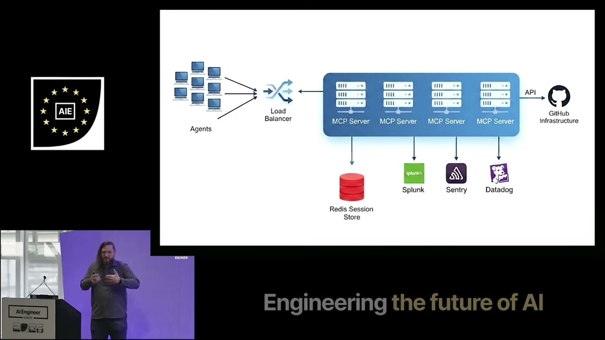

*What it teaches:* the production topology, and that "stateless" here means no affinity rather than
no state. *Corroborated by:* the architecture slide against the narration at
[`&t=822s`](https://www.youtube.com/watch?v=0n3MKk7r60w&t=822s) [n16].

Sam introduces this by saying it is "not a weird picture", and he is right, which is itself the
point. Agents reach a load balancer, the balancer fans out to identical MCP server instances, those
instances call GitHub's own infrastructure, and Splunk, Sentry and Datadog watch. **The unremarkable
shape is the finding**, because, as he notes, "a lot of people are running a stateful MCP server
process in the singular and have struggled with how you get it into this shape" [n16].

The mechanism that makes it possible is the detail to take away. The server constructs **a brand-new
MCP server instance, in the SDK sense, on every single request**, and attaches tools to it at
construction time [n16]. Whatever your configuration is, whatever policies apply to you, whatever
your token's scopes are, the object is assembled fresh and you get exactly the surface you are
entitled to.

Notice what that buys retroactively. Section 11's scope filtering looked like a feature and is
actually a consequence of this decision. **If the tool list is assembled per request anyway, then
consulting the credential during assembly is one more input to a function that already exists**,
rather than a new subsystem with its own lifecycle. A server that builds its tool list once at
startup cannot do scope filtering without inventing per-connection state, which is precisely the
thing this design avoids. The architecture came first and the feature fell out.

Now the honest reading of the word "stateless", because this brain has a claim about exactly this.
Redis is still there [n16]. Sessions still exist. They are used only to recover the self-reported
client identity that MCP carries, so telemetry can tell which clients people use, and there is no
session affinity, so any instance can serve any request. **That is state relocated and reduced, not
eliminated**, which is claim 180 arriving from an independent direction. Claim 180 was this brain's
synthesis over a Google blog post about the specification (S23), and it has now been matched by a
production implementation at a different company that predates the specification change. A synthesis
that survives contact with an independent implementer is a good deal stronger than one that does
not.

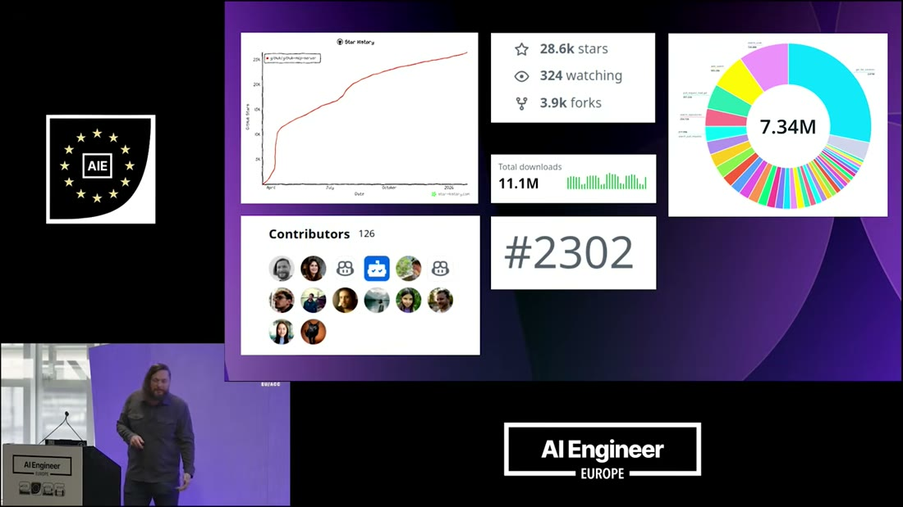

*What it teaches:* the operating scale all of the above runs at. *Corroborated by:* the dashboard
slide against the narration at
[`&t=1090s`](https://www.youtube.com/watch?v=0n3MKk7r60w&t=1090s) [n17].

The numbers are what make the rest citable: roughly **7.34 million tool calls a week**, 11.1 million
Docker downloads of the stdio server which is "by far not the most used version", 28.6k stars, 3.9k
forks, 126 contributors, and 2,302 issues and pull requests, which is over seven a day every day for
a year [n17]. One caution for anyone quoting the headline. The tool-call rate appears three times in
one talk as "around 7 million", 7.34M on the slide, and "fast approaching 8 million" at the close
[d2]. Cite the slide.

### 13. Why the author expects to put the tools back

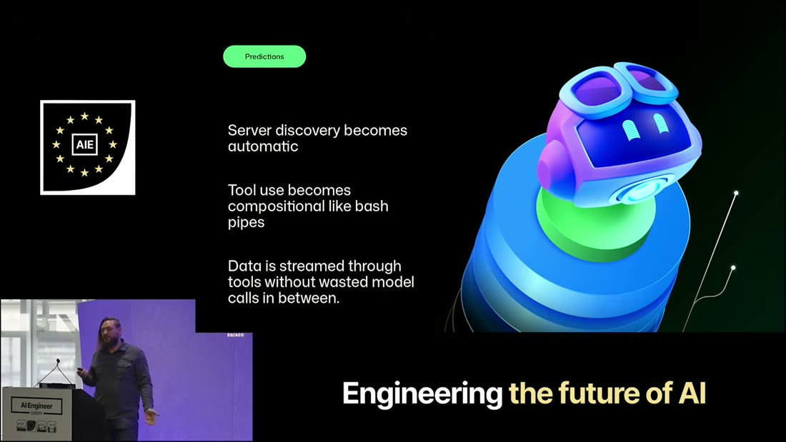

*What it teaches:* the three ecosystem shifts the author expects, and the enablers he names.
*Corroborated by:* the slide against the narration at
[`&t=994s`](https://www.youtube.com/watch?v=0n3MKk7r60w&t=994s) [n19].

The predictions are that server discovery becomes automatic, that tool use becomes compositional
"like bash pipes", and that data streams through tools without wasted model calls in between [n19].
The named enablers are Cloudflare's code mode, Anthropic's tool search tool API, and an OpenAI
equivalent. This brain already holds the measured version of the middle one from S10, where
deferring the manifest behind a search tool cut context 36x and made the cost roughly flat across a
24x catalogue increase (claim 85).

Then the sentence that should reframe everything above it. "I fully expect that thousands of tools
will be normal very soon. We're trying to iron out all the problems that prevented it in the first
place, and **I'll probably reverse many of the fewer tools decisions**" [n20].

Take that seriously rather than as modesty. The man who spent the first two thirds of this talk
cutting a catalogue in half is saying the cut was a response to a constraint he expects to be
removed. It is `single-leg`, it is a forecast rather than a measurement, and it is stated against
his own interest, which is the combination that makes a caveat worth more than the claims it
qualifies. **The durable content of this talk is its mechanics, and its central recommendation has
an expiry date its own author has published.**

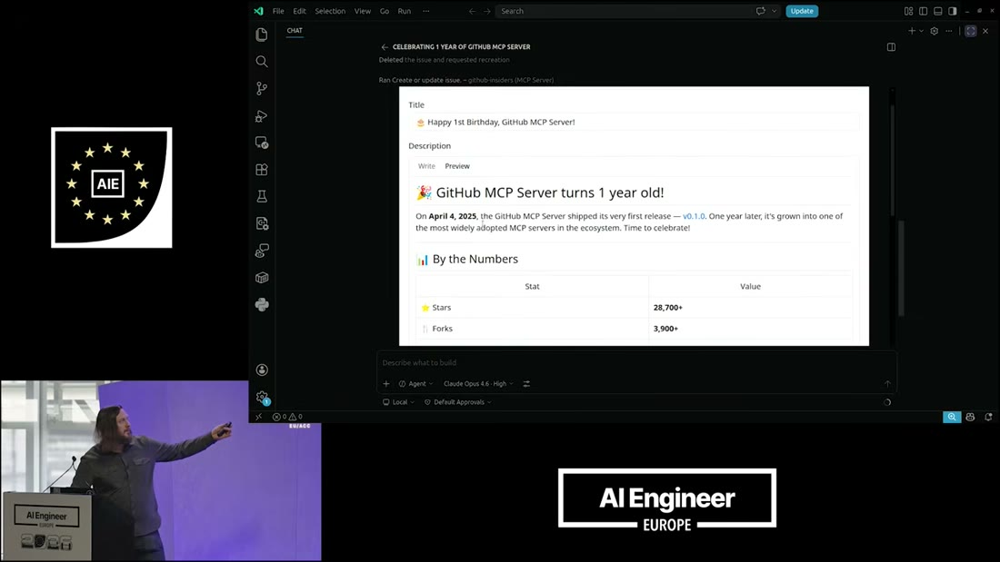

*What it teaches:* MCP apps put a human in the loop on agent-authored content, and the motivation is
social rather than technical. *Corroborated by:* the demo against the narration at
[`&t=934s`](https://www.youtube.com/watch?v=0n3MKk7r60w&t=934s) [n18].

The one shipped thing pointing that way is MCP apps, distributed behind an opt-in Insiders mode. The
client renders an editable form for an AI-drafted issue before it posts, and the reason given is not
correctness. It is that "you want to make sure that it's you posting and it's not going to get
closed as a sort of bot-generated thing" [n18]. **The human-in-the-loop control exists to satisfy
other humans, not to catch model errors**, which is a motivation this brain has not recorded before
and which will matter more as agent-authored contributions grow.

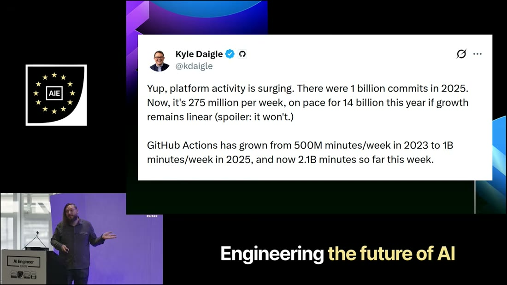

*What it teaches:* the load agents create is now a capacity problem for the platform underneath
them. *Corroborated by:* the displayed tweet against the narration at
[`&t=1136s`](https://www.youtube.com/watch?v=0n3MKk7r60w&t=1136s) [n23].

The closing slide is a GitHub executive's tweet: a billion commits in 2025, now 275 million a week
and on pace for 14 billion this year, with Actions minutes going from 500 million a week in 2023 to
1 billion in 2025 to 2.1 billion "so far this week" [n23]. Sam's comment is that "GitHub itself is
also facing a new challenge", and it shows no sign of slowing.

Label this one clearly, because it is the weakest evidence in the note. It is a GitHub employee
displaying a GitHub executive's tweet, so it is one organisation speaking twice, and **nothing in it
attributes the growth to agents**. That attribution is the talk's framing, not the data's. What is
worth keeping is the structural point regardless of the numbers: a platform that successfully serves
agents inherits their output as load, and the tool surface you optimise for context is upstream of
compute you then have to provision.

---

## Diagram (mental model)

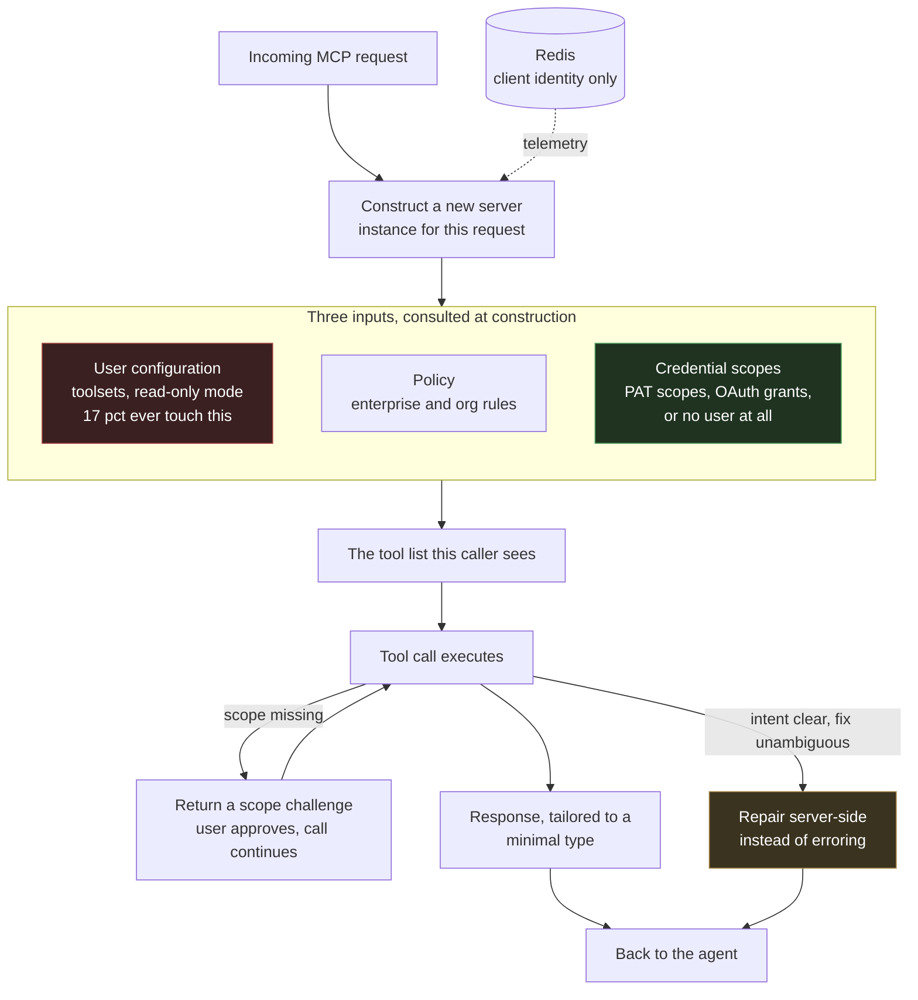
```mermaid
flowchart TB
    REQ["Incoming MCP request"] --> NEW["Construct a new server<br/>instance for this request"]

    subgraph FILTERS["Three inputs, consulted at construction"]
        direction TB
        CFG["User configuration<br/>toolsets, read-only mode<br/>17 pct ever touch this"]
        POL["Policy<br/>enterprise and org rules"]
        SCOPE["Credential scopes<br/>PAT scopes, OAuth grants,<br/>or no user at all"]
    end

    NEW --> FILTERS
    FILTERS --> LIST["The tool list this caller sees"]
    LIST --> CALL["Tool call executes"]

    CALL -->|"scope missing"| CHAL["Return a scope challenge<br/>user approves, call continues"]
    CHAL --> CALL
    CALL -->|"intent clear, fix unambiguous"| FIX["Repair server-side<br/>instead of erroring"]
    CALL --> RESP["Response, tailored to a<br/>minimal type"]

    RESP --> DONE["Back to the agent"]
    FIX --> DONE

    REDIS[("Redis<br/>client identity only")] -.telemetry.-> NEW

    style SCOPE fill:#1f3320,stroke:#4a9e5c,color:#fff
    style CFG fill:#3a2020,stroke:#a04040,color:#fff
    style FIX fill:#3a3320,stroke:#a08040,color:#fff
```

This is a construction diagram, not a request-flow diagram, and the thing to read is what feeds the
tool list rather than what happens after it. The crux is that **the tool surface is a computed value
recalculated on every request from three inputs of very different reliability**, and the colours
sort them by that. Configuration is red because only a minority ever sets it, so anything that
depends on it reaches almost nobody. Scopes are green because they are always present, always
correct, and cost the user nothing. Policy sits between the two, applied by an administrator rather
than the user, which is why it works at enterprise scale and not for individuals.

A different shape would teach the wrong thing here. Drawing the server as a long-lived object with a
tool list attached, which is how most MCP servers are built, makes scope filtering look like an
added feature that needs per-connection state to implement. Drawing construction inside the request
makes it obvious that the filter is free. The amber repair node is drawn as a branch off the call
rather than as a normal path, because it is the one place in this picture where the server does
something the caller did not ask for, and that deserves to look different.

*Synthesized from n8, n15, n16 and n21.*

## 💡 Terms

| Term | Meaning |
|---|---|
| **MCP** | Model Context Protocol. A wire protocol letting a client discover and call tools exposed by a separate server, with the tool catalogue placed into the model's context. |
| **Toolset** | GitHub's grouping of related product tools (repos, issues, pull requests, actions) that a user can enable or disable as a unit. Opt-in, and therefore mostly unused [n4]. |
| **`readOnlyHint`** | An MCP tool annotation declaring a tool performs no writes. Present in the spec and surfaced by essentially no client, which is why GitHub ships a redundant read-only mode [n21]. |
| **DCR** | Dynamic Client Registration. An OAuth extension letting a client register at runtime with no human step. Rejected by GitHub for unbounded database growth, unbucketable rate limits and absent app identity [n13]. |
| **PKCE** | Proof Key for Code Exchange. An OAuth extension protecting the authorization-code flow for clients that cannot hold a secret. Sam's team added support for it to GitHub's authorization server [n12]. |
| **CIMD** | Client ID Metadata Document. Identifies a client by a URL serving its own metadata, so identity is anchored to a domain rather than self-asserted. The expected DCR replacement [n13]. |
| **Step-up auth** | Returning a scope challenge mid-call rather than failing, so the user can grant the missing scope interactively and the call continues [n15]. |
| **Lethal trifecta** | Private data access, exposure to untrusted content, and an outward communication channel. Any two are usually safe and all three are not [n14]. |
| **Session affinity** | Routing a client's requests to the same server instance every time. GitHub has none, which is what lets any instance serve any call [n16]. |
| **Code mode** | Cloudflare's approach of having the model write code that calls tools, rather than emitting one tool call per turn, so composition happens outside the context window [n19]. |
| **Classification report** | Per-class precision, recall and F1. Applied to tool selection by treating each tool as a class, which is what GitHub's CI eval produces [n10]. *Term applied by this note; the talk shows the artifact without naming the technique.* |

## What has aged (read before applying)

This source is four months old at ingest and parts of it were dated on stage. **The pattern is the
usual one and it holds cleanly here: the mechanics survive and the recommendations do not**, because
a mechanic describes how something works while a recommendation encodes a trade-off against the
alternatives available at the time.

| What the source says | Verdict | Why |
|---|---|---|
| The default is 52 tools (slide) or about 40 (narration) | **Aged, and flagged on stage** | The speaker says "this is dated now" while presenting it, and gives a different number minutes later [d1]. Cite the 49% and 53% reductions, not the counts. |
| Fewer tools is the right design | **Aged by its own author** | He predicts thousands of tools will be normal and that he will reverse many of these decisions [n20]. |
| Tool search "just landed in Claude Code a couple of weeks ago" | **Aged** | This brain holds the measured version from S10, including a 36x context reduction at 1,180 tools (claim 85). It is no longer a new arrival. |
| Stateless deployment is unusual and people struggle to get there | **Partly aged** | The MCP spec's own stateless updates landed 2026-07-28 and are documented in S23, after this talk. GitHub built it before the spec blessed it, which strengthens the mechanic and dates the framing. |
| DCR is rejected, CIMD is the likely direction | **Live, verify before quoting** | He explicitly would not promise CIMD support [n13]. Check the current state of GitHub's authorization server before repeating either half. |
| Scope filtering, per-request construction, classification-report evals | **Durable** | These are mechanics. None depends on a tool-count judgement or a model generation. |

*The verdicts in the right column are this note's commentary, resting on the brain's other sources
rather than on anything S27 says about itself.*

## What to distrust in this note

**Start with the structural conflict, because it colours everything.** This is a vendor engineer
presenting his own product at a conference, and there is no external evaluation anywhere in it. No
baseline against another MCP server, no third-party measurement, and no adversarial review of any
figure. Every efficacy number is self-reported by the team that produced it.

**The single most interesting claim is the least quantified.** Scope filtering [n15] is the note's
payload and the talk gives no number for how much context it removes, in a presentation that
quantifies the default change and the response tailoring precisely. That asymmetry should make you
treat "less context waste" as a plausible mechanism rather than a measured result.

**The eval section shows a method and no results** [n10]. The classification report is displayed at
unreadable resolution and no score is quoted anywhere. So the framing of tool selection as
classification is worth adopting on its own merits, and the claim that GitHub's descriptions are
therefore good is not supported by anything shown.

**Two figures are hedged in delivery and should carry that hedge forward.** The success rate is
"roughly, I think, over 95%" with no denominator and no definition of failure [n7], and read-only
adoption is given as "roughly 17%" [n21]. Both are single-leg.

**The weakest evidence sits in the most quotable place**, which is the closing slide [n23]. A GitHub
employee displaying a GitHub executive's tweet is one organisation speaking twice, and nothing in
those numbers attributes the growth to agents.

**The LangChain findings are re-displayed, not reproduced** [n3]. S27 raises no confidence in them,
per claim 212, and the study itself has not been read by this brain.

**Two of the note's most reusable claims are among its least corroborated.** The DCR rejection
reasons [n13] are narration-only from the team that made the call, and the author's expected
reversal [n20] is a forecast. Both are load-bearing here, and both are `single-leg`.

## Open questions

- **How much context does scope filtering actually remove?** The one measurement missing from an
  otherwise numerate talk [n15]. A median GitHub PAT's scopes against the 52-tool default would
  answer it in an afternoon.
- **What does server-side intent repair cost when the inferred intent is wrong?** [n8] The team
  named the technique "papering over" and measured only the upside. The interesting number is the
  rate of unrequested actions, not the success rate.
- **Does the response-payload cost exceed the tool-definition cost generally, or only for
  list-shaped tools?** The §5 arithmetic is compelling on one tool at one item count. A sweep across
  tool types would turn a striking anecdote into a design rule.
- **What are the actual classification scores, and do they move when a description changes?** [n10]
  Without that, joint description evaluation is a good idea with no demonstrated sensitivity.
- **Did GitHub ship Client ID Metadata Documents?** [n13] He would not promise it and the answer is
  checkable today.
- **Is there a public write-up of the LangChain ReAct study's methodology?** [n3] The 50%+
  single-domain advantage is the most quotable number this note carries and it is second-hand.

## Feeds these topics

| Topic | What this source adds |
|---|---|
| [`mcp`](../../brain/topics/mcp.md) | The note's **first operator-scale primary source**: production topology at 7.34M calls/week [n16, n17], the DCR rejection and its reasons [n12, n13], the rejection of every tool-grouping proposal to the spec [n22], and `readOnlyHint` shipped-but-unsurfaced [n21]. First-party corroboration for claim 180. |
| [`context-engineering`](../../brain/topics/context-engineering.md) | The response-payload finding [n6] and its arithmetic against claim 82, the measured default change [n5], and the per-request tool-list construction pattern [n16]. |
| [`agents`](../../brain/topics/agents.md) | Encoding intent into the tool surface rather than returning errors [n8], server-side absorption of multi-call sequences [n9], and the human-in-the-loop control motivated socially rather than technically [n18]. |
| [`agent-security`](../../brain/topics/agent-security.md) | PAT-as-default anti-pattern [n11], step-up auth converting permission failures into prompts [n15], and an operator conceding prompt injection is unsolved [n14]. |
| [`evals`](../../brain/topics/evals.md) | Tool selection framed as multi-class classification with a per-tool classification report in CI [n10], and the joint-optimisation argument that individual description tuning is the wrong unit. |

---

## Presentation narrative

> **Framing note.** This is a talk track for a mixed room of engineers and engineering leadership,
> derived entirely from the gated nodes above. It selects the load-bearing reasoning from a thirteen
> section walkthrough and does not re-summarise it. It claims nothing about whether GitHub's choices
> are the right ones for anyone else, and every number in it is the vendor's own self-report with no
> external baseline. Where the evidence is one-legged, the slide says so.

### Slide 1 - The tools were free to add and the context was not

**The failure that started this was a governance failure wearing a context-window costume.** GitHub
open-sourced its MCP server, became the most-starred repository of the week, and contributions
filled platform coverage to 101 tools within about a month. Then agents got measurably worse at
using GitHub [n2]. What engineers should take from this is that no individual pull request was
wrong. Each tool was defensible, each had a user, and the degradation was emergent, which means no
review gate could have caught it. The leadership significance is that **an open contribution
process has a cost that accrues to a resource nobody owns**, and the tool catalogue is exactly that
kind of resource. LangChain's ReAct study had already measured the general effect, finding worse
performance across every model tested and single-domain agents beating multi-domain ones by 50% or
more [n3]. That figure is re-displayed here rather than reproduced, so treat it as context, not as
this source's evidence.

*Visual: `visuals/frame_155.jpg`. This is a findings slide, not a benchmark, and its value is that
it separates three distinct failure modes that get lumped together as "too many tools". Only one of
them, volume, is fixed by a smaller catalogue.*

### Slide 2 - Every fix that required a user to act reached nobody

**The team built three good solutions and shipped none of the value.** Grouped toolsets, dynamic
tool discovery, and an unreleased semantic tool-search prototype are the same three answers the
industry converged on, and all three required the user to edit a JSON config. Everyone used the
default settings [n4]. What engineers should take from this is that the entry cost of a fix is part
of its design, not a deployment detail. The question is therefore not whether your tool-surface
design is good. It is whether it lands on anyone who did not read your changelog. **The leadership
significance is that activation energy is an architectural property**, and it beat three rounds of
competent engineering here. What finally moved the numbers was changing what arrives when the user
does nothing: 101 tools to 52, and 64.6k tokens of initial context to 30.3k [n5].

*Visual: `visuals/frame_295.jpg`. One sentence on a slide, which is the correct visual weight for
the finding, because the elegance of what it defeated is the whole point.*

### Slide 3 - The catalogue is the smaller number, by an order of magnitude

**A single tool response cost ten times the entire tool catalogue.** One merged pull request tailored
what `list_pull_requests` returns, and at a hundred items the response fell from 657,272 tokens to
153,352 [n6]. The catalogue everyone spends their time optimising was 64.6k [n5]. What engineers
should take from this is the structural difference between the two costs. Catalogue cost scales with
something you control and change rarely. Response cost scales with what the agent asks for, changes
every call, and has no upper bound. The leadership significance is a budgeting one, which is that
**an optimisation programme aimed only at tool definitions is aimed at the smaller half of the
bill.** Both matter and only one is currently fashionable. The arithmetic comparing these two figures
is this brain's, not the source's, so hold it as a reading rather than a finding.

*Visual: `visuals/frame_370.jpg`. This is a measurement artifact, not an architecture diagram, and
it is worth showing because it is the only externally checkable number in the talk. It is a merged
public pull request with a stated tokeniser.*

### Slide 4 - Tool descriptions compete, so evaluate them as a classifier

**A description that wins every ambiguous call has not been improved, it has been over-fitted at its
neighbours' expense.** GitHub stopped micro-optimising individual descriptions and started testing
them against each other, asking whether each tool is called at the right times and left alone at the
wrong ones [n10]. That reframing forces the evaluation shape: it is multi-class classification, and
the artifact is a per-tool classification report per model, generated by a CI workflow that posts
back into the pull request before merge. What engineers should take from this is that it makes
description tuning measurable rather than a matter of taste, with precision and recall per tool. The
leadership significance is that **it is the only control shown here that scales with contribution
volume**, which matters for a project taking seven pull requests a day. Be clear about the limit:
the method is demonstrated and no score is quoted anywhere in the talk.

*Visual: `visuals/frame_465.jpg`. This is a pipeline artifact rather than a result, and that is
exactly what makes it worth presenting, because the reusable part is where the eval runs and not
what it scored.*

### Slide 5 - Authorization turned out to be the filter they had spent months trying to build

**The credential already knew which tools the caller could possibly use, and nobody had thought to
ask it.** A personal access token's scopes filter the tool list automatically with the user doing
nothing beyond authenticating. OAuth adds step-up, so a call needing an ungranted scope returns a
challenge and continues on approval instead of failing. Server tokens in GitHub Actions have no user,
so user-specific tools disappear [n15]. The slide's own summary is "less context waste, fewer
failures", which are precisely the two problems the first half of this work was about. What engineers
should take from this is why it costs nothing: the server already builds a fresh tool list on every
single request, so consulting scopes is one more input to a function that exists rather than a new
subsystem [n16]. **The leadership significance is that the security migration paid for itself in
reliability and context**, which is not the usual direction of that trade. The honest gap is that
this is the one claim the talk never quantifies.

*Visual: `visuals/frame_815.jpg`. This is a convergence slide, not a security architecture, and the
line worth reading aloud is the italic one underneath the three boxes.*

### Slide 6 - The author expects to reverse the central decision, and that is the right close

**The engineer who halved the catalogue says he will probably put the tools back.** His prediction is
that discovery becomes automatic, tools compose like shell pipes, and thousands of tools become
normal, with tool-search APIs from Anthropic and OpenAI as the enablers [n19, n20]. That is a
forecast, it is one-legged, and it is stated against his own interest, which is what makes it worth
more than the claims it qualifies. So the recommendation here is **watch, not adopt**, and the split
is clean. Adopt the mechanics, because per-request server construction, scope filtering, classifier
evals in CI and response-payload tailoring do not depend on any tool-count judgement. Do not adopt
the tool-count conclusion, because its own author has published its expiry date. The decision that
would change this is a measurement nobody has taken: what scope filtering actually removes, and what
server-side intent repair costs when the inferred intent is wrong.

*Visual: `visuals/frame_1000.jpg`. This is a forecast slide and should be presented as one, which
means the three lines on it are the speaker's expectations and none of them is evidence.*

### Key takeaway message

The problem was that an open contribution process filled a tool surface faster than anyone could
govern it, and every per-user fix the team designed failed because it required the user to act. The
decision that worked was to move the filter to something the user had already declared for another
reason, which is the credential, and the delivered value is a security migration that paid for
itself in context and reliability. The boundary is that this is a single vendor's self-report with
no external baseline, its most interesting mechanism is its least quantified, and its central
recommendation carries an expiry date its own author has published. The implication for anyone
building on MCP is to take the mechanics and leave the tool-count conclusion, and to measure your
response payloads before you spend a quarter optimising your tool definitions.
