# Learning - Here's how the new MCP spec works (S28)

> Persona: **curator + mentor** - re-adopt when working this file. **presenter** owns every diagram
> walkthrough and the final section.
>
> Every claim below carries a node ID from [`nodes.md`](nodes.md) or is marked as background.
> Citations are `&t=NNNs` deep links into
> [the video](https://www.youtube.com/watch?v=1B9H6RTAGmE).

## TL;DR

MCP specification `2026-07-28` deletes the handshake and the session, so any request can land on any
server instance. Kent C. Dodds walks the release as somebody who shipped against it, which is why the
note worth taking from him is not the change list. It is what happened next. He migrated his server,
instrumented which protocol lane every request used, and three weeks after the spec shipped with all
four Tier 1 SDKs already supporting it, his dashboard showed **25,288 requests and not one from a
`2026-07-28` client** [n4, n13]. A week later the modern lane carried roughly 0.5% of real work
[n13]. **The specification was finished and the ecosystem had not moved**, and he only knows that
because he built the instrument at migration time rather than at retirement time [n12].

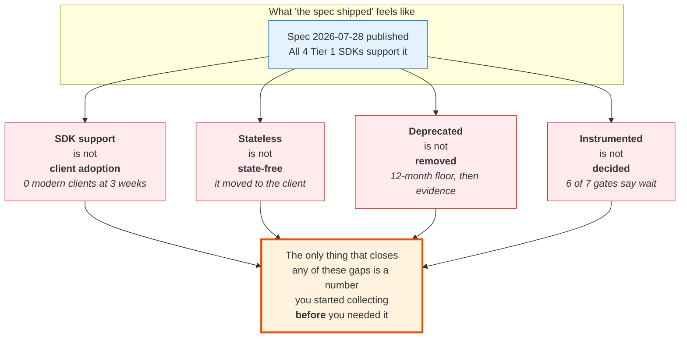

This is a collapse diagram, not a component diagram - each red box is a pair of ideas that a reader
of the release notes will treat as one, and the italic line underneath is what this source measured
when it pulled them apart. **The crux is that a protocol revision is a distribution problem wearing a
specification's clothes.** It is shaped as a fan rather than a sequence because the four collapses are
independent and none of them causes the others, which is exactly why fixing one does not warn you
about the remaining three. Drawing them as a pipeline would imply an order the evidence does not
support, and drawing only the adoption gap would lose the reason the note is filed under `mcp` rather
than under project management.
*Synthesized from n4, n9, n10, n13, n14, n15.*

## The 1-minute version

**What this covers.** One screencast walking MCP specification revision `2026-07-28`, from the
perspective of somebody who had already migrated a production server and client onto it. The
specification content is roughly a third of it. The rest is the migration and what the migration
measured.

**The problem it works on.** MCP began as a stateful protocol. A client opened a connection, the
server answered with a session, and every subsequent request had to reach that same instance
[n1, `&t=219s`]. That is an ordinary web-scaling problem with an unusual amount of pain attached,
because the thing holding the session is not a cache you can move but a live conversation. Lose the
instance and the client cannot receive responses at all [n1, `&t=251s`].

**Why that problem is harder than it looks.** The obvious fix is to put the session in Redis and let
any instance pick it up, and that is what large deployments actually did. It does not help with the
case that hurts most. When a server needs something from the human mid-call, it holds an open stream
and an in-flight tool call for as long as the person takes to answer, which may be minutes
[n8, `&t=1183s`]. No amount of shared session storage fixes an instance pinned to somebody's
attention span.

**The naive approach and where it collapses.** You could bridge that with sticky routing, so the
answer returns to the instance that asked. Now your load balancer needs affinity, your deployments
cannot drain cleanly, and an instance falling over destroys work rather than shedding it. Kent's own
before-diagram names the residue precisely, which is that A is waiting while B has the data, and you
need shared storage or sticky routing to close the gap [n8].

**The idea.** Delete the session and make every request carry what the session was holding
[n1]. Routing metadata moves into HTTP headers, so gateways route and authorize without parsing the
body [n2]. The mid-call conversation becomes two independent requests joined by an opaque blob the
client carries between them, which is Multi Round-Trip Requests [n9]. Registration stops writing
records, because the `client_id` becomes a URL the authorization server fetches on demand [n7].

**How it works, and what it costs.** Statelessness here is relocation, not removal. The negotiated
fields move onto every request, the elicitation context moves into the client's hands, and long work
moves into an application-level task store. The client-held blob is the interesting cost, because a
server that kept nothing has nothing to compare the returned value against. The diagram says so
outright, which is that `requestState` must be treated as untrusted and should be encrypted and bound
to the user [n10].

**What the migration measured, which is the part worth the twenty minutes.** Kent shipped both eras
behind one route, classified every request with the SDK's own `isLegacyRequest` predicate, and wrote
one data point per request recording which lane it used [n11, n12]. The stated reason is in the pull
request, which is to make retirement "a metrics decision instead of a guess" [n12]. Three weeks after
the release, the answer was zero modern clients out of 25,288 requests, and a week after that roughly
0.5% of real work [n13].

**How far to trust it.** One server, one author, a self-selected client population, and a window the
source itself says contains six to thirteen days of data rather than the thirty it is labelled
[n13]. It is nonetheless the only adoption measurement anywhere in this brain, and the discipline
around it survives the sample size even where the number does not.

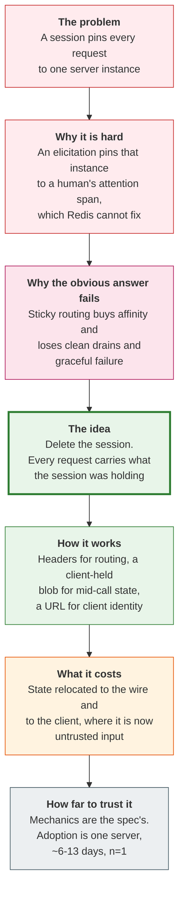

This is an argument diagram, not a mechanism diagram, so the boxes are reasoning steps rather than
components. **The crux is that the design only looks inevitable once you have felt the elicitation
problem**, which is the step a change list has no room for. It is drawn as a single unbranched column
because the reasoning genuinely is linear here, and every branch you might add belongs to the
walkthrough rather than to the arc. Note what the shape exposes at the bottom, which is that the green
band and the grey band come from different evidence, and a reader who takes the whole column at one
confidence has misread the source.
*Synthesized from n1, n8, n9, n10, n13.*

The table below is for the reader returning to check one row rather than arriving for the first time.

| | |
|---|---|
| **The problem** | MCP was stateful. A session bound every request to one instance, so a lost instance meant a dead client and a mid-call question held an open stream for as long as the human took [n1, n8]. |
| **Why the obvious answer fails** | Shared session storage handles reconnection and does nothing for the pinned instance. Sticky routing fixes that and costs clean deployments and graceful failure [n8]. |
| **The idea** | Specification `2026-07-28` deletes the handshake and the session, makes every request self-describing, and promotes routing metadata into `Mcp-Method` and `Mcp-Name` headers [n1, n2]. |
| **How it works** | Mid-call questions become two independent requests joined by an opaque `requestState` the client echoes back, so any instance finishes the work [n9]. Client registration becomes a fetched URL rather than a stored record [n7]. |
| **What it costs** | State relocated rather than removed, and the client-held blob is untrusted input the server must encrypt and bind to the user [n10]. Legacy support runs a twelve-month minimum, so you maintain two eras [n3]. |
| **How far to trust it** | Spec mechanics are solid and second-sourced against S23. **Adoption is one hobbyist-scale server over ~6-13 days**, which is a real measurement of a tiny population [n13]. |

## Key claims

- **The specification is stateless and every request is self-describing**, so any request can land on
  any instance behind a plain round-robin load balancer. The optional discovery call exists for
  clients that want capabilities up front. [n1, `&t=189s`, `visuals/frame_400.jpg`] **corroborated**,
  and a second independent source for claim 179.
- **Method and tool names travel in `Mcp-Method` and `Mcp-Name` headers**, so gateways route and
  authorize without parsing the request body. [n2, `&t=389s`] **corroborated.** The security and
  performance justification is the speaker's, not the post's.
- **MRTR replaces the held-open stream with two independent requests joined by a client-held blob**,
  and the guidance is explicit that the blob is untrusted input which should be encrypted and bound
  to the user. [n9, n10, `&t=1244s`, `visuals/frame_1310.jpg`] **corroborated**, refining claim 181.
- **CIMD replaces DCR by making the `client_id` a hosted HTTPS URL** that the authorization server
  fetches on demand, so no registration record is written and trust reduces to domain ownership.
  [n7, `&t=961s`, `visuals/frame_1005.jpg`] **corroborated**, and new to this brain.
- **DCR's two structural defects are unbounded per-client state and a non-portable `client_id`**, which
  is the same pair GitHub gave independently in S27. [n5, `visuals/frame_885.jpg`] **corroborated**,
  and the strongest cross-source result in this ingest.
- **The DCR growth problem now has a number: roughly 125 registrations per user** on this speaker's
  own server. [n6, `&t=864s`] **single-leg, needs-check** - a first-party operator statement with no
  denominator and no dashboard behind it.
- **Three weeks after the release, an instrumented production server had served 25,288 requests and
  zero from a `2026-07-28` client**; a week later the modern lane carried roughly 0.5% of real work.
  [n13, `visuals/frame_1418.jpg`] **corroborated on the numbers**, and scoped to one server over a
  window of six to thirteen days.
- **Retirement was defined as seven falsifiable gates with thresholds, written before the decision**,
  six of which currently fail. [n14, `visuals/frame_1418.jpg`] **single-leg**, and the artifact is a
  dated public document rather than a recollection.
- **The conclusion the instrumentation produced was to do nothing yet**, stated as recommendation-only
  with nothing implemented. [n15] **corroborated**, and the part of the source most likely to be lost
  in a summary.

## What you will learn, and in what order

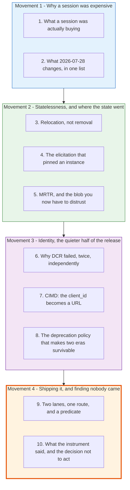

This is a reading-order diagram, not a subject diagram, so the boxes are sections of this note rather
than parts of MCP. Movement 1 is orientation and a reader who already knows why stateful protocols are
expensive to operate can skim it in a minute, losing only the framing that makes movement 2 feel
necessary. Movement 2 is the mechanism most people mean when they say the spec went stateless, and
section 5 is where the security cost lands, so it is the one section in that group not to skim.
Movement 3 covers the half of the release that got less attention than statelessness and matters more
to anyone building an MCP client, because it changes what you have to host. **Movement 4 is the
payload and it is coloured accordingly** - it is the only part of this source that no other source in
this brain supplies, and a reader with ten minutes should read movement 4 first and come back.
*Synthesized from the section structure below.*

---

## Movement 1 - Why a session was expensive

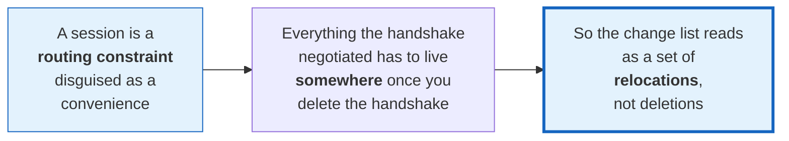

This is a framing diagram, not a mechanism diagram, and its only job is to set up how to read the
change list in section 2. **The crux is that you should meet the list already asking where each
negotiated field went**, because a reader who meets it as a set of removals will be surprised later by
the client-held blob. The two sections in this movement are deliberately asymmetric, since the first
is a problem statement you may already hold and the second is the source's actual content.
*Synthesized from n1, n2.*

### 1. What a session was actually buying

> **Background, supplied.** This section is scaffolding, uncited by construction. It is context I am
> providing so the release notes read as a design rather than as a list. Skip it if you have operated
> a stateful protocol behind a load balancer.

A session is usually introduced as an efficiency. You negotiate once, agree on a protocol version and
a capability set, and then every subsequent message can be shorter because both ends remember what was
agreed. That framing is true and it hides the cost, because the memory has to live on one particular
machine.

Kent's walkthrough of the old shape is short and it names the consequence rather than the mechanism.
A client connects, a load balancer picks an instance, that instance answers with a session, and from
then on every request has to come back to it [n1, `&t=219s`]. He is careful about why this is worse
than ordinary session affinity, and the reason is what happens on failure. If the instance falls over,
the client "can no longer receive responses", so the work in flight is not slow, it is
gone [n1, `&t=266s`].

There is a version of this problem every web engineer has solved, which is to put the session in a
shared store and let any instance rehydrate it. Hold onto the fact that this is available and was
widely done, because section 4 is where it stops being sufficient, and the reason it stops is the
single best argument for the redesign.

The question this leaves is the one the release answers. If you delete the session, the things it was
remembering do not stop being needed. Where do they go?

### 2. What `2026-07-28` changes, in one list

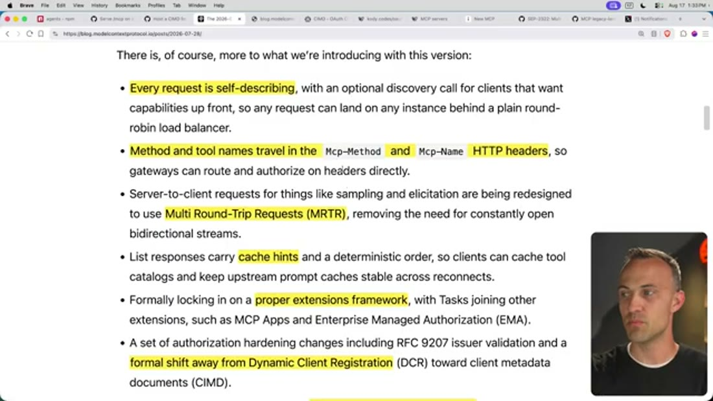

*What it teaches:* the release as its authors summarised it, with the statelessness claim stated in
operational terms rather than architectural ones. *Corroborated by:* the narration walking each
highlighted line, `&t=374s` through `&t=499s` [n1, n2, n16, n17].

The first bullet is the whole design in one sentence, which is that every request is self-describing,
"so any request can land on any instance behind a plain round-robin load balancer" [n1]. Notice the
choice of words there. The post does not claim the server holds no state, and it does not claim
statelessness as a virtue. It claims a specific operational property, which is that your load balancer
can be dumb.

The second bullet answers a question the first one creates. If a request is self-describing, its
description lives in the body, and a gateway that wants to route on it now has to parse JSON on every
call. So method and tool names are lifted into `Mcp-Method` and `Mcp-Name` HTTP headers [n2]. Kent
supplies the justification the post leaves implicit, which is that making a gateway read request
bodies has "all kinds of security problems and performance issues" [n2, `&t=405s`]. That reasoning is
his rather than the specification's, and it is worth holding lightly for that reason, though it agrees
with this brain's earlier independent reading of the same change in claim 179.

The remaining bullets are best read as three different answers to the same question, which is what
happens to the things a session used to hold. Mid-call conversations become Multi Round-Trip Requests,
"removing the need for constantly open bidirectional streams" [n9]. Catalogue stability becomes cache
hints plus a deterministic order, so clients can cache tool lists and keep upstream prompt caches
stable across reconnects [n16]. Long-running work becomes the Tasks extension, which moves out of the
experimental core entirely [n16]. Each of those is a place state landed.

The last bullet is the one this note spends a whole movement on, and it is easy to skim because it
arrives in the same register as the rest. Authorization hardening includes RFC 9207 issuer validation
and "a formal shift away from Dynamic Client Registration (DCR) toward client metadata documents
(CIMD)" [n17, n5, n7]. That single clause replaces the mechanism by which every MCP client identifies
itself to every MCP server.

So the change list is a list of relocations. The next movement follows the two that cost something.

---

## Movement 2 - Statelessness, and where the state went

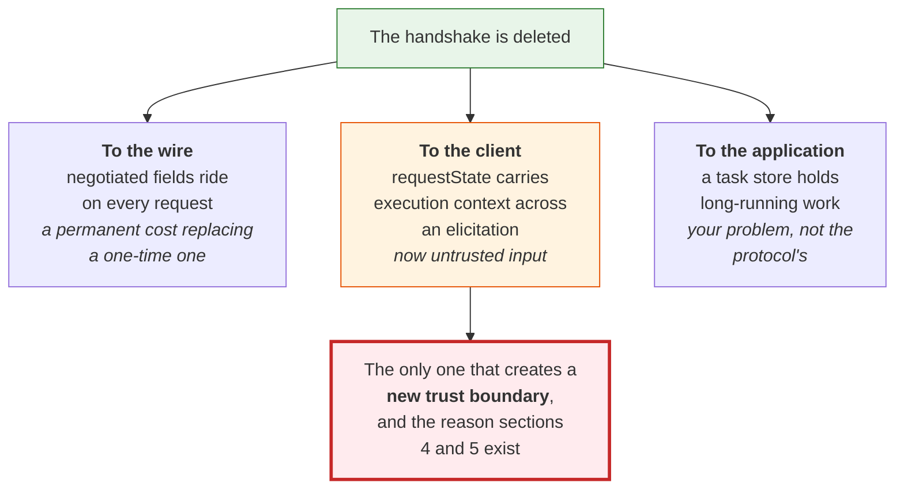

This is an ownership diagram, not a dataflow diagram, so each branch names who now holds a thing
rather than how it travels. **The crux is that only one of the three relocations changes who you have
to trust**, which is why this movement gives the other two a paragraph and gives that one two
sections. The asymmetry in the drawing is deliberate and it is the judgement worth transferring, since
an architecture review that treats three relocations as three equivalent line items will spend its
attention evenly on a problem that is not evenly distributed.
*Synthesized from n9, n10, and claim 180 from S23.*

### 3. Relocation, not removal

This brain reached the general form of this before meeting this source, and the claim is worth stating
before the mechanics because it is the thing that stops "stateless" from being a slogan.
**Statelessness is a property of a layer and never of a system.** State does not evaporate when a
protocol stops carrying it. It moves, and the engineering question is who owns it now and whether
anybody has written down the bill.

That is claim 180, promoted from S23, and S27 corroborated it from an unexpected direction by
publishing a stateless MCP architecture with Redis still in the diagram. This source is the third
independent look at the same thing, and its contribution is that all three destinations are visible in
one 25-minute walkthrough rather than inferred.

The move to the wire is the cheapest and the easiest to underrate. Protocol version, client
capabilities and client info now travel on every call instead of being agreed once [claim 179, S23].
Kent does not dwell on it, and the honest framing is that a one-time negotiation cost has become a
permanent per-request cost, paid forever, in exchange for a load balancer that needs no affinity. For
most deployments that is obviously the right trade, and it is still a trade.

The move to the application is the Tasks extension, and the interesting thing is that the protocol
stopped pretending to solve it. Tasks moved out of the experimental core into
`io.modelcontextprotocol/tasks` with poll-based `tasks/get` and a new `tasks/update` [n16]. Kent's
reaction is that this formalises something people were already working around, and he is glad of it
[n16, `&t=594s`]. Long-running work is now explicitly your storage problem, which is more honest than
a protocol-level mechanism that would have needed the same storage underneath.

The move to the client is different in kind, and that difference is the rest of this movement. The
other two relocations change who pays. This one changes who you trust.

### 4. The elicitation that pinned an instance

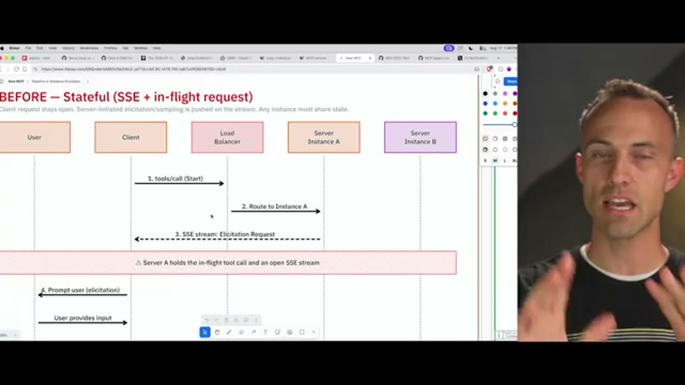

*What it teaches:* the exact failure the redesign is aimed at, drawn as a sequence so the duration is
visible. *Corroborated by:* the narration walking the same diagram, `&t=1120s` through `&t=1229s`
[n8].

At first glance this looks like an ordinary streaming problem and the fix looks like ordinary session
sharing, so it is worth being precise about why it is neither. The subtitle states the constraint,
which is that the client request stays open, server-initiated elicitation is pushed on the stream, and
"any instance must share state".

Follow what the red band is actually claiming. Server A holds the in-flight tool call **and** an open
SSE stream, and it holds both for as long as the elicitation takes. Kent's example of an elicitation
is deliberately mundane, which is "would you like fries with that" [n8, `&t=1198s`]. The duration is
therefore not a network latency and not a computation. It is a person deciding, and it may be minutes.

Suppose you had solved this the way section 1 suggested, by putting the session in Redis. You have
made the session recoverable and you have not made the instance free, because the open stream is the
thing being held and a stream is not serialisable into a shared store. This is the point where the
standard answer runs out.

So the deployment reaches for sticky routing, and Kent narrates what that costs when it goes wrong.
The elicitation result returns to the load balancer, which "has to send that to the exact same
instance", and if it routes elsewhere then A is waiting while B holds the data [n8, `&t=1213s`]. The
residue is shared storage or sticky routing purely to bridge a gap the protocol created. His verdict
on the whole shape is blunt, which is that this is "yet another reason why stateful requests is not a
good idea" [n8, `&t=1229s`].

The question that leaves is genuinely hard, and it is worth sitting with before reading the answer. The
server has partial work in progress and needs an answer from a human before it can continue. If the
server is allowed to remember nothing, where does the partial work live?

### 5. MRTR, and the blob you now have to distrust

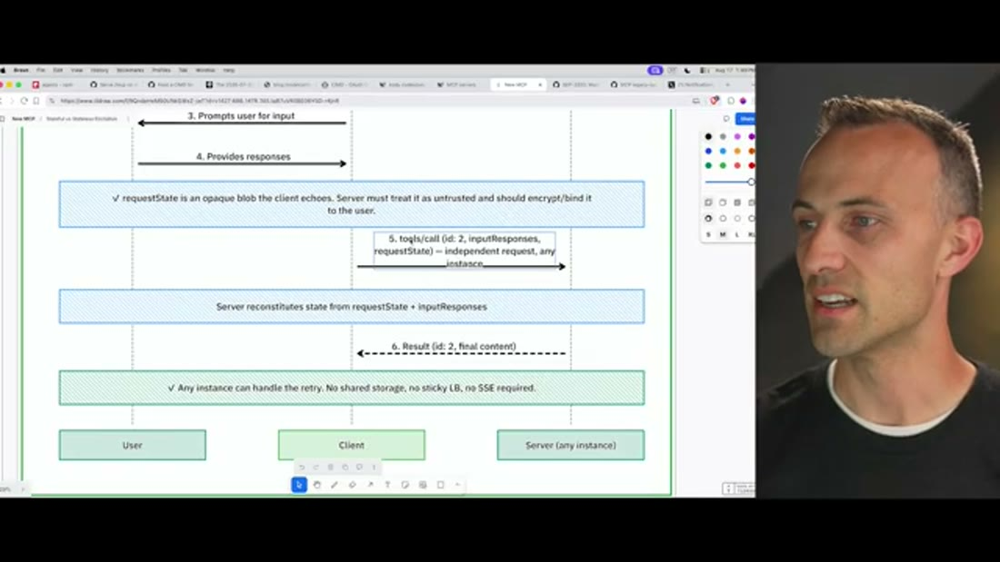

*What it teaches:* the answer to the question section 4 ends on, and the trust obligation it creates,
both stated on the same picture. *Corroborated by:* the narration, `&t=1244s` through `&t=1330s`
[n9, n10].

The answer is that the partial work lives with the client. The server responds to the tool call with
an input-required result carrying a `requestState` blob, and then the request simply ends. The band on
the diagram is unambiguous, which is that the original request ends and nothing is held in server
memory. Kent's framing of the consequence is the one to remember, which is that the client can prompt
the user and "in six days the user could provide a response, it doesn't matter, we're not taking up
any resources for that" [n9, `&t=1274s`].

When the answer arrives the client re-sends the original call with `inputResponses` and the echoed
`requestState`, as an independent request that any instance may serve. The server reconstitutes its
state from the two together and finishes. The closing band states the operational payoff plainly,
which is that any instance can handle the retry with no shared storage, no sticky load balancer and no
SSE required.

Now notice what has happened to the trust model, because the diagram notices it too. The server was
deliberately built to remember nothing, so when the blob comes back it has **kept nothing to compare
it against**. The band above step 5 states the obligation directly, which is that `requestState` is an
opaque blob the client echoes, and the server "must treat it as untrusted and should encrypt/bind it
to the user" [n10]. Kent names the attack in one sentence, which is fabricating a claim that the user
asked for something they did not [n10, `&t=1289s`].

**This is worth flagging as a refinement of something this brain already holds, rather than as
agreement.** Claim 181 was promoted from S23, which shipped an example `requestState` of 32 bytes of
unsigned plaintext, base64 of `{"step":1,"files":["a","b","c"]}`, carried alongside an elicitation
asking whether to delete three files. This source shows the guidance is encrypt-and-bind. So the gap
claim 181 identified is a gap between guidance and one vendor's worked example, which is a materially
better situation than an unrecognised hole in the design. It is not a resolved situation, because
**neither source tests any implementation against the obligation**, and a `should` in a diagram is not
a conformance requirement.

That closes the mechanism half of the release. The half that changes what you have to host is next.

---

## Movement 3 - Identity, the quieter half of the release

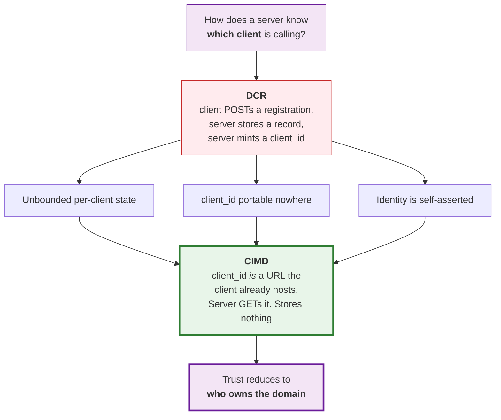

This is a derivation diagram, not a protocol diagram, so the arrows mean "and therefore" rather than
"then sends". **The crux is that CIMD is not a better registration mechanism but the removal of
registration as a step**, which is why all three DCR problems converge on one replacement rather than
being fixed individually. Drawn as three parallel defects feeding one node because that convergence is
the argument, and a version showing DCR and CIMD side by side would suggest a choice between two
options where the second is a strict deletion of work.
*Synthesized from n5, n7, and claim 222 from S27.*

### 6. Why DCR failed, twice, independently

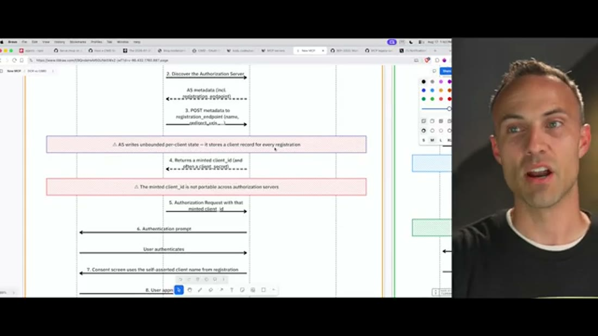

*What it teaches:* the two structural defects of Dynamic Client Registration, stated as properties of
the mechanism rather than as complaints. *Corroborated by:* the narration, `&t=848s` through
`&t=946s` [n5].

> **Background, supplied.** This paragraph is scaffolding, uncited by construction. Skip it if you
> have built an OAuth integration. Normally, connecting an application to a provider means visiting a
> dashboard, creating an app, and declaring your redirect URLs and scopes by hand. The provider stores
> that and gives you a `client_id`. Dynamic Client Registration is that same flow performed by an API
> call instead of a human, and MCP needed it because **any** client is supposed to be able to connect
> to **any** server, which makes a manual dashboard step impossible.

Kent explains the need for DCR generously before criticising it, and that order is worth preserving,
because the mechanism is not stupid. It is automating a step that genuinely cannot be manual in an
ecosystem where clients and servers have never met [n5, `&t=831s`].

The first red band names the cost of doing that. The authorization server "writes unbounded per-client
state - it stores a client record for every registration". The word doing the work there is
`unbounded`, and the reason it is unbounded is that registrations are created and never cleaned up.
Every reconnection, every deleted-and-recreated integration, mints another record.

Kent attaches the only number anybody in this brain has attached to this, which is an average of
roughly **125 registrations per user** on his own server, early in its life [n6, `&t=881s`]. His own
reading is the right one, which is that almost nobody has 125 clients, so this is measuring
reconnection churn [n6]. **Treat the figure as single-leg and label it wherever it is used** - it is a
first-party operator statement with no denominator, no window and no dashboard shown behind it. The
direction it points is more trustworthy than its magnitude.

The second red band is a different kind of problem. The minted `client_id` "is not portable across
authorization servers", so an identity established with one server means nothing to the next. In an
ecosystem premised on any client talking to any server, an identifier that works in exactly one place
is close to useless.

Kent adds a third defect from narration alone, and it is the one with security consequences. Nothing
stops a client self-asserting whatever identity it likes, so "anybody could say hey, I'm Claude Code",
with no mechanism for controlling who is actually who [n5, `&t=930s`]. The diagram corroborates it
from a different angle, since step 7 notes that the consent screen "uses the self-asserted client name
from registration". **The user is therefore being asked to approve a name the requester chose for
itself.**

Here is why this section matters more than a protocol detail should. This brain already holds claim
222, from S27, in which GitHub described evaluating DCR and declining it. Their stated reasons were
unbounded growth of the app database and no reliable app identity. **Two operators, at different
scales, in different roles, with no connection to each other, independently produced the same two
reasons.** One runs an authorization server for millions of developers and the other runs a personal
assistant. That convergence is stronger evidence than either statement alone, because the failure
modes are clearly structural rather than situational.

So the mechanism was rejected from both ends at once. What replaces it?

### 7. CIMD: the `client_id` becomes a URL

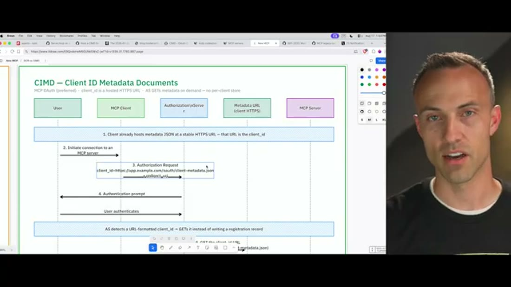

*What it teaches:* the replacement mechanism, whose subtitle contains the entire idea. *Corroborated
by:* the narration, `&t=961s` through `&t=1105s` [n7].

The subtitle is the design. The `client_id` is a hosted HTTPS URL, the authorization server GETs the
metadata on demand, and there is **no per-client store**.

Read the first band carefully, because the ordering is the trick. The client already hosts a metadata
JSON document at a stable HTTPS URL **before any connection happens**, and that URL is the
`client_id`. Kent's own is his server's `client-metadata.json` [n7, `&t=979s`]. So when the client
initiates, it does not register and then receive an identifier. It presents an identifier it already
had.

The authorization server then detects a URL-formatted `client_id` and, as the band states, "GETs it
instead of writing a registration record". What it retrieves is the same material a dashboard would
have collected, which is the client name, the client URI, the logo URL, the redirect URIs and the
grant types [n7, `&t=1044s`]. Validation is what you would expect, which is that the `client_id`
matches the URL, the redirect URI is on the list, and the document is well formed [n7, `&t=1075s`].

Now walk the three defects from section 6 and watch each one disappear rather than improve. Unbounded
per-client state is gone because no record is written at all, and the authorization server holds a
cache at worst. Portability is solved because the identifier is a URL, which means the same one works
at every authorization server, for every user of that client [n7, `&t=1090s`]. Self-asserted identity
is the interesting one, and Kent's phrasing is the memorable part of the whole source, which is that
"the trust is ownership of the domain" [n7, `&t=1105s`].

**That last substitution deserves a beat, because it is doing more work than it appears to.** Domain
ownership is not a strong identity claim in the abstract, and it certainly does not tell you the
client is trustworthy. What it does is make the claim **attributable and revocable by somebody other
than the claimant**. An attacker can still say they are Claude Code, but they cannot serve
`claude.ai/client-metadata.json`. That is a weaker guarantee than a vetted registration and a far
stronger one than a self-asserted string, and it costs the ecosystem nothing to operate because the
web already has the machinery.

The honest caveat is that this brain has one source on CIMD. Claim 222 recorded GitHub naming it as a
likely direction and explicitly not promising it, and this source shows the specification took it and
that at least one server implements it. Nobody here has yet read the CIMD specification itself.

That leaves one structural question. Two eras of a protocol are now live at once, so on what terms
does the old one ever go away?

### 8. The deprecation policy that makes two eras survivable

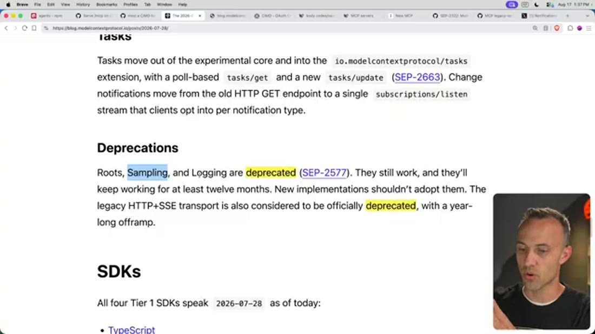

*What it teaches:* the contract governing removal, and the SDK-support claim that section 10 turns
into a trap. *Corroborated by:* the narration, `&t=499s` through `&t=529s` and `&t=594s` through
`&t=704s` [n3, n4].

The policy is a twelve-month minimum, and the wording matters. Roots, Sampling and Logging "still
work, and they'll keep working for at least twelve months. New implementations shouldn't adopt them"
[n3]. That is two separate instructions, one to existing implementations and one to new ones, and
conflating them is how people end up either breaking clients early or adopting a doomed feature late.

The legacy HTTP+SSE transport gets the same treatment with "a year-long offramp" [n3]. Kent's reaction
draws on his time at TC39, where the standing mantra was "don't break the web", and he credits that
refusal to break things for much of the web's success while conceding that some things do need
shedding [n3, `&t=514s`]. This brain has no standards-process topic to promote that comparison into,
so it stays here as context rather than as a claim.

His per-feature reactions are worth recording because they are not uniform. Roots he is glad to see
go, calling it useless outside very slim use cases [n3, `&t=594s`]. Sampling he is genuinely sorry
about, and his example is the one that makes the feature make sense, which is a journaling server
asking the client's model to generate tags for an entry before saving it [n3, `&t=658s`]. His overall
read is that it was useful and little used [n3, `&t=689s`].

Then there is the line at the bottom of the frame, which is that all four Tier 1 SDKs speak
`2026-07-28` as of publication [n4]. Read in isolation this is the reassuring end of a release
announcement. **Hold it, because section 10 is where it becomes the most misleading sentence in the
source** - not through any fault of the post, which says exactly what it means, but because of what
readers do with it.

So the specification is complete, the SDKs support it, and the old features have a dated exit. The
remaining question is entirely practical. How do you actually move?

---

## Movement 4 - Shipping it, and finding nobody came

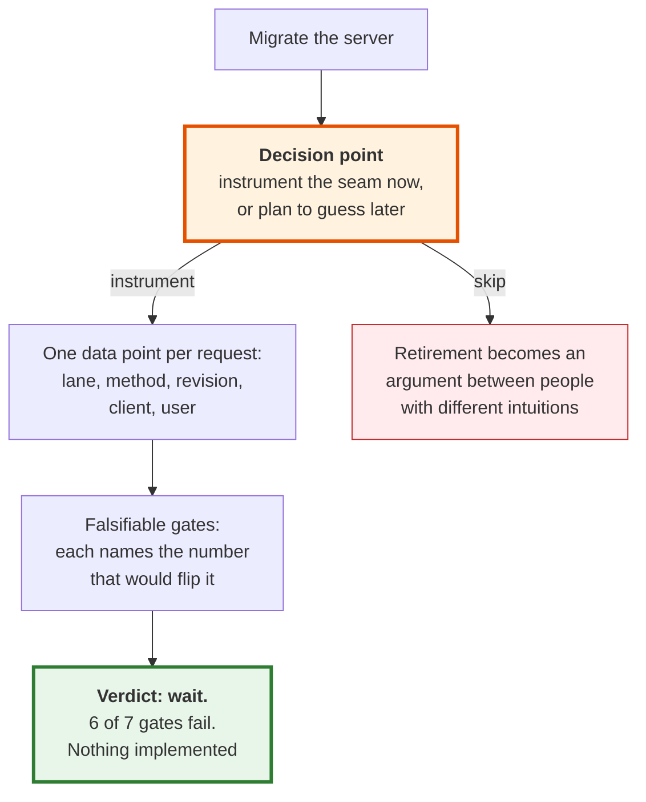

This is a decision diagram, not a process diagram, and the branch is the whole content. **The crux is
that the instrument has to be built at migration time, because the data you need is a time series and
you cannot start one retroactively.** The rejected branch is drawn rather than omitted because it is
the default that most teams take without noticing they took it, and the green terminal is deliberately
"wait" to make the point that a good instrument frequently produces a null decision.
*Synthesized from n11, n12, n14, n15.*

### 9. Two lanes, one route, and a predicate

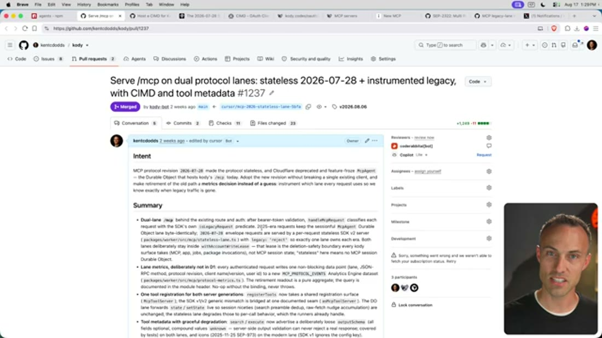

*What it teaches:* the migration pattern and, in its Intent paragraph, the reason the instrumentation
exists. *Corroborated by:* the narration, `&t=127s` through `&t=157s` [n11, n12].

The Intent paragraph is where the reusable thinking is, and it contains two motivations rather than
one. The first is that specification `2026-07-28` made the protocol stateless. The second is that
"Cloudflare deprecated and feature-froze `McpAgent` - the Durable Object that hosts kody's /mcp
today" [n11].

**That second motivation never appears in the narration, and the omission changes the lesson.** On
air, Cloudflare appears only as the reason the migration was painless, thanked warmly for handling the
hard parts [d2, `&t=97s`]. Both things are true at once. The framework made the upgrade easy and the
framework he depended on is being retired. A listener gets the elective version of the story, and the
recorded version is that a dependency's deprecation was part of what forced the timing. This is
recorded as a divergence in `nodes.md` [d2] because it is exactly the kind of thing a summary
launders.

The migration shape itself is clean enough to steal. One route serves both protocol eras. After bearer
token validation, `handleMcpRequest` classifies each request using the SDK's own `isLegacyRequest`
predicate. Requests from the 2025 era keep the sessionful `McpAgent` Durable Object lane
**byte-identically**, and `2026-07-28` requests get a per-request stateless SDK v2 server [n11].

The detail worth stealing is the flag on that second lane, which is `legacy: 'reject'`, described as
being there "so exactly one lane owns each era" [n11]. Consider what the alternative would have been.
A tolerant modern lane that also accepted legacy requests would work fine and would quietly make the
measurement meaningless, because requests could be served by either path and the lane attribution
would stop being a fact about the client. **Strictness here is not protocol pedantry, it is what makes
the instrument trustworthy.** The whole diff is +1,249 / -11 across 23 files, which matches the "1200
line diff" he quotes on air [n11, `&t=142s`].

Now the Intent's second sentence, which is the one to carry out of this source. The goal is to adopt
the new revision without breaking a single existing client, and to "make retirement of the old path a
**metrics decision instead of a guess**: instrument which lane every request uses so we know exactly
when legacy traffic is gone" [n12].

The implementation is modest and its engineering is deliberate. Every authenticated request writes one
non-blocking data point recording the lane, the JSON-RPC method, the protocol revision, the client
name and version, and the user id. The readout is a pure aggregate. It is a **no-op without the
binding and it never throws** [n12]. That last property is what makes it acceptable to put on a
request path, and it is the difference between instrumentation that survives contact with production
and instrumentation that gets removed after its first incident.

So the instrument exists. What did it say?

### 10. What the instrument said, and the decision not to act

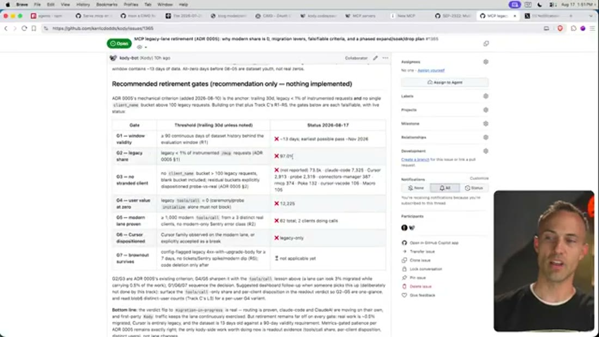

*What it teaches:* the adoption measurement, and the falsifiable criteria built on top of it.
*Corroborated by:* the narration, `&t=1385s` through `&t=1431s` [n13, n14, n15].

Start with the number, because it is startling and it is easy to state. On 2026-08-10, roughly two
weeks after the release, **all 25,288 requests in the window used the legacy lane**. Modern was zero.
`legacyShare` was 1.0. The verdict field read `waiting-for-modern-clients`, and the explanation was
that no `2026-07-28` client had connected yet [n13]. The protocol versions actually observed were
`2025-11-25` at 20,771 requests, unspecified at 4,474, `2025-06-18` at 41 and `2024-11-05` at 2 [n13].

Set that beside section 8's closing line. All four Tier 1 SDKs supported the new revision at
publication [n4], and the number of clients using it was zero. **SDK support and client adoption are
different facts and the gap between them is where every migration timeline goes wrong.** An SDK
speaking a revision means a client *could* adopt it. Whether anyone has is an empirical question, and
almost nobody instruments it.

By the 2026-08-17 readout the picture had moved and had not moved far. Legacy share is 97.0%, the
modern lane carries 62 `tools/call` from 2 clients, and the bottom line's own summary is that "real
work is ~0.5% migrated, Cursor is entirely legacy" [n13].

Two honesty notes before this number travels anywhere. **The source flags its own window**, saying the
"30-day" window really contains about six days of data because the dataset only started recording on
2026-08-05, later described as about thirteen days [n13]. And the issue is **titled** "why modern
share is 0", which was true when it was written on 2026-08-10 and is a week stale by the readout
shown [d3]. The title is the most quotable thing on the page and it is the wrong thing to quote.

The gate table is the part with the longest shelf life, and it is worth reading as a technique rather
than as a status report. Seven gates, each with a threshold and a live pass or fail. G1 requires at
least 90 continuous days of dataset history and currently has about 13, so the earliest possible pass
is around November 2026. G2 requires legacy below 1% and reads 97.0%. G4 requires legacy `tools/call`
at zero and reads 12,225, with an explicit note that ceremony traffic such as a bare `initialize` must
not block retirement on its own. G5 requires at least 1,000 modern `tools/call` from at least three
distinct real clients and reads 62 from 2. G6 requires the Cursor family to be either observed on the
modern lane or explicitly accepted as a break, and reads legacy-only. G7 requires a brownout to
survive seven days, with **code deletion only after** [n14].

**What makes this list worth copying is not the thresholds, which are specific to one server. It is
that every row names the number that would flip it.** A gate written this way converts an argument
into an observation. Nobody has to be persuaded that it is time, and nobody can be persuaded that it
is not, because the criterion was fixed before anyone knew which way it would come out. Notice also
that G4 and G6 are not about volume at all. G4 asks whether the remaining traffic represents real user
value or just protocol ceremony, and G6 asks about one named client family that would be broken by
name. Those are the rows that stop a percentage from hiding a stranded population.

Then the conclusion, which is the part most likely to be dropped from any summary of this source. The
table's own heading reads "Recommended retirement gates (recommendation only - nothing
implemented)", and the bottom line says that retirement "remains far off on every gate", that
"metrics-gated patience per ADR 0005 remains exactly right", and that the only work worth doing now is
gathering more readout evidence, **not lane changes** [n15]. Kent's spoken version is that he expects
this to take months at least before he can drop the old path [n15, `&t=1400s`].

**So the payoff for building the measurement was a decision not to act.** That is worth stating
plainly, because it is easy to read as an anticlimax and it is the opposite. Without the instrument he
would have had the same information everybody else has, which is a spec that shipped, SDKs that
support it, and an intuition about when it is safe to delete things. With it, he has a dated,
falsifiable, public statement of what would have to be true. The homework he sets is exactly this,
generalised past MCP, which is to instrument the legacy paths in your own codebase so that you find
out whether the fallback is actually used rather than guessing [n12, `&t=1447s`].

## Diagram (mental model)

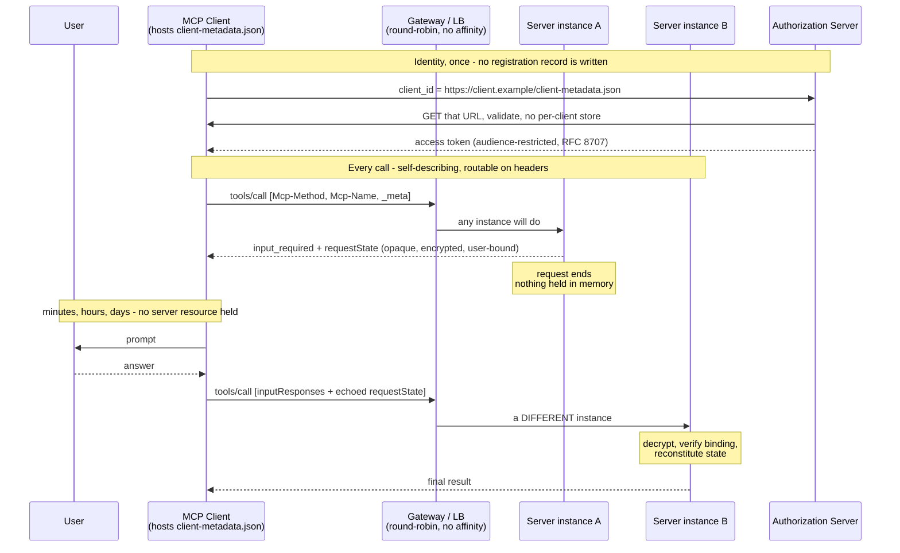

This is a lifecycle diagram, not a component diagram, so it shows one call's journey rather than the
parts of a deployment. **The crux is the pair of gaps: the request ends before the human is asked, and
the answer comes back to a different machine.** Everything else in the specification is in service of
making those two facts safe. It is drawn as a sequence rather than a box diagram because the
load-bearing quantity here is **time** - specifically, the interval between the two `tools/call`
requests, during which the old protocol would have been holding a stream and this one holds nothing.

Note what the diagram forces you to see about the security question. `requestState` crosses from S1 to
the client to S2, and it is the only thing carrying the work forward, which is why "treat it as
untrusted" is not defensive boilerplate. S2 has never seen this conversation. Its only options are to
verify the blob cryptographically or to believe the client. A version of this diagram with a single
server instance would hide that entirely, which is why both instances are drawn even though the happy
path could use one.
*Synthesized from n1, n2, n7, n9, n10.*

## 💡 Terms

| Term | Meaning |
|---|---|
| **CIMD** (Client ID Metadata Document) | An OAuth client identity mechanism where the `client_id` **is** a stable HTTPS URL that the client hosts, serving JSON metadata the authorization server fetches on demand. Replaces registration with retrieval, so no per-client record is stored and trust reduces to domain ownership [n7]. ⚠️ The video's auto-captions render this as "SIMD" throughout. |
| **DCR** (Dynamic Client Registration, RFC 7591) | Registering an OAuth client by API call rather than through a dashboard, so clients and servers that have never met can connect. Deprecated in MCP for two structural reasons: it writes unbounded per-client state, and the `client_id` it mints is not portable [n5]. |
| **MRTR** (Multi Round-Trip Requests) | The replacement for server-initiated elicitation and sampling. A server needing input returns an `input_required` result plus an opaque `requestState`, ending the request; the client later re-sends the original call with `inputResponses` and the echoed state, and any instance can complete it [n9]. |
| **`requestState`** | The opaque blob carrying a server's partial execution context across the two halves of an MRTR exchange, held by the client in between. **Untrusted input by construction**, since a stateless server retains nothing to check it against; guidance is to encrypt it and bind it to the user [n10]. |
| **Elicitation** | A server asking the human a question mid-tool-call, such as a confirmation or a missing parameter. The feature that made statefulness expensive, because the old design held a stream open for the duration of a human decision [n8]. |
| **Lane** (protocol lane) | One of two code paths serving the same route, each owning one protocol era, selected per request by a predicate. Kent's `legacy: 'reject'` on the modern lane keeps the eras disjoint so that lane attribution stays a fact about the client [n11]. |
| **Retirement gate** | A named removal criterion with a threshold and a live measured status, written **before** the removal decision, so the decision is observed rather than argued. Six of Kent's seven currently fail [n14]. |
| **Tier 1 SDK** | The four officially maintained MCP SDKs (TypeScript, Python, Go, C#). All four spoke `2026-07-28` at publication, which is **not** evidence of client adoption [n4, n13]. |

## What to distrust in this note

**This is a T4 source: an independent educator's screencast, unreviewed, with no editor.** That is not
a criticism of its accuracy, which was good everywhere it could be checked, but it sets the ceiling on
what it can establish.

**The specification content is not really this source's evidence.** Kent reads the official blog post
on screen and comments. Where this note cites the release mechanics, the underlying authority is the
MCP blog post, which happens to be visible in the frames. That makes the frames strong evidence of
what the post says and no evidence at all about whether the design is good. Every rationale in
movement 2 that is not visibly on the post is Kent's inference, and section 2 flags the clearest case.

**The adoption measurement is n=1 and the sample is not neutral.** One server, personal-scale, run by
a JavaScript educator, with a client population self-selected by who follows his work. That population
is more Cursor-and-Claude-Code-heavy than the ecosystem average almost certainly is. The window is
worse than the headline suggests, and the source says so itself, containing six to thirteen days
rather than thirty [n13]. **Do not generalise the 0% or the 0.5% to the ecosystem.** What generalises
is the existence of a gap between SDK support and client adoption, and the method that made it
visible.

**The most reusable claims here are among the least corroborated.** The retirement gates are
`single-leg`, visible in a document and never spoken [n14]. The 125-registrations-per-user figure is
`single-leg` with no denominator [n6]. Both are the kind of thing a reader most wants to quote, and
both rest on one artifact.

**One thing was omitted on air that changes the framing**, which is Cloudflare's deprecation of
`McpAgent` [d2]. It is in his own pull request and not in his narration. There is no reason to think
this was deliberate, and the effect is still that the migration sounds more elective than the record
supports.

**Finally, the speaker's relationship to the subject is friendly.** He opens with "they fixed MCP" and
frames critics as having lost their excuse [`&t=0s`]. His technical criticisms are real and specific,
particularly on sampling and logging, so this is enthusiasm rather than promotion. It is still a
source that arrived wanting the release to be good.

## Open questions

- **What does the CIMD specification actually require?** This note has one source describing it and
  one implementation using it. Nobody here has read the spec, and the validation rules are the part
  that decides whether domain ownership is a real control or a formality. *(Deep-research candidate,
  and the highest-value one.)*
- **Does any MCP implementation actually encrypt and bind `requestState`?** Two sources now assert the
  obligation and neither tests it, while S23's own worked example shipped unsigned plaintext
  [n10, claim 181]. A survey of the four Tier 1 SDKs would settle it and would be cheap.
- **Is the adoption gap general or is it this server?** The obvious test is whether any other operator
  has published lane telemetry for `2026-07-28`. If two independent servers show the same shape, the
  claim stops being about Kent's audience.
- **What is the actual decay curve for a deprecated MCP feature?** The policy sets a twelve-month floor
  [n3] and this source suggests real removal is much further out. Nobody has measured how long a
  protocol era survives after deprecation, and every migration plan in the ecosystem is guessing at it.
- **Does `_meta` on every request cost anything measurable?** Claim 180 names the permanent per-request
  cost and no source has quantified it. At high call volumes it is a real number and it is currently a
  rhetorical one.

## Feeds these topics

- [`brain/topics/mcp.md`](../../brain/topics/mcp.md) - the release from an implementer's side, the
  CIMD mechanism, the DCR convergence with S27, and **the first adoption measurement in this brain**.
- [`brain/topics/agent-security.md`](../../brain/topics/agent-security.md) - `requestState` as
  untrusted input with a stated encrypt-and-bind obligation, refining claim 181; and self-asserted
  client identity as the defect CIMD's domain-ownership trust replaces.
- [`brain/topics/agents.md`](../../brain/topics/agents.md) - instrument the seam at migration time,
  because retirement is a measurement you cannot take retroactively.
- [`brain/topics/evals.md`](../../brain/topics/evals.md) - falsifiable gates with pre-committed
  thresholds, as the shape that converts a removal argument into an observation.

---

## Presentation narrative

> **Framing note for the audience.** This is a talk track derived from one 25-minute screencast by an
> independent educator who migrated his own production MCP server onto specification `2026-07-28`. It
> is **not** an ecosystem report. The protocol mechanics are second-sourced against a Google
> engineering post this brain already holds, and are reliable. The adoption figures come from **one
> server over roughly six to thirteen days**, and are an existence proof about a gap rather than a
> rate. Nothing here recommends adopting or delaying anything in your own systems.

### Slide 1 - The protocol was fixed, and that turned out to be the easy part

**MCP shipped the revision everyone asked for, and three weeks later almost nobody was speaking it.**
Specification `2026-07-28` deletes the handshake and the session, so any request can land on any
instance behind a plain round-robin load balancer, and all four officially maintained SDKs supported
it on the day it published [n1, n4]. Then somebody instrumented a real server and counted. Across
25,288 requests, the number from a client speaking the new revision was zero [n13]. The leadership
significance is a timeline one. **A protocol revision is not an event that completes when the
specification merges; it is a distribution problem with a multi-year tail**, and a roadmap treating
SDK availability as the finish line has mispriced everything after it.

This is a scope diagram rather than an architecture one, and it exposes how much of a release is
invisible in its own announcement. Every bullet describes a change to the wire, and none describes
what it takes for the ecosystem to arrive. *Provenance: `visuals/frame_400.jpg`, n1, n2, n16, n17.*

### Slide 2 - Statelessness was bought by moving state to the client, which is now a trust boundary

**The specification did not remove state; it relocated it, and one of the three destinations changed
who you have to trust.** When a server needs an answer from a human mid-call, the old design held an
open stream and an in-flight tool call for the length of a human decision, pinning one instance to one
person's attention [n8]. The new design returns an opaque `requestState` blob, ends the request
holding nothing, and lets the client bring it back later to any instance [n9]. What engineers should
take from this is the consequence the diagram states itself, which is that the server kept nothing to
check the returned blob against, so it "must treat it as untrusted and should encrypt/bind it to the
user" [n10]. The question is therefore not whether statelessness is worth it, because operationally it
plainly is. It is whether your implementation performs that encryption, and **neither source tests a
single implementation** [n10].

This is a state-custody diagram, not a call-flow diagram, and the band worth reading twice names the
blob as untrusted. It is unusual for a design diagram to carry its own threat model, and it does so
here because the property is not enforced anywhere else. *Provenance: `visuals/frame_1310.jpg`, n9,
n10, refining claim 181.*

### Slide 3 - Two operators rejected the same identity mechanism for the same two reasons, independently

**Dynamic Client Registration failed for operational reasons, and we now have that verdict from both
ends of the ecosystem.** This source names two structural defects, which are that the authorization
server writes unbounded per-client state and that the minted `client_id` is portable nowhere [n5]. We
already hold GitHub's account, from a different source, of declining DCR for unbounded app-database
growth and no reliable app identity [claim 222]. One runs an authorization server for millions of
developers and the other a personal assistant, they have no connection, and they produced the same
pair. The leadership significance is that this is no longer one team's opinion about a standard, it is
a structural property confirmed at two very different scales. The first number anyone has attached to
it appears here too, at roughly 125 registrations per user, though **that figure is single-leg with no
denominator and is a direction rather than a measurement** [n6].

This is a failure-mode diagram, not a protocol walkthrough, and the two red bands are the entire
content. Neither is a cryptographic weakness. Both are what happens when a mechanism runs at scale for
a long time, which is the class of problem specifications are worst at anticipating. *Provenance:
`visuals/frame_885.jpg`, n5, n6, corroborating claim 222.*

### Slide 4 - The replacement deletes registration rather than improving it

**CIMD makes the `client_id` a URL the client already hosts, so the authorization server fetches
identity instead of storing it.** No registration record is written, the identifier works at every
authorization server rather than one, and trust reduces to ownership of the domain [n7]. What
engineers should notice is that all three DCR defects vanish from a single change, which is the
signature of a design that removed a step rather than optimising one. The honest boundary is that
domain ownership is a modest guarantee, and it does not establish that a client is trustworthy. What
it does is make the identity claim **attributable and revocable by somebody other than the claimant**,
which a self-asserted string never was, at no operating cost because the web already runs that
machinery.

This is a substitution diagram, not a sequence to follow step by step, and the line carrying the
argument is the subtitle stating there is no per-client store. *Provenance: `visuals/frame_1005.jpg`,
n7.*

### Slide 5 - The instrument has to be built during the migration, not before the deletion

**We shipped both protocol eras behind one route and wrote one telemetry point per request, because
retirement is a measurement and you cannot start a time series retroactively.** A predicate classifies
each request, the 2025 lane is preserved byte-identically, and the modern lane rejects legacy traffic
so that exactly one lane owns each era [n11]. That strictness is what makes the data mean anything,
since a tolerant modern lane would serve both and destroy the attribution. The pull request states the
goal in its own words, which is to make retirement "a metrics decision instead of a guess" [n12]. The
leadership significance is that this is a small, cheap decision whose value arrives years later.
**The cost was part of a 1,249-line diff; the alternative was never being able to safely delete
anything** [n11, n12].

This is an intent diagram rather than a code diagram, and the paragraph worth reading declares why the
telemetry exists. It also records what the narration omits, which is that the underlying framework was
deprecated and feature-frozen, making the migration less elective than it sounds on air [d2].
*Provenance: `visuals/frame_150.jpg`, n11, n12, d2.*

### Slide 6 - The verdict the measurement produced was "wait", and that is the result

**Six of seven retirement gates fail, the recommendation is explicitly that nothing be implemented,
and this is the strongest possible outcome for the exercise.** Each gate names the number that would
flip it, so the decision cannot be argued, only observed. Legacy share must fall below 1% and reads
97.0%. The dataset must carry 90 continuous days and carries about 13, putting the earliest possible
pass around November 2026. One gate asks whether remaining legacy traffic is real user value or
protocol ceremony, and another whether one named client family would be broken [n14]. The bottom line
is that patience "remains exactly right" and the only work worth doing is gathering evidence [n15].
**The decision this supports is `watch`, not `adopt` and not `reject`** - and specifically, to
instrument your own legacy paths now [n12].

This is a decision-criteria diagram, not a status dashboard, and the transferable content is the
threshold column rather than the current-value column. A criterion fixed before anyone knew which way
it would resolve is the difference between a removal that is measured and one that is negotiated.
*Provenance: `visuals/frame_1418.jpg`, n13, n14, n15.*

### Key takeaway message

A protocol revision completes on the wire long before it completes in the ecosystem, and this source
is our first evidence of how wide that gap can be: a specification finished, four SDKs shipping it,
and zero clients speaking it three weeks later. The mechanics of `2026-07-28` are sound and
second-sourced, and the one design cost worth tracking is that statelessness was purchased by handing
server execution state to the client, where it becomes untrusted input nobody has verified anyone
encrypts. This evidence cannot tell us to adopt or wait on MCP itself, because one hobbyist-scale
server over thirteen days cannot inform that. What it supports is copying the discipline rather than
the conclusion, which means instrumenting the seam whenever you run two eras of anything, and writing
down the number that would let you delete the older one at the moment you build it rather than at the
moment you want it gone.
